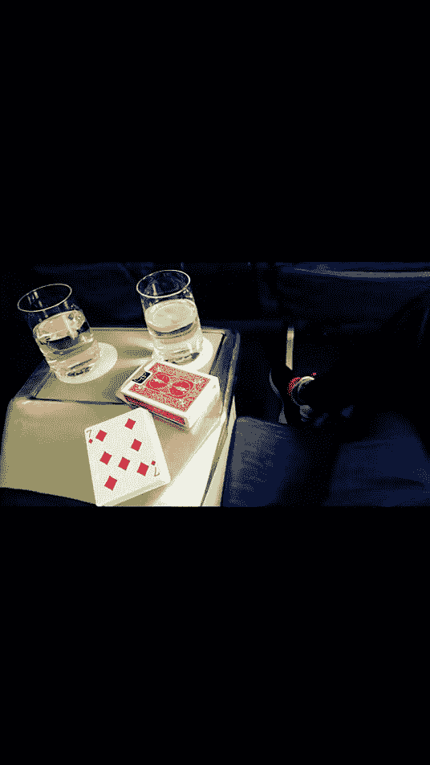
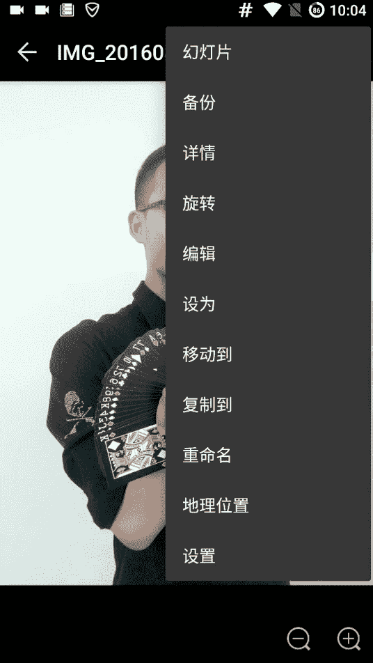
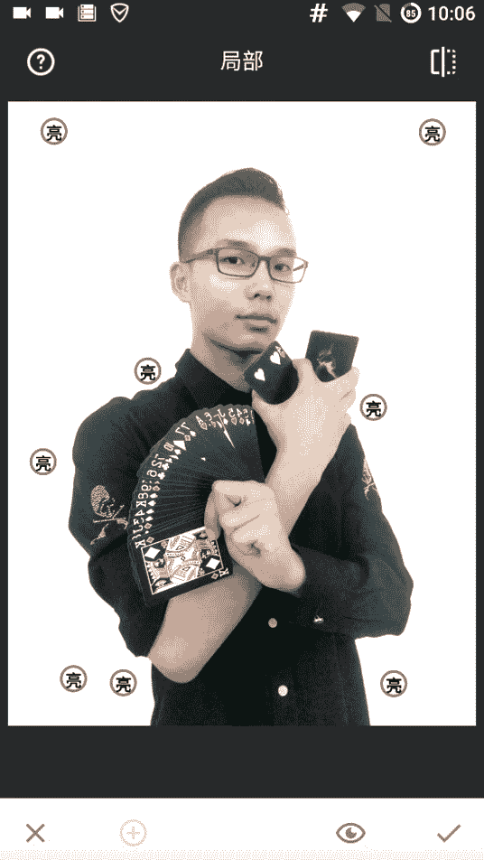

# 1、02niss《修图黑科技》：第八节，修图黑科技——局部优化（14分钟）

嗨，你好，我是miss。今天呢继续给大家讲一下我们的这个黑科技。黑科技。这次呢我们讲一下这个局部的一个修图修图啊，局部修图。我们来看一下我们之前呃照片做照片的时候，我们可能会有一些问题啊。

就比如说我们做了这张照片，我们拿s去弄一下，我们看一下。

就是正常的话，我们可以看到这个边儿上有这个绿的地方，我们就感觉很尴尬，对吧？很不爽，那怎么办呢？就说如果你旁边有一些杂色这样的，然后怎么办？你可以去这样局部调整。就是首先摁一下这个加号，然后你去点这儿。

比如说我们点这个地方，然后我们可以摁住它长摁，然后去移动它的位置，我们注意外边外边这一圈哎，看外边这一圈你们能看到吗？现在是你看棕色棕色，然后到这又黑了，然后外边又白了，这个是选定颜色范围。

它是有算法的，它只基本上只会影响这个同样颜色范围内的东西，然后我们可以双指去扩大。你看大家可以看到我的脸上跟那个绿色关系不大，哎，就是呃相似点不大。然后黑色我的头发的地方也跟这个绿色相似点不大。

所以它上面都没有红色的，明白我？红色是它的影响范围啊。还我皮肤上面就是很浅，然后那个地方那个同样的颜色的地方就很深。那么我们先把它范围调到这样大，这样大小之后呢，我们去把它往右拉去调亮调亮一些。

因为这个比较暗，所以它会有青色的地方看。我们调亮了之后，这个青色的地方就没有了。我们再把这个再调亮，看青色的又又没有了。我们再把这再调一下。ok青色的又没了。稍微调一下。这个一定要摁不要摁点到这个。

点到黑的就很尴尬。你要点这个青色的地方，然后它会自动识别把那个青色的地方，它有这个算法挺好的，把那个青色的地方呢，它会给那个。就是指这个局部效果纸会影响到那个青涩的地方，所以这样子就很好嗯。

OK那这样的话我们可以看到原图呢是什么样的？原图是这样很绿油油的旁边，现在呢就很干净了，干净利索了。但是这个我因为这个照片是背景是白的嘛，所以。

它做成这个样子，其实意义不大哈，我只是给大家示范一下这个局部效果的作用。然后我们看一下这个局部效果它有什么应用呢？我们示范一下啊。

因为局部效果我们之前讲了一个那个涂层的效果，涂层效果相当于是一个局部的一个滤镜，明白了吗？它是把这个呃滤镜的这个效果呢在某个地方有哪个地方没有，它是来选择。那局部效果呢是做一个对图片做一个基础调整。

对比度、亮度饱和度。我们给大家示范一下，就比如说。啊，我们修这个照片，我们感觉哎还嗯这个是没有修的照片啊，还是修了，我我也忘了，不管这个不重要。比如说我们可以可以看到这里有一块绿黄黄黄的东西。

就感觉有点脏。那我们可以看这样上拉下调的话，可以调它的这个呃三个参数啊，这是亮度。第一个我们把亮度稍微调大一点，然后对比度调调低。我们之前讲了。就对比度呢是影响它这个色域啊，对对比度这个概念比较难理解。

这个先我们可以不调对比度。没有关系，我们可以调饱和度，饱和度。我们之前讲的呀，对吧？我们之前效果那些都是饱和度，饱和度过大的话，怎么样黄了，红了，对不对？很暖那种感觉就感觉很刺眼，很炸眼。

那如果太低的话，就怎么样很冷淡黑白，但是我们这个地方我们把它调冷淡一点，我会发现我原来黄看原来是很黄，现在呢就瞬因变干净了，你感觉整个平台变干净了。然后我们可以看到它的作用范围，我们双指看它作用范围呢。

你看这旁边这个白的地方它就不会影响。因为它这个我把这个点呢看控制在了这个看色圈都是黄的地方，看现在是红的。😊，白的你看如果色圈控制到红的地方，那么它的范围看只在这个红的地方。

那如果色圈控制到这个白的地方，那它的范围只在这个白的地方非常神奇。所它的算法非常的好。所以我们把这个色圈控色圈一定要控制住这个点一定要控制。对。那么okK那现在大家来看一下。

我整个画面都感觉变得很干净了，然后对比就稍微调低一点，这样的话我就会感觉非常的非常的舒适，是吧？之前黄黄的，现在呢就很干净，很亮堂是吧。这个是第一个作用，然后呢我们还可以再加一个这个局部。

局部不不仅可以帮我们把一些局部的这种呃，我其实像刚刚把亮变干净，这样的就把黄黄不拉几的变干净。这样的这种去污的一个效果，它还能起到突出一个重心的一个效果。比如说我们在先点加号，然后往这个红的地方。

红的地方放一个这个定要找准色圈。红的地方，我们放一个这样的，把亮度调大一点，对比度稍微加一点，然后饱和度稍微加多一点。这样的话我们可以突出这个红色，你们能感觉到吗？这个红色变艳了。再加一个。

比如说我们把这个七这边哎。数据中心在7上嘛，所以我们把这个七呢也是亮度加一点，对比度加一点，饱和度加一点。然后我们就感觉我们来看一下对比一下。不对比是感觉不到的。其这是原来看注意看这个地方。

就是现在我们感觉能不能感觉到它变亮了，画面的重心变亮了。然后这个时候呢，我们还可以再继续再继续来。这个局部这里呢我们再去看我们这还有个红的地方，红的地方也可以抢清，这是这个是鞋子。

我们给红的地方呢加上一个，哎，一定要找准。色区儿。贾亮哎呀。好的，然后加这个亮度，加上一点点对比度，然后饱和度加大一点，它就非常的扎眼了。看它影响范围我们可以缩小一些，因为它只是影响到这儿。

而且他有算法，所以影响范围那个问题不大。好的，那现在我们再来看一下，我们这个照片呢就是有呃看鞋子，看大家注意鞋子这儿现在是扑克这边亮。然后现在呢再看鞋子这儿。看瞬间就被亮了，那么这个照片就有了一些亮点。

对吧？这是万万花万绿丛中一点红的这种感觉，非常的呃好好看。我们可以突出一些我们想要突出的东西。那一般的话我们可以去突出这个呃亮色，也可以去把那个暗色呢，给它就是那种杂色给它去掉。嗯。

那这个就是一个局部的这个功能。呃，也是比较好用的一个功能。啊，我们刚可以看到我们加了很多局部，但是局之前的那个。这个局部我们觉得这个不干净，这边还是有点黄，我们可以再加一个局部效果。

这个东西它是可以叠加的，反正对吧？叠加也没有关系。看还是有一些黄，我们觉得不太爽，我们就再加亮一点。对不？再稍微低一点。饱和度再低一点。看这样就更干净了。哦，干净多了。看这是之前这是现在唉。

整个就变得更干净了。那么这样的效果呢是可以用在突出我们的这个照片中心的地方。我们之前呢讲了吗？这照片中心在这个七这边，那么我们把这个整个漆周边的环境变亮，然后七这个地方变艳，那么这个它会更抓你的眼球。

明白了吗？包括我们之前讲了。

我们去用那个。

呃，那个图层的效果，我们去修这张照片，对不对？我们现在呢哎呀这好像不是原图吧。我们找原图？我们用图层的效果去修了这张照片，那么效果也是很不错，变得很立体。那么我们用局部效果行不行？局部效果肯定也行。

看我们怎么做，我们要把我们的目标。之前讲了，我们把红色变艳，对不对？红色变艳，我们找一下这个地方。OK红色。把它亮度稍微加一点。要变艳的话，主要在对比度稍微加一点之后饱和度。加一点。

大可以看到我们这个范围影响范围我们可以缩小一点。把它放到中心，然后缩小一点。只影响到这个。这个红色的地方。影响范围看多大啊。OK不要影响到手，影响到手就不太好看了。有点过了，包括都有点过。哎呦。O。

那么这样我们再给那个下一个冰淇淋，我们再加一下。加个buff。但是他这个我们之前讲了嘛，它是有这个算法的。所以大家可以看到我们刚刚是加到这个看冰淇淋，其实分两个色层。看这个我们刚加到了这个深的地方。

我们再给浅的地方再加一个。这个浅色的再加一个。就好了。看这是原来，然后第一步我们给这个左边的这个加了。第二步，我们给这个右边的深层加了。第三步，我们给右边的浅层加了。那么我们再对比一下这个原图。

就是现在是不是感觉它变得更好了呢？那如果想让它对比的更加明显的话，我们还可以给这个白的地方再加那个效。把白的地方跟它对比拉开。你先把它定到白的地方。对，一定要注意那个色圈。色那个很重要。To大一点。

这样的话，它跟白的地方的对比就更明显了。看之前的话是这样的。那现在呢它就变得更明显了，是这种感觉更突出这个红色啊，那么它这个效果也是可以用来去做这个呃局部的去突出这个我们物体的这个主旨的嗯。

那它主要更适合于那种。怎么说呢？并不需要效果。比如说这个照片我们明显试了，我们用那个涂层效果会更好，为什么呢？因为这个照片加上效果呢，它是更有逼格的这样的照片。明白了，如果是涂逼格的话。

我们是要用涂层那个效果它会更好。那什么时候我们用到这个局部效果呢？我们把一个照片，我们涂那种美感的时候。涂的是那种这个事物的一个感觉，整体的感觉。我们今天讲了嘛？我们拍照有两种两种东西。

一种呢是突出这个事物的一个主旨，突出这个事物本身，突出它的颜色。对吧还有另一种是突出整体的感觉。就比如说我们之前有个那个相机上放扑克牌那种那张照片，对吧？它如果是突出这种感觉的话。

我们可以用局部效果的话，会变得更好。因为我们之前讲了嘛，突出感觉，我们要修那个就是呃排跟台阶的那个呃排跟那个对楼梯的那个颜色对比是吧？我们要用这个的话会更加的嗯方便一些。这样，所以就是说。啊。

大家可以去好好感受。因为很多东西吧，它不是说我跟你讲讲了，然后你就能明白，你要你也要去修，然后不断的去去发现这个东西啊，这这样好，这样好，这样好，明白了吗？然后注意一定要修图的时候，把手机亮度调到最高。

是这个是很重要的啊。那这节视频先讲到这里，我们接接天下来继续再给大家讲一些黑科技的内容。这次讲的局部，拜拜。

