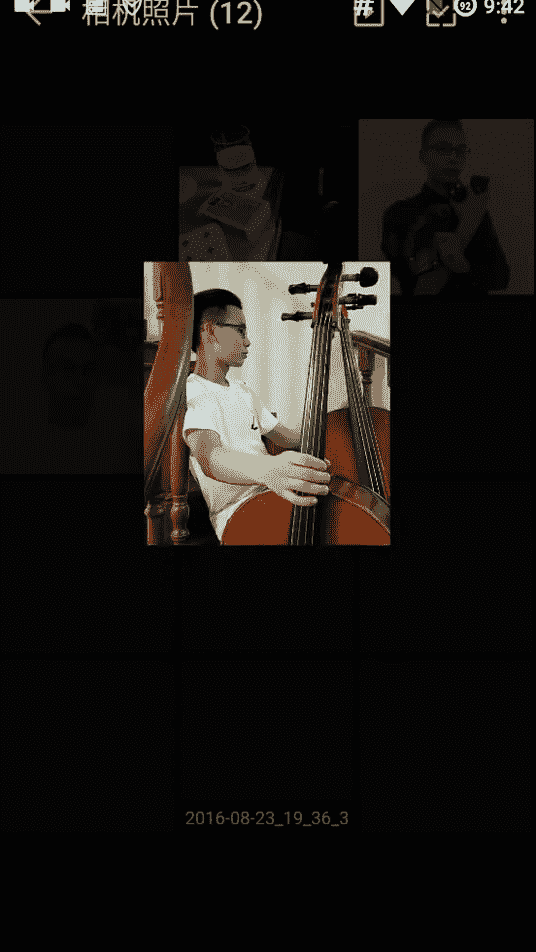
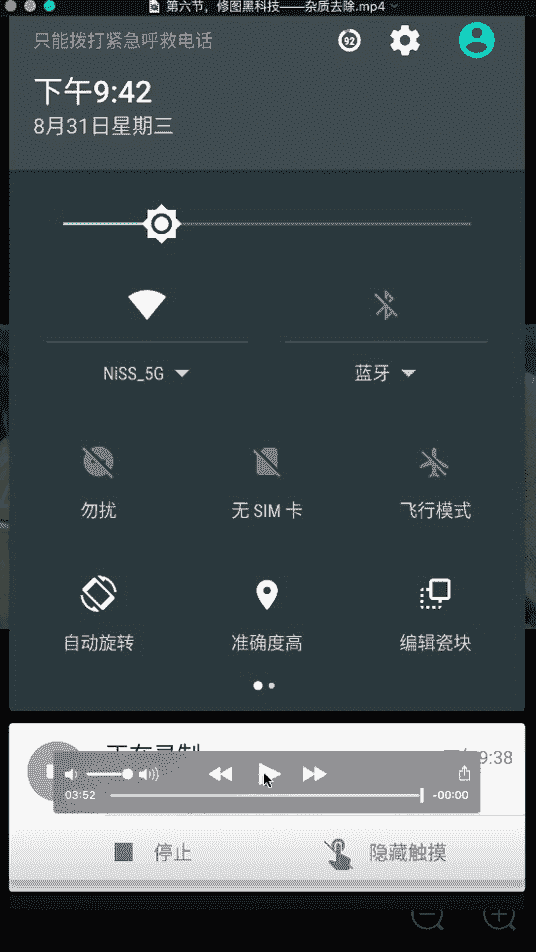

# 1、02niss《修图黑科技》：第六节，修图黑科技——杂质去除（4分钟）

嗨你好，我是miss。今天再给大家讲一个我们的黑科技。这个黑科技呢是。😊，其实是我女朋友教给我的，非常非常神奇。大家可以看到我们先嗯打开人像美容，它有个功能叫这个。😊，稍等祛斑祛痘。这个效果呢。

它其实可以用来去脆呃，就是去除图片中一些你觉得不爽的东西，去除一些杂质。比如说你看啊大家看我这个拍这个照片的时候，这面流了一些汗。可以看在这个位置。那么我把这个一点OK我这个焊就没了。

photoshop里面其实有这个功能，就是内容填充，内容识别填充。然后这个美图秀秀这里面用的呃更更方便，而且它的算法要比snap snapapsed里面也有这个功能叫做污点。

但是美图秀秀这里边的这个祛痘的这个功能的算法要比那个snap seed里面的那个去污点要好。所以我推荐大家用这个祛痘的祛斑祛痘的这个功能去修复一些，我们不太爽的东西。

比如说这个角大家可以看到我这个白衣服，这个后面有个这露说这个角其实是正常的，但是它会让人感觉很不爽。于是呢我就点一下它。😊，他第一次可能因为它比较大，所以他有需要慢慢的我们去点，慢慢把它点没。

把那个黑的地方点没。然后看我们再慢慢的把这个。这个黑的再点没。😔，OK我们可以看到这个这么放大看，虽然是有一些瑕疵，但是我们只要缩小看的话，我们就看不到那个瑕疵点了。看原来是这样的很不爽。

现在呢哎舒服多了，看原来很不爽。😊，继续在这个。就在这个位置，大家可以看到啊。那么原来很不爽，现在好了。OK我们再看到这个琴上还有个这个什么。😊，莫名其妙啊，这个是。一个点。我们再给他。顽固的点。

Haoude。看原来有个点，然后现在给它去除了，舒服多了。然后我们再可以看到这边还有很多的这个。瑕疵。我们都给它处理掉。这个是影响照片的一些细节，看这边也有。All right。现在就就舒适多了。

整个照片你就会感觉我们通过这个来修复一些瑕疵啊。非常的好用。这边也是这个莫名其妙的读出来这是啥东西啊？也不懂。😔，就这些有很多你照片里面会有很多莫名其妙的瑕疵，我们都用这个祛痘的功能。哎。

我为什么在这点了？😔，看原来有很多的这个瑕疵，我们现在都给它去掉了。我们用这个祛痘祛斑祛痘。大家可以看到。就是这个祛斑祛痘。用这个祛斑祛痘的功能去去除我们想要去除的这个瑕疵啊。它是非常好用的。

那这个。可以。对我希望大家能好好用这个功能，这个功能的用处其实挺大的。就比如说我们照片里面有一些呃让让你觉得不爽的地方，我们就可以随时的去用它来呃修复这样子嗯。那这节的这个黑科技就到此为止了。

我们下一节再教大家一些继续教大家一些黑科技的东西啊。

