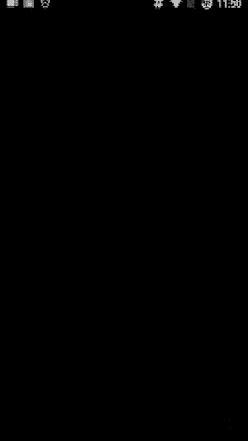

# 1、02niss《修图黑科技》：第四节，人像修图大法（35分钟）

Okay。嗨你好，我是miss。今天给大家讲一下我们延续上节哈，给讲大家讲一下我们人像一个修图的一个核心。那上一节这个就是关于我们的这个实物也好，景色也好，这个修图的课程里面讲了很多这个关键点啊。

题色这样的一些东西。这节呢教大家一些嗯人像修图的一些点吧嗯。😊，这个修好的照片，那么原图呢是一些狗样子，给大家看一下原图那些呃那些那些狗图是怎么给它修成这个好看一些的图。就比如说拿拿这个为例吧。

其实这这我们拿这三张照片为例哈，这这这三张是原图，都是因为都是拿那个我是拿那个努比亚努比亚手机NUBIA手机拍的，它是那个前后置都是1300万这样，所以这些照片都是我这个自拍的。自拍的啊。

🎼就是我定时拿拿个三脚架，然后定时拿前置对着我，然后我可以看着前置，然后摆造型，然后特别傻特别傻，但是都是我自拍的。因为嗯我我不是很相信别人的这个拍照的这个水平啊，但是大家也可以自拍成这个样子啊。

那大家可以看到我们这张照片，它其实做的不咋地啊，但是接下来我教大家如何去改变世界，如何去拯救这个不咋地的照片啊。首先我们进入人像美容，在美图学习里面的人像美容里面打开这张照片，打开了这张照片之后。

就是美图需有两个美容美图哈，一个是这个图片美图，一个是美人像美图，我们要用人像美图，然后用这个一键美颜，一键美颜是干嘛？美颜是关哇，这个音效太傻了，大家一定要把这个美音效给关了，包括什么美颜相机。

如果你们用它我不用我不推荐大家用什么美颜相机360ca这样的东西拍照，你们用系统自带的相机拍照，尤其是iphone的话，你们用那个iphone下面那个右右下角不有三个那个圈嘛，你点开。😊。

用落黄那个效果，你去拍实物拍景色效果非常棒，你们不要用什么那些乱七八糟的相机不好，然后用就算你们用一定要把那声音关了，真的太傻了。而且美图也要把这声音关了啊，太傻了。我们。😊，用这个自带的相机拍照之后。

我们去修它就可以了。因为我可以教大家如何去把一个狗照片修成一个呃好看的照片。然后接下来首先我们可以看到这个这这这有很多种效果哈，但是我们要做的是什么？我们就选第一个自然。

然后底下这个是中高中低这个里面我们选中中之后，我们把这个值调低一些，我们调到70。😊，然后大家一定要记住，就是修人像的一个核心。

没有人会告诉你这个核心的核心就是说把一个屏幕亮度调到最大屏幕亮度调到最大了之后，你再去修图。不然的话你的你修的照片可能在因为姑娘用的手机不一定跟你的手机一样，明白吗？它跟你亮度设置也不一定一样。

如果你在那个低亮度下那个P图，那你很可能你的照片就过量了，但是因为你低亮度没有发现，明白了吗？所以你要在高亮度下P图，这样的话，你的照片不会那种很惨惨的那种很瞎眼的那种量，明白了吧？嗯。

那如果你你这个调到了100，你就会是瞎眼的那种量就很不好。所以我们这个用到70？这个叫拿捏有度看这是原图，这是现在这好了一些。但是我们看这个图有个问题啊，这个图的问题在于这是我自拍的，所以它构图烂了。

构图了，我们要去。😊，嗯我们用了一键美颜之后就不用自动美化了哈，因为一键美颜，然后调到70中，然后70就可以了。我们看一下这个构图看。😊，你们可以感受到哇，这个照片到底到底想干嘛？😊。

看哈我这个照片好好在哪里呢？好在我这个人是卡在我的关键点上的那坏坏在哪里呢？坏在我这个周边呢，有一些乱七八糟的东西太多了。就这个时候我们要用这个剪裁。😊，大家一定要好好去看第一课。

第一节我们好好讲了一些剪材。那第一节我们讲了这个脸这个线放在哪里，眼睛这边对不对？我们把它对齐到这儿，然后尽量让手东西入镜。这样差不多可以再少一点，少一点卡这个这个角，卡这个琴的这个调音调音器的这个角。

ok。这样之后我感觉哇这个世界瞬间就清净了，但是这样其实也也不是很好，等一下，我们重新再来一次。因为为什么呢？😊，因为说我这个琴的中心又没有去把握到，稍微等一下。需要让务跟这个琴。尽量的去。和谐一些。

看。这样的话就很好。我这个手呢在这个关键点上，我的这个这个地方脸又在关键点上就比刚刚好多了。看这样的话我们一看哇哦舒服多了，就比刚刚那个图要舒适多了，这个才是我们想要的一个感觉。你看这张照片的时候。

第一眼看到的就是手。第二眼看到就是脸，那这就是我们要的感觉，看原图，原图是这样，就你看大小就就差了这么一点点，但是呢你看原图你就感觉哎这个这个照片就没有一个重点，看现在照片你就感觉哇。

我这个手和这个脸正在吸引你的这个重点，我的目光正在吸引你，明白吗？这个就是一个很核心的一个地方。那么首先我们就把这个照片从零分P到了1个60分，加了一个自动美颜效果啊，但是这个绝对不是我们的结尾。

如果这是结尾就太坑了啊。😊，还是要用我们的黑科技snps it。然后呢，我们稍微稍微调整一下，我们一开始讲的这个变形效果来，稍微调整一下变形效果，我们调整的目的是什么？稍微等一下。

我先我先要告诉你们的目的才行。我们变形效果调整的目的呢就是让我的这个点。稍微接近我的眼睛一些，所以我们要用水平移动。垂直的话，因为我们已经把它调到眼睛这个高度了，所以不需要了。像垂直的我已经很满意。

就像E复员会一样，我很满意。看这是这是原来这是现在我们来对比一下原来现在哈我只是把它看看这个点，大家看这个点，我这个点是没有没有怎么变的。😊，这点还是在手上。

但是这个点呢会从这个地方挪到了这个这个更靠近眼睛的地方。这样的话，你会感觉到哦。我这个就是你看我这张照片的时候，更会关注到我的眼神。看这是原来。这是现在这是原来。原来。

现在现在的话你会更会关注到我的这个眼神眼神这个位置。因为我把它调的关键点调的更注重这个眼神了。那么我们之之前讲了嘛，我们修人像其实跟这个修这个食物那些是很像的。我们要突出这个手和这个眼神嗯。

那么我们要怎么做呢？我们要用这个我们可以用很多的效果啊，我们我们之前讲了，我们并不是固定要用哪个效果，我们可以用很多的效果达到这个方式。那如果说戏剧这个是OK的。戏剧的话，用戏剧二的话太假了。

你的脸都分层了，这个姑娘一看就觉得啊，你你有病吧，对不对？这样不好，那我们可以看那个每个好坏，你看这个的好处的话，我的手和这个眼神是得到这个突出的，对吧？😊，这个我们稍微调大一点，因为这样的话就太假了。

像假人一样颜色。所以我们把它调到大概接近零的位置。因为大了呢，你看我的皮肤会很红，这样很不好看。然后因为这个照片呢，本身我这个后面的脸照的比较黑。那后边的我有后面会给大家讲黑科技。

黑科技的话可以把这个脸局部调亮，那是美图秀秀的一个黑科技，你们绝对想不到我是怎么做的那在这里。就先不讲了，因为那个操作比较繁琐，那个是一个细节修细节的那个方法。这今天呢先给大家讲一下那个整体啊。

框架讲完，我们再去填充细节啊，不着急，我肯定都会给大家讲详细的，这个你们放心。😊，一直是很靠谱的。我们看一下大了，你看我的脸色马上就变了，大脸色马上就变。看这是原来。

这是现在哎感觉这个整体的这个感觉对比变得更强了，然后我眼神变得更有神了。就是你会更关注到我的那个眼神，因为为什么呢？因为我这个地方大家记记得吧。😊，我之前我的关键点落在这儿，那我之前的图呢。

我关键点的这个地方呢，颜色呢其实没有什么区别。但现在呢你看我明显的能看到这边稍微亮一些。这边稍微那个暗一些，所以我关键点这个有了颜色的对比。这个阴影的这个对比，然后马上你就会把注意力集中在那里。

然后我的手这边呢会比别的地方亮一些，为什么？因为它离得近嘛，所以它有亮。所以这样的话是OK的这是方法。一。那我们看别的为什么不好？我们看这个的话，你看。😊，这什么东西啊？这个这个脸这么黑，就阴阳点。

你看这个的话我不会感觉很阴阳，会感觉很自然的打光。但这个的话我会感觉阴阳脸就感觉很假，很不舒适。这个的话我天哪，我就感觉我我抓到这个重心，就感觉像一个那种几十就几十年前那种照片一样，特别low啊。😊。

但是你看我这个其实我可以试着去让他不太。哎呀，不行，这个拯救不了这个拯救不不要用这个效果，就有的照片是可以用，但是有的是是用不了。你看这样的话，我感觉这个糊成一团了。不行，所以这些效果都不合适。

我们是根据我们的目标需求。看这个明显是最合适的嘛。我们根据我们的目标需求去选效果。但是我们不用那个效果也可以，我们也可以用复古看我们要做的两件事情是什么？

突出我这边的眼睛和突出我的这个手手的话其实不用突出，主要在于我突出这个眼睛。😊，也就是说突怎么突出眼睛呢？就是把我的这个后边的这个颜色跟我的脸的颜色稍微有一个对比，看有个对比。原来的话其实很接近。

现在的话也很接近，其实不好。然后因为我本身人是一个暖色的东西，所以我不要用这这种奇怪的滤镜。看这这这个还行，这是冷色的滤镜看这种蓝的偏蓝的这种冷色的滤镜就不要用因为我人是暖的，明白了吗？冷色的东西。

再用这这些就是偏蓝的那些东西呢，主体颜色偏蓝的啊，你再用这些去修。那我今天我的这个脸重心在我的脸那儿啊，在我的手上，我这个这两个地方我的主体颜色是这个暖色，所以暖的滤镜来修，看看。😊。

这个的话唉这个滤镜其实可以。看啊这个滤镜比较达到我们的效果，它可以让我们这个脸的颜色跟后边去区分开来。如个重新吧。嗯，饱和度不要这。太强了，稍微低一点OK然后把这个最后阴阴影强度把我们的照片再锁定一下。

对，把我们的视线再集中一下。看这是原图，这是现在。你现在的话一看会不会感觉到哇你你看的这个目标，你看这个照片第一眼你就会看到是这。我们看一下原图，现在就会看到我的眼神眼神在看的不这个地方，哎呀。

不因为太太大了。其差唔多。我通过这个运影强度之间降什么，我们去逼近这个这个叫什么关键点，嗯，把关键点往前往我们想要的地方去逼一下，看这是原图。我其我。就对比不是很明显，但现在的一下咔很抓人眼球。

这样修图行不行？那明显是可以的对吧？😊，嗯这个我很讨厌这些，那我用这个行不行？这个也可以，这个稍微改一下。看我们是很全能，我们用哪个都可以用哪个滤镜滤镜根本不可能限制得了我，为什么呢？

因为我知道我要怎么去修，明白了吗？我不是我来选择滤镜，而是我去控制这个滤镜。看经过我的微调之后，哎，你看这个也是非常好，我的重心就在这儿和这儿，对吧？看之前那个图你就感觉不是很明显。😊。

那现在呢马上我的重心就在这儿了，因为颜色的变化，关键点颜色的变化，是不是能感觉到这种感觉吗？这个的话我也可以试着调一下。😊，我们根本就不怕这个滤镜，明白吗？我根本就不是说什么。

你你觉得啊用这个滤镜还是用那个滤镜，就很多人就会觉得我是用哪个软件，用哪个滤镜，根本不是那个问题啊，兄弟们。看这样也是哦，这运音太大了。就运营有小一。Pa。这是原图，是现在你感觉到啊目光就紧在这里。

你的眼神就被我抓住了啊，让大家不要用这HDR警观，就很就很傻。你看这个就很假，明白吗？很假，但是这个也呃也不是不能用，你不能用预设的，你要把它调低一点。😊，是可以其实可以用，但是你不能预设的。

因为它确实能让我们的脸跟后面的颜色就是对比吗？有对比。大家可以看到。😊，对比更强了，它是可以用的，但是不能用预设预设这个50的话，我的天哪，这是什么东西啊，这根本不能看，你把它调低一些。

看我们的目的就达到我们为了我们的目的就冲着我们的目标去修图，而不是说。很死板啊，我教给你们原理，这样才能举一反三看，这样的话也是OK的。那我们用哪个其实都，那我们再用之前讲的这个魅力光阴看啊。

选一个比较合适的啊，这这个大家就不要用哈，这个大家千万不要用，这一用的话就糊了。第三号大家记住，魅力光晕第三号不要用啊，太糊了。那这个的话可以做成一个第5号可以做成一个复古的效果。我我给大家试一下。

有点想你了嗯。就是几十年。哎。就以前以前的那种感觉，就是大概在20年前30年前的那种哎复古的，所这是原图，这是以前那种复古的感觉。那这张照片我很明显我你的注意力就不再集中在这里了。

你的你的就不不再看我的眼神了，你的注意力就集中在我的手上了。那然后其实这张照片主要就是体现出那种复古的感觉，你就不会感觉到这个看能感觉到吧，你的注意力就并不会被我的眼睛抓住，这就是P图的乐趣。😊。

我看用第一个行不行？第一个也可以呀。我们有了这个目标，我们就冲着目标去前进就可以了。是吧。那P图是不是我讲到这儿，你们会不会觉得P图这个东西你看这个也是一种感觉，这是一种那种就不是像古代的。

这是一种比较那种深沉的感觉，这是一种那种怎么说呢？😊，呃，稍微优雅一些的那种感觉，你的你的注意力就不会集中在我的这个眼睛或这儿了啊，你的这张照片就会整体体现出一种感觉。

这张照片的核心可能是更更多在于这个琴上面，琴和这个木质的感觉上面明白了吗？这张照片这样的拼图方法呢就是突出一个感觉。所以大家就明白我们想要突出什么？我们就去呃。让什么东西去呃更更明显。

我们通过我们的调色，让它变得更明显这样子啊。然后我再跟大家讲一件东西，讲一个东西就是说我们。平时我先退出。我们平时哈比如说修完照片了之后啊，我们大家可以看到我们比如说这张照片。

但是我们假如要用到碳探上面看啊。嗯，盼探摸摸那样的地方，它是一个只能让用正方形的啊。那你看我们如果这个东西弄成正方形的话，我们都看之前的构图非常好，我的这个重点重心在我的这眼神和这个手上，那现在的话。

如果我做成1比1的话，我在在座的眼神和手了，要么这样要么这样对吧？我只能取其一，就不是很好，明白了吧？那么我们就可以用这个我们之前讲的那个变形嘛，就变形秀图里面讲的这个美图秀秀美化照片里面的这个加边框。

然后哔一下，这样就好了。那这样的话我们可以看哎。不好意思。好，加边框，这样的话，我们就可以让我们照片呃改动不是很大。我们看看我们的关键点。是有变化，大家可以看到我们的关键点是变化。我们之前讲的嘛。

构图会有这个变化。稍调节一下。这样的照片损失就不是很大呀。我是 baby。嗯，那差不多我们其实这样的一个形式的话，因为这个高度我们要看这个高度高度，对吧？你就OK了。我们记实原原来这个也是OK的。

原来这个大小也是OK的。对为我们的高度在这儿，我们的高度是润的。高度是温，而且我们这两个点的地方就是我们关键点的这个颜色，我们其实稍微小一点点就可以。我们关键点把它取到这个我们对这个颜色这里。

那我们就可以把它就是我们关键点的地方的颜色是在这吗？这个就是肉色。那肉色我们把它跟后边剥离开，就是就是就对比的话，那么这个关键点这个所有颜色这一块的东西，它就自然而然的得到了一个呃叫什么放大嗯。啊。

如果我刚讲的那个稍微有一些抽象，如果你不明白，就微信问我啊，不要不要不好意思，那我们继继续来讲讲这个修图。😊，哎呀，你看我为了给你们讲这个秀图，我把这个自己这个这个像狗一样的照片。

你看这个就拿前置拍的对吧？那这张照片想拍出什么呢？就是我假设这个是一个枪，然后枪在瞄着我嗯，这种感觉就是自拍嗯。但是这个照片的话，你就感觉这个好傻呀，对不对？很傻，因为拿前置拍的我们没有办法。

因而且光线也不是很足，所以你看这个有点有点这个暗暗暗暗的那种模糊的感觉啊，对吧？脸上就感觉有有什么东西莫名其妙的。😊，🎼光线不足，前置的话，你这常拍的话，光线就会不足。而且你正常室内拍摄的话。

如果你不补光的话，光线不足很常见。所以要我去把这个东西给弥补上，弥补上啊。但我们可以看到这个后面背景是因为光线不足，所以它有点发青啊。所以这个这个东西的话，我们待会儿再讲怎么去解决。

我们首先这是还是像刚刚一样，一键美颜，大家注意这个哎妈呀，我真的好讨厌这个音效，大家一定要把这音效关了啊。它到70，这是原图。其0其实没有什么没有什么其实。

他只是把这个这种光线给你带来的对呃脸上的一些不稳定因素给它去掉。对吧这因为光线你看就显得有点黑黑，这脸上就有点黑杂杂咋杂的东西，光线的问题嘛。哎，现在的话你看哎这脸上就舒服多了。就是相当于给你打了个光。

懂吧？一键美颜其实就相当于给你打了个光。这样的话，你后面去修起来就顺手很多。嗯，OK我们要给它修出来一种那种有点稍微有一点慌张，有一点那种紧张的感觉。因为我感觉是那种不是很冷酷。

看我的表情非常的非常的尴尬，非常的有点害怕的感觉，对吧？那我们要去就给它修出这种感觉。首先呢我们去把它检查一下，我们之前的那个图的，我们之前的构图太太狗了，像一个。

就我们之前看我们之前的构图特别莫名其妙。看对吧。无主题，那现在的话我们去。看上沿卡在这个这个顶端，这个圈儿最顶端稍微上面一点点，然后我们这样剪一下，因为正方形的话，构图是大概是呃。不行不行，这样不行。

大家可以感到感觉到我这个照片是漫无目的的，就没有重心。所以我们回来再重新来检查一下。剪的不是很好。应该再往上面点，就是看一下，稍微等一下。OK我们把我们的这个再往上一些。

OK让这个地方这个线到下巴到这个地方往上就是。就这差就是让我的脑袋呢尽量在这个这个框内啊，建在这个框内。That it out。OK。这样的话就会好好一些。这样的话是给给人感觉到这种。就是居高临下。

就是感觉到他比我要强。他在胁迫我的那种感觉，就是那种害怕的感觉。有一些这样的感觉。能突出我们的主题，我们主题就要表表达一种那种害怕的感觉。那么接下来呢我们去。修图了。诶。这样让我很尴尬呀。哦。

我刚刚是去啊，我刚我不能在这儿哎。This。😔，稍微等一下，我找一下 snap。😔，打开 snap太着。我们再用snap C打开，正常你们用snap C打开的话，不会有这样的问题。因我这个是为了录屏。

因为录屏给大家讲课，新买了这个这个手机，然后。这比比较蛋疼。我想突出那种感觉的话，比如说我们用这个这个的话是是不是可以的。看一下。😔，哎，其实不是很好，因为你看我的脸就这样分层变色就非常的傻。明白了吧？

我们之前讲到了，这个非常不自然，我们需要让整体画面变自然一些。然后这个的话就太亮了。问现在这是什么东西啊，对不对？这个的话太暗了，你是就莫名其妙的，是不是？那么这个时候呢我们再去看一种这个别的东西。

我们看一下啊，这个太模糊了。那第三个季录不要用太模糊了，对吧？就像那个拍狐狸一样，那这个其实也不是很适合这里边，所以呢这个时候我们一般拍呃做人像的时候，我们有两个选择，一般的话我们会用戏剧效果的。

第一个，但是这个里面不是很适用，那接下来我们会试用到啊。😊，我们可以用复古的这个效果。那因为我我是那个偏那个什么，我的脸是那个暖色调，所以大家记住用暖色调滤镜，我选一个比较顺眼的。OK这个就可以。好。

我们要去修图了，我们要修出那种感觉的话，我们要先看我们这个照片，我看的这个照片的话，我想要两点是什么？第一点是你关注到我的脑袋。第二点是你关注到我的这个扑克。所以我要去。😊，嗯，稍微休息。

亮度不不要调高，亮度调高的话非现傻，我给你看一下，就就亮度调高啊，就脸就糊了，脸就没有了，就没有轮廓感了，不要调高，姑娘会觉得P大P了那样，就像磨皮磨过了一样，非常不好，那一点点就可以了。

然后饱和度记住，在我们这讲了不要太高。太高会很红，我们不希望我们的脸红扑扑的像那个高。高原反应是吧？好，那么这个照片之前的话，因为我们没有在构图线上，所以我们需要用这个阴影。去锁定看。这是之前。

现在你就会把你的视线啪一下就锁定在我的这个脸上，就是我这个这个这个莫名其妙我的这个表情的脸上面。我们通过晕影来控制我们的这个。因为之前我们构图的时候没有办法没有办法去把这个图给弄好。

所以我们只能通过这个晕影去控制晕影能够改变我们的这个视觉中心啊，那我给给大家感受一下，如果晕影不停不开，那么这个照片是这样的。你会感觉你漫无目的，但是我晕隐开的话，你一下就被锁定了。

我就把你的视线锁定在这个范围内了。明白了吗？就很小的大概是这样的一个哎。不能画大。哦，这样也。就锁定在了这个范围内。嗯。所这个就是我们修图的这个呃一个方式啊。那接下来我们再给大家讲讲一下。

这是因为这个是一个那种哎近照近照是拍这一种是怎么说呢？拍的是一种叫什么五官，这种，我们要突出我们的这个表情啊，我们要突出我们的这个五官这样的东西。所以我刚刚讲的是我要去突出这个表情。

我这个害怕的这种表情的话，我需要把我的这个表情来锁定嘛。那接下来我们再这个会稍微远。我们这个的话，这个就相当于一个远照就是没P的照片啊。远照的话是突出那种感觉。我们刚刚讲了嘛，突出那种眼神的感觉。

那这张照片也是你看大家可以看到我们这个因为暗就是这个光线的问题。你看这就感觉很暗沉，对不对？就很不好。没有办法，你自拍的话会经常遇到这种。如果你拿个什么。🎼对呀。

你让聊机聊机你你朋友如果不是很会拍照的话，你还不如拿三手架自拍，这是真的。然后你自拍的话会面临到这些问题。那我教大家怎么去解决这些问题。其实别朋友帮你拍照拍照水水平不是很好的话。

也会遇到这种光线不足的问题。同时或者说你在背光的情况下，也会遇到这样的问题。所以我们来讲解一下。😊，你们这个把它调到70还是老样子，中，这个是中自然中70okK感到这个脸脸。就现在打了个光，我有光了。

脸上有光了。哎呀，我还要给大家讲这种小段子，对不对？来增加大家的这个观看的时候的这个感受，让你们观看的时候感觉更舒适一些。那这样的话就感觉不是很好。没有那种感觉。对吧所以我们要还是要sneps。😊。

看一下。好。这张照片我们要我们看到这张照片的时候呢，因为sn的这个构图的话是这样子的，人像构图跟刚刚那个东西的构图不一样，它的话呢是更偏向于怎么说呢？我把这个人的脑袋呢卡在这两条线，这是一个哎呀。

大家可以看到这两条线吧，这条线跟这条线的中间这样子，我的构图就会好一些。呃，我没有必要卡到哪个点上，我卡到这个点上就很奇怪，我又不是全身照，对不对？一个脸的话，你就让脸放到这个这两条线的中间就可以了。

大家拍照的时候，请一定要开启这个构图线，这个东西真的很有用，真的真的很有用。然后我们看一下拿这个行不行。我平时如果稍微远一点，不是像刚刚那样大脸自拍的话，就刚刚那属于大脸自拍，这属于小脸自拍。

然后之前那个拿提前的那个属于是远景，哎，稍微远一点了啊，喝口水。然后这种稍微就是远一点的，就是小脸自拍的话，我们怎么去做呢？我们拿第一个看戏剧一就可以了，不用戏剧2，戏剧二看脸上就很莫名其妙的啊。

就像就像很暗沉一样。😊，就很不好，那这个明亮的话就这是什么东西太亮了，对不对？那这个也可以做，你把这个调低，哎呀，调低这个这个颜色的问题，颜色背景白色的，因为背景白色，所以你调的再低也不行，对吧？

这像一项一样，这个千万不要不要用这个照片就是人的照片不要用最后两个人的照片的话，我建议大家就用这个戏剧一，戏剧二也不要用啊，我们正常默认的这个90就可以。😊，然后呢，我们把脸色调的正常一点。ok。

看这是原来现在头更有那种那种感觉。看之前有范儿了吧，是吧，这原来这些的那现在我们会面临一个问题，问题是什么呢？我们看这这个旁边。😊，这是什么东西呀？我们并不想要这些东西，对不对？那我们有两种方法。

我们可以把这个滤行强度降低一些，对吧？我们也可以补降，我们很任性，我们就把这个弄成这么大。然后呢，我们去想一下，我们怎么去把旁边那个。那个莫名其妙的东西给他弄低呢，我们试着用一下复古去给他综合一下。

我们记着我们人是暖色，所以用暖色的。好，我们可以去这么坐。那加个这样的效果的话，这样的话我的就是整个这照片里面我就更突出了。这样子。那么但是我们可以看到这个。

这个我我本来是呃以为那个白那个叫什么这个边会去除，但是这个边会去除，但是没想么没有去除啊。没有关系，我们再继续P，我们再寻找。因为我们知道我们的目的之后，我们想怎么P就怎么P，这是我们的世界，对不对？

我们不需要被限制，我们可以试着用一下这个HDR景观，我教你们用一下，因为不教你们的话，你们也太亏了，对不对？这个50我们调低一些，因为50的话，你看很假。这这这这什么东西就很假啊。像画出来的一样。

所我们大概调到这个20左右的这样的一个水平，亮度稍微有一点，饱和度稍微稍微要么负的其实也可以负的饱和度有时候会更好。因为它会让你显得更舒适一些，因为饱和度高了，你你就会这样也又像画的一样了。

那么我们要做的是像拍的一样，不是像画的一样，这是我们要达到的一个效果。看这样的话整体就感觉会更好了一些。这是原图。这是现在就感觉线条感会更强啊，这样线条感更强了之后呢，我们马上可以加一个。

就是我们也可以不用这个戏剧效果。因为戏剧效果后边暗的时候可能会出现像刚刚那种青涩的情况。再加个这个戏剧效果就可以了。啊，我们再加个这个复古的效果，我们可以不加，因为刚刚那样也可以的。本身白背景。啊。

我们对了，我我想告诉你们的是人像有一种风格叫日系风格，是这样的，你可以用蓝色的。就是但是这个一般是日本那个就是就是就是这个这个这个颜色就很正，这个颜色是可以的。

但是这个一般是那种日本小姑娘去海边玩的那种很清新的感觉，你们能你们能明能想象出来吗？这是日日本小姑娘爱用的风格，这样做是可以的。但是如果你是找那种很。😊，就是五官很精致的那种小伙子的话，我觉得可以。

但是像我这种长得比较长得颜值不行的人，就不能用这种那个暖色调呃，冷色调的这个效果。而长到很帅的小伙子的话，可以用这个效果，其实会挺好看的，有范儿嗯。😊，但是如果你是像我一样长得不好看，那那不行。

那就不要用那个效果了。然后大家看这个到期。饱和度稍微低一点，因为刚我们已经调低了，样式强度可以可以。好，我们再通过这个阴影来强制锁定我们的视线，这是原图。就感觉哎哎现在就感觉自然多了。

原图像抠下来的一样。现在的话就感觉自然多了，明白了吗？感觉到了吗？一瞬间的时间非常好玩啊。😊，再来去想一下啊，这个其实还有一种呃叫什么怎么说，你可以调这个色调和对比度，你可以通过色调对比度来做。

但是我其实并不是说很是呃很建议大家，因为那个比较麻烦，我自己都懒得去这么做。然后有的时候你可以加一些这个结构哈，我现在讲的结构了啊，这个的话会让你的这个棱角更分明一些。😊，能你们能感觉到吗？这是原图。

这是现在。就差别其实很细微，就调大了的话，你们其实能感。就是他会让你的这个棱角呢更更分明一些。稍微有一些的话，你感觉不出来，你可能看不出来它具体就是变化在哪里。锐化我稍微加一点点就可以了。

你可能感觉不出来它变化在哪里，但是实际上会让你的这个视觉感受更舒适。那这样。我们这个照片就可以啊结束了。那大家就是要记住这种三种不同风格的这照片呢，就是。怎么说？啊，这个这个。

大家要记住这种三种不同风格的照片，每种照片呢要表达的东西是什么？那么这张照片我们要表达的是这种啊眼神的感觉和这个整体照片的意境。那么修的方法就是第一种方法。

然后我们这这种照片就是远的这种照片是需要这种我们按点构图，就有点像实物和景色一样哎呦。对，这样我们得需要用到构图点啊。那如果是我们正常的自拍的话。哦像这种自拍的话，我们就可以用那种。

嗯。让我们的脑袋呢尽量在这个两个点中间，就不要偏离的太远的这样的方式。因为我们这个照片呢，本身它这个扑克也是照中心的一部分。

所以相当于我这个中心呢就你看我这段这条线到耳朵的距离跟这条线到这儿的距离其实很接近，明白了吗？就是这儿到排尾跟这儿到耳朵的距离其实很接近。这样的话，保证了我人和扑克都在照片的中心。

那么我们两个都是一个焦点，就注意的点啊。那么还有这样的照片的话，我们就是让我们脑袋看一下构图。让我们的脑袋呢尽量在这个这两个两条线的中间，那么基本就OK了。

那么具体的怎么去拍人像呃呃后面还会给大家讲那个怎么去把你的腿拍出那个长腿的效果，就是朋友帮你拍的话，怎么去拍出大长腿的效果。这个在我们的后边拍照那个教程的实例里面会讲。那这节的人像的修图就到此为止了。

就比人像的其实要比那个什么更简比那个实物也好，景物也好更简单一些。因为人的话可调节的点会更少一些，对吧？因为人的肤色就就那么一个颜色是吧？你只要不调的特别夸张，不特别怪异，就那个可以了。

那我们发挥就因为我们这些照片，这种近的照片都是看五官的对吧？所以只要让我们的五官正常一些就okK了。那如果是这种远的照片看意境的照片，我们是有很大的调节空间。刚刚也给大家试了嘛。但这种五官的照片呢话。

我们只要让他不要太夸张，不要白的太夸张，不要太那个过量，那就O了嗯。那本节视频就到此为止了，我们下节视频再继续给大家讲一些好玩的内容。我是miss，下期再见，拜拜。😊。

