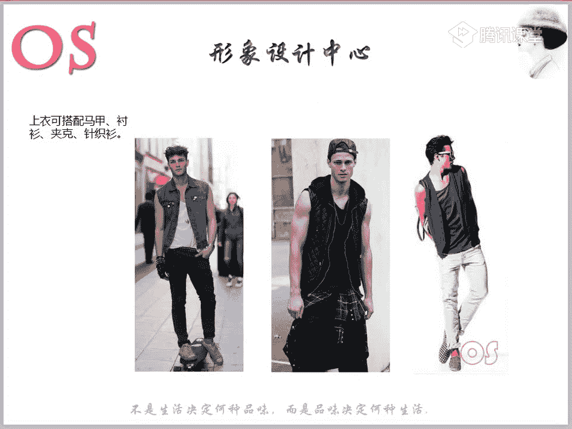
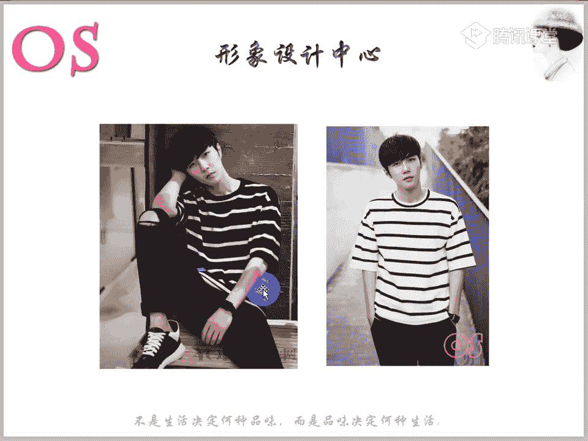
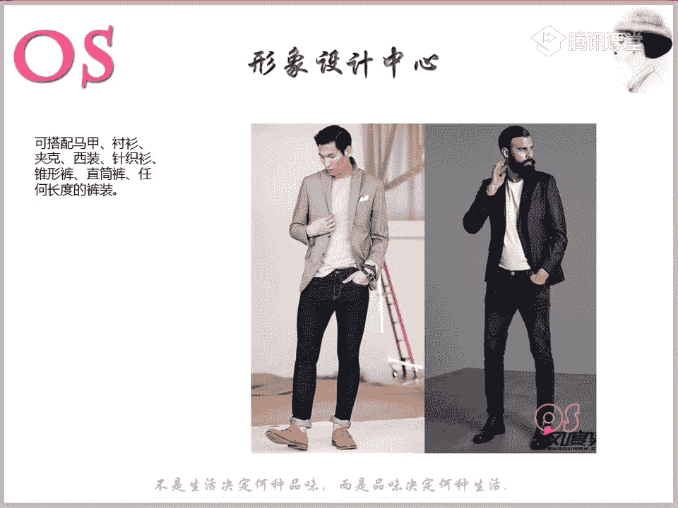
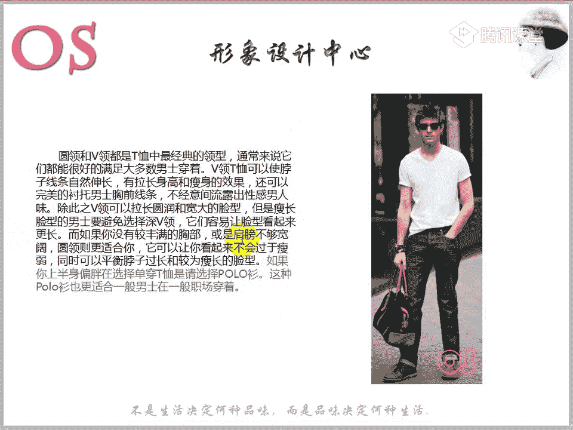
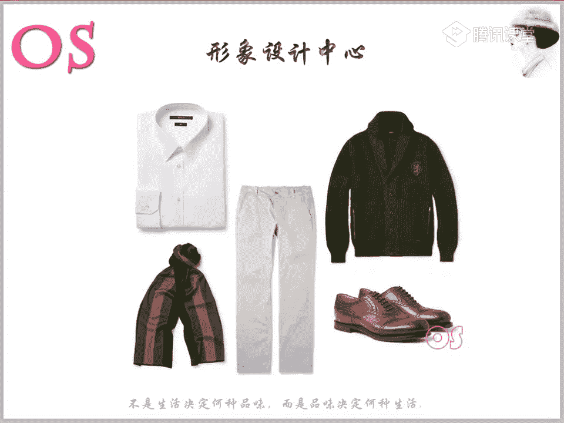
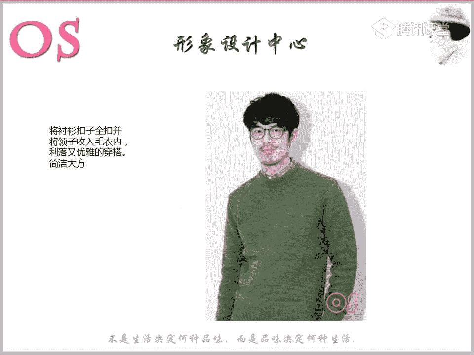
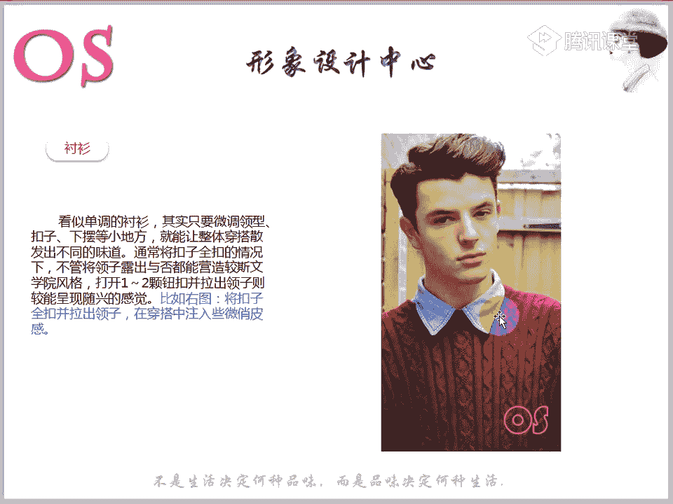
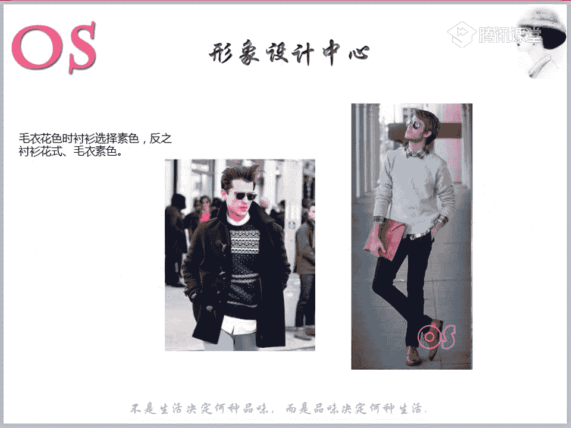
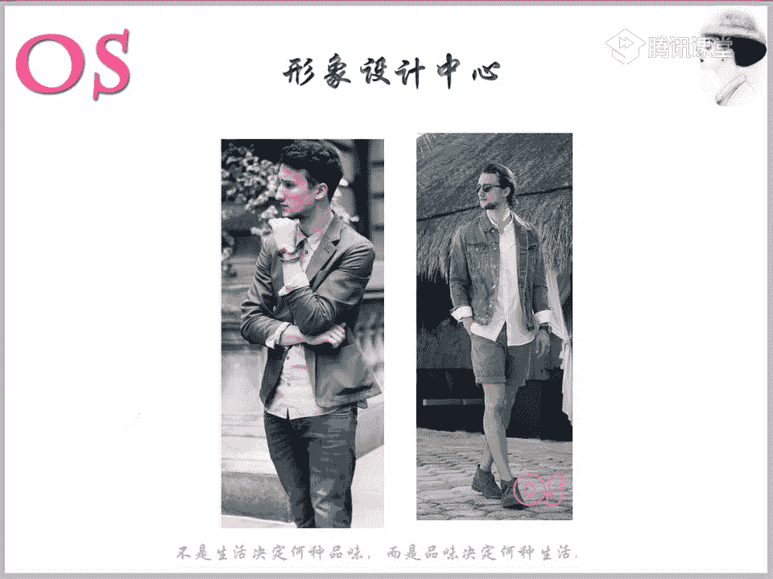
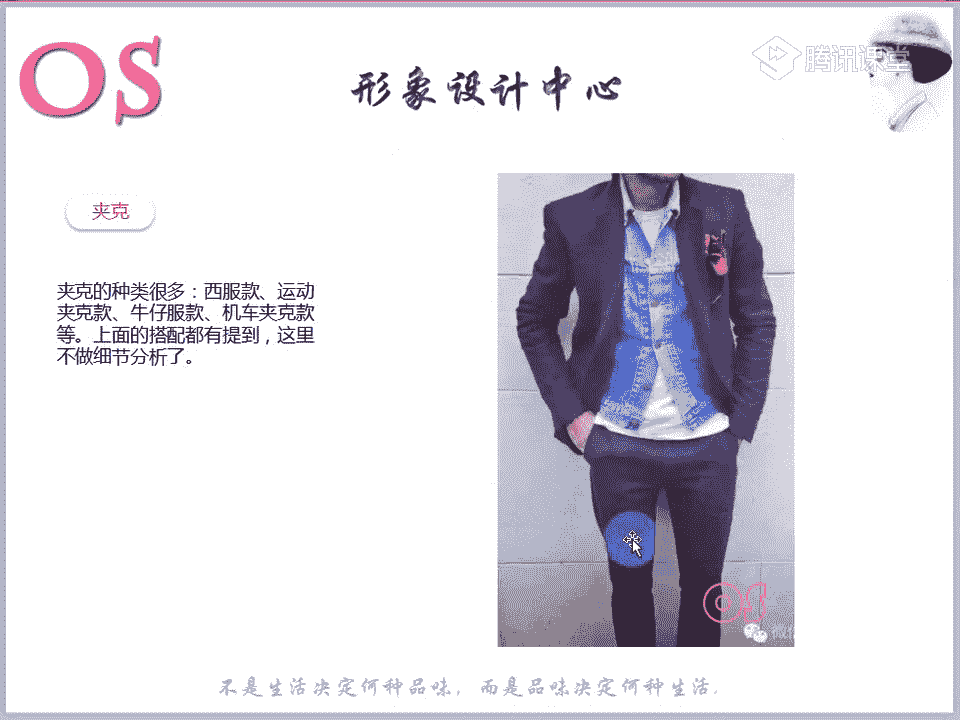

# 1、03OS男士形象VIP班《形象课》：第10节、服装单品的理想搭配

好，大家晚上好，欢迎大家来到我们OS男士班的VIP课程。我是本节课的主讲老师舒阳啊，那我们现在啊嗯发现有些同学有这样的一个迟到的一个现象。然后呢，如果说今天没办法来上课的，一定要记得提前跟老师打招呼。

然后准时进课堂。😊，还有一个呢就是还是要再强调一下我们作业的事情。然后老师刚才去检查作业的时候，发现，居然第九节没一个同学在交作业啊。

如果说嗯有一些个别因素的一些同学没办法及时交作业的那你们也要记得跟老师去打个招呼。因为等等到我们所有的课程都结束之后，我们是会有考核的，尤其是我们一些顾问班的同学哦，好。

那今天的知识呢就是我们男士班的第十节课了啊。第十节课会讲到我们的服装的单品的一个理想的搭配。那么老师在接下来讲的这样的一些单品中，可能我们很多同学在生活中也会去运用到。

但是呢唉不管怎么样去讲到一些什么样的一些知识啊，但是你们要用就是胆大心细的去发现老师讲的一些知识点。因为我会把一些知识点，可能你们没有想到的着重去提提示出来。也就是说其实呢穿搭哦都差不多。

确实是差不多哦。但是呢要靠自己呢去发现一些细节。因为很多细节是出品的一些关键哦。😊，好，我想等老师帮我诊断好了，一起补上，我又好好做笔记了。好，那没问题哦。呃我们呃我们纳丹同学，我知道是新同学哦。😊。

然后诊断的话呢，我们大概是2到3天会出结果。所以说老师结果出来呢，就会及时的通知你好，那我们接着呢就来看今天的一个学习的一些内容啊。那本节课的一个重点呢就是我们各服装单品的一个理想搭配。

那么对大家一个要求呢，也就是熟知我们这样的一些单品搭配的一些技巧。然后呢把一些小的细节呢记录下来。那么其实这节课也要结合我们之前所讲到的这样的一些呃服装款式的风格。然后呢。

还有包括我们会讲到的这样的一些衬衫呀呃裤子啊等等的啊，这样的一些细节都要去结合起来。我相信大家哦学完我们前几节的课，应该是对于自己的风格会有了一个哦完整的一个认知，对不对？应该会有一个大概的一个概念啊。

所以说呢我们在做这样的一个单品搭配的时候呢，其实也要考虑到自身的风格的哦，不能说唉老师你找的这样的一个模特啊，她穿搭很好看。我能不能就完完全全套用呢？其实有一些细节，你们要懂得去进行变通。

也就是说我说的这样的一个细节是什么呢？比如说我们的服装的款式，对不对？同样都是牛仔外套，而有的牛仔外套，你会发现它相对来说它的量感偏小，而有的牛仔外套量感偏大啊。等到我们讲到我们服装的风格的时候呢。

老师这样的一些量感的大和小都会列出来跟大家来展示。😊。

好，我们看到呢第一个第一个单品呢就是我们的背心啊，这个要提一下，我们很多男士可能非常喜欢穿背心啊。那么背心呢因为它非常的清透，又很呢呃轻薄又很透气啊。所以说呢像我们夏季的话，出街也好，度假也好。

是我们男士啊，一般来说每一位男士都应该有这样的一件单品啊，也是你们的一个穿搭的一个利器。而且呢像这样的一件简简单的单品，你会发现哎搭起来其实它会非常的百搭哦，可能你单穿能用上。

你叠穿的时候还能够去用上啊。那么款式的话呢，我们选择黑白灰相对来说是非常保险的。但是印花的话呢，比如说像这样的一些几何呀，卡通啊字母标语啊，也是可以的。但是呢像我们如果说你要选择卡通。

我们就要考虑到风格。那这里呢我要提我要问一下啊，哎，大家觉得卡通的印花这样的一个背心更适合哪个风格的男士去穿着。好，我们在场的同学啊可以回答一下老师这个问题，你们觉得卡通的这样的一个印花T恤啊。

就是我们的背心更适合哪个风格人去穿。好，我们的漫长日子说到阳光前卫啊，非常好非常好。嗯，如果说我们在再把范围再扩大一下，你们觉得还有哪些风格其实也可以去穿。😊，还有哪些风格也可以去穿？有没有想到？

其实可以加前提条件啊，可以加一些前提条件的。好，那老师给你们个提醒好不好？其实如果说呢我们年轻一点的哦，年轻一点的自然风格也是可以的，年轻一点的自然风格去穿卡通也是可以的。嗯。

所以呢其实在这里就是要告诉大家。那包括等到老师讲到服装风格的时候呢，同样还是会去说啊，同样还是会说的，就是我们在选择就是在判断啊，尤其是以后我们在场的这几位同学以后都是高级班的，对不对？

你们再去判断这件衣服，哎适不适合我个人穿，或者说它适合哪些风格去穿的时候呢，你们可以去首先考虑的就是哎哪些风格可以去穿它，而不要说看到这件衣服，你就去看他说哎他是哪个风格，把它固定化哦。

我们而是要想一下这件衣服哪些风格可以去穿，而不要想着就是这件衣服是什么风格的，能不能理解老师所说的，能理解同学跟老师扣个一。所以说就是不要把自己的想法呢哦固在里面，不要把它固在这个框框里面。

而是要去打开哦。也就是说看到这件衣服，你不要想到唉这这件衣服是什么风格的，而是想一想这件衣服哪些风格的人可以去穿。好，那我们呢回到这里啊，所以说呢。这样的一些带印花的，带字母的。

带卡通的呢也是非常合适的。还有一定的还有就是要注意一下哦，哎，除非是在健身房，那么我们唉选择的这样的一个背心呢不可以太过于紧身啊，也就是说合体一点，或者说适当的一个宽松都是可以的。那么像这样的一个背心。

我们在夏季去穿单穿的时候呢，一定要注意啊，场合的问题啊，场合肯定是适合在一些休闲场合，对不对？千万不要在职业场合穿穿穿进去了啊。啊，有一些公司是非常随便的，可能对员工的要求啊。

着装要求是没有没有任何要求的，可能也会发现有一些男士穿着背心在我们的办公室。所以说千万要记得这样的一个单品是适合在休闲场合去穿的，或者说在度假啊。那么单穿的时候呢，最好就是去搭配短裤。

因为它搭配起来的协调度呢会更高，也会呢更帅气啊，搭配我们的长裤可能效果不是那么的好，搭短裤的话呢更适合你可以想象一下，搭配完完全全的长裤的话，如果说没有一些饰品的一个辅助会未免太过于单调。

协调度不是很高。所以说我们单穿的时候可以去配我们的五分裤。饰品非常重要，再强调一下我们之前有说过，对不对？饰频很重要啊，一定其实在任何的是一个场合中跟自己的一个服装中一定要去多做一些配饰的一个强调。

画龙点睛。那如果说我们要去跟一些其他单品搭配的时候呢，可以去搭配马甲，或者说唉跟我们的衬衫啊，我们的夹克，我们的针织衫这类型的都是可以的。唉，甚至说跟我们的这样的一些西装啊，休闲款式的西装都是。

没有任何哦问题的，不用有任何的担心。只是说我们在选择服装的色彩的时候呢，要按照接下来下一节课我们会讲到的这样的一个服装的色彩的一个搭配，以及呢按照自己的风格去做选择。

那么我们之前在讲我们单品的时候都有去跟大家提到啊，像讲毛衣的时候，我们各个风格在选择毛衣，选择夹克的时候要注意的一些细节，这个东西都是要结合起来一起用的。好，这个就是我们的T恤啊，这样的一个背心啊。

一个背心。唉，跟我们这样的一个休闲款式的服装，毛衣嗯，以及我们的衬衫，或者说跟我们的夹克都是OK的。

那么图案的选择可以按照呢我们不同的风格去做选择。就像刚才老师提的问题啊，一定要记住。嗯，那接下来呢我们就看到我们的T恤。那T恤的话呢也是我们男士哦穿着做休闲装的不可缺失的一件单品。

一般在休闲场合是会大量的去运用到的。那么T恤如果去跟牛仔裤搭配呢非常的简单，而且呢也不失帅气，对不对？而且也凸显男人的魅力，但是要跟大家说一下，其实像牛仔裤这个物品的话呢，也不是说所有的风格哦。

它穿起来都很合适。所以说在选择的时候呢，一定要注意一些细节。什么样的一个细节呢？啊，我们先把这样的一个疑问先埋在啊，先埋在心里。一会儿老师讲到我们这样的一个其他搭配的时候呢，会跟大家提到。😊，好。

在选择T恤的时候呢，我们一定要注意几个点。第一个呢就是我们一定要注意T恤的长度，不能够盖住你整个臀部，不然的话呢会显得你的整个身材会造成腿短的这样的一个危险的状况。所以说呢我们其实在选择T恤也好。

还是说选择我们休闲款式的衬衫也好。其实最好的这样的一个长度就是千万呢不要超过你裤子啊拉链中间的这样的一个位置。那第二个呢就是我们袖子的一个长度啊。唉，其实袖子长度没有选择对的话。

也会容易造成的手臂短的这样一个现象。所以说呢我们在选择T恤袖子的时候呢，一定要不要超过你上臂长短的一半。唉，也就是说我们不要去超过我们上臂的哦2分之1是比较合适的啊，可以呢短于或者说刚好是2分之1。

但是千万不要超过那么另外呢就是我们要保证穿着的一个舒适度呢，必避免过于紧身啊。这个这样这位男士所穿着的就不算紧身啊，它不是算非常的紧身。所以说这样的一个合适度是可以的啊，或者说我们适当的稍微宽松一点。

但是不可以太过于贴哦，仅紧的包裹住的不不适合。

好，那我们呢看到几个基础搭配的这个颜色。第一个就是我们的白色。那么白色呢唉搭配的话是非常百搭的，对不对？所以说跟我们这样的一个牛仔裤也好。

还是说作为内搭或者是说呢搭配任何的这样的一个服装的色彩的裤子都是可以的，完全没有任何的副作用。而且呢所以说非常强烈的一个推荐。而且这样的一个白色T恤。

你会发现不仅仅它在单穿或者是说它跟这样的一个夹克外套可以很好的去做搭配啊。哎，风衣啊、西装，而且它有时候呢当我们整个整身中过于啊单调的时候，其实它也会起到很强的一个作用。😊。

这一个点呢一会儿老师也会说到啊，第二个呢就是我们的灰色。那中性色的这样的一个灰色T恤，同样适合我们大多数的人去穿着啊，而且呢它会让我们看起来更有这样的一个男人味。那么同样我们灰色的T恤也容易。

产生这样的一个阴影效果，会更加凸显你的一个身材的一个曲线。但是一定要注意的就是我们当我们出汗的时候，像这样的一个灰色的话，非常明显，对不对？那我们其实如果有一些男士，你要选择灰色T恤的时候。

要做好呢提前做好准备。比如说呢我们可以里面呢选择一个小背心啊，他会有一个隔离的一个作用，那要么呢我们就可以去选择一些易汗的这样的一个呃身体走走路珠，是不是是叫这个名字嘛，老师不太记得了啊。

或者说这样的一个喷雾也是可以的。😊，好，第三个呢就是我们的黑色，黑色是我们绅士们非常习惯选择的一个颜色。啊，尤其是我们喜欢这样的一个黑色系的同学，一般黑色T恤也会很多。

而且像一些身材体型稍微偏壮实一点的男士也会发现呢黑色有时候很显瘦，所以说格外的喜爱它哦。😊，那么在天气热的时候呢，我们如果穿黑色T恤会显得不够的清爽。因为搭配啊我们这样的一些夏就是夏装。

如果还去搭配一些深色的话，就更会给人这样一个压抑的感觉。而且像我们其实很多一些啊亚洲人本身穿黑色，也不是说特别特别的好看，对不对？那这个时候呢，我们就需要在夏装和上装上呢做这样的一个减法。

那我们其实可以在夏装上呢去多去选择一些浅色的啊，多去选择一些浅色的，或者说唉裤子上有一些小淡淡的印花，或者说这样的一些棉麻的质感的一个裤子。当然像这样的一个棉麻制裤的话，那我们就考虑到风格。

如果说你是我们的古典风格本身对于材质有要求的，我们就不要去做这样的一些材质上的一些选择。尽量选择我们唉服装面料精细一点的。好，第四个呢就是我们这样的一个海军蓝啊，海军蓝也是一个非常聪明的一个选择。

它跟黑色会有一些相似，就如图中所示的哦，那么呢也会更多会带来一些轻松的感觉。在搭配夏装时呢也更简单，还可以选择一些浅色的牛仔裤啊，或者说米色系的这样的一些棉麻裤啊，也是在夏季的时候非常的好看舒适啊。好。

大家可以呢来稍微呢看几款我们这样的一个白色的T恤啊，跟我们的裤装。搭配还有包括像我们的灰色的。黑色大家可以看到哦，这一身就是属于我们典型的全黑，对不对？如果说把它这样的一个印花盖掉的话。

它整身中会更显得暗沉，还不不如我们中间这张图片，是不是搭配一个浅色裤子，是不是效果会好更好？也就是说你身整身的层次感会更强哦。😡，🤧C。🤢。

当然可以根据我们自身啊个人的适合的这样的一些风格呢去选择图案啊。比如说像条纹类的呢，我们自然型的我们的呃前卫型的这样的一个阳光前卫型的都是非常适合的那包括呢一些小风格的，其他的一些风格也是可以的。

比如说我们的戏剧型，对不对？可以选择大一点的这样一个条纹，夸张一点的色彩的一个对比度墙的。那么如果说哎我们这样的一些花卉图案也好，或者说曲线图案，或者说其他的一些呃非常个性的图案。

也可以去参照自身的啊这样的一个风格去选择所自己适合的这样的一个图案啊，对于图案方面大家有没有什么问题啊，没有问题的话呢，更老师扣个一。

那我们来看到T恤的这样的一些搭配哦，唉，重点跟大家来提一提。第一呢像搭配马甲，这个大家可能平时也会去做，对不对？跟衬衫做搭配，跟夹克跟我们的西装跟我们的针织衫。那么夏装的话呢，其实可以去男士啊。

老师给你们最推荐的裤装的话，就是锥形裤和我们的直筒裤，因为尤其是锥形裤，你会发现它真的是跟任何的服装都可以搭配。那比如说像这一条就是我们典型的锥字型的裤子，对不对？😊，所以说它可以跟任何服装做搭配。

所以说男士如果说你们在选择一些裤装，想要选择一些好搭的，其实就是首选这样的。因为它既能够显腿长，而，嫌你的下半身比例好，还能够呢非常的百搭。啊，这个就是我们的西装啊，去跟我们的T恤啊。

跟我们这样一个西装款式去做搭配。那么还有呢就是其实像T恤搭配我们的西装，然后呢再下身去穿着我们的牛仔裤。是非常非常帅气的一个选择。大家可以看一下，是非常帅气的一个选择。就不管是你任何的这样一个风格。

你都可以这样去做搭配，只是按照自己的一个体型呢，按照自己的风格去选择自己合适的唉西装的材质，选择自己呢合适的服装的一个西装的一个款型，对不对？😊，然后呢，但是呢要跟大家所说到。

因为刚才有提到我们的牛仔裤啊，我要问一下问一下大家，你们觉得古典型的人穿牛仔裤可不可以穿，觉得可以穿的同学跟老师扣个一。唉，觉得不可以穿的同学呢跟老师扣个2啊。古典型的人能不能穿，可以穿的。

跟老师扣1啊，觉得不能够穿的，跟老师扣个2。😊，好，有同学跟老师扣了2。其实呢要告诉大家，其实牛仔裤这类型的单品啊，确实古典型的人穿的不是很好看。那我要告诉你们的就是怎么样让它好看。

怎么样让我们的古典型可以去做驾驭。😡，在今天这堂课会跟大家提一下，也就是说你们会发现我们这。这几条裤子啊，第一张图片的黑色牛仔裤，唉，中间这条裤子以及后和我们第三张哦图片的裤子。

你们有没有发现一个共通点？哎，觉得质感怎么样？你们来看一下是不是觉得质感还不错啊，相对于我们这样的一些浅色型的，或者是说呢唉跟我们这样的一些抛光啊，有一些抛光的这样的一些裤子，是不是质感会更显好。

有没有觉得啊看出来同学可以跟老师扣个一啊。哎，我们来跟这条裤子，其实这两条裤子去做对比，应该也能够哦发现是不是唉质感上面会有一些区别，其实可能都是一样的材质，但是整体呈现的视觉效果呢。

哎会发现它的一个质感，也就是说它的品质感会更精细，更更优，其实就是这样的一个其实就是这样的一个道理啊，其实就是我们如果说作为古典型的，尤其像一些年轻一点的。哎，我难道真的就要抛弃这个牛仔裤吗？

其实你们可以再挑选牛仔裤的时候呢，尽量选择纯色调的，然后不要有这样的一些抛光哦，不要有这样的一些抛光。对，大家可以看到，就是有一些颜色深一块浅一块的，这个就是抛光，对不对？

不要有这样一个快抛光的这样一个技术，或者是说呢我们尽量少去选择浅色啊，不要去选择太过于浅的牛仔裤，因为它的质感没有我们深色的这样一个质感强了。然后另外就是我们整体的话呢，在选择牛仔裤的时候呢。

选择一些硬挺一点的。嗯，唉织法上更精细。一点的就比如说像图一这样的一个牛仔裤的话，作为一些年轻的一些古典型的人，我们也可以去穿着。那么第二个呢就是其实大家如果说要跟西装做搭配啊，除非是一些自然风格的。

我们选择一些休闲款式很强烈的这样的一个西装跟我们的T恤做搭配。然后下半身呢，我们可以选择牛仔裤啊。我们就比如说像我们图中第二套啊，老师鼠标第二套，像一些年轻的自然型，或者说我们的阳光前卫型。

可以这样去穿。但如果说呢我们要想啊要想让我们的西装。如果说像一些精细度还不错的一些西装搭起来更有品质感的话，或者说让整身中更出品的话，我们就一定要在选择呢我们这样的一个T恤搭我们的西搭我们的西装。

然后搭牛仔裤的时候呢，牛仔裤也要尽量选择这种质感强的，就按照老师刚才所说的古典型所适合的啊，年轻的古典型所适合的这样一个牛仔裤去做选择。😊。

啊，这个就是跟我们这样的一些夹克类的做搭配啊，T恤跟夹克类的做搭配。衬衫。那除了衬衫以外呢，还有就是说到这样的一个白T恤啊，还要告诉大家就是唉白色的T恤呢跟我们的毛衣针织衫搭配是非常不错的选择。

可是可能我们在私底下所认知的就是哎里在冬季的时候呢，我们可能会里面去穿搭这样一个普通的打底衫，对不对？普通的这样的一些内衣啊，就是完完全全是内衣的这样一个打底衫，然后外面去套我们的毛衣。

那其实呢我们不妨把我们的普通的这样的一个内衣呢，改成我们的白色T恤，去跟我们的毛衣，跟我们这样的一些针织衫做搭配是非常不错的一个选择。而且呢为什么说非常的不错呢？因为我们总是要露出一点点小细节，对不对？

露出一点小白色的一个边来制造这样的一个整体的一个层次感。那我们可以看到第三张图片啊。如果说。我们可以想象一下，其实很多男士呢是非常喜欢唉去穿整身黑的，对不对？喜欢去穿整身黑的一些同学。

尤其呢可以看注意一下这里哦，尤其可以注意一下这里。那如果说我们想象一下哦，把这张图片呢它的一个一些白色。😊，我们把它涂一下啊，换成大一点的。我们可以去做比呃，稍微呢做对比的去看。

能不能体现这样的一个层次感，是不是？哎，我们稍微露出一点点白边，其实效果差异是非常大的。尤其是我们在穿一些这样的一些深色调的服装的时候，那么当然哦跟浅色系的，或者说其他的一些对比。

稍微呢哎我们的这样一个色调有对比感的这样的一些色彩之间，它也当然是有很大的一个区别，对不对？所以说你会发现露白边和不露白边时尚度是完全两个概念哦。完完全全是两个概念。

所以说建议我们各位男士呢唉多去采用呢，尤其是现在马上要开春了，对不对？天呃天气已经逐渐的变暖和了。如果说天气好的时候，我们想去穿一些薄的一些夹克的时候呢，其实我里面又想保暖。

我就可以拿白色T恤跟我们的啊毛衣去做搭配哦，然后呢外面去穿这样的一个夹克。非常的帅气，然后整身的层次感又非常的强，然后时尚度又增加了。所以说呢这样的一些衣摆也好，领子的这样一些小细节都是非常不错的。

包括女生也可以去这样运用。而且我们下面的服装。如果说比如说你下面的鞋子是一个白色的鞋子的时，其实这样的一个白边还能够你的跟你的鞋子产生这样一个色彩的一个呼应，对不对？所以说非常的非常的棒哦。😊，好。

另外呢就是我们的圆领和V领这样的一个T恤呢，都是非常经典的一个领型啊。通常来说呢，它都能够很好的满足呢大多数男人的一个穿着。但是V领T恤的话呢，可以让我们的脖子线条会更自然的一个身长，对不对？

效果有一个拉长身高和瘦身的一个效果。所以说其实男士一些个子不高的，我们其实要少呢去穿一些呃领子太高的，其实反而去尝试这样的一个V领呢，它能够对于因为它能够把你的脖子拉长。当你的脖子显长了。

其实你的身高是有一定的这样的一个显高的一个效果的那所以说呢我们可以去选择这样的一个V领。那包括如果有一些男士身材还不错的。像这样的一个V领的话呢，也更能够衬托出你的一个胸前的一个线条，对不对？

非常的性感哦。😊，那另外的话呢，唉我们如果说有一些男士的脸型偏我们偏圆的，我们也可以通过我们的V领T恤呢来拉长我们的一个脸型。唉，那如果说你的脸很长啊，那我们其实就是尽量避免选择深V领的这样的一个T恤。

那他们会让我们看起来呢会更长。那当然还有就是说呢如果说你的风你的胸部比较单薄的哦，或者是说呢你的肩膀不够宽的啊，我们这样的一个V型领的一个T恤的话，它都会显得你更薄更窄，不适合啊。

不妨呢把它改成我们的圆领T恤。嗯，好，老师又矮又胖的怎么办呢？那其实如果说他是矮，比较胖的话，就建议选择V领哦，选择V领。因为呢像我们比较胖的，像这样的一个V领T恤，它其实有显瘦的效果哦。

会显得你的整个上半身会它因为它是把这样的一个视觉呢集中到我们的身体中部，所以说它会有视觉的一个收缩。好，老呃下巴短脖子长适合我们的V领吗？啊，如果说是脖子长的，就不建议啊穿着我们的V领。

那么选择圆领会更好。好，接着我们来看啊。那如果说你的上半身偏胖的话呢，我们在呃选择T恤的时候呢，除了选择这样的一个V领的话哦，像我们刚才这位同学所说的那选择这样一个V领以外，我们还可以选择polo衫。

因为polo衫的话呢，我们可以把扣子解开两颗。那同样它会形成这样的一个V领的一个效果。而且呢像这样一个polo衫的这样一个T恤的话，一般材质都要相对于我们普通的棉质T恤，它的材质的一个硬挺度要高。

对不对？我说了啊能。

之前在讲体型的时候，就说到我们去选择什么样的一个材质，可以更显瘦，对不对？所以说在选择我们收缩材质中，其中就有我们这样一个硬挺的polo呃，硬挺的这样一个材质。所以说像有一些呃我们的T恤的话呢。

像polo衫，要么就是非常平滑的啊，要么就是相对来说比较硬挺的。在视觉上它都会能够去显瘦。然后呢，如果说你是比较胖，个子不高的话，我们就可以把扣子稍微解开两个。那么像这样的一个polo衫的一个T恤的话。

我们男士在夏季的一般职业场合，我们也可以去穿着。因为它有领啊，所以说它的正式度要比我们的普通的这样的一个其他T恤要正式度要高。那这个就是我们的一个T恤啊，关于T恤，大家还有没有什么问题？好。

如果没有任何问题的话呢，就跟老师扣个一。其实大家在看老师的图片中呢，你们也去多观察一些细节啊，我们所讲到的这样的一些配饰啊，我们的这样的一个口袋金也好，我们的呃这样的一个。😊，领带对不对？

还有包括我们的包包呀哦，还有包括我们的帽子啊等等手表啊，大家会发现这些细节都是出品的很关键的一些点啊。好，卫衣的话呢，我们稍微的提一下哦，唉卫衣的这样的一个图案的选择一定还是要按照自己的风格去做选择哦。

按照自己的风格。那么如果说风格大的呢，我们在选择卫衣的时候，尽量要选择大一点的廓形大一点的。其实它的量感就要偏大，所以就适合我们这样一些量感大的同学。那如果说我的量感偏小的话。

我们尽量就选择卫衣上面的整个量感也要往小的去走。图案就完全按照自己的风格去做选择。那么卫衣在穿搭的时候呢，除了单穿，对不对？我们还可以里面去跟我们的T恤也可以跟我们这样的一个啊衬衫去做搭配。

那么外嘛任何的夹克都是可以去做匹配的啊，大到我们这样一个大衣羽绒服小到我们这样的一些皮夹克，或者说牛仔夹克。那这里就不做重点的去提啊，就是去说明了。😡，好，接着呢我们就来看到针织类啊。在针织类中呢。

我们还是要再提一下我们的高领毛衣。因为它从去年到现在开春季节的话呢，我们这样个毛高领毛衣还是一个非常持续的一个热度啊。而且的话呢如果有些同学啊想要去了解一些时尚资讯的话呢，唉我觉得买书啊。

好像书上其实大家会发现很多的一些针对男性的一些杂志，它里面的服装并不是特别多，对不对？会有没有发现就是不是特别的细致，或者说不不太丰富。那其实也跟大家推荐一个非常好的一个网站。

就是我们老师看到老师鼠标的一个就是优卡的男士网啊。我们如果说想要去了解一下我们一些潮人的一些穿搭，还有包括我们的一些呃服装的一些呃这样的一些就时尚周啊，然后各个品牌的一些特色等等的。

你们也可以去关注一下这个网站，只是他更新的会比较慢。但是整个的一个编辑，它就是审美来说会比较高。😊，所以说还是有很多一些内容是值得可可取的。那包括老师有时候找图片的时候，也会去上到这里面去找啊。

因为他很多的一些穿搭，整体来说是非常不错的。所以说上百度直接搜这个就可以了啊。然后呢，我们看到高领毛衣要继续。那么像这个高领毛衣的话呢，哎我们如果说想要跟一些夹克做搭配的时候呢，我们就去选择我们图中唉。

类似于这样的一个款式。我不知道大家能不能看得清楚啊。能不能看清楚？应该可以哦，这样的一个质感，整体的。😡，哦，这样的一个。款型哦，还有包括材质感。应该是可以看清的。你会发现它不是那种粗棒针织的，对不对？

它会比较薄啊，针织的也比较的精细，比较的密。比如说像这件衣服就是我们无印良品的啊，无印良品就有。所以说大家可以如果想要去在我们的春季哦，唉，想要去选择一款毛衣的话，我们不想太太过于厚重。

我们就可以选择我们的高领毛衣。因为你会发现它非常的好搭配。除了选择跟我们的西装跟我们的夹克，哎，或者说跟我们的呃短款的也好，中款的也好，长款的好，这样的一些大衣羽绒服做选择做搭配以外呢。

还有就是如果说你够大胆的话，我们也会发现很多明星也会去选择这样的一个选择一款类似于这样的一个超薄的针织衫去跟我们的衬衫做搭配哦，跟我们的衬衫做搭配。大家可以看一下。所以说呢像这样的一个嗯高领毛衣。

我们呢加上这样的一个衬衫，或者说我高领毛衣去搭配我们的卫衣也是可以的哦。哎，搭配我们这种没有领子的，或有或或者有帽子的都是可以的。唉，搭配我们的卫衣也可以啊搭配我们的衬衫，然后呢外面去乘以西装外套也好。

或者说我们这样的一些其他的夹克，或者说跟我们的大衣等等啊。而且的话呢，你如果说胆子特别大的。我们有时候呢在嗯逐渐的气温变暖了之后呢，我们其实就可以拿我们的这样的一个衬衫啊，跟我们这样的一个。

针织衫呢单穿也是非常帅气的。啊，这个里面的话，它里面的服装就是我们的这样的一件衬衫啊，但是它是属于这种呃套头的，有点像卫衣款式的。好，这个就是我们的大衣哦，风衣类的。

所以说喜欢一些嗯有有喜欢类似于这样的一些搭配的同学，你们可以其实可以想一想，还有可以跟哪些做单品，可以大胆一点，没关系啊，因为这都是基础的一个单品啊，怎么去搭的话，它的出错率不是特别的高，嗯。

非常的保险。😊，而且基本上我们的一些男士，像这样的一个穿搭的话，基本上在一般的职业场合，或者是说在我们的都市休闲场合，它都是可以去穿着的。好，唉。

我们接着呢就看到我们接下来的这样的一个圆领或者说V领的这样一个毛衣啊。那么里面的内搭除了可以刚才跟老师所说到的这样的一个T恤以外呢，我们还可以跟衬衫做搭配啊，可以跟衬衫做搭配。

外面的话呢跟上面啊所讲到的这样的一些服装单品是一样的。按照呢老师之前在讲我们服装款式的时候，讲到的你们每个风格所适合的这样的一些服装啊，结合的去选择。好，那如果说我们选择这样的一个开襟的毛衣的话呢。

我们也可以跟衬衫，或者说跟我们的T恤做搭配。那如果说有些同学唉我的毛衣是比较厚的，对不对？其实我里面也可以去选择这样的一些高领毛衣啊，同样拿毛衣和毛衣去做搭配啊。就比如说像这件嗯它会有一定的厚重度。

然后我们里面的内搭可以去选择高领的毛衣啊。同样呃我们男士的话，像如果说你的毛衣的整体的质感还不错的话，其实像在我们的职一般的职业场合其实也可以去出现的。但如果想要提升正式度的话。

我们就里面内搭最好是选择衬衫。

好，既然说到我们的圆领的T呃毛衣哦，跟我们说到了我们这样的一个衬衫。那么衬衫的领型呢。大家还记不记得啊，我们衬衫的领子有很多种，对不对？应该还记得啊。

那么领子的选择当然也是要完全按照我所说到的这样的一些哪些风格所适合的。这些风格所适合的大家有没有印象哦？还记不记得记得同学可以跟老师刷的鲜花哦。

还记不记得我们呃哪些大概的哦自己或者说自己的这样的一个范围内适合哪些领型，还记不记得记得的话可以跟老师刷的鲜花哦，不记得的话呢，跟老师扣个2。😊，就检查一下你们的作业啊，这就相当于在检查大家的作业。

是不是都还给我了？😡，好，我们的漫长的日子还记得啊，非常好非常棒啊。然后其他的新同学的话就没关系啊，因为但是也要再多去翻翻一下笔记，多去记一记啊。因为这个的话嗯等到我们以后。

如果说个人自己去商场买衣服的时候也好，或者说我跟别人做指导的时候，是不是我能不能够快速的找到他所适合的一个领型啊，不容易呢推荐错误，也不不容易呢给自己买错。😊。

啊，那么这样的一个衬衫的话呢，其实我们看似非常单调的这样一个衬衫。那其实跟我们这样一个毛衣做搭配的时候，其实你会发现呢稍微的去调一下领型，唉，调一下我们的扣子，唉，在小下摆的地方等等这样的一些小地方啊。

唉做一些调整，我们的整体的一个穿搭所散发出来的感觉都是不一样的那如果说我们把这样的一个扣子呢全扣的情况下，那不管是把我们的领子露出来也好，还是说唉把它放进去，都会营造这样的一个斯文的学院风。

大比如说看这张图片是不是能够感受到这样的一个学院的气息啊，是不是有一点学院风会显得很年轻。

包括我们这样的一个穿搭也是一样的。

那如果说我们把扣子打开1到2颗的话呢，唉或者是说我们把这样的一个领子哦唉拉出来，它其实会呈现这样的一个随性的感觉，会相对来说会呈现啊我们这样的一个随性的感觉。

好，看到我们的右图啊，如果说将我们的扣子全扣，然后并拉出我们的领子，在穿搭中呢会显得有一些俏皮，所以说呢会带来这样的一个年轻感哦。所以说适合我们一些小风格的，或者说偏年轻一点的风就是偏年轻啊。

这样的一些年龄段的人。那还有就是呢如果我们把扣子全部啊扣上，然后呢帮我把我们的领子放到毛衣内的话呢，你会发现整身的搭配又会显得非常的利落，而且呢整体的唉男士会呈现这样一个优雅儒雅的这样一个感觉。

非常的简洁大方啊。所以说这样的一些小细节所带来的视觉感受是不一样的。我不知道大家能不能看出来哦。😊。

如果说哎觉得还是不太能区分的，我们也可以私底下呃利用我们其他的时间呢去多找一下这样的一些图片去做对比啊，然后练一练自己。

那如果说我们把扣子解开，是不是会发现即使放进去，它就要轻松一点，随性一点，对不对？好，还有一个非常重要的一个点呢，就是毛衣花色的时候呢，我们衬衫一定要选择素色。那如果说呢我们的衬衫花色的时候呢。

毛衣要选择我们的啊这样的一个素色，就是两者要相反。那当然啊我们有些同学可能会想到，老师我那个毛衣也是花色，我衬衫也是花色，这样可不可以呢？其实这样的一个穿搭啊，相对来说没有我们上面所说的啊。

这一句话所这样的一个穿搭会保险一点，这是非常保险的，非常安全的但如果说你一定要选择我们毛衣也是花色，衬衫也是素色的时候呢，那就要注意两者之间要有共通性。就要么就是色彩上有共通性。

要么就是图案之间有共通的一个关系啊，这一点大家能不能理解，理解同学跟老师说的鲜花。就是两者之间要有共通性啊，要么就是图案之间有共通的关系啊。

就比如说我可能毛衣也是格纹的那我但是我的毛衣是这样的一个明格纹，但是我的衬衫是个暗格纹，类似于像这样的，就像我们在讲到西装的时候，是不是我说了西装这样的一些暗和深和啊这样的一个浅是可以的。

所以说衬衫和毛衣也是一样的啊，要么就色彩上一定要有这样一个相通的一个联系啊。

好，我们可以看到像这样的一些穿搭嗯。所以说在这里啊再讲到毛衣，我们就顺便说一下衬衫。所以说衬衫呢我们男士应该是一个非常非常喜爱的一件单品。而且也可以大胆的去叠穿啊。比如说里面呢我选择我们的背心也好。

里面选择我们的T恤也好，外面去套衬衫。衬衫。外面呢我们再去套这样的一个夹克。所以说其实在开春的季节啊，尤其是这样的一些十几度的天气，或者说呃20左右的啊，这样的一个天气，其实是非常非常好穿衣穿衣服的。

而且呢很多潮人的话，一定都会运用到这样的一些叠穿混搭的这样一些方法。😊，好，这里呢我们就要想思考到一个问题，就是男生的衬衫呢，我们到底是应该塞进去还是放出来哦。那么这个塞进去还是放出来。

关键就是要看衬衫的这样的一个长度，以及呢我们要应对的这样一个场合。如果说这件衬衫是休闲风格的那大家我们再来看到这里啊，像这样的一些底摆的话呢，一般都是休闲风格的衬衫啊。嗯，呃怎么没有声音呃。

其他同学能不能听到声音。其他同学能听到老师声音吗？😡，可以的话，就跟老师扣个一啊。😡，好，我们这边尼克呃要麻烦我们的尼克老师这边跟说一下啊，说一下，让他退出工台重新进是，好像已经退出了啊。好。

那我们就接着来看啊，接着来讲到这个点。那之前我说到我还我不知道大家还能不能记得我们之前在讲到正装的时候呢，有说过唉，比如说我们这样的一个礼服的衬衫，对不对？它的底摆都是圆弧状的。

就是非常的它要相对来说比较长，而且那个圆弧的弧度也会比较大。那这样的一些衬衫的话呢，尤其像跟我们西装做搭配的一些衬衫也是一样的，它也是那种圆弧啊的这样的一个圆弧的这样的一个弧度会比较大。

然后呢整体的长度会比较长。那这样的一些衬衫都是适合塞到裤子里面的那休闲衬衫其实也有比较适合塞到裤子里面的。同样呢它也有很多是适合呢放到外面的那我们就主要要看这样的一个底摆啊。

如果圆弧的这样的一个弧度比较小，然后呢底摆将近像这样一个持平啊，就像一个平行水水平线一样的，或者整个衬衫来说偏短的，那么都适合呢我们放到哦外面去穿的，而且呢像这样的一些休闲风格衬衫呢。

大家呢我们在挑选长度的时候呢都不要太长。因为我们放到外面会更加的符合这样的一个场合，对不对？而且所以说我们在选择衬衫的时候呢，可以根据自己的身高比例呢，选择自己适合的一个长度，把我们的休闲衬衫放出来啊。

那如果说内塞的话肯定会很短。那你这样稍微做一下，或者说呢蹲一下，对不对？那这样的一个衬衫，它马上就弹出来了，那我到时候还当着面呢去整理。我说了啊，我们在整理服装的时候，不能够去对着别人，对不对？

一定要找到我们的这样的一个呃呃整理间，或者说我们的这样一个独立的空间，或者厕所。😊，所以说一般啊像刚才提到的T恤不能太长，因为会到导致我们的腿短。那么衬衫也是一样的。我们也要注意呢。

其实长度的一个概念跟我们的T恤是一样的，不要去超过你的裤子的一个拉链的一个中部位置啊。那你就像我们这位男士，唉，其实你会发现，即使呢我们衬衫。哦，再长也好，或者说相对来短也好。

它都是在合适的这样的一个位置。所以说整体的身材就不会说显得个子不是很高，或者说显得比例不好。

好，接着我们就来看到呢下一个就是我们的马甲啊，马甲呢虽然非常的简单，但是呢哎却能够对我们的整体着装体现画龙点睛的一个作用。其实就像我刚才所说到的，在这样的一个季节，我们可以很好的进行层叠的一个搭配。

对不对？那么马甲也是一个非常不错的一个帮手。那么像这样的一些超短款的马甲呢，哎我们小个子的一个男生是非常好搭配的。而且有时候你们也会发现在夏季的时候，很难尤其是男性啊，很难去制造整体的一个时尚度啊。

制造这样一个层次感。那么其实有时候呢我们这样的一个薄薄的一个马甲，它就能够去帮助你啊，制造我们整身的层次感。😊，那如果说在休闲场合呃穿搭的，比如说跟我们这样的一个呃T恤做搭配的马甲。

最好就是选择质感上也要选择这样的一些柔软一点的材质啊，休闲一点的材质。嗯，也就是说可以带一点点肌地感，不用那么的精细。但如果说你跟衬衫做搭配的话呢，就一定要有这样的一个质感。精细度啊。

而且在我们整体服装中里面去搭配一个小马甲，就像你穿一些西装套装的时候也好，还是说我在选择跟一些夹克类的，或者说跟我们这样的一些风衣类的啊，我们在里面去穿搭一个小马甲。

那么时尚度啊能够起到很大的一个提升啊。好，除了我们的内搭的话呢，我们也可以外穿啊，也可以外穿啊。就比如说有一些男士嗯我们可能有一些办公室都有暖气，在冬季的时候，哎，我就觉得里面穿多了啊。

穿个保暖内衣肯定是脱也不方便，又很热，对不对？那其实你们也可以在冬天呢准备类似于个这样的一个保暖效果，非常好的一个马甲。我外穿啊，我里面也可以做一些这样的一个混搭，对不对？哎。

休闲单品和我们这样的一个正式单品碰撞到一起。哎，如果说你的风格可以去做驾驭的话，也会出现的非常不错的效果。所以说在我们的衬衫西装外面添加一个纯色的这样一个羽绒马甲啊，能让你立马呢普通的一个造型脱颖而出。

而且这样的一个搭配的话，不仅可以制造我们的层次感，还能够让你十分的有型。而且又既能够保暖，然后到了办公室，我就把马甲一脱就可以了。然后像这样的一身装扮，我就可以在一般职业场合可以出现，对不对？

那么当然哦穿上我们唉这样的一些，如果说我是拿它做跟毛衣做搭配的时候呢，我们就还要注意一下这样的一些配饰啊，还是要强调一下配饰呢绝对是有很大的一个帮助的啊。

帽子呀、围巾啊啊这些或者说哎我去给自己的这样的一个马甲上去粘贴一些适合自己的这样的一些胸针事物也是不错的。好，色彩上面的话，我们可以去考虑呢跟同色系啊同色系去做搭配。会更有这样的一个质感。

而且也非常的时髦。

好，看到这里啊，很多羽绒背心的一个穿搭示范中，你们会发现有很重的这样的一个英英伦气息啊。其实呢唉我们里面会它会选择跟一些格纹衬衫去做搭配。如果觉得冷的话呢，我们还可以在衬衫外面去穿一件卫衣。

大家可以看一下，像我们图二啊，就是在穿了一个卫衣，层次感又有了，保暖呢也有了，哎，而且呢还很有型，对不对？都有一个提升。好，但是在这里要强调一下，因为我们其实男士如果说随着年龄的增长。

你一定要表达你服装的这样的一个质感，对不对？所以说会老师也会提提议一下哦，我们如果男士随着年龄的增长，你的这样的一个整体的经济条件在增高的话，其实可以适当的给你自己的衣橱中呢去挑选一些品牌。

也就是说像一些大牌，如果有你你有能力了，就不用说全部都置换哦。哎随着你的年龄的增长，我们的一个品牌数量呢可以逐渐的去增加。就比如说我到了30岁，哎，我可以去比如说我拿到饰频来说。

我可以去选择一些品牌的包，对不对？哎，或者说30多之后呢，我还可以在一些某一些服装上去选择一些品牌的服饰。因为品牌的东西，它绝对对于你的质感是有一个很好的一个提升的那么像我们在这里的一个穿搭也是一样的。

随着我们年龄的度的一个增加，我们也要挑选有质感的那如果说在我们拿羽绒背心跟我们的衬衫去做搭配的时候，如果你想要啊体现这样的一个质感的话呢，建建议我们各位同学就是一定要去如果说你穿着一些格纹的衬衫。

跟羽绒做搭配的话，羽绒马甲呢一定要选择纯色系的，或者说哎这样的一些深色系。😊，这样的话就不会给人太杂了啊。大家也可以看到我们图一和图二。😊，是不是其实他这件羽绒马甲也没有太多的这样的一些东呃。

就是一些点缀啊。但是你会发现有个拼色，但这个就是一个纯色。其实质感来说，绝对我们第二套的质感要效果要好一点，对不对？😡，好，关于马甲大家还有没有什么不懂的，有没有问题？嗯，然后裤子的话。

老师在今天这堂课就不多强调了啊，之前有说过我们不同风格在选择什么样的裤型，对不对？我们就按照因为男士不同于女士啊，它裤型的一个种类那么的丰富。啊。总而言之呢就是多去选择类似于这样的一个直筒裤啊。

或者是说呢选择我们的锥字型的裤子，因为它真的这两种裤型。😊，很百搭，你会发现老师所找的这样的一些图片中，任何的这样的一款造型中都是小直筒，或者就是我们这样的锥形裤，对不对？

好，下一个呢就来说一说我们的夹克啊，夹克类的种类之前，我们在讲到我们风格款式的时候，就有提到啊西装款的运动夹克类的牛仔服装、机车、夹克款等等，这都是属于我们夹克类的。那按么上面的一个搭配呢。

其实都有去提到，老师在这里呢就不做多的这样的一个分析了。我们就来观看一下，对不对？其实像我们各位男士的话，趁着现在身材还不错的。其实多去选择叠穿。你们想你们有时候都想象不到，对不对？一件这样的一些夹克。

然后我居然跟西装能搭的那么的好。😡。

其实就像这一身搭配啊，如果说它里面穿一个我们的这样的一个白色的T恤，露出来一点点边的话，其实层次感的效果会更好。而且还能跟它的一个白色的鞋子做很好的一个呼应啊。好，感觉身材好的，穿什么都好看啊。

其实是这样的一个道理。但是呢呃还我不知道大家现在还记不记得之前讲到我们第三节课所讲到的这样的一个身材体型的一个修饰。那我们要记住自己是什么样的一个体型。所以说在选择服装的时候呢，还要注重好体型啊。

哎把我们的体型和我们的风格呢，还有包括在选择这样的一些搭配技巧中呢，同时啊综合的去考虑。😊，那么身材就都会显得还不错啊，整体穿搭，你就像何炅，你会发现他既瘦又很矮，但是他有时候穿衣服你也会发现很好看。

对不对？也很有型，其实就是这样的一个道理啊，我们结合自己的一个身材体型去做出发。然后再考虑到我们自身的一个风格。那么其实都能够去搭配出这样的一个效果。好，接着我们就来看到羽绒服和我们的棉服啊。

其实也很简单啊。我们跟棉我们羽绒服和棉服里面内搭，要么就是毛衣，对不对？唉，毛衣里面我们还可以选择跟T恤也好，跟我们的衬衫。😊，这个就不做多的一个强调了啊。😡，基本上我们羽绒服的这样的一些选择的话。

也要按照我们自身的风格，有些风格它比较的呃个性一点的。我们羽绒服可以选择个性一点。而有些风格的话，它不适合选择这样的一些呃太啰嗦的，对不对？有一些名兜啊等等的。比如说像我们的古典型。

那我们像羽绒服和棉服就要选择啊整体来说细节感不要那么强的。好，下一个呢就是我们的风衣哦，风衣是我们冬入春。唉，现在这样一个季节非常实用的。还有秋入冬的时候呢，我们的上班族的一个防风啊，御寒的一个服装。

而且呢像这样的一件衣服的话，其实它是属于通勤类的啊，一般男士。在正式场合作为这样的一个外搭，对不对？我们保暖，或者是说哎我们在正式呃在一般的职业场合，我穿到职业上去都是非常不错的一个选择。

包括女士也是一样的。因为其实风衣它有点属于我们的通勤装，也就是说上班也可以，下班呢也可以，只要稍微改变一下内搭就可以了。那与风衣搭配呢服装其实以我们时尚的正装呢为主。

那么T恤偶尔呢也可以去出现在我们的风衣里面。

是的啊，是一个百搭的款，而且呢裤型也是一样的。建议啊穿着风衣的，我们就尽量去选择啊不要去选择太大的裤子啊。比如说大的直筒裤，我们尽量选择小直筒或者小小锥字型。因为一般风衣的整个裤型来说。

它会上面比较宽松，对不对？所以说我们下面就不要再选择宽松，不然的话呢，在视觉上会造成呢显矮显胖，我们就要选择一些合体一点的，稍微这样的一个裤型。那大衣呢也是一样的哦。

大衣的话我之前在讲服装款式的时候就有讲到嗯，再强调一遍，按照自己的风格去做选择。然后一一些里面的内搭的话呢，如果说天气还可以的，我们可以去搭配薄款的我们的真高领毛衣，对不对？

或者说唉毛衣外面呢我们去搭配这样一个夹克，夹克，外面再去套我们的这样一个大衣啊，按照这样一个叠穿，或者说里面衬衫啊，然后呢外面搭配普通的这样的一个开襟的毛衣也好，还是说我们这样一个圆领的毛衣啊。

V型领的毛衣做搭配。包括跟我们的T恤啊。唉，像这样的一个正式款式的话呢，我们就可以穿到我们的正式职业场合。好，以上呢就是我们男士的一些常见的这样的一些单品啊，在穿搭中。那其实大家会发现。

其实你们平时啊也是会这样去穿，对不对？但是一定要记住老师在课堂中所讲到的几个重点。所以说你们要一定要记住重点。就比如说哎我们去采用这样的一些T恤，露出白边来制造层次感。

或者说选用这样的一些层叠的一些搭配方法，对不对？还有包括呢我们在选择牛仔裤的时候要注意的一些细节。好，以及像我们的衬衫，刚才所说到的啊，这样一个衬衫领我放进去还是外放啊，衬衫长度的这样一个选择。

这都是一些小细节。所以说重点就是跟大家来讲这样的一些细节啊。好，关于我们整体的一个服装单品啊，大家还有没有什么问题啊？唉个子矮的同学可以也可以穿吗？啊，像大衣的话，个子矮的同学当然可以。

但是说但是我们要知道大衣类的，它也有量感大和量感小的，对不对？如果说个子小的，我们就选择一些量感偏小的版型偏小的这样一个大衣哦。😊，或者是说我们也可以在我们的大衣外面去增加这样的一些装饰细节。

因为之前在讲我们体型的时候，就说过啊，装饰细节上移，我们在视觉上都会有显高显瘦的一个效果，对不对？那我们可以把这样的一些装饰细节呢放到上半身。所以说这就是一些技巧啊。

这个在我们的第三节课都有讲到这样的一些技巧啊。如果说有同学不记的话呢，你们要记得要回顾。那么对于今天的这样的一些知识，还有没有什么问题？没有问题的话，我们就看到作业哦。本节课的作业第一还是要抄选班性。

以及呢做好我们的笔记。那么在自己的服装中呢，可以给自己的这样一个服装单品进行搭配演练啊，然后呢，演练完之后呢，上传上来。好，老师所讲到的啊，你可以呢在自己的这样的一些服装单品中适合你的。

你们可以去选择一套非常不错的。哎，也就是说老师我觉得我这套服装搭的特别好，然后我穿上之后呢，拍照啊，然后拍照传上来。好，矮胖是不是只能穿短款的啊？如果说是矮胖的话呢，我们的大衣就尽量选择稍微短一点的啊。

短款的。其实哎我不知道呃我们那大家有没有去看到老师之前所讲到的这样的一些。嗯，服装款式啊还还有没有印象啊，就是我讲到过这样的一个大衣类的，对不对？大衣类的我也放了这样的一个短款的大衣。

我也说那也是属于大衣类的啊，也就有点像短款的夹克，但其实它它的它正确的名称应该还是属于大衣，只实是短的。所以说矮胖的话呢，我们就可以选择短一点的。然后整个的材质上呢选择这样的一些金纺的材质。

硬挺一点的材质啊，不要在服装表面有很多的一些肌理感啊。就比如说像我们这位男明星，她的大衣的话，你会发现他的整个表面是比较平整的，对不对？

所以就比较适合一些胖的同学去选择我们胖的同学就千万不要去选择那种肌理感太强的，尽量选择这种平整材质的，挺括材质的啊，肌理感弱的。其实可以看到，正好老师这两张照片啊非常的对比非常明显。

你会发现你像这一件大衣能够看到它这样的一个凹凸不平，对不对？肌励感比较强，而这个就比较平整。所以说矮胖型的人，我们在材质上就要选择呢平整的。😊，不要去选择肌理感太强的，不然会更显胖。好。

大家还有没有什么问题啊？如果说没有问题的话呢，老师就要下课了。然后其实作业就是第三个作业很简单啊，就是把你现在呢符合你风格的。然后你觉得穿搭还不错的，然后呢拍一张照片啊上传上来。😡，好。

如果大家都没问题的话呢，我们今天的这样的一个呃课程就到这里结束了。然后非常感谢大家的一个聆听和陪伴啊。然后记得呢一定要及时的上交作业啊，再强调一遍。😊。

