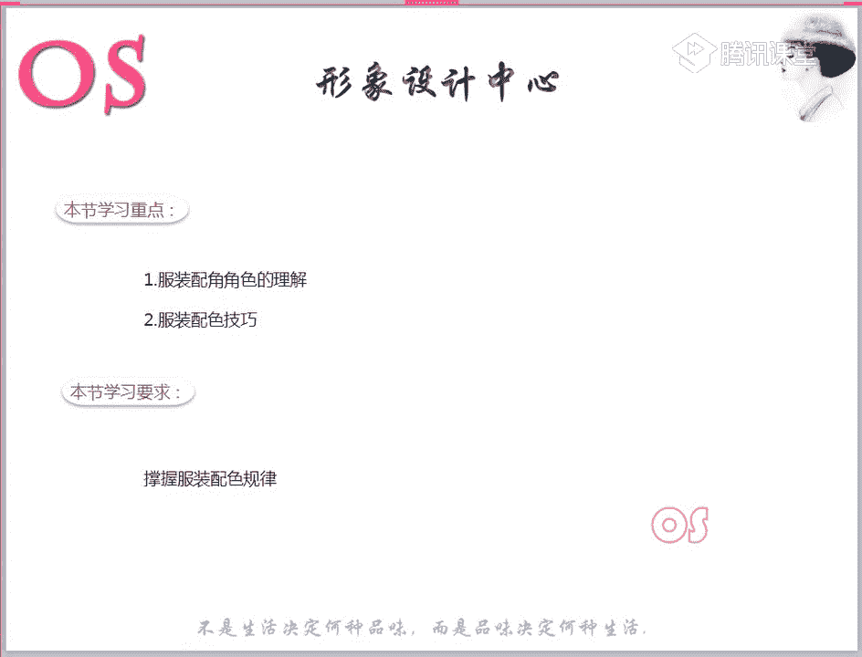
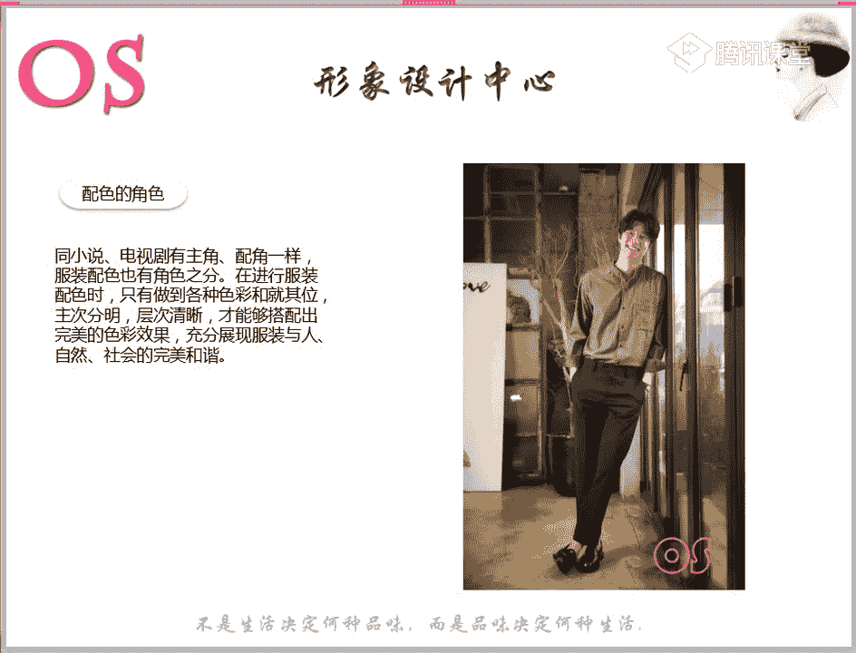
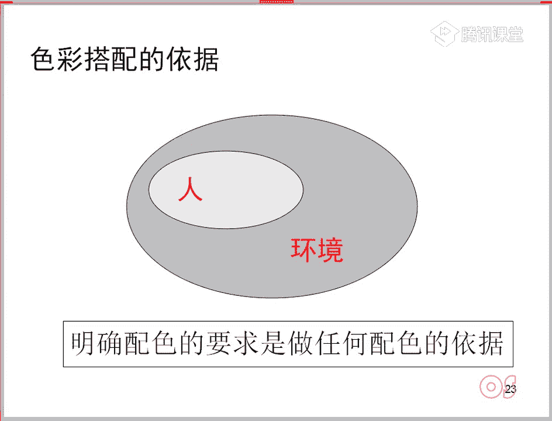
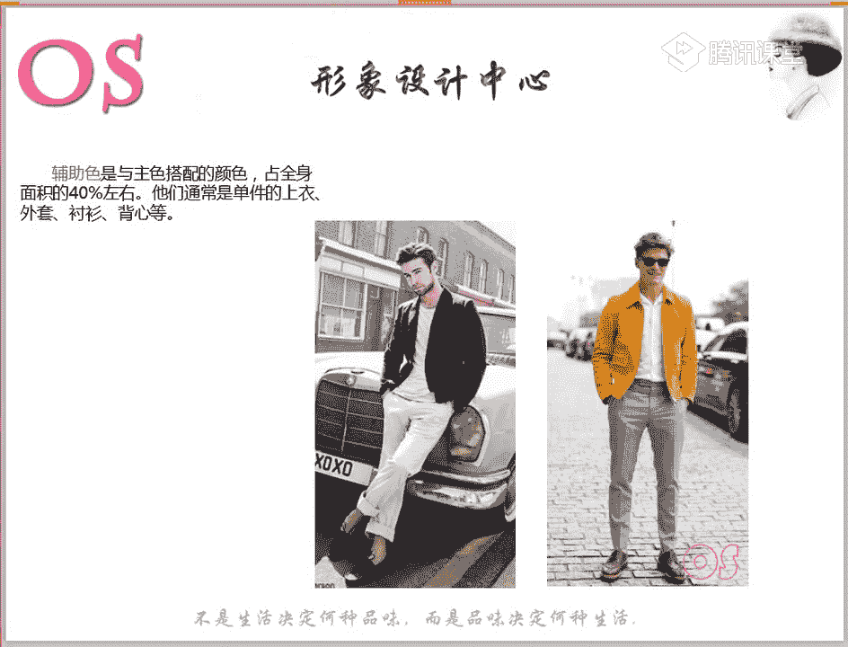
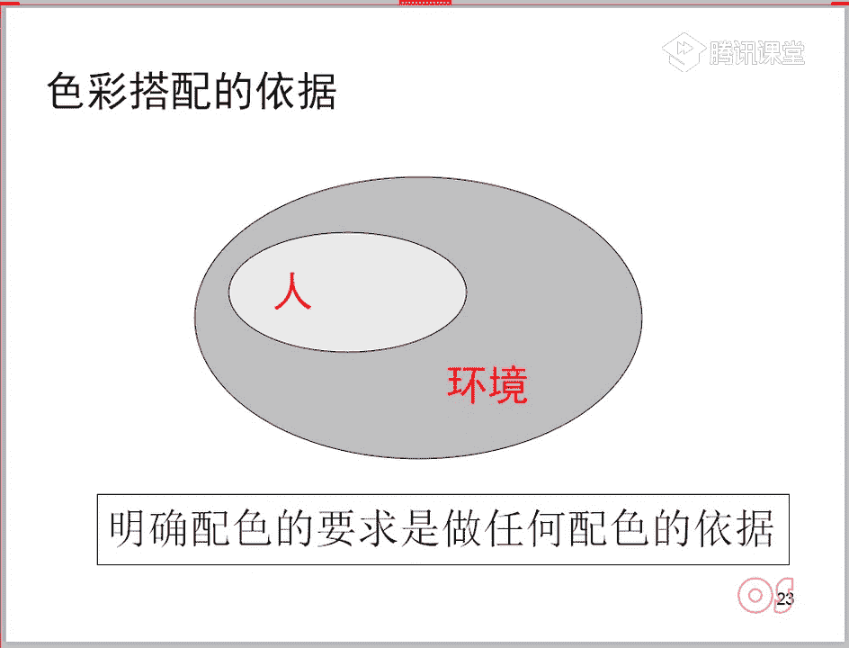
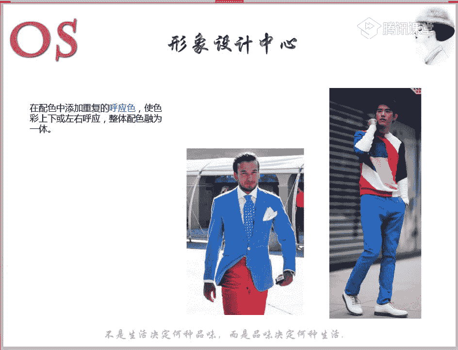
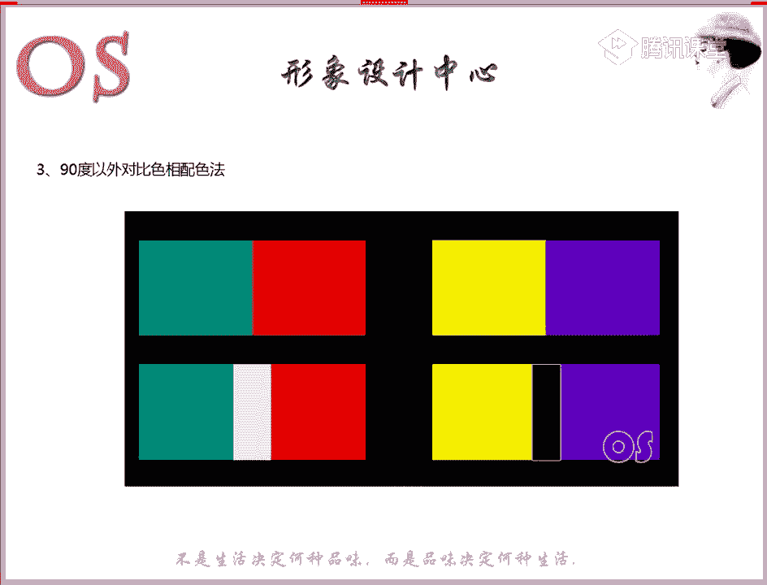
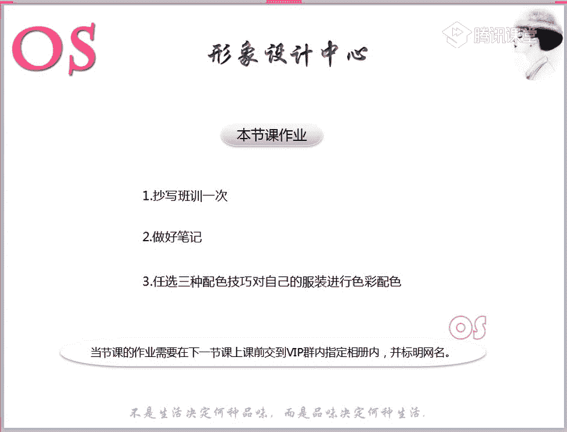

# 1、03OS男士形象VIP班《形象课》：第11节、服装配色原则

好，欢迎大家来到我们OS男士班的VIP课程。今天是我们男士班的第十二节服装配色的技巧。那么上一节课呢，我们有讲到我们这样的一个四大剂型。我不知道我们在场的同学啊。

哎对于四大剂型的这样的一个用色清不了不了解啊，清不清楚，有没有一个整个的一个梳理的一个过程中是不是会发现在我们上课之前可能做诊断的时候是模糊的。哎，虽然说老师会写的也很清楚，但是呢概念不是那么的强。

但是通过我们昨天那堂课之后啊，就上一节课是不是会发现呢哎结合我们的图片，然后在结合老师的一个讲解，对于我们各剂型这样的一个用色，尤其是自己啊，在这样的一个剂型中，我们用色和配色有没有很了解了啊。

如果说觉得嗯可以了，没问题了。那我能找到找对我自己的这样的一个用色和配色同学呢，可以在公台上跟老师刷的鲜花。😊，嗯，非常棒啊非常棒。那其实呢我们如果说在还有一些同学在听录播的过程中。

如果说还有任何问题的话，也要记得呢及时的跟老师啊来沟通。那今天呢我们看到我们的服装配色的技巧。那其实呢说到服装配色其实非常的简单啊。当我们知道自己的这样的一个用色范围，知道自己是什么样的一个剂型。

知道该怎么样去选择哎我们这样的一个用色范围之后，然后呢在掌握我们一些小的技巧配色的这样的一个技巧。也就是说一定第一个我们学习的重点呢，就是要去真正理解到我们服装配色的这样的一个角色。

也就是说主角和辅助色，还有包括这样的一些点缀色。那么第二个呢就是我们在选择配色的时候呢，其实非常的简单这样的一个色彩搭配啊。其实色彩搭配的方法，无疑就是这两种，一种就是色相配色。

一种呢就是我们的色调配色。😊，那所以说呢本节课对于大家的一个要求呢，就是掌握好我们服装配色的这样的一个规律啊。我相信大家应该都做好准备了。如果做好准备的话呢，老我们就正式进入今天的这样的一个重点。

第一个呢就是要知道我们配色啊，其实我们这样的一个色彩的配色。色彩配色的一个基础和它的一个概念以及目的啊，什么呢？大家可以呢记一记啊，其实两种或者说两种以上的颜色的一个搭配，我们就叫做配色，对不对？

什么是配色就是两种或者说两种以上的这样的一个颜色的一个搭配，我们叫做配色，那么配色它的目的就是为了达到更好的一个视觉效果和约定的目的和约定的目的。所以说呢本节课其实中心的思想，就是告诉大家。

这样的一句话，明确配色的一个要求是做我们任何配色的依据。那等我们所有的课程讲完之后啊，我相信到最后的话，大家就会明白老师啊这句话写在这里的一个意义啊，明确配色一个要求是做我们任何配色的这样的一个目的。

也就是我刚才所说到的配色，其实就是为了更好的视觉效果和约定的这样的一个目的，对不对？那其实配色的角色呢，我们也有分主次的，就同我们的小说，同我们的电视剧有主角和配角一样。那么服装配色也有角色之分。

在进行服装配色的时候呢，我们有只有做到这样的一个各种色彩啊，就其位主次分明层次清晰，才能够搭配出完美的视觉效果，充分的去展现呢服装和人的自然，以及和社会完美的和谐。就像我们在讲风格啊。

我们在讲到季型的用色的时候，为什么说我们春季型和我们的冬季型的人可以去运用对比配色。但我们的夏季型和我们的秋季型就更适合选择类似的配色。其实就是为了让服装和人更加的完美和谐，对不对？

所以说第一个概念就是如果我们想要在选择服装配色的时候呢，哎显得和谐统一的话，就要注意好这样的一个主和次，千万呢不要去出现5比5。其实不管是哪怕啊哪怕是我们唉有同学会问到，如果我是暖色型的人。

我上半身选择暖色，下半身选择冷色，可不可以呢，也是可以的，但是也要一定要注重注重到好我们这样的一个主次。当你懂得了我们主角和配角之间的关系之后呢，我们在搭配中一定是不会出错误的。

而且的话呢也不会说把自己身材方面的一些缺陷问题呢所暴露出来。啊，我们看到我们这样的一个主要色啊，主要色这样一个概念呢，它指的是服装配色中占据主要面积的一种，或者说两种颜色。那么说到主要色。

其实它不是完完全全指某个色相，它可能是指的某两种或者说一种这样的一个调子啊，这句话能不能理解啊，理解同学跟老师扣个一，就是主要色的概念，它不是完完全全指的是某一个颜色，就比如说唉这个男士一生中啊。好。

它这样的一套衣服中，这个黑色就是主要色，它不是完完全全是这样一个概念。它可能对我们如果说穿这一身，它的主占据的面积比较大，对不对？主角主角色主要色可能是这样的一个黑色，但是呢。

我们也有可能哦是同样是两种这样的或者说类似的这样的一个色彩的一个关系和一个调子啊。就比如说我们看到这件衣服哦，看到这件衣服，看到这件衣服的颜色，色彩的一个配色，让你们会用到什么样的一个关键词来形容它啊。

大家可以积极的发言啊。你们看一下这样的一组配色，你们会用什么样的一个关键词来形容。没关系啊，可以大胆的把自己的想法呢说出来。好，有同学说到暖啊，嗯青春很好。活泼啊嗯近似色的配色啊。

所以说呢非常的棒啊非常棒。你们会想到青春活泼，对不对？明快这样的一些色彩的一个感觉。所以说呢主要色就是决定了服饰配色的整体风格与印象。所以说大家呢一定不要进入个误区，就是觉得主要色。

它指的呢唉是某一种色相而已啊，它指的其实就是这样的一套服装中它的主要色，当它的一个主要色面积比重大的时候，它会带来这样的一个视觉感受。唉，什么样的一个视觉感受？就是刚才大家所形容的这样的一个形容词。

那么服装穿着者的一个配角色，也可以使我们穿着者呢充满这样的一个活力，精神洋溢，对不对？所以说主要色就决定了服装色彩的整体风格，也就是这句话其实就是一个归纳啊，主要色决定了服装色彩整体风格。

所以大家看到这样的一套配色之后，有同学会想到春季形所适用的很好，也会想到这样的一些活泼明快青春的。😊，这样的一个视觉感受。所以说这套服装所带给我们的就是刚才大家用到的这样的一些形容词。

那我们来再看看另外这两套衣服啊，大家各自呢。先来形容一下我们第一套。第一套又带给你们什么样的一个视觉感受呢？😡，嗯。好，稳重嗯。好，老师主要色一般在整套服装中占比要要达到什么啊？哎，主要色占比的话呢。

其实肯定是要达至少60%以上的哦，嗯稳重和正视。所以说它其实可能可能所有可能他所有的这样的一个呃色调所带来的视觉感受，就是我们刚才所说到的正正式严肃和稳重。所以说就是为什么跟大家刚才一开头呢？

就跟大家说到了。色彩搭配的一个依据，是不是人考虑到人，考虑到环境。也就是说我们这样的一些场合。那么所以说明确配色要求是做到任何配色的一个依据。我相信大家现在应该都能够理解这句话了。还有没有不理解的啊。

理解的同学呢跟老师扣个一。所以说两种不同两种不同的图片，对不对？哎，我们这样的一个主要色，他可能会选到选选择。如果说我全身中以这样的一个稳重的色彩哦，深沉沉稳一点的颜色呢为主的话，带给我们的视觉感受啊。

就是这样的一个风格。我们的风格就是什么呢？风格就比较稳重，对不对？比较正式啊，所适合的场合可能是这样的一些一般职业场合。但如果说我穿着的颜色比较的明快，比较的浅淡的话，给我们的视觉感受又不一样，对不对？

所以说就是我们刚才所说的主要色就决定了你服装色彩的一个整体风格。因为我们风格就是由行色质而组成的。而我们的色彩恰恰就是可以做到啊，恰恰就会做到。那还有同学如果不理解的话，可以把问题要提在公台上。

还有没有问题？对于主要色啊，还有包括刚才呃其实带给大家啊领悟的这一点，如果都没有任何问题的话呢，快速跟老师扣个一啊。有问题现在呢就可以提在公台上。所以说在这里就是要告诉大家。

你们虽然说每个人的风格可能不一样，对不对？每个人的风格可能不一样。唉，所以说我们不管是春季型也好，还是说夏季型、秋季型还是冬季型。我们一定要注意好我们自身的用色啊，一定要注意好自己的用色。

如果说你想要跟你的季型，跟你的风格去和谐的话，你的色彩的一个主要色，就一定要去掌控到啊。也就是说啊不是说明确配色就是要明确场合。因为我们在做色彩配搭配的时候，第一要考虑到人，对不对？

也就是说这样的一个色彩搭配跟我和不和谐。就像老师跟大家所说的春夏秋冬不同的剂行，我们的用色范围。我们的选择的这样的一个色彩搭配的技巧是不一样的。那第二个除了考虑人以外，我们也要考虑到环境。

环境就是我们这样的一个场合，对不对？如果说我是去上班和我去约约会和我去度假，那我穿着的色彩肯定也是不一样的。所以说呢我们在选择配色的时候，一定要考虑到这两个方面，而不能说只单单考虑一个。

如果说我适合穿鲜艳的颜色，难道我在上班的时候也要穿鲜艳的颜色吗？对不对？就是这样的一个道理哦。好，现在就目前就我们潇潇同学啊能够明白其他同学还有没有问题啊，没有问题的话呢，跟老师扣个一。😊。

所以说大家会发现不同的哦色彩的面积的一个。浅重的一个问题会带来不同的视觉感受啊，所以呢这个就是非常重要的一个点。那么呢我们来具体看一看，掌握我们的主色和辅助色和点缀色的这样的一个用法。

第一个呢就是跟大家来说到我们的主色啊，主色它指的呢就是占据全身色彩面积最多的颜色啊，占我们全身面积。60%以上。那它通常呢是作为我们的套装、风衣、大衣、裤子啊哦，包括像我们女士中就会有裙子等等。

那大家可以看到我们这位男士啊，全身中它的主要的主色是哪一个颜色？这个大家应该都能够看出来，对不对？它全身中主要的颜色是哪个颜色？对，是蓝色啊。所以说这个就是我们的主色。

那么呢哎我们所以说他想我们其实回到刚才那个问题啊，再跟大家呢重点说一下，重点说一下。所以说呢我们其实色彩所传递出来的这样的一个不同的色相和色调，它就是能够去带给我们啊不同的这样一个感受，对不对？

所以说在这里呢我们也要注意好主色辅助色和点缀色。那么第一个就主色，我们一定要知道，在如果你想要尤其是一些男士啊，要注重好一些身高的一个问题的话，你就一定要控制好辅助色和主色的这样的一个面积。

那么主色的面积呢一定是占据你全身60%的。比如说夏天我们如果说T恤配裤子的话，那么裤子一定是主色，因为它的面积占据比较大。那如果说在冬天我们穿着大衣的时候，哎，我们不用去考虑到内搭和我们的裤子啊。

哪怕说内搭和裤子的颜色是一致的。但是因为我们所显露出来的大面积的是这样的一个外套的颜色。所以说外套还是属于我们这样的一个主要色。所以说我们就是不用去考虑到脱了衣服之后呢，哎，我们这样的一个面积有多大。

而是说整身套上之后就去看观看这样的一个视觉，所呈现在我们外人面前它的色彩中哪个比重啊占据大，我们就把那个颜色呢叫做主色。

那第二个呢就是我们这样的一个辅助色啊，辅助色呢是与我们主色搭配的颜色，占我们全身面积的40%左右。那么它们通常就是我们单件的上衣、外套、衬衫和背心啊，衬衫和背心。所以呢大家可以看大家可以看到哦。

唉在我们图案中。大家觉得我们的辅助色是哪个颜色？图案啊，辅助色是哪个颜色？没关系啊，可以呢大点回答错了没也没关系。嗯，黄色。黄色嗯。很好很好。所以说其实。贯彻一下之前我们第一个啊。

其实正确答案就是黄色哦，为什么不是白色呢？我们来看一看。

还记得老师刚才说的主要色，对不对？我说了主要色是一种，或者说两种颜色，一种或者是两种颜色。而他们这一种和两种颜色，他们所呈现的视觉的效果应该是唉占据着整体的风格，对不对？就像我们这一身一样的。

你会发现衬衫和它的这样的一个外套。唉，因为比较的明快，所呈现的效果就是刚才大家所说到的活泼明快等等的。那么其实这一套也是一样的，它的主色，它的辅助色呢就是我们的黄色。因为白色和这样的一个浅灰色。

它所带来的这样的一个视觉是宁近的，对不对。

它其实效果是一样的，就是比较的这样的一个唉浅淡的色相。而所以说呢这两个颜色我们可以把它归到一起，而我们的纯度偏高的这样的一个黄色呢，我们就叫它辅助色。所以说不知道小小同学这边能不能理解哦。😊，嗯。

如果说还不理解的话呢，老师就再表达一次啊，我不知道老师这样的去表达能不能更加的去理解到我们主要色这样的一个概念，以及呢辅助色的一个在全身中应用的时候要注意的。好，那就非常好。

所以说大家要知道我们整身搭配的时候也是一样的，整身搭配的时候也是一样的。我们要注重好唉整体的这样的一个色彩的一个呈现。我要搭配的这样的一个效果。好，最后一个第三个啊，就是我们的点缀色。

点缀色呢它指的就是我们色彩组合中占据面积比较小的。那么视觉效果比较醒目的颜色。一般情况下呢，唉我们点缀色也会经常出现在我们的服装啊，配件设计或者说面料花色设计中呃，例如说我们在黑色这样的一个外套上面。

对不对？使用的亮泽的这样一个金属扣作为点缀，那么他们的扣子呢，其实就是属于我们的点缀色，那以及我们会发现女生的一些裙子或者说男士的一些花衬衫，对不对？花衬衫。上面会有一些颜色非常鲜艳的色彩的一些花苞朵。

那它其实都是属于这样的一个点缀色。所以我们的点缀色呢面积非常的小。它是占我们全身面积的5%到15%。那他们通常会以我们的男士的领带、丝巾、鞋子、包、饰品等都会起到这样的一个画龙点睛的一个作用。

其实有时候你会发现色彩上面我们稍微去制造这样的一个层次感，其实我们所带来的视觉上就完全会不一样，对不对？如果说把这样唉这位男士。的鞋子哦，我们换成黑色，大家可以想象一下，那整身中会显得非常的沉闷。

对不对？如果我们本身场合中不适宜去表现这样的一个沉闷的话，我们不妨呢把我们的鞋子或者说把我们的领带，把我们的衬衫哦去选择一些更加鲜艳，色彩饱和度高的颜色。那么会使我们整身的服装更有这样的一个层次感。😡。

所以说各位男士啊，如果说有男士不太适合哎这样的一些鲜艳颜色的，或者是说呢我们不太哦不太适合这样的一不喜欢啊，或者说爱好不太喜欢这样的一些鲜艳颜色的。其实呢我们是可以去做点缀法的会更好。

所以说点缀色还要注意一个点呢，就是一定要注意啊，如果我穿着的颜色非常的。饱和度非常高的话，比如说我拿女生举例子啊，因为女生很简单，比如说我一条裙子是宝蓝色的裙子，然后呢，我拿了一个橙色的包包。

按道理来说，这两个颜色都是很鲜艳的。而点它他们符合啊。就比如说这个橙色的包包，它是符合了点缀色的面积，又符合了我们这样的一个点缀色一定是非常鲜艳独目的，对不对？绕眼的。

但是在这里他们会不会称之为如果这整套服装中哎称不称之为是我们的点缀色的一个配色方法呢，绝对是不适合的啊，绝对不是的，是的，因为他们算强对比，他们还是算对比配色。因为我们点缀色一定是要起到强调的一个作用。

起到绕眼的一个作用，那什么情况下它才会绕眼的。所以说我们这样的一个底色一定是要么就非常的深沉，要么呢就比较的浅淡啊，没有太多的亮点。那么就制造一个亮点，我们既时尚的同时，又会显。😊。

显的哦非常的在视觉效果上会有很强的一个冲击度，所以说非常的好看。这都是属于我们的点缀色啊。好，有同学说到唉，鞋子亮是呃，不是会显得人矮吗？其实啊在我们这样的一个视觉中。

如果说它的整整套服装中整身中都是比较暗的。其实如果说你的鞋子是一个亮色的话，不会显得人矮啊。因为我们在试错中，老师在讲到试错中，当我们的装饰位置居上或者说居下，在视觉效果上都会显高。

还记不记得记得同学跟老师刷的鲜花啊，在我们第三节课哦，在讲到试错的时候呢，老师有说到过，当我们的视觉哦，对当我们的装饰细节啊，装饰细节居上或者居下的时候呢，在视觉上都会显高。😊。

所以说当它整身的服装配色啊是属于统一的时候，那如果你穿着一个鲜艳的呃亮一点的鞋子，其实是不会有这样的一个影响的，不会有这样一个影响的那如果说你整身的色彩也比较复杂。那这个时候你又穿了一个亮色。

那肯定会有这样的一个视觉效果。好，袜子的颜色也可以作为点缀色嘛。是的啊，袜子也是可以的。😊，所以说控制好面积。那么像我们各位男士，如果你穿着一些呃西装的时候，我们去选择胸针啊、口袋巾啊。

这些其实都是属于我们的点缀色啊，都是属于我们这样的一个点缀法，多去运用。还有包括我们如果说今天买了一双鞋子，非常的绚绚丽独目，对不对？不管是它的材质很有这样的一个光泽度也好，还是说色彩上拼色等等。

如果我想要去展现这双鞋子，那其实我整身的其他的色彩上，我就可以去选择一些低调的色彩，或者说唉浅淡呀，沉稳一点的来尽量的去衬托我这双鞋子，所以说就是我们看我们要去表达什么。😊，还是这个道理啊。

明确配色要求是做任何配色的一个依据。如果我今天要凸显的是这件单品，那我其他色彩，其他的这样的一个色色相色彩色调呢我们就尽量要低调。

好，关于我们的辅助色和主色，以及我们的点缀色，还有没有什么问题啊？没有任何问题的同学呢，快速跟老师刷个鲜花。好，接着呢我们来看到我们这样的一个呼应啊，呼应色。那么在配色中添加重复的呼应色呢。

也能够使我们的色彩上下或者说左右去进行呼应。那么整体的配色也会融为一体啊。这个非常的简单啊，就当我们如果说有一些复杂的上衣或者说裤裤装啊，唉色彩上面比较复杂。我不知道该去选择另外一件单品的时候。

我们就可以去运用到从我们这样的一套复杂的配色啊，组合中呢挑选某一个颜色，唉，作为我们其他单品的这样的一个色彩的一个选择。那么就像这一身中，我们的裤子的颜色就会跟它毛衣里面的蓝色再做呼应，对不对？

鞋子也是跟它毛衣的白色再做呼应。那么像左。左身中也是一样的，领带跟我们的衬衫在呃跟我们的西装外套在做呼应。那我们的呃口袋襟和我们这样的一个白色的衬衫也是在做呼应。所以当大家各位男士啊。

尤其像我们这样的一些前卫风格的。因为本身就比较适合这样的一些个性类的啊服装单品。所以如果说你想要整身配色中出彩啊，我们就不妨呢大胆的去运用呼应色。非常的安全，而且呢还能够去凸显你的搭配功底。

这个就是我们这样的一个呼应色。另外的话呢，我们接下来呢就要讲到一个重点。

其实啊看到这张图片，其实真的色彩搭配的话非常的简单，分为两个点。第一个就是搭配的效果，看你要搭配什么样的一个效果。就像我刚才说的，哎，你想要去唉展现你的鞋子，对不对？我们可以去用到点缀法。

其实这个就是我们的这样的一个效果。那么另外的话呢，对是我们的一个搭配方法，其实搭配方法，大家会发现色彩无彩色和油彩色，对不对？就五彩色和有彩色。那么呢像我们的有彩色里面有我们色相之分，对不对？

有色相之分哦。😊，这样我们这样的一个色相环，我们有色相之分。那么其实还有一个除了有色相之分以外呢，我们还有色调之分，对不对？因为我们加灰加白加黑的不同会产生不同的一个调子。那么总而言之呢。

其实服装色彩的一个搭配方法就是色相配色和我们的色调配色就是这么的简单。😊，就是色相和配色，色相配色和色调配色。那么呢我们看到。😊，第一个大点，我们搭配的效果，其实搭配的效果有直接效果和间接效果。

那么直接效果呢就是我们可以去选择呢搭配出类似的啊，或者说我们去选择类似搭配，选择我们的对比搭配，像类似搭配的话呢，给我们的配色印象是比较统一的，是比较统一的。那么间接的效果呢。

就是我们的心理的一个效果啊，心理的效果，就也也就是说哎你想要去表达什么样的一个心理。就像刚才老师所问到大家的。你们看到这组配色，让你们想到什么。😊，你们说到了明快，对不对？说到了活泼。

那么这个就是指的我们这样的一个心理效果。如果说我今天想要表达的是我这样的一个活泼明快的话，那我的色彩就可以去选择一些活泼明快的色彩。这也就是我们间接效果。对比的话，这里没有说到啊，就是我们的强烈和动感。

那我们呢接着呢就看到我们接下来所说到的一个重点。那么其实呢第一我们要明白色相配色。😊，那么色相的概念呢，其实以我们色相为基础的配色呢，就叫做我们的色相配色。那它是以我们这样的一个色相环为基础呢。

进行我们这样的一个思考。那在色相环上相邻的颜色之间呢，我们来进行配色的话，可以得到稳定统一的感觉。那如果说我们用距离远的颜色来进行搭配的话呢，又可以达到一定的对比感，对不对？又可以达到一定的对比感。

那么在我们的色相配色中呢，我们有如下的几个配色的方法。第一个呢就是我们90度以内的色相配色。其实这个是我们的CCS图啊，CCS图是适合我们亚洲的啊，适合我们亚洲的这样的1个CCSS图。

那其实有些同学也可以把这样的一个图片呢啊记下来。那么老师所说的这样的一些90度也好，90度以外也好，其实都是啊以我们这样的1个CCS图为基础啊。因为我们专业的顾问就是会用这样的一个图啊。

专业顾问就是用的我们的CCS图。😊，那90度以内的色相配色方法就是很简单使用我们在色相环中呢相靠近的颜色来进行我们的服装配色。那么整体效果的话呢，稳定温馨，是不是？那我要问一下大家啊。

像我们这样的一个色相配色的方法啊，色相配色方法听清楚啊，老师是指的色相啊，色相配色方法，不是指的色调配色方法啊？色相配色方法中，大家觉得在我们男士风格中有哪些风格是比较适合的啊？

或者说呃说到我们这样的一个剂型嘛，是哪些剂型是比较适合的。90度以内的色相去进行配色的话。好，我们那务丹同学说到春非常棒哦。好，也有同学说到了我们的夏和秋，就是其实老师是在考大家哦。好。

还有没有不同的答案？夏河秋啊，还有没有不同答案啊？😡，一下子就把各位抓出来了啊，还记不记得老师在上一节课讲到我们啊记行的时候，我有没有说到。😡，哪些剧型适合用色相感，哪些剧型不适合用色相感，还记不记得？

是不是说到过啊，绝对老师是绝对有说到过的。我有说到哪些剂型适合用色相感配色，哪些剂型是绝对不可以表现色相感的。😡，所以说然后一考大家呢就发现问题出出现了，对不对？嗯，是的。

我们的夏季型和秋季型是不适合选择色相感的那我们冬季型和我们的唉春季型的同学呢是可以适合用色相感。所以大家一定要记啊，一定要记住。好，所以呢我们看到这里嗯90度。是的啊，90度以内啊去要去表现。

其实他他们两个春夏天夏季型和秋季型的人呢，更适合去表现我们这样的一个色调啊，可以运用到色调。那使用在我们色相环中比较靠近的那就是我们的色相配色，90度以内的色相配色。所以说在这样的1个CCRS色相环中。

所有90度以内的这样的一个色相，我们进行配色的话呢，都叫做我们90度以内的色相配色。好，大家一定要记住，那第二个呢就是我们90度左右的色相配色方法。那么90度以左右的，也就是说包含90度内一点点。

或者说90度外一点点，或者刚好90度，对不对？那这样的一个配色，你会发现呢会带来这样的一个活泼感，就像我们的黄色跟红色去进行碰撞，会有这样的一个活泼和动感。那如果说我是一个前卫风格的人。然后呢。

我还是这样的一个唉春季型，或者说我是这样的一个冬季型的。我其实可以适当的像冬季型适当就可以了。不用去太过于强啊。

我是不是可以去唉然后今天我这样的一个形象，我要想要去表达我活泼动感的话，我就可以选择90度左右的这样的一个色相配色方法。这是他们会带给我们这样的一个视觉的一个感受。那另外呢就是我们经常所说到的对比。

对不对？对比色，那其实就是我们90度以外的，其实都叫我们的对比色。只是说对比的强弱问题啊。如果说我们这样的一个色相。比如说我们来拿到紫色和我们这样的一个黄色，其实他们也是一个对比的关系。

只是说它们属于弱对比。但如果说拿到我们这样一个蓝色和黄色的话呢，他们就是我们这样啊，我们拿到这样一个纯纯青色，跟我们的这样一个黄色的话，他们就是一个强对比，对不对？橙色跟我们的蓝色的话呢。

就是一个也是一个强对比。所以说这个就是我们90度以外呢强弱的一个问题啊。😡。

好，老师冬季型可以选择红色和黄色哦，冬季型的人呢可以去选择呢适当的表现色相感，可以适当的去表现色相感。其实冬季型用色调啊，会用色调其实是更好的，用色调是更好。当然我们要还要考虑到它风格。

因为我们不同的风格呢，在选择用色的时候也是不一样的。比如说如果我是一个冬季型的人，然后我还是一个唉这样的一个前卫风格的话，那我即使选择红色配黄色的话也是可以的。但如果说像我们有些我是一个冬季型。

但是我是哎我的风格比较的稍微像我们的这样的一个戏剧风格的话，其实不用去太过多的啊，太过多的去对比太过强烈，不用去表现太多的这样一个明朗化啊，色相的。😊，还是要选择自己的用色啊，选择自己的用色。😡，哦。

因为我们冬季型的人是属于冷色，对不对？所以说选择冷色的话呢，我们就还要还始还要记住的，就是一定要以冷冷色为主。当然像黄色和我们的红色，也有是属于冷色的黄嗯和和暖色的这样的一个黄红啊。

那这个就是我们90度啊，说到90度以外的，90度以外的配色其实都叫对比色，只是强弱的一个问题。大家一定要记记清楚啊，一定要记清楚。所以说呢当我们的紫色碰撞出黄色的时候，它也可以叫做对比色。

只是它是弱对比。😡，那当我们遇到这样的一个对比服装的时候呢，如果你想要选择对比色，那我又想要让我们的对比关系更加和谐的话呢，我们可以去加入这样的一些隔离色，可以加入隔离色。

所以大家会发现有一些女生的裙子也好，还是说我们男生的这样的一些非常颜色上面哦对比的这样的一些服装的颜色，你会发现它在服装里面可能比如说男士这样的一些格纹，它的格纹里面可能有红色和绿色，对不对？

但是也可能在格纹里面它还会加上白色，或者说在格纹里面加上黑色，其实白色和黑色呢，它就是起到了这样的一个隔离的效果。对，会加入这样的一个五彩色来进行调和。所以说这个也是属于我们这样的一个隔离配色。

那么当我们遇到这样的一些对比色的时候呢，一定要去运用到这样的一些其他颜色来进行隔离，会让它更舒服。大家可以看到我们这样的一个图片，是不是哎，我们上面和下面一做对比，你们就会发现。😊。

下面的冲击感就没有我们上面的那么的强烈。所以说90度以外的配色呢，它会表现的是这样的一个对立的色相情感，都会产生宽与众不同、戏剧化的一个效果。好，这个就是我们三个啊在做色相配色的时候呢，这样的一个三种。

大家还有没有什么问题啊？没有问题的话呢，快速跟老师扣个一。而且还有就是呢大家要知道的一个点啊，在选择用隔离色的时候呢，一定要记住一定要记住就是什么呢？我们跟我们的隔离色要跟自己的一个底色啊。

基底色要产生明度差，大家会发现这也是有明度差的，这个也是有明度差的，一定要有明度差。如果说你的明度差不大的话，它效果就出不来。这个大家老师没有标注了，但但是大家一定可以记一下，也就是说隔离色它不是主角。

对不对？隔离色它不是主角和我们的基底色呢一定要产生明度差。好，90度以内的色相配色为什么不适合哦？其实是所有的色相配色都不适合我们的夏季型和秋季型。因为我在上一节课就讲到夏季型和秋季型不适合表现色相感。

也就是说他们在用色的时候，不适合在身上出现色相感很强的颜色。老师这样说能不能理解啊，就是所有的色相配色其实都是不不管你是90度以内也好，还是说我们90度以外对比也好，都是不太适合夏季型和秋季型的。

因为他们整个就不太适合我们这样的一个色相，他们不适合去表现色相感。😡，所以我们在选择外套也好，裤子也好，内搭也好，其实色相感越模糊，是越适合他们的。

就比如说你看如果我是呃春我是夏季型和秋季型的，我就可以选择这样的一件。因为它的色想感不是很强，对不对？😡，当然也是橙色系，但是它不是说像我们这样的一个橙色，这么的乍眼嗯。😡，好。

第二个呢就是我们来讲一讲我们色调的配色啊。那么首先呢大家想听一下，听认真听一下色调配色的一个概念哦，那就是以我们色调呢为基础的配色呢，就叫做色调配色就叫做色调配色。那么在我们的色调图中呢。

相邻的色调之间，相邻的色调之间呢，我们来进行配色，可以达到统一的效果。那如果说我们用距离较远的色调来进行搭配的话呢。可以达到对比的效果。但是呢因为我们色调配色，大家会发现色相感会降低。色相感会降低。

所以呢像这样的一些色调配色，其实蛮适合刚才我们所说的这样的一个夏季型和秋季型的人。当然了，其他两个风格也是可以去用的。所以说我们会发现咦有这样的一个类似色调的配色，有我们这样的一个统一色调的配色。

也有我们对比色调的一个配色。那我们具体呢来看到。第一个呢就是我们统一色调的一个配色。也就是说在同一个色调中呢，不同的色相的一个搭配来表达呢我们同一的同一啊是同相同的同同一的色调情感。

所以说呢这是一种类似的效果，这是会达到类似的效果。举个例子啊，比如说呢我会选择呃棕色调啊，这是我们的中色调。棕色调和我们的浅色调，它们俩是不是邻居的关系，对不对？哎。

我会选择棕色棕色调里面的红色和我们这样的一个浅色调里面的橙色也好，紫色也好，哎，去进行做搭配。那么呢这个就是我们同一色调的配色。也就是说色调。哦，这呃老师说错了，刚才说错了，就是我们同一色调呢。

也就是说在同一个调子中，我老师刚才说说成了类似色调啊，类似色调去了。那我们在同一个调子中选择不同的色相来进行搭配。所表达的就是同一的这样的一个视觉感。嗯，就比如说我们刚才在中色调里面呢。

去选择红色和我们的橙色做搭配。那么他们就是同一色调的配色。那么像我们刚才我老师举的例子。😊，其实这个也是一样的，你看这样的一件蓝色衣服和这样的一件绿色的裤子，其实他们就是一个调子，对不对？

都是一个调子啊，这个也是一个调子，像这个蓝色和紫色明显的一个调子，还有包括呢这这件服装的啊外套和裤子，其实它也是一个调子，都会有加入灰黑，对不对？😊，这个有没有问题啊，应该是很好理解的。如果有问题的话。

可以提出来。没有问题的话呢，跟老师扣个一。因为刚才老师口误讲，然后自己讲到了类似色调的一个配色了，一会儿跟大家来解释。😊，好，这个就是我们的类似的一个色调的一个配色。所以调子非常关键。

你们可以呢多去练习，多去观看啊，多去看。其实很很很容易区分的。就比如说我们的浅粉色，哎，如果说浅粉很浅，就是在极蛋色调里面的粉色和极蛋色调里面的蓝色进行组合的话，他们也是叫做同一色调的这样的一个配色。

😊，好，那第二个呢就是我们的类似色调的配色啊。类似色调配色它的概念呢就是指相邻的两个色调进行搭配。就是刚才老师举的这个例子，相邻的两个色调，比如说中色调和我们的浅色调，他们是邻居的关系，对不对？

相邻的两个色调进行搭配。那么这两个色调进行搭配呢，可以是相同的色相，也可以是不同的色相。就比如说唉像我们可能我们来看到哦类似于这件衣服。😊，当然啊，因为这件衣服呢。

我们会发现因为它里面的哦是加了这样的一些白色的，可能会对于我们这样的一个调子会有影响。那我们不用去太管它就就像就即即使说就它他们两个是我们这样的一个格相邻的这样一个调子都是橙色，那我们可以去做搭配。

那这样一个搭配效果也是我们类似色调的一个配色。当然它所出现的这样的一个呃情感的话呢，也是我们类似色调的一个情感，类似的一个效果。那除了运用我们唉相同的这样的一个色相进行配色以外，也可以运用的不同的色相。

比如说我们的橙色和绿色啊，和我们的紫色和我们这样一个绿色。那么它们俩之间调子是绝对有区分的。大家可以可以看出来，对不对？这样的一个紫色，它加灰的程度一定是会比我们这件绿色，它加灰的程度要高。

这个能不能看出来啊，应该是非常清楚的。😊，能够明显的感受到对不对？能不能明显感受到啊，可以的同学跟老师扣个一。也就是说这样的一个紫色是绝对加了灰的。😊，这个就是属于我们调子之间呢是临近的。

但是色相之间是有差异的哦，色相之间是有差异的。所以说类似色调的配色呢，我们可以去采用相邻的两个色调来进行搭配。那我们的色相呢可以是相同的，也可以是不同的，也可以是不同的那它所出现的效果呢。

也是这样的一个类似的效果，会很和谐，很统一。好，第三个呢就是我们对比色调的一个配色方法了。啊，对比呢那当然他们调子之间就有距离的，那么分为两种情况啊，分为两种情况。第一种呢就是中间隔一个调子。

中间隔一个调子的距离。也就是说这两个色调之间它会隔，它不是说挨在一起的，他们不是邻居，他们可能中间还住了一个人啊，这个就是属于我们这样的一个。第三个这样的一个对比色调的一个配色。

那么对比色调它也是有强弱之分的，就像我们色相里面的一个对比色，也有强弱之分。那么在色调里面呢。它也是有强弱之分的。第一种就是像我刚才重复重复一遍啊，中间隔一个调子的，它会有效果是类似偏对比的效果。

类似偏一点对比。也就是说像我们哎有点类似，然后呢就弱对比的一个概念。那第二种呢就是我们如果说中间间隔两个或者是说三个调子的一个距离，甚至呢距离更大的话，我们就叫它对比效果啊。

所以说就是这样的一个对比色调强弱之间的一个关系。大家可以看一下啊，比如说唉我们这样的一件蓝色和我们这件紫色，对不对？还有包括我们这样的一件橙色，你会发现它会出来这样的一个对比感哦。

调子之间如果存在这样的一个冲突的话，其实对比也是非常强的。那其实还要交代大家句呢，就是当我们的色调啊，如果说你要选择对比，其实你要选择这样的一个对比色调配色方法的话呢。

就要其实最好要注意一个点就是当我们的色调远的时候呢，色相就要近。色调远的时候，色相就要近。能不能理解这句话？理解的话，跟老师刷的鲜花。😊，当我们在做对比色调配色的时候啊，不容易一定要记住一个点。

这样的话我们才不会出错。也就是说，当我们色调远的时候呢，色相一定要近。听明白的话呢，记哦记清楚之后跟老师可以刷个鲜花啊。然后呢，如果不明白的话，老师就解解释一下啊，这样的一个什么是色相镜。好。

这个就是我们跟大家所说到的。唉，其实很简单，色相配色色调配色啊。再理一下，就是这样的一个概念啊，就是这样一个概念。好，关于我们色相和色调还有没有什么不懂的，有没有？所以说大家在平时生活中搭配的时候呢。

结合自己的风格进行，结合我们自己自身的这样的一个个人啊环境啊等等的。然后呢一起去做色彩的一个配色。😊，好，如果没有任何问题呢，我们就接着要跟大家说到下一个点，就是我们鲜艳的这样的一个色彩啊。

类似色调配色，还有问题，是不是不太理解哦？好，我们看到类似色调的配色，什么是类似色调的配色呢？啊，就是相邻的两个色调进行搭配。那搭配的话呢，我们可以去选择相邻的两个色调，色相可以选择一样的。

也可以选择不一样的色相。就比如说我们会发现哎你像我们这样的一个着色调，对不对？跟它相邻的这一圈都是跟它相邻的。这个我们从中任意抽取啊，两个颜色去进行做搭配的话，也就是说从它这里抽出抽取一个。

然后从老师这个鼠标转圈的这样的一个位置中，哎，另任意抽取一个色相，其实他们俩之间做搭配呢，都叫做类似色调的配色。😊，啊，这个色调图其实是最好能够记下来哦，但是呢这个色调图的色色彩的鲜艳度不是很高啊。

等因为我们这样的一个。😮，就是电脑版的不是特别的高。我其实有一个是属于我们日本的，就是因为这样的一个色调图是我们西曼，也就是说我们的西曼色彩它有进行调整，更适合我们中国人的。

那么其实有一个是PCCS色调图啊，PCCS色调图的话，它可能清晰度会高一点。那如果大家需要的话呢，我到时候可以传传到群里，或者大家能把这个图啊。拿走也是可以的。发到公台上了哦，大家也可以呢把这个图拿走。

可能这样的话呢会清楚一点。色调图以前我们在上学的时候都会记啊，不仅仅是在记这样的一些柔色调啊，哎，它的旁边有什么呀，中心调什么什么的啊，记位置。而且呢我们还会记这样的一些字母啊，会记这样的一个字母。

因为就不不用去借文字了，因为一看到字母就知道哎这个调子它的位置在哪里，它是加了什么？😡，其实作为色彩顾问来说，是一定都要能够背出来的。好，我们接着来讲啊，接着来讲到我们的鲜艳颜色。那么在色相环中呢。

纯度明度较高的色彩呢，它越有这样一个朝气和活力，对不对？所以说呢如果我们喜欢这样的一些鲜艳的颜色，你想要唉搭的。就是舒适的感觉啊，搭的比较和谐的话呢，其实我们可以大力的去运用到黑白灰与之去做搭配啊。

黑白灰跟这样的一些鲜艳的颜色去做搭配。所以说这个也是教我们男士怎么样去偷懒啊。当我们不想去研究这些嗯色彩的这样的一些配色的时候呢，啊我当我又有这样的一些复杂的单品哦，那我就干脆运入到黑白灰吧。

这是最简单的。😊，那么第二个呢还要跟大家再次强调，就是鞋子的颜色和裤子的颜色呢相似，它会有显腿长的作用。啊，腿短的同学呢就要慎选高帮鞋啊，慎选高帮鞋。这是对于一些腿短的同学哦。

腿短的同学就尽量要选择裤子和鞋子的颜色去选择类似的调子。那么呃如果说你腿不长，然后我们还去选择一些对比啊，我们的调子上对比也好，还是说色相上去做对比也好。那么就其实在视觉上呢会显得腿短。

那么尤其像这样的一些高帮鞋，它也是不太适合我们腿短的同学选择。所以说现在呢我们其实色彩的知识呢都跟大家讲解完了啊，都讲解完了。那么其实这句话呢，我相信通过所老师刚才的一通梳理啊，应该都完完全全能够理解。

唉我们色彩搭配的依据，考虑到人和环境，然后呢明确我们配色的要求是做任何配色依据。因为呢其实你会发现如果说两种颜色我们放到一起，只是说两种颜色的比重不同。如果说A图中我们可能会运用到大面积的哦。

我会运用到大面积的白色。然后呢配小面积的这样的一个黑色，那B图中我会用到大面积的黑色，然后去搭配小面积的白色，那么大家会发现这两种色相都是运用到黑白。但是因为面积的不同。

我们所带来的心理效果是不是不一样，是不是不一样。所以说呢我们在做配色的时候呢，也要考虑一下啊也要。😊，考虑一下你想要达到什么样的一个效果。那么当我们知道要达到什么效果的时候呢。

再去考虑运用什么样的一个方法就非常的合理，也简单了。刚才是拿黑白做例子啊，大家包括平时你们也可以去找一些油彩色，油彩色去举做对比的话，其实视觉效果是最强烈的。嗯，就像我之前在老师在公开课的时候。

我不知道大家有没有印象啊。我举过一个例子，就像我们女士的这样的一个玫粉色的裙子，然后和一件粉色的外套，那如果说我把玫粉色，我把玫粉色的面积扩大，粉色缩小的话，你们会可能会感觉到比较女人对不对？

嗯比较性感。但如果说我把粉色面积加大，我把玫红玫红色的面积做小化的话，你们又会觉得比较的活泼可爱呃，比较少女。所以说呢面积比的不同，我们会带来不同的效果。好，大家还有没有什么问题啊？

应该对于今天这样的一个色彩配色啊，都掌握了吗？如果都掌握的同学呢，跟老师刷了鲜花。所以说这也是一直在跟大家强调的，明明确配色的要求是做任何配色的一个依据。包括不同的剂型，我们在做配色的时候。

它也是有各自的要求的。嗯，那我们在选择的时候呢，就一定要记住这些要求。今天的课上的很快啊，那么本节课的作业呢就是第一个我们要把班训抄一词做好笔记。另外的话呢，按照老师刚才举的这样的一些技巧。

任意选择三种技巧呢来搭配自己的服装进行色彩配色。那当然你们在选择的时候也要考虑到自己的色彩机型和我们风格啊，也要考虑到色彩机型和风格。😊，重点就是我们的色彩机型。因为这个的话已经讲过了，我们风格的话。

下一节课还会跟大家来分析一下。好，我弟弟衣橱理呢青色的黑白灰啊，这个时候就要适适当的建议他呢多加入这样的一些呃点缀色啊。如果说他一时接受不了。因为今天做诊断了，对不对？春季型的那是不是弟弟啊。

是不是弟弟啊？那如果说春季型，他可能一时接受不了太多鲜艳的颜色，那我们就小面积的先给他呢运用啊，慢慢慢慢慢慢慢慢去进行改变，因为很多啊他喜欢黑白灰的话呢，证明他是不太喜欢一些呃过于鲜艳的颜色的。

但是他其实穿鲜艳的颜色是非常好看的，就刚像上一节课老师所说的这样的一些春季型，我重点的举到这样的一个模特，对不对？他所穿着的这样的一个服装的颜色都是非常适合他的。嗯，喜欢粉色的衬衫哦。可以也可以去穿啊。

喜欢混粉色没关系，我们可以在调子上去进行做对比啊，可以进行调子上的对比。呃，老师高帮鞋被裤子挡住了，就是只看到了鞋面以下是不是也可以给腿短的人穿。呃，如果是高帮鞋对，当然你要是把那里挡住了。

那就无所谓了。如果说你要露出来的话，肯定就不太好嗯。但是一般高帮鞋。都会把它露出来哦，肯定都是会漏出来。因为你放到裤子里面可能会影响这样的一些裤腿的裤型。嗯，老公就喜欢高帮险。

其实他像如果说因为应该个子还好，我不太记得具体的个子。然后但是风格和机型我是还是记得很清楚的。其实像他的风格，穿高帮鞋是没有任何问题的，因为它的量感比较大。

而我们这样的一个高帮鞋的层次感就是这样的一个就是存在感啊又很强。😊，所以没关系啊，喜欢高帮鞋就尽量对我们向日葵同学说的非常棒啊，就是我们可以选择跟裤子颜色一致嗯。😊，如果说喜欢的话。

然后就是在上半身去做文章啊，上半身呢我们可以去选择一些唉这样的一些点缀，嗯，选择一些这样的一些配饰啊等等的去做点缀，把别人的视觉呢让他去上移，不要老看着我的鞋子，让他去看上面。嗯，左右图比左头好看。

这就是一个对比，就是来举这个例子来做对比的。😊，好，大家如果没有任何问题的话呢，我们就可以下课了。然后今天呢啊也是比较早，让大家可以早点休息。有任何问题啊。如果说关于自己的机型。

还有包括呢啊色彩配色中有一些不太懂的，都可以随时呢，到时候呢再直接找老师啊，直接可以找老师。😊，好了，大家呢早点休息，然后呢嗯也是非常感谢大家的一个陪伴啊。今天晚上的。😊。

