# 1、03OS男士形象VIP班《形象课》：第12节、色彩季型分析

好，欢迎大家来到我们OS男士班的VIP课程。我是本节课的主讲老师舒阳。😊，那今天呢是要讲到我们的色彩剂型的一个分析啊。因为呢本身这一节课是安排在呃放到我们这样的一个色彩搭配之后的。

但是我觉得应该是先让大家先了解哦，我们这样的一个剂型的一个用色规律，然后呢再来掌握我们这样的一个配色技巧，大家的这样的一个对于我们色彩一个认知度会更高，也会更熟练啊。好。

首先呢我们就来看到我们本节课的一个学习的重点。第一个呢就是我们各剂型的用色特征。那在老师讲解我们这样的一些知识的时候呢，有任何问题，大家一定要及时的提出来。第二个呢就是我们色彩配色的这样一个规律。

我会讲到我们不同的色彩进型中呢，在要用运用色彩配色的时候呢，要掌握哪些的这样的一些规律啊。虽然说我们在诊断的时候，老师也会说的很清楚。我们每个模特啊，你们自身的，还有包括我们自我们自己本人。

你们用色的这样的一个范围，还有包括呢我们这样的一个选用哪样的一些配色技巧。但是可能有些同学还是比较的模糊。所以说呢在今天这堂课程中呢，我们都会有一个整个的一个梳理。那么对于大家的一个要求。

就是希望大家能够掌握自身的用色范围，以及呢我们服装配色的规律。

这是我们整节课的这样的一个内容啊。但是讲到我们这样的一个色彩进行的一个分析呢，就当然不得不来介绍一下我们整个的这样的一个形象设计中非常重要的一个板块，就是我们四季色彩的一个理论。

我们男士呢色彩进型分为春夏秋冬，对不对？这样的一个四G。那么这样的一个四季色彩的一个理论，是我们当今国际时尚界十分热门的话题啊。而且呢它是绝对是运用我们这样的一个科学的一个诊断方法而得来的。

而且它是由我们色彩第一夫人，就是美国的这样的一个考罗尔杰克逊女士发明的。然后呢唉被我们日本的这样的一个佐藤太子女士呢学去之后，把它做了一定的调整啊，也调整到适合我们亚洲人。然后呢，最后我们于西曼女士嗯。

然后从191998年的时候把它引入到中国。

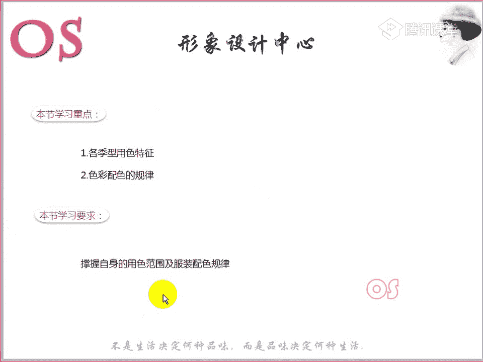

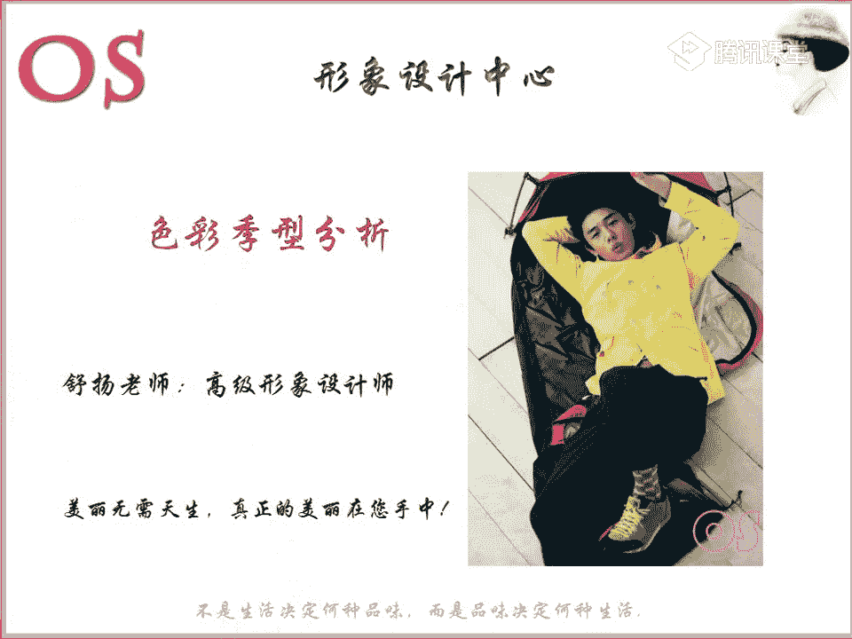

也就是说呢这样的一个整体的一个个四G色彩，还有包括说的范围大一点。我们个人的形象咨询行业呢，在中国的一个发展和诞生的话是在1998年。那么完全启蒙的一个阶段呢，是从1998年到2000年。

这个两年的时间，在启蒙的阶段。2000年到2002年呢，它的一个技术，它是属于这样一个技术传播阶段啊，然后到了2003年等于是整个行业有了一个初步的一个形成。2003年到2010年呢。

它是在一个发展状态壮大的一个啊情况下，那么真正形成我们这样的一个文化产业是在2001啊，11年之后了。那么现在其实除了我们一些这样的一些一线城市，可以说是呢很多同学可能听过这样一个整体形象设计四G色彩。

那么其实很多一些小城市可能都不了解。原来呢我们还有这样的一个四季色彩，还有一。形形体啊，整个的一个形象设计，对不对？我相信我们在场的有些同学可能也是因为哦唉去了解了。

在我们这样的一个腾讯课堂了解之后才会知道的有没有是属于这样一个情况的，可以跟老师刷的鲜花哦。就之前可能在生活圈子中，或者说在平时的这样的一个工作啊，生活中是没有听过的，对不对？

所以说这个是属于我们的一个新兴行业，而且它的一个后面的一个前景也是非常可观的。那么就基本的跟大家介绍了一个4G色彩一个理论。所以说大家知道它的一个来源就可以了。

那么呢唉简单的去了解一下它在中国的一个发展。好，第二个呢我们就是要讲着重的讲到呢我们这样的一个虽然唉讲到了四季色彩，对不对？我们这样的一个人体呢也是有颜色的。

而且呢为什么说我们这样的一个皮肤是人究研究人体色的一个主要对象呢？大家有没有想过老师这一句话啊，你们来解释一下，有没有同学想要发炎呢？可以积极发言，为什么说皮肤是研究我们人体色的主要的一个对象。

大家可以想一想啊，然后呢可以积极的把自己想到的一个答案呢打在公台上。会发现我们每个人啊其实人体不要觉得都是黄皮肤，哎，黑头发。那么其实细微的去观看呢，我们每个人的发色，每个人的肤色，每个人的眼球色。

还有包括我们的唇色呢都会有细小的一个差异，对不对？嗯好，我们的向日葵同学说，因为要以人为本啊。嗯，这样想到这个点呢也不错啊，也不错。然后呢。那老师的介绍一下啊介绍一下。那么其实像我们这样的一个。

因为我说了我们不同的人发色、肤色、眼球色、唇色其实去观察一下你现在身边的人就会发现都是有细微的一些差异的。但是为什么说人体色是皮肤是研究我们人体色的一个主要对象呢？在人体色中。

你会发现呢头发其实是可以进行漂染的，对不对？还有包括我们的唇色，我们的眉色可以任意的描画和纹染。但是甚至我们这样的一个瞳孔，也就也就是你的眼球，我们也可以呢用有色的这样的一个隐形眼镜来改变，对不对？

道理是这样的一个道理啊，但只是只有我们的肤色呢，它是相对稳定的。而且呢在我们的整个的人体色中，它的比例是最大。所以呢我们研究人体色特征的主要对象呢？就是我们这样的一个皮肤。嗯。

这个就是为什么说我们的皮肤是研究人体色的一个主要对。因为第一呢它的范围非常大，而且这个是没有办法去进行改变的。所以我们都要以这个为准。所以包括呢哎我们在场的也有我们的顾问班的同学。

以后你们在接触这样的一些男士的时候，也是一样的，不要完完全全被我们的眼球或者说他的发色所去牵引。最主要的就是要看整个的皮肤的一个状态。这是一个大的根本。

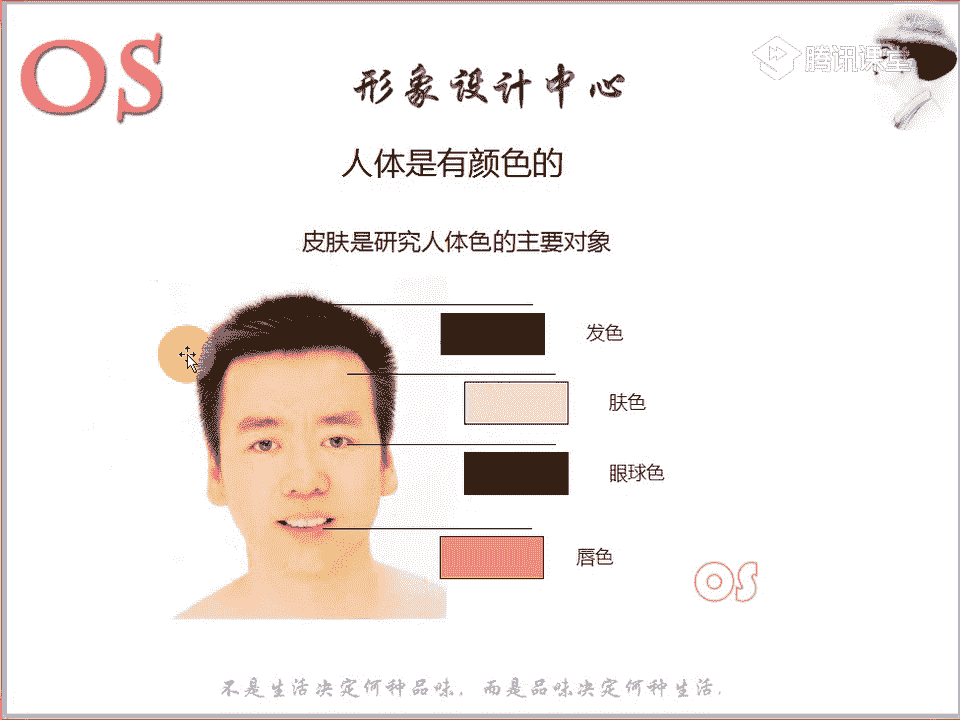

大家可以看到啊，我们不同的眼球的颜色，对不对？不同的肤色啊，质感，还有包括我们不同的发色，这是一张大图啊，给大家呢。看一看。

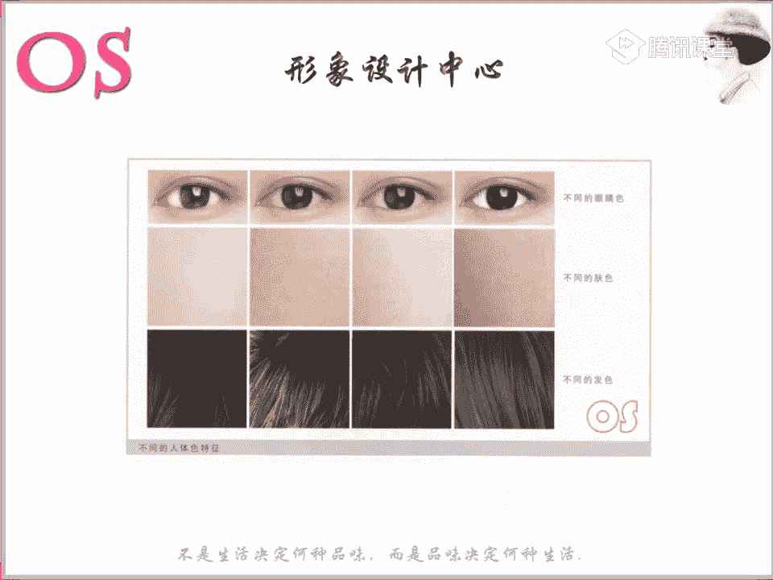

其实说为什么说你会发现哎我们不来研究这样的一个瞳孔色？为什么说因为肤色是我们研究人体色的一个主要对象，对不对？那我们会发现为什么说有的人的肤色它会白一点，有的人肤色会黄一点，或者说黑一点。

那有的眼肤色呢非常的均匀，或者说有的唉肤色来说呢不均匀。其实呢它都是跟我们这样的一个皮肤哦，肤色所含的这样的一些胡萝卜色素以及呢血红色素，还有呢黑色素哦。

因为是这样的一些原因。所以说这样的一些部分的话，其实大家不用去记啊，就主要是了解认知就可以了。因为这个都是属于顾问班的重点的一些知识。只是在我们在讲到色彩进型的时候呢，跟大家认真来分析一下。

知道为什么说我们的人会分这样的一个色彩剂型啊。那么如果说你的胡萝卜色素含的比较多，可能呢你会有这样的一个自然自然倾向为主。那如果说你的血红色素啊，你的皮肤的血红色素呢比重含的多的话呢。

你会有这样一个粉色倾向。那当然啊有的同学如果说偏黑的话呢，其实啊也有可能第一呢你不仅含胡萝卜色素的比重比较大，甚至呢你还有含有这样的一个血红色素啊，这个点能不能理解哦？理解同学呢跟老师扣个一。

所以说我们呃每个人的皮肤就会发现女士也好，男士也好，都会有这样的一个粉色的。嗯，呃黑色素就会显黑吗？是的啊，如果说黑色素的一个比重偏大的话，它会有这样的一个偏黄偏黑的这样一个倾向啊。

那除了我们哦因为这样的一个基本啊，因为我们皮肤所含的就是胡萝卜、色素、血红色素，还有黑色素啊，这三个非常重要的这样的一个成分嗯。好，偏暗的话呢，其实说明的可能就是你的这样的一个纯明度的啊关系。

接着听老师啊，接下来呢我们继续来讲。那我们都知道哦，色彩有三属性，对不对？色彩有三属性。我先在问一问大家哦，你们还记不记得色彩的三属性？😡，还记不记得色彩的三属性啊，记得同学在公台上把答案打出来哦。

考一下大家。其实非常简单这个问题啊。色彩的三属性是指的哪三个属性？懵了吗？😡，好，是不是是不是都都交给老师了？嗯，明度纯度，还有呢。还有什么？好，色相啊非常好。对，两位同学的回答之后呢。

我们就答案就是正确的啊。哎，我们的三属性就是色相明度和纯度。那么色相它所指的其实不仅仅是色彩的相貌名称，对不对？还有这样的一个冷暖，对不对？然后明度呢是指的我们色彩的明暗程度。

纯度呢指的我们色彩的这样的一个鲜艳度饱和度。那么不管不仅仅色彩上面，它有这样的一个三属性。那么其实我们人的皮肤呢也是有这样的一个属性的。那第一个呢就是因为啊我们这样的一些比重的问题。

还有整体的皮肤的一个质感，你会发现呢我们有分为这样的一个暖肤色和冷肤色。但是在这里呢不希望大家去纠结哦，唉，是不是冷色的人就白啊暖肤色的就黄，这不是一个绝对的概念啊，所以说不用去以观察这个图片。

然后呢去判断所有的白的皮肤都是冷肤色，所有的黄的皮肤都是啊这样的一个暖肤色，我们就接下来看就好了。我们皮肤有这样的一个冷和暖。所以说在这里呢为什么说会去把这样的一个图片给大家看？

就是希望我们各位同学呢一定要认知到穿对色彩，对于我们来说的一个重要性啊，不要不要学完所有的知识之后呢，我还是没有任何的这样一个概念。我觉得我喜欢这样的一个深色调，我就照样穿深色调。哎，我喜欢浅色调哦。

我就照样穿浅色调，你们还是要根据呢老师所给你们诊断的这样的一个记性，严格的去按照穿衣。只是说可以在一些呃其他的一些部位呢进行这样的一个爱好的一个注入啊，就比如说我喜欢深色的，我可以把它放到下半身去穿着。

对不对？或者说我在某一些场合呢去着重的去穿着。所以说要懂得把爱好和自啊就是喜爱的和自己真正适合的呢灵活的灵活的去结合到一起。因为尤其是我们这样的一个离面部啊比较近的，唉，非常非常的关键啊。

大家可以看到啊，唉，暖肤色的我们都知道暖肤色的人应该是要穿暖色的服装，对不对？冷肤色的人呢应该要穿冷肤色的服装。那我们可以看到这张图片，在我们暖肤色的这样的一个映衬下啊。

我们不同的这样一个冷暖的颜色会呈现呢会给他的这样一个面部啊，皮肤呈现不同的视觉效果。大家可以观察一下，但是可能这张图片不是特别的明显，是因为呢。毕竟暖肤色的人，他的驾驭度要比我们冷肤色的人呢驾驭度要高。

所以说即使我们暖肤色的人穿一点点冷色，它也不会像我们冷肤色的人穿暖色那种冲冲击感那么的强。所以说你会发现这张图片中不是那么的明显，但是也能够看出来，对不对？

就比如说呢现常老师啊的鼠标看我们会发现暖肤色在这样的一个暖色服装下呢会呈现这样的一个均匀感，对不对？皮肤的这样的整个状态是非常均均匀的。而且呢这样的一个脖子和服装是完美的起，就是镶嵌在一起。

而我们这样的一个暖肤色的人穿冷肤色的服装，你会发现我们脖子这里是往前面走的，对不对？有一点前进的感觉，而冷肤色的这样一件衣服呢在往后退，冷色调的衣服在往后退，脖子在往前面走，所以说会有这样的一个不和谐。

有有时候。过我们。在逛街的时候，可能有的同学会遇到这样一个情况，就是哎你这件衣服真漂亮啊。其实你就要想一下是不是这件衣服抢了你这个人，也就是说你在穿不适合自己的这样的一个冷暖的时候呢。

它会发生这样的一个情况。那么当然在穿不同明度或者说哎不适合自己纯度的情况下，它也会出现啊，这个就是我们暖肤色，大家可以看一下，那么接着呢我们看一下冷肤色是不是对比起啊就非常的明显。

有没有看出这样的一些差异啊，这同样都是冷肤色，脖子上的肉都是冷肤色的，只是衣服呢是冷暖的不同的这样的一个服装。是不是冷肤色在穿我们暖肤色嗯暖色相的这样的一个色部的时候呢，会显得皮肤有点发浊，对不对？

有点脏脏的感觉，又不清澈啊，有没有看出来啊，看出同学可以跟老师扣个一。有点脏脏的感觉哦嗯。特别的不清澈，有点模糊的那种概念。然后呢，这个脖子和衣服啊确确实实是完全是这样的一个呃不和谐的一个感觉。

所以说有时候确实穿错了这样的一个冷暖的话，会显得皮肤很脏，很模糊。所以说呢有时候甚至就尤其是一些同学他的五官还不是特别的立体的。你穿错了这样的一个冷暖的话，他也会显得你的五官特别的不立体啊。

会显得五官有点模糊。所以说整个人不清澈。好，那除了我们这样的一个色彩的啊，我们皮肤的一个冷暖以外呢，我们皮肤也有色调，也有调子，对不对？纯度和明度这样的一个色调。

那么肤色的色调他所指的就是皮肤的明度和纯度，肤色的明度呢？它指的就是肤色的明暗程度，所以通常我们会经常在呃自己上经常会跟别人说到，或者说别人会对自己说，哎你很白，或者说我们说那个人真白。

或者说这个人真黑对不对？会经常说这样的一些话，那或其实就是在说呢我们肤色有深浅的这样一个程度，那么指的就是我们明度的关系啊，就是我们皮肤的明度的关系。那如果说哎他的皮肤明度偏高，对不对？

这个皮肤明度偏高，我们当然就要穿呢高明度的色彩。如果它的明度偏低的话呢，我们就要穿低明度的。也就是说为什么在一开始有同学。说到老师我的皮肤有点偏黑啊，那你觉得我应该穿什么样的？

我就会建议到在服装的色彩的一个明度上呢，一定要选择呢低明度的中低明度的这样的一个色彩。啊，这两张图片呢，一个就是我们的高明度的皮肤，一个就是低明度的皮肤。那么色不呢一个高明度，一个低明度。

那这样看的话呢，其实好像感觉嗯还行，至少我们的每一个肤色都是很均匀的，对不对？但是一旦我们做一下对比的时候呢，大家就会发现这样的一个差异。那我们可以看到我们这样的一个低明度的肤色。

在不同的颜色下的一个不同视觉感受哦，大家可以先来观察一下，是不是会感受感觉到很惊讶哦。其实呢这哦这2块这2块皮肤呢完完全全是一个哦。其实没有任何的变化，但是我们的色部就是有那么的神奇。

大家可以看到这样去做对比。是不是同一同一个低明度的皮肤，对不对？但是在不同明度的色相下呢，色布下呢，我们呈现的感受是完全不同的。所以说这样的一个对比是非常强烈的。那么所以呢我们有一些皮肤啊。

老师告诉你们了，你们的用色范围啊，你们的用色范围。如果说我用我说明了低明度的话，你们就一定要穿低明度。因为一旦你穿这样的一个中高明度的肤色的话呢，皮呃这样的一个色彩的话呢，就会显黑。嗯。

右边看起来比较黑，对不对？啊，非常的不干净啊，也会不干净，所以说会显黑。有时候我们其实往往显黑的话呢，也有一个非常重要的一个点，可能就是因为我们穿错了。嗯，我们穿错了这样的一个明度而导致的。

那么肤色的纯度呢就是指的我们肤色的色彩的一个饱和程度啊，有些皮肤饱和度很高的，那么它就要适合穿这样一个高纯度的肤色啊，呃高纯度的这样的一个服装。那如果它的肤色的纯度比较偏低。

那我们就去穿呢唉低纯度的这样的一个肤色呃，那个色彩的一个服装啊。我们可以举个例子，我们来看到呢高纯度的皮肤在不同呢颜色下的不同视觉感受，是不是同样也是一样的哦，也会有一点点显得呢肤色不均匀，有点暗。

对不对？有一点点显得有点暗，然后呢也是跟衣服之间的这样的一个冲突也是非常的大。所以说我们男士的四大机型啊，不同的春夏秋冬，它们的色彩的这样的一个色相，也就是说冷暖唉冷暖油不同的这样的一个区别。

那么还有包括明度和纯度的范围都是不一样的。所以说就看到这张图片。It。🤢，大家应该都能够看出来啊，这个就指的是我们春季型的皮肤，这个指的是夏季型的，这个是我们的秋季型的，这个就是我们冬季型的，对不对？

你会发现呢不同的皮肤的色相，那么他穿的这样的一个啊，我们色彩的这样的一个冷暖不一样。那么同样明度和纯度都是有差异的。所以说呢整个所呈现的这样的一个视觉效果就是轻重啊冷暖。

那我看到看啊我希望大家看到这张图片啊，看到这种图片，你们会想到什么样的一些关键词来形容唉这样的一个感受啊。有没有一些关键词来形容？如果说大家觉得这个不是特别好形容的话，我们也可以到时候看到我们春季型啊。

然后大家可以想一想，春夏秋冬你们可以用什么样的一个形容词来形容啊。那这个呢就是我们这样的一个4季色彩图。也就是说我们不同的机型的一个用色的一个范围，大家可以粗略的呢稍微的看一看啊。

因为一会儿老师都会重点的去讲到的。稍微看一看哦，给大家呢呃10秒钟的时间观看一下，观看一下这样的一个色彩啊。然后我们就看到重点。好，接下来呢老师所讲到的这样的一个。

色彩机形的啊不同的人体色的特征的这样一个用色瓜呃规律呢，希望大家到时候就认真要记啊。然后呢，有一些话没听清楚的，就记得在公台上及时跟老师扣个2，然后就说一下哪个问题要重复。然后这个时候就开始做笔记了哦。

这个笔记是非常重要的。

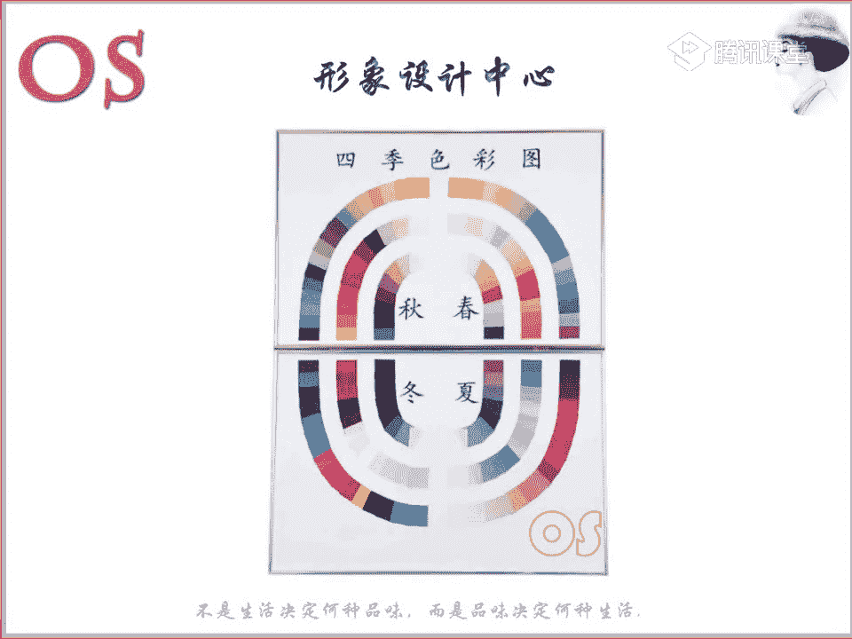

好，我们的这样的一个春夏秋冬呢，我们就先从春季型，然后讲到秋季型啊，然后呢再讲我们夏季型和冬季型。因为呢春季型和秋季型的人都是暖肤色，对不对？然后冬季型和我们的夏季型呢都是冷肤色。所以说这样的去讲呢。

大家到观察的时候呢，也会对比会更加强烈，你会直觉得很直接的感受到春季型和秋季型，哎，他们除了在我们色相上面都是属于冷色以外呢，纯度和明度是有很大的这样的一个区分的。那么夏季型和我们的冬季型也是一样的。

除了色相上面呃类是一样的。那我们这样的一个呃明度和纯度的区别是非常大的。而我们首先呢就看到这样的一个春季型，你会发现发色是属于这样的一个棕色系列的，对不对？哎，它的这样的一个眼球色呢。

你也会发现有点泛棕，而且呢或者说眼白的部分。有点。略微的感受到这样的一个湖蓝色，眼神也比较明亮，对不对？眼神还是非常明亮的，这个应该能看出来啊，皮肤的整个状态的话呢也是比较白皙的。但是白皙的同时。

你就会发现他的脸上是上有泛有这样的一些珊瑚的粉色，或者说桃粉色的红润感哦。老师刚才所讲的，我不知道大家都能不能看出来哦。你们会用什么样的一个形容词哦来形容我们这位的男士呢？有没有合适的形容词啊。

所以大家可以来大胆的说一下。这就是我们春季型的啊一个男士的。举个例子啊，可能。这个典型的春季型男士的一个皮肤应该还是蛮清楚的吧。大家能应该能够很清楚看受看到啊。还有同学说到暖男哦。眼神是非常明亮的。

非常清澈的，对不对？而且呢是很有朝气的，也很生动，整个人的这样的感觉是很生动的。因为一会儿你们再对比一下，看其他男士啊，哎，我们先快快速跟大家来对比一下，你们可能会感受更清楚，那这是秋季型的。

这是秋季型的男士啊，这是夏季型的。

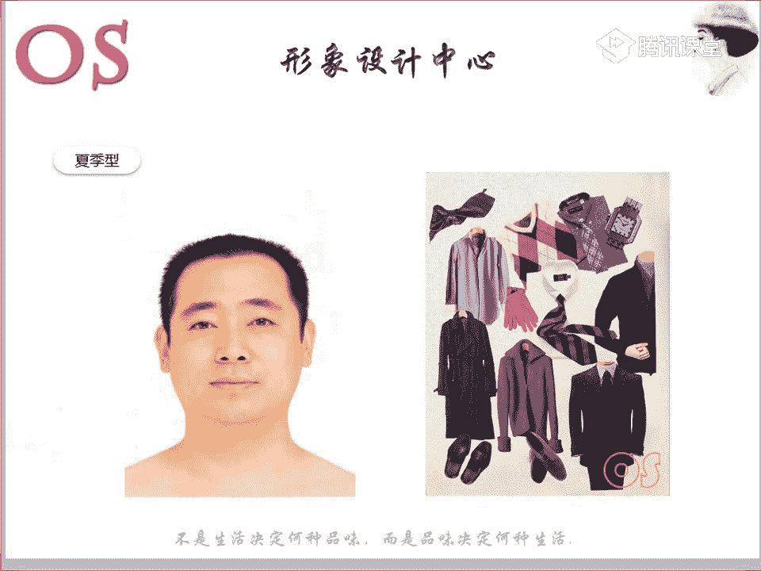

哎，这是我们的动机性的。所以说春季型的你会发现很有年轻感，有朝气，对不对？而且也很生动啊也很生动。所以说呢。我们看到他的这样的一个服装，这是一个服装的总览图。

大家可以看到这是一个他所适合的服装的一个总览图。那你会发现他他的服装上有一个特点就是什么啊，我让大家来说一下啊，你们觉得他的服装的。😡，明度怎么样啊，明度怎么样，给他给他一个范围，看的这些图片。

给他一个范围。明度啊。好，明度比较高。好明度比较高，然后纯度呢。纯度啊纯度大概嗯纯度比较低啊。好，我们向日葵同学是说到纯度比较低啊。那么呢老师这边呢总总总结一下。

然后我们再看看其他的一些图片的一个展示啊。那么它的试用的一个整体的一个服装用色，你会发现明度比较高。这一点呢是它是所有含到的。因为它适合一些浅淡鲜明生动活泼的这样的一个暖基调的一个色彩群。

是不是整个服装色彩中，你也能够感觉到这样的一个活泼生动，对不对？哎，这样的一个鲜明啊，同样它的纯度其实并不低啊，它的纯度其实不低。它适合去穿一些呢纯度哦，中偏高的这样的一些色彩，它是适合的。

那么这个呢就是我们春季型的所适用的这样的一些色彩。当然这样的一个色彩呢是非常适合它。比如说呢有在一些休闲场合去运用，或者说一些点缀色去运用，或者说有一些衬衫可以去选择。

那么如果说它一旦唉在这样的一个正式职业场合的话，比如说它要穿着西装的话呢，我们西装的颜色还是可以去选择唉类似于这样的一些。

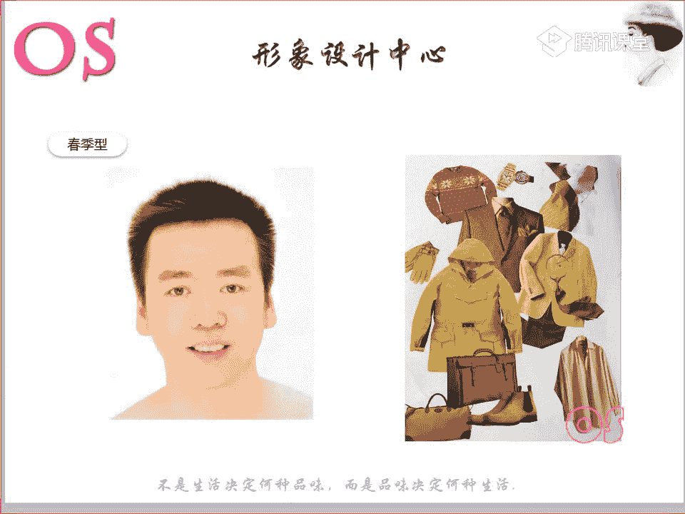

藏青色对不对？这样的一个藏青色或者说这样的一些偏暖的一个深一点的蓝色，还有包括像我们这样的一个啊。发着的这样的一个淡淡的哦，这样一个浊绿色也是可以的。也就是说在正式场合的时候。

或者就是在选择西装外套时候，他也可以穿一些稍微偏深一点的调子。因为这是场合的一个原因啊，那么最好它当然最好穿着的就是这样的一些哦明度稍微呢偏高一点，对不对？纯度也要稍微呢偏高一点点的这样的一个用色啊。

这个大家一定要记住啊，然后我们来看到我们这样的一位男士啊，他所穿着的服装的一个搭配呢都是典型的。我们春季型的男士呢所适合的。对，穿粉色会很好看。是的。暖色的粉啊一定要穿着暖暖色的粉。啊，大家可以看到。

这是我们春季型的啊，所以说你会从服装的这样的一个用色中呢能够感受到浅淡鲜明生动活泼，对不对？这样的一个暖基调的一个纯。所以说呢总结一下啊，大家记一下，在职业装的时候呢，我们适合去选择一些驼色啊。

棕色或者是说浅灰色以及呢饱和度略微高一点的这样的一些蓝色做西装色，这点可以记一下啊。好，但是如果说是在非常严肃的职业场合的话呢，我们可以用到黑色和藏蓝色。但是其实如果说是一般职业场合。

或者说我对于西装颜色没有要求的话，其实像黑色、深灰色、藏蓝色呃，作为西装色的话呢，其实是尽量去回避的。尽量去回避的啊，那么。如果说呢衬衫的话哦，我们在职业装除了刚才所说的西装的颜色，那么衬衫的话呢。

我们可以去选择一些浅浅淡的明快的色彩。也就是说浅浅的淡淡的啊明快的这样的一个色彩。也就是说选择一些高明度的啊，低纯度的颜色。那领带的话呢，我们可以去选择在它自身的色彩裙中这样的一些明亮鲜艳的颜色。

也就是说点缀色可以选用一些呃明亮的鲜艳的颜色，纯度呢稍微高一点，明度呢稍微呢偏啊这样的一个中高，对不对？好，这个就是职业装哦，职业装大家都记完了没？记完的话跟老师扣个一。😊，好。

我们呃我们另外一位同学是用手机的，我不知道方不方便做笔记啊。那如果说没任何问题的话，老师接着讲了啊。那么休闲装的话呢，我们色彩的这样的一个特点呢，就是大家可以看到这里。休闲装对不对？

我们就尽量选择自己色彩裙中这样的一些明亮的啊这样的一些颜色。当然哦我们可以去选择跟驼色棕色系搭配，或者说这样的一些暖的这样的一些军绿色，稍微沉稳一点点，深沉一点的颜色也是可以的，可以去跟它做搭配啊。

但是其实要以这样的一些色彩为主。所以说大家可以看到这里啊，就典型的用这样的一些明亮的颜色去给跟我们这样的一些驼色系棕色系列去做搭配，对不对？嗯，这是他非常适合的。

所以说他穿这样的一些驼色系是穿的非常好看的。那么整身的这样的一个搭配的话呢，其实它是适合选择这样的一个呢啊类似的搭配啊，它是适合选择类似，然后呢可以稍微的带一点点对比。也就是说类似的同样可以。

但是呢它如果说对比清晰的搭配效果也是非常不错的。也就是说我们整个的春季型的人是非常适合突出色相感的啊。这样的一句话我不知道同学能不能理解啊，就是适合突出色相感。有没有不理解。

不理解的同学可以跟老师扣个2啊。适合去突出色相感。嗯，哎我们好不理解啊，其实就是说色相要清晰，你会发现有些有些颜色它的色相感是不清晰的。就比如说你像我们的秋季型，像我们春季型的人色相很清楚，对不对？

黄是黄绿是绿，蓝是蓝，哎，粉是粉，所以说这就是这样一个概念啊，要突出色相感。😮，所以说呢我们春季型的人呢非常不适合去哎搭配这样的一些呃，比如说。嗯，就是一些色彩上比较陈旧的。

或者说一些暗卓的这样的一些色彩，它是不适合的，它是非常适合搭出这样的一个色相感的一个配色。嗯，可以这样去理解我们薰烟草呃同学非常的棒。是的。😊，也就是说他去带这样的一些着色调是不不合适的对。

所以说呢我们在非严肃的职业场合呢，可以使用大面积的浅淡色哦，浅淡色。然后呢，如果场合允许的话呢，适适当的去点缀一些鲜艳的颜色。但是在商务场合中，我们尽量要使用暗青色搭配啊。

这样的一个尽量也要有这样一个清晰对比啊，清晰对比度也要强。呃，比如说白和黑对比就很强，对不对？所以说一定要搭出这样一个明显的色相感，千万不要去给自己选择服装中的那种着色啊，着色色相那么的强烈。

那么呢鞋袜的颜色彩呢最好是要跟哎我们的裤子的颜色一致，或者说这样的一个渐变的搭配啊。唉鞋子和袜子的这样的一个色彩呢哦就是鞋子和我们这样的一个裤子啊，鞋袜的颜色和裤子的颜色呢最好是一致。

或者就是渐变的搭配是比较适合我们春季型的人。那么它适合的这样的一些饰品色呢，比如说亮的黄金类的，或者说呃泛黄的这样一些。铂金类的饰品啊都是可以的，或者说这样的一些银色的镶嵌的搭配饰品。

它也是可以去加入的。那么它戴眼镜的话呢，像我们春季型的人，戴眼镜，就金丝边的呀、浅棕的呀，或者说浅橙的这样的一些眼镜。好，再来说一说我们这样的一个发型啊，我们春季型的人呢，如果你一定要染发。

你就最好去染这样的一些棕黄色调的哦，暖色调的这样的一些啊色彩要染的话。好，最后总结一下我们春季型的，在选择颜色时要必须要注意回避的。第一个呢就是以蓝色为基调的这样的一些冷色的蓝。

它一定要选择呢我们这样的一个暖色的蓝啊，暖偏暖的暖倾向的这样一个蓝，千万不要给它去选择泛冷的啊，冷冷的这样一个感觉的。

另外呢就是要多，尤其是离面部近的上半身的色彩呢，要回避这样的一些暗淡的色彩哦，暗淡的颜色。然后最后我们有个同学说的很好的，就是要只能掺白色，不适合加的灰色，对不对？所以说灰调较强显旧的这样一个颜色呢。

我们春季型的人是绝对不适合的。这是一定要谨防回避的啊。好，关于我们春季型的用色啊，服装这样的一个老师找的这些图片啊，大家还有没有什么问题？如果没有任何问题的话呢，跟老师扣个一。好，没有问题的话哦。

我们有没有问题啊？有问题的话现在可以提啊。没有问题的话，我们就看到呢我们的秋季型。好，看到这位典型的秋季型的男士，我们先来观察一下他的发色，他的皮肤，她的眼球哦。哎你会发现发色是比较浓重的这样一个棕色。

对不对？嗯就是非常典型的棕字啊，就是秋季型的人啊，然后呢眼珠的颜色你会发现泛有一点这样的一个暗棕色啊，同样眼白呢也有这样一个湖蓝色，眼神是非常沉稳的。哎，我们可以看到他跟春季型的人是不是要显得沉稳很多。

对不对？两张图片一做对比啊，看一下眼神。

应该大家能够看出来啊，就因为这是典型的这样一个代表在跟大家举例子，所以说会非常容易观察。

那另外的话呢，两个人的皮肤你也能够明显的感受到哦，虽然都是偏暖皮肤，但是我们秋季型的人的皮肤它会更加的密实，对不对？会更呃匀整一点啊，密实。他要比它密实，密实其实就是后的意思。然后呢。

像这样的一些瓷器般的象牙色啊哦，对它也是有的啊，橙黄色。然后脸颊的话呢，它不会像我们春季型的人那么容易出现红晕感。好，这个就是它的一个整体的服装的一个用色啊，一个大概的整体的一个示意图。大家可以看到哦。

刚才老师所说到的我们这样的一个秋呃，春季型的人呢，他适合去搭配我们这样的一个色相感，对不对？嗯，秋季不能其实我要跟大家说明啊，就是不要去看白的，就是属于我们这样的一些啊春季型或者说秋季型。

其实整体来说呢，你要说白的话，也就是说这样一个明度高的啊，明度高的典型的都是我们的春季型和夏季型的人，他的皮肤的明度比较高。而我们秋季型和我们这样的一个冬季型的，它的明度都会偏低啊。好。

然后回到刚才所说的，我们春季型的人呢适合去表达啊表现这样的一个色相感，对不对？而我们秋季型的人就刚好跟他相反。大家可以看到这样一个服装的整个的一个示意图，你就会发现它其实不太适合呢啊色相感。

用色相去进行这样的一个配色啊，所以说不太适合。整体的话给人比较沉稳成熟稳重的。所以说呢我们服装的一个用色呢也要浓郁一点，浑厚一点这样的一个暖基调的一个色彩裙。

大家可以看到，这个就是我们的秋季型的啊这样的一个用色范围。也就是这个是典型的我们一些休闲服装，只是说呢我们这样的一些点缀用色。好，我们向日葵说到高纯度啊，低明度。

其实呢它的它的纯度啊嗯嗯我我以为是很确定答案啊，其实不是这样的啊，它的这样的一个纯度的话呢，它是适合这样的一个中偏低的一个纯啊纯度。它的其实它不太适合纯度太高的色彩啊，纯度太高色彩它不适合。

也就是说呢我不知道大家还记不记得我们呃那样的一个色调图啊，应该还记得色调图的话，因为老师这里好像是没有啊。因为我这里没有放那个色料图，我不知道大家现在手里有没有同学是有的，可以发上来。传上来哦。

如果没有的话，你们可以啊，我相信应该大家都有保留吧。色调图的话呢，上面一排对不对？上面一排是所显示的就是我们的明清色调，也就是说所有加白的颜色都是明清色调嗯。然后所有加灰的颜色呢都是我们的着色调。

对不对？然后下面一排啊，也就是说这样的一个倾斜的，因为它是一个三角状的，对不对？一个倾斜的这样的一个下面一排呢，它是所有加黑的颜色，就是我们这样的一个暗青色。那其实我们秋季型的人呢。

它是适合第一暖色基调。然后呢适合这样的一个着色和暗青色。这里要记一下啊，适合着色和暗青色的。嗯，所以呢我们秋季型的人在选择哦，这是我们的这样一个服装。像这样的一个橙色的话呢，它可以去选择。

但是其实最好是不要去大面积的去穿，小面积的会效果会更好。整体的话都是这样的一个暖色，嗯，加灰和加黑嘛。是的哦，暗青色调呢就是加了黑的哦，我们的着色调就是加灰的，它是适合加黑和加灰的这样的一个色彩调子。

然后我们李易峰这一身就是典型的秋季型的男士的一个穿着服装的一个代表。这一套啊不是说它是秋季型的，而是说他这身衣服是非常非常适合我们秋季型的那当然如果说呢。嗯，我们把裤子稍微再换一下，会更好。

不要去选择啊明度太过于，其实换一条其他颜色，或者说我们稍微偏深一点的这样个裤子也是可以的。所以说我们秋季型的人在选择呃我们职业装的时候呢，可以去选择一些棕色的，唉，或者说深毛蓝色的哦，深一点的毛蓝色。

深一点的毛蓝色啊，或者就是说我们这样的一些橄榄绿，看到这里啊，橄榄绿的这样的一些深色调暖色呢作为西装色非常好。然后呢，尽量呢回避一些黑色灰色或者说饱和度高的蓝色呢，作为西装颜色。

他穿灰色没有夏季型的人穿灰色穿的好看。所以说灰色还是尽量去避免，还有包括我们的黑色，比如说他穿黑色就没有冬季型的人穿的好看。嗯。所以说它更适合呢这样的一些棕色系的西装。

或者说我们的橄榄绿啊也是不错的一个选择。那么衬衫的话呢，我们还是以黄为基基调啊，雅致而稳重的这样的一些色彩。我们可以从这样的一个色彩群里面中呢，选择一些唉黄为底调的雅致稍微稳重一点的色彩呢。

作为它的这样的一个领带的呃用色稍微深一点点，对不对？稳重一点的。不要去选择太亮的色彩，作为领带颜色，那更适合我们春季型的人。

大家可以看到啊，这更适合春季型的人。那么秋季型的颜色稍微还是要稳重一点的。所以说去选择一些黄为基调的这样一些雅致而稳重的一些色彩。比如说老师鼠标这两个颜色就可以。那么呃这是衬衫啊，衬呃这是领带。

还有包括衬衫也是一样的哦，放到一起一样的一个概念。好，休闲装中呢我们的色彩的特点呢就可以选择一些色彩裙中比较浓郁的。然后呢鲜艳的颜色可以跟我们的棕色系呢去做搭配啊，哎，浓郁一点，色彩可以浓郁一点。

但是也适当的要去注入一点我们这样的一个鲜艳度，休闲装中啊不可以太过于沉稳啊。

所以说我们的秋季型的人也适合这样的一个更适合这样的一个渐变的一个搭配手法。嗯，等到明天我们讲配色的时候，都会去讲到这样的一个渐什么是渐变搭配哦。所以说在商务场合它适合使用暗青色、明青色的这样的一个搭配。

那么在浓重的场合呢，我们可以去点缀一些中高纯度的啊，或者说我们这样的一些深色调。但是如果说是呃一般的职业场合的话呢，其实大面积的去选择我们加了一些灰的色彩会更好。也就是说去用着色啊。

你会发现像我们这张图片大部分都是着色调，对不对？那么回避去搭配一些呢明显鲜艳的这样的一个色相感啊，这是我们的呃秋季型。那么包括鞋子和袜子的这样的一个色彩呢，应该去跟裤子的颜色一致，或者说渐变搭配。

要么就是统一搭配，要么就是渐变搭配，要么就是鞋子、裤子哦袜子颜色一致啊，要么呢就是我们稍微有一点渐变搭配是可以的。那么它的首饰其实也是比较适合金色，或者说我们这样的一些呃银色镶嵌的这样的一些搭配啊。

就适当的有一些银镶嵌的饰品是可以的。就是金和银在镶嵌。眼镜框呢也是适合去戴一些深棕色的，或者说金色边框，或者说我们这样的一些树脂边框的这样一个眼镜。那么秋季型的人，如果说他要去染头发的话呢。

我们去染一些棕色的哦，或者说同色的唉，或者说金红色调的是比较不错的选择。

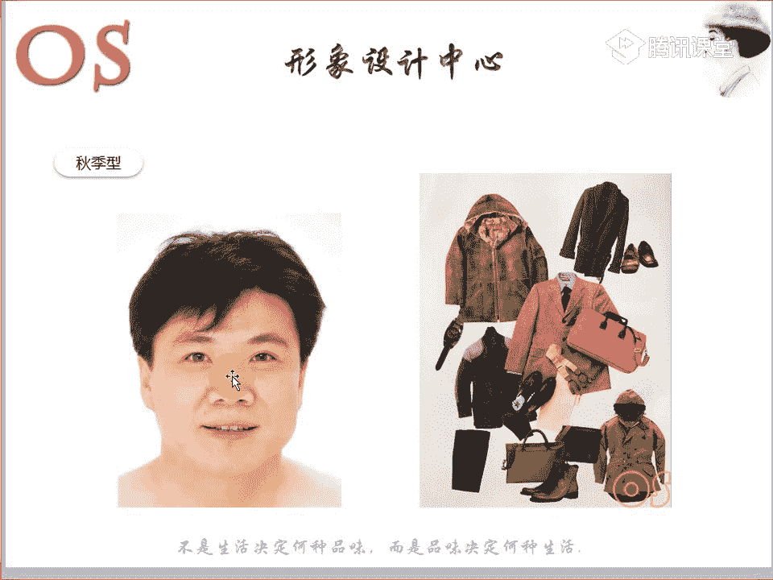

好，大家如果说哪个知识点没有记清楚的啊，可以呢在公台上提出来。那么总而言之呢，就是我们秋季型的男士要回避一些以蓝为基调的这样的一个冷色啊，就是回避冷色，就是回避冷色。

那么第二个呢就是要回避一些过于浅淡的色彩，不适合啊过于浅淡的色彩。除非说你是在这样的一个刚才我所强调的就是我们商务场合，你可以去用运用一些明清色。

但是在我们真正这样的一些可以自由去选择这样一个场合的时候呢，尽量回避我们的浅淡的颜色。另外的话呢还有包括饱和度太高的色彩呢。我们小面积的去穿，千万不要大面积。因为我们不同于春季型的人啊。😊，好。

关于我们的秋季形带还有没有什么问题？我们再来看一下，其实快速的来跟带着大家来对比一下我们的春季型。哎，再回顾一下春季型。然后呢哎我们接着看一下秋季型。

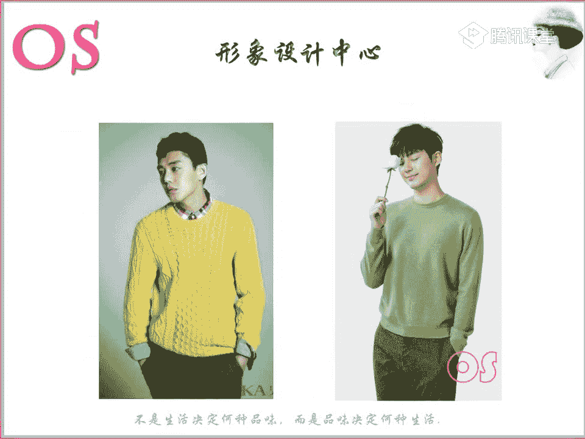

他们的服装啊这样的一个用色的一个感觉，其实都能够去看出来，他们都是含有这样的一个暖底调的，对不对？嗯，然后只是说我们在明度和纯度之间呢发生了一些区别。

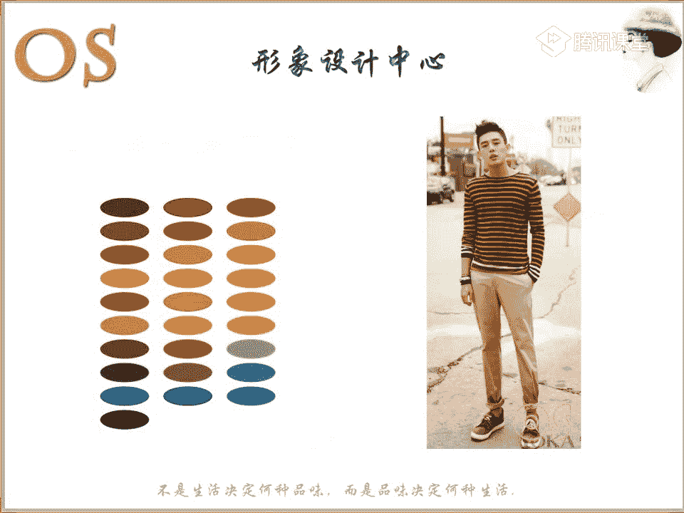

好，接下来呢大家如果说都记好了，我们就看到我们的下集形。好，这是我们的一个夏季型的男士。你会发现其实夏季型的眼神唉会跟我们的春季型，它其实是有类似的这样一个感受的，对不对？

整个的话呢会比较温和啊，因为。

也是比较温和的。然后很有亲切的这样一个感受。头发呢就整体来说它是泛着黑或者说这样的一个黑灰啊，或者就是说很深的这样一个深棕色。那么眼球的话呢呈现的效果是属于这样的一个玫瑰棕色，或者说唉深一点的棕色。

然后眼白的话它是泛有这样的一个柔白色的，眼神比较的稳重，但是又有一点柔和的感觉，对不对？那么皮肤是属于我们这样一个泛青一点的，它其实呢他的皮肤是有点点泛青的。所以为什么说之前老师就说过，冷色调的人。

他的皮肤是泛青的，而我们冷色型的人，他的皮肤底调，你会发现他泛有一点点珊瑚红哦，大家可以再来对比一下啊。

可能这个看的不是很清楚。如果说因为大家都没有接触过这样一个诊断方面，所以说你们看的不是特别的清楚。但是记住老师所说的啊，因为下肢型的人冷色调的人他都会泛有一点青色，皮肤会泛有这样的青色。

当然我们的夏季型的人的皮肤的这样的一个密实度它也是比较低的啊，所以它不是很密实。然后有时候我们脸颊也会容易出现这样一个淡淡的粉色的红润红晕感啊，像我们的冬季型，你就完全看不出这样的红晕感。

它的密实度要比我们的夏季型的人高的很多。

所以说夏季型的男士呢温文而雅而气质以及与生俱来的这样的一个浅淡的冷色的一个身体的一个特征呢，最适合去穿一些以蓝色为底调的这样的一个柔和而浅淡的颜色。所以说它的用色范围呢就是多去穿一些浅淡的颜色。

那么你像这个粉色，因为大家要知道粉色不是所有的粉色，它都是冷冷色的哦。我们可以看到这张图片啊，都是暖色的。大家可以看到这张图片。

我们都是两个粉，对不对？这个粉和这个粉一对比就能够看出来。😡，是不是一对比就很很明显，能不能看出来冷暖？😡，我相信大家都能够看出来哦，哪怕是一张照片，我都能看得很仔细。所以说像冰粉色。

就典型的这个颜色就是个冰粉色。嗯，冰粉色它是个冷色的粉。那如果说我是属于冷色型的人，我喜欢粉色。而且我又适合选择这样的用色范围的话呢，我就选择这样的一个冰粉色。那么如果是暖色的这样一个男士的话。

我们就选择唉我们典型的这样的一个粉色。😊，好，夏季型的人，你呃为什么会说自己的脸的明度是中低呢？是因为觉得自己的皮肤会泛有一点点黄，是吗？好，其实不用去纠结，不是所有我我要说明白啊，我要说明白啊嗯。😡。

我要说明白，就是呢呃如果说我们的用色范围哦，如果说我们是夏季型的人，那我们其实要记住就是纯度这样一个概念，一定是中低纯度，对不对？那么可能我们皮肤的一个状态呢，它会有这样的一个细微啊的一个差异。

所以说呢我们要结合我们的剂型的一个用色，然后再结合我们这样的一个风格的一个用色一起去考虑。那如果说你更适合明度中低的色彩的话，我们因为可能。微薇老师考虑到你的这样的一个风格。

所以说我们就往中低明度去选择是没关系的。但是呢像这样的一些浅淡的颜色，我们也可以小面积的去哎放到身上去穿着，或者是说哪怕离你脸稍微近一点，其实它并不碍事，因为它的一个底调。

它重点还是在这样的一个冷色相里面啊。所以说等我们学完这样一个风格，你们就会知道，其实色彩里面我们这样的一个剂型有明度纯度啊，冷暖之分。其实风格它也是有的，它风格也有它的一个用色范围。

因为风格是由行色制组成的嘛，对不对？所以说想要真正找对自己的一个用色的话，除了运用到我们这样一个色彩剂型，还要考虑到自身的风格的一个用色啊。那么一般老师在做给你们做诊断的时候呢。

都会综合的去考虑到你们整个啊。所以说我们这位同学就按照老师所告诉你的这样的一个明度中低的去选择。而我们夏季型的人呢所整体啊所适合的这样一个服装。

映润色呢就是清新浅淡恬静安详的这样的一些冷基调的这样一个色彩。那么在职业装中呢，我们可以看一下哦，稍微的。唉，look一下我们这样的一个下肢型的一个装扮啊，其实能够去感受到亲感，对不对？

那么在职业装中呢，我们适合去选择一些蓝灰色的，或者说灰蓝色的，或者说灰色等冷色的作为西装色。所以说夏季型的人去唉含有这样的一些着色调啊。所以说我们薰衣草同学你可以去选择明度中的色彩啊。

是没有任何问题的嗯。感觉夏件颜色最好看。😊，哦，我们可以去选择这样的一些加灰的颜色，夏季型的人去穿加灰的颜色非常非常的适合啊，非常非常适合。

那么唉我们要避免的就是呢去避免这样的一些棕色系列的颜色作为西装色，避免去选择棕色系，它可以去选择灰色系哦，灰色系的西装。唉，整体的这样的一个用色的一个感感觉。那么衬衫的话呢，像浅灰色、蓝色、紫色啊。

淡粉色等等这样的一些柔和的颜色作为衬衫的颜色。😊，柔和的颜色啊。然后领带的话呢，我们可以去选择一些色彩裙中比较浅淡柔和雅致的色彩。比如说像这类型的一些比较雅致的颜色，可以作为领带色呢去作为选择。

那么休闲装的这个整个的色彩特点呢，我们就当然是要去选择柔和一点的清爽的颜色，与我们的蓝灰色、灰蓝色、灰色、乳白色呢去做搭配。所以说老师所找的图片啊都是典型的，大家可以观察一下。好，我要问一问大家哦。

你们觉得我们下季型的人适合运用对比色还是适合运用渐变色呢？哎，觉得适合用对比色的跟老师扣个一啊，觉得适合用啊渐变颜色的，跟老师扣个2。好，觉得适合用对比色的跟老师扣一要，渐变色扣2啊。

要跟介绍一下正确答案。那么正确答案就是夏季型的人适合选择呢渐变颜色。哦。刚才说了，春季型的人可以用对比，秋季型的适合用渐变。那么夏季型的人呢，他也是适合用渐变色的，夏季型的人适合用渐变啊。😊。

不要去给自身穿着这样的一个哦嗯就是这样的一些对比，而且它也不太适合呢去表现这样的一些色相感。它不适合去表现色相感。而我们冬季型的人，反而他适合去表现这样的一个色相感哦。所以说下级型的人啊，我们。

一些非严肃的这样的一些场合呢，去使用一些大量的浅淡的这样的一个着色。那么休闲场合中呢，我们适度的去点缀一些中到高明度的鲜艳颜色啊，适度的可以去做点缀。然后呢，一定要记住就是呢回避去搭配出呢沉重的感觉。

不要去给自己搭配的太沉重。如果你一定要喜欢一些沉重的色彩的话呢，我们就尽量选择我们放到下半身去穿着。那么袜子啊鞋袜的颜色呢应该跟我们的裤子颜色呢一致，或者说这样的一个渐变啊搭配的一个效果。

那么还有包括首饰的话，就当然适合我们这样的一些哑光的银色的这样的一些饰品，或者说像我们的铂金的也是可以的，钻石类的饰品都是可以的。那么眼镜框呢，我们除了选择一些冷灰色的树脂框。

或者是说呢就去佩戴一些银质的金属边框。那么发色的话呢，如果说像去年我们非常流行这样一个奶奶灰，对不对？唉，如果你你是属于这样的前卫风格的那你染奶奶灰也会很好看哦。哎，灰色呃，包括我们的酒红色。

我们的紫红色的这样的一些调子，都是非常适合我们夏季型的男士去作为呢头发的这样的一个发色。😊，所以总而言之呢，我们的夏季型的人呢就要记得回避呢所有的暖基调的色彩。然后呢，还有就是深而浓重的这样的一些颜色。

以及呢我们饱和度太高的这样的一个色彩啊。好，关于夏季型的还有没有什么问题？😊，好，有没有问题？没有问题的话呢，跟老师扣个一。

所以说一定要清楚我们的用色的概念哦，一定要清楚。好，接下来呢我们就看到我们这样的一个冬季型啊，冬季型的话呢，其实会发现头发的发色是不是非常的浓重啊，对不对？头发的颜色非常的浓重啊，黑色的很浓重。

而且呢眼珠的颜色是不是也。非常的黑，对不对？很黑哦，而且呢要么就是有些同学可能他也是冬季型的，但是它可能是深棕色的这样一个眼珠啊。另外眼白的话呢也是很冷的这样的一个白色，眼睛眼神非常的锋利。

而且呢对比感也很强，整个这样的一个五官啊跟皮肤的整个的一个对比是非常强的，而且人是有重量感的，对不对？人是有这样的一个重量感的，皮肤也比较的密实啊，发青的这样的一个黄白色。

而且脸颊呢不易出现这样一个红晕感。😊，所以说呢我们冬季型的人呢整体给我们的印象就会个性非常的风明分明，而且呢与众不同的这样的一个感觉啊，他的五官是很有重量感的。

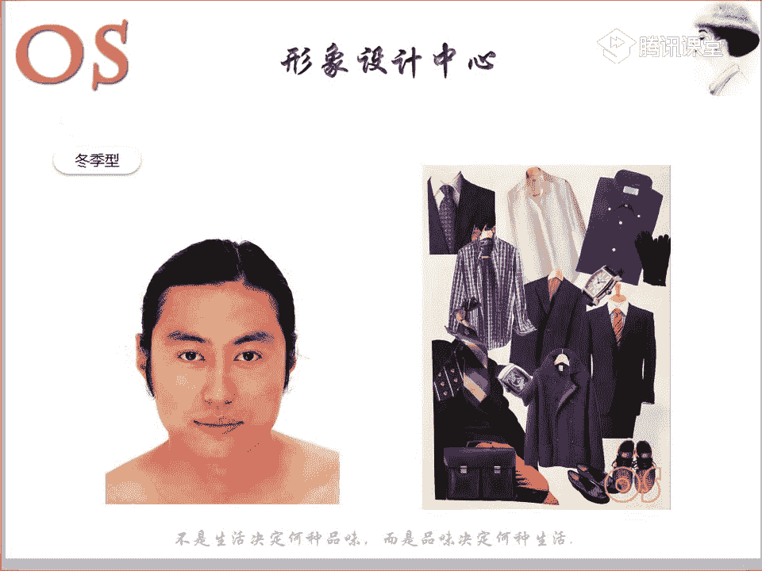

大家可以看一下啊。跟我们其他风格一做对比啊，这样的一个矩型一做对比。显得要浓郁很多，对不对？所以说整个颜色来说呢，也要去服装颜色选择一些大胆强烈群比较纯正的啊。

纯正的这样的一些饱和的度比较高的这样的一些冷基调的色彩，或者说像一些五彩色，这是它的一个用色。大家可以看到，这也是我们典型的我们的秋季呃冬季型的男士的一些外套的一个用色。所以说在职业装中呢。

我们冬季型的人可以去选择一些黑色、灰色、藏蓝色这样的一些深色调的冷色呢，作为西装色，回避一些棕色系列的啊服装颜色呢，哎来作为我们的西装色。那么衬衫的话呢，它更适合选择白色，或者说选择一些明亮的冰色系啊。

什么是明亮的冰色系呢？就比如说我们这样的冰粉色，或者说我们这样的一个冷的蓝冰蓝色呃，就是。

这样的一个色彩，你就能感受到这样一个距离感，这样一个冷的啊，这样的一些浅淡的非常浅淡的这样的一些呃衬衫的颜色。那么领带的话，我们当然是选择自己色彩裙中比较明亮比较鲜艳的颜色呢，作为领带的颜色。

这是我们的职业装。那在休闲装呢，我们可以去选择一些自己色彩裙中比较鲜艳的饱和度比较高的颜色与黑色或者说我们的白色，我们的灰色冰色系列呢去做搭配。

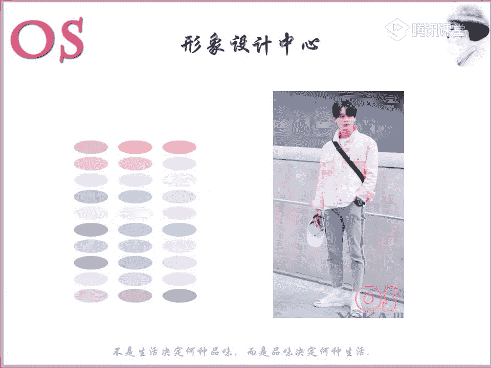

所以说我们的冬季型的人啊，一定是要适度的去呃增加一些我们的这样的一个色彩的一个饱和度啊，不要觉得唉他的皮肤黑啊，嗯他是不是就一定要穿我们啊这样的一个。呃，纯度明度比较低的色彩哦。

纯度不呃纯度比较低的色彩哦。所以说我们秋季型的人是非常适合去点缀一些饱和度高的颜色的，它其实蛮适合去运用对比色的。也就是为什么我说到了，哎，我们夏季型的人，他适合选择渐变，而我们秋冬季型的人呢？

他是绝对适合对比配色的。它可以去表现这样的一个色相感。当然哦他们在选择首饰的时候呢，也是一样的，像呃亮亮银色啊。我们刚才所说的夏季型的人是比如说像哑光的银色，对不对？

而我们冬季型的人呢就可以选择一些亮一点的银色，或者说唉钻石类的这样的一些饰品。那么它适合带一些银边框的，或者说黑色边框的。而我们夏季型的人啊，夏季型的人他是适合带一些灰的，对不对？灰的边框啊。

或者黑灰色，那么冬季型的人他是适合戴黑色的。好，脸黑黑的又带点红哦，这个要整体去看哦，不能这样去形容，就完完全全呢啊来判断我们啊冬季型。要整体去看的哦，不是带有这样一个形容词，老师就一定能够看出来的。

所以说我不我没有看到人，没办法去做做出这样的一个准确的一个判断啊。那么我们冬季型的人呢，他的这样的一个发色也是比较如果要染头发的话，其实像黑色是最适合它的那如果说你一定要染一些其他颜色的话。

比如说像灰色或者说像这样的一个葡萄籽或酒红色、紫红色啊系都是比较适合我们的冬季型的那当然我们整个的剂型的一个判断的话，在高级班会去讲到。所以说作为高级班同学呢不用去着急啊。

因为我们微薇老师到时候都会非常清晰的跟大家讲到的。而这个今天这堂课主要就是告诉大家，我们的每个剂型的皮肤的一些特征而已啊，其实你会发现当你拉拉到你生活中去观察的时候，可能又观察的不是那么仔细了。

因为我们不了，因为我没有运用到工具哦，完完全全去展了，就去进行这样一个诊断。因为我们在前期的时候，作为形象顾问来说，你们如果不依附工具的话，其实是很难去做出准确的一个判断的。

除非说你有了好多年的这样一个经验，或者说你看过看了诊断了好几百个人，可能你。😊。

就能够快速的去进行这样的一个目测的一个诊断。好，这个就是我们呢冬季型的在服装用色的这样的一些特征。你会发现唉。春季型和夏季型是这样的一个轻盈哦，轻盈活泼的感觉，对不对？哎烧。

但是我们的冬季型和我们的秋季型就要稳正了，就要稳重很多了，对不对？就要显得稳重很多了。所以说冬季型的人是非常适合用这样的一些暗青色的啊，适合去啊用暗青色做搭配。或者是说呢在这样的一些商务场合。

它是适合用明青和暗青两种颜色去进行搭配。那么在一些不是很严肃的这样一个职业场合，我们就可以运用一些点缀的一些饱和度鲜艳的颜色去做点缀。那么在生活中呢。

我们就尽量哦唉尽量去选择一些搭配出清晰度高的这样一些色相感啊，尽量去选择一些稍微呢纯度的饱和度稍微高一点的。也可以大量的去使用呢五彩色去做搭配。就比如说我们如果说我们作为冬季型的人。

老师我很喜欢白色和黑色。那么你们去拿白色和黑色做搭配是非常好看的。是比我们的春季型、夏季型和我们的秋季型穿黑白两色穿出来的效果会更强。所以说冬季型的人总而言之呢就是要回避我们的着色啊。

所以说春季型和冬季型的人都是适合就是不适合去选择一些大量的着色。而我们秋季型和夏季型的人是适合运用一些着色的。这个就是我们男士的色彩机型啊。所以说我希望大家能通过这样的一个色彩剂型的一个分析。

应该是会对色彩机型会有了一个新的啊，尤其是对自己，对不对？有一个新的一个认知啊。好，老师冬季型的人是不是偏戏剧风格啊，不一定的。当然有冬季型是偏戏剧的。就比如说像我们我们VIP的同学，像潇潇同学。

她老公就是典型的冬季型加戏剧风格，但这个不是绝对的哦。有这种只是说有这样的一个情况啊，那当然有有有也有的是，比如说像冬季型的，它可能是属于我们前卫风格的，也是有的。好，关于我们这样的一个四个剂型啊。

大家如果还有任何问题的话呢，现在可以提啊嗯冬季型的人气场很强大嘛。是的，他的气场是非常强大的。冬季型的人气场是很强大的，你会发现整个人的话嗯他的冲击度啊，他的整个的我刚才说了，所以说他的个性非常的分明。

而且呢是与众不同的。我们可以看到这四个人，对不对？我们冬季型的存在感是最强的啊，所以说西服装的存在感也要很强。这是相辅相成的啊，嗯5万对比强烈。是的。

好，再看看冬季型的用色范围啊，这是我们冬季型的一个用色范围，都是冷低调。你就像这样的一个黄，就是柠檬黄，对不对？泛有这样的一个绿啊，感觉中会泛有这样一个绿。

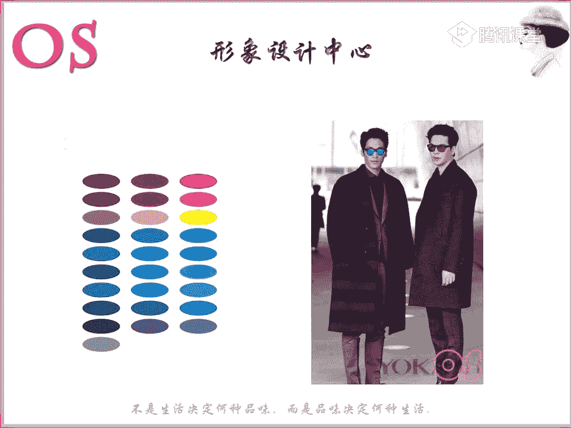

好，这个就是我们本节课的作业啊，然后就是希望大家呢对自己的服装呢进行合适的自己的一个色彩搭配。那么现在就可以把自己衣柜里面的所适合你这个器型的这样的一些搭配呢进行一下组合搭配，然后呢拍照上传哦。

那么以后买衣服的话哦，以后买衣服的话呢，就大家一定要严格的记清楚啊。笔记的话多去加深多去加深。那么像这样的一些色彩的话，大家也可以进行截图啊，保存下来。

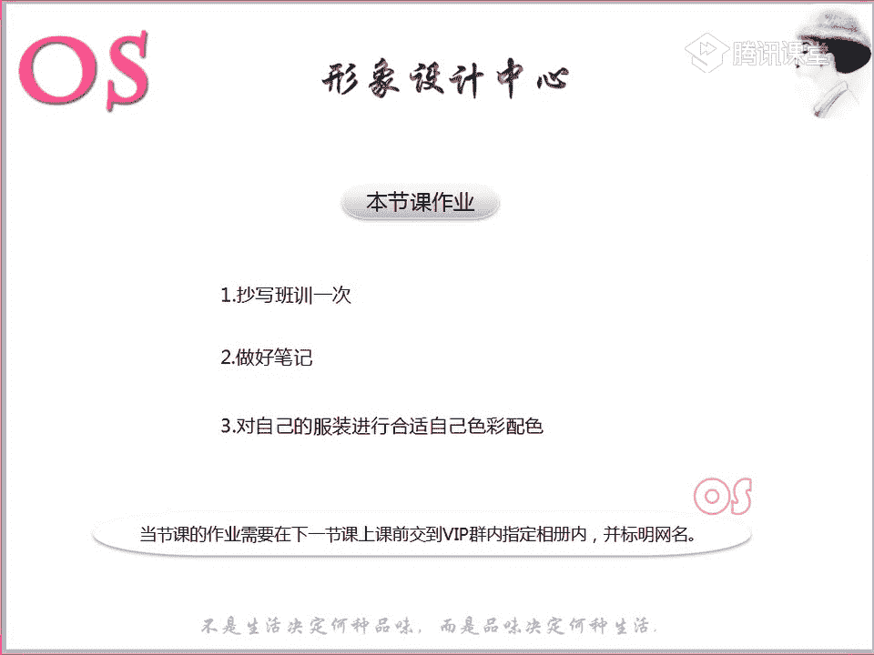

因为对于你的对于色彩的这样的一个帮助，是有很大的一个帮助作用的。或者说你直接可以截这张图也是可以的啊。那老师刚才所说的这样的一些知识点和重点的话呢，一定要记清楚。好，作业还没写完啊，那不着急。

但是一定要记得要去提交作业啊。因为这个作业也是我们等会儿到了结业的就到了这个整个的一个学习结束之后的一个考核的一个标准啊。🤧嗯。嗯呃十节啊啊作业那里我还没有抄完十节啊，什么叫什么呃，没事啊，什么抄抄完。

不是今天这堂课吧，嗯跟不上了。慢慢来哦，利用我们剩下的一些时间慢慢去补上。然后考试的话，老师也会呃也会去给你们延长一下时间的。好，这个作业还有没有什么问题啊，这个就是按照自己的，你可以把你。

因为我相信大家各位衣柜里的话，一定是会有数，至少我那么多衣服肯定能找出一套，对不对？我不说要搭配的有多好，但是色彩上面是一定要有要对的，然后呢可以上传上来，或者说我们这样的一些顾问，你们有模特的呢。

也尽量帮模特去搭一下。然后老师呢能够通过照片呢直接的去进行这样的一个指导啊。😡，哦，顾问班的同学呢，你们可以啊你们可以去找模特呢进行这样的一个搭配，或者是说呢你们在网上找一些图片也是可以的。

你可以把这样一个春夏秋冬的，还有我们这样的一个色彩，对不对？去，就是比如说哎我找到这张图片，大家可以看一下我们这张图片，男士的一个穿搭是适合哪个机型的。快快速回答老师。

这个男士的一个穿搭适合哪个机型，整体来说，鞋子、袜子，然后衣服和裤子，你们觉得哪个机型的人去穿这套衣服是最合适的。嗯，春季型非常好，就是这样，你们可以把春夏秋冬的这样一个四个季节的啊。

我们在网上找这样个图片，然后呢对应，然后发就是传上去，其实也会对自己有很大的一个帮助。因为其实找图片的过程中，是对于大家加深印象最好的一个点。😊。

其实像老师去找这样的一些照片啊，其实也不容易，也也也很难。因为要找真的要找到对应的，其实是需要去翻阅大量的这样一个图片的，但是一定是能够去找出来的。好的好的，没关系啊。嗯，然后诊断的话，老师也会尽快的。

因为会稍微要等一点点时间啊。好，大家如果说都没有任何问题的话呢，我们本节课就到这里了，然后一定要把笔记记清楚。没有记清楚的时候呢，然要及时的去听这样的一个录播啊。

因为你们现在啊哎你们现在如果说现在就对于这样一个春夏秋冬，因为我们大部分同学啊都是这样一个顾问班的同学。你们现在如果对这样一个概念有一个很清晰的这样一个概念的话，就对于春夏秋冬有一个这样一个概念的话。

其实你们上到高级班就会轻松很多。知识的一个吸收就会容易一些。因为其实高级班的知识量是非常多的，可能到时候大家会上起来都觉得很模糊。那么这个时候其实是对于大家来说去多找一些图片。

是对于大家会有很很好的一个呃帮助的啊。好我的模特分不清啊，如果说分不清进行的同学，你们可以到时候把它的照片多发一点给老师。第一呢高清的，对不对？面部特写。

全身照或者说一些平时的这样的一些生活照都可以多发一点。然后在自然光线下哦不要戴眼镜，然后呢嗯要高清，嗯，不要修片，这是这是非常重要的一些点。好，呃，如果没有任何问题的话，我们就下课了。

也是非常感谢大家一个聆听和陪伴。然后在课后的时候一定要记得多去巩固啊。你像我们那个时候在学习这样的一些知识的时候，会去买很多杂志，然后去剪，我们会把杂志上这样的一些不同风格的不同季型的去剪下来。

然后就比如说哎我们春季型的，我会去准备一大张纸，然后我把杂志上剪下来的这些春季型所适合的饰品，春季型所适合的服装，然后呢都贴在一起。对于大对于自己觉得是有很大帮助的。然后春夏秋冬去进行分类啊。😊。

