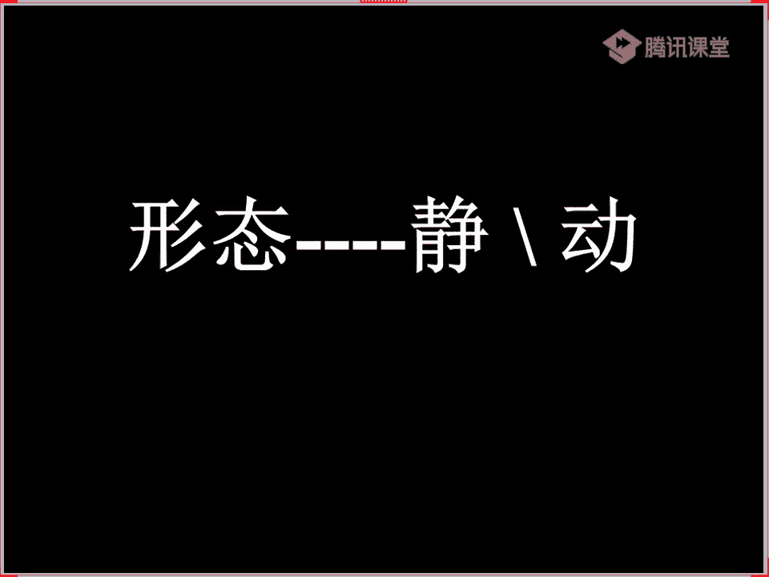
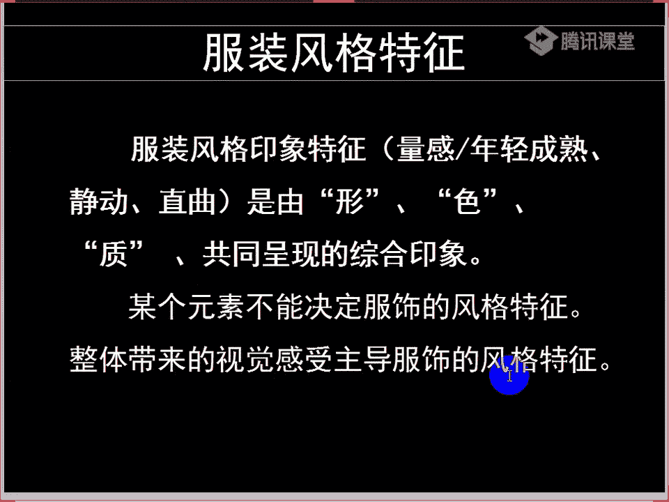
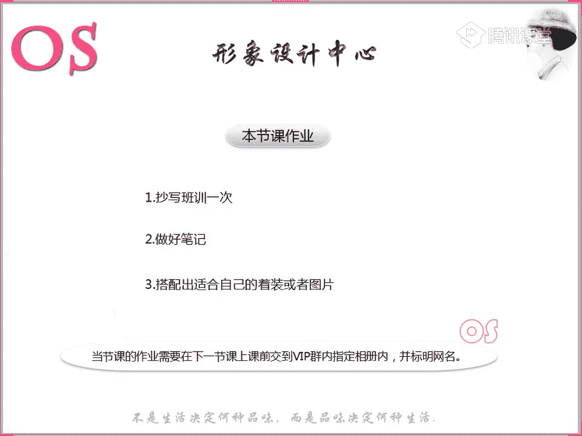

# 1、03OS男士形象VIP班《形象课》：第13节、款式风格认知

好，欢迎大家来到我们OS男士班的VIP课程。我是本节课的主讲老师舒阳。那么今天呢是我们男士班的第十三节，关于呢我们内容会讲到我们的服装风格的认知。

所以说整节课呢我们都会讲到带着带大家来认知我们的一个型哦，认识我们的型的特征。然后呢告诉大家我们男装里面怎么样去判断我们的量感，怎么样去判断我们的轮廓。😊，所以说这是我们本节课的学习的一个重点。

那么在老师所有的课程讲解完之后呢，呃我会我会举几个例子啊，给到大家让大家来判断一下我们这样的一些服装，哎，怎么样去给到哪些风格的人去穿着。那么本节课对于大家的一个要求呢。

就是对于我们具体服装呢要进行这样的一个判断。当然不要只考虑它是什么风格，而是说哪些风格可以用。那么这样的一个训练思维呢，就会更加的开阔搭配时呢，我们才能更加的灵活。所以说这节课就是对大家一个要求。

等到我们今天的课程上完之后呢，我举的这样的一些例子。我希望大家一定要考虑的是哪些风格的人可以穿，而不是只针对于说这件衣服是什么风格的。😊，好了，那我们就废话呢不多说了。正式开始呢今天的这样的一个内容。

首先呢我们要来看到这里。嗯，虽然说风格是什么，可能是在我们呃高级板块中会系统的去讲到的。但是在这里呢希望大家也要有这样的一个认知啊。我们可以看到这两张图片会发现同样都是卧室。

但是这两这两款卧室是截然不同的风格，对不对？好，我们看也可以看到第一款，你们看到第一张图片，哎，你们觉得这是一个什么样的一个风格。😊，不用去针对于我们男士的风格啊。

就直直接就去想我们在室内的这样的一些装饰中的风格的一些关键词就可以了。嗯，我们其他同学说到活泼嗯。好，那我们第二款呢第二款又是什么样的风格呢？比较的淡雅啊。

你会发现呢我们有不同的形容词来形容这样的不同的呃卧室，对不对？那其实为什么你会觉得第一款和第二款唉，他们俩的风格是截然不同的呢，主要是因为我们这样的一些事物，对不对？图片中的事物。

不仅仅这些事物来自于这一张床，而且呢床上的这样的一些设计，以及呢我们这样的一个卧室啊，一些这样的一些嗯装饰品的一些点缀等等？所以说给我们营造出了不同的一个视觉感受。那么你像第一张图片。

我们会发现不仅仅色彩对，非常的活泼，对不对？而且呢整个这样的一个装饰也非常的童趣。那第二款呢你会就像我们逍遥同学说到的比较的淡雅哦，这样的一些素雅的这样的一个视觉感受。那么色彩上也是比较素雅的。

那么还有包括它的装饰饰品家居也同样是这样的一些不是像嗯特别的奢华这样的一个视觉。😊，印象对不对？所以说呢为什么会有这样的一个视觉感受？就是因为我们啊这一类的事物，它们之间都有共通性，对不对？哎。

就像我们这张床的设计也好，还是说它墙壁上所钉的这样的一些呃饰品。那包括这一张图也是一样的。也就是说他们两个事物之间是有共通性的，然后呢才能引发出我们所用到类似于活泼童趣这样的一些关键词。

那么风格它是什么呢？大家可以呢记一下啊，风格它指的呢。就是我们某一类事物之间的共性特征。某一类事物之间的共性特征。那么这样的一个特征呢，必须是要占到局主导地位的这样的一个特征啊。

故此呢我们又将这样的一个特征称之为事物的主导因素啊，可能来源于我们这样的一些色彩。那不仅仅在色彩上面，他们呃色彩有这样的一个活泼。那么可能还有这样的一些装饰图案的这样一些图形，它也是童趣和活泼，对不对？

所以说才能导致我们有这样的一个呃共通的。有一个共通性啊，共同的一个特征，从而引引导出我们这样的一个风格啊，对于这里大家能不能理解啊，刚才老师说的风格是什么？然后跟大家解释了一下。

能理解的同学呢跟老师扣个一。所以说这个就是我们的风格。那么风格主要是由什么样的呃构成的呢？构成的要素就是我们的形色质啊，构成的要素就是我们的形色制来源于我们的色彩。

来源于我们的款式也来源于我们这样的一个材质，这个就是我们风格构成的要素。所以说不同的风格唉，拿到我们人来说不同的风格，在选择服装中，我们的服装的形色质共通的情况下才能组成这样的一个风格。

所以说我们在选择风格的时候呢，唉像老师看到这一句话哦，给大家看一下。

看到这里啊，所以说呢我们某个元素是不能够决定服饰风格的一个特征的。也不是不是说唉这样的一个款型它大，哎，它就是我们的戏剧型，或者它就是我们的自然型，对不对？那么我们要去考虑到整体带来的视觉感受。

才能主导我们服饰风格的特征。就比如说一定要涵盖到我们这样的一个形色制啊，所以大家一定要去理解，一定要理解，不要说我们举一个例子，哎，它这样的一个款型，我们就把它规划到某一个风格了。

而是由这样的一个形色制组成的。

那么风格呢我们有这样的一个。印象特征啊，风格的印象特征呢就是我们的量感轮廓和形态。那么其实呢说到量感，说到量感的话呢，就是指的我们是年轻和成熟这样的一个概念。也就是说大和小大和小年轻和成熟。

那么我们这样的一个轮廓呢，它所指的就是值和曲啊，值和曲形态呢，它所指的就是我们这样的一个动和镜。那么呢其实在自然界中只要我们的眼睛看得到的这样的一些物体的话呢，它都是有形的。我们对物体的形啊。

老师这个形是体型那个形啊，形的感受呢大都就体现在我们物体这样的一个外轮廓，唉，体积的量感比例等这样的一些问题。所以呢我们经常比如说老师举个例子啊，哎，如果说你们嗯描绘一下桌子，描绘一下桌子。

我们都知道桌子有很多种，对不对？哎，有的同学可能会描述这个桌子四四方方的桌子，我们会叫它方桌。那么圆的桌子呢，我们会叫它圆桌。那么呃比如说圆柱形的灯啊等等的。当然也有这样的一些象形的描述。

什么是象形描述呢？比如说我们上说这个人的脸型，哎，马脸瓜子脸啊，这是一种形象的，对不对？波浪形的山，这是一些象形的。那么还有包括呢我们可以去描述一些厚重的敦实的，包括说像轻盈的，哎，点宽的等等的。哎。

我们这样的一些重量感比例感的一个角度来描述。所以说归结起来，我们就是这就是我们来称之为哦对形的这样的一个认知。😊，那么首先呢我们所看到这样的一个风格印象的一个特征。

首先带大家来看一看我们服装的这样的一个量感。那么量感呢怎么去解释啊，量感它其实是我们这样的一个呃物体的一个轻重大小粗细或者说宽窄厚薄以及强弱等这样的一个综综合的一个值。那么量感的一个感受。

往往呢都是由我们这样的一个物体的颜色呃，物体的这样的一个材质，还有包括体积等这样的一个因素综合的一个影响下，而产生的我们视觉的一个感受。那它其实不是真正意义上的哎，用我们体量的一个尺度啊。

它不是真正意义上尺体量的一个尺度。我们可以从三个方面呢来呃体会量感。比如说有量感小的量感中的和量感大的三个方面。那么其实量感中我们也含。比例问题像男士，我们其实会发现不同的长相。

他其实对于服装的比例也是不同的。就比如说有的人五官可能他眼睛小，但是呢他的嘴巴大，对不对？或者是说呢他他的五官比例不是那么的均衡。那么服装上面我们是不是也要不均衡一点。这个道理我希望大家能够理解啊。

其实举个例子啊，最好举例子，就比如说像我们女士中有一些裙子，有一些连衣裙，它可能上半身是非常呃紧包，就是包紧着。然后下半身是很放的，对不对？

那其实你会发现这两者比例是不协调的那我们其实五官中一些比例不是特别协调的。那么我们在服装中呢也要是往那种不协调的去发展，就像我们古典型，那么它们的五官是非常均衡的，所以说它的比例也是比较均衡的。

那么我们的服装同样也要均衡。这是跟大家说到量感量感里面是会含到我们这样的一个比例的那我们接着呢来看看我们服装的这样的一个量感。大家都能够知道量感是指的是什么啊。量感它指的就是我们这样的一些大和小啊。

宽和厚呃，宽窄厚薄粗细轻和重啊，这样的一个概念。那我们来看到图片，老师呢跟大家找了这样的一个小量感的服装。嗯，大家呢来观察一下哦，观察一下。好，看出来的同学可以到时候跟老师扣个一啊。看完这个亮感。

这是个小量感的服装。上半身哦我们不用去考虑裤子啊。好，看完了量感小的，我们来看一看量感量感大的哦服装。是不是量杆小和量感大嗯对比非常的明显，对不对？大家都能够去看出来吧，能不能看出来哦。好。

看完了我们的量感大和量感小之后呢，我们来看到我们的中量感啊，居中的服装。所以说你会发现居中的服装呢，它的比例也会居中，对不对？呃？服装的比例也会居中哦。好，关于量感这样的一个服装，大家有没有要问的哦。

在我们观察这个图片的过程中。一会儿老师呢带大家看完这样的一个量感和我们的轮廓之后呢，再来跟大家分析我们不同风格的哦。包括你看这件毛衣的厚和薄啊，薄厚，其实它也是有量感大和小的，对不对啊？

我们的服装的廓形有量感大和小薄厚啊，宽窄这样的一些轻和重强和弱都是有这样的一个综合值的。好，关于我们服装的这样的一个大中小的量感。嗯，大家看完了。有没有发现自己对这样的一个量感的服装有了新的认知啊。

有的同学呢跟老师刷的鲜花。能不能帮助你在我们往后生活中在挑选服装的时候，能够清楚的哦定位我们的大中小。其实所以说你们看到这样的一个牛仔外套啊，其实有些牛仔外套它是偏短款的。

那么它的这样的一个版型也要偏窄，偏窄，对不对？所以它的量感也会小。而有的牛仔外套呢，它是宽松的哦，相对也要长一点。那么它的量感也要往上去走，所以有一些呃大风格的人，你会发现就像女生可能是感受最明显的。

因为一般女生的牛仔的话呢，大小是非常非常清晰的，对不对？当我的身高比较高大，量感比较大的时候，我去穿一些短款的牛仔衣，反而会觉得有点别扭。好，我们来综合来看一下我们的毛衣哦，毛衣的年轻和成熟。

我刚才呢老师说了，我们的风格的构成要素是我们的形色质，所以说三个要点呢缺一不可。那我们在考虑这个毛衣的量感的大和小的时候呢，不仅仅要考虑到我们材质呃，我们这样一个廓形的大和小。

还要考虑到我们的材质的厚和薄，对不对？还有以及我们色彩的轻和重。色彩的轻和重啊，所以说老师呢找了三款不同的毛衣来代表我们的大中小的这样的一个量感。好，以及我们这样的一个外套，嗯。

外套的大和大中小大中小的这样的一个外套。嗯，量感哦，大家去看考虑这样的一个量感，年轻和成熟，以及呢其实我们服装的领型，它也是有大小之分的。所以说包括我们在讲西装的时候。

我相信大家对于西装的这样的一个量感。现在应该还有同学能够记得啊，呃，能记得同学可以跟老师在公台上啊打出来啊，西装的量感的划分，大小的从大到小都是什么样的一个款型，还记不记得。好，都不记得是吗？

还记不记得哦，西装的亮感还记得吗？😮，好，我们下蕉同学说到的领子啊，羌柏岭苹果领嗯，平薄岭啊是平泊啊，羌柏的薄啊，平薄岭。还有以及我们的青果领，嗯，这是我们这样的一个直道曲啊。当然量感啊。

我说到了西装的量感，那么从廓形看呢，我们量感大的就是我们的T型，对不对？唉，TT字型的这样的一个欧式欧式西装，它量感比较大。而且你们也会发现欧式西装的领子它也的面它所占据的面积也是比较大的。所以说我们。

同学啊，各位同学，如果说你是属于呢量感小的，我们在选择领子的时候呢，也要往小领子去走。那如果说我是量感大的，我的领子就可以往大了去走，嗯，往大了去走。所以说我们不仅仅可以从西装的哦。

我们从外套的整个廓形中，服装的廓形中去判断这个服装廓形的量感。那么我们还要综合的去考虑它的领子啊，领子也是我们要综合考虑的。所以说我们在考虑这个风格的量感的大和小的时候要综合的去判断啊，综合的去判断。

啊，包括我们的包包也是一样的啊，男士的包包中呢，它同样也有年轻和成熟啊，也来当然来源于我们这样的一个包型的大和小啊，除了大和小以外，其实我们在色彩上面。

是不是在我们这样的一个颜色上面同样也有量感轻等和量感重的，对不对？唉，轻和重，那么同样也能够去代表我们年轻和成熟这样的一个之间的一个划分？包括我们的鞋子啊，同样老师都是拿着我们这样的一个豆豆鞋来举例子。

嗯，那么豆豆鞋的话呢，这两双鞋子其实非常好清楚的分辨大和小啊。大家对于这双鞋子，这两双鞋子的大小有没有意义啊？没有意义的同学跟老师扣个一。😊，所以说找的是同样的款式哦，来大给大家看。

那么这样的话我们会更清晰一点。好，我们卡卡同学有问题是吗？哦，可以提出来啊。😊，好，大家关于我们这样的一个量感啊，服装的量感的一个判断啊，只是单纯的说量感啊，不要去纠结唉这个风格啊，我们不纠结风。

我们不纠结它到底是哪个风格，只是说服装廓形啊，整个的服装的这样的一个大的量感，我能不能判断清楚，能的同学呢跟老师刷的鲜花。好，嗯，年轻和成熟就是在颜色上的区别嘛？还有款式啊，款式的大和小。

颜色的话有轻重，对不对？我们比如说我们如果说同样是一个呃一个球体的话，那么呃颜色深的对不对？颜色深的，那么它可能就要重一点。那么如果颜色浅的它就比较轻一点。所以说呢有颜色，对，除了颜色之外。

我们还有款式啊，我们廓形啊这样的一个款式。以及厚和薄，那也是我们量感的一个划大和小的一个划分。好，我们两位同学都没有任何问题啊。卡卡同学还嗯能不能清楚啊，因为你好像是后面进来的，对不对？😊。

那记得一会呢可以把前面的知识呢呃试听呃这样的一个录播课程呢听一下。那我们看完了这样的一个量感的话呢，可能有的同学就会问到老师形态了，对不对？那么形态呢是指的动和静。其实在男士的风格里面哦。

在男士的风格里面呢，我们来表达动和静的，可能也就是我们这样的一个图案。那么如果说唉举个例子，老师举个例子认真听啊。哎，如果说我们这样的一件西装啊。

我们这样的一件衬衫它的花纹是属于这样的一个非常跳跃活跃的这样的一个花纹。那么我们可以说这个呃衣服呢，它的图案上它是亮的，对不对？它是动的，对不对？它是动的。那如果说这件服装的这样的一个图案是比较偏近的。

也就是说比较静止的状态。那我们可能说唉这个图案是静的。其实大家可以看到这两件衬衫，图案中其实左图一图一的话呢，就是我们偏近的啊，偏近的。那么图案呢就是动的，那么动静，它其实呢。

呃，怎么说呢？呃，他其实在我们男士来说哦。因为我们男士它不同于女士，它不它不同于女士，它没有说这么的一个详细的一个动合性。因为你像女士的风格，大家可以看到这里。稍等啊稍等。是的啊，要对自己负责啊。

没懂的地方可以问清楚啊。好，我们可以看到我们先来看到我们女士哦。喂，大家来看一下。

你像女士的服装中，我们的静和洞是不是？因为女士的服装中它有很多这样的一些呃层次感的一些设计。而而且呢包括它的衣领，大家可以看到衣领。哎，我们这样的一些腰带的设计，还有包括领子的这样的一些层搭。

其实女生中啊它是有明显的这个洞和径的。但是我们男士的服装款型中啊没有这样的一些具体的啊，没有具体。所以说呢在我们男士的服装中其实不用过多的啊，不用去过多的考虑到洞和镜。

只是说呢我们在材质上面多去注意一下。那么大家可以记一下，像我们一些弱光泽的这样的一个材质呢，它一定是偏近的那如果说这样的一个材质，它是有光泽度的那么这样的一个材质就要偏洞。这样的一个材质就要偏动。

那么同样呢材质中哦嗯。呃，动是指生动的意思吗？哦，动的话呢就是会比如说我们描述人的动和镜的话，如果说他这个人的面部是偏动的话，你会发现他的骨骼非常的明显。然后呢神态很有力度。

那如果说我们这个人长得比较偏近的话，他的眉眼是比较平和的，而且他的轮廓呢也是比较圆润的。那么服装中哎，其实我们大家说到的这样的一个生动啊，生动活泼。是的，你们可以这样去理解哦，他会有跳跃感。

也就是说这件服装它会有层次，会有跳跃感，但是偏近的服装的话，它是没有的哦，没有过多的设计。啊，大家再来看一看啊。哎，比如说我们黑色连衣裙。拿女生跟大家举例子，因为女生服装中动静非常非常的常见。

但是我们男士的话呢，除了在图案上他能去表达动和性以外，还有以及我们服装上，其实款式上它是没有的，对不对？所以我们今天呢就不做这样的一个重点的一个分析。嗯，文静优雅啊，就很简洁，然后没有过多的设计啊。

不会有过多的层次感，不会唉像我们同学说到的这样的一些跳跃哦。哎，包括我们的裙子也是一样的。给大家看一看，那么男士其实看到我们女士的服装啊，你们会更加的理解啊，动静。服装的这样的一个区别。

这个就是老师所说的这样的一个面料哦，像这样的一些面料的话，你像光泽度的面料它都是偏冻的嗯。好，西装是属于静的嘛。嗯，如果说我们这样的一个西装不增加哦，我们像男士的西装一般都是偏近的嗯。

不是说西装是偏近的，或者说夹克是偏动的。我说了是服装的这样的一些设计啊。如果说呢像因为男士里面啊没有这样的一个就是完全动静之间的这样的一个区别。所以说呃我就跟大家稍微的提一下这样的一个洞和镜。

其实我们主要去考虑服装的动静的话，在男士啊，在男士里面我们要去考虑服装的动静的话，主要以我们的图案，还有包括我们的面料为主啊，主要以面料和图案。所以说像我们的皮夹克的话哦，像我们的皮夹克的话呢。

唉这样的一个材质，它绝对是偏冻的。嗯，皮夹克是偏冻的。但是有一些普通的，比如说像棒球夹克的话，如果说它的材质是偏近的材质的话，那么这个棒球夹克它也是偏近的，可以进洞都能够去穿。

如果说我在这样的一个棒球呃，颜色上棒球夹克上，我颜色是这样的一些呃比较亮的一些色彩的话，呃，纯度比较高的话，那么它的这样的一个洞和镜的话，它又要偏动。所以说我们可以考虑到图案啊，嗯。

还有像图案中的这样的一些色彩，以及呢我们这样的一个材质。好，现在我们不用去纠结动活静啊。一会儿的话老师呃举例风举我们的风格跟大家来分析啊，跟大家来分析。好了，我们接着呢看到下一个重点。

那么呢除了我们男士中啊，可能嗯大部分的这样的动静，还有就是它的一个值和取的一个问题啊，值和取的问题。其实你会发现呢男士啊男士的服装呢大部分都是以直线条为主，对不对？男士的风格啊。

男士的服装大部分都是以直线。因为它的这样一个轮廓它由这样一个组成服装的各要素的一个直取。哎，我们轮廓啊，我们服装款式的轮廓，它指的呢其实就是。

我们由这样一个组成服装的一个各要素的一个值和曲的一个综合表达出来的一个状态。那么其实在我们男性服装中大多数哦满足男性身材这样的一个线条而成的这样的一个直线感的一个剪裁。

所以说唉我们男士的服装大多都是以直线感的一个剪裁，但也有相对柔和的线条呢来表现我们这样的一个曲线感的设计。比如说我们这样的一些呃自然间的，或者说唉带我们一字曲度的这样的一些衣片。比如说我们看到这里。

大家可以看到同样都是西装啊，同样都是西装。我们来看到肩部啊，来观察一下肩部。所以说如果一定要去区分男士服装的值和曲的话呢，我们可以来看到我们的肩部。第一个先看到肩部。能不能清楚的看出来值和取啊，哎。

能不能清楚的看出我们这样的一个肩部的区别，可以的同学跟老师扣个一。哎，你会发现呢我们直线杆的啊我们直线杆的这样的一个肩部的话呢，它会接近我们90度的夹角，对不对？

你会发现肩部和我们的袖子会接近90度的这样的一个夹角。它就是为我们这样的一个直线型的。嗯，那你会发现右边这个肩部的话呢，它会自然很圆润，对不对？会自然，相对来说比较自然，比较圆润。

而且呢对线条会比较的柔和。所以说这样的一个肩部呢是我们曲线型的肩部啊，曲线型的肩部，就比如说像我们的浪漫风格。那么它就会更加适合这样的一些曲线型的肩部。对，左边会更加立体啊。

所以说这个就是我们肩部的这样一个判断，非常的好判断。那么第二个呢就是我们领子的轮廓啊，除了肩部轮廓有直取以外呢？我们男装领外轮廓的一个廓形，它也会有明显的直取感。大都从线条的硬朗与柔和的程度来体会。

那么大家呢可以看到哎，我们这样的一个领子，嗯，它是什么领，它是什么领子啊，考一考大家。快速啊，嗯非常棒啊，这我们小同学非常棒，羌脖领对不对？所以说它就是属于我们典型的直线条的领子。

那还有包括我们的平薄领啊，它相对来说就要居中一点。嗯，另外的话呢我们的青果领对不对？青果领啊，我们可以看到这里。我们的青果领，嗯，那我们像我们这样的一个毛衣，青果领的话呢，它就偏曲线型的。

所以说除了我们呃衬衫，我们西装上领子有这样的一个区别。那么还有包括我们的衬衫，领子它也是有直和曲的，对不对？也是有直和曲的。那么毛衣的领型，它同样也有这样的一个直和曲。

所以说我们可以根据自己风格中的直和曲呢来选择对应的服装。那么这一点呢大家都懂得去来根据领子来判断直和曲了，对不对？啊，根据领子判断直和曲，应该大家是都都都没有任何问题的。

那除了我们的领子呢会有直和曲以外呢，还有就是我们的面料，它也是有直和曲的啊，面料也是有直和曲的。好，那我们的面料纸和取怎么样去判断呢？看到这里。因为老师刚才所说到啊，男性的服装的剪裁多为直线型的剪裁。

那么服装的面料的质地呢是影响我们男装整体轮廓的主要因素。也就是说影响我们呃这样的一个直取的主要因素。那么服装面料如果它比较的硬挺，那么不容易起皱的就有直线感。比较的硬挺，不容易起皱的，就会有直线感。

就比如说同样都是两款西装，左图和右图中的一个区别啊。那如果说面料相对光滑一点哦，记住啊，面料相对光滑一点，柔软一点，唉，就会有曲线感。这样的一个感受。好，光滑一点，柔软一点。

那么我们像图中这一款西装的话，能够去看出来它是比较软的，对不对？它是相当于柔软的，它挺括度并不是很高，对不对？🎼好，看完了我们的服装的面料。接着呢我们服装的图案啊也会有这样的一个值和曲。

那就是我们图中啊，这样的两款衬衫的话，不仅有值曲之分，它还有动和静之分啊，动和静之分。所以说如果我们的图案呈现这样的一个条纹哪、方格啊等有棱角的这样的一些几何图案的话呢，它会有直线感。

那如果说这样的一个图案呈现的是圆点花朵等柔和的这样的一些流线型的图案的话，就会有这样的一个曲线感。那我刚才呢回到我们刚才所说的这样的一个动和镜形态啊，也是一样的。如果说这样的一个图案比较的复杂。

而且的话呢它会有这样的一个视觉的跳跃感的话，我们就把这样的一个服装呢，它划分到动的那如果说这样的一个图案，它比较近的话啊，就嗯比较的这样的一些平静，感觉啊泛不起这样的一个波澜。

我们用这样的一个视觉感受来形容。那这样的一个图案就是偏。近的嗯，波点也算取嘛。对，波点也算曲。而且如果说这件衬衫有很多波点哦，唉这样的一个波点的色彩它也会有很跳跃性的话，那我们这个波点不仅仅是取的。

它还算是动的。所以说我们色彩如果说鲜艳度比较高哦，这样的饱和度比较高的话，我们这件服装它也可以把它往洞去走啊，也要往洞去走。那如果说这样的一件服装的色彩，它比较的呃低调啊，色彩比较低调的话呢。

我们这件服装的色彩，它至少啊就是动就是近的。所以说呢在我们的轮廓和我们这样的一个形态来说，在男装中哦，你会发现比较的少啊比较的少。那只除了我们这样一个量感男女是差不多的。但是男士的话。

其实你会发现现在其实现在很多男装的话，它也有很多洞的，就比如说像我们纪梵希的男装，它整体来说它就要偏冻。因为它的设计非常的丰富啊，就是一旦说我们这件服装中它的设计感增加了哦，增加了一些纽扣啊。

或者说呃多的一些口袋啊，或者色彩上比较跳跃啊，图案上比较丰富啊，我们都可以把它往动的去划分啊。能不能理解啊？理解的话呢，跟老师扣个一。😊，如果说关于动和静还有任何问题的话，嗯，等到下一节课呢。

老师再找点图片呢跟大家来具体分析一下哦。好，我们来看到这样的一个事物啊，我们事物的轮廓。那么事物的话呢，拿鞋子来举例子。同样都是我们的系带的鞋子，对不对？就是其实看它的外形啊。

看看我们的外形的这样的一个轮廓。那么这样的一个鞋子，如果说唉我们其实就是按照我们这样的一个鞋子的外轮廓的值和曲。唉，按照我们这样的一个材质呢来决定。比如说鞋这样的一个方正的有硬质感的，就是比较硬的啊。

方正的硬的。那么装饰造型呢就会比较的偏向于直线感。那如果说这件这一双鞋子鞋型比较圆润，对不对？相对来说比较圆润。然后呢，材质相对来说比较的柔软的话啊，嗯，相对来说比较柔软的话呢，我们装饰造型啊。

和我们这样一的图案为曲线型的。如果它有图案啊。如果说这个鞋子上有图案还是曲线型的话，我们都可以把它分为呢我们这样一个曲线感的鞋子。😊，是的啊，所以说我们可以看到我们鞋子的款型和我们鞋子的材质。

那么手表同样也是一样的。我们可以看到手表的外轮廓对不对？值和曲。好，这个就是我们呢男士哦男士风格中哦，男士风格中的这样的一个印象特征。那么关于我们这三个印象特征，大家还有没有什么问题啊？

现在如果有问题的话呢，可以提出来哦，有没有问题。好，如果没有任何问题，快速跟老师扣个一，我们来具体来看看这样的一些风格啊。是的啊，如果说五官片曲的话，我们服装风格也是要往我们曲线感去走。好。

接着我们来看看具体啊具体来看。首先呢看我们的戏剧风格。老师先跟大家来形容一下啊。那么戏剧风格呢它的量感啊，嗯大家来记一下啊，呃五官片曲的话，在我们的高级板块会去告诉大家怎么去区分我们的五官值和曲啊。

那么我们今天主要是看我们的风格。因为大家这是我们个人形象塑造班，对不对？大家都清楚自己的风格。那么所以说我们就具体来看就行了嗯。😊，好，我们来看到啊我们来看到我们的戏剧风格。

那么戏剧风格的人呢哦这边大家可以记一下哦，我们可以对应一下自己来观察一下。那么戏剧型的人，你会发现它的量感是偏大的啊，量感是偏大的。嗯，所以说戏剧型的人会比较偏成熟。

它不仅仅是五官上面的这样的一个成熟的一个感受啊，可能它的这样的一个体型它也是要偏大的，所以说这样的一个戏剧型呢，它的量感是中大量感。嗯，😊，然后另外的话呢，戏剧型的值和曲的话呢。

戏剧型其实直取它都是适合的，但是整体来说它会偏一点点值。那么还有包括我们的形态的话，戏剧风格的人，形态它是偏动的，它是偏动的。所以说大家可以看到它的服装的材质，还有包括服装的图案和色彩，对不对？

你们能不能感受到啊，这是我们戏剧型的一些服装的一些风格啊，服装上面还有一些配饰上面，整体的这样的一些视觉啊感受。好，所以说他戏剧型的人呢嗯总而言之他的面部的形态啊，面部轮廓很分明，而且很硬朗，呃。

它的存在感也是非常强的。而且的话五官相对来说比较的夸张立体啊，浓眉大眼的量感呢也很强啊。所以说呢我们在整体的服装上面也要去选择一些成熟大气，引人注目的，而且呢呃比较夸张的摩登的唉。

而且服装上呢我们也要有整。哦，好好，一会儿啊，可能是老师刚才不小心呢咳嗽的时候把这个音呃音频关了。那刚才老师讲到哪里了？😊，我自己都懵了啊，因为我就顾着顾着一直顾着去讲了。

然后刚才看大家发现的只有音乐声音啊。老师刚才讲到哪里了？老师从我们的戏剧性开始是吧？😊，好，我们来看到我们的戏剧型啊，戏剧型。好，戏剧型的话呢，我们来形容一下它的嗯给人的感觉啊。

我们戏剧型的面部的一个轮廓线条的话，它是非常非常分明的，对不对？而且戏剧型的人他长得很硬朗，它的存在感呢也是很强的，五官上面呢比较的夸张，然后呢也很立体，浓眉大眼的，然后呢量感很强。

所以说呢我们戏剧风格的人呢，他的量感是中偏大的这样的一个量感啊，中大量感啊，所以说戏剧型的人长得会比较的成熟，大家会发现相对来说比较的成熟。

另外第二个呢就是他的直曲其实他的直曲呢都适合啊服装的直和曲都是适合的，只是整体来说它偏直一点会更好啊，偏直一点。当然可以适当的去驾驭一些曲线感的元素。

另外的话呢戏剧型戏剧型的这样的一个风格形态上面它是属于偏动的嗯，它是动的。所以说呢。😊，适合去制造这样的一些反差。那么大家可以看到我们这样的一些图片，对不对？看到这样的一个图片，包括我们从材质也好。

从我们图案上也好，还是从我们这样的一些色彩上也好，以及我们这样的一些饰品的款型，我们都能够去找到老师刚才所所表述的这样的一些量感形态和动静，对不对？能不能对应起来啊，能不能对应起来。刚才老师说了。

戏剧型是中大量感的，对不对？中大量感的，然后呢偏值偏值。另外的话呢。它的元素的话是偏动的，对不对？形态是偏动的。所以说我们的服装上要去给他去匹配的服装也要比较的成熟，比较的大气啊，比较引人注注目的。

而且呢要给人感觉比较的夸张。摩登啊这样的一个视觉感受。在我们整体的人群中，它也是最耀眼的，最醒目的。它的冲击力也是最强的。所以说服装中，我们也要有这样的一些威慑力，也要有能够去表现我们强大的一个气势。

性格的一个大气。嗯。好，这一个戏剧风格应该大家是都没有任何问题了。因为记住老师刚才所表述的戏剧型的呃量感形态和动呃和我们这样的一个值轮廓啊，也就是值和曲之后呢，我们再去对应的找服装，一定是不会再出错的。

嗯，强对比来搭配。是的哦，然后呢我们可以来看到我们的自然风格哦，自然风格的人的话呢，他的长相上面你会发现他的面部，还有呢我们的五官的棱角呢不是特别的分明啊。我们在场的同学如果是自然风格。

你可以对照一下你的面部跟五官棱角不是过于的分明。而且的话呢相对来说你的脸呃，也就是说你的皮肤哦，你会发现你的皮肤和你的五官的痕迹感它是偏弱的。哦，五官和皮肤的痕迹感是偏弱的，它相对来说是比较偏弱的。

那么还有呢就是呃神态比较的随意，比较的轻松啊，所以不是，而且身材的话也相当来说比较的健硕，比较潇洒啊，有运动感。整体来说，那么我们的服装的这样的一个风格的话呢，因为我们自然型的人。

五官上他是中到大量感的中偏大量感。那么服装上我们也要往唉中到大量感呢去选择。那以及我们的这样的一个型呃，我们这样的一个。轮廓上它是偏直啊，它是偏直的。所以说浪漫呃自然风格人呢更适合直线条的服装哦。

更适合直线条，或者说中间型的也是可以的。那么呢呃风我们这样的一个形态。大家来看一下我们形态，也就是动和静。你们来看看自然风格是动还是静是动还是静啊，呃积极的回答一下老师哦。

我们看到自然型的一些服装的一些代表，你们来看一下，觉得它是动的还是静的。好，我说了啊，从我们可以从色彩上判断动和镜对不对？唉，洞的色彩是比纯度是比较高的，而镜的色彩呢是比较低的，对不对？

那还有除了我们的动和镜以外呢，我们还可以考虑到图案，嗯，还可以考虑到图案以及我们的材质材质光泽度高的，是偏动的，对不对？如果说它有一定的光泽度，它是偏动的。但如果说它是哑光的，我们就是偏近的。

所以说呢哎我们有两位同学是回答正确的，所以说我们自然风格呢，它是中静的，它是偏近哦，更适合偏近嗯。😊，所以说自然型的男士本来就给我们很潇洒，很自然，很亲切，很随意的感觉。那么我们的服装也要随之呢。

按照我们的三大点哦，风格构成的要素去进行选择。好，接下来呢我们就看到我们的古典风格啊，看到古典风格。其实古典型的人呢，他是在我们所有风格中来说，他是长得非常非常的五官是比较端正的。

而且他的面部的线条感也是适中，而且它的话呢五官比较的均衡啊，这个就是我们会发现我们的古典呃戏剧型的可能它的比例啊，它会有一点点失衡。五官上的比例会失衡。就比如说五官比例会比较的大。

但是我们的古典型你就会发现呢比例都是适中的。所以说呢我们五古典型的面部特征它会比较的均衡啊，比较均衡。那么我们呃面部的话整体也会有这样的一个成熟，严谨的一个感觉，身材也比较板正，体型呢也比较的均匀适中。

所以说在我们的服装上面呢，它既然给我们这样一个端正，端正知性高贵的，或者说正式感。那么我们在服装上呢也要去传达。所以说古典风格的人量感来说呢，它会中啊。它会中，当然有的量有的古典型的话，它也会是大古点。

那么它的量感可能要偏大那么一点点。也就是说古典型的人一般是中到大啊中到大。那还有呢就是我们的形态的话呢，形态的话我们是呃我们的廓形是偏执的。那么形态的话你会发现它也并不不动，它也不静啊，它是居中的。

当然可以有一定啊一点的一点点反差哦，偏值直取都是可以的，但是尽量让他去选择一些偏值的。所以说古典型的人在面料上非常的重要，而且的话你们在穿搭上呢也是非常非常哦要注意的。那么说到古典的话，老师举个例子。

大家可以看一下。同样都是我们的牛仔衣配我们的牛仔裤。嗯，如果说我作为一个年轻的古典型，我想要去穿着牛仔系列的。之前老师就有讲过，在面料上要多注意啊。当然啊像我们左边第一套的话，它不是最好的一个选择。

只是说相对来说呢，我们拿图一和图二做比较来说，它会很明显，对不对？所以说大家要注意啊，不是说完完全全让大家按照老师这样一个材质和图案去选择古典型年轻的，只是举个例子。因为之前我们在讲哪一节课的时候。

老师还是记得哦，我们有说到古典型的人要穿牛仔的话，要怎么样去选择，对不对？所以说大家会发现，其实我说了古典型的人比较的均衡，它并没有失衡感，对不对？没有失衡感。但是我们在这样两套穿搭中。

是不是大家能够明显的感受到一套比较的规矩。另外一套相对来说它的设计感要强一点。能不能感受到啊，感受到同学跟老师。扣个一。所以说也就是告诉大家，其实不是说古典型的人，他穿衣服不时尚啊，不能不时尚。

他也可以很时尚。只是说他在穿衣服的时候不相不能跟我们这样的一些前卫风格或者说戏剧风格的人去做对比。哎，我们可以我们像如果说是前卫风格或者说戏剧风格，我们在穿衣服的上我们设计的很大胆，对不对？

我可以这里露出来一点啊，那里破一点啊，这里呢呃色彩上面夸张一点。但是我古典型的人，我可能如果同样都是穿牛仔啊，服装呢搭配牛仔裤的话，我就一定要规规矩矩的穿啊，我就一定要规规矩矩穿。

我不可以呢有过多的一些累赘。嗯，这个点大家能不能明白啊，明白的同学跟老师刷的鲜花。也就是说我们长相上比较的均衡。那么在穿衣服上面，我们也要均衡。😡，穿衣服上面我们也要均衡。好，如果有问题的话啊。

我们可以呢在公台上提出来。所以说就是这样的一个道理啊，你会发现整体我们古典风格的同学的服装呢都是非常的啊规规整的，对不对？都是比较规整的。所以说像这样的一些呃年轻的元素，我们都可以增加。

只是说我们在材质上面多注意一些精细度。另外的话在穿搭上面呢规矩起来啊，不要有过多的一些嗯失衡，我们用失衡来形容吧。好，下一个呢我们就来看到我们的浪漫风格。大家如果没有呃意义的话，那么浪漫风格。

它的面部还有包括五官的线条呢都是比较柔和的。而且它的轮廓呢呃也是不是那种非常的硬纸，对不对？没有硬汉的这样的一个形象。比如说举个例子，你像我们的陈坤。还有包括我们的冯绍峰啊。

大家可以到时候下课了去参照一下他们的长相啊，还有包括我们的成龙啊，成龙他也是属于浪漫风格的。可能有些同学想不到啊，这个都是我们浪漫风格的一些代表。那么其实他们的整体的五官的柔和度啊，轮廓。

也不是那种非常的硬和直啊，不是那种硬汉的这样一个形象，不会像我们举个例子啊，像张涵予，对不对？是叫张涵予吗？😊，是叫张宇涵宇吧。老师一下子不太记得了啊，演演过什么电视剧的，还有包括你像陈陈道明，对不对？

你都能够去感受到那种硬朗。唉，但是你像陈坤、冯绍峰，你会发现他是偏柔一点啊，他会柔和一点。整体啊嗯浪漫和自然风格有什么区别啊。一会儿老师讲完浪漫的话，你就会发现区别就大了啊，区别就大了。

那我们还有包括呢说完了这样的一个呃外五官上面你还会发现浪漫型的人长相他的眼神也是比较的柔和啊，比较性感的啊，然后所以说我们的风整体的话呢，因为他是浪漫风格的人啊，他整体的一个长相来说。😊。

它是中大量感的啊，它是中大量感的，然后呢，而且它是曲线型的，而我们自然风格是直的哦，自然风格是直的，而我们浪漫风格是曲的。而且的话呢浪漫风格它是偏动的，它是动的，而我们的自然风格它是静的。

我们可以从材质上就可以感受到哦。我说了材质上光泽的。😡，是怎么样？光泽的是偏动的，对不对？哦？弱光泽的是偏近的，而我们可以看到图中这几款，你就能够感受到这种光泽度啊，它的光泽度呃，浪漫的费钱。

古典的其实古典也费钱啊浪漫也可以说它蛮费钱的。所以说呢。廓形上我们要表现这样的一个性感啊，唉，廓形上要偏取啊。我们另外的话呢材质也是会有要求的。而且的话呢其实服装中整体还要呈现这样的一些媚态感哦。

会有这样的一个气度啊，而且它整个它的气场很强大。大家可以你可以把我们自然风格的服装呢跟我们浪漫风格的服装去做一些对比。你看从我们的领型上面啊，领型上材质上，还有以及色彩上面。你如果说这两套衣服啊。

我们来。😊，嗯，梁朝伟他也是哎呀，怎么把这个复制过来了啊，梁朝伟也是我们的浪漫风格的。嗯，你你去看一些，而且老师教大家以后啊，我们作为啊如果说要给别人诊断啊什么的。

而且你们或者说我们作为男士班有浪漫风格的，你们也可以看一下你自己。😊，你会发现你的眼睛是含着水的这是我们浪漫风格的典型的一个特征啊。眼神他是含着水的。他看你一一眼，就比如说你像梁朝伟也好。

还有包括我们唱那个冬天里的一把火叫费，是叫费翔吗？😡，哦，还他你会发现你看他你去观察一下他的照片，你能感受到他这种眼神的那种水润感啊，这是很多风格，其他风格所没有的。但是只有我们浪漫风格的会有啊。

不是费脾劲啊，所以说大家可以看到嗯自然的会粗糙一点，它的材质啊肌理感会强一点，而浪漫风格的非常的细腻嗯。😊，刚才说到了啊，我们浪漫风格的，它是它同样也是大量感的，对不对？中大量感的，但是它是曲的。

是动的啊，这个大家要记住啊，取的动的。所以说从我们的领带上面，色彩上面，唉等等，我们都可以，还有包括鞋子。所以说你会发现浪漫风格的人很精致啊，他要比我们古典型的人长得精致。那么服装上面同样也要精致起来。

所以服装上面要多去选择一些华丽的性感的风度翩翩的啊这样的一些感觉，适合华丽的服饰。自然形是镜面感啊。😊，也可以这样形容可以哦。那另外一个呢我们就来看到我们啊先来看到我们这样的哦阳光前卫风格吧。

先看到我们的阳光前卫风格。因为我老师在这里呢前卫风格是进行了这样的一个划分。那么其实像这样的一个前卫风格，举几个例子跟大家呃跟大家说一下，比如说。😊，很帅的哦，像我们很非常非常帅的陈冠希，对不对？啊？

还有包括呢像我们的余文乐，哎，还有包括我们的陈小春啊、吴奇隆啊，他们的量感其实都是偏小的。而他们这样的一个风格呢，是属于我们新锐前卫型。也就是说你会发现在长相上他们会更呃时尚一点啊，会更加时尚一点。

会有这样的一个尖锐感啊，老师经常用尖锐感来形容新锐前卫型。但如果说像阳光前卫风格的话呢，就比如说何炅啊、阿牛啊、杜文泽呀、林俊杰啊、林志颖啊、文章啊、魏晨啊、苏有朋啊这些的，他们就是属于阳光前卫风格。

你也会发现他量感是小啊，量感是小。但是呢他们没有新锐前卫风格的那种冲突感那么的强。他们长相上要稍微的男孩一点，对不对？大男孩阳光大男孩的那种感觉哦。😊，嗯，古天乐啊。

那么古天乐和我们的陆毅呢都是属于自然风格的。嗯，这两个人是属于自然风格的。你会发现他们俩的量感并不小啊，就是五官的存存存在感还是蛮强的，对不对？😡，好，我们来看到我们的呃看到我们的这样的。

先看新新锐前卫风格吧。好，就先看新锐前卫风格。那么新锐前卫风格量感的话一定是中偏小量感的。嗯，所以说他们这样的一个呃长相啊，五官的这样的一个长相是相对来说呢很清晰。

你像我刚才举的这样的一些新锐前卫风格的这样的一些明星的代表，五官线条很分明，对不对？嗯，我们刚才所说到的谁呃，那个。叫谁来着？陈冠希呃，不是是叫陈冠希啊，对不对？但线条很分明，很清晰。

而且他的五官的一个立体度呢也是很高的。那么身材比例比较匀称，但是骨感哦，而且他的骨架会小一点。那么我们的风格的话啊。😊，好，我们的风格的话呢，服装的风格同样也是要往这边去靠的，因为它是属于中小量感的。

而且呢我们新锐前卫风格是偏直的啊，偏直的它这它也就是说它在选择服装的时候呢，以直线元素为多。但是它也可以去控制一些曲线元素，它也可以去控制一些曲线元素，比如说穿皮裤啊等等的，或者说皮夹克呀。

它可以去控制这样的一些曲线元素啊，其实直和曲去搭配的穿呢，对于它来说是最好的。另外的话呢还有就是它除了可以去控制一些曲线元素以外呢，它的整体的风格一定是要偏动的啊，一定是要动的。

也就是说我们在图案上在色彩上在我们的材质上，在我们的款型上面多去增加这样的一些动感的设计。好，接着我们来看到我们的阳光前卫，这样对比去看啊。那么其实除了我们新锐前卫也是一个小量感以外呢。

阳光前卫它的量感也是小的。所以说你会发现阳光前卫型的人，刚才比如说何炅啊哎呀，林志玲啊，林志颖啊，他们都是不老男神，对不对？你会发现现在的1个30好几了，但是就长得像还是20多岁的那种视觉呃那种感受啊。

所以就是因为他们的量感很小，他们有这样一个学生，他们有学生气，那么像我们这样的一个前约风格呢，他除了量感小以外，而且他的这样的一个整体来说是偏曲的啊，整体来说是偏曲的。

所以说他们适合去多驾驭一些呢我们这样的一些感性元素。😊，适合驾驭一些感性元素。另外的话呢还有就是呢呃风格上面，我们尽量去选择一些偏近的风格啊，就是我们这样的一个动静方面啊，要选择呢偏近的中偏近啊。

也就是说哎让他们在选择搭配的时候呢，去制造这样的一些类似搭配，对不对？但我们刚才说到了新锐前卫风格是动的。所以说我们在色彩上可以选择对比。但是在我们阳光前卫的话呢，它可以去选择一些类似嗯。另外的话呢。

去制造一些曲线感是可以的啊，制造一些曲线感。所以说我们在选择服装上可以很活泼啊，色彩上面可以可爱一点，调皮啊，幽默的个性化特征。而且画像阳光前卫，如果说呃随着年龄的增长哦，随着年龄的增长。

老师呢给大家一个建议，阳光前卫性随着呃年龄的增长。如果说我们等到35岁以后的话呢，我们可以去穿一些古典自然，或者说浪漫，或者说我们这样的一些。新锐前卫风格的这样的一些小版。

不是让大家一定要原封不动的去选择大版的，我们可以去选择符合我们古典自然浪漫型的啊一些小小风格呃，一些呃年轻的就是年轻的古典，年轻的自然，年轻的浪漫所穿的衣服呢，其实我们阳光前卫风格。到了年纪大以后。

我们可以去穿。好，这个就是以上我们风格啊的一个划分。然后大家刚才老师所说的这样的一些直取量感等等的，大家一定要记清楚啊。还有没有哪个点没记清楚的，记清楚同学呢快速跟老师扣个一。然后呃没有任何问题。

老师就要考一下大家了啊，要考一考大家。

好，如果记先记清楚的同学呢，可以来看看这两套衣服啊，你们会给到哪些风格的人去穿啊。所以说我们在判断时候不要想哎这件衣服是什么风格的，而是说这件衣服嗯第一套和第二套。可以给到哪些风格人去穿？可以想想啊。

首先我们来回答第一套嗯，第一套给哪些风格人穿会更好。好，我们要考虑到版型啊，还有它的一些色彩哦，还要考虑到色彩哦。一定要考虑到色彩，而而且我刚才说到动和静还有色彩之分，对不对？动呃，动的色彩是什么？

色彩纯度要高的，嗯，静的色彩是什么？色彩纯度要低的。😊，所以说你们改答案还来得及哦。还有我们要考虑到版型啊，整个服装的版型。以及呢这样的一些图案，其实图案之间也能够带来动和静。

所以说啊风格的判断绝对不是说。嗯，刚才老师说到看到这里啊，跟大家所展示的啊，某个元素绝对不能决定服饰风格的特征。整体带来的视觉感受呢主导我们服饰风格的这样的一个特征啊，整体的我们要整体去判断这件衣服。

好，有没有要改答案的啊？所以说老师要不要揭晓一下正确答案啊，我就直接来揭晓第一套了。像第一套的话，我们来看一下服装的廓形的量感。你们觉得量感是大还是小？😊，量改是大还是小？我们来从廓形上来看啊。

首先我们来看廓形。好，量杆是小的，对不对？好，我们再来看看它的嗯形态，也就是动和静。哎，你们觉得这件衣服是动的还是静的呢？😮，很好是动的，对不对？那我们再来看看它的这样的一个值和曲啊，直和曲。

那么直和取呢，我们不仅可以从服装廓形中去判断值和取，还能够从领子还能够从色彩上面，对不对？这样的一些感性的色彩。那么还有包括我们这样的一个材质的值和取。那么其实这件衣服呢，整体来说可能在整个材质来说。

它是偏一点直的哦，这个不问大家，因为我们要整体来看，所以说呢我们会发现唉量感偏小。然后呢它又偏动啊，它又偏动。那么刚才我们结合一下老师刚才所说的各个风格的值和取和量感以外的话。

你会发现这件衣服我们去给到前卫风格的啊，不管是新锐前卫也好，还是说我们的阳光前卫也好，他们来穿会更适合他们来穿会更适合。所以对于我们图一这套衣服有没有意义啊。我们各位同学有没有异议啊？没有意义的话呢。

我们就进入呢下一套衣服的判断。所以说我们要在判断服装的时候，要综合的去考虑综合的去考虑。好，第二套我们整体的这个廓形，还有包括材质色彩上面啊，我们的形色质上面，你们来考虑一下，从它的型款型。

从它的材质从它的这样的一个啊这样一个动呃形色质啊，从它的色彩款型和我们这样的一个材质上面呢来。考虑给哪些风格穿。整个一套啊整个一套。好，我们同学说到了量感是偏大的，很好啊，这绝对是个大量感的嗯。😊，好。

嗯，卡卡说到古典哦，说到一个古典，你要想到古典风格。老师刚才所说到的啊，古典它是在哪个范围内？它是中的啊它是中的，而且的话它的它对材质的一个要求是很高的，对不对？要考虑到精细度啊。

其实有呃我们肖同学回到了呃回答到新锐前卫，是你一定要考虑到整体服装的一个量感。而且的话呢呃不是说我们的自然形就不可以去时尚啊。嗯，不是说自然形不可以去时尚。所以说我们要整体从形色质去出发。

而我们如果说给到新锐前卫的话，第一个色彩上面它是不符合的啊，色彩上面它是不符合的，它并不是属于我们这样一个动的色彩，对不对？而且的话整体服装廓形的话，哎，它是偏小的哦。好。

新锐前面是说我老师现在在问右边啊问右边。所以说啊所以说右图中我们可以给到自然风格非常棒啊，自然风格能穿的话，而且的话像我们一些戏剧风格的人能不能穿戏剧风格的人，右图能不能穿？😡，像我们的陈柏林啊。

大家可以陈柏林就是一个戏剧风格的。所以说这件衣服啊对于戏剧风格的人也可以去穿。这件衣服的话，我们可以给到戏剧，给到我们的自然。嗯，所以这件衣服给到戏剧和自然。好，那接下来呢我们再来看一组啊，再来看一组。

然后老师把它放大。😊，你们会看的更清楚，然后呢给大家一个提示啊，图一可能会有一点难度。嗯，图一会有一点难度。所以说还是要告诉大家，从形色质上面去考虑。我们要首先要考虑它的量感。

如果一旦你的量感确定了的话，你那些小量感的啊这样一个风格我们就不要再去考虑了啊，小量感的就不用去做过多的考虑。😡，然后呢，我们来看一下它的领子，给给大家提示啊，要听清楚，看一下它的领子。

然后我们再来看看它这样的一些图案啊，图案上面的值和曲和感性上啊。😊，嗯，卡卡说到新锐前卫，我想我知道很多同学可能一开始就会给到新锐前卫。但是呢所以说我为什么说图一会有点难度，就是来考大家的。😊。

其实这件衣服如果给新锐前卫风格穿，不如给哪个风格会更好。你们来想一想给哪个风格会好。好，其他同学说到浪漫非常非常棒哦。正确答案呢就是浪漫。我们可以看到它的图案。其实其实它的图案是有感性元素的，对不对？

图案上是有感性元素的。另外的话，领子他也其实是属于一个曲线型的领子，而且整个服装的版型来说，它是偏大的服装版型是偏大的，而且的话我们可以看到色彩老师跟大家说一下，如果我们在场的有浪漫风格的同学。

你们要知道浪漫风格的人，相比于其他任何风格，他穿白色是穿的特别好看的，记不记得老师在讲西装的时候说过，浪漫风格的人特别适合穿白色的西装，对不对？所以说这一套服装去给到浪漫哦，给到浪漫。😊。

我们首先要考虑到版型，然后考考虑到我们这样的一个图案嗯。其实它整体图案的一个量感也是非常大的啊，图案这样的一个亮感，还有领子上面的整体的视觉感受。好，右图呢右图就相对简单很多了。好，戏剧自然嗯。

所以说这放到几个案例呢，就是来跟大家来说一说。然后呢顺便也是告诉大家一定要综合的去考虑这件服装，而不是单单去看某一个方面啊，嗯，不能单单去看某一个方面，一定要综合的去考虑它的形色质。

因为风格它组成的构成的要素就是行色制，对不对？而一开始就说了啊，风格构成的要素就是行色制。所以说行色制的一个考虑是缺一不可的。也就是说为什么老师刚才呢唉让大家一定要记清楚我们不同风格的量感值和取和动啊。

这个在自己的心里也一定要记牢。而且的话我们通过服装的这样的一些案例呢，也能够让自己加深这样的一个印象啊，然后这个就是我们今天呢所有课程的一个内容，那么这套衣服古典型的绝对是不可以穿的。

因为它是比较失衡的。我说了古典型的人穿衣服要均衡，对不对？一旦比例上失衡了。也就是说我们在选择服。😊，装上大廓型的古典型的人绝对不能穿，我们要穿刚刚合体的，我们要穿合体的廓形。也就是说量感的大和小啊。

我们服装的廓形要去穿居中的，不能太小也不能太大。而后我们这件外套裤子也好，它都是失衡的，它是偏大的这也就是老师要跟大家所说的均衡和失衡。😡，没关系啊，我们回答错误，这样的话。

我们自己就知道我们自己唉哪个点没有意识到了。另外的话呢，而且整体的话这件衣服也不够精致啊，说说明白了，其实这件衣服不够精致，因为廓形上不精致，而且设计感上它也是不够精致的。

所以就可以去给到戏剧和风和自然型的人去穿会更好。😡，好，这个就是我们所有本节课的内容。大家还有没有什么要问的，或者说唉我们哪个知识点没听明白的，没有听明白的。嗯，需要老师再讲一次的，现在都可以提出来。

那么呢看到我们的作业啊，作业的话呢就是。😊，要让大家搭配出适合自己的着装，或者说你们找到对应的图片也是OK的。比如说呃老师我现在目前的衣橱里没有适合我自己的着装。

那你也可以从我们的网站上面去找到对应你自己风格的这样的一些服装。所以大家会发现通过我们呃针对啊也算是集训式的啊，我们对于服装风格的这样的一个认知。呃，学到现在的话。

应该是对于我们服装风格呃更加的有这样的一个理解度了，清晰起来了。所以说对于个人班的同学来说，你们再去找服装的时候就不容易出错了。那么对于我们一些呃顾问班的同学，你们等你学到顾问班，你会发现你轻松很多。

你会轻松很多。因为你首先就已经了解到了服装的这样一个概念。那么通过服装的概念，我们去看人的时候，唉，两者之间的一个协调度啊，其实就会形成一条一条线啊，你会直接就把它拉扯过来。好，没有。

如果大家都没有任何问题的话呢，我们今天的课程就到这里了，我们就要下课了。然后大家呢也早点休息，非常感谢大家的一个聆听和陪伴。记得哦及时的上交作业啊。你们如果说在判断风格中还有任何问题的。

尤其是哎我们这样的一些个人班的同学。如果你对于自己的风格的服装，还没有办法做到把控的，多找照片，然后把照片发给老师，你其实老师可以去帮助到你啊，然后更好的去理解。😊，好嗯，好，如果没有任何问题，嗯。

老师就点下课了啊。

