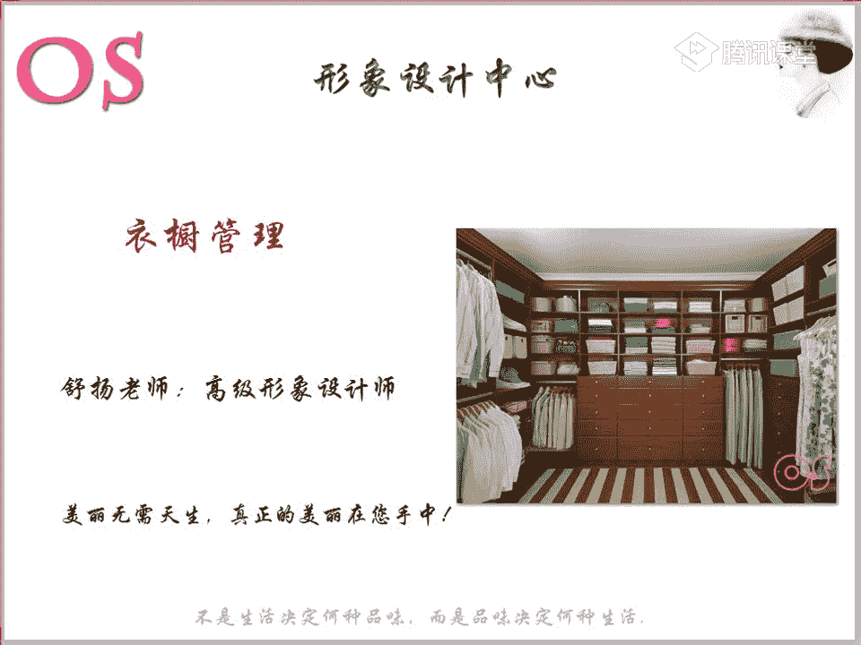
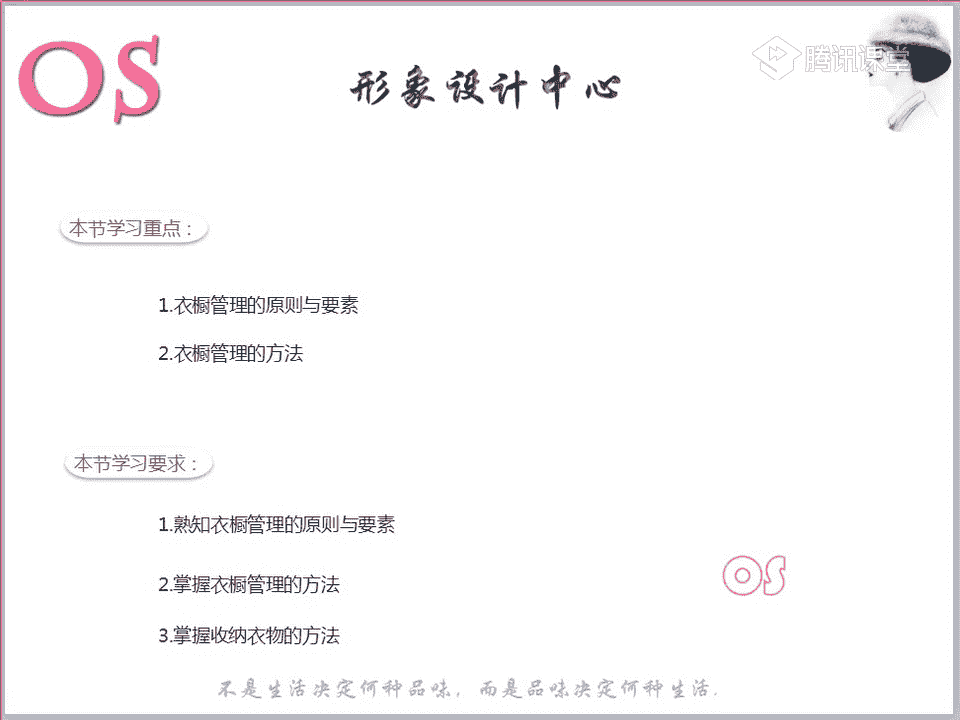
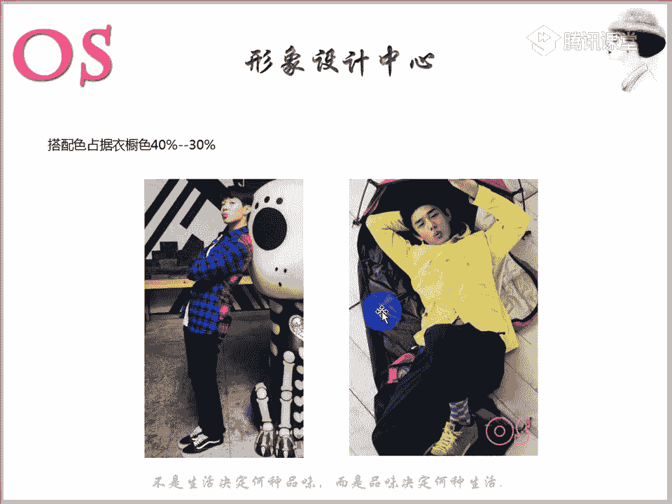
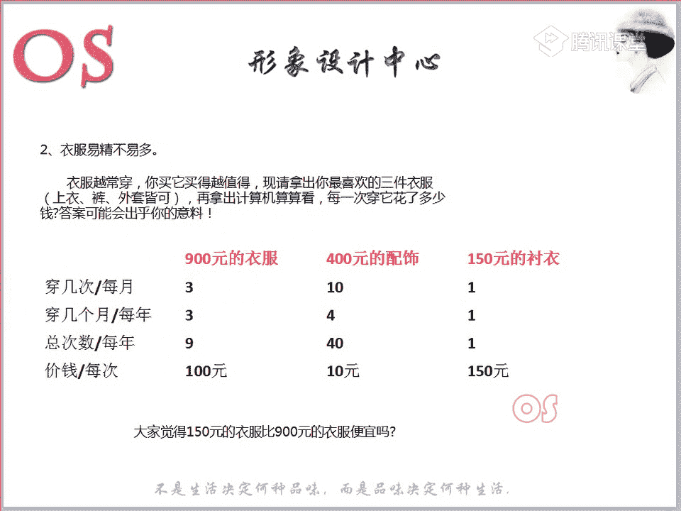
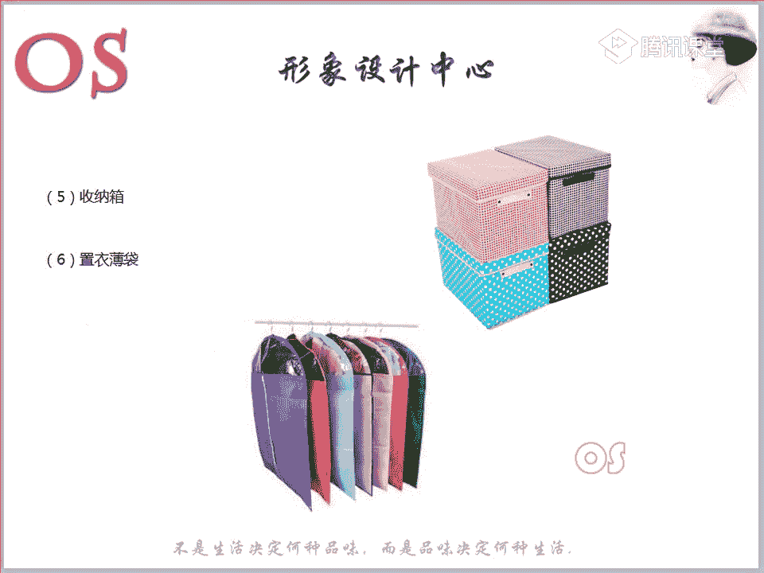
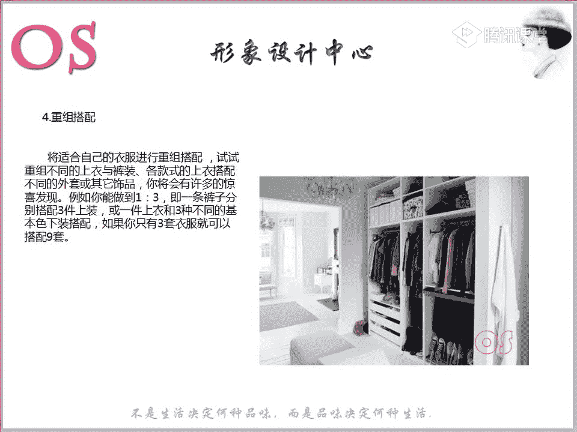
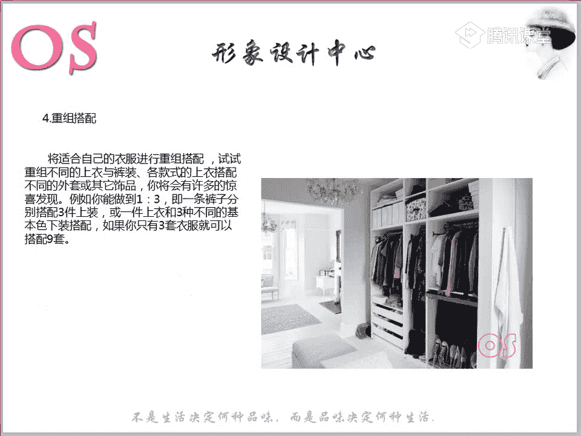

# 1、03OS男士形象VIP班《形象课》：第14节、衣橱管理

好，欢迎大家来到我们OS男士班的VIP课程。我是本节课的主讲老师舒阳啊，然后大家都应该能够清楚听到声音哦。😊，那今天呢也是我们男士班的最后一节，会讲到我们的衣橱管理。也就是说综合我们前面所学到的。

针对于我们个人形象设计从头到尾的这样的一些知识。那么我们现在再来回顾一下我们唉看一看我们自己的衣橱，那肯定很多衣橱中适合自己的服装是非常少的，对不对？

那我们肯定要通过啊我们这样的一些方式方法呢来进行整理。那除了整理的同时呢，我们也要对衣橱的管理有一定的一个概念哦。比如说我们色彩的这样的一些分类。那么在今天这堂课程中呢，都会跟大家呢来讲到。

所以说本节课的一个学习重点呢就是第一个衣橱管理的原则和要素。第二个呢就是我们衣橱管理的方法。那么对于大家的一个要求，就是熟知这些原理原则和要素，以及我们这样的一些方法，那要掌握我们收纳衣服的方法。

那么我们学完这节课之后呢，希望大家对于自己的衣橱呢啊，我们明天就是星期六了，对不对？星期六星期天那休息的同学呢，可以利用时间呢，对于我们的衣橱开始进行这样一个整理，整理完之后。

你才会啊在后续的买衣服的过程中呢，不会再去添加一些自己唉有了的，或者是说呢唉去添加一些不不太适合自己的。😊。

所以说我们等到买衣服的时候呢，就会目标会更加的明确啊。因为现在的话，我相信很多同学一打开自己的衣橱呢，一观看你就会发现呃同一种款式或者说同一种颜色的种类是非常多的。

好，首先呢我们就来看到我们衣橱管理的原则和要素啊，也就是说告诉大家我们这样的一个衣橱管理的一个基本的一个原则。那么这样的一些色彩，第一个呢就是我们衣橱里面一定要有至少三种基本色。唉。

什么样的一个基本色呢？在这里所提到的基本色，其实就可以称之为我们这样的一些中性色啊，非常的百搭。比如说我们这样的一个黑白灰，以及呢我们这样的一些咖啡色，深棕色，还有包括我们的这样的一些深蓝藏蓝等等。

对不对？这个都是属于我们这样一个基本色啊。我们在场的同学，如果说你的衣橱里面这三种基本色都有的同学可以跟老师呢刷一朵鲜花啊。好，如果说呢我的衣橱理我的衣橱理大部分是这样的一些中性色。

老师你说的这样的一些中性色，也就是说色彩纯度并不是那么高的颜色哦，那。😡，如果说你的衣橱里都是以这样的一个色彩为主的，也可以跟老师在公台上呢扣个一啊，就是我的颜色。

老师我要么就是纯呃纯度特别啊明度特别高的。比如说一些浅淡的颜色，要么就是偏深的颜色，或者就是像我们这样的一些咖啡色系啊哦，灰色这样的一些中性色调比较多的啊，也可以跟老师扣个一啊，就典型的我们的衣橱里。

可能像这样的一个基本色，我占据了百分之百哦，甚至高达百分90几。好，我们那丹同学说到只有黑白啊，只有黑白。那么其实呢我们这样的一些色彩，为什么说对于我们在衣橱中，它是要占据70%的，我们可以看到这里啊。

生活中搭配率，因为是它是最高的颜色，而且在衣橱的啊在我们的基本色中这样的一些色调啊，占衣橱70%是非常有好处的。那我可以问一下大家，比如说我们现在都已经步入到社会了。那么主要的场合是哪个场合。

大家觉得在社会中，不管是男士还是说处于哎我们这样的一些社会中的女士，那么我们其实尤其是男士啊，在生活中出现的最多的场合是哪一个场合，大家来把自己的想法呢，可以在公台上跟老师互动起来哦。好，工作非常棒啊。

就是我们这样的一个职场。所以说在职业场合我们要表达什么？在职业场合要表达什么？😡，是不是要表达我们这样的一个稳重，对不对？嗯，要表达我们这样一个严谨的工作态度。所以说这样的一个中性色调。

这样的一个基本色呢，像我们的极浅色调或者说极暗色调，对不对？它都是会有哎这样的一个作用的啊。我的模特除了工作，就是谈恋爱。😊，哎呀，太可爱了。而。

我们其实所以说在生我们在这样的一个工作中所运用到最多的色彩，无非就是老师刚才所提到的这70%的色彩。所以说呢在我们男士的衣橱也好。其实像我们一部分女性啊，职场女性也也是一样的。

我们其实在衣橱中一定要以白这样的一个色彩为主。不是说我要黑白灰占据占据70%，而是说除了黑白灰以外，像这样的一些极浅色调，或者说极暗色调，对不对？我们有彩色里面的极浅色调，极暗色调。

或者说我适合这样的一个棕色系也是可以多具具备一点的。😊，大家可以看到，这都是符合我们老师刚才所说的这样的一个70%啊70%。这个是搭配绿啊，而且它这样的一个色彩也是非常好搭的，对不对？色彩非常好搭。

百搭的一些色彩。那么在职业场合又可以运用到。然后一般的话我们在这样的一些休闲场合，或者说约会场合，我们又可以小面积的去出现，或者说唉去根与知这样的一个其他的一些颜色去做搭配。

所以说剩下的30%到40%呢，我们这样的一个色彩，就是这样的一些鲜艳的颜色啊，可以是我们的帽子也可以是我们的鞋子，同样我们的袜子等等的，或者说我这样的一些内搭的毛衣啊，我我们这样的一些外套啊。

但是整个来说我们这样的一些鲜艳颜色呢，要占据30%到40%啊，好，有同学说到了，哎不是要根据自己的色彩进型来选择基础色嘛。这个是啊这个是根据色彩进行。但是你们要知道。

像我们比如说唉我们落搭的同学你的模特是阳光少年呃，阳光浅卫型的，对不对？老师应该没记错啊。😊，あ。嗯，我记忆力记忆力还是挺好的那如果他作为在职业场合，他能不能穿成这个样子去上班呢？可不可以？

可不可以穿成这个样子去上班啊，或者说穿成这个样子。如果他是他的职业场合是一般职业啊，不是属于我们的时尚职业场合，或者是怎么样的哦，是不是不可以，因为太过于不够严谨了，对不对？

所以说会发现像我们男性啊大部分的时间可能都会花花在工作上一周7天，我有6天都是在我有5天都是在上班，对不对？所以说呢在衣橱中，我们可以一定要记住的就是呢要占据70%的颜色，是这些颜色。

而这样的一些真正自己唉所适合的所适合的颜色我们可以小面积的。比如说在休闲场合，我们去大范围的穿。但是像这样的一个颜色适合自己的，可能对于男士来说，他在职业场合是没有必要出现的。

因为我之前在讲男士班第一节课的时候，我就说过，我们男士最重要的是什么？最重要的就是场合，然后才是我们的风格，然后色彩对于他来说是排在。😊，最后的色彩对于我们男士的同学还是排在最后的，它不同于女性啊。

它不同于女性。好，所以说对于这个知识点还有没有意义啊，有没有意义嗯。😡，好，我的衣橱颜色很多，就是没有灰色啊，因为可能有的同学也不太适合灰色。所以说像呃有一些男士也是一样的。你如果不太适合灰色的话。

我们就可以换其他的这样的一个基本色。嗯，所以我们男士呢像这样的一些色调啊，浅淡的。你像像我们这样的一些呃春季型的人，我们也可以选择我们这样一个极蛋色调，对不对？极蛋色调里面呃。

符合它这样的一些暖色调也是可以。但是呃不可以去选择太多的这样的一些鲜艳颜色。因为我们毕竟只有在我们的职业呃，我们的休闲场合，或者说哎在一些户外的时候，我们可能会用到。

但是在职业上我们肯定不可能大面积的去穿这些，对不对？我们只能小范围的去进行点缀。比如说我们的口袋金，或者说我的这样的一些胸针胸花，对不对？可以去出现这样的一些色彩。😊。

所以说尽量就面积要在你的衣橱啊，整个衣橱来说，面积可以占的少一点小一点。😡，好，另外呢就是要跟大家说的就是衣服呢一斤不宜多哦，衣服呢越长圈穿的，你会发现你其实买的就越值。那比如说现在可以大家来想一想。

看到我们这样的一个数值啊。大家也自己来想一想自己呢衣橱中唉，拿出你最喜欢的这三件衣服啊，一件是上衣也好，或者说是裤子外套都是可以的。然后我们这个时候再拿出计算机来算一算，哎。

你看一看你每次穿它花了多少钱，那么答案可能会出乎出乎大家的一个意料啊。😡，现在给大家呢来看一看这样的一个计算方法。然后呢，我们自己可以在心里呢想一想，我现在衣橱中唉比较喜欢的三件衣服啊。

目前来说很喜欢的三件衣服。然后我们来算一算。那老师呢也举了三个例子。第一个呢就是我们900块钱的衣服。然后第二个呢就是我这买花了400块钱买的配饰还挺贵的哦，一个小配饰，我花了400块钱。

然后呢还有一件就是我感觉价价值还不错的这样的一个150块钱的衬衫。那我们来算一算呢，我们平均每个月穿几次啊，每年呢又穿几个月，那么每年的总次数呢，我们可能会得出这样的一个结果。😊。

那是不是会发现唉看似我们这样的一个小小的胸针也好，花了400块钱，哎，感觉还挺贵的。但是你会发现你运用的。效率是比较高的，对不对？嗯，我可能总每一年我就会用到44十次。那这样算下来。

我每次用它只花了10块钱。那这些呃比如说我买了一件比较便宜的衬衫，我觉得还可以，150块钱，但是会发现你可能穿一次就不喜欢了。然后就唉尤尤其像我们有些男士啊，衬衫又很多，然后呢就会压到我们的衣橱里面。

可能这件衣服就会被你遗忘了。那这样算下来，可能你花100块钱买的衬衫，150买的衬衫，也就是你穿了一次，那一次就花了你100多块钱。😡，所以说这个就是我们的衣服啊，唉易精不宜多。😊。

所以说大家还会觉得150块钱的衣服会比900块钱的衣服便宜吗？绝对就不会有这样的一个意识了，对不对？我不知道我们在场的同学有没有是发生过类似于这样一个情况的哦，有没有就是可能我就花了呃不贵。

可能七八十块钱。我当时就觉得这件T恤还挺好的。然后就买回来，结果买回来穿了那么一两次吧，我就不喜欢了，就扔在那里了，有没有这样一个现象哦，也可以跟老师呢刷一朵鲜花。那可能我们去到别的店里面。

可能花了个两300块钱买了一件T恤。但是这件T恤呢，我可能穿了好几次，或者说好几年，我还在穿嗯。😡，所以就告诉大家啊，嗯我们这个衣服呢一斤不宜多，所以说你一定在买的时候呢，考虑清楚怎么样考虑呢？

其实就有一个加减乘除。那么穿衣服的时候呢，我们要做加法，一件衣服呢，你要想到必须跟我三件衣服做搭配啊，穿衣服的时候，也就是说我们要做加法，一件衣服可以跟我们三件衣服去做搭配。那么做减法是什么呢？

买衣服的时候做减法，不能和衣橱里面三件衣服搭配的衣服就不要去买。当然啊，如果说是现在我们做完了这样的一个改造，意识到我这样的一个衣橱中，好多衣服是不适合自己的。那么现在这一条呢，我们可以呢酌情的去考虑。

但如果说你现在目前老师我的衣橱都进行了大大范围的这样的一个换血。然后呢，我大部分的衣服都是适合我的。那我们再次买衣服的时候呢，我们就可以做一些减法。

如果这件衣服不能跟我目前来说的这样的一些衣橱里的三件衣服做搭配。那么我们就不要去买了。😊，还有一个乘法就是跨季的衣服做乘法。同一件衣服可以穿三季的话，你会发现它的利用率会高很多，对不对？就像我们的配饰。

它甚至可以用到四季，那么这样一个衣利用率衣高的话，你就会发现它的价值是超乎你的想象的。所以说比如说像我们有时候呃男士会买到的这样的一些衬衫，对不对？可能他真的就可以一件好的衬衫，我真的可以穿三季。

我在春天的时候可以去穿。唉，在夏季的时候可以去穿。在我们的秋季的时候还可以去穿，甚至在冬季的时候，我还可以跟我的毛衣做搭配去穿着，对不对？所以说就甚至可以穿到三季和4季，所以说这样的一件衬衫。

如果你觉得贵，但是你算一算，你每次穿它花了多少钱，你就会觉得嗯非常的值。所以当然如果说我们有些男士啊，唉，发现一件衬衫很贵的时候，但是你又非常非常喜欢的时候，其实呢你可以换位的去想一想啊。

我对它它在我的衣橱中的一个利用率。😊，那么还有一个呢就是我们的一个除法。那么购买一些价值不菲的衣服呢，可以用我们的除法来计算衣服的价值。其实就是刚才老师所举的这样的一个衬衫的例子。

也就是说我们平均每次的一个投资额哎去算一下啊，也就是说我们这个原始的价格。比如说这件衬衫2000块钱。那我们算一下呢，这一年我可以使用多少次。那么这个时候你得出来一个结果。

你会发现哎你自己还是能够承受的，就相当于是我们分期再买这样的一件衬衫啊。啊大家对于这样的一个加减乘除啊，有没有问题，没有问题的话呢，跟老师刷的鲜花啊，如果有问题的话呢。

也可以提啊在公台上提出来自己的疑问。😊。

哦，接着我们来说到第三个啊，我们的衣橱。那么能吊挂的呢，最好就是要吊挂衣服呢要面朝同一个方向，衣架的颜色也最好是统一。其实为什么说能吊挂的就最好吊挂，其实有些衣服你会发现呃洗完之后啊。

它可能有些衣服会恢复一下，可能有的衣服呢他就没型了。那么这个时候呢我们其实肯定都是需要熨一熨的。所以说不管是男我们各位男士啊不要觉得哎我们穿衣服不讲究。其实呃大家有没有发现啊。

可能我们在场的女生也会发现这样的一个特别有意思的事情，就是有些衣服啊，如果你不熨它，它反而不显档次，但是你熨一下它之后呢？它的质感就出来了。有没有发现啊，比如说老师其实我观察过很多。

比如说像有一些毛衣或者是说有一些外套哦，有一些外套面料相对来说柔软一点的。😊，你没你把它洗完之后，或者说你。😡，折折叠之后啊，可能衣服很多就凑到一起了，就揉成一个团。然后你会发现特别不显档次。

但是你熨完之后，你就会发现好像只有200块钱价值的衣服能够去呃熨出三四百4五百的这样的一个价值啊。所以说其实我们各位男士，如果你没有熨斗的，其实一定要去备一个熨斗。其实不用说买多大的。

你像现在我们有很多那种便携式的哦，五六十块钱一个或者说不到100块钱。那么出差的时候啊，我们都可以很好的放到我们的行李箱里面。然后呢，平时自己的衣橱，像一些大衣，他也能够去熨。😡。

那这个时候我们可以准备一个啊，而且衣服的话一定是要去进行熨烫的。那么洗完之后，我们熨烫完之后挂到柜子里面。那么早上出门的时候穿起来也比较方便啊。所以说一定男士不要去偷懒，我们也要去讲究啊。

尤其像裤子呀啊衬衫哪这些东西，还有包括有一些T恤也是一样的。你熨好了之后，其实你整个人都会显得精致起来。

好，第四个也非常的简单，就是按衣服的长短呢深浅厚薄季节风格呢这样的一个场合去挂制啊，按照场合啊，我按照我们的季节，按照我们的风格，按照我们的厚薄，可能大家都能够做到。而且呢如果你想要你的衣服的色彩啊。

就整个衣橱更整洁的话呢，你可以呢呃分这样的一个色彩去色彩系去挂啊。比如说绿色系的放一边，然后蓝色系的放一块啊，红色系的放一块。这样的话呢，其实我们衣橱也会看起来非常的整洁啊。😊。

还有就是我们这样的一个整体的一个管理方法。那第一个呢就是我们要怎么样去管理我们的衣橱呢？首先要准备的就是我们的衣架啊，衣架准备好，我们的整理箱也要准备好，我们的制衣薄带，也要整理好哦。

这个就是我们的收纳盒整理箱啊，以及我们的制衣薄带。那第一个呢就是我们细的这样的一个塑料衣架啊。那么这样的一些细的塑料衣架的话，如果大家唉家里面也有的话，你们就把这些衣架用来挂什么呢？挂我们的衬衣。

挂我们的T恤啊，因为呢像衬衣和T恤的话，它本身就比较的轻，所以说它不会因为这样的一个衣架呢而影响衣服的这样一个肩部的形状啊。当然如果说是湿的话，肯定会影响，对不对？如果是湿的。

那所以说像湿的这样的一些呃T恤的话，我们其实最好就是用一些比较宽的衣架去进行挂纸啊，晾干。那第二个呢就是我们这样的一些厚的塑料，或者说这样的一些织绒的衣架啊，我们绒布的。

大家应该也见过圆头的这样的一些海绵的。那么这些衣服，这些衣架呢最适合挂我们的一些外套和毛衫。因为外套和毛衫它相对来说是比较重的。所以说我们这样的一个衣衣架呢能够确保我们的这这些外套不容易。😊。

衣架我们的肩部形成这样的一些。呃，视觉上的一些窝点哦。那第三个就是我们的木质衣架啊，这些衣这个呢就更加适合挂我们的风衣和大衣和一些厚中的外套了。它的整个承受能力也比较的强。那另外的话像我们的裤子啊。

或者说我们女士中会出现的小下半身的裙子，就最好是用我们这样的一些裤架去进行悬挂。所以说一定要把我们的衣架呢进行这样的一个分类啊，不要把我这样的一些比较细的衣架呢去挂大衣。其实。😊，整个大衣来说。

它的形状也没办法去保证啊，所以。尤其我们有些服装都烫好了，那么这样挂的话呢，会更加让它会更加的这样的一个整洁。可以说是。那像这样的一个制衣薄带，就尤其是像我们一些换季的服装，唉，我们可以把它放到里面。

可以防潮，对不对？可以防潮。另外的话呢也也省得我们的衣柜经常啊开关开关呃，进入一些灰尘，对不对？我们就可以很好的保护。其实像我们把衣服干洗回来之后，都会有这样的一个袋子。

那我们也可以自己去买一些这样的一个袋子，然后呢让我们的衣服保持这样的一个干燥整洁。😊。

一会儿会跟大家，接下来会跟大家说到我们这个收纳盒的一个作用啊。那么首先我们进行的第二步。第二步呢就是我们先把衣架把整理盒，把我们的这样的一个薄带都准备好之后，我们就准备第二步。

第二步呢就是把我们所有的衣服呢全部都搬出来，你可以把所有的衣服都放到床上哦，所有的衣服不要一一部分一部分整理。因为一会儿我们还会讲到为什么要这样去做啊，把所有的衣服呢全部放到床上之后。😊。

我们进行第三步分类处理。其实作为我们的专业的衣橱整理师啊，如果说是专业的衣橱整理师的话呢，也会准备比如说白布啊、相机啊，或者说这样的一些报告表啊，然后呢带上我们的视频啊、丝巾啊，然后去帮别人去做整理。

那么其实也是会把对方。就我们的顾客的所有的衣橱呢搬到我们的床上，然后呢进行这样的一个整理。好，第三个就是我们的分类处理。第一个呢就是。😡，怎么分类呢？先把超过一年从没有穿过的衣服呢，把它。😡。

放到一边哦，把它放到一边。这个时候你也可以准备个收纳盒，把它放到收纳盒里面。那第二个呢就是把我们已经不合身材的不适合自己即型和你风格款式的衣服呢，也把它挑出来，放到另外一边。

那第三个呢就是把这些过时的让人穿不出去的这样的一些感觉的服装呢，也把它挑出来。第四个呢把不适合目前我们工作性质和生活情形的服装也把它挑出来啊，为什么说到工作性质。因为我们工作性质有不同种，对不对？

像男士的职业场合有严肃的职业场合和一般的职业场合，或者说时尚的职业场合，那么你要根据你不同的场合去选择服装。还有就是呢我们还要根据什么，根据我们目前所处的社会的角色，可能我现在已经是一个管理层了。

我不再不像我一年前两年前我还是一个职场小白，对不对？那么这个时候我对于服装来说。😊，肯定也是有区别的，这个都不要不用老师去过多的详说了。因为我们在课程中其实都有去跟大家讲到，对不对？社会角色的一些问题。

以及不同年龄段的一些问题。那这个就是把这些又挑出来。那么第五个呢。😡，第五个就是把一些可能有一些没办法弥补的瑕疵，或者是说沾有一些无法处理掉的一些污痕的服装呢，也把它挑出来啊，也把它挑出来。

这是把我们这五类呢全部挑出来。挑出来之后啊，其实以上5种情况的服饰的话，使用的价值是比较低的。所以说我们可以把它处理掉啊，处理的方法的话，我们可以嗯，比如说我们很多小区都会有这样的一些衣服回收站。

对不对？我们可以放到回收站里面。这个就是记住啊，记住这5个。那么第六个呢就是把不能与其他衣服搭配的单件单独的归一组归一边。所以说这个时候这第六个点其实就是告诉大家呢，我们开始要进行组合和搭配了。

因为我们已经把自己还能穿的还适合的，对不对？还适合自己进行和风格的服装已经挑出来了。这个时候我们就把这些挑出来的服装呢进行组合，进行组合。怎么样的一个组合呢？

其实呃我为什么说到我们的顾问会准备这样的一个白尾布，对不对？啊，白布的话，其实我们就是会摊在地上之后呢，我们会把顾客呃，他目前所有的服装呢会进行这样的一个搭配，搭配之后呢，我们会拍照。

所以说为什么带相机，就是会拍照。因为拍照之后呢？就是其实明确告诉他这一套可以这样去搭配。然后这条裤子还可以跟什么什么去做搭配，然后把。这些照片给到他，其实也能够方便我们的顾客呢快速的，对不对？

快速的出门。那么其实我们自己也是一样的。针对于个人班的同学啊，那其实也可以把我们自己的衣橱衣服呢进行组合进行搭配，对不对？

我们每单品中也有去教到我们的色彩搭配中也有去教到这个时候你就把你那些衣服怎么样去做搭配呢，尽情的啊开始搭配起来。那么在搭配的过程中呢，你们可以去拍照片。如果说哎我觉得我这一组搭配的特别好。哎。

我如果怕自己进性不好的话，你们也可以多去拍一些照片，然后把照片放到你的电脑里面。那么这个时候我们每一次出门的时候哎进行分类嘛，对不对？我职业场合的休闲场合的或者进行个分类，然后我其实一输关键词。

那么图片就出来了。然后然后方便我们自己啊，也方便我们自己。😊，所以说呢。做完搭配之后，我们其实也会发现在搭配的过程中，你一定有你一定有一些单件的衣服，没办法搭配的，或者说你也会缺少一些。搭配的一些物品。

比如说帽子啊，或者说比如说我们小的一些胸针啊等等的，大到某一些服装的单品，对不对？那这个时候我们可以呢把它写在纸上哦，写在纸上，放在我们随身的这样的一个包中。然后等到下次逛街的时候呢。

我们可以就有可以有目的性的去购买了。哎，不会说再去乱七八糟的买了，浪费我们的时间，也浪费我们的金钱哦。那么第七个呢就是把我们适合自己的衣服呢，按进行，按场合哎，归为一组，把它挂好就可以了。😊。

所以说我们可以去分工作，分休闲，分约会。当然你也可以按照刚才老师所说的，哎，就是我们分色彩去挂，也是非常整洁的。😊，其实第四个就是要跟大家强调一下哦，哎，我们这样的一个小点。

强调一下呢我们这样的一个呃重组搭配的好处。在这里跟大家说一下。嗯，其实刚才已经老师说的非常清楚了，但是在这里呢。非常仔细的写的很清楚，就是能够做到1比3啊1比3。这是也就是说在整个重组搭配中。

最重点的就是1比31条裤子可以分别搭上三件上衣，或者说一件上衣，可以跟三种不同的基本色下装做搭配。那其实大家会发现你这样一做搭配的时候，你本身只有三套衣服，结果你可以搭配出9套啊，结果可以去搭配出9套。

当然在搭配的过程中，大家可以把鞋子啊，把自己的配饰全部都加上去啊，哎加上去进行这样的一个拍照组合。好，说到这样的一些分类啊，说到一些分类。然后呢也说到了我们这样的一些重组。

那其实呃包括我们自己啊做这样的一个形象顾问的时候，我们也遇到很多一些，不管是男客呃顾客也好，还是说我们的女士。哎，我们会发现我们一般都是分为这三类衣橱。大家可以看看自己是属于什么样的一个类别。

第一类呢就是我们这样的一个爆满型的衣橱。就是衣服特别特别多，爆满型的这是第一类。那么第二类呢就是我们这样的一个精简型的衣橱，精简型的。啊，非常的简单，衣服也不多啊，简简单单那么几件。

啊，经典型的类似于这样的一个感受啊。那么第三类就是混乱型的，就啥都有啊，它还不仅仅它不是说有多有么有多么多，也不是说有多么少，但它就是很混乱啊，乱七八糟的。然后呢，各式各样的，全都有啊。

大家呢可以自己来看看自己是属于哪一类啊，然后把你属于哪一类的啊，我们的这样的一个数目的呃，数数号可以打在公台上啊，是第一类还是第二类还是我们的第三类。😮。

好，我们有同学呢是第二类哦，也就是说我们这样的一个精简型的精简型的那其实呢我们一个一个来分析，看大家呢是到底是属于啊这一类中，我们应该怎么样去做啊。刚才我说到了第一款就是我们的爆满型的这样的一个衣橱。

对不对？那如果说是我们这一类的顾客的话，因为其实有很多男孩子也非常喜欢买衣服哦。像这种爆满型的也是还是蛮常见的啊这样的一个如果说我们是这样的一个衣橱的一个男同学的话。

第一个老师给你的建议就是暂时呢先我们做好这样的一些分类处理啊，把它都做好之后呢，暂时不要再去添置衣物了啊，暂时不要去添置衣物。那先将我们现在的衣服，好好的进行整理。可能你一天都很难整理完啊。

进行分批次的一个整理，并可以呢根据我们不同的场的一个需求呢来进行这样的一个分类搭配，这是非常重要。😊，的然后老师给你的建议就是分两次去进行这样的一个整理。而且的话你的淘汰率啊。

你的淘汰率可能是要达到5分之2左右。哦，我们衣服的不适合的衣服淘汰率可能是在5分之2，这是我们的爆满型的那第二个呢就是我们刚才所说到的这样的一个精简型的衣橱，对不对？如果说我是精简型的衣橱的话。

那我们先呢对于我们现在的衣服呢。可以哦进行整理搭配一次。也就是说把做完分类之后呢，我们还可以进行整理搭配一次。那这个时候我们再去买衣服的时候，包括我们纳布丹，虽然说是女生啊，而且你也要认真哦。

就其实按照这样的方法去做。那我们在添置衣服的时候呢，可以从色彩到款式上一定要有所变化。从色彩到款式上一定要变化。所以说这个时候作为我们这样的一个精简型的衣橱，老师是非常鼓励大家买的。但是买的过程中。

你一定是要谨遵自己的剂型和款式啊，去进行购置。那第三个呢就是因为啊这一类哦呃。哦，模特是吧？好，那其实男男女都是可以用的啊，男女都是可以用的那第三类呢就是你会发现这一类如果说是精简型的人啊。

我们其实大部分都是偏保守的，是不是会发现是偏保守的。我不知道嗯我们这位同学的模特是不是也是有点点保守啊，就是比如说服装上他也不会说多去尝试一些呃。😡，流行的元素或者说一些丰富的色彩。嗯。

所以说这一类是比较偏保守的那其实适当的要去增加油彩有色彩的颜色，有色彩颜色，还有包括我们这样的一些流行元素，其实它是非常适合多去增加的。这就是我们这样的一个精简型。那除了精简型以外。

第三个就是我们的混乱型的衣橱啊，混乱型的衣橱就是啥颜色，啥款式可能它都有。然后呢嗯很乱也很乱啊，但不是他不像爆满型的那么的夸张衣服那么那么的多。那么像这样的混乱型的这样的一个衣橱的话呢，在整理时呢。

其实将我们不适合的服饰呢，一定要记住，坚决的淘汰掉啊。因为你可能啥都喜欢什么颜色都有啊，什么款式都有。但是你学完这样的一个课程之后，你已经知道你自己适合什么样的一个色彩和你适合什么样的款式。

那么对于你不适合的，一定要去淘汰到淘汰掉。不然的话，我真的老师也特别害怕这样的一些学员啊，他会控制不住的把自己不适合的，然后呢又穿回来了啊，可能又会穿回来了。

那其实久而久之你的形象的一个改变空间不会太大。其实大家也会发现当我们做完整断之后啊，哎知道自己色。😊，进型和风格的时候，其实很多同学都是不太容易接受的，对不对？可能会不太容易接受。

我也可能做不了什么改变。但是没关系啊，大家要知道，其实我们人的心里它都是会有一个潜意识的。也就是说当我认知到自己这样的一个色彩进型和风格之后啊。😊，和风格之后呢，其实你会发现你在逛街的时候。

你会无意识的多去留意你所适合的这些服装。其实久而久之之后呢，你就会发现你越来越欣赏你的风格和色彩进行了。呃，其实老师也是这样一个过程了。其实你像我当初刚学完这样的一个顾问课程之后。

我去我去在买衣服的时候，其实我还是按照自己的一个喜好在在做改变。因为像我个人我是自然风格的。但是我特别喜欢的少年风格衣服。那我买衣服可能都会往少年去走。但是久而久之之后。

目前唉等我对于这样的一个知识做了一个几个月的沉淀之后，我会发现我自己衣橱都已经往自然风格在走了，而且我也越来越喜欢这样一个风格，但是刚诊断完之后，我是特别不能够接受的。

我相信我们在场同学也有一部分是不能够接受自己的风格的，总是觉得别的风格是好的。但是。你因为形成了这样的一个潜意识之后，你每次逛街，你都会去刻意的去留意啊这样的一些服装，你就会发现。你还是蛮真的。

我穿这个真的是蛮好看的。就是这样。那所以说作于这样的一个混乱型的，老师要给你们的建议，就是真的要坚决的淘汰掉。因为我特别理解哦，因为很容易就会把自己不适合的又捡起来。所以说这个是一定要坚决淘汰掉的。

而且建议淘汰的量是什么呢？淘汰量为3分之1左右啊，我们向日葵说190%是我的衣服啊，那那你看看你是属于什么样的一个呃情况啊，衣橱是是属于我们这样一个混乱型的，还是说爆满型的。😊。

那我们也可以做这样的一个改变。所以说混乱型的我们要淘汰3分之1左右，我们的衣衣服不适合自己的，坚决淘汰，淘汰3分之1左右。那第二个呢就是在一段时间内，我们一定要有这样的一个意识去买衣服。

也就是说你一定要有把这样的一个色彩进型和风格这样的一个意识，强烈的注入到你的脑中，理性的去购置我们的衣服。而且的话我给你们的建议就是不建议你呢随心所欲的去买，或者说单独去买。其实你买的时候。

其实手机里多去储备一些你适合风格，或者说你适合的色彩这样的一些图片。其实能够嗯不停的给自己洗洗脑哦，再买在选衣服的时候，对，不停的给自己洗洗脑，省得自己一冲动呢，又买了一款自己喜欢的。

但是呢并不是那么适合的。也就是说现在我们可以把喜欢的和适合的穿在一起。但是呢你那些喜欢的其实尽量的理你离你的面。😊，部稍微稍微远一点，我们可以呢放到下半身去穿着。

但是上半身的服饰尽量要适要选择呢适合你自己的啊。好，那么第五第三个呢就是呢呃我们要多去。观察一些这样的一些时尚资讯，也多去观察一些这样的呃所适合自己的这样的一些图片啊，多去翻一翻。

因为它其实像这样的一些混乱型的啊，老师要说的直白一点，像混乱型的，一般其实它的审美并不是特别的高。因为你会发现就有些同学啊，可能它是精简型的，因为我可能是少年风格的啊，或者说像拿女士举例子啊。

因为女士风格会更那个一点。嗯，或者我是少年风格的，或者说我就是适合这样的一些简洁款的，比如说呃古典型的是吧？简单的，然后呢没有过多复杂的。因为他发现自己他适合这样的一些简单的啊直线条的一个款式。

但是你像混乱型的像女生中啊这样的混乱型是最常见的。因为他根本不知道直和曲动和镜他到底穿哪个好看啊，所以说像我们男生也是一样的，有些男生特别喜欢买一些乱七八糟的衣服啊，啊，各种风格，各种款式都有。

其实也有可能你真的是不太你的审美是不太高，所以说你才会发现你自己穿任何衣服都是没啥区别的。啊，认同老师这个观点的，可以给老师刷的鲜花哦。😊，所以说这样的一个同学啊。

一定要对自己的审美呢进行这样的一个提升，进行这样的一个提升。所以呢我们在呃平时的生活中多去关关注一些时尚资讯，然后呢多去看一看我们这样的一些街拍的图片。其实对于你来说都会有很大的一个帮助。好了。

这个就是我们呢这三个衣橱啊，在这三三种衣橱中在整理的时候呢要注意的一个点。所以呢呃对于衣橱的整理啊，这三部分啊整个的一个整理还有什么有没有什么不懂的，有没有不懂的话呢，可以跟老师呢啊扣个一。

那我们所有的整理完之后呢，其实就是要做这样的一个收纳了啊，就开始做收纳了。那么挂衣服的时候呢，刚才所说到的就是铁丝质的，你就尽量去用到我们这样的一些T恤，对不对？那么还有或者说我们的衬衫也是OK的啊。

这个是因为这样的衣衣服呢对于T恤和衬衫也来来说哦，它比较轻，所以说呢它不会破坏衣服的形状，不会让我们的衣服起呃呃起起皱，对不对？那如果说你放到别的衣衣服上的话，可能它就会有起皱啊，可能肩部就会鼓起来。

😡，当然如果说有。😡，就是讲究一点的话，我们就最好是去用到。这样的一些木质的或者说质量好的哦衣塑料衣架。那还有一个呢就是千万不要把我们的针织衫或者说毛衣挂起来哦。

但是其实老师要跟你们说的就是如果你的衣架比较的宽的话啊，像一些宽一点的。好，类似于这种宽的，其实挂毛衣呢也O啊也OK。但是如果说有一些毛衣是那种垂感非常好的，老师给你的建议还是说尽量的去叠放啊。

这样的话能够保持毛衣的形状啊。尤其在晾晒的时候也是一样的，我们最好是用到专业的这样的一些网子，对不对？去啊晾晾晒我们的织衫或者说毛衣。那第二个呢就是我们的腰带呢要挂在我们专业的专用的挂扣上。而围巾呢。

我们应该叠起来平放。或者说呢我们可以去选择这样的一些裤架来悬挂围巾也是可以的。

那包括我们的呃包包呀，或者说皮带呀，或者说我们的丝巾啊啊项链哪，男士的啊，我们的饰品分类都要分类去存放。其实你看有一些国外的这样的一些衣橱中抽屉一打开，里面都是这样的一些领带，对不对？或者说我们的皮带。

或者说我们的手表等等的。所以说各位男士其实一般我们的衣柜里面也会有抽屉存在。那这样的一些抽屉的话，你可以啊除了放内裤或者是什么的话，我们也可以去放这样的一些丝巾啊啊，我们的这样的一些领带呀等等的嗯。

那而且的话我们还可以在我们的门市，就是呃柜门对不对？柜门内侧的话，我们也可以去钉这样的一些。当然是这样的一些拉的啊，不是这样推拉的。如果说是拉的话，我们可以去钉一些这样的一些挂扣。

那么挂扣里面我们可以去呃挂我们的领带也好，或者说挂我们的皮带都是可以的。😊，呃，喜欢用挂啊。对，因为我们像我们这样的一些，尤其像我们刚才所说到的啊，老师刚才所说到的这样的一些呃围巾的话。

确实是啊如果你用衣架挂起来的话，它就不不容易皱，可能你叠的话可能会有几个印子，对不对？所以说可以用挂的啊。当然嗯。

最好就是悬挂，或者说就是这样的一个点。那第三个呢就是要经常去擦鞋子啊，这个的话我不知道我们各位同学做的怎么样啊，经常会擦鞋子，同学快跟老师刷朵鲜花哦，经常会不会擦鞋子。就是我可能就像皮鞋。

老师我会习惯性的，比如说一回到家之后，我就或者说一个星期我这双鞋子会擦一次啊，上一次油啊等等的那你像男士的话，它本身呢它皮鞋就穿的比较的多，对不对？穿的比较的多。

所以说呢我们这样的一个鞋子一定是要勤擦勤薄一样的。你就像在雨天的时候啊，我们男士在下雨天的时候，这个皮鞋如果一旦淋湿了之后，我们回家要赶紧拿布啊，把它擦干净。把它擦干净。

因为其实鞋子很容易尤其是皮鞋非常容易氧化啊，非常容易氧化。所以说我们一定要及时的去进行这样的一个整理。😊，那还有包括不穿的鞋子呢，我们可以用鞋盒呢去进行存放，这个盒子打错了。要用鞋盒去进行存放。

而且的话嗯其实你会发现，虽然说我们有时候有一些品牌也非常流行这样的一些脏鞋，对不对？但是脏鞋吧未免还是只针对于真正是那种啊真实的一些脏鞋。那其实男士会发现我们很多女生啊，看男士。

有的女生是她是非常喜欢看鞋子的啊，因为鞋子的话选选择上也能够去怎么说呢？另一方面去说明这位男士的一个品味。那其次的话，如果鞋子非常的整洁干净的话，其实也会给对方留下很好的印象。

所以我们各位尤其说在这样的一个职业场合，我们鞋子啊，皮鞋的一个蹭量干净与否也是非常重要的。所以我们要养成这样的一个擦鞋子的一个好习惯啊。而且的话皮鞋的话，你经常去保养或者说其他的一个鞋子。

你经常去保养它的寿命也会更长。而且我们每天呢最好就是不要去穿啊连着穿。😊，两天一样的鞋子，鞋子其实它也是有一个休息过程的。你穿一天呢哦换另外一双鞋，然后呢这样轮着去穿，它穿的会更持久。

可能你会发现一双好一点的鞋子，我这样去做保养，我可以穿好几年，它还跟新的一样。好，第四个就是我们的衣橱中的一些睡衣啊，还有包括T恤啊，还有包括我们的家居服啊，这个就可以叠放的去进行收纳。

但注意的一定要注意的是呢，我们下叠的衣服呢，最好不要太多啊，一叠不要超过6件。因为如果你超过太多的话，它会从它会形成这样的一个重量，对不对？会压坏我们下层的衣服。所以说下层衣服就很容易会起褶子。嗯。

所以说我们最好不要超过呢6件。那第五个呢就是我们收纳小衣服要用要多去运用到这样的一些收纳工具。那衣橱专业的一些多层的收纳盒呢，我们可以放袜子，对不对？放内衣，还有包括我们的一些小物件，哎。

比如说你一些小道具啊等等。另外的话呢就是刚才老师所强调的啊，门板内侧，当然是拉的啊，拉的门板内侧我们可以去啊安装一些挂钩啊，或者说吊竿支架，可以用来挂我们男士的皮带呀，啊，领带呀啊背包等等。😊。

的一些配件。所以说我们这样的一个衣橱整理啊，其实非常的简单啊非常简单。大家还有没有什么想要问的哦？而且的话针对于我们不同的人在购买服装的时候呢，其实除了衣橱中，我们有这三大类的划分。

那么其实我们人也是会有三大类的划划分。第一类呢就是冲动型的。第二类呢第二类呢就是我们的理智型的。第三类呢就是随和型的。我不知道大家是属于哪一类啊，冲动型的就是看到喜欢的就会买啊，第二类可能就是很理智啊。

很纠结，然后呢买个东西可能会想很多啊，我一定要想清楚我可以哪些场合可以用到哪些衣服可以搭配非常非常的理智，可能一件衣服我要纠结半天嗯，这是我们的理智型的。那第三类就是我们比较随和的。

可能就是嗯我去买衣服的我也可能没有特别想啊，我要不要去买衣服。可能我一到商场逛的过程中，我可能就被衣橱的某件衣服所吸引。然后我就去会去试它。然后在试的过程中呢，可能导购啊在。😊，你耳边呢随便说两句。

你可能就买了大是属于哪一类？好，我我老师老师个人的话可能是比较的。冲动啊，有时候会比较冲动嗯。你们你们是属于哪一类呢？其实以后的话啊，因为我们今天有来听课的，其实大部分都是我们呃这样的一个顾问班的同学。

对不对？嗯，好，我现在状态就是看到好看的，努力把它往自己适合的靠考。呃，理智型的哦。那其实我们以后的话，可能你们在有同学在做顾问的时候啊，老师说可能说的比较多。那么呢其实你们也会碰到这三类不同的顾客。

那我们自己应该怎么办呢？其实像冲动型的话，嗯，我们可以呢严格的去根据我们个人或者说对方哦对方的一个基本的需求来购购置我们的服饰。所以说呢我们一定要严格起来。那第二个呢就是我们理智的开始要变得理智啊。嗯。

好，第五个小点啊。

好哦，第五个其实就是这个啊，老师应该是把这个。

第五个其实就是第三类，这个都是属于第三类哦，这个都是属于第三类。哦，这个收这个收纳啊，收纳第五个老师误会错了啊，那我们回到我们刚才所说到的这样的一个冲动性啊。那么理智的分析一定要变得理智。

所以说你像我嗯包括我们很多这样的一些做跟服装有关系的吧，其实很容易就慢慢把自己呢变成这样的一些冲动性啊，我看到什么，本来就因为爱美嘛，对吧？就喜欢去买，然后然后呢可能就呃每次说了不买就会买。

然后想了一个方法，嗯，那就不带卡出去吧。啊，不带不带现金出去吧，就不带现金去出去吧，带个卡，结果你会发现呢你刷卡会刷的更爽，对不对？因为你看不到钱再流逝。然后好了，那就干脆呢接下来连卡也不带了吧。

但是现在又发明了这样的一些微信和支付宝，对不对？真的是防不胜防。😊，所以说呢理智啊一定要一定要做一个强调，就是一定要在想要一一旦一冲动的时候，你就让自己冷静一下啊，让自己冷静一下。

看看这件衣服我到底适不适合，到底要不要买，那可能你隔一晚上之后，你就会发现其实那件衣服也不太适合你。然后你就不会买了。其实包括在淘宝上也是一样的。大家如果说喜欢买衣服的。

在淘宝上你们也可以呢先把它放进购物车，然后呢想一晚上哦到第二天你再去看这件衣服，你看看你觉得你还要不要买。如果你觉得还要买的话，我们就可以买下来。如果你觉得哎也就那样了。那这个时候呢。

其实方法效果非常的好啊，大家可以呢如果是冲动型的，可以采用老师这样的一个建议啊。那么三个就是呢其实。😊，我们要引导自己啊，要合理的去构建这样的一个基本衣橱。也如是刚才老师所说到的。70%和30%。

还有包括我们刚才所提到的衣服易斤不宜多，这这个是一定要去进行这样的一个构造的。好，那如果说呢是我们刚才有同学啊，向日葵说哎，我自己是理智型的那如果说是理智型的话呢，我们就要再挑选啊挑选衣服的时候呢。

一定要准备一些要准备的充分一点，然后呢多去为自己提供一些服饰搭配方案。哎，给自己多去做选择。所以说当你把这些方案都提出来的时候呢，你下次去买衣服，你就不会那么的就是啊比较的纠结了。

因为我知道这个是一定适合我的。嗯。好，男生跟衣服呃需要其实最好是分开存放，这样的话大家都会轻松一点，不会乱，对不对？那还有第三个呢，就是我们作为这样的一个理智型的。

就是要我们要强调风格在不同场合的一个多种表达。也也其实建议大家多去进行尝试和突破啊。因为理智型的，相对来说它去突破难度也会比较的大。最好是进行这样的一个分开的一个存放啊嗯。

还有就是我们刚才所说到的这样的一个随和型的啊，如果是随和型的话呢，我们就根据自己的一个实际的情况和承受的能力来制定我们这样的一个购置的计划。那还有就是呢在我们逛街的时候呢，多去试，多去感受啊。

多让自己增加对服饰的这样的一个认知。哎，然后呢，其实也就是我们刚才老师所说到的，就是强调这样一个心理的一个建设，对不对？然后其实整个来说我们的形象会提升的非常的快。😊，好了。

这个就是我们呢嗯以前是买自己喜欢的，现在是买适合自己的。嗯，很好。其实但是自己喜欢的也可以呢适当的去增加啊，适当的去增加。嗯，会可以会可以去讲到一些方式方法，对不对？嗯。

如果说这件衣服它如果大部分是适合你的那其实即使说它有一些小缺陷，我们也可以想一些方法呢啊进行这样的一个穿搭啊。因为本身穿衣服嘛，还是要结合一下自己的一个爱好，对不对？我们慢慢的去进行调整。😊，啊。

这个就是我们所有本堂课的啊本堂课的这样的一个内容了。那么这个就是我们的一个作业。其实真的真的大家不用去着急啊，不用去呃特别着急，就觉得哎呀我现在真的接受不了或者是怎么样。你们会发现。

因为你们老师已经跟你说了这些东西了。你其实在心里已经都记下来，在脑子里你也有这样的一些图片了，所以说你会发现往后的几个月，甚至一年，尤其是一年之后，你的改变是翻天覆地的。嗯，因为一年之后。

因为我们在这样的一个一年的时间，基本上都会往那方面去走。然后接着一年之后，你就会发现你太爱你自己的风格和记性了啊，因为真的很适合我，真的很好看嗯。😊，所以今呃。我还有点接受不了啊，很正常。

老师说了会有一个过程啊，几个月之后或者说一年之后你才会真正接受你的色彩进型和风格，现在不接受都很正常。因为嗯我是过来人，我非常了解这样的一个感受啊，因为我当初就是像在诊断的时候。

因为我们自己后面还去了西曼去进行进修。然后包括西曼老师在诊断的时候，其实诊断完之后，我是特别特别排斥的。嗯。😊，特别特别讨厌，我说凭什么我是个自然风格的，我觉得少年风格的衣服多帅气啊，多好呀。😡。

我就觉得自然风格衣服太丑了。真的是受不了。好，后面现在过去了，我就现在想想我当初的自己吧，我觉得也挺可笑的啊。现在就觉得哎呦这个自然风格要比少年风格好太多了啊，就会有这样的一个想法。😊，好。

不太喜欢保养鞋子，一定要经呃一定要养成这样的一个习惯。其实你像这个习惯是可以养成的啊。我记得我还在上初中的时候吧，我我最喜欢穿的鞋子就是帆布鞋。但大家都知道帆布鞋的那个外边缘都是白色的，对不对？

外边缘都是白色，我我真的有一个非常好的习惯，就是我每次帆布鞋穿完之后吧，我都会用这样的一个刷子啊，把那个白色的边进行这样一个刷。我就觉得我每天的鞋子都特别新。我可能那双帆布鞋，我一个月两个月都不带洗的。

但是就跟新的一样啊，所以说养成这种习惯，所以说现在吧它有一些皮鞋啊，或者说一些白边的鞋子，我都会习惯性的这样去擦拭，像皮鞋哦定期的去进行这样的一个保养啊，打油。😊，会买很多鞋子。

每天穿不涂的鞋子也能够穿一两一两年啊。所以说我们向日葵同学一定一一定是有千足病，对不对？千足病啊，有上千只脚。😊，啊，喜欢古典啊，确是前卫，对不对？其实你会等你真的我们过过了几个月之后吧，大半年之后。

你会发现哎呀前我真的特别其实像我我现在啊像我现在其实也很羡慕这样的一些前卫风格。因为你会发现你的驾驭能力非常的强，你可以去尝试取的，你也可以尝试值的。所以说你的这样的一个跨风格的一个跨界是非常大的。嗯。

等你真正了解前卫风格之后啊，我们这样的一些衣服多去了解之后，你就会发现哎，可能你现在就会想等到那个时候你会想古典风格，怎么就来来回回就是值啊，然后或者说哎呀还要要求这要求那的啊，前卫风格多好呀。😊。

异域偏古典的啊，其实异域风格也是一样的，还可以去驾驭一些值呃，驾驭一些偏曲的，对不对？然后古典风格又偏一点点值，所以说挺好的嗯。好，老师，你给我们示范一下你的衣橱啊，改天跟大家示范。

因为我现在衣服呃也是我其实衣柜已经放不下了，然后呢又买了这样的一个衣架，呃，买了个衣架呢放衣服。所以说其实喜欢买衣服的人真的是这是一种病啊。😊，以后大家可能都会成为都会像我这样。😡，差不多要爆出了。

所以说又要整理了，所以衣橱是要不定期的去进行这样的一个整理的哦。尤其是随着年岁的增长，对不对？唉，所以说发现。😊。

嗯，因为我刚才说了像我是冲动型的，我真的是冲动型的。所以我现在像不管是在嗯网上买衣服也是一样的，我可能会放到一，我真的一看到喜欢的，我可能就会买。但是呢买完之后有时候也会后悔。

那现在的话我就尽量的放到我们的购物车里面，就好像这件衣服也是我自己的。然后想两天两天之后呢，我再来看看这件衣服要不要买。其实很效果非常好啊。因为你想两天之后你自己清醒了，然后就不会去掏这个腰包了。😊。

好了，有时间的话呢，我们可以啊你在微QQ上也可以多去交流啊。😊，对，出街会买的比较合适。但是其实有时候你会其实买衣服还真的挺有诀窍的。因为有些衣服你会发现呢呃如果你找到一些途径的话。

它可能会比专卖店要便宜，对不对？嗯，比如说我找一个代购，我就可以省下好几百块钱。嗯，所以说就是有时候为什么会形成这样的一些网购或者说微商，其实也是因为有这样的一个原因啊。当然出街的时候。

对我们可以去试穿，这是最好的。就是在试穿过程中，然后再敲定。😊，那如果大家有时间的话呢，我们还可以平时啊在QQ啊或者微信群里面，我们也可以多去探讨一些自己的啊这样的一些服装方面的知识啊。

那同样的啊今天的课程呢全部都讲解完了。如果大家都没有任何问题的话呢，我们就要下课了，也是非常感谢大家的一个聆听和陪伴啊。最后一节课，然后呢，可能以后我们就试听课呢会多多见一点。

然后大家有任何问题都可以在QQ上给我发消息啊。😊，好嘞，拜拜。然后大家早点休息，周末愉快。😊。

