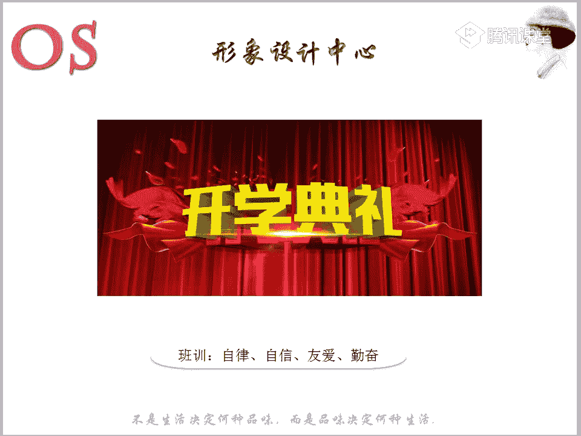

# 1、03OS男士形象VIP班《形象课》：第1节、个人形象的价值

🎼哦，非常非常的重要。🎼那我们来学习的同学呢，我也相信你们对于这样的一句话，高质量的人生等于体力加智力、加形象力的一个概念呢，是非常非常能够去理解的，对不对？🎼不出来。🎼好，那接着呢我们来看看啊。

这句话呢写在前面，就是想要让大家呢有这样的一个警醒啊。那我们呢回到啊回到我们今天的这样的一个重点。学习重点呢，第一个就是我们分为这样的一个三个重点。第一个呢就是个人形象的一个概念。

第二个呢就是我们个人形象的这样的一个要素。第三个呢就是我们个人仪容仪表。那么本节课学习的一个要求呢，就是第一个你们要掌握呢能够清晰的表述个人形象的，有哪些要素啊。那老师可能不是啊要素一要素2要素3。

但是呢我都会去讲解到，所以说你们要用自己的话呢充分的去理解。第二个呢就是要熟悉我们个人仪容仪表所包含的这样的一个内容。那么我们来看到这里啊，我要问大家一个问题。😊，🎼当你们去看一个人的形象的时候。

你会最先看什么？就比如说我们在街头上遇到一个帅哥，或者说遇到一个美女，你们会最先看什么啊，你们看看什么，可以把你们的呃看的点呢打在公牌上。😡，也就是你看这个人的一个整体形象的时候，你会看到什么。

你会看到什么。🎼望着广场的时钟。🎼不用不好意思啊，就把你们最呃真实的这样的一个内心的想法呢打在公台上啊。有同学可能说啊，我会首先呢看她的发型，或者说有的人可能有的女生会首先哎看这个男孩子的鞋子，对不对？

当然有的男孩子可能会啊我会首先看他的一个呃脸哪或者身材呀等等啊，整体的一个外在形象啊，还有还有没有能不能具体一点哦。😡，🎼心痛却竟。🎼无言中请你一好嗯，飞龙在天说看女生，我喜欢先看腿，再看脸哦。

看比较看重身材哦哦，腿控是吧？🎼好了啊，我会这个问题呢，其实老师也问过非常多的一些人哦。哎，有的同学可能会看到的是发型衣服，或者是说呢哎有的男生看这样的一个女生呢会看哎他他这个耳环挺好看的。

或者投涂了口红等等，对不对？哎，包括呢呃再去继续的追问下去，可能有的同学呢就会唉通过他的这样的一个穿搭呢所反映出来的是哎，他很时尚，对不对？或者是说呢他非常的有气质。

或者是说他觉得他这个人呢是再问下去的话，可能老师再问下去，哎，你看到一个非常时尚，非常有气质的人，你们会想到什么啊。有的同学可能说到我觉得他的生活品质应该挺高的，对不对？啊。

认同的同学可以跟老师说的鲜话，就是一个一个很有气质的人啊，非常有气质，然后又很时尚的人，你们再在内心中所反映的这样一个想法，就是他应该生活品质非常高。或者说你会觉得他是。😊，🎼一个白领，对不对？

或者说你会觉得他的文化程度应该很高，工作非常不错。也就是说，其实呢哎我们在别人的眼里的一个真实情况呢，其实就是像老师所描述的。而我们总以为别人看自己的时候，看的是呃服饰，或者说看的是发型。

或者是看的是化妆与否，但实实上呢我们人看的并不是这些，而是说通过我们这样的一个穿戴穿戴呢来试图来猜测我们身后那些无法直接所表现出来的东西。进而呢来判断我们的这样一个价值。所以说大家也要知道。

第一印象中非常重要。其实像这样一个第一印象呢，就概括了我们这样的一个整体的一个形象。所以说你会发现第一时间只有1到7秒，现在随着我们生活节奏的加快，可能短短的3四秒钟就会你就会被别人所定格。

你在他心目中的这样的一个印象。那么像这样的一个印象中呢。🎼我们55%所来源于的就是你的外表的形象。也就是说这样的一个分数啊，到底是多少。那么占据着如果说是100分的话呢，55分啊是来源于你的外表形象的。

也就是说你这样的一个服装，你的个人的面貌，你的体型，还有包括呢你的。🎼发型啊等等。也就是说这是55%。另外的呢，行为外表所占据的分数呢是38%。也就是说你的声音哎，你的手势哎，你的姿势，你的动作。

那么像我们在呃形象礼仪课程中啊，就有去重点呢来讲我们这样的一个行为外表。所以说行为外表也是非常非常重要的。那么在今天的这样的一个个人形象认知中呢，老师也会呢重点来跟大家来说一说这样的一个行为外表。

那么剩下的7%就是你的真才实学了。也就是说通过这几秒钟，我们没法去啊能够去知道你的内在到底有多么丰富，哎，你的知识面到底有多广，是不可能通过几秒钟了解的，对不对？所以说有有人就这样说过啊。

永远没有第二次机会呢去改变一个人的第一印象。良好的形象呢，比我们的文凭会更重要。所以说形象决定的价值，一个良好的形象可以给你带来更多的机会。所以我们要一定要。😊，把握好这样的第一印象啊。

大家一定不要忽视我们这样的一个第一印象。不管你在啊哪样的场合，还是跟啊什么样的一个朋友去见面，这个是一定要去把控的。所以说在今天这堂课呢，老师要跟大家所说的，就是你们一定要有这样的一个意识。另外的话呢。

我们的个人形象，整体形象设计，也不是说单单。来跟大家啊来奠定的是什么？而我要把你这个人穿好看了啊，要打扮好了，我只要通过哎你的。😡，🎼色彩进行，通过你的服装风格，唉，就能够去把你打扮完美。

但是其实不不是这样么简单的啊。你要知道整体的形象呢它不单单是你的显性因素，也就是说你这样的一个外在所表现出来的，决定了你的形色质啊，你的身材决定了你对于服装款式的这样的一个选择啊等等这么简单。

那么如果说要真正找对啊真正找对自己呢所适合的这样的一个风格，真正穿好穿对的话呢，我们不仅仅要考虑这样的一个显性因素，也就是说我们这样的一个呃外在的所表现的。其实呢内在也是非常重要的。

我相信啊大家在做诊断的时候，其实都有收过老师所给你们发的这样一个表格，对不对？😡，🎼啊在表格里面呢，老师有写到哦，唉你们的爱好是什么。哎，包括呢老师也会去问到你们的年龄。

包括哦哎我们这样的一些生活方式啊，还有包括你喜欢什么这样的等等。那么其实所以说你要去缔造一个完美的一个形象的话，不仅仅要考虑到显性因素，还有隐性因素，也是同等重要的。

所以说当啊我们在场的有是以后要从事形象顾问的工作的同学，对不对？那么包括我们以后在给你的顾客做诊断的时候呢，也不仅不单单只用去拿着色部，哎，拿着我们的领形工具去给他做诊断那么的简单啊。

我们还要去通过呢沟通，哎，通过这样的一个交流呢，去了解他这样的一些隐性因素，也就是说打举个例子，如果这位男士，他只是职业场合中啊，他都在职场上只是一个职场小白。

那么我们在他的这样的一个场合中在职业身份地位中，在这样。🎼社会中我们是不是给他打扮的就要趋向于他这样的一个社会身份，对不对？是不是这样一个道理？那如果说你以后的顾客是属于公司的高管。

或者说哎这样的一个男士，他是一个管理层，或者说是个老板的话，那么我们在给他穿搭的时候，是不是在服装上要去往这样的一个老板。唉，往这样一个管理层去做打扮呢，对不对？所以说要知道啊。

我们要去缔造一个完美的一个形象呢，不仅仅要考虑到显性，隐性也是非常重要的啊，对于这个知识点能明白的同学呢，跟老师刷的鲜花。🎼所以说在我们做诊断的时候，还有包括自己啊要有一个清楚的一个认知啊。

你的这样的一些内在的显隐性的。🎼好，那么接下来呢我们就具体问题呢具体来分析啊来给大家分析。那么第一个呢就是我们这样的一个男性的一个色彩。啊，首先呢要跟大家来重点来说一说啊。

来说一下我们这样的一个外在中非常重要的一个点。第一个就是我们这样的一个色彩。那么其实现今社会的话，我们的男性呢越来越注重着装的一个社会的形象了，是不是体现个人的品味的一个着装呢能够使我们男性呢增强自信。

也能够呢受人尊重，而且呢能够树立良好的这样的一个社会形象。那么所以呢我们要知道啊，在色彩中，我们男士呢是分为四大剂形的。也就是说春夏秋冬啊，没有我们女生啊女士那么复杂，我们是分为呢春夏秋冬。

那么像春呢和秋呢是我们暖色调的人。那么像我们的夏和冬呢就是冷色调的人。那么其实大家要知道啊，色彩对于我们这样的一个重要是非常非常重要的。那么像色彩。😊，其实构成我们这样的一个皮肤的色彩呢。

主要是因为我们啊血红色素，以及我们的胡萝卜素，还有包括黑色素所含的比例不同。你就会发现哎有的人偏白一点，有的人呢偏黑一点啊，有的人可能泛黄，对不对？

那么这就是因为他们所皮肤中所含的这样的一个三种元素中的比例不一样。那比如说像这样一块皮肤的话，啊，证明它含的血红色素比较多，所以说你会发现啊它比较泛着这样的一个红晕润啊，比较白透。

那么第2块呢就是比较汗，它比它是属于呢含这样的一个胡萝卜素比较多啊，所以说你会发现它有一点点偏黄。那么如果说这样的一个皮肤，它偏黑的话呢，证明哎你的黑色素呢，它比重比较多。那么像我们人的皮肤啊。

不仅仅人的皮肤呢含有色彩。那么像我们的发色，还有包括我们的瞳孔色，以及你的唇色呢，都是有色彩的。大家去拿。🎼身边的人去做对比，你就会发现有的人比如说拿唇色来说哦，唉有的人唇色呢就要淡一点。

有的人唇色呢就比较深，对不对？那么但是在我们的个人形象设计中呢，我们因为啊人的皮肤它所占的面积是比较大的。所以说呢在判断我们色彩的这样的一个剂形的时候呢，我们要以皮肤为研究的主要对象。那么像皮肤里面呢。

我们首先来看到这个就是属于我们这样的一个。😊，🎼色彩里面的一个三属性啊。那么第一个呢，我们皮肤就是属于有是分为冷色肤色和我们的暖色肤色。那么老师所展现出来的呢，这两张皮肤呢图呢就是一张是属于暖肤色的。

一张呢是属于冷肤色的。因为这样的一堂课，今天的一堂课就是主要让大家对于个人形象，有一个深刻的一个认知。那我们要接下来听老师来讲一讲，在我们不同的色部下。

我们这样的一个2块皮肤中会呈现什么样的一个视觉感受啊，大家可以看到啊，要清楚的看清楚啊，一块是暖肤色，对不对？一块呢是我们的冷肤色。那我们来看看暖肤色在这样的一个冷暖颜色下不同的一个视觉的感受啊。

那这样的一块皮肤呢都是暖的，不要去怀疑啊，不要觉得唉老师我怎么觉得好像这一块稍微偏白一点，或者说这一块稍微感觉没有那么透啊等等的，对不对？那么不要去怀疑它，其实它就是一块暖肤色的。😊，🎼哦。

就是一块暖肤的皮肤，只是给了他穿了不同颜色的一个衣服啊，一个是冷色调的衣服，一个是暖色调的衣服。好，你们来看一看，我们大家一起来找茬啊。

你们觉得这样的一个暖肤色在冷肤色穿一些冷穿一些冷的色调的一个颜色啊。你们从视觉上感觉如何，或者说有没有看出有哪些不对劲的，或者说你们可以看一看这样的一个暖肤色在我们的暖颜色下，唉。

给你们的感觉又是怎么样的，都可以畅所欲言哦。😊，🎼好，左边的比较显得白嗯。好，其他同学有没有什么还看到一些其他的不同的点啊，也可以打在公台上。🎼好，我们卡卡同学觉得右边的比较立体嗯。

其实老师要告诉你们呢，如果说我们男士呢，你作为是暖肤色的人啊，还还是包括我们的女生也是一样的。其实暖肤色的人，其实相比于冷肤色来说，它有一个非常大的一个优点，就是它的驾驭度还是蛮高的。

也就是说他其实你会发现他在穿一些冷色调的衣服的时候呢，差距哦，或者说不舒服的感觉并不是特别的明显，对不对？其实你们会有的同学可能会觉得我觉得这样的一个暖肤色，不管是穿我们这样的一件黄衣服也好。

还是在穿这样的一件紫衣服也好，还是觉得其实相对的区别不是太大的同学呢，也可以在公台上跟老师刷的鲜花哦。😊，🎼其实就是这样的，因为呢确实啊我们暖肤色的人，他的一个驾驭度呢，它相比于我们的冷肤色的人来说。

它的驾驭度要高那么一点。但是你们也要知道，其实当然暖肤色还是要穿暖色效果会更好。那么刚才有位同学说到右边的图感觉呢？啊比较立体，你为什么会觉得立体，是因为你会发现这样的一个脖子的颜色哦。

也就是这块肤色会跟他这件衣服呢，它不是在一条水平线下的。你会见呢右边这张图会显得它的皮肤有点突出，而这件衣服的颜色有点像后面退，有没有这样一个感受。

那么像左边呢你会发现这样的一个皮肤和衣服呢都是镶嵌在一起的。也就是说在我们这样的一个视觉上没有谁突出谁，而这个是会显得他的皮肤是有点突出的啊。然后看出这样的一个差距的话呢，可以跟老师在公台上扣个一。😊。

🎼我们可以呃稍微呢不要离得太近啊，稍微对比的去看一下，你就会发现唉这样的一件皮肤是有点往前面凸的，衣服呢有点后退啊。其实穿衣服穿色彩就是这样的。如果说哎有这样的一个对比的时候。

你就会发现其实这件颜色是不太适合你的。因为我们在穿衣服的时候，一定是要人和衣呢去和谐。那么我们来看看冷肤色在冷暖不同的色部下做对比，就会发现非常非常明显啊。

所以说冷肤色的同学千万不要去驾驭呢我们这样的一个暖色调。嗯，千万不要去驾驭这样一个暖色调，你会发现啊非常非常的不舒服。对，还会显得皮肤黑，是这样的啊，所以说有些同学可能会啊在没有接触过形象设计的时候呢。

会很好奇，为什么或者是说哎一直觉得自己的皮肤很黑，其实可能不是因为你本身皮肤所含的胡萝卜素也好，还是说呃这样的一个黑色素的比例比较大啊，可能是因为呢。你穿错了这样一个颜色。

所以说老师给你们做完诊断之后啊，如果说有些同学对于色彩这样的一个知识，还有不了解的同学呢，你们就一定要回到我们的色彩的基础班呢，要多去回顾啊，要多去听。因为呢这样的一个色彩基础对于我们来说是非常重要的。

那么除了我们的肤色冷暖非常重要以外呢，还有包括我们的明度啊。我们老师在说的时候呢，其实我会跟大家来说到你们的用色范围，对不对？像我们男士做诊断的时候，我会说哎你的用色范围是属于啊这样的一个着色调。

还是说唉适合我们这样的一个暗青色调，还是说我们这样的一个明清色调，对不对？那么其实就是这样的一个道理啊，有没有同学不明白暗青色调着色调，还有以及我们的明清色调同学可以跟老师在公台上扣个一。

就是不明白老师所说的这样的一个色调。🎼有没有不明白的哦，不明白同学可以跟老师扣个一。😡，🎼好，有两位同学啊有两位同学，那老师呢给你们看一下色调图，好吧，看一下色调图，让你们更加清楚啊。

那么其实呢呃色彩课上的少是吧？下课后一定要补上来啊。那么像我们这样的一个色调图，你会发现啊，其实唉跟着老师的鼠标走啊，所有加白的色调呢，其实它都是属于我们这样的一个明清色调。

也就是说哎我们这样的一个亮色调。😊，🎼看到没有啊？大家跟着老师的鼠标走，所以说这个范围内呢都是属于我们这样的一个明清色调。🎼好，浊色调呢指的就是所有色调里面呢加了灰的颜色啊，就是这样的一个着色调。

那么暗色调呢所指的就是所有呢加黑的色调，就是我们的暗暗色调。所以说这张图呢大家可以稍微呢自己保存一下啊。对于你们往后的课程的一个学习也是有帮助的啊。像这样的一个色调图是非常重要的。

尤其是对于我们的形象顾问啊，最好是能够清楚的背出来呢，我们每一个色调所在的这样一个位置，每一个色调的一个名称啊，加了白的为亮色调，加了灰的为浊色调，加了黑的为暗青色调。是的啊，非常棒。

🎼所以说大家要知道啊，那么我们这样的一个呃明度啊，皮肤的一个明度也是大家会发现，如果说你是属于一个低明度的肤色的话呢，那么当然我们势必就要穿一些哦比较深的颜色，对不对？

那么如果你穿的颜色稍相对来说比较浅，比较淡的时候，你会发现显得你不仅仅是黑哦，这其实是2块一样的皮肤哦，大家呢可能会发现好像老师你这个是不是特别夸张的一点，对不对？那么其实呢不是夸张哦，大家可以看一下。

😊。

发给大家截图，大截个图给大家呢看一下。🎼是不是2块一样的啊，是不是2块一样的，对不对？但是呢色部的一个衬托呢区别是非常大的啊，区别是非常大的。

所以说大家一定要按照老师所跟你们所说的这样的一个色调用色的一个范围呢去用色啊，不要说肆意的随意的去做这样的一个尝试，尤其是离我们面部比较近的地方，就一定要多去注意了。包括呢纯度也是一样的。

如果说你是一个高纯度的肤色的话，也就是说你适合一些纯度比较高的，对不对？像这个色调图呢，横向所表述的就是我们这样一个纯度的关系。那如果说你适合一些纯度比较高的用色的话呢，我们就要多往这里面去找。

而少往呢唉这里面去找。那如果说你找错了的话呢，也会发现会显得人和一不和谐的同时呢，还会有点显黑哦，还是会有点显黑显黄，对不对？🎼包括我们的男士，那老师呢也拿了一个男士来做例子。我们可以看到。

这是属于我们一个冬季型的男士。那么大家会发现，其实冬季型的男士呢，他适合选择一些偏暗青色调的一些颜色啊，当然可以小面积的去点缀我们的这样的一个纯色调，那么它主要呢是适合我们这样的一个暗青色调。

那么大家会发现当他穿一些这样的一些着色调的时候，是不是会显得其实脸神也好，包括呢我们这样的一个整个的一个面部的状态也好，其实是有一点点模糊的。而且呢没有这样的一个精气神，对不对？

而我们当我们去穿一些这样的一些深色调，也就属于我们这样一个暗青色调的一些颜色的时候，你就会发现整个人的状态都要好很多。大家会发现其实姿势也好啊，我们这样的一个拍照的角度也好，其实都是一样的。

如果说哎看这里呢看不太明白的话，我们也可以看看这张图片。😊，所以说这个色彩的一个概念啊，大家一定要有清楚的一个认知，不要去小看它哦，不要觉得呃我们老师之前就有说过啊，可能有些同学听过，我说男士呢。

其实呃相对于女生呢女士来说，女性他重视的是这样的一个感情色彩，满意的色彩和款式对不对？但是男性呢他重视的是品质场合和风格，最后才会考虑到色彩，但是我要跟你们说的就是色彩尤其是我们的年纪越往上走的话呢。

色彩的一个驾驭度就会降低很多。也许你年轻的时候所比如说我是年轻，我是一个年轻的男士，可能我驾驭一些着色调，我也能穿。但是随着年纪的上涨，你会发现呢，如果你随意的去穿错颜色的话呢。

其实对比差距也是非常大的。那么色彩虽然说在我们男士整体装扮中，他所排的位置稍微靠后一点。但大家也不要去小看啊，这个就是我们这样的一个色彩。好，对于我们呃个人的这样一个。色彩的一个认知啊，只是说认知。

不用说大家一定要懂得去呃区分啊，我们唉什么是春季型的人，什么是冬季型的人，只是有有这样的一个认知同学啊，明白的同学跟老师扣个一。那么我相信我们在场的呃在场的一些同学，男士的话，应该老师都有帮你们做完。

做过诊断啊，都有清楚。😊，🎼好，剩下第二个呢就是我们这样的一个个人的一个自身风格。那么风格是跟整体的一个形象的一个个性最直接的一个体现啊。

它指的是我们啊要考虑到这样的一个内在的一个修养和气质、思想文化以及跟你外在的一个长相呢，身体以及你的神情动作综合的一个结合。那么你的风格，我们的风格的判断是要结合这么几大特点，对不对？

那么当然穿对风格风格的一个服装的一个体现呢，它是由我们的形色质所去体现的。所以啊男士非常重要什么风格啊，风格对于男士非常非常的重要。当然女生也是一样的。因为你会发现风格，它穿错和穿对的一个对比。

也是非常强的。也许啊啊我们就拿这样一个男士啊，男士的这样的一个西装来举例子啊，我们不去挑别的了，我们就拿西装来举例子。那么其实像西装的话呢，它也有不同的风格啊，也有不同的。😊，🎼款式。那么不同的款式呢。

它所对应着不同的风格。那么在我们男士班有一个正装的这样的一个课程的时候呢，老师会重点跟大家说到，哎，我们风我们西装分为什么样的一个款式，哪几类人群是适合什么样的一个款式的，都会重点跟大家分析。

那我们首先呢啊因为要让大家加深这样的一个认知啊。我们看到这样一张图片，这是我们一个自然型的男士。那么呢老师要告诉你们的就是风我们这套西装，一个是H型西装，也就是说我们的这样一个美式西装。

一个呢是我们这样的一个欧式西装哦，欧式西装。那大家来看一下，也就是我们T型啊，TT型款式的。😊，🎼你们告诉老师，你们觉得哪一套，你们看上去在视觉上会更舒服。可以呢打在公台上是第一套还是说我们第二套？😡。

🎼第一套是我们美式西装啊，第二套呢是我们的T型啊款式的，也就是我们的欧式西装。那么在我们的西装课程中会重点跟大家去讲解哦。好，第一个啊，为什么觉得第二个不舒服？为什么觉得第二个不舒服？😡，🎼哦。

给你们什么样的一个不舒服的感觉啊，可以用一些关键词来形容。🎼好，显得人非常的臃肿嗯。🎼你的好，感觉很小啊，其实会感觉这样的一件西装呢，他穿在身上有点束缚到他，对不对？会显得这个人非常的不自然。

非常的不舒服。嗯，很紧凑。是的，所以说这个就是我们这样的一个服装，不要去小看他。所以说呢像我们男士啊，尤其像这是一个自然型风格的男士啊，这是我们一个自然型风格的一个男士典型的。😊，🎼那拿它去举例子。

所以说呢像我们自然型的一些男士的话，在选择服装中呢，你会发现他去穿一些啊比如说条纹哪格纹哪这样的一些休闲感非常强的，或者说这样的一个肌理感，很强的，或者说没有一些人工痕迹感的这样的一些服装的话。

他穿在身上非常的好看。所以说大家也要知道啊我们服装呢风格的一个判断，要分为是我们的一个形色质。那么在往后的课程中呢，老师也会重点去跟大家讲解。那么像这样的一个男士的话呢，他就是我们的一个戏剧风格的。

所以你也会发现哎戏剧风格的人在穿西装的时候，原来也有这么大的一个差别，对不对？😊，🎼所以说啊风格这个东西就是由形色制所组成的哦，穿对和穿错呢。不是说哎我们这样的一件衣服什么人都可以去穿。

你只有呢真正认知自己的一个风格，然后呢再来认知我们服装的风格。这个时候呢唉你才能够去啊穿的协调啊，穿的合适。嗯，啊，老师这里没有古典型啊，古典型的衣服都是比较板正的啊，这样的。🎼没事啊。

老师呃私底下课后可以去嗯发给你，但是这样的一个款式都是比较典型的，而不太符合当今的这样的一个潮流趋势啊。那么没关系，我们在往后的课程中都会去跟大家具体啊。比如说我们这样的一件毛衣啊，什么样的一个款式。

适合什么样的款式啊，都会去非常详细的跟大家去讲解到。那么这个就是我风格，第三个呢还是我们的外在的一个形象的一个体现，就是我们体型的一个轮廓。那么我们说了在穿衣服的时候呢，要考虑到风格，对不对啊。

形色制风格对于我们服装的一个形色制的一个影响。那么其实呢体型对于你服装的形色制的影响，也是非常重要的。也就是说我们在穿衣服的时候，不仅仅要考虑到你自身的这样的一个风格。

还要考虑到你的自身的这样一个体型啊，也就是说体型呢也是我们服装的这样的一个载体。如果你想要让你的形象更全面的话呢，我们一定要考虑到自己的一个身材。😊，🎼轮廓也就是说最适合你的款式。那么在我们的男士中。

体型呢也是分为五大体型的。比如说有一个瘦高型的，也有这样一个矮胖型的。那么不同的体型，我们在选择服装上哦，也是都是不一样的啊，都是不一样的。

所以说大家呢到时候在我们第三节课就会重点呢跟大家来讲到这样一个体型的一个认知。在那一堂课呢，大家一定要认真听。因为老师会讲到怎么样去判断自己的一个体型，怎么样去呢找对自己体型的型色制。

🎼第五个呢就是我们这样的一个发型啊，发型是我们整体是形象设计的一个主点。因为呃发型其实相对于我们的男士来说呢，是你们的第二张脸。所以说啊你也会发现这样的一个发型的话。

可以根据你今天所呈现的这样的一个场合的问题啊，来呢去营造不同的感觉，有些头发的话，你会发现像我们这样的一位男士啊，张若昀，对吧？啊，好像是叫庄若昀啊，你会发现哎把头发捋起来啊。

把它梳成这样的一个呃油头这样的一个感觉和呢把它把刘海放下来的一个感受，其实是两种不同的这样的一个风格，对不对啊？我说的风格不是指我们人的风格啊，这是我们这样的一个整体服装跟服装所协调这样一个感应感受啊。

这样一个风格。所以说呢其实你可以随着你的一个心情，或者说随着你的服装的一个场合的一个问去调整。🎼的一个发型。而且很多同学的话呢，对于发型的一个认知，其实也是相对来少的啊。我想问一下大家哦。

在场的同学能够去完美的啊，非常好的去打理自己发型的同学，可以跟老师扣个一，就是老师我会做造型，我会打理发型，我只要遇到一些重要的场合。我就能够把我的发型呢，打理的跟啊明星其实没什么太大的区别啊。

不管是男生还是女士。我们在场的可以完全不找理发师，能够把自己发型打理好同学，可以跟老师扣个一。😊，好，有一位同学啊，其他同学都不行，是不是？😡，哦，不行，同学跟老师扣个2啊，我看看是不是真的是哦。

其他同学都没办法去进行打理啊。其实要跟你们说的就是发型不好呢，人真的也是漂亮不到哪里去啊。而且很多同学有点依赖于造型师，依赖于我们这样一个发型师。而且呢典型的大类大量的一些人群。

就是呃有一类人群是属于不敢尝试，怕剪失败了的，我不知道有没有我们班有没有这样的啊。如果说是呃对自己缺乏了解，犹豫不决型的同学可以跟老师扣个一。😊，呃，缺乏了解，那就是属于我们卡卡同学就是属于缺乏了解。

对不对？不知道什么发型呢适合自己。那么缺乏了解。所以说呢有时候剪发型的时候呢，完全呢是呃有点琢摸不透，或者是说呢完全就是依附于发型师发现剪完之后呢，又不好看，对吧？😊，🎼那么还有一种人呢。

就是又想省事儿又想呢漂亮的又想帅气的这样的一个异想天开的哦。有这样的人群也可以跟老师扣个2。就是哦每次去到理发店的时候呢，我可能会跟理发师说，哎，上次我在你这里做了个造型挺好的，挺不错的。然后呢。

这一次的话呢，我希望呢你跟我剪的啊就是这样能够让我第二天洗完头或呃，第二天哦第二天睡醒了，或者说哎洗完头之后呢，就跟你刚跟我做完造型之后呢，啊。😊，是一样的啊，这种就是属于呢。你就照着我的发型给我做。

然后呢千万别让我回家再费劲啊，最好就是一洗完就可以这样哦。有有没有这种人啊，就属于异想天开型的第二类。那么我要告诉你们啊，其实发型师给我们的只是一个基础。在基础上做文章呢。

绝对是我们自己的这样的一个事情。所以说头发这个东西是非常软的，对不对？你想把它做成什么样，他就会跟你演示成什么样一个风景。那么有些不会做造型的同学啊。

首先呢我们在这样的一个男士课程中会跟大家说到不同的脸型应该怎么样去选对发型，那么呢也会跟大家来重点说一下呢，我们不同的风格的人在选择造型中哎，要注意的一些点，那么我们结合自己的风格呢。

在考虑到自己的一个脸型。真正呢唉按照我们这样的一个要求呢，去找对自己的一个发型之后，你们就可以大胆的去实行实行呃改造自己这样一个发型呢？大家能不能明白啊，改造完发型之后呢，你要知道在。😊。

改造的过程中呢，我希望大家要去多问啊，因为老师不在你们身边。🎼所以呢你而且最好的就是去向理发师多取经。那他们在给你抓的时候啊，跟你去捏的时候，或者说跟你在吹的时候呢，你们就要多看啊。

不要闭着眼睛呢去享受。因为我们人生中啊有几万天的时间都是要靠自己来做发型的。你不可能每天都去理发店让人家帮你打理完造型之后，你去上班，对不对？所以说呢我们要学会去做这样一个造型，其实非常的简单。

而且男士的话呢，你们如果说有一些男士他想要去烫一些小卷的。其实你们也可以用到这样的一个直板夹，很很小的这样一个纸板夹，稍微烫一点点弧度了之后呢，这样一个层次感就会就出来了。烫完之后呢。

你可以拿这样的一个发蜡呢，1。1点的去抓和捏啊，捏出这样的一个小造型。就比如说哎我觉得这这里有一缕头发有点多啊。我想跟另外一缕头发呢。😡，🎼呃并过去，那你就其实可以拿那个发蜡呢把它粘到一起。

所以发蜡的一个功效就是这样的，其实它就是来捏来来搓来抓的。然后呢，抓完之后搓完之后，你不要觉得发蜡它可以有定型的效果，发蜡是绝对没有定型的效果的。你要想定型的话呢。

你就一定要准备什么准备我们这样的一个喷雾。也就是说我们这样的一个。😡，啫喱呃，不是叫啫喱啊，应该叫摩斯啊，不也不叫摩斯啊，老师突然呢卡壳了，想不起来了，叫什么来着？🎼呃，发胶对对对对对，是的啊。

就要赶紧的用我们的发胶喷一下，然后把型呢定住啊，发蜡是绝对定不了型的。有很多同学可能是的话，你的你的洗脸台一定有发蜡，但是你可能没有发胶，对不对啊，啫喱水也可以吧，是吧？但是这喱水有点太硬了啊。

发胶这个东西，其实有有的发胶就是你喷完之后，它不会去起那种白屑啊，也而且呢也不会说很死硬的那种非常的自然，但是又定型效果非常好，所以说可以用到发胶哦。对，发胶非常好用。尤其像呃欧莱雅的有一款发胶。

就是那种金色的那个瓶子的。以前我们给。😊，别人做造型的时候经常会用那个，因为那个非常好用，就是你一梳完之后吧，因为有我们有时候拍广告的时候要经常变换造型，对不对？一梳完之后呢。

它就不会说像我们的一些啫喱水啊，很硬啊，一坨一坨的，它就非常自然的就散开了，也不会有白血。然后所以说你变换造型的时候就非常好用。嗯，而且呢定型效果也还不错。😡，🎼啊，这个就是我们这样的一个发型啊。

所以说大家呢可以每一次去理发店的时候呢，多去向理发师取取经啊。我这个造型应该怎么去抓。你可以问他啊。比如说他给你剪完之后，马上要再吹干的过程中，你就说哎我自己吹应该怎么吹，他就会告诉你。

然后在他抓的时候，你可以说哎你慢一点慢一点抓给我看，他也会稍微慢一点，你们就可以仔细的去观察，很好学的。其实这样的一个呃造型的一个做法。其实你就会发现很多一些男明星为什么自己会做造型。

就是因为他们经常做造型，对不对？看的多了，就学会了。所以说你们其实也可以在网上呢搜一下造型的一个捏法，或者说这样一个吹法，其实非常有用的啊。就像老师自己我如果说今天出门的话。

我拿直板夹5分钟我就可以搞定啊，熟能生巧啊，这个发型这个东西男士一定不可去小试啊，尤其是有时候男士呃头天一睡完之后呢。😊，🎼你的头顶后面就会成就是压瘪了，对不对？就会非常非常难看。

所以说一定要去进行这样一个打理哦。发型的话一定是会对于你的颜值来说有一个很大的一个提升。🎼还有谁？🎼好，下一个呢就是我们这样的1个TBO的一个着装的一个尝试啊。

男因为男性也受其我们主要的一个社会角色一个影响，是不是？所以说我们要求呢在各个场合中要呈现你完美的适合你自己的一个着装。那么像我们的场合的着装呢，对于我们男士来说是非常非常重要的。因为我刚才就说到了。

对不对？男士非常注重我们的品质以及场合的问题，还有包括风格的一个问题。那么像色彩呢是最其次去考虑的。所以说场合的一个着装对于男士来说是非常非常重要，不要在任何的场合，穿着衣服的时候都出现任何的一些错误。

比如说呢我去面试的时候，我穿的跟呢出去逛街一样。啊，比如说呢我去相亲的时候呢，我把自己打扮的潮的都不不行不行的了啊，恨不得呢要引领整个时尚潮流这样的一个感觉，其实是不要的。

因为你要知道我们在这样一个场合所形象的一个表达方式不同。所以说你的整体形象所缔造的感觉也要不一样。我们。🎼在相亲的时候，当然不能把自己啊，我怎么朝我穿的这样的一个夹克，然后戴上铆钉等等的这样一个戒指。

巴拉巴拉的啊项链各种的千万不要这个样子啊，因为你会给别人一些距离感。我们所要打扮的一个感受呢是暖男的平易近人的，非常好接触的这样一个男性的一个个人魅力。所以说包括在场合的问场合的着装这样的一个课程中呢。

老师也会详细的跟大家所讲到我们男性在不同场合中要注意的啊，问题，以及呢我们应该怎么样去穿搭。😊，🎼好，先喷一点发胶，然后用卷发棒卷出来的头发可以保持的比较长。是的哦，非常好。

看来我们这样一个向日葵同学是非常有经验的。那么我们作为女同学的啊，如果还要包括像一些男士，你是像这样的一些头发，不要觉得这个头发是呃我们永久性烫烫出来的，或者是说自己抓抓出来的。

这个是绝对要用卷发棒去烫的，或者是说用我们的直板夹去夹的哦，吹完之后要夹夹完之后还要捏捏完之后还要拿发胶去定型，所以说头发的一个打理呢，啊，其实看似非常的复杂哦。但是手洗了就能哦就是熟能生巧。😊，好。

这个就是我们这样的一个场合，男士呢一定要有一个呃认知。好，接以上呢就是我们这样的一个外在啊，也就是说你的一个外表形象中非常重要的几大点啊，全是特别帅的。你你也会很帅，你要相信老师啊。

那么这个都是我们的一个外表外表形象。接下来我们来看看我们这样的一个行为啊，行为外表，也就是说哎你的姿势，你的动作，还有以及呢我们这样的一些内在，以及跟我们外在所呈现的要去呃相注意的一些点。

第一个呢就是我们这样的一个个人呃礼仪基本的一个原则啊。大家可以看到这这几个点呢老师不做多的一个详细啊，大家去看哎就能够去明白，是的哦三分长相的七分打扮。那么要提醒我们各位男士的同学。

就是你们一定不要在他人面前呢去整理衣服，这个就是属于我们这样的一个呃行为外表了，对不对？也不要在他人面前去做一些小动作。哎，因为比如说我们有一些男士，你会。😊，经常会发现一些不太方便的一个地方。

就比如说我今天要是穿着衬衫哦，唉穿着西裤的话呢，可能我一蹲下来之后，我的衣服会出来，对不对？那么我们在公共场合也会经常看到一些男士呢就会当众的去把衣服塞进去。其实这样的一个小动作啊，其实是不太雅观的。

所以说我们要注意的不要在他人面前去整理衣服。如果说衣服有一些毛病的话呢，我们可以避开别人嗯。🎼啊，有的男生喜欢当众抽裤子啊。是的哦，还有一个点呢，在这里说到裤子，老师也要提示一下啊啊。

有的同学喜欢呢把我们的钥匙挂在呢裤子的这样的一个。😊，🎼应该说皮带扣上有没有啊？我们在场的男同学有没有啊，有这样一个行为的，可以跟老师刷个一啊。那么千万不要再去把你的钥匙呢挂在我们这样的一个裤带扣上。

或者是说我们这样一个车钥匙。其实可能有的同学是怕丢，但是我要跟你们所说的就是。🎼如果注重形象的一些女士的话，嗯，或者是说我们外人看来的话，其实是会有点拉低你整个的一个形象的。所以说这样的一个点。

其实大家如果怕丢的话，我们可以准备一个小手拿包。手拿包里面呢可以放钥匙，或者说放我们的车钥匙，对不对？那么这个或者就是说我们放在一个比较保险的安全的这样一个口袋也是可以的。因为千万不要挂在裤子上面啊。

这个这个是不可以有的，绝对会以对对你的形象呢大大。打大打折扣啊，应该这样说。🎼好，这个就是我们这样的一个个人礼仪要注意的。接着呢我们就来正式呢开篇啊，开篇这样的一个。

那么其实像这样的一个仪容仪容呢是它指的就是我们这样的一个容貌，对不对？所以说它包含着不仅仅是我们服装对于我们这样的影响。那么其实我们面部自身的一个仪容的问题呢，大家也要多要去注意。

因为我们会通过你这样的一个貌美啊，肌肤美呢来去也能够对于我们的一个内心吧，可以有不同的这样的一个感受，是不是？包括像面部的话，因为我们在接触的过程中，第一眼所看的就是这样一个面部。

那么面部是我们在交往时第一眼会注意的，对不对？我去跟你握握手，或者是说我今天第一次见面，跟你握手的时候，我就会看着你的眼神看着你的面部。那么包括像眼睛也是一样的。我们要记得去多注意啊，清洁。

还有以及呢像我们这样的一些啊修眉，一会儿老师会重点跟大家讲到，包括我们的耳朵要记得及时去清洁啊这样的一个。😊，🎼这样都是可能在两侧的一个地方，我们不容易去啊重视的。但是呢作为我们各位男士来说。

你们在每一次洗澡的过程中，或者说在照镜子过程中呢，一定要多去注意。包括像我们的一些鼻子啊，清洁我们这样一个鼻毛，以及我们的一个嘴巴的一个护理，哎，以及我们这样的一个胡须等等的，以及脖颈的一个清洁。

大家都要多去重重视啊，这是非常非常重要的。😊，这里呢就快点跟大家来讲啊，快点跟大家讲。那包括像这样的一个洗澡啊、洗头啊、洗脸哪，这个肯定就不用老师多去做强调了，对不对？

当然还有很多男士其实非常不重不重视自己皮肤的一个护理啊，包括像我们飞龙在天的话呢，因为一直在上学，可能对于这样的一个概念是不太了解的，对不对？

其实我们要知道啊面部的一个清洁以及面部的护理是非常非常重要的哦哦，估计飞龙在天要记恨老师了啊，每次老师都把你的底给兜出来了，是不是？😊，🎼所以啊没有啊，没有就好。那我们其实像男士的话呢。

其实你的皮质的一个分泌啊，能力是比女生甚至要更强的。所以说呢我们男士早晚如果说你是属于这样的一个油性皮肤的话啊，早晚呢都要去用洗面奶呢去清洁。那如果说你是干性皮肤的话呢，我们可以呢晚上睡前呢啊进行清洗。

用洗面奶。那么早上其实用清水去清洗就可以了，就不用再去用洗面奶了。因为如果过度的清洁，其实对于皮肤的伤害也是很大的。但如果是油性皮肤的话，我就建议大家呢包括一些女士也是一样的，早晚都要去用洗面奶去清洗。

干性的话，就没必要。如果说混合性的话，像一些T字部位的话，你也可以势必的呢在早上起来的时候呢做一下清洁。那么清洁完之后，我们男士如果说你没有洗面奶的。那么上完今天这堂课，其实大家就可以去超市买哦。

还有包括像我们的一些护肤品，这样一个基础的护肤品。像我们的水以及我们的。😊，🎼乳液的话呢都是必不少的，因为尤其是在这样一个冬季，皮肤很容易呢比较干，对不对？所以说像这样一个基础的护理一定要有啊。

每天早晚洗完脸之后呢，我们都要给肌肤呢补充水分啊，像乳液啊，先用完水之后呢，用乳液啊，让他去吸收。那么呃对于我们男士都是有很大帮助的。当然像有一些男士她非常注重的还可能呃涂完这些之后呢，会去涂隔离。

对不对？非常好哦，其实老师非常支持，不用觉得这是一种呃太娘的这样一个行为啊，因为要懂得去保护自己的一个肌肤，因为很多呃我们在场的也有女女性对不对？也有女性，我们像一些顾问课程的同学。

其实皮肤好的男的其实是不是会给你们在心理上会打分，会分数又要高一点，有没有有的同学可以跟老师扣个一药。😊，🎼就像包括你像我们之前看过我之前看过一个综艺节目，就像林心如和人重哦，对不对？林心如和人重。

其实林心如就说她他说我是一个非常呃喜欢皮肤好的男生，其实像人重的话，她穿搭也没有任何问题，她的整个外在形象也没有任何问题。但是林心如给她好像是虽然没有说明白，就是说她其实不太就是皮肤不是特别好啊。

还给他做面膜等等的，对不对？所以说我们男士啊要多注重肌肤的这样的一个护理啊，不要觉得这是女生才该干的事情。我们男生也非常重要。😊，🎼那第二个呢就是我们这样的一个分泌物啊，要跟大家去啊多去强调一下。

其实大家其实有一些男士他会在自己的身边备一个镜子，其实是非常好的。因为你你会发现像眼角，我们也会有眼屎啊等等的，对不对？尤其像一些戴眼镜的，有时候经常会有一些杂物啊，包括呢像我们的鼻孔也是一样的。

其实要定期的去进行这样的一个啊清洗清洁。有时候可能你跟别人聊天的过程中，你没有去注意到自己这样的问题啊。哦，但是可能你的我们对方就会被这样的一个影响。而且尤其我们如果自己不去检查的话。

其实有时候周围的人他不会去提醒你的，他周围的人是不会提醒你。因为我们整体其实要多去注意一下周围人对你的冷漠啊，包括大家也会发现我们之前可能在穿不对的时候，并没有很多同学。

或者说很多一些朋友或者说同事会直接指出来。哎，你。😊，穿的真的很难看，你的审美真的很差，或者是说呢哎你的皮肤也太差了吧，很很少，对不对？😡，是不是很少人会把你的缺点啊直接指出来。所以说呢如果我们自己啊。

对我们如果自己不去观察的话呢，有可能就会影响到哦别人影响到对方。所以像像这样的一些呃鼻孔的一些分泌物啊等等的。我们要多去清洗。包括像一些口部的一些多余哦这样的一些呃我们吃完饭之后也要多去照一下镜子。

看看我们的牙缝啊啊这些有没有，包括像我有一个同学在上一期我就有讲过，因为我有一个同学呢，他就是属于呃第一次跟她男朋友去呃约会啊，因为在在校学生啊，那时候在还是在上学的时候，第一次去约会，然后呢。

他们就去到了那个西单。😡，在吃饭的过程中啊非常的快乐。然后呢聊的也很开心。然后等到我那个同学回到宿舍之后呢，发现啊一照镜子，然后看到自己的牙齿上有一个番茄皮啊，当时他都不想跟男生再见第二次面了。

他觉得丢人丢大发了。而且他说我全程跟他聊的非常的开心，因为第一次约会嘛，去到西单正正儿八经吃个饭，对不对？然后呢，很开心啊，畅所欲言笑的很开心。然后呢，结果没想到有一个番茄皮，然后回到宿舍才发现。

当时呢他还非常不好意思啊，后来熟了之后问她男朋友说哎，为什么你我有番茄皮，这个事情你没有没有跟我直接指出来哦，没有说不提醒我，害得我还一路跟你啊坐地铁啊，大大笑笑呵呵的还回到了宿舍。

然后男生就说他说其实我挺不好意思，他说我一早就看到你那个番茄皮。但是我怕我提醒你呢。😊，我怕我提醒你吧，又让你很尴尬。所以我就觉得哎算了，就这样吧。所以有时候我们周围的很多人啊就是因为怕对方尴尬。

或者是说呢呃考虑到一些上下级的这样一个关系，或者考虑到我公司的一个地位问题，我可能就不会对于啊我周围的上司也好，或者说我周围的一些朋友，或者说我的呃爱人呢去把这样的一些问题指出来。当然也有指出来的。

对不对？所以说呢我们要去多注意，那么呃有可能别人不会指出来，我们这个时候自己要有这样一个意识，每一次吃完饭呢之后呢，我们要去检查一下我们的口怖啊，后后面结果怎么样，后面肯定是没有任何问题啊。

因为啊真爱嘛，对不对？不会因为一个番茄皮而怎么样。😊，🎼好，第三个呢就是我们要定时的去剃须啊，定时的去剃须。除了我们有这样一些宗教信仰和风俗习呃习惯者以外，或者是说呢哎你因为呃有些男士其实非常聪明啊。

就是我说过啊，有一些男士是属于呢脸部比较长的，就是有的同男士可能他的下巴比较长，他可能会留一个这样的一个络腮胡，或者说哎留一小撮朵胡子放在下巴这一块，其实是有一个修饰作用的。

就像我们女生化妆会打阴影一样啊，确实是那如果说你除了你是有这样的一个特殊的啊这样的一个习惯的，或者说有宗教信仰的啊，你可以呢不去进行啊去可以去留胡须啊。但是如果说哎你其实没有这样的一些困扰的话呢。

其实老是建议你们最好是把胡子呢剃干净。因为呢呃会显得你整个人非常的精神，也非常的整洁。🎼这就是我们这样的一个胡须啊，要定期去剃。其实每天都要去剃。因为你有可能今天觉得还好啊。

剃完之后你会发现可能到了第二天，一早上一起来之后就已经涨了呃几毫米了，对不对？🎼那么下面一个重点呢，就是我们除了胡须要剃的话呢，其实眉毛也是一样的。我相信我们很多男士是从来不考虑修眉毛的。

但如果说我们呃在作为一些女性啊，以后想要给男我们自己身边的爱人去做形象的打造的时候，其实你们如果会修眉毛的话，给我们的男士朋友修个眉毛非常好。你们可以去做一下对比啊，修和不修差距非常非常大。

修完眉毛之后，整个男士的五官都清晰了。而且整个五官都立体了，整个人都帅了一点。但是当然啊你要会修啊，不要去呃把她的眉毛呢修成这样的一个哦女士的眉形啊就。🎼我之前就干过这种事情啊，因为就是我心不在状态啊。

老师不在状态。然后呢，心里想着别的事情。当时我一个男同事就说啊，他说你帮我修个眉毛吧。我说好啊，因为你你像我自己哦，因为我大学专业呢就学的是这样一个影视化妆。😡，🎼所以画这个修眉毛对于我来说。

我就想这算什么，对不对？然后但是内心呢，其实我当时心里有想着其他的事情，我就非常快的给他修修修修修修修。因为第一次给她修完之后，她发现自己变帅了。因为我之前说我说你的眉毛要修一修，她一直都不想动。

她就觉得男士眉毛没必要动，对不对？然后呢，结果修完之后发现自己哇塞晒了，然后长齐了，长完长长了之后呢，又来找我又来修，然后结果我又不在状态，给她修成了一个柳叶眉哦，然后把她气的够呛。

所以说大家各位女士的话呢，给我们的一些男性朋友修眉毛的时候要多注意一下啊，但是没关系，眉毛也会长回来的嘛，对吧？😊，呃，胡子会会越剃越粗吗？呃，如果是男士的话，其实一定是会有一点变粗的。

但没有任何问题啊。如果说我们女士的话，有些女士可能也是属于胡子会比较有点明显的，对不对？那我们可以去去做一个永久性的一个脱毛啊，还是有效果的。嗯，变粗才性感啊。是的。啊，所以说大家要注意啊。

修眉毛的时候要要找一个专业的啊，不能分神的啊，不能像我这种还算比较专业，但是一分神修成了一个柳叶眉的哦嗯。😡，所以大家要注意，因为我没想到，我当时不在状态，我就觉得好像就跟一些女性在修眉毛。

我就没考虑到她是一个男性啊。所以说修完之后把她气的够呛，就把她修出了那种李玉刚在化完妆之后的那种即视感。好了，那我们这样的一个杂乱的眉毛呢，其实非常容易给人一点邋遢的一个印象啊。

所以呢大家呢要注要知道我们要定期的去修理。那像有一些理发店的话，他也会有问你啊，理完发之后说要不要修一下眉毛，其实呢可以啊让让她帮你去修一下，那么包括呢修完之后真的是会完全不一样啊，老师要跟大家说一下。

你像很多男明星哦，其实我要告诉你们的是，有一些男明星并没有长得有多帅翘，其实不要觉得女明星化妆前和化妆后区别很大。那么其实呢像我们的男明星呢，化妆前和化妆后呢，区别也是很大的。

尤其是我们这样的一些眉毛非常淡的一些男。😊，🎼是。🎼大家可以看到里程的一个对比，对不对？所以说发型啊，还有包括你整个人的面部的这样一个清洁度啊，整个的一个妆度是非常非常重要的。

大家也可以我我没有找特别明显的，我就找了一个普通的唉，都是穿白色衣服的。因为这样的话呢，呃不会有同学会觉得唉，是因为服装的一个影响啊，所以说其实服装没有太大影响，就是主要是因为这样的一个发型和妆容。

那么有一些男士的话，其实我们也要去摒弃一些对男士喜欢去打粉底的这样的一个想法。其实没有什么问题啊，嗯没有任何的没有任何的问题。男士你就算喜欢打粉底，其实没有人会说觉得你娘或者是怎么着。

其实男明星为什么会觉得其实他本人真的很多男明星本人都没有化完妆之后好看，因为化妆能让肤色均匀，对不对？而且呢眉毛的一个修饰是非常非常重要的。再加上发型啊，再结合我们的这样一个服装差距是非常非常之大的。

所以说你们不要你们可能很多一些你们。😊，🎼里的男神呢，其实他们讲的也跟普通的一些男性没有太大的一个差别。所以说我们各位男士呢也要对自己有信心哦。🎼哎，男生的健眉是最好是的，男生要修眉毛的话呢。

就要修修这样一个健眉哦。对，是我们的健眉嗯。🎼呃，难道男性平时也需要画眉毛吗？嗯，其实如果说你的眉毛比较淡的话哦，当然如果说你的本身的眉毛的哦这样的一个色颜色也好，还是说他的一个生长空间啊。

比较茂盛的时候，颜色比较重的话，你们只要稍微修一下就可以了。但如果说有的男士的话，他可能眉毛很淡的。就像我们的里程真的超级淡。因为老师有跟他见过他本人，那个时候他拍一个宣传片的时候呢。

我们给他化妆的时候，当时我就觉得李晨怎么这么丑啊，但是化完妆之后我就变成了他的小粉丝，我就觉得他帅了好多。😡，🎼就是这样的。所以说眉毛对于他来说非常的重要。那么有一些男士，如果说你的眉毛比较淡的。

你们修完之后呢，其实可以拿眉笔去做一个填充。填充之后呢，色彩会变深。而且呢一笔1笔一笔的稍微去填充的话呢，也会非常的自然，不会有唉觉得你娘或者说啊特意的这样一个感觉。

其实找对了这样的一个眉毛呃就找到一个只眉笔的话，其实轻轻的把眉笔削尖一点啊，瘪一点，我们去画的话就能够去画出一根一根非常自然的这样一个效果。那么我希望我们在场的有男士是属于眉毛淡的。

或者是说呢眉毛非常参差不齐的这样一个男士呢，一定要做好这样的一个护理啊。也就是说先呢第一步我们做修剪，修剪完之后，如果说你的呃这样的一个填充度不够高的话，我们就用眉笔去进行填充。🎼是有必要的啊。

一定是有必要的，不要去小看眉毛，眉毛其实很重要。真的，而且在化妆里面，其实像眉毛的话也是比较难化的哦。因为我们可能有的同学是有在学习化妆的，对不对啊，也会去发现啊化妆课程的一个眉毛其实要求非常的高。

而且也非常的难画。🎼所以希望大家能够做到啊，在这里重点跟大家提到了。所以我们各位男士不用不好意思，该修理的要修理啊，该填充的呢，我们也大胆的去填充。你就像我之前去做指甲的时候。

每次都会看到一些这样的一个美甲师啊，会说到唉嗯你上次跟你男朋友一起来做的这样的一个纹的一个眉毛，对不对？很多男性他也会去纹眉毛，因为她想省事嘛，对不对？眉毛很淡，嗯，是的啊，所以就去纹眉毛，其实没什么。

不要觉得呃有什么很别扭的，很正常，爱美之心，人皆有之，对不对？谁都想自己变美变帅气。😊，🎼那么还有就是我们这样的一个手部的一个呃卫生。那么像男士的话呢，有一些男生非常喜欢留指甲的，而且留指甲呢。

他可能还不是全手留，他就是他只留小指甲，或者说他只留大拇指哦。有这样的，对不对？我要告诉大家啊，如果在场的我们在听课的同学。🎼你是喜欢留某一个指甲的。🎼你就一定要给老师剪干净哦，我我到时候我想要要检查。

我要抽查大家的啊。所以说呢这样的一个遮甲的话，一定要像如图中我们这样一个男士啊剪的短一点啊，整齐一点，不要去留，真的非常非常影响你整个人的这样的一个感受。那包括呢像手的话，其实大家也可以多去护理。

那包括像我们的王凯，对不对？之前他就是因为她的一个手啊，非常漂亮，又穿了又穿了一部分的好多的一些粉丝。那么其实很多女生的话，尤其是我们在场有些男士是想要通过我们的一个形象呢。

能够帮自己找到一个非常满意的一个动啊，一个对象的，对不对？那么我们也要注意，其实你有一双好看的一个手的话呢，有时候女生的话呢，也会被你这样一个小细节吸引啊。包括我们在场的其实可以问一问啊。

我们这样的一些女性的话，你们其实会发现手好看的男士的话，是不是会加分，当然对不对？😊，🎼好，以及呢我们要注意的一个就是肩膀在重视场合不宜裸露啊。那么这个是这是会在我们的场合中会跟大家讲到服装的。

那么包括手是被我们称为啊也算是我们第二张脸了，包括女士的时候，我们也要多去护理手。那么呃虽然说脸非常重要，我们会去护理，对不对？但是手不要去忽视它哦，每次的话也记得去擦一些手霜啊，因为手霜的话。

其实不要求有多贵的，那的就可以了啊，像十几块钱，像那个屈臣氏那个什么胶原骨还是什么呃，黄色的啊，老师不太记得了，名字，那么像那个手霜的话，其实性价比非常的高，对不对？十几块钱一支。

然后呢滋润度又非常的好，所以说手部的护理也是要去有所讲究的，还有包括我们的这样一个支甲啊，那么口腔呢就不跟大家来重点来说了，因为刚才已经跟大家有提到了，对不对？啊，养成呢在吃一些蒜哪。

或者说韭菜之类的一些气味的时候呢，你可以。😊，🎼在包里呢备上这样的一个口香糖去咀嚼啊，让它呢能够消减消减一下你的一个气味啊。那么这个时候呢，我们还有就是要注重一下，有一些男士，如果说你的口腔呃。

有一些异味的，而不是说因为吃饭所导致的。那么其实我们要定期呢要进行这样的一个呃检查，定期去检查一下口腔，因为有时候我们自己可能闻不到自己的这样的一个口腔的一些异味，但是其实别人是非常敏感的。

所以说要确保自己的口腔是没有异味的。好，以及呢我们这样的一个仪表啊，在这里呢跟大家所说一下。那么当然在礼仪课程中，像这样的一个仪表，对肠胃不好的人啊要多去注意。那么像这样的一个仪表的话呢。

呃在我们形体礼仪课程中会重点去跟大家讲到。那么在这里老师跟大家所提几个点那提提几个点，像我们这样的一个。大家如果说各位男士啊，在职业场合的话，你们去递交名片的时候呢，要记得是双手奉上。

而且呢名片要朝上啊，也就是说带字的那一那一面是一定要朝上的。也就是说正正面呢要朝上。另外的话呢唉我们要递的方向呢一定是他接过去的时候，就正好能够看清楚啊，这样一个字的正和反，不要说递个反的字给他。

也就是说你把名片呢冲着自己啊，然后呢递过去，而要把名片的那一头呢冲着他自己是一个反方向的递过去，这点能不能明白啊，可能老师没有没有图片去跟大家演练，可能有些同学听的有点懵啊。如果没听清楚的话。

老师再表述一遍，能明白的同学跟老师扣个一。也就是说字啊要朝他去递哦，要他能够一接过来之后呢，就正好能够看清楚。是的啊，所以要双手的去递名片，在职场这是经常会发生。🎼的会碰到的，对不对？

所以男士还有包括我们其他一些在职场的女性啊，也要多注意这样的一个地法。另外的话呢，在递名片的过程中，你可以直视对方的眼睛啊，直视对方的眼睛递过去。那么包括对方在给你递名片的时候呢，你也要双手去接过来。

那接过来之后呢，不要随意的，比如说我们在喝咖啡，对不对？可能他一接过来，你站起来了，接上了之后呢，你就随意的放在桌上，不要这样去做啊，他接过来之后呢，你们可以呢拿着名片看一眼，看一眼之后呢，大声的哦。

也不用大声就是把他的这样的一个鞋这样的一个啊名字呢念一下。😊，🎼或者说把他公司的抬头呢念一下，然后呢嗯点点头，这个时候呢顺势把这样的一个名片呢收到你的包里，或者说收到你的卡口袋里。

不要说随意的放到桌上啊，这个这个你做这样的一个主动的话呢，绝对会让人感受到被重视，所以说是会给你加分的啊，这是我们在接名片，包括大家注意一个点。嗯，在接名片的时候，包括接完名片之后呢，是的啊。

接完名片之后呢，如果你有名片的话，你也可以顺势呢把你的名片，双手呢递给对方啊，这个时候交换名片，对不对？那如果说你今天没带名片呢，你也可以说哎呀，不好意思啊，我今天呢没带名片。

也就是说你顺势接过他的名片，名片之后念完之后呢，要收起来的时候，你就顺势说一下，你说哎呀，不好意思，我今天没有带名片啊。嗯，就这样就是这样的一个名片中要注意的一点。😡，🎼所以说在这样的一个仪表中啊。

商务活动中呢，这是一个非常重要的一个点。而且呢大家要在要记住啊，定名片的过程中，如果说有很多位人士的话呢，你可以按照尊卑的一个顺序去递。那还有一个就是如果说都差不多的话呢。

我们就可以按照呢跟你离得近的这样的一个近远的一个顺序呢去递啊，千万不要说抽插着去递啊。🎼好，这个大家都能明白吧。啊，在名片这里呢老师跟大家讲一下。还有包括在一些公共场合啊。

如果说我们在呃比如说乘坐电梯的时候，不不管是呃扶梯也好，还是说我们坐电梯，大家要注意的就是呢一定是啊先坐电梯的话，像我们这样一个直梯的话呢，我们就要懂得是先下后上啊，不要去拥挤，包括我们乘地铁啊。

公交的时候也是一样的，要先下后上，对不对？那么如果是坐扶梯的话呢，大家要我们其实很很多时候包括在地铁站啊，或者是说有一些其他的一些二三线城市，像一线城市还好。嗯，二三线城市的话。

有时候会经常出现这样的一个状况，对不对？那我们要知道行人，我们如果说不着急走的一方呢，我们就站在电梯的啊右侧。那么着急的话呢，我们就走左侧快速的去通过啊，这也是我们这样一个礼仪。

那么还有就是呢如果说跟大家提一下，如果说你们在跟一些客户或者说在职业场合的时候呢，我们一些女士也好。😊，男士也好，要知道的啊。如果是这样的一个客户要有你要陪着他去上楼梯的话呢。

要让这样的一个客人啊走在楼梯的上方。哎，也就是他在前面你在后面在上楼梯的过程中啊，他在前面，你在后面，因为呢你可以有一个保护的动作，对不对？那如果说我们是下楼梯的时候呢，就是你在前面客人客户呢在后面啊。

因为也是一样的，可以有一个保护啊，这个能不能明白啊，电梯也好，关于我们这样一个楼梯，能明白同学呢跟老师扣一，包括我们如果说啊在接待客户的时候乘坐电梯也是一样的，在乘坐电梯的时候呢。

我们要先让客人先进去啊，先让客户先进去，你可以按着那个按钮，那出电梯的时候呢，我们是应该怎么样呢？也是先让客人呢先出。😊，🎼先让客人先出哦。🎼好，这个就是我们这样的呃这样的一个仪表啊。

礼仪方面跟大家呢提几个。那么在具体的课程中肯定是礼仪课程中会重点去跟大家去讲到的啊，不用去着急。所以说这个以上呢就是老师要跟你们所说的这样的一个重点。也就是说我们这样一个所在的一个外在形象中。

外表形象和行为形象呢是非常非常重要的。那么跟大家就是来概述我们个人形象的这样的一个认知。在往后的课程中呢会详细的跟大家讲到啊，包括发型也好，体型也好，以及呢我们这样的一个场合着装。

还有包括呢我们这样的一些配饰啊，风格的一些认知色彩剂型啊，我们不同的一个剂型中，用色的一些啊具体的一些色块点点等等啊，都会跟大家去讲到。另外的话呢，像男士的话，其实你们要真的要有一个这样的一个意识啊。

男人希望我们都希望自己的一个骨架啊，是结构的，对不对？啊？包括的话呢，在现在的这样一个设。🎼社会的话，对男人的一个要求也是比起女人来说呢，我们男人应该更呢坚实，更稳重，更严谨，更富予这样的一个逻辑性。

而且还有更有这样一个结构，对不对？所以说呢顶着这样一个结构基因出身的男人啊，我们就不管你愿意也好，不愿意也好，我们都生活在别人对我的这样一个特定的一个逻辑思维要求里。那行走在人生中啊，这样一来的话呢。

我们男人在穿衣服的时候，就有社会对他的这样的一个要求了。所以说呢我们也要穿出这样一个坚实稳重严谨呢，赋予这样一个逻辑感。所以我们要知道哦。

🎼就像我们可以通过这样一个穿衣服呢来来让别人呢带来这样一个权威感和影响力。就像我们一些各国的一些政治家呀，还有包括一些啊商界人士，你会发现他在穿衣服的时候，总是用一些严谨，而挺阔的这样的一些关键词。

出现在我们别人我们的这样的一个面前，对不对？所以说男人在穿衣的时候也是一样的。我们不是在穿衣服，也不是说在穿这样的一个虚荣心，而是说我们男人在穿衣服的时候呢，要穿出这样一个秩序，穿出我们的法律啊。

穿出我们这样一的思想，穿出这样的一个政治来。所以说呢这样的一场穿衣啊，也是我们男人跟服装间呢有关的一个政治信仰的生活方式的一个较量。所以大家呢在往后的课程中希望跟着老师的一个要求啊，然后认真的去听课。

然后包括我们的这样一个作业呢也及时完成。像我们有些课程可能会让大家来进行这样的一个实操。那么有时间的情况下，我希望大家一定。🎼要去呃逐一的去完成。这样的话呢，你才会看清楚哎你的这样的一个对比。

你才会发现你自己呢在慢慢的一个成长。就像今天这堂课啊，我虽然说好像老师老师所讲的是这样一个概括，对不对？但是如果说唉像你有这样的一些眉毛的问题的话，我们在上完课之后呢，利用我们哎周六周日的时间。

我们就可以进行这样的一个调整，对不对？😊，所以今天的这样一个作业呢非常的简单啊，就是让大家呢把班训呢抄写一次。然后呢哎用我们的个人的这样的一个话术呢简单的去概述我们的个人的一个形象的一个概念就好了。

就是用你自己的话去简单描述一下你对于整体形象的这样的一个认知啊，对于整体形象的这样一个概念。另外的话如果有同学做了笔记的同学呢，可以把笔记呢上传啊，上传的话呢，就传到我们的VIP的群内的一个指定相册。

老师下课之后呢，就会啊设立一个相册。比如说今天是我们的1月6号，对不对？那我就会写到呢第一节1月6号这样一个课程。那么大家呢就把作业呢标注好自己的一个网名啊，然后呢传到我们的指定的一个群相册里面。

不要传到那个群的大相册，要指定的啊这样一个相册里面。好，都明白同学快速跟老师刷朵鲜鲜花啊，对于我们今天这样的一个个人形象的一个概括的认知的一个课程。还有任何问题的话呢，可以打在公台上。😊，あ。

所以说其实大家要知道个人形象真的是呃非常非常重要啊。你会发现呢，就像我们这样一个第一印象中哦，大家可能有听过这个AIDMA这样的一个商业法则，其实他说的就是我们这样一个商品学和购物学的这样一个心理。

也就是说在描述我们人在购物过程的这样一个心理规律。比如说我们去百货店买衣服的时候，是不是你会去到百货店去买衣服，你会发现呢自己会先东瞧一下西瞧一下，然后呢你就会被某一件衣服所吸引啊。

这个呢就是我们AIDM法则里面的一个第一个字母，也就是我们这样一个A就是吸引了。吸引之后呢，其实你既然被他吸引了，你就会产生这样一个兴趣。那么你就会走进其中的一家店，对不对？

也就是这样的一个这样的一个橱窗所吸引了你这家店，你会走进去。那走进去之后呢，你可能会直奔这样的一件衣服，或者是说呢你会在这样的一个店里面呢东瞧一下吸瞧一下。也就是说你可以。😊。

🎼被这样一个橱窗所陈列的这样一些服装的色彩或者说服装的款式所吸引。那你会觉得哎这样的一件这样的一家店可能是比较适合我的这样一个爱好的，对不对？那我们走进去之后就会东看一下西看一下，看看颜色呀。

看看这样一个款式呀摸摸质地啊摸的过程中，你可能会发现你很想试一试，当你被这件衣服所产生吸引之后，决定要试一试的时候，证明你对这件衣服已经产生欲望了，对不对？而不是当初的完全是只是吸引产生兴趣了。

可能你就会招呼呢我们这样的一个店员啊来协助你一边试衣服一边琢磨呢，能不能跟家里的某些衣服去做搭配。那么还包括你会想一些什么问题呢？会想一下今天的钱带的够不够啊啊，这样的一些细节，对不对？

当你在想的过程中，其实呢你就是在搜索我们这样的一个记忆了。那么所有的记忆一旦搜索完之后啊，细节也一旦确认之后呢，你就会对店员说啊，我决定买了买了买了时候其实就。😊，是付出了这样一个行动。

也就是我们最后一个字母A，对不对？🎼我们的action，所以说心仪的这样的一个衣服呢就会被你拎回家啊。哎呃本节学习的一个要求啊，要求的话，其实大家可以看到这里一个要求啊。🎼啊，所以你被他吸引之后。

你就会把它拎回家。那么从这样的一个商业法商品学的一个购物学的一个心理啊，这样的一个法则来看的话，我们来看一下，看看一看我们这样一个第一印象，你会发现其实跟我们的人也是会很搭嘎的。就比如说老师刚才说了。

哎你再去逛商场的时候，你会东瞧一下，西瞧一下被某一件衣服所吸引，也就是说引起了你的注意，对不对？那么包括我们在聚会的过程中，如果说你的朋友带了一个女士过来，那可能呢或者说哎你带了一个男士过来。

我们拿男士来举例子，带了一个男士过来之后呢，你可能会觉得哇这个男士挺帅的，还不错，对不对？那么你当有这样的一个想法的话，也就是说这样的一个男士已经引起了你的注意了。那如果说我们再往下面走。

我刚才说了衣服唉产生注意之后，我们会走到这家店去观察，对不对？去摸一摸质地啊，摸一摸这样的一个看一看色彩和款式。那么这个时候呢，你当你产生想要试一试的时候呢，那如果。😊，🎼说你看这位男士想到什么呢？哎。

看到的是什么呢？哎，你觉得他是谁呀？哎被我这个朋友带来，他是做什么的呀？他是谁呀？或者说你还去多他多瞧他两眼的话，证明你对他其实已经产生了兴趣，对不对？当你心里在想他是谁呀，他是干嘛的时候。

其实你就已经对他产生了兴趣。那么我们接着产生兴趣，在买衣服的时候产生兴趣就会试是的过程中，你就会搜呃，你就会想要去。😊，你就边琢磨，对不对？哎，边琢磨的过程中，其实呢我们就是会可能我们会在不停的看他哦。

想要认知他，目不转心的想再看他。这个时候其实就是他让你呢已经产生了欲望了。你想认识他这个人的时候，就已经产生欲望了。那么当你产生欲望之后呢，你可能会在心里会加深这样的一个印象。

记忆你会觉得哎他真的非常的帅啊，他真的很帅啊，这个时候就证明他已经在你的心里记忆中已经存在了啊，存在之后呢，我们可能就会付出这样的一个行动啊，买衣服是付诸行动，那么结交朋友也是要付诸些行动的，对不对？

我们可能下定决心要认识他，或者说下定决心呢已经要去跟他打个电话了，或者说下定决心要跟他发个微信了，这个时候就已经啊付诸行动了。其实你又会发现买衣服是这样的，其实看别人的第一印象，也是这样的。

所以说呢我们各位男士也好，我们各位女士也好呢，不要忽略掉我们这样的一个。😊，🎼外在的整个的一个个人的一个形象。嗯，所以老师要讲这个事情，就是让大家呢呃要有这样的一个深刻的一个体意体呃体会，对不对？

买衣服大家都会碰到的。那么拿这样的一个买衣服的过程中呢，去跟大家举例，把它挪在我们看这样的一个印象的一个重要性的话，你们就会发现确实是这样的一个道理。所以第一印象也好，还是说你的整个形象也好。

它绝对是会帮你去加分的。😊，🎼所以大家呢知道了这样的一个呃重要性之后呢，我们就要真的在往后的课程中呢。🎼哦，加油的去认真的去听课啊，做真正的去改变。好，如果大家都哦这个就是以上我们所有的一个课程啊。

所以说呢今天可能是讲的是这样的一个大呃这样的一个概括。那么往后我们可以看到接下来的十几节课呢，都是呃都是非常重要的一些知识点。也就是说在今天这堂课老师所跟大家所讲的一些知识呢。

在这样的一堂课中都会详细的去跟大家介绍到，尤其是我们这样的一个外在形象啊，55%啊，这样的一个外表形象重要的一个点。😊，好，大家如果说没有什么问题的话呢，我们就可以下课了哦。还有没有什么问题。嗯。

没有任何问题的话呢，老师就下课了。然后在这里呢可能要说一下，因为刚才在呃录制视频的时候，在前面的一个开学典礼。😊，好，这样的一个开学典礼呢，我们可能老师没有刚才忘记开了啊，所以说没有录录进去。

那么但是好好歹呢哦我们这样的一个课程都有跟上啊。🎼所以说到时候呃大家在下载回放的时候，或者是说我们今天没有赶上直播的同学呢呃谅解一下啊，稍微谅解一下。因为可能今天U盘的事情。

对老师的一个冲击力也是蛮大的啊。然后但是后面的课程到老师都有录啊，从这里开始啊，从这里开始之后呢，就有在录制了。所以说可能前面的这样一个开学典礼，跟大家所说的这样的一些唠了一些嗑啊，就没有没有录进去。

然后这是我们的一个班训啊，后面。😊，🎼没有赶上直播的同学哦，可以看一下，这个是我们的一个班训，嗯，四个班四8个字啊，四个词。然后呢，班训的话每次交作业都要去记录。然后这个呢是我们的这样的一个学习方法啊。

跟我们后面来听课的同学呢。回放一下。好，大家如果都没问题的话，我们就下课了。也是非常感谢大家的一个聆听和陪伴啊。每天我要知道男士班的课程啊是135上课，所以说呢如果不能够来上课的同学啊。

不能够来上课同学，可以呢跟妮克老师或者说跟我啊，稍微能请个假啊，可以请个假。就比如说老师明天的课程我赶不上了，或者说今天晚上的课，我没办法来赶上了。那么就记得跟老师。😊，🎼打个招呼请个假。

那如果说呢呃作业的问题要记住一个点，就是在我们上课之前，也就是说7点半啊，7点半之前一定要把上节课的作业呢交上来哦。这个是对于大家在考试过程中也是一个评估的一个标准，嗯，有没有及时按按时的交作业。

包括的话像今天这堂课大家会发现笔记并不是特别多。但是往后的课程中，你会发现很多笔记。而且的话呢通过你们在完成作业的过程中啊，老师会发现你们有哪些不足的问题。那么呢也能够方便呢及时的去指点大家啊。

如果你不交作业的话，可能你到底学的有多通透哦，或者说到底有没有学懂老师也不知道，所以说一定要按时去交作业哦。😊，🎼好，大家也早点休息，然后呢提前跟大家说，周末愉快，好吧，周末愉快。

然后明天的话是女士班开课啊，我们有我们有这样一个嗯，明天是形象顾问课程的同学啊，就可以跟上我们下一期的女士班，因为也做了一些升级。😊。

