# 1、03OS男士形象VIP班《形象课》：第2节、发型设计

🎼好，准备好的同学呢快速跟老师在公台上刷朵鲜花。😊，🎼远方春。🎼好，再次欢迎大家来到我们OS男士班的VIP课程。我是本节课的主讲老师舒阳。😊，🎼那今天呢也是我们整个形象板块里面非常重要的一个知识点。

那么想想看啊，唉会讲到的是我们脸型和发型，对不对？人这一辈子的话能允许在自己头上摆弄来摆弄去的，也只有两位。第一位呢就是我们的发型师。第二位呢就是我们自己对不对？如果说发型师搞不明白，那么罪魁祸首呢。

哎也只有从这两位哦，如果说发型搞不明白的话，那么罪魁祸首，也只能从我们这两位当中呢自己去找。那么因此呢我们必须要明确自己跟啊我们这两位之间的关系。而且呢我们自己跟自己应该是自省自学的这样的一个关系。

那么自己跟发型师呢，我们就应该是恋爱的关系。而为我们自己一生打理发型的模式，应该是呢先自己在发型师，然后呢在自己。那么今天呢我们就首先来看看怎么样真正去了解自己真正去对。😊。

🎼自己的发型呢有一个这样的一个认知。

🎼那首先呢看到我们本节课的一个学习重点啊，还是这么三个点。第一个呢就是我们的发型设计的这样的一个原理。第二个呢就是我们不同脸型的发型。也就是说在今天的这堂课呢。

老大家一定要认知从老师所讲的这七大脸型中去找到真正自己是属于哪一个脸型。那么在讲脸型的过程中，老师也会告诉你们对应的这样的一些人物以及呢对应的这样的一个发型。第三个呢就是我们不同脸型啊。

以及呢选择眼镜的啊这样的一个关系。因为要发型选对了。那那我们的眼镜是不是也是离面部非常近的。那么当然哦呃眼镜框的大和小直和曲呢，当然跟我们的这样的一个脸型也是息息相关的。那么本节课的一个要求呢。

就是希望大家能够掌握人物头部造型设计的这样一个原则和规律形式以及呢我们这样的一个表达方式和技巧。😊，🎼这个呢就是老师在本节课对大家的所提到的这样的一个重点和要求。所以说接下来的课程呢。

大家一定要认真仔细的去听清楚。如果有任何问题呢，及时在公台上提出来。

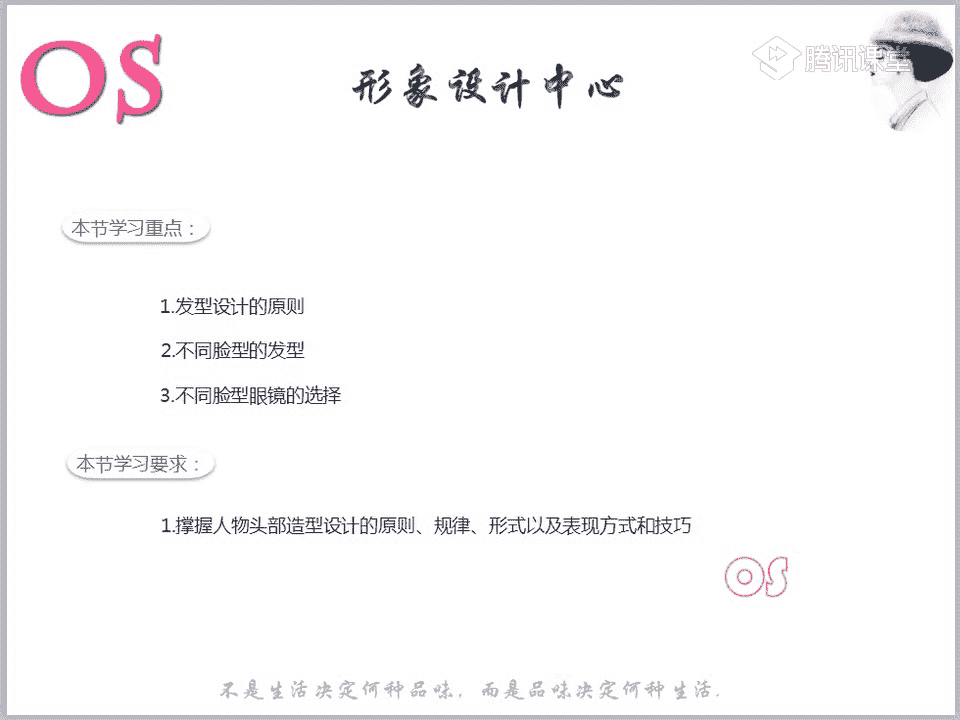

🎼我只是。🎼好，我们都知道啊，发型呢老师上一节课就说到了，这是我们的第二张脸非常的重要啊，相当于那么它到底有多重要呢？啊，我们有些同学应该都能够知道，像这样的一个发型的话。

它能够去帮助我们的对于唉你今天所要表达的一个形形象，对不对？都有直接的这样的一个关系。另外的话呢，像我们有一些个子不是很高的男士啊，像我们班如果有的话，那么我们也可以通过这样的一个发型呢。

合适自己的发型，另外利用发型的一些特点呢来达到显高。包括我们发型呢可以让自己呢显得非常的精致，而且呢会有品位，这个都跟我们的发型有关系。那么首先看到我们的脸型和发型的同时呢。

第一个大家必须要知道的什么是三庭五眼。好，我们在场的同学有没有不清楚自己的呃这样的一个三庭五眼的一个分辨的。😊。

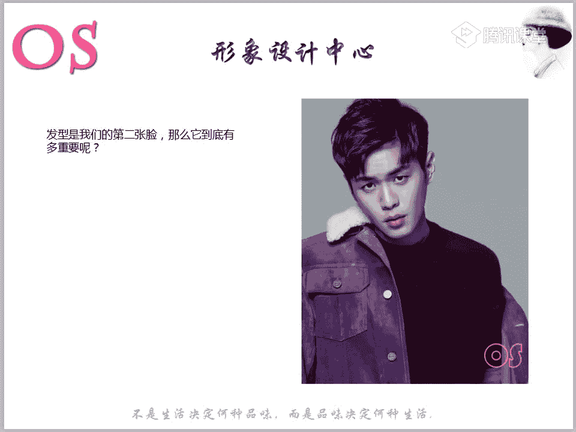

🎼有没有不清楚的啊，就是对于三庭五眼的一个概念啊，是完全模糊的。可以跟老师呢在公台上呢啊表述出来啊。不清楚的话呢，老师就详细的跟大家来讲。如果说清楚的话呢，我们就快速的跟大家来分析。🎼好，有不清楚的啊。

那我们的飞龙在天。这边呢我们来看一看。如果说唉有同学听过的，对不对？有可能之前有跟过我们女士课程的啊一些同学的话呢，那我们这样的一个呃三庭五眼应该是不会呃是不陌生的。因为三庭五眼。

其实在我们的女士啊化妆中呢也是非常重要的。像我们在学习化妆的时候呢，第一个就要了解的是三庭五眼的这样一个关系。因为我们在化妆的时候，同样也是呢利用化妆的一些手法。

把自己的发把自己的三庭五眼的趋向一个标准化。那么首先呢我们来看到什么是三庭三庭呢指的是把我们的整个的面部呢分为啊上庭中庭和下庭上庭的位置呢，也就是从我们的发际线到我们眉头也就是眉心啊，看到你的眉头啊。

发际线到眉头。那么大家如果说哎刚好在听课啊，我们旁边有镜子的话，我们可以照照自己看看自己的啊，这三庭是不是标准的。那么这是我们的上庭的位置啊，上庭呢是。😊，🎼从发际线到你的眉头是上庭，中呢是从你的眉头。

哎，到你的鼻翼下线，是我们的中庭。下庭呢是从鼻翼下线到我们的下巴间是下庭，这个呢就是我们的三庭。那么如果说你是一个标准的三庭的话，那么我们这样的一个面部呢，三庭的一个距离是一样的。

也就是说上庭到眉心可能是5厘米，对不对？那么你的眉心到下鼻翼的下线也是5厘米。从鼻翼下线呢，到我们的下巴间啊，也是5厘米。我们我们翻的同学啊，有没有三庭是标准的啊。

或者说哎我们的三庭有哪个是上庭还是中庭还是下庭有什么问题，也可以打在工台上。观察我自己啊，一边呢其实大家如果说没有准备呃镜子的，可以稍微去准备一下。如果说你身边有的话哦。

因为一会儿呢我们可以好好的看清楚自己，然后呢对应我们不同的这样的一个脸型。🎼好，有没有啊有没有说是标准的？如果说是标准的，可以跟老师扣个一啊。如果说发现自己啊哪哪样嗯好不用不用那么准确的去量啊。

你可以拿手去比划一下这样的一个距离。如果你觉得差不多的话，那就其实就可以了。不用说去精确到啊多少厘米啊。😡，我们用手啊去比划一下这样的一个距离就可以了啊。如果说呃有同学是不标准的话呢。

一会儿呢我们在讲脸型的时候，你们就会更加清晰了。好，这个是我们的三庭啊。三婷应该呃位置都没有任何问题了吧，差不多啊。我们卡卡非常棒。好，我们的飞龙在天和卡卡应该都没什么问题。

那我们再看到呢五眼五眼呢也就是说呢我们面部啊直面去观察我们的面部的话呢，唉是可以准确，刚好能放下5只眼睛啊，不要说去测着去量啊，就是你呢对着镜子，然后呢直接的去观察镜子中的自己。

也就是说平视镜子就好了啊，平视镜子，然后去观察镜子中的自己，你的眼睛是否呢真的能够放下啊你的脸部能能不能放下这5只眼睛。

也就是说根据自己的一个眼距来呢啊根据自己的一个眼睛的一个长度来进行测量眉头呃眼头到眼尾是我们一只眼睛的一个长度，那么正好呢我们平视前方，就像我们这个小男孩一样啊，平视前方之后呢。

刚刚好你的这样的一个呃面部呢能够放下5只眼睛，也就是说我们这样的一个标。😊，🎼准的无眼。另外可能有的同学呢是属于太阳穴比较凹的。可能呢哎我们第一只和第五只眼睛就相对来说要窄一点。

这个时候我们也可以利用发型呢进行填充，或者说进行这样的一些遮挡。🎼那么包括有的可能是有一些女生啊，属于呢我们的呃两眼间距比较宽的。也就是说第三只眼睛相对来说比较长。那么这个时候我们女生会经常用到什么呢？

就是化妆，对不对？呃，比如说我给自己开个演讲啊，这样的。所以说在这里呢稍微跟大家提一下。那么这个就是我们的一个五眼啊，对于三庭五眼，大家都没任何问题的话呢，快速跟老师扣个一啊，都没有任何问题的。

快速跟老师扣个一，我们接着来具体问题呢具体分析。😊，番ね？🎼好，那今天的课程呢，我不仅仅会去呃讲到我们脸型的这样的一个判断，以及呢我们合适自己的这样的一个发型啊。而且呢在这里在讲发型的时候。

我会跟大家稍微来对应一下风格啊。也就是说一会儿呢大家要认真去听啊，认真去听。如果说我们班上还有不清楚自己风格的同学，记得呢课后来找老师填完资料之后，提交完照片之后啊，然后老师会帮你来诊断的。

因为我今天的这样的一个脸型会去跟大家稍微提一下风格。因为我们风格其实对于发型的一个影响，也是占据着一一定的位置的。

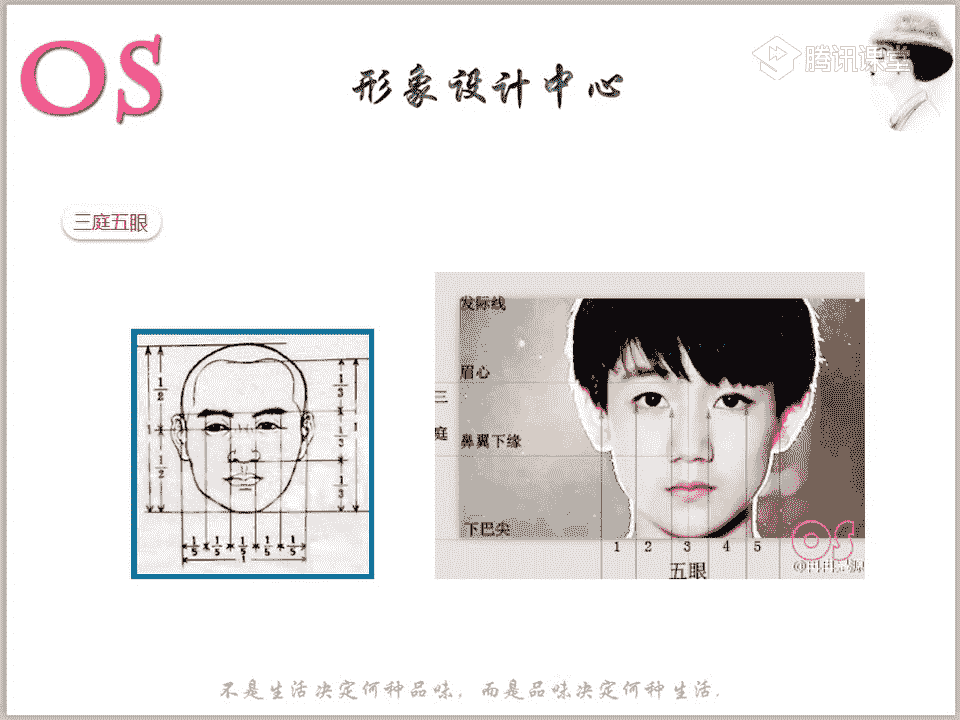

🎼好，一和二是不是转弯测量哦，不用转弯测量哦，要直面直面就好了，不用去转转弯的话，一定可能会放下一只半的眼睛。也就是说平视前方就可以去测量就可以了。

🎼好了，首先呢我们来看一下哦，其实常见的脸型呢我们可以分为7种哦男士啊。其实但是男士有一个脸型其实不太常见。也就是说我们这样的一个油字型。但是在这里呢今天这堂课啊，因为我们也做了升级。

所以在这里呢跟大家来强调一下，那么常见的脸型呢是我们的7种脸型啊，我们一个一个来看，然后呢老师就不一起呢跟大家呃先分析脸型，然后呢啊再来对应我们的发型呢，我们就呃一个一个脸型讲一个一个发型去选，好不好？

这样的话可能大家会更清楚啊，那么呢首先呢就看到我们的哦长脸型。那么长脸型呢，它有一个特点是什么呢？啊，就如图如图所示的啊，如图所示。啊你会发现长脸型它的一个特点就是高的前额或者是长的下巴。

但是呢这绝对不是绝对的啊，为什么呢？其实你也会发现像有一些长脸型啊，比如说啊比如说我们的胡哥，那么其实你会发现胡歌他的。😊。

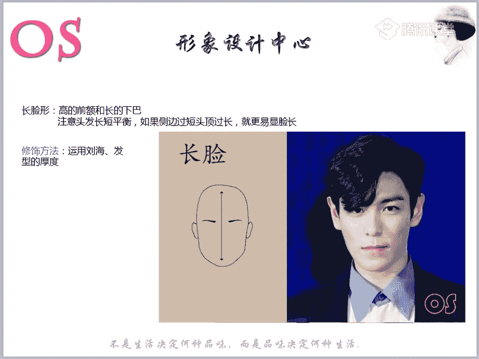

🎼脸也是偏长的啊，也是偏长的，而且呢他的三庭还蛮标准的。他并没有说唉他的长他的额头或者说跟他的下巴相对于他的中庭来说呢要长，也就是说其实大家去判断长脸型的时候呢，不用去过度的去看。哎。

如果说自己的上庭长啊，让你的脸呢就趋向于长脸型不是啊这样去说的啊，而是说整个面部的这样的一个线条，它偏窄。然后呢，它的长度啊，也就是说脸部的一个长度呢会偏长，会导致会显得这个脸很长啊。

这个点的话大家一定要明白啊，这就是属于我们这样一个长脸型。长脸型的特点就是面部相对来说比较窄比较瘦。就像我们的胡歌还有包括像我们呃bigb的里面的这样的一个T呃叫什么。

🎼top扑对不对？嗯？对？还有包括呢呃就是这两位人是我拿明星来举例子的这样的一个代表。大家呢可以参照尼克老师快非常热心的就给老师打出来了哦。好，那我们可以看到他们两个其实就是非常典型的这样的一个代表。

那么大家也可以呢自行的做一下判断啊。也许你是一个三庭还蛮标准的。但是啊相对来说可能你的面部呢视觉感要稍微偏长偏窄的话，那么就是属于我们这样的一个啊长脸型的男士啊，长脸型的男士。

像大家能够从照片中呃能不能去感受到这样的一个脸部的长度啊，可以感受的同学快速跟老师刷朵鲜花。比就说你刚才呢看这样的一个top扑和看我们的呃胡歌啊，包括可能胡歌大家都能够很很就是很认识，对不对？

包括之前呃像违张哲啊、琅琊榜啊，这些电视在热。😊。

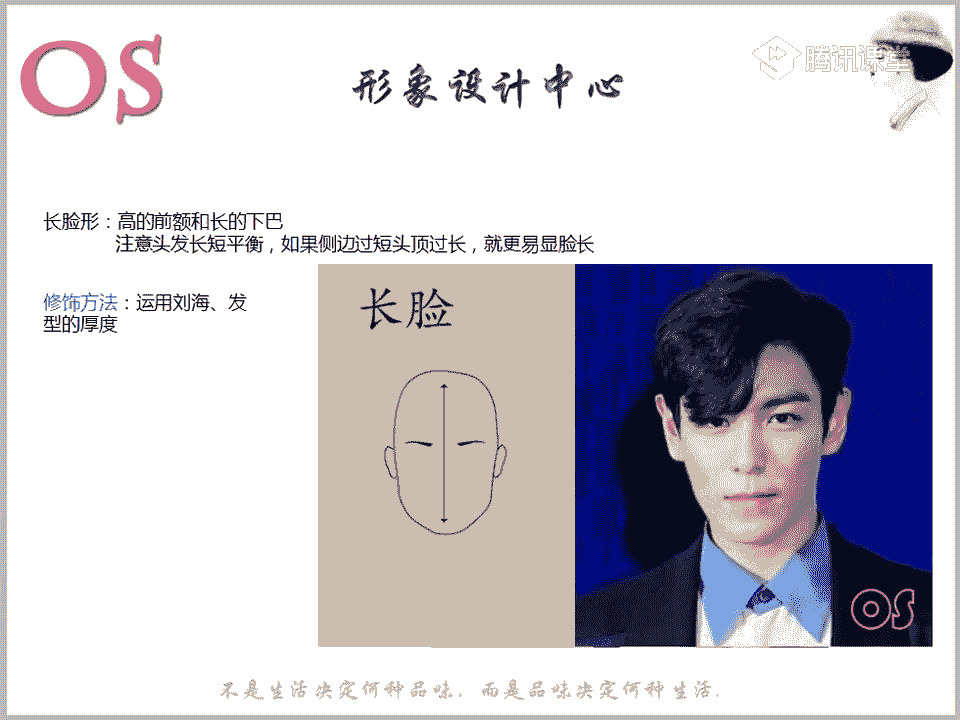

🎼播的时候大家应该都有去观看哦，而且呢你也能够去感感受到他在做一些古古装造型的时候，哎，跟我们这样的一个劲王去做对比，你就会发现他的脸确实是而且像古装造型的话，我们会戴头套。

那么其实对他的额头还会进行一些遮挡，会显得哦脸部是其实就已经显得有点偏长了。那么能不能直觉感受到啊，就是这样的一个脸型是偏长的，可爱的同学快速跟老师刷的鲜花。如果说对于男士脸长，我还是不能理解的。

把问题呢打在公台上哦。

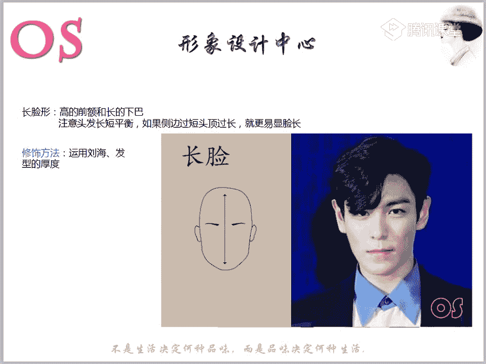

🎼能不能直觉的感直觉的感受到这样的两位男士的脸部的一个偏窄偏长的这样的一个视觉。能的同学快速跟老师刷鲜花，还有其他几位同学是睡着了还是怎么样啊？🎼尤其是我们这一期才跟的男士班的，老师会死死的盯着你们的。

🎼你全部。好啦，这个就是我们这样的一个长脸型啊。😊。

🎼那么长脸型呢我们的修饰方法呢主要是要运用到我们的刘海，以及呢我们这样的一个发型的厚度啊，会运用到我们的刘海和发型的厚度。也就是说这样的一个长脸型，它在视觉上就是往上和下去走的。而不是说往两边去走的啊。

那我们首先呢来看到第一款啊，它比较适合的。那么就是呢我们可以去制造这样的一个纹理感蓬松的这样的一些设计，加上呢唉参差的这样的一个刘海，会有立马呢显脸小的效果。所以说长脸型的男士呢。

不妨呢给自己呢去打造一款。

这样的一些呃零碎的刘海，能够呢既修饰我们的脸型，又会凸显我们立体的五官。另外的话，如果说你是一个瘦小，唉，身材比较瘦小，脸呢也很瘦的哦，那么我们就其实不要去选择一些过于厚重。

或者说长的这样的一些发型可以选择呢将我们的两鬓呢剃得短一点。然后呢，头顶和两侧呢去营造蓬松感。也就是说这两款发型呢都是比较适合我们长脸型的。但是如果说你是属于比较瘦小的这样的一些身材的。

而脸而脸面面部又偏长的话呢，我们就可以选择把两侧的头发，也就是说我们这样的一个两鬓呢修的短一点。但是头顶的丰盈度是一定要有的。大家也会发现像我们拿的这样的一个例子来举例子，同样一个人都是我们的拓部。

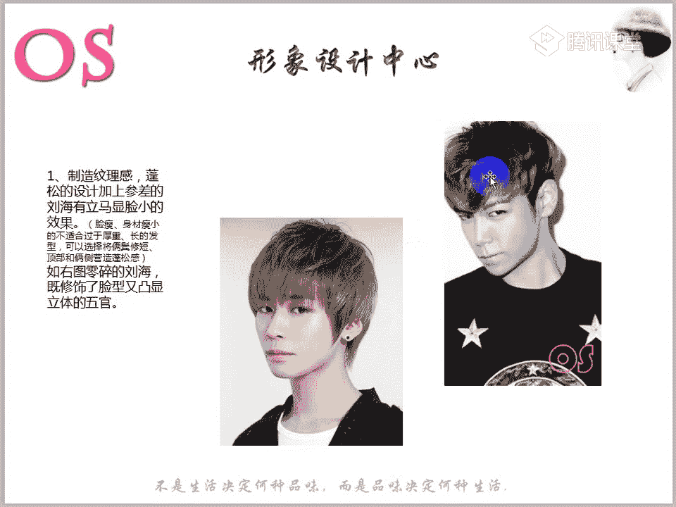

🎼这也就是说这样的一张照片去做对比呢，也是充分的让大家能够去理解到层次感对于我们长脸型的男士的一个重要性。其实可以看第一张照片，你们就会发现是不是基本上没有太多的层次，好像头发的长度都差不多长啊。

没有这样的一些短长短长这样的一些层次感，对不对？而且呢整个发型的话也会相对来说显得比较死板，而且不仅仅是没有层次会显得死板，而且留错了发型的话，会给他的面部的一个视觉会造成更长啊。

我相信大家能够都能够感感受得到，对不对？所以说我们长脸型的男士啊千万呢不要留的啊太长，头发不要留的太长，也就是说呢唉后面也好，我们两侧也好呢，也要相对来说啊要剪短一些，感觉左边反而要帅一些哦。

觉得这张要帅的呀。😡。

好吧，那我们内在我们在心里面要好好琢磨一下啊，可以做一下对比啊。

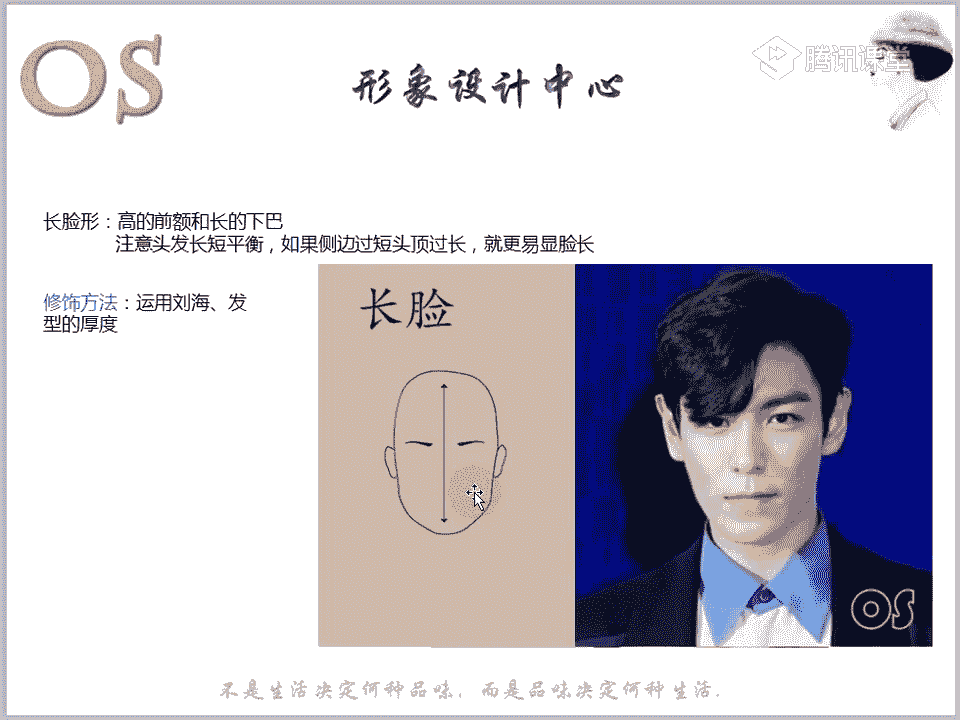

🎼这张相对来说啊。🎼会说。🎼你是。🎼所以说不要去留的太长啊，一一定一定不要去留的太长头发。而且呢层次对于我们长脸型的男士来说是非常非常重要的这是第一款。那么还有呢就是像我们这样的一个朋克的飞机头。

那么呢鬓角我们可以呢修的略短一点。那么刘海呢我们可以还是要稍微长一点。就比如说像我们啊这张图片一样，把造型呢将刘海梳上去的话呢，会非常的显气质，也会显得你这个人很有个性。那么如果说哎我们把刘海放下来呢。

又会感觉非常的温暖啊，是不是像一个暖男很阳光大男孩的这样感觉。所以说像这样的一个朋克飞机头的话呢，其实我们也可以随着我们的穿衣所表达的这样的一个场合呢去进行改变啊。如果说你想要个性时尚啊，前卫突出啊。

那我们就可以把它梳的上一点啊，让给别人的感觉，就是有一点距离感，而同样也很个性，也很时尚。那么如果说呢。😊，我想要表现的是一个暖男的形象，我要阳光一点哎。🎼小男孩一点或者说大男孩一点，对不对？

那我们就可以呢把这样的一个刘海呢放下来，所以说可以制造不同的这样一个感觉。这是我们的一个朋克飞机头。同样的一个道理，就是呃我们长脸型的对于头顶啊头顶的这样的一个发型的一个发量是一定要有要求的啊。😊。

🎼尤其是头顶两侧，因为长脸型的，它相对来说，它头顶的话稍微都有一点点偏窄偏尖。那么如果说两侧不够饱满的话，就会显得她的头会有点塌。嗯，老师那头发的发质很硬，怎么去处理啊？发质硬的啊。

其实像发质硬的头发的话，其实做造型非常好做。就像我们女士一样啊，给她烫发，给她烫那种卷发，一些比较硬的女士的发质如果说很硬的话，虽然说在烫的过程中啊，待的时间要久一点，但是它的持久度会高很多。

那么如果说是非常软的这样的一些头发，细软细软的。像我们外国人像这样的一些沙发，你会发现哎你刚烫完没多久，它就直了。所以说头发硬的发质其实蛮好做造型的？那如果说你觉得你头发太硬的话呢。

我们平时洗头的时候也多去做一些护理。其实对于发质会有一些改善啊，比如说哎我还是给头发去抹一点点精油啊等等的。

🎼好，第三个呢就是我们这样的一个旁分的油头啊。嗯，那如果不喜欢做造型呢啊不喜欢做造型，那你就要丑下去了啊。老师第一节课就说了，不能去偷懒啊，真的不要去偷懒啊。因为一会儿我要告诉你们的是什么呢？

发型要让自己今天这堂课后面我会跟大家说的，就是要让自己真的要成为半个发型师，要跟大家强调这样的一个呃这样的一个。😡，🎼有这样的一个意识吧，可以说是因为你要知道啊，刚才我就说到了发型打理发型的一个模式。

就是要先自己再理发师，然后还是自己你不可能说每天都要去找理发师，对不对？而且发型好不好，也是相当重要的。大家可以从这张图片可以充分的去感受到啊，发型对一个人的一个颜值的提升有多大。

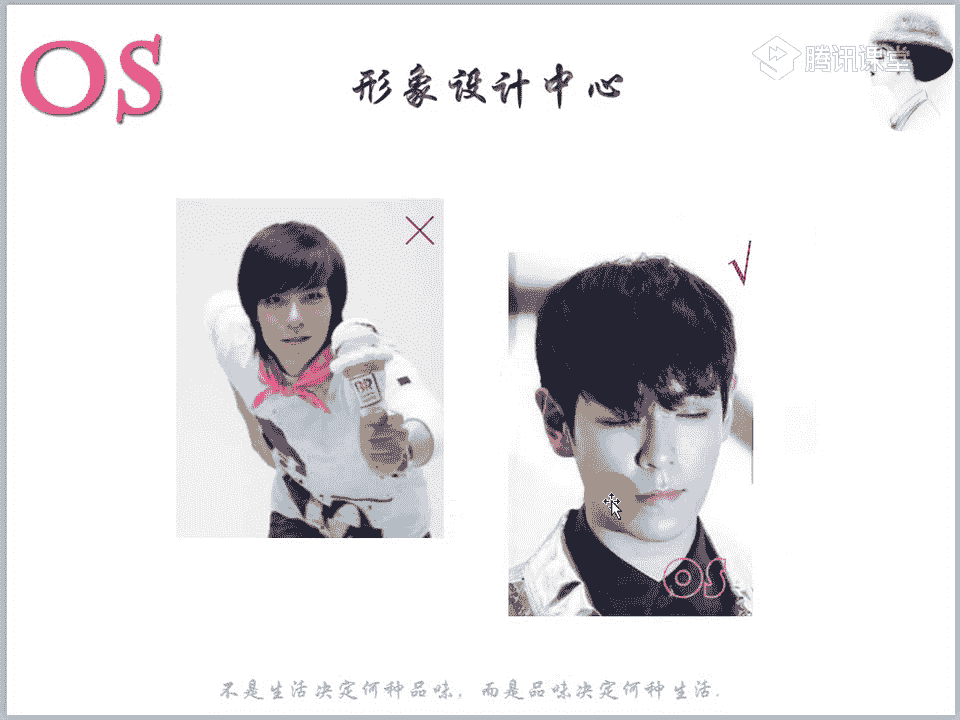

🎼所以啊所以我们来看到啊这样的一个旁分油头，包括呢侧在侧边啊，还是两侧呢稍微可以稍微的短一点。那么像这样的一个油头啊，不仅仅适合我们的长脸型，那其他脸型也会适合一会儿呢会一一的讲到。

那么像这样的一个旁旁分的油头，或者是说哎我全部后梳的这样的一个油头呢，在我们的男士风格里面来说呢，相对于一些古典型和浪漫型的男士呢是首选。那么像我们大家会发现油油头对不对？梳完之后会显得这个头啊。

头发呀蹭亮蹭亮的啊，非常有这样的一个质感，非常有光泽度。那么像我们这两个风格，一个是古典型，一个是浪漫型的男士啊，在选择发型的时在选择服装的时候，啊，老师之前有说过，对不对？

可能我们老一老一期的VIP就会知道，哎我们要选择一些华贵的啊精致的，或者说上乘的这样的一些材质。那么发型其实也是一样的。你会发现。😊，🎼当我们去留我们去梳这样的一个油头的时候，会显得人非常非常的精致。

对不对？而且很有精神，而且呢也会显得人啊有这样的一个气质感。嗯，古典型适合用这个油亮的哈所以说古典型的人是可以的，因为他会有这样的一个光泽度啊，尤其对于光泽度，对于我们浪漫风格的男士来说。

所以说像一些浪漫风格的，你会发现有一些浪漫风格的年轻人呢，梳这样的一个油头非常非常好看。就是相比于我们的古典型来说，他如果说选择一个油亮油亮的，非常有光泽度的这样一个油头的话，其实非常适合他。

而有的人可能梳你就会觉得哎呀好像几天没洗头啦或者是怎么样的。但是浪漫型的人呢，你就会感觉特别符合他的这样的一个气质和风格啊。😊，🎼好，怎么样才能让呃头发看起来更有光泽度啊。那其实像油头的话。

我们就会运用到发蜡呀，还有包括像我们这样的一些发胶啊，其实油头就是主要是用发蜡去梳出来的。因为有一些发蜡的话，它的光泽度是非常高的。嗯啊，男士呢一共有几种风格。男士的话我们可以分为五大风格。

但是呢像老师的话，我在男士班会讲到呢是6种风格。因为我把这样的一个前卫风格的话啊，时尚前卫风格的话呢，我们把它分为了两种，一种是阳光前卫啊，一种是我们的时尚前卫。🎼也就是说我们的前卫风格分为了两种。

那么两种这样的一个呃在选择服装的时候，它也是有很大区别的。所以说可以大家可以记一下啊，其实男士的话如果说要再去呃做一个总结的话呢，你们把它分为5种，也可以分为6种，也可以。嗯。

也就是说我们只是相对于女生来说，没有少年风格，也没有少女风格，也没有优雅风格。嗯。🎼好，平平时吃完油性零食后就往上上的油往头发上上抹，哎呦，太可爱了。😊，🎼嗯，男士现在是6种嘛，其实大家记五种就可以了。

因为呃苏花语应该不陌生，老师有跟你们说到过6种风格，对不对？嗯，是不是呃，说到时尚，我是把时尚风格里面又细分了两种啊，一种是阳光前卫，一种呢是我们的昕锐前卫。

但是大家要记住就是啊具体来说大风格就是5种啊。男士。🎼因为时尚和时尚前卫和我们的呃阳光前卫它还是有区别的嗯。🎼是的哦，我们卡卡下次呢吃零食，尤其是我们这样的一些小辣条的时候啊，嗯非常多的一些油。

你可以尝试一下啊，说不定大家都觉得你太香了，要恨不得要咬你咬你一口啊。直接用脸上的油往上哎呦，你们都开始平起来了啊。啊，这个呢就是我们的一个古典型和发和浪漫型的男士呢。

哎如果说你们除了要考虑自己这个脸型所适合的啊，但是所适合的以外呢，那么像这样的一个油头，你们也是可以去考虑的。那如果说我又是一个长脸型。哎，然后呢我又是一个这样的一个呃古典型的或者说是浪漫型的。

那我们就可以去大胆的去尝试这样的一个发型。因为其实你会发现它打理起来非常的好打理。也就是说我们在呃洗完头之后，把造型，也就是把你的发型啊全部都往把头发全部都往前面去吹，这样的话呢。

因为你你会知道你要知道头发的话，你看你怎么样往往哪边吹。它的趋向就会往哪边走。那我们。😊，现在头发是要往后梳，对不对？那么势必的话，我们要给他制造这样的一个。😡，🎼这样的一个层次。

也就是说这样一个蓬松度。那么我们的发根呢其实就是其实在吹头发的时候呢，就可以往前面去吹。然后吹完之后啊，然后顺势的话呢，我们到时候再往后面啊吹那么一点点。然后呢吹出这样的一个造型出来之后。

我们就开始可以用那个发蜡去梳了。好，把油头梳好之后定好型，一定要定型。因为你不定型的话呢，你梳完之后哎你摇摇晃晃两下，哎，那个头发根儿呢，它就可能开始散了啊，当然就不够帅气了。🎼好。

这以上呢就是我们长脸型呢所适合的这样的三种呃发型啊，三大发型啊，对于这样的一个发型，大家还有没有什么不清楚的啊，有没有不清楚的啊。如果都清楚的话呢，老师就接着来讲我们的眼镜了，嗯，感觉脸长的特帅。

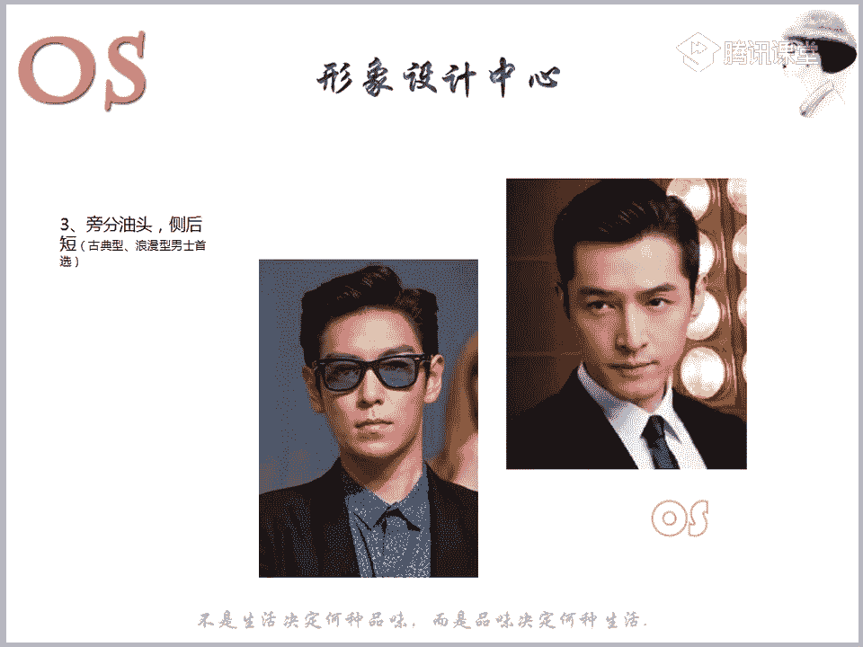

🎼好了，我们来看看这样的一个眼镜啊。那么还是拿我们的长脸型的男士来举例子，主要是老师找的图片帅，知不知道？啊？其实每一个你会发现上完今天这堂课，你会发现每个脸型都挺帅的啊，都挺好看的。

只要找对发型就可以了。那么呢适合我们这样的一个眼镜的话呢，可以看到像我们这样的一个男士就拿它来做对比，对不对？老师给他大家可以看到啊，一款呢是我们这样的一个椭圆形的，稍微大一点的，宽一点的。

而一一款呢是比较窄的，对不对啊，不是五月天啊，比较窄的，比较细长的，是不是你会发现其实脸型有了视觉上的这样的一个明显的区别，对不对啊？哎看出来这个区别特别大的，觉得在内心里面觉得特别大的。

可以跟老师刷的鲜花啊，试一下啊，鼓励一下老师。😊，嗯。🎼看出来啊这样的一个差别特别大的啊，是不是脸长和脸短的这样一个区分啊，就会感觉好像加一个眼镜框啊，选错和选大的话，其实有非常对明显的一个对比。

那么我们班的我不知道有没有说是近视的啊。如果说是近视，我们很难不去避免啊唉唉避免这样的一个其实你要不是要看脸大啊，你要看这个脸的这样的一个三庭的比例是不是稍微有了一个平衡，对不对？

我们利用眼镜框可以平衡到我们的眼三庭的这样的一个比例啊。嗯，好，什么是异形啊，一会儿老师会讲到的，那我们可以看到啊，那么我们长脸型的男士的话呢，如果你要选择这样的一个眼镜的话，如果说你是一个近视。

或者说我们要选择墨镜的话呢，要注意了，我们尽量呢选择这样的一些宽边的大镜框的眼镜能够将脸的下半部分呢遮盖去比较多。那么所以呢建议我们长脸型呢可以多去佩戴。😊，🎼这样的一些眼镜。

大家可以看到啊宽一点的不是说这样的一个横横的这样一个宽的，这是长老师呢唉像我们的左脸到右脸是指长度啊，我说的是眼镜的上下它的一个宽度，建议呢去选择宽边的啊大框镜的这样的一个眼镜。

那么呢我们在戴墨镜的时候，当然像我们的一个近视镜很少出现异形的。但是我们有的墨镜呢是有这样的一个异形的。大家看到没有？如果说我们是长脸型的女士的话，像这样的一个异形眼镜也不要去进行佩戴啊。

这就是属于我们这样的一个异形的。也就是说它的那个角啊是往上面去走，像我们的鸟的一个羽翼一样。那么最好呢像戴我们的墨镜的时候可以去选择像蛤蟆镜啊，或者说我们这样的一些比较有宽度的啊，稍微偏向于椭圆啊。

适当的有一点点方度没关系啊。这样的一个眼镜框啊，或者说我们这样一个墨镜都是比较适合我们的长脸型的。那么这个呢就是我们的长脸型男士所适合的啊，以及它的这样的一个。😊，呃，发型和眼镜大家还有没有问题？

没有任何问题，快速刷朵鲜花，我们接着往下面讲。🎼一会儿呢最后啊所有的脸型分析完之后呢，老师会跟你们说到呢，我们冷色肤色和暖色肤色要选择的发色啊，因为可能有的男士也比较喜欢染发。

那我们来看看呢我们自己的这样的一个肤色来去染什么样的一个发色会更好。🎼好，接着呢我们班可能哦大家要自行分辨啊，看看自己有没有啊。最后到时候老师要布置作业的啊。第二个呢就是我们的这样的一个方脸型。

那么方脸型呢它的特点呢就如图啊如图我们可以看到的张杰是一个典型的代表啊，它就是典型的方脸型的代表。那么方脸型的男士你们也可以把整个的刘海呢梳上去啊，把你的脸部全部露出来，来看看你自己的这样的一个脸部。

是不是呢下颚比较的宽大啊。然后呢不仅下颚比较宽大，而且你会发现你的下颚部分是有棱有角的，会有一个这样的一个腮帮子是有一个角度的，而不是说呈现这样的一个完美的线条，一个弧度的这样的线条。

而是有一点棱棱角角的。另外的话呢额头部分啊，也就是说我们这样的一个方形脸啊。😊。

🎼大家看到这里，额头部分其实没有什么窄和宽的这样的一些问题。也就是说它不存在额头偏窄或者是怎么样，而是说整个是呈现这样的一个方形啊，四四方方的这样的一个状态的，就是我们的一个方脸。

当然哦不排除有的人的脸呢？它是一个结合脸，它是什么结合脸呢？它是方脸和圆脸的结合。那么如果说我们有同学是方脸和圆脸的结合的话呢？到时候我们做发型的时候可以中合，把这两个呃脸型的适合的发型去进行一下中和。

然后挑出最适合自己的。😊。

🎼啊，前提先跟大家提一下啊，所以说呢唉方脸型的男士，你会感觉它会显得有一点点木蜡，而且呢需要从视觉上去拉长脸型。因为方脸型他的脸不是属于啊长的啊，它一定不是属于长的。也就是说你会发现还好，比例也还好。

像张杰，对不对？大家对他有了解啊，像女生里面李宇春哪周笔畅啊等等，都是我们这样一个方形脸，会显得人呢有一点点木蜡，而且呢下巴主要去看下巴啊，如果额头是饱满的。也就是说像我们这样的一些方形脸啊。

额头都是很饱满的，它没有存在额头的一些问题，它主要的问题在哪里呢？主要的问题就是在我们的一个下颚的部分，它会有一个这样的一个腮方啊，有一个冰榔角，我们叫的这样一个冰榔角。那么所以啊我们方脸型的男士呢。

唉会让人看起来非常的有阳刚之气啊，可以选择一些利落的短发啊，不要去选择太长，或者说去选择中分的过于厚重的发型。另外的话呢，如果我们把这样的一个鬓角呢。

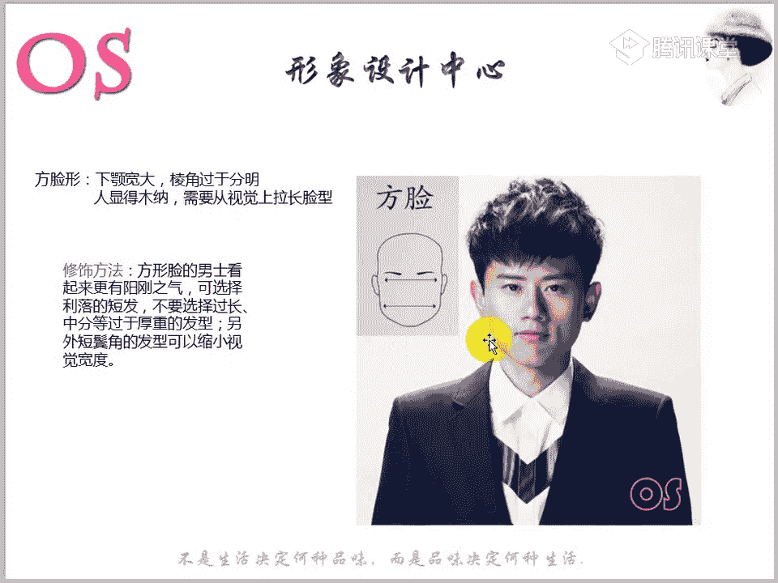

🎼稍微的剪短一点呢，也能够去啊稍微啊。🎼去视觉啊，可以去收缩，缩小我们的这样的一个视觉的这样的一个宽度。那么呢具体来看看我们这样一个方脸啊，我们班的同学有没有是方脸的哦，在场的同学有没有是方脸的。

看完老师的这样的一个描述之后，有没有发现自己是方脸的啊，我们的飞龙在天。🎼好的，那我们来看看啊，具体呢适合什么样的一个发型啊。那么方脸的同学呢，第一个要跟你们说的就是我们的卡尺头。

但是这个卡尺头啊跟我们的板寸还是有区别的。也就是说呢普通的板寸，你会发现他的头顶呢是基本上是很平的，对不对？其实那个那样的话会显得有一点不太好看不美观。而且老师刚才也说到了，方脸型的话呢。

一定要把这样的一个呃头顶的部分呢在视觉上要拉长。所以说呢建议大家在剪这样的一个卡尺头的时候啊，非常适合我们。那么在头顶的附近，你会发现呈现这样的一个子弹头式的这样的一个视觉感，对不对啊？

所以啊卡尺头这是我们的一个卡尺头非常适合我们的方脸型的男士会显得你非常的阳刚正气啊，正派。那假之如果说哎你又是要像我们的飞常在天啊，是属于这样的一个古典的，对不对？

那么这样的一个发型你是可以去选的古典型的人去选择，没有任何问题啊。😊。

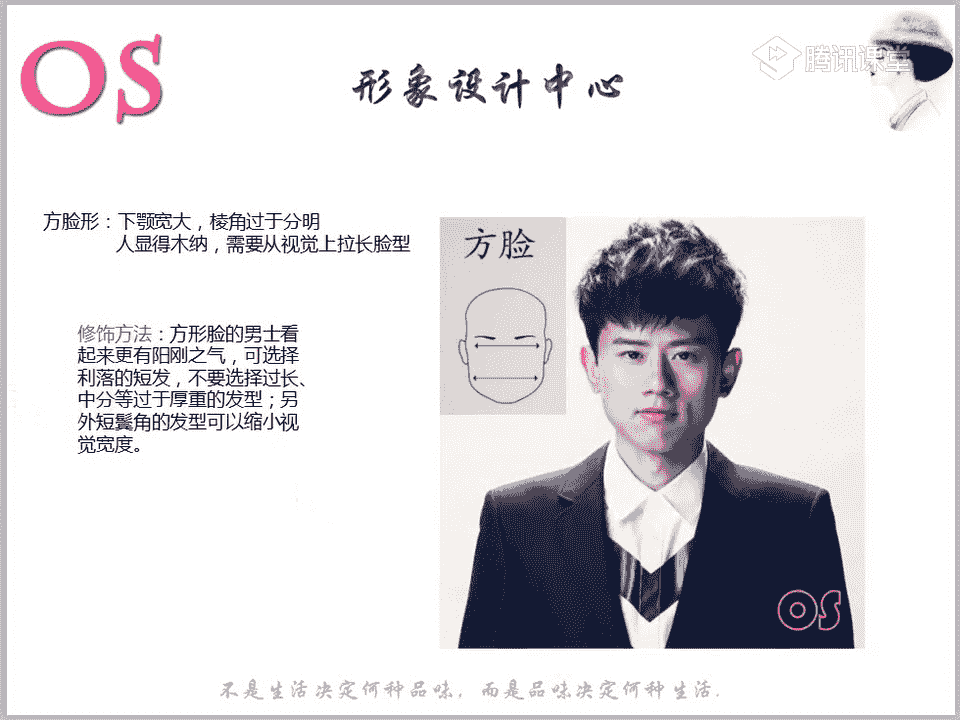

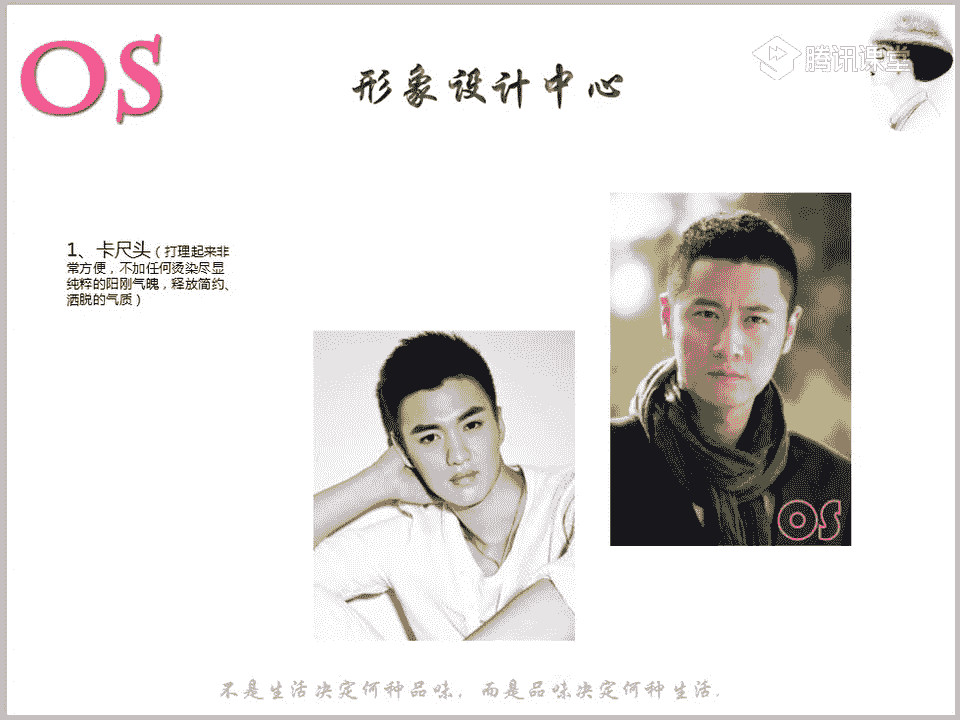

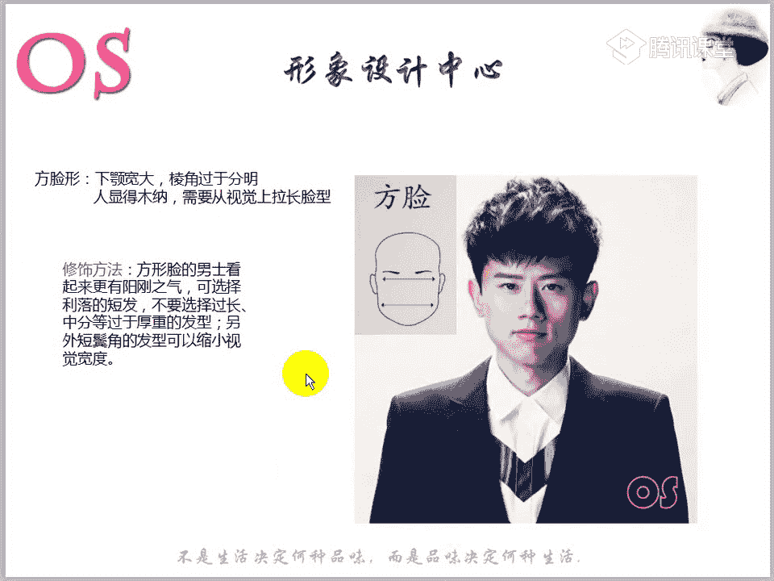

🎼那么打理起来呢也是非常的方便啊，可以不加任何的烫染，尽显我们的这样的一个阳刚的气魄啊，而且非常的简约啊，洒脱有气质，对不对？非常非常好打理。基本上就是说呢你每天早上啊起来洗下头发。

因为一般我们睡觉的话，很容易把后就是头头后侧啊，对不对？头后面的头发睡塌，因为男生嘛，一般早上都会洗头发，那么像这样的一款发型，早上洗完之后吹一吹啊，稍微呢稍微可以稍微的去抓一抓。

因为老师刚才说的他的头顶还是有一定的长度的，稍微去抓一下，或者是说哎我喷个呃发发胶定一下型也是可以的。那么这个就是我们的卡尺卡尺头啊。第二个呢就是我们呢可以选择呢一些头顶上抓。

然后呢侧侧侧面和后面呢去修短。那么当然哦唉我们这样的一个鬓角还是要利落一点，不可以留的太过于长啊。然后呢，我们这样的一款发型其实有时候大家会发现跟我们的机关头有。😊。

点点类似，但是它跟机光头还是有一点区别，因为它的侧面是很短的。

只是说它的头顶部分呢跟我们的卡齿头的。

🎼发量呢会更啊更多一点啊，也就是说我们这样的一个方脸型的话去选择这样款发型一定要进行上抓。如果说这款发型它刘海落下来的话，其实不太好看。也就是说方脸的男士呢，这款发型一定要进行这样的一个上抓啊。

吹完之后呢把它抓一下啊，拿发蜡呢捏一捏啊，用手指把它捏一捏，做个造型，做完造型呢喷发胶定型啊，非常的简单。也其实这个发型抓起来也很简单啊，很好抓。

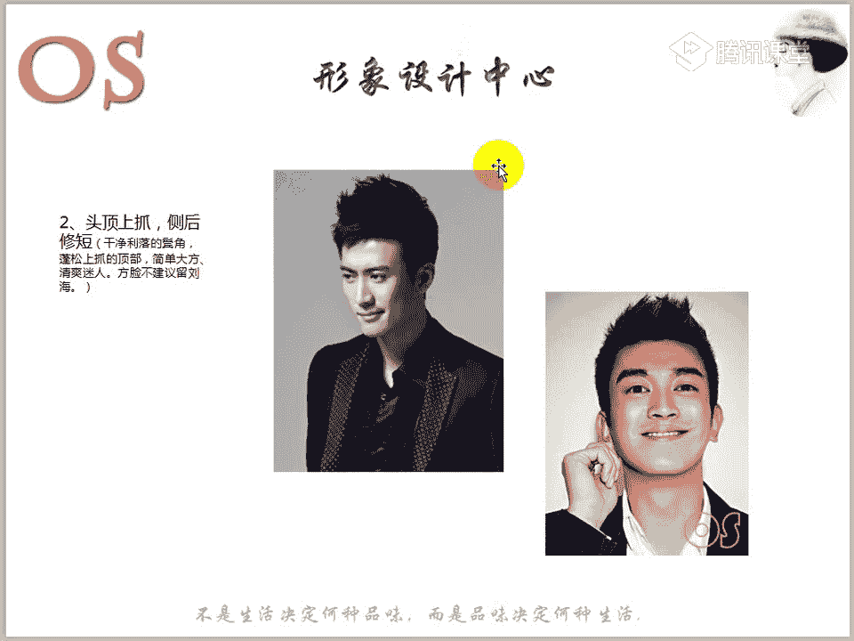

好，第三个呢就是我们这样的一个油头，或者说侧后哦，两就是我们的两边呢和后面呢也要还是要短啊，这样一个油头其实你会发现这三款发型都有。🎼相同的一个特点，对不对？相同点是什么呢？

就是会发现它的头顶都是偏长的，因为一定要利用这样一个头顶的部分呢视觉的去拉长你的脸。当你的长脸长了，哎，就不会显得呢那么的方了啊，这个就是利用我们的试错去进行这样的一个改善。好，两后侧剪短之后啊。

那么其实像这样款发型。如果说我们要选择一些正装的时候呢，就可以呃把这样的一个发型呢跟它去做搭配起来，非常的有绅士啊，非常的气派。

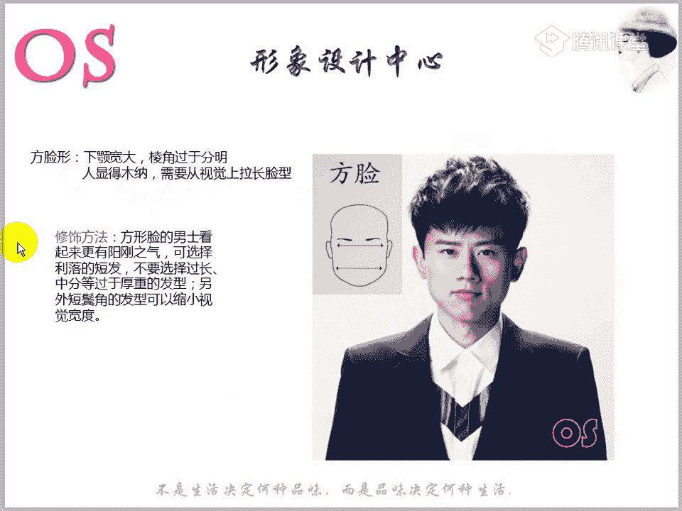

🎼这个就是我们方脸型的男士呢要选择的发型啊。大家呢刚才我们飞龙在听啊，我们班有一位同学是方脸，对不对？啊，能应该都能够明白啊，我们这样的一个发型啊，明白的话呢，我们就接着来看看我们适合的眼镜。

适合的眼镜呢，其实对于方脸型来说，在佩戴眼镜的时候，老师给你们的建议是一些圆形的，或者是说呢唉呈现这样的一个圆形，或者说椭圆形，其实像椭圆形的这样的一个眼镜会更加啊，相比于说太太过于圆曲的来说。

我们这样的一个椭圆形会更一一点。那么会使我们整个的一个面部呢呈现这样一个柔和感。因为它你本身是方的。那么我们选择一些椭圆的，或者说偏圆一点的这样的一个眼镜呢，它可以有一个中和。另外的话呢。

我们其实在选择啊我们的眼镜的一些啊眼镜框的时候呢，我们也可以去选择一些明快的色调。😊。

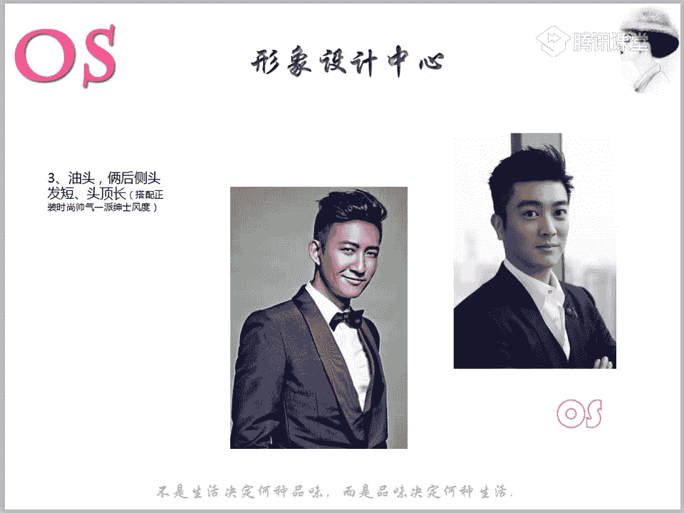

🎼不要去选择太过于深啊，或者说太过于粗的这样的一些镜框，我们尽量呢去选择一些稍微浅一点的这样的一些眼镜架呀，或者是说哎我们也可以选择稍微偏啊窄一点的细一点的这样的一些眼镜框啊。

也就是说这个框框啊比较偏细的。那么像这样的一些呃半宽的方脸呢，对于我们方脸来说，是你的福音啊，首选像这样的一款是比较不错的，能够产生非常神奇的视觉对比的效果啊，避免一些太过于圆的，像正圆形的。嗯。

椭圆形来说会更适合。那么包括戴墨镜也是一样的哦，去选择像这样的一些椭圆形的啊，会更适合你们。🎼包括选择一些小镜框的，不要去选择镜框呢太过于粗的啊。镜框相比来说，我们墨镜墨镜的一个镜框。

除了像一些蛤蟆镜啊，或者说其他这样的一些金丝边的眼镜以外，一般的话你会发现都相对来说啊，眼镜框会有点粗，对不对？但是呢尽量去往眼镜框细的去挑选啊。

像这几个就相对来说要比其他的一些方形的眼呃这样的一些眼镜啊。墨镜来说呢，相对来说要精细一点。🎼好，对于我们的方形呃脸还有没有什么疑问啊，有没有疑问？没有任何疑问的话，快速跟老师刷朵鲜花哦。

大家如果说有哪个知识点没听明白的话，要及时的提啊提出来。🎼でし？🎼好，接着呢我们来看看圆形脸。其实圆形脸跟我们的方形脸，有些同学可能呃会浅稍微哦稍微明快一点的啊，金梳金属的镜框会相对来说会更适合你。

明快一点的金属的镜框哦。那么我们的圆心脸，很多同学会把圆心脸跟我们的方形脸呢去搞混淆。那么圆形脸呢，它其实它的特点跟方形脸其实区别还是蛮大的。第一个呢他是没有任何的角度啊，也就是说他整个面部的话。

他也没有不存在说呃哪里窄或者说哪里过粗的这样的一个问题，也就是说他没有任何的角度，或者说突出的这样的一个线条啊，没有任何突出的线条，也整个的一个面部的一个外轮廓，就像一个呃小圆巴巴一样。

就像我们的我们俗称的像一些大饼脸啊等等的哦，还有包括像我们有一些脸呢可能有一些圆脸型的男士啊，脸很小，但是呢他的脸呢就是圆圆的肉肉的啊，这样的一个脸型，没有任何的突出的线条，整个的线条都是非常柔和的。

那么像我们的这样的一些下颚腮帮的位置呢，他的这样的一个线条也是非常的柔和，对不对？大家也可以从王祖蓝的脸上去看出来，你跟张节去。做对比啊，你会发现唉这里是有很大的区别的啊，对不对？

而且的话有些同学他为什么老师会说它是方形脸和圆形脸的结合呢？也就是说它并没有圆形脸的这么的圆润。但是呢也没有方形脸呢，唉这么的有棱有角啊，棱棱角角，像一个槟榔角非常的明显的。那么像这样的一个。

但是你又能够去好像能看出它这样的一个角度的问题啊，好像能够去唉看出它这样的一些有一点点弧度，有一点点角度的问题的话呢，那证明呢它其实是一个混合脸型。那么在选择上呢我们可以去结合啊。

这个老师刚才所说的这样的一个知识点，能不能明白啊，明白同学跟老师刷的鲜花。😊，所以在这里提一下这样的一个混合脸型。很多同学会进行这样的一个区分不明显啊。所以大家要抓住这样一个特点。

其实圆形脸和方形脸很好的去区分，很好的去判断。只要你们清楚呢，每一个脸型它有什么样的一个特点，抓住特点去看这样的一个实际上的这样的一个面部，你们就很能够快速的分辨出来。那么修饰方法呢。

首先我们在挑选发型的时候呢，是头顶的发量及我们的长度还是要够长。也就是说我们还是要通过视觉呢去拉长长度。因为方脸和圆形脸，它相对来说脸都是往往左右去走的，对不对？所以说我们要去往上下去做一些改善。

那么呢在增加我们脸部视觉的长度的同时啊，我们还可以去制造一些曲线啊，一些线条呢来制造这样的一些呃高度。😊，那不宜做一些太短的发型。那么当然发型的一些层次对于我们圆心脸来说呢也很重要啊。我们来看一下。

第一个呢就是我们这样的一些上抓的机关发型啊，利用发型呢可以很好的拉长我们的脸部啊，像这个是稍微夸张了一点啊，我们可以稍微去做一些改善，那么就像类似于我们张大大的啊，其实张大大也是一个圆脸啊。

有点偏圆的脸型。那呢我们把这样的一个发型呢，上抓啊，做什么造型的时候，我们都可以上抓头顶的这样一个发量以及头顶的这样的一个层次，头顶的蓬松度啊，都要去制造出来。

那么第二个呢就是像我们的纹理的一些刘海的短发。如果说方脸型的同学想要去留刘海的话，我们可以选择呢这样的一个边分的刘海。那么边分的刘海呢，我们发型呢要去剪出层次感啊。

因为像这样的一些稍微来说偏长一点的短发。很很多时候啊发型师都很不注意的，很难去把这样一个层次感，层次感剪出来，但是一定要注意啊，层次感很重要。那么相信大家通过这张照片也能够直观的感受出来。

我们这样的一个稍微偏长一点的短发，它的这样的一个层次感，对不对？🎼另外的话呢唉如果说我们不想要太个性，想要稍微保守一点。但是又想要多变的话，其实像这样的一个纹理刘海的短发，对于我们圆脸型的男孩来说呢。

是一个非常不错的一个选择，为什么呢？你会发现它能够去很很好的去进行这样的一个变化啊，当发型剪出层次感之后，我可以随着我们的服装啊，随着我们这样的一个心情，随着我们这样的一个场合呢进行这样的一个调节。

那么就像我们可以当你如果说穿的比较个性一点，对不对？哎，穿的比较这样的一些前卫款式的啊，男男士的一些服装的时候，那我们可以把发型就唉梳的利落一点，梳的呢时尚一点，个性一点。

那如果说哎我相对来表现的像像我所表现的是这样的一个阳光前卫，对不对？其实像这两套服装一套就是阳光前卫，一套就相对来说偏我们的啊新锐前卫一点，对不对？那么所以说哎我想要稍微呢内敛一点啊，低调点，跟我这件。

😊，🎼服装的一个风格啊，更有服装的这样的一个场合。所以所要想协调的话，我就可以把刘海放下来，对不对？哎，在打理的同时制造层次，但是像这样一款发型实际是不要看似简单，其实打理起来蛮蛮复杂的。😊。

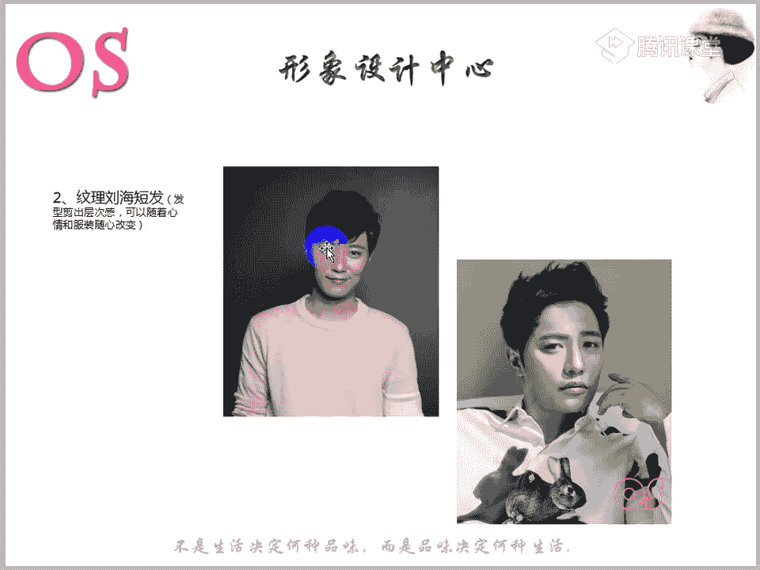

🎼那么这个呢就是我们这样的一个圆形脸啊，圆形脸所适合的发型。那我们可以借鉴呢老师刚才所说的这两这两种。但是当然大家可以呢私底下自己可以去做一些调节。也就是说你们要抓住重点啊。

重点呢就是第一我们要制造这样一个高度。第二个呢我们一定要制造纹理感啊，纹理感对于我们来说非常的重要。这是我们两个重点，对于圆形啊脸的男士来说。

🎼好，接下来呢我们来看看适合的这样的一个眼镜啊。因为圆形脸的人脸呢比较的短，所以说呢我们最好是能够去佩戴一些带有曲线的一些细长的镜架来调整呢你的整体感。

那比如说有角的啊或者说唉方形的这样的一些眼镜眼眼架的话呢，唉比较有利于呢去突出啊我们这样的一个面部的线条啊，做主要是为什么呢？突出我们这样一个纵向。🎼那这样呢可以扬长避短，使你的脸部显得呢轮廓比较明显。

更加的精神。所以说像我们的呃圆形脸的话呢，其实适当的可以去选择一些稍微有一点点这样的一些呃棱角的但是棱角不要太过于分明啊，像这类型的还是属于比较好的，对不对？所以说呢像这样的一些稍微带一点点方的啊。

这样的一个眼镜呢，相对来说会让你的面部呢会更加的呃清晰，会让面部的线条呢，哎稍微的硬朗一点啊，不用因为我们圆脸型的男士都会感觉很显小，对不对？哎，像一个小男孩呃，大男孩这样的一个感觉。

所以说我们就可以在眼镜上呢去选择一些呃这样的一些硬朗的线条去进行修饰和改善。

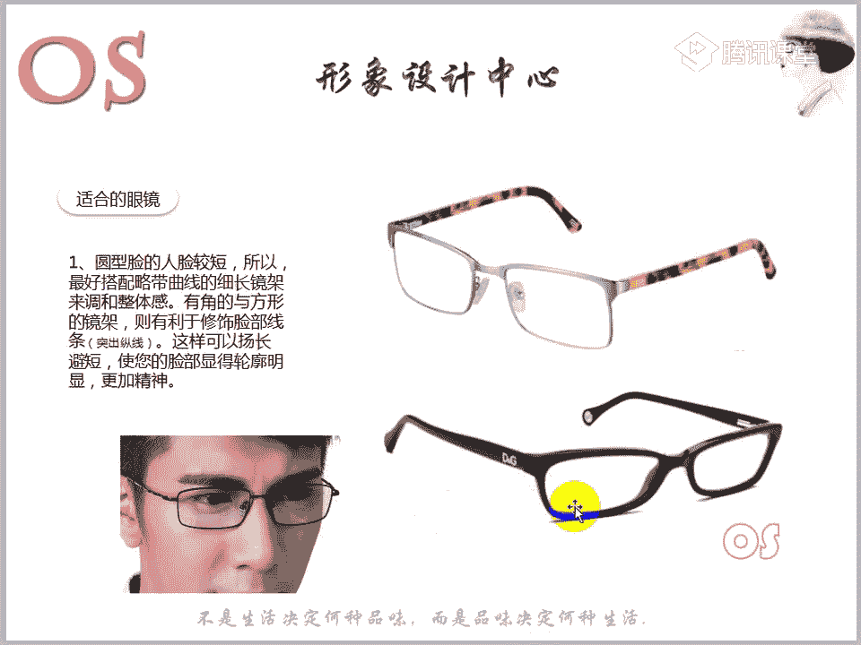

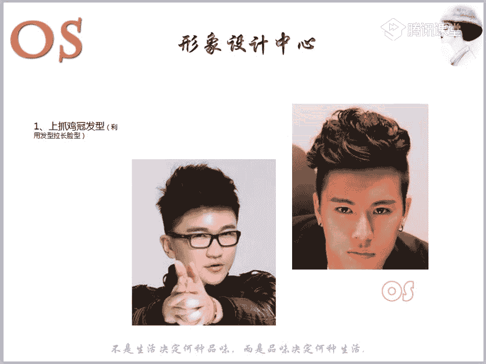

🎼包括墨镜也是一样的啊，但是长脸呃长呃圆脸型的男士在选择墨镜的时候，就不要选择太过于宽的啊，太过于宽的。我们还是要尽量的稍微往一些呃窄一点的这样的一些墨镜呢去选择会更适合你们。

因为本身我们的脸就不是很长。如果你还要戴一个大的话呢，就会把你的脸呢挡了一大半，就会显得你的脸呢啊又圆又小。嗯，所以不够我们的阳刚，不够我们的这样的一个感受啊，就是整体太柔和了一点。🎼好。

对于圆型哦这样的一个圆脸的判断以及发型和脸型啊，还和我们这样的一个眼镜，大家还有没有什么问题？🎼还有没有问题啊？有问题的话可以大胆提啊。没有问题的话，老师就接着讲了。

因为呢呃男士班的脸型和发型就一一节课，所以说内容也比较多，有问题的话就大胆提出来，不用不好意思哦。

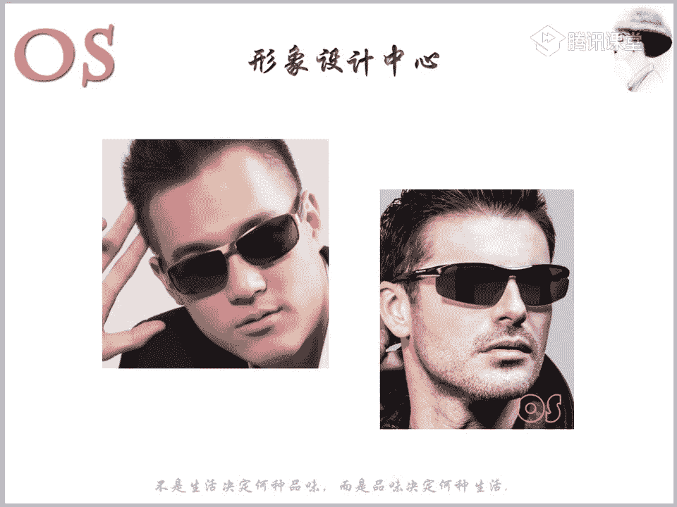

🎼我们班有没有是圆形脸的，就是自己刚才老师所分析完之后啊，有没有自己是圆形脸，或者说我是方形脸和结和圆形脸的这样的一个结合脸型的。如果有的话，也可以呢在公台上跟老师示一下啊。

所以说到时候大家老师把所有的脸型都介绍完了，别到时候哦有同学呃才反应过来，老师我是什么样的脸型啊，我还是不知道啊，还是不知道，所以说大家一定要清晰的去观察自己。😊，🎼的前。🎼啊，我们潇潇老公是圆型脸啊。

所以说到时候我们给他啊改造形象的时候呢，就可以到时候跟理发师沟通的时候，就可以很好准确的去沟通啊。因为你跟理发师沟通的时候，如果你很专业，你底气很足的话，其实你可以镇住到他。

那到时候他就不敢在你的头上呢随意的造次了啊。🎼好，下一个就是我们的这样的一个菱形脸。那么菱形脸的男士呢，菱形脸的男士呢相对来说也是比较多的啊。如果说哎喜欢板寸的话，老师其实刚才有说到。

你其实可以抓住让他的头顶留的稍微长一点啊，让头顶的发亮啊稍微长一点。😊。

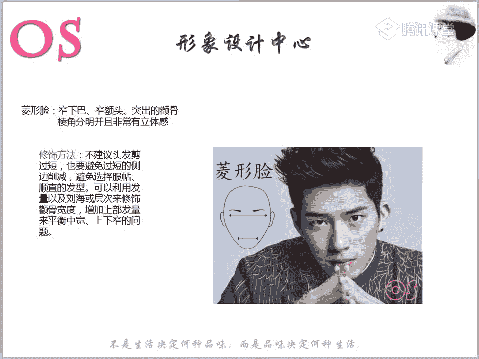

就比如说呃如果他喜欢板寸的话，那么你可以跟他去推荐这样的一个卡尺头，也要比我们的普通的这样一个板寸要好啊。

那脸菱形脸呢相对一些男士还蛮蛮常见的，因为他的特点是什么呢？🎼窄的下巴对不对？然后呢，还有一个特点呢，就是窄的额头。另外的话它除了下巴窄，额头窄。那么包括大家可以从这样的一个面部的外轮廓也能够看出来。

他不仅仅是下巴窄，额头窄，而且呢他的颧骨还有点高，有点突出，就比如说我们这样的一个帅哥啊，井柏然他其实在男设里面来说呢，就还算是一个典型的一个代表，就是我们的菱形脸，那么除了我们的井柏然以外呢。

其实像我们的张公张根硕，对不对？是叫张根硕嘛，嗯应该老是没记错，他其实也是有一点呢偏我们这样一个菱形脸，因为他的额头也很窄，但是你会发现呢，他基本上呢把自己的额头呢都挡的挺好的。嗯。

所以你会觉得他脸型还蛮标准的，还蛮帅气的。😊。

🎼所以每一个脸型都挺帅气的啊，都有适合自己的。那么呢所以说这样的一个脸型的话呢，棱角会分明，并且呢非常的有立体感。那么大家可以观察一下自己是不是额头非常的窄啊，有一点点偏尖，额头有点窄。

然后呢下巴也有点尖，但是颧骨是有点突出的。也就是说你会发现像这样的一个脸型啊，这边是有点往外放走的。但是唉上庭和我们的下庭就相对来说有有点窄哦。哎。

我听着咱感觉所有的眼型都应该把头发呃头顶的呃头发留的长一点啊。😊，🎼这个呢其实是要根据我们具体的这样一个脸型的，为什么会你会感觉会整整个的这样一个发型都会啊留的有点长呢？是因为什么？

一会儿老师会跟大家总结的时候，你就会发现。

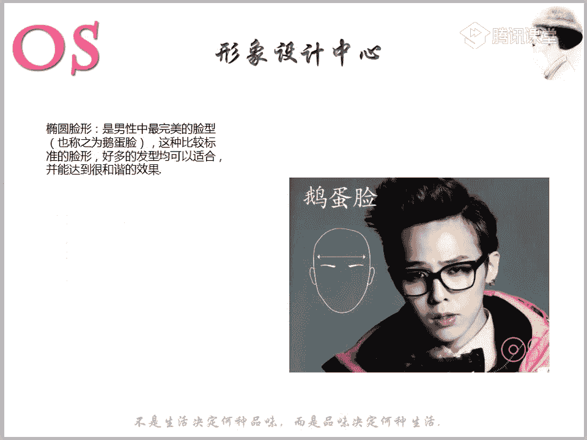

🎼因为我们这样的一个呃发型啊，因为这样一个发型它其实是有衬托法和遮盖法的。那么这两个法则其实即是记一个有些同有些同学就像我们的圆呃，我们的长脸型，你也会发现头顶会有点长，是为什么呢？是因为他的脸。

他的头顶比较窄，所以像要利用我们长一点的发型呢，进行这样的一个填充。也就是说进行这样的一个啊弥补，对不对？那么有的为什么说哎我们的方形脸和圆形脸要长一点。

是因为呢利用我们这样的一个发型呢哎进行这样的一个也是要去拉长，它的一个不足，一个是要去填充啊，一个是要拉长，所以说它的意义是不一样的。但是呢你要记住我们每一个脸型的这样的一个特点。

🎼以及他所适合的这样的一个发型啊。一会儿总结的时候，老师会跟你们详细的去总结的。好我们看到我们呃我们这样的一个菱形点，所以说菱形点呢不建议头发剪得太过于短啊，比如说像板寸，或者说把整个脸呢都露出来。

其实是不合适的，也要避免一些过短的这样的一些侧边的一个削剪，避免呢选择一些比较服帖的呀，顺直的这样的一个头发，可以利用呢发量以及刘海或者说层次呢来修饰我们的颧骨的一个宽度。因为你的颧骨偏高。

你的太阳穴啊有点凹，对不对？有点窄，所以说呢我们要利用刘海来增我们的上部的一个发量。这个时候当你的上部的发量进行增加之后，才能把你的啊上下窄的这样的一个问题，中间有点宽的问题呢。

进行这样的一个中和进行这样的一个平衡。那么所以第一个呢我们像这样的一款上抓发型啊，也是适合我们菱形脸的上抓的激光发型。😊。

🎼但是这样的呃上抓激光发型，它的选择呢跟其他脸型还是有一个区别，有一个什么样的一个区别呢？我刚才说了，上抓的激光发型，像其他的一些脸型的话，两侧是不是要剪的短一点，对不对？😊，🎼两侧要剪的短一点。

但是我们这样的一个菱形点的话呢，两侧就不宜呢剪得过短啊。大家也能够从我们的井柏然这样的一个上抓机关发型，你会发现它其实跟其他的还是有一点点区别的啊。像其他的这样的一个上抓啊。嗯老师举个例子啊。

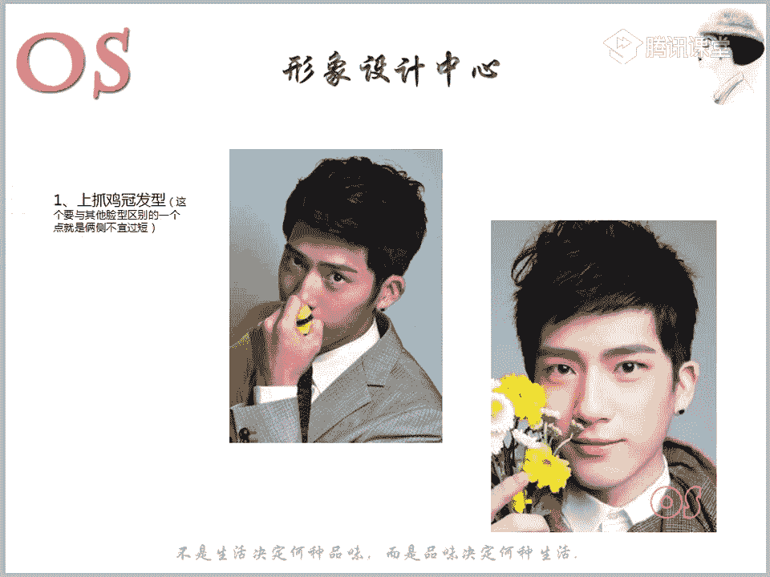

其实它是有区别的啊，有这样的一个区别。

那这个就是我们这样的一款啊上抓，所以说两侧还是要留长点，为什么要留长呢？是因为它本身额头就窄，对不对？额头就窄不够饱满。那如果说你把它这两侧还剃的很短的话，会显得它更窄。

那么这个时候我们要利用发型呢去进行这样的一个填充，让它饱满一点啊，这是第一个如果说是菱形脸的一个男士的话，我们第一个要选择就是这样的一个上抓激光发型，同样要避免呢两侧过短的一个问题。

第二个呢就是我们这样的一个长边刘海。像这样一款发型的话，就没有任何的一些呃困扰了。哎，我们可以呢把留额头啊扎遮挡起来。那么这个时候我们就发现不了你额头跟你的一个链颊。

也就是说你这样的一个颧骨啊不平衡的这样的一个缺点了，对不对？你会发现唉这样的一个长边刘海啊，把它的一个上半部分填充的非常的好，让它整个呢显得非常的饱满，而且韩范十足。而且其实。

🎼打理好打理起来也非常的好打理哦，这两款发型是比较好打理。只要剪出了层次之后，我们在吹造型的时候呢，唉多去往前面去走去吹。另外的话呢吹完之后稍微去粘，拿个拿发蜡稍微捏一下，粘一下，其实就出来了。

定个型就可以了，非常的简单。其实但是要注意一个点呢？就是厚度一定要适中，不要去显得厚太多哦，发量不要太厚太多。因为你如果说发量太厚太多的话，我们会往外侧去走，就会跟你的下巴会形成鲜明的对比。

因为我刚才说了啊，菱形脸的特点是什么？是不是下巴很尖，相对来说下巴要偏尖，对不对。🎼相对来说下面要偏近啊。所以说呢我们如果说上半部分跟下半部分对比太过太过分的话，也会让人在视觉上觉得不太和谐不协调。

所以说这样的一个厚度呢，一定要注意适中就好了，不能够太薄，也不能够呢太丰盈啊。🎼好，第三个呢就是我们这样的一个中分的刘海啊。如果说菱形脸啊，想要留中分的话也是不错的啊。因为像呃像今年今年的话啊。

还是算今年啊，今年的话像男士留中分也是蛮好看的，尤其像井柏然，你会发现他在出席一些活动或者说一些电影节的时候，他选择中分造型也挺多的，对不对？那么呢因为菱形脸啊叫窄，对不对？

所以说发型的厚度呢适当饱满也可以了，像这样一个中分也是一样的，其实跟这样的一个刘海，长边刘海它是一样的一个道理，两侧的这样的一个发量适中就好了。如果说你的发量太厚太大的话，还是一样的道理，对不对？

会往两侧去走啊。那我们其实像适量适度就好了。而且像这样的一个中分的话，是不是把它的额头进行了这样的一个遮挡。哎，我只是留出来这么一小部分。那么我的额头到底是窄呢还是宽呢？你们也不知道。

但是整体来说会显得我的脸很标志。😊，很标准很标致，对不对？🎼所以这个就是属于我们这样的一个呃中分的这样的一个刘海。

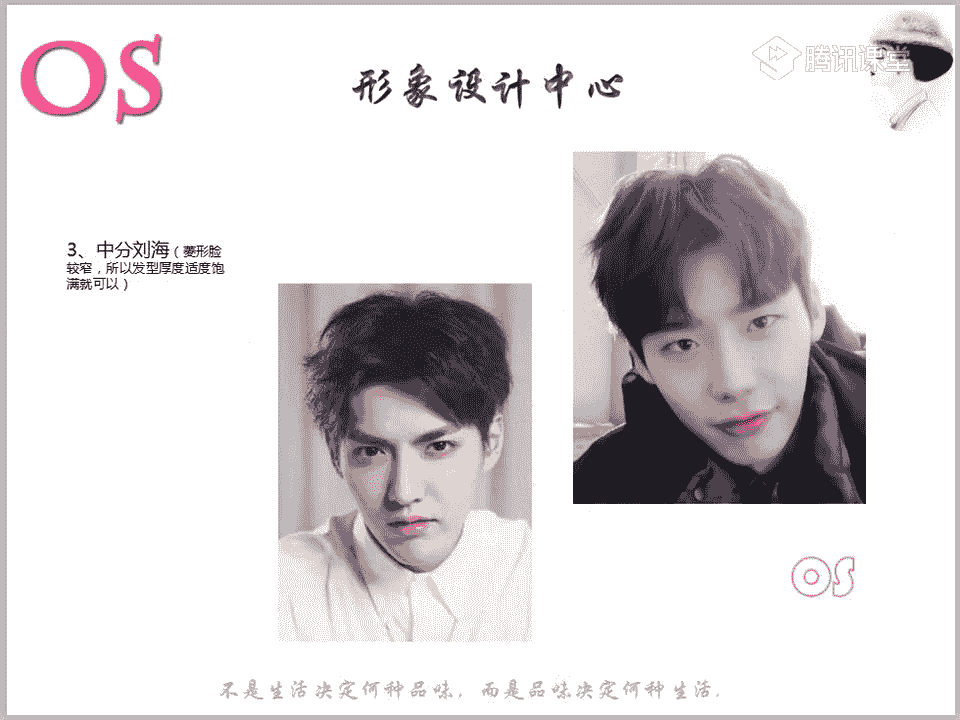

🎼如果说有同学觉得唉中分好像我不太适应啊，我怕我自己驾驭不了，那么我们也可以呢选择我们的边分刘海。那么边分刘海呢发量少的一侧，一定要注意呢，不要剪的太短啊，这一边还是要进行这样的一个饱满度啊。

所以说不要剪的太短啊，唉会给人感觉是比较稳重，轻熟男。如果说我们是一个呃目前的一个年纪在30岁左右啊，一个稳重的一个形象，想要表现自己还是属于一个轻熟男的话呢，我们也可以大胆的去选择这样的一款发型啊。

发量呢少的一侧还是要给他自己呢多留点空间啊，不能够为了一味的赶潮流。像我们我们这几年的话非常留一边发型多，一边发型少，对不对？但是作为菱形点的话呢，就不要去尝试啊这样的一个潮流趋势。

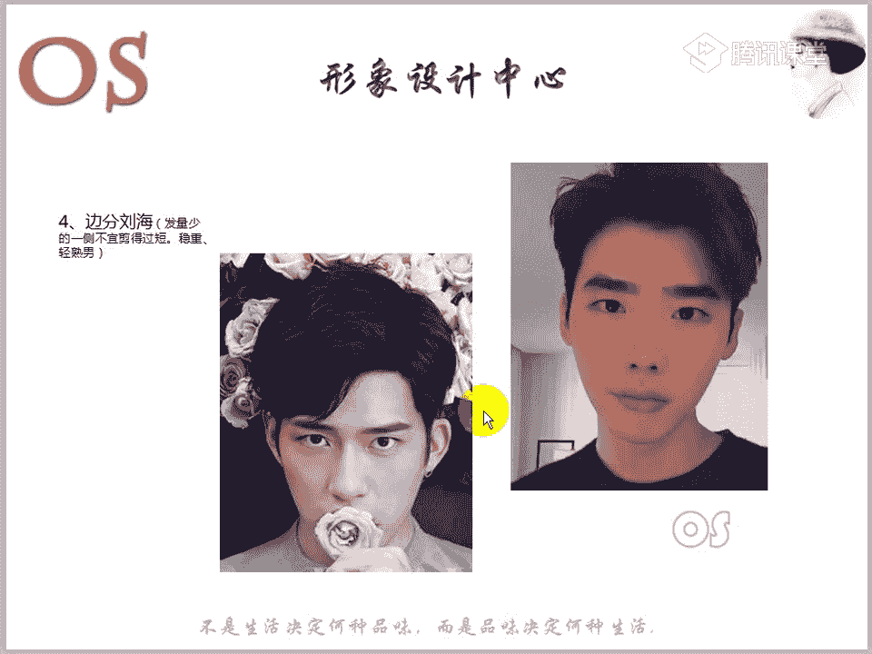

🎼那另外的话呢，其实像我们的方呃我们这样的一个菱形脸的话，你也可以大胆的呢去侧后分梳啊，也就是把它分成我们的三7分或者说46分，但是呢是往我们的后面去侧梳。因为只要呢你做到了这两侧的一个饱和饱满度的话。

其实就可以了。也就是说哎这样的一个蓬松度，一个空气感，这样的一个啊层次感，一定要做好。另外的话呢，千万不要让你的头发太过于贴头皮啊，你像我们这两款发型就没有贴头皮的现象，对不对？而。

整个的一个呈现的一个感受就是非常的一个饱满啊。🎼啊，这个就是我们这样的一个菱形脸。所以说你会发现菱形脸，它其实改造起来很好改造啊，非常好改造。它可以尝试很多的发型。因为呢像这样的一个脸菱形脸呢。

它男士里面最大的一个区别呢，就是它跟我们的鹅大脸标准的脸型是鹅大脸，对不对？最大一个区别就是它在额头上吃了很大的亏。所以说呢我们在额头上呢，也就是说额头两侧的这样的一个发型呢，多去下一点功夫。

多做一些文章。那么其实像很多发型，它都可以去进行这样的一个尝试。那么另外的话就是我们菱形脸所适合的眼镜啊，设的眼镜呢，其实对于一这些有棱有角的这样一个脸脸型的话还是非常适合我们的一些圆型。

以及呢我们椭圆形的一些镜镜框。那可以呢很好的缓和你这样的一些比较刚硬的面部的线条啊，不太呢过于突出的这样的一些线条。😊。

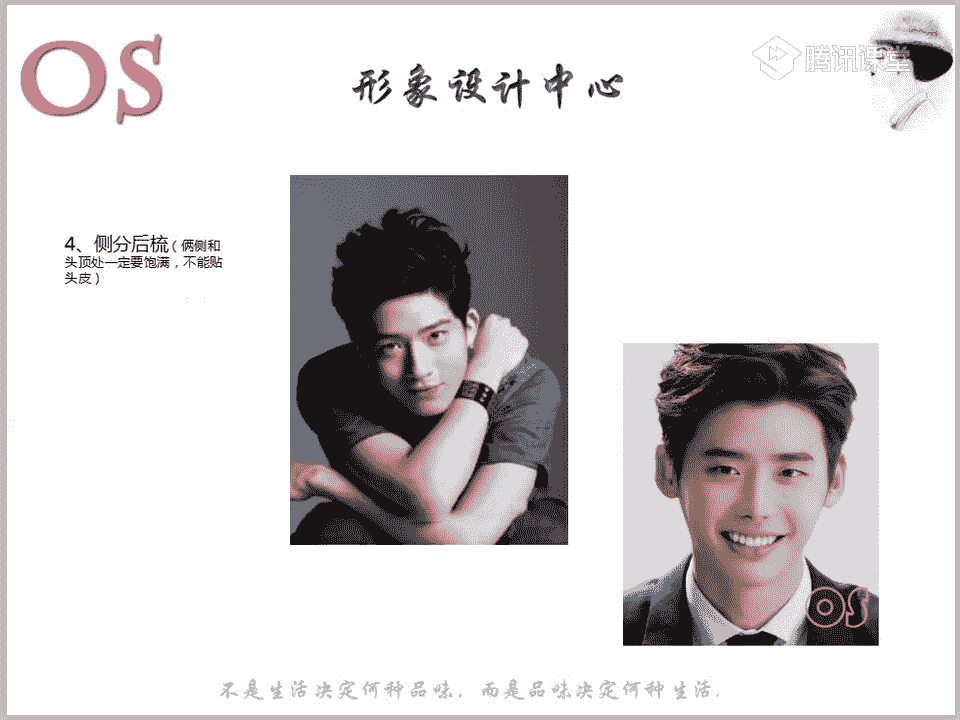

🎼比较流畅型的这样的一些眼镜是可以去进行很好的弥补的。像你的一些小尖下巴呀，或者说下巴偏短啊等等这样的一些缺陷。那么如果说我们是近视的，对不对？我们要去选择这样的一个近视眼镜，而且我也要配镜片的话。

那就注意呢我们的镜片啊，近视的一个镜框啊，要太过于厚重，建议呢我们都去选择这样的一些细框架的。🎼精细一点的细框架的，因为像戴墨镜也是一样的。如果你戴太厚重的话，还是拿井柏然来举例子啊。

会显得你的脸呢又瘦啊又窄。其实在视觉上不会很美观啊，在视觉上就会大老远就像顶着一个苍蝇眼睛就过来了啊，像大头苍蝇，绿头苍蝇这种感觉。所以说呢尽量在墨镜上也好，还是说在我们的近视眼镜上也好。

尽量都要去选择这样的一些细一点的。嗯，秀气一点的斯文一点的啊，这样的一个镜框。好，我们林形脸呢分析呢就是这些哦，大家还有没有什么问题。😡，🎼好，我们卡卡同学要注意啊，看看自己是什么样一个脸型啊。

接下来还有几种脸型啊。你啊老师已经分析了四种了，对不对？😊，🎼还有没有找到自己的脸型啊？凯卡同学有没有找到自己脸型啊，这样的一个菱形脸大家还有没有什么问题啊？

包括呢我们作为呃以后从事形象顾问工作的同学啊，要看到这样的一个男士也要呃也要进行细微啊，很快的去进行分辨，分辨出来，跟他提供好这样的一个造型啊，零心也选择太多了。是的，他其实他的一个选择空间是很大的。

因为老师刚才说到了，只要把额头部分的这样的一个呃缺点进行修饰。其实你可以尝试的发型有很多。😊。

🎼好，接着呢我们来看看我们的心形脸。心形脸的特点呢要注意的就是要跟我们标准的脸型啊，标准的这样的一个鹅蛋脸要进行哦区分。有的同学很容易把心形脸呢跟我们的鹅蛋脸呢搞混淆。那么像星形脸，它的特点呢是宽的。

🎼又有一点扁的这样一个额头，他的额头是很宽的，你会发现发际线也是比较靠后的，而显得这个额头是非常宽的，对不对？比如说我们的陈伟霆很典型的这样的一个心型脸。那么呢他除了额头宽以外呢，他的下巴是比较尖的。

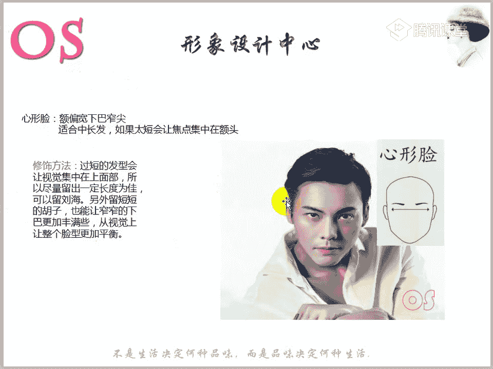

🎼他的脸颊也是比较瘦的。所以说这是我们的这样的一个方形脸啊，这是一个典型的代表。但是圆形脸呢因为讲到我们的这样一个心形脸啊，所以说把圆形脸也跟大家分析一下。

圆形脸呢它是不存在说唉它的额头呢跟它的下颚跟它的下巴会区别对比会那么的明显。也就是说你会发现它整个的线条是呈现这样的一个鹅蛋，鹅蛋状的。😊。

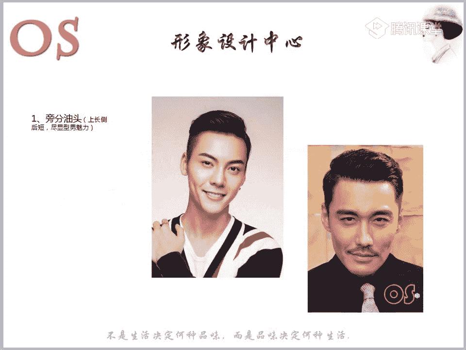

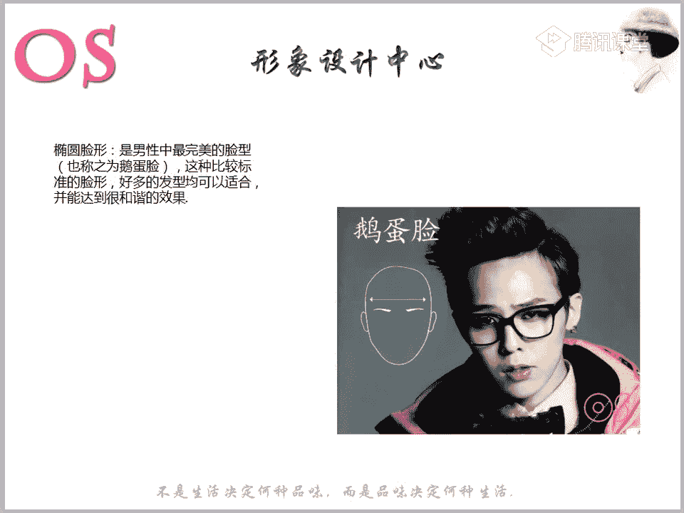

🎼呈现一个鹅蛋状的，就像我们的小鸡蛋一样，对不对？它的线条非常的柔和，而且呢它的面部啊像面颊跟它的额头没有像我们的星星脸对比的那么强，而且星形脸，你会发现很瘦，对不对？下巴很尖啊，脸颊呢也很瘦。

但是鹅蛋脸呢它是相对来说整个线条是饱满的，但是它的一个外轮如廓是比较柔和的。所以说鹅蛋脸跟呃圆形脸也是很有区别的啊，啊我感觉我的脸型是偏长形的鹅蛋脸啊，那很好啊，像鹅蛋脸的话，任何发型都可以去尝试啊。

因为主要说呃只要说你的三庭五眼很标准的话啊，真的是这样的。😊。

🎼所以这个星型脸和我们的鹅蛋脸去进行判断。大家有没有什么问题啊？我们在场的同学能不能就是清楚的抓住他们这两个脸型的这样的一个特点。老师刚才所描述了一番啊，有没有问题，没有问题的话，快速刷朵鲜花。

有任何问题提出来。因为这个很重要哦。🎼包括老师在讲视听课程也好，还有包括在跟一些VIP做解答的时候，我会发现大家对于星星脸和鹅蛋脸一直是有一个误解的，就是觉得星星脸呢就是鹅蛋脸，鹅蛋脸呢就是星星脸。😊。

🎼好，女生鹅大脸是最美的啊，那当然啊啊，我们其他同学啊飞龙在天和卡卡同学，还有包括我们的小峰同学啊，还有没有问题啊？对于心型脸和我们这样的一个鹅大脸要一定要懂得去区分哦。😊，🎼Get情。

🎼当然首先是找到自己啊，找到自己这样的一个脸型啊，这个就是我们这样的一个新型脸。那么新型脸呢在选择一些过短的发型，会让我们的视觉呢会集中到上半部分，所以说新型脸呢不适合选择呢。

比如说我整个的头发的一个分量啊，发量全部都放到上半部分会显得他的脸会有一点长，而且呢还会显得脸很窄，很尖。所以说我们要注意的一个点，就是在留一些短发的时候，千万不要把所有的这样的一个发量都放到头顶了。

呃，就是放在头顶上半部分非常的偏上。那么这个都是不太适合我们这样的一个新型脸的。另外的话呢哎我们留的刘海可以稍微呢长度稍微长一点，会更加。当然我们新星脸的话啊，如果说唉你喜欢刘海的话，你可以留刘海啊。

还是留点刘海，还是挺不错的。另外的话呢你们也可以呢比如说有一些男士啊，是这样的一些相对来说带一点文艺感的。你如果说想要留。😊。

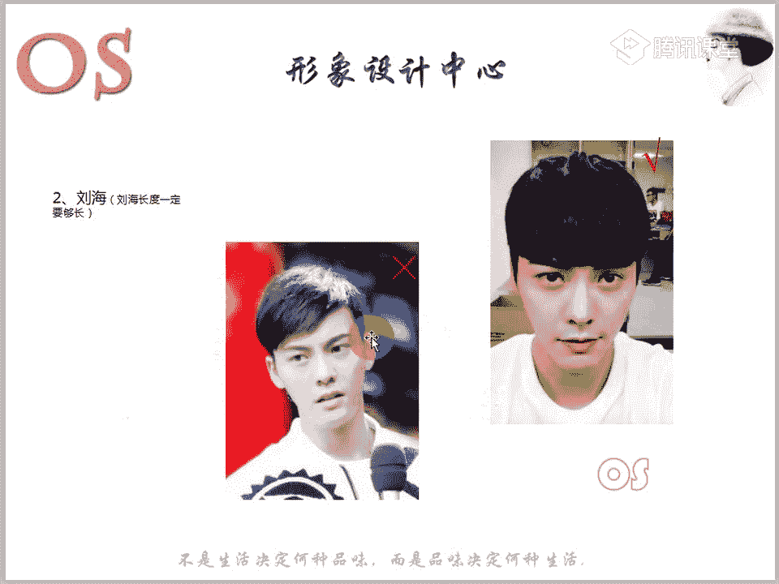

🎼点胡子的话呢，你也可以给你的下巴部分呢留一点胡子。那么其实它会相对来说给你的呃下巴会营造这样的一个丰满的感觉嗯。😊，🎼那么在视觉上会让你的面部呢更加的平衡啊，让你的面部会更加的平衡。那第一款发型呢。

当然就是适合我们这样的一个旁分的油头啊。如果说你不喜欢刘海的话，没关系，留旁分油头也没有太大的一个影响。那么当然啊上长最后短，这是我们的旁风油头的一个特点，这个还是要抓住啊。

因为会显得你非常的有这样一个型男的魅力啊。旁分的油头。如果你不喜欢留刘海的话，我们的新形脸的男士可以选择这样的一款发型。如果说呢你想要刘海啊，你想要让它两者之间呢会更加和谐的话呢，我们就可以留个刘海。

但是刘海的长度也尽量的选择长一点，或者是说呢唉在这一块呢，你也多注重一下打理一下，让它呢显得你的额头相额头额头呢稍微稍微的窄一点啊，不要那么的宽扁。

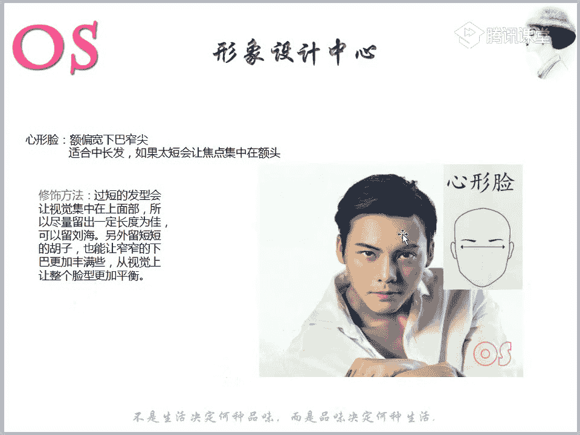

🎼所以说其实像心型点的话，我们就注重好就是了你如果不想要刘海，我们就后梳油头。如果你想要刘海的话呢，我们就留个刘海。但是要切记的一个点就是什么呢？我们尽量不要把所有的发量呢放到上半部分啊。

如果说尤其是有些男士，它是属于有这样一个刘海的话，如果你没有刘海，你的发量像我们这样一个油头是没有任何问题的。但如果说你是有刘海，就像我们的陈伟霆啊，太短的话，在视觉上都放到上半部分了。

就会显显得你的脸呢稍微的有点窄瘦啊，不不太不太好看。所以说这个就是我们啊新星点要注意的，其实它的一个选择空间也有很大。因为它其实跟鹅蛋脸鹅蛋脸最大的一个区别，就是他的下巴会有点尖，脸呢会显得有点瘦。

所以说我们尽量让自己看的看起来呢啊精干一点，精细一点。😡。

🎼想听你。🎼再一个呢就是它适合的这样的一个眼镜啊，我们尽量选择一些上宽啊，因为它的一个特点啊，是它的一个下面上面比较宽扁的这样一个额头尖尖的这样的一个呃下巴刺。

所以呢我们尽量去选择一些这样的一个椭圆形式的啊，呈现椭圆式形式的这样的一个眼镜。那么另外的话呢，我们的眼镜框上也不要有任何的装饰啊，会显得上宽下窄，对不对？因为有一些男士非常个性的一些眼镜框。

它就是在这里也会有一些设计感的。那么我们尽量不要有啊？另我们就选择越简单越好越简单越好。

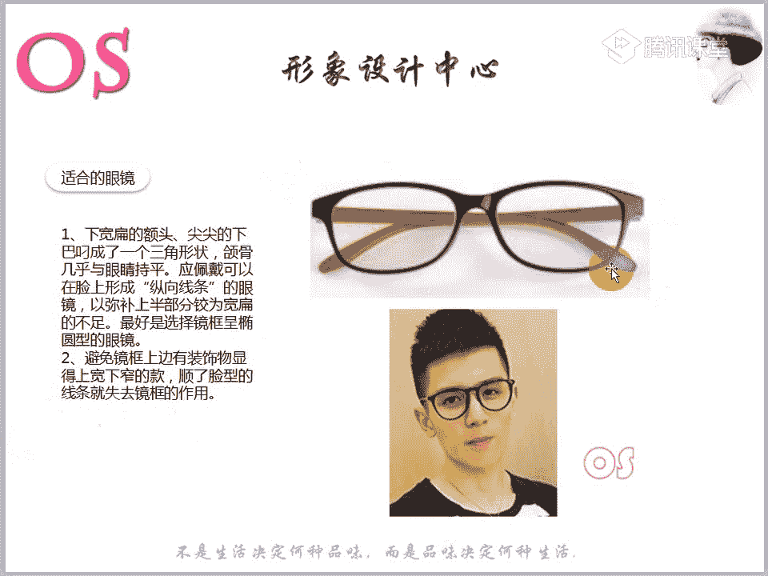

🎼像这样的一些眼镜啊，都可以，都还不错。也就是说，只要呢我们的这样的一些呃眼镜框上上边没有任何设计感的话，其实对于他来说选择余地很多很大啊，选是最要还有一个点就是尽量选择椭圆形的，只要是椭圆形的。

然后呢，没有上面没有过多的一些设计感。那么其实他就可以选择。因为他的脸型其实跟鹅蛋脸是蛮接近的。所以说呢在选择眼镜的这样的一个空间来说也是相对来说比较大的。

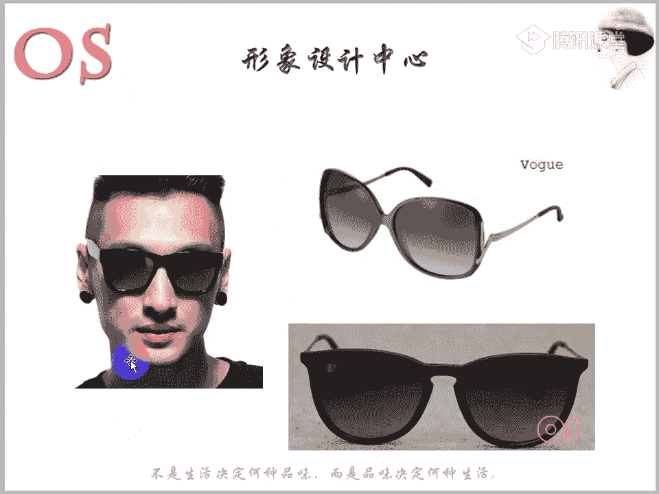

🎼好，这个就是我们这样的一个新型列啊。😊，🎼好，星系脸说完了，我们来说说标准的鹅蛋脸，标准的鹅蛋脸。鹅蛋脸呢其实又称之为我们椭圆形的脸，是男性中非常完美的脸型。当然也是我们女性中很完美的脸型。

如果你是一个三庭五眼，很标准的鹅蛋脸，那就恭喜你了哦，你真的是中的头彩了。因为呢你这么标准的一个脸型啊，这么标准的三庭五眼，那么很多的发型呢都可以去适合，而且呢非常能够去达到和谐的效果。

就比如说像我们的马天宇，它其实也是一个相对来说呢比较标准的这样的一个鹅蛋脸，你会发现哇它的造型怎么样去做哦。

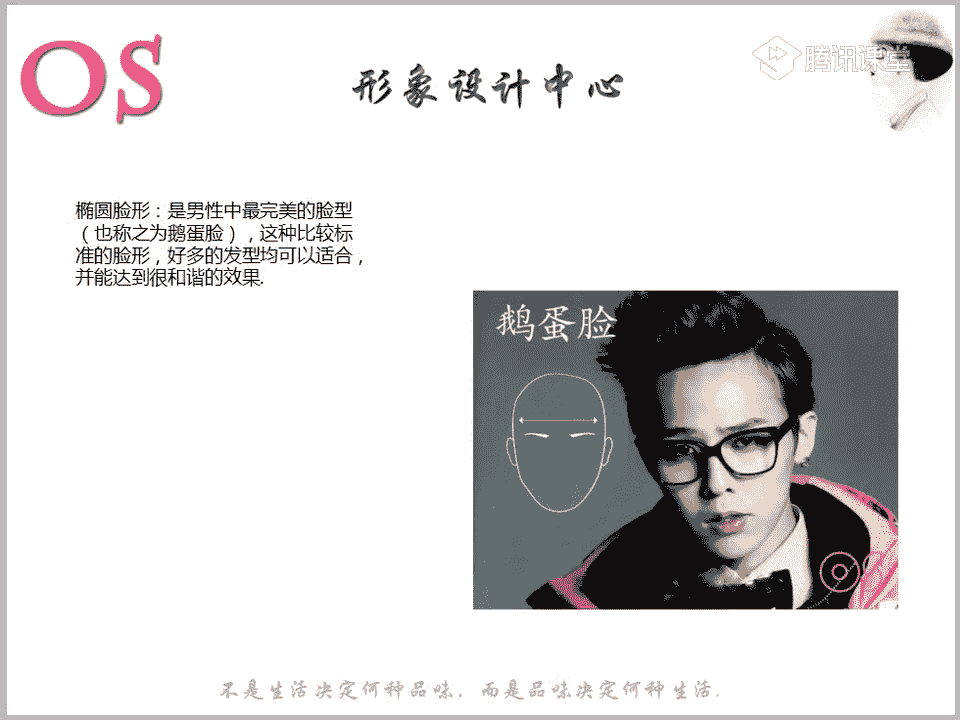

🎼怎么做都好看，那哪怕去留个板寸，或者说哎留个我们这样的一个呃卡尺头也好，还是说留中分哪留偏分哪，上书啊啊，留海长一点哪，都不错，对不对？都很帅气啊。

🎼所以说刚才也描述了鹅蛋脸的这样的一个特点啊，也就是说它整个的一个面部的一个外轮廓呢都是比较柔和的这样一个线条，它不会像圆形脸啊，唉呈现这样一个圆一个饼状的，但它是属于这样一个鹅蛋状的。

也就是说我们这样一个唉鸡蛋呀，鹅蛋这样的一个啊视觉的一个感受的这样一个线条啊。🎼所以说像鹅蛋脸的这样的一个选择，发型呢，老师就不做多介绍了。你们可以根据自己的这样的一个爱好啊，去尽情的去选择。

因为它没有什么额头窄啊，或者说颧骨高啊、太阳穴凹啊等等的下巴过肩啊这样的一些等等问题。所以说它可以去驾驭任何的这样一个发型。哦，像刚才我们有同学说到，呃，我有点感觉自己有点偏长的鹅蛋脸，对不对？是的。

也有这样的一个偏长的一个结合的鹅蛋脸。那如果说你是偏长的一个结合的鹅蛋脸的话呢，你再选择发型上的，你可以呃还是多以我们的长脸型的这样的一个发型呢，适合的发型为主，然后进行了这样的一个修饰。

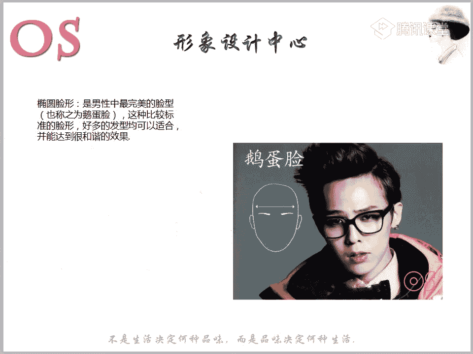

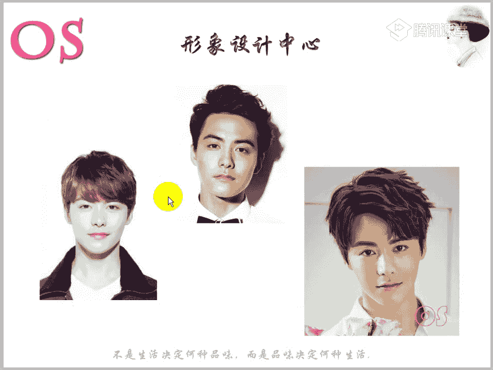

🎼那么当然啊我们的鹅蛋脸的话呢，选择眼镜也是一样的，然后就没有什么太多的一些呃说头了啊。总体来说，椭圆对于他来说是最佳的。你会发现椭圆这个眼镜啊真的还不错，对不对？很非常的保险，非常的安全。

然后所适合的人群也很很大。那另外的话就尽情的凹造型。哎，你今天想戴个蛤蟆镜也好，你今天想戴个四四方方的也好？哎，你今天呢想戴这样的一个金丝眼镜框也好，还是说我要戴粗一点的这样一个眼镜框也好。

都没有任何问题哦，都没有任何问题。这个就是我们这样的一个鹅蛋脸。😊。

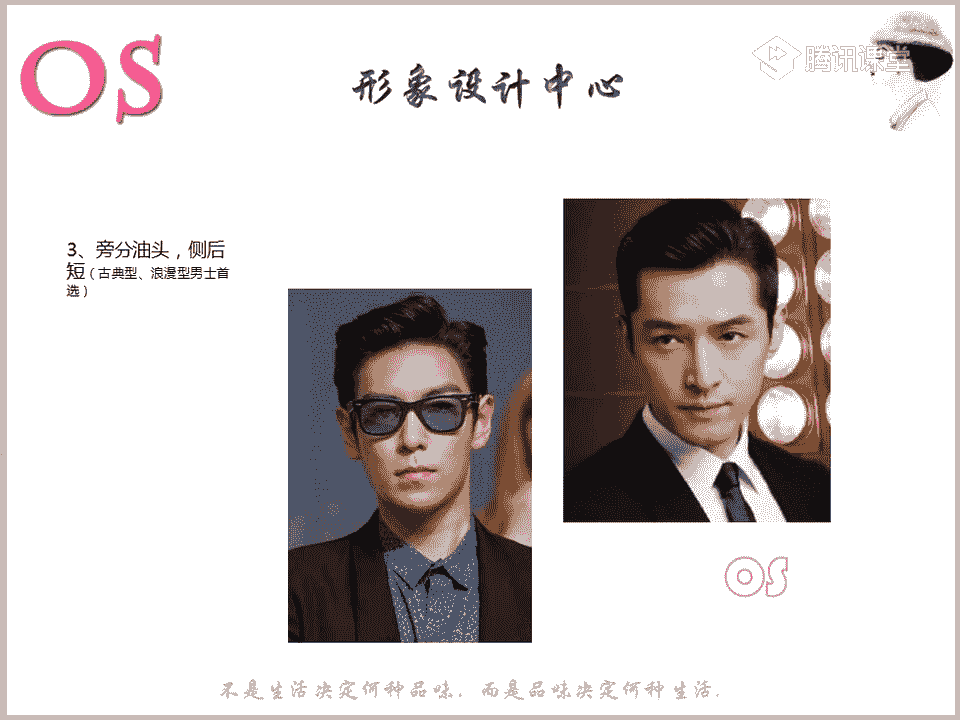

所以尽情的凹造型。另外的话呢，在这里提一下我们男士呢呃不太常见的这样一个脸型，就是我们的三角形的一个脸型，也称之为油字型。它的特点其实是大家可以把它拿着菱形脸跟我们的方形脸结合去看，你就会非常的清楚。

油字型的脸顾名思义呢，这个脸型呢，它有点呈现我们这样的一个字的一个游字的这样一个外轮廓的一个状况。也就是说它的额头呢相对来说要比较窄啊，相对来说要比较比较尖，这样脸是最窄。🎼呃，相对也比较窄，比较尖。

另外的话呢，它的下颚，也就是它的一个下巴附近啊，腮帮附近相对来说有点宽啊，不仅有的同学可能它是偏宽的，有棱角的。那么有的同学可能它就是啊菱形脸呢跟我们的圆形脸去结合。也就是说它是有点偏圆润感的。

而圆形脸它是整个线条都很饱满，对不对？没有额头窄的问题，但是我们的油字型的脸呢，它是有额头窄的这样的一个问题哦。🎼他是有额头窄的这样一个问题。所以说这个呢唉就是我们这样的一个呃油字型的脸，三角形的脸哦。

包括老师画的这样的一个呃找的这样张图片，对不对？也非常的直观。对于油字型的脸，大家有没有不明白的，都明白的同学跟老师扣个一，我知道什么是油字型的脸了啊，额头窄，嗯，不仅额头窄呢，他的下巴啊。

下颚呢还有点方，或者说有点圆啊，也就是说他的脸型是有点像我们的菱形脸，结合了我们菱形脸的上半部分，就像我们的刚才所说的啊，井柏然的上半部分，然后呢再加上了我们张杰的下半部分。

或者说加上了我们的呃张大大或者说王祖蓝的这样的一个下半部分嗯。😊，🎼哦，卡卡同学明白了哦，其他同学呢其他同学能不能明白啊，这个就是我们的一个三角形的脸，又叫油字型的脸。有任何不懂的跟老师打在公台上哦。

我找图片给你们分析哦，结合的去分析哦。所以说像这样的一个脸型啊，因为老师没有找一个典型的一个代表，就是因为像这样的一个脸型，它不常见，对于男士来说，它是不常见的，所以说找代表给你们看呢有点难。

那么我们就以这样的一一张图为主啊，为啥没有放一张明星照片。也就是说我们明显真的很难见到这样的一个游字型的脸。那我们在生活中当然不一定没有，所以说大家呢唉去看就好了啊，去看就好了。😊，🎼啊。

感觉老公又是这一种，所以说大家看到啊我们的油字型的脸，它是有点像唉结合了我们这样的一个井柏然啊，像这张照片还不是特别的明显，它是整体的话呢呃他的一个发际线都往里面走，显得额头很窄啊，手副脸对吧？😊。

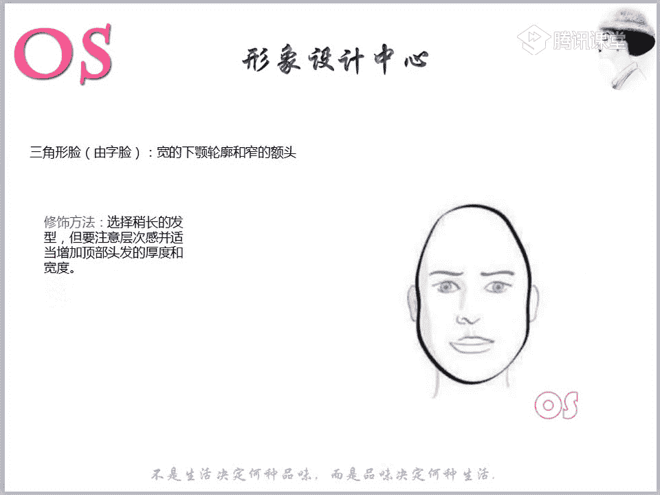

🎼啊，有点很窄，他的额头是有点很窄的，但是他下巴也不尖，下巴又有点像偏方啊，所以说呈现一个这样的一个油渍的这样的一个状态啊。所以说大家可以去以那个油渍啊。

老是打在打在我们的屏幕上的这样的一个油渍啊去对照这样的一个脸型，你就会发现非而且他的头顶一定是有点尖的。也就是说我们不要单单去看额头，还要看他这样的一个头顶两侧的一个饱满度啊，头顶两侧的饱满度。

如果他的头顶非常的不饱满的话，那么油渍型的一个趋向是非常明显的。但是如果说像我们潇潇老公，你是属于呃这样的一个他的额头，他也是他的头顶还比较饱满的话，那么只是因为。😊。

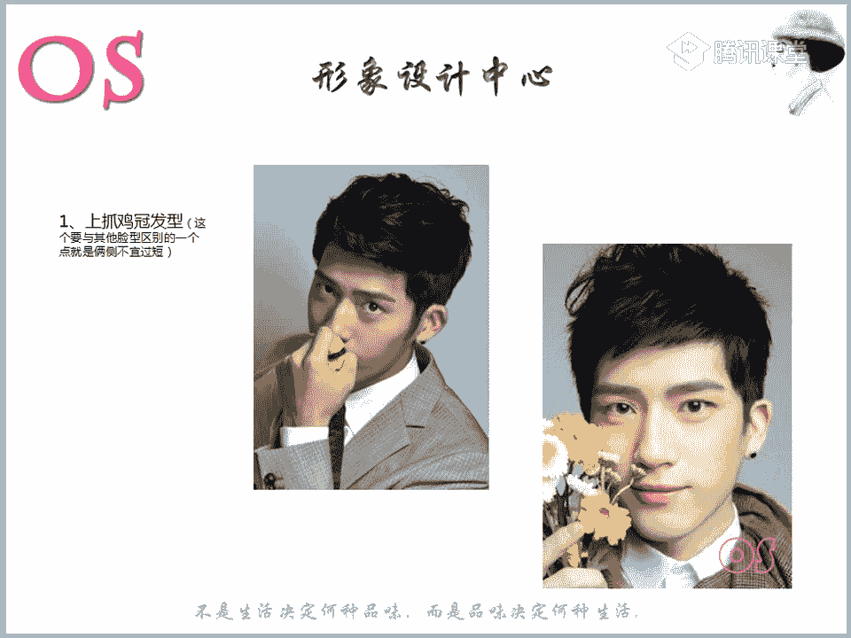

🎼他的发际线的一个问题相对来说有点靠里的话，我们还是以方形脸为主比较好。🎼我不知道这样说，我们的潇潇能不能明白啊，也就是说还要去考虑一下你老公的头顶啊，头顶是不是呈现一个尖的。你像我们很多长脸型的人。

他的头顶也有点尖，但是他的下巴又没有这么方。嗯，他头顶也有点偏呃偏来说偏窄吧，不算不能说算尖吧。所以说呢对于我们这样的一个油字型的脸的话，我们在修饰的时候呢，可以选择一些稍长一点的发型。

稍微长一点的发型，因为你要去遮挡这里，对不对？那么呢包括呢要选择一些层次感，并适当的呢去增加我们顶部啊头发的这样一个厚度以及宽度，那拿他举例子嘛，就像他其实你会发现他有点偏油字型哦。

像这样的一个男士他就是有一点点偏油字型啊，你会发现他的颧骨也有点。

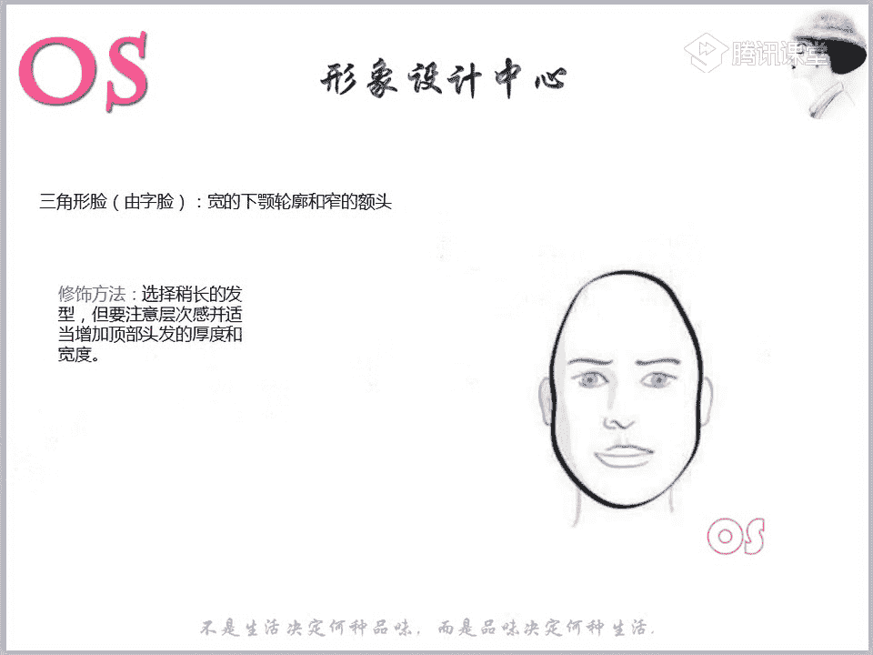

🎼大哦没事啊，课后的时候，你可以把照片发给老师啊。😡，🎼哼课后的时候拍几张照片啊，包括我们的生活照啊等等的，可以拍几张照片给老师正面的。那么你会发现它也是有一点点的啊。

它也是整体来说趋向这样的一个游字型。🎼整体去像个油字，它不属于菱形，你会发现他下巴并没有那么的尖窄。嗯，但是他的额头他的颧骨呢又有点高，他下巴也不是很瘦，很窄，对不对？

但是他的额额头又有点相对来说偏一点窄，拼点细，跟他的这样面部的一个协调度要差了很多。所以说呢我们这样的一个油字型的话，在对于我们的这样一个发型来说，尽量以衬托为主。嗯，进行填充，进行这样的一个衬托啊。

让他的一个额头让他的一个头顶呢尽量的去饱满，而不要说显择这么的尖啊，这么的尖，这个能不能明白啊，明白同学跟老师快速刷的鲜花啊。

🎼所以说像这样的一个正三角脸型的话呢，包括一些长边的刘海去上抓也好，或者说旁边的油头，或者说长的一些啊刘海。就像刚才老师所提到的，唉，类似于这样一款都是可以的。所以说整个的话呢包括它的一个眼镜的话啊。

眼镜的选择。如果说是油字形的脸的话，眼镜的选择，尽量你尽量呢去让它往我们这样的一个方形脸呢去做选择。或者说呢哎往我们这样的一个圆形脸的一些适合的眼镜呢去做选择。

🎼因为主要还是它是在上半部分要用发型去做调整啊，所以说下半部分你会发现它跟我们的圆形脸和我们的方形脸会有那么一点点类似。所以说我们可以去进行这样一个填充。

另外的话呢呃尽量把他的一个眼镜框啊选择稍微的长度稍微宽一点点。这样的话呢他对于他的这样的一个太阳穴呢会有一个帮助的作用，不会显得他的太阳穴呢过凹，嗯，会有一个填充，由一个衬托啊，所以说整个发型的话。

你会发现啊讲了那么多一个呢就是我们的衬托法。也就是说利用我们这样的一个两侧的一个并发，以及头顶的这样的一部分的一个块面来改变我们面部的一个外轮廓，让他去修饰，哎。

分散一些比如说啊原来一些瘦长的或者说比较宽的，比较胖的这样一些头型和脸型的这样的一个视觉，对不对？这就是我们衬托法。那么包括这是同一个人啊，这是同一个人不同的发型是不是改变有很大。

所以说刚才我们凯卡同学说呃觉得太难打理。

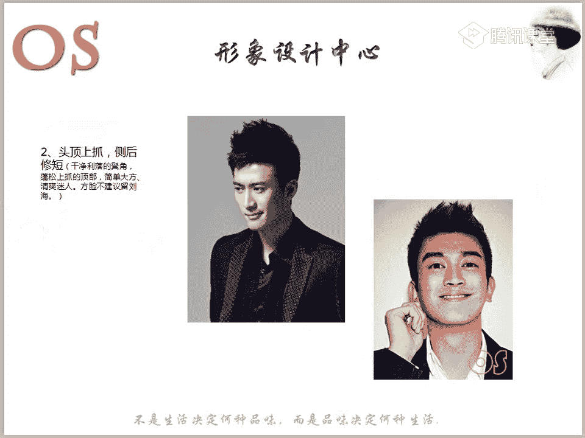

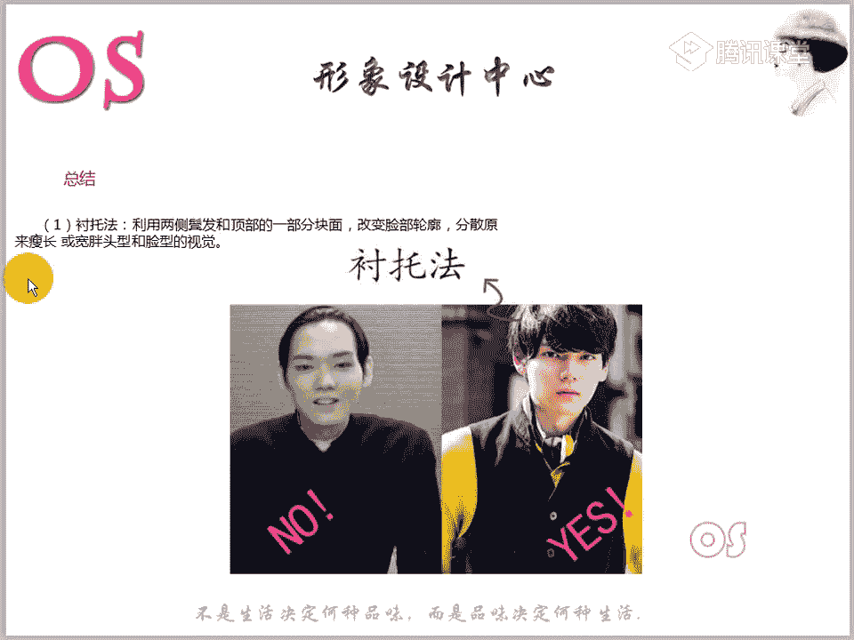

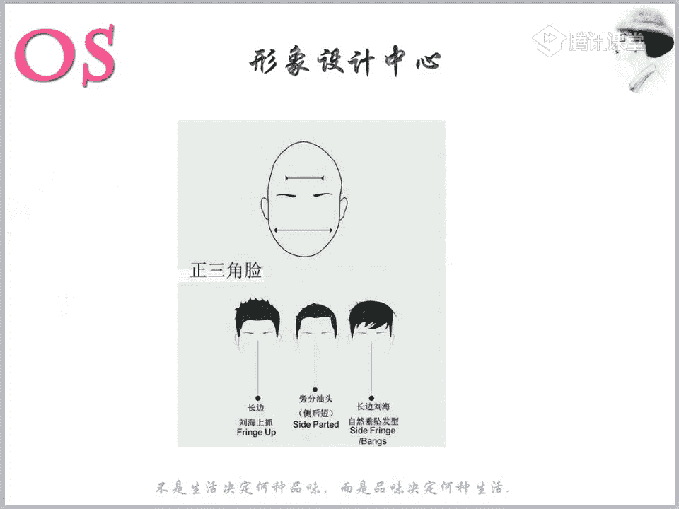

🎼懒哦，不要去拦哦，你要是不想打理像我们左图中这位男士，那你就这样了啊，但是如果说你打理一下勤快一点，对不对？我还是做做造型，是不是有一些好多小迷妹就会被你迷住啊？😡。

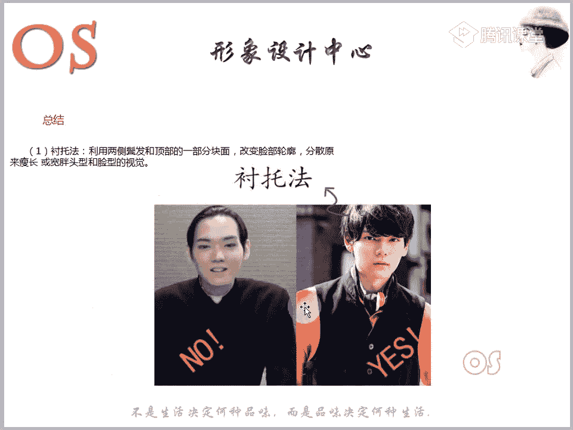

🎼那第二个呢就是我们的这样的一个遮盖法。那么衬托法主要是去进行填充的，对不对？你会发现它是来进行填充的，把不饱满的地方呢哎把它趋向于饱满化。那么衬托呢我们这样的一个遮盖呢。

其实它其实别看似好像效果不一样啊，但是它的作用是不一样的。也就是说它的一个出发点不是不一样的。遮盖法呢是主要去把一些多的地方呢进行遮挡啊，进行调整和修饰。

也就是利用我们头发来组合一些合适的这样的一些线条啊，或者说块面来掩盖我们面部一些某些部分的一些不协调或者说缺陷，就像有一些呃男士的话，他可能额头很宽，就像我们刚才所说的，我们的这样的一个啊陈伟霆。

对不对？哎，我们可以选择一个刘海。那么他这个就是属于这样的一个啊遮挡，把它本身宽的地方呢进行这样的一个遮挡。而像我们刚才所说的，哎，我们的井柏然呢，像他这样的一些菱形的话，对不对？菱形脸。

我们这我们就要做一些。😊。

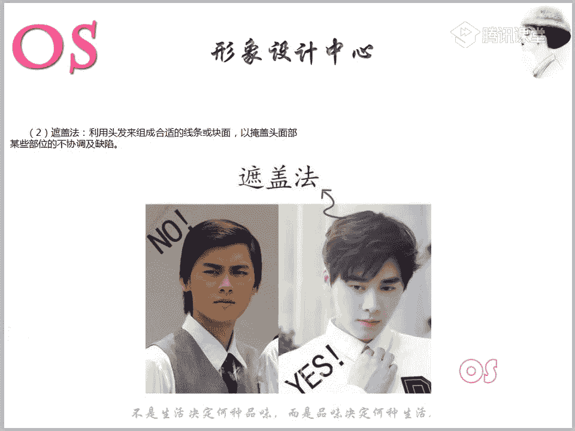

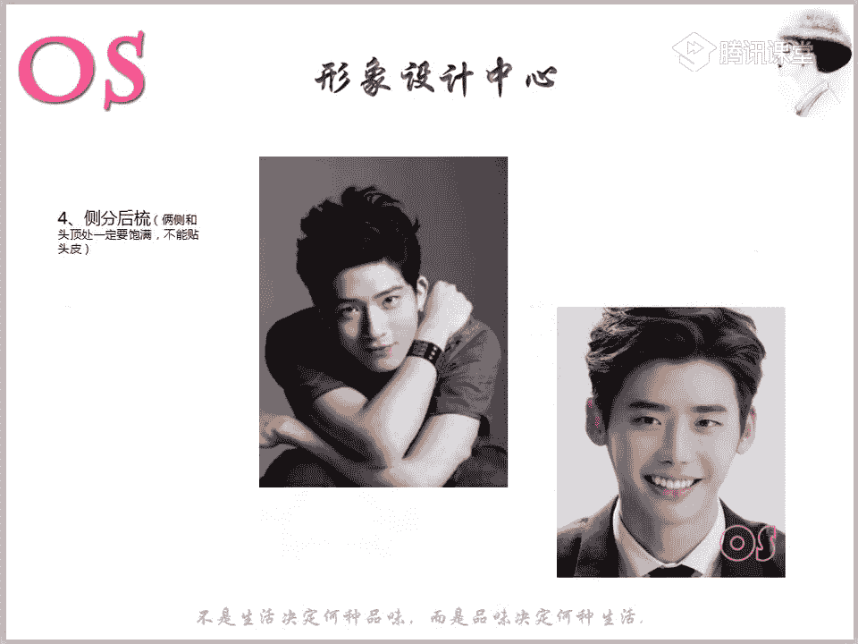

🎼填充填充的话就是我们这样一个衬托啊，跟它的一个上半部分和下半部分呢进行这样的一个协调。所以说这个就是我们这其实大家会发现整个就是两种。那么大家其实也可以灵活的去运用，就像有一些女士的话。

你可能是一个鹅蛋脸，或者说有些男士啊，你可能是一个鹅蛋脸，但是你会发现你自己相对来说呢，我的额头稍微窄了那么一点点，或者说我的颧骨好像稍微突出了那么一点点。那么我们是不是可以去利用这样的一个呃遮盖方法。

或者是说我们这样的一个呃衬托方法，哎，把头发呢进行留的稍微长那么一点点，对不对？我是不是就可以把这样的一些不饱满的太阳穴就进行了填充啊，进行了这样的一个呃衬托。那或者是说我颧骨有点突出的话。

我可以用这样一个遮盖方法，让我们的两侧的头发呢稍微向前面走一点点，是不是就把这一块就模糊了。那么你的颧骨呢唉到底是高啊。😊。

到底是凹啊，我已经看不出来了，因为你用利用头发已经进行修饰了啊。

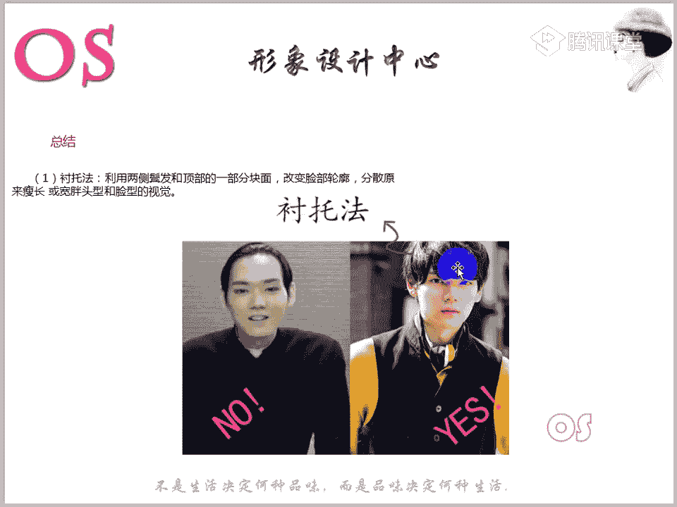

🎼说以这个道理啊大家应该都能明白啊啊，没有任何问题的话，我们就接着来看这样的一个发色啊。接着来看发色。那么发色的话呢，像我们这样的一些冷色型的肤色，如果说你的季型是属于比如说哎我们这样的一些夏季型的。

或者说我是属于冬季型的这样的一个男士的话，你们都是属于冷色肤色的，那么老师推荐你们呢去选择一些酒红色的。唉，如图中像这样一个酒红色，还有包括像我们的这样一个焦茶色，你的焦茶色就是稍焦了这样的一个茶叶。

你会发现它有点偏褐色。那么其实它也是属于这样的一个冷色，那么包括像我们这样一个深的梦青亚麻绿啊，但是像这个深深的梦青亚麻绿的话，它呃时间长了会掉会掉成浅的，有点会偏暖，因为它都要漂染啊。

漂完之后会把你的头发呢漂成这样一个暖色，所以说它掉完之后它会有点撑暖。所以说像要如果说想要染梦青亚麻绿的啊，深梦青亚麻色的，那么其实保湿时间会很短。大家其实。😊。

🎼也没关系啊，男士嘛。😡，🎼但是这样的一个发色非常的洋气，非常的好看。所以说给你们推荐的是类似于这样的一些发色。当然有的同学你会发现像这样一个褐色啊，交叉色它其实就有点像深咖色这种感觉。

所以说它都是有点偏冷的，适合我们的冷肤色的人。那如果说你是春季型的，或者说你是秋季型的男士，你的肤色呢偏暖。如果你要染头发的话呢，建议你们呢去选择棕色系列的，或者是呢选择亚麻色系的。

也就是说像一些很多一些棕色系，唉，类似于这样的一个些感觉的，都是棕色系，对不对？啊，泛一点黄底调的，像这样的一些发色呢都是暖的呃，非常好看，会显得你的气色非常好，五官呢也很精致啊。

另外的话呢立体度也会让你呢显得很高，皮肤的一个质感也会加强。还有包括像我们的一个亚麻色，比如说浅的亚麻色，哎，或者说像如图中我们周围男士的这样的一个亚麻色也是属于亚麻色啊，它来说呢都是暖肤色等等。

其实暖肤色在选择发色的时候，它的一个。😊，🎼呃驾驭度是很高的，所以说它要比我们的冷肤色去选择发色来说呢，它的选择度会更大一点。🎼啊，这个呢就是我们的发色，关于发色还有没有什么问题。另外的话呢。

老师刚才有说到讲发型的时候，像我们这样的一个偏分的油头，或者说后束的这样一个油头，是适合我们的古典型和我们这样的一个戏剧啊，和我们这样的一个浪漫型的，对不对？在这里呢老师再跟大家讲一下啊。😊。

🎼如果说你是其他风格的，其实呢如果你除了我们的浪漫或者说啊古典型以外，其实你的风你的发型呢就根据你的脸型去选择就好了。那还有一个点就是像我们的戏剧型，其实戏剧型呢他本身就是一个大的风格。

那么其实在选择发型上，即使你你会发现像戏剧型选择一些稍微长一点的发型也会很好看啊。我不是说留长发啊，当然留长发也没问题。就比如说我们的陈柏林啊，大家应该都认识啊，认识同学可以跟老师扣个一啊。

你会发现陈柏林他的发型的话，他的一个发型的长度也是比较长的，对不对？但你不会觉得他的人呃显得他的人很嗯很不清晰，或者说很不干净。你会觉得还是跟他自身的五官的一个清晰度还是有这样一个凸显。

所以说像呃浪漫像戏剧型的话呢，他的发型可以选择松散一点啊，稍微长一点，没有任何问题。那么其他风格的话呢，就根据自己的脸型去做改变，做尝试就可以了。那么像呃。😊，🎼呃，像一些自然型的男士的话。

当然啊去留这样的一些呃松散一点会更好看。相对于这样的一些油头啊，相对于油头来说会更适合我们。所以风格在这里呢跟大家带一下啊。另外的话呢，包括眼镜的话，我们要选我们还要去注意一些场合的一些选择。

比如说如果说你是正式场合的话呢，我们可以去佩戴一些镜价呢稍微较小一点的唉，款式呢稍微精细一点的。就比如说哦唉看到这里，我们如果说上班或者说这样的一些正式的职场，但我又是一个近视的话。

我们就可以选择一些细一点的，精细一点的那如果说唉是这样的一些休闲场合，我要去看电影，我要去逛街，我们就可以选择粗一点的啊，稍微粗一点的。因为像这样的一些细一点的话，你会显得非常的典雅又方便做事。

那么像休闲的聚会啊，这样的一些场合的话呢，我们就可以随性一点，休闲感强一点。好，这个就是我们。😊。

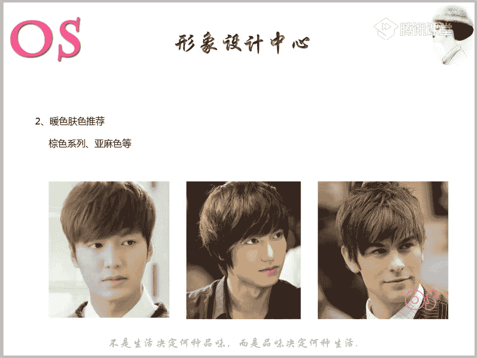

🎼这样的一个呃今天这样的一个课程中所跟大家分享的所有的一个内容啊。大家还有没有什么问题？对于今天这样的一堂课，包括我们大家都能不能区分自己的脸型和知道适合自己的一个发型啊，有都能不能区分和选择啊。

能的同学也知道发色选择，眼镜的选择的同学啊，还有包括我们发型的选择，也知道自己是什么样一个脸型的同学，快速跟老师刷一朵鲜花。如果说我们还有任何问题，现在就可以提出来。😊。

🎼真的好想你，不是假的假的好想你。🎼好像。🎼梦你。🎼而且像这样的一个眼睛的话啊，呃像这样的一个眼镜的话呢，合适的眼睛能够增加我们面部的这样的一个活力，以及呢能够去制造，塑造出更多的一个造型啊。

所以说如果能够清楚的分辨出自己的这样的一个发型、脸型以及眼镜的同学呢，快速的啊唉快速的去把自己能明白的这样的一个点打在公台上。比如说我能明白了，快速跟老师刷的鲜花。如果大家呢也不刷鲜花。

然后呢也不提问题的话，老师不知道你到底是弄懂了还是没弄懂，那么在课堂上有的问题呢，我们在课堂上就要快速的去解决。好，秋季肤色跟其他肤色怎么样去区分啊。这个是在我们呃顾问班中会跟大家去讲解的嗯。せに？

🎼因为内容很多，所以说老师不是说几句话就能够去描述出来啊，我们这样的一个秋季肤色啊，跟我们的春季啊，跟我们这样的一个夏季，跟我们的冬季啊，能够快速的去呃跟你去分享。好，我们的潇潇同学能够明白哦。

那么其他三位同学能不能明白？🎼小星星我们得去帮别。🎼主要是要明白自己啊，你们不一定说我每一个风，我每一个脸型我都知道判断了。如果像我们个人形象塑造班的，那么你就要明白的是你自己。

你自己能不能搞清楚你自己啊，像我们的卡卡同学能不能搞清楚啊，嗯大约可以好，大约可以就可以了啊。那我们来看到作业啊，因为作业的话呢，第一个是抄写我们的班训一次。第二个呢就是要实操啊。

因为我们这样的一个课程呢一定要去结合到实操。如果说你只是一味的在听课，一味的在做笔记。但是像这样的一些本身发型就是跟实操有关系的啊，跟实操有关系的。如果你不去做改变的话，等你所有的课上完之后。

你会发现老师我好像没有任何的变化，除了我的呃服装选的以后眼光稍微好了一点点以外，没有任何的变化。所以说呢现在你们就要做实操啊，要求大家呢打造一款适合自己的发型，包括有些头同学啊。

他的头发绝对是可以去呃做改变的。那么你现在。😡。

🎼就要找到理发师，对不对？明抽空去找到理发师啊，我们的我们女士的啊，我们这样的一个同学的话就不用了。我们高级班的同学，目前的话啊，你们不用做实操，要把笔记做好了就行了。

对于每个脸型的判断没有任何问题就可以了。🎼oh my god，简直是精通。😊，🎼但是我们顾呃我们个人班的同学啊，一定要像男士的话，一定要做实操，打打造一款自己适合的发型。

然后把自己的发型前和发型后的一个对比的照片呢上传到作业里面啊。当然只有老师和同学能看到，所以说不用去呃不好意思，或者说你们实在不好意思的话，也可以把这样的一个实操作业啊，实操作业单独的去发给老师。

这是打造一款适合自己的发型。因为你们已经了解的自己，对不对？也知道自己的这样一个脸型应该怎么样去改造发型，那么这个时候我们就可以呢找到理发师去进行沟通，你可以带着这样的一些图片去告诉他，你想要什么。哎。

你也可以把你自己的这样的一个优缺点呢，说出来，我要怎么样怎么样去改造，说的越明白呢越好。那么其实像你这样的一个认真的一个架室，专业的一个架势呢，你就会把他先镇住，他会很认真的去听。

这是第一个那那到时候呢你跟他表述完之后呢，你听他怎么样去说，哎，然后我们就开考核对他的考核就开始的检查这样。😊，🎼一个倾听沟通技术跟着眼点，以及这样的一个时尚度。

还有包括体贴等这样的一个指数达成一致的这样的一个方向。🎼那跟跟他呢找到一款你和他都认为的发型，所以说你要剪的时候，一定要跟他沟通，包括他也能够清楚的表述你要想要的这样一个效果。如果他有任何建议的话。

他也要清楚的表述出来之后，你能够听得明白，听懂达成一致之后，让他开始呢跟你去剪啊，找让他去实现。那这会儿呢我们也不要去偷懒。比如说睡觉啊，或者说呃就开始玩手机啊等等。这个时候我们要盯着他。

看他怎么样给你剪，看他怎么样去跟你做啊。然后这个时候呢，抓紧时间跟他去培养感情，一边看一边呢偷招。啊，比如说看到他再给你剪完之后，最后做定型，做造型的时候，你就要开始问他了。哎，我这头发以后怎么吹。

我自己我怎么去捏，我怎么样去定型做造型等等。看不懂的时候就要不耻下问啊，这个是一定要去做到的。那么如果剪失败了，也不用呃失就是很失望，或者说从此以后呢就对自己呢感觉到已经生无可恋了。那么我们可以呢。😡。

🎼等到留长之后，我们再找一个专专业的理发师，我们再去进行沟通去进行尝试。因为其实发型剪失败了，一点都不可怕啊，可怕的就是你自己呢不看去，不敢去尝试。因为像头发剪短了，剪差了，怎没关系，对不对？

我们可以去留长啊。嗯，我想问一下，在低头的时候感觉下巴的肉有点多，这个怎么样处理。😊，就很影响实操效果哟。😊，🎼呃，其实如果说感觉自己有双下巴的话，其实你可以经常去抬脖子啊，唉抬一下脖子，然后收一下。

抬一下脖子。其实它可以去运动到你这样的一个下巴部分的这样一个肌肉，让它会更加紧实。嗯，另外的话呢呃多去做一些这样的一些按摩啊，其实用手也好，用我们的刮痧板也好，其实可以跟自己的下巴进行这样的一个刮啊。

按摩，其实它也会有瘦的效果，就像我们拿刮痧板去刮脸一样的。其实你会发现你如果只刮一边脸，另外一点点不刮的话，它的效果的一个区别也是非常大的。啊，有一边的话，你会发现明显就瘦了很多。

所以说可以去拿刮痧板稍微的去刮一刮自己的下巴，另外的话多去做一些呃抬头低头的这样的一个运动啊，就。😊，🎼抬的老高了，把脖子抬的老高了，然后再收下来啊，再去抬再去高，就让他去运动啊，运动这一块肌肉。好。

老师，我的脸有很多油啊，这个怎么办？其实为什么有很多油呢？就是因为你的水油不平衡，为什么会长痘呢？就是因为哦你的毛孔一直是呈现这样的一个堵塞的状态。也就是说属于这样的一个闭口啊，闭口的一个痘痘。

所以说我们一定要做好清洁，清洁同时呢多去做好护肤的一个补水的效果，当水油平衡了之后，你的脸就不会那么油了。为什么会油？就是因为你的脸吹缺水很干，水油不平衡才长导致呢脸油的。😊，🎼感情。🎼好。

这是我们第二个就是说打造一款实操的发型。另外的话呢，第三个做好笔记啊，笔记很重要。如果说有一些看不懂的地方，及时可以看到笔记，对不对？而且怎么样去成为自己的一个发型师呢？第一个就要找到适合自己的发型。

自己了解了什么适合自己是很重要的。这样呢你才能像发型师清晰明确的表达你的想法，以确保你能够有一个非常满意的发型。第二个呢就是尽量选择一个固定的发型师呢，去跟你做造型。

因为找一个固定发型师的一个好处是什么呢？你可以逐渐的不断的和他沟通，以保证呢他能够完全的了解你的愿望和熟洗你的发质啊，如果说你找到一个剪的还不错的，其实你就可以让他固定下来。

第三个呢就是向你的发型师呢学习如何去打理你的常用发型啊，像他呃去打听一下，让他给你推荐一下比较好打理的一些工具啊，或者说产品呢。比如说哎这个梳子特别好。你可以问他在哪买的，买一把。

或者是说呢像他说哎你这个造型。😊，可以买个纸板夹夹一夹，效果会更好。那么你也可以。哎，听完他的这样一个推荐，就去买个纸板夹，哎，跟他学一学，每次找他去剪头发的时候，像男生头发又剪的又长得快，对不对？

就可以去偷湿这样的一个记忆了哦。😊，🎼那包括第四个呢，就是要知道自己的一些发质的一些保养方法。所以说像理发师一定是会比了比老师会更了解这样的一个发质的一个保养。那么其实像发质的保养。

你也可以多向理发师去取取精，就像老师自己每次去剪头发的时候，包括发型师也会给我提不错的一些建议。比如说头发太干枯的话呢，呃，要用什么样的一个精油啊，还是说用水啊等等的。

其实你都可以去啊去了解一下这样的一个发质的一些保养方法，脸要保养头发也同样要保养啊。🎼好，我都用了半个月了，这个还是没有改变，绝对像这样的一个护肤品啊。因为你之前一直都没有用过。

那么所以说它的如果说它的功效有这么快的话，那么证明它一定是含有一些非常不好的一些成分。所以说这样的一个调理过程呢，一定是需要时间的啊，慢慢的去啊做改变。另外的话像呃比如说脸很油的话。

我们的作息也要多规律一点。如果说你的作息不规律的话，像这样的一些水油不平衡，这样的一个问题也是非常常见的。另外的话肌肤的护理绝对不是一朝一夕就能够去促成的。我们要去多花时间啊，那么第一堂课的时候。

老师就要说到，对不对？保养非常的重要。那么另外的话呢偶尔去敷一敷面膜也是在补充水分啊，男士去敷敷面膜也是不错的。😊，🎼好，对于我们今天的知识点和作业啊，大家还有没有什么问题，有没有问题？好。

没有问题的话，我就等着下一堂课之前啊，要收大家作业的。另外的话呢，老师已经在群里面进了建了相册了。2017年1月份的第二节课。那么大家呢就把我们的作业呢，到时候哦。😊，标注好自己的一个网名呢提交上去。

🎼我们传到指定的相册啊，一定要传到指定的相册，不要再传到那个群相册了啊。🎼好呃，这个在哪些地方下载视频啊？哦，像我们关于护肤的，或者说关于这样的一些发型的视频，对吗？那么其实可以在网上去搜。

其实各大网站都有，包括这样的一些皮肤的护理的这样的一些知识。其实你搜一些关键词就可以了。🎼啊，比如说怎么样去嗯就是这个视频啊，就是我们这样的一个。🎼课程视频对吗？啊。

课程视频在我们的群公告里面有一个链接啊，大家直接点链接去下载就可以。🎼好，大家如果都没什么问题的话，我们就可以下课了。然后大家也早点休息。嗯，非常感谢大家一个聆听和陪伴。那么下一节课是我们星期三呃。

大家如果说有不能到课的同学要记得及时去请假啊，然后准时准点的上到课啊，不要再呃到时候老师。😊，🎼都到点了，然后还有一些同学后面才进来。🎼作业上面的问题啊，有任何问题呢，都及时找到老师啊。

有任何问题找到老师。然后另外的话，有些同学如果说还不了解自己的色彩进行和风格的话呢，也要及时找了找到老师啊。第一要填写资料，把资料填全了，会对于你的内心和你的职业有一个呃全面的一个了解。

另外的话呢呃再来呢我们提交符合老师要求这样一个照片。好，大家拜拜。

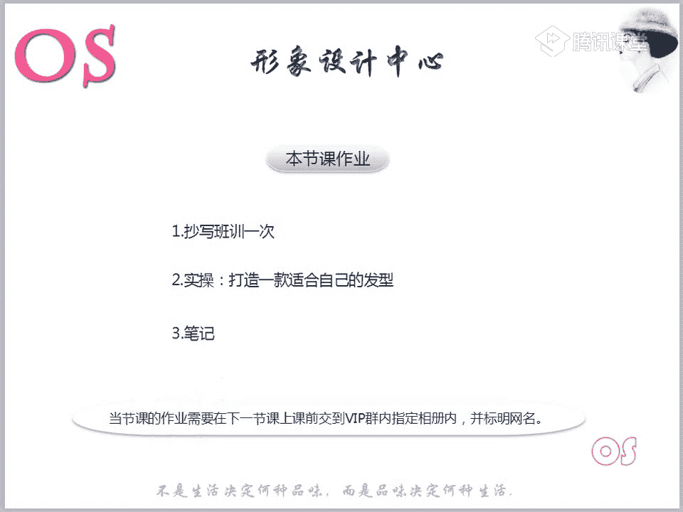