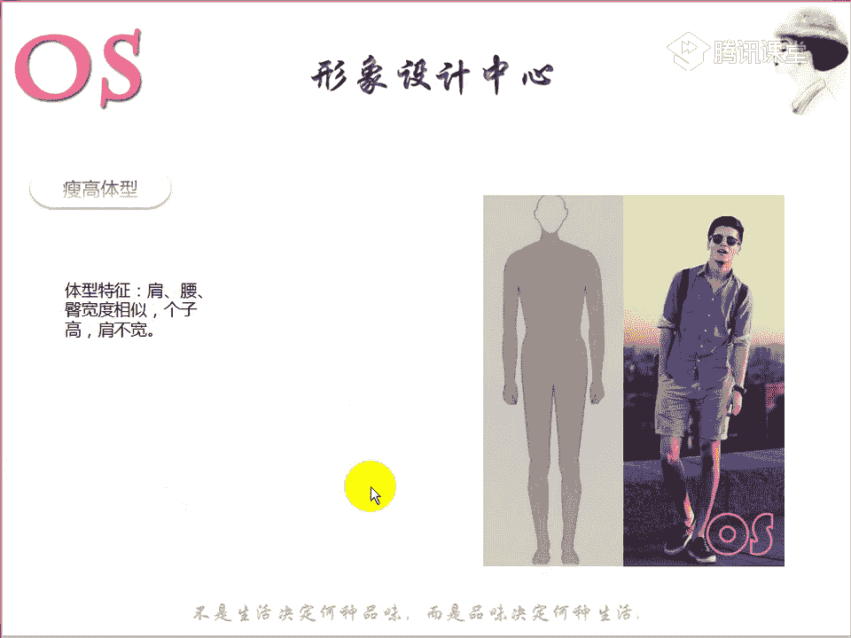
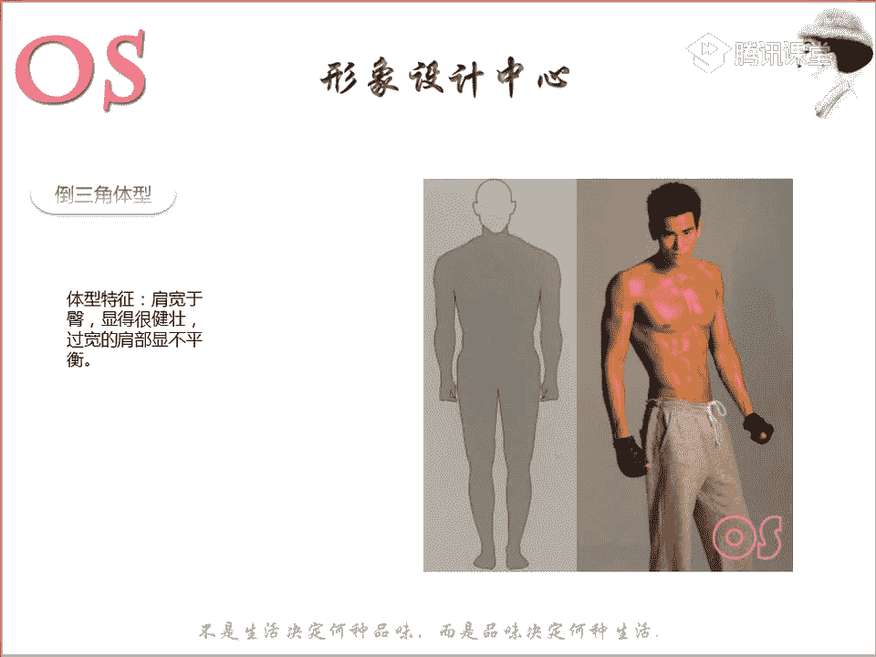
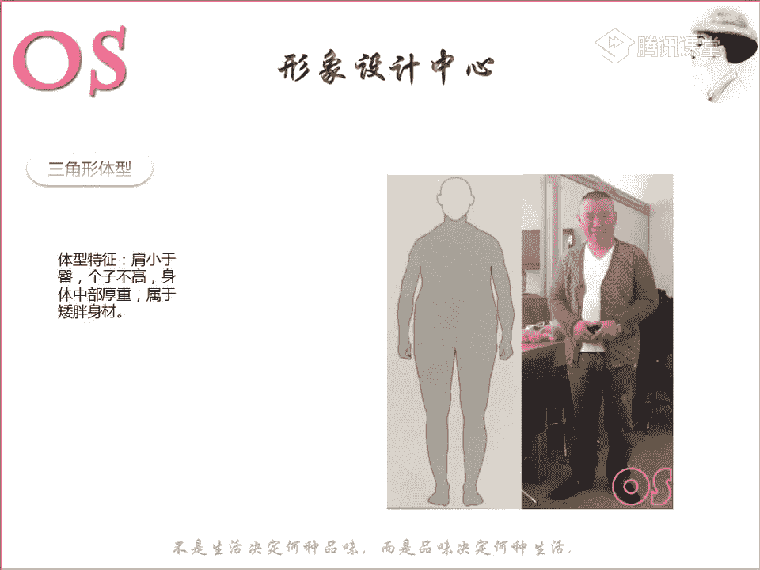
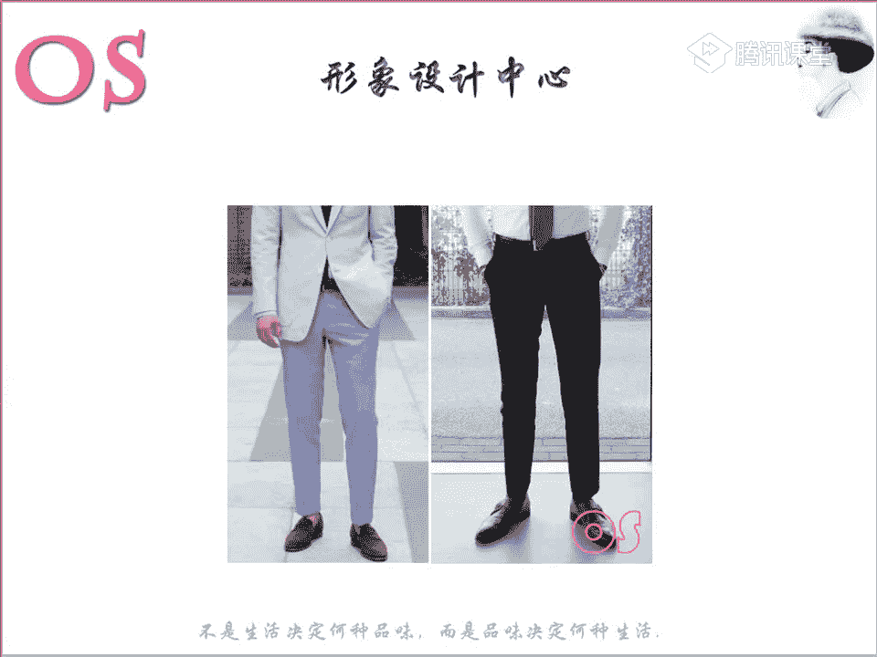
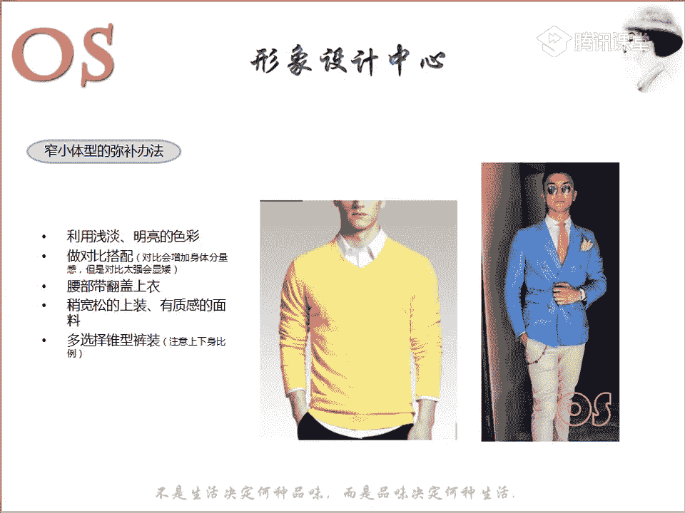
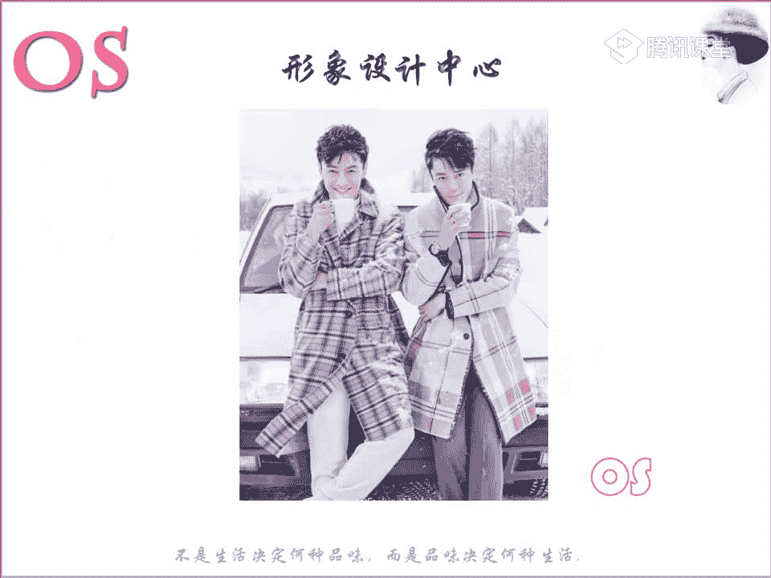
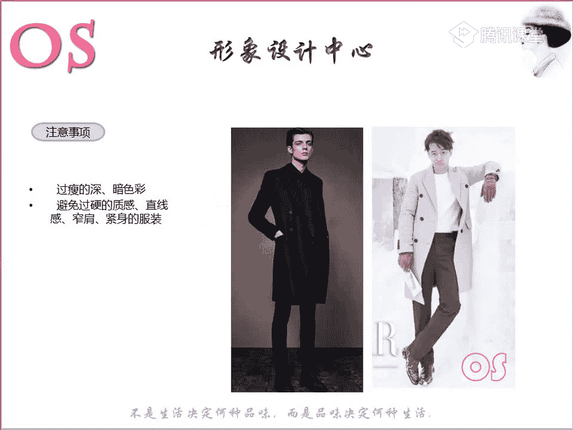
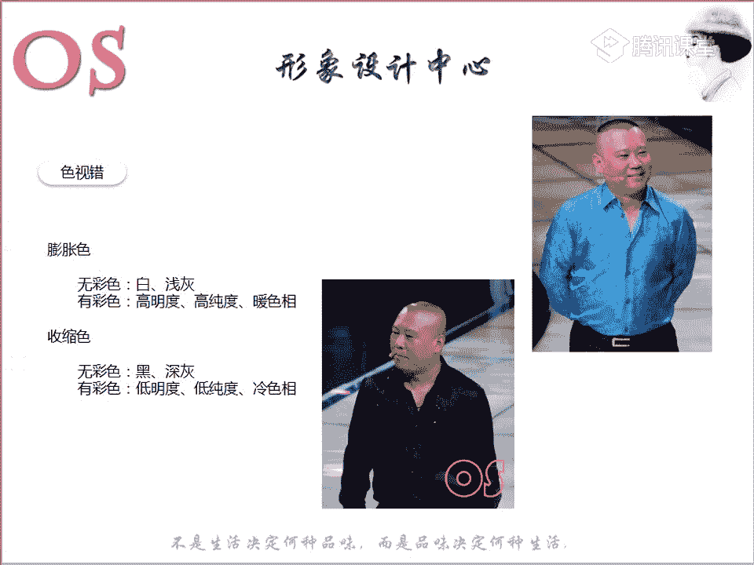
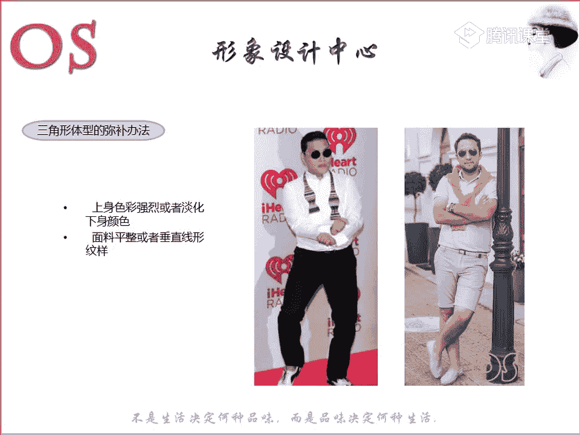

# 1、03OS男士形象VIP班《形象课》：第3节、体型修饰

欢迎大家来到我们OS男士班的VIP课程。我是本节课的主讲老师舒阳。那么本节课呢要跟大家分享知识呢，就是关于我们体型和服饰这样的一个搭配的规律。那么在讲到我们体型和服饰啊。

其实他们之间的关系也是非常非常重要的。因为对于一个体型呃基本和乎标准的男士来说呢，相信完全能够自如的去按照这样的一些规律来装扮自己，对不对？但是如果说我们的生活中标准体型的人，毕竟不是很多。

那么对于一些体型不那么标准的一些男士来说，我们则需要通过一些手段来进行这样的一个调整，使我们的体型呢接近标准的体型的一个视觉的一个感受。所以啊那么什么我们的男士又分为什么样的一些体型。

那么怎么样去判断自己是属于什么样一个体型，这是我们今天这堂课呢，第一个学习的重点。另外呢关于我们对于不同的一个体型怎么样去修饰。😊。

也是我们今天学习的第二个重点。也就是说要找到与你自己体型相匹配的这样的一些着装的技巧。第三个呢就是我们这样的一个服装的试错，让大家呢通过我们学习重点的第三个点，能够清楚的明白哎，我们服装的一些形色制。

怎么样去能够去对于我们的身材进行修饰。所以说试错啊，也就是说我们第二个服装与体型的一个配套的一个选择，是跟我们的试错，有直接的这样的一个关系的。所以说老师今天这堂课呢会首先跟大家来呃分析。

也就让大家能够找出自己的一个体型是属于什么样的体型。然后第二个部分呢，我们来讲一下试错。😊，讲完试错之后呢，我们具体问题呢具体来分析。所以说今天是这样的一个上课的流程了。那么本节课学习的一个要求呢。

就是希望大家能够通过这样的一节课，然后够熟知我们体型的一些特征分类，以及呢了解到我们自己的着装技巧，了解到我们男士啊整体的一个着装技巧。那么准备好的同学呢，可以跟老师在公台上刷的鲜花。

我们就来看看第一个学习重点。我们男士的体型分为几大类。😊，好，我们男我们在女士身材中啊也是分为五大体型，对不对？我们可以用字母去表示，但是呢男士跟我们女士还是有区别的。女男士虽然说也是分为五大体型。

那么我们是用啊这样的一些各个体型，比如说瘦高啊，或者说我们的梯型身材，也就是说我们这样的建筑，我们把女士的梯型身材呢称之为我们男士在男士里面呢称之为啊建硕型的啊，也就是说我们这样的一个倒三角。好。

那我们呢看看这样的哦，大体是分为呢五个体型。那么大我们在场的有两位男士，对不对？我们来看看自己呢是属于什么样的一个体型啊。那包括如果说今天没有到课的，然后在看录播的同学呢，也要注意啊。

根据这样的一个老师的一个分析，从这五大体型中找到你知自己所针对的这样的一个体型。然后呢这样的话我们在做改造的时候才会更加清晰。😊，第一个呢就是我们这样的一个倒三角的体型。

首先来说一说我们这样的一个标准的啊。因为如果说我们是一个标准的男士的体型的话，那么就是我们的倒三角的体型。包括很多男士在健身的时候，你会发现哎随着你健身的时间的一个推移啊。

你会发现你的身材逐渐往这样的一个倒三角的一个形式在走，对不对？其实这样的一个体型对于男士来说是非常标准的。而且呢你也会发现很多服装的一些设计，它也是会呃有一点点呈现这样的一个倒三角的一个体型。

所以说穿起来会非常的显得我们男性非常有这样的一个呃宽广度啊，所以说能够去支撑，所以说非常爷们的一个体型啊。所以说这样的一个体型的话，它的特征是什么样一个特征呢？第一个就是肩一定是要宽于臀的。

但是没有说具体的这样的一个数值啊，就是哎我们的肩要比我们的臀要宽多少啊，就是属于什么样一个体型。那么男士里面它是没有这样的一个具体的一个体型的。我们要通过唉老师所展现的这样的一个。😊。

图片以及呢我们的去参考一下，类似于我们的彭于晏，它其实就是一个典型的倒三角。你会发现胸肌也好，包括他的一个肩围也好啊，整个的这样的一个肩肩膀肩膀附近的这样一个肌肉啊，所以说是呈现这样的一个健壮型的。

那么过于宽的肩膀呢，当然也会显得跟他的胯部有一点失衡。也就是说这样的一个健壮型的啊，一个倒三角体型的话呢，上半身和下半身啊在对比上你会发现有那么一点点失衡。但是他的肩膀的一个宽广度啊。

一个感感觉非常的可靠啊，所以说他是属于肌肉型的啊，有一些健筑健壮感的。嗯，这个的话你可以根据我们这样的一个男士啊穿一些呢稍微贴身的一些服装，就可能就可以去看出呢他的一个肩膀的一个厚度，对不对？呃。

也就是说呃身体的这样的一个厚度，肩膀的这样一个宽度。😊，肩是一定要宽于臀的。如果说我们有些同学也可以去呃拿尺子去适当的去进行测量啊，你可以是拿尺子适当的去进进行测量。如果说这样的一个纤哦。

如果说我们在视觉上看这样的一个男士啊，他的一个胸肌也好啊，整个的一个肩膀，包括肌肉的一个线条都还不错的话。然后呢他的一个肩膀又宽于我们这样一个臀围的话，那么他其实肯定就是我们这样一个健壮型的。

对于健壮型这样的一个体型，我相信大家都不会陌生。所以说呃老师在这里呢也不多于说，所以这样的一个这样的一个体型是非常非常好判断的。一般喜欢健身的一些男士，而身材还不错的话。

大部分都是出趋向于这样的一个体型。好，我们同学对于这样一个倒三角体型啊，有没有什么疑问，有没有疑问？如果没疑问的话呢，我们就接着看下一个体型。😡，如果对于倒三角体型啊，还有疑问的。

或者说哎在纠结自己是不是属于倒三角体型的同学啊，也可以呢在公台上提出来。如果说你站在镜子面前啊，你的一个身材的一个走向是趋向于唉老师的这样一个阴影图的这样一个走向的话，那你就不用去怀疑自己了。

因为你又有胸肌，对不对？然后呢，你的肩膀又比较宽广。然后呢，你的身体的厚度也还不错，而不是说属于唉包括你的腹部的这样的一些肌肉走向，以及我们的臀部等等的啊，整个的一个线条都是呈现这样的一个健壮型的啊。

是健康的这样的一个壮实，而不是说属于。偏胖的这样的一个啊，一定是要注意啊，这是有区别的。因为接下来还会讲到类似于这样的其他的一些身材。好，第二个呢就是我们这样的一个窄小体型啊。那我们拿明星来举例子。

就像我们的何炅，它就是属于这样一个窄小体型。那当然还有比如说像沈林啊，应该大家也不陌生，对不对？他也是属于我们这样一个窄小体型。那么当然窄小体型呢非常好理解。第一个特点，就是他个子不高啊。

可能一般的话男士的一个个子，比如说呃1米6多的也有，或者说1。75米以下的啊，这样的一些身材的话都其实偏向于窄呃，偏向于个子不高，对不对？那么这是一个男士的一个标准。第一个他一定会站，就是个子不太高。

第二个呢就是属于什么呢？肩有点窄啊，肩有点很窄，就很单薄，可以看出来啊，显得很单薄，对不对？那么还有一个特点呢，就是啊如果我们用尺子去测量的话，你会发现呢他的肩围以及呢他的腰围，还有包括呢它的臀围它的。

😊，宽度啊，也就是说它的这样一个范围的一个宽度其实有一点点相似。也就是说差距不大，没什么差距。嗯，包括我们可以通过这样张图片，你也会发现它不像它这它跟我们的这样的一个健状型还是有很大的一个区别的啊。

跟我们这样一个健状型是有很大一个区别的。这个呢就是属于我们这样的一个啊窄小体型啊，这个是属于我们这样的一个窄小体型。那对于窄小体型啊，我们同学也可以自行的去做一个判断。那包括举的一个例子就是我们的何炅。

对不对啊？典型的我们这样一个瘦小的。当然他们在穿衣服上呢，到时候我们关于一些弥补的方法呢，等我们讲完试错之后，会跟大家具体的去分析。那么首先我们快速的过一下，我们这样的一个各个体型。

那么到时候大家通过老师这样的一个分析呢，去总结一下自己啊，是属于什么样的一个体型。好，第三个呢就是我们这样的一个瘦高体型啊，你会发现非常的个子非常的高。嗯，个子很高。

但是呢它跟我们的窄小体型有一个相似的点，就是它可能最大的一个相似就是啊最大的一个区别是什么呢？就是个瘦高体型的，是属于个子高的，但是它还是属于呢比较偏瘦的，比如说肩部宽哦，腰啊哦，还有包括它的。😊。

臀围呀，还有包括他们的肩围的宽度也是相似的。只是说它跟他最大一个区别就是他个子比较小，而他呢个子比较高。但是他个子瘦高体型跟我们的一个倒三角体型也有很大一个区别。不用老师多说了，对不对？

我们看到这样的一个阴影图，就可以直直面的观察出来。它是没有这样的一个非常厚度的这样一个肩膀以及这样一个宽度的肩膀啊，包括我们的身体的这样一个厚度啊。

这个是我们一一般到了一定的年纪的话，一些男性呢会经常会。见到的啊这样的一个体型就是我们的肥胖体型啊。那么一般这样的一个肥胖体型呢呃相对来说是大部分一些偏胖人士啊，就是胖，就是完全是属于胖子啊。

可以就是说用用胖子来形容啊，那么他们都是属于这样一个肥胖体型，体型的一个特征就是肩围腰围臀围都很圆润啊，都非常的圆润，如我们这样一个真人图啊，真人模特所展示的，而且呢身体的一个厚重也是非常厚的。

整体的话非常的敦实，有重量感啊，非常的敦实，有重量感。这个是属于我们这样的一个肥胖体型。当然这样一个肥胖体型的话，有可能有的是属于个子很高的啊，肥胖体型。同样呢也有属于呢啊我们这样一个胖子啊。

就说胖子大家可能会更理解。因为一会还要说到我们另外的一个偏胖体型的。那么像这样一个胖子也有比较矮的，不管是高矮的话呢，只要它具备这样的一个特点，就是肩腰臀比较圆润，整体。身材的一个重量感。

分量感非常的厚重，敦实的话哦，那么我们就可以把它归划归到我们的一个肥胖体型中。那么说到肥胖体型的话，还有因为老师说了最后一个体型就是我们的三角形体型，对不对？

三角形体型和我们的肥胖体型是有非常大的一个区别的。第一个它的区别是什么呢？就是在个子上面，它不像我们这样的一个。肥胖体型可能有的个子矮，有的个子高，而他呢取区别啊，最大一个区别就是属于个子都不是很高。

然后第二个呢，就是它没有我们肥胖体型显得那么的真敦实啊。大家包括你看我们郭德纲，他就其实属于我们这样的个三角形的一个体型。然后呢再来看看我们这样的一个肥胖体型，也就是说他们之间的一个敦实感。

大家能不能去理解啊，就是没有我们肥胖的体型那么的敦实厚重，能理解的同学跟老师扣个一。😊，就是郭德纲啊去做对比，我就我就举他这样的一个例子啊，举他这样的一个例子。

因为其实郭德纲的话要是再稍微稍微再往肩膀再小一点的话是最好的。因为但是去找一些明星的例子的话，啊，很难找啊，像这样一个三角形的一个体型啊，大家都能够理解，就是没有那么的敦实啊，有那种重量感啊。

这是第一个，但是他还是有一个特点呢，属于我们的身体的中部呢比较的厚重啊，也就是说呈现这样一个矮胖的身材，而且呢肩围呢啊小于我们的臀围。那包括这个时候大家就可以呢作为啊顾问的也好，或者说做我们个人的好。

也可以呢让家人去帮助你啊进行测量一下，看看你如果说是属于这样一个稍微有一点点啊个子不高，然后呢稍微有一点偏胖的那我们就可以测量一下你的肩围和你的臀围。如果说你的肩围小于你的臀围的话。

那么你就可以往这样的一个三角形的体型呢中去做改造啊。那么这个呢就是我们。五大体型，我们在场的男士啊嗯。对，男士的话1。75米算不高的啊，1。75米就算不高的。所以说男士其实身高最好是要有个1。

75米以上往上面去走。那么我们在场的同学啊，呃男士班的同学能不能就清楚的了解自己是属于什么样的一个体型啊，就包括我们的飞龙在天，还有包括在山的那边海的那边。刚刚刚老师呢分析了这样的5个体型，对不对？

你们清楚了你们自己是属于什么样的体型吗？啊，可以把你清楚的你的体型呢，打在公台上啊，我们是属于什么样一个体型啊。

如果说有不清楚的同学啊，不清楚的同学没关系啊。可以呢把照片传上来也可以。那我们现场就可以帮大家去解决啊。好，第二个和第五个的结合啊，也就是说其实你可能是属于呃当然老师这张照片哦。

拿我们的郭德纲举例子可能会有一点点夸张啊。我们有的同学可能他是属于他不是很瘦，但是他也没有碰到类似于这样的一个程度，对不对？啊？那我们其实就属于呢个子不是很高，但是我们可能居中的这样的一个状况。

那么其实老师建议你呢可以往我们窄小体型啊，也就是说往窄小体型去结合去结合他的这样的一个修饰方法去做改造。因为飞龙飞龙在天的话，老师也比较了解你哦，你往这样的一个方向去改造，会更适合你。😊。

好，限制了啊，稍等。好，可以了。😊，如果大家不确定的，像第五个体型的话，其实是可以包括我们每个体型都可以稍微去拿卷尺啊，我们进行稍微的这样的一个测量。好，肩跟臀差不多，但是人稍稍有一点点显胖啊。

稍稍稍有一点显胖，是不是？那到时候我们呃可以根据啊，你那你就把我们的。窄小体型和我们这样的一个。三角形的一个体型去结合。因为老师感觉你其实还好，也不是属于胖啊，其实就正常男生这样的一个标准还是可以的。

主要是衣服啊，因为到时候我们可以从面料上去下手。嗯。个子不高哦，肥胖体型啊，那就属于我们这样一个三角形的一个体型，对不对？啊，那到时候修饰的时候呢，我们就按照三角形的体型修饰。

那么体型呢大家都没什么问题了。我说了啊，今天第二个部分呢来说说我们的试错。因为接下来呢老师在说弥补方法的时候啊，其实呢都是在结合我们的一些试错来跟大家分析的。😊，为什么会这么说呢？

因为哦我们要知道服装是用来粉饰自己身材的，对不对？主要就是利用这样的一个措施的一个原理呢，每个人的眼睛其实都像一个呃照相机一样非常的客观。如果说你的身材不好啊，你还不去通过这样的一个服饰呢。

把它引导向好的方向去发展的话，眼睛啊就是对方的眼睛呢就会老老实实的通过大脑的一个中区神经告诉看到的人，哎，你是一个身材不好的人。那而如果说我们通过这样的一个服装调整视觉捕捉到这样的一个身材的话。

把把我们这样的一个身材像呃比较完美的这样一个状况去打造的话，那么我们的视觉就会去看错。也就是说可能胖的会看成了唉稍微还好，只是有一点点偏胖。那么瘦的呢可能会看成的是一个标准的这样一个体型。

所以说这个服装呢对于我们的身材的一个修饰，是哦至观的重要。那么接下来呢我们来看到。😊。

就是我们要理解这样的一个试错的原理。所以说生活中呢许许多多的一些奇迹的现象啊，不同的服装呢穿在不同的一个人身上会有很大的一个差异。那么有的服装会使人显得很胖，对不对？或者说有的服装会显得人瘦。

但有的人服装呢你会发现显得你很高，有的服装会显得有点矮。那有的人则会使得我们的脸呢显得白啊，有些颜色，有些颜颜色呢会使得人显得有点黄。其实这个都是因为我们的视觉啊在搞鬼。

那么视觉呢能够让形与色发生这样的一个变化啊，若能够正确巧妙的去使用的话呢，可以起到纠正的作用，来弥补我们的缺陷，包括我们的一些生化的一些现象，所以说掌握我们的视觉是错觉的这样的一个原理。

对于我们服装的整体的一个形象设计来说呢，有着非常重要的一个指导作用。那么接下来老师所讲的这样的一个试错的话，大家要一定要记住啊，一定要记住。也就是说你要知道你想要打造什么样一个效果。

你就一定要运用到刚才我接下来我所说到这样一个试错，这样的一个试错。😊，做一个知识点呢在脑子里一定要有一个很清晰的概念，一定要去加深。因为你在以后买服装的时候，你不仅仅要考虑到你的形色制。

你的你的就是你的色彩进行你的风格。那么像你想要达到什么样的效果，就像我们的身材，对不对？对于服装来说，它也是有形色制的一个要求的。所以说我们要把这两者啊三者，甚至是结合在自身身上一起去运用。

啊，那我们来看到呢，首先跟大家简单来说一下我们的图案关系与试错啊。那么包括呢大家也可以看到这样的啊一张图片，A和B对不对？两条线啊，你们觉得哪一条线会显得更长一点？A和B啊？这两条线。

你们觉得哪条线会显得更长？或者说有不同的看法也可以啊。哎呦老师我觉得这两条线差不多，嗯，也可以。😊，好，大家都会说A对不对？嗯，都会说A其实两条线的一个长度是一样的啊，老师要告诉你们两条线。

也就是说A和B的长度其实是一样的。只是因为呢一条是横向啊发展的，一条是纵向发展的。所以说在视觉上我们就会造成啊不一样的这样一个感受。那么其实就是这样的啊，这样的一个线条，那么在服装里面呢。

我们有服装的图案，对不对？很多同学可能会比较喜欢一些啊图案的啊，不管是卡通的也好，还是说啊花卉的也好。那么呢服装图案选择上呢，整体的效果。如果说越是表现的是纵向感的，就会呢哦越是表向横向感的话呢。

就会越显胖，所以说很多同学非常的排斥横条纹，那么其实你们排斥横条纹一定是发现过横条纹有点显胖，对不对？所以说呢哦越横向发展的确实是越会显胖，包括我们有时候穿衣服也是一样的。如果说这样的一件衣服啊。

它的设计感都是往横向去走。😊，不管是图案也好，还是说这样的一些装饰细节。比如说一些其他的一些设计感，像我们女士的，有一些比如说呃蓬蓬裙，蓬蓬裙它的一个设计不就是往横向去发展的，对不对？都会有点显胖啊。

就是这样的一个原理。那么男士也是要多注意，像这样的一些横向发展的一些服装的话，其实我们尽量去少去穿着。😊，那么包括图案呢，像这样一个横向发展的一些图案，也尽量少穿。

如果说我们本身就是一个呃腹部啊比较偏胖的，那么我们在腹部附近呢就不要去出现一些横向的图案啊，或者说很简单来说就是横条纹，不要出现在你的腹部。那么如果说有些同学哎我的肩有点窄。

就像我们刚才所说的这样的一个三角形的体型，对不对？它的肩比较窄。那么我们是不是在肩部附近就可以出现一些横向发展的。比如说条纹呢，当然就可以了。所以说你要知道你的身材缺什么了。

这个时候我们在每不同的部位去放什么，才能够达到这样的一个完美的一个视错啊，那么这个就是我们的一个横条纹呃，一个横向感的，不是完全指横条纹啊，因为为什么呢？大家可以看到这里。ABC3张图片对不对？

你会发现这三张图片有一张会在对比其他张来说呢，它会显得非常的瘦，非常的长。也就是说偏窄偏长，有没有发现发现有没有发现是哪一张？可以离的屏幕稍微远一点啊，离的屏幕稍微远一点。

然后呢一起把三张图片放到眼里去观察。对，就是我们这样的一个第三张图片。C对不对？所以说也也要知道有些事情绝对不是绝对的，就像我们的横条纹的图案里面呢，像我们这样一个横条纹，它呢虽然说也是横向发展的。

但是因为呢它的图案比较密集，所以说呢在视觉上呢会有显高的效果。那么如果说我们作为一些呃偏胖体型的男士你要选择图案的话，你喜欢横条纹，对不对？我想选择横条纹的针织衫也好。

还是说想选择横条纹的这样的个T恤也好，那我就尽量去选择密集的横条纹来进行了修饰，比我们这样的一个粗的啊，像我们类似于这一身的粗的横条纹效果要好的很多。那么也就是这样一个道理啊。

所以说竖条纹不是说所有的线条哦往纵向所有的图案，如果说。😊，往纵向去发展的话，它当然视觉上一定会有显瘦的一个效果。但是呢竖条纹它会除外，因为竖条纹它一定是有它的一个前提条件的。当我们的竖条纹密集的时候。

你就会发现它在视觉上会显胖。所以说各位男士啊，尤其是一些瘦的同学，你要想选择竖条纹，或者说你以前是不敢选的。我现在想要选择。那我们就去选择密集型的竖条纹，绝对呢会有这样的一个修饰作用。

会把你的身材呢往横向去发展。那这是我们的关于横竖条纹啊，要知道的一个原理原则。也就是说当我们的竖条纹密集的时候呢，它在视觉上会显胖，会显矮。当它不密集的时候呢，在视觉上会显瘦啊，会显得高。

那如果说我们的横条纹在密集的时候呢，它会显瘦啊，会显长。那如果说当它不密集的时候呢，当然就会显得有点矮啊，会显得有点呢胖。这个就是我们的图案啊，横竖条纹的图案，那么呢在这里呢跟大家提一下我们的斜条纹。

斜条纹呢不管它是粗也好，还是说细也好，其实它都是非常保险的啊，它不会说会像我们的竖条纹和横条纹受到宽窄的一个影响哦，发生这样的一个试错。也就是说如果你喜欢条纹，但是你又很纠结的时候。

如果你碰到了一个竖条纹啊，斜条纹的话，你就不用去纠结什么了。不管是粗的也好，还是说。记的也好，都还是相对来说比较呃安全的，没有不会受到我们的一个试错的一个影响啊。关于老师刚才所说的这样的一个横竖啊。

以及我们的协调文理解的同学呢跟老师扣个一。有没有哪个知识没听清楚，还要老师重复的。啊，那当然我们的生活中啊，除了我们这样的一个横条纹竖条纹和斜条纹以外呢，还有其他的图案，对不对？

其他图案呢老师跟大家归类归类一下，就是这样的一句话，就是当我们的图案越视觉效果会越膨胀，图案越少效果呢会越显收缩。也就是说我们要去选择图案，其他图案的时候呢，建议你们在选择图案上。

第一呢色彩呢不要太过于丰富。因为色彩太多太丰富的话，它在视觉上一定会显得很膨胀啊，这样的一个图案的话，比如说像我们有一些卡通人物啊，色彩非常非常多。那么它一定会显得有一个膨胀感。

如果我们把它出现在身体的中部的话，在视觉上一定是会有影响的。所以说我们尽量呢去选择一些呃排列比较呃简单的呃图案非常的简单啊，色彩也少，呃，图案之间的关系也少啊，图案也少。另外的话呢而且它的一个排列啊。

它是没有规则度的啊，就不会像。😊，我们有一些呃波点的一些衬衫，你会发现像这样的一些圆巴巴的波点的这样一个衬衫啊，在我们的整身中啊非常规矩的排列在一起。像这样一个波点图案的话，在视觉上一定会显得有点胖。

不妨呢我们去选择一些抽象图案。比如说哎我这件衣服左边呢有一只兔子，然后呢右下角啊有一只兔子。那么你会发现这样的一件衣服的话，它其实图案非常的简单，对不对？也很少，而且它的排列也没有这样的一个规则度。

那么这个时候这样的一个衣服的图案就一定是安全的，它不会说给我们的试错呢造呃视觉呢造成造成一些错觉。哎，会把你本来不胖的啊，看成胖，或者说本来把你呢。😊，矮的呢看成哦这样的呃，本来高的看成矮。

所以说呢大家要知道图案之间，如果你选择的是一些非常复杂的，然后它的排列又非常规矩的。就像我们有一些呃男士的一些服装，你会发现特别花哨啊，特别花哨，就像类似于这样的，大家看到没有？😊，特别特别规则啊。

然后呢又非常呃特别特别复杂，应该说这个是非常非常的复杂，对不对？这样的一个图案关系就是很复杂。那么一定在视觉上就会显得有点显胖。那如果说我们一定要穿一些带图案的话呢，我们就尽量去选择一些。😊。

简单的图案啊，选择一些简单的图案啊，选择一些不规则的图案。这个呢就是我们给大家总结一下其他的一个图案啊。对于第三个知识有没有问题？😊，还需不需要老师呢要举例子去说明哦。没有问题的话，老师就接着说了。😡。

好，下一个呢就是我们的服装的廓形和试作，廓形非常的重要。那我们看到这样的一个嗯潮人啊，算是我们这样的一个时街拍的一个时尚的博主啊，非常的厉害。那么这是同一个人。

大家会发现是不是两套衣服给他的一个身高会造成一些影响，给他的一个体重也会造成影响，有没有这样一个感受。嗯，感受出来同学跟老师刷个刷朵鲜花啊。就是你会发现其实左边要比右边显得要消瘦很多。

而且要显得呃人也要显得要高一点嗯。😊，是不是这样的一个道理啊？所以说这个就是我们的服装的一个廓形，廓形对于我们男士来说也是非常重要的。而且服装廓形如果说这样的一个廓形，当它越流畅啊。

而且它的这样的一个呃垂感度啊，垂直度就是流畅的一个垂直度越好的话呢，视觉效果就会越显瘦，会显高。那如果说我们去选择一些廓形，外放的一些廓形。包括你大家会发现你像这件衣服，第一呢它的流畅度不高，对不对？

也就是它的衣服面料这样的一个垂直度其实是比较弱的那另外呢你会发现它的衣服也是整个廓形有点往外放的，会有很多的一些设计啊，比如说兜啊，或者是说哎我们整个的这样的一些呃裤子啊也很和上衣这样的一些兜部啊。

包括它的一个外轮廓都是有一点点偏外放的。所以说你就会在视觉上会发现唉感觉上有一点点显矮显胖啊。尤其我们也可以忽略掉裤子啊，有可能有同学会说到它的裤子是属于一个嗯。😊，当比较高，对不对？可能会显矮。

当然也有这样一个可能。但是如果我们去看上半身也能够清楚的感受到啊，它其实上半身要比我们左图中要显得要。呃，壮实了很多，对不对？嗯，壮实了很多。所以说哦我们要想去显瘦的话呢，注意到这样的一个廓形。嗯。

包括呢这样的一个廓形不仅仅是对于我们一些胖的同学有很好的一个效果。那么像一些瘦的同学也是非常非常重要的。就像我们有些同学比较矮，对不对？那么这样的一个服装廓形的话，我们也要多去注意。

所以说大家记住这两句话，服装廓形呢越外放，视觉效果呢就会越显胖显矮。服装效廓形，它如果说越流畅，越垂直的话呢，视觉效果就会越显瘦显高。所以说这样的一个廓形。

也就是说我们要去看这样的一个服装的外轮廓它是否是流畅的，它是否是垂感，非常垂直的。这个廓形的概念啊有没有不明白什么是廓形的，应该大家都能够清楚啊，就是我们这样一个服装的外轮廓，不管是裤子也好。

还是说这样的一件T恤也好，还是说我们这样的一件呃外套也好，这样的一个外套，它的外轮廓是很垂直的。记住这两个关键词，也就是说这样的一件服装你能够从服装拿到手之后，你就能够从服装上看到流畅。

看到垂直这两个关键词。那么它就是属于呢我们这样的一个呃廓形不错的廓形啊，能够达到显瘦显高的廓形。那如果说这样的一件衣服拿到手里，你会发现哎稍微有点点。😊，嗯，往往左右去张，对不对？然后呢。

也没有说太垂直，感觉有点嗯。不是特别的一个流畅啊，整个的一个剪裁不是很流畅，有一些设计感啊或者是怎么样的啊。那么像这样的一个服装廓型呢，它就是属于我们的一些外放的。就像我们有一些呃大衣。

你会发现它是剪裁啊，非常的立体的，对不对？像我们的一些西装，它的一个廓形就是非常流畅垂直的。而像我们有一些夹克类的，比如说我们的飞行员夹克啊，或者说哎我们有的一些夹克，比如说嗯。😊。

今年非常流行的这样的一些溜肩的，对不对？没有明显肩线的。而且呢在我们的身体中部，也就是说胸部附近还有很宽松的这样的一些廓形的话，它其实就是属于我们这样一个外放的廓形啊，不一定说这样的一个廓形有多长。

它可能也是短的。但是它整个的一个呃服装的话是往横向去发展的，而不是说去往纵向发展的。那么这个都是属于我们这样一个外放的廓形。好，这个服装的廓形和试错，大家还有没有什么要问的？嗯，没有问的话呢。

我们就接着来看看下一个。下一个呢就是来讲一下我们的这样的一个色彩的试错。大家要记住。那么我相信现在很多同学都能够在已经上我们男士班的啊，能够都能够清楚的分清楚明度和纯度啊，还有包括我们这样的一个色彩啊。

这样一个色相，能够分清楚同学跟老师刷的鲜画，还有没有什么不明白的哦，不明白纯度和明度这样一个概念的同学有没有。😊，能都能够明白的，就跟老师刷的鲜花哦。还有不明白的同学的话，老师就。😡，要告诉你们。

赶紧呢把我们这样的一个呃美色彩美学班的这样的一个知识啊，一定要去回顾啊。打好基础啊，因为纯度和明度在我们往后的课程中都会去涉及到。那么这个呢老师就不跟大家多说了，因为这就是一个呃非常直白的东西。

你既然能够分清楚呢纯度和明度，你也知道什么是五彩有彩色，什么是五彩色，对不对？所以说这样的一个概念，大家记住就好了。五彩色里面呢，像我们的白色浅灰色，它绝对是有膨胀效果的，它会在视觉上呢显胖啊。

当然啊色彩上会让让我们的视觉会有这样的一个试错。那么当然我们也不要盲目的去觉得啊，像我们的五彩色里面的黑色和我们的深灰色呢，它就一定是保险的。哎，如果说我今天选择黑色啊，选择我们这样的一个服装的话。

我不管呢怎么样去穿，我都一定是显瘦的。大家要知道啊，我们的形色质缺一不可。如果说你穿对了颜色，你的材质和你的服装的款式，也就是说服装的轮廓选错的话呢，它其实对你没有太大的帮助效果。反而会显得你有点。

重啊，可能他不一定把你显得有多胖，他可能会觉得让人感觉你可能你本身只有120斤。可能你穿上这样的一个穿错了材质，穿错了服装款式。然后虽然说色彩穿对了，但是也会让我们在视觉上会觉得你呢啊像1个130的。

就是说它会把你的体重会加重。所以色彩当然非常重要，能够显瘦和显呃显胖，对不对？但是也要结合老师刚才所说的这样的轮廓，以及呢接下来要说的这样的一个服装的材质。😊。

那么这个就是我们的五彩色和呃里面呢显瘦的和显胖的啊，也就是说膨胀色就一定会显胖啊，收缩色一定会显瘦。那么在油彩色里面呢，高纯高明度的高纯度的，以及呢这样的一个暖色相，它都是会有膨胀效果的。

反而呢像我们一些低明度的低纯度的冷色相这样的一些色彩的话呢，它是会有显瘦效果的。所以说有些同学如果说唉你会发现好像高纯度的颜色都是一些鲜艳的颜色，对不对？而反而一些低纯度的低明度的颜不够鲜艳。

但是我又想穿鲜艳的颜色的话，我们就可以去选择适当的去选择一些冷色相里面鲜艳的。嗯，那如果说我本身又不适合呃穿一些这样的大面积的暖色相的话，呃，或者说高纯度的话。

我们有又但是又需要这样的一些油彩色里面的一个膨胀色来帮助我们视觉上显高，我们也可以小面积的出现在自己身上。所以说。😊，要懂得灵活的去运用啊，控制好面积就行了。但是这样的一个膨胀和收缩色原理原则啊。

什么样的一个范围内是显胖的，什么样一个范围是显瘦的。大家一定要记住，就像我们的郭德纲，你会发现同样的都是我们这样一个重磅真丝材质的这样一个衬衫，对不对？视觉上其实会有很大一个对表。

高纯度的和我们的这样的一个呃五彩色里面的一个收缩色。😊，其实它的一个形色质选的特别的好啊，形色制其实都可以达到显瘦。所以说你会发现，即使穿这一件呃，相对来说呢色彩鲜艳度高一点的。

也不会说跟我们的黑色会有太大的一个对比。但是如果我们仔细去看腹部的话啊，也就是说你身体的这一块面积的话，大家还是可以能够去看出来的，对不对？嗯，包括我们的这样的一个肩膀附近的这样一个厚重感啊。

都是能够去看出来的。所以说你会发现黑色要嗯适当的比我们这样的一个蓝色的衬衫啊，要显得好像要瘦那么一点点，对不对？所以说一定在我们这样一个试错上利用好色彩也是有至关重要的。

那么接下来呢就看到我们这样的一个质啊，也就是我们的材质。😊，材质呢老师呢举了几个反面的例子给大家看啊，也就是说这样的一个膨胀的，膨胀的举了两个反面例子，膨胀的一个材质有什么呢？

我不是说一定要去具体到一些什么材质啊，你就像棉质的棉质的一个T恤，对不对？其实像棉质T恤的话，它的一个织法的不同，所以说它会显瘦或者说显胖也是不一样的。就像我们男士会经常所穿的这样的一个polo衫。

我们男士会经常所穿的这样一个圆领的T恤，像圆领的T恤，大家会发现它有一个特性是什么，就是它的材质啊非常的柔软啊，老师看看老师这里有没有这样一个圆领T恤啊。😊，好像没有这样一个原理哦，有。大家看到这里。

圆领的T恤，它其实它的材质相对来说要柔软很多，而且它会更贴合我们的身材，对不对？而我们的polo衫大家可以看到我们这样的一个polo衫哦，你会发现polo衫也是纯棉的。而我们的圆领的棉质T恤也是纯棉的。

而这一件polo衫，你会发现从它的质地上看，你就会有跟我们的圆领T恤做对比，你会发现它要好像显得啊硬挺了很多啊，大家有没有这样的一个感受啊。啊大家也可以呢，我把这两张图片放到一起去做对比。大家去看一下。

😊，能不能感受到同样都是纯棉材质的，但是一个是相对来说要硬挺一点，一个相对来说要柔软一点。我们主要去看肩部附近啊，这是最明显的一个位置。但呃能够您理解老师所表述的这样一个意思的同学跟老师呢刷的鲜花。

也就是说能够清楚的理解纯纯棉的啊，都是纯棉材质的。而圆领的T恤和我们的这样的一个polo衫之间的一个差异的。同学给老师呃刷朵鲜花。所以说建建议我们这样的一些男士啊，如果说唉你想要去呃显瘦的话呢。

我们在材质上要注意像一些材质相对来说比较柔软的，或者说它的材质比较厚重的。就比如说这样的一个材质啊，偏厚的很厚的。比如说我们有一些呃外套，男士的有一些大衣啊，一些外套，你会发现它有点偏厚啊。

质感比较偏厚。还有一些呃材质，比如说我们的有一些呃皮裤啊，或者说皮衣啊等等的，有光泽度的哦，有一些光泽度的一些材质的话，它也是偏。胖的哦会有点显胖，像我们有一些女士所穿的这样的一些打底裤。

你会发现有的打底裤它是哑光的，而有些打底裤它是有光泽度的，对不对？我不知道大家有没有见过，但是这里要举个例子所说一下，所以说像凡是这样的一个面料上，你发现它带有光泽的话，它在视觉上是一定会有膨胀效果的。

另外的话呢，像一些肌理感很强的。比如说像我们右途中。这样的一件材质，它不仅是有点厚重啊，大家能够从材质中也能够看到厚重这样的一个关键词，对不对？它还是属于肌理感强的。也就是说它这样的服装表面。

你会发现有一些粗糙感啊，也有这样的一个横竖交错的感觉，对不对啊？也就N凹凸不平的这样的一些面料啊，包括呢我们有一些呃大衣的话，你也会发现大衣上有这样的一些颗粒感，它的材质有颗粒感。

那么这个都是属于肌理感强的材质。那么我们一定呢不要去穿到自己身上，一定会显胖。那么当然如果说你是瘦的话，我们就大胆的去运用这样的一个材质啊，棉麻的呀啊裘皮呀、皮革啊、粗棒毛织物啊。

都是属于呢啊我们这样的一个膨胀的材质。所以说大家要去分辨这样的一个材质到底是显胖还是说显瘦的话呢，我们记住这样的一个关键词。如果说你能够从这样的一个关键词独到。😊。

就从这个材质上读到这样的一个关键词的话，那那我们就是要注意了，对不对？就像我们这样的一件棉麻材质的，对不对？你能够去看到它的柔软，对不对？哦，能够去看出它的柔软，也看不到啊有多硬挺。

或者说也看不到呢它有多么的平滑，对不对？所以说像我们的一些。😡，收缩材质的话呢，它有什么样的一个关键词呢？第一个就是挺括啊，材质呢你会发现非常的挺括，就像我们的西装很挺括，还有一些衬衫也是一样的。

有这样一个质感，有这样一个挺括度，还有的呢包括像有一些材质比较薄的。像我们女士啊非常常见的一些雪纺衬衫，衬衫，还有包括我们的男士的一些呃稍微重磅真丝的这样的一些材质，就像我们的郭德纲。

你会发现它其实也是相对于来说啊有点薄的。而且它的一个平滑度也是非常高的。而，包括像我们的一些哑光的。所以说像丝绸啊，尼绒啊，以及呢我们密度非常高的一些细棒毛织物，还有包括一些化学纤维啊。

它都是属于收缩材质的。所以说毛衣其实我们大家都可以去穿。只是说呢胖的人和瘦的人在选择这样的一个织法中，它是一定有差距的。就像我们呃胖的同学就可以选择密质高的密度高的这样的一个细棒的。😊。

针织物对不对？而我们瘦的同学就可以选择呢粗胖粗胖的这样的一个毛织物来达到呢显胖啊，这个呢也是一样的。我们通过服装中去找关键词啊，像这两套服装中，我相信大家都能够读到这样的一些关键词，可能是一个。

当然也可能是两个或者说三个，对不对？好，这个就是我们这样的一个试错。对于试错，大家还有没有什么要问的，或者说有不明白的。如果说都没有问题的话，快速跟老师刷朵鲜花。接着呢，我们具体问题要具体分析了。

因为我们已经知道了，哎，我们的图案，我们的色彩，我们的材质，我们的这样的一个廓形，什么是显胖的，什么是显瘦的，对不对？那么接下来我们每个体型都有或多或少的这样的一个缺陷。

那么就根据自己的这样一个缺陷问题呢啊适当的去进行这样的一个修饰啊，😊，好，我们一个一个来看啊。首先呢呃从我们这样的一个倒三角体型来说，好不好啊？首先从我们的倒倒三角体型来说。

我也不知道我们班啊有没有属于这样的一个标准体型的。如果说呢在啊我们男士里面是这样一个标准体型的话，其实适当的我们还要是还是要进行这样一个修饰的。因为搞老师刚才有说到啊，我们就要倒三角体型的话呢。

因为你的肩过于的宽，就会显得稍稍是有点不平衡。所以说大家会发现如果说男士在健身的时候，如果说你练到一定的程度，其实刚刚好就可以了，对不对？有一些对于健身已经上瘾了啊，呈呈现样一个爱好的。

包括我们有一些健身教练，可能有些同学是不太喜欢健身教练那样一个身材的，就是会觉得肩膀和臀围它的一个差异度是有一点点夸张的，所以说在视觉上会感受到啊，不是说显得那么的美观，对不对？虽然说身体很健康。

非常的健美啊。哎，但是总是我们常人来说可能有一些人不太能够去接受。那么这个时候呢，我们也可以去利用服装去多进行这样的一个平衡。第一个就是上身的一个色彩呢，我们尽量选择一些简单的。😊，选择一些收缩色。

老师刚才所说的这样的一个收缩色，对不对？你们呢就可以去进行这样一个选择哦。当然哦在选择收缩色的时候，要结合到你自己的一个剂型。😊，你要根据你自己的一个用色范围去适当的进行调整。

就像如果说我本身就是适合深色的，那么我们就可以。如果说我又是个倒三角体型的话，我就可以呢大胆的去运用这样的一个深色调。但如果说哎我是属于适合浅色的，其实老师跟你们所说啊，浅色浅一点呢也没关系。

但是呢我们在材质上和款式上做文章。因为款式和材质啊，相比于色彩来说，它所达到的这样的一个视觉效果会更强。这个点能不能理解哦，老师所刚才所说的，也就是说其实色彩上如果说我们没有过没有选对。

那么那么我们在一些材质上和我们的款式上去进行弥补。也就是说在材质上和款式上我们注意了，其实就会有啊成功就会成功啊，就会在视觉上会有收缩啊。当然了，如果说你是真的非常适合一些收缩色的话。

那我们就不用去顾及到这些了，把材质和我们的款式结合在一起，用到自己的自身身上。也就是说我们到三角体型上半身可以去选择一些收缩色，收缩的材质和收缩的这样的一个廓形来达到呢。跟下半身去进行平衡。另外的话。

除了我们上半身要做一些这样的一些改改善以外呢，我们的脖子周围呢也可以用一些鲜艳的颜色啊，适当的去用一些鲜艳颜色做点缀。是没有任何问题的。为什么呢？大家要知道，不要去小看脖子周围的一个鲜艳颜色。

就像我们男，就像我们女士去穿这样的一个微型领形是一样的。像微型领形呢对于肩宽啊，女士的肩宽，因为女士肩宽是一定要去修饰的，对不对？微型领形对肩宽呢，我们在视觉上会有一个收缩，对不对？

也就是把我们的视觉呢集中到他你的身体的这样一个微型的区域，也就是身体的一个中部，从而呢我忽略掉你的肩膀宽的这样的个问题。所以说男士啊，虽然说倒三角体型对于我们来说是非常好的，是属于标准的。

但是如果说你跟你的下半身不协调的时候，势必我们就要做一些处理。那么这个时候呢我们不用像女士样要穿微型啊怎么怎么怎么的，我们就可以选择一些鲜艳的颜色去做点缀。

也就是说把我们这个人啊把其他人的这样的一个视觉呢吸引到这样的一个中间的一个区域，从而呢忽略掉两边。😊，忽略掉我们的肩部啊，这样的一个宽度啊，这个是我们第二个。第三个呢就是因为要呈现这样一个倒三角。

势必我们的身体的一个腰部呢，其实分量感不是非常的足，对不对？因为你的臀也是相对于肩膀偏窄的。那么腰一定也是跟你的肩膀会有一个很明显的这样的一个对比。那么这个时候我们在选择一些外套的时候呢。

尽量可以去选择一些带我们的一个带沟的上衣啊。😊，就像我们这样的一件西装一样。当然除了我们这样一个休闲西装哦，它有明显的这样一个带沟，或者说唉明显的这样一个口袋。那么就像我们有一些夹克类的。

它其实也是有明显的翻带的，对不对啊？一个带了一个盖啊，包括明显的这样的一个口袋，一个款型都是有的，对不对？所以说我们可以去选择腰部呢带一些带盖的上衣。😊，那么当然下半身的话呢。

我们腰部以下的服装就可以丰富起来了啊，这个时候我们就可以多去选择一些哦膨胀色，穿到下半身，或者说我多穿一些鲜艳的颜色。就像我们有一些男士可能它本身不太适合穿颜色太过于鲜艳的颜色。啊。

那我又是一个倒三角的话，那正好了，我们就把这样的一些自己不适合的颜色呢，鲜艳的颜色放到下半身去穿，既能够呢唉满足了我们穿鲜艳颜色的想法，还能够对于我们的身材呢进行很好的一个修饰，对不对？

所以说下半身呢多以这样的一些鲜艳的色彩为主。上半身呢简单起来，色彩越简单越好。😊，当然我们还要注意这样的一个呃注意事项，也就是说上身的色彩呢不宜过强啊，上身一定要过不宜过强。这个是一个重点啊。

要跟大家所提到的，不能穿的太强，不然的话，当你的上半身色彩膨胀太强的话，会跟你的下半身就像我们这样一个男士一样啊，显得上半身非常的宽非常的胖，下半身两条小像个小筷子腿一样，对不对？极度的不协调。

就像我们的啊那个动画片啊，叫神偷奶爸啊，就那种视视觉感。那么第二个呢就是我们还要注意一个点呢，就是避免去穿一些宽翻领的。也就是说我们在选择一些大衣的时候，尽量要选择一些领子，相对来说偏精细一点的啊。

不是说一定要有多窄。但是像这么宽这么大的，我们还是要尽量去避免。当然呢有一些领子的话可能是属于我们这样的一个小领子的。但是它的一个毛领附近非常的丰盈，对不对？那么我们也要注意，也就是凡是。😊。

这是领子偏大的，不管是还像我们的大衣的领也好，还是说像我们的一些夹克的那种小领子啊，我们的一个方角领也好，我们都尽量的少去穿一些太过于大的。😊，尽量以精细为主啊，因为本身我们的肩部就够有厚度了，对不对？

因为我们这样的一个呃倒三角体型，它的一个胸部的一个宽广度啊，厚度以及它的一个肩部的一个宽广度都是非常非常啊饱满的，对不对？所以说如果说你还要去用这样的一些大翻领啊，这样的一些领子去填充你的一个肩部的话。

就会未免显得太过于夸张，会跟你的下半身会极度不协调。所以说我们尽量要去避免呢在肩部有过多的这样的一些设计感的服装，在肩部越简单越好，像一些肩章啊，或者说在我们这样的一些拼色啊。

在肩部啊能够不出现是最好的。因为我们要把这一块呢要模糊掉。这个就是我们这样的一个倒三角体型啊，大家都明白没有啊，明白同学跟老师扣个一。

好，有没有问题啊？要是有问题的话，现在可以提出来哦嗯。好，那刚才呢我们这样的一个飞龙在天同学，他就是属于他觉得自己呢第一有点偏矮，对不对？然后呢呃个子不高，然后又有点偏胖。

那么我们其实可以把窄小体型和我们接下来要说的这样的一个。我们这样的一个正三角体型，对不对？结合的去进行。结合的去选择啊对于自己的这样的一个服装。首先我们来看到窄小体型的一个弥补方法。

刚才所说到了窄小体型呢它是属于呢肩腰臀宽度都非常的相似，而且个子不高。那么第三个就是肩呢有点显得过窄啊。当然我们所找的模特不是属于这样的。因为呃要去找到具体的话呢，有点少，因为代表人物呢。

只有我们的何炅，所以说呢我们要以服装的颜色为主，大家就主要看颜色的款式就好了。那么第我们要去进行弥补的话呢，第一个就是利用我们这样的一些浅淡明亮的色彩啊？因为浅淡明亮的色彩它都有一个膨胀的效果，是不是？

所以说呢这个时候对于窄小体型的来说，我们就要多去运用类似于这样的一个色彩。第二个呢就是我们去做搭配的时候呢，去进行对比搭配。😊，窄小体型要偏瘦的啊，当然我们的费用在天，你就不要去做对比搭配了。

因为你是偏。如果说你是偏瘦的，我们进行了这样的一个对比搭配，对比呢会增加你身体的一个分量感，但是如果太强的话，会显矮。所以说我们适当的去进行对比就好了。如果这个人是一个窄小体型就像我们的何炅。

我们适当的去进行啊这样的一个对比，就像我们这样一个色调，其实同样都是蓝色系，但是它也是属于对比色调，对不对啊？我们的上半身和下半身是属于对比色调。但是它好在是什么呢？啊，好在它的对比效果呢偏弱。

所以说在视觉上呢啊不会说显得太过于的夸张，会把它显矮等等。所以说我们适当的去进行对比啊，也就是说尽量选择一些浅淡的颜色，然后呢可以去做一些热呃弱对比的这样一个搭配。那么第三个呢还是样一样的，因为它偏瘦。

所以说它的一个胯部啊，腰部呢，我们还是有点。😊，偏瘦小。那么这个时候我们可以去带一些翻盖的上衣。增加你身体的一个厚重度，中部的。当然啊啊费用在偏说偏胖，对不对？那么我们这一这个呢也可以尽量少去穿啊。

那么第四个呢就是我们的稍宽松的一些上装，还有包括有质感的一些面料。也就说我们在选择服装的时候呢，不要去选择太过于宽松，或者是说呢太过于贴身。大家会发现有一些偏瘦呃偏瘦的这样一个男士啊。

就是窄小体型的男士，他穿一些非常紧身的话非常的不好看，对不对？会显得它更瘦更单薄。所以说呢在服装上呢，我们尽量去在质感上多去做一些文章，哎，硬挺一点的呀。或者刚才老师说所说的这样的一些膨胀面料的话。

我们窄小体型多去尝试，多去穿。另外的话服装的整个廓型呢适当的宽松啊，适当的扩松看到没有？稍宽松的上装就可以了，不能够太过于紧身，也不能够太过于宽松。那么大家可以看到何炅。像这一套的话，你会发现。😊。

它其实就是跟它的整个身材是合合体度是要差了很多的，对不对？有点显得有点宽松。包括不管是裤腿也好，还是说我们这样的一个衬衫的衬衫的整个的这样的一个大和大小的一个问题，都会显得有一点点宽松了，对不对？

会显得合炅更加的单薄，会更加的瘦。那当然我们去进行调整之后，选择一些合体一点的适当一点宽松的这样的一些裤型啊，或者适当一些啊挺括的这样的一些质感的一些面料。

以及呢在材质上去选择一些啊宽就是膨胀的这样的一些材质，对不对？😊，颜色上也是一样的，你就会发现是不是啊这两者之间哦，也就是这张图和我们的三张图去做对比，你就会发现哎，其实确实是这样的。

我们另外的尤其是这两张会显得它视觉上也高了很多，对不对？跟我们的第一张去做对比会高了很多，人也会精神了很多，而且整个的话身材也不会说像我们第一张图看起来那么的瘦，虽然说也是瘦的。

但是好像还是在一个能接受的一个范围内感觉还是不错的，对不对？而我们的第一张图就会觉得太瘦了，这真的是跟个行走的骷髅一样，对不对？😊，那么第三个呢第四个啊第五个就是让大家要多去选择一些锥字型的裤型。

而且像锥字型裤型在我们男士裤型中是最标准的裤型啊。所以说呢我们男士呢可以多去选择一些。

锥字型的裤型。如果说我是作为一个窄小体型的，你像何炅，他去穿一些相对来说呃小直筒的，或者说这样的一些锥字型的一些牛仔裤，裤型就要好很多啊。比我们的大直筒，或者说唉相对来说裤腿偏粗的。所以说男士啊。

如果说我们是属于瘦窄小窄小体型的啊，个子又不高，有有点窄的话，我们就多去选择锥字型的。包括我们的飞龙在天也是一样的。像这样的一个裤型啊，这样的一个裤型的话，对于你来说，老师是之前就有跟你说过。

让你多去尝试这样的一个裤型，这个就是属于我们的锥字型的裤型，而不是说是哈伦裤啊，或者是怎么样，这个就是我们的锥字型的裤裤子啊，所以说在女士里面我会称之为呃烟管裤，对不对？😊。

给大家看一下，像这样的一些带兜的，适当宽松的啊，以及像我们这样的一件呃卫衣，也是适当宽松的，对不对？都是适合我们这样的一个窄小体型的。另外的话呢，我们也要注意，避免一些太过于深的色调啊。

太过于深的一些颜色。第二个呢，避免一些紧身的服装避免一些紧身的服装，哦，太过于紧身，或者说太过于松的服装是绝对不可以的。哎，相反像这样的一些图案比较丰富的呀，或者是说哦我们这样的一些服装，整个廓形啊。

相对来说都是比较合体的这样一个廓形都是适合我们的。但是如果说颜色太过于深，或者说太过于紧身，我们来我们作为一些窄小体型的话呢，都不要穿到自己的身上。好，这样的一个窄小体型啊，大家有没有什么问题？😊。

有没有问题啊？没有问题的话，老师要接着往下面讲了啊。

好，接着呢看到我们的瘦高体型。比如说我们的胡歌，他也是属于这样的一个瘦高体型，唉，很个子很高，对不对？然后呢，整个身材呢瘦瘦的很显得有点点单薄。那么这样的一个体型的话呢。

在选择我们这样的一个弥补方法的时候呢，我们要去选择一些浅淡倾向的，还是要在色彩上多做一些文章去进行这样的一个修饰。也就是说在你自己的一个用色范围内呢，选多去选择一些浅淡倾向的色彩穿到自己的身上。

因为我说了啊，因为色彩对于我们的面部的一个呃视觉的一个冲击是非常大的，对不对？所以说还是要选择自己所适合的。所以说我们一定是有一个范围，比如说你的纯度啊，你的明度在哪个范围。

我们尽量去选择这样自己的一个范围内呢，相对来说啊偏这样的一个浅淡浅淡倾向的这样的一个色彩来去做搭配啊，来去做搭配。第二个呢也是可以去做对比搭配啊，因为我刚才说了对比搭配会显得呃胖一点点，对不对？饱满一。

😊，啊，然后呢，当然像这样的一个对比搭配，对于我们瘦高体型来说呢，啊你就不用去注意到哎我要去做弱对比啊或者是怎么样的。你哪怕是强对比，没有任何关系，要把自己显矮了，那不是在效果上会更好嘛，对不对？

就不会显得自己呢太过于瘦了。😊，所以说我们穿衣服的时候呢，多可以运用对比色啊，对比色老师就没有去找这样的一些呃具体的图案，图片去跟大家去。演练了啊，对比色大家应该都知道啊，不知道的话。

一会儿等到我们以后课程中也会讲到对比的一个搭配的。😊，那么第三个呢就是适当的去穿可以去穿一些呃稍稍微呢宽松一点的。然后呢呃横向线条的，以及呢我们肌理感稍微强一点的这样的一些外套啊。

或者说我们这样的一些啊内搭。你就像我们可以穿这样一个麂皮材质的它是有一定的肌理感的。包括我们穿针织衫的话，穿毛衣的话呢，我们可以去穿这样一些粗暴毛衣的啊，能够去制造我们这样的一个整体的身体的一个量感。

包括呢我们在选择外套的时候呢，也可以多去选择一些多兜的明兜设计的这样的一些外套，就类似于我们这样的一件霍建华身上所穿的这样的一件外套啊。嗯，包括呢我们选择西装的话呢，建议我们这样的一些瘦高体型的啊。

尽量以浅色西装为主。

尽量以择西装为主。另外的话像我们也不要忽视到我们这样的一些。比如说哎你想要穿皮衣，当然可以了，皮衣它会它是属于膨胀材质的，对不对？包括呢我们在选择一些外套的时候呢，像这样的一些扣子。

一些装饰细节越多越好，它也其实也会呢起到这样的一个视觉的一个呃修饰的一个效果啊。包括的话我们图案上就可以去选择这样的一些非常排列啊，杂乱的这样的一些格纹哪等等的，都是可以的。

要相比于像我们这样的一些排列来说比较分散的图案上不太规矩的，比较放大版的这样的一些格纹效果会更理想。😊，所以说我们还是要可以去根据啊我们这样的老师刚才第二个知识点所说的这样的一个试错呢结合去进行修饰。

另外的话呢，我们瘦高体型也要多注意啊，避免去选择一些过瘦的这样的一些版型啊，或者说呢过瘦的这样的一些深的暗的色彩。当然我们的服装廓型就以合体适当的宽松就好了。

也就是说能够刚好刚好跟你的身材呢唉完美的和谐在一起。然后呢，它又有在视觉上有一点点的宽松度，那就有就可以了。另外的话呢太深的颜色，千万不要去穿。就像我们这位男士就属于瘦高的，对不对？现在人更瘦了。

裤子也是一样的，去选择一些过过窄的，或者说过紧身的这样的一些裤型都不可以，尽量选择比如说锥字型的也好，还是说我要穿这样的一些直筒的，适当的稍微的哦宽松一点的直筒裤都是可以的。好。

身材矮的能不能去穿大衣啊？其实在男士来说呢，老师不太建议我们身材矮的同男士去穿大衣。因为你不同女士女士它可以利用，比如说我们的包包啊啊等等啊，像这样一个斜挎包去进行一些修饰。

甚至我们还可以在鞋子上去做一些文章，对不对？所以说男士来说，如果你想要显得你自己要精致干练一点的话呢，建建议呢我们个子矮的同学还是不要去穿太长的大衣。啊，所以说要避免一些过过硬的质感啊。

如果说这样的一件服装非常的硬挺的话，呃，太硬挺的话也是不太好的。或者说这样的一件服装直线感太强的话，也尽量少去穿，还不如呢去穿适当的这样的一些线条，你会发现就像这样的一件服装，它的一个肩部的一个线条。

以及整个的一个外轮廓的这样一个线条，其实它并不是那么的明朗，对不对？有一点点模糊啊，相比于我们像这样的一件大衣来说要模糊很多。所以说我们尽量去选择一些模糊的线条的啊。

这样的一些往外放的这样的一些线条会更好啊。当然也要注意好这样的一个适度多啊啊，就是适度就好了。如果太过于夸张的话，当然就会反而弄巧成拙了。

另外的话呢，像这样的一些瘦高体型的男士的话，我们其实可以在服装上多去选择一些有垫肩的。当然垫肩的话跟你自己的一个身材不要跟你的自己的肩膀不要差距太大。

也就是说这样的一个呃服装的一个肩宽可能是比你自身的一个肩宽大个2厘米就可以了。这个这样的话呢，你抬手啊啊都比较方便，也不会受到这样的一个嗯怎么说呢，受到一个不舒服的一个感觉，受到它的一个牵扯。所以说呢。

而且呢也不会说跟你的这样的一个肩部呢对比会太过于强，也就是说选可以适当的去选择一些呃稍微有一点点呢。垫肩的服装让你整个体型呈现往这样个T字形去改造去走。好，关于我们这样的一个瘦高体型啊，都能够理解同学。

包括注意事项，以及弥补方法，都能够理解同学跟老师呢哦刷了鲜花。接着呢我们来先看看我们接下来的两个题型。

接下来就是我们这样的一个肥胖体型，也就是说我们唉统称的这样的一些呃胖子，胖子应该怎么样去穿。那么第一个呢就是要利用收缩色了。当然大面积的去选择收缩色啊，另外的话呢，服装的款式和材质。

也一定要跟收缩色结合的去运用。第二个呢就是我们的一些身体部分的一个颜色呢，一定要偏深，也就是说除了四肢以外啊，也也就是你穿裤子你可以穿一些浅色的裤子，对不对？裤腿啊比较浅的没关系。

但是你的这样的一个身体的一个主干部分啊，一定要以颜色偏深的颜色为主，来起到收缩。因为你像你的腹部也好，哎，你的臀部也好，其实都是偏胖的偏大的。那么我们就一定要在材质上呢多去注意。另外的话呢。

我们在做色彩搭配的时候呢，也尽量以这样的一个统一搭配为主。大家会发现哎都是蓝色系，对不对？这样的一个类似的线的一个搭配。😊，或者说我们做同一色系啊。

也就是说我都去选择呢啊比如说我选择一个白色和米白色做搭配，就属于统一的，或者说我都穿这样的一个蓝色，统一的两个人两个色彩之间没有任何的一些差异性，或者说是这样的一个渐变效果的，也是可以的。

尽量去做这样的一些搭配，千万不要去选择我们的对比色啊。对比色的话一定会把你弄得胖了啊。😊，这第3个。第四个呢就是我们多去选择一些V领的啊。如果说我要选择服装的话，我就多选择一些V领的。嗯。

包括呢你就像我们穿T恤的话，像这样的一个圆领T恤和我们的polo衫，对不对？那我肯定要选择polo衫，嗯，就如图中啊一些深色的啊，面料上硬挺一点的这样一个材质的polo衫。那比如我们这个圆领的要好很多。

另外的呢啊我们包括在选择一些配饰的时候呢，也以竖式的配饰为主。也就是像我们戴项链的话，我们可以稍微呢带的稍微长一点啊，不要呢把项链戴的太短，那就是往横向去走了啊，去以一些竖式的这样的一些配饰。

包括我去啊别一些呃这样的一些胸针啊等等的。我就以这样的一些条状的为主。😊，衬衫的话呢，我们要记得啊，在穿衬衫的时候呢，不要穿太小气的的一些领型的衬衫。因为衬衫的话，比如说有一些小方领，它就非常的窄。

非常的小。所以说我们尽量去选择一些标准领啊，或者说唉一些偏宽的这样的一些领型啊，衬衫上。因为还有包括我们的其他的一些外套也是一样的，不要去穿一些太小气的一些领型，领型可以稍微大一点。

这样的话可以跟你整个的一个体积啊，你的身体的一个量感会形成这样的一个和谐。不然的话两者之间差异太大的话，就会显得呃面部非常的扭曲啊，不太好看。😊，那么包括像我们啊一些这样的一些男士的话呢。

多去选择深色调的线。然后在材质上啊，在我们的这样的一个款式上啊，多以我刚才所说的这样的一个试错啊，去走。另外的话呢，像这样的一些上身色彩太过于丰富，太过于强的，太过于亮的，图案太丰富的啊，都要少去穿。

当然能不能穿老师我能不能穿一些亮色，我能不能穿一些鲜艳的颜色，我能不能带一点小图案啊，可以小图案，你只能放到脖子周围。也就是说你这件衬衫可以是花的。但是呢你外面一定要给我套一个。

比如说这样的一些流畅线条的硬挺一点的这样的一个外套。那我可以那我可以去接受里面颜色鲜艳一点，外面颜色深一点，没有任何问题。因为呢你的视觉你会把对方的视觉只是集中到你的身体中部，而你的身体的整个外轮廓呢。

都有你的这样的一个外套的色彩呢进行了这样的一个修饰和弥补。所以说我。看到的就是你这样的一个中间位置。所以我会因为你的这样一个外套的颜色而忽略掉你的整个服整个身材的这样一个宽度。

它会有一个视觉的一个错觉啊。那第二个呢就是避免与肩部相对应的一些横线条或者说腰部宽松的一些方式啊啊这样的一些样式。如果说你的肩部有很多图案啊，都是往横线横向去走的。

或者说你的肩部呢有一些呃线条横向走的一些线条，或者是说呢你的腹部啊，有这样的一些横线条，这样的一些服装呢，我们都不要去穿，都要去避免。所以说像肥胖体型的这样的一个身材，你会发现。

其实它的一个选择面积会相对窄了很多，对不对？唉，这也是确实是因为我们这样一个身材的一个问题啊，只能去适当的去进行这样的一些选择，不然的话我们没有我们不能像其他的一些体型。

因为它至少它的一个改造空间要大很多，所以说他选择的一个范围也会大很多。那么像如果说我们真的作为一个小胖子的话啊，小胖子的话呢，我们就尽量的啊委屈一下自己是不是前期条件呢，我们先从衣服上下一些手。

然后适当的去进行运动，慢慢慢慢瘦啊，一点点去做改变。好，老师是不是深色的部分会吸引眼球啊，不是深色的部分会吸引眼球，深色啊，深色是一个收缩色啊，老师刚才所讲到的色彩的这样的一个膨胀啊，啊。

我不知道费用大天是不是刚才没有听到我刚才说到了色彩有一个试错，对不对？试色的试错，有的颜色是膨胀色，有的颜色是收缩色，那么收缩。😊，色在无彩色里面，在有彩色里面。

比如说我们低明度的低纯度色彩都是属于收缩色啊，收缩色。所以说像深色的色彩呢，第一它肯定是纯度是偏低的，而且它的明度也偏低。所以它顾顾名思义它是深色调都是属于收缩的。所以说当我们这样的一个外套。唉。

选择一些收缩色的话，它能够很好的修饰你的这样的一个身体的一个外轮廓，然后很好的修饰你的外轮廓。所以说在视觉上呢就会把你呢。😊。

显得要瘦了很多。那我们当我们身体的中部，比如说我穿穿了一件非常亮色的这样的一件衬衫的话，没关系啊，出现在身体中部，只是出现在这样的一个中部。我们外面还有一件衣服呢，这样的一个外套。

它已经把这样的一个鲜艳的颜色，盖住了一大部分，也就是说我想让你看到的只是我身体的这样一个中部，我在视觉上会有一个集中的效果。当我们的视觉一定是会被这样一个鲜艳颜色所吸引的。

从而我们就会模糊掉你的一个身体的一个外轮廓。😡，啊，这个我们飞用在天能不能理解啊？所以说收缩色它是会有一个模糊的效果，它会有一个收缩，而不是说它会吸引到我们的一个眼球，吸引眼球的一定是一些亮的图案啊。

或者说唉丰富的这样的一些图案呀，或者说唉鲜艳的一些颜色。或者说配饰啊等等。她是来吸引眼球的。就像我们有一些嗯女士啊，你呃比如说有一些嗯算男士的吧，你如果说想要去让她看你哪里，对不对？

比如我今天呃这样的一身搭配，我就是拿了一个非常非常好看的包包，手拿包，我就是想让你呢关注我这个手拿包。因为我的手拿包是很鲜艳的呀。那么这个时候我想把对方的注意力集中到我的包包上。

我是不是我整体的服装就可以选择一些非常低调的色彩，不管是它是非常非常淡的也好，还是说相对来说很深的也好，我们都没关系，那么这个时候你整身中一定最突出的就是你的包包，因为它的色彩很鲜艳。

它已经抢了你整个服装的色彩了，一眼，我可能你一眼走过来，我就会看到你的包包，因为我会被这个色彩所吸引。因为你的身材，其你的身上的其他颜色是属于这样一个低调色，那么一定不会说有那么强的一个吸引眼球。😊。

好，接着呢我们来看看最后一个就是我们的三角形体型。那么我们在场的两位男士，就是属于呃这样的一个对不对？三角形的一个体型。所以说这个体型的话适当的话就是属于那种稍微有一点点偏胖的。

或者是说呢啊当然它也是有一个分类的啊。但是我们总结呢归纳就是这样一个三角形的一个体型，肩小于臀个子不高，属属于这样的一些矮一点的，稍微胖一点的啊，这样的一个身材，都是属于我们这样一个三角形的一个体型。

那么在我们的选择服装的时候呢，尽量上身的一个色彩呢，选择稍微强烈一点啊，或者呢我们淡化下身的一个色彩啊，上半身的色彩你可以稍微穿的亮一点。因为这样的一个亮色它是有一个膨胀度的。

它不仅啊当然它不仅会把你的上半身会呈现的这样的一个健壮一点。因为我说了啊，男士最标准身材是我们这样的一个T型身材，也就是说我们这样一个健壮型的身材，对不对？所以说势必呢。😊。

我们还就算我们的身材稍微偏胖，我们也要往这样一个T形去慢慢的去靠拢。所以说我们上半身的色彩呢还是要以强烈一点为主啊，选择一些膨胀色没有关系，不仅仅呢它能够把你往梯形身材去修饰。还有一个点就是什么呢？

像这样个膨胀色它会横向膨胀，它当然也会纵向的去膨胀，所以它势必会把你的身高会显得那么高那么一点会有点拉长你啊，拉高你的这样的一个身高，然后下半身的颜色呢我们尽量选择一些收缩色，要淡化你的下半身哦。

因为你的身材是偏胖的。而你要想把你的身材往梯形去走。上半身做了文章之后呢，下半身我们也要做一些文章，所以说下半身的颜色，我们就去选择一些收缩色嗯。皮肤黑的话可以选择亮色的上衣吗？

如果说是皮肤黑的同学的话，你可以小面积的去穿啊，你可以小面积的去穿，但是尽量还是不要去选择太过于鲜艳的颜色呃，稍微稍微往淡那么一点点走是没有任何问题的。就比如说我选择一个明度啊。

稍微呢中的这样的一些色彩。😊，好，接着来看看啊。那么第二个呢就是我们面料一定要选择平整垂直形线的这样的一个纹样，或者说我们面料上除了平整硬挺以外呢，我们呃廓形上呢尽量选择流畅的廓形。

也就是说按照刚才老师所说的这样的一个试错啊，按照这样的一个唉显瘦显瘦的这样的一个廓形和按照这样的一个显瘦的材质去做选择啊也就是说形色制我们都要去做到啊。如果说是三角形的一个体型的话，形色制一定要做到。

就像我们这样的一位男士一样，像这两位男士，他其实。如果说我们在生活中碰到这样一个男士啊，你就不用去怀疑了。他如果个子不高的话，他绝对是往三角形体型的一个修饰方法去走的。这个也是我们很常见的，对不对？

很常见的，你会发现它也不算胖，但它也不算，它不算很胖，但是呢它又有一点点整个的话稍微偏胖一点点，而且他的身材也不是呈现我们这样的标准男士的一个体型，而且他个子也不是很高啊。

然后呢他还有点点呃显得就是又又不是。😊，怎么说呢？又不是很瘦，对不对？呃，所以说有点胖，然后个子又不高，所以说有又不是属于我们这样一的标准型的体型的话，我们就可以把它往呢三角形的一个体型去做弥补啊。

大呃肚子大呃胳膊和腿不是很胖，对不对？那么其实就是往三角形的体型去修饰。嗯，是的。😊，就可以往三角形的体型去修饰啊。那么这是我们第一个啊我们这样的一个弥补方法啊，弥补方法大家也可以看到啊。

所以说上半身我们唉哪怕说选择一些装饰细节多一点的，啊，像我们这样的一些呃嗯比如说拼色的一些服装啊，或者是说哎我选择类似于一些贴图啊等等的，都是没有任何问题的。但是下半身的服装廓型。

大家也会发现像这条裤子，它就属于这样的锥字型的，对不对？它会有一个收缩感啊。另外的话呢你就像我们这位男士他其实就是一个典型的一个代表啊，而且他也会非常的会穿啊，经常上半身选择一些呃膨胀的色彩。

下半身呢呃在材质上，以及在我们的面料上呢，还有在款型上我们多去做一些文章。😊，而且像我们这样的一些男士的话，如果说你是呃。😊，这样的一个三角形的一个体型的话，嗯，我们还可以去选择这样的一些围巾啊。

它能够增加你这样的一个肩部的分量感，能够把你趋向于T字型去做一些修饰。那么下半身呢我们还是可以去选择收缩色啊，像这样的一些配饰。对于我们我们这样的一个三角形体型的话都可以去运用。

那么另外也要多注意一个事项，就是避免呢上下身色彩的一个色彩对比度快太强，也就是说我们尽量还是要选择一些低调的色彩，不能够选择太对比太强。比如说哎我上半身穿了一个黄色啊，或者说一个橙色。

而我下半身穿了一个呢蓝色的啊，这样一个蓝色，我蓝色的裤子。那么其实这两者就肯定会对比很强。所以说对比太强，不可以啊，不能用一些强对比在自己的身上啊，也要注意好面积强对比，你如果要用你就注意好面积。

比如说我这样的一件衣服内搭我选择一个。

橙色我的外套呢，我还有一件衣服啊，做了一个遮盖。比如说我这样的一个蓝色的一个上衣。那下半身的裤子呢，我选择一个深蓝色哦，或者说这样的一个亮蓝色可不可以呢？可以？因为呢你只是露出来一个小内搭，对不对？

你的内搭是一个橙黄色，跟你的裤子做了一个对比，没关系，这是小面积的对比。但是如果说你是要啊46的这样一个大面积的去做对比的话，就不可以有。另外的话呢，我们要避免一些柔软，还有包括像一些。😊。

太过于垂感的这样的一些呃而垂感的面料就是很柔软。它虽然是有柔软度，但是它也有点垂感度。那么其实不要不要去穿，因为太软的面料的话，对于我们这样的一个男士来说，这样一个体型来是来说都是不太合适的嗯。

尽量还是要选选择一些相对来说硬挺一点的哦，选择一些硬挺的，平滑一点的面料，嗯，哑光的。好，这个呢就是我们。5个以上就是我们五大体型的这样一个修饰。那么大家呢还有没有什么问题啊。

现在有问题的话也可以提出来。那么另外呢跟大家来说一下作业啊。其实呃我们来听课同学都有及时的去交作业，包括后面呃有如果说没有赶上直播的，后面的一些录播也会去听啊。

但是呢我也会发现从我们上次交作业的一个情况来说，要特别的要表扬一下我们的飞龙在天同学啊，因为他真的在用心的去学习，所以说大家呢也不要去小看我们这样的一个轻身示范这样一个实操。

那么呢呃老师也经过了他的同意啊，大家可以看一下，这个是在找老师诊断之前啊，诊断之前的这样的一个发型，其实可能会很少的去注意自己的一个发型，对不对？所以说你会发现当你去注意一下。

而且把你的发型跟你的呃你的这样的一个脸型结合的去做打造的时候，大家有没会有发现会显得我们这个人的一个清晰度会高很多，五官也会显得很立体了很多，对不对？整个人都会要。😊，显得很有精神。

所以说不要去小看发型啊，发型对我们来说是非常重要的。那么包括像今天这一堂课体型也是一样的。我们呢也要尽尽量去像我们这位同学去学习，学完之后呢，就要去做改变，做尝试。因为你不去尝试的话。

你可能学完之后你就会忘记。那么等到我们所有的课程结束之后，你会发现回过头来看看自己。好像老师我跟我之前啊，找要你做诊断的时候也没有太大的一个区别，对不对。😊，原来发现自己还这么帅哦，其实是这样的。

所以说我们不不一定说我们的五官啊变得有多么的帅气了。但是至少我们在整个精神状态上都有了做了一个加强，对不对？第一，五官清晰了，面部的一个立体感就会变强，整个人都会显得很精神很清澈很清透啊，对不对？

所以说女生也是一样的，选男生的时候，我当然会喜欢这种一丝不苟，做过呃，认真修饰的，对不对？做过认真修饰的这样的一个呃改造。😡，好，老师，我想发我老公的照片给你做诊断啊，可以吗？哦，可以啊，可以。

因为如果说女士的话，你们可以在啊我们作为顾问班同学，我们也可以在这样一个男士课程中找到一个模特啊，自己呢做这样的一个改造，让自己去尝试。哎，作为一名形象设计师的这样的一个体验感，对不对？可以的啊。

没有任何问题。课后的话，到时候可以联系老师啊。然后呢，老师会把表格发给你。然后填完表格之后，按照老师的一个要求来提供照片，好吧。😊，所以说这个就是我们啊我们的费用在天同学。嗯。

所以大家一定要进行这样一个尝试啊，一定要去按照老师的要求去做，不然的话你才真的会发现你学完之后再去做改变的时候，你思路会没那么清晰。每学完一节课你就去做改变，你的思路一定是最清晰的。

而且你一定会真正知道我自己应该适合什么，你有因为你的印象是最深刻的。所以说本节课的作业也是一样的啊。除了抄写班训以外，把笔记做好的笔记啊上传上来以外呢，还有就是大家呢一定要进行这样一个实操。

你可以呢按照你自己的一个体型的一个状况，对不对？找相应的照片，也就是说老师我现在还没打算就要买衣服，我想再等等，没问题啊，或者是老师我发现我的衣柜里还有那那么几件比较适合我的啊。

按照你刚才所说的这样的一个弥补方法，有适合我的。那么我现在就换上这样的一些适合我的衣服呢，做一些亲身的示范图。如果说没有适合的，那么我们就在网上呢找相对应的图片。😡，展示出来，给你自己加深印象。

或者说老师我可以我可以剪杂志吗？也可以，你可以剪一些杂志上的一些呃穿着，明星的一些穿着或者模特的一些穿着。你觉得适合你的，你剪完之后呢，贴起来哦，贴在一张白纸上拍下来给老师也是可以的。

因为有一些同学可能在网上找图片并不那么好找。这个时候你剪杂志，或者我剪这样的一些上衣，我剪这样的一条裤子也是可以的。我拼拼在一起嘛，对吧？嗯。😊，多去找一些图片，能够让你自己呢加深印象。

能够让你自己更清楚。而且呢等到我们要去买衣服的时候，我要结合自己的色彩进行，结合自己的风格，结合自己的场合问题，还要结合自己的身材的时候，你就看到你这样找的一些图片，你都会清晰很多啊。

所以这个就是我们的这样一个作业，希望大家呢呃能够真正去用心的去完成我们的作业。因为我们既然来学习了，对不对？就一定要看到自己的成果。而且呢马上也要过年了。我相信大家都想要以一个非常帅气的这样的一个形象。

出现在家人和朋友的面前，对不对。😊，好，关于课程还有没有什么问题啊？我们在场的同学如果没问题的话，我们就下课了，也是非常感谢大家的一个聆听和陪伴啊。然后呢，有任何问题，还有一些不懂的。

都可以课后呢找老师。😊，好，那我们就下课了。嗯，大家也早点休息。😊。

