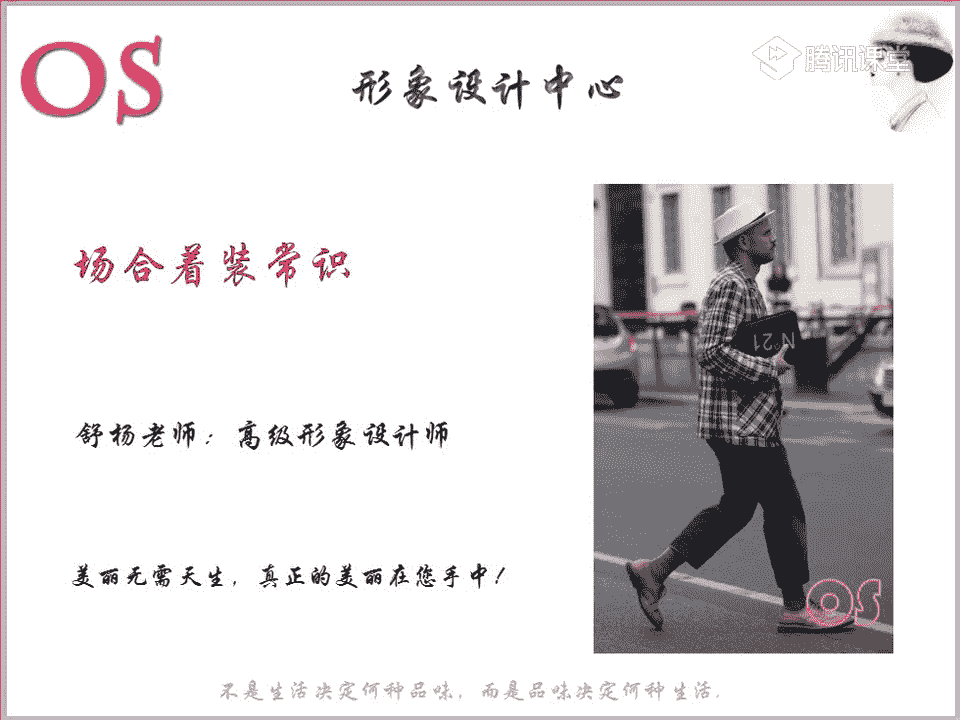
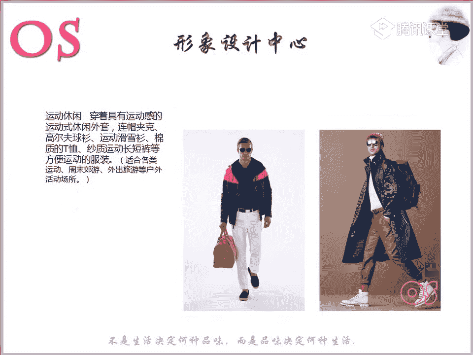
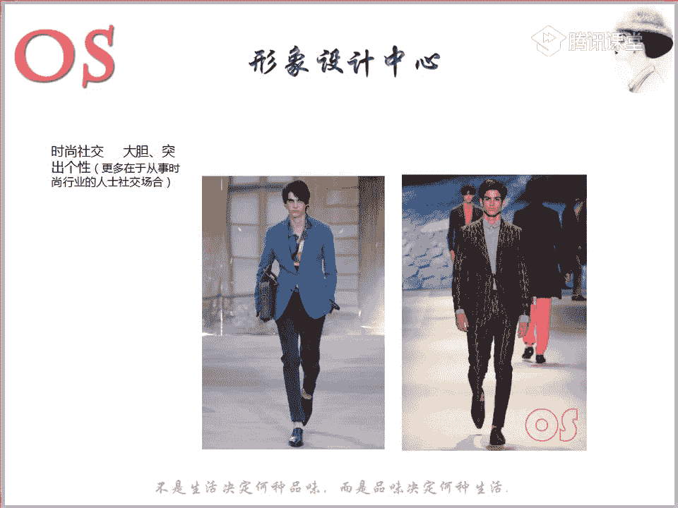
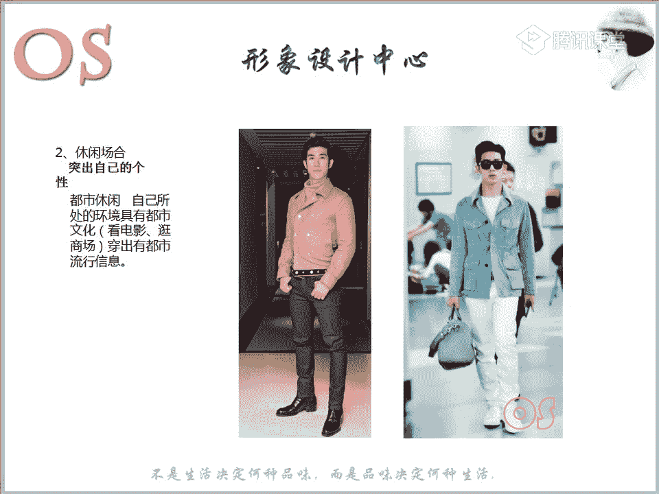
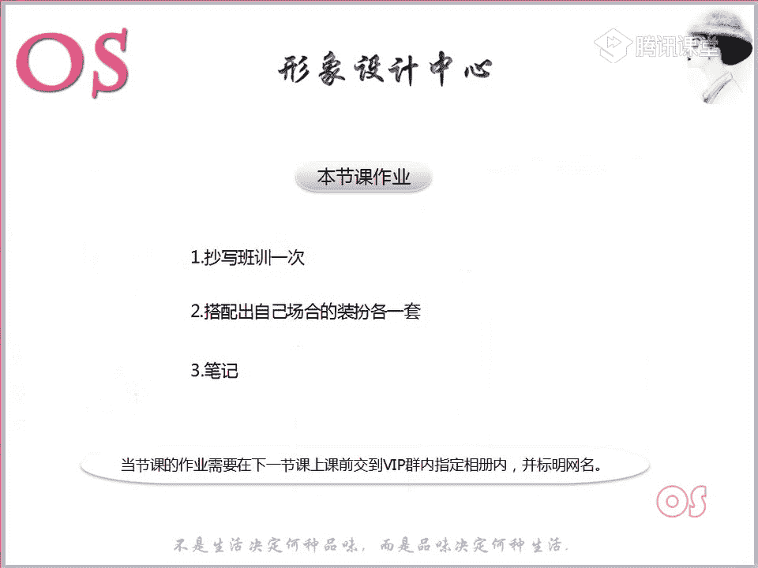
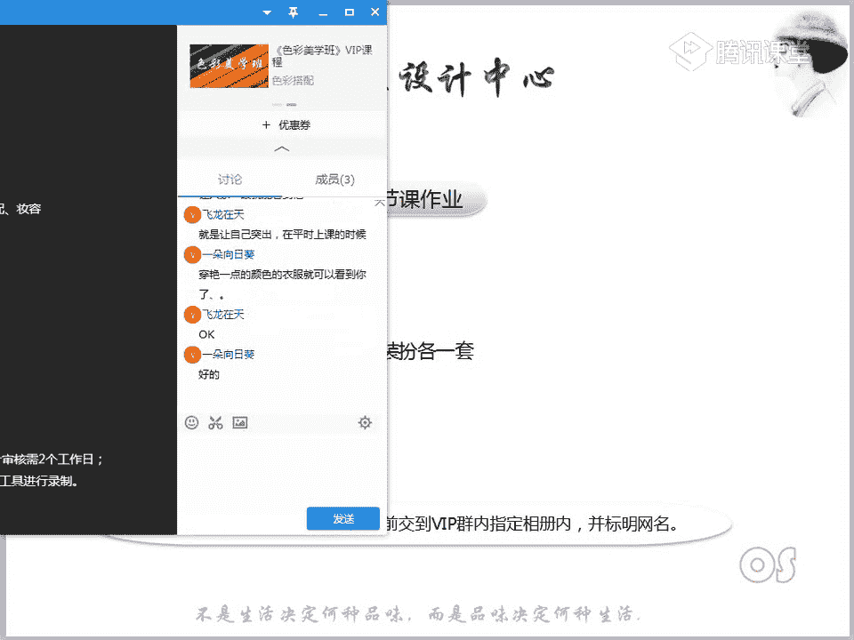

# 1、03OS男士形象VIP班《形象课》：第4节、场合着装常识

是的哦，肖雅老师也来了。好，大家都准备好了没有啊？我们在场的有看看今天到了几位同学啊，我们到场的同学准备好的同学快速跟老师刷朵鲜花，我们就正式开始今天的一个课堂了。😊，好，再次欢迎大家啊。

今天呢要跟大家分享知识呢是我们男士课程的第四节关于场合着装的这样的一个常识。那么我们在这样的一个社会中啊，会有不同的这样的一个场合。可能之前呢我们在工作也好，还是说我们去约会也好。

还是说呢哎我今天去看电影也好，这样的一些场合，我们可能都会去穿着一些休闲装，对不对？呃，之前有没有注意过这样的一个场合问题。我相信很多同学都是没有注意到，原来我们有人生中有不同的一些场合。

那么约会的时候有约会的一些穿法，在职业场合，又有职业场合，它的一个形象的一个表达，面试的时候啊，还有包括啊我们这样的一些呃时尚休闲场合等等。

那么首先呢我们来看到就是这样的一些跟大家来分析下这样的一个职业形象啊。那么所以说这样的一个职业装呢，它其实等于的是什么呢？这样的一个职业的投资，把职业形象的投入呢看作是投资，而不是说去看成消会消费啊。

😊，按照我们这样的一个职业生涯的一个发展规划，我们职业的一个形象，投资是非常有必要的。所以说今天的一个课程呢，不仅仅会跟大家所讲到我们这样的一些不同场合的一些着装。

另外的话呢我们还要结合到我们在第一节课就跟大家有分享分析过我们整个形象设计是由我们的内在啊，也就是我们这样的一个隐性因素和显性因素一起而构成的，对不对？

应该还有很多同学还有印象哦，应该有些同学是有印象我们呃显性呃因素呢包含什么？隐性因素又包含什么。那么像我们这样的一个年龄，其实就是属于我们这样一个隐性因素。所以说呢我们不仅仅在穿衣的时候。

要结合到自己的这样的一些呃关于我们的色彩进型和风格以外呢？啊，我们的年龄区于什么样的一些阶段，那么在选择服装的时候呢，也是要格外去注意的。除了我们这样的一些年龄以外呢。

还有包括我们不同的这样的一些场合的着装，也同样啊非常非常的重要。那么这两个知识点呢，就是我们今天这样的一节课的一个学习重点。那么本节课对于大家的一个要求呢，就是希望大家能够去掌握在不同年龄段。

我们应该怎么样去穿搭啊，以及呢在不同的场合，我们又应该怎么样去呃协调自己呃，适合适合自己的这样的一些呃场合的穿衣风格。好，那首先呢我们就先看到我们这样的一个。

年龄段啊，那么呢其实我们男士跟女士呢还是有很大的一个区别哦，因为呢。我们这样的一个女士。好，我们这样的一个女士呢是非常重视这样的一个感情色彩的。那么包括大家也会发现啊，尤其是前面两套衣服，对不对？

色彩上也好，还是上还是像我们这样的一些图案的一个丰富度也好，所以说女性在装扮时呢非常注重的是什么，非常重视的就是我们的感情色彩，以及呢满意的色彩，还有这样的一些满意的款式啊，符合她风格的款式。

那么男士她当然跟我们的女士还是有一定的区别。色彩对于她来说，可能呢不是那么的重要。你就像我们男士会有不同的一些场合的问题，对不对？比如说她可能大部分的时间都会花费在这样的一个职业场合。

势必在色彩对于我们这样的一个引导性就没有那么的强。所以说男性她重视的是这样的一个品质感，服装的品质感，也就跟她自身的品质是否是相协调的，跟她的材质，自身的材质是否相协调。

第二个呢就是我们这样的一个场合的问题，也就是今天会说会所会说到。😊，这样的一个知识点。第三个呢就是我们自身的这样的一个风格。最后呢唉我们把我们的品质，也就是说你的才质，你的场合，你的风格都考虑到了之后。

我们最后呢才会去考虑到这样的一个颜色。所以呢第一个呢就是要跟大家来说说关于我们这样的一个年龄哦，我不知道我们在场的啊，我们估计我们现在呃一部分同学应该是一半一半啊。

有一半的同学呢可能是属于20到30岁这个年龄段的男士，对不对？嗯，比如说我们的飞龙在天啊，那么像我们的钟辉同学可能是属于30到呃已经刚好是今年好像是30啊，老师应该是没有记错的话。

所以说呢这两个年人这两个年龄段是我们在场的一些同学也好，还是说哎我们作为形象顾问班的一些同学的呃，另一半也好，应该是大部分是处于这样的一个年龄段。所以说在听这两个年龄段的时候，大家要认真去听。

因为呢呃你只有理解了老师所表达的每一个知识点嗯。86应该是31了啊啊31了。对，然后呢你只有理解了这两个充分的能够去。因为这刚好就是我们自身的这样一个年龄。

所以说理解程度会可能会更嗯能够去更融洽的去理解它。等到我们到了40和50岁的时候呢，其实你只要记得住这样的一个中心啊，老师所提到的这样一个重点，我们就很好呢去打扮自己了。而处于这样的一个年龄段。

我们就首先从20到30岁来说起啊。20岁呢到30岁，也就是说我们处于呢其实是刚步入社会的这样的一个年龄。而且呢像在这个年龄段的男士来说，其实呃不管是皮肤的状况也好，还是说整体的整体的精气神。

还有包括身材应该也都是啊非常不错的，对不对？嗯，体能啊等等的。那么在这个年龄段的话呢，其实我们不用去太顾忌到太多啊。😊，也就是说，如果你觉得今年流行一些，比如说非常你喜欢的一些外套啊，或者说一些色彩呀。

你都可以大胆的去尝试啊，不用去太顾及到这样的一些风格。你自身的风格，所对于你的这样的一个影响，不用太去顾及到。但是呢我们在这样的一个年龄段，我建议我们各位啊处于这样一个年龄段的男士的话呢。

多以我们明亮的色彩为主。也就是说在你的用色范围内呢，我们多去穿一些相对来说比较浅啊，比较亮啊，也就是说稍微颜色偏鲜艳的一个颜色呢，这个时候在这个年龄段，你大面积的去穿。

对于你的面部来说没有那么大的一个影响。所以说明亮的年纪呢，我们就要用明亮的色彩鲜明啊，鲜活明快的色彩呢去体现。所以在这个年龄段穿好你自身的风格的时候，同样的同同时啊，然后呢你可以多去尝试。嗯。

也就是说如果有些同学非常顾忌的话，我们可以去以自己的一个风格。你对于服装的这样的一些行色制的一个要求的一个基础上呢去多去进行尝试。另外的话，你会发现在这样的一个年龄段，我们其实可以穿的非常的青春。

对不对？包括老师所找的图片也是一样的。我们大面积的可以多去运用这样的一些鲜的颜色，这是在我们不管是你约会也好，还是说哎我们这样的一些休闲场合啊，总的来说，休闲场合的话，我们可以这样去穿。

但是在这个年龄段的话呢，我们也有一个入社会的入门禁忌啊，是什么样的一个社会入门禁忌呢？我不知道有没有同学所猜到，就是在这个年龄段，老师说了可以呢多去尝试啊，在色彩上可以多去做一些文章。但是在这个年龄段。

他也有一个所避讳的东西，有没有同学所能够去猜。😊，猜到的话可以呢在公台上打出来。😊，所以在这个年龄段呢，我们就是要去嗯把正确的扮量观啊，就是光大自由主义气质。你想要怎么样去穿，你可以多去尝试。

不用去顾及到啊啊，我不喜欢这样的一个鲜艳颜色，我就不穿了啊，我就去穿一些唉太过于深沉的颜色。那么在明亮的年纪，其实色彩啊，我们还是要多去尝试一些这样的一些鲜艳的颜色啊，稍微呢明一明亮一点啊。

浅淡一点啊也好，或者说唉稍微小面积的去鲜艳色也是可以的，大家都不知道是吗？都不知道要有一个什么样的一个入门禁忌啊。都猜不到猜不到同学跟老师扣个一。😡，好，猜不到是因为呢你要知道在这个年龄段。

如果说一旦是呃大学毕业了，或者是说我不继续再去读书了，或者是说我研究生毕业了，一般我们就要步入什么步入到职场，对不对？所以说呢我虽然在任何的场合，我可以随意的去穿。哎，我想穿什么呢？穿什么。

我都可以很随意，但是如果一旦我们是在社会上哦进入了一个职场，那我们就要有我们职业的一个表达方式啊，一定要有一个职业的一个表达方式。呃，如果说表达方式错了，或者说太混乱了。哎，我们去混搭呀。

我觉得这样很时尚啊，我穿这样的一些鞋子啊等等的，我就穿到了啊上班的场合，那么肯定哦就会唉不太符合这样的一个场合的一个着装。所以说在这个年龄段一定要重视起来，我们在职业场合应该有怎么样的一个形象表达方式。

那么等我们讲完不同的年龄段呢，老师一会儿就会跟大家讲。强调到这样的一个职业场合。所以说在职业场合的时候，我们呃重点去讲。那么在这里呢跟大家所要去带一下的就是啊一定要懂得我们社会的入门禁忌。啊。

如果你去面试，你一定有面试的一个着装。哎，你去上班，你有属符合我们上班场合的这样一个着装。啊。如果这样的一个入场券，你穿对了穿法穿对了就可以了。剩下的这样的一些场合，你想怎么穿，你就可以怎么样去穿。

把握住这样的一个年纪啊，其实因为在这个年纪中，你的皮肤的整个状态都是不错的。所以说你对于材质的要求，不会像我们的年龄，随着时间越来越长，而对于一些材质，它就会有很大的一些强调的一个作用。

它不是说什么样的一些材质我都可以去穿。那么它可能对于整个服装的剪裁也好，对对于服装的材质也好，它都会去有一个要求。所以说呢在这个年龄段就真的啊我们要把握好啊。因为你像我们飞龙在天就是。处于这样的年龄段。

所以呢有一有一些什么想尝试的这样的一些呃服装的话呢，你其实可以多去尝试。像一些其实老师也建议你多去穿一些浅淡的一些颜色。那么在服装的剪裁上呢，你还是以你的古典为主。

也就是说服装的材质我们尽量还是要精呃要精细一点，但是色彩上我们多去做一些文章。另外的话大家可以看到啊，而且在这样的一个呃职业场合的话，我们其实也可以呢给自己的全身增加一些呃亮点。

比如说呢哎我去背这样的一些双肩包，其实也可也是属于呢增加这样的一些时尚的一些元素，对不对啊，所以说大家可以看到这里啊，这个就是我们这样的一些20到30岁这个年龄段，那么大家也会发现呢二三十岁年龄段。

大家从通过这样一个年龄段，老师所找的这样的一些典型的图片中，你们一定要去读到啊我所说的这样的一些关键词啊，比如说色彩上的，还有包括我说的材质上，你会发现呢呃并不是特别的一些精致精细，对不对？嗯。

相对来说他会比较偏年轻化啊，所以说大家记住这样的一个感受。因为一下子我们就要一会儿呢就转到30到40岁。你们就会发现呢这两个年龄段，他们在着装中的一个差距在哪里啊好。😊，这呢我们就来看到30到40岁。

好，30到40岁，其实我们已经开始发生了改变，不仅仅是面部上的皮肤啊，或者是说啊这样的一些身材在发生改变。其实你也会发现你的社会角色可能也在改变，对不对？哦？我们可能一毕业就进入了职业场合，进入了职场。

可能经过几年的一个奋斗呢，我们可能处在不同的一个层次上面。所以说你会发现你不仅是皮肤哦，还有整个哦就是皮肤的这样的一个年轻和有一点点往哦成熟的这样的一个方向去发展以外呢，你也会发现你的身材也好。

还有包括你的社会的角色，你所在的这样的一个职业场合。可能有的人已经步入了哦中层管理，或者是说我们已经达到了高管的一个层次，对不对？所以说我们的社会角色在发生变化。那么进入职业场合的话。

而且呢像这样的一个年龄段，一般是工作来说都已经非常稳定了。哦，所以说可能在呃整个。😊，生活中大部分的时间呢都会投入到职业职场上，对不对？所以说在穿着上呢，我们也要去专追求这样的一个职业感，追求呢精致感。

追求这样的一些品质感。那么在追求精致感，职业感品质感的同时呢？当然我们也要适当的去加入一些流行元素。也就是说虽然我已经处于这样的一个职业场合了啊，职场状态了。我虽然呢已经呢大到达达到了这样的一个层次啊。

我不能因为我的年龄也好，我的社会角色也好，达到这个层次，我就不去啊追求一些流行元素了。我们不能说穿的太过于死板，还是要在这样的一些职业感、精致感、品质感的同时呢，要适当的加入流行元素。

怎么样去加入流行元素呢？比如说像我们这两套衣服。大家会发现像这样的一个印花的衬衫，对不对？衬衫来说，很多男士的一些衬衫，也许我要精致，要职业要品质的话，我可能就是很多都是素面的。

或者说哎这样的一些材质精致就好了。但是我不会说有过多的一些啊图案上在增加在上面，对不对？那么我们如果说在这个年龄段，如果不是在职业场合哦，比如说我在一些休闲场合，我就是不是可以穿这样的一些印花衬衫。

也就是说你会发现非常的精致，对不对？从我们这件衬衫中，你能读到这样关键词，而且这件衬衫你也会发现也很有品质感。但是呢它又不乏一些时尚元素，流行元素，就像我们的一些印花对不对？

那么还有包括像右边也是一样的，像这样的一件西装，西装在我们的印象中就是非常古板的哦，非常死板的这样的一件单品，不出彩啊，也没有过，对不对？而我们如果说在这样的一些西装中加入啊我们的一些拉链哦。

是不是这样的一个拉链，就是属于我们的一些设计感的一。😊，元素对不对？也是属于流行元素。所以说让这样的一件西装又起到了画龙点睛的一个效果。哎，你就会发现出区别于我们普通的西装，它就要时尚很多。啊。

所以说这个呢就是怎么样去在志气和成熟间找到一个平衡的方式。我们可以适当的去做一些点缀。那么除了这样的一些穿搭以外呢，我们接着来看看，大家也会发现你像这样的一件外套，对不对？

它的扣子其实这样的一些扣子是非常呃能够去稍微带一点我们的这样的一些休闲感的。但是因为它的一个剪裁，还有呢因为它的这样一个材质，你又会发现哎色彩也好，都是偏向于成熟的。因为一些深色调的话。

会给我们带来比较深沉的这样一个感觉，对不对？但是加入了我们的一些这样的一些大的扣子哦，稍微偏一些呃质感不是那么强的一些扣子的一些点缀的话，你又会发现它又稍微有带了一点点休闲，并不是那么强的职业感。

对不对？跟我们这样的一些职业感非常强的大衣还是有区别的啊，拿一个大衣跟大跟大家做对比。大家看一下啊。😊，看到这样的一件大衣。然后再能再来看这件大衣。

是不是你会发现这样的一件大衣没有我们刚才跟大家所展示的那么的正式啊，能够理解的同学跟老师扣个一。好，包括呢如果说我们呃不同的一些风格。如果说你是属于我们这样的一些前卫风格的呀。

你也其实也可以多去加入这样的一些流行，去做点缀啊。虽然说我带这个年纪了，但是呢我也不能说去丢弃我所自身的一些风格。所以说像一些呃前卫风格的男士的话。

其实你们是最好能够去在我们的这样的一个成熟啊和稚气中去找到这样的一些平衡的。另外的话，你像有一些风格是曲线风格的。比如说我们的浪漫风格的一些男士，对不对？那么像这一身的话，就是我们浪漫风格非常适合的。

因为你会发现它的领子跟我们其他的有一些领子它是有区别的。它的领子并没有那么的尖锐啊，棱棱角角，你会发现他趋向这样的一个弧度，对不对？所以说而且它的一个面料来说也是相对来说比较柔软的。

那么你也会发现这一身的话，精致的同时，有质感的同时呢，又不乏自己的这样的一些风格。那么等到我们具体讲风格的时候，还会去跟大家去分享。那么像这样的一位男士呃，可能有些同学认识啊。

我不知道有没有同学最近有在看鬼怪。一部韩剧啊，有没有看看过这本？😡，这一这一个韩剧的看过同学可以跟老师扣个一啊。如果没看过的话呢，老师给你们个建议，尤其是像我们在呃30岁到40岁这个年龄段的啊，我们。

😊，自己处于这个年龄段的，还有我们有没有另一半是处于这个年龄段的哦，就是我们对方的我们自己的另一半啊，就是我们在场的高级班的一些同学，另一半有处于是30多岁的话啊，也可以跟老师呢扣个一。

那么老师给你们个建议，你们呢也可以去搜一下这部这部电视剧。鬼怪，然后呢，这位男主演呢叫孔刘，然后他在鬼怪里面所穿的衣服呢是特别特别符合老师所说到的30岁到40岁这个年龄段所穿的服装哦。

如果说有些同学对于30岁这个年龄段的服装，还有一些疑惑的话，或者说你想要找一个明星去借鉴，其实你就拿这部戏去借鉴，可以去大胆的去借鉴。因为他里面所穿的衣服都是属于这样的一些哦，因为他是大叔嘛。

在里面扮演的是个大叔，所以说非常的成熟。但是呢由偶步伐这样的一些职业感。那么大家可以根据他的这样的一些穿着啊，然后再结合我们今天所说的这样的一些场合的着装的意识，把他的衣服去进行分类。

然后把自己的不同的场合，他穿着的啊去挑选挑选出来。然后可以去参照他的这样的一些穿搭哦。呃，鬼怪啊就是鬼怪韩剧。大家都可以看看啊，接下来也是这样的一张图片，也是我们30岁到40岁这个年龄段的。

你会发现是不是啊啊记住这样的一些感觉啊，记住这样的一些感觉，我们来看看再来对比一下啊，20多岁的。😊，能不能清楚的看出来他们在穿衣服的这样的一些变化啊，你们从他们这样的一些穿衣的变化中。

有没有读到什么样的关键词哦，把这样的一些关键词可以呢在公台上跟老师打出来哦，有没有从中去看到某些关键词啊，也就是说他们区别的这样的一些关键词啊。有没有？嗯，活泼动感鲜艳。嗯。是的哦。

所以说大家通过老师的这样的一个图片中，你们就能够清楚的感受到这两个年龄段，他们在穿着上一个很大的一个区别啊。当然我们如果说是步入这样，我们是属于20到30岁这个年龄段的男士在职业场合中一定要注意啊。

一会儿一定要严格的去参照职业场合的一个穿搭。那么剩下的话呢，我们就去表现活泼动感鲜艳就可以了。但是呢到了30到40岁，我们就要表现唉稳重的这样的一个形象，但是在稳重的同时。

又得凸显一些你的这样的一些时尚度，对不对？啊，稳重的同时，我们去凸显时尚度，也就是说在志气和成熟之间呢，我们要找到一个平衡，不能太过于成熟，但是也不能太过于幼稚，对不对？像我们这样的一些呃嗯在20岁啊。

20到30岁这个年龄段的。所以说其实为什么说他是一个非常好的一个参照对象，就是因为他在里面啊在鬼怪这样。这样一部韩剧里面，他所办所穿的所有的衣服，他其实都有在成熟和稚气中呢找到这样的一个平衡啊。哎精致。

职业啊品质的同时又不乏一些流行元素。好，接着呢我们来看看下一个就是40到50岁。40到50岁呢，我们整体的穿着呢要简单哦，经典做工也要上乘。因为一般在这个年龄段的男士。

如果说在职业场合非常稳定的一个状况下的话，其实啊也收入上也会有不错的这样的一个收入，对不对？所以说呢对于一些职业场合来说，我们就真的啊还有包括这个年龄段来说呢。

我们真的在穿衣服上要去体现自己的一个情调感啊，当当然也要有一些焦点的一些设计，所以说整体在穿搭上的服装的款式上，我们要多选择一些简单的款式，而且呢要多选择一些经典的款式。

也就是说唉不管穿多少年它都不会过时的。你就像西装，它就是属于这样一个经典款，对不对？还有包括像我们的一些夹克呀，啊，很多夹克也是属于非常经典的一些款式啊。大家可以看到，类似于像这样的啊。

这样的都是属于经典的一些款式。所以说呢我们都要多去选择一些简单经典的款式。另外的话有焦点的设计是什么呢？大家会也会发现像我们这位男士啊，在这个年龄段，它最大的一个焦点就是它的一个围巾，对不对？啊。

所以说我们在整体穿搭中呢，要给自己的整套中稍微去制造一些亮点，制造一些亮点。然后呢体通过这样的一些亮点呢体现自己的一些情调。所以说在这个年龄段。

我们男士要去稍微呢本身我们在呃30多岁都是属于非常理性的这样一个表达方式，对不对？但是到到了40到50岁的，我们要适当的去体现自己的情调，也就是说你的一些曲线感哦，曲就是我们这样的一些感性元素。

可以说是那么所以说在这个年龄段的话，我们呢比如说一些领带呀，啊，比如说我们的一些袖口啊，或者说我们的这样的一些手边呢，或者说我们的配饰啊，都能够去体现我们的生活品质。也就是说。😊。

服装上我们选择简单经典的，但是这样的一些配饰，我们尽量呢去选择啊这样的一些丰富一点的去点缀。就像我们在穿西装的时候，唉，不妨给西装的一些啊这样的一些口袋金啊做一些设计。那如果说我要穿在职业场合。

我要穿衬衫，打领带的时候呢，我的领带可以去选择一些感性啊元素的。比如说唉带有一点点粉啊，或者说我去选择一些金色系的呀等等的。就是去让你这样的一个领带的颜色呢去带来这样的一些情调感。

还有包括呢哎我们这样的一些呃毛衣也是一样的。其实有时候在一些呃场合中，我们去穿毛衣。比如说我们可以去选择这样的一些呃法式领的啊，你会发现非常的它是属于这样一个曲线型的一个领子。

都能够去体现我们男性的这样的一个柔软的一个啊情感。所以包括我们去穿搭的时候，就不用去穿的太过于硬气了。哎，以前可能我们去穿西装配衬衫。那么这个时候呢，我们可以其实适当的比如说一般的职业场合。

我们其实可以去拿毛衣跟西装去做搭配啊，也没关系。当然是一般的职业场合啊。那么在我们的一些普通的呃休闲场合的话呢，我们也可以拿衬衫跟西装，只是说这样的一些西装去做搭配的时候呢，我去加一些设计啊。

不管是胸针也好，还是我们的衬衫的颜色也好，哎，多去带来这样的一些情调感嗯。😊，服装的材质，当我们的服装材质做工都上乘的时候，其实你的生活的品质就会被啊你这样的一些服装所去体现啊。这个就是我们40多岁。

所以说要去啊制造一些焦点的设计。然后其他的话呢不用太注重啊，不用去太注重什么啊色彩啊，就是我们的衣服裤子要多注重色彩，或者说我的这样的一些衣服和裤子要有多有设计感。这些啊，不用越简单越好。

所有的情调所有的一些装饰细节，我们都是通过小的啊内搭也好，或者说我们这样的一些配饰，或者是说呢通过我们服装的这样的一些领型呢去做体现。啊，关于这个年龄段有没有什么问题哦。

可能大家对于这个年龄段会有一点模糊，自己没有经历过，而且也隔得相对来说比较远啊。有没有什么问题？如果没任何问题的话，老师就接着来讲下一个了。好，下一个呢就是说到我们的50到60岁这个年龄段。

50到60岁的话呢，如果是还在工作状况的话，因为有的单位的话是60岁退休还是65岁，对吧？啊，如果说还是在这样的一个工作状况的话呢，在经典里，我们加入舒适就好了。

也就是说呢我们在穿着这样的一些经典的款式啊，还是在40和50岁这样的一个经典的一个基础上呢？我们去加入一些舒适感啊，怎么样去加入舒适感呢，老是打个比方啊，也许呢我作为我在40岁到50岁啊。

比如说我是呃某某风格的，我是古典风格的啊，我可能会更适合选择一些呃英式西装，对不对？那么我在40到50岁，我去选择西装，因为这样的一个经典，对不对？简单做工上乘的这样的一件单品，很适合我。

那么我到了呃50岁到60岁的话呢，我要再去穿西装的时候呢，我是不是要在经典和舒适。

中去做一个调节。那我可能会去选择什么样一的西装呢？我会选择H款型的。也就是说我们这样的一个美式西装，美式西装，你会发现西装还是经典的，只是说这样的一个款式中，它没有那么的束缚我，没有束缚我们的腰身。

会呈现这样一个H型，对不对？所以就非常的舒服，非常的自然啊，这个能不能理解啊。刚才老师所举的西装的这个例子，能够听明白同学跟老师扣个一。也就是说怎么样是在经典里去加入这样的一些舒适。

也就是说我们在款型上可以适当的去做调节。😊，好，能理解的同学快速啊快速的扣个一。😊，如果说没有听明白的，老师就再再重复一下，或者说再举个例子给你们听。有没有不明白的，不明白的跟老师扣个2。

也就是说哎在怎么样是在舒适的同时啊，也就是在经典里面我们去加入舒适。刚才呢拿西装举了一个例子，对不对？😡，好，其他同学是哪里不明白啊，赶紧提出来哦。然后既然在上课呢，我们就要认真的去听。

跟着老师的一个呃思维去走。因为有时候可能你觉得哎我先开个小差，等会儿呢我再来听一下录播。那么录播课程中可能老师举的一些说的一些东西，你又没有听明白，然后又有点懵，然后这样过了呢就过了。

那等到唉我们遇到这样的一些客户也好，还是说我自己到了这样的年龄段。哎，什么是舒适啊，什么是经典里面加舒适，我又不明白了。好，其他同学要是哦。然后呢，也不说听懂了，也不说没听懂的话，老师就过了啊。然后呢。

到了我们在场的同学，你们要是有问题的话，你们可以再仔细的去听一下录播啊。😡，然后继续讲了，因为今天内容也比较多。好，如果说我们已经是退休了的同学啊，如果说唉在这样的1个50到60岁。

等到我们到了这个年纪段，年龄段呢我们已经退休了，那么我们其实就以呃舒适为主啊，以舒适呢，以自然为主。那么我们其实就按照自己的这样的一些场合中，哎，我就多以我自己适合的这样的一些风格。比如说哎休闲场合。

我就大量的去穿着，我就不用说再去顾虑到这样的一些职业。也许如果说在这个年龄段，我们还在上班的话哦，我们还在上班的话呢，其实我们就可以在舒适里啊，在我们的这样的一个经典里面加入舒适也是可以的。

比如说哎我加入我可能之前年轻的时候呢，我是搭配这样的一些西装面料的这样的一些小背心，对不对？非常精致的小背心。那么这个时候我在这个年龄段，我可以去搭配针织的背心。

其实也是属于在舒适里面和我们的经典里面去做这样的一些平衡。那等到你的年纪大了之后啊。我们其实如果说没有在上班的话呢，就尽量以你自己的风格为主。如果说你是前卫型的哦老男人，那我们就以前卫风格为主。

那如果说你是自然风格的，那我们就以自然风格为主啊。那如果说呢唉我是一个古典型的，我还是要穿着我古典，我还要是要穿着精致一点啊，精神一点。唉，面料上的一些质感也不能忽视。只是说在款式上呢。

我们可以去选择一些稍微呢舒适一点款式不用太过于去束缚到自己啊。那么这个呢就是我们在五六十岁这个年龄段，那么如果说随着我们的年纪增大了，到了70岁之后。到了70岁之后，我们应该怎么样去穿呢？啊。

可能有的同学非常聪明的就会猜到唉啊肯定就是以舒适为主喽，想怎么穿就怎么穿了，反正穿的舒服就好了。是的哦，这个时候呢，我们就是在遵循这样的一些退休之后的，也就是说以舒适自然为主的一些风格中哎。

以自己的风格为主的同时呢，在色彩上老师给你们的建议啊，色彩上呢，我们就尽量要选择浅淡的色彩了，不要因为自己年纪大了哦，反而就觉得不好意思了。我们就去穿一些深色调。那么在这个年龄段的话呢哦。

也就是说70岁之后的这样一个年龄段，尽量呢建议大家都以这样的一些类色里内内搭里面像这样的一个呃老头里面的内搭，像这样的一些浅淡嗯，浅淡的色彩为主，不要再去穿的太过于深。

因为本身你的皮肤的这样的一个厚度啊，还有包括皮肤对于色彩的一个驾驭度已经降低了。所以说呢在这个时候在这个年龄段，我们如。😊，说去穿一些浅淡的颜色，会显得自己的气色会更好。那么如果说像我们呃马上要过年了。

想要跟一些爷爷奶奶啊买衣服的时候也是一样的，多去给他们选择一些浅淡的色彩，不要去选择太深的，或者说太艳的颜色，他们去穿这样的一些浅浅淡淡颜色呢，会显得他们的面部的一个精气神啊，是达到最佳的一个状态。好。

对于各个年龄段，我们不同的这样的一个年龄段，在穿衣服上要注意的一些点，都明白，同学快速跟老师扣个一。接着呢我们看下一个。😊，如果说对某个年龄段还有问题的话，呃，大家赶紧提出来啊，没有任何问题的。

快速跟老师扣个一。然后在上课的过程中呢，有任何问题就提出来，我不希望大家呢呃开着这样的一个课程听着听着。然后呢呃作业，有些同学作业还不交啊呃听录播也不交作业啊，然后看直播，有些同学也是不交作业的。

你们如果说想要对自己负责。想要说通过这样的一个学习，真正啊把有些知识点学懂学透的话，那就一定要按照老师的这样的一个标准去做。不然的话，你总是想着等我学完所有的课程之后，我再去做改变。

我可以很明确的告诉你们啊，一定会有些同学是学完之后跟没学是一样的一个状态。😊，好，接着呢我们来看看我们不同场合的这样的一个着装。第一个呢就是我们的职业场合啊。当然在职业场合中呢。

我们也是分为呢不同的这样的一个职业场合。具体划分到哪里呢？划分到我们三个啊职业场合分为呢严肃职业场合，以及呢我们的一般职业场合，还有包括时尚职业场合。那么这三个职业场合一定是有很大的一个区别的。

首先呢我们来说一下我们的严肃职场。那么严肃职场指的呢是其实可以分两个概念来讲啊。那么听到严肃职场，我相信很多同学都能够清楚的理解就是。严肃职场一定是工作状态，非常的坚定，严肃严谨，对不对？

那么为什么说是分两个点来说呢？第一个就是如果我们在场的有些同学，你是处于企业管理层中的高层，也就是说高管，或者是说呢你是以你是一个老板啊，你是一个这样的一个总裁啊，那么或者说我们以后啊对于顾问班来同学。

就是说我们在我们的形象顾问啊，唉在我们这样的一个从事形象顾问中呢，遇到了这样的一些高层管理层的话，那么他们就要在职业上去穿搭的话，就要按照职业场合去穿，这是第一种。第二种呢就是针对于这样的一些职业啊。

怎么什么个意思呢？就是比如说。😡，有些什么职业场合呢？嗯，像我们的一些律师，嗯，还有包括我们这样的一些呃对于一些国家单位啊等等的，对不对？像他们都是要表现这样的一些严肃的一个场合的一个问题的。

那么他们这样的一些职业，也是属于呢在穿搭上会要往严肃职业场合去穿搭。就像其实很多一些法院你也会发现他的服装都是固定的，对不对？而且成套的这样一些西装。我相信大家如果接触过的，应该是不陌生。

所以说大家要知道啊，严肃职业场合不仅仅是讲的是哎你是做什么样的一个工作的，你是做啊国家干部的也好，还是说呢你是做律师的也好，哎，你就要穿着啊这样的一些成套的西装啊。那如果说你是作为高层的管理层。

或者说你是作为呢这样的一个管理者，我们在这样的一个上班的同时，我们也要去穿严肃职业场合所符合的这样的一个穿搭。所以大家一定要理解啊，这两个点。😊，那么怎么样去穿呢？第一个就是款式呢？一定要去成套的去穿。

就如我们右图中啊这样的一个成套的去穿，穿一些经典款，那廓形也要非常的清晰啊。什么是廓形清晰呢？也就是说这样的一件衣服，它的一个剪裁非常的利落，非常的清晰简洁，而不会说有啰啰嗦嗦的。

像我们这样的一些量身定造的啊，或者说哎我们这样的一些非常经典精致的一些款式西装，它的剪裁一定是非常非常清晰的，廓形是非常清晰的，整个轮廓那么颜色上也是一样的。我们在颜色上的一个选择呢？

尽量是以什么样一个颜色为主呢？尽量啊要以你的用色范围中这样的一些颜深色调为主。哎，就像如果说我作为这样的一些呃用色，我可能我比如说我是一个春季型的，其实春季型在严肃职业场合的话呢。

我们也可以去穿一些深深调子的。比如说我们这样的一些深棕色啊等等的。所以。就穿自己的这样的一个用色范围中的一些深色调。或者是说呢哎我们在这样的一个场合中。

因为我说了男士色彩对于你们来说并不是特别特别的重要，对不对？所以说我们还是要以一些深色调。如果说即使我的用色范围不适合深色调。但是我们还是要穿着深色调颜色呢一定要以深色为主，像一些藏蓝色呀或者是黑色。

它最能够去表现呢我们严肃严谨的这样一个状态。那么除了我们的呃深色以外呢，图案的一个配搭上也要形成一致啊，图案配搭上要形成一致。就像如果说哎我作为一些管理层啊。哦，是秋季行，其实老师给你拍的那张照片啊。

你的用色范围都有啊，你可以去看一下呃，它那下面都有写着职业场合应该去选择的一些用色啊，你可以去参照一下。好，那还有呢就是我们的一些图案。其实如果说作为一些呃你是一些高层的一些管理的话。

其实我们的衣服虽然说要以深色为主。我们也不用说唉穿的那么的死板啊，就像我们的途中中唉全是像一些白领啊，精英这样的一些太过于沉重的一些穿搭。我们其实可以去穿一些暗条纹啊，暗格纹也是可以的。

但是呢我们的图案的配搭上要一致啊，不能说你的西装呢是一个条纹格纹，然后你的裤子呢又是纯色的，我们尽量要去成套的去穿着职业场合的话，在穿衣穿衬衫的时候也是一样的，不要去有一些袖扣。不要有一些袖扣啊，呃。

我可能有些同学对于袖扣有点陌生啊，其实有一些衬衫的话，它是它是双层的袖子。我不知道有没有同学看到过。如果说有见过呢？有理解的同学可以跟老师扣个一啊。那么不理解没关系。等老师讲衬衫的时候呢。

啊或者说讲这样的一个我们的一些礼服的时候呢，会跟大家讲到的，有些衬衫它是双层的袖子。那么双层的袖子，它会有一个一个扣眼，那个扣眼呢也没有扣子，大家会发现啊，那它是干什么用的呢？唉。

它是去里面呢会去放一个我们的这样的一个袖针啊，也就是我们的一个袖扣啊，非常精致的这样一个袖扣。那么如果说在职业场合的话，千万不要去选择这样的一些双层袖子的，我们的衬衫，然后去佩戴这样的一些袖扣。

袖扣的出现，一定有它的一些场合，严肃职业场合绝对是不可以的。因为不够严谨，反而会有。😊，有一些社交的感觉，这是第一个。那么第二个呢就是我们的鞋子上也要多去注意鞋子呢不要去选择一些镂花啊，镂空花纹的。

当然老师说的时候也会谈提到啊，尽量去以一些系带的皮鞋为主。然后呢镜面的就是没有任何的花纹，然后一字拼也好啊，或者是说啊全面的没有拼接的这样一的款式也可以，但是千万不能有镂空异纹的这样的一些花纹啊。

还有就是呢我建议一下男士如果夏天呢要穿着这样的一些衬衫的时候呢，还是少去选择这样一些短袖。你去选择长长袖呢，稍微把袖子挽起来一点点也没关系啊。男士还有包括如果是休闲场合也是一样的，不要去穿短袖的衬衫啊。

不好看，真的是非常的不好看啊。好，另外的话呢，其实如果说唉随着我们的季节变冷了，我们这样的一些严肃场合必要的去唉搭配我们这样的一些西装的时候呢，大家可以想象下。

哎我怎么样去穿我外面穿羽绒服又显得好像非常的不协调，对不对？那么这个时候我们的呃大衣也好，我们这样的一些呢子大衣，还是说我们这样的一些风衣的款式啊，都要以严谨为主啊，大家可以去搭配外面去搭配风衣。

或者说搭配大衣，所以整个的这样的一个职业场合的一个形象呢，就出现了啊，就映入我们这样一个眼前。那么所以大衣的款式也是一样的，要精致啊。也就是说多去选择西装的放大版的大衣。那么风衣也是一样的。

不要去选择一些太多设计的啊，哎这个扣子呢啊有金属拼接，又皮面拼接啊，或者说这里呢有一个翻勾翻呃翻翻扣啊，怎么样的，或者说这样的一些呃口袋呀是非常明兜的一些这样的一些风衣啊。

我们尽量去以简洁的风衣款式为主。😊，然后这样去做搭配，在职业场合哦，严肃的职业场合哦，天气冷的时候，外面就可以穿着这样的一些服装啊，非常的大气。大家包括看电视剧的时候也会发现，对不对？

很多一些啊高管哪啊管理层呢在穿着在冬天的时候穿衣服，就是这样去穿穿搭的，对不对？😊，所以说要成套。所以说在呃服装的材质上呢，其实如果选择西装的话，也尽量去选择一些精纺的羊毛面料哦，非常非常的精致哦。

而且呢面料的一个质感也是非常好的嗯。好，下一个呢就来谈谈我们的一般职场。那么一般职场是很多同学可能现在正在经历的，而且呢也是常见的。因为我们很多国内的一些公司啊。

对于呢员工的职业的这样的一些在职业场合的一些着装是没有太多要求的。那么但是公司没有要求，我们自己要对自己有要求。像有一些公司，比如说一些呃外企的话，他可能就会要求员工要穿西装啊，男士。

那么所以说你就会发现他如果说你是在外企的话，你的公司有要求要穿正装的话，那个这个就是属于这样的一些呃严肃职业场合。那么有的公司呢他是没有要求的啊，也就是员工呢，你想怎么穿，你就怎么穿。

但是在这样的一个场合，我们要知道啊，职业中有职业场合的一个表达方式，对不对？别人呢不做要求，不代表呢我们就可以不重视，我们就可以随便去穿。绝对不要有这样的一个想法哦，因为呢它代表的是你的这样的一个形象。

它能够啊从你的穿搭中呢去体现你的价值。而且呢我们在职业场合如果说多去注意一下呢，也会给自己创造更多的这样的一些机会。不管是面试也好，还是说我去跟人家去谈合作也好，你的形象一定啊对于男士来说。

穿衣服真的是在穿正直去穿你更多的这样一个机会。所以说在这样的一个一般职业场合中呢，我们虽然说哦在穿搭上不要去突出自己的个性啊，千万不要去突出自己的个性。

就有些男士的话可能呢把上班场合呢当成了自己的这样一个走秀场。而我今天呢买了一件什么样的一些衣服啊啊，各种鲜艳的或者说各种铆钉啊等等的这样的一些独特的一些款式，我就穿出去上班了，绝对不是你的一个秀场。

所以说呢在我们的一般职业场合，我们要不要再去突出自己的个性，要体现平和感。这是第一个也就是这样的一个工作是没有要。😊，第二个就是如果说你对于呢你是一个职场小白，你刚进入职业场合。

那么我们其实也是属于一般职业场合。所以在穿搭上也是不要去突出突出自己的个性，要整体呢体现平和感，因为你不能去抢了你的上司的一些风头，对不对？所以说这是一定要注意的。那么色彩呢尽量以一些着色为主啊。

我我相信已经上到第四节了。那么大家都是通过美学班的一个考核过来的，对于着色大家应该都懂，对不对。也就是说我们所有的一些油彩色里面加灰的一些颜色，以着色为主。

而且的话呢款式上呢可以适当的去体现这样的一些休闲感。就比如说我选择西装，我可能在正式场合呢是选择这样的一些轮廓非常清晰的，材质非常精致的，对不对？但是在这样的一个休闲场合呢。

我就可以去选择一些阔廓形相对来说模糊一点的。包括你像我们这样的呃两套这样的一个偏休闲款式的一个西装。其实它的廓形是相对来说要模糊的，没有我们像这样的一些西装，它的廓形剪裁上那么的清晰，对不对？

那么呢虽然说通过西装的这样的一个廓形模糊感，能够体现休闲感以外呢，还有包括呢我们可以去拿正装跟我们的休闲单品搭在一起啊，拿正装跟休闲单品。比如说像呃正式的西呃衬衫去搭配什么呢？休闲裤呃，搭配休闲裤。

但是呢我说的休闲单品就不要。把牛仔裤穿到职业场合啊，职业场合最好不要出现牛仔裤。你们其实像男士的话，以这样的一些呃休闲材质的呃布面的这样的一些锥字型的裤型，或者说直筒的裤型为主是最好的啊。

可以去多增加一些色彩哦。当然色彩上还是要以着色低调的色彩为主，不能选择太艳的哦，不能像我们啊在20岁一些其他场合啊，穿着这样的一个橘色的裤子呢，我就去上班了。好，这是我们的第一个啊。

就是关于我们这样的一些裤子啊，也就是说正装跟休闲单品。那么男士呢上衣一定要选择正式一点的，下半身呢选择休闲感。也就是说上半身呢像我们的这样的一些休闲感的西装可以多去备几套啊，像一些明兜的呀，明线的。

它虽然说西装的款式，但是它没有我们的正式西装那么的精致，那么的廓形那么的清晰啊，材质上那么的精品。那么但是呢它又是属于唉廓形稍微松散一点的。然后有很多的一些呃口袋的一些设计啊，也好。

还是说在材质上的一些暗纹呢，或者说面料上相对来说比较粗糙的那都是可以的。作为我们这样的一个半正式的这样的一些休闲单品。那么包括呢裤子的话呢，我们就下半身尽量去选择休闲感的。但是千万不能把我们的牛仔裤啊。

这样的一个牛仔裤呢穿到职业场合，还是以我们这样的一些休闲的布料的这样的一些裤子为。主因为牛仔裤这个东西也不是说所有的风格的人穿都很好看的。就像我们这样的一个古典型的男士，你要穿牛仔裤的话呢。

你就尽量穿色彩上一致的。而且呢尽量往这样一个深色调去走。因为深色调的这样一个牛仔裤的话，它相对来说这样的一个精致度要比我们浅色的要高啊，没有那么强的休闲感。这是第一个。第二个呢，我们古典型的人。

如果一定要穿牛仔裤的话，也要越要选择真的是要非常非常剪裁上非常的利落的。而且呢面料上色泽上都要非常精致的去穿。如果你穿一些浅色的破洞的古典型的人穿是非常非常难看的啊。所以呢在职业场合。

这样的一个一般职业场合，千万不要去出现牛仔裤这类型的一些单品。

大家可以看一下啊，这个都是属于我们一般职业场合中去穿搭的一些服装。在休闲的同时，又会增加一些职业度，对不对？严谨度啊。另外一个呢就是我们的时尚职业啊。当然这样的一个时尚职业是针对一些从事时尚行业的人啊。

比如说我们的形象设计师啊，或者是说呢我们这样的一些呃发型师啊，或者说化妆师啊，或者说编辑啊，时尚编辑啊等等的啊，跟一些时尚有关系的这样的一些时尚大咖们啊，时尚的潮人们。

那么如果你是从事这样的一些跟时尚有关系的一些行业的人，那么我们在穿衣服上，就不用像我们的一般职业场合和我们这样的一些严肃职业场合那么的死板，那么的正式了。我们其实可以多去体现一些自由感。啊。

那么呢还有包括呢我们可以多去加入一些流行元素。所以说我即使要选择西装，我在衬衫上哎我可以在这样的一个领带上去做一些文章，或者说哎我去在我们的这样的一些袜子上，对不对？我可以去露出这样的一个非常鲜艳的。

或者说啊图案上条纹的这样的一些袜子出来，都是可以的。拆套去穿。😊，等等啊去体现这样的一个时尚感。或者说我的里面的衬衫呢去选择这样的一些特别有意思的一些印花，夸张一点的印花等等。

色彩上也是一样的，外套的色彩，这个时候你就穿一些鲜艳的颜色都是没有任何关系的。你可以适当的去夸张一点点，适当的去唉增加这样的一个时尚度。因为你是从事时尚行业的，你穿着上同时啊你会让对方也会更信赖你。

对不对？就像我们的这样的一些呃我们的形象顾问是一样的啊，形象顾问，你如果自己穿搭呢都不符合这样的一个时尚的标准都不够时尚，都不符合自己的一些这样的一些气质。

那么呃对方的顾客又怎么能信赖你有这样的一些技术呢？所以说这个时候我们就要去凸显自己的个性啊，凸显自己的这样的一个呃风格，凸显自己啊，而且呢在家凸显自己这样的自由，然后结合我们当季的一些流行元素呢。

穿到自己的这样的一个身上。这个以上呢就是我们这样的一个职业场合中啊，要注意的三个职业场合中要注意的，所以说跟职业有关的所有场合都称之为职场。对于这样的一个职场的一个。😊，着装大家还有没有什么问题啊。

没有问题的同学快速跟老师扣个一。通过老师这样的一些图片，你一定要去从中去理解一些重点。其实图片是重点来跟大家来展示在我们这样的一些场合中，唉，穿衣服所提现的这样的一些关键词。

还是要会提到这样的一些关键词哦。就像在一般职场的话呢，呃除了我们这样的一些穿搭的话，其实包括有一些男士的话，你也可以去多去。包包啊可以去选择像我们这样的一些双肩包嗯。有一些时尚，对不对？嗯。

不会显得呢啊拿我们的这样的一些手提包啊，或者说太过于死板，或者说太过于呃这样的一些成熟了。那么这个时候我们如果说年龄段又处于30岁左右的。而我的场合中，对于着装来说，有没有过期的一些要求。

其实你们也可以去选择一个非常嗯时尚的简单的款式啊，非常简单的这样一个双肩包。好，接着呢我们就来看看下面一个哦休闲场合。那么休闲场合是呃大家呢除了工作啊玩几个小时之后，一天的工作时间除外呢。

我们去去的就是时间待的最长的这样的一个场合，就是我们的休闲场合。那么休闲场合非常重要的一个句话呢，就是突出自己的个性。其实在这样的一个场合中，大家呢就是把自己适合的风格呢，大胆的去穿着。

因为啊风格穿对了，对于我们的帮助是很大的，对不对？包括从第一堂课老师所举的一些模特的一些照片，大家也能够清楚的去理解。所以说在这样的一个休闲场合啊，比如说我们看电影逛商场啊，跟朋友呢去喝咖啡等等啊。

都是属于我们这样的一个休闲场合啊，那么都是属于都市休闲，那么在都市休闲中呢，我们所处的环境，因为是具有这样一个都市文化的啊，都市气息的。所以说我们穿出来呢也要跟着去流行这样的一些信息啊。

都市的一些流行性。😊，信息所以说在这样的一个场合，老师给你们的建议就是按照你们的风格去穿衣服。按照你的年纪去风去穿衣服哦，按结合你的年龄段，然后呢结合你的风格去穿这样的一些衣服。

然后再结合自己的一个色彩进行，然后多去运用自己呢色彩中穿的最好的一些色彩。那么当然在这个这样的一个场合的话呢，我们也可以进行这样的一些混搭啊。比如说哎我想戴帽子呀等等的，对不对？

或者是说哎我这样的一些西裤去配球鞋啊等等。所以说在这样的一个场合中，你们就把你们自己所适合的色彩，所适合的风格，所适合在这个年龄段所适合的这样的一些装扮呢，大胆的去穿到自己的一个身上啊。

当然往后的课程中还会详细跟大家来所所讲到我们这样的一个风格。所以说在这样的一个场合，就是强调自己呢凸显自己，把自己这样的一些特点都展示出来。但是呢在我们这样一个休闲场合。

还有一个什么样的场合也是属于休闲场合呢？其实就像我们的约会相亲啊，也就是说这样的一个如果熟了的话，其实就按照都市休闲去穿啊，如果说真的是男女朋友已经是属于男女朋友关系了。

但如果说是我们有一些男士同学呢想要去约会啊，第一次相亲见面的话，其实在穿着上呢，老师给你的建议，就是。在休闲场合的基础上去结合我们一般职业场合的一个着装，把两者呢结合到一起。那么在这样的一个场合中。

也就是说我们的约会场合中呢，男士不要去过多的去表现自己的个性，强调自己的个性啊，我们会发现在一般职业场合，老师刚才说了要不要突出个性，要体现平和感，对不对？在我们这样的一个休闲场合中哦。

职业尤其是都市休闲，我们要去凸显自己的个性啊，那么但是呢我们的约会场合是介于这两者之间的，也就是说不用把自己的个性呢完全去丢弃，但是呢也不能不能够呢去过分的去强调自己。比如说我是这样的一个时尚啊。

就是我们这样一的新锐前卫风格的这样的一个男士，对不对？时尚前卫风格有什么呢？比如说权志龙啊，我们应该对于权志龙呢都不陌生，啊，是一个非常非常的有实力的一个偶像，对不对？那么他的一个典型风格呢。

就是时尚风格。而且他的穿衣风格，也跟时尚风格是很类似的啊，也就是完全按照这样的时尚风格去在穿着，还有包括像我们中国的男演员，像陈伟霆，他也是时尚风格的男士。那么你会发现他穿衣服也是非常的个性。

如果说举为什么要举这个例子？因为时尚风格，他在穿衣服的时候是非常非常有个性的，而且呢非常的这样的一些尖有一些尖锐感。那么如果说这样的一个风格，你你像你穿成陈伟霆那样子哦。

或者说穿成呢权志龙那个样子哎去约会的话，是不是会给对方造成这样的一些距离感，会让人家觉得你特别的不好接近，对不对？是不是这样的一个道理啊，所以说呢在约会场合呢，我们就不要去太过于的突出自己的一些个性啊。

强调自己的个性，强调自己的时尚啊，我今天我穿衣服其实特别特别的潮，你看我今天穿了一个破洞，然后呢又穿了一个铆钉的这样的一些皮夹克，机车夹克特别个性，特别牛哦，不要不要去穿这样的一些服装。

我们一定要穿的呢平和一点，比如说在这样的一个场合中，我们可以去选择衬衫。衬衫的颜色，当然我可以跟职业场合有一些区别。职业场合不是说要穿着稍微正式一点的嘛？😊，那么在这样个约会场合的话呢。

我的衬衫的颜色可以丰富一点，对不对？或者说我的衬衫的图案上呢可以有一些特点啊，这就是这样的一个道理。另外的话呢，像我们的男士在这样的一个场合中呢，色彩上也是一样的，多去以一些柔和的色彩为主。

比如说像一些浅绿色呀，或者说我们这样的一些淡粉色呀，或者说像我们这样的一些天蓝色啊等等的。像这样的一些色彩相对来说都比较浅淡，比较柔和，那么也会给人的感觉非常的舒服。所以说在于约会场合中啊。

我们就要尽量呢去以这样的一些着装为主，不要太过于去凸显自己的一些夸张的啊，潮流的，像类似于这样的一身啊个性感，我们要去体现是什么暖男的一这样一个形象，非常平易近人的这样一个形象，好接触好说话好聊天。

对不对？这样的一个形象。😊，啊，没有图片去具体跟大家去体现，我不知道老师这样去讲呢，大家能不能明白啊。所以说呢呃在这样的一个休闲场合中呃，额外跟大家提出来，就是我们约会场合中男士要注意的一个点。

如果说你已经熟了，那就没关系了啊，你可以去适当的去表现自己的个性。但是如果说是第一次约会的话，我们都知道第一印象非常的重要。他能够去呃在评分中尤其是你的一个外在的这样的一个穿衣打扮是占据了55%的。

对不对？所以说在第一印象中，我们一定要给别人留下好的一个印象。所以在穿衣服上的，唉，时尚的同时，休闲的同时，符合自己的这样的一个风格的同时呢，来适当的去在平和一点，不要那么的过于的凸显自己的个性啊。😊。

但是如果说除了像我们这样的一些看电影啊，或者说跟朋友去参加一些简单的哦，比如说KTV的一些活动啊，那我们就无所谓了啊，因为这个就是。典型的都市文化了。好，接着呢除了我们的都市休闲。

还有包括哎都市休闲里面，我们的约会也处于以外呢，像还有就是运动休闲。那么运动休闲呢我们在穿的上呢一定要具有运动感。比如说运动式的一些休闲外套。哎，连帽的一些夹克啊，大家应该都懂啊，连帽的夹克。

你像我们的阿迪达斯啊耐克都会有这样的一些款式的连帽的夹克。嗯，还有包括像高尔夫球衫啊，运动滑雪衫，棉质的一些T恤啊，还有包括像纱质的一些运动长短裤啊等等。方便运动的一些服装。

那么这样的一些服装都是适合你在运动休闲室去穿的。适合一些比如说我要去参加一些运动，或者说我要去参加周末的一些活动。郊外的郊游的一些活动。户外的一些运动，户外的一些旅游。那么这个时候呢。

我们就去穿着一些运动休闲。在色彩上呢我们可以稍微鲜艳一点啊，尤其是在户外的时候，我们利用这样的一些鲜艳的色彩来体现自己的活力，对不对？还有包括服装款式，我们就当漾要啊舒服呢？怎么样去穿。

就不能像我们在休闲啊这样的一个都市休闲场合中，哎，我穿的呢这么的。😊，束缚啊有一点点束缚的同事啊，这么的有一点不好去施，就是服装的款式并不是那么好在我们的户外在运动中去施展，对不对？因为它是属于休闲嘛。

都市休闲嘛，哦，所以说它跟户运动休闲还是有很大的一个区别的。那么运单休闲中呢，我们就尽量以老师刚才所说的这些呢为主。那么像这样的一些单品呢，我也不希望大家呢穿到我们的都市休闲中啊。

因为它的运动气息呢太强了，大家可以看一下啊，运动气息太强了。你像我们这样的一个套头的帽衫，对不对？我们的呃叫做呢像我们这样的一些卫衣，那么有的卫衣你就会发现运动感非常的强。

但有的卫衣它是有非常多的一些装饰细节的。比如说图案上是非常个性的，或者是说它的这样的一些剪裁上啊，袖子很长，然后呢衣身比较短，或者说整个服装的外轮廓非常的大。那么像这样的一些卫衣呢，我们就可以穿到都市。

😊，休闲。但是像这样的一些啊稍微典型的一些运动品牌比较合体的啊，比较适合这样的一些运动的，没有过多的一些强调设计，包括服装的色彩也是一样的。那么其实这样的一些服装就是要应该在我们的运动场合去穿。

比如说你今天去健身房跑步啊，或者说我今天跟同事跟朋友去户外郊游，我们就可以穿着这样的一些休闲的一些单品。但是在啊都市休闲的时候呢，我们要穿出自己的个性啊，穿出自己最适合的这样的一个风格。

你就像我们这样的一些运动休闲。当然我们不同的风格中也要去注意。因为像这样的一个运动休闲的话，不是每个风格的人都穿出来非常好看。所以说像这样的一些运动装备呢，我们大家要谨慎，嗯，所以在都市休闲。

尽量以自己为主啊。😊，这是运动休闲的一些服装。大家可以看一下。那么包括你像我们有很多一些品牌是属于这样的一些户外品牌，对不对？那么它的衣服的设计，大家去观察一下颜色，观察一些款式。

你也会发现确实是跟我们普通的这样的一些时装呢，它是有很大区别的。

这是一个场合的问题啊。而且像这样的一些装扮的话，大家也会发现在呃城市中的一些休闲场合是呃经常会看到的。但但是就像老师刚才所说的，因为每个人的风格不一样。而我们运动的风格，它是有局限性的。

所以说在这个在这个这样的一个场合中，我们去穿就好了。但是如果一旦离开这样的一个场合，各个风格的话就要都要注意起来了。因为你可能穿出来会非常的非常的显矬啊，就像我们的一些打个典型的一个比方。

像我们的古典风格的男士穿运动服装特别特别难看啊，穿运动装是很难看的，所以说这样的一个风格的话呢。就要多注意了哦，千万不要把一些运动装备呢穿到了自己的一些都市休闲场合中。下一个呢就是我们的居家休闲。

那么就是属于在我们的家里面的，对不对？穿着一些方便的。比如说我们的睡衣啊，也属于居家休闲穿的一些服装，还有包括呢我一些套头的一些毛衫呢，很宽松的一些款式啊啊，或者说一些手边的毛衣啊，宽松的一些衬衫啊。

宽松的这样的一些T恤啊啊，睡袍啊，这个就是属于居家休闲的一些装啊服装。那么在家里面呢，我们也要穿的稍微的呢啊休闲一点，符合自己的这样的一个环境。如果说你在家里面像我们穿出这样的一些感觉的话。

也难免会觉得嗯给人给对方的这样的一个感受啊，也不够的这样的一个居家不够的这样的一个亲切，对不对？所以说在家里面我们有家里面的一些表达方式。在家里呢如果没有一些外人在场的情况下。

我们就以这样的一个最轻松的一个状态去出现就可以了。😊，包括老师所找的这两个模特也是典型的，像这样的一些装扮，像男士的话呢，在家里就可以类似于这样的一些穿搭了。但是出了外面的话，我们就开始要光鲜亮丽了。

好，以上呢就是我们休闲场合中呢，在穿分氛围的这样的几大场合要注意的一个点。还有一个场合呢，就是我们的社交场合，可能有些同学呃没有经历，但是如果没有经历的话，我们也要知道。

因为可能某一个时间段你就会经历到这样的一个场合。像我们的社交场合。那么社交场合呢，他当然也是分这样的一个级别的。第一个呢就是我们的正式社交啊，像我们明星去出席一些电影节啊。

或者是说我们像一些企业的一些管理层，或者说这样的一些呃管理者去出席一些酒会，他都是属于正式社交。而且那样的一个情柬上呢，他也一定会写着要着什么样的一些服装。比如说要着重装啊，成套的西装。

或者说要该穿一些燕尾服。那么这个都是属于或者说这样的一些吸烟装等等的，是属于我们这样的一个正式社交中要穿着的。那么等到老师讲西装的时候，还会去注具体跟大家怎么教大家怎么样去辨别我们的吸烟装，怎么样去辨。

😊。

别我们的燕尾服以及它的正确的打开方式和穿法哦。但在这里大家先要记住，就是正式社交呢，我们应该要去穿燕尾服，穿我们这样的一个西装。可能这是甚交社交的话，很多同学可能呃遇不到啊。

但是我们要要要有这样一个概念啊。那么接下来就是一般社交。像一般社交的话呢，可能是比如说我们几个管理层啊去到别家去做客。那我们其实在穿衣服上也要多去注意啊。

因为他可能在家里举办的一个小型的这样的一个呃场面啊，我们在交流的，或者是说呢。我们呃这样的一些比如说可能有一些场比较上一些上档次的这样的一些场合中啊，唉对于服装中没有要求的话。

我们但是它如果只只要是啊所出现的一个人的一个层次。那么呢呃我们还是要穿衣服呢，符合这样的一个场合。那么在穿衣服穿西装的时候呢，还是以西装为主，只是说西装的一个整体的一个剪裁，一定要合体。

那么面料呢也要适当的去选择一些有光泽度的这样的一些面料呃，西装的面料非常有意思。你会发现有些面料它是哑光的，而有些西装面料呢，它是有光泽度的。我们尽量去选择这样的一些光泽感强的面料。

因为它毕竟还是属于一个比较华丽的一个场合。只是说它可能没有那么的大型，对不对？没有像我们正式社交场合，像电节啊等等的，或者说大型的这样一个酒会有那么大的。比如说音乐会啊等等的啊。那么的正式。

那么这个时候呢，我们就适当。

在服装上稍微降低一点，我们的服装的这样的一个要求啊，不用穿燕尾服，也不用去穿我们的一些西烟装。但是穿西装的时候呢，我们要去选择呢有光泽度的，因为它更能去增加我们这样一个华丽感场合的这样的一个重视度。好。

第三个呢就是我们的时尚社交啊。那么时尚社交的话，可能就是一些呃从事一些时尚行业的人啊来来活动的一些社交场合。就比如说像我们的形象顾问啊，会经常有时候如果你一个圈子里面啊哎五福四海的这样一个朋友。

说不定我们有时候也会组织呢这样的一些呃交流会啊，组织这样的一些酒会，组织这样的一些活动。那么他呢也是属于社交活动，对不对？时尚社交活动。

那么所以说更多的是在于一些从事时尚行业的像一些化妆师啊哎聚集到一起啊举办了一个社交场合等等的，这个都是属于时尚社交，那么在穿搭上呢，我们就要大胆突出个性的啊，可以呢时尚很多，以时尚流行为主。

然后呢结合自己的这样的一个风格。在色彩上呢，我们也可以大胆一点，多去选择一些呢自己所适合的这样的一些鲜艳的色彩啊，点缀在自己的身上，款式上呢以自己的风格的同时呢多加入一些流行元素。所以。😊。

在整体的着装中啊，大胆时尚是非常非常重要的。好，以上呢就是我们这样的一个。社交呃社交场合。然后整体的我们这样的一些男性的一些场合呢，就跟大家做了一个归纳，也跟大家呢做了一个呃详细的一个呃解说。

大家还有没有什么问题？

还有什么问题啊？因为男性受其社会角色的这样的一个影响啊，所以说在要求呢我们在各种场合中要体现自己的完美的一个着装的一个形象。所以说呢通过这样的一个完美的着装形象，也能够体现你个人的一个品味。呃。

同同样呢可以呢有你这样的一些整个的这样一个穿搭呢产生非常良好的一些社会的一些影响。所以呢我们男士一定要知道了解各个场合这样的一些着装常识呢，也是我们自己在完善个人形象的一个先觉之道。

所以场合对于我们男士是非常重要的啊。如果大家对于场合这样的一些呃各个场合都没有任何问题的话呢，快速跟老师刷牙的鲜花。可以快速跟老师说的鲜话。包括大家可以看到这样的一个明星，你也会发现他在出席不同的场合。

他所穿搭上也是不一样的，对不对？你就像像这一套，这个是属于他去参加电影节，你会发现穿着特别特别的正式，对不对？来我们这样的一些呃小礼服了，算是他的一个小礼服了。那么包括他参加这样的一些时尚活动的时候。

比如说我们的这样的一个一线品牌啊，mon尼的这样的一个时尚活动，对不对？那你也会发现他穿的特别的大胆个性啊，衣服的廓形也好，还是衣服的图案也好啊，非常的大胆个性前卫，时尚。

那么如果他去参加像他参加一般这样的一些呃发布会啊，哦，比较平淡的这样的一些场合的时候，你就会发现他就以自己的一些呃喜爱的一些元素啊，因素，你像唉球鞋去搭配西装啊等等的。

也就在正式的同时去加入这样的一些休闲。那包括去参加像这样的一些呃。😊，这样的一个休闲品牌，对不对？它是属于休闲品牌。那么他穿着衣服上也很休闲。所以说明星也是一样的。不同的场合呢。

它有不同场合的一个形象表达方式，我们大家个人也是一样的，对不对？同样都是出席这样的一些活动。他有不同的表达。我们呢在不同的场合呢，也要有不同的场合的一个表达啊？大家如果都没什么问题的话。

快速跟老师刷的鲜花，还有没有什么问题，有问题的话，就赶紧提啊。😊，没有问题的话，我们就看到作业啊，作业的话呢就是抄写能班训一次。第二个呢就是要搭配出自己场合的着装呢各一套。

也就是说把你现在所能够遇到的这样的一些场合搭配出来，比如说老师我现在呢在上班，那你可以搭配一套你上班的场合的着装，搭配一套呢，你休闲场合的这样的一些着装啊，可以搭配两套。

等于就是把你现在所拥有的场合搭出来。如果说哎你是现在是属于这样的一些管理层了，对不对？那我可能会遇到这样的一些社交场合，也不妨把社交场合。😊，所穿搭呢搭配一下啊，也就是说结合自己的这样的一个年龄段。

然后呢再结合到我们这样的一个场合啊，结合自己的这样的一些风格去做这样的一些搭配啊，搭配完之后上传照片啊，因为老师也可以通过你的照照片中呢去给你做一些指导啊，是否真的符合你，因为你们是什么样的一个风格。

我都很清楚啊。然后第三个就是把笔记呢做好。把笔记做好。所以说第二个点就是属于我们这样一个实操板块的啊，根据大家所提供的照片呢，老师来看看啊是否搭配上有一些什么问题。

会直接呢在你的作业上会进行点评啊然后大家都没问题的话呢，作业也没什么问题的话，老师就要下课了，也是非常感谢大家的一个聆听和陪伴啊。然后记得呢及时把作业交上来啊。😊，老师就是怎样在学习的时候。

怎样让自己比较突出，就是一眼能让别人能够看出来啊啊，这个问题提的是有一点点矛盾啊，到底想要去说明的是什么？逻辑上再整理一下啊。是你要在人群中突出来，还是说在我们这样的一个呃班级中要突出来？

所以说要看你所想要的这样的一个点是什么啊，其实想要在人群中啊，让大家一眼就能够去看出他看到它其实就是穿好穿对属于自己的服装就可以了啊嗯。

其实你就按照这样的一个。休闲场合去穿着对不对？在我们的上课的时候，像我们都是学生嘛，那么就按照自己的这样的一个年龄段，然后呢再结合你的休闲场合，也就是说这样的一个都市休闲去穿着。因为只要你的色彩。

你的服装款式，你的场合中都去注意到了。唉，所以说你就能够去凸显出来，你就会符合自己哦。

所以就按照一定要严格的去对严格的去按照呢自己这样的一个场合，这样的一个突出自己的个性。你在衣服上按照风格去穿了，其实个性就突出来。因为我说了啊，风格关乎到我们的气质，关乎到我们的个性的一个问题。

所以只要按照我们男士，尤其是男士，按照我们的风格去穿衣服，你的个性就一定会去进行凸显。就会做到呢唉你让人一眼就能够看出来，你看到呢就会非常的舒服。看到你这个人啊，也同样也会体现这样一个时尚度。

所以说哎凸显自己的个性，结合自己的这样的一个风格呢，结合我们的流星元素去穿着。当然就像我们的一朵向日葵所说的，穿一点点艳色。是的，可以适当的去点缀这样的一些呃搭配。因为其实你的搭配出彩了。

也会让人家觉得哇你这一身唉搭配的很好，很有亮点，对不对？😊，然后有任何问题的话呢，都可以课后找老师啊，包括今天这样的一个课程啊，一定要去。

把作业完成好啊，把作业去做一个完善。好啦，然后呢到家大家也早点休息啊，然后我们就下课了。😊。

