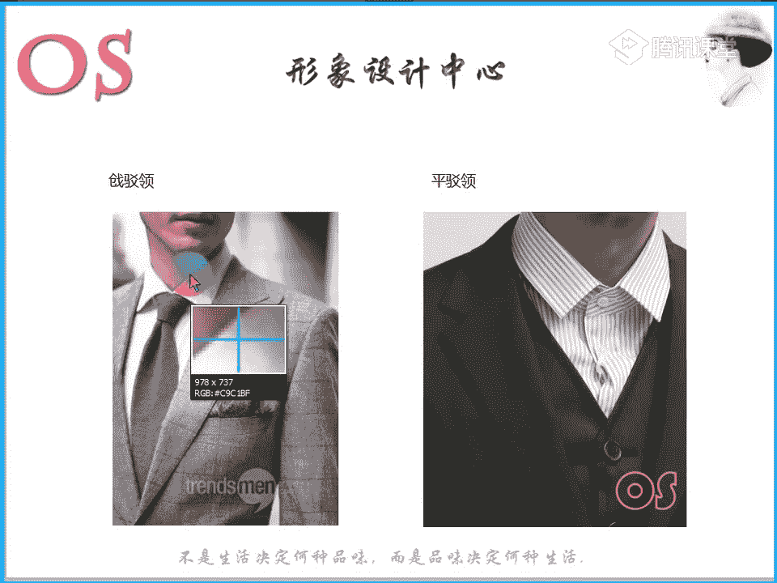
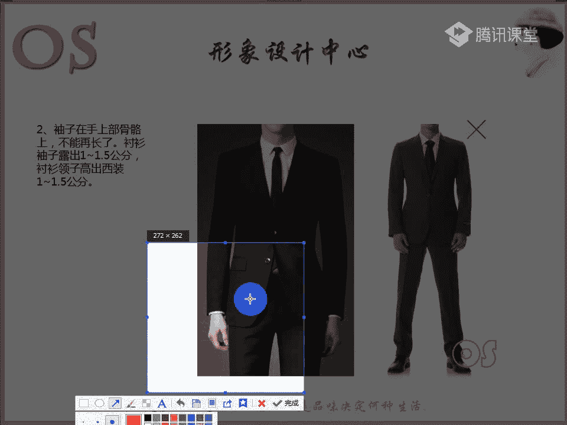
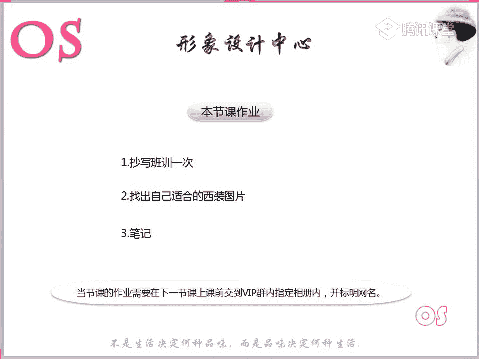

# 1、03OS男士形象VIP班《形象课》：第5节、正装的着装原则（一）

现在呢正式开始我们今天的课程。那么今天呢要跟大家分享的呢是我们正装的着装原则。那么因为男士哦以后不管是我们可能有些同学现在还在上学，有的同学可能已经步入社会了。

那么男士的正装可能有一些同学在工作上并不一定能够常用啊，但是我们要有这样的一个尝试，要知道怎么样去选择我们合适不仅仅是合适自己哦风格的这样的一款西装，那么还有呢包含我们这样的一些体型的等等。

都是跟我们在选择西装中有关系的。另外的话呢，西装的一些细节，唉，对于我们的一个影响也是非常重要的。所以说今天本节课的一个重点呢，就是首先我们要认知呢西装的种类哦，有哪几大类，不同的类别呢。

什么人去穿会更合适。第二个呢就是我们西装上的一些装饰啊，它的装饰是用来干嘛的，它的作用又是什么样。还有第三个呢就是我们西装的这样的一个穿。😊，法和选择。也就是说在选择西装的时候，我们要注意哪些细节啊。

要去避免的，以及呢要去注意的。那么在我们第三个内容中呢，都会重点去跟大家啊分享。第对于本节课对于大家的一个要求呢，就是理解我们西装的这样的一些种类和特点，以及呢清楚西装的正确的这样的一个穿法。

准备好了同学呢快速跟老师刷的鲜画，我们就正式开始今天的这样的一个课题。除了我们上一节课讲到我们男士的这样的一些场合，对不对？在我们的严肃职场上，我们就会运用到这样的一个呃正式的西装正装的这样的一些穿法。

另外的话，比如说我们可能要参加某些仪式的时候呢，也会要用到。比如说男士在参加婚礼的时候，自己的，或者是说呢我们有一些特定的这样的一些场合的时候呢，也会运用到西装。那么在讲正式的西装的种类的时候呢。

首先呢我们要明白我们这样的一个领型。那么像我们这样的一个领型呢，在呃女士的风格中，我们会用到这样的一些领型来诊断我们的风格，对不对？那么在西装呢男士的西装其实也是由呃它有几大领型。

第一个呢就是我们图中左图中这样的一个枪脖领。那大家会发现枪伯领的这样的一个特点呢，就是它的一个角度是非常尖锐的。看到老师鼠标这个位置啊，你会发现非常的尖锐。如果有的同学看不太出来的话呢。

我们也可以看到哎，看到这样一张图片啊，你也会也能够清楚的看明白哦。

枪脖领和我们的平脖领，大家去做对比，去观察我们老师鼠标的这样的一个角度，你就会发现枪脖领是非常的尖锐的，对不对啊？能够看出来同学跟老师扣个一啊，能理解枪脖领是什么样的一个领型啊。当然。

枪脖领有的枪脖领它偏大，有的枪脖领拼偏小。但是主要呢我们要看到这样的一个领形的这样的一个角度啊，它跟我们的平驳领是有区别的，它并没有平驳领跟枪脖领最大一个的对比呢就是平驳领并没有我们的枪脖领那么的尖锐。

它的角度没有那么的尖锐啊，相对来说取向于这样的一个平稳状态。那我们的枪脖领呢会更加的尖锐。从我们的视觉上。这个呢就是我们的枪伯领啊，一会儿呢会讲到我们这样一个西装的种类的时候呢。

还会告诉大家啊什么款式的西装它是什么样的一个领型啊。对于枪柏领这样的一个领型认知了的同学，快速跟老师扣个一啊。如果还有任何问题的话呢，老师再找几个图片给大家看一下。好嗯，看看有个问题。

什么问题可以提出来哦。😊，好，有同学看不出来的啊，然后呢，看到这张图片。不是的啊，其实你会发现西装的领型看到上面这个角度没有啊，看到老师鼠标，也就是啊老师画图给大家看啊。😡，看没有看到这个角度。

这个角度是不会变的。不管是这款西装也好，还是我们的啊，我们可以看到还是这一款西装啊，它的角。😡，因为这个西装的颜色的一个问题，可能有些同学呢看不太清楚啊，上面的这样上面的上就是稍等啊。

也就是说我们这两款西装的领型上面的角度呢都是一致的。

大家都能够看出来它不同的是什么呢？不同的是我们下面的这样的一个领形。这是我们右图中这款西装的一个领型。而我们左图中这样的一个西装的下面的这个领型呢，它相对比我们右边来说呢，它会更尖锐啊。

大家可以呢来看看老师啊标注的这两张图片。

如果觉得左图中啊左图这一款领型呢不够清楚的，我们来看到这一张领形，我相信大家也能够去看出来哦，明白没？好，其他两位同学能不能明白哦，刚才有问题的，然后老师呢把它复制到复制到这张图片给你们做对比吧。

你们会更仔细。也就是说你会发现哎。这款黑都是同样的是黑色西装，那这两个去做对比的话，上面的角度都是没有变化的，对不对？它的变化就是在它下面的这样的一个领型的这样一个角度啊。也就是说枪脖领啊。

那个字念枪啊，大家要要以后别写错了啊，这是我们的枪薄领枪薄领相对于平薄领的领型来说，它会更尖锐啊，要明白这样的一个领型呢叫做枪脖领西装领面叫枪脖领。那么还有包括我们有一些服装。

也就是说我们男士的大衣也好，还是包括女士的大衣也好，如果说你看到这样一个领型呢，这都是属于我们的枪脖领。那么如果看到唉类似于这样有一个夹角的领型呢，就是属于我们的平薄领啊啊，我们卡卡同学啊也明白了好。

那我们就接着往下面讲啊，这是我们的枪薄领和平薄领。下面一个呢就是我们的轻薄领。在轻薄领啊，在西装里面呢也有啊，只是说呢它更多的是出现在我们的一些礼服中啊，等到老师呃下一。节课讲礼服的时候呢。

会跟大家来分析的哦，这个呢是我们的青国领。也就是你会发现青国领呢它的领型更趋向于曲线感，对不对？嗯，它是一个曲线感的领型啊。那么呃不管是大衣也好，还是我们的西装都有这样的一个领型。

甚至的话有的领型可能轻果领它是偏大的青国领。那么像我们这个是偏小的。也就是说有的领型像我们的女士，有一些大衣啊，它的轻国领可能会很大。但是呢你会发现领子是没有角度的。

也就是说大部分是趋向于这样的一个廓形的，就是属于我们的轻国领啊，以上就是我们这样的一个常见的西装的领型。也就是说我们所有的不管是呃接下来老师要讲到的这样的一个欧式西装也好，还是英式西装还是美式西装。

在领型上它都是有区别的。😊，记住这三个领型。当然我们女士在测风格的时候呢，它的领型工具啊，还会有更多的其他领型。比如说我们的呃花边领啊等等的。但是男士的话呢，这是我们男士常见的领型啊。

一个是呢我们的枪薄领，一个是平薄领，一个呢就是我们的青果领。嗯，青果领呢是属于这样一个曲线型的领型。而我们男士的西装呢最常见的这样一个青果领呢，就是在我们的一些呃。

比如说我们这样的一些礼服上面会经常会看到。那么当然也不排除我们一些正装款式的西装也有啊，当然也是有的。好，接着呢我们来看到第一个今天的第一个知识点就是西装的种类哦。嗯另外属于直线型吧。是的嗯。

接下来看到我们的西装种类。第一个呢就是要讲到我们的欧式西装哦。欧式西装呢又称之为呢我们的T型啊西装的如果用字母表示的话呢，可以说它是T形款式的西装啊，廓形呢它也是呈现这样的一个T字状。

那么大家可以看到这张图片呢，能够直观的感受到，对不对？它的腰身和它的一个下摆呢都是呈现这样一个流畅线条的啊，并不会说像我们的X型西装呢，它会有这样的一个曲线感啊，它会有曲线感。

所以说这是我们的这样的一个欧式西装。那么欧式西装它的一个特点呢，就是突出我们的肩部的设计感。那么之前老师在讲男士的体型的时候就有说过，是不是男士最标准的体型是什么哦，还有没有同学记得的哦。

应该都没有记是不是就是属于我们俗称的用字母来表示的，就是我们这样一个T字型的身材。所以说呢它的重点就是在肩部嗯，倒三角很好啊。收腰的。而且它呢除了突出我们的肩部设计感呢，它还有个特点。

就是它是收腰的款式。腰身是收的。另外的话呢，它不仅仅是收腰，它还是收臀的款式啊，它不仅收腰还是收臀的。那么传统式的，也就是说最传统的我们的欧式西装呢，它是属于我们这样的一个双排扣，这是它的一个特点。

所以说大家在判断西装，它到底是属于是欧式西装还是美式西装还是我们的英式西装的时候呢，我们要抓住一些特点。那么像欧式西装，它除了整个廓形呈现一个T形以外呢，它还有一个特点呢。

就是取向于我们这样的一个双排扣，大家可以看到哦，双排扣。那么呢除了双排扣以外呢，它还有个最大的特点呢，就是我们的枪脖领啊，它的领型都是枪脖领。而欧式西装的话呢，它更加的去凸显我们的男人味。

当然它的后面的话一般是后开叉或者是。没有开叉哦，它这是它的一个特点，这是我们的呃T字形式呃款式的这样的一个西装。也就是我们的欧式西装后开叉哦，在后面开叉以及呢我们的没有开叉的款式，这是我们的欧式西装。

另外的话呢，它适合什么样的人去穿呢？适合一些身材比较高大的，或者是呢腹部大，但是它的大呢能很均匀的也是可以的。或者说唉臀部也比较均匀的。呃，如果说稍微大一点点臀部均匀的话呢，也是可以适合的这是身材上啊。

适合这样的一些身材高大啊人士。那么造型角度上来讲的话，也就是说哎如果说我们要去看我们的社会角色来说的话呢，就更适合一些比如说高管哪，或者说高端人士啊，或者是说唉那种型雄性感啊，比较那个强的。

如果说雄性感比较弱的人呢，我们就尽量少穿欧式西装啊，这是我们欧式西装的这样的一些特点，以及适合的人群，还有包括从我们的造型角度上来讲呢，更适合哪些人，等老师把所有的西装种类说完之后呢。

会具体告诉你们什么样的一个西装啊，什么风格的人去选择什么样的一个西装啊。这个点大家都记住没有啊，就是我们的欧式西装，都记住同学跟老师扣个一，还有哪个点没明白的，现在可以打打在公台上。好。

接下来呢就是我们这样的一个英式西装哦。英式西装呢它的一个特点呢就是廓形呢呈现这样的一个X型。那么还有呢就是收腰放臀哦，它跟我们的欧式西装。第一个区别的一个点呢，就是欧式西装是收腰收臀，对不对？

但是我们的英式西装呢，它是收腰放臀哦，它的臀部也就是说西装的下摆是微放的，而不是说呈现像我们的欧式西装一样，呈现这样个T字状的哦，这是我们的英式西装第一个特点，也就呈现这样一个X型。

那么还有它跟欧式不同的是呢，它比较束缚啊我们这样的一个身体。也就是说它很贴身，这样一个款式是非常束身的贴身的。另外的话呢，后摆一般呢都是以这样的一些呃双开叉或者是单开叉啊，它没有说不开叉的啊。

一般是双开叉，或者是说单开叉，看到没有？这是我们三款啊不同的这样一个西装的背面啊，有一款呢，第一款是单开叉的。第二款是双开叉的。第三款是不开叉的。而我们的欧英式西装呢，它是属于呢单开叉或者是哦双开叉。

有两种这样的一个选择。这是他的一个特点啊，非常好理解，也很好去判断。第二个呢就是他适合什么样的一个人呢？从身材角度来说呢，适合一些身材比较均匀的。然后呢，整个的这样的一个呃气质感呢比较儒雅的一些人士。

或者说唉文化气息啊啊比较重的一些人，或者是说性格上面比较收敛的一些人士啊。所以说像一些身材比较均匀的呢，是比较适合这样一款西装的。而且像我们亚洲很多一些大概在30多岁啊。

这样的一个30多岁、40多岁一个年纪的一个男士的话，一般如果让这样的一些明星选择西装的话，你也会发现很大部分人呢都会去选择我们这样一个X型的。也就是我们这样的英式西装啊。😊，那么从造型角度上来讲呢。

就比较适合一些中层的人士。比如说你在这样的一个职场上，你是属于中层管理的，是可以去穿啊，选择西装的话，你可以选择英式西装，或者是说一些机关单位的一些人在上班的时候呢，也可以去选择我们的英式西装啊。

另外的话呢整个轮廓啊，而且像这样的一个英式西装的话，大家也可以发现它有一个特点是什么呢？啊，一般呢都是以我们这样的一个平泊领啊，它的领型一般都是我们的平泊领。可能这张照片稍微有一点点远啊。

大家应该能够去看出来啊，稍微都是我们的平泊领。另外的话呢它是单排扣的啊，不像我们的欧式西装呢，它是双排扣。这样的一个英式西装的话，它是单排扣的。好，以上就是我们这样的一个英式西装啊。

大家还有没有什么问题？有没有问题啊？所以说大家呢去判断西装的时候，要抓住每个西装的这样的一些特点。X型啊、T型啊啊，什么样的一个领型啊，以及呢它的后面的开叉，以及它的扣子是单排扣还是双排扣。

这都是非常关键的这样的一些词汇啊。好，接着呢我们就来看看美式西装啊。美式西装的话，它其实挺有意思的。美式西装的话，它整个的一个廓形呢不像我们的英式，也不像我们的欧式啊，它是呈现这样的一个H型的。

所以说呢你会发现这样的一款西装呢休闲感十足啊，非常的偏休闲化。那么它的也有同学可能有有些人士呢会把这样的一个美式西装呢称为O型啊，可以O型。那么它其实里面呢穿这样的一个西装的时候呢。

里面可以去搭配毛衣啊，而且呢H型这样的一款西装的话，都是比较适合呢敞着去穿的。因为你把它扣上的话呢，其实不能不能像我们的啊欧式西装或者说像我们的英式西装，它能够去塑形，对不对？

它因为它整个是呈现这样一个O形状，或者说T型H形状的。所以说啊它适合呢去敞着去穿。另外的话呢，后摆一般都是呢单开。差啊胖的人瘦的人呢其实都比较适合呢单开。也就是说，其实如果说有一点点偏胖的人是，哎。

你要去选择英式西装的话，其实你也可以你想要达到显瘦的效果的话，你可以去选择单开叉的啊，可以去选择单开叉的。这是我们的一个美式西装。而且呢一般的话呢像这样的一个美式西装的话，都是以这样的一个两粒扣居多。

也就是说他身上的扣子一两粒扣居多，当然也不排斥啊，有一粒扣的，但是一般的话呢是两粒扣。而且整个廓型的话，大家要一定要记住是呈现这样一个H型或者说O型的非常的休闲啊，适当的比较宽松。

那么他适合什么样的一些人去穿呢？比如说如果说他是一个呃上了一点年纪的人啊，上了一些年纪的人，其实可以去选择这样一个美式西装。因为老师之前在讲年龄段的一个着装的时候，就有说过，对不对啊？

我们到了50岁之后，如果说你还没有退休的话，我们就可以去选择呢啊舒适和我们这样的一个正式去结合，对不对？那我们就可以选择呢美式西装。另外的话呢，如果说我们有一些男士，他的身材来说比较偏胖的话啊。

那我们也是。去穿美式西装，这是我们以上三大西装啊，传统的三大西装的一个判断方法。大家都明白，同学呢跟老师扣个一。接下来我们来看看一些改良版的。那么这样的一些改良版呢，也是遵循到我们这样的一个三款西装啊。

最传统的西装呢的一个基础上去进行改良的。好，那也是属于我们西装的种类啊，种类其中的一种。第一个呢就是我们这样的一个日式改良版西装。那么它当然就是属于我们窄版的H型西装啊，它是属于窄版的H型西装。

然后呢整个的线条呢是比较凸显这样的一些中性化的。而且呢呃相对来说你会发现改良版的H型西装啊，也就是说我们这样的一个日式改良版要相对于相对于我们这样一个美式西装化，你会发现线条来说啊，相对来说要更流畅。

对不对？会显得整个人的身体线条呢也会要稍微呢往往比较束啊，相对来说要比我们的美式西装束缚那么一点点。所以说它非常适合我们的一些东方男性去穿啊，适合我们的亚洲人去穿。这个就是我们的日式改良版。

也就是说小版的窄版的H型啊，当然它的一些特点的话呢，我们可以其他的一些特点，比如说呃纽扣啊，或者说开。差可以去参照我们的美式西装，但是整个廓形来说是呈现这样一个H状的，而且是比较窄的。

那么像我们市面上很多一些西装的话，大部分都是属于这样的一些日式改良版的西装啊，普通的一些西装店的话。接着呢就是我们这样的一个韩式西装，很多一些我们呃中国的一些个子比较偏小。

年龄比较偏小的一些男士是比较偏爱这样的一款西装的。因为呢他非常的精巧，对不对？而且也相对来说比较精短啊，一些个子不高的。如果说穿着太我们的西装太长的话，反而会给自己的身高做造成一些不必要的一些麻烦。

对不对？那么所以呢很多同学会会非常喜欢这样的一个韩式西装，因为它是属于我们X型，也就是说我们这样的一个英式西装的一个改良精短修身，你们也会发现它的一个特点呢，就是收腰啊，有那么一点点呢放臀。

也就是说它的一个下摆是往外放的，而且呢也是以一粒扣或者说双排扣呢为主啊，这个的话呢，它不像我们的英式西装是单个都是单排扣的。那么它可能会有更多的一些选择啊，包括领型上也是一样的啊。

大家可以呢多去啊观察一下，参照一下，但是一般的。😊，画像韩式西装呃，是属于以我们英式西装的一个基础上去加了一些不同的一些点。这个就是我们这样的一个西装的一个种类啊。那么在我们的时尚行业的话呢。

如果说你是从事时尚行业的话，其实你可以多去选择一些双排扣，因为它会更有设计感。而且这样的一个双排扣的话呃，它的一个时尚度也要比我们的一些单排扣更强。那么除了我们这样一个西装的话呢。

其实西装的量感也是非常非常重要的。那么在这里呢，老师呢跟你们说一下，你们可以记一下啊，西装的量感我们都知道人是有量感的，而不同的风格也是有量感的，对不对？在男士里面呢，我们最量感最大的。

我不知道有没有同学知道啊，男士风格量感最大的是哪个风格。可以去排列一下哦。有没有同学是知道的啊，知道同学可以呢在公台上打出来。呃，男士风格啊男士风格。

那么最男士风格最量感最大的就是我们这样的一个戏剧风格，对，对不对？那么我们人呢风格里面最重要一个因素就是量感。那么同样西装它也是有量感的。你们在选择西装的时候呢。

其实我们也可以考虑到我们这样的一个自身的风格，不仅仅要刚才像老师说到的啊，适合的人群，你们一定要记清楚，以及呢造型角度上啊的一个选择也是非常清要清楚的。因为这是关于我们场合的一个问题，哎。

关于我们这样一个隐形因素。另外的话呢，还有我们自身的这样一个风格，在选择西装的时候，也是我们要考究的一个标准。那么在西装的廓形看呢，我们最大的廓形是什么呢？就像刚大家可以来猜一下啊，西装的量感。

如果说单从廓形上来说，也就是说哎我们这样的一个T型啦。H型啊，日式改良版啊，以及我们这样一个X型。大家来猜一下这然这四款举例子啊，因为这个韩式西装其实是我们可以不用去提它，因为它不够正式。

如果说一旦如果说出现在我们这样一个正式职场的话，它是不可能以穿出去的。也就是说你在休闲的时候呢，我们可以穿这样一款。但正式场合的话呢，就以我们以上所说到的这四款为主，也就是说我们的欧式，我们的英式。

我们的美式以及日式改良版为主啊。那么在这四款，我们真正标准的这四款西装中，大家来猜一下，从廓形上看，你们会怎么样去排列。怎么样去排？啊？可能有的同学会回答的是T啊，T字型对不对？嗯。

可能有的同学说量感最大的，可能有的同学会说哎应该是H型。😊，T形更有感觉啊，嗯，我们的卡卡同学比较喜欢梯形啊，会飞用再贴呢把H型排为最量感最大的哦，也就是从廓形看，量感是最大的。嗯，好。

老师要揭晓一下正确答案啊。那么大家呢一定要记清楚啊，我说的是X啊，是的，好嘞。😊，老师揭晓一下正确答案啊，我们刚才回答的这两位同学呢，没有一个回答正确的啊。从廓形上看呢，量感最大的呢就是我们的梯形。呃。

T型也就是说我们这样的一个呢欧式西装，它的量感是最大的。嗯，然后其次是什么呢？其次就是我们的H型啊，也就是说我们这样的一个欧式啊，美式西装是量感呢排第二的。那我们校学同学啊，前两个都答对了，非常棒啊。

后面呢顺序就错了一点啊，老师呢揭晓一下啊，排名第三的呢是我们的日式改良版啊，日式改良版，它是排第三，不要看啊，它适合亚洲人去穿，但是它的廓形还是摆在这里的啊，它的廓型还是摆在这里的。

还是趋向我与我们这样个H状的啊。所以说它呢是排在第三啊，从廓形看呢排第四的是属于我们这样的一个什么呢？就是我们的英式西装啊，英式西装，从廓型看是排第四的，这个是我们的廓形啊。

另外的话呢大家去看西装的量感的时候呢，也。可以从我们的领型上去看。那么像枪脖领的话呢，如果说它还它的领型呃还比较大的话，那么这样的一个领型像枪脖领型排它是排第一的。其次呢就是我们的平脖领。

当然除了这样一个领型以外，还有领型，它是有大有小的，对不对？大家应该观察过像我们的一些。呃，大衣哦我们不用拿西装，因为西装一般领型它都会控制在一个范围内。那么你就像有一些大衣。

你就会发现有的大衣领子非常的大啊，有的大衣领子比较小，对不对？所以说大衣，你去看领型大和小的话呢，你也是可以啊去看领子的面积去进行判断啊，这个就是我们这样的一个量感啊，稍微跟大家带一下。

另外的话呢接下来大家一定要记清楚啊，我们男士呢是分为五大风格。第一个呢就是我们的戏剧风格。如果说以后哦我们碰到戏剧型的一些顾客，或者是说我们在场的同学唉风格里面有是属于戏剧型的。

我们就尽量呢选择西装呢选择这样的一个欧式西装啊，戏剧型的人是适合呢我们的欧式西装的。大家记好啊。😊，欧式西装。好，接下来呢来说到我们的自然风格啊。如果说我们是自然风格的话呢，我们可以选择什么样的呢？

选择美式西装，以及呢我们的日式改良版西装。可以选择这两款西装啊，如果要穿西装的话，可以选择美式西装以及我们的日式改良版。那当然啊像我们的自然型的话呢，它最适合呢上下分身搭配穿着。

所以说自然型的人如果说哎你们在属于一般职业场合的话呢，其实你去把西装拆套穿要比其他风格的人拆套穿会穿出更好，穿的更好看。好，接着呢我们来再说下一个大的风格，就是我们的浪漫风格的男士啊。

如果说是浪漫风格的男士的话呢，我们在选择西装的时候呢，其实主要是要抓住什么呢？抓住我们这样的一个领型，最好是以平薄领的西装为主。这是我们的浪漫风格，最好以平泊领的西装为主，这是第一个。

第二个呢就是我们浪漫型的人在选择西装的时候呢，一定要去选择我们面料上呢要上乘的啊，面料上一定要上乘的。那么在款式上，一会儿呢就遵照老师所说的第三个特点啊，我们西装的穿法和选择去选择就好了。

因为它毕竟也是一个大风格，所以说它在我们西装款型的一个驾驭度它也是相对来说比较高的，只是说哦唉浪漫风格的人呢要注意的一个点，就是以平薄领为主。然后面料上一定要上乘。

甚至说面料上如果说带有一定的光泽度也是很好的。嗯。对啊，浪漫型的风格，因为它要体现这样一个质感啊，还有包括古典型的人也是这样的。所以说面料上它是一定有要求的。😊，接着就是我们的古典型。古典型的人呢。

以后我们遇到这样的一些西装的一些场合的时候，就要注意呢，可以多去选择英式西装，选择英式西装。那么如果说呢选择其他款式的，我们就要注意了，其他款式的是也可以去穿。

因为毕竟啊在所有的风格中像古典型风格的人是能够把这样的一个正装穿的特别特别好看的。所以说呢像其他的一些款式，它也可以多去尝试。只是说你在不管是在尝试这样的日式改良版也好。

还是说我在尝试这样的一个T字型的啊，也就是我们这样欧式西装也好，我们都要选择呢做工良的款式啊，做工精良的这样一个面料，以及呢剪裁合体的剪裁一定要合体，以及呢我们的一些式样，一定要传统一点啊。

不需要有太多设计感，或者说啊这里呢做一个点缀啊，那里有一些呃很很多的一些设计。😊，需要我们就以最传统的这样的一些。好像我们可以用一些呃用一个话来形容，就是比较死板的这样一些款式是最好的。

也就是传统的式样。而且的话呢像我们的古典型啊，去选择西装的话呢，去选择这样的一个三件套式的一个穿法是最好的。好，这个就是我们的古典型啊。如果说呢是前卫风格的男士的话呢，我们就可以选择一些小枪脖领啊。

因为前卫型它毕竟是一个非常呃在风格里啊，它的驾驭度，也就是说它对于图案也好，对于色彩的驾驭度它是很高的。那么它也适合去制造一些尖锐感，就像它去穿一些铆钉啊等等的，它是非常好看的，非常不错的，对不对？

所以说西装的领型也是一样的，去可以适合呢去制造这样一个尖锐感。那么呢像一些枪脖领就非常适合它。但是呢大家可以看到这样一个枪脖领啊，这样的一个枪脖领呢，它的领型还是稍微偏大了一点。对于我们前卫风格的人。

因为毕竟前卫风格是在我们所有风格里面是男士风格里面是一个小风格，对不对？所以说呢选择一些小枪脖领啊，小枪脖头的。😊，呃，三件套就是指我们这样的一个呃背心，加加上这样一个西装啊。因为一般西装的话。

它是不配背心的，对不对？而古典型的人是适合去里面加一个背心去穿的这样一个三件套。好，回到我们这样的一个前卫风格啊。前卫风格呢它可以去穿一些小枪脖领，不要穿太大的啊。因为领型太大的话，我说了啊。

领型也可以看量感，对不对？前卫风格是一个小风格，所以说领型的量感也要小一点。我们选择小枪脖领。另外的话呢在选择其西装的时候呢，要呃可以选择一些多粒扣的，或者是说呢领口相对来说小一点的。

什么叫领口小一点呢？大家可以来看看这个西装去做对表。这是整个我们去忽略掉里面的内搭啊，忽略掉里面这样一个背心。我们可以看到这个领口是不是很大是不是很大啊。哎，我们再来看看这个西装。

这个领领口是不是要小一点，我们可以看到这个V字形的一个区域啊。😊，看到没有？这个大家都能理解吧。所以说我们前卫风格的人呢，领口要选择小领口的啊，不宜呢选择大领口，也就是说领型要选择小的。

当然领口呢我们也要选择小一点的。然后整个的话呢合体收身的款式。这个就是我们这样的一个风格中啊，要选择这样的几款西装中要注意的啊，大家还有没有什么问题？没有问题的话呢，快速跟老师刷的鲜花。好。

看了完了我们这样的一个正式的西装呢，我们来看看休闲的西装啊。当然除了正式西装以外，西装还有一个分类就是我们的休闲西装。休闲西装怎么去判断呢？第一个它就是有明兜啊，我们可以看到这样一个西装。

如果它的材质不够硬挺，或者它的材质不是非常的显得很精细的话，我们其实都可以把它归到休闲西装，这是从材质上看，那么第二个呢就是有的休闲西装，它都是有明兜的。比如说像我们这样的几款，对不对？这样一款西装。

它就是有明兜设计的哦，跟我们。😊，正式的西装是有很大区别的，看到没有啊？我们是有明兜设计的。另外呢还有就是有些西装它是有明线的。大家可以看到我们像我们右图中。这样的一款西装的话。

大家可以看到这样的一些线路哦，它的一个拼接，它的一个缝合是非常清晰的，对不对？那么像这样款西装也是属于我们的啊休闲西装啊，另外的话呢像到魏晨身上这一套哦，这样这样一件上装啊，也就是这个西装。

有些同学可能会觉得唉面料也很硬挺啊，好像也很精细，对不对？为什么也把它归到我们的休闲西装呢，为什么呢？因为它有这样一个小细节，大家可以看到没有？袖子是非常有设计感的。😊，啊。

这个可能有些同学能够看清楚啊，我们可以仔看仔细一点啊，袖子这里是有设计感的。所以说呢我们要去看判断这件西装它到底是正式的还是休闲的呢？除了从我们的名兜明线以外，还有包括面料上以外呢。

我们还可以看看它的一些设计。如果说它有很多一些贴布啊，或者说其他设计。但是说款式是我们这样一个西装夹克的款式的话呢，那我们也归到我们的休闲西装。另外的话呢，像这样的一些西装，可能有些同学会好奇了啊。

为什么它不属于正式的西装，而属于休闲西装，是从它的廓形上来看的啊，从我们这样的廓型，你会发现非常的精短，对不对？所以说更具有这样一个时尚度啊，更具有时尚度。😊，呃，不是传统风格的西装，都是属于休闲西装。

是吗？可以这样去理解啊，但是我们要整个去考究哦，要去抓住一些特点。你就像这样的一些西装的话，你会发现它并没有我们正式的西装的这样的一个严谨度，对不对啊？

我们如果说穿成这样的一套啊西装去开我们这样一个谈判会议的话，是不是为未免有点像我们要我们好像是一个时尚职场的人士啊，并不是说啊像我们一些传统行业的这样的一些呃工作的一些人啊。

所以说大家要知道我们要去看这样的一个廓形，廓形也是非常重要的，以及它这样的一些设计感呀、面料啊、图案啊，都跟我们西装啊有很大的一个关系。所以大家呢通过我们老师所找的这样一个休闲西装的一些图片呢。

你们去参照啊去对比的去看我们的正式西装，就能够去很快的理解呢，它两者之间的差异。那么其实像休闲西装最多的是哪个品牌呢，大家也可以去看一下啊，就是我们呃好像是。

美国的品牌还是老师老师记得好像他的那个英呃中文名字叫。就这个西装啊，这个牌子的叫汤姆布朗，大家可以去搜一下啊，汤姆布朗。他家的西装呢，你会发现有很多的这样的一些设计啊。

即使说我们这样的西装它没有这样的一些条纹状，也可能它的后面呢有一个小的这样的一个标志在这里啊，有一个小标志在这里。像这样的一些西装都是属于我们的休闲款式的西装。

甚至他家的西装还有一些是属于有一些小流苏的啊，这样的一些设计的。啊，这个就是我们这样的一个休闲西装啊，对于休闲西装，大家还有没有什么问题，也就看它的一些设计啊。如果说它的设计感很很丰富。

或者说它有一些明兜明线的这样的一些设计，或者说它的一些功能性非常强的话哦，它的设计感很强的话，都是属于我们这样的一个以及它的版型啊，都是属于我们这样的休闲西装。而我们正式的西装，它相对来说要传统很多哦。

也就是说我们可以用一句话就是说比较古板啊，比较死板这样一个廓形。功能性是极强的，我们这样的一个休闲西装。所以说呃在讲场合的时候，我说男士呢如果说在这样的一个一般职场的话，哎。

我们不用说一定要固呃把一些我们这样的一些服装呢去选择固定到一些夹克。其实我们选择西装夹克也是非常不错的一些选择。因为计时尚的同时呢又非常的适合我们这样的一个场合，对不对？当然哦，像太花的。

我们就不要穿到呃一般职业场合了。我们除非说你是做时尚行业的那是可以的。但是如果不是的话，我们就不要穿类似于这样的一身。我们可以呢在我们的。比如说都市休闲的时候呢，去穿着。好。

大家对于这样的一个西装的分类啊，还有没有什么问题？没有任何问题的话，快速跟老师刷朵鲜鲜花。接着呢我们来看看西装的一些装饰啊，它是用来干嘛的。好，西装的装饰呢第一个就是要认知的就是我们这样的一个插花眼哦。

我们都会发现呢西装这里有个扣子，有个扣扣眼，对不对？但是很多同学都不知道他是干嘛的啊，其实呢它是叫我们的。😡，呃，插花眼是叫做我们这样一个插花眼，呃，可以去呢放一些白玫瑰花呀。

或者说唉这样的一些呃无叶的这样的一些装饰啊等等啊。像我们一些新郎的话，如果说我们呃参加这样的我们举办婚礼的话，一般呢花是放到这个位置的啊，这就是插花用的。那然后呢在现在的话呢，可能很多一些男士。

如果说是穿着我们呃一些正式西装的话，可能有一些公司，有一些单位的话，他也会有这样的一个徽章，对不对？一般也是把徽章呢别在这样的一个位置。那么当然如果说你是穿休闲款式的一些西装。

然后他也有这样一个插花眼的话呢，我们也可以去别一些呃徽装徽章。这里面，嗯，这个就属于我们这样的一个插花眼啊，叫做插花眼。现代呢是用来呢插这样的一个徽章的啊，在之前的话呢。

我们是去呃以及在我们这样的欧洲的。几世纪前呢是放花的哦，这样的一个插花眼。好，除了我们西装的左侧呢有一个扣眼以外呢，你还会发现西装的左侧呢还有一个上口袋啊，还会有一个上口袋。那么这个手靠上上口袋呢。

我们其实主要是放什么呢？放口袋巾的，那么它在它的作用呢，之前的一个作用是干嘛呢？是用来擦眼镜的啊，也就是说放一个这样的一个口袋巾呢，哎，时不时的可能擦一下我们的眼镜，用于一些社交场合，你就像一些男士呢。

如果说是穿我们的正式礼服的话，一般我们的西装左侧都会有这样的一个呃扣有有一个上口袋。那么一般都是放我们这样的一个呃口袋巾的。那么最正式的颜色呢，就是我们的白色啊，正最正式的颜色就是白色。

那么如果说在其他一些场合的话，我们也可以放其他颜色，或者说其他的呃花纹。也就是说像我们到了一定的年纪的时候呢，就可以呢用这样的一个口袋巾来体现。自己的这样的一个感性元素，对不对？包括叠法的话非常简单。

就像我。右图中啊这样的一个展示的，当然也可以去对折啊，对折之后呢，再进行交叉啊，像我们这样的就是个交叉，然后放进去也是可以的。只要保证呢上边呢是这样一个平整的一个状态。

第三个呢就是我们西装扣子上的一个扣眼，叫做呢袖口钉啊，叫做袖口钉啊，也叫袖口扣。那么西装的这样的一个扣子呢，它既可以增加我们的服饰的美感，那也可以呢防止我们衣服的一个磨损啊。

最开始呢是拿破仑军队呢创造的啊，因为防止我们的衣服磨损。拿破仑军队呢把我们的袖口上呢，把它的这样的一个军装上钉了很多这样的一些扣子。那么从而呢后面演变成在西装上去增加这样的一些设计感。

而来防止呢不仅仅是增加美感，同样可以呢来防止我们衣服的这样的一个磨损。好，第四个就是我们的西装的垫肩啊，垫肩的主要作用呢就是让我们的西装的一个肩部处呢看上去平整好看啊，尤其像我们有些男士呢。

可能它的肩部是平整的。而有些男士啊相对来说有一些溜肩，包括女士也是一样的。所以说垫肩呢它有这样的一个好处啊，让肩部呢看上去更平整，更好看，同样它也能够呢去塑造我们男士的这样的一个标准的体型啊。

把体型呢往我们的标准的去塑造，这是我们的一个西装的一个垫肩啊，它的主要的一个作用。以上呢就是我们西装的这样的一个四大。装饰大家要记住的重点呢接下来我们就看到第三个啊，这样的一个问题应该大家都能够清楚。

记住啊。而且呢要要记住一个重点，就是第二个老师刚才所说到的，哎，左侧的一个上口袋叫做呃主要是放口袋金的。那么最正式的颜色呢，一定是白色啊，这是一定要记住的其他场合的话呢。

我们可以去根据自己的这样的一个喜好去做改变。但是在正式的场合，比如说婚礼也好，还是说我去参加这样的一个颁奖仪式，我要着礼服，或者说我去听这样一些音乐剧。那么你在佩戴口袋金的时候呢，一定要去佩戴白色的。

😊，好，接着我们就来看到今天的第三个非常非常重要的一个点。除了我们刚才所说的，要根据自己的风格去选择西装以外啊，还有包括我们的一个社会的角色，还有包括我们的这样的一个身材去选择西装。另外的话。

哎我们知道的西选择西装的这样一个大的一个范围。那么具体在试穿的时候，在做啊定制的时候，要注意一些什么，这是非常重要一个点。也就是说西装的一个穿法和选择。第一个呢就是我们不要去小看这样一个西装啊。

不管是裤长也好，还是说我们的袖长，还是说我们这样的一个西装的上衣的一个下摆，它停留在哪个位置，都是非常非常重要的。第一个呢就是衣摆呢，我们一定要到我们的臀围线。大家看到没有？看到我们这位男士啊。

右图中衣服的下摆一定是要在你的臀围线啊下方啊，臀围线的这样的一个偏下一点点啊，不用一定要盖住你的臀部。也就是说在你的臀围线的一个下方，这是我们可能有些同学在试穿的时候。

并不能够去观察到后面的这样一个长度。那么我们还有一个什么办法呢？也就是说你。穿上西装之后呢，扣好之后呢，我们手臂自然的一个垂直，自然的垂直之后呢，你的下摆刚好刚好呢跟你这样的一个手部的虎口啊。

刚好是下摆跟你的虎口是平行的啊。那么这样一个长度也是合适你的，这是衣服的长度，也就是上移的一个长度要怎么样去选择呢？选择跟你的虎口啊，手臂自然下垂之后，跟你的虎口是平行的这样一个位置啊。

大家应该都清楚虎口是哪个位置吧，有没有不清楚的啊，都清楚同学跟老师扣个一。这是我们的虎口啊。好，飞龙在天不清楚啊。老师呢因为这张图片比较清晰，给你们。

画一下。看到没有啊？箭头的一个地方就是我们的虎口啊，虎口你手的虎口啊，手指的虎口。😡，好，现在清楚了没啊，现在清楚了没？老师这样标注能不能理解啊，虎口。😡，这个就是我们的虎口啊。

以后别人问你手的虎口在哪里，你要知道啊。😡，所以说下摆呢在虎口上，这是第一个。第二个呢就是肩膀与自身的一个肩膀去做对比的话呢，也就是说你的西装啊，西装这样的一个外套的一个肩膀。你试穿之后呢。

刚好比你自身的一个肩膀宽出1到2公分就是合适的。也就是说你穿好之后呢，你可以呢我们用手去摸一摸，压一压哦，看看这样的一个肩膀跟你自身的一个肩膀是不是它有1到2公分的一个赋余空间，那就是刚刚好的。

这个时候我们穿着呢是最舒服的这样的一个状态啊，最舒服的这样一个状态。这是我们第一个西装要注意的啊，也就是我们第一个点要记住呢，长度怎么样去选择虎口跟虎口是平行的啊，虎口平行就如图中啊，如这样的图片一样。

跟你的虎口是平行的。第二个呢就是我们这样一个肩膀西装的肩膀一定是比你自身的肩膀宽出1到2公分，这是最合适的，不可以呢，跟你的跟你的肩膀是平行的，或者是说呢比你的肩膀宽到三四公分，太宽的话肯定是不协调的。

对不对？如果太紧的话呢，哎你抬抬手啊，这样的一些举动都会不太方便啊，有点束缚你有点压迫感。好，第二个呢就是我们这样的一个袖子。嗯，袖子的长度怎么样去选择呢？唉，袖子呢最好是在你手上的骨骼上啊。

你手上部的一个骨骼。那么现在我们同学呢可以自己呢把自己的手伸出来啊，跟着老师啊把手伸出来之后呢，唉你就会发现你的手腕的这样的一个位置，有一个骨出来的这样的一个小节，有没有摸到啊。

手腕把你的手伸出来之后啊，把袖子呢捋上去一点。我们这样撸上去这样一看呢，我们会看的更仔细啊，你会看到你的手腕呢外围手腕的外围呢，有一个骨出来的这样的一个小骨包，也就是这样的一个骨骼有没有摸到。

摸到同学跟老师扣个一。😮，好，也就是大概是这样的一个位置啊。😡，霍建华，你我们可以看到他这个手腕是有点点鼓的啊。好，我们的飞龙在天有没有摸到自己的这样的一个小骨骼啊。

也就是说会有一点点突出来一个小骨包啊，也就是说你手平行之后，你最能够看出看清楚哎，这样的一个外轮廓啊，有一个小骨包嗯，手臂的外侧。手腕的外侧有一个小鼓包。那么呢我们的西袖子长度啊。

西装的袖子的一个长度呢最好就是刚好呢停留在你这样的一个骨骼的上方就可以了啊。也就是说刚好停留在你骨骼上方，不要说去超过盖住你这个骨骼，因为盖住的话又太长了一点，最好就是在它的一个上方。

这样一个长度是最好的袖子的一个长度啊，最好是在这个上方啊，不能再长了，一定要记住啊，不能再长了。这是第一个。第二个呢就是衬衫的袖子啊，我们西装的袖子呢确定之后呢，我们就要确定衬衫的袖子。

衬衫的袖子呢当你穿好了衬衫，衬衫的一个大小都合适了。这个时候呢，你再套西装，因为西装的一个袖子你也选对了，对不对？在你的骨骼的上方，那么然后呢衬衫的袖子呢刚好是露出来1到1。5公分。

就如我们左图中这位男士啊，你会发现呢衬衫跟西装袖子一做对比，你就会发现它只是露出来那么一公分的样子，对不对？所以说一定要注意露出1到1。5公分，不可以像右图中啊，袖子啊长到你的衬衫啊，袖子我都看不见了。

而且呢这样的一个袖子一个长度也是太长了，就会显得人有点脱沓，所以说要注意要选择显得自己呢身板啊，各方面要出彩的话呢，袖子的长度以及跟你呢。😡，哦，衬衫的袖子的一个长度都是至关重要的这是我们的袖子。

第二个呢就是。我们衬衫的领子。领子怎么看呢？领子看后面，唉，如果说这样的一个领子啊，从后面去观察就可以了，不用去观察正面。因为正面的话，因为领子的这样的一个大小的一个问题。

以及跟你西装领型的一个呃高啊矮的这样一个问题，它都会正面会有一些差异。但是我们主要看后面，也就是说唉穿好之后呢，观察一下后面如果说这样的一个衬衫哦，跟你的西装衬衫的领子跟你的西装一做对比呢。

高出西装1到1。5公分的长度就可以了。高出1到1。5公分啊，不要高太长啊，也不要说呢落到了你的西装的领子里面，一定是衬衫要比西装领子呢要长的，而长出来呢1到1。5公分是最合时宜的这样的一个长度啊。

这是我们第二个点。😡，第二个点，大家有没有什么问题啊？因为可能讲的内容稍微多了一点点哦，有没有同学没有听清楚的哪个点？好，能理解哦能理解，我们就接着往下面讲。好。

第三个大点呢就是我们领带的这样一个长度啊。大家要知道领带它是有长有短的，是大家去观呃去商场逛的时候呢，就会发现啊，它是有长有短的。我们要根据自己的身高去选择。如果说你的身高呃比较矮的话呢。

我们就选择短一点的。如果说身高比较高呢，我们就选择长的。所以说一般的长度在133到145公分的这样的一个区间。所以说根据自己的身高去做选择。另外的话呢整个领带打完之后呢，我们最合时宜的呢就是停留在啊。

一定要注意这样的长度，最好的长度是什么呢？打完领带之后呢，位置是在你腰带的上面，最好的长度是腰带上面，不要说离你的腰带太远，或者说呢盖过你的腰带啊，都是不可以的。

所以说大家在打领带的时候要一定要去注重去调节啊这样的一个长度。所以有时候呢我们如果说个子矮的同学啊选择领带，比如说我是一个1。7米左右的这样一个个子，我选择1个145公分的。可能我打完之后呢。

是我前面呢注意了它刚好停留在我的领带上面。但是有可能它内侧的这样的一个呃节呢它可能就过长啊，就可能会比你外侧这样的一个大宝剑头呢还要长，所以说呃避免这样的一些尴尬呢。

我们就注意呢领带的长度根据身高去选择，而且领带的一个打法也非常的简单啊。在如果说有不会的同学呢可以在网上去搜一下啊，这样的一个步骤它都画的非常的清楚，非常的简单。这是领带啊。

第四个呢就是我们这样的一个鞋子啊，之前有说过，对不对？我们在正式啊职业场合的话，鞋子不能选择什么样的鞋子，不能选择我们的牛津异尾，对不对？这样的一些镂空镂花鞋。那么所以说呢如果我们要穿正装的话呢。

我们选择的鞋子，最好是选择这样的一个系带的皮鞋哦，不要去选择我们这样的一些呃梦克的呀，就是有扣子的等等的。我们最好最标准的，也就是说最正式的皮鞋呢，就是我们的系带皮鞋。当然在选择系带皮鞋的时候呢。

我们会发现有的系带皮鞋啊，它当然有的是有镂空的啊等等。但是我们最好就是不要选择有镂空的。另外的话呢像这样的一个一横截面的哦，有横截面的，可以，或者说这样的一个系带皮鞋它什么都没有，连横截面也没有。

那么在我们的正式场合呢也是可以穿的啊，但是有一点点横截面也没任何问题啊，所以说我们大家在。😊，搭配正装去穿着的一些鞋子的时候呢，尽量选择系带的啊，有镂空的也好，还是说呢呃不知道有横截面的也好。

还是说没有这样一个横截面的都是可以的。那么当然啊鞋子的一个质感呀以及光泽度啊。同样都要去注意啊，如图所示啊，一定要有这样的一个质感，有这样一个光泽度。第五个呢就是我们的裤子的一个长度。

很多人呢在选择西装也好，还是说在选择一些休闲裤的时候呢，长度是经常会犯错误的。那么尤其在西装的时候呢，长度非常的重要啊。如果说长度没有去注意的话呢，我们也可以看到类似于这样的一些错误的示范。好。

大家可以看一下哦，这三张图片给你们什么样的一些感觉啊，可以把你看到的这样的一些关键词，给你心里的这样的一个感受呢。唉，在公台上呢跟老师提出来。😊，🤧。结婚拍婚纱照。😊，呃，所以说裤子啊看裤子啊。😮，啊。

我们潇潇说了，拖它嗯，很好。是的。😊，所以啊我们的裤子的长度非常的至关重要，怎怎么样去选择呢？第一，我们穿上这样的一个西装裤之后呢，裤子的长度呢到你鞋帮的位置。

也就是说在老师鼠标的这样一个位置是最好的啊，刚好呢在你鞋帮的这样的一个位置啊，鼠标的这样一个位置。那我们可以看到这位男士的一个示范啊，所以说这位男士的裤子一个长度是非常非常好的。

你也会发现刚好就是盖住一点点我们这样的一个鞋帮啊，所以说整个的话呢显得西装裤子呢又很笔挺，对不对？哎，又不显得那么的拖沓。这第一个。第二个呢就是我们的袜子啊，很多时候在男士在选择袜子的时候呢。

也会出现这样的一个失误，不仅是在西装上我们要注意。那么其实我们如果说在一些生活中我们选择袜子的时候也是一样的。我们一定要选择呢袜子的颜色呢比裤子的颜色啊稍微深一点。

那么同样在选择西装裤的时候呢呃在选择西装的时候呢，我们的袜子颜色是一定一定要比西装的颜色深的。另外的话呢，不要去穿着这样的一些短袜啊，在穿着西装的时候，在这样一个正式场场合，我们一定要选择长的袜子。

那么你像在一些欧美的话，男士的这样的袜子，它的长度是非常长的。也就是说避免呢去避啊去可以呢很好的。😊，避免出现这样的一些尴尬。不要把皮肤露出来啊，长度一定要长啊。所以说我们以后自己在穿着西装的时候呢。

去多买几双长的袜子啊。一般像有一些男士这样的一些袜子的话，一般已经快到我们的一个小腿肚的啊，小腿肚子的这样一个长度了。大这样的一个长度是最好的。因为毕竟我们西装的裤子的一个长度是在鞋帮。

在鞋帮的一个长度的话，你一坐下来，如果你选择我们左图中这样一个短袜的话，肯定会把皮肤露出来啊，大家也可以看出来，看到啊，把皮肤露出来相当的尴尬哦。尤其是哦我们男士哦非常非常的尴尬，而且穿着正装。

所以说一定要选择长一点的袜子。那大家也可以看到西装的长度包括黄晓明稍微做一些调整之后呢，你会发现如果说我们在选择一些休闲裤也好。哎，比如说我们在一些一般职场像这样的一些啊上半身正式下半身休闲的一些穿着。

还是说我们在穿一些礼服呀，或者说正式款式的一些西装的时候，一定要多注意西装裤子的长度啊，非常的重要。大家也会发现，就像我们潇潇说的，哎，会显得腿短是的啊。当做一下调整之后呢。

哎比如说我们中间这张图片是不是就舒服很多唉，就要显得腿部的一个线条都要好很多啊。😊，所以说不管是西装也好，还是说我们这样的一些呃偏休闲款式的这样一个套装的西装也是一样的裤子呢。

我们尽量啊还是说我们自己的一些牛仔裤啊等等的。其实尽量呢选择呢穿好之后啊，它呢在你的鞋帮的一个位置，或者是说我们选择九分的，那就不用去顾忌了。但是如果说选择长裤的话呢，就一定要注意了。

千万不可以穿的那么的拖沓。你就像我们的黄轩对不对？脱沓和不脱沓完全是这样的一个两个概念哦，你裤子穿的不脱沓的话呢，人也要显得精致很多，也要显得精神很多。😊，好，第六个呢就是我们裤子啊。

西装裤子的这样的一个嗓道。那有嗓道的呢，它是适合胖的啊，瘦的人呢是不适合选择嗓道的啊。因为这样的一个嗓道的话呢，它其实就像我们呃刚才我们之前的课程上有说到过这样的一些试错是一样的，它会呈现啊。

就是出现这样的一个横竖条纹，对不对？那么竖条纹不密集的时候，它是会显瘦的，对不对？所以说如果说呢我们是瘦的人，那我这个西装呢，它有这样的一个嗓道啊，这是一个多音字，读嗓。那么如果有这样的一个嗓道的话呢。

我们可以拿熨斗去把它熨平。但是如果说是胖的人呢，你在选择西装的时候呢，我们就一定要多去选择这样的带嗓道的。当然啊，屁股后面呢一定要把它熨平了，再去穿啊，不能屁股后面这样的一个嗓道很明显啊。

这是我们在选择西装裤子的这样的一个嗓道的一个问题。同样如果说休闲裤呢，我们也会发现有的休闲裤，它也是有嗓道的。有些休闲裤是没有嗓道的。如果说我不。😊，适合有嗓道的。

我就一定要把这样的一个嗓道呢进行熨烫啊，把它熨平。好，这个就是我们的西装啊，在穿着上的一些正确的穿法，以及在选择上要多注意的一个地方。大家还有没有什么问题？对于这样的一个知识点，有问题同学可以提出来。

没有问题的呢，快速跟老师啊啊，扣个一。呃，老师是是马上叫嗓道，是的哦，叫嗓道哦。😡，多音字。好，什么叫嗓道？我们可以看到这样有一条运，有一条直线，有没有看到？😊，哎，我们中间啊裤子的中间啊。

即使我们说的是酷线吧啊。对，可能大家可能普通同学就会说到酷线。但是在我们的服装设计里面呢呃还有以及跟服装有关的啊，我们在做设计的时候，一般说的这样的一个酷线，中间的酷线我们叫做防道嗯。😊，是的。

你们也可以理解酷炫也可以哦。如果说要专业一点呢，我们就叫它扫道。还有包括这个伞道的问题，大家也可以在女士，我们在穿衣服的时候也可以多去运用啊。嗯，这个裤子这根中间的这样一个裤线，它的一个作用啊。

不要觉得它好像就是好像就是一个设计而已啊，其实它是有它的一个效果的。好，大家还有没有什么问题？啊，没有问题的话呢，我们可以看到这里。当我们在穿着西装呃，或者说在选择鞋子做搭配的时候，有一些疑惑的时候呢。

我们可以大量的去参照这样的一张图片啊，大家可以来参照一下。所以这张图片如果说有同学想要啊保留的话，我们也可以把它截下来哦。基本上呢我们黑色的皮鞋是百搭的，但但是要注意的一个点啊。

如果说嗯去搭配一些浅色的服装的话呢，尽量可以去跟我们这样的一些中性色的皮鞋的颜色去做搭配。当然是最好的。所以像像这样的一些中性色，你也会发现，哎，图中啊出现最多的就是一些中性调的这样的一些色彩，对不对？

好，这个就是我们今天呢所有的课程的一个内容啊，也就是说三个大的知识点。这呢就是我们西装的种类啊，以及我们西装的这样的一些装饰，它是用来干嘛的啊，它的一个作用。第三个呢就是我们西装的这样一个正确的穿法。

还有它的一个选择。那么大家如果遇到唉一些场合必要的时候，我们要选择西装。而且像男士的话呢，啊就像我们女士啊衣柜里呢最好是要有一条小黑裙是一样的。因为你可能会遇到一些场合。

而且像这样的一些黑色的这样一个裙装啊，小黑裙的话，它真的是可以出席任何的场合，我可以不毫不夸张的。比如说呢哎我们女士穿一个小黑裙去参加婚礼的时候，我如果说运用一些呃这样的一些项链呢。

或者说胸针啊去做点点缀的话，我们立马就可以呢显得华贵起来。然后就可以参加这样的一个婚礼，对不对？当然如果说我们遇到一些葬礼的话啊，你像我们也要穿黑色服装，那么像小黑裙，我就可以把一些。😊，都拿掉。

然后呢啊非常线条非常干练的这样一个小黑裙，我们就可以参加一些葬礼。其实就是这样的，他可以参加任何的场合。而我举的一个例子呢，就是拿两个对比非常强的场合来跟大家举例子。

所以说像女士我们的衣柜里一定要有一条小黑裙。即使说呢哎我的一个颜色，我的皮肤颜色不适合小这样一个黑色，我们可以去运用其他的一些方式方法去做改变。比如说加外套也好。

还是说我去加这样一个丝巾都是可以做改变的。所以他非常的百搭。那么像男士呢我们是一定要有这样一个一套西装的啊。因为有场合是必要我们要去穿西装的，不管是面试也好，还是说呢如果你正式这样的一个面试的话。

你去男士着西装绝对是不过分的啊，而且会很受到这样的一个面试官的一个青睐啊。因为他你穿着正式的，也是对他的这样的一个公司，对这份职业的一个重视度。而。

包括呢我们如果说遇到一些工作中的某一些场合需要你去表现正式的。比如说我去参加年会。😊，你我们都会知道，像有一些公司年会的话，女士都会去穿小礼服，对不对？那么男士肯定也要穿正式的一点的西装。

就是这么的一个道理。所以说男士呢一定要有一套西装哦，那么西装的一个选择呢，就按照老师今天所说的，哎，我结合我这样的一个场合的一个问题，结合我这样的一个风格，结合我的身材，结合我的社会的一个角色的问题呢。

去做这样一个选择哦。老师我还有个问题哦，可以问哦问到有问题问出来。😊，好，为什么T字西装是有最有呃量感啊，是重量的量啊？那么T字型的西装呢？第一个是它的一个廓形啊，整个的廓形是非常非常的呃大气的。

而且呢它的这样的一个廓形的一个清晰度啊，也是非常非常的高。那么所以呢我们的廓形来说啊，T字型是最大的，而且除了廓形以外呢，还有一个非常呃大的一个特点是什么呢？哎，就是我们这样的一个领型枪脖领啊。

枪脖领在所有的领型中，它是一个量感非常大的领型。😊，它是一个非常量感非常大的，而且相对来说比较尖锐的啊。所以说呢我们不管是这样一个欧式西装的这样的一个呃它的领型的一个大和小。

还是它的一个领型的是枪脖领还是平薄领，我们都把它呢它都是选择量感比较大的啊，大小也好，大家可以去做对比。你看我们这样的一个欧式西装的啊，它的一个领型的一个宽度，我们去拿跟我们的英式西装做对比也好。

还是说拿跟我们这样的一个美式西装做对比也好，它的领型的一个大和小都是偏大的，对不对？所以说欧式西装量啊。如果说哎我们理解量感这样的一个概念，量感这两个字怎么写的话，我相信大家都都能够理解啊。

我们凯卡同学还有没有什么问题。😊，不是指的厚重感啊，量感呢其实在我们的风格里面，它指的是什么呢？它指的呃，如果是针对人来说啊，只是说针对于我们人的风格，针对于我们人的面部和廓形来说呢。

它指的是年轻和成熟的意思。那同样它也是指大和小的意思，而不是指的厚和薄啊。当然如果说把它放到我们这样的一个服装面料上来说呢，我们可以把它理解成厚和薄。那么当然厚的面料，它的量感就要大薄的面料呢。

它的量感就要小。好，这就是我们的本节课作业啊。凯卡如果说还有什么问题的话，现在还可以提啊。没关系。好，作业呢就是抄写我们的班训一次。第二个呢就是要找出你自己适合的西装的图片哦。

或者是说呢我们如果说作为高级班同学，我们有模特的，我们可以把模特的这样的一个适合的西装图片呢唉找出来。那么第三个呢就是一定要把笔记记清楚。而且今天的知识点也是非常的重要啊。😊，好。

大家还有没有什么问题啊？嗯穿的T型就会显得更稳重些，是吧？😊，不能说穿了T字型的啊，这样的一个欧式西装就会更稳重，而只是说呢它跟你的气场有很大的一个关系，它会跟你的气场所呃协调。就像我们我说了啊。

适合一些高管和高端人士啊雄性感比较强的。因为你本身你的气场就有那么大。所以说你在服装的廓形上我们也往大的去走。第二个呢就是跟你的风格有关系。你就是属于大风格的人，那么我们服装廓形也要跟上去哦。

如果我是小风格的。如果我穿了一个大风格的话，肯定呃不反而不会把你呢显得很稳重，反而会让你呢跟它之间的这样一个对比感会更强，显得有点扭曲了。所以呢本身你的量感就不大，你还要穿一个这么大廓形的衣服。

反而会显得你很呃就是会被他去所掩盖啊，就会被这样的一件服装所掩盖。你就好像缩到了里面一样。😊，所以呢我们在选择西装的款式的时候呢，尽量啊除了呃按照正确的一些穿法要注意以外呢。

也就是说要遵循我们这样的一个社会角色，去遵循我们这样的一个身材啊，遵循我们这样的一个风格啊去。这样的一个综合点去做选择。那么刚才我所说的这样的一个五大风格中最适合的一些西装的一些呃款式啊。

大家就一定要记住啊。呃，想让自己想让自己显年轻的话呢，就要穿着符合自己的这样的一个风格。那如果说哎我是一个大风格的，你想要显年轻的话，你就选择T型款式的，因为它会更适合你，也会更显你年轻啊。

所以说风格就是这样的哦，一定要选对了，选对了，它就会显你年轻。你如果选错的话，就会显你很老气。所以说服装和人的和谐是至关重要的哦。那么我们面部跟领型的这样的一个大小直取也是非常重要的。

在我们后期会说到的这样一些风格，以及像我们高级板块会讲到的这样一个风格，都会跟大家去。大有当然像高级板会说的很详细，包括像面料的这些都会去讲到。好，大家如果都没有任何问题的话呢，老师就要下课了。

也是非常感谢大家的聆听和陪伴。然后作业做好了，就按时交上来啊。然后这个找自己的西装的话，就是可以找图片啊。因为可能有些同学现在都没有啊没有西装。那么往后我们如果遇到这样一些场合的话。

我们其实一定啊是要去必备一套西装的。因为它的一个场合的一些运用，以及在你往后的人生中，它的一个场合的运用是非常非常的多的。😊，好了，大家也早点休息吧，有任何问题都可以呢给老师啊在QQ上发消息。

可能会有时候回的慢一点，你们也可以抖我一下啊。😊。

