# 1、03OS男士形象VIP班《形象课》：第6节、正装的着装原则（二）

欢迎大家来到我们OS男士班的VIP课程，我是本节课的主讲老师舒阳。😊，啊，说老师听的歌都很经典，我就是从那个电台里面放的啊，所以说没想到也出现了一首老歌。😊，好。

今天呢是我们正装的一个着装原则的第二个部分。那么在上一节课我们有重点去跟大家来分享分析我们的西装，对不对？那么呢这节课顾名思义就到了我们的衬衫以及呢？哎我们这样的一些领带啊，领结。

还有包括我们跟这样的一些正装所搭配的鞋子以及我们男士的啊鞋子中哎不同的风格，在选择鞋子的时候，我们要注意哪些点，他们又有什么样的一些区分。所以说本节课的一个学习重点呢？第一个就是男士的衬衫。

领型的分类啊，其实我们男士的衬衫，领型呢有很多种。那么呢我们不同的风格，对于我们领型的选择也是不一样的，也包括呢不同的场合选择领领型，当然也是不一样的。第二个呢就是男士领带的图案的分类啊。

所以说怎么样去区分这样的一个领带啊，它到底呢是属于什么样一个风格的啊，什么样的风格，什么样的一个。

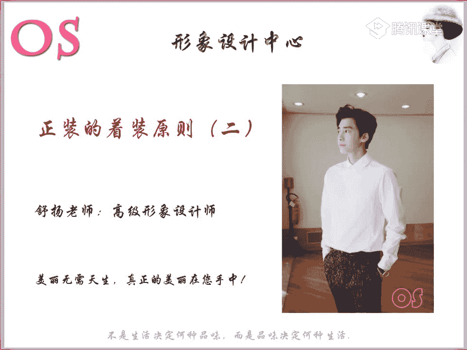

场合的话呢都是来源于我们这样的一个图案啊，花纹。第三个呢就是我们男士的鞋类的一个分类。那么本节课呢对于大家的一个学习要求呢，就是熟知我们自己的一个风格所适合的这三大类的这样的一个单品。准备好的同学呢。

快速跟老师刷走鲜花。我们就进入今天的一个课程。😊，好，那我们呢首先呢看到我们的衬衫。衬衫呢，我们先从我们的社交衬衫说起啊，我们先来呢理解我们的衬衫的分类。也就是说先抛弃我们这样的一个领型。

我们来大范围的看到这样的一个衬衫。衬衫呢它有三大类的一个分类，一个呢是我们的社交衬衫。一个呢是我们的商务衬衫。另外一个呢就是我们的休闲衬衫。首先呢我们要认识啊什么样的一些衬衫呢，它是属于社交衬衫。

也就是说它要跟我们的礼服去做搭配的啊，也就比如说我们的燕尾服啊，或者说吸烟装这样的一些西装去做搭配的哦。那么社交衬社交衬衫呢，它的第一个特点呢，就是它的下摆呢都是属于圆摆的。

像这样的一个大家也会发现像我们一些普通的衬衫。如果说是我们这样的一个商务衬衫的话呢，你也会发现有些商务衬衫，它也是一个圆摆状的啊，圆摆状的话呢就是更好的让我们的男士呢把这样的一个衬。😊。

衫呢放入裤子里面。所以说大家在买衬衫的时候可以多去注意一下。如果说这样的一个衬衫，它的下摆是一个圆摆的话，一般都是放在裤子里面的。如果说我只是想把拿出来单穿的话，那么衬衫一定都是平啊平面的啊。

也就是说这样的一个横条纹的，而不是说这样的一个圆摆状的啊，那么这是第一个它是呈现这样一个圆摆状的。第二个呢就是我们这样的一个袖口。那么上一节课老师有说过，在我们这样的一个呃在场合中啊，说过。

在我们的这样的一个呃上呃什么叫做圆摆状的啊，看到我们这样的一个底摆。😊，啊，有没有看到啊这样的一个底摆，它是一个圆摆状的。那么这一个这一个呃社交衬衫它并不是那么的明显。呃。

买过衬衫的同学就会发现有很多衬衫它是弧度非常的大，呈现这样的一个半圆状的哦。有呃我们其他同学能不能理解啊，理解的同学可以跟老师扣个一。😡，那么之前老师在讲场合的时候呢，就有说过。

是不是在我们这样的一个呃职业场合，我们要去穿西装的话呢啊里面搭配衬衫是绝对不可以出现我们的袖口钉的，对不对？那么我们这样的一个社交衬衫呢，它都是双层的袖口，大家看到没有啊，这个是我们的双层袖口啊。

跟我们普通衬衫的这样的一个袖子，它是有区别的。看到没有？普通衬衫的，比如说商务衬衫也好，还是说我们这样的一个休闲衬衫，它都是单层的，对不对？但是我们这样的一个社交衬衫，它是双层的。呃。

从图片中应该也能够去看出来哦，这是一个双层的袖子。所以说这样的一个双层袖子一定会搭配我们的袖口钉啊，像我们图中这样的一个啊小装饰小装饰物呢，就是我们的袖口钉。所以说呢我们这样的一个。

社交衬衫一定是去搭配这样的一个社交服去穿着，或者是说呢去搭配非常正式的这样的一个西装，有光泽度的，适合在社交场合去穿着的。我们这样的一个西装，那么可以去搭配社交衬衫呃。

如果说在普通的我们这样的一些商务场合，或者是说呢呃我在这样的一个上班场合是绝对不要去穿社交衬衫的。因为社交衬衫一定是有双层袖口的那么这个时候我们就势必呢要去搭配袖口钉。

那如果说在我们这样的一个职场上去搭配袖口厅的话，会有点太过于夸张。因为毕竟场合不是属于这样的一个呃华丽的场合。好，这个就是我们的圆摆哦，我不知道我们这位呃我们飞龙在天同学能不能理解啊，圆摆状的。

所以说圆摆状的衬衫呢是放到我们的适宜放到我们的裤子里的。那么你也会发现，你像我们这样的一个休闲衬衫，它就不可能是呈现这样一个圆摆状的，它比较平啊，它比较平。而我们适合放到裤子里面的。如果说这样一个衬衫。

它圆摆像我们左图中这样的一个衬衫，它不是特别特别的圆。有的衬衫的话，它的弧度就是非常呈现一个半圆状的哦。嗯非常标准的一个半圆状。

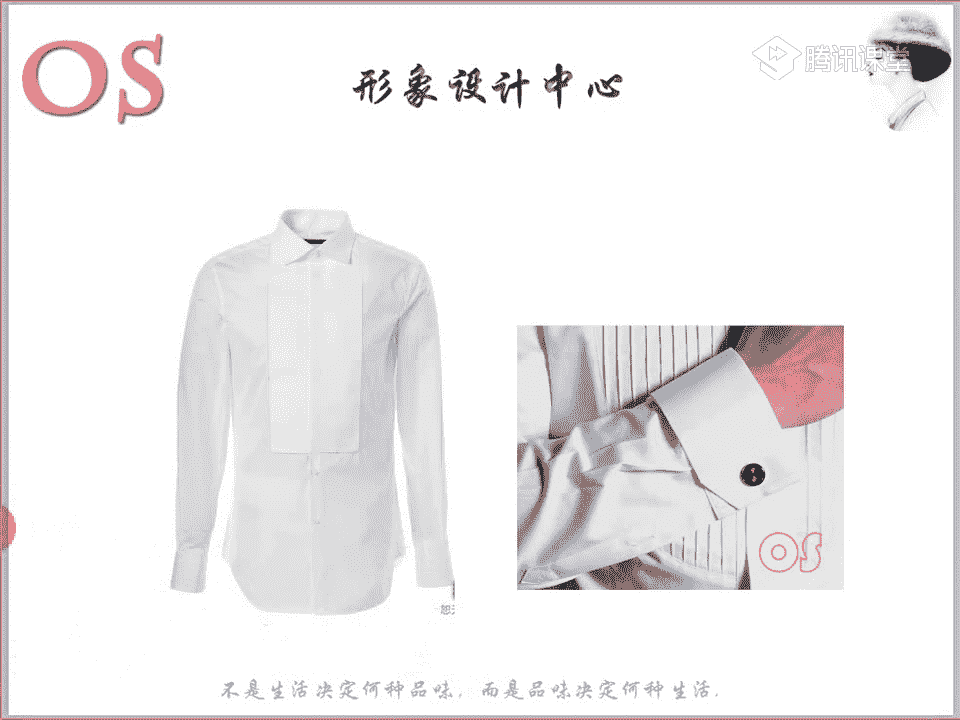

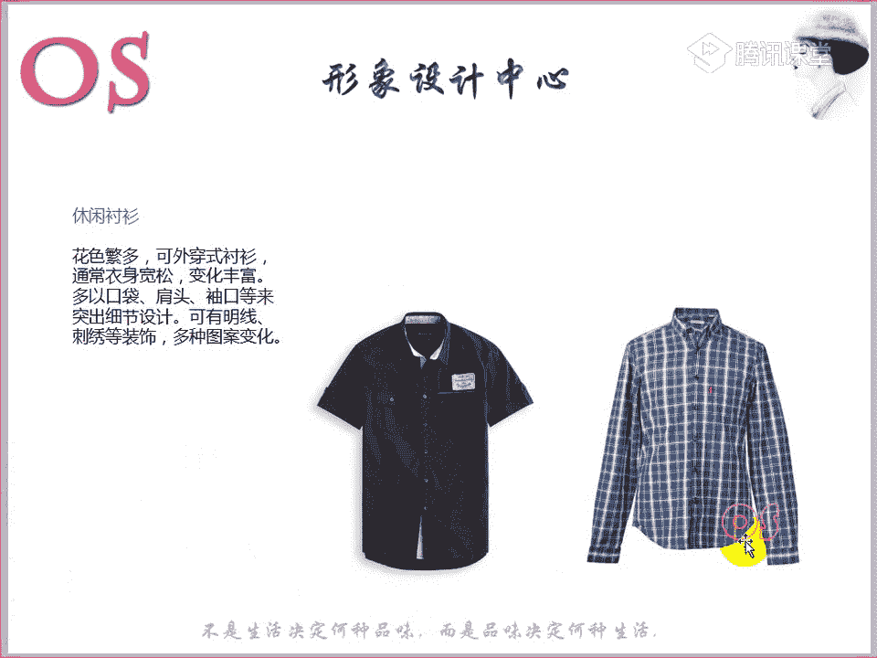

是的哦，就是有一个弧度啊，圆版。半圆状的圆版。好，这个就是我们的社料衬衫。所以说原摆衬衫。除了社交衬衫以外，如果说我们普通的衬衫啊，如果它是原摆状的，都是放到裤子里的最佳款啊，千万不要去单穿出来啊。

不然的话会显得你的身材是5比5的这样的一个比例。那么第二个呢就是我们的商务衬衫。什么是商务衬衫呢？第一个啊，它属于呢？有比如说像这样的一个图片中的都是素色的啊，这是它的第一个特点，素色以外呢？

当然有没有说有一些图案的呢？有有图案的也是什么呢？一些细条纹或者说小格子。😡。

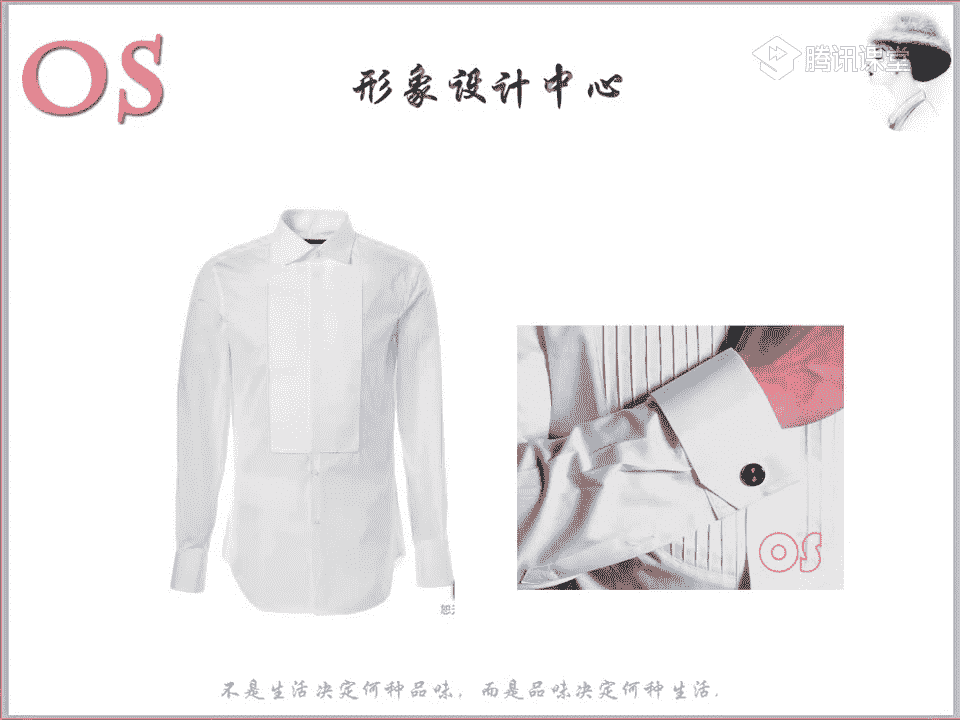

细条纹和小格子是什么样个概念呢？就是它是属于呢唉就是比较的不明显的哦，比较压的那种啊。所以说呢素色以外有的是有细条纹和小格子，只是说细条纹和小格子，并不是那么的明显，它是暗格纹，或者是说呢暗条纹哦。

适合在我们的商务场合去穿着。那么还有一个特点呢，就是它的左侧呢有一个口袋啊，然后呢配合我们的职业装去穿，这是我们的商务衬衫。商务衬衫的话呢，它的这样的一个面料的挺括度。

以及它的面料的这样一个精致度也是比较高的。这是我们第二个就是商务衬衫啊，所以说大家要分辨社交衬衫和商务衬衫的这样的一个特点。😊，第三个呢就是我们的休闲衬衫。休闲衬衫的话，那么种类就很多了。

我们之前在上我们的西装的时候有说到休闲款式的西装，它有一个特点呢呃，比如说它有明兜，对不对？还有包括明线。那么像像休闲衬衫的话，它也是这样的，它会有明兜明线，对不对？

如我们左图中啊这样的一些明兜明线的一个存在啊，会有一些设计感，以及呢呃花色也比较多，大格纹也好，小格纹也好，它的格纹，而且它的这样一个材质也会很多种，对不对？它可能不会具局限于啊一定要选择有精细面料的。

可能它的面料有一些麻牙棉质的，也有很多，对不对？而且这样的一个衬衫呢是可以去啊外穿的，通常的话呢整个衣身也比较的宽松啊，整体的设计感的一个变化也比较多。那包括它可能在肩头上。

或者说在我们这样的一个袖口上会有一些呃突出的一些细节的一些设计。那么包括的话有的衬衫可能它是素面的。😊，可能有的衬衫你会发现它有点像商务衬衫，可能也没有名呃没有这样的一个口袋。

但是你会发现呢唉这样的一个衬衫里面它有一些刺绣哦，如果说有一些刺绣存在的话，它也是适合在休闲啊场合去穿的。那么我们也可以把它归纳到呢我们的休闲衬衫。所以说这样的一件衬衫。如果它的一个设计感比较强。

图案比较多。然后呢唉装饰细节比较多，或者说花色比较缓繁多，或者说唉某一些细节哦，都会有一些突出的一些小细节的一些设计的话，我们都可以把它呢归纳到休闲衬衫。那么对于我们这三大类衬衫啊。

大家能不能呃准确的去分辨，能够分辨同学快速跟老师扣个一。😊。

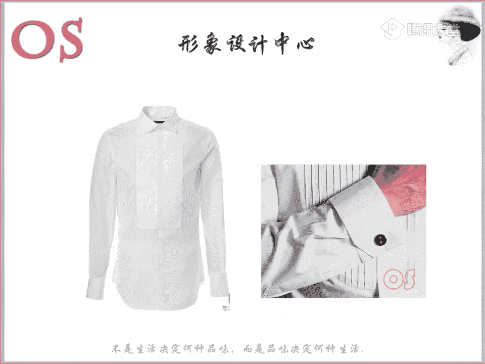

好，对于我们的衬衫，如果哪个呃哪个款式的衬衫有疑问的话呢，也可以打在公台上啊。嗯，好，卡卡有问题好，可以说哦。好，首剪这下有没有弧形边的啊。😊，可以说我们这三大类衬衫都有弧形边的啊。

也就是说我们这样一个圆摆状的。因为有一些休闲衬衫，它也是适合放到我们的裤子里面的。所以说呢呃我们社交衬衫呢一定啊社交和我们这样的一个呃商务衬衫的话，它一定都是圆摆状的。它都一定是圆摆状。

因为必须要放到裤子里面。所以说这样的一个呃衬衫的一个长度是一定要有保证的，对不对？那么我们的休闲衬衫也是一样的，它不仅仅可能说只是局限在我们这样的一个横边啊，一个很平整的横边。

那它也有这样的一个圆摆状的，也是有的嗯。

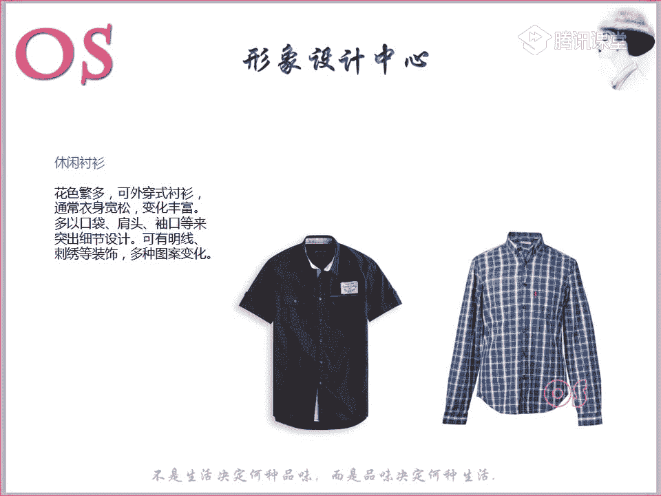

因为像我们的休闲衬衫的话，有面料厚的，有面料薄的。同样的话呢也有可以适合哦唉穿在外面的单穿的啊，我们把它放出来的，也有可以呢放到裤子里面的哦。好，那有弧形边的衬衫可以放在外面吗？

如果说啊如果说我们男士的话，尤其是我们的亚洲男士，普遍的话啊，个子呢都不是特别的高。那么如果说我们的衬衫的一个长度过长的话，反而会怎么样，反而呢会把你显矮，所以说呢我们男士在选择衬衫的时候。

如果你想要选择放在外面的衬衫的话，要注意好长度啊，最好呢不要说哎。超过你裤子拉链哦，裤子的拉链的一个中间的这样的一个部位的长度。不然的话，在视觉上呢很容易显矮哦。好，还有没有什么问题啊？😡。

是的啊，可以可以单穿。但是如果单穿的话呢，就比如说你像我们呃李易峰这条裤子，我们都裤子上都有拉链，对不对？男士的一般的啊，如果是配衬衫穿穿的话，那么我们裤子的一个中，如果衬衫在选择外穿的时候呢。

长度千万不要去超过我们裤子拉链的中间这样一个位置啊，能短一点是最好的。因为这样的话会显高啊，显得你腿长了之后，你的身高自然就上去了。也就是说我们之前在讲体型的时候，就有说过装饰位置居上的话。

在视觉上都会有显高显瘦的效果。

好，接着我们来看到下一个重点呢，就是我们的衬衫的领型。一个一个看啊。大家呢这里的笔记呢一定要做清楚啊呃参照我们的图片，然后呢唉看着老师所写的这样一段话啊，标准领啊。

首先跟大家介绍我们的标准领标准领的一个特点怎么样去判断呢？第一个你会发现呢它的两领翼啊，也就是这样的一个领翼，它们之间的这样的一个展开的角度呢，是呈现75度到90度啊。

也就是这样的一个角度呢是在75度到90度左右的这样的一个角度。啊，就如图中我们会发现这样个图大概是在80度的样子，对不对？后领呢唉也就是我们脖子后面啊，脖子后面呢这样的一个领的一个高度呢，一般是在3。

5厘米到4厘米之间。厚领的高度。那么这种领型的一个特点呢就是它不会受到一些流行趋势的影响啊，它比较稳定，它也不会受到年龄啊，或者说一些领脸型的这样的一些限制。所以说这样的一个衬衫。

你会发现大部分很多啊我们这样的一些呃商务衬衫的话呢，都是采用的这样的一个标准领，对不对？当然也还有一些意外的哦，其他的一些领型，那么这就是我们的一个标准领应用非常的广泛。那么可以呢不受年龄。

还有以及脸脸型以及一些流行趋势的一些影响，整个呢是一个非常标准的啊，比较稳定的这样一个领型。所以大家要抓住呢标准领的一个特点啊，领翼的宽度以及厚领高度哦，它的大概是在什么样的一个范围内。

这是我们的一个标准领啊。接着呢我们来看下一个领型。😊，如果对于标准领和和老师在接下来讲的时候，如果对于某些领形有一些意义的话，可以赶紧哦在公台上提出来。那么下一个呢就是我们这样的一个小方领啊。

我老师所配的图片都是非常典型的代代表哦。小方领呢，它就是领肩呢？比一般的领肩呢要短啊，你会发现它是呈现这样的一个方方正正的一个感觉哦，哎跟我们的标准领一做对比，你就会发现特别的明显，对不对？

领呢要比一般的领肩要短，而且呢领面哦，也就是说这是我们的领面哦，什么是领面，这个就是我们的领面领面呢也比较窄。所以说整个的话呢它趋向于一些年轻感哦，所以说适合一些年轻人去选择。

当然等我们的所有的一个领形归纳完之后呢，老师会告诉你们什么样的风格，适合选择什么样的领形哦，到时候再大家再去记，我们首先把所有的领型认知一片。😊，小方领啊方方正正的啊比较短。第三个呢就是我们的扣脚领。

啊，大家可以看到啊，我们这样的一个扣子呢是有一呃我们这样的一个领肩是有一粒扣子的啊。那么这样的一个领型呢是美国人啊发明的。而且美国人也非常的喜欢。那么大家你去看一下美国的一些休闲品牌的话。

像这样的一个扣脚领应用的是特别特别多的啊。休闲品牌啊，休闲品牌用的是最多的。那么呢所以它比较休闲，只有在领子上做文章的话，如果说在这样的一个领子上，我们做了一些文章啊，增加了一些呃设计的话呢。

它其实就会慢慢变得比较休闲。那么对于一些正式场合的话，我们就不可以去选择。所以说像这样的一个扣脚领的话，它的严谨度是绝对不够的啊，更适合去呃在休选择休闲衬衫的时候呢，我们可以选去选择它。

或者说我要去搭配休闲装的时候呢，我可以去选择啊拿我们的扣脚领的这样一个衬衫去做搭配。而且大家呃如果说我们男士经常买衬衫的，喜欢买衬衫的，你也会发现，像我们这样的一个扣脚。😊。

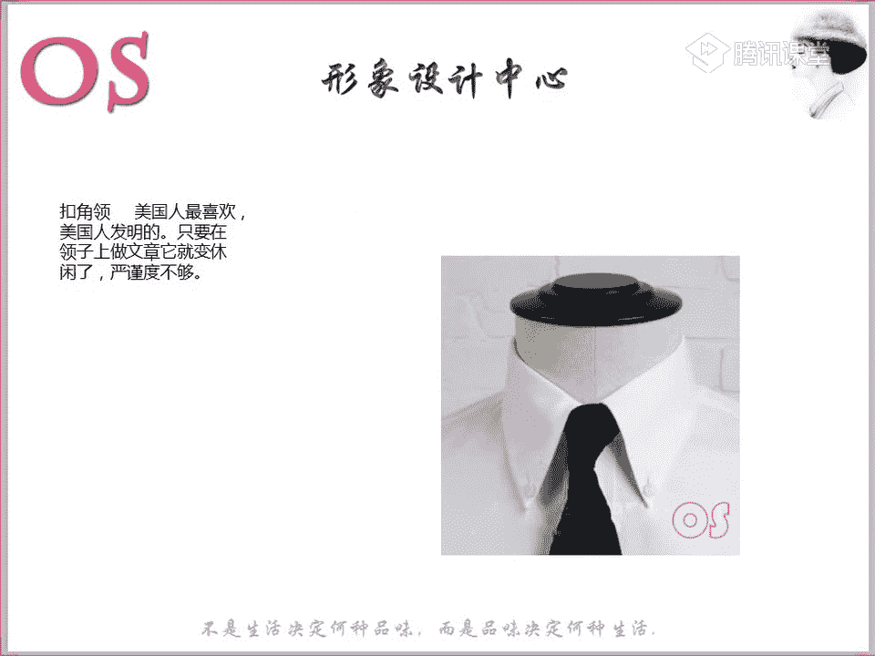

领啊，比如说一些格子衬衫啊，或者说条纹衬衫用的特别特别的多哦，因为像这样的休闲衬衫，用我们扣脚领呢是非常非常常见的啊，这个就是我们的扣脚领，非常好识别哦。也就是说领尖上它有一个扣子，对不对？😊。

领尖上会有一个扣子。好，第四个呢就是我们的宽脚领。唉，宽脚领很明显哦，也称之为呢我们这样的一个一字领啊，也可以说它是呢温纱领。因为像这样的一个宽脚领呢，它一定是搭配温纱节的。

温纱节它要比我们这样一个普通的领结是要大很多的哦，大家可以上网去搜一下，就知道温纱节它和普通的结的一个区别，其实没多大区别，也就是说在缠绕的过程中呢，多绕了一圈而已。所以说领结呢也变得大了那么多哦。好。

我看到有一些领扣是个造型啊，这个有什么区别吗？啊，呃，什么意思啊？也就是说没有实际上的一个扣眼，对吗？只是说在它的一个。😡，在他的一个领尖上钉钉了一粒扣子，是不是这个样子？😡，好。

如果说在领尖上有叶子啊，或者说有一些字母的话，那不叫扣脚领哦，那不叫扣脚领。那也也就是说可能它采用的就是我们普通的这样一个标准领，只是在领尖上加了一些设计而已啊，那个就不要去归到我们的扣脚领了哦。😡。

所以说大家可以看岭面的这样的一个呃角度，以及呢还有它的这样的一个它到底是属于什么岭。就像我们有些同学说，哎，有叶子或者说有字母，对不对？我们卡卡说的那就看它是不是标准岭。

还是说呢它是小方领上面加了叶子啊。😡，好，这个呢我们的一字领哦，宽脚领呢它是要配温纱节的。大家也会发现，如果配配一个普通的结，是不是觉得啊显得很小气，对不对？啊，会觉得领面呢跟这个领结不是很搭配哦。

所以说而且这样的一个领翼的夹角呢，它也是在120度到180度之间的，非常的宽。那么宽佩戴一些大的领带的话，会更有这样的一个个性，也会跟它更和谐。在我们的意大利的话。

像这样的一个宽脚领呢是非常非常受年轻人喜欢的。😊，那么它后领的高呢大概是在3。6厘米到3。9厘米为宜，不要去选择太高的啊，我们尽量选择3。6到3。9厘米啊，这样的一个左右的长度。好。

接下来就是我们的中肯哦，中针孔领了啊，又叫我们的夹洞领。😡，其实非常的简单，就是呢在我们这样的一个两边的领子中间呢开了一个洞啊，大家可以看到它其实就是开了一个洞。开了一个洞之后呢。

这个洞我们要用来干嘛呢？可以呢搭配一个夹子啊来把这样的一个加以固定，把这样的一个领型啊，去把它固定住。那么固定之后呢，我们可以在上哦我们再去搭配我们这样的一个领带领带的话呢啊带在上面。

这个时候领带它的一个位置也不会说去移动，而且领子呢又起到了很好的一个固定的作用。所以说啊这样的一个。😊，领型的话是非常非常适合呢去选择搭配正装去穿着的。如果是穿休闲装的话，不适合啊这样的一个针孔领的话。

是一定要跟正装去做搭配的。把领带带好呢，把领带拿出来放到上面啊。然后它这样的一个夹子呢，它就会起到固定的一个效果。好，既然说到我们的针孔领啊，我们来看看跟它呢有异曲同工之妙的另外的一个领型。

就是我们的有潘领。唉，它其实跟它有一个相同的特点，就是它起我们这样的一个针孔领是在领的中间会打一个小孔，对不对？而它呢是在左右的一个领尖的一个底部呢会定有这样的一个潘儿。那这个潘儿在中间呢也是要扣合的。

其实扣合之后呢，它的效果就跟我们刚才所说的针孔领的效果是一致的。那么领带呢打完之后也是一样的，从这样的一个潘上面呢通过啊，我们刚才说的是从我们针上面去通过，对不对？这样的一个夹子上面去通过。

那么这个呢就是从我们的潘上面去通过，那么也是一样的，我们可以呢把它去跟正装做搭配。而且这样的一个潘呢，它能够起到很好的一个固定的呃作用。😊，把这样的一个领带呢唉挑起来啊，更有立体感。那么这样的一个领型。

它因为夹角较小，所以说我们去系领结的时候呢，最好是去系这样的一个普通的领结，不要系的太大啊，不然的话呢，它是没办法去掌握好的啊。因为它毕竟这样的一个夹角是比较小的。好，接下来就是我们的针角啊，尖角领。

尖角领呢要跟我们的标准领大家要懂得去区别啊。它的领翼的一个展开角度是比较小的。我们标准领它的一个角度是比较大的，对不对？在75度到90度之间左右啊，而这样的一个夹角呢一般都是小于90度啊。

甚至的话大概就是在我们这样的一个50度啊，60度的一个样子。而且呢它的一个领尖呢你也会发现哎相对来说因为夹角变小了之后。

你也会发现在视觉上好像感觉领尖要比我们的标准的领尖呢哎显得更那么的有这样一个修长尖锐的一个感觉，对不对？啊，这个就是我们的肩角领，所以说抓住每一个。领形的这样的一个特点，懂得去进行这样的一个分别。好。

下一个就是我们的圆角领了啊。圆角领呢它的一个领肩是非常好判断的。因为它的领尖是呈现这样的一个圆弧状的啊，大家看到我们上面也好，下面也好啊，有大有小之分啊，没关系，但是不管是它大也好，小也好呢。

都归到我们的圆角领里面。因为它的一个领尖呢是呈现我们这样的一个圆弧状的。根据领尖的一个大小和展开的一个角度的一个不同呢。圆弧的样式也不同。而且呢这样的一个圆角领呢是一个非常古典的领型啊，不适合上班。

但是它具有一些历史性，那么更适合一些休闲场合去穿着。因为上班的话，因为它毕竟是一个圆弧状，它不像我们的这样的一个标准领或者说尖角领，它的这样一个尖锐度啊，稳稳重度那么高。

所以说它更偏向于这样的一个呃休闲化一点。那么在我们的正式场合的话，千万不要拿这样的一个衬衫领型呢去搭配西装穿着。除非是我们这样的一个呃普通的啊这样的一些休闲西装的话，可以去跟它做搭配啊。

下一个就是我们的异形领呢。异形领的话，这样的一个领型呢多数出现在什么样的一个衬衫上呢？多数出现在我们唉如图所示的社交衬衫。很多社交衬衫的话呢，它都是采用的是我们这样的一个大部分啊。

采采用的就是我们这样一个异形领啊。异形领的话，大家也会发现，唉，就这么一个像与啊鸟翼这样一个状况的啊，这样的一个领结，那么它更适合呢去搭配我们的领结啊，领口的话呢，唉我们可以呢垂直的去把它立起来啊。

也可以呢唉把它呢折啊翻折都是可以的。那么所以呢我们这样的一个异形领的衬衫呢，当然是搭配我们的礼服啊，男士的礼啊，再去搭配的。跟我们普通的这样的一个呃上班场合的一个西装是没办法去做搭配的哦。

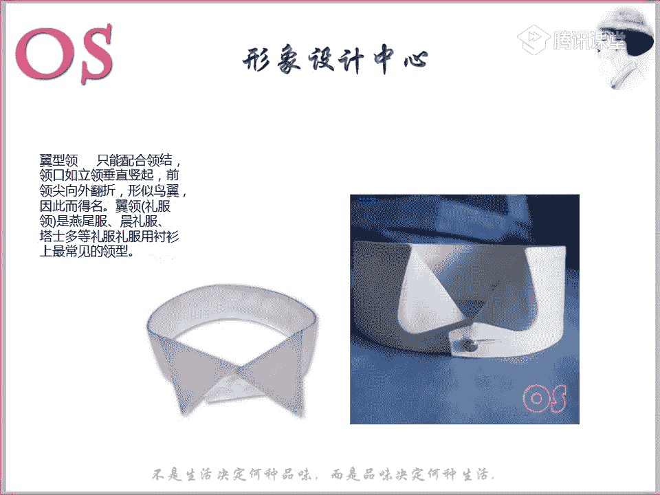

下一个就是我们的立领。立领的话是非常具有我们中式特色的一个领型，它是由我们的唐团装呢演变而来的啊，比较呢温文尔雅。领子的话呢，它只有下领啊，没有上领。我们可以看到所有的领型，对不对？我们都是有上领。

有下领的哦，我们里面的话就叫下领，而里面立起来这个部分呢，就是我们的上领，对不对？而我们这样的一个立领的话呢，它只有哦，它只有我们这样的一个下领，没有我们这样的一个上领，所以说呢下领的话，它除了下领。

还有个特点呢，就是没有叠门，也就是说唉我们这两片领子呢，它不是叠在一块的。

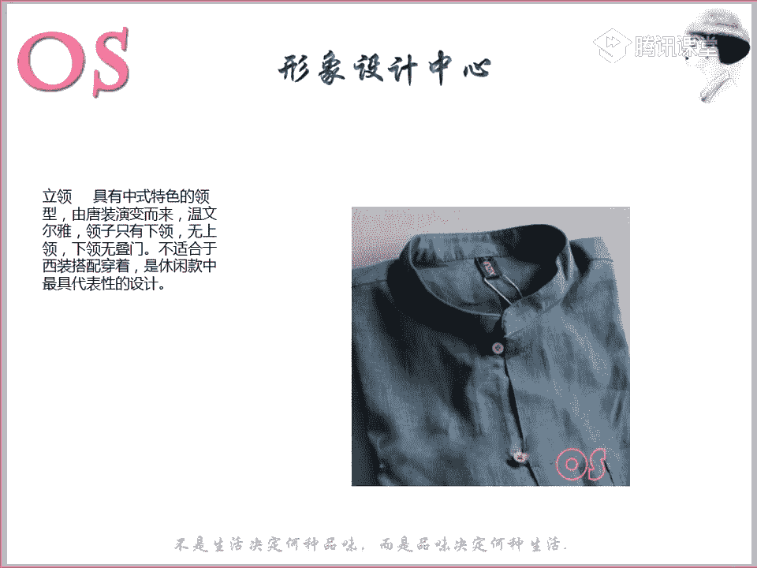

它是一个平行的哦，不是叠在一块的。我们会发现你就像你就像我们这样的一些领型，对不对？两片领子都会叠在一起啊，老师鼠标的这个位置啊，它都会叠在一起。而我们的立领的话，它是没有叠门的。

不适合呢去跟我们的西装做搭配。它是休闲款式的啊，这样的一个衬衫啊，是一个非常代表的一个设计。所以说如果大家有一些男士，如果选择喜欢我们这样的一个中式文化的话呢，也可以拿在我们单穿衬衫的时候。

选选择一些休闲衬衫的时候，是，其实是可以呢去选择我们这样的一个立领的啊，非常好看。😊。

啊，最后一个呢就是我们的牧师领啊，牧师领的话呢，这种领型它是白色的，一般领子都是白色啊。然后呢袖口它也是白色。但是呢一般到了医身的话呢，可能就是其他的颜色啊。

其他颜色一会儿我会说到什么样的风格适合什么样一个领型啊，那么其实像这样的一个牧师领呢，它最早呢就是来自于我们基督教的神父，牧师所穿的这样的一个黑色上衣搭配呢我们白色的领子，所以有些同学应该一点都不陌生。

对不对？啊，基督教的人啊，穿的都是黑色的衣生，然后呢，领子和袖子是白色的。那么其实它这是它的一个演变的过程啊，那么包括现在的话呢，除了我们很多常见的啊，衣身是其他颜色。

袖子呢和呃袖口和我们这样一的领子是白色以外呢，现在还有一些领子你也会发现，可能医生呃是一这个很鲜艳的颜色。那么呢袖口和我们的。衬衫领子呢可能是其他的颜色的，也有，对不对啊，不一定是白色。

所以说呢我们可以叫它呢撞色领，也可以叫它呢异色领。也就是说领子和衣身颜色是不一样的啊，它一定是有这样的一个区别的。所以说这样的一个牧狮领，它跟其他领型最大一个区别就是领子和我们的袖子颜色是一致的。

或者是说领子和衣身哎以及袖子颜色是不一样的啊，会非常好判断，这是我们的牧狮领。😊，好，大家有什么问题可以提出来啊，以上就是我们所有的这样的一个领型。那么对于哪个领型有问题的，现在可以提出来。好。

一会儿会给大家看一下我们不同的风格应该怎么样去选择我们这样的一个领型。好，牧师领才有内衬分别吗？哦，不是的哦，不一定。内衬的话也也有可能有的可能有内衬。那么就像我们这样的一些标准的领型。

它也有可能有内衬是别的颜色的哦，也有内衬可能是别的颜色，所以说不用去管内衬啊，所有的领子都是一样的。你不用去管内衬，你只用去看它这样的一个外边的领型的颜色跟它衣身的颜色的这样的一个区别。好。

接下来我们来看到这里啊，这个呢就是我们所有的呃不同的风格。那么我把前卫型呢划分了两个，一个是新锐前卫，一个是阳光前卫。那么像新锐前卫跟阳光前卫，他还是有区别的啊，新锐前卫呢老师举个例子。

比如说我们的陈冠希阳光前卫的话呢，举个例子，比如说我们的何炅，对不对？大家会发现何炅和陈冠希他们俩之间的驾驭度是完全不一样的。何炅呢更像那种阳光呃大男孩的感觉。但是陈冠希你可能没办法用阳光大男孩来形容。

对不对？你会发现他更有这样的一个穿透力，他对于服装的这样的一些设计感的一个驾驭度，他可能要比我们的何炅要高很多啊，这个所以说这是我们两个风格这样的区别，包括大家的话以后到了我们的一般啊。

我们还会就这样的一个前卫风格呢会呃重点跟大家来讲解哦，那么以上就是我们这样的一个几大风格。在选择领型上的一些。呃，选择的一个范围大家可以记一下，然后记好了同学呢，可以跟老师扣个一。😊，好。

对于我们所有的这样的一个衬衫的领型啊，还有以及我们各不同的风格，选择什么样一个领型。如果都没有任何问题的，那么大家可以呢跟老师扣个一啊，也包括这样的一个啊自己的这样一个风格。

所适合的这样一个领型也系好的同学也可以在工厂上扣个一。然后我们接着往下面看。😊，好，大家有没有问题没有问题，快速跟老师扣个一啊。😡，好，也不错啊，截图也是可以的，一样的。😊。

所以大家可以快速的截个图也行啊。然后呢，大家如果没问题的话，老师就接着来看一下啊，接着来看一下我们下一个知识点。😊，然后呢，这个衬衫的领型和我们不同的风格所适合的衬衫呢，就跟大家呢介绍完了。

那么包括还要跟大家强调一下衬衫的一些穿法中要注意的一个点，那么其实很多人也会进入这样的一个误区啊，唉进入这样个误区。你会发现呢有时候我们穿衬衫会有点像我们上面这位男士这样的一个穿法啊。

穿法所呈现的这样一个效果，对不对？领子非常的没有型，啊，其实呢你们也不要小看我们衬衫后面的这样的一个小细节，你会发现衬衫后面会有一个叠的这样一块布，对不对？你不要以为它是来增加衬衫的厚度的。

其实它这样的一个设计啊，它是有它的一个玄机的。也就是说你会发现他有这样的一个呃截面对不对？一个缝合，有两个缝合，好像中间可以放一个什么东西。那么它的一个作用就是呢来放我们的领撑的，他是来放领撑的。

所以说呢在我们。😊。

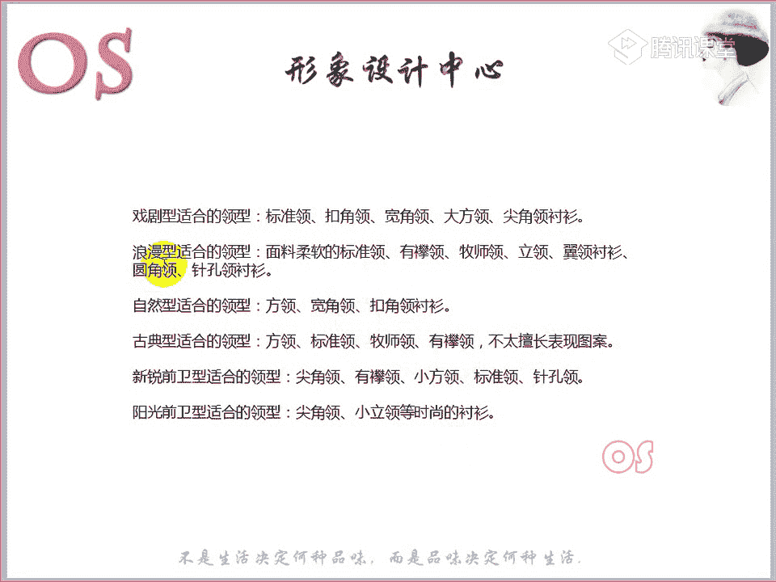

去选择这样的一些商务衬衫的时候，呃，因为我们不敢保证我们一定都会把我们的衬衫扣着，对不对？因为有时候扣着的时候，当然它可以保证它的这样一个领型的这样的一个平整度。

但是一旦你要解开一道一一颗扣子或者两颗扣子的时候呢，你就会发现哎领子的这样的一个形状就发生改变的。那么我们为了维持我们的领子啊，还能够保持这样的一个形状的话呢，一定要要去准备这样的一个领撑。

而且领撑呢它也比较软啊，可以随着你呢去做调节。

那大家可以看到啊，没有带领撑和把加上领撑之后呢，我们把领撑调节好之后，是不是会显得人会更精神，更有这样的一个啊更有精气神，对不对啊？更加的干净，更加的整洁。所以说这就是我们的一个领撑。

所以大家可以呢去去准备一个这样的一个领撑啊。所以说要买它呢，你就直接可以搜领称就可以了。那么还有就是呢我们不管是衬衫啊，它透也好还是不透也好呢？哎，嗯第一次知道这个是不是啊。

第一次可能很多同学都是第一次，所以说要知道它所后面所深藏的这样的一个奥妙哦。其实有一些休闲衬衫，它也有这样的一个领衬的一个小卡槽，也有啊，不不一定是我们这样一个休闲衬哦，正式的商务衬衫有啊。

其实有一些休闲衬衫，它是也是有的。😊，哦，我们还有呢就是不管衬衫下啊，我们要露出这样的一个呃小背心的一个纹路啊，不管是透的也好还是不透的也好，甚至有时候呢我们还有因为一些凉风来袭，会不小心的一个肌突。

对不对？都是非常让人尴尬的。还有包括像我们男士喜欢出汗的，有时候腋下啊被染湿，这个都是比较尴尬的一个事情，尤其是有时候我们穿一些呃深色调子的这样的一些服装的时候，所以说呢为了避免这个尴尬呢。

我们其实可以在选择白衬衫的时候，或者说选择其他衬衫的时候，其实都可以搭配一件呢同色的一个打底T恤，是非常非常有必要的啊，穿衬衫的时候去搭配一个T恤是非常有重要的。或者说我搭搭配一个背心也是可以的。

因为它不仅可以帮你去吸汗啊，避免我们这样的一个衬衫，汗湿之后，有这样的一些呃汗的这样一个透露，对不对？所以说能够避免很多尴尬的事情，让你啊整个一天下来的话呢，都是呈现。😊。

一个非常干净干净整洁的这样一个状况。好，接着我们来看到我们的领带啊，领带的话呢我们都叫它保健头型，对不对？当然有的领带它是平头的，我不知道大家有没有看过呃，有没有看到过平头的领带啊。

看到过的同学可以跟老师扣个一啊。现在领带的头型的话啊，除了保健头的话，还有我们的平头的。那么平头的话，当然更适合出席一些呃，如果你是去社交的话，或者是说哎我在休闲场合，我要搭领呃搭配我们的领带的话。

是可以去搭配平头的。但是如果说在商务场合的话，尽量还是选择保健头型的啊。嗯，T恤有没有袖子呢，呃，可以选择有袖子了，这样的话呢，更对于你的腋下来说它更有这样的一个帮助啊。😊。

大家都没有看到过平头的领领带，对不对？平头领带就是没有这样一个尖头啊，它是平的，而且它的一个宝肩头的这样的一个宽度也比较窄。它不会说像我们宝肩头型的呃，这样的一个领带的话，宽度一般是在8到1512公分。

对不对？而我们平头领带的话，一般都偏窄啊，没有这样一个肩，它没有这样一个肩，整个就是一个平的。😡，那么领带不管是平头领带还是宝健头型的哦，嗯，平头感觉不好看啊，也挺好看的，窄的话非常的时尚啊。

那么长度的话呢在133到145公分啊，选择时候呢，一定要考虑到自己的身材、体积和个子。如果你的体积比较大的，我们可以呢选择什么可以选择唉稍微呢宽一点的，对不对？那么如果说我的个子比较矮的。

我就可以选择长度短一点的啊，这样的去做调节，所以说体积大一点的风格大一点的，我们在选择宝健头的宽度的时候呢，可以选择啊，跟着自己的风格的量感啊，体型的量感去进行呢收缩。😊，好。

接着呢我们来看看呢我们这样的一个领带的这样的一个类别啊，图案的类别分别有。第一个呢就是我们的小纹均匀。看看这里啊，这个呢就是我们小纹均匀的一个代表，你会发现呢？第一，它的纹路都是很小的，很窄的，很细的。

对不对啊？小纹均匀是这样一个特点，不一定啊，小纹均匀一定都是我们的这样的一个横条纹，它也有可能是非常其他的这样的一个图案的。比如说点呃点点，但是是密集的这样一个点点，没有这样一个分散感的。😊，没有。

就是紧密的这样一个点点哦。那么小文君匀呢，第一，你会发现很小号啊很小号。也就是说图案啊很小号，这样一个纹路很小号。还有呢就是很紧密，纹路和纹路之间是排列在一起的，很紧凑。

或者说哎点点和点点之间呢排列在一起很紧凑。那么呢它会带来这样一个严谨的状态。包括大家从这样的一个领带上，你也能读出呢严谨这样的一个关键词，对不对？所以说非常适合呢在正式上班去穿着。😊。

所以在记我们的小文均匀的时候，记住几个关键词。第一呢是小号的。第二个呢是非常紧密的啊，图案和图案之间很紧密。第三个呢就是会带来严谨的这样的一个状态，比较适合呢在正式上班去穿着。好。

小文均匀我们看完之后呢，看到小文间隔，这两个之间其实有时候不太好区别啊，因为它们都是小号，这是他们的一个共同的特点。但是呢我刚才说了啊，小文均匀有一个什么特点，它是紧密的，图案和图案之间是紧密的啊。

没有分散感。但是呢小文间隔呢，它是图案和图案之间呢会形成分散感。那么大家看到我们这样的一个点点，你就会发现点点和点点之间是有这样的一个分散的，而不会说像我们的小文均匀排列的那么的紧凑啊。

这个能理解同学可以跟老师扣个一啊，这两者之间的一个区别啊，大家能理解，可以跟老师扣个一。😊，图案也是小号的，但是图案和图案之间它是有分散感的，它并不像我们的小纹均匀排列的那么的均匀的程度下。

还排列的那么的紧密啊。所以说这样的一个小文间隔呢也是适合在上班的时候去穿着哦，能理解吗？哦，我们这两个这两个之间的区别啊，能理解同学快速跟老师扣个1啊，有任何问题呢，现在打在公台上。

因为一会儿啊老师要让你们自己找的啊嗯。😡，好，知道意思哦，但是不会表达啊。所以说能够理解老师刚才所说的图案和突章图案之间是有这样的一个分散感的，他们是有分散感的。😡，而我们这个是没有哦。

它是紧密的排列的，并没有说哎我这样的一个上条和下面的这样一个条纹，我有分散状态，对不对？啊，第三个呢就是我们的大文均匀啊，大文均匀的话，当然它的图案就要大号一点啊，不会像我们的小文啊，那么的小号。

它的图案是大号的那另外一个呢排列非常的紧密啊，大号就像我们这样的一个四呃这样的一个田字格，对不对？每一个田字格呢你会发现相对于小文来说，它要大了那么一点。而且呢田字格和田字格之间呢。

它是排列非常的紧密的。所以说这样的一个大文均匀的话呢，它是合正式啊，正式度呢要跟它本身的图案有关。如果说你给它安排的图案唉，是我们这样的一个大号的，或者说一些卡通图案，排列非常紧密的话。

那它当然就适合呢休闲场合去穿着。但如果说唉它的图案比较呢严谨啊，比稍微来说可以说比较的古板的话呢，我们就可以把大文均匀呢放到职场上啊，可以呢上班的时候去带，是没有任何问题的。所以说这样的一个大文。😊。

均匀正式度跟它本身的图案是有关的。也就是说两者之间是相对的啊，相对来说呢这样的一个大纹均匀的话呢，它比较稳重啊。如果说我在一般职场上呢是可以去佩戴的啊。拇指盖相似的啊，叫做大纹。

也就是说它的图案大概就是拇指盖，我们的拇指盖的这样的一个大小。好，第四个就是我们的协调文啊，协调文适合能谈判的职场和一般职场。那么就像老师所找的这样的一个协调文，你会发现它还是有一个严谨度的，对不对？

还是有严谨度的。第二个呢唉它还属于什么？还有呢它就比较的适合在职场上去搭配哦，所以说这样的一个协调文呢，适合在谈判职场或者说一般职场呢去进行佩戴。协调纹就不做多说了，因为非常好理解。

那么接下来就是无图案的。无图案的话呢，它主要的一个特点在哪里呢？就是在颜色上哦，在颜色上，那么当然啊不适合一些严肃职场，那更适合呢我们在社交场合。

或者是说呢在一般的职场上去进行佩戴严肃职场呢最好是不要去佩戴一些无图案的严肃职场哦，适合社交场合，一般职场。那么像一般职场的话，我们可以在色调上，比如说一般职场其实如果我在穿着西装的时候。

整体西装色彩啊，比较中性色的时候，我就可以搭配一个无图案的，唉，颜色上适合我这样的一个剂型的所用的这样的一个范围的一个颜色是可以的。或者说我在社交场合的时候，我就可以搭配什么呢？唉，光泽度比较强的。

对不对？料也就是说我们这样的一个面料的一个光泽度色彩上比较抢眼的这样一个色彩。我就在这样的一个社交场合就可以去佩戴。😊，好，最后一个就是我们这样的一个哦，接下来就是我们的自然图案。

自然图案其实也非常好理解。也就是说这样的一个领带的图案呢，整体会带来拙的感觉，显得非常的不清晰。那么大家看这两条领带的话，你们应该也能够理解老师所表达的意思，对不对？带来拙的感觉。

整体的图案不是那么的清晰啊，不会像我们比如说大纹均匀啊，或者说斜条纹啊这样的啊清晰感非常强，它会带来这样的一个拙的感觉。😊，显得非常的不清晰。所以说呢它适合一些年龄感大的人。

如果说我们作为呃一些还在职场上的，需要去呃佩戴领带的。而你年纪又到了那样的一个层次的话，我们就可以去佩戴自然图案的领带。也就是说领带的图案比较抽象啊，或者领带的图案啊比较模糊啊。

看到老师所找的这样的两个代表。哦，接下来就是我们的曲线图案的啊，曲线图案的话呢非常好理解。也就是说在这样个图案的花纹呢，它呈现这样一个曲线感啊，那么曲线图案当然就适合我们这样的一些曲线型的人去做佩戴啊。

所以说这样的一个图案的话呢，你会发现呃它有一个减弱男性的这样一个理性感，会显得我们的男士比较的感性哦。那么除了一些曲线型的人去佩戴更好以外呢。如果我们去参加一些婚礼的话，那我们也可以去佩戴呢曲线图案。

或者说我自己要举办婚礼，那我再选择领带的时候呢，唉相比你去选择我们这样的一些均匀的这样的一些图案，严肃的这样的严谨的这样一些图案的话呢，哎更合更适合呢我们去选择曲线感强一点的。😊，不是啊。

这个还是我们的男性去可以带的啊，曲线感的图案。还有包括我们有一些男性也会带一些花卉图案，是不是同样的一个道理啊？所以说我们这样的一个曲线图案，它有减弱男性的一个理性化啊，显得男性非常的感性。

同样的话适合我们去参加婚礼。因为像参加婚礼的话，我们本来就是一个很感性的这样的一个场合，对不对？表达情感的场合，所以呢去佩戴曲线图案要比佩戴我们理性，那么理性感那么强的图案呢要好很多。😊，好。

下一个就是我们的前卫图案的啊，前卫图案的话呢，它更适合时尚行业啊，时尚行业的人去做佩戴。那么呢比如说我们这样一个图案啊，有一些铆钉的设计，或者说这样的一个图案，唉，这样的一个领带的话。

它可能都是我们这样的一个无图案的啊。唉无图案的以外呢，它加了这样的一个铆钉，或者说加了我们这样的一个花卉呃，一朵小刺绣。那其实像这个领带的话，也是属于我们前卫风格的。也就是说比较有个性的啊。

不不是说按照我们常里的这样的一些领带去出牌的它会更有设计感。或者说唉图案上也好，或者说色彩之间的一些拼接啊等等的，都是属于我们前卫图案啊。好，约会的时候也可以哦，其实约会的话，我不建议去佩戴曲线图案啊。

而且在约会的话，没必要去一定要搭上这么严谨的领带。我们反而在约会的时候去搭配一些有趣的这样的一些前卫图案会更好。好，这是我们的领带的图案啊，领带的图案大家有没有什么问题啊？领带图案如果没问题的话。

我们就可以看到这里，这是我们不同风格所适合的这样的一个图案。😊，好，大家可以快速截个图啊。好，说完领带的话呢，肯定不能少了我们这样的一个领结，对不对？嗯，肯定不能少领结。我们来看一下啊。

不同的领结的图案。那么呢第一个呢就是我们的戏剧风格的啊，大家来观察一下啊。

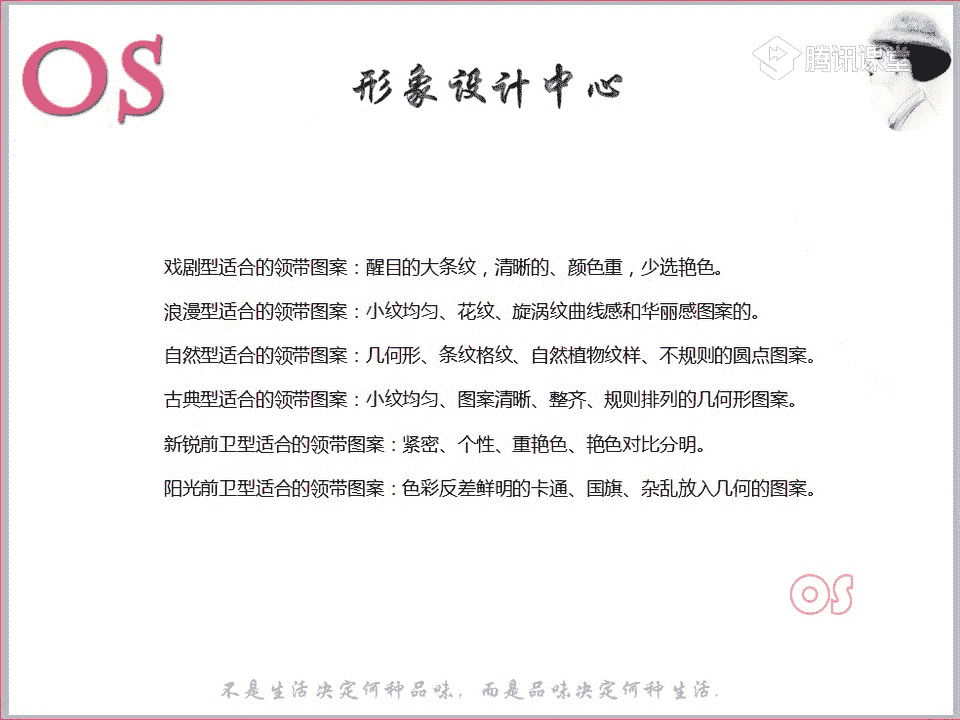

好，你们呢在观察的过程中呢，呃，随着老师的一个描述啊，能不能去看到这样的一些关键词。那么呢戏剧型的，不管是领带也好，领结的话呢，这样的一些图案的话，它非常适合一些醒目的大条纹。

或者是说呢这样的一些抽象的，或者是说这样的一些非写实类的这样的一个图案。嗯，所以说你会发现你像这两款图案它的图案啊，这两款领结的话，它的图案都是非常大气的啊，甚至的话你会发现有点夸张啊。

能够感受出来的同学可以跟老师扣个一啊，也就是说我们通过这样的一个领结的图案中呢去读出读取呢老师刚才所表达的这样的一个关键词，对不对？唉，醒目的啊大条案的大条纹的唉，比较抽象的这样的一个感觉啊。

有点点夸张的。😊。

好，接着呢我们来看到下面一个大风格，就是我们的浪漫风格的哦。那我们班呢也有浪漫风格的一些男士，我们可以看到这里。首先呢先观察一下观察一下，我们同学也可以呢把你所看到的关键词呢打在公台上哦。

有没有同学看到关键词啊？😡，花哨。花纹啊非常棒啊，我们潇潇同学非常棒。是的，唉，你会以看到这样的一个花纹，对不对？除了花纹的话呢，还有包括像我们浪漫风格的，它如果领带也好，领结上它出现这样的一个炫。

就是涡炫纹呢，就是炫纹呢，就像我们的水波纹呢，这样的一个炫纹的话啊，也是举属于曲线感的这样的一个图案，对不对？所以说我们浪漫型的人呢，不管是领带也好，领结也好。如果说我不考虑到这样的一个场合的话呢。

我们多去佩戴这样一个曲线感的。而且呢你也会发现这样的一个领结的话，非常的华丽华贵，对不对？就比如说我们第三个领结你就能够感受出来啊，非常的华丽华贵的这样一个感受。😊，好。

接着我们来看到下一个就是我们的前卫风格。第一个前卫风格呢就是我们这样的一个，比如说我们的陈冠希，对不对？唉，他所适合的。好，前卫风格呢你也会发现它跟浪漫风格好像有有那么一点点相同。

但是跟浪漫风格一比起来，又觉得没有浪漫风格那么的大气，对不对？你就像我们这样的一个图案来说，对不对？跟它来比的话，相比来说是不是要显得小气的那么一点点。所以说因为啊我们前卫风格的人本身啊新锐前卫的话。

它既可以驾驭呢我们的曲线感也可以驾驭我们的直线感，所以说它在驾驭呃整体来说呢，要选择一些小一点的，它不适合太大气的这样的一些图案，唉，小气一点，或者是说呢个性一点哦，夸张一点时尚一点的话啊。

适当的一个夸张一点，适当的时尚一点。比如说我们的铆钉，对不对？或者是说呢我们在色彩上面是不是对比强一点也是可以的，以及呢图案上唉稍微个性一点啊，时尚一点。哎，比如说我们像这样的一个领结的话。

你会发现不管是设计也好，还是说这样的一个领结的这样的一些图案来说。😊。

有一些骷髅头啊这样的一些感受，对不对？所以说这个就是我们的新锐前卫型的哦这样一个领结的图案。还一个呢我们就来看到他的呃可以说他的一个弟弟啊，就是阳光前卫。那么阳光前卫呢，你也会发现跟新锐前卫一比起来。

区别特别的大，对不对？啊，特别的大。唉，它的整个的色彩也好，还是说它的图案来说呢，你会发现就是一个小男孩大男孩的这样的一个佩戴的图案。所以说呢我们的领带呢色差反差呢可以鲜明一点啊。

色彩之间的一个反差还是可以很鲜明的。但是呢它在图案上呢尽量去选择一些。比如说。😊，我们的卡通的或者说一些国旗的，或者是说我们这样的一些抽象的或者说比较杂乱的啊，几何的这样的一些图形。那么色彩上呢。

我们也尽量去选择这样的一个阳光感的啊，这样的一个色彩啊。在我们的这样一个色彩给我们的感受就是很阳光，很年轻的很有朝气的这样一个感受，对不对？

好，接着我们来看到呢下一个就是我们的古典型啊。其实每一个领带领结的话以图案一对比会发现很明显。那么这个就是我们这样的一个古典型的，对不对？古典型的啊，古典型的这样的一个领带的话呢，唉大家来看一下。

你会发现它有几个特点。第一呢很整齐。然后图案之间呢也很有规则啊，排列非常的规则，对不对？很整齐，它不会说唉这样的一个图案也好，色彩之间啊，这样的一个对比很强，或者说图案之间很怎么样，对不对？

整个来说就是很规则的一个状态啊，图案的话很规则，或者说呢我们也可以去选择一些稳重的这样的一些色彩调子。哎，我可以呢没有这样的一个图案，只是说色彩上啊，色彩上面呢我们选择稳重的也是可以的。

整个来说就是比较整齐比较规则的图案，它就可以去佩戴。但是如果说图案不规则的话，比如说像这样的啊，比如说这样的话，唉，对于我们。😊，呃古典型的人来说是不适合的。好，适合有强迫症的啊。其实老师所找的例子呢。

就是我们这样一个形容词的一个代表啊。因为这样的话会更好的去理解。那么当然如果说拿到实际生活中的话，我们能不能做一些调整的，当然是可以做一些调整的。但是这样的一个呃规则规矩是绝对不能去改变的。

那么下一个就是我们的自然风格的，你会发现自然风格的呢，它有点模糊感，对不对？而且的话也会呢觉得有一点不规则的同时，甚至你会发现它非常适合一些几何型的，或者说这样的一些条格纹的啊，条纹也好，格纹也好。

对于我们自然型的人是非常适合的。所以说像自然风格人去穿一些格子衬衫啊，或者说条纹的衬衫很好看啊，所以它非常适合格纹和条纹以及一些其他的几何纹啊，可以呢有一些不规则的。嗯。

或者说图案和图案之间不要那么的清晰，它不适合呢色彩太过于强，或者说图案太过于明显，或者说设计感很强，对于它来说都。😊。

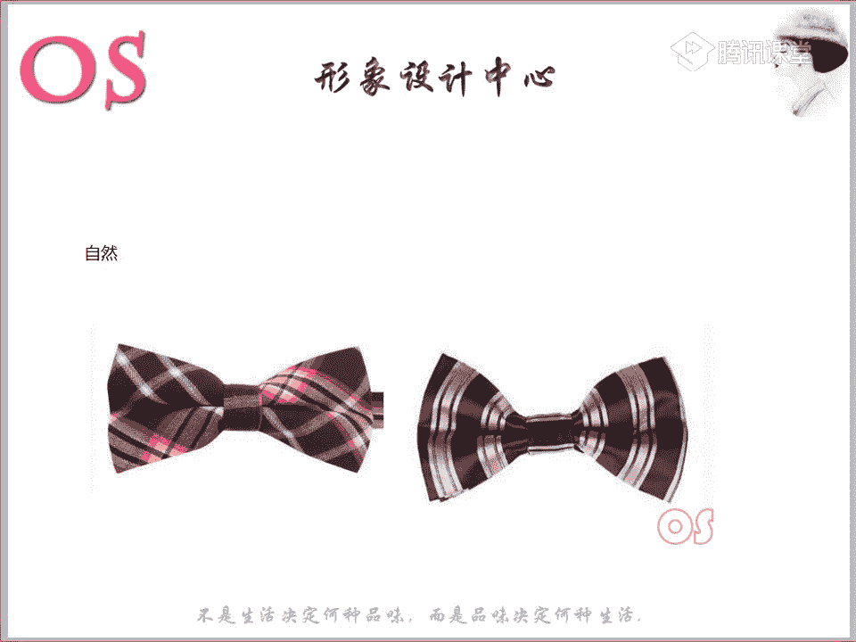

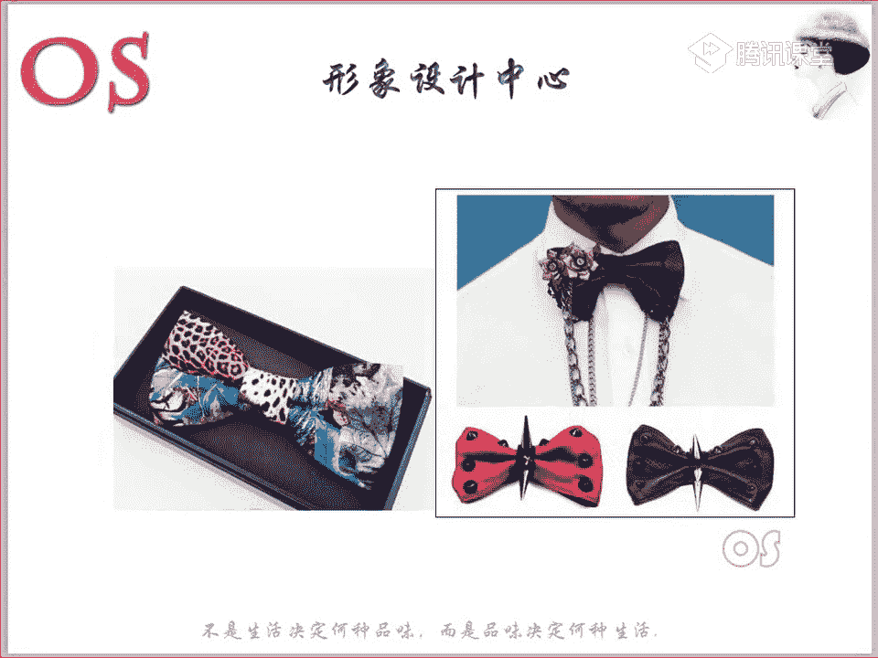

不适合。那么像自然风格呢，它就是适合这种天然去雕饰的这样一个感受。不管是材质也好，还是说图案，就是这样一个天然的一个感受啊。😊，好，关于我们这样的一个图案啊，哎我们的这样的一个领结啊。

图案中大家都理能理解吗？理解同学快速跟老师扣个1啊。

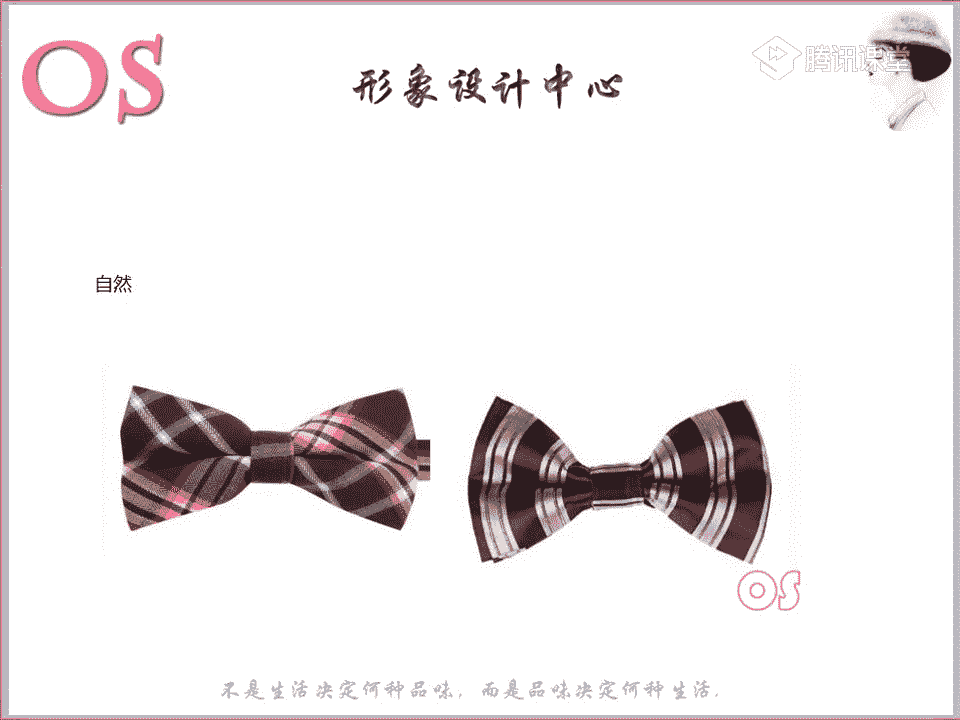

好，理解可以跟老师扣个一。嗯，然后接着呢我们来看到鞋子。😊。

那鞋子呢就是我们第一个啊，就属于这是属于我们的牛津译文鞋啊。来，大家看到什么是牛津译文鞋，这个呢就是属于我们的牛津译文鞋。那么它适合呢在我们这样的一个休闲场合，或者是说我要跟礼服去做搭配的时候呢。

可以跟去选择。

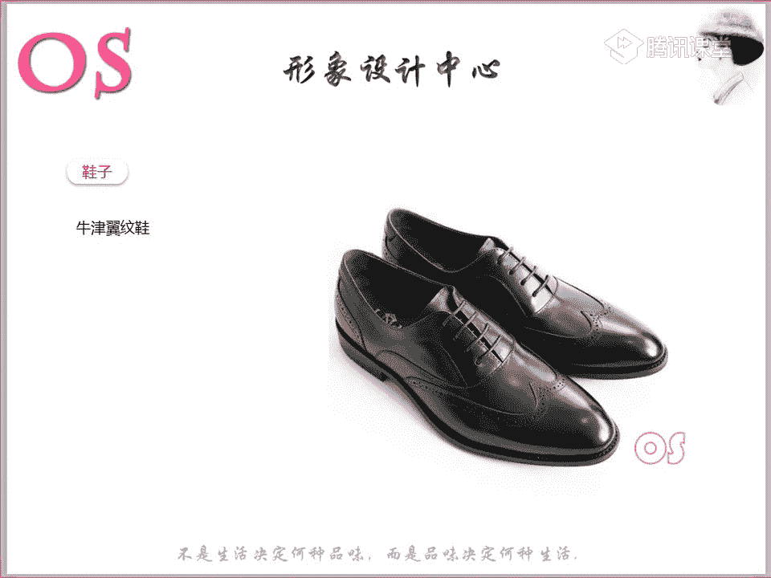

还有就是我们的楼花鞋，楼滑鞋是最适合能在社交场合去穿着的，跟礼服搭配。因为它的这样的一个整体的鞋子的量感气场是非常足的。那么大家也会发现楼花鞋跟异纹鞋它有一个区别，对不对？

异纹鞋呢也就是在鞋面上它有一个哦这样的一个纹路，有一个纹路，大家能够看出来啊。😊。

而镂花鞋不仅有这样一个异纹，它的鞋尖面上呢还有一些哦这样的一些镂花，对不对？还有一些镂花哦。所以这个呢是我们的牛津啊译纹啊，这个呢是我们的楼花鞋，男士的皮鞋里面。

那当然啊除了我们这样一个非常正式啊正版的这样的一个牛津译纹鞋啊，这样一个皮鞋以外呢，他家也会发现你就像prada啊，prada的话这样的一个松糕鞋。我不知道大家有没有去观察过。

你像它也有这样一个镂花鞋的设计，对不对？但是那双鞋子呢，它是一个松糕的啊，底稍微厚一点点，那么更趋向于休闲化，所以说啊这是我们非常传统的这样一个鞋子。那么随着现在的一些设计啊。

你也会发现在一些其他的适合其他场合的穿着一些鞋子呢，他也可能会去加入这样的一个镂花鞋的设计，加入我们的牛津译纹鞋的这样一个设计啊。😊，好，第三个就是我们的横式鞋。

所以说呢老师之前昨天那堂课说到我们这样一个正装，对不对？西装的时候呢，哎适合去搭横式鞋，这个就是我们的横式鞋。也就是说在鞋面上呢有一个横纹啊，我们叫它横式鞋。😊，可以跟我们的正式西装所搭配哦。

也叫一字拼皮鞋，这个也叫一字拼皮鞋。那么下一个呢就是我们的梦客鞋。大家可以看到啊，梦客鞋呢它有扣带，它是有扣带的。当然哦哦有的梦客鞋是一个扣带，有的有有的梦客鞋可能是两个啊，或者说三个。

那么还有包括像有一些休闲款式的鞋子啊，皮鞋，它也有这样一个梦客鞋的这样一个设计。😊，那么我们还是都把它归纳到呢这样一个梦客鞋啊，当然也有可能有的梦客鞋，它是不仅结合了梦克鞋，它还结合了镂花鞋啊。

有的皮鞋是这样的嗯，像我们prada的话，经常会采用这样的一些风格。大家可以去搜一搜嗯prada的鞋子，你就会发现确实能够去找到他们这几个的一个元素在啊。

采用的也是我们的英式风格这样的一款鞋子。好，接下来呢就是我们的露夫鞋呃，露夫鞋的话呢，在女装中呢，我们又称这样的一个鞋子呢，叫盖鞋哦，盖子的盖嗯盖鞋。那么这样的一个鞋子的话，其实在过去的贵族中啊。

我们的欧洲的贵族中呢，他们是作为拖鞋去穿的。也就是说唉贵族的这样的一个拖鞋所演变啊过来的啊，我们的露夫鞋。路哦路腹写。大家可以看到哦，不管是我们的正式的这样一个皮鞋也好，还是啊很多一些休闲的。

比如说我们的豆豆鞋，对不对？都是采用的我们这样一个洛呃，都可以通知通统称为我们的洛肤鞋哦。😊。

好，接下来就是我们的素面鞋，也叫懒人鞋啊，一脚就可以登进去的，对不对？早期的时候呢，像我们90年代男士的一些皮鞋的时候啊，还没有什么系带的，我们就很常见的，就是我们的素面的皮鞋，对不对？

那么包括男士现在的一些休闲鞋里面呢，像这样的一个素面鞋也非常非常的多。啊，像我们经常会把这样的一个素面鞋叫做什么呃？有呃，有叫做乐福鞋的，对不对？好像是叫乐福鞋吧。😊，好。

这个就是我们这样的一个素面鞋啊。那这是我其实就是我们男士的一些鞋子的这样的一些归类。那么当然除了一些运动鞋的话，老，还有包括其他的呃一些鞋子的话，老师就不做呃多的一个介绍了啊。整体的话。

我们男士的一个鞋子呢，大家会发现，不管是正式的皮鞋也好，还是我们的休闲的一些鞋子也好。其实很多鞋子都会遵循我们刚才以上所述的这样一些鞋子去做一些改变，做一些演变，对不对？

那么呢接着我们来看看我们不同的风格，它的一些鞋子的一个特点。我们先拿呢这样的一个皮鞋啊，拿我们以上这几款鞋去做对比。然后呢去举例子给大家给大家呢来看。

那么大家通过这样的一个鞋子中所呈现的这样的一个状况啊，所呈现出来的这样一些关键词。我们一定要读出来啊，因为老师给大家找图片，就是让大家能够从图片中看到我所说的这样的一些关键词。如果你能够看到。😊。

那么以后呢，你遇到任何的鞋子，你都会懂得怎么样去归类啊，怎么样去归类给哪一个风格。那么当然还是从我们这样的一个大风格开始啊，从我们的戏剧风格开始。那么大家首先来观察一下，看看我们这样一个戏剧型。

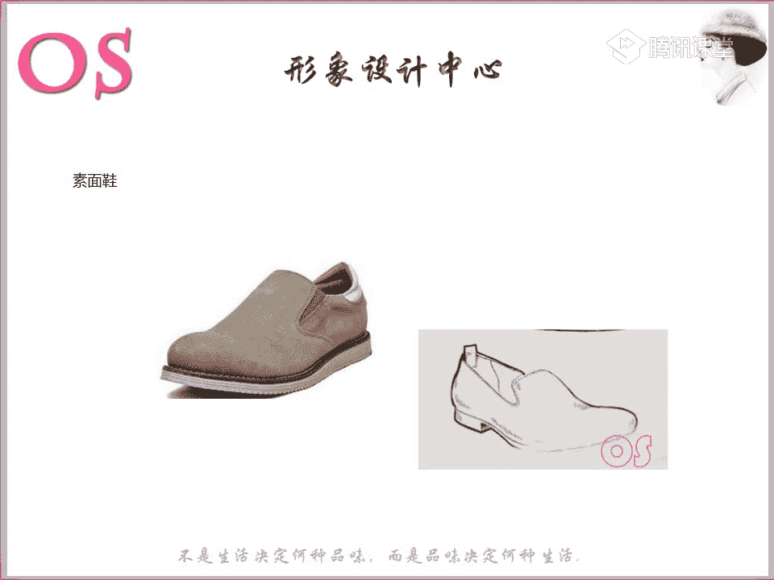

好，大家可以把自己所看到的这样的一些关键词呢打在公台上。好，夸张啊，都能够看到夸张，非常棒啊。所以说呢你从这样一个鞋子中，你会发现看到不仅仅是夸张，还能看到很醒目啊，比较摩登的这样一个状态，对不对？哎。

比较现代感啊，比较摩登，比较现代，装饰性呢也比较强。也就是说它这样一个设计感啊，唉，比较的强，对不对？是的啊，设计感非常的强，嗯，比较的大气夸张。😊，所以说啊我们这样的一个戏剧型呢。

包括服装的一些穿衣也是一样的啊，大家可以来看一下。回忆一下这样的一个感觉，这是我们的戏剧风格。接着呢我们来看看我们的自然风格。大家也可以从自然风格的鞋子中呢去读到一些关键词。

不要一定哦不要说看到老师所找的图片，就觉得我们自然风格的人要选择呃呃丑一点的呀，大一点的鞋子，不是这样一个道理啊，我们要是从这两双鞋子中呢，要找到你能够看到的一些关键词。那么从戏剧风格中啊。

我们看到了夸张摩登呃比较的醒目，对不对嗯。😡，那么从自然风格中，你们又看到了什么呢？好，这个是我们自然风格啊，穿衣服的有一些特点。嗯，再来看到嗯很休闲，很好。是的，所以说呢你会发现我们自然型的人呢。

他在选择呃我们刚才的领结的时候，你也可以看出来啊比较模糊的这样一个概念，对不对？所以说它不管是选择鞋子也好，选择服装也好呢，它非常适合一些造型上很简洁，很大方的啊，包括呢鞋子上的一些质地啊。

我们也可以选择这样的一些天然的质地，或者说有这样一个天然感痕迹的啊，有天然感痕迹的，你像我们戏剧型的，你会发现非常的人工化，对不对？它可以很人工，但是我们自然型的人呢自然型在选择我们的鞋子的时候呢。

它反而去选择这样的一些呃天然皮质的啊，天然肌理感强的，或者说柔软舒适的这样的一些鞋类是非常适合它的，或者是说呢这样的一个鞋子的轮廓啊，并不是那么的清晰，那么的呃清楚，对不对？而我们戏剧型。

你会发现啊非常的有光泽度，它可以去选择光。😊，泽感强的。但是我们自然型的话，反而呃在选择皮鞋的时候呢，不要去选择光泽感那么强的啊，或者说哎我直接从我们的鞋子上都能可以看出自己的一个脸。😊。

其实自然型的是不适合的，它最适合就是我们这样一个。皮质很天然的一个皮质。不太适合人工化的东西哦。😡，所以说像一些编织啊啊对啊，等等的，它非常好啊。当然也不要给我们的自然形选择一些太丑的鞋子啊。

它还是可以穿很漂亮的。但是呃也可以穿很秀气的。只是说你要选择一些天然的感觉啊。哎，比如说像有一些编织可以很好。或者是说呢皮质上一些哑光的，很朴素的这样一些感觉，它也可以很时尚，也可以很前卫啊。

哎也可以很时尚，很前卫，只是说整体整体来说呢，跟我们其他风格来说，你就像哎我们这样的一个新锐前卫型，你会发现光泽感可以十足，对不对？设计感可以十足。但是自然型绝对不要去选择设计感那么强的。

我们可以看到鞋子啊。😊，这两款鞋子大家也能够应该是可以看出来的哦，虽然说图片有点小，大家也能够看出来还是有这样的一个呃朴素啊，对，可以说是朴素朴实的这样一个感觉，造型很简洁，很大方，对不对？

但是鞋子呀还是很时尚的，对不对？😊，好，接着我们来看到这个哦浪漫风格的。😊，啊，浪漫风格呢我们从鞋子上可以看到嗯造型上怎么样，造型上是比较偏这样的一个圆润感的，对不对？呃？

整体来说它并不像我们的戏剧风格，因为它也是个大风格，但是它跟戏剧风格还是有区别。它不会像像戏剧风格那么的尖锐啊，或者说像前卫风格那么的呃个性那么的时尚。你会发现它整体来说偏圆润感的一些造型的鞋子。

很适合它。同样呢哎它也可以多去选择一些多装饰性的。它的鞋子有一些装饰是很好的。但是整体的一个装饰呢，你要呃去趋向于中性化的一个中呃那个装饰，不要去给它选择呢太过于夸张啊，太过于个性。

或者说太过于啊尖锐感的这样的一些设计的。嗯，啊，所以说唉比较华丽，是的啊，比较华丽的感觉。它的鞋子会你会发现浪漫型去选择一些华贵华丽的东西会非常的适。😊，核他。好，我们可以看到啊。

我们鞋子和衣服做搭配的时候哎。所以说浪漫风格的人去穿白色啊，这样的一个西装非常非常好看啊，或者说你穿一身白的时候，白色的毛衣呀等等的。嗯，以及呢我们在。跟西装做搭配的时候呢，可以去搭配这样的一个丝巾哦。

搭配领结它都是非常适合它的。好，浪漫型的人很帅啊。是的啊，浪漫型的人确实他的眼神呢是含着这样的一个水润感的，非常有这样。就好像他看你一眼呢，你会把被他所吸吸进去的那种感觉啊，非常有水润度。好。

接下来我们看到古典型啊，古典型呢看到这样的一个鞋子，你就会读到这样一个关键词，对不对？你会发现皮质非常的精良啊，做工呢也很上乘。那么样式呢它更趋向于经典款。所以说我们浪古典型的人啊，要在选择鞋子的时候。

不管你选择皮鞋，就是拿皮鞋举举例子，还是说我去选择相对来说休闲的一点的鞋子，而，像我们自然型的这样的一款啊，我们的这样的一个洛夫鞋，对不对？它就不够的精良啊，你会发现他很随性。

但是古典型如果你要选择我们的洛夫鞋的话，看到没有？我们要尽量选择左上角的这一双，你会发现呢不管是剪裁也好还是设计也好。😊。

还是我们的一个材质也好，相还有还有整个的一个鞋型，你会发现非常非常的经典，而且呢鞋型非常的标致啊。你看尤其是跟我们下面这一双鞋做对比，你就会发现鞋型非常的标准。

那么所以说我们的古典型的人在选择鞋子的时候呢，一定要注意的就是第一鞋型的一个标准度是不是一个标准的一个啊，很很这样一个呃，怎么说用形容词的话呢，就是。😊。

非常的硬啊非常的有型。第二个呢就是皮质一定要很精良啊，做工一定要很上乘。那么大家也可以看一下哦，我们古典型的人。所以说飞龙再天啊，作为一个古典型风格的男士呢，不要觉得古典型的东西啊不好看。

其实古典型它的东西是非常非常经典的，而且是经久不衰的，而且非常非常的耐凭，而且非常的显得我们的男士的这样的一个呃。整体的这样的一个感觉啊，精致感非常的强。好，所有的风格都是有气质的啊。

不能说我们的古典型就一定是古典型才有气质啊。嗯像妈妈款特点不明显。也就是说我们古典型的人呢，嗯呃怎么判断自己呃自己是属于什么样的一个风格的人啊。这个的话我们男士的一个风格的一个判断的话。

可以呃找到老师老师会呢先做一下调查完，把表格填完之后会啊按照要求去提供照片。那么判断方法的话呢，在我们的高级班会去讲到的哦。😊，所以古典型的呃不要觉得它呢呃不是它不是说特点不明显。

而是说呢它整体的鞋子的一些单品的话，一定要选择精致的，而且不要有太多的设计感。就比如说我们前卫型的，对不对？我可以加个铆钉啊，或者是说哎我加一加一层皮呀，加一个这样的一个鞋带的一些变化。

它更适合呢这样的一个经典的款式，不要有过多的设计，你可以有一定的设计。那你有了设计。比如说我们在选择休闲款式的鞋子的时候，在休闲场合的时候，我能不能增加一点设计呢，当然可以。

但是你整个鞋子一定是要有这样的一个质感的啊，一定是要有精良的这样的一个感受。

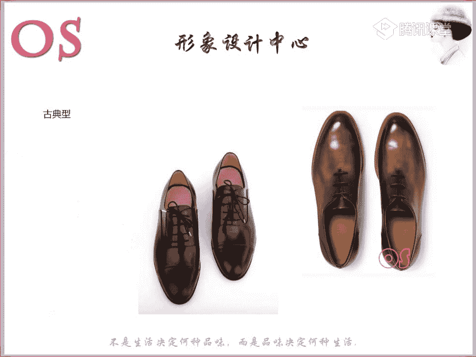

所以说就像这双鞋子哦，哎，老师是把它归纳到阳光前卫型，但是像这双鞋子，大家也会发现它是有设计的，对不对？它还是有设计的，能不能理解哦，你像我们这样的一个拼接是不是有设计。

但这双鞋子如果说给古典型的人在我们的休闲场合穿，能不能穿呢？也能够穿。因为整体的一个鞋型，你能不能看到精良，可以看到，对不对？哎，能不能看到我们这样的一个啊做工非常上乘的这样一个感受，能够看到。

而且样式是不是一个兼经典款式的样式也是一样的。只是说它增加一些设计可以有设计哦，所以说不要觉得我们这样的一个风格特点，它就一定是死板的，它可以有设计，而是你要看看这双鞋子它的一个大范围趋向在哪个方面。

如果说它趋向的方面是老师刚才所说的这样一个形容词，它都能够去啊掌握到，那么给到我们的字哦古典型的人穿可不可以呢？当然是可以的。😊，所以说像鞋子啊不要去固定化，像这样的一双鞋子，其实能穿的风格也有很多哦。

能穿的风格。所以说不同的鞋子不一定就是它一定是这个风格穿的，那么其他风格就不能够去穿，其他风格也能够去穿。只是说看我们这双鞋子，它更趋向于哪个方面啊，它的方面是大的还是小的。😡。

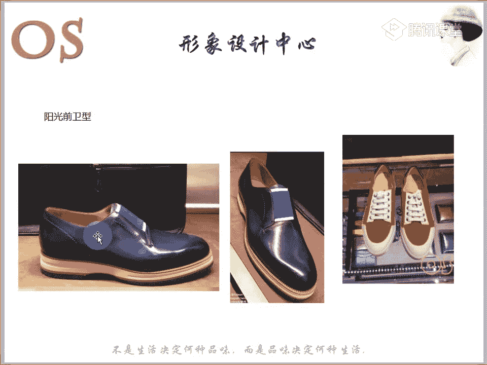

🤧咳。啊，对于老师刚才举的这样的一个例子啊，能不能理解啊，我们在场的同学，所以说不要以后我们遇到古典型的男士呢，把它都往这样的一个呃死板画去做打造，它可以时尚啊，它可以非常的时尚。

而只是说我们要抓住精髓，它的精髓在哪里。它的精髓就是精致啊，精良做感上乘，对不对？唉，款式能够往经典上面去靠，不要有太多啰嗦的设计，可以有简单的设计。但是如如果色彩也好，材质也好，达不到标准。

或者是说呢花色太过于啊万变的话啊。对，那我们肯定就不合适了。😡。

好，呃，更喜欢新锐前万。其实很多同学都是这样的。我想想我们在场的同学肯定很多同学就是老师给整断完风格之后都是不太容易接受的啊。因为确实是这样的，你自己喜欢的风格可能和你实际的风格会有一些区别。但是呢。

😊，你们随着时间的推移，对于自己的风格的一些物品啊，有了一定的了解之后呢，你就会越来越喜欢自己的风格。就像老师之前啊几年前的时候呢，我做诊断的时候啊，我特别喜欢少年风格的单件物品啊。

我特别喜欢少年风格的东西，但我可惜自己呢是一个自然风格啊，我特别不开心啊，因为我特别喜欢中性。😊，结果呢随着时间的一个推移哦，哎你可能刚学习完一年，你不会有多大的改变。因为你开始接受不了。

你还是按照自己喜欢的风格在走，可能会适当的去加入一些啊，你所适合的。但是因为啊一旦你的脑子里有了这样一个概念。你知道什么东西适合你之后，其实你会有一个潜意识的会去啊形成一个关注点。

也就是说你在逛街的时候，你会无意识的去观察你所啊，你所真正适合的这样一个物品。久而久之之后，你就会发现你越来越喜欢自己的风格。那么之后呢，你的改变就会非常非常的明显哦。😡，呃，好的好的。

一会儿呢下课了啊，发给我发给我们的同学。好，这个就是我们这样的一个古典啊古典风格了。接下来呢我们看到前前瑞风格啊，新锐的一个前卫风格。😊，大家呢可以先观察一下。😊，那么第一个呢。

你会发现它的光泽感非常的强，对不对？嗯，所以说它非常适合一些光泽感强的鞋子，或者说像一些包包，光泽感强的，我们新锐前卫型也是适合的。还有包括呢它还适合什么呢？还适合一些造型比较独特的啊。

造型甚至有点怪异的啊，这样的一些鞋子啊，你像这样的鞋子就是造型很怪异的，它也可以去穿。嗯，它也很适合。但是我们古典型的人就不要去穿了，造型太过于夸张，太过于个性了。😊。

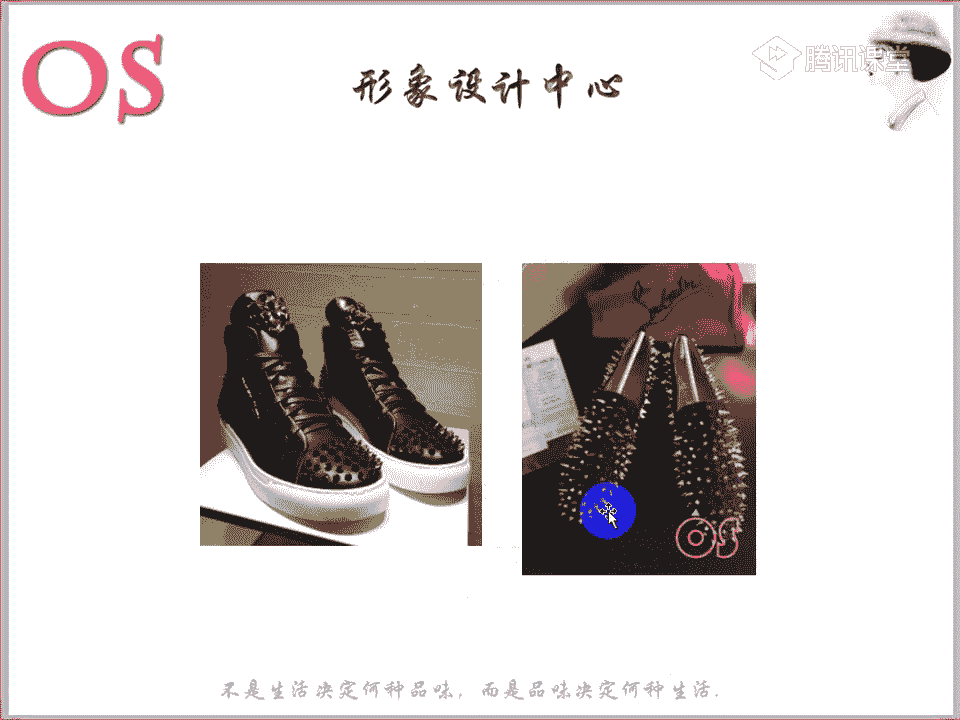

时尚感是非常强的啊。😡，那么大家也可以看到他的一些穿衣风格跟他的鞋子的一些做搭配啊所感受出来的。所以说整个的话呢啊时尚度、个性度是不是啊潮流的感觉嗯，整体的一个造型感啊，都是趋向于年轻化的同时。

还非常的啊有这样的一个与众不同的感受。好，看完我们新锐前卫的话呢，接着看一下阳光前卫啊，阳光前卫跟它是有很大的一个区别的。就以大家一看鞋子之后呢，你就会发现啊区别很大，对不对？阳光前卫的鞋子呢。

你会发现非常的趋向于年轻感啊，阳光少年的这样一个感受。其实你就用阳光少年啊，这样的一个四个字来形容我们阳光前卫型的这样一个单品是最恰当啊，不过的了。所以说呢它当然它也适合一些流行款式。

因为它有它毕竟是一个前卫风格的，所以说它的一个驾驭度呢还是不错的啊，还是驾驭度还是非常不错的。😊，啊，还是古典模特最难看哦，老师一点都不觉得古典啊找的所找的这样的一个古典风格的模特啊难看哦。

所以说你因为现在暂时呢很难接受自己的这样的一个风格，时间长了之后，你会有改观的。因为尤其是你尝试一下这样的一些新锐前卫风格的一一些衣服，你就会发现你穿和真正前卫风格你去穿对比有多明显啊。

所以说不要觉得我们这样的一个风格，每个风格都有每个风格的这样的一个特点，每个风格都有每个风格的气质和他的一个个性，只有真正你是什么样一个风格，你去穿对的话，你的个性的气质才会凸显出来。

所以说也不要觉得我们其他啊你感觉好花哦，很有花啊，这样的一些变化很有这样的一些个性就一定是好看的啊，不一不一定的。你就像像这样的一些鞋子，我们相信我很多有些同学是不太喜欢的。哦可能有的同学他自己是是。

😊。

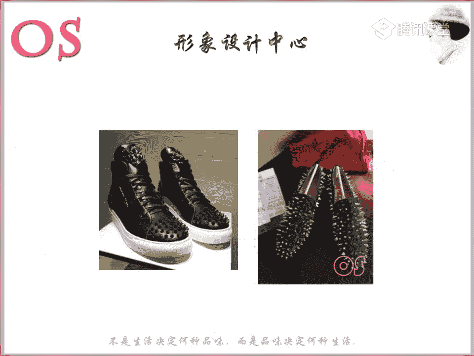

型他都接受不了，我不喜欢这些花里胡哨的或者是太个性的，我就喜欢这样的一些比较沉稳的，对不对？还比较精良的这样的一些款式。😊，而且古典风格的男士哦，他的一个五官的长相是非常非常呃，整体来说五官哦。

要相对于其他风格来说，它是五官的一个长相，要比其他风格的更加的呃，怎么说呢？嗯，就像我们很多一些古典风格的一些男明星。你会发现非常的整体的五官的一个比例非常的和谐哦。所以说不要觉得古典风格人难看哦。

其实相对于我们整体其他风格来说，古典风格的人应该说是整体来说长得是最标志的，因为他长得五官上是很标志的。而且它也有一定的气场。嗯，好，所以我们看到接下来看到这里啊，回到正题。那么就是我们这样的一个鞋子。

你会发现呢它还是可以去驾驭一些流行感，对不对？比如说一些拼接啊，或者说有一些色彩的这样的一些冲突的冲击力的这样的一些呃强调的一些色彩。或者说在造型上呢，它也可以多有一些独特的造型。

或者说装饰感强的一些鞋类也是可以的。但是呢它一定要比我们的昕锐前卫呢更加的啊内敛一点，它不可以呢啊去那么的个性啊，那么的去抢眼，适当的去内敛一点，内敛一点，同时呢又要表现自己的一个时尚度啊。

还是要去增加自己的一个时尚度。😊。

好，你你现在接受不了，没关系，时间长了，你会接受的啊。而且呢你以后多去逛街，去多尝试，你就会发现啊，当你对于服装风格的一个理解更加呃准确的时候，你就会发现呢古典风格的人其实衣服非常非常的呃不错啊。

而且非常的经典。😊，而且其实像很多呃男士来说，古典风格的男士是蛮吃香的啊，很吃香的。嗯，对，就是贵了一点啊。是的啊，他的衣服对于衣服的这样的一个。呃，整体的这样的一个细节来说，把控度啊非常的高。好。

大家对于我们这样的一个鞋类，还有什么啊一些要问的，或者说不理解的，现在可以提出来。如果都没有任何问题的话呢，可以快速跟老师呢扣个一。😊，好，接下来呢就是我们这样的一个作业啊。

作业的话呢还是要抄写我们的班训一次，以及呢做好笔记，加深呢我们领形的一些正确的穿法和呃领带这样的一些领子的这样的一个鞋子这样一个搭配啊去加深。另外的话呢把你自己所适合的这样的一些单品可以找出来哦。

根据老师所说的，哎，把我们适合的鞋子可以找出1到2双。或者说呢哎把我们这样的一个领带，把我们这样的一个呃衬衫的领型也可以找出来哦，可以根据自己的这样一个喜好去找找几样这样的一个单品。

然后加深自己对于我们今天这堂课不同的风格，它的一个所适合的这样的一些单品的一个印象啊。😊，好，没关系啊。如果说风格还没出来的时候，我们可以稍微慢放慢脚步啊。但是大家呢那么我们像我们这位同学的话，呃。

像潇潇同学的话，因为你是顾问班的同学，那么其实你可以呢把我们不同风格的都可以啊，像鞋子或者像领带，我们可以去找一遍。因为以后我们一定会用上的。因为你会遇到不同的这样的一个风格的男士，对不对？

所以说这个可以我们自己根据自己的这样的一个要求去寻找。因为确实是这样的，老师讲完之后怎么样去加快自己的这样一个印象，加快自己啊，更加的去理解这样的一些每个风格，他在选择单品之间的这样一个区别的话。

就是多去找图片。😊，图片找的多了，你的印象就深了。以后的话我们拿到任何一件单品，就能够快速的分辨出是什么样的一个风格的人更适合。好，然后其他同学的，包括有些呃那个做诊断的稍微晚一点啊。

打今天或者说啊明天啊明天老师都会把结果啊发给各位哦。因为这几天呢。嗯，年底了都有点忙，所以说诊断的人也比较多，所以大家耐心一点。好啊，也是非常感谢大家的一个聆听和陪伴。然后有任何问题呢都可以私底下啊。

到时候来找老师。然后大家时间也快也不早了，119点半了，然后大家早点休息。😊。

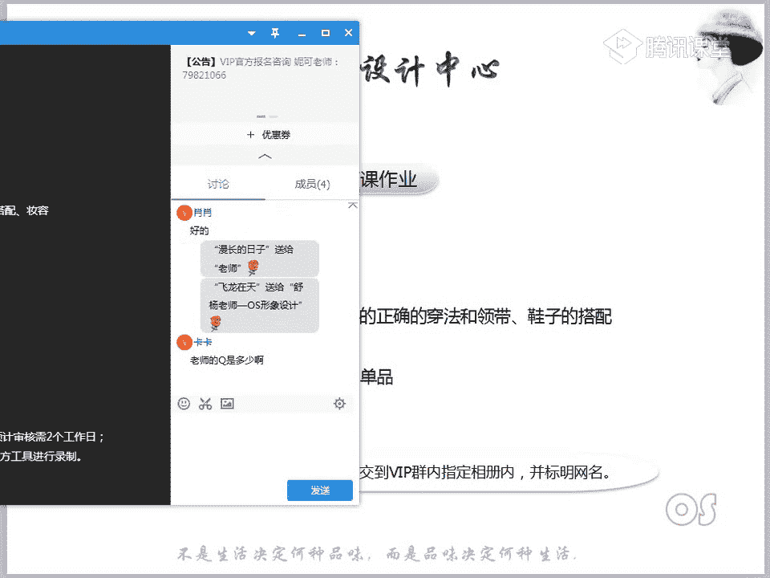