# 1、03OS男士形象VIP班《形象课》：第7节、服装风格认知

欢迎大家来到我们OS男士班的VIP课程。我是本节课的主讲老师舒阳老师。那么今天呢也是我们男士班在2017年的第一堂课。然后呢，在这里老师还是要跟大家说一声新年快乐。然后希望大家在新的一年呢呃心想事成。

😊，啊，我们应该大家都已经投入到了一个工作中啊，或者是说在学习中，对不对？

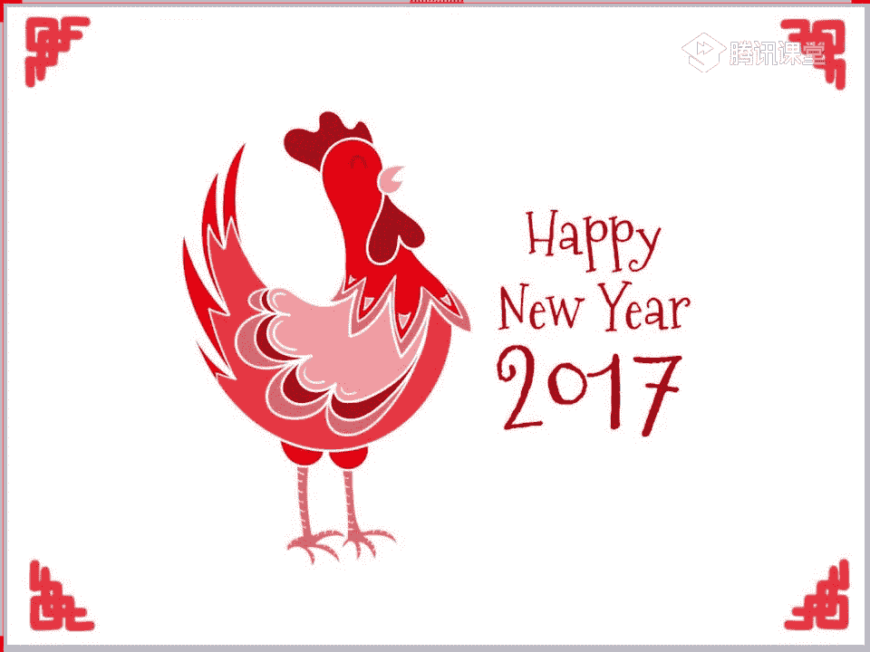

好，今天要跟大家所讲的知识呢是我们男士的第七节课。关于我们服装款式的认知哦。好像我们在场有一位新同学。是不是这位什么叫me了 home啊？是新同学是吗？好，可以跟大家打个招呼。

让我们的老同学认识一下我们的新同学啊。如果说是新同学的话，因为老师呃对你的名字有点陌生啊。嗯，新来的啊，那我们大家可以呢刷朵鲜花，欢迎一下我们的新同学啊。😊，嗯，好嘞，那我们继续啊。

我们今天呢要上的是第七节课。关于我们服装款式的认知啊。可能我们看往期的这样的一个呃课程表写的是服装风格，对不对？那我们这一节课呢，老师跟大家来说一下哦，服装款式和服装风格这两节课的这样的一个区别。

那这一节课呢主要会讲到我们男士的啊这样的一些外套的一些款型的分类。那在讲这样的一些分类名称的时候呢，老师也会跟大家讲清楚哪些风格的人适合选择什么样的一些服装款型。

那第二个呢哎就是会讲到我们的毛衣的分类啊，不同的男士在选择毛衣的这样的一些图案上也是会有不同的区别的那第三个呢就是我们啊要看到这样的一些裤装。我们都知道男士的裤装的一些裤型也有很多种，对不对？

针对的风格不同的所选择的也是不一样。那么我们这是今天这样的一个课程中会讲到的那如果等到我们唉快要结束的这样的。

几几节课程中会讲到一个服装的风格，对不对？那在那个风格课程里面呢，老师会重点去跟大家来教着大家来认知我们服装的材质，它的动合性这样的一些风格的一些划分。还有包括呢这样的一些图案啊等等。😊。

所以说今天今天这堂课呢主要就是让大家来认知一下我们服装的这样的一些款式。但是要知道啊，老师今天所讲的这样的一些款式呢并不是死的。大家会发现现在哦我们男装的这样的一些流行的一些款式，其实很多呢它的一个最。

最开始都会根据这样的一些款式去在这样的一些基础款上呢去做一些文章。所以说大家要知道今天这两堂课的一些知识呢，一定要去灵活的运用啊，不要觉得哎老师你所说的这样的一些固定的款式，那我就固定的去看哦。

我什么是双色棒球夹克？比如说哦老师举个例子，那是不是这两款就是双色棒球夹克。那么其他的这样的一些棒球夹克。哎，比如说其他的一些呃这样的一些带有一点设计的那就不一样了嘛。不是哦，要在这样的一个基础上面。

我们可以在这样一个基础上面去做文章。所以说。😊，今天呢主要就是让大家要知道我们这样的一个基础，然后呢去找到这样的一个基础，认知这样一个基础。然后我们再灵活的去运用啊。

那在正是关于我们今天的这样的一些学习重点之前呢，我们还要接着上一节课。上一节课是第六节讲到我们的一些正装的穿法。那在正装的时候呢，老师有说过，会去跟大家呢再带来带领大家去熟知一下我们这样的一个礼服。

所以说今天的课程呢，首先先从我们的礼服开始。然后呢，我们再回归到这样的一些呃本节课的学习的一个重点三个重点。然后呢，整节课对大家的一个要要求就是要熟知我们服装款式的一一个分类，以及呢我们这样的一些选择。

那做好准备的同学呢快速跟老师在公台上呢刷个鲜花哦。好，然后呢我们包括我们新来的同学，这边可以注意一下啊。如果说我是学习顾问班的，对不对？我学习顾问班的这样的一个新同学的话呢。

你们可以你可以呢在你生活中找到一个模特啊，找到一个模特，哎，可可以是你的男朋友或者是说老公或者说家人哦，都是可以的。然后呢，在以后的课程中，我们在改造的过程中，可以把他呢作为你的改造对象。

然后你去帮他去做打造。所以说要跟大家所说的就是呢对于我们这样的一个呃顾问班的同学，你们可以呢找到模特之后呢，按照要求去跟老师提供照片，老师会帮你呢把这样的一个模特的风格诊断出来，还有包括记性。

那这样的话，我们在这样的一个基础上面，哎，在结合我们每一堂课的这样一个内容去跟他做打造呢，你的这样的一个思维就会清晰很多啊。😊，所以说这是顾问班的那如果说是我们个人班的同学呃。

有没有诊断色彩和进形风格的，我可能是年年底的时候报的名，对不对？我们当时课程已经结束了，那我可能老师我赶了很久才把这几节课赶到呃赶，现在赶过来。那我之前不知道自己的色彩机型和风格也可以联系老师啊。

课后找到老师，然后呢把色彩机型和风格的这样的一个诊断呢，我们把它诊断完。另外就是之前在年前交呃交给老师的这样的一些资料，还有包括呢照片的，然后老师也都已经帮你们诊断完了。所以你们自己要呃注意去看一下。

有任何问题呢，都可以在课后来联系老师。那好，我们今天呢首先从我们接着上一节课啊，然后呢唉到这堂课的这样的一个内容。上一节课呢我们讲到正装。那么其实呢像这样的正装的正装的一些穿法。

当然也离不开我们这样的一个社交场合的一个着装，对不对？社交场合的着装呢在这里重点跟大家哎说一下，我们要虽然可能我们有些男士以后没有这样的一些场合。但是我们一定要知道。😊，因为保不齐，对不对？

我到了唉某一个年龄段，我可能就真的碰到了。虽然说现在没有。那么包括我们的形象顾问也是一样的啊，以后你们接触的人群都是不一样的。所以可能唉你以后接触的这样的一个顾客。

他刚好就有他的这样一个客户给他这样一个邀请函，可能就要去到唉类似于这样的一些社交场合。他而且呢对于服装的一个着装也有这样一个明确的要求。所以说我们一定要知道我们不同的这样的一个社交场合的着装。

他的这样的一个意义，以及呢要注意的哪些点，他的正确的这样的一个穿法啊。第一个呢我们就是先从这样的燕尾服来开始。其实呢像社交场合，它是分为晚上和白天的。那么燕尾服呢，它就是属于呢我们男性夜间。

也就是说6点以后的，晚上6点以后，哎我们的这样的一个第一盛装啊，所以说呢要知道燕尾服的款式。很多同学应该对于这这样的一个燕尾服的款式并不陌生啊，它的一个款式就是它的后镜哦，就形似这样的一个燕尾而得名。

后面像燕尾一样。很多同学应该都见过，对不对？😡，可能我们在现实生活中见的比较少，但是像一些呃婚纱店的话可能就很多。还有包括我们在一些呃电电视上面，对不对？

那它的颜色呢一般也是以黑色或者说深黑深蓝色的这样的一个毛料毛料啊。就是比如说我们这样的一个金纺羊毛的这样的一些料子。那裤子呢和上衣一般都是同色同料哦，裤子和上衣同色同料指的是外套啊。

指的是外套和这样的一条裤子是同色和同料的。那么包括呢我们的裤侧呢会有这样的一个缎面的调试。我不知道大家能不能看清楚啊。看老师鼠标的位置会有一个断面啊，看看到同学可以跟老师扣个一啊。

裤侧会有一个断面的调试。然后呢唉我们一般哦一般像这样的一件衣服的话呢，我们上面也会配这样的一个白色的双E领的一个礼服衬衫。那之前我们讲衬衫的时候，就有讲到这样一个立立领，对不对？E领啊。

一会儿老师会给大家看一领这样一个衬衫。那么呢一般的这样的一个搭配呢要去搭配这样一个白领结是最符合我们这样的一个规定的哦，最符合规定的一个穿法，就是搭配白领结，然后呢，U型的这样的一个胸衬啊。

配合呢我们白色或者是外套同色的这样的一些双排或者说单排扣的礼服的背心，然后呢外再加上我们白色的一个呃装饰衣帕啊，就是它又左侧的这样的一个口袋的一个衣帕。然后呢。

下面的裤鞋子呢是配上我们的黑色漆皮的一个牛津鞋哦，牛津译纹鞋可以去搭配这样的一双鞋子，然后袜子选择黑色袜子，这是我们的一个标准的一个穿法。那么像这样的一个U型的胸衬是什么一个概念呢？看到我们这件衬衫。

这样的一个大型的这样的一个啊颜色好像要深一点，对不对？没有他的这样一些其他医生那么的透啊，那么这个就是我们的U型的衣衬。当然啊有的这样的一些异形领的衬衫的话，它的U型。这样的一个胸衬的话。

可能会更加的有啊装饰感，装饰细节可能要比这个还要还要强一点啊。那这个就是要我们的这样的一个作为晚礼服。也就是说我们的燕尾服呢，在搭配的时候，唉这样的一些细节大家一定要记住啊，搭配的细节一定要记住。

那当然选择的方法，其实哎跟我们在穿西装的时候是一样的。像比如说啊里面的衬衫应该要跟你的啊你的这样的一个西装长多少。其实这样的一些规格都是一样的。包括裤子啊等等规格是差不多的。

但是只是说我们在搭配的时候呢，有一些细节一定要多去注意到啊，按照老师呢文字上面的这样的去的呃搭配啊，一定要记清楚。😊，那它适合的场合呢，比如说晚间正式隆重的盛大的一些场合啊。

比如国际国家级的这样的一些庆典，对不对？还有包括呢像我们的婚礼，或者说古典交际舞比赛，或者说大型的音乐会啊，你会发现像一些指挥官，他就会去着握这样的一个燕尾服。

所以说这样的一个场合呢是一定要去哎搭配我们这样的一个燕尾服的。因为可能我们有些同学啊这样的一些场合嗯不会去碰到，我们快速的去说一下啊，然后呢一定要有这样的一个知道，这样的一些知识一定是要知道的。

也就是说时间场合哦，地点的这样的一些知识。哦，叶委福，大家还有没有什么问题啊？有任何问题的都要积极的在公台上提出来。另外的话呢，我刚才有看到一个新同学又进来了，对不对？然后新同学这边老师要说一下。

如果说是我们呃再交代一句，因为可能我们有些新同学。😊，不知道你们在会不会去看录播。然后呢，新同学如果说你是作为形象顾问班的同学的话，一定要在我们这样一个男士课程学习期间可以去给自己找一个模特啊。然后呢。

在往后的学习中，我们一步一步去帮他去改造，然后在学习和实操的过程中去做结合，那么我们学的知识会更加的透彻。那如果说我是作为这样的一个个人形象塑造班的同学一定要了解自己的形象的个人的这样的一些色彩。

还有包括你适合的这样一个风格。因为我们所有的课程啊，每一堂课都是结合着我们这样的一个针对于不同的色彩进行和风格的人去讲的。如果说你不了解你自己的色彩进行和风格。那么其实有时候你你会发现学完之后啊。

整个课程都结束了。发现自己并没有太大的一些改变。另外的话呢就一定要去实际的操作起来。不然的话，你只是在记只是在学不去做改变啊，一样的。😊。

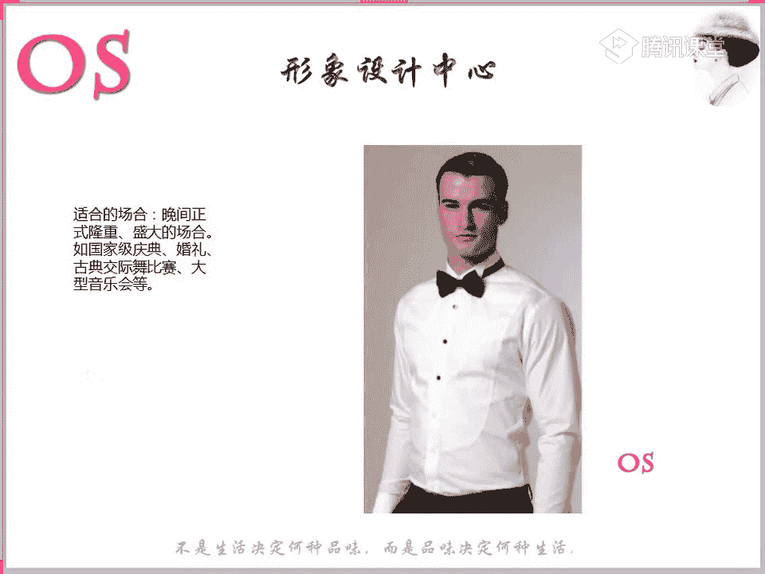

好，接着呢我们再来看到下一个。然后另外提一下我们的燕尾服。燕尾服的话呢呃胖的人可以不用腰封啊。如果说它是一个比较胖的，我们是可以不用搭配腰腰封的。然后呢，可以用马甲用马甲去代替腰封是可以的哦。

这个就是我们的腰封这个黑色的。

好，第二个就是我们的吸烟装。吸烟装呢它有一个另外的一个名称叫塔士多礼服，叫塔士多礼服。另外的话呢吸烟装哦，它其实呢也是属于我们晚间的礼服，也是属于晚间的礼服哦。然后呢，另外的话它的这样的一些特点。

就是领子呢是我们的青国领。领子是我们的青果领哦，然后我要问一下大家哦，平搏羌薄和青国领都能不能区别？😡，好，能区别的同学快速跟老师在公台上扣个一啊。之前有讲过的。平柏岭、青薄啊，羌平柏岭、羌柏岭。

还有包括我们的青果岭能不能区别啊？哎，我们销售同学很棒，可以，没问题。那其他同学呢？考一考大家哦，平柏岭、青青国岭，还有我们的羌柏岭能不能区别？如果不能区别同学呢，可以呢在公台上提出来哦。

然后另外的话我也会发现大家有一些同学是属于这种呃作业呢，也不及时去交的。好，我们可以回顾一下啊，带着大家来回顾一下。那我们首先看到这个就是我们的青国领，你会发现整个领型来说呢是比较圆润的，对不对？

没有任何的这些棱棱角角。

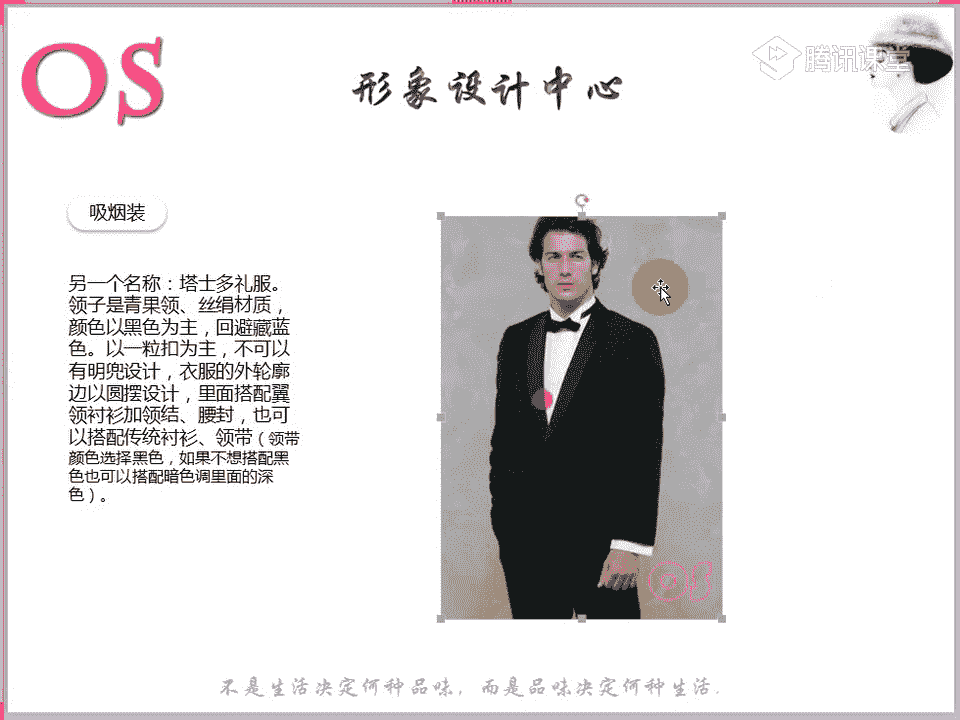

可能有些同学看不太清楚，老师呢把屏幕打的，把图片放大一点，给大家看一下啊，这个就是属于我们的青国领，是属于曲线型的领型啊，曲线型的。也就是说没有这样的一些直线条。没有棱棱角角哦。😡。

然后一会儿跟大家解释平薄和那个呃羌薄的这样的一些领型。首先看轻国领啊，那我们的吸烟装呢一般都是以我们这样的一个轻薄领。然后呢唉领子它用采用的是这样的一些丝娟材质。

你们会发现领子跟我们的服装的这样的一些衣身的材质是不一样的。它是丝娟的材质，另外的话呢颜色也是都大部分以我们的黑色为主，一定要记住哦，我们要回避藏蓝色吸烟装最好不要去选择藏蓝色的，然后呢以一粒扣为主哦。

扣子的话一般是一粒扣。另外的话呢唉没有任何的明兜的设计，而且衣服的外轮廓的话呢。包括我们都是以这样的一个圆摆啊，圆摆。看到我们这样的一个医生哦。原版的设计。另外的话呢里面我们可以去搭配呢异形的呃衬衫。

然后呢加领结，然后可以搭配腰封。唉，领带的颜色也是可以的。我们可以去选择普通的衬衫。但是我选择这样的一个领带的颜色呢，要选择黑色。当然如果说你不想去搭配黑色的话呢，我们也可以选择自己色彩器型里面呢。

适合自己的这样的一些暗色调的深色去做领带，也是没有任何问题的。这个就是我们这样的一个吸烟装哦。😊，另外的话，鞋子我们可以去选择呢系带的皮鞋哦，在你穿吸烟装的时候，你可以去选择系带的皮鞋。唉。

包括有花纹感的这样的一些译纹鞋，或者说镂空鞋，我们都是可以的。那么呃白天如果说我们在白天的时候去穿着吸烟装，你就要注意了。白天社交场合中，我们在春季或者是夏季呢可以去变换一点点颜色是没有任何问题的。

可以去变换一点颜色。当然以黑色为主。但是呢如果是在白天的这样的一些春季或者说夏季的话呢，颜色可以进行这样的一个变换。好，接着我们来看看这样的一个场合啊，场合的问题。

那么呢比如说唉场合在我们时间和场合啊还有包括地点，我们来重点来看一下，那么时间就不多说了。时间老师刚才已经说过，也是属于我们晚上的这样的一个礼服，对不对？比较正式的。

那么呢像我们这样的一个呃地点呢就是在宴会大厅，或者说剧院等这样的一些正式的场合去穿着宴会大厅啊，剧院。那包括像我们明星在出席一些啊宴会或者说这样的一些颁奖典礼的时候。

你也会发现很多大部分明星都会去着这样的一个吸烟装，对不对？塔士多礼服。那么所以说呢场合就是正式的宴会舞会或者说唉观看一些歌舞剧的时候，或者说授奖仪式的时候，鸡尾酒会等，都呢男士啊。

如果说我要轴哎穿的比较正式。然后要身身穿这样一个礼服的话呢，我们可以多去选择塔士多礼服。😊，以上呢就是我们晚上呃男士呢所适合的这样的一些礼服。然后呢大家做一个基础的了解啊。然后这是要一定要知道的。

包括尤其是我们作为形象顾问来说，那么接下来呢我们来看看白天的，白天就是6点以前的哦，晚上16点18点以前的。那么呢第一个呢就是我们的大礼服啊，我们包括我们在这样的一些皇室，或者是说呢在包括像日本啊。

像这样的一些政政府官理员，政界的话，你也会发现穿这样的一个大礼服的，在白天也很多。那这是我们在白天穿着呢最正式的礼服，领行的话呢是以我们的枪柏领啊，这个就是要知道刚才老师所讲的是轻薄领，对不对？哎。

我们时间的脚步，不明白什么是枪薄领的。我们看到这样的一个领行啊，这个就是属于我们的枪薄领。😊。

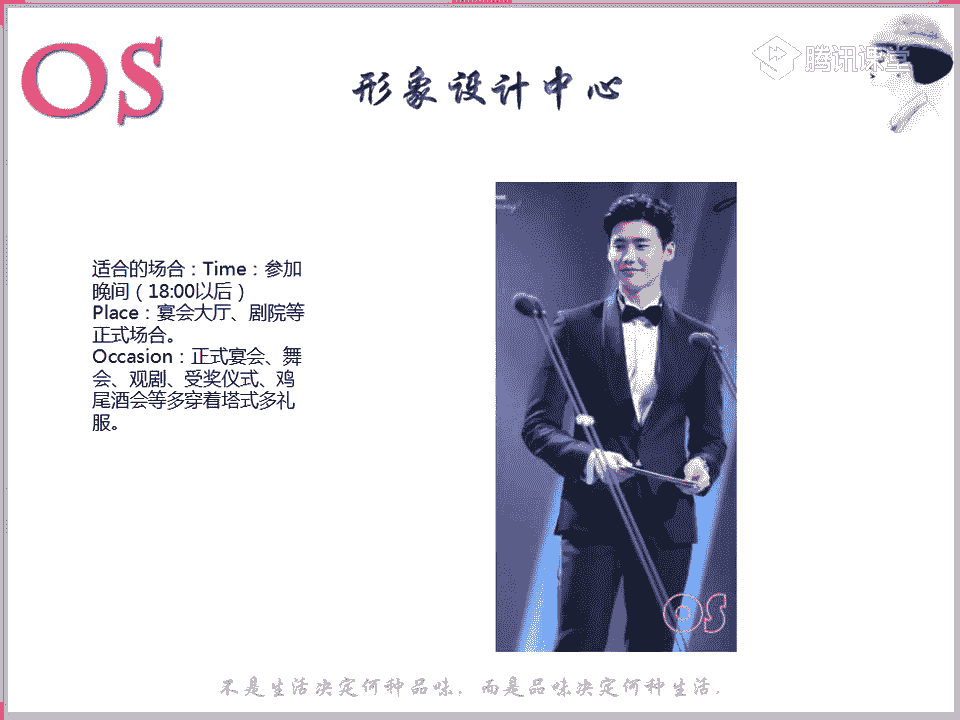

我不知道我们这位同学能不能看得清楚啊。😡。

然后老师再找找，因为我们今天没有讲到，因为。之前那个课件啊，老师没有找过来。这个应该是可以去看得清楚的哦。看到这样的一个领型没有，而且呢应该能够若隐若现的看到这样一个肩哦，非常尖锐的这样的一个角。

能看到的我们这位同学能看的话，跟老师扣个一。所以你会发现其实西装啊一般很多西装的话有这样的一些羌柏领或者说平薄领，就是平哦平头这样的一个平驳领会很常见。那么像这样的一个非常尖锐的。

有一个在角度上有一个非常尖锐的角呢，就是我们这样一个枪柏领。包括我们刚才有同学哦，哎，梅根老师回复的，你们可以呢再来复习一下什么是羌柏领啊，一定要对这样的一个印象，一定要加深啊。

拿到任何的这样的一个西装能够准确的去分辨出来，它到底呢是属于枪柏领还是平驳领。那这个就是我们的一个枪柏领。所以说呢大礼服的一个特点就是第一它是枪柏领。另外的话呢，唉它跟燕尾服有一个很大的一个区别。

不要觉得哎这样的一个衣服，一定就是燕尾服，这是不属于燕尾服啊，它是属于大礼服。大礼服最大的一个特点就是前一片和后一片是连接在一起的。你们可以看一下啊，这是大礼服。然后我们再来回顾一下燕尾服。😊。

你会发现燕尾符和我们的后翼片，它是不是这样的一个非常唉这样一个完美的一个线条衔接在一起的，对不对？😊，所以说啊大礼服的和燕尾服千万不要搞搞混淆啊，不要觉得唉所有带尾巴的就是我们的燕尾服。

那么大礼服它的一个前一片和后一片是连接在一起的。当然也是一粒扣子。那么可以呢在里面去搭配衣领的这样的一个衬衫，哎，搭配领结，然后呢去跟我们的腰封做搭配都是可以的。但是如果你想去配这样的一些传统的衬衫。

或者说哎我搭配领带啊，马甲也是非常非常常用的，这是非常常用的，那么裤子呢一般我们都是会搭配深灰色的裤子啊，就像我们这样的威廉王子一样，它这一身就是非常正式的哦。😊，非常标准的。

而且呢裤子一定是要有柳条纹的。大家应该能够从我们威廉王子这条裤子上也能够看到这样的一些条纹，对不对？我们通常把这样的一个裤子呢叫做柳条裤，颜色呢当然可以变化，但是呢一定要以五彩色为基础的变化。

上衣黑色下衣呢是深灰，这个是我们目前国际上的穿着的最高的。

那么像我们这是哦，这是我们的像这是我们的邻国啊，日本嗯。

好，燕尾服也是枪伯领巴哦。燕尾服是的哦。但是怎么说呢？燕尾服现在的话，很多燕尾服它出现这样一个平驳领的呃，也是有的。但是一般啊正式的大部分都是以我们这样个枪脖领啊。好了，这个就是我们这样的一个大礼服。

大家看到大礼服的这样的一个时间地点和场合的一个问题啊。然后时间呢不说了，16点以前对不对？白天的那另外的话呢，我们在白天的时候，各式正式的场合以及较比较正式。哎。

又没有对穿着有明确要求的这样的一些场合都是可以去穿着的。😊。

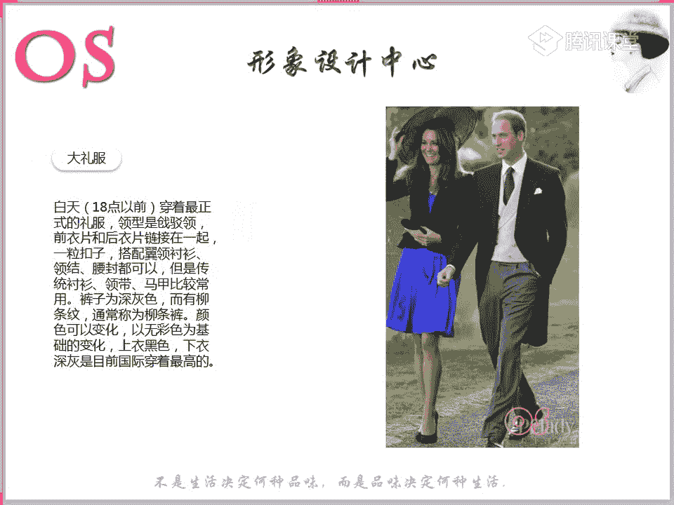

就比如说这个场合非常的重重视，但是呢哎又没有对我们的着装有明确的这样的一些要求。其实我们就可以穿着这样的一个大礼服啊。比如说呢访问卖访去接近的时候，我们可以穿这样的一个大礼服。

还有包括呢唉午餐会、茶会或者说游园会，还有包括呢婚丧典礼等这样的一些场合，都是可以穿着他出席的。呃，这个没有青果岭哦。

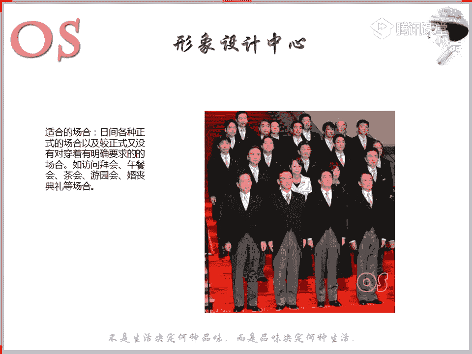

好，接下来我们看到最后一个白天的礼服，就是我们的晨礼服了啊，然后呢呃陈燕。😊，燕尾服是没有青果领的哦。没有青果岭啊，哎，我们来看到这样的一个最后一个。白天的礼服，那这个礼服晨礼服呢。

其实我们也可以呃说它是这样的一个。比较怎么说呢？简简约简锐的一个礼服吧，也算是啊比较常见的。因为它可能会介于这样的一些标准和我们普通呢和我们这样的一个晚礼服之间。所以说呢也是比较简锐的礼呃，简约的礼服。

然后呢我们也可以称之为呢它叫晨礼服哦。好，我要说的啊，就是燕尾服一般呢都是以枪柏领为多哦。其实像燕尾服是平薄领的，很少见啊。燕尾服是平柏领的，其实不多。啊，然后我回到这里哦，就是我们这样的一个晨礼服。

那其实它会有一点形似于我普通的这样一个西装。当然啊像我们这样的一个晨礼服的话呢，它其实跟它的领型就会有一些差异了。它不仅有这样的一些唉践型的领子，对不对？比如说平薄也好，还是我们的枪薄也好。

还有包括呢它也有轻薄领啊，晨礼服比较领型的变化是比较大的。但是一般呢哎我们比如说双排扣或者单排扣同样也是可以的。以及呢还有就是包括我们的领型和燕尾服的领型，它其实有一丝丝相同啊，有一丝丝相同啊。

比如说在他做枪轻薄领的时候，就会有一点啊，就是比如说我们这样的一个呃枪薄领的时候呢，就会有一点相同。而且呢它也会普通的一个西装，它相较于普通的西装会更华丽一点。

也就是说逐渐呢在我们当今的这样的一个现代社交场合中，它是一个主要的礼服。你会发现很多呃尤其是我们最住最具代表的一些男明星。不管是在我们白天的这样的一些颁奖典礼也好，还是说晚上的一些颁奖典礼。

或者说我们这样的一些呃社交场合中，你会发现大部分这样的一些男明星啊，穿晨礼服出席的是非常非常多的。所以说啊我们这样的一个晨礼服呢，也推荐给中国男士聚会的时候，去代替一些礼服的一些一般的西装。

所以说这样的一个场合如果非常的正式，非常的大型。那我们必须要穿一些正装的时候呢，穿穿一些礼服的时候呢，如果你又觉得哎有些礼服太过于夸张了，对不对？那我们就可以选择这样的一个晨礼服啊。

当然呃你如果说你想要去用西装去代替这样的一个礼服的话呢，我们也可以去选择一些窄版的英式，或者是说唉相对于我们中国人更适合的这样的一些窄版的欧式西装都是可以的。但是呢虽然说西装的款式。

我们可以选择英式的欧式的，但是面料上我们一定要增加光泽度啊。因为光泽度呢能够给我们这样的一个西装中增加这样的一个仪式感。😊，所以这句话大家一定要记住啊。😡，好。

这个就是我们呢接着上一堂课在讲到我们的正装的时候呢，没有去跟大家讲到的这样的一个礼服啊。关于礼服，大家还有没有什么问题？其实可能我们不用去太多的去纠结什么，但是一定要知道每一款礼服它有什么样的一个名称。

然后呢，它的一些特点以及呢正确的一些穿法。好，如果说没有任何问题的话呢，快速跟老师扣个一啊，大家不要睡着了啊。😡，好，没有问题的，快速跟老师扣个一啊。然后这些基础不要求说一定大家有呃能够死死的抓住。

但是一定要有一个了解。那么接着呢我们就回到本节课的这三个学习的重点啊，学习的重点。第一个呢就来说到我们的男士的外套了。外套的话呢，我们当然要从大衣类的开始说起啊，从大衣类的说起。

第一个呢就是我们的正式的这样的一个大衣啊，正式大衣呢。😡。

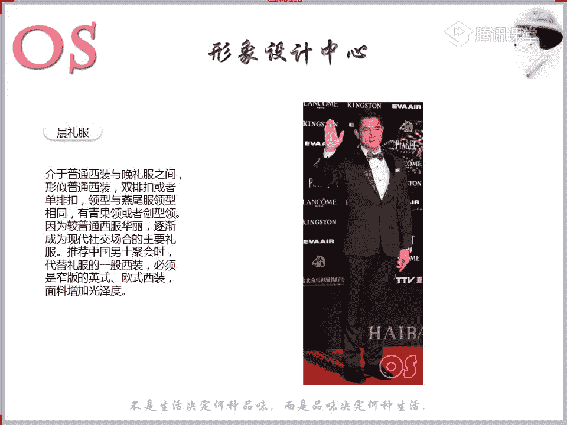

如图所示啊，你会发现它其实就是西装的加长版，对不对？西昌的西装的加长版。然后另外呢大家要知道的就是在选择这样的一个正式的大衣的时候呢，其实领型我们可以根据自己的风格去进行选择。😡，好，老师跟大家说一下。

像这样的一个正式的大衣的话，你也会发现唉大衣款式它会有枪脖领，也会有哦平薄领，对不对？😡，好，这样的话就会更呃更好的去理解啊。好，如果说对于图片有任何问题的，如果说老师这张照片在展示的时候。

有任何还有不懂的，没关系啊，可以提出来。😡，好，我们来看到这个正式的大衣呢，其实非常好理解，就是我们西装的加长版。也就是说在西装的外表上呢，我们把它的衣片呢会加长哦。所以说呢这是我们的大衣。

西装的加长版。当然这样的一些正式的大衣的话，一定是要搭配呢我们正装的，或者说去搭配礼服啊，比如说在这样的一些秋冬季节，我要穿着礼服的时候，我不可能说哎礼服外面去套羽绒服是不是不太好看？

那如果我们还有包括上班的时候也是一样的。如果说我们要穿着西装的话呢，在外面都可以呢选择搭配正式的大衣呢，起到保暖，然后呢，又跟你的服装相协调。😡。

然后另外就要说一下，像我们这样的一个正式的大衣的一个领型的话，其实像枪柏领也很多，平泊领也很多。那么大家在选择的时候呢，可以根据自己的风格去进行这样的一些调整。当然比如说你是一些前卫风格的男士。

或者说唉我是这样的一些细菌格的。其实我们可以去选择适当选择枪柏领。那如果说我的风格偏中性或者是说我的风格呢偏一点点值的话呢，比如说像我们的古典型，或者说唉像我们这样的一个自然风格的。

我们其实以这样的一个平泊领啊，这张照片中这张照片中的一个大衣，就是我们的平薄领。那像以这样的一个平驳领去做搭配也是最好的。😊，那我相信啊，如果说是一直从第一节课跟到现在的。

应该对于枪伯和平搏是不会有任何问题的。因为老师之前在讲西装的时候啊，讲正装的一个穿法的时候，哎，我们就有我就有拿着这样的一个枪薄和平搏的照片去跟大家展示啊。如果说你们对于枪伯和平搏还没办法区分的话。

我建议我们这样的一个同学呢，回顾到老师之前所讲的那一堂课去看一看啊。正装的这样的一个穿法。😡，好，这个就是我们的正式大衣。😡。

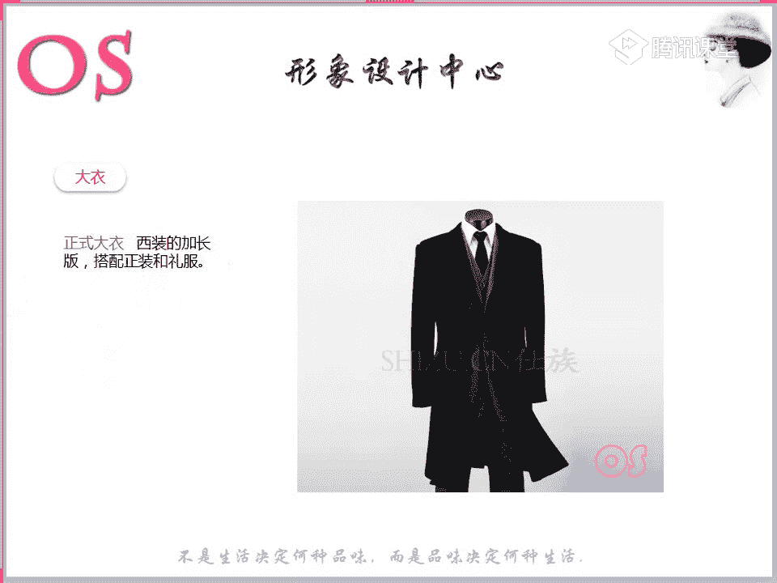

而且呢适合穿这款大衣的风格呢，其实最适合就是我们古典型的男士啊。古典型的男士呢穿着这样的一些正式款式的西装的加长版的，像这一款是典型的哦。唉，但是在色彩上它还做了一些文章，所以说你会发现呢没那么的正式。

是不是？😡，会发现又感觉呢在色彩上做一些文章之后，就相对来说要要舒服很多，不会那么的沉稳了，对不对？往下压的这样感觉。像这样的一些款式的话呢，是最适合我们的古典型男士去穿着的。当然啊其他风格的话呢。

你们要穿着也是没有任何问题的。只是说我们在材质以及呢在色彩上面或者说在领型上面呢，我们可以多去做一些文章。那怎么样去做文章。在往后我们再讲到服装风格的认知的时候呢，会跟大家讲解到的，包括材质啊。

这些领形。😊。

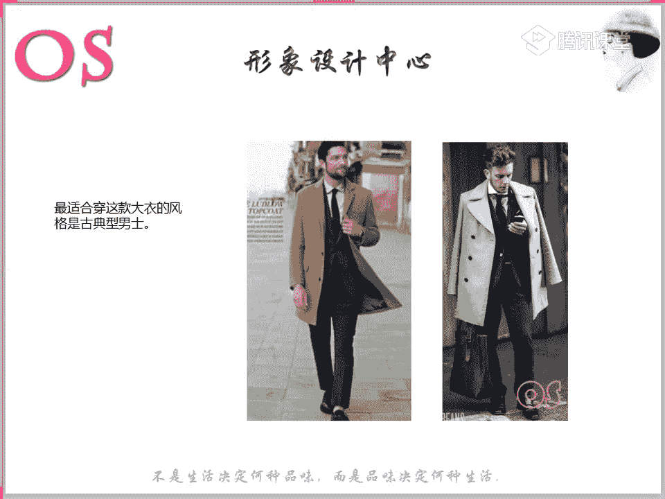

所以说哦像这样的一些正式的大衣，因为色彩上面的一些不同。唉，因为材质上面的不同，所以你会发现虽然好像我们都把它叫做唉正式的大衣，对不对？但是你会发现色彩上面的一些不同和我们的领子上的一些不同。

或者说材质上的一些不同，它所针对的风格就是不一样的。对于老师这句话能不能理解哦，我不说大一定能够去判断哎，这一款是适合什么风格的。这一款正式大衣又是适合什么风格的。

但是你们要记住老师刚才所说的这句话就是我们的大衣虽然都是属于正式的这样的一个基础，对不对？在正式的基础上去做文章，正式的大衣在正式的基础上去做文章。但是随着材质的不同，随着颜色的不同。

或者说随着图案的不同，随着我们的领型的不同，它所针对的风格也是不一样的，能够理解同学快速跟老师刷的鲜花哦。😡。

所以说要跟你们说的就是哎，今天这堂课跟大家所说的就是说我们先来认识一下这样的一些名称。然后呢，在我们往后再讲风格的时候呢，就来具体的不同的服装呢来教大家怎么样去辨别不同的风格。

好，第二类呢就是我们的休闲的大衣，休闲大衣有很多种啊。第一个就是我们的列装式的大衣。那列装式的大衣呢，它有什么样的一些特点呢？第一个就是多兜哦，唉多兜，就比如说像我们图中啊。

最早期的和我们现在一些演变的，也就是说在列装大衣的基础上去做一些演变的设计的一些大衣的款式。大家可以来看一下哦。😡，你们要学会呢在这样的一些基础的款式上去读到一些关键词啊。

然后呢把这样的一些关键词看出来之后，我们其实拿到任何的一些服装的，其他的一些服装款式的时候，你们就可以快速的去进行分类。然后呢，快速的找对自己所适合的这样的一件大衣。而，列装式的大衣的话。

第一个就是多兜。你们记住这样的两一个关键词就是嘟啊多兜。另外的话呢整体的服装会给人的感觉呢是比较的宽松的，同时又很休闲，对不对？很很轻松很方便哦。

所以说呢当时这样的一些服装的当时这样的一个列列装式的大衣就是我们猎腹在去打猎的时候呢，穿着的。所以说呢会很多一些口袋也是非常的方便。那最适合穿这样的一些啊，这这款大衣的一个风格呢。

就是我们的自然型和我们的戏剧型。因为整体服装的款型上量感上，唉你是会发现是偏大的，对不对？所以说呢更适合我们一些风格偏大的男士去去穿着。嗯，我们思路花语说到粗犷啊很好。😡，好。

接着呢我们来看到军装式的大衣啊。其实军装式的大衣现在呢我们也会把它呃像很多这样的一些风衣，对不对？很多风衣其实都是在军装式的大衣上的一个基础上去来演变而来的那军装式的大衣呢，它的一个特点就是多兜。

但是呢在多兜的同时，它还会有腰带，以及呢在我们的肩部呢有肩章。唉，像我们图中就是一个典型的啊军装式的大衣。那最适合穿这样的一些啊大衣的风格呢是我们的戏剧型，还有包括呢古典型。

那古典型人在选择这样的一个大衣的时候，就要注意了。你跟戏剧型，还有包括呢像我们的一些啊前卫型的一些男士有一个不同的一个点，就是你不适合呢选择一些呢明兜设计的啊，不要有过多的一些明兜设计。

而且呢也要像这个就是我们的胸称啊，这两边老师鼠标所画的这样的一个三角哦，这就是我们的胸称。那包括呢胸衬也是越少越好。那最好如果说完全没有是最好的，或者说哎只有一边有就类似于这样的一个款式是也是可以的。

而且呢像古典型的人啊，等我们到时候老师在讲风格的时候，会讲到一些材质，对不对？当你们在明白这样的一些自己所适合的某些材质，我们可以呢结合着材质一起去做选择。还有包括我们的新锐前卫型啊。

新锐前卫型的男士呢选择这样的一个军装式大衣也是可以的。但只是说你们选择军装式的大衣的时候呢，一定要选择中短款，不可以选择太长的。比如说像一些前卫型的男士，如果说穿着这样的一些太长的话。

其实你会发现会有点压，对不对？另外的话，像这样的一件服装的话，也是可以去跟西装做搭配，或者说跟我们的T恤啊，跟我们唉这样的一些呃普通的这样的一些。比如说我们可以内搭一些其他的一些夹克混搭也是可以的。

当然啊，如果说作为自然型的男士，你们如果说有自然型的男士想要去选择这样一个军装式的大衣，可不可以呢？也是适当可以的。但是只是说在整体的服装的廓形上面啊，我们不会说像其他的这样的一些啊服装其他的风格一样。

我们可能在比如说像古典型的人一定是廓形非常挺括的同时，而且呢廓形是很清晰的，对不对？但是自然型的人呢，我们在廓形上可以呢稍微的唉不像我们的古典型那么的清晰，我们可以呢呃可以浑浊一点，没关系。

不用说线条有那么的强啊，那么的清晰。😊。

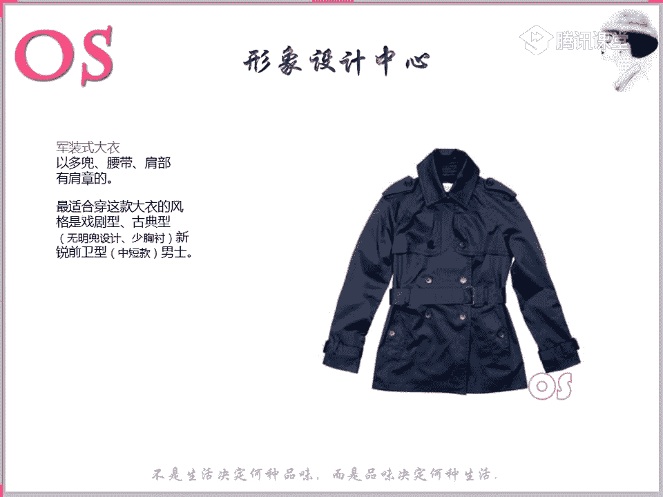

好，接着另外一款大衣就是我们的马术式的大衣啊。码术式的大衣，它其实它的一个演变就是我们的马术装演变的。大家可以观察一下我们骑马的这样的一些运动员，他所穿着的服装，大部分的领子是一个非常大的一个特点。

别看它好像就是一个西装啊，有点像我们这样的一个西装。其实呢他的领子上是完全不一样的啊。你会唉其他同学能不能听到声音啊，能够听到声音的同学可以跟老师扣个一。😡，好呃，没有声音是吧？嗯，潇潇同学没声音啊。

这边我看一下哦，我们尼克老师在啊，尼克老师可以找跟潇潇说一下啊。😊，好，大家如果有听到声音的同学啊，下一次如果看不到屏幕，或者说听不到声音的话，可以退出哦，重新再进入一下。好，我们来啊我们来继续看到。

没关系啊。😊，嗯，你个老师这边可以。跟他说一下啊，因为我打字也不快。😡，嗯，是的哦，网络不好，可以退出，重新进入啊。好，我们来接着接着来。好，是的是的哦，我们可以呢退出屏幕哦，重新进入一下。

我不知道潇潇这边。情况有没有好一点？好，那我们先继续看到这里啊，那我们可以会发现它的一个领子是一个非常非常大的一个亮点，是不是会发现领子是有两种不同的颜色，对不对？嗯，两种不同的颜色。

所以说当我们以后在生活中碰到类似于这样的一些服装的款式的时候啊，你会发现唉，老师他跟那个正式的大衣好像外观上是一样的，对不对？😊。

外观上是一样的哦，外观上跟正式的大衣是一样的。但是呢它最大的一个亮点就是在领子上面。所以说像码数式的大衣，怎么样去辨别呢？好，码术式的大衣怎么样去辨别啊，就是所有的装饰性呢，我们都可以把它上移啊。

会发现所有的装饰性都是上移的，会带来这样的一个年轻感啊。整体来说衣服的年轻感是要很强的。你们可以拿这样的一个大衣去跟我们的正式大衣去做对比，就会发现啊。😊，啊。

我们来看一下是不是年轻感是要比我们的正式大衣要强很多的。所以说呢像这样的一个大衣的话呢，最适合穿这款大衣的一个风格的话，比如说像我们的浪漫型，还有包括像我们的古典型啊，当然古典型呢是适合一些年龄小。

或者说呢个子相对来说不是特别的高的一些浪漫啊一些古典型的男士。那还有包括呢像这类型的男士的话啊，如果说是作为古典型的那我们不要去选择太长的啊，去选择一些稍微短一点。那面料上面呢也可以相对来说柔软一点的。

整体来说，其实啊包括我们如果说有些男男生啊个子不高的，但我是属于这样的一些风格的。其实呢整体来说都不要去选择太长的，我们可以选择短一点，其实短一点精短一点的码数式大衣会更好看。

也更适合我们这样的一些个子偏矮的男士。然后面料上呢，我们相对来说去选择一些哦相对来说柔软一点的。就比如说像我们图中的哦。

其实也是面料上是相对来说要比其他的一些正式大衣的一个面料程软硬的程度是要相对来说要柔软的。😊，好，下一个呢就是我们的荷兰式的大衣嗯。荷兰啊荷兰式的这样的一个大意啊。

郭富城呢他其实是有点偏我们这样的一个呃浪漫。然后呢，但是他也有点有一点点前卫啊。好，然后呢呃稍等一下啊，老师喝口水。好，没有声音好，没有声音，没关系啊，我们那那就只能看录播了啊。😊，好。

我们接着来看荷兰诗的大衣啊。😊，好，以呢子呢为材料的啊，它是以呢子为材料的。然后呢领子是帽子啊，用牛角扣呢做扣子啊，用牛角做扣子。当然啊当今的话呢，其实像很多一些荷兰式的大衣，它也会有一些改变。

就是比如说它可能没有帽子了，只有单独的这样一个领子，对不对？当然我们也可以把它称之为荷兰式的大衣啊，但是像最传统的啊，最传统的话一般都是以帽子就是一个领子。嗯，然后呢用牛角扣做扣子，这个点是不会变的。

那最适合穿这款大衣风格的男士呢，就是比如说像我们的自然型，非常非常的适合哦，自然型的男士也好，女士也好，其实穿荷兰式大衣是非常好看的。另外一个呢就是我们的阳光前卫型的哦，前卫型的男士，阳光前卫型的男士。

一定要记住。那如果你是属于阳光前卫型的男士的话呢，我们在选择荷兰式大衣的时候呢，相对来说我就要选择短小版本的。😊，也就是说要选择小一点短一点的，不能够选择太长啊。因为我们的风格没有那么大。

所以说驾驭服装的廓形也不能够往大了去走。😡，好，那包括像这样的一些啊，我们图中所展示的这两款大衣的话呢，它服装的话它也是属于大衣的啊，也是属于大衣的。不要觉得唉这是不是夹克呀，这不是夹克。

这也是属于我们的大衣。那常常见的这样的一些短款大衣的话呢，最适合像我们的一些前卫风格的，或者是说呢像我们浪风格的这样的一些男士。当然哦，如果说我个子不高的，我是古典风格的，能不能穿的，也是可以的。

只是说在材质和我们整体的这样的一个色彩上面要选择自己所适合的，要按照古典风格去走啊。因为你会发现就像我们同样好像都是短小款，左边和右边所适合的风格，完全是不是一个概念，对不对？哦。

如果说我是前卫型的男士，或者是说哎我是一个浪漫风格的男士，我是不是可以去选择左边的这样的一个款式。那如果说我是古典型的，我是不是要选择右边的会更好。😊。

所以说这就是我们的服装的色彩和材质所能够影响对于服装风格的这样的一个影响啊。然后民办同学能快速跟老师刷的鲜花。好，对于我们的大衣呢，这就是我们这样的一个基本款式啊。然后呢。

其实现在我们的大衣越来越丰富了，但是呢再怎么丰富，我们都能够去从这样的一件服装中呢去找到它的根本，对不对？所以说这个就是一个一个大范围的一个基础。那我们一定要认知这样的一些基础的一些特色。那一些特点啊。

那在这样的一个特点上呢，我们再去找自己所适合的大衣，就要简单的多了。嗯，好，牧羊老师。😊，啊呃啊，没事没事啊，这两者有什么区别啊？这两者老师刚才所说了，其实你会发现颜色上是不是第一个。

第二个就是材质上会有很多的一个很大的一个区别哦，很材质上就是有一个很大区别。其实领子的大小是一呃是一样的，领子大小没有什么太多的特点，太多的一个区别。

但是主要是在材质和我们的这样的一个呃这样的一个色彩上面有很大的一个区别。所以说呢你会发现材质和色彩的一个区别上所影响的针对的这样的一个风格，穿着的人就会不一样。你会发现。😊。

图中第一个材质上能够应该是大家能够看出来是有这样的一个肌理感的，对不对？相对肌理感要很强，不会说那么的精致，那么的精细，但是右图中就要精致很多材质上面。

所以说相对来说古典型的人就可以去选择右边这样的一个款式哦。😡。

好，接着我们来看到这样的一个夹克啊，夹克的话呢，一般一片短的袖子长的，也就是说袖子要比衣身长的啊，我们的休闲感强的都是称之为夹克啊，都叫夹克。那么呢我们来看看呢夹克又有分哪些的一些类别。

第一个呢就是我们这样的一个双色棒球夹克啊，应该有很多人是比较喜欢的啊，我不知道大家喜欢这样的一个服装的同学啊，可以跟老师举个手啊，扣个一，哎，我非常喜欢这样一的棒球夹克的那其实呢像棒球夹克啊。

除了老师刚才这里这里所说的这样的一个双色啊，尼克老师也是一个典型的。😊，棒球夹克爱好者。那还有包括像单色的棒球夹克，也是有的，对不对？好，所以说呢这样的一个棒球夹克呢，它会比较的休闲呃。

运动感呢会比较强。那另另外的话呢唉如果说。😊，里面的材质都一样的话哦，就是我们这样的一个运动装了，就是偏运动了，就是里面的材质都一样的话。但是当然如果说哎我们有一些棒球夹克的话。

它里面是有这样的一个嗯怎么说？那个应该关键词是叫做。老师一下子想不起来了哦，好像是有有一个夹层的话是叫什么来着？有个打底是吧？😡，那样的话就会比较休闲哦。😡，好。

那最适合穿着这样的一个款式夹克的一个同同学的话呢，风格就是比如说像我们的新锐前卫型，还有包括呢古典型。但是古典型在选择的时候就一定要精仿哦，精良一点。那其实大家可以发现左图中和右图中都是双色棒球夹克。

但是我相信很多同学能够看出来哪一件会更加的精良，能不能看出来哦，能看出来同学呢可以跟老师扣个一啊。其实就是这样的一个整体的款型，还有包括在材质上面这样的一个硬挺度，还有包括设计这样的一些剪裁上面。

你就能够看出哪一款会更加的精精良哦，双层嘛呃，是的哦，双层啊，这样说也可以。😊，肯定是左边的要比右边的精良哦。😡，这个应该很清楚，包括整体整体的这样的一个线条感，还有包括呢服装的面料上面。

以及我们这样的一些做工剪裁上面，是不是左边要比右边更加的精良，对不对？所以就是这样一个道理啊。所以古典型的男士呢我们一定要选择精良的。然后戏剧自然型的男士呢，在年轻的时候呢，是可以选择的。

还有包括呢我们阳光型的男士啊，那就不分年龄段了。其实阳光型男士穿着这样的一个棒球夹克是非常好看的。但是当然我们像去年非常的流行的飞行员夹克，对不对？那飞行式夹克。

你也会发现有一些飞行式夹克的领型跟棒球的领型有点类似。但是你要知道哦，不要把这样的一些飞行的式的夹克呢把它判断给棒球夹克。你要因为你会发现呢棒球夹克在整体的衣身上面会更加的合体一点。但是飞行员夹克。

你会发现它是呈现这样的一个整个的衣身是呈现这样一个O型的，对不对？一个大O型，会更加的宽松哦，更加的舒适。😊，而且还有一些比如说有一些兜，对不对？这个兜啊，还有包括这样的一些装饰感啊啊，金属啊、皮革。

它它的这样的一些内容是要比我们的棒球甲格更丰富的。好，接下来我们来看到呢商务日变装啊，这样的一个典型的商务日变装其实特别特别难找啊。那老师呢也简也跟大家呢找到这样的一个典型的这样两款。

大家会发现好像好像挺老气的。但是你要知道现在有一些商务日变装，它也是非常适合年轻人的。因为有一些是比较在色彩上面，它更加的怎么说呢？相对来说不是那么的沉稳。

或者是说呢在我们的服装的设计上面会更趋向于年轻化啊，但是整体的话像这两件是一个典型的一个代表。大家要记住啊，商务日变装跟我们普通的啊普通的，比如说像高尔夫夹克，它的一些区别。大家会发现你就像我们。😊。

高尔夫夹克跟我们这样的一个商务日变装，其实是有一点很容易混淆的，对不对？所以说我们要抓住其特点啊。第一个呢就是商务日变装呢，它是在什么样一个场合去穿着商务日便装一定是我们男士在出差的时候啊。

因为工作的问题，出差的时候所穿着的代替西装所穿着的衣服。也就是说我们可能穿西装并不那么的方便，对不对？坐飞机呀，赶火车呀，或者说唉这样的一个旅途中劳累，比较穿西装，虽然说是因为工作我们应该是要穿西装。

但是不太方便。所以说呢我们的商务商务日变装呢就很好的可以去代替西装，所以说呢它的第一个颜色是深的。第二个呢，材质上是硬挺的这两款服装中啊，尤其是第一款硬挺程度，大家能够从服装面料上是一定能够感受到的。

那么最适合穿这样的一个。😡，款式的一个夹克的话呢，因为老师之前说过啊，男士非常注重到场合的一个问题。其实一般所有的男士，如果说你们是因为工作出差需要用到这样的一个服装的话，其实任何男士都是可以去穿着的。

因为它是属于商务日变装。另外的话呢，如果一定要说出来它更适合什么样的一个风格的话呢，比如说我们的戏剧型或者说浪漫型古典型的男士穿它是最适合的。😡，穿它是最适合的。但是如果我们有这样一个场合。

甭管你是这样的一个前卫型也好，还是说我是自然型也好，你们应该都应该穿啊，都应该要穿。好，这个就是我们的商务日变装。对于商务日变装大家还有没有什么疑问啊，尤其是以后我们从事顾问行业的。

其实如果你们以后的男顾客，他们他们找你诊断完之后，你们一定要涉及到他的一些场合的一些问题。那么这个商务日变装是一定要懂的哦，因为任何男士，一旦是呃比如说我今天要赶飞机，我因为工作问题，我要去外地出差。

我不可能说整天穿这个西装，对不对？啊，为了方便我这样的一个行动啊，对不对？所以说我们一定会去用衬衫去搭配它。😡，啊，感觉很老很土气啊。其实老师在网上呢找了很多很多这样的一些关于商务日变装的图片，哎。

太难找了。我所以说呢就找了两个还比较典型的，但是确实它不洋气啊。这两张图片不洋气。但是我要跟你们说的就是什么呢？现在很多商务日变装做的其实蛮洋气的。😡，大家可以到我们一些商场里面。

尤其是专门做这样的一些呃针对于西装正式款场合的这样的一些或者半正式场合的这样的一些呃男士的服装的品牌。你们可以多去考察一下哦，多去观察一下。其实现在很多商务日边装越来越。在款式上哦。

在整体的这样的一个设计上，其实也是有一些改动的。但是一定要记住啊，就是颜色深材质呢硬挺，然后没有过多的一些装饰细节，对不对？好，接着我们来看一下高尔夫夹克。

高尔夫和夹夹克和我们的商务热变装一定要懂得去区别。但是当然啊，如果说有些男士啊，老师这里认在跟大家提一下。如果说有一些男士比如说唉我呢也是要出差，但是呢我觉得老师这个商务热变装吧，也不太适合我这个年纪。

或者说也不太适合我的这个风格。其实你们也可以选择高尔夫夹克去代替。就比如说我可以选择图中第二款这个白色的，你会发现白色和我们左图中去做对比，是不是白色正式感要比我们的左图要更加的正式，对不对。😡。

是不是要更加正式一点？嗯，所以说呢我们可以去选择呢设计感稍微呢弱的，然后呢也不要有太多的这样的一些强调的线条啊，或者说标志啊这样的一些品牌。那我们可以呢去选择类似于这样的一个款式呢。

代替我们的商务日变装是绝对没有任何问题的啊。😡，所以说呢我们可以选择颜色浅款式跟商务日边装相似的。那像我们呃左图中这一款就是典型的在打高尔夫球的时候，我们可以去穿着的，在运动的时候去穿着的。

那最适合穿我们这样的一些标准的高尔夫夹克的话呢，就是比如说自然风格和古典型风格的男士啊。当然如果说其他的一些风格，如果说我是因为场合的问题有用到的话，我们就可以去大胆选择右途中类似于这样的一些款式呢。

哎，在运用到我们的一些出差啊，商务中。

好，接下来就是我们的艾森豪威尔夹克啊，它其实呢是我们美国陆军夹克的一个演变啊，最早期就是我们的美军的陆陆军夹克，对不对？在这样的一个基础上呢。我们做了一些改变，做了一些设计。

然后所以说把它称之为呢艾森豪威尔夹克。那么它的第一个特点呢就是我们的明都。当然哦，现在不管像一些皮衣，我们有这样的一些艾森豪威尔款式的这样的一个款式，还有包括像我们这样的一些普通的面料的。

也有这样的一些款式啊。那最适合穿这样的一个。所以说要跟大家所说的就是你们先记住，类似于这样的一个感受啊，类似于这样的一个外服装的一个廓形和特点，把这个它的一个基础记牢了。那么其实就很好找了。

不管是皮衣也好，或者说普通的这样一些材质的一些衣服，你都能够很快的找出来。哎，这个款式是我们的标准的这样一个艾森豪威尔夹克呢所演变而来的，对不对？😊，那最适合穿这样的一个夹克的一个风格呢。

就是我比如说我们的戏剧风格，或者说我们的新锐前卫风格，对不对？还有包括像古典型的、自然型的和阳光前卫型的都是可以的。但只是说古典型跟其他风格还是有个区别，就是一定要精良。那像古典型。

如果说穿着像我们这像我们这位昕锐前卫型的人有适合的这样的一个夹克的话，就是不适合的。因为它的设计感太多太啰嗦。哎，你看不出来有多么的精良精简，是不是？😊，好，那包括呢像我们类似于这样的一些大在街头上啊。

会经常会常见的。比如说呢唉像这样的一些牛仔的也好，还是说我们这样的一些呃丝绒的材质的，或者说其他材质。如果说你看到类似于这样的一些款式的话呢。

其实它也是属于在它的前身呢也是属于我们这样的一个艾森豪威尔夹克的这样的一个前身啊。好，我们有同学说到啊，吴奇隆是属于什么样的一个风格啊？吴奇隆它是属于这样的一个呃前卫型的。好，关于这样的一个夹克。

大家还有没有什么问题？😊，好，吴奇隆它是属于新锐前卫风格的哦。啊，不是阳光前卫哦，新锐前卫风格。所以你会发现嗯你去对比一下他其他的一些穿衣风格，你会发现他穿这身衣服啊。

比如说这件外套要比他穿其他的一些服装的外套要感觉好像要洋气一点，时尚一点。好，我们接着来看到下一个呢就是飞行式的夹克啊。飞行式的夹克呢第一个就是暗兜啊，它的兜是暗的，但是现在也有一些明兜的哦。

所以我们不用过多的去纠结这样的一个点。另外的话呢就是在材质上面一般都是以金属皮革的材质为。当然现在也会有一些其他的材质，就比如说我们右图中这样的一个材质，对不对？但是整总而言之呢。

就就算它是属于这样的一个釉图中这样的材质，你也会发现材质中，它是有一些光泽度的。嗯，它是会有光泽感的。所以说呢在这样的一个飞行式夹克中，你会发现它整个不管是任何的材质，或者说在我们的款式上做一些改变。

但是整个这样的一些款式中，你都会感觉到这样一个前卫感，对不对？嗯，会感觉到这样的一个时尚感啊，所以说呢它比较适合我们这样的一些前卫型的男士呢去穿着。😊，好，接着看到我们的海军式的夹克。

海军式夹克一般它的所有的设计都是在肩部和领子。当然现在的话海军式的夹克也比较少见啊，但是我们呢一定要知道还是要知道啊。那么像我们图中呢，就是现在目前来说呢还比较。😊，偏正规的这样的一个海军式的夹克。

也就是说所有的领子在我们现在所有的设计都在我们的领子上面，对不对？在肩部或者说在领子上呢会进行这样的一个装饰感。那当然其他的一些衣生的话呢，跟我们普通的夹克没有太多的一些区别。

那最适合穿这款夹克的一个风格的话呢，就比如说像我们的浪漫风格。还有包括呢我们的戏剧风格，在休闲服装中啊是比较适合我们的。戏剧型的还有包括我们的自然型的男士。好，接着就看到我们的连帽式的连帽式的夹克。

不管是羽绒服也好，还是我们普通的这样的一个单衣啊，都有这样的一个款式的连帽式的。那么最适合穿这样的一个夹克的风格呢，就是阳光前卫风格，还有包括呢我们的自然型的男士，自然型的男士。

当然自然型男士是在年轻的时候呢，会很适合。当然如果说像如果他是这样的一个连帽式的。但是他在图案上或者说在颜色上非常非常有讲究的话，哎，你会感觉到它比较在视觉上会有这样一个尖锐感的话。

其实有一些哦我们的新锐前卫型的一些男士的话，也是可以去穿着的。😊，但是其他风格的话，其实老师是建议少穿，你就像像古典型的人，一般他穿着戴帽子的衣服啊都会感觉呢不太好看。因为帽子的话。

它会给你的肩部会造成这样的一个下坠的感觉。没有型。而我们古典型最需要的就是所有服装的这样的一个轮廓，非常非常的清晰，对不对？所以说对于其他风格来说呢，我们除了阳光前卫和自然型的年轻的男士很适合以外。

那么作为其他风格，其实尽量少去尝试。但是如果说哎老师我是这样的一个年轻的戏剧型，我能不能适当的去穿的，你可以适当的穿，但是你在穿的时候呢，一定要在图案上去做一些选择，我们可以去选择一些大气的图案。

符合自己这样的一个风格的图案。😊，不然的话，戏剧型的人，比如说我穿一个这样的普通的啊色彩上也没有太多的一些讲究。风格上面呢啊整本来就不适合我。然后呢，颜色上面图案上面都没有。

那我其实穿着的话就会显得非常的衣服会显得很有很小气啊。呃，因为我的面部五官是大气的，所以会跟它会不协调。

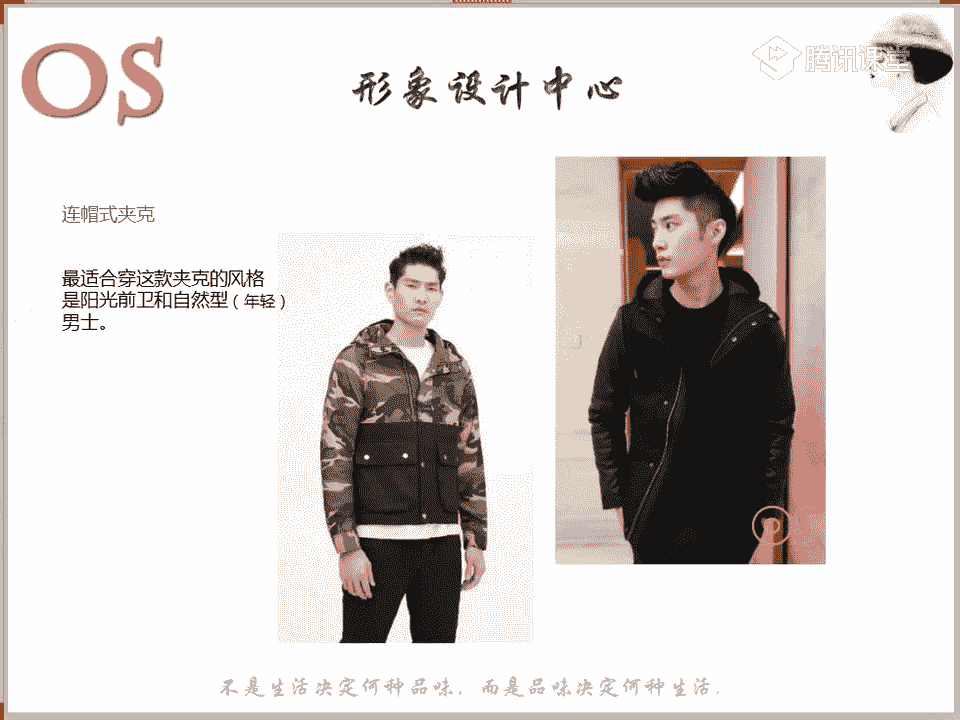

好，接着就是我们的伊顿式夹克。其实伊顿式夹克，你就会发现现在很多呃英国的或者说其他的一些贵族学校，现在学生的一些校服啊，很多都是像一个小西装，对不对？哎，其实这就是属于我们的伊顿式的夹克啊。

那其实像这类型的西装啊，你们不要以为它是哎把它去一定要划分到哎，它是英式西装，或者说美式西装等等。其实像这类型的，就是我们典型的伊顿式的夹克的一个西装。😊，它比较短小啊，比较有一点学院风。

所以说伊顿式夹克呢它有一点类似于短小的西装，而且结构设计的它有一点类似于我们英国贵族的一些学生装哦，所以说会很显年轻，会很有活力，对不对？我们从这套西装中应该也能够去感受到哦。

所以说这个就是属于我们的伊顿式夹克。它其实更把它叫夹克会更适合，因为它比较适合一些休闲场合穿，在正式场合中是不可以去出现的。因为它比较短小，不够严谨哦，气场是不够的。😮。

好，我们来看到最后一个就是我们的运动式夹克啊。运动式夹克呢，当然现在有一些运动式夹克也有一些连帽的，对不对？也有连帽的啊。但是呢唉一般的话呢我们像这类型的运动式的服装啊。

它最适合穿着这样的一个风格呢是自然型的。其实自然型的人穿这样的一些没有线条不是很清晰的衣服是最合适的啊，所以说呢自然型年轻的男士呢是可以去选择这样的一些运动式夹克，而且穿起来呢非常好。

但是当然啊老师给你们建议，就是除非你们在运动场合啊，去穿着它。那如果说在一些呃时尚休闲场合的话呢，我们就不要去穿着一些单一的色彩了。那我们可以在色彩上面多去做一些文章之后呢，它的时尚感就会不一样了。嗯。

它的场合所对应的也会不一样。😊，当然大部分的这样的一个运动式的夹克是比较适合在运动时候穿着的那如果说我一定要放到休闲场合去穿着的话，在服装的色彩和图案以及材质上我们就要多去注意了。好。

关于我们整体的这样的一个服装的这样的一个上衣的一个夹克，大家还有没有什么问题，没有任何问题的话呢，快速跟老师刷的鲜花，我们就接着往下面看啊。今天内容会有点多哦。好，有任何问题都可以提出来。好。

如果大家都不出声的话，只有我们一位同学出声，老师就。😡。

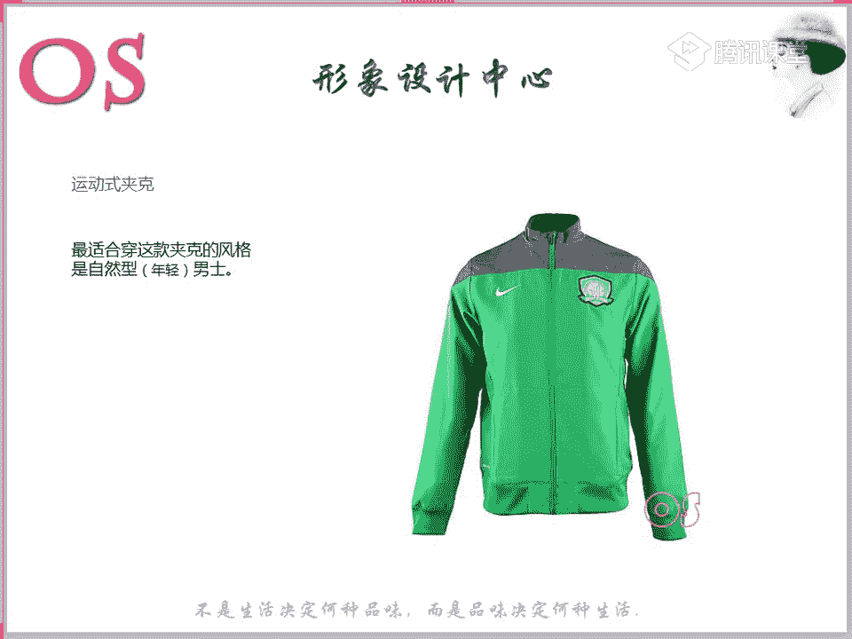

就当你们都没什么问题了哦。😡，一会儿布置作业的时候，你们就要就真的要跟老师一个一个做清楚啊。因为你们很多同学你们是什么风格，包括你们所找的模特是什么风格，老师都很清楚啊，因为老师都有档案的。😡，好。

接下来我们就来看到毛衣啊，毛衣呢它有几种类型。第一个呢就是渔夫式的嗯。我们要知道渔夫式的一个概念哦，那这个渔夫式的毛衣呢，它是属于沿海城市的。然后你会发现图案呢非常的丰富，也很休闲，对不对？

像我们图中类似于这样的一些编织的哦，交叉的，像麻花一样的这个款式呢就是我们的渔夫式的那我们有一些女士的话，应该也很喜欢类似于这样的一个款式的哦，这样的一些花色的毛衣，对不对？

这样的花色毛衣呢叫我们的渔夫式的。😊，那最适合穿这样的一个毛衣的风格呢是我们的自然型风格，还有包括呢。我们的浪漫风格啊，浪漫风格也是适合穿的。你会发现。😡，这样的一个风格的话呢，它会非常的感性，对不对？

这样的一个图案是其实有一点感性因素在里面的。如果说在材质上在色彩上，我们再去注意一下哦，我们真正选对的话，像很多典型的一些浪漫风格，穿这样的一个款式是非常非常好看的。当然哦在这里呢跟大家所提一下。

就是浪漫型的人呢在我们的面料上一定要薄一点，面料上要软软一点啊，就不可以太硬挺，就比如说右途中，你会发现织的很细很死哦，并没有那么重的感性感，对不对？感性的一个感觉。

那反而像左图中是不是在材质上面相对于右图来说，它要适当的要感性一点。😊，所以更适合。如果说我要一定要从这两款毛衣中挑一个给我们浪漫型人穿的话，我一定会挑左边。😡，他觉得会穿左边的要比右边的好看很多啊。

虽然说好像图案上都没有太多的这样的一些差异啊，都反正都是鱼夫式的，但只是在材质上面，他们俩的区别是很大的。好，另外呢就是我们的戏剧型的男士。戏剧型的男士在穿着的时候呢，一定要宽松要大，嗯。

要选给他们选择宽松大的。

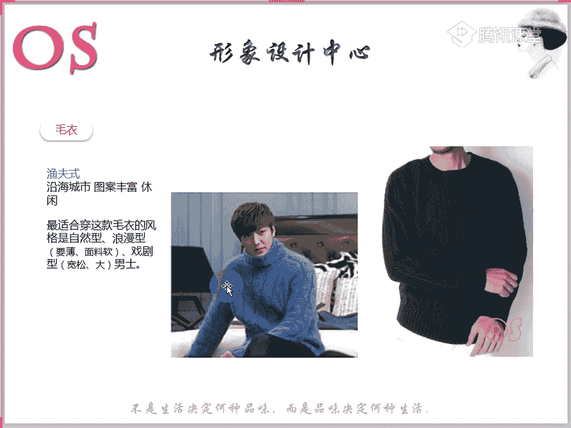

看起来像暖男哦，很好。好，那我们的下一个呢就是斯堪迪纳维亚式的哦。😊，这个其实是我们北部的一个民族啊，北欧部路的一个民族。然后呢整体的所有的设计都是围绕着肩部来的。所以说像以后看到类似于这样的一个款式。

你们就知道它的名字了，对不对啊？这个是不管是男士的毛衣还是小孩子的，还是说我们唉女女性的这样一些毛衣，像这样的一些设计是非常非常常见的。好，那这款毛衣呢是比较适合我们一些戏剧型的男士去穿着。

但当然啊如果说我作为其他风格的，我喜欢可不可以穿呢也是可以的那我们当然如果可以要去穿着的话，我们就要在材质上，还要在颜色上面呢去多去注意啊。等我们讲到服装风格的认知的时候。

会去跟大家说到这样的一些针对的材质，还有包括啊色彩呀等等的。

好，接着呢我们下一面看到呃图案上面跟大家大概的呢分析了一下，我们就来看到具体的那比如说有这样的一个开衫款式的，对不对？开开衫款式的时候，这样的一个毛衣呢，最适合穿这样的一个款式的毛衣。

是比如说我们的古典型。当然哦唉古典型要注重材质，质地挺实，这个是一定或不可缺少的。另外的话呢就是浪漫风格的，也适合开衫式的那浪漫风格，它要在质地上一定要选择柔软的。还有包括呢我们自然型的。

我们自然型如果要穿着这样的一个开衫式的，就要选择厚实粗犷的。所以说。😊，厚实和粗犷这两者之间就能够做对比，对不对？质地柔软和厚实粗犷啊，两种不同的感觉。那如果说我们是阳光前卫型的。

我们就要选择呢图案比较丰富，款式呢相对来说要修身。那当然如果说图案丰富，你们也可以去参照一些老师之前在跟大家说到领带和我们领结的时候这样的一个图案的一个辨别，针对于不同风格，对不对？

还有包括呢我们哦这样的一个材质上面呢，可以适当的去选择一些有光泽感的一些材质，或者说相对来说硬挺的哦，是比较适合我们阳光前卫型的。所以说我们开衫呢更适合我们这四类风格的男士去穿着。像我们的戏剧型。

还有包括呢像我们这样的一个新锐前卫型。作为开衫来说，你们还是少穿为妙哦。好，接着就是我们前跟大家说一说前卫型的啊。前卫型在选择毛衣的时候呢，要选择V领的毛衣。嗯，前卫型的人呢可以选择V领的毛衣。

会更适合我们前卫风格的人。所以说如果说我是一个小风格的。其实唉不要为了贪图啊一些其他的，我们去选择类似于这样的一些圆形领。

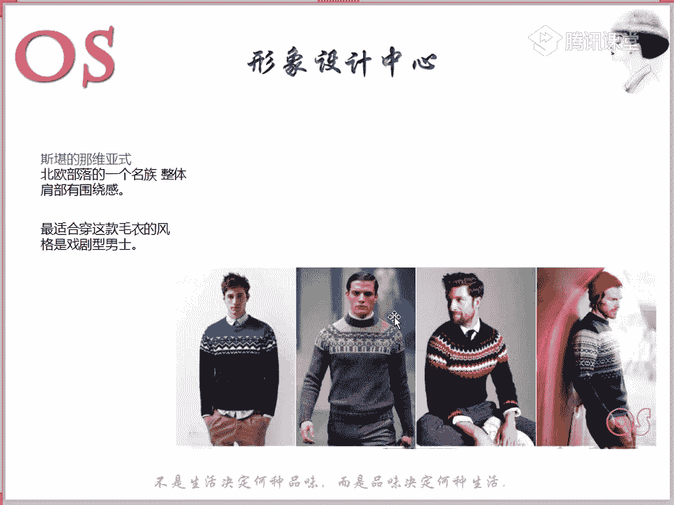

可以呢在毛衣方面我们大胆的去选择V型领的。

好，接着我们来看到呢浪漫风格。浪漫风格在选择毛衣的时候呢，我们可以去以法式的这样的一个领型为主啊，什么样的是叫法式的一个衣领呢？大家可以看到这两者之间是不是都是曲线感的，对不对？

所以说像这样的一些曲线感的领型啊，毛衣是让我们这样的一个浪漫型的男士穿起来是最为合适的。好，那么如果说我是新锐前卫风格的，在选择毛衣上的，我们在选择图案和色彩表现上一定要选择明显的。啊。

我们先不用纠结领型方面啊，我们来看到这样的一个图案和色彩上面，我们要一定要当然还有更多的是不是更加丰富的。只是老师举个例子，就比如说图案上我们可以选择呢啊尖锐感感强的。

或者是说呢啊在色彩上我们选择一些对比比较强的都是可以的。😡，或者选择图案上面比较动的哦，偏动的有图案中有偏动有偏近的，对不对？我们前卫风格啊，尤其是新锐前卫风格，它是偏动的。

所以说我们在图案上一定要选择动的图案。这个是额外跟大家所提到的。因为我知因为我们刚才在讲的这样的一些毛衣的时候，没有去带到我们的这样的一些呃前卫风格，对不对？所以说唉前卫风格的同学呢一定要多注意。

你们其实在选择毛衣的时候呢，就要注重好图案和色彩的表现上面。好，关于毛衣袋还有没有什么问题？😡。

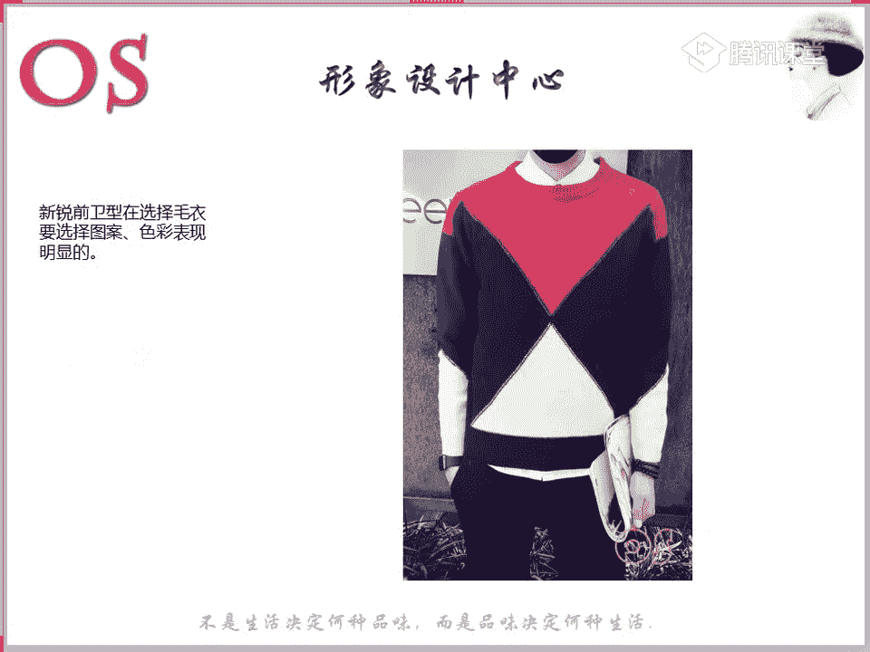

毛衣有没有问题啊？如果没有任何问题的话，老师就接着往下面讲了，下面呢说一说马甲哦，马甲的服装的这样的一个款式也是呃非常常见的。那么在材质上面它有很多的一些区别，对不对？还有包括色彩上面。

那么选择呢我们要知道就是如果说你要跟西装做搭配呢？我们这样的一个正式款式的西装啊，当然要搭配正式款式的马甲，就比如说像左图中这样的那像这样的一个正式款的马甲呢，如果说作为我是其他风格的人，我要穿着马甲。

我应该怎么样选择呢？像正式款的马甲的话，适合古典型或者说戏剧型以及浪漫型的人穿。也就是说这三大风格的人，如果你们要选择马甲的话，就一定要选择正式款的，也就是说相对于说哦整个的一个廓形。

还有包括在图案上面等等。我们要偏正式一点，不可以选择太过于啰嗦，或者说整体来说偏休闲感强的。那么如果说是休闲款式的马甲的话呢，就更适合这样。😊，的一些年轻自然型的男士去穿着啊，像类似于哎图一图二。

还都是比较偏休闲的，对不对？😡，那当然如果说是其他风格的人去穿着其他的这样的一个风格的话呢，你们可以等着呢知道了你们不同的风格所展示的啊所表现的这样的一些图案、色彩和材质之后呢，再去做选择。

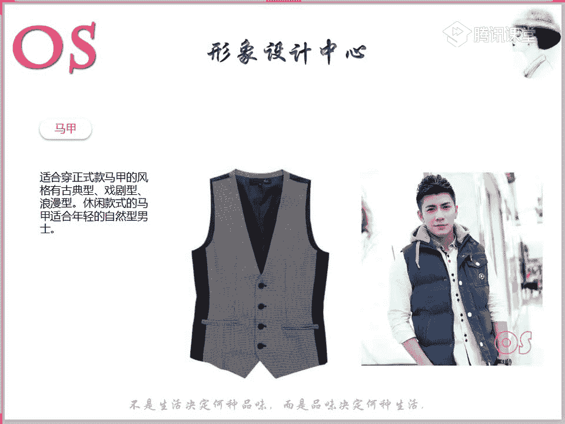

好，我们所有的上衣呢就介绍完了。然后呢，最后呢看到我们第三个大的知识点，那就是我们的裤子了。裤子呢裤装我们其实分为几大类型。第一个呢就是锥形裤啊，这个不叫我们的哈伦裤啊，这就叫我们的锥形裤。

而且锥形裤呢是我们男士裤型中最正式的裤装，是最正式的裤装，所以说你会发现很多西装也好，还是包括我们的一些休闲裤也好，他选其实这样的一个锥字型的裤型是非常非常常见的，对不对？所以说像这样的一个裤型的话。

基本上我们各个风格的男士呢都适合，但是呢戏剧风格的人要少选啊，我让大家猜一猜，为什么说戏剧风格的人要少选。哎，你们看到锥形裤之后啊，也结合着我们前几节课对于戏剧风格的服装的一些印象啊。

你们可以呢大胆的来猜想一下，为什么说戏剧风格的男士呢，要少选。有没有同学踊跃发。😊，言的。好，量感太小了，非常好。非常非常棒啊。是的，其实你会发现呢整体的裤型的量感它不够大气，对不对？

所以说呢我们戏剧风格的人能穿哦，也能够穿。就比如说我们可以看到。😡，哎，举个例子啊，给大家看一下啊。看到陈柏林，对不对？陈柏林就是一个典型的戏剧风格的一个男士啊，典型的一个戏剧风格男士。

你会发现呢这三个裤型，唉，你别看这个喇叭裤有多丑，对不对？但是你会发现整套穿到他身上呢，跟他面部是和谐的，没有谁去抢谁的风头。但是呢我们看到第一张他穿着这样的一个锥子裤型总是会觉得上身偏大。

下身稍微有点窄，有点小，对不对？会有这样的一个视觉感虽然很弱。因为像这样的一个裤型，任何风格人其实都是可以穿的，所以说他的这样的一个对比呢不会说太过于明显，但是你也能够从他其他的两套服装中去做对比。

你会发现他其实是有一定的，不太不是那么的和谐的。所以说我们现型的男士啊还是可以少去选择，以我们这样的一个直筒裤，或者说喇叭裤为主啊。😡，啊，不要觉得喇叭裤娘啊，其实像戏剧风格的人穿喇叭裤还是蛮好看的。

嗯，它会穿出它这样的一个味道啊。😡，啊，老师这种裤型一般呢可以搭配什么样的外套，这样的一个裤型基本上跟任何的一些夹克类的外套搭在一起都不会出错啊。它是一个非常非常正式的裤型。所以说即使你跟西装搭配也好。

还是说跟我们这样的一些普通的一些夹克式做搭配都是可以的。😊，包括老师刚才图中所说的啊，你像唉不管你跟毛衣呀，任何款式的毛衣也好，唉，包括我跟你们提到的，哪怕像连帽式的，唉。

像这样的一些飞行式的夹克啊等等。唉，商务日变装棒球夹克跟锥字型的裤型啊都是可以搭的。

然后呢，在这里要提一下，就是有一些个子不高的男士的话呢，或者说我们的腿比较短的男士，你们可以呢去搭配一个尖头的鞋子啊，然后呢选择锥形裤，它绝对是在我们的视觉上呢会有显长的效果会显高显长哦。

所以说呢作为我们这样的一些腿短男士，可以选择大胆选择锥字型的裤型，然后去选择一双呢鞋头相对来说尖一点点的。

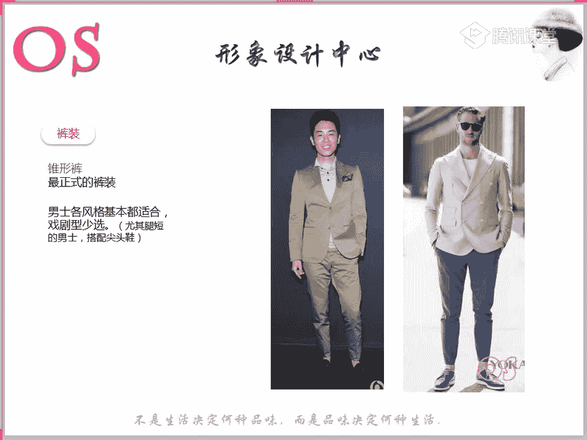

好，接着呢我们就来看到下一个就是我们的喇叭裤啊。喇叭裤呢适合穿喇叭裤的男士的话呢，就是我们的戏剧型和我们的浪漫型。当然哦我们戏剧型的人在选择喇叭裤的时候，还是要相对来说合体一点，像我们的陈柏林，对不对？

呃，太过于宽松了，太大了，其实不是特别的合适啊，呃不是特别的合适。像如果太大的话，但是如果说相对来说我如果选择像模特这一条相对来说合体一点的，就会好很多。所以说像这样的一个喇叭裤呢。

哎我们这样的一个风格是适合戏剧型和浪漫风格的。😊。

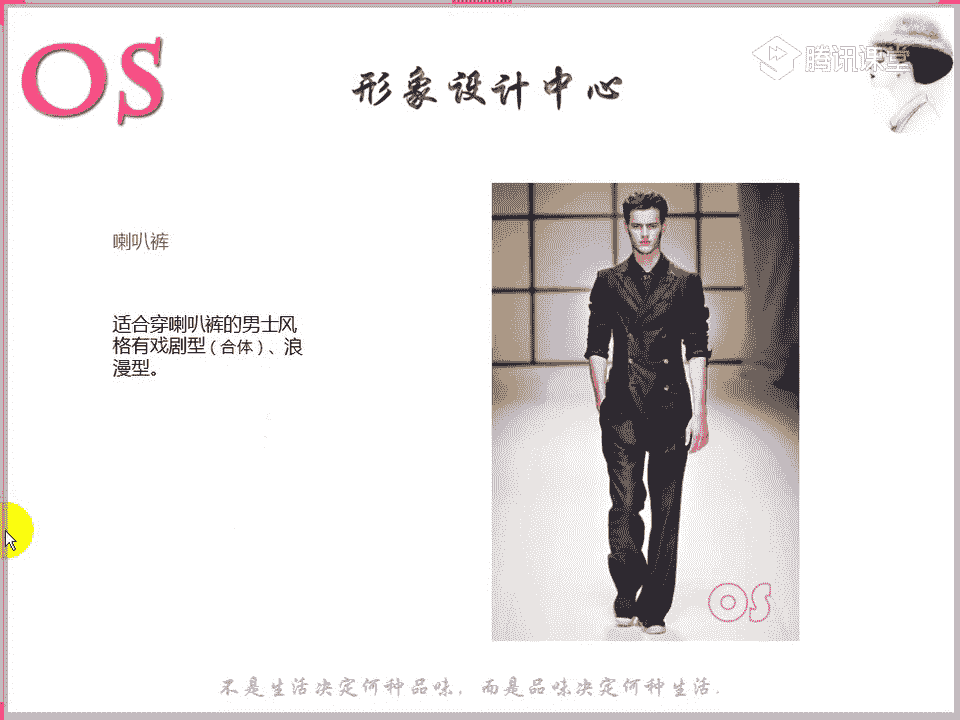

好，那呢就来看到我们的直筒裤啊，基本上男士六大风格啊，我们把它细分成六大风格都是适合的啊。包括像昕锐前卫和阳光前卫呢，在选择上我们就要适当的选择合体小直小的直筒，不要选择大直筒啊。

就比如说像何炅是是不是我们之前在讲到体型修饰的时候，我拿何炅举了个例子，他穿的就是一条直筒裤和他和我老师跟他说呃换成这样的一个小直筒或者说锥字型直筒。其实这样的一个对比是非常强的。

我不知道大家还记不记得。所以说呢像我们这样的一个昕锐前卫型和阳光前卫型，还有包括一些个子小的男士的话，在选择直筒上的直筒裤就一定要选择合体的小直筒，不可以选择太宽松或者说太大啊。

当然相对来说你们呢去选择锥字型的裤型会更好。😊。

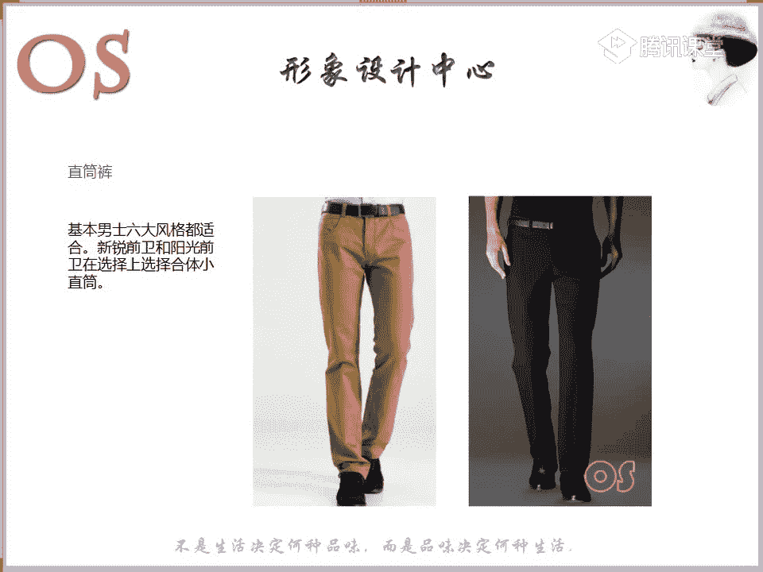

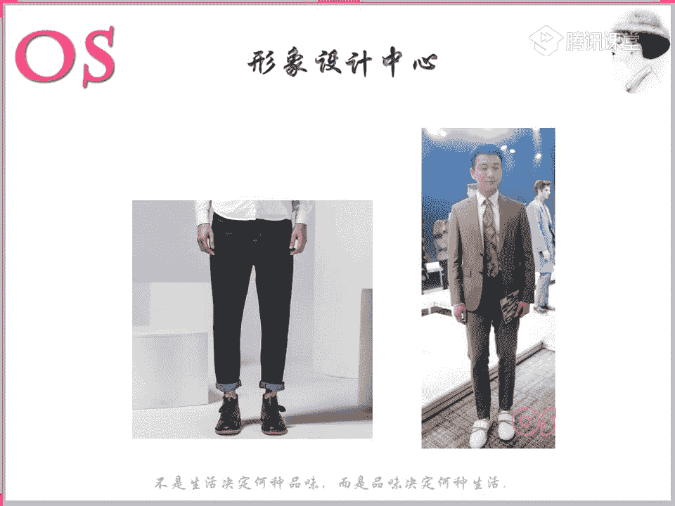

那当然哦像这样的一个裤子，在选择上的一个长度上也是一样的。你们可以参照老师之前所说的西装的裤子的这样的一个长度的一个长度啊。裤子所跟你自己所合适的这样的长度去选择直筒裤啊，在选择上面，也就是说不要太长。

如果太长的话，就会显得很拖沓，对不对？也会呢在你的脚踝处呢形成非常多的一些堆褶。那其实在视觉上是会显腿短的，一定要选择呢裤子的长度呢刚好能够盖过你的一个鞋帮的这样的一个位置就可以了。😊，好。

接下来就是我们的五分裤啊，五分裤是我们在男士的一个裤型中呢最正式的一个短裤啊，最正式的短裤就是我们的五分裤。这个的话呢就根据自己的这样的一个风格啊，在选择上呢去做调整，基本上任何男士都是可以去穿着的。

然后你在这里啊我要说一下哦，因为刚才忘记跟大家说了啊，如果说是下半身偏胖的时候呢，我们有些男士如果下半身偏胖的，或者说呢哎肚子比较肥大的，我们就要考虑呢有嗓道的啊。就是如果说我的肚子比较肥大，看到没有？

肚子有肥大的，我们就要选择哎比如说在裤子上面呢，我们可以去考虑有嗓道的。也就是说中间这这条线我们应该能够看出来。比如说像这条黑色的裤子，是不是中间有一条线，这个线呢，我们叫做嗓道。

所以说呢我们作为有肚子同学可以考虑一些嗓道的嗯。好，不要去穿太粗的。如果说我们是腿粗，或者说我们的腰不粗的话呢，我们就不要不要去选择呢有嗓道的。但即使说哎我们要选择有嗓道的话。

我们也要把这附近呢去把它运平一点。

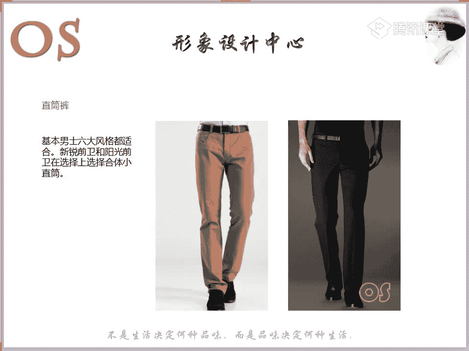

好，我们接着来看下一个就是我们的抽褶裤啊，又名工装裤。那么其实它的种类很多啊，我们来大概的看几款，你们就能够类似的找到它的一个特点。那像这样的一些抽这样的一些抽褶的，或者说有一些兜的，对不对？

有一些明兜的，或者说整个的一个面料呢是属于这样的一些工装裤的面料。但是唉设计上有很休闲的那像这样的一些裤子呢，我们都把它可以称之为工装裤。那穿着这样的一个工装裤的风格呢。

当然最适合的就是我们的自然型风格。那如果说我是一个前卫型的。比如说像阳光前卫型的那穿类似于图中，这一款也是非常合适的，非常好看的。因为整体来说量感还是偏小的，对不对？相对于这两款来说。

量感还是要小很多的。

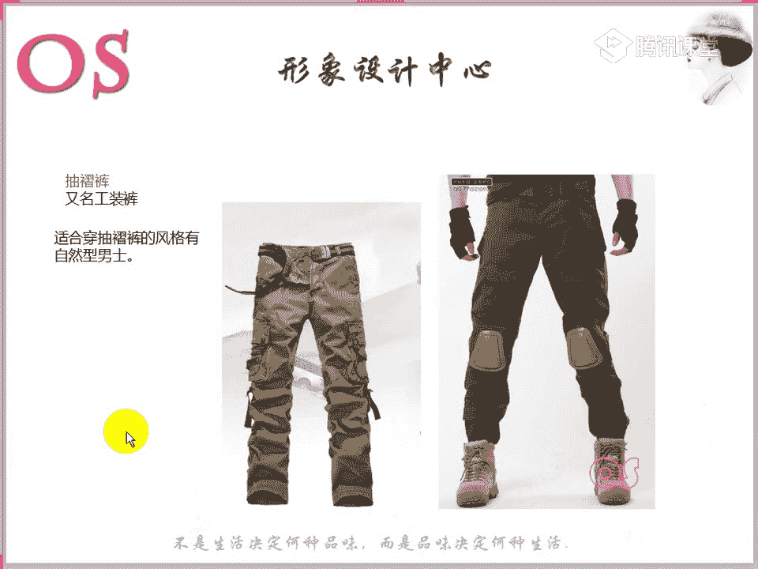

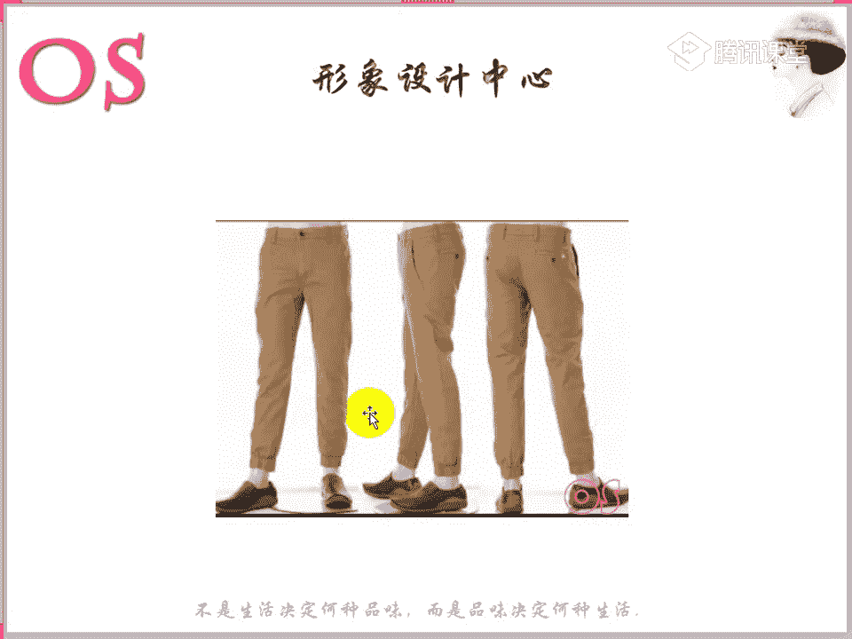

所以说我们在选择自己适合的这样的一个工装裤，可以去考虑到量感哦。那当然如果说哎我是古典型的也好，或者说其他风格，像这样的一些裤型我们少去穿，因为它会有很多的一些褶皱，看起来并不那么的精良哦。好。

接下来我们就看到翻边裤啊。当然在这里老师所说的翻边裤，不是说我们某把一条裤子把它翻起来，它就称之为翻边裤了。也是而是因为呢有很多裤子，它会它其实是有这个翻边的设计的。

就比如说里面的面料和外面的面料有这样的一个对比，就适合翻出来的，对不对？还有包括它其实就是有一个哎这样的一个缝合，哎，像有一个翻边一样，但是它是实际上存在的这样一个翻边，所以说这个翻边裤呢。

它有一个缺点，就是非常容易呢显腿短啊，因为它会有两款不同的面料组成，对不对？所以说在视觉上很容易显腿短。那所以说如果说是腿不长的，其实老师不太建议呢你们去选择这样的一些面料上。

色彩上有这样的一个强烈对比的翻边裤。当然哎老师我拿到一些其他的裤型，比如说我这是个锥子型的裤子。哎，我想把它翻一下，可不可以呢？😊，可以适当的翻边，但是两个颜色之间不要差距啊，像我们图中一样太过于明显。

太大的话，其实反而的话会弄巧成拙。当然有时候适当的露出脚踝的话，可以显得腿长，对不对？但如果说你一定要在你的腿部线条非常完美显腿长的话，其实最好是不要去进行翻边。

因为很容易呢给你的这样的一个腿部附近的制造太多的横截面。太多的横截面多了就不太好了。所以大家也可以帮我一些男士，你们可以去尝试一下。如果你的裤子长了，你把它往里翻和往外翻，绝对出来的效果会不一样啊。

往里翻反而还会显得腿长一点啊。因为你的所以说裤子的长度一定要进行调节，不可以太长啊。当然呢哎我们要注意的就是像九分裤，或者是说呢哎盖过你鞋帮的这样的一个长度的裤子呢，它在视觉上都是会显腿长的。😊，好。

这样个翻边裤的话是适合自然型或者说戏剧型的男士去穿着啊。另外的话呢就是我们的古典型啊，古典型是万万不可以穿七分裤的啊。像这样的一个裤子，古典型的人千万千万不要去碰啊。把这个案例呢提出来跟大家说一下。

然后呢，就是要一定要记住啊，翻边裤绝对作为呢腿短哦腿短的男士，其实不要去穿。哪怕说老师我拿一个普通的裤子，比如说普通的锥字型的裤子，我去翻边，可不可以呢？也会显腿短，也会显腿短啊。😡。

好，我们接着就看到这是我们的运动裤啊，像这样的一些材质的阔型裤型的，是我们的运动裤。运动裤的话，当然就是在运动场合去穿着。我不建议在休闲场合呢大部分大量的去穿着运动裤。

尤其是作为一些我们在服装上要选择一些精良的，或者说大版型的。比如说哎戏剧型也好，比如说古典型也好，比如说我们的浪漫型也好，其实这样的一些男士在其他的一些场合，除了运动场合，你们可以选择运动裤以外。

其他场合其实尽量少去穿着哦，越少越好，最好是不要去碰的。😊。

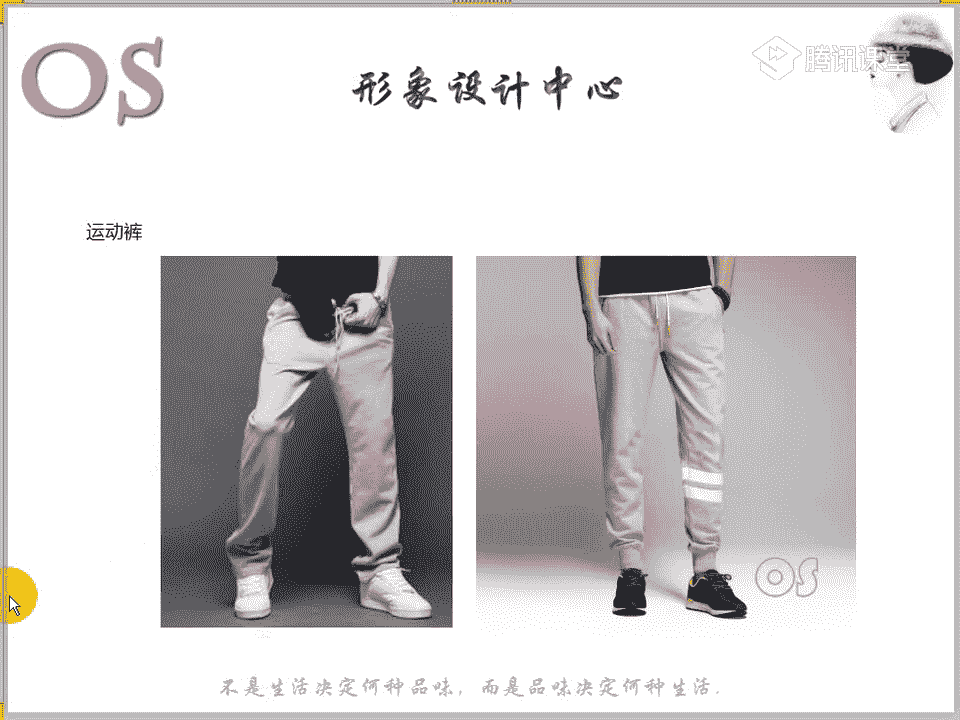

好，这个另外呢就是要跟大家说一下，如果我们是古典型的，或者说我是浪漫型的，我是新锐前卫型的风格男士呢，在选择裤子的时候呢，要注意一个细节，什么样的一个细节呢？

就是我们一定要选择呢左图中这样的一些单边缝合的裤型，不要去选择双边的哦，这个是双边，这个是单边。😊，所以说双边你会发现呢更加的就像我们刚呃思路化语之前说过的粗犷啊，我们也可以用这个词。

你会发现比较粗犷不太呢精良精细，对不对？而我们单边的就要更加精细一点。所以说呢古典型浪慢型新锐前卫型的人在选择裤子的时候呢，一定要选择单边的裤子，不要去选择双边啊。

这个是一定要记住的那其他风格的话可以随意。😡。

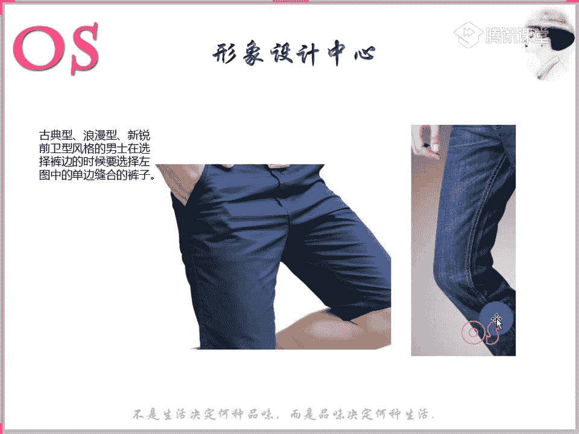

好，这个就是我们男士的裤型啊，整个的这样的一个知识点呢，老师就都跟大家呢分析完了啊。然后呢，关于今天所有的知识，大家还有没有什么问题啊？😡，有没有任何问题？有问题的话呢，可以现在提出来。

当然今天呢主要是带大家呢来认识一下我们大部分的这样的一些服装款式啊，等我们具体的这样的一些风格的时候呢，再结合我们真正了解材质的一个区别，了解我们图案的区别。了解我们色彩的一些区别之后呢。

我们再结合回顾一下来看的话，你们就会清晰很多了。好，如果没有任何问题的话呢，我们就来看到本节课的一个作业啊。作业呢第一个呢就是抄写班训还是不变啊。第二个呢就是一定要做好笔记，笔记非常的重要，一定要做好。

第三个呢就是找出适合自己风格的单品，然后呢，或者是说找出适合自己所打造的这样的一个模特，他所适合的风格单品。当然我希望大家能够怎么时尚，怎么去找。因为老师为了呢让大家更加的了解这样的一个原始的一个基础。

所以说你会发现其实大部分的照片呢。

它不是特别的时尚，但是我们能够通过照片中清楚的感受到他这样的一些不同的风格，对不对？不同的服装款式。但是我希望你们给模特啊自己的模特在找的时候，一定要比老师的更加的这样的一些时尚。因为这个就是一个基础。

我们可以在这样一个基础上去做演变。而且现在很多一些男装也是在老师刚才所说的这样的一些不同服装风格的这样的一些款式上呢去做一些改变的。所以说我们抓住重点就好了。我们抓住呢哎每个风格。

它在选择服装款式的一个特点就可以了。不用说一定要原封不动的。哎，老师这三个是飞行式的夹克，我是不是就按照这样的一个不变的去找呃，类似的款式去找，不是一定的，我们可以做一些改变，没有任何问题。

但是呢只是在基础上我们。😡。

能够从这样的一个服装款式中看到它的主体的风格。所以希望大家能够明白老师所表达的意思啊，我不知道老师这么说，大家能不能理解啊，然后呢都能够理解的。然后然后也能够清楚啊，哎。

老师所布置的第三点到底是什么意思的。然后跟老师快速的刷到鲜花。如果没有任何问题的话呢，我们本节课的这样一个所有内容就在这里了。然后大家如果说在找作业的过程中遇到什么疑问啊，在找比如说在找某些单品的时候。

你们也可以呢以图片的方式呢咨询老师。😡，好，当然哦也可以不是说一定要让大家把所有的风格呃，比如说所有的服装款式都找出来适合自己的，你们可以呢根据自己的一个需求去搭配一套呃自己所适合的这样的一个场合。

所适合的这样的一个地点，所适合自己的这样的一个服装，搭配一套也可以啊。好嗯，那我们就下课了，也是非常感谢大家的这样的一个陪伴和聆听啊。😊，然后作业一定要记得及时去交啊，因为你们不交作业的话。

老师没办法发现你们对于本本堂课还有哪些问题啊，作业是最能够反映大家的一个问题的。😡。

