# 1、03OS男士形象VIP班《形象课》：第8节、配饰搭配技巧（一）

好，在正式上课之前呢，老师还是要说一下作业的事情啊。然后我发现从第六节到哦从第七节课第六节课，还有包括第七节课，交作业的同学基本上是没有的啊。然后大家如果说因为过年的期间，有一些事情耽搁的话。

也要尽早的把作业提交上来。好，今天呢是我们的第八节配饰的搭配选择。那在今天和下一节课中呢，我们都会去涉及到我们男士中的一些配饰。那么配饰呢我们有关于帽子以及围巾，还有包括我们这样的一些项链哪啊手环呢。

还有包括我们这样的一些胸针啊，都会去跟大家涉及到以及手表等等。

那在这里呢老师会跟大家说到我们不同的风格，在选择这样的一些配饰中应该怎么样去做选择。那么今天呢我们本节课学习的重点就是关于我们围巾的分类，还有包括选择，以及我们帽子的分类。另外呢还有包括我们手表的选择。

我们要知道像手表，它有不同的刻度，对不对？以及呢还有包括它的表盘的大小厚厚薄都是哦我们都是不同的。所以说不同的风格在选择上也是不一样的。另外的话呢，我们今天还会讲到我们的一个胸针。

也是希望我们男士呢在这样的一些配饰中有对于胸针啊要有新的一个认知。另外的话呢，本节课的一个要求就是希望大家熟知我们接下来所说到的这样的一些重点。好，我们悄悄说周末补啊，嗯，实在过完年回来加班没时间啊。

没关系啊。好，我今天说一下，就是希望大家能够尽早啊尽早把作业补交上来。

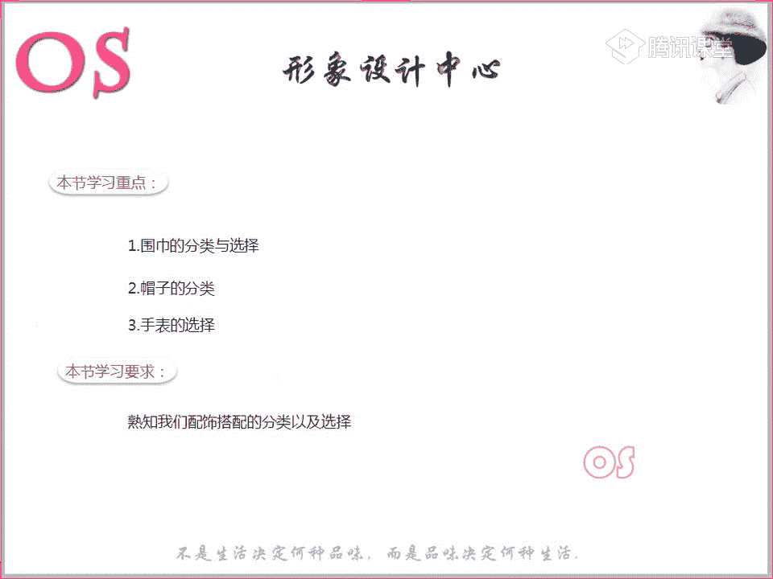

好，那就正式进入我们今天的学习重点了。第一个呢就是说到我们的围巾。那么其实我们都知道围巾的材质，还有包括整类，其实不不用老是多去说，对不对？包括我们不同的围巾的话，图案上也是非常丰富的。

那么今天呢重点就是来看看唉在搭配上面，还有包括我们不同风格上面去认知一下。首先呢我们先从我们男士中风格最大的，也就是我说我们的一个戏剧风格来开始啊。好，我们首先看到戏剧风格。那么戏剧风格呢。

我们在选择围巾的时候呢，第一个要去选择在材质上面多去注意。第一个就像我们这样的一些皮毛，所以说像一些皮草这样的一些围巾，戏剧风格的人戴起来它是最符合的啊，可以说是非常非常符合它的。

另外的话呢或者就是说我们可以去选择一些光泽感好的啊，不一定说光泽感有多强，但是它的这样的一个材质的光泽度非常的好。以及呢还有包括我们这样的一些柔柔软均可哦，柔软的这样的一个面料也是可以的。

还有包括像我们这样的一个粗仿的毛线，你会非常发现呢非常非常的粗犷，对不对？所以说这个呢就是我们戏剧型的一些例子。那包括呢接下来我们像陈柏林，他也是一个戏剧风格。那像他图中所带的穿的大衣也好。

还是包括我们这条围巾也好，你们也能够观察出来哦，这样的一些风格。图案中的一个大气。所以说呢戏剧型的人在选择围巾的时候呢，我们可以通过这样的一个老师所举的例子。比如说像这样的一个光泽度，质感好的。

也是适合他们的。但是整体的话呢，唉图案上面我们可不可以太过于小气啊。

好，我们接着呢就来看图案啊。图案的话呢，除了老师刚才所说的哎要大要醒目以外呢，不可小气以外呢，还有包括像一些几何图案的戏剧型的人是可以去选择的，还有包括像我们刚才看到的这样的一些大型的花朵。

或者说哎叶子啊等等，像这样的一些花朵，大型的也是非常适合它的，还有包括呢哎或者是说它这样的一个围巾上有一个人物的图案，哎，这个人物很醒目，色彩上很很醒目都是可以的啊。而且呢图案之间一定要分明啊。

戏剧型的图案不可以像我们自然型的，我们自然形在选择图案上可以模糊一点，哎，就比如说图案和底色之间可以有这样的一个呃发着的感觉，但是戏剧型的图案一定要很清晰啊。这个点希望大家要懂得去进行区别。😊。

好，这个就是我们戏剧型的一些风格的一些例子，围巾的一些例子。那我不知道大家我们这样的一些图片，有没有一个呃对于老师包括在我们屏幕上所写的这样的一些关键词，能不能从图片中去找到啊。

可以的同学呢跟老师扣个一。

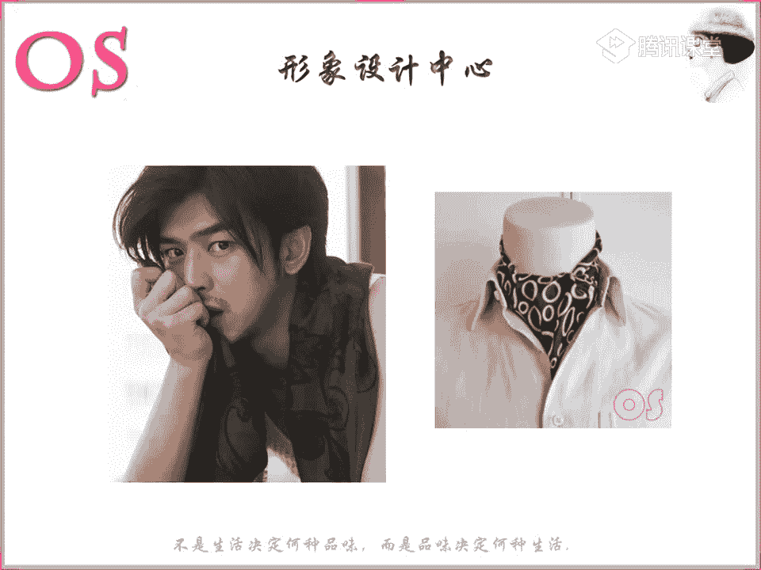

所以说总而言之，我们戏剧型的人不可以呢去哎打扮的太过于平凡，或者说太老实或者说太小气的这样的一些装扮。啊，整个的装扮中我们都要能够去读到唉醒目装饰感强啊，大的这样的一些图案。

包括的话呢我们哪怕就是选择这样的一些条文，它也要大气。

好像我们潇潇的老公是戏剧型的是吧？老师应该还记得话，印象深刻的话哦，应该我没有记错。啊。接着呢我们来看看我们的自然风格啊，自然风格的材质呢它跟戏剧型的材质其实你会发现有一点点相通点。

但是呢哎它还是有很大的一个区别的。因为他们都是大风格，但是区别还是有的。第一个像戏剧像我们自然型的这样的一个材质呢，一定要选择一些哎。😊，光泽感弱的啊，千万不要选择有光泽的路。

所以说你会发现像自然型的人啊，不管是男士还是女士，我们如果一旦去选择，比如说像一些真丝材质的这样的一些服装也好，还是说我们这样的一些围巾也好。其实你会发现并不是那么的好看啊。因为这个也是根据我们风格。

还有包括我们的皮肤的一个质感所带来的。所以说呢作为自作为自然型的人，我们千万不要去选择一些带光泽度的。我们要选择没有强烈光泽的一些面料。另外的话呢，像他去选择一些麻质的啊，我们这样的一些围巾。

或者说我们这样的一些啊布料的一些麻质的啊。还有包括我们的一些粗毛呢、绒毛呢，或者说质地天然的呃编织的这种感觉的，都是非常适合我们自然型的那图案上面呢像除了民族，还有包括呢自然型的人去穿条纹哪。

去穿方格呀，衣服都很好看。就何况我们这样的一些围巾也是一样的啊，他去穿方格，穿条纹，或者说唉这样的一些植物纹一样的。或者说自然风光泼墨，或者说几何图案都是可以的那包括你像我们呃男星里面。

如果说韩国的男明星举例，像裴永俊，他也是自然风格的。所以说我们拿这样的一个图片去对照一下我们呃戏剧其实是非常风明的，对不对？没有那么的大气。所以说呢总结一下我们自然风格的人呢，在选择呃围巾的时候。

虽然说要注意我们这样的一些几个点，但是也要懂得回避啊，回避一些过于呢华丽的或者说特别标新立异的这样的一些服饰风格。千万不要去把标新立异。

特别有时尚感特别特色的这样的一些呃尖锐的这样的一些感觉的配饰呢去给他去做搭配。

好，看完我的自然形呢，接着我们来看到浪漫风格哦，浪漫型的男士。浪漫型的人在材质上面呢，因为它也是一个大的风格啊，也是算中偏大的风格。那我们在材质上呢，第一要去选择一些真丝的。

所以说它在材质上就要表现这样的一些感性感。第一呢像真丝，还有包括呢丝棉金纺毛呢的，或者说羊绒的光泽感强的柔软而华丽的这样的一些面料，都是非常适合它的。在围巾上的一个选择。而且呢唉我们图案上呢。

包括在一些波点花朵曲线图案，会发现它都是偏曲向图案的哦。因为浪漫风格就是一个曲线的风格。所以说我们在图案上也要往曲线风格去走，不要去给它选择一些直线风格的这样的一些图案哦。

好，这是我们这样的一个材质的一个表现啊，大家可以看下。陈坤就是我们典型的一个浪漫风格的男士哦。好像这样的一些羊绒的精纺羊绒面料的。好，这两个也是我们的浪漫风格。

所以说大家如果说想要去找这样的一些感觉的话，也可以多去呃看一下类似于哪一些明星。那总而言之呢，我们浪漫风格的人要回避一些过于随意粗糙的，包括呢一些另类个性的服饰风格。所以说像自然型的这样的一些材质。

如果说一旦给浪漫型的人一穿起来的话，是非常非常不好看的。所以说整个的围巾的话，质感上我们都能够感受到上层这样的一个关键词。

好，接着看到我们的古典啊，古典风格呢在材质上面，第一呢就是挺括的啊，它在材质上一定要选择一些挺阔的。另外的话像一些精纺的毛呢，或者说唉这样的一些真丝的这样一些质感的材质都是非常符合它的。

在图案上呢就应该要越简单越好。所以说呢图案中的这样的一些排列呢，一定是要有规矩，有规则的。而且呢像格纹啊，还有包括呢条纹点等几何图案是非常符合它的，也是非常符合它的。只是说哎这样的一些格纹条纹。

还有包括几何图案。第一要简单简洁。第二呢一定要有规则。

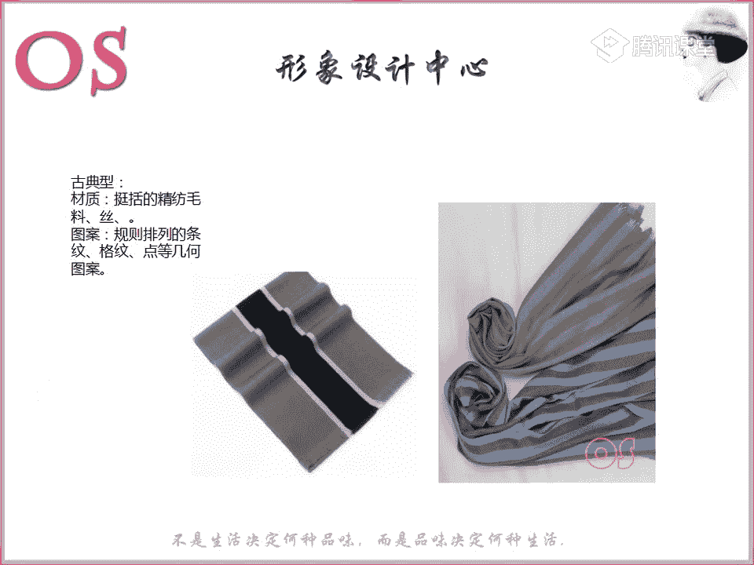

好，像我们的张嘉译啊，张嘉译就是一个典型的大古典啊，它会比一般的古典风格的男士的量感还要偏大，但是它也是属于古典类哦。也是非常的精精致和精良哦，整个的这样的一些材质感，还有包括图案上面。

那么我们古典型的人呢一定要懂得回避一些过于个性的另类的，或者说夸张醒目的。还有包括呢随意粗糙的这样的一些装扮风格。不管是围巾上面的，包括服饰上。哎，老师刚才所说的这样一个回避一个点呢。

你们也可以把它对照到我们的古典型的一个服饰上面哦。再重复一遍，就是过于个性另类的，或者说夸张醒目的随意粗糙的这样的一些装扮风格都是不适合他的。

材质和图案一定要都要去结合哦。

好，接着我们来看到呢昕锐前卫型啊，新锐前卫型的材质呢要闪光，而且呢要硬挺的啊，像一些化纤的材质是非常适合适合它的。另外的话呢，图案上面可以选择一些不规则的条纹格纹或者说怪异的一些图案。

个性抽象的这样的一些图案。所以说可以在色彩以及呢材质和图案，像新锐前卫型，一般在色彩上面都非常适合一些纯度比较高的哦，它可以去驾驭一些纯度高的色彩。所以说我们可以在色彩以及呢啊材质。

还有包括呢图案呢结合。所以说大家看到这样的一些围巾啊，你就会发现哎整每每一款围巾都很有自己的特色，对不对？都很有自己的个性，而不是那种简简单单的，不会像哎我们拿个例子，像我们的自然型，它是偏近的风格。

而我们的呃新锐这样的一些前卫型的风格，它是偏动的，对不对？所以说你会发现呢两者一做对比。哦，我们自然型的就会显得要平淡一点。而我们所以说呢我们这样的一个新锐前卫型，千万要记得就是要回避一些平淡的。

比较中庸的，或者说不流行的不华丽的哦，或者说哎这样的一些华丽的，应该是说要回避一些过于华丽的，或者说重比较正统的这样的一些服饰风格，还有包括这样的一些图案。😊，整个的围巾的量感上。

大家也可以去观察一下哦，是不是量感要比我们刚才所看到的这样的一些呃其他的风格稍微量感要偏小一点啊，要趋向于年轻化，对不对？因为量感的大和小，其实用我们这样的一些其他词语代表的话就是年轻和成熟。

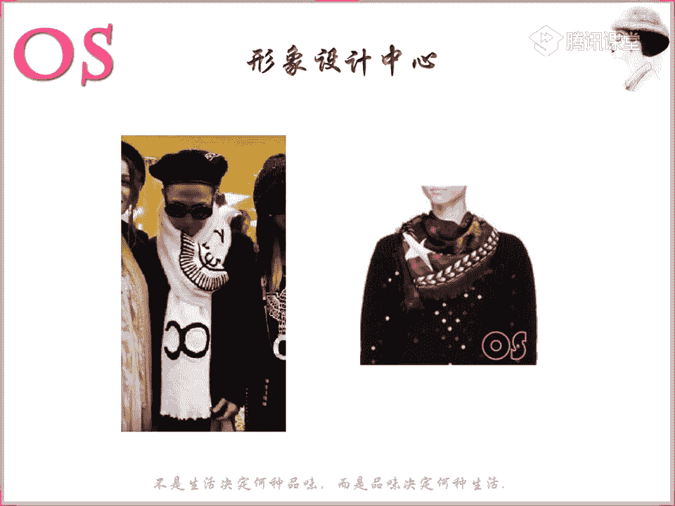

哦，接着我们就看到阳光前卫风格啊，阳光前卫风格的话呢，唉材质上第一呢毛料毛类的，还有包括呢像一些闪光硬挺的，它也是可以的。它可以适当的去选择一些闪光的，也也就是说光泽度啊，有一定的光泽度的是可以的。

还有包括呢这样的一些硬挺的材质。另外的话呢图案上我们要选择一些个性的同时呢，哎又可以去选择一些可爱的这样的一些几何图形，或者说抽象的整个来说呢，你会发现哎新锐前卫型是那种冷冷的那种感觉，有一定的距离感。

但是我们阳光前卫型就像一个大男孩一样，对不对？很好接触啊，非常的平易近人。但是平易近人的同时又非常的有活力。但是又会有一定的自己的酷酷的这样的一个感觉。那其实像这样的一些围巾。

如果说给到一些年轻的自然风格也是可以的。同样的哦，我们这样的一些阳光潜卫型也要懂得去回避一些中庸中庸的平淡的或者说不流行的啊这样的一些正统的啊，我们的这样的一些装束啊。那这个呢就是我们不同的风格。

在选择围巾的时候呢，哎我们要去找对应的这样的老师所展在图片中所展示的这样的一些感觉。然后呢要记住啊，把自己的风格中把自己风格中呢，你适合的围巾的这样的一些关键词一定要记住啊。

那么对于自己啊我们各位男士对于自己的这样一个风格，还有没有什么问题，或者是说哎我们作为顾问班的同学，如果没有任何问题的话呢，快速跟老师扣个一啊。那接着呢我们来看看围巾的一些选择的方法哦。

还有穿搭的这样的一个方法，应该说是。

好，当我们如果穿着一些正式西装的时候呢，我们如果要选择围巾的话呢，我们可以去选择真丝的，或者是说呢这样的一些精纺毛料的材质的围巾啊，就比如说像精纺毛料，举个例子，像类似于这样的一个羊绒的精纺的材质。

在搭配正装的时候，是绝对可以去与之做搭配的。所以说除了真丝以外呢，还有这样的一些精纺毛料。当然哦哎如果说我是作为这样的一个男士，我我在穿着正装要去这样搭配的时候呢，我们男士可以这样这的高一点。

因为男士的场合是非常重要的。所以说一旦我们这样的一个场合有需要的话呢，唉不管你是哪样的一个风格，我们都可以去这样的去做搭配啊。哪怕说哎我不适合这样的一些真丝的。但是我们可以在色泽上面呢去做一些改善。

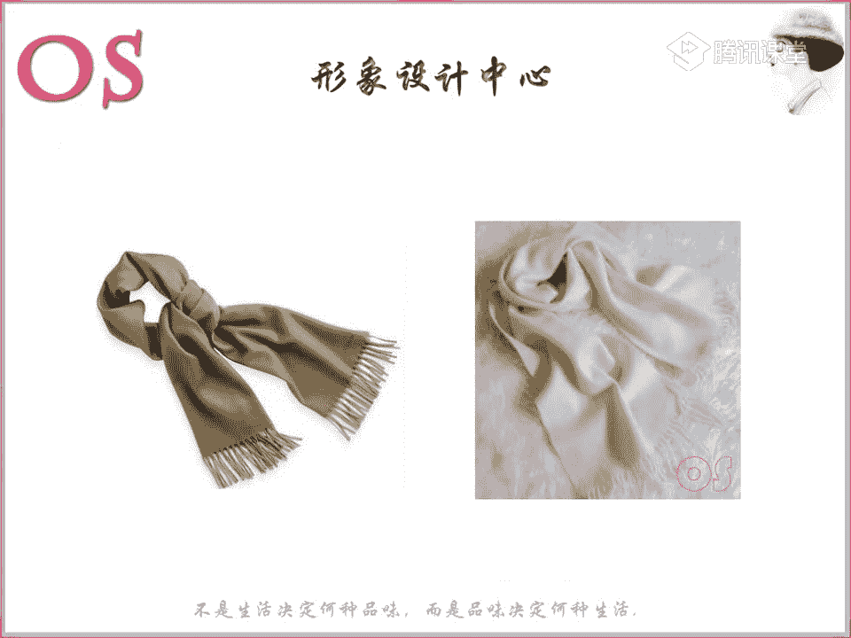

好，包括这样的一些羊绒的啊。这是我们这两种材质的，在一些选择上面搭配上面可以呢与之做搭配。那当然像一些呢子大衣哦，也可以去搭配羊绒的，对不对？这样的一些材质。那如果说呢我要选择搭配针织衫。

或者说休闲的西装或者说夹克。唉，大衣等等的这样的一些休闲服饰的话呢，我们可以去选择针织的毛线，或者是说呢羊绒棉麻等休闲感强的围巾。

好，有需要记笔记的地方慢一点跳啊。好的，可以啊。一会儿你们哪一个点没有记清楚的话呢，老师可以到时候再重点讲一下啊。当然啊，如果说一旦是在这样的一个休闲装，对不对？休闲装的一个搭配的时候呢。

我们当然选择了休闲装的风格也是要符合自己的。所以说呢然后呢在我们这样的一个围巾上的一些选择上呢，也符合自己，其实非常好处理。所以说除了刚才我们要搭配正装，我们可以呢直接跳出自己的风格以外呢。

像我们在选择休闲啊西装或者说休闲装的时候呢，我们就可以完完全全按照老师刚才所说的唉，不同的风格啊，对于围巾这样的一些饰品的选择。

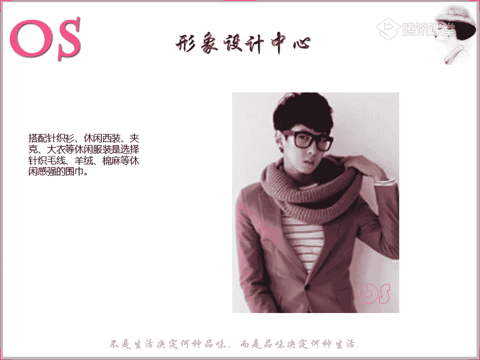

而且像围巾这个东西也是可以很好的去增加我们整身的这样的一个层次感哦。哦，这个就是我们在平时穿搭中哦，其实围巾如果各位男士我们的衣处理啊，围巾比较缺少的话呢，其实按照自己的风格可以呢不同的去做一些选择。

在图案上面在材质上面多去备选几条。因为它也是一个非常好搭配的这样的一件单啊，这样的一个单品吧，也可以说是。啊，老老师，这个是直播吧啊，是的啊，这个就是直播啊。😊，好。

这个就是我们的围巾的这样的一些搭配啊。所以说就一定要记住这一个点。我们我们作为顾问的，或者说我们个人的这样的一些形象的同学要知道，如果一旦你们有场合，必须要去选择到这样的一些围巾。

去跟你的正装做搭配的时候，不用太多的去考虑到自己的一个风格。因为我说了，男士非常注重的是场合，对不对？场合之外之后呢，我们可以再去考虑到风格。所以说就像我们嗯男士像自然型的人。

其实他穿西装的话可能并没有我们古典型的人好看。但是如果说有这个场合需要的话，我们是不是还是要穿到西装？其实就是这样的一个道理啊。好，对于这样的一个问题啊，对于围巾大家都应该没什么问题了吗？没问题的同学。

还有包括笔记都有们有没有记清楚啊，都没什么问题的话呢，快速跟老师扣个1啊，我们接着来说下一个知识点。好，下一个知识点呢，我们还是来看一看帽子吧。可能有一些男士是不太喜欢戴帽子的啊，但是呢我们也要知道。

那么帽子哦嗯休闲的还没系好哦，那我们再看到休闲的。😊。

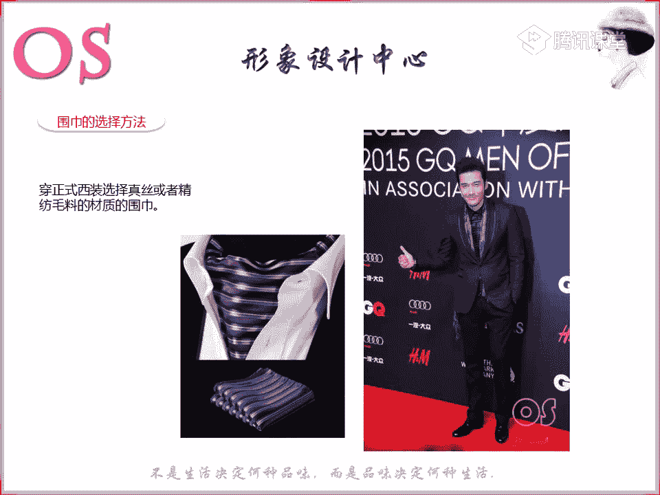

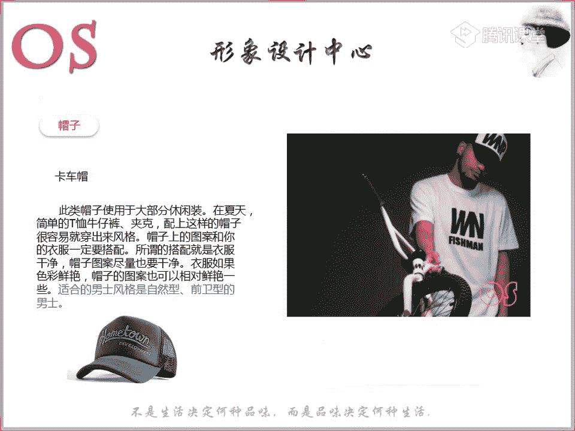

好，记好之后，可以跟老师扣个一啊。😊。

好，我们看到帽子啊，帽子呢有几大类别。第一个呢就是我们这样的一个卡车帽啊。所以说大家看到这样的一个呃类似于这样的一些款式的，我们可以把它叫卡车帽。当然啊也可以把它称之为呢棒球帽，其实都是一个概念。

那这样的一个帽子呢大多是要去搭配我们这样的一个休闲装的。比如说在夏天的时候呢，我们可以拿简单的T恤啊，比如说和牛仔裤夹克来去搭配这样的一个帽子，但是这种帽子的一个选择呢，其实不仅仅在搭配上。

我们要去注意，而且呢呃还有就是呢跟风格也是有关系的。所以说唉标注蓝色的这样一个字体呢，大家一定要记清楚。像这样的一些卡车帽，棒球帽呢，是比较适合我们自然型，还有包括前卫型的这样的一些男士。哦。

自然型和前卫型。那如果说啊如果说哎老师我是一个这样的一个戏剧风格，但是我是一个年轻的戏剧风格哦，那你也可以适当的去选择。但是像其他的这样的一些风格的话呢，搭戴搭这样的一个帽子啊，你的一个怎么说呢？

整个的这样的一个符合你的风格的这样一个出屏感并不是那么强。啊，另外就是呢我们在搭配的时候呢，还是要注意哦，我们拿这样的一个卡城帽，或者说棒呃叫棒球帽，对不对？去搭配衣服的时候呢。

如果说你帽子的图案啊非常非常的复杂的话呢，或者说色彩上非常出品的呃，出挑的话呢，我们衣服上就尽量的色彩低调一点啊，或者是说呢我们衣服上的图案也尽量要干净一点。当然啊。

哎如果说我们的帽我们的衣服非常的干净，那么我们的帽子就可以呢。哎，是的，也要尽量的呢要干净一点。😊，这个是要注意的啊。😡，啊，老师好像刚才说反了啊说反了。嗯。

然后记住我记住我刚才所说的其实就是一个道理啊。你的如果说帽子的这样的一个图案非常的复杂啊，非常的复杂的话，我们的衣服尽量稍微的简单一些。除非就是说相对来说都比较简洁，那还是可以的。好，不好意思啊。

今天身体不怎么舒服啊嗯。😊，好，没关系，我们记得要去。呃，补上我们这样的一个录播啊。然后因为接下来还有这样的一些胸针，还有包括手表的这样的一些选择。接着呢我们来看到棒球的这样的一个平沿帽啊。

棒球的平沿帽。也就是说我们这样的一个帽檐是平的。它跟我们这样一个蜿沿的卡车帽，或者说蜿沿的这样一个棒球帽是概念是不一样的啊。如果是平沿的棒球帽的话呢，这种帽子跟上面的卡车帽。

其实基本上也是一个非常百搭的啊帽子。如果说呢我们是属于啊我今天的装扮风格有点街头风的话，我们可以去佩戴这样的一个帽子。但是其实这种帽子是非常非常挑。

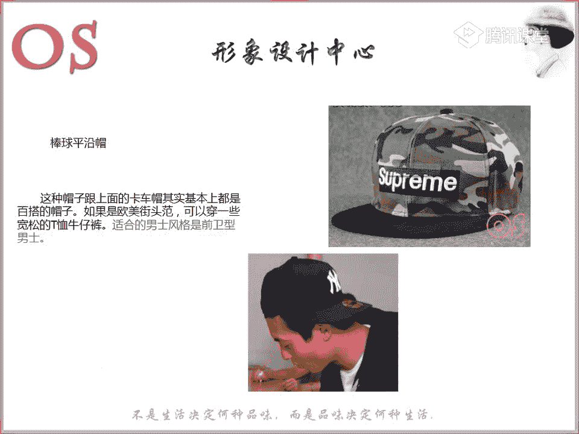

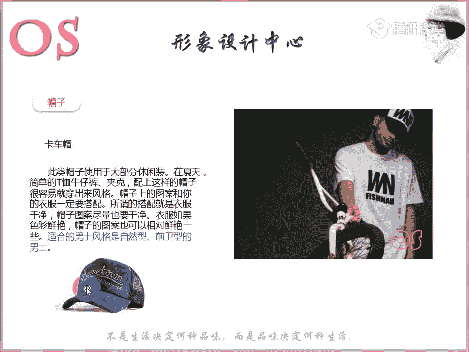

人的脸型的，我们男士如果说你的脸比较长，老师是不建议你去戴这样的一个平沿的，或者是说哎我这样的一个呃，我其实像戴平沿帽子呢，脸型如果说你趋向这样的一些微微的一个圆形。

或者说鹅蛋型的去戴平沿帽是比较好看的哦。另外的话呢，我们适合这样一个帽子的风格呢，就是前卫型的啊。不管你是新锐前卫也好，还是阳光前卫也好，都可以去做尝试。

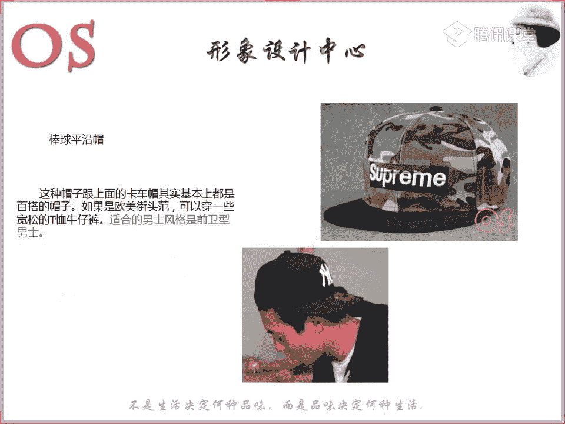

好，我们看到接下来就是我们的平顶帽啊，也叫军帽哦。平顶帽呢它的帽筒是一个平的，而且帽筒也比较低哦，帽顶的部分是平的，它不是像我们这样的一个有弧度的，它是一个平的。然后呢帽筒比较低。

那这种帽子它其实是有一点介于正式和休闲中间的一种帽子，它可以搭配呢衬衫跟你的休闲裤组合啊。当然衬衫也是需要选择类似于一些偏休闲款式的衬衫，然后呢也可以搭配T恤跟牛仔裤啊。

还可以搭配一些休闲式的皮衣或者说其他的一些夹克，然后呢也是属于百搭的风格。那适合这样的一个男士的风格呢，有年轻的自然型，还有包括呢唉古典型，还有包括呢我们这样的一个前卫型的男士。

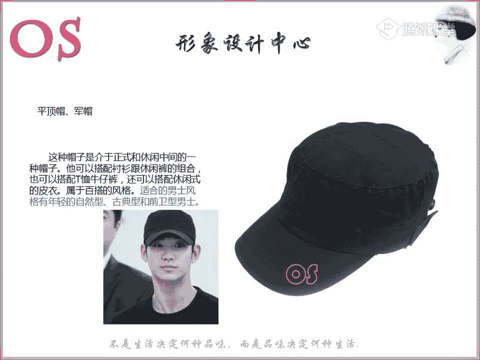

好，接着我们来看到画家帽啊，也称之为八角帽。然后这样的一个帽子呢，它其实是属于略高端一点。因为一般人呢不是说能驾驭或者说唉呃不想驾驭的。就是不能驾驭或者是说不想驾驭的啊。然后这种帽子一定是要去选择正的。

所以说像这类型的帽子，我们一定要去在呃试一定要去试戴哦。因为它这样的一个画家帽八角帽哦，它不是说完完全全都是一种类型的。你会发现有些帽子它可能要唉左边要低一点，右边高一点，或者说前后也会有一些区别。

所以说我们在选择时候一定要去仔细了啊，还有包括呢帽型上一定要正啊，否则的话呢它塌的是完全会没有感觉的。另外这种帽子啊，我们搭配的衣服就相对要窄一点点的。我们可以去穿休闲的正装或者说像白色的衬衫。

休闲的西装外套去做搭配是没有任何问题的那像我们小贝也是非常喜欢这类型的帽子啊，那还有包括像这种帽子呢，我们也可以去搭配像风衣呀，效果也是非常好的那如果说不喜欢穿休闲西装的。我们在衬衫唉再加上。

我们的针织毛衫跟哦，然后上面去戴这样的一个帽子也是可以的。另外啊像这类型的帽子，如果说唉大胆的一些同学，你适合的同学，你也可以去搭配我们的皮夹克，同样也是可以。因为我们可以往这样的一个英伦风格去走啊。

唉不要去走牛仔和T恤风格太过于休闲。如果说我们服装的款型，太塌的话是不适合的。所以说你会发现老师举的这样的一些例子，不管是风衣也好，还是大衣也好，还是我们的休闲西装，或者说正式的西装。

还是说这样的一些皮夹克，它的整个款型是有这样的一个硬挺度的，对不对？还是有这样一个硬挺度的。所以说这样的一个画家帽呢，八角帽不要去搭配一些太过于没有型的哦，整个的这样的一些。😊，服装的廓形比较塌的。

我们是不太适合的。另外呢适合戴这样的一个帽子的男士呢，有我们的戏剧型，还有包括浪漫风格，像浪漫风格戴它是非常好看的哦，还有包括像我们的自然型古典型的男士。但是一定要注意，在这里呢老师也标注了。

古典型和浪漫型材质呢一定要选择金纺的。古典型的型呢一定要好，千万不要去选择一些啊没有太多型的。而且像古典型的人啊，像我们类似于呃贝克汉姆这样的一个材质。你会发现它其实更适合一些自然风格人去选择。

所以说呃古典型的人，如果要选择画家帽的话，我们就一定要选择精致一点啊，至少在图案上和我们的材质上都要选择金纺。不可以有肌理感太强了这样的一些印象。好，接着我们就来看到呢爵士帽啊。

所以说像爵士帽呢统看到图片中类似于这样的一些款式，我们都可以把它叫做爵士帽。因为这样的一个帽子确实很少啊有人能够去驾驭，因为非常的西式啊。所以说呢唉我们这样的一个帽子既然是西式的。所以说穿衣服上。

我们也可以靠这样的一些英伦风格走。所以说比如说我搭配这样的一些啊西装马甲呀，或者搭配我们的衬衫呀，唉搭配我们的这样的一些休闲的西装外套啊，或者说我们这样的一些大衣啊等等都是可以的那因为搭配西装衬衫。

所以说呢像这样的一些帽子呢，任何风格都可以去进行尝试啊。好，如果说我们在夏天选择这样的爵士帽，可能它的有有一些材质啊，材质上面可能会是一些编织材质的那其实也是一样的。我们在选择服装上面，比如说你像男士。

如果说哎我选择这样的一些编织材质的爵士帽的话，我也会选择一些呃休闲稍微休闲强感稍微强一点这样一些衬衫啊，跟它去做搭配，也是要比去把它跟呃我们的这样的一些呃普通的衬衫啊，普通的这样一个T恤搭配要更好。

当然哦呃不排除有一部分的一些男士，因为我们自己的这样的一个对服装的一个驾驭度的一个问题，可能他选择即使说T恤去搭配爵士帽啊，在夏季的时候也有不错的一个效果。好，接着我们就看到呢我们的毛线帽啊。

这样的一个帽子其实呃是我们男士在冬天很多男士是非常喜欢的，因为它很保暖，对不对？但是它也同样非常的时尚。所以说不管是呃冬天也好，还是呢我们这样的一些啊夏天。

其实你也会发现有一些街头上也会带这样的一个毛线帽。当然啊它的这样的一个毛线的材质是相对来说是属于我们这样的棉质的薄一点。那这样的一个帽子的样式呢，也是多种多样啊，很多的一些款型，非常的百搭。

那像这个帽子就完全不用去顾及到哈，它可以呢你可以根据你自己所适合的这样的一个材质，还有包括图案，还有包括呢跟你所适合的这样的一些服装风格来去做搭配。😊，重点就是要选择呢在我们的色彩和材质上面啊。

一定要挑选符合自己色彩，还有符合自己材质的那如果说是古典型，或者说是浪漫风格的话，我们要选择啊这样的一个帽子，我们就一定要选择在材质上选择适合自己的精密一点的。

这个就可以去参照我们围巾的材质和色彩上面的哦。好，关于帽子，大家有没有什么问题？好，帽子上面都系好的同学快速跟老师扣个一。好，有问题可以提啊。好，没有问题是吧？啊，没有问题。

我们就接下来看到一个接下来的一个重点啊，就是关于我们的手表。那么其实老师在呃讲手表的时候呢，我们就一定要认真来听了。因为像手表对于我们男士来说也是非常非常重要的哦。

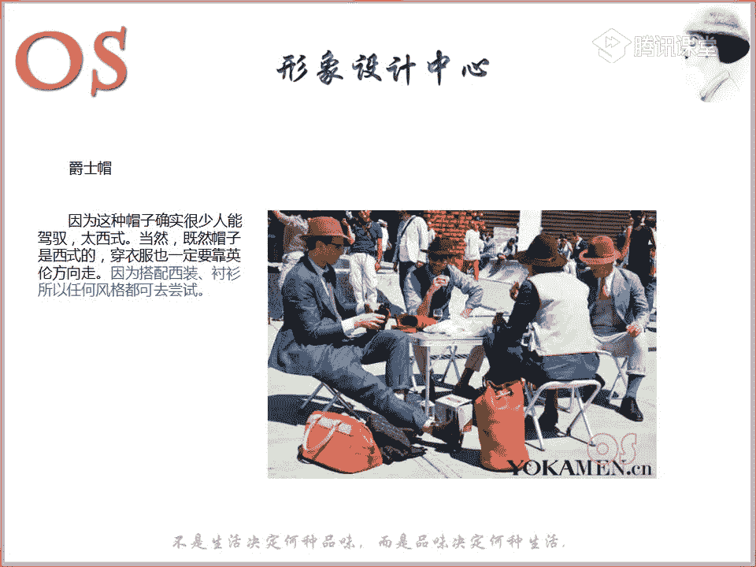

嗯，今天的内容还好啊，今天内容很好还好。😊，因为下一节课内容可能会相对于这节课多一点。好，如果说觉得快的，老师就稍微呢节奏放慢一点啊，节奏放慢一点。好，接着呢看到手表啊，首先呢我们来看看手表的刻度啊。

那其实呢。表盘越厚会越显得有运动感，那表盘薄的会带来尖锐感啊。大家要记住这句话，那就像我们嗯刚才所提到的这样一个围巾，其实也是一样的道理，对不对？你会发现呢唉这样的一些时尚个性的。

你会有一些相对来说会感受到这样一个尖锐感，对不对？有个冲击力。那如果呢我们相对来说粗糙一点的，或者说图案上面啊，哎比较的这样的一些平的，包括色彩上面啊，也是属于啊我们类似于这样的一些肌理感强肌理感弱的。

对不对？其实都是就是这样的一个道理啊，所以说我们会带来不同的一个视觉感受。那么手表也是一样的啊，表盘薄的呢，它会带来这样一个尖锐感。那么表盘啊越厚的会越显得呃我们运动感强。就像我们很多的一些运动手表。

你会发现它的表盘是很厚大的，对不对？很粗糙的这种感觉啊，不一定说它做做工真的很粗糙啊，哎，这个就是这样的一个感受。那么第一个呢就是我们来看到我们接下来要讲到的一个刻度。那么像我们右图中这样的一个手表呢。

哎用的就是我们这样的一个。没有精确的刻度的，对不对？表盘是没有精确数字的这样一个刻度。那么像这样的一个没有数字，不标明，不管是阿拉伯也好，还是说其他的哎这样的一些数字没有的话呢。

其实它会带来的感觉是非常的经典，而且呢有这样的一个严谨感，我们可以来观察一下哦，一会儿呢我们跟其他的这样的一些其他数字的。表盘可以进行这样的一个对比。非常的经典哦，有严谨感。好。

第二个呢就是我们这样的一个阿拉伯数字的一个表盘。阿拉伯数字的表盘就如图所示啊，我们带有这样的一个数字的，那么带有数字的这样的一个手表的一个表盘呢，它的一个装饰效果呢也是非常的突出的。

所以说整个呢是比较的轻松或者运动感哦，那一会儿老师会讲到在什么样的一个场合中啊，我们去进行运用。这个大家都要记清楚啊。好，接着就是我们的古罗马数字的表盘。呃，古罗马数字的表盘呢它是特别的显念。

显得比较的年轻，然后呢也比较的现代哦。显得比较的年轻，显得比较现代。所以说大家哎一做对比，你就会发现是不是我们这样的一个没有精确数字的一个刻度，是不是会显得非常的经典，而且呢也会显得很严谨啊。

非常的严谨。有没有这样的一个感受啊，有感受的同学可以跟老师呢刷的鲜花。哎，我们对比一下这三款能不能感受到哎，我们这样的一个没有精确哦，数字的一个刻度是能够带来这样一个严谨感的。好，这个就是我们手表哦。

一般这样一个表盘的一个刻度的话呢，就是这三大类。当然啊除了老师所标注的，还有比如说哎我们这样的一些表盘，它的外围是没有任何东西的。哎，可能连这样的一些一小横竖小横杠都没有，对不对？

那也是属于我们这样的一个没有精确数字的一个刻度的啊。好，看完了我们刚才呢手表这样一个分类，记住记要一定要记住这样一个感受啊。那接着呢我们来看看手表的这样的一个颜色啊，那金属带的这样的一个手表呢。

唉我们要注意的一个点，就是金色和银色呢，一定要懂得去分别啊。如果说我们各位男士啊，你们有的同学可能是属于春季型，或者说属属于属于我们这样一个秋季型的呢，唉，你们是属于这样一个暖色的，对不对？

那我们可以去选择金色的表带。那同样银色，你们也可以去选择。那如果说呢我是作为夏季型或者说冬季型的男士的话呢，我们就一定要选择银色的哦，千万不要去戴到金色，哪怕它再好看。因为呢你戴上之后会显得你的手腕。

比较黑哦，会显得你周围的皮肤黑，而且呢也不符合你的这样的一个整体的人体色。😊，这个就是我们金色金银之间的，同样首饰也是一样的啊，我们可以把它对照到首饰，同样的概念啊。如果说是冷色型的。

我们就尽量选择银饰啊，像白金啊这样的铂金这样的一些啊材质。那如果说我们是暖色的呢，就尽量选择可以选择这样的一些金饰啊，非常的好看。好，接着呢我们来到呢我们这样的一个呃运动款的手表啊。

手表的分类除了刚才老师所说到的，还有就是运动款的手表。那要知道啊，运动款的手表呢在穿着我们的运动服装或者说休闲夹克T恤的时候呢，我们可以进行佩戴，千万不要在一些跟一些正式的服装去做搭配啊。

不要觉得哎这样的一个混搭，很时尚，很潮流啊，尽量要懂得这样的一个场合的一个区分。那所以说呢其实大家会发现哦，如果说在职业场合的话，我们想要去表达自己的严谨，表达自己的这样的一个对工作一个这样的一个。

庄重感对不对？其实就可以去多选择呢无精确数字的。其实像男士啊呃我们可以把这样的一个手表呢比喻成女士的一些耳环一样的。其实我们男士的手表，各位哦不要觉得有一款就可以了。

其实我们应就有时候看电影会发现哎为什么说国外的一些男主角啊，一打开它的这样的一个衣橱啊，会发现整个抽屉都是手表，其实为什么要买那么多手表，其实就跟我们女女人喜欢买包买鞋子其实是一个概念啊。

所以说我们不同的这样的一个包包可以搭配不同的服装，对不对？不同的鞋子也是这样的一个概念。所以说男士也是一样的。我们不同的手表的刻度，不同的表带啊，不同的款式，它同样呢在不同的场合，不同的哦服装的风格中。

我们可以呢进行这样一个穿梭。所以说如果有这样一个经济条件，老师建议是可以去多备几块手表。

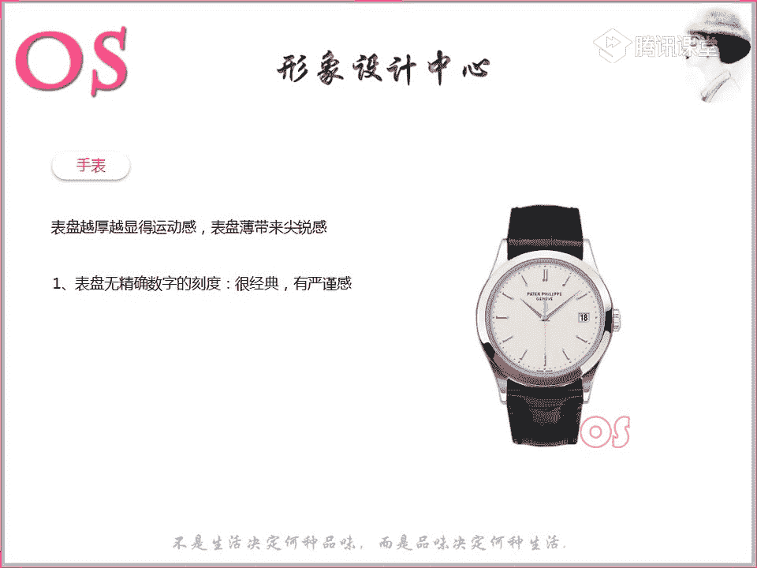

好，接着我们就来一个一个风格来看啊，一个一个风格来看，看我们不同的风格呢在选择手表时要注意的那还是从我们的大风格。第一个呢就是我们的戏剧风格。戏剧风格呢在佩戴我们在选择我们手表的时候呢。

可以去选择一些表盘大的。然然后呢，表盘厚的啊，表盘厚的，因为像表盘厚的，我我刚才有说到啊，会显得比较运动感，而且呢也比较朴实，比较有亲和力哦。我们戏剧型的人并并不需要去表现太多的这样一个尖锐感。

所以说呢可以去选择一些表盘厚的。另外的话呢，我们的袋子呢可以去选择天然动物皮革的这样的一个表带。

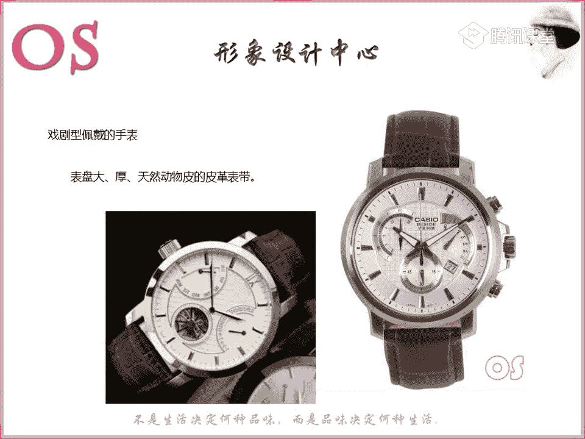

当然啊，如果说有这样的一些戏剧风格，你喜欢这样的啊类似于我们这样的一个金属的，其实也是可以的。但是你如果一旦选择金属的话，表盘这样的一个点是一定不要去丢弃的哦，要多注意。

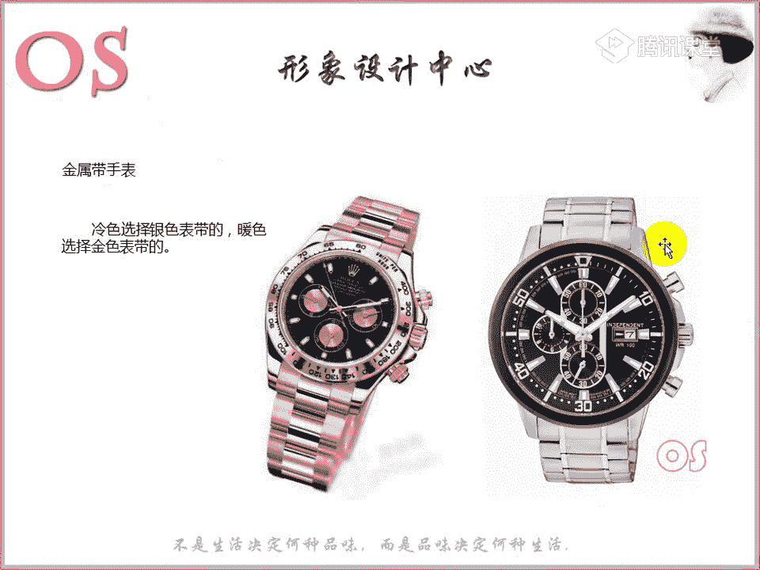

那我们看到这两款手表，老师找的这样的一个图片啊，一个代表图片，其实能够去看出来我们这样的戏剧型的风格哦。呃，黑色金属的可以吗？可以哦。🤧但是总而言之呢，其实它呃黑这样就像金属的对于戏剧型的人。

其实可以适当的去选择。比如说我在这样的一个职业场合，比如说这样的一个场合，我需要运用到的时候可以。但是如果说在休闲场合的话呢，老师建议你是可以去选择一款唉类似于这样的一个手表。

搭配起来也会非常好搭配哦。哦，接着我们就看到第二个就是我们浪漫风格的男士在选择手表的时候呢，哎我们要注意这样的一个刻度啊，我们尽量选择古罗马哦，古罗马数字的，可以去尽量选择古罗马数字的。

当然啊如果说哎我是浪漫风格的。老师我我刚好有一个这样的一个职业场合，我需要运用到表现我这样的庄重感啊。哎，这样的一个呃威严感的话，我我也可以去选择无金克这样的一个确呃刻字的也是可以的那另外的话呢。

其实你会发现浪漫风格的人去带一些黄色的一个金边的，或者说直接带金表，它其实是带的所有风格里面带的最好看的。可能有些风格我去带一个金表，会让人感觉这样的一个土豪的即视感啊，就是没有品位，除了钱什么都没有。

但是浪漫风格的人去带金表，或者说哎我这样的一个手表里呢刻有这样的一个黄色的金边，其实他们是能够去带出来的，而不会说。让人感觉很土豪，而是让人感觉非常的有品味哦。所以说这个就是我们浪漫风格的一个好处。好。

第三个呢就是我们自然形在佩戴手表的时候啊，自然形风格在佩戴手表的时候呢，我们可以去选择一些表盘厚度呢适中哦，也就是说不可以太过于大啊，或者是说呢太过于厚太薄的啊，我们适中就好了，包括手表的一个大小呢。

我们可以选择中偏大一点点。然后呢，在材质上面它当然最适合的就是皮革材质。所以说自然型的人，你去选择金属表带还不妨呢去选择皮革材质的。因为皮革材质，它的肌理感要强一点，对不对？唉。

属于我们这样的一个自然啊这样的一个怎么说呢？天然的这样的一个成分吧。所以说是属于自然界的啊，它不是说人工雕饰出来的。所以说这样的一个皮革材质更适合我们自然型的。当然哦，如果说表盘的刻字的话。

如果说一定要选择一个更适合的那就是像类似于这样个阿拉伯数字的。

好，接着就是我们古典型的男士在选择手表的时候。那么第一个呢就是不明确数字刻度的，是非常适合他的。第二个呢就是我们古罗马刻度也是显年轻的啊。那古罗马古如果说我作为古典型的，我如果想要显年轻的话。

我就可以选择古罗马刻度。那包括呢我如果说想要带来这样的一个休闲感的话，我就可以选择阿拉伯数字的这样的一个刻度啊。所以说呃也就是说为什么刚才老师所说，我们自然型的，如果一定要选择就选择这样的一个。

阿拉伯数字的，因为它的休闲感很强，而且自然风格人他本身穿这样的一些休闲款式的服装也是最好看的。

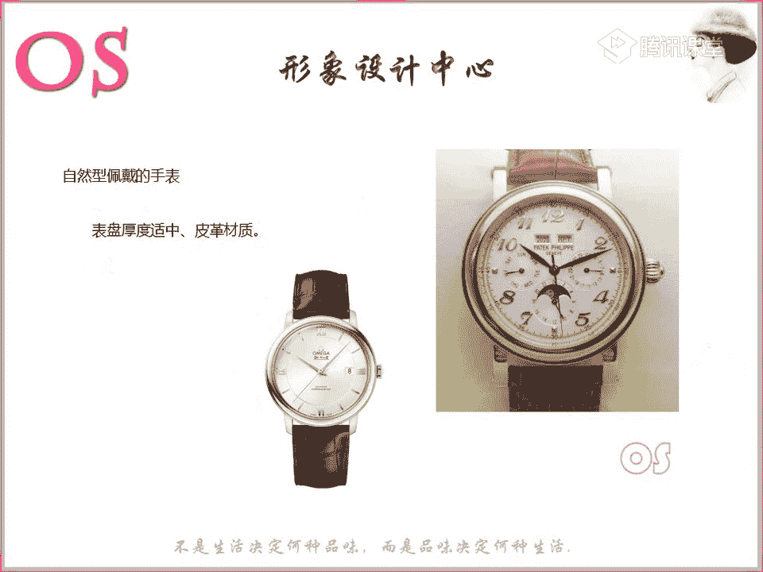

所以说啊我们自古典型的人可以根据你的这样的一个场合去进行这样一个选择。当然，其他风格也是一样的。我们你可以去唉间断就是可以适当的去进行这样一个选择。另外的话呢，古典型的人最好是选择金属链条的表带。

最好是选择金属链条的。

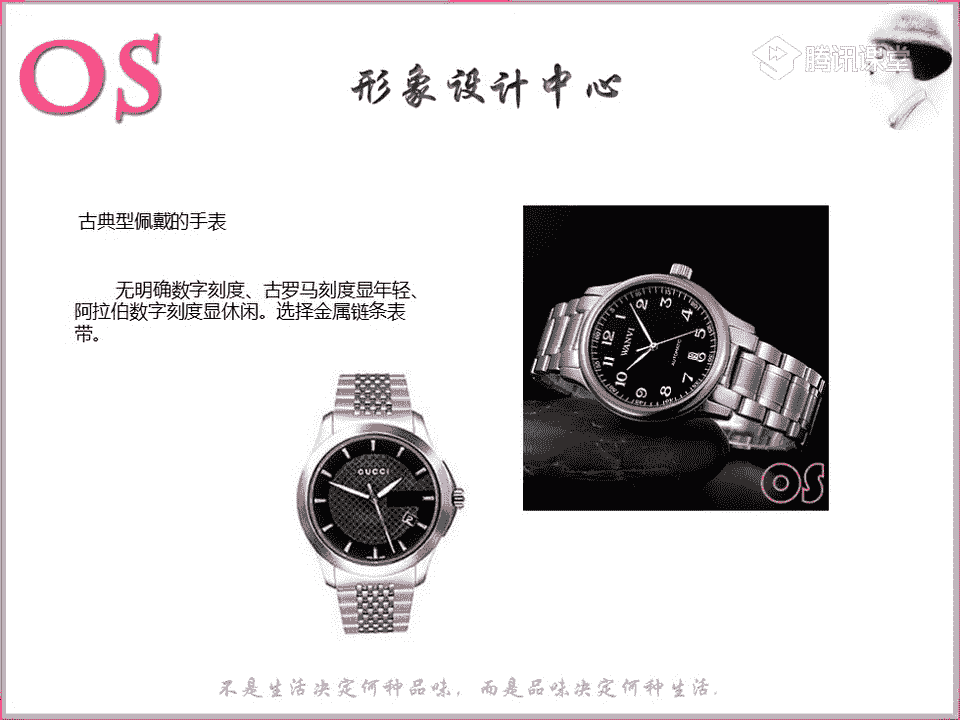

好，下一个就说到我们的前卫风格了。先从前昕锐前卫啊来说起。因为他们俩之间还是有很大的一个区别的。那么如果说是昕锐前卫风格的这样一个男士的话呢，我们在表盘就要选择薄的啊。因为我说了薄的可以带来尖锐感。

对不对？另外的话呢新锐前卫风格，不适合带皮带的这样的一个表带啊，我们尽量去选择，比如说哪怕我是这样的一些塑胶材质的也好，还是说我们这样一些金属啊材质的，也是比较适合它的，不要去选择一些皮带的哦。

因为皮带的这样的一些个性感，还有包括尖锐感，它的一个呃。就这样的一个能力，并不是像我们类似于这样的一个金属的一个尖锐感，那么的强啊，那么的直白。表盘要千万要记得啊，不要去给他们选择太厚的啊。

给自己选择太厚的。好，另外的话呢就是我们下面一个就是阳光前卫型的。那么阳光型卫型，它其实相对于呃我们新锐前卫型，它的尖锐感没有那么的强。所以说呢我们在手表上尽量选择一些个性有趣的手表就可以了。

也就是说手表我们要有时尚度，但是呢也不能够呢太过于尖锐啊，有一定的时尚度就可以了。所以说我们可以呢稍微的中和一点，哎，比我们其他风格要时尚一点，要个性一点，也就是说要有趣一点，要个性一点。

那么比我们的昕锐前卫型呢又相对来说要低调一点，要一定要。能够理解老师所说的这样一个度啊，关于新锐前卫和阳光前卫这两个风格的手表，大家有没有什么呃问题啊？有问题现在可以提出来。如果没有任何问题的话呢。

跟老师扣个一。当然我们像这个图片的话比较嗯比较幼稚一点啊。当然也就是说一个意思就是让大家呢也要理解个性，然后呢有趣。同样呢又好像一个男孩的这样一个感觉。当然我们可以随着年纪啊。

随着年纪可以去适当的进行调节。如果说作为哦我们前卫型的这样一个阳光前卫型的，随着年龄的增长，我们可以适当的去进行选择。因为年龄度的一个增长的话，我们服装上在发生改变，手表上也是一样的。好。

其他同学有没有什么问题哦？还有包括呢唉关于手表整整个所有的手表啊，如果有问题的话，现在提出来没有任何问题的，快速老师呢刷一朵鲜花。所以说总结一下哦，除了我们各个风格，在选择上哦，嗯古典型的再看一下啊。

哎，我们各个风格在选择上面呢，要按照老师刚才所说的这样的一个风格去进行选择以外，我们还可以根据我们的场合啊，根据场合。

那如果说哎如果说我是去工作，我是这样的一个工作场合，我的我必须要穿着一些正装，或者说我穿着半正式的，对不对？这样一个一般职业场合的话，其实手表上我们在佩戴上呢，就可以去选择一些无精确数字的啊，表盘上面。

因为它会带来这样的一个工作中的一个严谨感。那如果说哎我在这样的一些运动休闲场合，那我就可以去佩戴这样的一些阿拉伯数字的这样一个表盘。那如果我想要表现我自己的这样的一些现代啊。

年轻啊哦这样的一些时尚度啊等等的，也可以去选择我们古罗马数字的表盘，可以按照场合去进行调节。也就是为什么说哎我们男士呢可以有多几块手表。女生也是一样的哦，我们其实也是一样的。

女生的手表也是其实同样的这样的一个道理。是的，其实原理是类似的哦，这个原理是类似的。嗯，我们我不知道大家喜欢手表啊，有没有特别喜欢买手表的同学，可以跟老师烧的鲜花哦，喜欢买手表的。😊。

就是可能我有经已经有了一块手表，但是还想下手下一块。然后下手了第2块之后呢，还想下手第3块的哦。😊，那如果说没有手表的同学也可以呢给你增加这样的一个配饰哦。因为非常的出品这样一个配饰。

就是男士就是手表啊，像腰带啊、鞋子啊。好，接着呢我们就看到嗯提高品位啊。是的，嗯，正打算买送礼物啊，很好啊，这个时候我们就可以送到新卡上面啊，所以说包括男士送女生礼物也是一样的嗯。😊，送礼物送女生礼物。

你也可以按照啊。到时候如果说我们在场的男士啊，想要给女朋友或者老婆买手表，你们也可以按照呢哎他的这样的一些场合的需求。还有包括呢唉可以去猜测一下啊，他更适合哪些。嗯，送男士是吧？

那正好老师这堂课就帮助到你了啊。😡。

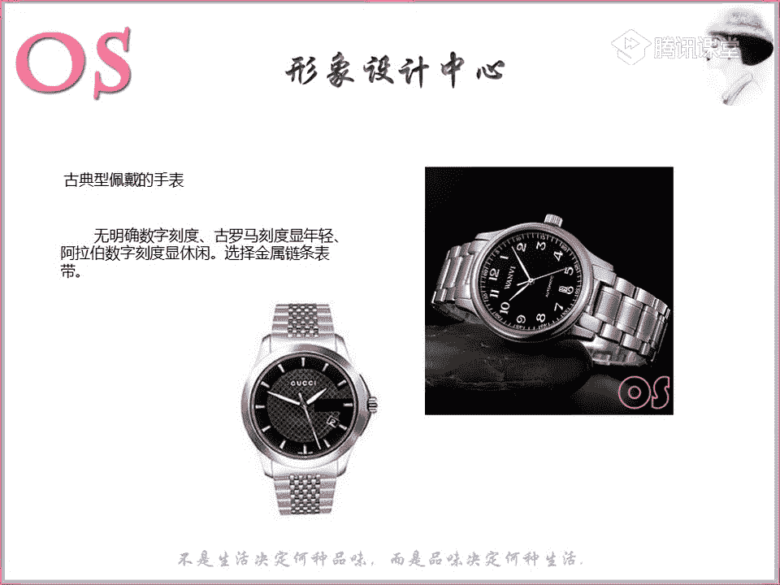

而且但是啊如果说我们是送礼物的话，还是可以去猜测一下他的一个穿衣风格。你可以按照他的穿衣风格去送啊。如果他平时穿休闲装比较多的话啊，比较时尚，比较个性的话，我们再选择手表上也可以往那方面去靠。

这样的这样的话呢，我们根据他的一个内心的喜好去送送的话，可能他会更加的开心啊。因为正好又跟他的穿衣风格又搭搭在一起了。啊，接着呢我们下一节课呢会说到我们配饰的搭配和选择。第二个。第二个的话呢。

我们会讲到我们的饰品啊，会讲到比如说我们的项链啊，还有包括呢我们的手链等等。那这个时候呢，因为哦下节课内容也很多。那我们在这节课呢，首先跟大家来加一个新的内容，就是哦我们上一期没有讲到的。

而这期加在里面的，就是我们男士的一个胸针啊，一直在提醒大家啊，我们可以呢给自己啊哎男士不要觉得胸针，就是我们女性的这样的一个饰品，跟男士是没有关系。但是其实像在2013年的prada的秀。

我不知道大家有没有看过，如果没看过的，你们可以去回顾一下。但是我不太记得是13年的春。

春夏还是说秋冬啊，唉，我们prada的新款的一个男士的一个发布会的话呢，模特穿的在衣服上的一个搭配上都会去佩戴胸针啊，非常非常的好看。嗯，总觉得表看起来还差不多啊，看不出好像，也觉得看来看住就是那样。

其实他们是有很大的一个区别的啊。嗯，包括这堂课我们就看到了这样一个刻度的一个概念，对不对？还有包括表盘的厚薄所带来的不同的这样的一个效果。😊，以及我们这样的一些表带哦。那么像胸针的话呢，要知道。

其实两三枚这样的一些小中小胸针错落排列在一起呢，也会动然会感觉到哎我们有这样的一个妙趣横生的感觉，对不对？衣服上立马就会不一样了。那包括呢其实像男士千万不要小看啊，我们这样的一个小的胸针。

那比如说我们看到佟大伟这一套。

如果说我们我们把这样的一个胸针啊，比如说把这样的一个胸针。稍等啊。我们首先呢看到这里。是有一个胸针的，对不对？如果说我们在选择搭配的时候呢，把这个胸针盖盖住的话呢，其实大家来看一下。

是不会发现特别的平淡无奇，对不对？是不是感觉整身搭配中层次感都降低了。所以说男士也是一样的，要适当的给自己的这样的一个搭配中呢增加一个亮点啊，增加一个亮点。像这样的一个胸针的话呢。

不管是跟西装做搭配也好，还是说我们这样的一些夹克外套，还是说我们唉类似于像我们男士中喜欢有些男士，哎，是不是我只能在这样的一个正式场合中，比如说我跟西装做搭配的时候呢，去选择胸针呢，其实也不是的。哎。

我们如果说选择自己符合自己风格的这样的一些其他的休闲款式的这样的一些外套单品。我们同样也可以去搭配我们的胸胸针啊。就比如说像我们这位小男生唉在左胸附近啊，我们能看到这样的一个胸针吧。

大家应该能够看清楚啊。因为这个水印可能有点遮挡。那么包括呢像我们这一套，唉这样的一个特别有意思的胸针，又会感觉特别的童趣，对不对？所以说放到我们的夹克外套也是可以的那另外的话呢，像毛衣呀。

还有包括呢衬衫也是可以去做搭配的。还有包括呢大衣。那么胸针的种类有很多啊，胸针的种类有很多。那么大家在选择上面呢可以哎根据自己的这样的一个风格。

因为明天呢老师会说到我们不同的风格在啊下一节课啊会讲到不同的风格，在选择配饰上面啊这样的一些饰品上面的这样的一个呃对比。那到时候呢同样的道理，我们先记住啊，我们的胸针的一些搭配。

那么其实选择上面我们可以到时候呢哎跟着下一节课呢，一起来学习之后呢，哎我们在挑选胸针的时候，其实跟挑选项链哪，或者说挑选我们的手链，其实它的道理是一样的。

所以说男士的胸针大家可以看一下老师所找的这样的一些图片啊，有非常的一些童趣的，对不对？哎，比如说我们自行车的啊如果说哎我是这样的一个年轻的啊自然风格，或者说我是前卫风格，我也可以选择类似于这样一个款式。

那如果说我是浪漫风格的，我本身就适合曲线风格的那我在胸针上的选择，我也可以选选择一些曲线图案的对不对？那同样的，如果说我是这样一个戏剧风格的，我就可以选择一些大气的醒目的啊。

然后呢其他风格同样的古典型的，我就选择呢精致一点，然后呢小巧一点啊，显得呢比较的啊精致就可以了。所以说啊大家会发现呢男士在正式场合呢佩戴这样的一些胸针呢会更显得庄重啊。就像我们唉像这样的一些正式场合。

佩戴胸针会更显庄重。我刚才就举了一个例子，对不对？唉，盖住它和没盖住它，其实庄重感其实立马就能够去凸显，而且还能够增加我们整体的礼服啊，或者说我这套西装的这样一个华丽感。其实说到胸针的话。

就不得不提到我们男士的这样的一些。比如说在结婚中我们会用到的，对不对？一般新郎啊，我们在我们这样的一个西装的哦，我们插花眼这里都会去佩戴我们的这样的一个花，对不对？其实花的颜色。

还有包括花的这样的一个质感。我们在如果说以后啊我们作为形象顾问，有有机会接触到。唉，指导新人的这样的一个着装的话，你们也要注意，我们尽量呢花的颜色可以去跟男士的领领带去进行呼应。

或或者是说呢我花的这样的一个材质啊，我们的花的这样的一个材质，也可以去跟我们的西装去做呼应。就像你会发现有一些男士，他们是海边结婚，对不对？海边结婚的话，我们可能会发现哎西装上面的一些选择。

材质上面选择会选择一些麻质感比较强的，相对来说粗糙一点的那同样我们的这样的一个礼花啊，也是胸花的话呢，其实也是一样的，我们就要选择一些啊，比如说像有一些胸花的话，它是属于。我不知道大家有没有见过。

就是像有一有有有点像这样一个呃纸，就是像一个可以说是纸吧，纸质的，或者是说呃草比较偏这样的一个草制的这样一个花朵啊，我不知道大家有没有观察过，其实就是一样的。我衣服粗糙一点。那么我的花如果太过于精致。

或者说太过于有光泽度，其实他们放在一起是不太好看的啊，我不知道老师刚才所说，大家能不能理解，理解同学跟老师扣个一，其实就像我们这样的一个服装的材质是一样的。你看它的肌地感是很强的，对不对？

所以说它的胸针呢也会去搭配相对来说休闲感粗糙感比较强。那如果说把刘昊然这样的一个镶钻的啊，镶钻的胸针搭在这件衣服上，其实肯定效果会没有那么的好。😡，好嗯，男左女右妈啊胸针。嗯。

其实有一个说法就是说哎男士呢要佩戴在左边，或者说女士要佩戴在右边哦。那其实哦现在随着我们这样的一个发展的话，嗯，你们也可以去按照这样的一个方法。但是。可以很随意啊，你们可以随随意去做选择。

其实男士有时候也可以戴右边的，不一定说非要带左边。也就是说，如果说我搭配一些休闲装的时候，我就可以把胸针移到右边去做搭配。那如果说我是跟正装做搭配的时候呢，尽量就要放到左左边啊。😡。

那么除了呃我们说到胸针以外呢，在这里提一下我们的口袋巾哦，口袋襟也是一样的。男士以后我们在做选择做搭配的时候，其实如果说我们不管是在一般职业场合也好。

还是说我在休闲场合喜欢唉去做搭配做穿搭这样的一个上半身正式下半身休闲，对不对？也是一样的。我们其实男士不要去忽略掉我们西装的这样的一个口袋哦，其实还是要需要运用到口袋襟去点缀的。因为你也会发现呢。

哎我们这样的一个口袋襟的话，立马哦整身的这样的一个西装的整体的一个感觉就会不一样。所以说有一些男士也是同样的，我们也不要觉得呢哎我佩戴的口袋巾，是不是我再带个胸针就会呃比较的麻烦或者是复杂，不会哦。

同样是可以这样的去进行呼应的。好，其实口袋金的叠法非常的简单哦，你们也可以百度搜一下。所以说老师呃在这一期就没有去讲到，像有一些口袋金就是对折之后呢，把它放进去就可以了啊，把它稍微呢拉高一点点。

那还有就是像我们的一个三角，把它对折成三角，然后放进去，对不对？😊，尤其是在搭配这样的一个休闲西装的时候，就可以更加的随意了。好，关于胸针老大有没有什么问题？关于胸针上面有什么问题啊？好。

这节课也是上的比较快哦。😊，所以说你你会发现啊不要觉得男士就很简单啊。其实你像女生用到的一些配饰，我们男生其实如果也是呃可以去。背一点的对不对？嗯，可以去背一点啊，这个比较好看，是不是嗯？

所以说大家可以去拿手想象一下，或者说你直接就把这个布料啊。😡，把它截下来之后呢，可以想象一下没有和有的这样的一个区别，对不对？所以说就完全是不一样的，非常的出品，真的非常的出品，就是一个小的一个点缀。

比你全身搭配的非常的出彩，还要强。好，我们来看到作业啊，作业就是还是班训以及呢把笔记一定要做好，然后呢找出自己所适合的这样的一个三类配饰啊。也就是刚才呃我所讲到的呃，我们这样的一个手表。

还有包括呢我们所适合的这个帽子，然后呢还有包括围巾啊，其实重点的话，帽子不重要哦，你们可以呢不找帽子，因为没关系，帽子很好找，可以不用找，但是一定要把这样一个围巾，还有包括呢我们这样的一个手表要找出来。

那么手表在找的时候呢，除了可以完完全全啊，哎按照我老师刚才所布置的，就是哎我们是自然风格的，我就找这样一个表盘适度哦厚度适中的皮革材质的。你们除了也可以跟自己呢稍微增加一个点，就是哎我是自然风格的。

然后呢我在职业场合，我选择这一款。哎，我在休闲场合我可以选择这一款，我在运动场合可以选择哪一款啊，也可以这样去找三款。帽子可以不用找，然后胸针的话暂时不要求大家找啊。

因为其实就是要理解这样的一个搭配的一个概念啊。好，大家还有没有什么问题啊？关于我们这样的一个作业，还有包括本节课的这样的一个内容啊。大家还有没有问题啊？没有问题的话呢，我们就可以下课了。好。

那我们就下课吧，也是非常感谢大家哦。😊，的聆听和陪伴。嗯，然后我们下一节课呢继续来讲我们的配饰的搭配和选择。

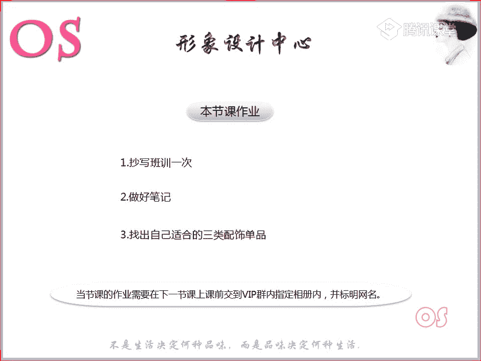