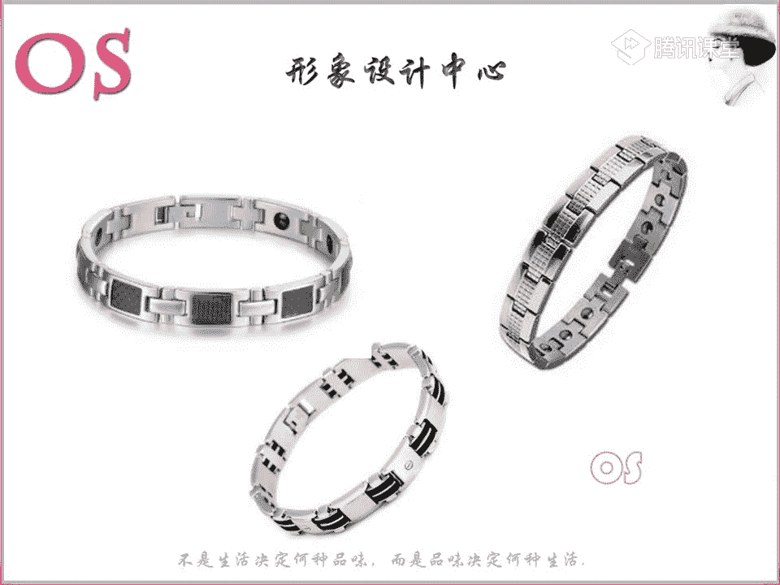

# 1、03OS男士形象VIP班《形象课》：第9节、配饰的搭配技巧（二）

好，欢迎大家来到我们OS男士班的VIP课程，我是本节课的主讲老师舒阳。😊，好，今天要跟大家分享的知识呢，就是关于我们第九节的配饰的搭配选择。2。那么在今天这堂课程中呢，我们还会继续讲到我们的配饰啊。

那么唉检查了一下大家上一节课的作业啊，我发现交了作业的几位同学做的都非常好，只是说唉有一些小细节上呢，我们要去多去看一看杂志啊，也多去观呃观察一下这样的一些呃流行趋势。

包括呢多去看一看这样的一些时装周的所发布的这样的一些新品。其实对于自己的一个审美会有很大的一个提升啊。然后没有交作业的同学呢，一定要尽快的把作业补交上来哦。因为你们如果说一旦不交作业的话。

很多问题老师是没办法直接点出来的。那么只有呢你们在交作业的过程中，我们我才能够真正的看出你们哪些方面还没有真正的去领悟到，才能够及时的去对大家进行这样的一个纠正。

那么呢我们今天要跟大家讲到的这样的一个呃配饰，就有我们的项链，还有项链里面会涉及到我们这样的一些耳环呃，这样的一些戒指啊，或者说手链啊等等的，这个是相通的哦，会以我们不同风格去跟大家来讲解。

那第二个呢会说到我们的皮带的分类，以及呢选择。第三个还有包括我们的包包的一个选择。在不同场合中，我们应该怎么样去选择适合自己的包包。那么本节课对大家的一个要求就是熟知以上呢老师所要讲到的这三大点。

啊准备好的同学呢快速跟老师刷朵鲜花，我们就开始今天的一个课程了。好，我们首先呢看到我们的项链啊，项链的话呢，长短这一点呢还是要跟大家来提一下啊。我们有的同学可能不太清楚啊。

我们的脖子的一个长短的一个判断啊，在这里呢老师首先跟大家来讲一讲脖子长短的一个判断。那么其实女生和男生是一样的。我们每个人的脸长都不一。那么脖子长度它也会有一些因为每个人的不同啊。

会有细微的这样的一些差异。所以说呢首先我们要测量的就是我们的脸长啊，脸长呢是从我们这样的一个发际线啊，从我们的发际线到我们的这样的一个下巴间是属于我们的一个脸长，脸长测完之后呢。

这个时候我们再来观察一下自己的脖子，也就是说呢你把头稍微抬抬起来一点啊，让别人来帮一下啊，稍微帮忙一点，就是只要微微的抬就可以了。让别人好测量就可以了啊。

然后呢从我们这样的一个头部和脖子衔接的这样的一个位置啊，老师属。的一个位置，然后一直呢测量到我们的锁骨头，这个就是我们的一个脖子的一个长度。那么正常的脖颈呢是等于脸长的2分之1。

所以说如果说你的脖子的长度是等于你自身脸长的2分之1的话，那么其实在选择项链的时候呢，我们就不用去顾忌太多。你们可以随着你自己的喜好呢哎长短这样的去选择。

那如果说你的脖子短于啊短于你的脸长的2分之1的话，那么我们的脖子呢就是属于偏短的。那么这个时候呢，我们在选择项链的时候啊，各位男士我们就要选择稍微长一点的。

比如说呢唉长度在啊20往22往下去走这样的一个长度会更好。千万不要去选择一些太短的项链啊，或者说像这样的一些锁骨链。那么如果说你的脸过长啊，你的脖子过长，也就是说你的脖子的一个长度呢。

脖颈长度大于脸长的2分之1。那么我们的脖子偏长。那么这个时候呢选择项链就一定要往短的去走啊，不要说哎选择太长，比如说26啊20。8太长的这样的一个长度是不太适合我们作为呢脖子过长的男士去做选择的。

那这个点能不能明白啊？然后呢，关于这样的一个测量啊，我们在场的两位同学如果说听懂了的话呢，就跟老师扣个一啊。如果还有哪个点没有听清楚，老师就再重复一遍啊。好，这个这个其实在女生里面也是一样的。嗯，好。

那我们就接着来看啊，接着来看下一个，这个就是我们的项链的一个长度。另外的话呢唉项链的一个搭配的话呢，我们如果说搭配这样的一个休闲装穿是可以使唉用用这样的一个长短不同的叠代的一个方法。

也就是说唉我们各位男士可以选择呢这样的一个叠代的方法，既可以呢修饰我们的脖子的一个粗的问题。因为一般哦。各位男士的脖颈一般都是很粗的，对不对？你就像我们男性的一个代表，比如说宋成宪去看观察一下。

你像他早期的时候，尤其头发剪的短的时候，就显得他的脸宽，跟他的脖子是一样宽的。那么这个时候呢哎如果有这样方面的一些困扰的男男士的话啊，我们也可以呢选择这样的一个叠代的一个方法。另外的话呢。

唉不仅仅可以修饰你的脖子粗的问题，还可以呢让我们的休闲装在穿搭中呢更显这样的一个层次感啊。好，那接着呢在这里看到这句话哦，我老师接下来呢就会跟大家来说到我们不同风格，在选择配饰上这样的一些区别。

那么各个风格呢唉项链也好，手链也好，戒指也好，其实呢大致是一样的啊。当然我也会在下图中呢去展现这样的一些手链或者说戒指。但是呢其实只要我们抓住每一个风格，在选择配饰上的这样的一些关键词重点。

那么其实不管它在选择任何的一些配饰啊，其实都是一样的。好，接着我们就来看重点啊，大家呢呃关于我们这样的一些嗯很多很多男士都不太喜欢戴配饰啊。是的啊，很多男士都不太喜欢戴配饰。

但是呢今天这堂课就是要跟大家来讲一讲啊，那我们也可以等到老师最后的话呢，会给你们看到这样的一些照片啊，其实就是告诉你们配饰给我们男士的整体装扮针中增加了很多，对不对？那我们上一节课有讲到帽子。

也有讲到我们这样的一些胸针啊，还有讲到我们其他的这样类似的这样的一些配饰。那所以说今天这堂课呢在结合我们的包，结合我们这样的一个项链等等。我们可以看到，其实在各个街拍中也好。

还者是还是说包括我们明星的一些私服啊，照片也好，你会发现他们无时无刻不是单单在讲这样的一个穿衣，对不对？穿自己适合的这样一个风格。其实每一个细节，他们都有去注意啊。

因为这样的一些细节是非常出品的大家可以想象一下。我们先来看这样的一个照片啊，如果说没有墨墨镜，也没有帽子，或者是说哎我也看不到他的一些围巾也好，还有包括他的这样的一些包包，还有包括他们的啊项链手表等等。

其实你会发现服装中会过于的单调，对不对？而我们这样的一些配饰的话，一些小细节，其实都是在跟整个啊我们去提升自己的一个时尚感，提升自己的一个品质感啊。大家可以看到类似于这样的一套，对不对？啊。

如果因为一般我们男士的话，如果穿唉，就算我很注重呃这样的一个品质感，一般穿成这个样子也非常的不错了。但是你会发现整身中只是说穿的非常的时尚而得体而已啊，但是没有太多的一些亮点。

那么不妨呢哎我们去增加一个亮点。就像我们同样都是大衣哎，去配这样的一个针织衫，我们左图和右图中大家有没有看出有什么样的一个差异啊，有没有看出哪一个亮点，看出来同学可以跟老师扣个一呃，把答案打在公台上啊。

同样都是大衣要去做这样一个搭配，搭配我们的九分裤，同样也是类似于这样的一个皮鞋。但是你会发现哎左右图中它其实可能在颜色上当然会有一些区别。但是我们不看颜色的话，它会有一个小细节是非常吸引眼球的。

而且也能够感觉到好像右图中的男士。如果说一定要我从这两位男士中去选择唉一个时尚度的话，我一定是会去选择右图中的。啊，我们同有同学说到袜子啊，是的，其实就是袜子，对不对？哎，我们就是一个亮点。

所以说整身中啊，我不仅仅可以利用色彩上哎有一件大衣的颜色跟我整身中去增加这样一个大的亮点也好。哎，如果我喜欢低调点。老师我喜欢这样的一些呃深沉一点的色色彩，我喜欢穿的比较简单一点。那我不喜欢太过于高调。

但是你也不能够哎完全那么的低调哦，那我们可以呢在一些小物件上面去增加这样的一个品质感。我带一个胸针，或者是说哎我带我带一个项链，我把袜子的颜色出彩一点，其实都是这样的一个细节。所以说我们要试着去改变。

不要觉得这样的一些小配件非常的啰嗦，或者是说哎不适合呃觉得很麻烦哦，我觉得很娘等等的，不是这样的哦，要去改变自己的这样的一个观念。好，我们接着来呢来看到各风格的一个视品的一个选择。

那在老师讲到各风格这样的一个视频的时候，如果大家有任何问题啊，一定要提出来。那其实呢给大家看这么多的一些照片，图片的话呢，其实就是让大家去对于我们这样的一个风格提升这个印象啊。

你要从老师所找的这样的一些图片中一定要读懂你自己要读懂这样的一个关键词。这样的话呢，以后我们不管作为顾问也好，还是说我作为哎我要改变自己形象的这样的一些学员，对不对？我们拿到这样一个视频。

我就知道他适不适合我。也就是说结合你自己呃起爱爱好的这个同时，还要去对于你的风格去进行这样的一个嗯调整哦。好，接着我们来看到啊第一个就是戏剧风格。那么戏剧风格呢。

我们看到这样的一个呃看到这样的一个配饰啊，我们的这样的一个项链啊，大家能够看出来对不对？啊，老师其实关键词也打在了这个工台上啊。哎，所以说戏剧风格的人呢。

我们一定要去选择一些醒目的装饰感强的这样的一个饰品。那其实我们从这样的一个饰品中呢，你会发现唉，醒目，对不对？非常的醒目，而且非常的大气。而且呢它这样的一个装饰性感也非常的强。装饰性非常强。

所以说而且还有一个呢你也会发现相当的呃粗犷，其实粗犷跟大气其实就是一个概念啊，选择适当的粗犷一点的，哎，或者说一定要选择摩登夸张的。这是老师是举的这样的一个典型的。当然你们可以呢随着个人的爱好。

老师我是戏剧型的，但是我可以随着我这样的一个爱好呢哎进行适当的调整也是可以的。但是总而言之呢，你的配饰呢不能过于的小气。同样呢你也要有这样的一个夸张的成分啊，而且呢一定要醒目。

这是这是两个非常关键的一个呢就是摩登一个就是醒目，这是非常关键的这样一个关键词，也就是说戏剧风格的人还是不能够去缺乏这样的一个时尚感，不能够去跟摩登呃脱轨，他跟自然形是不一样的。我们自然型他追求的。

他不用去选择刻意的，对不对？它适合就是天然去雕饰的，但是戏剧型的人，他反而你可以呢去强调一些公益感。😊，好，包括我们的戒指和手链也是一样的啊。所以说唉如果说我们作为呃各位男士啊，你们想要买戒指也好。

还是说买手链也好，也是按照呢刚才我们在讲项链的同时啊一样的这样的一个道理。所以说细致型的人戴项链也好，戴手链也好，他也可以去带一些重复的呃夸张的这样的一些手链，或者说项链啊，它可以去叠戴啊。

包括我们的项链也可以去叠戴，甚至戒指，它也可以去进行叠戴啊。好，大家对于戏剧型，如果说还有什么问题啊，就要提出来。没有问题的话呢，老师就按着我们这样的一个节奏啊，继续往下面走。好。

接着呢我们就来看到我们的自然风格啊。自然风格呢在选择我们这样的一个呃造型上呢可以一定是要简单的啊。但是呢不是说简单，就是不时尚，或者说啊这样的呃过于的土啊。而且因为我在上一期的学院中。

我会发现呢有些同学在找找这样的一个自然风格的饰品的时候呢，就是会我会发现对是相当的呃这样的一个天天然去雕饰的一个感觉。但是会不够时尚，其实每就算是我们自然风格也是可以很时尚的啊。

只是说我们自然风格人在选择造型上呢要简单，它不要太过于复杂太多，或者说这样的一个装饰性太强，或者说这样的一个呃工艺感太过于明显。他反而是适合这样的一些手工艺品的啊。这个大家能不能理解。

理解同学跟老师扣个一啊。它不是说比如说唉我们同样是一个手镯，我可能是用机器打磨，打的非常的光亮，很锃很锃亮的那种感觉。但是有一个手镯的话，它可能是我们这样的一个手工的。

所以说你会发现它的光泽度并不那么够，而且它的精细感也那不是那么的强。但是两个可能形状都是一致的。反而我们自然型的人就适合呢去选择后者哦，所以说一定要去把这个自然型在选择物品上一定要去懂得哦。

不要跟时尚界去脱轨哦，不是说自然型的人就是选择呃很土啊，或者说哎就完完全全，我会发现上一期有同学交作业，就是呃有一点哦不够时尚。所以说我们还是要保持啊。好，我们接接着再继续啊。

然后呢就是带有这样的一些异国风情的事物啊，它会穿起来也很好看啊。尤其是我们如果说是自然型的风格还偏大的，有点抑于自然的。那么你带异国风情的类似于这样的一些事物是非常非常好看的。

所以说呢我们自然型的人呢总总结起来就是要造型要简洁要大方。然后呢，比如说这样的一些天然的哦，唉皮质的这样的一些天然的唉手工的、柔软舒适的哦等等。也就是说造型一定要简单，不可以太过于复杂。好。

这个就是我们自然形的项链啊，包括手链，戒指其实也是一样的啊，戒指也是一样的。好，接着就能看到我们的古典风格。那么古典风格呢在选择我们的呃配饰上呢，项链手链上啊，戒指上要选择精致的。

要要有高贵感的这样的一个饰物啊。而且呢大小要适中，因为古典型在我们所有的男士的风格中呢，它的量感是居中的啊，它的量感是居中的，所以说它带的物件也是一样的。我们选择大小适中就可以了。

也不可以太过于大太粗糙哦，太狂呃，这样的一个粗犷，或者说太过于小气啊，它可以就类似于这样的一些居中的，有一定的存在感，但是存在感不用太强。另外的话呢，我们整个的这样的一个事物呢一定要精致啊。

也就是说哎像我刚才举的那个例子，那么我们如果作为古典风格的话呢，就要选择前者啊，就要选择这样的一个前者。所以说它的做工是一定要很考究的哦，一定要上乘的。精致的有高贵感的这样的一个事物。

所以说你会发现古典型的人呃用贵的东西啊就非常的好。所以说我们经常笑古典型是一个非常花钱的这样的一个风格哦。因为他穿不了次的，穿不了叉的，一穿叉的的话呢，就非常的不合适。你们包括以后啊。

我们我发现今天到课同学都是以后。呃，形象顾问般的对不对？你们以后呢作为顾问嗯。作为顾问的时候呢，包括你们遇到男士啊，你会你去对比一下，你会发现尤其是像古典型的男士穿这种圆领的T恤啊啊特别特别的明显。

跟其他风格一做对比。而且呢如果说他的圆领T恤下面还搭配了一个啊我们这样的一个牛仔裤的话啊，那就更加的更加的显得非常的俗气啊，而且呢非常的没有气场啊，一点都不显得他很有这样的一个精神。

所以这个就是我们古典型的人，他真的是穿不了一点点眉型的东西啊，他可以可能这件T恤也很贵。但是如果说这件T恤没型的话啊，穿到他身上也是非常完蛋的。所以说我经常说的就是古典型的人是所有男士中呢。

我会发现他穿正装是穿的最好看的。

嗯，女生啊女士也是一样的。好，我们下一个呢就说到我们的浪漫风格啊，浪漫风格。好，浪漫风格呢在选择我们这样的一些首饰中呢要选择这样的一些夸张的。同样它跟戏剧型呢有一个共通点。

因为它也是属于这样的一个大的风格。所以说事物上呢也要选择夸张的。但是呢他跟我们的戏剧型有一个区别，就是它适合这样的一个华贵感的华丽的这样的一个事物啊，华丽的。所以说呢哎我们在选择呃这样的一个事物。

就是夸张选，然后呢华丽，这是两个非常关键的词。而且呢他可以选择中性的饰品。也就是说可能你会发现这样的一个饰品。就比如说像这个项链，哎，老师我觉得好像女生也可以戴哦。是的。

所以说就像这样的一个中性事事物啊。比如说你像我们的冯绍峰，他也是一个浪漫风格的。如果你放到其他男明星去戴类似于这样的一个配饰的话，一定是你会发现哎怎么显得那么的娘或者是怎么样。但是你会他戴起来。

你就会发现觉得还刚刚好，对不对？呃，不会有这样的一个。娘炮的这样的一个视觉印象啊。所以说呢我们浪漫风格的要选择夸华华丽的。另外的话呢，事物上我们可以去选择一些中性。

感强一点的没关系。好，尖锐的事物也适合吗？啊，然后呢我们浪漫型的人其实不太适合尖锐的事物。为什么会把这一个放到这里呢？是因为这个事物的大小还算是比较夸张，对不对？

另外的话你会发现色彩上面它会有一个红色这样一个点缀，整体而言呢，它不是像完全的就是完全就归纳为给它给前卫会比较好。也就是说这这个项链的话，即使是我们这样的一个浪漫风格也好，还是我们的前卫风格也好。

其实它都可以去佩戴哦。因为物品的大和小，还有包括呢唉整体的这样的一个视觉感啊，还是有一定的曲线感的，对不对？好，接着我们就来看看我们的前卫风格啊。啊。

前卫风格呢还是要先说到我们偏尖锐感强一点的这样的一个新锐前卫。那么新锐前卫呢造型呢它一定要够怪异。然后呢，可以很酷啊，也就是刚才我们向日葵说到的尖锐，对，他可以去戴哦。

然后呢包括呢我们这样的一些酷的时尚感强的事物都是适合饰品都是适合他的。那么其实呢我们举几个明星，你像我们的吴亦凡，还有包括呢像权志龙，哎，你多去观察一下他们的事物啊。

他们的饰品呢其实典型的就是非常适合我们这样的一个新锐前卫风格的人去佩戴的。这个都是啊。这个新锐前卫也可以去佩戴，嗯，就有的事物的话，它是它不单单是完全可以归纳到某一种啊固定的风格。

它其实可以呢进行综合的去考虑啊，可以进行综合的考虑。就比如说你像嗯卡地亚的那个戒指啊，男士款的对不对？很宽很大哦？那如果说是我系是我们这样的一个呃我们的。戏剧风格它其实也可以也可以进行这样的一个佩戴。

那么呢如果说哎我作为我们这样的一个前卫风格的人，其实也偶尔可以去进行这样的一个佩戴哦。嗯，老师笔记放笔记哪里再放一下哦，笔记哪里。是新锐前卫风格是吧？所以说给他们去选择一些时尚感强的。

但是量感不要去选择过大的啊，嗯，量感不要太大适中就好了。权志龙就是一个典型的我们的这样的一个呃现现在啊现在来说一个新锐前卫风格的一个典型的一个代表代表人物。好，接下来呢就是我们的阳光前卫风格。

比如说像何炅啊啊这样的风格类似，还有包括像我们的阿牛啊等等啊，那还有包括呢还举个例子吧，像林志颖他也是阳光前卫风格的啊。所以说你会发现阳光前卫风格人还蛮显小的，对不对？因为他们的量感就偏小啊，就偏年轻。

长得就偏年轻。啊，那我们在选择造型上呢也要选择时尚的而独出独出心裁的这样的一个饰品。那么当然他的尖锐感就要比我们新锐前卫型的要弱一点。那同样的也不乏这样的一个时尚度，那不乏这样个年轻感。

所以说包括刚才老师举例的说的这样的一些明星，你们如果说哎有可以利用课余的时间呢，也多去观察一下他们的这样的一些长相啊。对于我们以后到了顾问课程之后啊，学习这样的一个风格会一定有很大的一个帮助的。好。

关于我们的这样的一个事物啊，事物视频类的，还有没有什么不懂的，没有任何问题的话呢，就跟老师扣个一。好，接下来我们呢就看到皮带的搭配和选择。那么在古时候呢，唉我们男人的腰带啊。

以及呢腰带上的一个挂物呢是身份阶级的这样的一个象征。而我们的现代人的一个皮带的取了实力功能外，也是我们男士必备的这样的一个装饰物件。那么像皮带的话呢，作为皮制品的典型之作，有这样的一个诸葛的，对不对？

还有我们羊皮牛皮的羊皮的鳄鱼皮的，以及我们这样的一些帆布，或者说纤维制造的类似于我们图中啊。那么鳄鱼皮的和我们的牛皮呢一般是高端品牌皮带的这样的一个制作原料。而我们这样的一个帆布的等材料。

也是我们时尚元素颇为丰富的这样的一个适宜的一个选择。比如说在休闲场合，我们就其实可以呢选择这样的一个帆布等材料。而且我们很多男士的话，尤其是搭配休闲服装的时候更偏爱这类型的，对不对？

这样材质的这样的一个皮带啊，那商业男士最重要的呢，其实它的一个配饰也莫过于我们这样的个皮带，在我们这样的一个职业场合，男士的皮带也是非常重要的。哎而且呢像这样的一个皮带。如果说我们搭配正装去穿着的话呢。

它也是一个点睛之笔啊，因为非常的显得我们这样的一个自身的整个的一个气派气度啊。所以说腰带的一个选择是非常非常重要的那我们呢接着来看看在穿着西装的时候呢，我们要注意的一个点。如果说拿我们西装做搭配的时候。

腰带呢，我们要选择这样的一个没有明显logo标志的皮带扣啊。唉比如说有的皮带也是扣子的啊。比如说像我们的guci啊，或者说像我们的耀薇啊，它的logo就是太过于明显了。

其实不适合跟我们这样的一个正装去做搭配啊。你如果说在休闲场合去穿着的话呢，还好一点。哎，但是跟正装做搭配的话，这一点是一定要去严谨，要一定要去注意的哦。尽量选择类似这样一个简单的一个款式。

其实呃既能够去提升质感，而且呢也不会给人造成了不太好的这样的一个视觉感受。那么皮带颜色呢也要跟我们的皮鞋的花色保持一致。也就是说你的皮鞋是黑色的，我们的腰带就要跟它去做搭配呢，我们这样一个黑色。

这一点在休闲或者说半正式服装中也是通用的哦，也就是说我们男士在休闲场合把我们的腰带和我们的皮鞋看到没有？哎，搭配一致，也是有用处的哦，而且呢它在视觉上也可以帮助我们的男士呢显得高，它有显高的效果。

同样有显高的一个效果。那另外的话呢跟大家说三种颜色，第一个呢就是我们的黑色唉，一定要有三款这样的三种颜色的一个皮带。第一个呢是黑色，黑色可以去搭配我们的正式西装，这是首选，那么棕色系的皮带呢。

我们可以去跟休闲类的百搭，对不对？然后如果说你一定想要有一些特色一点的。那么你也可以根据你自己的喜好呢，去选择一款你喜欢的颜色，比如说像蓝色系呢，就是一个非常不错的一个选择哦。而且呢像蓝色系。

它也是非常的百搭。如果说哎我们的色彩的一个纯度稍微降低一点的话呢，更更是了啊。大家可以看到，类似于啊跟西装做搭配的时候，就尽量选择黑色。那么在休闲场合的话呢，棕色系的啊。黑色系的也是可以的了。

搭配我们的休闲装啊，包括我像我们这样的一个蓝色系的，是不是也非常的好看。那总而言之呢，就是一定要注意我们的皮带扣啊，跟大家推荐一下，如果说我们一定哎要去选择一款呢品牌的皮带的话，我觉得最好的选择。

就是比如说像for伽姆啊，图一和图二呢，就是for伽姆的，包括像我们BV的这一款也是可以的。因为相对来说会比较低调啊。你会发现它没有明显的这样的一个logo的标志。而且一般你像这样的一个锁头啊。

呃懂得品牌的人都会知道你这个是佛伽姆的，但是相对来说它不会像LV或者说像爱马仕像gu奇那么的张扬，对不对？比较的低调。所以说腰带上面我们男士不用去不要把一些logo全部都穿在身上啊。啊。

可以打一下名字吗？哦，嗯，等我们下课了吧，等下课了，老师把这样的一个全称的英文名啊打过来，好吧。打在我们的群里面，到时候打在群里面嗯。好，这个就是跟大家推荐的。因为你像佛伽姆的话呢。

它的椰子和它的皮具是做的非常好的。嗯，它而且呢它是做皮具出家呃，出呃就是出生的，可以这样说，所以说它的皮具做的非常的好。那么我们可以去选择啊，类似于这样的嗯。上面就有logo作为皮带扣哦。是的哦。

LV是吧？然后呢，像这个BV，我们简称BV哦，那它呢就是其实它没有没有什么标志，它的标志就是这样的一个小羊皮的拼拼接，包括它的包包也好，鞋子也好，还有包括它的皮带等等的。

它的最大的一个特点就是它是这样的一个啊拼接的。嗯，编织的。它最大特色就是编织。而且它用的材质的话一般都是小羊皮。所以说非常的软啊，也非常有质感。唉，包括像我所以说建议我们各位男士啊。

尽量呢在选择皮带上呢选择啊我们这样的一个带打扣眼的，不要去选择啊，包括我们有的锁头是这种四四方方的锁头哦，老师不知道该怎么样去称呼，就是直接就是一扣住，然后就可以了。然后呢，我们要解开，就把它抬起来。

对不对？就可以解开的，不要去选择类似于那种，因为不太不太出品，那种不太出品，我们尽量选择类似于这种款式的。对，所以说像LV这种明显logo作为皮带扣的就是太过于高调了啊。如果说我们在休闲场合呃。

偶尔去搭配是没有任何问题。但是在职业场合的话是千万不要不要去这样去选择。而且的话你也会发现其实嗯而且你会发现在生活中的话，呃，去明显搭配LV这种logo标志的皮带的扣啊，其实不太好看，对不对？搭在一起。

就像土豪一样啊，像就像我们这样的一些爆发户的这样一个感觉。嗯，黑棕蓝是比较百搭的吗？是的啊，这这三个颜色是比较百搭的。总而言之是比较百搭。当然我们男士可以随着个人的爱好，你也可以去改变这样的一个色彩。

但是呢一定要注重好啊这样的一个点。也就是说，当你的整身中色彩比较低调的时候，你可以去选择一款啊亮一点的要皮带呢去点缀。但是啊如果说你不想去纠结那么多。你想要百搭的话，那么像黑棕蓝是非常非常百搭的。

而且也非常的保险。好，这个就是我们提带的哦这样的一个知识。所以说皮带的选择呢注重要的就是刚才要注意啊，我们这样的一个场合，在职业场合尽量选择黑色的。那么在休闲场合就随意了啊。

那如果说呢像这样的一个啊这样的一个类似于我们嗯这样的一个材料的，也建议呢在休闲场合去穿着帆布材料的。不要把它呢记到我们的职业场合啊。好，接着我们就看到来看到我们的包啊，包的话呢。

也是跟我们的按照我们的场合去做选择。男士的话呢，就不强调我们这样的一个包包啊风格了，风格的话呢，等到我们上道风格的一个材质等等的一些认知的时候呢，你们其实结合那样的一个知识点去选择包。

也是没有任何的一个错误的，也就是说可以把服装和包去结合起来。也就是说你选择类似于就像自然风格的，它适合肌理感强的。那么我的包包上呢我也可以去选择唉，类似于这样的一个款式，对不对？

这样的一个材质就比较适合自然型的。那我如果说我是古典型的，我就肯定要选择精细一点的，对不对？浪漫型的，我就要选择整个的这样的一个款型，要有华贵，或者说要精致等等啊，这个就是一样的道理啊。

那我们接着呢看到我们的包哦，先从我们的双肩包说起啊，而且呢像近几年呢呃我们各大品牌都有去推出这样的一个双肩包哦，而且很多男明星呀，而且非常啊非常多的一些街拍中呢都会看到他的一个身影。

所以说呢而且像这样的一个双肩包，它的一个时尚性也好，它的一个功能性也好，都越来越强大了。所以说现在是我们很多男士的一个最最大的一个爱好，你就会发因为很多男生都很喜欢双肩包，对不对？

但是呢唉你又会发现像以往这样的一些双肩包，它会缺乏这样的一个时尚度。但是现在的话哦你会发双肩包既时尚又功能性又非常的强。那所以说不论是搭配我们的正装还是休闲装，它都能够呢提升我们整体造型的一个时髦度。

而且呢加上轻便易携带的这样的一个超强的一个实用性。所以说双肩包绝对是值得拥有的啊。而且我们其实各位男士其实跟我们的。女生也是一样的，女生爱买包，对不对？我们在场的。几位同学中哦。

喜欢买包的同学可以跟老师扣个一。其实女生非常喜欢买包啊，有没有发现鞋子包真的是女生的这样的一个最爱啊。有可能我有我在我已经各个款式的都有了几只了，但是呢还是觉得不够看到自己喜欢的还是会买哦。

像手拿包啊、双肩包啊等等啊。其实男生其实也是一样的啊。如果有这样的一个经济条件的话呢，其实接下来老师所讲到的这样的一些类别的包，你们也可以呢备一点。好，衣服鞋子包小饰啊包啊小饰品。是的。好。

我们来看到各个场合。首先呢就看到我们的职业场合啊，职业场合在选择双肩包的时候呢，哎你们看到图中的这两款是在职业场合可以去搭配的。那么你们看到这样的一个包，你们有想到什么样的一些词吗？

有没有想到什么样的一个词啊，有有没有一些关键词有提醒到你，嗯，大家可以呢打在公台上哦？这两款包也就是说你们去看他们的一些共同点啊，给你的感受啊，给你什么样的一个感受。嗯，工作的啊当然是在工作中去。

选择的哦适合在工出现在我们的工作场合。但是你会发现这两款包它们有什么样的一个呃关键词，可以把关键词呢。大胆的写在工台上啊。好，有点像书包啊，双肩包基本上都是哦嗯。好，严肃。可以啊，非常好。

其实呢你会发现它的整个的包型上面是不是非常非常的感觉哦非常的挺括，对不对？包型上是你会发现棱棱角角好像很分明。而且整个包是很立体的，不是那种软塌塌的，软趴趴的，没有型的，对不对？啊，整个的包型上是对。

是的啊，方方正正的这样的一个感受。对，另外的话呢很简约，它不会有很复杂的。比如说哎这里有一个拉链的设计，那里有一个啊这样的一个啊暗扣啊等等的。它不会有很多复杂的设计，非常的简约是的。

这个这样的一个包呢就非常适合在职业场合去选择。如果说我们各位男士我会发现老师我觉得选单肩包也好，选择我们的手拿包也好，哎，可能我觉得太不方便了。我其实就想背个书包，背个双肩包。

那我们就要再选择双肩包上面就要选择类似于我们刚才的同学说到的严肃的，简约的方方。正正的啊，整个的形一定是要有有板养，有样的嗯。不可以有太多的设计感，也不可以有过多的亮感哦，亮点不可以有过多的亮点。

也就是说什么都没有。简简单单，整个包上面我们要突出质感，质感还是要必须要有的，对不对？必须要有这样的一个质感哦，有一个品质感。😡，好，接着呢就是我们的休闲场合的双肩包。那么到了休闲场合的话呢。

我们就可以肆无忌惮起来了。你就按照你自己的爱好啊，按照你的穿衣的风格呢去进行选择。而且的话你可以看到这些包都是适合在休闲场合去背着的。第一呢它会有一些设计，对不对？它有设计感，它会有亮点。

它会有很强的一个装饰性。所以说我们休闲场合的包呢就要比我们在职业场合背的双肩包，它的一个装饰性要强很多。其实这个道理放到其他包上面也是通用的。就比如说手拿包啊啊，或者说我们这样的一个手提包啊，单肩包。

这个都是通用的。也就是说在我们的休闲场合中，我们所有的包都可以呢去强调这样的一个装饰性，唉，强调我们的这样一个设计感。好，下一个就是我们的运动场合，这个就不提了啊，这个就不提了。就是我们运动时候啊。

比如说户外啊啊背的这样的一个包，就比如说我们要爬山登山，类似于啊我们的户外的一些工具呃，户外的店里面卖的这样的一些双肩包，它都是属于运动场合的，或者是说啊我们要背去健身的哦。

放一些健身的这样的一些服装啊等等的，这也是属于运动场合的双肩包啊，所以说运动场合的双肩包呢，你会发现它的绒会比较大，对不对？然后呢唉它的这样的一个层次感也是比较强的这样一些暗格啊等等的。

它的这样的一个功能性很强啊。然后呢，说到双肩包呢，一定要跟大家提一下哦，哎，我们要记住，学完了我们的服装等等的。可能我们也知道了，等我们学完之后会知道色彩服装上面选择对了。

但是千万不可以对包包上面大意啊，你们可以想象一下，如果说这位男士啊，这位男士背了一个这样的一个包包，你有没有你你有没有觉得它所有的一个亮点呃败笔，就是在包上面，对不对？哎。

如果说我们穿的非常的适合自己也很帅气。但是呢我背了一个这样的一个款式的包啊，我会发就整个你的所有的好的形象都会被你一个包呢所拉低。就其实就是我们可能衣服也选择的很好，但是一双鞋没有选择。对。

那么我们整体的适合我们的风格就败在这双鞋上面，本身对你有好感的，但是因为一双鞋彻底就把你整个形象拉垮了。对，所以说呢一定要注意啊，唉，这种包非常的好背，确实是好背。😊，很舒服，对不对？

它的这样的一个装的能量也好，还是说这样的一个承受力也好，都是非常强的。但是呢它毕竟啊对于我们来说是整个外形上是有影响的。而且现在舒适的这种宽的肩带，然后款型又好的，然后呢又能装的包也有很多，对不对？

所以说我们尽量去进行这样的一个调整，一定千万不要把这样的一个典型的呃IT工作者程序员背的这样一个包呢，我们。把它拿出来。如果说我们在场的同学有有这样的一个包的，而且老师我就背着这个包上班的。

你们就一定要进行改变哦，一定要进行改变。所以说一点品味都没有。是的，嗯，我们要尽量呢去选择类似于啊右图中这样的一个款式。所以说在职业场合中选择这样的一个款式。

要比我们在一些一般职业场合选择我们这样的十字标志的书标书典型的书包款式要好很多哦。这个是一定要切记的。好，第二个呢就是我们的单肩包哦，单肩包跟我们的双双肩包其实一样的，它的种种类也很多。

而且它可以很正式，也可以很休闲。也是我们很多男士非常喜欢的这样的一个款式啊，首选那么简洁简单的就用于职业场合，如果装饰细节多变的，有色彩，有图案的呢，就适合我们这样的一个休闲场合一样的一个道理哦。

所以说职业场合中呢，我们就尽量去选择简单简洁的，是不是还是会从这样的一个包上面我们也能够看出来。那如果说呢哎我们可以我们可以呢去根据啊我们的风格呢可以适当的去发生一点点改变啊，就比如说举个例子。

如果说我是浪漫风格的，我是不是要去表现一点华丽感，对不对？我的事物上要表现华丽感。那我就可以选择呢左图中的，就比如说如果我们同样一个包都是这个款型类似的。但是有。😊，有一个是我们图一的款式。

有一个呢是类似于图二的款式。也就是说你会发现没有任何的金属扣，对不对？啊，如果说我是浪漫风格的，我就要去凸显我这种华丽啊事物的这样的一个。华贵感，那我就要多去选择有这样一个金属扣的。啊。

如果说我是古典型的，我不用去表现华丽，那我就不要去选择呢这样个金属扣的，像自然型的也是一样的。哎，我就选择右图中这这样的一个款式啊，这个点能不能理解啊，理解同学跟老师扣个一。

也就是说包包你们其实老师刚才所讲到的我们的事物啊，你们也可以呢把它呢换而言之呢想到包上面其实是一样的。所以说就像呃呃新锐前卫风格的，我们说了要时尚感强，要造型独特，对不对？那我们的包也可以造型独特一点。

怪异一点。但是如果说是在职业场合的话呢，我们就一些细微的去改变就可以了。不用去啊太过于完完全全的强调自己的风格。但是如果在休闲场合的话呢，那就真的要强调自己的呃风格了。是的啊。

我们同呃向日葵同学说的非常的好，也就是说古典型的适合低调有品质的物品嗯。那如果说我们在这样的一个呃，我们在职业场合还是先讲完职业场合，那类似于这样的一个简简单单的都是适合职业场合呢去背的那像这一款的话。

自然风格就很好，对不对？哎，你会发现它虽然呢没有那么的方方正正啊，那么的立体感。但是呢总而言之它的材质啊，整个包型，你会感觉它更偏向于自然风格，对不对？嗯，呃有一点就是感觉就是很天然的感觉。

它没有那么强的哦这样的一个机器感。所以说呢这个就我们自然风格的人简简单单的包这一款就可以放到职业场合去背。😊，好，那在休闲场合的话呢，就按照完完全全按照自己的按照自己呢所爱好的。

按照自己的风格呢去结合的去选择。那如果说我是呃新锐前卫型的，我就去选择一些非常有个性的啊。唉我的包包上可能有一些呃怪异的这样的一个图片，嗯，没有任何问题啊，可以的那如果说我是阳光呃少年呃前卫型的话，呃。

阳光前卫型的话呢，我就不要去选择太过于怪怪异，但是呢也一定要有年轻感，对不对？包括其他风格也是一样的啊。如果说哎我是哎我是这样的嗯戏剧风格的，我就要选择大气一点的。夸张一点的包。然后呢。

包包这里呢要重点跟大家提一下啊，如果说在一般职业场合，我们可以类似用这种简单的呃，没有那么的有型没有关系。但是如果说你要跟西装做搭配的话啊，在正式的职呃职业场合中。

就也是也也比如说我今天有这样的一个职业啊，我穿着了一个西装去上班。那我的包也一定要有这样的一个挺括感。也就是说跟你的服装一定要相协调，你的服装整套的西装中，我们的包也一定要够立体哦。

就不能够选得太过于软趴趴的。大家可以看到，类似于这种没有完完全全，不是说哎我们不塞东西，就没办法撑起来的。像这种的话呢，搭配西装是绝对你会发现不太和谐的，对不对？所以说这种包是比较适合在一般职业场合。

一般职业场合我们就只要注重的选择简单简洁的就可以了。但是在我们正式的啊，正式的这样的一个职业场合中，我们还是要选择类似于图一啊，类似于这样的一个款式。好，运动场合的单肩包呢就不跟大家多提了啊。

色彩上面肯定是非常亮眼的。另外的话呢就是能装。够大哦。好，手提包手提包呢也是适用非常的广广泛啊。如果说是正业正式职业呢，我们首选款啊，这是我们的正式职业的首选款。

也就是说你如果一定要拿一个包跟你的正装做搭配呢，首先考虑的就是手提包啊，手提包。那么颜色呢以黑色为主。一般职业呢我们可以有其他的颜色，一般职场上可以运用。

比如说像一些棕色系啊或者深一点的蓝色系啊都是可以的。但是我跟西装做搭配的呢，最好就是以黑色为主。而且职场用手提包的话呢，一定要选择做工精致材质呢硬挺的啊，而且休闲场合的话呢。

我们就可以去选择一些松大软的这样的一个材质。所以大家可以看到哦，职业场合中我们就选择这样的一个款式。挺阔的哦，有形的硬挺的。那休闲场合呢，我们就选择可以呢。大一点啊，软一点都没关系。好。

接下来呢就看到手拿包啊，手拿包的话可能很多男士是从来都不敢去尝试的啊，尤其可能我们班的同学，因为其实会发现好像手拿包就是我们女士的啊专用。那么生活节奏的一个改变。

也让我们男士呢其实越来越多随身物品增加了。比如说像车钥匙啊，是不是啊房门钥匙啊，或者说办公室的一些钥匙啊等等，包括呢我们的手机呀，小平板啊等等啊，我们的充电线啊。

唉这个时候我们不可能把它全部都塞到兜里面。如果说你像我们夏季的话塞到兜里面，那个裤兜肯定是塞不下的，而且也会很苦啊，很鼓，会影响你整体的一个穿搭，对不对？哎我们就会发现呢背个大包好像又太大了。

那么其实手提包呢就是非常实用的啊。如果说有时尚意识的男士，它其实很多男士都会运用到这样的一个手提包，把钥匙啊，唉把我们的手机啊，把我们的钱包呢都会放到我们的。这样的一个包里。

而不会说因为这些东西呢影响到我们整体的服装的一个廓形，包括女生也是一样的。所以说各位女生哎我们如果说有些这样的一个东西，不知道该怎么样去拿的话呢。其实出门呢，比如说出个门，我不用干，我可能就是在附近。

那我们其实也不用哦会发现呢把这样的一些车钥钥匙放到我们的口袋里。第一呢，如果口袋比较浅的，也怕掉，对不对？而且确确实实会影响到我们的服装的廓性啊，尤其像有一些服装比较薄的，他其实你一放东西。

他就这一边就歪了，对不对？所以说我们准备一个手拿包是非常好的。嗯，男生拿手拿包是比较时尚的，是的啊。嗯，好，我们同学说到啊，好像很多喜欢是把钥匙挂裤子上的。是的，嗯，很多很多啊，而且的话真的是不好看啊。

所以说千万不要把它把钥匙挂在裤子上，是绝对不可以的。而且像有的同学可能他有这个意识，他不会把钥匙挂在裤子上，他可能会把车钥匙挂在裤子上啊，包括老师有一个朋友就是这样的，然后有一次我就说他了。

他就说哎我就是怕这个车钥匙呢弄丢啊，所以说他说挂在裤子上就反正怎么着，他也不会掉。😊，放到哪里去？确确实实挂裤子上是有这样的一个好处。但是如果说你要是为了形象着想的话呢，就千万不要这样的去做。

因为确确实实不好看哦。因为我们同学应该也有观察过，我不知道你们之前有没有观察过啊，应该对我们男士把钥匙挂在裤子上印象很深刻，对不对？嗯，觉得好看吗？好看的同学可以跟老师扣个一啊。

不好看的同学跟老师刷的鲜花。其实就是这样的一个道理啊。如果说为了整体的时尚度啊，为了我们整体的这样的一个服装啊，整体的一个感觉的话，就尽量呢不妨拿一个手拿包，其实也很省事，对不对？

把这些杂七杂八的东西呢都放到我们的小包里面，这样拿着。那么在职业场合的话呢，哎我们如果说有些男士，因为他就他有有时候他也不搭配，对不对？呃，不需要去选择一个包，因为我没什么东西。

可能我的文件啊怎么的也很少。那这个时候其实手拿包也是非常不错的，对于时尚的男士来说是一个非常不错的一个单品。因为呢哎我们在穿着这样的一些半职业装扮的时候呢，我们在手拿包上就要选择啊一些硬挺一点的。

比如说还是要有一定的型哦，如果说在职业场合还是要选择廓形上要硬挺一点的这样的一个皮革材质。那如果说呢是休闲服装啊，也就是说在休闲场合的话呢，我们就可以去选择图案色彩材质上的可以五花八门一点。哎。

比如说这个就是我们的休闲手拿包啊，帆布的对不对？或者说一些可爱的啊这样的一些图案呢，或者说唉有个性的这样的一些啊。英文句子啊等等。材质也是一样的，色彩上。哎呦如果说我是前卫风格的。

我就可以色彩上非常的亮眼一点，对不对？拼接的等等的。我如果是自然风格的，我就可以选择这种天然去雕饰啊，肌理感很强的。😊，就像大自然形成的这样的一个包。啊，我们很多中国男士现在可能还在想想。

就是手拿包很娘哦，但是呢哎又或者说感觉像早期那种黑社会啊，大哥的土豪的啊，拿着左手拿着大过大，右手呢，就在我们的这样的一个腋下呢夹着这样的印象过于的深刻。

但其实我们只要选对了款式和掌握了这样的一个拿法呢，我们呃这样的一个包呢，其实对于我们各位型男来说，一定会给你们制造很高的这样的一个回头率啊。大家可以看看我们在不同的场合中，不同的穿搭中，哎。

各位男士再去拿这样的一个手拿包。是不是非常的不错？所以说嗯。不要再去呢，觉得它是很娘的哦，是我们女士呢才可以去拿的哦，男生拿的就不太好。那么其实男生拿也是很很不错的啊，很多老板会呃拿下手拿包。是的。

所以说呢考虑到我们之前的这样的一个服装的风格啊，款式。然后呢再看到我们这两节的这样的一个配饰。其实总结一下呢，你会发现唉戏剧型的时髦，对不对？量感大的服装，醒目的这样的一个图案，大气的这样的一个事物。

这是我们量感，我们这样的一个戏剧型的那我们的呃这样的一个自然风格呢，你就会发现比较的随意啊，比较的宽松的服装，而且呢唉它的一个面料上也比较的天然。

还有包括呢我们的这样的一个事物呢是这种自然淳朴的事物等等。那我们的浪漫风格呢，你就会发现哎服装上面我们可能会有一些柔和的这样的一个款式的线条，对不对？柔和的啊，这样的一个面料，等等到老师讲面料的时候。

还会跟大家去强调啊，而且呢事物上呢就会夸张华丽。那我们的古典型呢，总而言之就是要精致，服装上要精致，要合体，要有高级感。那么我们的事物上也是要有精致的这样的一个事物，对不对？新锐前卫风格的话呢。

就总而言之是时尚的，与众不同的，很另类的这样一个感觉。那么事物也是一样的，非常的有个性啊，造型呢比较的奇特。那阳光前卫型跟它来说呢，还是弱了很多。

只是说服装上呢它需要选择这样的一些利落合体的这样的一个服装款型。但是我们的啊这样的一个总而的一个事物来说呢，就是年轻，但是呢也不能够去缺乏这样的一个时尚啊。好，我们的呃那我同学说到。

我曾经看到过一个老板啊，手里拿了三个手机啊，一大串钥匙。哎呀，那那他也是挺能够拿的哦，没有放到裤子里面非常的不简单，嗯，也不弄个包。有些有些男士就会觉得嗯很麻烦啊。但是其实现在其实说一句公道话。

越来越多的男士呢，他也意识到这个点啊，会去买这样的一个手拿包。但是很多男士是不太喜欢很大的哦，我会发现，因为包括呃找我问一些包包的，也是很多男士不太喜欢这么大的，他就想要一个。怎么说呢？

就刚好能够放放个钱，然后呢，最好就是给他买个钱包啊，那个钱包里面呢既能够放钱，还能够放车钥匙，还能放家门钥匙啊，这对于我们各位男士来说是最好的。他不不太喜欢太大的啊。

所以说你们也可以根据你们自己的个人爱好去做选择啊，做选择。没关系。拿个大小适中的哦，适中的是绝对。可以的。而且也不会呢落东西也不会丢啊，更方便。但是可能一丢的话，就是整个整个所有的都丢了啊。

要是像我们平时的话，也经常听到这样的一些段子，就是各位男士呢一喝酒啊，然后喝醉了之后呢，一个包都没了，整个包都没了啊。然后就。😊，身份证、银行卡、车钥匙、家门钥匙全部都丢了。

所以说呃如果说是嗯这样的一种情况的话呢，就要自己多注意了啊，不然的话呢真的就是一个包一丢，你落在那里了，你就什么东西都没了。就这个就可能有些男士也会比较忌讳的这一点啊。😊，好了，总而言之呢。

我们再来看到这几张图片啊，要跟大家说的呢就是。😊，一定要去啊嗯喝酒前先找客人来保管，你这是一个非常不错的一个建议啊。那么总而言之呢，我们就是要去给自己多去啊选择一些配饰，绝对是有好处的。

因为配饰非常的出品哦，帽子也好，眼镜也好，围巾也好，我们的包包嗯，我们的项链啊，手链嗯戒指。还有一个就是要跟大家提提醒到大家，就不用去。我们各位男士呢不用去担心啊，就是唉我穿这样的一些亮一点的袜子啊。

会不会对于我的身高有影响，不会的啊。因为第一九分裤是会显高的，九分裤是显高的，而露出一点点的袜子，其实也相当于呢我们这样的一个呃装饰细节呢，下移，对不对？我说过装饰细节上移或者说下移在视觉上都会显高。

所以说不用去有这样的一个担心哦。好，这个就是我们今天呢所有的一个内容啊。大家呢还有没有什么不懂的，没有不懂的话，我们就看到作业啊。第一个呢就是要抄写我们的班训一次，做好笔记啊，笔记一定要做好。

另外的话呢，按照自己的一个风格进行这样的一个配饰跟自己的服装呢进行搭配和组合。好，鞋子跟衣服的颜色相呼应。嗯，是的啊，可以，没问题。按照自己的风格去找这样的一些视频。因为对于你们来说一定是有帮助的。

你找的图片不对的话，老师能够直接就能够看出来哦。看出来之后呢，哎我就会直接的去指指导你们哪里有问题。就像我们啊上一节课交作业的啊，我们有一个同学说到浪漫风格，浪漫风格的这样的一个帽子对不对？啊。

我就直接说出那个帽子呢不太适合浪漫风格。因为我们要综合的去考虑，不是说这样的一个材质，浪漫风格适合了。但我们还要考虑到整体的款型以及帽子的这样的一个华丽感，帽子的这样的一个整体的一个中性的一个时尚度。

都是要综合去考虑的。好，大家还有没有什么问题啊？嗯，老师，我们这边最近天气不好，做诊断拍照片是不是呃不不好拍？呃，如果说是天气的原因啊，尽量要选择一个稍微好一点的，嗯，要采光好的。

不要选择阴太阴的天气啊。也就是说，如果说是天气还不错，但是没有大的太阳是没关系的。嗯，我是女生，我也要找男士搭配嘛。啊这里呢要跟呃我们这两位同学说一下，就是我们如果说是作为顾问班的同学。

我们在学习男士班的时候呢，你们可以给自己去找一个模特，也就是找一个男模特，你们可以找自己的家人。哎，我你可以把他的照片呢发给老师，老师会帮你去把他的风格和色彩进行做诊断。诊断完了之后呢。

你们在学习期间呢，就可以以他呢作为案例去帮他进行这样的一个改造。😊，所以说哎我们向日葵的同学，如果说你没有模特的话，你就去唉找类似于这样的一个饰频，是没有任何问题的啊。就是你可以固定一个风格去找饰频。

那如果说你有模特的话呢，你可以把模特照片，还有资料，把这样的一个表格找到老师填完，填完之后呢，帮你诊断完之后，他就是你的模特了。你就可以以后呢给他去做改造针针对性的哦，去帮他挑选他所适合的。呃。

那就等天气稍微好一点再拍啊，然后一定要记住啊，最好是在我们的采光好的，可以可以是在室内啊。我们这位同学不一定不要去到室外去拍啊。因为有时候太阳太大的话，会影响。我们其实就在室内。

然后呢不用去开我们的灯光啊，白天的时候，哎，在我们的相对来说在一个采光好的一个哦窗户的一个前面，或者是说啊不要阳光太刺眼了，这样的去拍会更更好啊，会看得更清楚。好了，我们今天的课程就到这里了。

然后大家有任何问题，到时候都可以私底下呢联系老师啊，然后我们就下课了，然后作业啊有任何问题也可以呢，到时候来找老师嗯。😊，然后大家呢早点休息。

