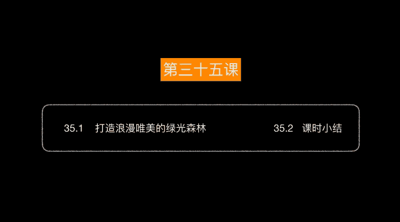
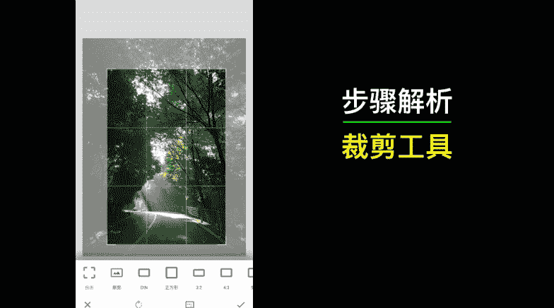
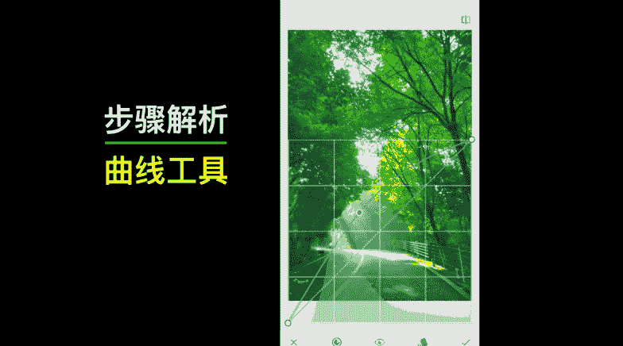
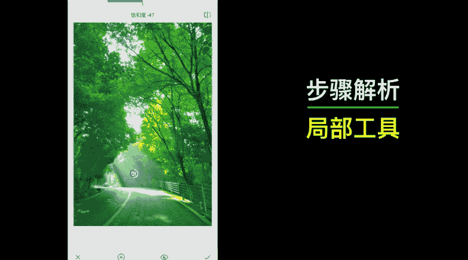
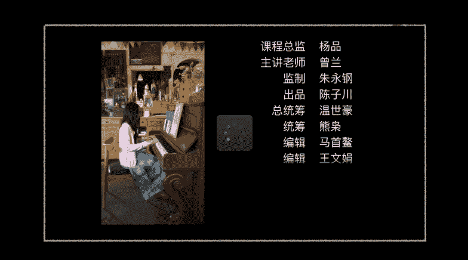

# 1、04snapseed手机摄影后期高手速成：35、打造浪漫唯美的绿光森林

🎼美化生活，美化地球，跟我一起来美化照片吧。大家好。今年夏天呢我上山去避暑，那么在开车的路程中啊，嗯就经过了一片树林。那时候阳光特别好，所以说的话呢。光线透过树林洒在地面上，我觉得呀特别的漂亮。

所以呢我就赶紧用手机拍了一张。

好，当时的话呢，我只是觉得这个场景确实是挺漂亮的。但呢我手机拍下来以后的话呢，肯定还是大打折扣了。我们先来看一下原片。呃，其实肉眼看上去的话呢是非常漂亮的，但是呢我手机拍出来以后。

但是呢暗部的亮度层次不够，但是最为惊艳的还是其中的这一缕光线。大家可以看到哈。但我现在的话呢，把原图给缩小了。可能的话呢，大家看着不是特别的呃引人注目。但是我们在后期的话呢，专门也把这束光线给增强了。

整体的照片的话呢，让它的色调偏为绿色。好，那么具体怎么调整呢？接下来我们就来看案例实操。现在这张素材照片呢，因为用手机拍摄的时候并没有变焦，所以说的话呢整个呢就比较的宽广是吧？

但是呢我希望突出这个光线的部分。所以说的话呢我首先对它的构图进行一个裁剪。好，那么在裁剪的时候呢，我尽量的就突出我想要表达的这些部分。比如说这个绿色的树林以及。这一个光速非常漂亮的光速。好，裁剪之后呢。

首先我们进入到基本调整界面。那么这张照片的话呢，同时具有高光和暗部。所以说呀那么我就。不仅仅只挑两度了。为什么呢？如果说我调亮度的话，你看整个的曝光都会增加。因此的话呢我会考虑单独的对暗部功能进行调整。

好，我把暗部的。曝光增加。但是呢大家要注意，毕竟我们是手机照片。那么暗部的话呢，你要是挑的过多，就把所有的缺点就暴露出来，适当增加一些就可以让它有一定的层次，是吧？好，饱和度的话呢，我把它增加。

因为呢我要追求非常漂亮唯美的这种日光森林的效果，所以说我把饱和度呢适当的调高一点。好，OK这是一步基础的调整。那么接下来的话呢，既然是绿光分明，那么整个的效果的话呢就应该是这种充满了绿色是吧？

所以呢我接下来选择曲线工具。曲线工具里面的话呢有一个绿通道。好，我选中它以后直接增加我们的绿色。大家看。我在增加了绿色之后，哇，这个绿色的效果是不是就呈现的非常漂亮了？好，我们可以前后对比一下。好。

眼尖的同学你可能就发现了，在我们调整了这个绿通道以后，整个照片都变绿了是吧？包括我们的光速部分，它也变绿了，怎么办呢？很简单。我们选择局部工具。那么前面我们已经讲到了局部工具呢。

就可以选中局部区域来进行调节。我们建立一个点，双指在上面进行缩放的设置。大家看在缩放的时候呢，我就可以选择它的影响区域啊，那么我把它控制在适当的区域就可以了，主要就是光速部分是吧？好。

现在呢我往下面拖拽。那么既然它变绿了，所以说我要把饱和度给减一些。没错，把饱和度减下来，那么它的这个。绿色就不会那么浓郁了，是吧？好，那么这个局部工具呢，它还有一个结构功能。

结构功能的话呢我们也可以增加一点，因为它可以使我们的光线的层次啊能够更加的丰富一些。好。我们可以前后对比一下，但呢这个这个变化的话呢就属于是比较微妙的了。啊，你看。好。确定。好，那确定这一波的话呢。

我们绿光镇定的效果已经初步的呈现了是吧？好，那么为了让它更梦幻一些，那么接下来有一个工具叫做魅力光晕。唉，大家看加上去之后，是不是看起非常的梦幻了，感觉在发光一样，是吧？呃，那么第三种的话呢。

就是光晕比较强烈的效果。大家可以嗯根据需求来选择。我觉得其实第二种的话呢基本上就可以了。如果你追求更梦幻一点呢，光晕也可以再适当的增加一些。这个就看大家个人的口味了哈。呃。

基本上这个饱和度呢也是比较可以了。我认为的话呢嗯可以不用调整。那么这个暖色调部分大家看就是有没有偏冷一点，或者说偏暖一点。具体的话呢，其实就是大家自己的口味的选择。比如说我比较倾向于它适当的偏冷一点点。

哎好，确定。好，那么我们的这个绿光森林效果就已经调整好了。好，那么我们刚才在处理这个案例的时候啊，用到了一系列的工具，应该说算是比较多的了。好，接下来呢我们就来一一解析一下。首先是裁剪。好。

大家知道我们的裁剪的话呢，是为了更好的满足我们的构图需求。那么在这里的话呢，我通过裁剪的话呢，是为了更进一步的突出我们画面的主体部分。比如说我们的这个光束，以及我们的这个绿色的这些树目。好。

好，那么裁剪过后呢，就是我们的基本调整了。那么最基本的话呢，我就调整了这个阴影和我们的饱和度。阴影的话呢是为了提升暗部的层次，而饱和度呢使整个的色彩更加的鲜艳。好。但呢在这里的话呢。

非常关键的一步就算我们的曲线工具了。那么我们通过选择绿色通道，并且呢把它提升。那么我们整个照片的这种绿色调的效果就出来了，对吧？非常的关键。

好，那么由于我们在整体提升了这个绿通道以后。好，那么我们照片里面的绿色呀，它就完全覆盖了。但是我们这个光速部分的话，我们并不希望它也呈现这种绿色调是吧？所以呢我用局部工具。先做了一个范围。

把我们的整个的光速呢把它选中。选中之后的话呢，我把它的饱和度给降低了。这样子的话呢，他的这个。绿色的效果呢就被消除了很多是吧？所以说呢这个局部工具的话呢，用于我们这个局部的操作，我认为是非常不错的。

好，那么这就是我们最后再添加了魅力光晕的效果。当然了，魅力光晕其实是非常傻瓜的一个操作。所以说呢大家根据个人的口味来适度的选择这个滤镜就可以了。好，大家看是不是整体看起来就营造了绿光森林的梦幻效果呢？

当然了，其实这样的照片呢，说实在的，我也只能够找得出来这一张，为什么呢？其实呢我想告诉大家，一个独特的后期实力啊，往往呢是可遇不可求的。你就说这张照片的话呢，我也是在。

无意中拍摄到的往往这种照片的话呢，可能更适合展现个人的独特性。也就是说你拍到了，那么你就能够处理出这种效果来。好，今天的课程就到这里了，我们下节课再会吧。🎼学习后期照片美化呀，关键还是要大量的练习。

就跟我们学钢。

