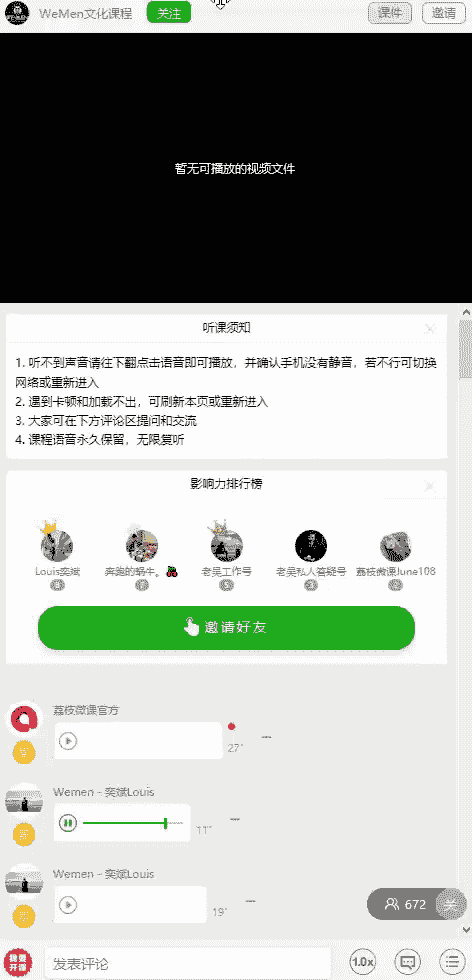
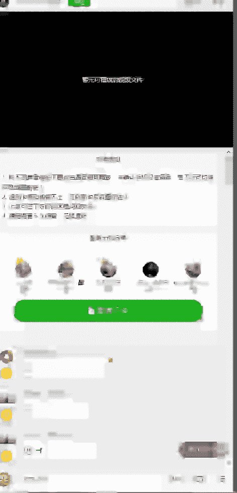
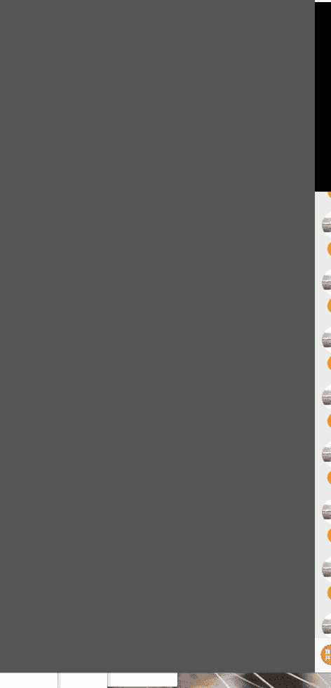
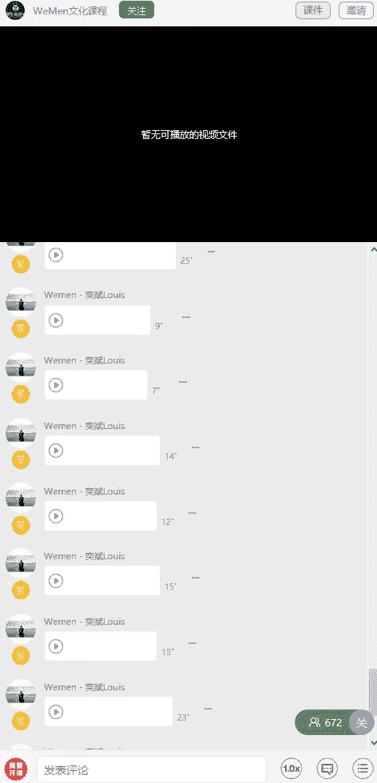

# 1、05wumen老吴《六节课从素人到达人》：一、把握核心 实力开启网红人生

大家好，我是微人群创始人吴一斌。那今天这节课呢，我主要是给你们分享一下那个朋友圈的一个定位以及系统建设。还有一些比较重要的注意事项。

因为现在的社会节奏越来越快，那很多人呢他没办法花那么多时间去了解你，他只能通过你的朋友圈，也就是你的社交媒介形象去了解你更多的一个情况。

那以往的人呢，他会觉得哎我的朋友圈为了凸显我的牛逼，就把很多很高逼格的东西给搞进去。但是很多人他会走进这么一个误区，就是把一些原本不属于自己的东西给放进去。然后整一个朋友圈看上去就非常的虚假。

那么今天我来告诉你，我们做社交媒介形象呢有一个很重要的点，就是我们做这个东西是要给别人看的，而不是给自己看的。就像我们经常会听到一句话，就是有些时候你只是感动了自己，并没有感动别人，就是一个道理。

因为每个人他喜好的东西是不一样的，所以呢你要根据别人喜好去去做相应的形象。然后现在呢会拍照，会修图的人呢是越来越多。那怎么样呢？才能够让你的朋友圈跟别人区分开来，怎么样才能够有你的一个个人特色。

就显得尤为的重重要。我见过最多的人就是整天去拍五星级酒店，拍豪华跑车、高级餐厅、游艇等等的一些很高价值的东西。然后很多人满心期待的去拍很多这种社交媒介形象之后呢，放上朋友圈，结果那个。

接收到的反馈跟预期的会不一样。大家都忽略了个很重要的点，就是这些东西是不是属于你，你又是否驾驭得了这些东西。比如你就是一个朝九晚五的白领，然后你之前的生活都是非常的平坦的。突然有一天你又游艇又飞机。

然后又各种出国旅游，是不是这个跨度就有点太大了？那么这个时候呢，你的社交媒介的形象就会跟你这个人的形象会不匹配。所以定位好自己就显得尤为的重要。你得先明白自己现在是处于什么样的一个阶段。

然后现在什么样的社交媒介形象会更符合你。然后呢，你就去做相应的东西，然后随着你不断的提升你的这个朋友圈就不断的去优化，这样子才是一个正确的道路。我们任何东西都要循序渐进。

所以你要从你的内在性格、外在条件、软价值、硬价值、社交圈等等去进行一个详细的综合评估。如果你想要成为不同领域的网红，你一定要去做这么一件事情。而且你还要仔细的去思考一下你的强项在哪里。你有什么点是你有。

然而别人没有的。又或者是说你擅长什么。然个别人没有你那么擅善的。然后你就去。花大量的精力在这一块上面。我们无论是做什么事情，学习什么，这个方向是非常的重要的。因为你一开始你的方向就走错了。

你最后的终点也不会是你想要的终点。当你们去仔细观察一下每一个网红他的一个社交媒介形象，你会发现每个网红都会有它的一个特点。那么性格上面也是一样的。

因为每个人都是很多最新课程尽在阿木课程QQ598556873微信号PUA88S同行合作联系QQ他可能朋友圈没有发多少自己的东西，他就不讨女人喜欢。这些东西都是你的思维惯系所造成的。

因为你要知道每个人喜欢的类型都会是不一样的。你不能因为他发的多，就觉得他就受欢迎，又或者是他发的少就不受欢迎。就大家可以发现网红的照片呢都一定是要非常的高清。

这个也是我们做社交媒介形象的一个很重要的部分，就是图片不能模糊。那从市市面上面现在的手机还有拍摄设备来看呢，我觉得苹果手机是比较好的，而且很多网红他们都是拿苹果手机去拍一些服装的照片。

那当然一些条件比较好的，他会用单反，但是单反这个东西你需要有专业的摄影师，所以呢显得不是很实际。所以我推荐的就是用苹果。因为苹果手机它拍出来的照片的颜色，还有这个质感会比其他的手机会更好。然后呢。

网红们他们除了用苹果去拍照之外呢，如果他是要自拍的话，有一些就会用美图手机。所以一般来说，这些网红他都是会具备这么两个手机。那我们照片的清晰度除了要靠好的设备去拍之外呢，还要会去修图。

因为我每一张图片拍出来之后呢，在加过后，在经过后期的加工之后，会变得更加的清晰。这个在后面的修图课程里面我会教给大家。那么讲完照片的一个清晰度之后呢，我们来讲下一个重点，就是照片的一个内容。

这个也是很多人所忽略的一个点。因为我之前也出过相应的一些拍照修图课程，然后我就发现了很多人看了我的课程之后呢，学会了拍照修图照片呢都拍的非常的高清，修图也修的非常的好。

但是呢他们就出现了一个很重要的问题，就是这张照片所表达的内容，你看不懂。这个也是我觉得要跟别人区分开来的一个很重要的点，就是你为什么拍这张照片，这张照片是想表达什么东西。如如果连你都要思考很久。

又或者是别人看你的照片，他看的不明白，这个时候你又要去思考这个问题了，你张照片到底是在。说什么？很多人他就会。进入这么一个误区。就是你看那些网红哎往那里一摆，然后呢这张照片很漂亮，你就去。模仿。

但是你有没发现你很多时候只模仿了这张照片的表面，没有看到这张照片的内涵在哪里。那我跟你们讲一点，就是你仔细去观察那些网红的照片，它就算是街头。那种随拍。其实这些照片都拍了很多很多张，然后呢。

他就在里面挑选出最自然的照片。那你看上去那些很自然的照片呢，它其实就是这种不断的这种随意的去拍出来。就是他会在那个点，就是已经把这个图给构好，然后呢就在那里反复的拍。然后去捕捉到自己最。自然的一刻。

那么他就把这张东西给发上来，结果你你呢就以为哦我也去跟他找同样的场景，摆同样的pos，拍出来那种感觉就会是一样的。其实这个是不对的。因为一张好的图片呢，他是会讲故事的，他他本身就有那种灵魂在里面。

然后你看了一眼就会被吸。为什么？就是因为。很自然，很有感觉。那么所谓的这些很有感觉的照片，你不要以为只是拍了一张哦。那么第三个重点呢就是你的穿衣搭配，还有场景的选择。因为有些时候呢。

比如说你要去一个地方拍照，但是呢你穿的跟当时这个场景不相符合不相匹配的衣服之后呢，你会发现拍出来的照片呢总是会。没有那种融合的感觉。所以比如说你知道你明天要去。一个咖啡厅去拍那种网龙的照片。

那么你就先要了解一下这个咖啡厅它的装修风格，还有它的色调是什么样子的。然后你就要穿这种相匹配的衣服去那里。因为我知道很多女网红都是这样子的，她都是约上三两闺闺蜜，然后呢就会。提前把衣服都准备好。

然后精心挑选出最适合的那一套，然后呢就穿去那里喝个下午茶，拍拍这种网红的照片，这些都是有讲究的。所以不同场景穿不同的衣服，你们一定要切记这一个点。那么除了我们的服装造型之外呢。

你还要注意你脖子以上的这个打扮。比如说你的发型是不是是否会有一些像眼镜啊这样子的装饰，然后更甚者还会去画一点小妆。因为这样子的话呢，会让你拍出来照片更接近网红。那如果你是一个不化妆的人呢。

那么你就可以通过什么呢？一些修图软件去达到这一步。这个也是我在后面会讲到的。那么第五个重点呢，就是你需要有一个会拍照的。摄影师，那么这个人也可以是你的朋友。那有些人就会说，那我身边没有这种人怎么办呢？

你就可以自己去培养。又或者是说当你掌握了我们这套课程的所有东西之后，你会去指导一个陌生人，来帮你拍摄。因为我自己呢也是常年到处出去旅游工作，然后在很多时候呢，我身边是没有一个固定的人帮我拍照。

那这个时候怎么办呢？我就会去找路人帮我拍。那么找这个路人呢，我是会很有讲究的。第一，我会找一些穿着比较时尚的，又或者是他带有那种艺术气息的，又或者是。长得还不错的。那么通常这些人拍出来照片都会比较好。

那如果你没有遇到这种路人呢，没关系，你比如说很想记录这个场景的图片，你可以就是有路人的时候，你就请求他的帮助，让他帮你拍个几十张。然后你就指导他跟他说，哎，我的人的比例要大概多少哦。

整张图大概是从什么角度拍过来，这些你都要心里先。有这个概念，然后指导他来拍，然后他拍了几十张之后呢，你就谢谢他，然后等他走了，你再看照片。如果这些照片呢不是你想要的，没关系，等下一个路人来帮你拍。

像我一张在那个新加坡金沙酒店泳池边的照片呢，我是找了三个路人帮我拍的，拍了大概有100多张，最后我才挑了那么一张出来。那随着你。拍摄的水平，还有被拍的这种经验呢，越来越丰富的时候呢。

你的效率就会越来越高。那你如果想变得会拍照或者很会被拍呢，你一定要大量的去实践，你也不要太过于去在意路人的眼光。因为有些人在拍照的时候呢，就会很担心身边的人是怎么去看他，然后呢就会害羞。

又或者是觉得自己不够自信，所以导致出来导致拍出来的照片都不够好。

所以在这节课里面呢，我主要就是给大家分享一些关于网红照片，它的一些。核心的内容还有重要的组成部分。希望大家听了之后呢，能够有一个清晰的概念，然后为后面学习的课程去做铺垫。当你有了这些。

概念跟思路之后呢，你就要去定位好自己，看看自己是想走什么类型的网红风格。有的人他喜欢走那种那个小清新的文艺的酷的、阳光的对吧？那种暗A系的是吧？很多种风格。然后你再根据你这些风格。

还有个人的一个性格喜好。然后自己的生活方式去定制己的一个朋友圈的一个形象啊，社交媒介的一个形象。从你的衣食住行。兴趣爱好、工作、社交圈四个主要的板块去入手，然后多元化的内容去打造你专属的网红形象。

那有的人他又跟我说，那个有的人呢他不用去做这些社交形象，但是他还是一样很受欢迎。那是为什么呢？就是他的这个人的个人品牌，已经在这种线下已经深入人心了，就是大家都知道他这么一个人。

所以他不去做这种朋友圈是没有关系的这也就是很多企业家很多很高层次的人，他的朋友圈很很多时候是什么东西都没有，你也看不到他这个人。我们只要去努力，也有一天会成为像他们一样的人。

那么在还没有像他们一样的时候呢，我们就要从基础去做好，争取在更多的。竞争者之中去脱颖而出。因为很多人他没有那种强大的实力背景价值去支撑，所以只能够通过这些好的社交媒介形象去吸引别人。

别人也只能够通过这个东西去了解到你。当你把弄得非常精美的照片放上朋友圈之后呢，你会发现大家对你的目光都会变得不一样的。当然，这种照片的前提是不要那种很刻意装逼，让人反感的前提下。

比如说一个很很阳光运动型的男孩，那么他的朋友圈咱们的内容就是都会像一些打篮球、踢足球是吧？然后呢跟他的球友的一些合照。然后呢，一些笑的很阳光开朗的。照片。我综合了男生跟女生这些网红，他们朋友圈。

还有社交媒介形象呢都有一些共通点。接下来我来跟大家分享一下。第一呢就是基本他们都会有健身。因为一个好的身材能够驾驭的更好的衣服，然后又能同时修炼你的气质，然后呢让你的整个人变得更加的自律。

然后第二共同点呢，就是他们都很会去穿搭衣服，所以穿搭也是一个要学习的课程内容。那他们大家都彼此很会拍照修图，这个就不用说了，这个是我们课程里面会讲的。还有就是他们身边的朋友跟他们的水平都差不多。

就是看上去呢就是你去看他的朋友圈。你就知道他身边都是些什么人。然后第五个呢就是他们都很爱去旅游，因为旅游呢可以开拓你的视野，同时又可以拍到很多很漂亮的照片。也是提升自己的一种方式。所以我们一定要什么呢？

善于去思考，就是拍照片一定要。从一些特别的点去切入，而不是按照常规的那种流程去拍这样子的照片呢就千篇一律，没有什么吸引力。比如说大家去健身，那你还没有那种什么8块腹肌啊，没有很好的胸肌。

或者是前凸后翘那种身材的时候，你又没办法拍照。但是你又想展示出你有去健身，那怎么办呢？你就可以从一些幽默搞笑的角度去切入，然后带给大家带来欢乐。那大家同时也知道你是有在坚持健身，然后再隔一段时间之后呢。

你把你的健身成果再发出来，这样子就有很明显的对比性。那大家也会觉得嗯你这个人很不错，有在一直坚持健身，而不是说只是纯粹去健身房拍个照装个逼而已。然后我们朋友圈社交媒介的形象，其实就是你的个人的对外窗口。

那么既然你是要对外去宣传，那就有一种社交的属性在里面。所以你一定要切记你发的任何的内容最好都是要有这种互动性。那么怎么样去社交呢？是在我的另外的社交课程里面会讲到，包括我们公众号的一些推文。

我都会在讲怎么样去做好这些社社交社交有什么东西是值得你去注意的。然后你再结合我们的拍照修图课程。我相信你很快就会变得像网红一样受人家欢迎。

