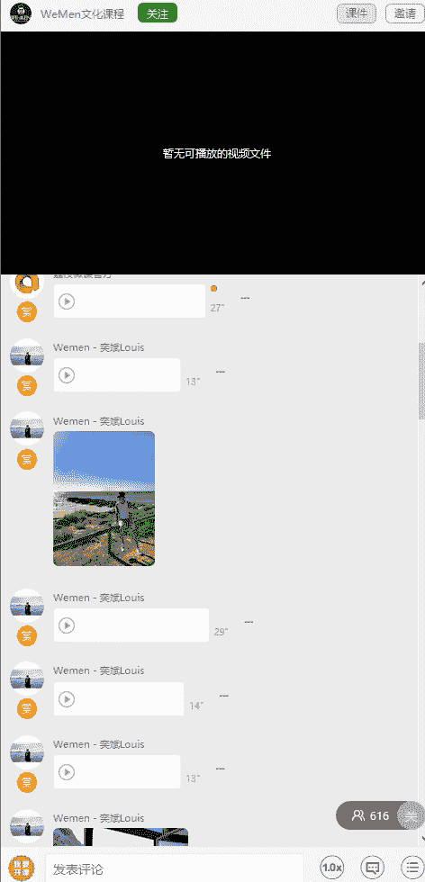
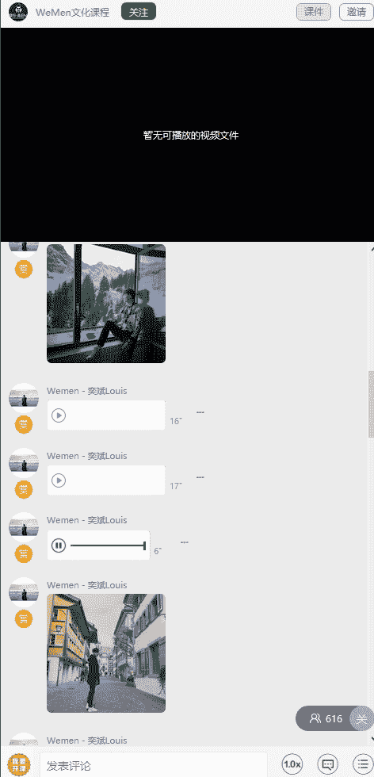
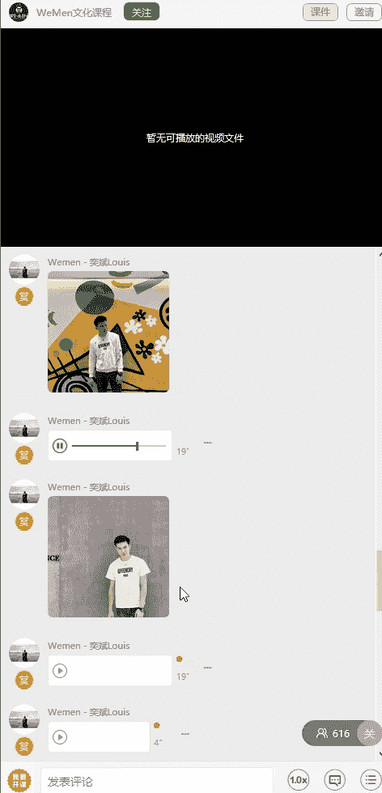
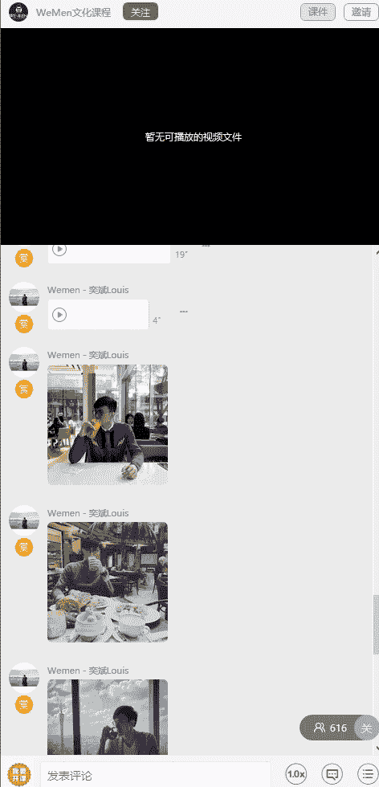
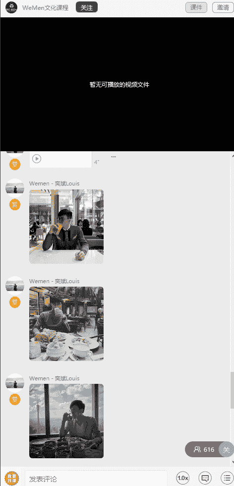
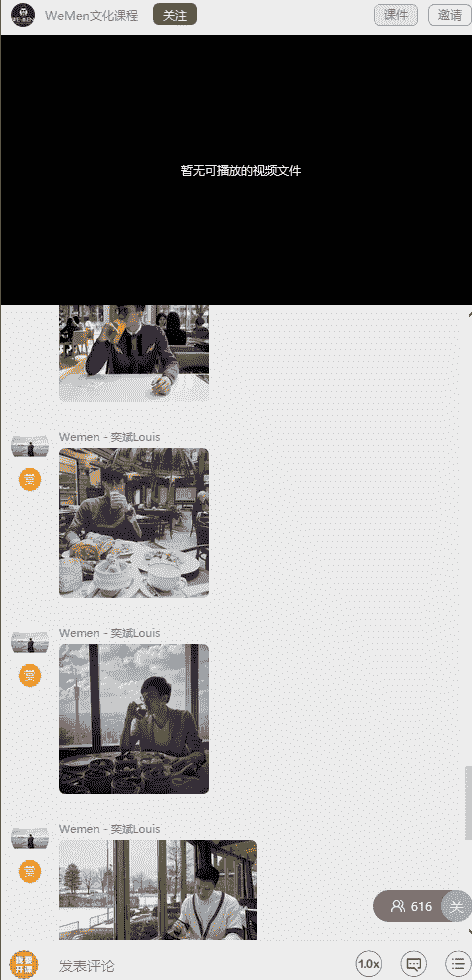
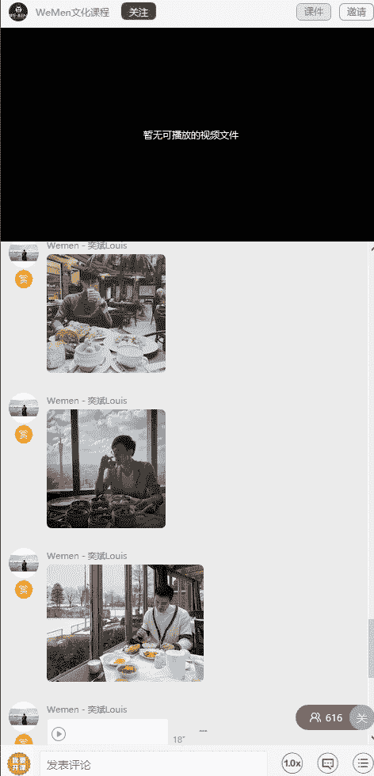

# 1、05wumen老吴《六节课从素人到达人》：三、场景拍摄技巧 细节改变人生

大家好，我是微人群创始人吴一斌。那么今天这节课呢主要是给你们分享在不同场景要怎么样去。

拍摄，然后每个场景有什么注意的事项？好，这一张呢是在海边的照片。那么因为在那种环境，我们主要是想表达一种很轻松很惬意的生活状态。所以你可以看到我没有对pos去做过多的一个展示。

反正就是坐在路边有个栏杆上面，然后脸是潮，另外一边去看的。因为有些时候呢你看镜头会紧张，又或者是说不自信的时候呢，你就可以选择看其他方位，这样子拍摄的照片也会更加的自然。我们在大海边拍照呢。

主要就是想展示一种很轻松很悠闲的状态。所以没有必要说在海边摆一些很酷炫的pose。大家可以看到这张照片是在瑞士的英克堡拍的。那么当时呢我就选择坐在窗台边，然后因为背景是雪山嘛，然后我就双眼往外看。

那么大家可以看到呢，我整个状态都是非常的放松，然后右腿是曲起来的，为什么要屈起来呢？因为如果我两个脚都垂直的往下放，整个画面就会有点奇怪的感觉。

因为腿屈起来之后呢，手可以顺势的搭上去，这样子就会更加的放松。

有些时候呢我在这种小镇或者是岸边。这时候呢我都会这样子去拍照片或者视频。因为这种地方本来就有那种氛围。然后呢，回头这一看呢，这张照片就会更加的有感觉。然后你可以看到我整个。左的左腿呢是向前。

然后右腿呢是向右，这样子的话整个人看上去就会更加的立体，不会呆板，就很明显就有种那种走着走着突然回头看一下后面。也有那种就是不要说一味的往前走，有时候停下来看看身边的风景，身后的人。好，大家看到了没有？

这一张呢跟刚刚在窗边的那一张呢都有点像，就是我在依靠一些物件的时候呢，两个腿都会区分开来，就一屈一伸。这样子的话呢，下半身就会很有立体感。然后。因为这是在一个小镇。

所以呢我又想表达那种很轻松很自在的感觉，所以双手就插着裤带，然后头部呢也是面向远方。就你会发现以上的几张照片呢，更多的是是在表达一种意境，一种感觉，而不是在那里很装逼，装酷耍帅。好，这一张呢是在那个。

甜品店的照片。那么这张照片呢，我为什么要摆这种pose？其实就是一种很悠闲的喝下午茶的感觉。因为大部分人都会什么。呃，端了个杯子啊或者什么的，我就换了另外一种方式去表达出一种。很悠闲。然后呢。

放恐的一种感觉。这张照片是我们当时搞那个粉色homepart时候拍的，然后因为整个画面都是很很粉很甜蜜，所以呢我也会去露出笑容去跟这个环境去融合在一起。

因为这样子的话呢，就人跟景会结合在一起，显得更加的融合，气氛更加的。

融洽。如果背景呢是一些涂鸦墙的话呢，我就会摆出一种比较酷的pose。那当然你你想看镜头，不想看镜头都都可以。

那在这种。

背景拍照呢一般人都是会站在中间的位置。那这种呢是属于纯色背景。那就是我刚刚讲的，讲正面，看镜头都可以。然后人呢记得要放松，然后。那个眼神就要出来，因为特别是这因为这种背景呢更重要的是你的。肢体的表达。

当然，着装也非常的重要。

那以上这4张呢就是都是一些吃饭喝东西的时候拍的。那么你可本可以看到我大大部分都是不看镜头的，就是尽情的享受当下的时刻，然后让人家去捕捉瞬间即可。

大家看到这些很随性的照片呢，其实都是早已构好图，然后我就尽情的去享受我的。美食，然后别人捕捉瞬间，再往里面去挑最好的照片。然后构图方式基本都是九宫格构图。这个在上一节课有讲过的。

以上呢就是在不同场景的一些拍摄的照片。你们要多看照片的一些细节，还有这种感觉去模仿。

那慢慢的你也能够拍出这种类型的照片。接着最后一点呢就是关于社交认证的一个拍摄。因为以上都是个人的那在拍摄社交认证的时候呢，有几点要注意。第一个呢，在拍摄的时候，你一定要注意自己不要被别人给挡到。

那正中间的位置呢，通常就是社交领袖站的位置。那如果你不是社交领袖呢，你可以站在社交领袖的旁边。

因为如果你站得太后面，人家根本就看不到你可能最多就看一个你的头。那我情愿呢会站到前面蹲下去都好，就是不要站的太后面。又或者是站到太边边，因为很容易呢拍照的时候把你整个人给。

裁剪到了又或者是会出现那种变形的情况。

