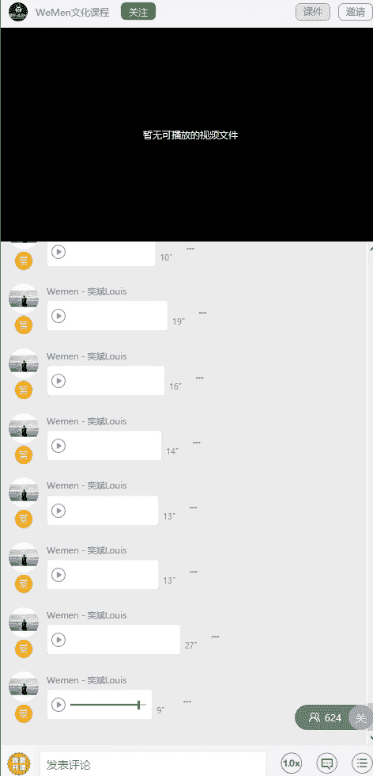

# 1、05wumen老吴《六节课从素人到达人》：二、多种网红构图 打造独特魅力

🎼或好友，给他们一个学习和成长的机会。😊，各位朋友大家好，我是微人群创始人老吴。那么今天这节课呢，我主要是给大家讲解，就是关于构图。构图这个词呢它是艺术家为了表现作品的主题思想和美感的效果。

在一定的空间安排和处理人物的关系和位置，把个别或局部的形象组成艺术的整体。简单的说就是如何把人景物安排在画面当中，以获得最佳的布局方式，也就用俗话来说，就是把想表达的东西表达的更好。

那么今天呢我给大家分享几种最直接最经典最实用的构图方法，也是我本人用的使用最多的。那么下面我也会搭配一些图片案例来一起讲解。这种呢我们叫做对称式构图。

它是指利用画面中景物所拥有的对称关系来构建画面的拍摄方法。那么这种构图方式呢往往会给我们带来一种稳定正式均衡的感受。那么大家现在所看到的这些图片呢是属于汇聚线构图。那汇聚线构图呢。

它是指在画面中的一些线条元素，向画面相同的方向汇聚延伸，最终汇聚到画面中的某一个位置，利用这种线条的汇聚现象来进行构图拍摄的方式。那这种构图方式呢，它可以使画面产生强烈的视觉冲击效果。

也能够让画面更具有空间感和立体感。大家可以看到我刚发的那四个案例，其实前面的三个我觉得是有点像对称式构图。

那这两种构图方式我觉得操作起来都是比较简单的，你就只需要找到这种有对称的，有中轴线的。地方就可以拍了。那么这种方构图方法叫做三分构图法。它是在拍照构图的时候呢，画面的纵向和横向平均分成了3份。

那线条交叉处呢，我们叫做趣味中心，也就是我图片用那个粉色的彩笔圈出来的点。那我们平时在看一幅照片的时候呢，我们的目光通常会被吸引到趣味中中心的位置。所以我们在拍照的时候呢。

要尽量将我们想要表达的事物放在趣味中心附近或者上面。这种构图方法也称为九宫格构图法。又或者叫景字型构图。也可以叫做黄金分割构图，这是一种使用最多的构图方法。那么我重点会讲这个构图方式。那很多初学者说。

我怎么样找到这个黄金分割点呢？其实在很多的手机里面。包括相机都有一些内置的构图辅助线功能。那么你开启这个功能之后呢，在拍照的时候，它就会显示这个构图的辅助线来帮助你进行构图。那苹果手机的话呢。

就在设置里面的相机照片里面有一个叫做。网格的东西，你把它打开就有了。呃，我专门用苹果手机去拍放在ipad上面的照片，给大家可以看到这个九宫格的线。那么大家以后呢拍照就按着这种构图方式去拍照。

基本拍出来的照片呢都不会差到哪里去。这种构图方式呢我们叫做对角线构图法。那对角线构图呢是指将主体安排在画面的对角线上，让主体在画面上呈现出一种对角的关系。那这种构图方式呢。

它可以使拍出来的画面得到很好的纵深效果和立体效果。画面中的线条呢还可以吸引人的视线，让画面看起来更动感，更有活力，达到突出主体的效果。那么在拍摄实物的时候呢，我通常会用到对角线过图。因为很多。

器皿都是长长条形的，所以呢用这种方法可以让这个东西拍起来更立体。那么大家看到第三张图片呢，是我在9。6的静止自拍。那样那么这种构图方式呢，它是对角线的一种延伸的构图方式。

因为它属于那种不是完全很规则性的对角性。但是很多网红他们都会用这种构图方法。那其实这种构图方法呢并不难，你只需要把九宫格向左或者向右移动，大概30到45度，就变成了这样子的构图。相信大家看完这张图片。

应该就明白我刚刚所讲的一个意思了。那这种构图呢叫做框架式构图。框架式构图呢也是比较经典的构图方式。它指的是当拍摄主体周围出现了一些框架元素时，比如像窗户，像门框，像洞口等等的。

然后我们就用它来进行构图的拍摄。就有种像什么呢？像我们一张画不是装了一个画框吗？那等于说就把画框就把这张画给框在里面这种感觉。这种构图方式呢我个人是会比较少用。那这一种构图方式呢叫做三角形构图法。

一般来说呢就是会在拍摄实物的时候用到，然后呢把三个比较重要想突出的食物呢，用这种三角形的方式去展现出来。然后让他们会有这种联动性，然后整个画面呢就会显得特别的丰富。这种构图方式我叫做俯拍式构图。

他呢确是能够。方方正正的去。一目了然的展现你想要表达的事物。通常来说，我用这种拍图。拍照方式呢是用在这种实物上面。又不想让这些食物呢给人家一种很凌乱的感觉，我就会用这种拍照方法。

那这种拍照方法通常就是需要站起来拍，然后整个手机是跟这个桌面是一个平行的状态。这这样子拍摄呢会让实物整张图片看起来更舒服。然后呢，四周记得要留有这种空间，这样子的话就不会有那种压迫感。

然后食物之间呢要留有一些间隙。这两张图的构图方式呢也是我自己之前凭感觉去拍的一种。那我觉得它应该不属于上面的哪一种构图方式。它这种呢就是在拍摄实物的时候呢，不会把盘子完全的拍进去。那拍摄的一个角度呢。

就类似于手机跟桌面呈现一个接近90度的一个方式。然后这样子拍拍下去，实物就有那种纵生的感觉。因为有些时候如果你那个。盘子太大或者是桌子，还有其他的食物，你没办法。间把碟子拍进去的时候呢。

你就可以尝试用这种构图方式去拍照。这样子拍出来会很有意境。接下来这种拍照方式呢，它有点像那个九宫格构图法，然后我会用在拍摄实物上面，或者是一些物件，它是长柱形的时候呢，可以用这种拍摄方方法。

用这样子的拍照方式呢，会使物品的那个层次感更加的突出。通常来说也是用在拍物品上面。拍摄人物的话呢，我不太推荐这种，因为这种拍摄呢会可能会将那个人压缩到。这种构图方式呢我叫做5五开构图法。

那通常来说呢就是在拍摄一些。景观的时候会用到。比如说这两张照片，第一张呢就是以。海平面作为一个。中轴线。那第二章呢就是以。水海水跟那个城市之间的那条交际线作为一个中轴线。那么这种拍摄构图方法呢。

就是能够让整张画面呢显出一种比较和谐的效果。以上呢就是我最常用的一些拍照构图方法，希望大家看了之后呢能够有所收获。那在学完这些构图方式之后呢，我还有一些点要跟大家补充。

就是在关于拍照的时候的一些细节问题。第一点就是你在拍摄的时候呢，一定要检查一下你的相机，手机，你的摄像头有没有一些指纹。因为很多人呢都没有注重这个细节，手机直接从固态里掏出来就拍照。

然后导致那张照片呢就会有一点模糊的感觉。其实并不是相机的问题。有些时候你检查一下你的摄像头是不是有点脏。那么第二个点就是在拍摄的时候呢，你横竖一定要有一个什么呢？要有一条水平的。线作为一个参照。

就千万不能够把图片给拍歪了。比如刚刚的那张照片，你们可以看到我把它打斜了，是不是看上去就很奇怪，很不舒服。这个呢也是很多人经常会犯的一个问题。所以无论照片里面有有没有人水平线一定要保持水平。

比如像刚刚那张吃的，我把它打打斜了之后，是不是看上去也是很奇怪，很别扭。所以呢垂直跟水平一定要注意。一般来说，正面拍摄的话就是水平跟垂直都要注意。那有些时候呢。

你是从左左侧方或者右侧方几十度的位置拍过去，那肯定是参照那个垂直线。那第三点要注意的就是在拍摄人像的时候，我们的相机呢手机呢千万不要从上往下拍，这样子会把人给压缩了。又或者是你在照片里面。

你的头已经顶到了那个画面的上方，这样子都会有一种很压迫的感觉，就看起上去就会不舒服不雅致。第四点呢就是拍照的时候，除了构图要注意之外呢，还要注意这个光。因为构图跟光呢是构成整张照片非常核心的一个元素。

希望大家学完这节课之后呢，对构图有一定的了解。然后呢。通过不断的练习去提高自己的一个拍摄水平。那最后呢我再给大家一些建议，就是在拍照学习的过程中呢，一定要多去看一些网红或者是大师的作品。

然后去看一下他们的一个构图方式，还有他们去表达内容的一种手法。当你把这些东西都学会了之后呢，你的照片很快就可以像网红一样。接着你的个人魅力就会慢慢的凸显出来。接着就跟身边的人区分开来。

