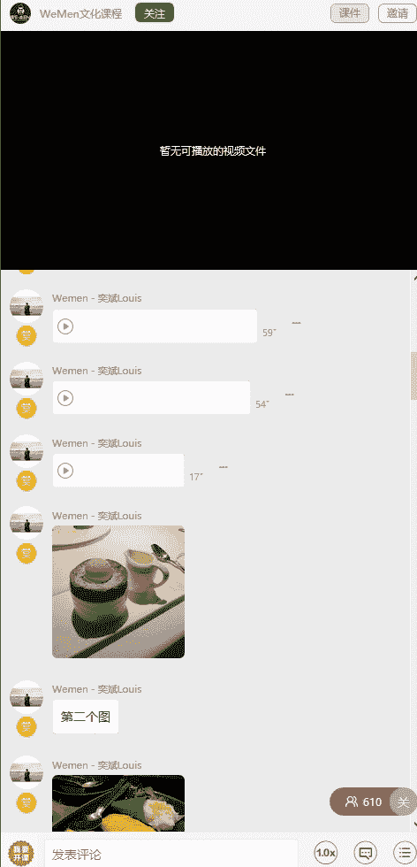
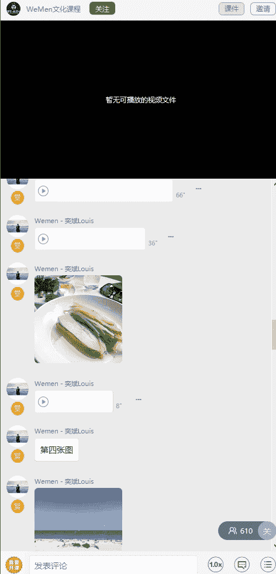
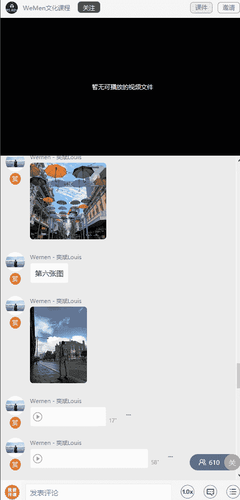
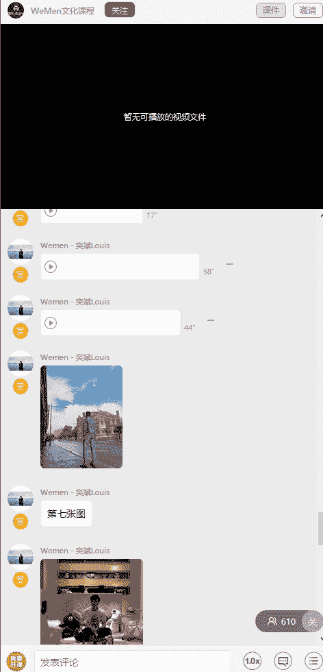
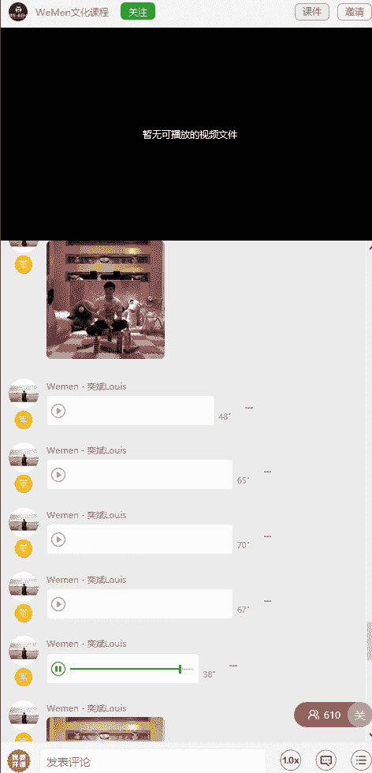

# 1、05wumen老吴《六节课从素人到达人》：五、如何轻松carry朋友圈 且看八大类修图实操案例

大家好，我是微面创始人胡一斌。那么今天这节课呢，我会通过8个案例来给大家讲解如何去修好一张图片。

首先呢我们来看第一张图片，这张图片是一个甜品，然后呢在西餐厅里面吃的，就有些时候呢我们会去餐厅吃饭，但是它灯光呢就没有那么明亮。那这张图呢。一般来说就是像这些吃的没有人物的图片。

我都是直接什么直接用ins来修。那么如果你用不了ins，你用VSCO也可以的。好吧，那我们就进入修图环节。然后我们呢像刚刚我有讲过的，我都是每一个滤镜都顶一下，对吧？然后呢。

每点一个我会记住每一个的效果。那么经过刚刚那么一点之后呢，我发现有几个滤镜是不错的。比如说像这个滤镜。你这个第二个这个pan很有感觉。还有这个。REYES解释很有感觉，对吧？那么比如说我们用这个。

那也是个软这个滤镜来修。那首先呢还是那样子先把滤镜效果。减弱不要太高，对吧？你看然后你可以看一下效果，因为在网抗的滤镜效果很重。网低呢又没有那种滤镜的感觉。所以大概调在百分之。

60这里接着呢进入我们的参数，还是像钢一样，锐度直接拽到最高，看一下有没有这种。噪点如果没有的话，呢，就100。接着呢在亮度这里呢进行提亮。好，那么你不用担心说调亮了时整个图变都特别的亮。

你可以提亮完之后呢，干嘛？在高亮这里减弱。明白了吗？这样子提亮的同时又没有那种很。刺眼的感觉。接着呢对比就。是吧。你看因为我刚刚讲过，你想要驳纱就往左调，但，是呢这张图片不适合往左调。

它是往右调一点点。你看到没有？有些时候如果你不想有薄纱，你想照片特别干净，你就往右调。然后你就会发现那个薄纱呢就不见了。接着结构呢再调一点点。是吧这钩再调一点点。因为吃的呢可以调多一点，没关系的。好。

我就调8。接着呢。这张图呢我觉得。因为太黄了，所以我会剪一点点暖色调。往左调是不是？这的饱和度呢饱和度不用去动它，有些时候。如果你不想那么颜色那么艳，你就可以减弱一点点。对不对？基本来说呢，整张图片呢。

修到这里就已经是OK了。关于有些稍微加一点，这样子能够帮整个照片去提亮。好吧，所以大家可以看到这张照片呢，就是修完了，然后按下一步就可以了。好，那么第二张图呢是一个。芒果糯米饭。

那我同样的也是用ins来修。首先呢你看一下没有，还是同样的使用这么多滤镜去去点。那么我这个时候呢我会用另外一个滤镜，怎么说呢？搜出了这个m fire这个滤镜是不错的。

我还会给大家推荐一个叫做loadoting这个滤镜。loading这个滤镜呢大家可以去尝试一下，在修实物上面它是蛮不错的，因为它能够。它不会有那种特别强的滤镜效果，然后呢。整个颜色会特别的。鲜眼。

它能够很突出这个实物本身。对吧那你看到没有？同样的我也是调。80%的一个滤镜效果。然后呢，接着。Z度。拉到最大。亮度。亮度呢因为张呢如果你去调亮度的话呢，就会有点曝光的感觉。

所以呢我都是先你可以先调结构。对吧。先把结构调清楚。然后对比度呢。这张我觉得。可以减一点点对比。接接着把高光打案。然后再去提亮亮度，其实都一样的。这样子整张照片就会非常的精神。接着呢。可以你可看到没有？

本来张照片呢因为可能是餐厅的灯光会有点暖，所以呢你用这种冷色调呢。可以把糯米饭变白，看到了没有？可以让糯米变白。然后呢，虽然虽然芒果会变浅色了，没关系，我们可以干嘛呢？通过饱和度来调。

调一点点，那这样子芒果就变。对吧。接着呢光影看一下要不要调，其实。这场光影。可以减弱一点点。好，那么这样子这张照片呢就已经修完了。我们可以看一下跟原图的对比。对不对？是不是比原图更好看？

原图它本来是有一层东西在上面的，结果经过这样一修呢，修完修完就没有了。那我觉得可能有点太亮，我会再浅弱一点点高光。这样子这张照片就修完了。因为修图这种东西是没有绝对性的，所以呢你喜欢用哪个滤镜。

你就用哪个滤镜。但是切记有几个重点。第一，图片一定要干净。第二个图片那个颜色不能跟实物呢有太大的偏差。修图只是。在照片原有的基础上去还原它的。美，然后呢修饰一下就可以了。那么第三张图呢同样也是食物。

那么它是属于在户外的餐厅用餐的场景。所以呢我这三张图片呢虽然都是实物，但是都是在不同类型的灯光餐厅下面。所以大家就根据照片的实际情况来选择相应的滤镜去修。好，那么同样的我们还是用ins打开这张照片。

接着呢在上面去选这些滤镜去看一下感觉。其实。照好的照片的话呢，它能试用的滤镜就会特别的多。所以呢你可以看到很多滤镜用上去都特别的漂亮，对不对？那么这张呢我就给大家演示一下另外一个滤镜。

就是这个hadson。那么。这个滤镜呢它滤镜效果不能开到最大，为什么它会有中间会有那些噪点。给那些颗粒感。所以呢。我可以把它调到百分之。看我都是左右这样调。65呢还有一点点效果，所以会减弱。

剪到大概50多，看到没？这就把照片给提亮了。接着呢下一步编辑啊同样的。这度先调到最大。接着呢。亮度调一点点。

整体体谅。接着如果不想要薄擦呢。

我就往右调，这样就没有那个搏纱的效果。如果你想要搏纱，你就往左调。那么我就往左调往右调1，那么这样子让让人搏杀就没了。接着结构呢。依就调一天点。看到没有？得到一个最合适的参数。

这样子整个实物就非常的干净。好，那么这一张呢冷暖色调都不用去调它，就不需要动这个参数。饱额度呢。可以稍微加一点点。提亮它那些颜色，不然的话会比较素。接着呢高亮效果可以减弱一点点。

这样子它盘呢就不会说反光很严重。明白吧？那么如果你觉得太阳呢高光可以在那个亮度可以再加强一点。那光影的话呢，那就属于整体加亮。那我就再加15点光光影，这样子的话呢，它也带有一层浅浅的薄纱。

但是如果你不去仔细看又看不见，所以这张照片呢就修完了就会特别的干净。然后我们还是像刚刚一样下一步。然后分享就可以了。好，那么前面三张呢都是实物的修图。那接下来呢我们就进入风景系列的修图。

接下来呢我给大家讲的就是在海边的照片怎么去修？同样的我们也是用ins。那这那这个ins呢在这张图上面就有很多滤镜非常的好看，对不对？因为每个人心目中的海的颜色都会不一样的。

那我呢给大家演示一下第一个滤镜怎么样去修。好吧，那么我们可以看到同样的先调滤镜效果。因为10百太强了，我调到。805吧，差不多。接着呢润由度调到最高。亮度加一点点加8点对比度呢加15点。结构呢。

也加个7点，然后我们可看到是不是张图片，其实这个时候已经很好看了。然后暖色调跟冷色调呢，我喜欢天更蓝一点。我就。调冷色调而饱和度可以加强一点点。这样子天空跟那个沙滩上那个。草的颜色会更好看一些。

接着呢高亮呢减弱。减弱1点，那整张照片呢就是又亮，又不会很刺眼。接着光影这个东西呢，就看你喜不喜欢。对你讲图片有点薄娑，你就可以加一点点，不想的话不加也无所谓，整张照片呢就会非常的干净。

那接下来呢我用另外一个滤镜再给大家演示一下，对吧？我们可以点一下别的滤镜。比如说像这个君no这个呢，很多国外人那些ins网红是蛮蛮喜欢用这个滤镜的。这个滤镜呢同样的滤镜效果。调一些。接着呢。锐度调满。

亮度呢调一点点。对比度也稍微调一点点。结构呢也调一点点。大家可以看到屏幕上面我在操作的一些细节。然后饱和度再调一些，其实这张照片呢也很好看的，我们可以看到跟原图的对比。那么他这张照片现在有个什么问题。

沙滩的颜色太太亮了，这时候呢高亮减弱。即可有没有发现这个高粱一减弱，整个照片。层次就非常的分明。好了，我们可以给你给你们看一下原图跟修过后的对比。那么同样的下一步保存。

那这个呢也是我给大家分享的一个经验，就是。我一般修图，如果有几个滤镜很好看，我会每个滤镜都修一下，然后来对比，然后挑一张最喜欢的来发朋友圈。

那我们可以看到第五张图呢是一个。长方形的图片，那我会怎么去修呢？大家可以来看一下。第五张图呢，我是用snap see来修这么一个图片。那么首先我们还是老规矩。比如说这张图呢，我想要裁正方形，我就用。

用那个snni，对不对？因为我觉得这个图呢。截正方形就挺好看的了，就不需要成方形。那么我就先截图，对吧？这个那正方形也是不错的，因为长方形的话伞现的有点太多了。好，那么截说完截完图之后呢。

我们来进入下一步。比如说像这张图啊。我们可以干嘛呢？比如说你想调曲线。对不对？因为这张图有点暗。所以呢我会先。先调亮一下。对，先简单的调料。接着呢。在工具里面。你可选这个突出细节。同样的。

你可以把对话加大。对不对？结构呢。也稍微加一点点。对因为n它的参数的效果跟instagram是不太一样的。所以你根据图片实际的情况来调，所以你们可以看到对比，对不对？好，调完这两个之后呢。

我们调什么就调色。首先呢。当图片这么鲜艳，很多人他喜欢暖一点，那个调饱和度看到没有？你把和度一加，整个图片的颜色就出来了，伞的颜色有天空的颜色就出来了。那么这张图呢，我加到30几的饱和度。

因为太过的话呢。就显得很假。对不对？所以呢我就调大概40左右啊，上下浮动几点都没关系的，因个人爱好而定。接着呢。氛围也可以加一点点。因为氛围的一加的话，天空特别好看，所以氛围加10点。这个高光呢。

你看高光一减，如果云朵，这层次感就更出来了，所以高光呢减20点。阴影的话呢，我觉得可以减弱一点，为什么呢？因为你可看到阴影如果调的很高，所两边的房子也特别显眼。那么我们主要是要突住伞跟天空。

所以阴影可以减弱。这样子的话，大家的注意力会更集中在伞跟天空上面。那么暖色调这个东西呢，这张图不用不用去动它。那对比度就是。要搏萨的不要搏萨的。情况这张呢我也不去动他的对比。

那么亮度呢可以稍微提亮一点点。那整张照片呢，你们可以看到跟原图的差距。是吧原图因为在户外拍嘛，它有点有点那个暗，就是那个。因为在太阳光下就会有这种效果，所以呢调了颜色之后差距就很大了。

所以这张图呢就修好了。

接下来呢我给大家演示的是一张在路边的背景的图。

那么这张图片呢，同样的，因为当时天气不是很好，所以拍出来的效果不是很好。那这种照片怎么样去拯救呢？且看我的视频。好，大家可以看到啊，这张照片我还是选用ins来修。那么我们呢同样的每个滤镜看一下。

然后这个滤镜是不错的。其实这个滤镜也可以修修一下。那其他我都觉得滤镜效果特别重。那么我们用第二个君 him来修。那首先呢我们可以看到滤镜效果很重，所以把滤镜效果先减弱大概在60。5，然后呢。锐度。

锐度先加满。亮度呢。往上调，因为这张照片本来就有点暗。所以呢我会把亮度先调上来，接着呢。对比图。向右加1点，这就没有搏杀效果。结构呢加一点点。啊这张呢。因为他色调的关系，所以呢我会。我会向右加一点点。

这样子，你看那个房子的路面跟天空的颜色就会区分开来。接着把和度要加一点，为什么呢？因为天空。

天工原先的太灰了，所以稍微加暖一点点。高亮的可以减入。接着呢整体用框影去调亮它。好吧，那么这张照片呢其实就已经是修完了。大家可以看到原图跟修完的图差距特别的大，对吧？这样会更有感觉。好。

那么这张图片呢我会先干嘛呢？先用snap来修，为什么？因为我的脸跟整个照片的色调都是非常的暗，所以呢我会先干嘛呢？点开工具的曲线，然后选择那个调亮的功能，接着呢再手动的向上拉一点。

你看先让他照片整理的感觉。

凸显出来。好，接着呢我会把它导出来什么呢？用ins来修。然后说把他照片导出来。保存副本。接着呢。用ins来修这张图。好吧，那么这个时候呢还是同样的，先选滤镜。然后这个这个immo这个软这个滤镜呢。

就更适合修些紫色啊这种类型的。所以呢我会选这个滤镜，但是这个滤镜有个问题就是脸。很红，我们尝试一下，看减弱效果。紧漏效果之后还好。这样的我就会选择更换滤镜。那如果没有更适合的滤镜呢，就可以先用那个。

先把效果减弱。接着呢同样的锐度。去调高。接着呢亮度再拉亮一点，这样子脸就会更白一些，对吧？可以看到，又或者是对比度稍微减弱一点点。结口加一点。这张呢冷暖色调不用去动它。饱和度呢因为如果往右脸就太太红了。

所以这张呢也不去动饱和度。反而是高亮呢可以减弱一点点。接着光影加，你看把光影加强之后呢，脸就没有那么没有那么紫很红了。然后调完这些之后呢。我再尝试一下，家练把我。对吧这样子。层次就特别的分明。

那么这张图呢。颜色就先修好了。接着要修什么呢？接着就要修脸。好，那么同样的我们就打开美图秀秀的人像功能。那么刚刚我有讲到过，就是有个面部重塑功能，对吧？那么ok你看很明显的直接瘦脸，对不对？

眼睛如我太小了。可大一点点。嘴唇呢？得弄起来这点，对不对？那如果如果还不满意。就可以用这个。瘦脸功能手痛的去。再把脸给收一下，对吧？这个个人爱好，好吧，这每个人好不同。接着呢，因为。他在室内。

所以照片有有这种噪点是很正常的。我就用亮眼亮眼功能。把眉毛眼睛都涂一下。鼻子涂一下，嘴巴涂一下。他把人轮廓。涂一下，这样子整个脸就很清晰了，头发其实也可以弄一下。那么大家可以看到张照片是不是？

你就看得相对比较清楚了。接着。保存就可以了。那如果你觉得哎这一块呢还是有些宏观怎么办？来，我来教你。打开snse的。打开是FCC的，然后用刚刚我教过的局部功能。点亮鼻子。缩小范围。选择保额度。

100多就好了。你还可以把脸个脸给提亮。看看到没有？这样子脸就亮了。好吧，那么这个就是这张图的一个修图的方法。

好，接下来呢我给大家演示的是最后一张图，也就是街拍怎么样去修。那么首先这张图片呢跟之前的图片有点像，都是属于偏暗的。那么还是老规矩先选一个滤镜。那么因为这个背景挺不错的，所以我觉得好几个滤镜头很好看。

今天呢。它也是另外一个滤镜。就是这个A开头的这个。好，我们可以看到啊这张图呢其实滤镜效果用到90都没问题。接着呢老回去。锐度先调，你看这图呢调到100的时候就有那种治颗粒感，所以呢我会稍微减弱。

接着呢亮度一定要调高一点。猫都要调狗。接着因为它有点有点发黄，对不对？所以这个就在色调这里可以调。接着呢对比度稍微调一下。结构也调一点。这张饱和度可以加稍微加强一些。那么高亮了建筑物。光影加强。

是不是脸就白了？对吧其实张图呢这样子就其实已经是OK的了。就在原有的基础上。你看到没？原来是很烂的。经过我这稍微操作一下颜色就好。好，那颜色修好了之后呢。可能有些人觉得哎好像还有点点黄黄的。

那个色调的再再减弱一点点就好了。张图就会非常的干净。接着呢修完颜色之后呢，就干嘛呢？就到了我们的修脸的环节。所以我们呢还是同样的打开美图秀秀。接在选举上照片。然后干嘛呢？面部重塑，对吧？尾巴练。

脸瘦一点，对吧？眼睛放大一点。这些鼻子我一般平时都不去动它。好，那我们再看到呢脸上那些东西呢有些斑点痘痘，对吧？那我们就用祛痘祛斑。的自动功。对不对？它就会自动的把一些去掉。那没有的话呢，就用手动放大。

对吧。然后呢一点先去掉。好，那么去完这些之后呢，我们看到眼睛周围那一些黑黑的，对不对？就我有讲到过这种叫去黑眼圈。自动功能。马上就没了，对吧？那如果边边呢还有一些的话呢，就手动的去掉就好了，变淡挞。

这样子整个图片就会非常的干净。那如果你。讲追求更极致呢，你就可以用face那种修补功能来弄。那接着呢。有些时候你的像嘴巴也是可以用瘦脸来调的，是吧？嘴巴可以往上扬，懂吗？就你可以设置垂角往上一样。

对不对？是不是整个表情就变了。对吧那这样子其实脸就修的差不多了。那如果你还想磨皮啊什么那些个人的事情，一般来说我就把脸修干净就可以了。好，那么这样子。保存了最后呢，比如说。

别如有人觉得我的耳朵好像不是很平，那么你就用瘦脸瘦身，只把头发往上推一下就好了。懂了吗？对不对？他说这里觉得乱了，就往那里推一下。对不对？那这样来会显得整个脸更小，对吧？好吧。所以这张图修修完了之后呢。

保存分享就可以了。好吧，那么这个是这张图的修图方法。基本上大家把这8个视频看完之后呢，你就能够掌握网红式的一些修图方法。那么在后面的日子里，我也会争取给大家多更新一些案例。

