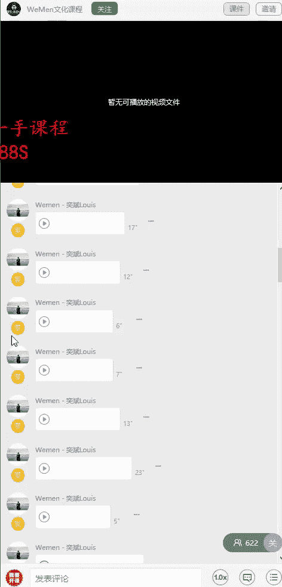
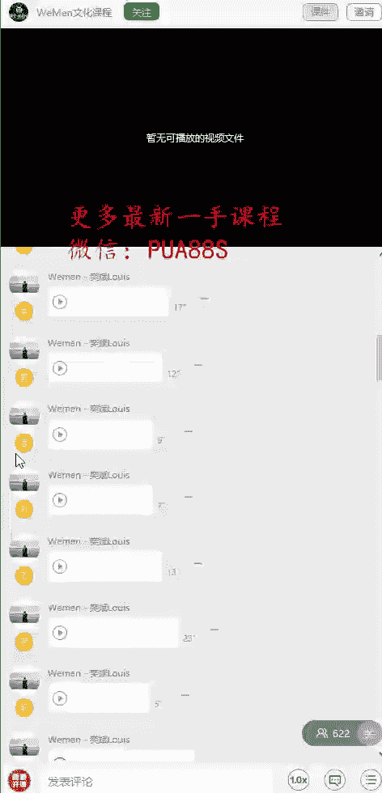
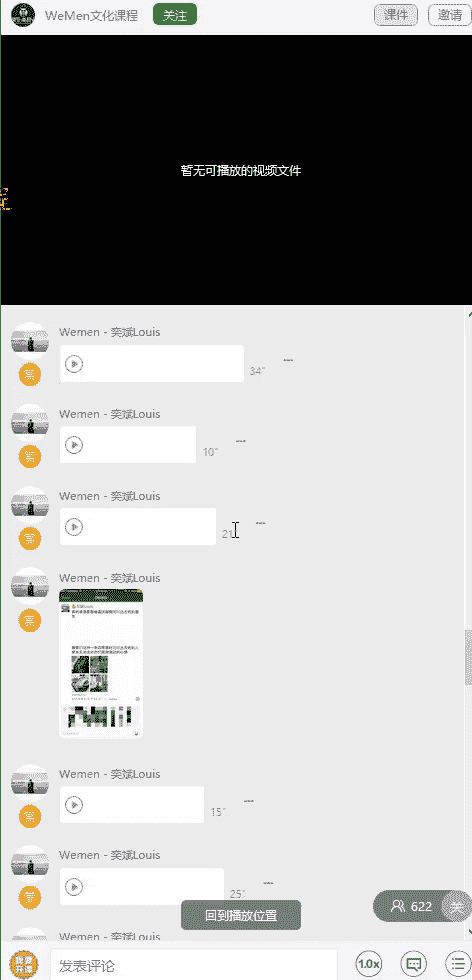

# 1、05wumen老吴《六节课从素人到达人》：六、好图配好文 让你朋友圈“活起来

大家好，我是微人群创始人吴一斌。那今天这节课呢主要就是来给大家讲怎么样用好图加上好文来制造这种互动性。首先你得思考的一点就是你这个配文。他的目的是要干嘛？因为不同的目的，它的配文的配法是完全不一样的。

有的人呢他是为了个人品牌的传播，有的呢他可能是要去推广一些什么活动。对吧那有一些呢是为了去吸引别人的关注，那每个思路的想法不同呢方法也是不同的。但是有一点。就是这些配文都是希望能够引起共鸣的。

首先呢你得分析一下你的目标人群。因为目标人群的不同呢，这个配文的方向和方法也会有所不同。你的受众人群的分析就是为了让你能够写出更有针对性的配文。而且这个配文的属性，我把它分为7种类型。

第一种就是比较坦诚的。第二种就是比较刺激的。第三种呢就是比较有能力的。第四种呢就是比较有教养的。第五种呢就是比较粗犷的。第六种就是比较激情的，第七种呢就是比较平静的。

这7种类型的个性呢就会组成你的朋友圈或者社交媒介形象的属性。那么有的人呢他可能就会在某一方面特别突出。那有的人呢他也是会比较平均，这个因个人的喜好而定。比如说坦诚的个性。

那么你的展现的内容呢就是偏向于脚踏实地、诚实、友谊和愉快的。比如像一些认真工作，对吧？然后去做公益事业，这些就属于一种类型的。那第二种刺激类呢，它就是展现一些比较大胆。

生机勃勃、富有想象力和时尚的属性内容。那么就是比如说像跳伞。攀岩。这些蹦极等等的。这些都属于这种属性的。那第三种个性的能力，它指的就是一些可靠的、聪明和成功的属性内容。比如说啊我今天那个升职啦。

是不是然后呢自己创业新的公司啦等等的这种类型的内容。或者是我今天拿了什么奖项啊等等的这一些。第四种个性教养呢，它指的就是一些上流社会的，有魅力的那比如说像我们微面去那些澳洲学习这种贵族礼仪的是吧？

这种就是提升个人魅力的。然后呢有一些呃跟高端圈子接触的活动，这些都属于能够展现这一块。

个性的内容啊，包括说你有一些很好的社交认证也是一样的。那第五种个性呢粗犷，它就是一些户外和坚强的。比如说像登山呐，然后呢。野外探险啊这种类型的。就是比超粗犷的。那第六种激情呢。

个性呢它就是展现一些感情丰富，具有灵性的且神秘的。这个的话呢主要就是在你的照片上面，还有内容想表达的内容中去凸显出这些属性。第七种瓶颈呢就是指一些和谐、平衡与自然的东西。比如说像你阅读啊。然后呢。

在大自然中去野餐啊等等的这种都属于这种类型的。所以呢你根据你的受众人群来制定你的一个朋友圈的属性。然后呢，按比例去。那个分配你的一些内容。那接下来呢我给大家分享的第二个重点就是怎么样去配文。

去增加这个吸引力，还有增加那种关注。那我想跟大家分享的就是标题是很重要的，也就是配文。因为标题呢在大部分广告中呢都是一种重要的元素，能够决定这个读者会不会认真的看你这一则广告啊。

因为我在公开课上面也有讲过，就是朋友圈，就是你的广告页。人们呢总是会关注自己想关注的内容，对任何与自己没有直接利益和生存关系的事情呢，都不容易在乎。大家一定要好好思考这句话。就好像你在路上走路。

然后你看到前面有个路人被高空的落物击中受伤，你的第一反应。是确定自己上方是不是也有东西掉下来。然后呢，再确保自己在这种环境下没有危险，会不会受伤之后呢，你才会对前面的受伤者产生同情。

这就意味着你的受众并不关心你的个人品牌，或者是你的产品内容和服务。他们只关心你的这些东西呢能够给他带来什么，或者是能够为他们提供了什么价值。所以我之前也想过，就是我们朋友圈是发给别人看的。

不是发给自己看的。所以大家仔细的去思考一下，朋友圈里是不是会经常看到有些人发了个截图，就是什么自己测试的结果，然后上面就有一些属性，然后呢。他其实就是想让更多的人去关注他，去了解他。

所以很多人呢就会把那个同道大叔里面关于星座的这些描述给发到自己的朋友圈，就是希望能够让大家更好的去了解它。比如说我这个朋友圈呢就利用了一个制造对比的原理。对比呢即使把两种相应的税务对照比较。

使目标的受众感受更加的强烈。那通常这种对比手法呢是用在文学创作中，如动与静、明与恨、冷与热，甚至突发情况与日常情况呢也是对比。然后对比强烈的事物会直接触发大脑的决策机制。

所以我们可以看到这个配文就是别人谈恋爱都是靠颜值，靠套路，靠烧钱而我。然后呢，大家点开取文之后呢，就会发现变成一个你。瞎不瞎？那么这样子就有很好的对比。那后面呢再加上一张很帅的戴墨镜的照片。

整个朋友圈就炸了。那同样的你也可以理解为这个是跟竞争对手的对比，对吧？那比如说我们要追女孩子，那别人呢都是靠帅啊，靠套路啊，靠花钱啊。但是我跟他们不一样啊，不一样的点就在这里。就是我比别人会更幽默。

那还有一种手法呢，就是叫满足好奇。我们经常会听到一句话叫做好奇害死猫。所以自古呢就有很多名人推崇好奇心。如居里夫人说，好奇心是学习者的第一美德。爱因斯坦说，我没有特别的才能，只会产生强烈的好奇心。

那么人为什么会有好奇心呢？就是人对生存之中不可知的事物的关注、理解和研究，可以让人们在预测、防御和处理危险时更有成功的机会，从而避免伤害。那么我之前的朋友圈呢就发过一些类似的配文，比如说猜猜我在看什么。

猜猜我在看什么等等的，就是用这种疑问的方式，然后加上一张图片，然后引发大家的一个关注。那又像我之前就恶搞发过一个朋友圈，就晚上去到山顶。然后呢，我就拍了个山顶的夜景，然后配文就是猜猜我来山顶干什么。

然后评论下面有各种脑洞大开。这就属于满足好奇。又比如说像这个朋友圈也是利用了那种对比是吧？你刚佩文就是真的很羡慕那些国庆放假可以出去玩的朋友。因为国庆呢我们都是长假期，那大部分人呢都会出去玩。

然后点开全文之后就发现。这是一种搞笑，就是像我们这种一年四季都可以出去玩的。你们根本无法体会我们这种激动的心情。是不是这样子就有一个反差，然后就会产生下面很多人的。互动。当然，如果照片更好看的话。

点赞的人也会很多。那接下来呢我就给大家分享一下这个配文如何让人产生这种代入感。那代入感的定义是什么？代入在数学中呢指的就是代换，比如A加B等于C。当A等于一的时候，就是用数字一代替到A的位置。

而在小说、影视作品甚至游戏中呢，指的就是相应的受众，能够和作品中的人物一样感同身受，产生这种身临其境的感觉。所以写配文呢也是一样的，代入感就是把受众带进一个特定的场景中。好。

大家可以看到我这个朋友圈配文是换个地方走走，看看海，吃早餐，看看云。那么这个配文的核心就是在最后那一张看看笔。前面呢那三张图就是一种旅行的记录，对吧？那么最后一张呢。我是在看着镜头。

等于说你在看我朋友圈照片的时候呢，你自己也会带入进去。因为我三个字看看你就是什么呢？代表你现在正在看这张图，我现在正在看着你。所以呢整个评论呢就引发了很多人在问你看谁呢？那也有人说你很会去撩妹。

这个只能说这个配文，还有图片呢搭配在一起之后呢，非常能够让人家有这种代入感。因为现阶段呢人们的节奏越来越快，然后每个人的朋友圈认识的新朋友呢会越来越多。那你每天只有那么短的时间刷朋友圈，你肯定会把时间。

放在那些感兴趣的人事物上面。所以呢大家的浏览时间有限，只会呢选择感兴趣的朋友圈去看。因此呢吸引人的眼球的配文和图片就特别的重要。同样的图片配上不同的配文呢，所达到的效果会相差10倍以上。

所以呢我们配文的拟定呢可以从三个维度来进行思考。第一个就是吸引力，第二个就是引导力。第三个呢就是表达力。很多最新课程尽在阿木课程QQ598556873，微信号PUA88S同行合作联系QQ有趣的。

或者是他的店铺设计呢是非常特别的。看朋友圈也是这样子的，就是大家呢都不会。每个朋友圈都认真去看，只会关注自己感兴趣的内容。所以你的配文一定要吸引眼球。能够引起他人的关注。

比如说我在苹果6S要发布的前一天。晚上然后呢我就拍了这个视频，大家可以看到这个小视频的点赞有85，评论呢有170之多。因为大家都非常的关注苹果的产品，然后呢，我又结合了魔术在。然后呢又抓住大家的心理。

因为苹果手机会相比其他手机比较贵，所以呢我就用一种疑问的方式呢来引发大家的一个代入。接着呢又结合了。苹果本身的吸引力做成了这么一个朋友圈。那么这个魔术呢就是。把一张钱放到信封里，然后一甩就变成一堆钱。

所以呢从。配文上面的代入感到内容的吸引力，到结果视觉的冲击全部做的非常的到位。所以这个朋友圈就非常的成功。然后刚刚我讲到第一点是吸引力。那么第二点呢是引导力，吸引注意力的配文呢能够让。

你的受众呢感到兴趣，但到但是呢感兴趣之后呢，你还要激发人家点进去来看。所以呢好的配文不单单是吸引受众的注意力，更要能够引导受众去点开这些图片去看你的主要内容。最后是表达力。

然后有个叫大卫奥格威的人曾表示，80%的受众呢，他只看那个广告的标题，不看内容。实际上这句话呢到现在依然适用。那当然我要跟大家说的一点就是你不能过于标题打，就是等会那个配文跟内容相符合的。

等会就会影响到你个人的一个品牌。比如说你有一次通过这种标题配文的形式，然后呢骗了大家来看，结果他就发现一亿怎么是这样子的。那么以后呢，大家就再也不会去点开你的东西了。其实你就是无形之中在伤害你的受众。

包括包括说像。发一些钓鱼性质的配文，也是会这样子的。聪明人一看就知道你整天在钓鱼，发一些有的美的。那么你的。他对于你的个人品牌认知就会定格在那里。你如果要去改变这种形象和印象呢是非常的困难的。

大家可以看到这个朋友圈是记上一个变魔术之后的两个月之后的朋友圈。那么发布的时间呢都差不多是在晚上的黄金时间。但是你可以看到那个点赞跟评论呢就明显的下降很多。所以呢配文的重要性就凸显出来了。

因为这两个魔术本来都是很神奇的，但是为什么会有评论跟点赞会有这么出入呢？就是因为配文的原因，因为上一个抓住了热点。大家想买苹果，然后这个呢大家只是吃饭，那么买苹果比吃饭呢会更受人家欢迎。那么除了那些。

有比较互动性的搞笑幽默的，然后能够结合到热点的惊喜的，然后能够达到那么多赞跟评论之外呢，还有一种就是这种很积极向上的东西就会特别的受欢迎。那以上呢就是我把我整个朋友圈分析完之后，觉得最有代表性。

最值得学习的一些东西呢，我就拿上来跟大家分享，希望大家知道各中的原理之后，也可以去做出。高评论高点赞的朋友圈，让你成为朋友圈里面很受欢迎。很多人关注你的一么这么一个角色。

