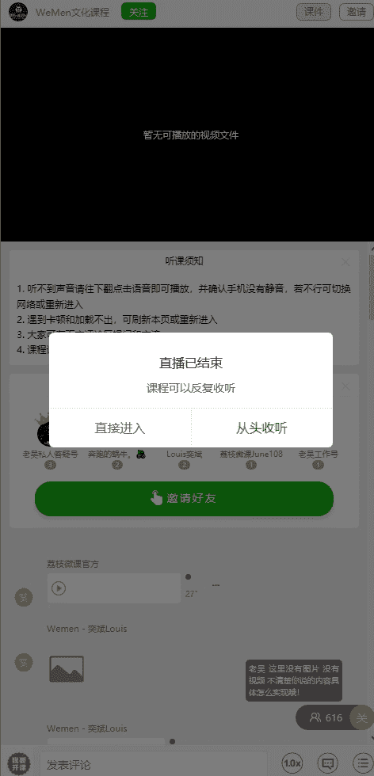
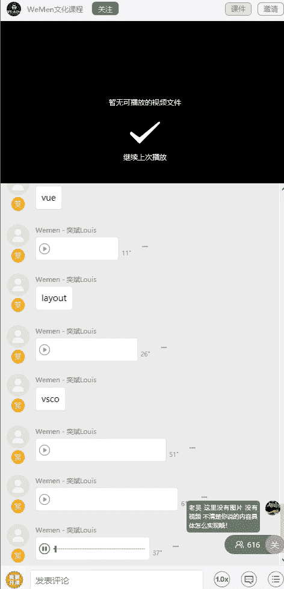
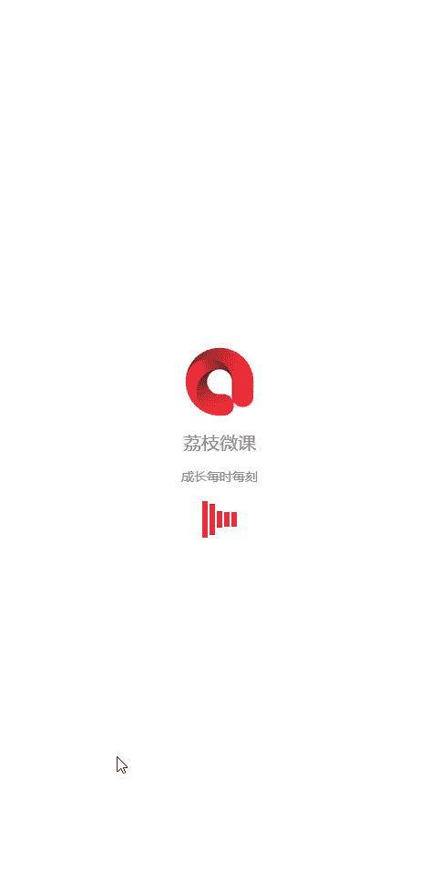

# 1、05wumen老吴《六节课从素人到达人》：四、快捷修图法 独创秘籍等你来拿

大家好，我是微人群创始人老吴。那今天这节课呢我主要是给大家分享一些。拍照修图的软件，他们的。使用方法及功能介绍。那么大家可以看到上面的图片就是我最常用的。软件大家可以去苹果商店下载。

首先我给大家介绍的第一款软件是face turn。那么这款软件主要是用来修人像。那么我会用我自己的一张照片来作为示例来给你们演示这个软件的功能。好，那么大家可以看到啊。

这款软件呢最常用的几个功能是什么呢？第一个就是。下方的平滑，那么平滑这个东西呢，我们也可以叫做磨皮。大家可以看到啊。我在我鼻子这里划了之后呢，你发现那个毛孔就变小了，是不是大家可以看到。

皮肤就变得更加的光滑。是不是大家可以看一下对比。那么更加平滑的就是会磨的更厉害。那我是不建议大家用更加平滑的，因为这样子会显得很假。那如果你平滑出了问题呢，你可以查处它。啊，这样子就恢复到原始的状态。

好，那么这个是平滑的功能。那第二个要介绍的功能呢就是一个叫做重调形状。那么这个重调形状是干嘛用的呢？我们主要是用来调整你的头部或者是身体的一个结构大小。那我们看到这里有多个功能。那我们点调整大小。

调整大小呢，它是要两个手指一起的。你看比如说。我这两个角度往回收，你会发现脸就变形了，对不对？会者往外扩张。就两个手指张开或者收拢，好吧。是这个功能。

那么还有一个功能是调整调整功能呢就是像美图秀秀的瘦脸是一样的，只是说它这个调整呢会更加的。幅度会更加的大啊，大家来看一下，我拿我的。嗯，头发作为一个例子。他那个那我我头发的往上一推，你们看到了没有？

往按着头发往上一推，头发就起来了。对吧那有些时候你的额头不是很平整，你也可以用这种收缩一下，是不是？看到没有？就是这个功能，那这个也可以拿来收敛是吧？也可以收敛同样的。那虫条形状呢？

重条形状就是大范围的这种拉伸。好吧，这个是这么这个软件的这一部分的功能。那还有一个很好用的呢叫做修补。在重调形状的右边，这个这个功能呢它有什么好处呢？它比如说。你可以去。去一个。

第一个部位的来填补另外一个部位的东西。比如说你要修补。你看。你看我选这个圈，这个在动的这个圈。是吧我要这块氛围的皮肤。然后选取之后呢。填补这一块的皮肤。懂了吧？大家可以看到对比。那么就是这个功能。那么。

另外功能就是很好用的，叫做色调在修补的右边。那么这个功能呢怎么使用呢？我们点开修补之后呢，你可以看到这里啊，它本身呢就有一个调色板。那么这个调色板里面就是一些你可以自己去选取的一些颜色。

那我平时的话会怎么去用这个功能呢？我会选取有个选取器点一下之后呢？比如说。比如说鼻子这一块，我取点鼻子这一块的颜色，你看到调色板没有？你每点一个地方调色板都会变化。好，那我想点更亮的这一块呢。

这块颜色选取完之后呢，再选色调，然后接着去涂其他部位。看到没有？我现在涂个头。有没发现。你们注意看一下额头的变化是不是提亮了。那么额头这个白色的颜色呢。

就是我提取了鼻子的颜色填补上去的这个功能就是避免有些时候你的光分布不均的时候，你可以取其中一个部地方的光来填补另外一个部分。好，介绍完色调功能之后呢，基本这个软件呢我就会使用这么几个功能。

这几个功能都是非常的好用的。接下来我给大家讲解的是关于美图秀秀这个软件。那么美图秀秀呢也是我使用频率比较高的一个，它主要有两个功能是比较好用的，一个是美化图片，一个是人像美容。

那么首先我们来看它人像美容的功能。那么他那个人像美图功能跟face词有什么区别呢？我来跟你们讲第一个。它的磨皮呢基本是一样的那它有什么特别的点呢？就是在这里我们可以看到下方有一个叫做面部重塑的功能。

因为有的人呢他在用faceton的时候容易拿捏不好。那么。美图秀秀就是一个很好的。工具啦。首先我们点这个面部丛书这个功能，然后我放大来修给你们看。我们可以看到它下面呢有4个部位的调整，比如说像下巴。

我们可以看一下啊，一般来说都是先调脸框。就比如说你的脸拍上照片之后比较大，那个呢往外是不是往外。推，然后你就发现你的脸就变小。对吧。然后呢。当你的脸变小之后呢，你的下巴还要再往上提一点点。明白了吗？

这样子就不会说整个脸呢。因为只调了一部分，然后变得很奇怪。对，然后具体这个参数呢，你根据你的个人情况来调。那眼睛呢一般都是调大小，看到了没有？左右滑动。然后还有一个。鼻子这个鼻子的话呢。

有些人他说我要鼻子小一点，那么你就往右拉一点，对吧？啊鼻子提升呢，调整位置都都可。那这个嘴唇呢，比如说你嫌你嘴巴太大了，你就可以把嘴巴调小一点，明白了吗？这这么去使用的。好。

那么接下来呢就介绍这个瘦脸瘦身功能。这个呢我也觉得是非常好用的一个功能呢，怎么用呢？难道除了可以可以自动瘦脸之外呢？它还可以手动。那一般其有些时候呢，你没办法去识别你的五官。

那么你就可以用这个手动的瘦脸功能。那这功怎么可以用呢？它除了可以自己你看手动去把你的眼睛看到没有？把眼睛给放大。因为有些人他说我的眼睛想这一个走势，那个走势，那么你就可以自己手动的去变动。

比如说这里眉毛想提升一点点，是不是都可以的。又或者是想瘦脸，对不对？是不是都可以的。那身体上比如说你肩膀塌了，垮了，你也该把衣服往上拉。对吧。这功能就是非常的非常的好用。好，那么。

再往右边呢就是祛痘祛斑功能。那有些时候呢脸上如果有一些坑坑洼洼的，你可以用这个自动功能。它会先帮你清理掉一些。那如果清理不干净呢，你就选这个手动功能，然后可以调整这个祛动的大小。好。

那比如说像像这里就是我们看这个位置有点毛孔，对不对？这样子今天点一下。毛孔就没了，看到了没有？看到没？这个就是这个功能的使用方法。那另外一个呢功能呢也很好用，叫做高光笔。高光笔怎么使用呢？注意看。

比如说牙齿对吧？你看我把牙齿扫一下之后呢，你们看下对比。看我这来回扫之后呢，牙齿就变白了。看到了没有？那么你如果额头太暗了，你可以用高光笔在额头这里扫一扫，看到没有？额头就亮了。

明白我的建议是均匀的去扫。好吧，那比如说你的太阳T太阳穴。是吧你的苹果肌想要提亮，你都可以用这种方式。这样子的话我会让五官显得更立体，明白了吧？然后有些时候呢你的皮肤有皱纹，你也可以用这个去皱。

你把一抹过去，皱纹就没了。那有些图片他抹不了，这个没办法。那增高这个功能也是非常好用的。比如说有些时候呢你的腿拍了之拍短了，你就可以用这个增高功能。我拿我的脸来做实力啊，比如说你选好要增高的范围之后呢。

向右一拉它就。变长了。然后呢。听到没有？可以自己随意的调整。长短。那还有眼镜放大这个功能呢。你可以看到眼睛放大的功能也很好用。比如说你想眼睛单独眼睛放大，你就点一下，眼睛就放大了。

然后去黑眼圈的也很好用。比如说你看我有一点点黑眼圈，那么我就调这个黑眼圈自动功能也可以，对不对？你可以看到没有？眼袋这一块呢，他就帮我给处理了。然后你自己还可以调这个长度，强度。对吧然后如果你不够呢。

你也可以用手动打。然后呢，你看自己涂抹这些范围。看到没有？这细纹都会没了。好吧，这个就是去黑眼圈的使用方法。挺好用的。那亮眼这个功能呢，它有点像那个。高光笔明白了吗？我有时候会拿它来涂眉毛，注意看。

比如说我拿。这个来涂没毛状都没毛就会变变浓的，看到没有？密毛就会变浓了。有些时候眼睛。不够亮，也可以用这个功能。好吧，这就是这这就是美图秀秀人像美容部分的所有讲解。那接着呢他在去美化这一块呢。

其实跟其他软件都差不多，都是那些调参数啊。对吧。虚化等等这些功能我就不介绍了。接下来我要介绍的就是美颜相机。那么这个呢主要是平时自拍的时候会用到它，因为。你如果用苹果的原相机去拍自拍呢。

其实脸上有些时候拍的并不是很好看，所以呢我们就会用美颜相机去拍。然后它的美颜效果呢不要调的那么高，调大概5分之1到4分之1就可以了。因为过度的美化，会让整个图片呢都有一层蒙萌的效果。

就会影响到图片的一个质量。接下来呢要给大家分享的就是一个叫做snap see的。我们中文名叫做y子的一个修图软件。这个修图软件呢也是一个。比较专业的一个修图。那么我来告诉大家怎么样去使用它。

首先我们打开它这个页面之后呢。随便点一个位置，然后选取一张照片。好，然后它会弹出弹出下面很多的滤镜，那我不建议使用这个软件的滤镜。这个软件主要是使用什么呢？使用它的工具功能。那么我们可以看到啊。

上面弹出来很多东西，那什么是比较好用的呢？比如说上面那一排哦，裁剪的话就不用讲了，裁剪的话就是裁剪图片大小，对吧？那么。调整图片是什么呢？调整图片就是调整图片的那些参数。比如说我按紧屏幕。是吧摁紧屏幕。

然后上下推动，你就会发现这些功能就出来了。那么每个对应的功能，比如说你想调亮度，你就在亮度那里停下，然后呢左右是吧，去增减你的亮度。那亮度调好了之后呢，你摁紧。看颈肉呢。往下推。往上推往上推。

然后就可以可以调对比，调饱和调氛围等等的这些功能。那每张照片呢，它修图的参数是不一样的。那对比的那就是调这些了。好吧，是吧这就是调整的功能，这功能也是非常的好用。好，那么还有一个是突出细节功能。

突出细节这个主要是调结构跟锐化。明白吗？看到没有结构。锐花就是让这个图更加的高清，看到没有？你注意看我的皮肤是不是调了最化之后更加的高清。那有些图片呢，它因为它的像素比较低，所以它就不方便用明锐化。

那如果你用锐化呢用到有很多噪点，你就往回剪。明白了吧？剪到差不多的时候，这样子照片看起来就非常的清晰。那还有一个功能就是它的曲线功能，曲线功能干嘛呢？他有一些已经stting好的一些。一些参数。

那么你看它调亮这功能是蛮不错的。对不对？整个图片都变得很梦幻。那如果你觉得太亮了，你可以点住上面的那个白点。是不是自己去调这个平衡？明白吗？这个软件还是蛮好，非常好用，很专业化。另外的呢。它它有个功能。

我比较喜欢的就是这个它这个透视功能，它这个透视功能呢跟美图秀秀的拉高又不太一样。它这个是这样子的。比如说你你选择倾斜，然后往上推。看到没有？它整个照片就往上滚动。那么这这个功能我主要用在全身照的时候。

然后那张照片呢你又不好去去拉高，那么我就会用这个透视的功能。明白了吗？让整个人更加高高起来。明白了吧？然后它会自动填补那些。空缺的地方。接着呢就是这个局部功能，好吧，第二排第10个这功能也是非常神奇。

怎么使用呢？比如说你点一下局部之后。你比如说调脸，你就先在点这里先点一个中心，然后它就会出现一个量子，然后你可以移动这个中心。他移动完之后呢。两个手指。看到没有？两个手指放大缩小。

可以去扩大它的辐射范围，那红色的就是会辐射到的地方。好，选好范围之后呢。按紧屏幕向下推就会出现这些。那么它这个是范围性的去调整亮度、对比度、饱和度结构，对不对？比如说我想我的整个脸亮一点。

你就是不是往右一拉脸就亮了，它就只会调局部的亮度。那如果你说我的脸不要那么红，你就往左调，对不对？明白了吗？它是属于局部的，然后你可以自己去调整这个范围。这就局部功能非常的好用。那它的画笔呢画笔也不错。

它画笔是干嘛呢？你可以看到下面有4个东西，它就属于自己用手动的去调整这些参数。比如说。比如说你的脸太额头太亮了，对吧？你就可以减光，然后往额头一涂啊，看到吗？额头就暗了。那如果你涂错了，你就调到橡皮擦。

然后呢一涂就回去了，懂了吗？你可以自己加光，它这个跟美图秀秀的高光笔是有点一类似的。然后你还可以调其他的参数，什么加光减光曝光、色温饱和度等等，就是用笔去调。那么。这些什么戏剧效果啊，这些我就不会去用。

但因为滤镜效果有点重，那么它还有一个功能挺好用，就是镜头模糊是吧？镜头模糊。那么这个就是。你看这几个然后摁紧之后呢。可以调这些想要调的东西，然后你也可以调这个范围。好吧。

那么这个就是叶子的功能的比较好的介绍。那接下来呢我要介绍的这个软件叫做instagram，这是国外的一个社交软件。那么它它的修图呢也是非常的好用，也是我个人最喜欢的。首先呢我们打开这个页面之后呢。

在右下角有一个加加减的图案。然后你在在这里呢可以选选出你喜欢的图片。然后进行编辑。一般来说呢，选完照片之后呢，你可以放大缩小，对吧？如果是正方形的，你就用正方形去修。如果你想要长方形的。

你就自己用手两个手指去拉动它去调整。然就进入下一步。那么这个软件呢，你可以看到它有好多个滤镜，对吧？那我个人的话呢，我会根据图片本身的情况来选择一个相应的滤镜。那我一般来说都会每个滤镜都点一下。

先看一下效果跟感觉，然后找出一个感觉最好的滤镜来使用。啊，比如说我刚看了嗯这个滤镜，我个人是很喜欢这个滤镜啊。但是你现在这样看呢。但滤镜效果很重，那么你就在。这个滤镜效果上面呢再点一下。

它会出现这个参数可以调。那么你就把参数。往左调调到感觉滤镜没有那么重的时候就可以了。好吧，因为每张图的滤镜效果调的不一样。好大家可以看一下屏幕的对比，对吧？好，然后调完这个之后呢，还没有结束。

右下角有个编辑，我们进入编辑菜单，然后你看到没有？编辑菜单里面呢也是很多参数可以调这个跟snap C的呢有些是一样的。那么我为什么会喜欢这个呢？因为它的功能没那么多。那一般来说。

我拍修图呢都是会先调锐度。对吧我会先先把图片的整体细节先弄好，再去调局部的。那你看因为这张图片本来很高清，所以调到100也没关系，好吧，调完之后呢。我会调这个亮度，是不是？哦可，如果图片有点暗。

你就可以稍微再往右加一点点。接着呢对比度，如果你想有层磨砂的效果，你就往左调，它就有一层磨砂的效果。那有些照片呢他得往右调一点点，不然的话照片很模糊。然后呢，结构结构呢。结构呢一般来说就是调个4到。

8点跟4到8点，根据每张照片的情况来看，你可看到没有？看到脸的变化了没有？这是细节更加的。明显。那暖色调跟冷色调这个就应根据图片的情况来定了。有些图片呢它更偏向于冷色调，你就往冷色调调，有些更暖。

你就往暖调，这个因具体图片具体操作。饱和度就不用讲了，就是调暖跟冷。就是。那么这个淡化跟颜色功能，我基本不用高亮的话。比如说你看这张图片，你会觉得可能有点亮。没关系，你调整高亮一减就好了。

就是他把那些高光给减弱，有些时候你的照照片有那些背景，有灯光啊或者什么的，你就可以把高光减弱，它就没有那么刺眼。那光影的话呢也是蛮好用的，就是整体的去调亮它。有些照片比较暗，你就可以光影加一点点。对吧。

均营的话呢。一般不用。移轴就有点像那个。像那个虚化，但是我更多的是先用snap C或者是美图秀秀虚化完再来这里修图。好吧，那基本来说呢。inst优势就是它的滤镜好看。那如果有人翻不了墙的话呢。

你就可以用VSCO来代替，也是可以的。好，那么ins的讲解就功能使用呢就到这里。后面我会有一些实际的照片来演示告诉大家。接下来呢我给大家讲解这个软件呢叫做美妆相机。那平时我会用这个软件怎么用呢？

我来教给大家，你打开软件之后呢，有一个高级美妆，然后选了之后呢，选择你想要P的图片。然后它一开始它会自动去识别人脸进行自动美颜。我一般都不会去用它的美颜效果，因为P上去你们也看得出来很娘，对不对？

那一般来说呢，我会把它的把它的这个美肤功能全部关掉。然后它现在呢也可以像美图秀秀一样去去去瘦脸啊什么的。但是我觉得美图秀秀的会更好用一些。那我主要用这个功能用什么呢？注意来看。

主要是用它最下面的那一排东西。比如说有些时候我们拍照你的嘴唇有点发黑或者没有颜色。这时候呢你可以给自己的嘴唇加一点点颜色。看到了没有？对不对？但是呢你不要调的参数太高，就会显得很奇怪。

所以呢你可以看到没有？我会加一点这样子的嘴唇颜色就更好看了，对吧？然后呢，有些时候呢，如果你想睫毛长一点，你也可以选择睫毛。但是一般我是不去用的，因为是女生嘛。那好用的功能是什么呢？

眉毛有些时候眉毛拍照呢它看不见或者什么的。这时候呢我会自己去选择跟我眉形差不多的。然后呢，减弱效果。你会看到没有？你们可以看到。我整个眉。对吧更深，然还有个功能，五官立体的功能也很好用。

它这个就有点带就是自动的高光笔。你可以选择你想打高光的位置。他让你的整个。看到没有？看到没有？区别就出来了，是不是五官更加的立体，鼻子也更加立体。它这个软件等于说就是代替了那些化妆工具。

然后粉底呢也可以调你喜欢的粉底。对吧。你们可以看到是不是整个脸更加的清晰，有些时候眼睛没有神了，你可以加一点点眼线。然后根据个人的喜好去加其他东西，一般情况下呢我就使用这么多功能。

VUV这个呢主要是用来制作视频的那后期呢我也会专门的针对VUE来给大家。新增这个课程。那在这里呢我就不做讲解。La out这款软件呢是ins旗下的一款拼图软件。然后我觉得这个软件拼出来的图片更有质感。

然后不会有一些很非主流的东西，然后你也可以利用一些镜像啊什么的，去把你本来就一张照片给变成两张4张，对吧？又或者是拼那种九宫图都挺好的，就是用这个layup这个软件，这个操作也是非常的简单。

我就不在这里讲解。接下来呢要给大家介绍的这款软件叫做VSCO这款也是一个非常火的修图软件。那么它主要是用来加滤镜用的，还有修改照片的参数。那使用方法呢就是点开软件之后呢，在右上角有个加号。

然后选择你要添加的照片。放导入进来，它导入进来之后呢，我们看它的。最下方有一有一个横杠的东西，就是叉叉右边的那个就是可以选择来。调图片了。那一般来说呢，VSCO的滤镜也也是特别多啊。

还可以去购买一些滤镜。那么我就给你们简单演示一下。就是选滤镜是吧？比如说你选那个滤镜。然后呢，如果你觉得滤音效果太重，你就原地再顶一下。他就可以调这个滤镜的参数，一是跟ins是一样的。

接着呢在最下方的第二个就是调参数，你们可以看到基本那些参数都是。一模一样的这个就是具体看。看你使用哪个方法。啊，比较哪个软件比较习惯？然后。然后呢，修改完之后呢，你可以选择保存，对吧？

这个这个呢是那些可以购买的。去商店购买蓬漆的。好，那么保存完之后呢。怎么样去把这张照片给导出来呢？在右下角。右下角有3个点，点击一下之后呢，选择保存到设备相册。接着这一步非常的重要。

就是很多人把照片呢发到朋友圈之后会变模糊。这是为什么呢？就是因为照片的尺寸跟微信朋友圈的尺寸不一样。如果你的尺寸过大，微信朋友圈呢会自动压缩你的图片，所以呢你的图片一经压缩就会变得模糊。

那么一般呢你不想照片模糊，你就选这个大尺寸。的第三个，然后呢，把它。保存出进手机之后呢，你发现用这个尺寸发朋友圈，它的照片就不会变模糊。这个是一个非常实用的小技巧。好，那么VSCO呢，我的介绍就到这里。

因为照片的。

