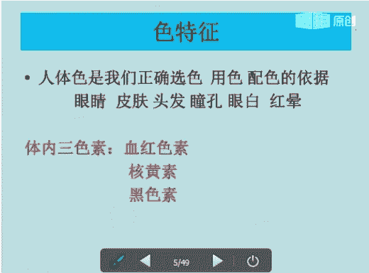
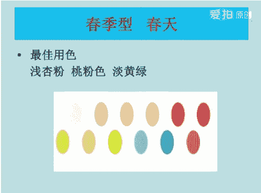
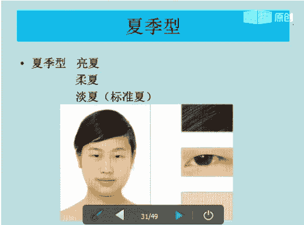
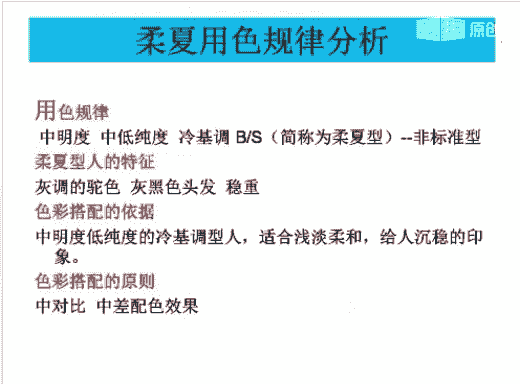
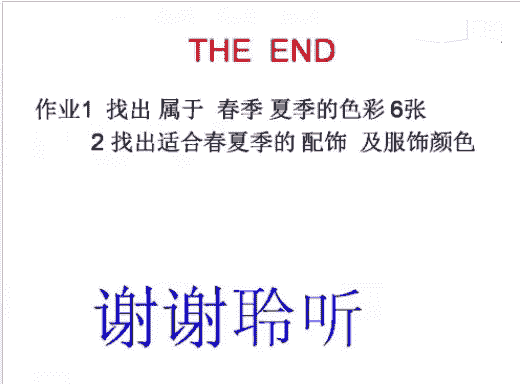

# 1、06《个人形象班》：季型基础-春夏 第三课 3月26

，各位同学晚上好，能听到老师声音的同学回复一下一好吗？好的，嗯，在这里呢，老师想问一下同学们，哪些同学是第一次听课程，第一次听课程的同学回复一下啊，好吗？好，都听过老师的课程。好。

我们今呃我们的VIP课程呢，它会人类的讲到我们的一个基础知识点。那么今天我们所讲的内容呢也是非常重要的。嗯，因为每一个知识点呢，它都是我们VIP课程里面的一个重要的部分重要的环节。

没有听过同学呢一定要认真的听。😊，听过的同学呢可以反复的听，一直到听懂为止。如果课后需要交流的同学呢，可以直接加老师1个QQ或者找师1个QQ群。好，大家可以看到吗？好，那我们现在开始上课。

那在上课期间呢，老师不会去点同意或者是添加课后呢，老师会一个一个的添加的。好，我来自我介绍一下，我呢是娜娜老师。今天呢我和大家一起共同分享学习的是我们的色彩服装的搭配，我们的中的剂型的一个基础。春和夏。

Yeah。你你完了。好。你。🤧好，你们在上课的时候关掉你们的麦克风啊，免得影响其他同学上课。好吧，大家配合一下。好，我们在上第二节课。嗯，因为上节课的话，可能你们这几个同学都没有来上课。

那我就不用提问题了。嗯，我们直接备注整主题。我们的第三节课。上节课呢我们讲到的是我们的配色。第一节课呢我们讲到是一个对色彩的认识。那么今天所跟大家一起分享的课程呢，就是我们的一个巨行的一个基础。

我们春和夏。好，大家来看到两看到这两边的图片。首先。我不。是我们一个色彩的冷暖。那有没有同学能告诉一下老师哪边是冷色，哪边是暖色。哪个是冷色，哪个是你的暖色？好，在我们前面的第一节课当中。

色彩的一个基础理论当中学习。我们知道色彩它能给我们带来一个冷暖轻重的那种感觉。那么在我们的这个图片当中。左边是以是什么颜色，右边是什么颜色，能不能告诉一下老师？知道的同学可以回复一下老师哦。好呃。

我们所说到的是呃它是冷色还是暖色？左边是冷色还是暖色？左边它是以黄色为基调的，那么呢给人感觉是什么样的感觉，是不是比较温暖的感觉？那么就是我们的暖色。好，右边它是以蓝色为基调的，它是属于我们的冷色。好。

这个有没有清楚清楚同学可以回复一下一好吗？好的，清楚清楚你就回复一下语音。好的。那我们来看一下第二个我们的色彩的一个轻重。那么在我们的图片当中，左边的颜色它会给人比较淡雅，洁净轻盈明亮的那种感觉。

右边它的颜色会给人带来沉稳。浓烈厚重的那种感觉。好，左边它是属于比较轻的，右边它是属于比较重的。好，这个有没有清楚清清楚的同学可以回复一下。一，那么轻的颜色呢是比较浅的，重的颜色呢是比较深的。

大家这样去区分就可以了。好好的。い。好，接下来我们来学习一下我们的人体色的特征。那什么是人体色的特征呢？嗯，在我们的嗯。我们知道啊我们知道世界上面有很多黄白棕、黑色不同的一个人种，对吧？

那么他们都是以我们的皮肤、毛发等色的不同为依据进行它的一个区分。好，那么我们的亚洲人呢大部分都属于我们的一个黄种人，我们属于亚洲人好，他留给我们的是什么样的一个印象呢？就是黄色像的皮肤，乌黑色的头发。

黑黑的眼珠，对吧？那么现在我们也有很多朋友都会都喜欢去做染发，对吧？去做染发。好，但是呢我们仔细的大家可以观察一下周边的每个人的皮肤眼睛毛发。那么我们就会发现，在他们身上。

每个人的人体色的特征它是不同的。大家要关注一下，关注一下，看看你周边的呃同学朋友对吧？你的室友，他的皮肤眼睛和毛发看一下是不是不一样啊，是不同的。那么首先我们看到的是眼睛眼睛。あお。Yeah。好。

第二个是我们的皮肤。第二个是我们的皮肤。第三个呢，它是我们的。毛发。第三个是我们的毛发。好。😊，皮肤它是占了70%，眼睛占了20%，毛发它是占了10%。那么它的人体色的包括我们来看一下啊，后面的。

人体色的包括。肤色发色。纯色、瞳孔色、眼白色和红晕色。那么这是它的几个就是人体色的一个包括。我们可以通过这几点来看，它到底是属于是冷型还是暖型。好，那么我们只有看肤色，它是相对稳定的，肤色是相对稳定的。

那么我们看肤色之前呢，它会有一个。体内呢它会有一个三色素啊，体内会有一个三色素。好，我们先呃回过头来想一想，人体色包括肤色、发色、唇色、瞳孔色、眼白色和红晕色。那么它是我们与生俱来的对吧？

在我们的正常一个条件下呢，嗯它的恒定是不变的。他也不会受任何的一个年龄的一个增长或者是瑕疵的一个增减的一个影响。除非是你想特意的去改变我们的肤色或者是我们病变的状况。那么这这两个呢是在其外的。好。

那么我们再来看一下人体色特征，它是呈现在我们的元素，体内的一个三色素是在我们体内的三色素，一共三个3点。第一点是我们的血红色素。血红色素呢就是我们的红色素，大家记记可以稍微的记一下啊。

第二个是我们的核黄素，核黄素呢就是我们的胡萝卜素。第三个呢它是我们的一个黑色素，黑色素就是黑色素。那么在我们的这三大色素当中，我们的黑色素，它的影响可能是。最大的它的影响可能是最大的。好。

血红色素和核黄和核黄色素它的变化可能性是比较小的。那么我们的核黄素。核黄素，那么血红色素它的比例影响它是影响我们的一个肤色的一个冷暖。它是直接影响肤色的冷暖。黑色素呢主要是看我们皮肤的一个明度。

皮肤的一个明度是白还是黑明度。好，三色素的人体中混合比例不同，那么就呈现了不同的一个人体色的特征。在我们的人体色中，我们的发色、纯色、瞳孔色，那么都可以通过纹染描画等等方式轻易的去改变。

唯有我们的肤色呢，它是相对稳定的。并且呢它是在我们的人体色中所占比例的一个最大。好。大家有没有清楚我们体内的三色素，清楚同学可以回复一下一。

好的，那么第二个第二部分就是我们一个人体肤色的一个划分。那么我们的肤色它只分肤色也分我们的色相和明度。那么色相呢就是我们黄种人他的皮肤色相主要是集中于我们黄色相和红色相的一个区域啊。比如说我们的棕色。

我们的酒红色，我们的粉色，以及我们的象牙色，还有我们的青色等等。那么它是属于一个嗯色相啊，色相。那么我们的肤色的摄像呢，它也是分为暖色和冷色的。那么大家看图片，左边的它是属于我们的暖色垂直的。

右边的它是属于我们一个冷色。好，这是我们的一个肤色的一个划分。那么我们再来看一下明度的化身，明度，肤色的一个明度，它是指肤色的一个敏暗程度，对吧？有的白皙一些，有的要稍微明。皮肤要黑一些好。

也就是我们印象当中一个人的皮肤黑或者是白。大家有没有明白？好。皮肤越白的，那么它的明度会越高，就使于我们的高明度。好。大家看到箭头左边的都是我们的高明度，中间是中明度啊，右边下面又往右走。

它是属于我们的低明度的对吧？皮肤比较暗，比较黑了。好，这个大家应该比较清楚了。好，再来看一下第二个我们的眼神，我们的纯度啊。那么在我们的判断标准当中，大家看下眼镜，眼睛的纯度，它是决定了一个用色的纯度。

那么眼睛的纯度主要是由眼球和眼白的一个对比关系及眼神的。锋利程度而决定的。H。好，眼前。第一个呢它是一个黑黑白的一个对比度。第二个呢它是属于我们的一个眼神。比如说我们眼神比较高的。

那么我们来从左边左边是我们的低纯度，它的眼神是怎么样的，力度比较小，比较温和柔软柔和，柔情似水，对吧？那么我们再来看一下右边它属于我们的明纯度是比较高的。那么我们来看一下它的力度是比较大的。

锋利锐利吸腻，具有穿透力，对吧？好，这是我们的一个皮肤的一个。肤色的明度和眼和眼睛的一个程度。大家有没有清楚清楚同学可以回复一下啊，好吗？或者说下宣花都可以。Yes。嗯。好的。好，大家看眼神力度越小。

那么它的纯度就会越低，眼神眼神越大，那么它的纯度就会越高。好，大家记住就可以了。好，接下来我们再来学习一下我们的视觉平衡的原理，这个视觉平衡原理呢？

就是告诉大家冷型人为呃就是要告诉大家为什么冷型人要穿冷色，暖型人要穿暖色，那么这个呢它的一个原理呢，大家只需要了解一下就可以了。大家只知道有这么一回事就行了啊。好，肤色为什肤色为冷色调的人。

它是适合穿用我们的冷色，对吧？就是你的肤色偏白，偏白的话呢，它是属于我们的一个冷色调，对吧？好，如果你的肤色是有一点点偏黄或者是有点偏暗的话呢，它它是属于我们一个暖色，对吧？我们的小麦色。

它是典型的一个暖色系的。好，那为什么我们要为什么它它的这个依据是什么呢？就是。要达到一个和谐。因为我之前在上课的时候问过大家，那什么是美？那么有的同学会告诉老师。气质神韵。美丽对吧？大方，那么它是美。

其实呢。美的话它有很多的形容词，我们可以这样来理解说。和谐平衡舒适，它才为美。好，这是经常我说到的一句。那么在我们的理解当中呢，就是健康的自然的。

那么瑕疵淡化的光点匀称匀整的那么皮肤呢它是一个最理想的状态，对吧？那么那就是美啊，如果脸上有瑕疵或者是不自然的，或者是有那种病病变的那种就是状况的，那么它就不是和谐为美了，对吧？好。

那么嗯那么这个状态下面呢，它的理想的一个肤色位于中性肤色区间。好，为什么要这样说呢？就是当一个暖基调的颜色放在我们的一个下方。比如说我们是冷型人，对吧？放一块呃暖色的一个颜色，放在你的那个脖子下面。

脸脸部下面。好，我们呢它就会产生一种冷倾向的一个长相叠加在我们的皮肤上。如果你的肤色是卵基调卵基调的一个皮肤，那么它是与我们的冷残相叠加去调和的。好，那么会倾向于我们的中性会趋向于我们的中性肤色。

那么我们我们就会觉得肤色当中。并合就是肤色当中的一些颜色，它并有就是没有改善没有改善。那么我们可以从视觉上面去。和谐从视觉上面去和谐。好，如果你的皮肤是冷肌掉色，那么在与我的冷残相叠加的话。

那么它只会让我们的皮肤看起来发青发黑的那种感觉，那么它会产生一个不协调的不协调的感觉。所以呢我们我们在嗯。冷型人呢他也不是不适合穿暖色的衣服，只是说如果你是冷行人的话，你可以。

暖色的衣服不要在你的就是脸部下面去做搭配，你可以在下身裙子或者是鞋子或者是包包去做搭配。那么这样看起来呢，它的整体要和谐一些。如果你是软型人的话，就建议你就是比如说你的上上面的衣服或者是你的围巾，对吧？

或者是你的丝巾等等。你的外套不要去穿我们暖色系的衣，不要穿我们冷色系的衣服。那么这样看起来呢它也会不协调的。那么从我们的它的它是给人感觉的那种视觉上面不和谐。所以呢大家一定要记住，冷型人。

如果你是冷行人，那么你想穿暖色的衣服去做搭配，那么可以穿下身包包，对吧？或者是你的视频的视频，就是你的脖子下面这一块都不要去做，不要不要去搭配就行了。下身去搭配鞋子包包裙子，裤子都O。

如果你是暖型人的话，建议你的下面不要去穿冷色调的衣服，还是下面去搭配冷色调的衣服，这样看起来比较和谐一些啊，这个就是有没有清楚。那么这个呢就叫我们的强相补色，大家有没有清楚。清楚同学可以回复一下一。

不清楚的话也没有关系。后面的话我们还会讲到的。这一块呢大家只需要了解就行了。好，接下来我们再来看一下。什么是世纪生产理论？之前在前面的课程我们都已经讲了第一课，对吧？

大家看了这个图片会再来给你带来一种什么样的感觉，什么样的氛围。好，第一个我们春季型上面左边上面春季，那么它是暖，它是一个暖色调的较青的一种。它的氛围呢就是朝气明媚，年轻活泼和温暖的那种感觉。好。

我们再来看一下。右边的图片上面秋季型，那么它是我们暖色调中较重的一种。它的氛围成熟，稳重、华丽，浓郁丰收，对吧？那么这些颜色大家看得到，它是我们的黄，它是加它是加了黄的对吧？好，我们来看一下下机形。

下机形左边下面的。冷色调中较轻的一种。那么它的氛围呢清凉凉爽淡雅和柔美。好，右边的这个下面冬季型，它是冷色调中较重的一种。好，它的氛围强烈个性、饱和、寒冷和冰释。那么在我们的四季色彩理论当中。

那么这四组的颜色，它是因我们季节带给我们的一个心理感受的那种类饰，对吧？大家可以看图来说话，所以呢我们就把它分别为春夏秋冬四个季型来作为它的一个名称，也便于大家方便的记忆。好，这个有没有四季色彩理论。

有没有清楚？亲的同学可以回复一下一好吗？清楚同学可以回复一下一。Yes。好，我们现在要讲到的是我们的一个色彩的一个鉴定。色彩的鉴定呢鉴定它有一个就是基本的要求。首先呢我们在外部的环境的一个要求。

第一个自然光下去鉴定。那么我们一定。不能在就是比较暗的房子里面去鉴定，那么它会就是嗯有色差鉴定出来它不准确。好，第二个，那么室内的墙壁全部为白色才可以。因为周边如果有色彩的话呢。

它会有投射反射的一个影响。那么这样做诊断呢也是不准的。第3个好，避免避免就是。避免是温度过高或过低，它会影响一个鉴定的一个鉴定者的一个肤色。这是第一个。第二个就是我们对被鉴定者的一个要求。好。

本身肤色为基准，那么如果顾客化了妆，那么我们应该先去让顾客卸妆。第二个防晒霜防晒霜我们也是不能涂的，那么它会改变我们的肤色，对吧？第3个，肤色暴晒过敏，那么这些我们都是不能去做诊断的。

那么等到你的肤色恢复自然之后，我们才能进行一次诊断。好，第四个，那么戴了眼镜，戴眼镜的话呢，如果你戴了有有色的那种隐形眼镜，我们应该要摘取下来。因为它对这个也是有影响的。好，第5个，如果鉴定者纹了眉毛。

纹了眼线或纹了唇的那种情况下，那么这个我们是也是做不了的。第六个，要求我们鉴定者的脖子上面不要戴任何的首饰，首饰也会有影响。好。这是我们鉴定的一个基本要求，外在环境和对被鉴定者的要求。

来看一下第二个我们的一个畸形的鉴定，怎么样来怎么样来鉴定呢？那么通过我们色彩规律的一个分析，那么总结了每个人的一个人体色的特征，对吧？刚刚前面已经讲到人体色的特征。那么它的这些特征呢对应的服饰色彩分布。

它是有区域的。好，按照我们的一个就是按照我们的一个理论的依据，那么我们把它分为四组，那么也就是暖色系分为春和秋，冷色系分为夏和冬，大家记清楚啊。那么要测出我们顾客的一个冷暖的基调。

那么帮帮助我们客户找到适合他自己的剂型，并且划分出其协调的一个色彩的范围。那么再根据每个人的细节特征，给出我们的服饰，化妆色彩的搭配规律。好，这是我们整个的一个色彩的鉴定。那么呃鉴定完了之后呢。

我们就要去认识我们的专业工具，对吧？镜子啊、白围布啊、丝巾啊、发带啊等等啊，我就不一一跟大家说了。那么现在这个上面看到的是我们一个春季型的色布，对吧？它就是我们进行鉴定的一个专业的一个色部。好。

进行鉴定专业色部呢，它是色彩鉴定必须的一个专业的工具啊，我们给顾客做诊断，都要用个用到这个色布。好，一共呢它是20块，分为呢4组，每组呢分为5块。那么顺序是粉红黄绿蓝的一个顺序来的。好，那么如果是大家。

在给客户做诊断的时候呢，我们能快速的找出顾客的一个色彩群。那么为顾客的一个正确的着装呢，他用色提供了一个科学的依据。好，这个春季型。春季型的几个颜色，粉红黄绿蓝啊，这是春季型的。

好，第二部分就是我们的一个冷暖测试的要点。要点我们等于说我们直接做了一个社部做。扑到我们顾客的身上之后，我们就要去看顾客测出他的一个冷和卵冷和暖，他是属于冷型人还是冷型人。那么我们通通过做。通过。

给客户做诊断，然后找出我们客户的一个就是冷暖，对吧？我们要。测试的一个要点。第一个呢就是光泽的。如果光泽的皮肤，它是健康光亮的。如果不是，如果不合适的话呢，它是会暗无生机的。好，第二个是我们的云枕。

云枕呢如果那个色部如果适合它的话，颜色它会肤色均匀。如果不适合的话，它会面部斑驳。第三个我们的透明度透明度的话呢适合的话就是。透润水灵不适合就是毛孔堵塞。我们可以通我们可以通过这个色部来看到射部来看到。

好，第四个我们的立体，我们的。T须字的一个突出，内轮廓突出是适合的光点散呃，就是光点散乱。轮廓凸显它是不适合的。好，第五个我们的瑕疵，雀斑、黑眼圈、眼袋对吧？痘痘，那么这些呢它是适合的，不适合的就是。

瑕疵明显。好，第6个。红晕红晕的话呢，它是自然扩散的。好，满面。好，它是自然扩散的，不适合就是红晕突出。第6个。啊，第七个我们的眼睛眼睛的话呢，它是如果适合的话，眼睛是上扬的，不适合的话。

眼睛它是下移的，就是焦点下移，没有精神。好，第八个，我们的表情如果是适合它的颜色，那么它会柔和。如果不适合的话，它会比较呆板，那么就会那种不开心的那种表情。好，这是我们的一个测试的一个要点。嗯。好。

我们的测试要点完了之后呢，有一个轻重测试要点。轻重测试的过程呢，它是不不要太注意皮肤的一个变化。那么我们可以把重点放在我们的眼睛上面，皮肤呢它是与测试部的衔接关系。好。

我们可以用金银色部来做那个就是验证。Yeah。好，我们再来学习一下我们的肤色的一个。肤色的一个机型。好，肤色色票呢它是对应着我们的一个四季的属性。那么大家看到的这个呢。

就是我们是有一个专专业的一个就是肤色色票啊。那么春季型它的肤色。分淡牙色、浅象牙色和象牙色明度是高明度和中纯中明度。那么这是春天的夏天，它的肤色分乳白色、粉白、米白、粉粉白。好，还有我们的乳白，对吧？

泛青的驼色，我们的小麦色。好，颜色越白，那么它的明度会越高，那么乳白色属于高明度，粉白色属于中高明度。好，米白色属于中高明度。那么粉白呢它是属于我们的中明度。呃，我们的浅小麦色呢属于我们的中明度。

小麦色呢它属于中低明度了，泛青的驼色属于中明度。好，我们是通过这个肤色色票来给顾客做诊断的。好，我们在讲春进行之前，那么还有一个色彩的鉴定的流程，我跟大家说一下，讲解一下。

大家就是清楚的知道我们是怎样一个流程。那么首先呢我们要与顾客要与我们的顾客电话预约我们的鉴定时间，对吧？大概顾客形求过来。第二个，那么我们要准备个人色彩规律的一个鉴定的服务专用物品和工具。

我们的工具一定要到位。第三个，我们准时接待我们的客户好，客户到了，我们要去接待。那么我们要去讲给客户讲四季色彩理论的一个基本的原理。第四第四个，那么收取我们色彩鉴定的相关的一个费用。第五个。

那么我们就可以用白围布遮挡顾客上半身的一个服饰的一个色彩。好，填写顾客登记表。好，第六个呢就是顾客如果带有妆容的话呢，我们要先给顾客去卸妆，然后整理他的头发。第四个呢就是观察。

看我们顾客的一个人体色对吧？肤色、唇色、发色等等。好，第8个，那么我们要交换色部，比如说我们的春季型和夏季型，那么观察他皮肤，皮肤的话，它是因色因色彩冷暖而产生的一个变化啊，第九个就是交换我们的色部。

我们的秋季型和冬季型。第10个就是我们的口红和经营部来做验证，它的一个冷暖到底是属于冷型人还是暖型人。第11个，那么就是春秋和夏季的夏冬的一个色部。好，轻重。好，第12个用射部来作证。

那么来反推它的一个就是造型验证的一个结果。得出。正确的一个结果。第13个，我们用46色布为顾客找出他适合适合的一个色调，它是什么色调色调我们在后面可以会讲到第14个顾客讲解的鉴定报告。

那么进行服装色彩搭配的一个。就是跟他要搭配色彩。进行分析对吧？好，第十五预约下次的时间。啊，给顾把顾客的一些资料，我们要输入我们的电脑啊，这是我们的整个流程整个流程。好，这是我们做诊断的一个流程。好。

再就我们接下来我们讲春季型。春季型呢它是我们嗯它是属于我们的亮春，它是属于一个非非标准的一个春季型的淡淡春和柔春。那么整体的给大家看图片啊。毛发与肤色间它是有对比感的。

那么整体感给人感觉年轻的、朝气的、生动的对吧？适合的一个服饰用色它是。浅淡的鲜明的、生动活泼的一个暖基调色的色彩群。好，春季型的人春季型春春季型的人，他的人体色的特征，我们来看一下。

肤色为高明度、中明度和低明度。那么红晕呢它是嗯香瑚粉桃粉对吧？桃粉色眼睛呢它是属于轻盈好动的。好，瞳孔棕色或者是棕黄色，眼白，我们的湖蓝色头发呢它是比较柔软的，发质比较细，整体氛围娇气活力生动。啊。

这是我们春季型内人。好，那么这些颜色呢，它是在生活当中，它不仅仅是这么多的颜色，它有好多的颜色，这只是其中的一部分其中的一部分。好，那么我们来看一下这些颜色。

这是春季型春季属性的一些比较清澈鲜艳靓丽透明的一些颜色。它是黄色调中暖暖色系中的一个色彩。那么它给人呢它是春风得意。愉悦的那种感觉啊。Okay。好，我们再来学习一下春季型的一个色彩搭配的技巧。

那么我分了5个。第一个呢是春季型的人，它是适合鲜亮明亮的色彩裙，鲜艳明亮的色彩裙，大家要记住了，一定要以清浅明亮，温暖靓丽为主，这是它的一个色彩裙。第二个，春季型的色彩裙没有黑色。但是但可用本色。

但可用本色裙较深的一个蓝色或者是棕色来代替。好，第三个黑春季型的人，蓝色要选择有光泽感的色感，比如说我们的暖灰，我们的黄色系好，第四个，春季型的人适合浅暖灰和中暖灰，那么一定要带有明亮感的灰色。

浅水蓝色和桃粉色，这这两个颜色可以去做搭配。春季型的人，它是适合泛黄泛黄的白色，那么泛白的黄色泛白的泛白的那种纯白色，它属于我们冬季型的人，大家要搞清楚啊搞清楚。好，它的一个用色分析规律。

中高明度、中高纯度的软基调色，那么是称为我们的亮村。好，它的特征，头发呢。它是光茶色或黄溢色。它的色彩搭配依据呢是中高明度、中高纯度的暖基调色。那么给人呢就是强烈的印象，对比度比较高。

鲜艳明亮的色彩裙选择的话，第四个，我们原则搭配原则清晰明了，有对比效果的原则，有突出朝气和我们的俏丽。Yes。好，我们再来看一下我们典型的一个色彩搭配组合。典型的搭配组合的话呢，它是适合的颜色呢。

都是比较浅淡的颜色，比较浅淡的颜色，它是属于我们一个淡春淡春。好嗯。那么它是最高明度、中低纯度的一个软基调色。嗯，它的一个人体型的特征呢就是轻盈柔和的眼神。那么它的头发呢是比较柔软的，白皙均匀。

透明的一个肤色。好，它的一个色彩搭配依据呢就是高明度、中低纯度的暖基调色。那么适合我们浅淡明亮的色彩裙好，它是比较柔和的颜色。刚才已经看到了它的搭配原则呢就属于我们一个渐变的搭配和宁近色的搭配。So。

好，接下来我们学我们讲到的是我们的柔春型柔春型啊。中高明度中低纯度。好，它的一个人体的特征，白皙的象牙色，棕色发头发眼神呢稳重。色彩搭配的依据，中明度、中低纯度的软基调色。

那么适合我们浅淡柔和的色彩群比较沉稳。它的搭配原则，中度对比的原则，中差色相配色，它属于我们的中差色相配色。中差色相配色在我们的摄像环中，它是4到7格进行配色。好。

接下来我们再讲解一下我们的春季型的春季型的人四季的一个用色指导。春季型的人，他在色彩群中所有的颜色呢都是比较明亮鲜艳的对吧？好，那么这些颜色呢都是我们春季型的人在春天里面可以去选择的一些颜色。

比如说这个图片上的浅粉色、桃粉色和淡黄绿色，还有我们的一个。蓝色对吧？那么这些颜色都是在我们春天里面可以去用到的。好。

那么我们再来看一下春季型的人在夏天里面的用色，那么选的颜色呢都是比较浅淡的颜色，对吧？给人感觉很柔和，淡淡的粉粉的那种感觉啊，它是浅。比如说我们的浅暖灰色和我们的紫色也可以去做搭配。

也可以和我们的蓝色去做搭配，还有我们第三个颜色，我们的一个红色，对吧？好，比较柔的那种红色可以去桃粉去做搭配啊，这是我们春季型人在夏天里面的一个用色。好，我们再学习一下春季型人在秋天里面的用色。

浅驼色、金棕色。那么橙色和暖玫瑰色、宝石蓝色，我们的绿松石蓝等等比较合适的一个春季型的人在秋天里面的一个用色。那么我们可以呃。绿松石蓝色和橙色搭配，那么是最合适的。那么我们要注意所选的颜色。

棕色是不能太深的。那么太深的话呢，它会给人感觉穿的比较。俗气老气的那种感觉啊。好，再来看一下春季型的人在夏天里面的用色。好，夏天在呃春季型的人在冬天里面用色颜色就比较多了。嗯，都是一些亮色。

比如说我们的呃大部分啊大部分的颜色就是紫色、灰色、灰蓝色，对吧？还有我们的蓝色，那么都可以是我们的大衣的颜色。好，大衣的首选颜色。好，再来看一下我们的发色。我。Yeah。好，首先我们来看一下帽子。

先看一下帽子，好吧，先看一下帽子是怎么去搭配的。好，帽子的话呢，春季型的人帽子的一个用色可以从服装的色彩上面我们可去做搭配去考虑。那么可以跟服装形成强烈的一个对比，也可以形成我们的一个统一。

形成我们的统一。Yeah。と。帽子的话呢，我们要禁用我们的黑色，那么要与一些柔和的颜色去相呼应。嗯，我们可以。让它成为类似色的，我们可以让它成为类似的色调，类似搭配。比如说我们的明黄色和我们的紫罗蓝色。

那么呢这两个颜色搭配在一起呢，就是比较鲜明的一个对比。我们的深橘色和橙色呢，还有我们的金橘色，那么呢它是属于我们一个统一，对吧？它属于我们一个统一的统一感，浅色浅贵肉色、粉色。

那么呢它是形成我们的一个类似的柔和感，好，帽子呢就不要去用黑色，那么过深过重的颜色呢，它会导致我们春季行人的一个白色的一个肌肤会很怪异。你怪你不。Yes。好，再来看一下我们的头发，看一下我们的头发。

头发呢就是棕色、铜色和金色。那么这些都是我们的软色调，对吧？嗯，它是适合我们的一个。春季型的人眼镜的话呢就是镜框要尽量选择与眉毛相近的颜色。好，比如说我们的头发的颜色和明度，它要相协调。

通常呢肤色比较浅的人最好是选择我们比较浅淡的一个镜框。肤色比较深的人呢选择颜色呢就是较重的一个镜框。所以呢我们一定要和你的皮肤颜色去相协调做搭配，这样是比较合适的。好，我们再来学习一下。

首饰春季型的人呢，尽量去带一些，就是宝石宝石比较适合啊。还有我们的一个。黄金黄金饰品是比较适合我们冲气型的人，不要去带我们的铂金，铂金它属于我们的冷型人了啊。好，下肢型的人佩戴白金银饰饰品。

那么它会显得生硬和廉价一些。那么不适合鞋子就是。选择一些米色、浅驼色。来做搭配。好，休闲场合选黄色，约会场合选绿色。那么包包和鞋子要相呼应，要浅淡一些，柔和一些。包包的话呢嗯就是整体给人要达到。

就是你的衣服的颜色，包包的颜色要能达到我们统一和谐的一个效果就OK了啊，这是我们的一个配饰。这是春季型的基本色，基本色呢呃基本上都是什么颜色都可以去做搭配。那么在我们的职场一个穿着，职场的一个穿着。好。

我们再来看一下我们的蓝士，看一下我们的蓝士。男士春季型的人，他的眼睛是比较明亮的，皮肤是比较白皙的。好，适合温暖而明亮的色彩来表现它的一个朝气与它的活力。那么在我们的色彩搭配上呢。

搭配上应该遵循我们一个鲜明对比的一个原则。啊。好，蓝色的话呢就是我们的暖呃就是暖灰，我们的浅浅呃浅肤色，我们的酒红色、棕蓝色，那么这些颜色都可以去做搭配啊，都可以去做搭配。浅绿松是蓝色。

夏天里面的一个外套的颜色。好，这是我们的蓝色。好，我们再来学习一下我们的夏季型。夏季型标准的夏季型呢，它分为我们的戴夏和代夏。非标准呢，它是我们的。亮下和柔下。那么我们来看图片。

也是通过它的一个毛发眼睛对吧？和它的肤色来判断夏季性的人体人体色的特征。我们来我们来看一下啊。

夏季型的人，他的肤色高中低明度均有，肤质呢是比较轻薄的，肤色表现呢它是为乳白色。好，健康的小麦色红红晕，水粉色对吧？眼神轻盈明亮，瞳孔呢它是玫瑰棕色、灰色。那么它是属于我们一个美型人。好。

眼白呢它是呈线我们的柔白，头发呢是我们的灰黑为主，整体氛围温柔亲切。

适合的一个服饰用色。其心浅淡。安详的冷机调色的色彩裙，那么这些颜色呢都是比较清晰浅淡的。好，我们来看一下夏季型的人色彩的一个搭配技巧。夏季型的人适合穿轻柔淡雅的色彩，那么要以清新雅致为主，和谐。第二个。

夏季型的人它是不适合穿黑色的，特别是我们的藏蓝色。如果你特别想用藏蓝色的话呢，想穿藏蓝色的衣服，你可以用灰蓝色、蓝灰色对吧？紫罗兰色这些就是比较深的色彩来做代替。第三个，夏季型的人穿灰蓝色和蓝灰色。

它是比较高雅的，具有女人味，有有一种女人味的那种感觉。那么不同深浅的一个灰蓝色呢，它会有着不同深浅的一个紫色去做搭配，也是比较合当的。第4个夏季性的人，他是不太适合穿棕色和黄色的。那么这两个颜色呢。

它是我们。秋季型秋季型的颜色。那么建议你可以作为夏装和鞋子，对吧？不要就是我们刚才讲到视觉平衡原理，这是我们的冷型人，不要去。在你的面部下面去穿你的暖色，对吧？这样是不太不太和谐的。

你可以就是作为夏装或者鞋子去做搭配。是。夏季型的乳白色、淡蓝色、淡粉色，那么浅葡萄紫色这些色彩都是可以做搭配。好，第第6个春季型的人非常适合。蓝紫色大衣套装对吧？那么它会烘托出我们夏季型的一个雅致感。

好，我们再来看一下它的一个用色规律的一个分析。带下高明度、中低纯度，它是我们的冷机调色。好，淡下人淡下人的一个特征，轻盈柔和的眼神。柔软的灰色头发，乳白色的一个皮肤好，第三个色彩搭配的依据。

那么高明度、中低纯度的冷机调色适合浅淡明亮的色彩裙，那么比较柔和。色彩搭配原则，渐变搭配临近色的一个搭配。好，我们再来看一下亮相。这个颜色大家看清楚没有？浅淡明亮的色彩裙啊，就是适合的颜色比较淡雅雅致。

好，第二个就是我们的一个亮相。中高明度中高纯度的冷机调色，那么称为我们的亮夏。亮夏的特它的一个特征呢就是明亮，就是它的眼睛呢是比较明亮，灰黑色的头发。那么中高明度中高明度中高纯度，那么它是冷机调色。

适合我们渲艳明亮的色彩裙。啊，它的对比度是比较高的，清晰明亮，对比效果突出娇气和活力的那种感觉。好，适合它的颜色，鲜艳明亮的色彩裙，鲜艳明亮的色彩裙，左边的适合的颜色，右边都是适合都是我们的一个。

秋天的颜色。好，来看一下柔下柔下的话呢，它是中高明度、中中明度、中低纯度的冷机调色。好，它嗯就是它的一个特征呢就是灰灰呃灰调的一个。驼色适合我们的灰黑色，眼神呢是比较稳重的。

眼颊呢是呈现薄而淡的一个水粉红晕。中明度、中低纯度的冷机调色，适合浅淡柔或者色彩区。好，它给人呢是沉稳的一个印象。它是一个对比中度的一个对比，中差配色的一个效果。

。浅淡柔和浅淡柔和，用色适合的颜色，浅淡柔和的色彩裙。好，夏季行的人在春天里面的用色，这是它的一个四季用色的指导。淡粉色就是柔的薰衣草色。清清水色对吧？清水绿色，那么这些颜色都是比较柔和的颜色。好。

在下面再。春天里面夏季型的人，春天里面可以选用到这些颜色去做搭配。我们再来看一下夏季型人在夏天里面的用色。好，我们看到这些淡淡的颜色呢都是比较柔和的对吧？浅淡浅淡柔和给人一种比较凉快的那种感觉。啊。

那么这些颜色呢就是大部分是我们的裙子，我们的衬衣和吊带背心的一些用色。好，春季型的夏季型您在秋天里面的用色，适合穿灰蓝色、牡丹紫色，对吧？那么我们也可以我们也可以与它就是浅淡鲜明的一个颜色来做搭配。好。

这些颜色秋天里面的颜色。夏季型的人在冬天里面用色呢，颜色都是比较大胆的一些颜色。好，深灰蓝色，深蓝紫色。那么这些颜色呢就作为我们的一个外套大衣的一个首选的颜色。好，我们再来看一下他的帽子。😊，Yeah。

Yeah。帽子的话呢，我们也要是根据我们的服装来做搭配的。那么夏季型的色彩裙中浅淡的一个色彩，通常呢它是跟衣服同色。同色相或者是嗯同色调的色彩。那么也可以是我们的类似色，或者是我们的类似色彩来做色彩。

夏季型的帽子的颜色呢主要是来源于两个方面。第一个呢是我们的类似色的搭配。和统一色的搭配。比如说我们的嗯淡蓝色、蓝紫色、灰蓝色，对吧？那么它都是属于我们的一个类似色。好，第二个呢就是。Yes。

我们可以嗯让他来用一个。支配配色的方案来进行搭配。支配配色的方案来进行搭配，这是两个。染发染发的话呢就是嗯跟前面是一样的，服饰妆面色彩呢一定要是轻柔浅浅淡的、淡雅的。那么一定要和你的一个人体色的肤色。

头发一定要去相呼应相呼应。达到一个就是平衡和协调为美的那种嗯感觉。下肢型的人呢适合染灰黑色。灰褐色和酒红色，就是我们夏季型的人，适合了染头发的颜色。眼镜的话呢就是尽量要选择与眉毛相近的颜色。

与头发相近的颜色明度。明度一定要相协调。比如说我们肤色比较浅的人，最好去选择我们比较淡雅的一些镜框。肤色比较深的人呢可以选择一些比较重的一些镜框。好，比如说我们夏季型的人，他的肤色比较白，对吧？

我们可以选择比较柔和的粉色和银色来做搭配，那么皮肤比较暗的人呢，就是我们可以稍微选择红色或者蓝色的镜框来做搭配。好。Yeah。

好，再来看一下我们的手势。首饰的话呢就是夏季型的人呢，它是适合我们呃清澈淡雅的那个就是淡呃浅淡的一个明亮干净的宝石。我们的白金和银首饰清新典雅的那种感觉，夏季型的人呢它是不适合带我们的黄金饰品的。

因为黄金它与皮肤它是相排斥的，那么它会显得十分的庸俗啊，就是首饰鞋子的话呢就是夏季型的人可以选择我们的乳白色，蓝后灰色对吧？那么这些等等一些比较柔和一点的色彩。休闲场合呢，大家可以搭配银色和明亮的颜色。

明明亮的蓝色黄色和紫色。约会场合呢，大家可以选择我们的淡粉色，我们的玫瑰、粉色、玫瑰红色等等的这些颜色。好，夏季型的人不适合穿黑色的鞋子，那么黑色它会嗯。黑色它会显得过于的沉重。

那么它会破坏我们的一个柔和和优雅的一个气氛。包包要选择淡雅明亮温和的颜色。休闲场合呢我们可以选择淡蓝色玫瑰粉啊，玫瑰粉是我们的首选的颜色。约会抢合呢我们可以。😊，根据它的一个用色的那个情况来做选择。

还要注意的是，包包的颜色最好能够与衣服相。衣服与鞋子相呼应，能达到一个统一和谐的一个效果。好，这个呢就是最后一个呢就是我们的一个嗯夏季型的一个基本色。那么这些基本色的话呢。

嗯都是在我们的一个职场的一个穿着，职场的一个穿着的配色。基本上就是灰色对吧？咖色。蓝士的话呢在那种嗯在公司的话呢，就是我们的黑色藏蓝色，对吧？一些颜色来做搭配。Yeah。好，今天晚上课程我们就讲完了。

谢谢大家的聆听。嗯，还有就是我们就是每每次课程讲完之后呢，会有一个作业，就是找出属于我们春季夏季的一个。一个就是色彩图片的6张，还有就是找出我们适合春季型的一个配饰及他的一个服装服饰的一个颜色。

做完之后，你们直接发到我的邮箱就可以了。Yes。

