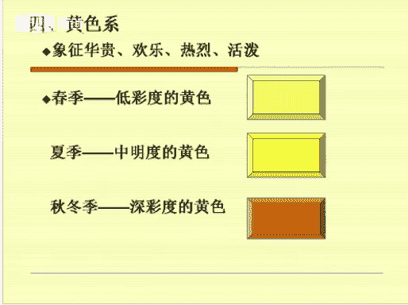

# 1、06《个人形象班》：服装搭配技巧-第十二课 4月14日

Yeah。各位同学晚上好，能听到老师声音的同学回复一下一好吗？そ。Yeah。Oh。能不能听到老师声音，能听到老师声音的同学回复一下一。对。🤧。Yeah。Yeah。Yeah。Yeah。🤧嗯。

今天呢我和大家一起共同分享，学习的是我们一个服装的色彩搭配。那么这个里面呢也就是两个内容。第一个呢就是我们对色彩的一个认识，回顾前面的一些内容。第二个呢就是告诉大家几个一个呃告诉大家嗯。

6种搭配的一个技巧。我们的1个VIP课程呢，它会轮流的讲到我们的一个基础知识点。那么前面所学习的内容呢，全部都是我们的一个嗯基础的。今天呢我们所讲的内容呢也是非常重要的。每一个知识点呢。

它都是我们VIP课程里面的一个重要的部分。

Yeah。Yeah。嗯。如果嗯没有听过的同学呢，一定要认真的去听。听过的同学呢可以反复的听，一直到听懂听懂为止。如果课后需要交流的同学呢，也可以直接加我的一个QQ。那我们现在开始上课，在上课期间呢。

老师不会去点同意或者是添加课后呢，老师会一个一个的添加的。好，我们首先呢讲到的第一部分呢，就是我们一个色彩的一个基本的知识。嗯，那在前面的课程当中呢，我们讲到过对色彩的一个认识。这。好。

还有对呃色彩的一个识别。我们的一个光雨色。那么这个图片上面呢显示的就是我们的一个原色，这就是我们的一个三原色。那在上课呃在上新课之前呢，我也会提到一些问题。那有没有同学能告诉一下老师三原色。

我们的色光三原色是哪三个颜色？我们的色料三原色是哪三个颜色，能不能回复一下老师？色光三原色是哪三个颜色？色亮三原色是哪三个颜色？那你的这个红红蓝黄是色光三原色还是色料三原色？好，再想一想再想一想。

Yeah。三原色，那么我们是不能用其他的一个。其他的颜色混合而成的，那么就叫做我们的一个原色，对吧？那么原色呢它是有两个系统的。第一个呢就是站在我们光学方面的一个利润，那么称为我们的三原色。

第二个呢就是我们站在我们色彩或者是颜料的一个方面的利润。那么我们呢就称为我们的一个染料三原色。大家有没有清楚？色光三原色的一个。理论和我们的一个阴元色料三原色的一个。

大家有没有清楚清楚的同学可以回复一下一。那么我们的光的三原色呢就分为我们的红绿。蓝红绿蓝。好，那么刚才这个同学回答的这个红蓝黄。是我们的一个就是染料三原色。两染亮三原色。

那么我们的色光三原色就是我们的红绿蓝。好，这个有没有清楚清楚同学可以回复一下一好吗？这是我们的一个原三原色。那么第二个呢，我们就来先讲一下我们的混合色。那什么是混合色呢？就是在原色之间它去相混合。

那么可以得到一个新的色彩。那么这个新的混合色彩呢就叫做我们的一个建色。建设呢我们也可以称它为二次色。那么。如果我们把建色，也就是把我们的二次色和其他的一个色彩去混合的话呢，我们会得出一个新的色彩。嗯。

那么这个新的色彩呢，它就称为我们的一个复色。那么复色呢我们也可以称它为3。三次色对吧？三次色好，如果把复色再次和其他的颜色去相混合的话呢，我们就可以得到二次复色，三次复色，那么一直到无限就这样推下去。

好，混合色大家有没有清楚清楚同学回复一下一。那么我们的混合色都是在我们的一个三原色的基础上去演变的。大家有没有清楚清同学回复一下一。

这个。好，那么我们再来看一下，这是前面的一些基础知识啊，第二个呢就是我们的一个常用的一个服装的一个配色的方法，配色的方法。那么我们首先来看一下。

之前有没有一个就是之前大家有没有去学学过我们前面的款式风格，大家有没有去学过，有没有上过这个课程？上过这个课程的同学回复一下一好吗？有没有去上过款式风格？好，那么我们来看一下这个图片。

大家能不能看老师的PPT能看到PPT内容的同学回复一下一好吗？好的好，这个图片当中我们。看整体的效果，那么它是属于一个协调色的搭配，协调色的搭配。协调色的一个服装搭配，那么它是使一种。使用一种。

色素或者是接近色素。好，它的颜色，那么及其它的一个深或者是浅或者是明暗不同来做搭配。看到没有？看到第一个图片，那么它的外套的颜色呢是绿黄格子，对吧？里面的颜色，外面是深色，里面是浅色。

那么根据它的一个深浅明暗，它是我们的色素或者是接近色素来做搭配。那么它会形成一种比较协调的那种协调色的那种氛围。首先我们要搭配衣服，首先要看它的一个美感，对吧？第一是美感。

第二呢就是整个搭配起来看起来是否协调。好，也就是我们的一个同类色，或者是我们的近似色。那么前面我们我们学到同类色。好，我们再来回顾一下前面所讲的内容。前面我们学习到我们的一个色彩的一个配色的方法。

配色方法当中呢是有色相配色、明度配色和它和纯度配色。首先我们来先讲解一下我们的色相配色。色相配色呢就是。色相环中任意的两个颜色或者是三个颜色，我们把它并集在一起，那么它会形成一个色彩的对比现象。那么就。

称为我们的一个色相配色。好，色相配色呢它也是要分类的。第一个呢我们会分成同一色相配色。那什么是同一色相配色呢？也就是色相相同，明度和纯度不一样。那么它就是我们的一个。同一同一色相同一色相配色。

那么它是在我们的一个摄像环中，在我们的一个同一格类进行配色。那么它会形成一个氛围，那么同一格类它会形成一种氛围，那就是单纯的雅致的含蓄的。因为它就是一个颜色，那么它会给人感觉就会比较单纯，比较雅致。

比较含蓄。那么我们也可以说他。呆板对吧？就是缺乏了一就是反面的一个缺乏的一个变化。那么我们也可以说它比较呆板，比较单调，对吧？颜色太单调了。好，这是它的一个色相同一色相配色。那么它的一个搭配的原则。

那么可以是冷色配冷色暖色配暖色，这样去做搭配。那么要达到一个平衡和谐，也就是我们的一个比较协调的一个搭配。好，第二个就是我们的一个类似摄相的配色。类似摄相的配色呢就是在我们的摄像环中1到3格去进行配色。

那么它有一个对比比较弱的，就是给人感觉自然柔和。自然和谐柔和感。那么它是一个中偏弱的对比。这是在我们的一个第二节课配色当中，我们都已经讲到过。好，第三个呢就是我们一个对比色的一个配色。

对比色的配色呢就是。给人感觉就是比较。Yes。四季对吧？就是那个颜色。属于那种撞色的。好，在我们的色像环中距离比较远的色像，那么它会形成一个对比的效果。比如说我们的宝蓝色和黄色。

那么它就是属于我们一个对比色的一个就是对比色相的一个配色。那么。颜色比较就是颜色它是鲜艳饱和的，那么它会嗯造成变化感强的那种刺激性的一个配色啊，就是我们的宝蓝色配黄色。撞色。那么对比色相配色当中呢。

它会又又会产生一个中差摄相配色。那么中差摄相配色呢，它是叫我们的摄像环中4到7格式进品配色，那么它会给人时尚稳重和柔和的那种感觉。第二个就是我们一个对照色相配色，它是叫我们的色相环中8到10格进行配色。

8到10格进行配色。鲜艳。有色差感效果比较强烈，那么令人兴奋，容易产生我们的视觉疲劳。第三个呢就是我们的一个补色色相配色。补色色相配色呢，它是在我们的色相环中第十一格到第十二格进行的一个颜色的搭配。好。

它是对比强烈醒目。那么我们的补色色相配色。大家可以想象一下，我们的红色，大红色配我们的绿色它就是属于一个补色色相配色，对吧？它的就是对比呢是比较强烈的，比较醒目的。好，但是我们的橙色配我们的蓝色。

橙色配蓝色，那么黄色配紫色。黄色配紫色。好，那么这个协调配色当中呢，也是我们的一个色彩的一个配色的方法。我们接下来再来看一下。第二个，我们的同类色的一个搭配原则。同类色大家看到没有？都是图片。色对吧？

那么它都是同类色，只是它的一个深浅的明暗程度是不一样的。好，它是指深浅明明暗不同的两种。同一类的颜色去相配。比如说我们的青色配我们的天蓝色，大家可以去。我在讲的时候，大家可以去想象一下那个颜色。

青色配我们的天蓝色，那么它是属于我们的一个同类色，对吧？只是我们的一个深浅明暗不一样。好，墨绿色配我们的浅绿色，那么咖啡色配我们的米色，深红色配我们的浅红色。那么左边的这个图片中的颜色呢。

就是我们的深红配浅红，它都属于我们的一个同一同类色，同类色，同一色就是我们的同一色相。好，只是它的深浅明度不一样。颜色颜色。颜色越浅，它的唇它的一个明度会越高。好，颜色越接近纯色，那么它的纯度会越高。

好，再来看一下同类色的。同类色配合的一个服装，它会显得柔和文雅啊，就是这个给给人感觉。那么近视色近视近视色上的配色呢，它是指两个比较接近的颜色去相配，比较接近的颜色去相配。

那么整体的就是它的一个衣服的整体搭配呢就是。我们来看一下它的一个。整体包括它的发型，它的妆面，衣服中间的一个就是饰品的一个点缀，对吧？它的包包和它的一个腰带，那么它是相呼应的，还有它的一个袜子和鞋子。

都是我们的黑色，整体看起来是比较协调的。好，右边的图片。这个款式呢它是属于我们的一个就是比较休闲的款式。好，可以说是我们的自然款自然款。那么我们从衣服上面来看，它的一个帽子、衣服和它的一个鞋子，对吧？

和它的一个裤子，还有它的一个头发造型，它的妆面。那么整体给人感觉呢是比较年轻。年轻。好，我们再来看一下下面的图片啊。它也是相协调的。好，第二个就是我们一个对比配色法。刚才说到了一个。对照摄相配色对吧？

就是在我们的8到10格进行配色。鲜艳设有具有色差感，效果强烈，令人兴奋，容易产生我们的视觉疲劳。好，那么对比配色法呢，它是利用我们的一个对比色。补色来来做搭配的。那么整体给人感觉呢都是比较时尚的对吧？

比较时尚的。好，协调有的是包包和鞋子去相呼应。那么有的呢就是我们的。裤子和包包去相呼应。那还有个呢就是我们的腰带皮带和包包去相呼应。那么整体给人感觉呢就是平衡和谐，对吧？统一感。好。

这这个图片中的服装呢可以在我们的一个职场可以去做搭配。那么我们所有的服装都是根据你的1个TPO的场合时间、地点，对吧？场合不一样，那么它的搭配的服装也是不一样的，妆面也是不一样的。好。

这个呢就是我们的一个平面，就是我们的一个相当于呃街面的一个就是。搭配包括它的造型对吧？包括它的一个就是发型，它的妆面，它的服装啊，这是我的一个街拍。模特就是我们相当于一个模特吧。

第二部分就是我们的一个搭配注意的一个事项。首先第一个呢我们来看服装的一个颜色好，大面积的是我们的色彩。那么一般呢它是控制在我们的3至4秒钟之内。首先看一下衣服的颜色。

那么左边的这幅图片就是你们要看一下它的整体。给你们是一种就是给你们是一种什么样的感觉。我们可以用形容词来说，因为前面学过款式，对吧？我可以用形容词来说给你是一种什么样的感觉。那么这一套它是一个什么款？

Yeah。它是什么款式？好，大家能不能回复一下老师，你们看到左边的这个图片，它是一个什么样的款式？是什么样的款式给你们是一种什么样的感觉？嗯。大家能不能回复一下老师？好，比如说呃我们打个比如，好吧。

比如说他嗯比较。性感比较知性，比较成熟，比较呃个性化一些，比较端庄一些。我们用形容词来说，那么整体给人感觉是个怎么样的。那么这个服这个服装呢，我来看一下它是什么款式。也就是它这些颜色好。

我们首先这样来说吧，那么这个上衣蓝色天蓝色的上衣它是冷色还是暖色，我们这样来分析吧。是冷色还是蓝色？好，它是冷色，那么冷色它会给人一种什么样的感觉？安静。那么这个冷色呢，它是我们哪一个机型里面的？

是我们的春季行吗？是我们的嗯冬季型吗？还是我们的夏季型的颜色。是哪个机型的颜色？好，那么这个颜色呢，它是我们夏季型的颜色啊，夏季型的颜色。它会有一种就是比较嗯冷冰冰的对吧？比较安静的那种感觉。好。

那么我们再来看一下我们的图，这个衣服呢，它是属于我们的一个就是少年少年款的啊。因为它我们从我们从衣服的一个直取，对吧？领子袖口还有它的一个装饰一个饰物，那么这个衣服呢，它是属于我们的一个少年型的。

它属于我们的直线型。那么这个裙子我们再来看一下这个裙子是我们的冷色还是暖色。裙子是冷色还是暖色？好，裙子是暖色很明显啊，因为橘色它是属于我们一个比较嗯。暖色终于。它是属于一个呃极暖的颜色。

那么这个颜色呢相当的不好去搭配，相当的不好搭配。好，这个裙子呢它是我们一个少女款。那么这个呢它是一个结合款，少年结合少女的一套衣服。裙子是我们的少女款，对吧？下面。啊，它是我们一的少女款。

那么我们再来看一下第二个图片。第二个图片，我们的黑色和白色，它是属于我们的一个经典的一个搭配，对吧？属于我们经典的搭配。呃，怎么看款式，对吧？

那么首先我们呃之前呢我们学到过一个女呃女性的一个型的一个特征。首先呢我们从衣服的一个就是来看他的衣服的一个。值和取。就是首先衣服的领子是直线型还是曲线型，那么它有事物，对吧？明都明线。

那么它都是属对直和曲明都明线，那么它都是属于我们的一个。直线型对吧？那么领子它是那种。圆弧形的圆的，那么呢我们就称为它是曲线型的，那么是很好区分的啊，很好区分的。好，少年款。款式呢我们前面都已经讲过了。

如果如果有的同学如果没有，就是前面的课程没有上的话呢，也没有关系。那么轮到我们下一期再来讲解。好，我们再来看一下第二幅图片。第二幅图片呢，大家看一下黑色与白色是属于我们一个什么搭配。

它是于我们一个经典的搭配，对吧？它是永远不会过时的。好，包括它的一个眼镜，它的耳环，它的一个饰品，包括它的包包。那么它都是属于都是我们一个比较协调。协调的一个搭配，对吧？刚才我们学到过协调色的一个搭配。

深浅。明深浅明暗，对吧？深浅明暗。啊，它属于我们一个比较经典的一个搭配。好，第三幅图片呢第三幅图片大家来看一下。这是一个给人感觉是一个怎么样的感觉？是不是比较年轻比较年突出年轻的那种感觉，对吧？好。

我们再来看一下。第二个就是我们的注意我们的搭配，讲究我们的一个呼应的协调。好，为什么要这样去说呢？也就是我们在搭配衣服的时候呢，首先。从上到下，我们不能超过三个颜色去做搭配。那么你如果想超呃。

如果你想搭配四个颜色或者是5个颜色，那么除非你的驾驭能力非常强，除非你是戏剧款，你的气场很大，你很有性格，很有个性，对吧？那么我们可以这样去做搭配。那么。一定要是衣服和包包或者是和你的鞋子。

或者是和饰物。那么整体的一定要讲究我们的一个就是呼应的一个协调。和谐统一的那种美感，啊，就是前后上下呼应。显示和显示和谐统一的美感。那么使我们的一个就是着装效果。

那么它是达到一个嗯不会那么就是不会显得那么的单调，会显得更加的时尚一些。好，首先我们要看第一幅图片。第一幅图片。它的一个围，它的这个应该是一个衣服的外套吧，衣服的外套可能是两穿的吧，它是这样搭的对吧？

它是红色，那么它的这个红色和它下面裙子的红色是不是类似于就是那种。呼应相呼应，看到没有？或裙子下面的黑色和它的一个包包又又可以去相呼应相协调。啊，就是我们要就是我们一个搭配的一些小的技巧。

就是告诉大家如何去搭配，可以上下呼应。也可以说前后呼应。那么一定要能达到我们统一和谐的一个美感。好，第二幅图片身上就两个颜色。好，白色我们的白色和它的一个蓝色的牛仔裤，对吧？它是一个比就是比较时尚一点。

就在我们的一个时尚职场也可以去穿，那么在我们的休闲场合呢，也可以去做搭配。白色衣服上面的这个小的装饰，那么和它的一个裤子，它会去相协调。如果我们只单一的去看这个。白色的T和我们的一个牛仔的牛仔裤的话呢。

那么这个衣服它它它穿出来的感觉可能就是很平常的那种感觉，对吧？那么我们加了这个饰频之后呢，它整体给人感觉呢它会更加的时尚一些好，这是第二幅图片。第三幅图片呢。衣服外套和他的一个手包去相呼应。

帽子和他的围和他的一个围巾去相呼应。那么整体给人感觉呢会年轻时尚。啊，这是我们的一个。上下前后的一个呼应的搭配方法。好，第三个呢就是多运用我们的安全设进行。搭配，那么是着装效果会显得不那么的就是俗气。

比如说我们的黑色、白色和灰色、蓝色对吧？牛仔布料，那么它是配色中最安全的。而且呢我们也不会去搭错。最容易与其他的颜色搭配呢并取得一个比较良好的效果。那么这样说呢，因为我们的黑色白色和灰色呢。

它是属于我们的一个五彩色。五彩色呢，它可以搭配很多的一些颜色，对吧？那么我们的像我们的一些牛仔，牛仔的话呢就是多半都是在我们的一个休闲场合或者是运动场合，我们都可以去做搭配，牛仔可以搭配任何的颜色。う。

好，它都是比较安全的颜色。好，就是。这种安全色大家有没有清楚清楚同学可以回复一下一。安全色大家有没有清楚清楚同学可以回复一下。一。也就是说这个安全色呢不仅仅是针对我们的女士。

那么它也是针对我们的一个男士。男士的话呢，黑白灰呢也可以去做搭配。那么在冬天的话呢，我们可以多采用我们的灰黑色，对吧？好，在我们的夏天呢，我们男士的话呢多可以采用我们的一个灰色。

灰色呢相对来说它会比较柔和一些。好，白色呢可能有的稍微胖一点的，就是朋友的话呢就不要去选择我们的一个白色了。因为白色的话会。它会给您选得更胖一些。那么呢我们可以去搭配我们的灰色。

就是一些安全安全色的进行搭配。好，我们再来看一下我们的六大色系的一个服装百搭的一个技巧。我们先来看一下啊，它的一个黑色对吧？然后黄色、红色、绿色和花色。啊，就是大家平时都能搭到搭的一个颜色。

首先我们来看一下黑色。那么黑色给人是一种什么样的感觉？黑色给人是一种什么样的感觉？大家知大知道的同学可以回复一下老师，黑色给你们是一种什么样的感觉？好。黑色给你们是一种什么样的感觉，显瘦？我们除了显瘦。

还有什么高贵？还有没有不同的？不同的答案。你。男装。

好，我们来看一下黑色啊。Yes。黑色它是一个最暗的颜色，对吧？最暗的颜色，那么它会带给人们一种比较沉重，具有压抑感。那么也可以使人联想到我们的一个什么。黑夜就是我们的黑色，对吧？新手不见五指，黑漆漆的。

好，所以呢它代表着我们的一个庄重恐怖绝望。象征着我们的神秘高贵，对吧？黑色呢它也象征我们的一个权威执着和我们的一个创意。好，第二个呢就是我们的黑色，它可以黑色呢，它可以和其他任何的一个色彩可以去做组合。

那么我们可以将其色彩衬就是可以把它衬托出来。那么黑色呢它会和我们的一个着色去相。着色去啊就是。着色调去组合，着色调就是那种给人感觉是那种脏气兮的那种感觉，模模模模糊糊的那种。

在我们的那个PCCS色调图中，我们可以看得到着色调啊，它能体现出我们的高贵稳重的那种感觉。黑色呢它也和我们的纯色去搭配。那么黑色和我们的玫红色去搭配，其实它也是给人感觉比较时尚的。好，大家可以想象一下。

我们有很多的一些就是品牌的一些香水，对吧？那么它都是我们的一个。黑色的大概都是黑色的那种盖子啊，或者是黑色的那种就是瓶子，对吧？大家可以去想象一下，那么黑色呢它还具有一个收缩的效果，耐脏。

黑色呢也不是所有的人，他穿在身上都会去显瘦的。那么也要看大家大家大家去如何的去搭配。比如说你胖人的话呢，胖子的话呢，你就不能去里面也是黑色，里外都是黑色，那么它会显得瘦，其实也不一定是这样的。

那么大家可以用另外一种方式来想想想象一下。如果你胖的话，你可以里面穿一个，比如说有颜色的米色，对吧？或者是那种灰色，那么外面再去套一件我们的黑色的外套。这样它会。收缩的效果会更明显一些。好。

这是我们的黑色系，大家有没有清楚清楚朋友回避一下一。Yeah。有的服装有的服装，有的那个就是服装的搭配呢，黑色它会起到一个分离的效果。那么有的呢它会就是。会显瘦一些。那么有的黑色。

有的一些服装它会显得更胖一些。所以呢还是要看就是不同的场合，就是不同的场合大家如何去搭配。那么另外呢就是搭配，就是所有的搭配的话呢，一定要有事物的一个搭配。那么起到一个画龙点睛的一个作用。啊。

这是黑色系。黑色与白色呢，它是属于一个经典的搭配。那么呃只要是女人的话，她的柜子里面就是。都会有一套到两套的一个黑色和白色的一个就是搭配。啊，它是不会它是它是一个永久的。

它是不会过时的黑与白的一个经典搭配。好，我们再来看一下我们的我们的黑色呢，它和一些就是油彩色去搭配，对吧？那么它会显得。明亮一些，年轻一些，活泼一些。黑色呢它是你看黑色的一个外套啊，上衣那么大。

它的领子是蕾蕾丝的，那么下面搭了一个蓬蓬裙。那么给人感觉呢它是非常可爱的那种感觉，对吧？搭配我们的白色及我们的色彩，它是一个较明亮的一个服装啊。黑色与油彩色呢，它是一个较明亮的一个服装，都可以去做搭配。

还是那句话，所有的搭配的衣服一定要用饰物去点缀，起到一个画龙点睛的作用。大家有没有清楚清楚同学可以回复一下一好吗？好，我们再来看一下我们的白色。那白色带给你们是一种什么样的感觉？

大家想象一下想象一下白色。白色带给你们是一种什么样的感觉？白色带给你们是一种什么样的感觉？白色干净，那还有没有不同的？Okay。我们来看一下白色。白色呢它是我们最亮的一个颜色。

那么它会给人一种洁净明亮之感。那么我们说到白色呢，它会让我们联想到一些就是形容词，对吧？白就是我们的白雪，我们冬天的雪，还有我们的牛奶，我们的云朵，那么它都是属于我们一个白色的，那么等等，还有很多好。

这些呢它会带给我们有一种纯洁神圣高尚的那种感觉感受。那么任何的颜色呢与我们的白色去相组合的话呢，它都会变得比较舒畅干净。那么所以呢我们白色呢它是消除缺点的一个最特效的一个药。好，我们来看一下。

首先我们的图片当中，我们的婚纱，那么它就是属于一个比较神圣的纯洁的对吧？它是白色的。好，还有我们的一些就是夏天到了，嗯，有些朋友呢可能会选择一些就是白色的运动服。套装居家服对吧？他会。

感觉呢就是非常的那种清洁干净的那种感觉。那么它会选择白色。那么夏天呢有一些很多的一些就是颜色，基本上是呃连衣裙或者是我们的一个嗯T恤，那么T恤呢大部分T呢大部分都是我们的白色，对吧？

人看起来要稍微的凉快一些。好，是我们的白色。白色衣服的一个点缀。如果你白色外套，不管是裙子还是外套还是什么衣服，如果你没有事物的一个点缀的话呢，这个衣服穿出来感给人感觉呢它是非常突兀的。好。

所以呢衣服的一个饰品饰品是一个很关键的，或者是你的眼镜，对吧？或者是你的腰带，或者是你的一个丝巾，那么它都都是白色，都是需要我们的一个油彩色的颜色去点缀。好，起到一个画龙点睛的作用。好。

大家看到的这一幅图片呢，就是我们一个职场的一个搭配。我们的小包裙，我们的七分裤上面搭嗯搭有一个就是那种嗯。时尚的一个小的外套，对吧？我们的九分裤，我们的一个就是衬衣搭配我们的一个。职业包裙。

那么它都是属于我们一个职场的一个搭配，给人感觉看起来非常的一个干练。概念。好，第三个呢就是我们一个红色系。那么红色系呢它会象征着温暖热情与我们的一个兴奋。不。红色呢它会暗示着我们生命的一个开始。

那么红色呢也可以在我们的一个视线啊视呃可视的光线中七种颜色中，那么它是波长属于最长的。那么也是被我们最先最先被注意的一个色彩。那么红色非常的就是鲜艳饱和。有关红色的一个联想，大家可以去想象一下。

我们的国旗，我们的一个中国结，我们的一个消防车，对吧？那么它都是属于我们的一个红色。那么火焰呢它会象征着我们喜庆和热情。还有我们的一些什么结婚的一个请帖，对吧？还有我们的红包春联啊。

都是属于我们的一个红色。还有我们的就是女性最爱的一个就是。口红对吧？它就使我们的一个红色。那么我们的红色它不仅仅是暗示着生命的开始，那么它也是也也是那种比较危险的一个暗示，对吧？危险的暗示。

比如说在我们的生活当中会遇到一些嗯。交通信号灯对吧？停止的话，它交通信号灯它就是红色，它就属于我们的停止停止的一个信号。红色呢它也是一种健康，它也是一种积极活力的象征。

通常呢我们可以在我们的一个食品或者是邀请邀请邀请帖的设计中，我们都会运用到一些这样的。春季那么大家看到这个图片，春季那么它是属于我们的淡红色，对吧？它属于我们的极暖的一个颜色。

那么在在我们的一个夏季当中呢，红色呢它是属于一个艳红色，艳红也是比较亮丽的颜色。那么在我们的冬季当中呢，在我们的秋季和我们的冬季当中，那么红色它是比较那种深一点点的红色，对吧？深红色，啊。

就是我们的红色系。

好，我们的一个服装的搭配呢就是红色与黑色、红色和白色。那么它都是属于我们的一个经典的搭配。那么在生活当中呢，大家也也不会去就是。也不会去搭错，对吧？那么它也是属于那种比较比较好百搭的一种。就好。

这是一个最最普通最简单的一个搭配。好，那么我们的一个深红，那么我们的深红色就不能和我们的一个白色或者是黑色去做搭配，那么它会显得不协调。那么它会深红色，它会和我们的深灰色去做搭配。

那么给人感觉看起来呢它会稍微的柔和一些。因为灰色本身就会柔和一些。这是我们的一个深红，一定要去配我们的深灰，哪怕是我们的一个鞋子，或者是包包，或者是裤子，或者是裙子，都要去配我们的一个深灰色。

酒红色、艳遇橘红色，那么都可以去配我们的深灰。好，大家有没有清楚。红色这一块清楚的同学可以回复一下一好吗？大有没有清楚，请你回复一下一。好的。好，我们再来看一下嗯我们的一个粉红的系列。

粉红的系列呢很多很多很多女孩子，对吧？她都有那种就是少女的情怀，那么她都很喜欢去穿我们的粉色。那么粉色呢它也是属于一个妆嫩的颜色，对吧？粉色搭配起来呢，她会给人感觉活泼可爱年轻的那种感觉。好。

我们来看一下第一个图片。第一个图片呢就纯粹是我们一个少女款的对吧？它的衣服袖子它是带曲线型的，看到没有？因为它的一个肩部这一块突出了那种就是弧形的对吧？它是属于我们一个曲线型的少女款。好。

第二个它也是属于我们一个少女款，因为它的中间的这个上衣里面的一个图案，那么它是那种带圆点的，还是带心形的，带圆点的对吧？圆点的都属于我们的一个曲线型。第三个呢第三个。格子小小格纹对吧？格子的。

那么衣服它也是属于我们的一个它属于一个大少女大少女款。因为少女呢它分为我们的大少女和小少女，因为它属于一个偏年轻的款式。大少女呢，它会给人一种清纯圆润邻家姐姐那种感觉，它是一个中大量感。

那么大家可以去想象一下我们的林心如。那么它就是我们的大少女，那么稍微的成熟一些。好，小少女呢，她会给人一种甜美天真，那么它会是一个中大量感。我们可以去想象一下我们的刘亦菲。

那么它就是属于我们一个小少女款，它是一个偏年轻的款式。好，大家有没有清楚这一款清楚同学可以回复一下一。Yeah。有没有清楚，清楚同学可以回复一下一好吗？好的。好，我们再来看一下我们的黄色系。黄色系。

那么黄色它会给人一种什么样的感觉？大家大家能不能回复一下老师，黄色给人是一种什么样的感觉？黄色给你们是一种什么样的感觉？华丽。黄色。我们来看一下，我们来学习一下黄色。黄色呢它是我们有彩色中最明亮的颜色。

那么大家一眼望去。24个颜色当中，黄色它是最亮的颜色，对吧？那么它能引人注目。所以呢我们。常被用于那种提示人们就是那种注意的标示很多。大家可以想象一下标识色，那么都是属于我们的一个黄色。

比如说我们的安全帽对吧？安全帽也是黄色的吧。好，那么在我们的一个就是古时候呢，尤其是在我们的一个清朝，在我们的清朝黄色呢，它是属于一个比较高贵的色彩。你像那些嗯。皇帝穿的那些衣服。

就是他的那种嗯清朝那种清朝服的话呢，它就是我们的一个黄色。对。那么黄色呢，它不是一般百姓可以使用的。所以呢嗯信仰我们基督教的一个国家里面呢，黄色它是属于我们的一个下等色。好，大家可以想象一下。

我们跟黄色相关的一些联想。大家可以想象一下，不管是实物还是我们的一个事物，还是我们的一个大家可以去想象一下黄色跟黄色相关的一个联想。比如说我们吃的玉米，这是我们的一个黄色，对吧？还有我们的一个什么香蕉。

香蕉呢它能表达我们一个美味愉悦的一个情绪，对吧？它也是属于我们的黄色，还有我们的月亮，也是黄色，还有我们那种就是小鸡，对吧？它也是那种刚刚孵出来的小鸡，它也是黄色的。好。

它能表达我们的柔和可爱的一个意境。那么如果感觉配色有些沉重的话呢，你只需要加那么一点点的黄色。就可以了。因个黄色呢它是一个最明亮的颜色。好，象征着我们的华贵，我们的欢乐，我们的热情。

我们的活泼都是属于我们的黄色系。那么我们看这三个黄色。第一个呢是我们春季型。春季型呢它是一个低彩度的黄色，低彩度。好，第二个夏季型夏季型的颜色呢，它是一个中明度的黄色。

中明度比我们春季型的颜色稍微深一点点。那么第三个颜色呢，就是我们一个秋季秋冬季型的，它是属于我们的深彩度的黄色，那我们就相当于颜色非常深了。好，我们再来看一下后面的。黄色搭白色对吧？它是比较清爽的。

夏天我们的前。浅黄色搭我们的白色属于比较清清爽的那种感觉。好，再来看一下中间的图片，黄色搭牛仔属于我们的一个时尚职场。好，时尚直穿的。好，第三幅图片就是我们下面的这个这个黄色是属于我们一个什么颜色？

深彩度的颜色对吧？好，就是在我们的一个秋天里面它的一个搭配的颜色。秋秋天里面的一个搭配颜色。那么上面的这幅图片，这个棉袄这个黄色和它的牛仔裤的搭配。那么这个就属于我们一个冬季型的一个深彩度的一个搭配。

好，第五个就是我们一个绿色系。那么大家想到绿色。它会带给你们一种什样的感觉？绿色。绿色带给你民一族什么样的感觉？绿色带给你一种什么样的感觉？好，清晰，我们来看一下绿色。

绿色呢它是从我们大自然中运用而生的一个稳重而和平的一个色彩。那么我们有关绿色的一个联想，大家会想到草木春天对吧？就属于我们的绿色。那么所它所代表着我们的一个和平安全。

那么大家可以去想象一下一些我们的军装的颜色，对吧？以及我们在生活当中的一个交通信号灯的颜色。那么它都是绿色的。那么它也会代表着我们的一个生命和我们的一个青春。好，绿色呢在我们的一个就是波长当中。

它是属于一个比较适中的颜色。最适合人的一个视觉平衡。那么平时大家呃电脑看的比较多，对吧？嗯也会产生一些疲劳。那么我们再去看一下绿色的，就是那个嗯外面的一些树呀，对吧？还有一些就是图片是绿色的。

我们可以去缓解一下我们的一个就是疲劳。所以呢我们在居家装修与装饰当中，我们可适适当的使用我们的一个绿色。那么它可以消除我们的一个疲劳，以及我们平心静气的一个作用啊，它会象征着自然成长清新和希望。

那么绿色呢它也是一个比较好搭的颜色，我们的白色，我们的灰色对吧？还有我们的一个就是嗯。还有我们的黄色，那么那种比较淡的黄色啊，也是可以去做搭配的。绿色可以搭配很多的颜色。灰色。

浅蓝色就那种比较浅的那种蓝的颜色也可以去做搭配。那么绿色搭配浅蓝色呢也要驾驭能力比较强的人才能去做搭配。如果你驾驭能力不强的话呢，那如果这两个颜色搭配起来它会比较熟悉好。就是大家如果想用绿色去做搭配呢。

就只用搭配我们的灰色和我们的白色，这两个颜色它是不会出错的。这是我们的一个绿色。那么这面呃这里面的几个衣服的一个搭配呢，都是可以在我们的一个休闲场合，我们的一个时尚场合可以去做搭配。

绿色的风衣搭配我们的牛仔。那么这个呢是在我们的一个休闲场合。好，绿色这一块大家有没有清楚清楚的同学可以回复一下一。He。好，我们再来看一下我们的深绿色。深绿色呢它是一个最佳搭配的颜色。

深绿色可以去搭配我们的黄色，就是我们那个比较中性，就是前面所讲到的这个黄色。好，中明度的黄色。中明度的黄色也可以去做搭配，稍微的亮了一点点。那么我们可以把明度稍微降一点点。

那么我们可以和我们春季型的低彩度的黄色去做搭配。

大家有没有清楚？有没有清楚清楚同学可以回复一下一页。深绿色呢我们可以搭配黑色，那么也可以搭配灰色，也可以搭配我们的低彩度的那个黄色都可以去做搭配。好，这样搭配呢它会给人感觉是比较和谐的，比较和谐的。

那么就是我们的一个协调，对吧？好，第六个就是我们一个花色。花色给你们是一种什么样的感觉？花色给你是一种什么样的感觉？花色的话呢，它会给人一种比较精致女人味的那种感觉，对吧？

那么还有的可能就是比较嗯活泼年轻的那种感觉。拥有的有的服装，有的那个花色它会是那种曲线型的对吧？那么它也是那种比较甜美天真的那种感觉。好，嗯，是我们的花色系。好，那么也有的也有的花色呢。

它会显得比较浪漫。花色布花色系的布料，那么最好能搭配我们的红色系的一个素色的布料。那么这样呢它会显得稍微的要协调一些，协调一些，不能选择太复杂的一些颜色去做搭配，那么它会显得比较俗气。好。

要选择我们的素色的布料去做搭配啊，大家一定要记住这个。好，第二个就是我们的。如果是嗯衣服它是两，它是一个上面一件和下面一件。那么我们一定要注意它的颜色的一个。深浅，那么要么上面的阴浅，要么下面衣服深。

那么你要注意那个上上上浅下深的一个搭配。大家要自己要去把握一下。好，颜色呢也不能过于太深，那么也不能过于太浅，要看是什么样的花型。啊，这是我们的一个花色是。好，那么今天晚上的课程呢就已经结束了。

因为我们今天学习到了一个色彩的一个基本的一个知识，也就是回顾了前面所讲的一些色彩，对色彩的认识，那以及我们的一个配色，还有我们的一些服装的一个就是款式，对吧？以及我们的一个款式的一个定义风格的定义。

第二个呢就是我们今天学习到了一个6种配色的一个搭配的技巧。好，也就是我们今天所讲的一个课程。谢谢大家的聆听。那么如果嗯这个课程当中嗯，有的同学可能就是还没有掌握好这6种色彩的一个搭配技巧。

那么大家也可以去加我的1个QQ，或者是加我的一个微信。也可以就是嗯我们课后的话呢也可以互相的去交流。明天晚上。明天晚上我看一下明天晚上的课程。好吧，如果课程没有变化的话呢，嗯明天晚上就上课。

如果有变化的话呢，就是星期天的晚上啊，7点半钟上课，好吧。

