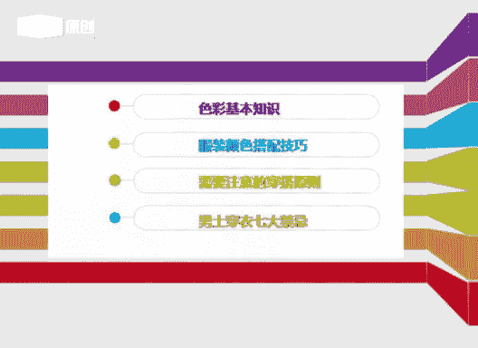
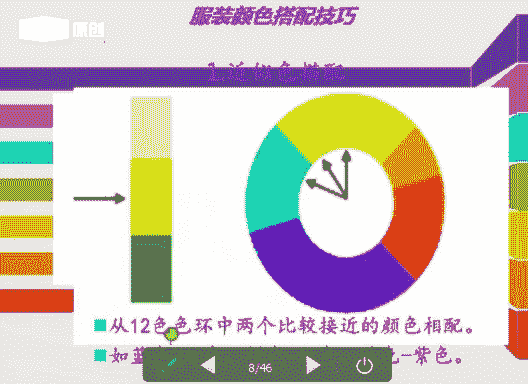
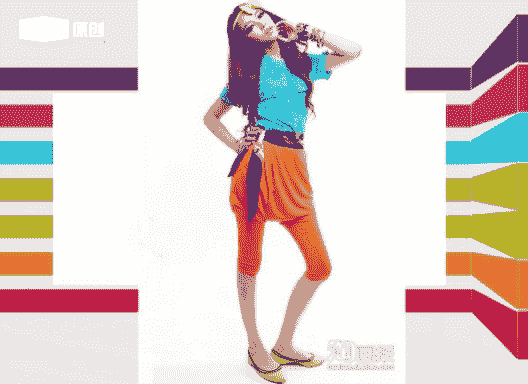
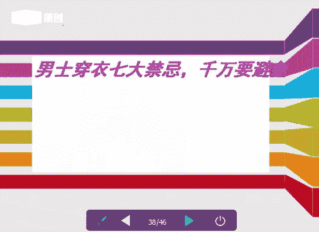

# 1、06《个人形象班》：服装搭配技巧-第十课-5月13日

Oh。老哥。好，各位同学晚上好，能听到老师声音的同学回复一下一好吗？Thank。好的，非常的呃非常的感恩呃，感谢这位同学。呃，每次老师啊老师啊在说的时候呢，这位同学都能回复老师。嗯，那。😊，在这里嗯。

好，这位同这位老师的同学呢是每节课都来听课。那么呢在此呢我们也表扬一下呃，我们今天的呃课程呢。我们的VIP的课程呢，它会轮流的讲到我们的一个基础知识点。那么今天呢我和大家一起讲的内容呢也是非常重要的。

因为每一个知识点呢，它都是我们的VIP课程里面的一个重要的部分重要的环节。那没有听过的同学呢一定要认真的去听。那听过的同学呢可以反复的听，一直到听懂为止。那么如果课后需要交流的同学呢。

可以直接加老师的1个QQ或是老师的一个QQ群。好，大家可以看到吗？能看到PPT内容的同学回复一下一好吗？😊，好，那么我的QQ号呢也是我的一个微信号。那么大家呢也可以直接去加我。好嗯，那我们我们的嗯。

建了一个我我能建了一个微信群，嗯，是我们一个穿搭的一个技巧。那么呢我也很希望同学们都能加入我们的群中。嗯，那么在不定期的就是使呃就是不定期的我会给大家分享一些就是搭配的一些技巧。

或者是我们一个针对个人的一个妆面。那么呢嗯也请同学们入群。好，那我们现在开始上课。那在上课期间呢，呃老师呢我会去点同意或者是添加。那课后呢老师会一个一个的添加的好吗？我呢是娜娜老师大家都已经很了解我了。

那么今天呢我和大家一起共同分享，学习的是我们的服装色彩的一个搭配的一些技巧，那我们前面所讲的内容呢，都是我们的一些比较基础的内容，对吧？理论基础，那有的同学呢就会问到老师。

那老师嗯我觉得你这些课程听得很枯燥无味，感觉没有什么就是你没没有什么新鲜的一些东西，那么我会告诉大家，首先呢我们前面的内容呢都是一些比较基础的一些就是理论知识，那么大家只有学好了我们的一个理论，对吧？

然后在后面我们才会去实操，才会去实操。那么如果前面的知识你都没有掌握的话呢，那后面的课程呢。进度会跟不上，进度会跟不上。好，我们废话不多说了废话不多说了。嗯。那么我们大家呢可能嗯在我们买衣服的时候呢。

大家都会有一个困惑，对吧？就是不知道自己适合什么样的，嗯，不知道适合什么款式。那么我们直接去买购买衣服的时候呢，就是别人店里面的店员直接给你推销什么，你就会买什么？是是这样的吗？是不是这个样子。

就是你们在买服装的时候，不是你们自己啊想去穿什么。就是别人给你们推，对吧？就是不管你是适合还是不适合，他都会给你去推，觉得唉他会告诉你，哎，嗯亲爱的小伙伴，这个衣服呢它是我们一个新款。那么你穿上之后呢。

会很显你的气质，会嗯会很显瘦，他们都是这样去推的对吧？因为他们呢作为我们的一个销售人员呢，可能就是跟他的一个业绩师挂钩的。那么我们自我们自己学了我们的一个色彩服装搭配之后呢，我们要自己学会怎样去。😊。

找你们适合你们自己的一个款式和你们的一个就是风格，明白没有？不清楚的话呢，如果在购买服装的嗯过程当中，如果不清楚的话呢，可以直接给我微信或者是我的QQ留言都可以。好，我们来言归正传回到我们的课程当中。

今天和大家带来的是我们的一个呃色彩的服装的一个技巧。第一个呢我们的色彩的基本知识。那么呢就是回顾前面的一些内容。第二部分呢就是我们服装颜色的一个搭配技巧。第三个呢就是我们一个需要注意穿搭的一个原则。

如何去穿搭搭配。如何去穿搭？那么如何搭配时尚？第四个呢就是我们一个男士穿衣的一个七大禁忌，男士穿衣的七大禁忌。那有的同学呢可能会问到老师，唉，老师男士的衣服是怎样去搭配呢？男士一般都是我们的西装。

都是我们的一些就是休闲服装，为什么它还会有七大禁忌呢？等一会儿我们来揭开我们的一个就是。

这个就是这一块的。Yeah。来呃跟大家分享一下我们的蓝色，它有哪些七大禁忌。首先我们来看一下我们的色彩的一个基本的认识。好，那呃三原色呃，有没有同学能告诉一下老师三原色是哪三种颜色？三原色是哪三种颜色？

有的同学能告诉下老师，知不知道？三原色是哪三种颜色，知不知道？Yeah。好，大家互动一下啊，三原色是哪三种颜色，有没有学前面？三原色呢我们分为色光三原色，分为色料三原色。那色光三原色是什么？

色光三原色呢，它就是我们的一个红绿蓝。Yeah。对，红绿蓝。那我们的一个色料三原是哪三个颜色？色料三原色是哪三个颜色？Yeah。好，我们的红黄蓝好，这位同学呢非常的棒啊非常的棒。

那么老师所之前讲的内容呢，他都已经啊掌握的很好了。好，我们接下来我们来看一下啊。三原色那原色好，有没有同学能告诉一下老师原色是什么？这。原色是什么？Yes。好，在这里我们来讲一下我们的原色。

原色呢它就是不能和不能用其他混合而成的一个色彩。那么就叫做我们的原色，也是属于我们的一个基本色，明白没有？没有混合的，就是没有和其他的颜色去混合的色彩叫做原色。好，这个是比较简单啊。

清楚没有清楚同学可以回复一下一好吗？OK好，我们再来换看下一个环节。那我们讲到三原色，我们现在去跟大家讲解一下我们的色像。那色相就是我们一个色彩三属性中的其一，色像是什么意思？

有没同学们可以复一下老师色像是什么意思？这项是什么意思？有没有同学知道的？好，色相呢它就是我们一个色彩的相貌和它的一个名称。对相貌和名称。好，这位同学非常棒。好，比如说我们的红橙黄绿蓝紫，对吧？

它是属于我们一个名称好，是我们秀彩的相貌和名称。好，这个呢就是我们右边的这个图片呢，就是我们1个2424摄像环，24摄像环。好，我们后面会讲到后面会讲到。Oh。好，我们再来看一下我们的明度是什么意思。

明度是什么？明度是什么意思？明度呢它是我们色彩的一个明暗程度，对吧？那从左边来看，蓝色左边的上面蓝色它是不断加了明度，对吧？蓝色它是不断加了我们的黑色，那么它的明度就会越来越低。好，大家看上面啊。

看左边一条颜色，我们从蓝色。变成深蓝，变成我们的嗯就是变变成我们的浅蓝，深蓝，对吧？变成我们的黑色，变成我们的最后变成们绿色。那么这个蓝色呢它是加了我们的黑色，它就。Yes。明度它就会越来越低。

看到没有？加的黑色越多，那么它就形成了我们的一个黑色。好，右边的这个蓝色，它是中间加了白色。那么呢它的明度就会越来越高，明白没有？颜色越浅，明度会越来越高，颜色越深，它的明度会越来越低。好。

这就是我们的一个色彩的明暗程度，明暗程度。好。明白没有明白同学可以回复一下一好吗？あ。好的。Yeah。那么在我们的油彩色中呢，黄色它的明度是最高的，紫色它的明度是最低的。好，介于中间的呢。

我们就称它为中明度中明度。颜色越浅，它的明度会越高，颜色越深，它的明度会越低。好，我们再来看一下我们的纯度，纯度是什么？有没有同学来回复一下老师，纯度是什么？纯度是什么？纯度是什么？Yeah。好。

纯度是什么意思？我们说的彩度就是我们的一个纯度啊。那我们的纯度呢，它是指我们鲜艳饱和的程度，鲜艳饱和鲜艳饱和的程度。Yeah。色彩越接近我们的唇色，我们看上面一排啊，第一排色彩越接近我们的纯色。

那说明它的纯度会越高，明白没有？好，色彩中混合的颜色越多，那说明它的纯度会越低。那么第一排的黄色、蓝色、绿色和红色。那。它的颜色呢基本上就是我们的一个纯色，对吧？那说明它的纯度会很高。

比如说我们的一个大红色，那么它的纯度是很高的对吧？就是我们的一个高纯度，高纯度。好，那么它的明度呢就是我们的一个中明度，明白没有？好，第二排、第三排、第四排、第五排、第六排、第七排，我们现在往下看。

但是色彩中混合的颜色越多，那么它的纯度就会越低。比如说它加了灰色对吧？加了灰色，那么加了黑色？好，那么它的纯度会越来越低，那么它和明度是不一样的，纯度呢它也是分为高纯度，中纯度和低纯度。

但是我们的五彩色它是不分纯度的，只分明度。那么我再问一下同学们，五彩色是哪三个颜色，五彩色是哪三个颜色。好，这个同也非常棒。我们的呃五彩色是我们的黑白灰啊，黑白灰。那我们的黑白灰呢。

它也可以做我们的一个分离的一个就是搭配，对吧？它也可能它也可以做我们一个什么。它也可以做我们的一个特殊色，也就是我们的金属色。好，可以提升我们提高我们的一个时尚度的啊，提高我们的时尚度。

那在我们的一个分离搭配，我们的渐变搭配，还有我们的一个什么呃节奏搭配当中，我们都可以去用到小面积的去点击，就是小面积的去使用我们的一个黑色白色和灰色啊。好，这是我们的一个纯度。我们再来学下我们的色调图。

Yeah。好，我们从图片下面来看我们的一个色调图。Yeah。色调呢它就是我们一个就是理解的话呢是我们一个色彩的一个调子。色彩的调子。那么它的一个概念是什么呢？就是明度和纯度，它的一个混合组成。

那么色与色之间它的一个整体的关系构成的一个颜色的一个降调，也就是我们色彩运用上的一个主旋律，大面积的大面积的一个色彩的一个倾向啊，就是我们的一个色调。那它的一个就是共同的特点是什么呢？

就是同一色调的颜色具备纯度和明度完全一致的一个特点。好，色调与我们色相它是没有关系的，大家一定要记清楚啊，色调和色相是没有关系的。因为颜色呢它是一个颜色它是最鲜艳的那么它的纯度的一个高最高的色调。

那么它是叫我们的纯色调，明白没有？那在我们的纯色调中加入不同比例的白色，那么它就会出现我们的一个亮色调，那浅色调和柔色调，加入我们不同的一个比例的黑色。那么呢它就会出现我们的一个深色调。

暗色调和我们的暗灰色调，就是在我们的图片当中。好，加入我们的不同的灰色，那么它会出现我们的浅灰色调和我们的轻轻柔色调灰色调和我们的浊色调。那白色它是一个最高明度。黑色它是一个最低明度。

那黄色呢它是属于最亮的紫色呢，它属于。对暗的。Yeah。好，我们来看图片当中的一个纵轴。纵轴的话呢就是颜色越浅，它的明度会越高，那颜色越深，它的明度会越低。我们看一下横轴。横轴的话呢。好，纯度对吧？

横折我们看先看右边的，它是一个从低，它左边是从低到高的对吧？它是。纯色就是颜色越接近我们的唇色，那说明它的纯度会越高。刚才举了一个例子，比如说我们的大红色，对吧？它就是一个纯度比较高的颜色。

那明度的话呢，我们只能称它为我们的中明度，明白没有？好。那靠左边的横呃，我们的横轴呢，它是属于我们一个比较低的，开始看到没有？是低的对吧？它是一个低纯度，那颜色中它混合的颜色越多，掺杂的颜色越多。

那么它的纯度呢就会越低。明白没有？好，这是我们的一个色调图，大家清楚的清楚的话可以核实一下一。清楚没有？好的。😊，我们接下来再学习一下我们的个第二部分服装颜色的搭配技巧。好，大家看到图片啊。

第一个是我们的近似色的搭配。

好，最亮的是什么颜色？大家看一下这个图片，最亮的是什么颜色。好，最亮的是我们的黄色。那我们来看一下最暗的是什么颜色。最暗的是什么颜色？Yeah。好，最暗的是我们的紫色ok。😊。

那我们来看我们从十二色相环中两个比较接近的颜色去相配。好，看到箭头啊看到箭头，比如说我们的蓝色。配我们的绿色，看到没有？蓝色配绿色，它就是属于我们一个近似色的搭配。近似色就是颜色似乎相近，对吧？

近似色好，橙色和我们的红色，那么它也是属于我们的一个近似色，蓝色和紫色它也是属于一个近似色，明白没有？明白，同学可以回复一下一好吗？是个。好的，那我们再来看一下后面的内容好。看图片啊，红色和橙色。

红色和橙色，那么我们的橙橙色和我们的黄色，那么这些颜色，还有我们的一个红色和我们的一个玫粉色。那么这些颜色它都是属于我们的一个近似色的搭配，明白没有？好，再来看一下第二个我们的对比色的一个搭配。

那对比色的搭配呢，它是在我们的二4色像环中。相邻120度到180度之间的两种颜色来做搭配。好，我们来看一下图片当中的啊，我们的紫色和我们的黄色。好，这是我们的一个。120到180之间的两种颜色，对吧？

它是属于一个对比色。那么呢对比色我们也可以称它为我们的撞色啊，撞色。好，我们在前面配色当中呢，我们学习过对吧？我们的一个什么嗯。中差色相配色4到7格进行配色，对吧？它会给人时尚稳重柔和的那种感觉。

那我们的一个呃对照摄相配色，它是从从我们的8到10格，就是色相环中8到10格进行配色，那么它会宣艳。鲜艳色差展，效果强烈，令人兴奋，容易产生我们的视觉疲劳。好，第三呃。

C就是我们的第三个就是我们的一个五色色相配色。那么它是在我们的第11到12格进行配色。那么呢它是一个对比强烈，比较醒目好，醒目。那么我们的一个嗯红色加红色配我们的绿色，对吧？它属我们的对比色对比色。呃。

它的对比呢它是比较强烈醒目的那我们的橙色配就是我们的橙色加我们的一个宝蓝色，对吧？也是属于一个对比色。那么我们的黄色配我们的紫色，它都是属于我们的一个补色色相环中的一个。1到12格进行配色啊。

就是我们的强烈的一个醒目，给人感觉强烈醒目的那种感觉。好，对比强烈的颜色好，okK对的啊。好，那么这个对比色呢是这样的，就是如果你的驾驭能力不是很强的话呢，建议你不要去这样去做搭配。那么如果搭配的好。

那么它会显得时尚。如果搭配不好。那么他会穿在身上，他会衣服抢了人的风采，穿在身上他会很怪异，明白没有？所以呢。对比色呢就是如果你的驾驭能力不是很强的同学呢，不要建议你不要去搭不要去搭。

如果你特别想去尝试一下呢，也是可以的也是可以的。好。这是我们一个对比色的搭配，明白没有？明白同学可以回复一下一或者送一下鲜花好吗？Yeah。好，什么类型的人我们可以去驾驭呢？比如说我们的一个前卫款啊。

我们的一个戏剧款呀，对吧？它都是可以去驾驭的。那么呃还是要做我们的一个款式风格的一个鉴定。那么知道自己是什么款式，那么我们才能去呃去搭配我们的一个或者是我们的对比色的搭配，或者是我们的类似色的搭配。

或者是近似色的搭配，明白没有？那么我们的戏剧款八大款当中，戏剧款是排第一的。第二第二个是我们的一个前薇款。第三个就是我们一个浪漫款。第三个是我们的浪漫款。好。这是我们一个对比色的搭配，清楚没有。

申请同学可以回复一下一好吗？OK好，那么这个图片当中的颜色，它就是属于我们一个对比色的搭配，明白没有？如果你的驾驭能力不强的话，那么这个衣服穿在你的身上，就是衣服抢了你人的一个风采。那么远处看的话呢。

我只看到了你的衣服很抢眼，很醒目。但是呢我就忽略忽略了你的这个人。所以呢我们穿衣搭配一定要是和谐统一，对吧？和谐统一，比较协调才可以。好，这是我们一个嗯对比的一个对比色的一个搭配。好。

我们的紫色配我们的一个啊看我们的一个橘红色，它也是起一个对比对比对比色调，对比色调配色。好，那么这些颜色呢嗯首先看上去呢它都会是比较时尚的，比较前卫的那种感觉，对吧？Yeah。好。

第三个就是我们一个货补色。那或什么是货补色呢？好，在我们的十二色像环中，任何的一个颜色所直接对立的一个颜色。比如说我们的紫色配我们的黄绿色，它是属于我们的一个互补色。红色和蓝绿色，我们的黄色和蓝紫色啊。

它是属于我们一个互补色。互补色呢它也是一个比较比较醒目的一个啊比较醒目的一种那种感觉啊，比较醒目的那种感觉。好，我们再来看一下关于我们的一个红色配绿色。那在前面的课程当中啊，我好像跟同学讲到过，对吧？

嗯，红色配绿色呢，它其实就是我们一个之前讲到了一个分离的一个配色。那分离配色呢，它就是在我们的两色之中，它加入了第三个颜色，那么它会使红色和红色和绿色，那么这两个颜色的关系，它会更加的清晰。

更加的分离更加的一个紧凑。那呃有的人呢会呃问到老师唉呃红色配绿色其实是不是特别的不好看呢？其实也不是。那么红色配绿色呢，我们只是让它在嗯这个颜两个颜色当中呢，用一个分离的颜色。

就是我们的黑色白色和灰色来加以就是点缀。那么整体的它会看起来会比较协调一些。好，色相不同，两个颜色放在一起，那么它会使得彼此更加的强烈。所以呢我们要在这个颜色，就是红色和绿色之间呢。

我们要去加一个过渡的颜色，对吧？就是我们的白色黑色和我们的灰色来做过渡，那么整体搭配呢它会要协调一些。好，分离色彩呢通常呢它为我们的五彩色。那白色分离的效果是最好的。灰色呢它会过于的柔和。

黑色呢它会给人紧凑感。所以呢我们如果想搭配我我们的红色和绿色的话呢，中间最好要有一个分离的一个颜色来给它就是起到一个柔和的一个作用啊，就是我们一个分离配色。好，大家清楚没有清楚朋友们也回复一下一。

Yeah。好的。好，我们的一个红色配绿色啊，红色配以大家可以看图片，看图片，我们来看一下黑色，对吧？它是鞋子和包包是相呼应的相呼应的。好，它会起到一个比较协调的一个作用啊。好。

我们再来看一下黄色和我们的宝蓝色。那么黄色和宝蓝色呢，它也是属于我们一个撞色系了。黄色的西服搭配我们蓝色的休闲裤，那么呢它会是更加的时尚，更加的时尚。好，黄色与蓝色它是组合格外耀眼的。

那么颜色呢它的一个碰撞，让人不就是不得不回头的去多看几眼。那么嗯撞色呢一般的人呢它是搭配不出来的，明白没有？搭配好，那么它会是时尚，搭配不好。那么它会是俗气，明白没有？好。

就是我们一个黄色和我们的宝蓝色去做搭配。好，我们的蓝色和我们的橘色。那么橘色呢呃它是属于我们一个冷暖暖色当中一个极软的颜色。那么这个颜色呢也是非常不好搭的，也是非常是挑人的一个皮肤，挑人的一个皮肤啊。

建议大家不要去尝试我们的橘色，明白没有？虽然橘色这个颜色呢呃在夏天就是在我们的秋天看来，春天看来还可以，但是呢建议大家不要去尝试，不要去尝试。因为很多很多人橘色都都不能穿，明白没有？好，第四个。

我们的同色系，那属于相同色系的不同明度的颜色。那在某一个纯纯色中逐渐的加入我们的白色。那色彩呢它会更加越来越亮，对吧？逐渐加入我们的灰色，那色彩呢它会越来越暗。那么这些色彩呢它都是属于我们一个同一色系。

同一色系，同一色系呢它主要就是不同明度的一个同色系啊，不同明度的同色系。Yeah。Yes。Yes。好，我们来看一下同色系啊，就是不同明度的一个色彩啊，不同明度的一个色彩。

灰色对吧？我们的就是我们的咖啡，我们的深咖，我们的浅咖，那么它都是我们的一个同音色系啊。好，灰色呢灰色呢它是我们一个百搭的颜色。那么在我们的职场呢，它是我们一个首选的颜色，首选的颜色。

灰色呢它能衬托住我们一个人的一个工作态度的一个严谨。所以呢在职场呢大部分人都会选择我们的灰色系了。Okay。好，这是我们一个咖色咖色系啊。花色系也是可以去选择的。但是呢在我们的职场。

我们不要去选择这样的颜色，稍微有一点点深。好，第五个叫我们的上呼下应的色彩搭配。那么呃我们的一个服装的一个整体呢要讲究我们的一个上下呼应，对吧？上下呼应。那么这种方法呢呃我也叫它三明治的搭配法。

或者是我们的汉堡搭配法。啊，也就是我们的一个嗯整体的服装下来，我们。衣服要衣服和包包或者是包包和饰品，或者是嗯鞋子和包包，一定要去相呼应，相呼应。明白没有？好，这是我们的一个上呼下映的色彩搭配方法哈。

大家有没有清楚清楚的同学可以回复一下衣或者送一下胸花，谢谢。好，我们的呃后面讲到的一个色彩的一个搭配。第一个呢就是我们的一个近似色，大家清楚了，对吧？第二个近似色就是类似于的颜色。

第二个的对比色呢就是我们一个。比较什么样的？对紫色。好，就是我们就是那种刺激性的一个配色，对吧？刺激性的一个配色。第三个呢是我们一个互补色，互补色呢就是效果比较强烈醒目。第四个呢是我们一个同色系。

同色系啊，是我们一个色彩搭配的几种。方法啊几种方法。好，第三部分呢我们就要讲到的是一个。穿呃就是我们的一个穿衣需要注意的一个穿搭的原则。那有的同学会问到老师。

唉呃为什么穿衣服我们会呃会要呃就是要注意我们的一个这样的一个原则呢？首先嗯如果大家就是没有学过色彩的同学呢，可能之前你的衣服呢可能是随便随便去搭的对吧？随便去搭的。嗯。

大部分的同学呢几乎都是我们的黑色白色来做搭配，对吧？那种呃颜色比较鲜艳饱和的那种服装呢，可能穿的是比较少的对吧？嗯，那么我们今天所讲的内容呢？就是嗯。在我们的全身上下，就是你的整体。

衣服的颜色不就是不要超过三个颜色去做搭配，明白没有？就是你自己不是很了解自己风格的时候，也就是大家没有学习我们的啊款式风格，对吧？你直节课的时候呢，就是最好是只穿两种颜色，对吧？衣服就ok了。

或者是白色搭黑色或者是嗯黑色白色搭我们的一个油彩色或者是搭就是直接穿我们的一个牛仔T恤都可以。好，那么我们自己学习到了我们的一个款式风格之后呢，大家就应该知道如何去做搭配，对吧？好。😊，Yeah。对。

中间的这个图片，它是属于我们一个对比色的一个搭配，就是也就是我们的油彩色，搭配我们的油彩色，明白没有？旁边这个是我们的五彩色，配五彩色。因为我们的黑白灰，它是属于我们的五彩色，明白没有？

那么右边的那个图片呢，它是我们的灰色和黑色去做搭配。那么呢它中间有我们的一个粉色的腰带去做了一个就是隔离，明白没有？好，那么分离呢分离我们只是讲的是我们的一个。刚才比录了一个颜色，就是我们的红色和绿色。

对吧？搭红色和绿色，那么呢它是做分离。那有的衣服呢它是不需要做分离的。那么你可以在你的饰品或在你的鞋子或在你的包包上面，或在你的衣服。前面带一条饰品的话呢，我们来可以做它的一个就是画龙点睛的一个作用。

明白没有？好，并不是所有的服装我们都要去做分离的。好，清楚朋学可以回复一下一页。好，第二个就是我们的上上下装呢，不要选择同样的花纹和图案，明白没有？因为这样搭起来会非常的怪异，要么上身是竖条纹。

要么下身是素色，要么下身是素色，上身可以穿我们的条纹，所以呢不要去选择同样的花纹和我们的图案。好，它不是时尚啊它不是时尚，它是俗气，明白没有？好，这是第二个。好，第三个就是我们讲到的绝对保险。

那么它的一个经典的搭配，就是我们的黑色白色和黑白的一个搭配。好，那我们军队的制作也就是我们的迷彩服，那那个就不用说了，对吧？不用说了，那我们只是在我们的一个嗯，因为在不在军队里面呢，它是有一个规定的。

明白没有？所以呢和我们就是这个讲的搭配，那么它是完全是两个概念哈。So。好，第三个经典搭配黑色白色。那黑色与白色呢，它在色彩上面呢，它是称为我们的一个极色。那在我们的原则上面呢。

它可以是跟我们的一个任何的颜色去做搭配。也就是说两种颜色跟任何的颜色去做搭配的时候呢，它都会。它不它都不会显得不自然或者是不协调，明白没有？因为黑色和白色呢，它本身就是一个百搭的颜色。好，必要的时候呢。

我们可以用它来做隔离，就做隔开两种本来极部协调的颜色呢，我们会让它变得更协调起来，明白没有？好，黑色白色属于一个百搭的颜色啊。好，我们再来看一下黑色与白色。那么有的黑色白色呢穿起来会给人感觉它会瘦。

那么有的颜色呢它会穿出来感觉会非常的胖。因为黑色呢它本身就是一个。收缩的颜色明白没有？就是呃也不是所有的人都能去穿黑色的。那么穿黑色，你如果穿的一身黑，就是我们在上节课讲到一个胖子，对吧？

那么呢它搭配的都是一整套的黑色，那么。其实他人很胖，那么穿一黑色，那么他会显得更胖。所以呢建议他就是。外面可以穿一个黑色。黑色的外搭。

那里面呢我们可以去配一个比较有颜色的那种就是纯度不是特别高的中纯度的一些颜色。那么它可以去搭在我们的黑色的里面，然后外面再搭一个黑色或者下面再去穿一个什么样的裙子，这样去做搭配，就要稍微的协调些。

而且后会手显得他的身材要瘦一些。那么你整个一个黑色黑漆漆的那那给人感觉是非常胖的，明白没有？所以呢黑色也并不是所有人当独去做搭配。那么在我们的衣柜里面呢，至少有一套黑色，一套白色，这样去做搭配就可以了。

好，黑白属于百搭款，经典搭配。我们的五彩色、黑色、白色、灰色可以是永恒的一个搭配色。那么我们的黑色搭配我们的玫红，对吧？那么它是属于一个非常时尚的一个颜色。那么不管你的就是不管你多复杂的色彩组合。

那么它们都能融入其中，我们的啊我们的一个黄色，我们的一个黄绿色，搭配我们的一个搭配一个我们什么样，搭配我们一个黑色的皮裙，对吧？那么呢它会显得比较前卫一些好。这是我们的一个。五彩色搭配我们的黑白灰啊。

好，再来看一下我们的颜衣服的一个颜色，不要去看它的款式啊，我们的黑色搭配我们的绿色，对吧？它会显得。怎么样？黑色搭配绿色物觉得怎么样？是不是比较协调，比较稳重的那种感觉？好。

是我们的黑色搭配我们的就是五彩色，搭配我们的油彩色。那我们来看一下第四个，运用我们的小件配饰品的一个装点来打破我们前面的一个局面。那为什么要这样说呢？就是我们衣柜里面的衣服，它的色彩并不丰富，对不对？

那也并不是所有人你像卖服装。因为卖服装的地方它有很多的衣服，那么有很多的配饰可以去做搭配，那么在我们自己的衣柜里面呢，我们的色彩颜色呢，并不像他们店里面的那些就是色彩的颜色那么多。

那么我们呢可以运用我们的一个装饰品来稍微的点缀一些，比如说一套衣服，我们今天有一套衣服，那么呢我们可以用我们的项链饰品，那么明天呢我可以去用我们的一个腰带，对吧？

后天呢我又可以去嗯搭配我的一个什么样的手包，那么呢再后天呢我可以用帽子去点缀一下。那么。衣服呢。She。不多没有关系。那么呢我们的饰品一定要多饰品呢它是稍加点缀，那么可以让我们的这些颜色并不丰富。啊。

并不丰富，服装呢它可以推陈出啊新的，那么还可以为你的搭配加不少的分，明白没有？所以呢饰品是一个很关键的，哪怕你的衣服很少，但是你的饰品一定很一定要多一定要多。好，饰品呢就是我们的项链，对吧？

我们的我们的颈链，我们的那种长款的项链，那么还有我们的一个腰带，我们的一个啊宽的对吧？还有我们细的，还有我们的那个什么丝巾，还有我们的手包，我们的手表，及我们的那个什么还有什么等等一些东西啊。

就是饰品小的东西。好。第二个我们的腰带，刚才讲到腰带，腰带呢它是一种非常实用的时尚单品。那么呃这种腰带呢一般在我们的冬天，我们冬天外面穿了一穿了一款呢子的长大衣，对吧？那么里面穿了一条裙子。

那么这个裙子呢？就是那种修身的裙子，那么我们可以用腰带来做给裙子做点缀，那么也可以给我们的一个大衣。做了一个就是对吧？减点缀也可以去搭配。好，这是我们一个腰带啊，腰带腰带也是个非常关键的。好。

任何的一个服装的一个搭配的一个整体，就是它的饰品来做为点缀。如果这个衣服上面没有这个腰带，或者是没有没有这个什么嗯，没有饰品的话，那这个衣服可能就是很普通很普通的对吧？那么穿出来的感觉呢。

它不会那么的出彩，明白没有？所以呢大家一定要穿服装去做，就是整体的搭配的时候呢，一定要去用我们的饰品来做点缀，饰品来做点缀。好，那么我们有了我丝巾，有了我们的手包，鞋子和手包是相呼应，对吧？

它的嗯丝巾和他的一个衣服去相呼应。那么整体给人感觉呢它会非常的时尚一些，看到没有？好，最后一部分就是我们的男士穿衣的七大禁忌。那么我们要避免我们要避免。首先第一个我们来看一下。

那么这两个人有哪里的不一样，大家可以看一下哪里不一样。

Yeah。Yeah。好，这个衣服的一个大和小的问题。好。对的啊，非常感谢这位同学。上衣，那么我们男士呢嗯穿男士去做搭配的时候呢，不要去选择我们的长款的一个夹克，对吧？那么嗯。长款的夹克呢它会显得人臃肿。

看到没有？完全它的完美的身材全部被破坏了。那么不如选择我们胆小精干的一个款式。那么他会立刻的精神抖擞一些。好，这是我们男士的穿衣啊，穿衣的一个七大禁忌。来要看一下。好。

第二个第二个就是我们一个哪里的问题。是这种皮带的问题。那么左边的皮带它是属于一个休闲款，对吧？那么可以穿我们的牛仔牛仔裤，休闲裤可以去可以可以去系那个皮带。那么我们右边的皮带呢。

它就是我们一个西裤的一个皮带。你看到没有？那么皮带的款式最好一定要。简洁一定要简洁，装饰不能太多。好，这是我们的皮带，但是它的裤子。裤子的话呢，我们的暗色竖条纹的裤子，那么它都会显得更精神一些。

更精神一些啊，这是我们的裤子。那我们来看一下第三幅图片。第三幅图片哪里有问题，大家可以看一下哪里的问题。Yes。Oh。Yeah。好，第三个是哪里的问题？第三个的话呢，我们不仅他的鞋子有问题。

他的他的服装也有问题，看到没有？你看衬衣是不能搭配我们的牛仔裤的。皮带也是有问题的。那么衬衣的话呢，它是一个正式职场的一个衬衣。虽然它的颜色对吧？我们正式职场的一个颜色呢，它是使用一个白色或者是竖条纹。

对吧？那么它的这个是属于我们的休闲休闲的一个衬衣。但是我们休闲衬衣，它只能配我们的休闲的裤子，但是它不能配我们的牛仔裤，那么我们的牛仔裤呢只能配配我们的T恤，对吧？啊，这是两个问题。第三个问题呢。

就是它的一个皮带。这个皮带呢它搭配起来会有点怪异。第四个问题就是它的一个鞋子，那么要么你配T恤，对吧？来穿牛仔裤，穿球鞋，那么要么你就穿衬衣，穿西裤，那么穿我们的皮鞋，对吧？好。太过显眼的腰带和运动鞋。

那么它是不太合适的不太合适的。那么它会给人感觉呢就是。既不正式又不休闲，对吧？既不正式又不休闲。好，再就是我们把左边的这个图片的衣服换成右边这个图片的衣服，看到没有？

是不是整体给人感觉呢就非常的协调一些。那么把上面的衣服换成我们一个休闲式的。衬衣式的那种两件套的一个毛衣，对吧？下面穿上牛仔裤，那么牛仔裤的颜色也是比较协调的，看到没有？上深下浅。好。

就是上身下浅的那个搭配起来非常的稳重啊，显成熟的那种感觉。好，下面配一双我们的休闲鞋，对吧？这样看起来是不是很有精神。啊，这是我们的男士要注意的一个搭配啊。第五幅图片。哪里的问题，大家看一下。Yes。

哎。Yeah。嗯。啊，哪里的问题？啊，第五幅图片呢是它的一个领带的问题，领带的问题啊。那么啊腰部的衬衣，还有个就是腰部的一个衬衣，衬衣呢它呢不能过长，看到没有？Yes。嗯。好。

你的这个问题我们等一下来说，我们先把这个后面的课程讲完。好，腰部腰部呢它会显得累赘一些啊，过长的一个领带。那么领带男士的领带它是不能太长的，看到没有？衬衣的话呢，我们要选择稍微嗯贴身一点。

就是收身的那种下摆比较短的衬衣。那么这样才是比较就是下摆比较短，不要太长，因为太长扎在里面呢，它就会累赘了，对吧？好，衬衣的呃就是我们的领带呢一定要稍微短一点点的，短一点点的。好。

我们来家看一下这个图片，看一下这个图片。那么呃这个图片的衣服呢就是它的一个领子，对吧？衬衣的领子领子呢它软塌塌的，那么呢它也只开一个扣子，那么啊这种衬衣呢现在也不流行的，很少人会去穿。

那么我们呢可以把嗯换一款的衬衣对吧？换一个颜色，那么它的嗯特别是一啊衬衣的那个料子，它的面料一定要硬挺一点的对吧？啊，开两粒扣的，那么这样呢它的回头率是百分之百啊，会它会显得非常有精神啊，非常有精神。

😊，好，我们再来看一下这个图片。那么这个图片呢，它的一个西服外套，我们的男士选择我们的服装啊，男士选择我们的西装的时候呢，一定要选择就是合身的西服，明白没有？不要选择太长了，也不要选择太短的。

那么一定要选择我们合身的一个。合身的一个衣服合身的一个。而且它的这个领，它的这个西服的这个扣子看到没有？如果是在左边的这个图片上面的话呢，它的重心它是往下的，看到没有？

右边的这个呢它的西服呢它是比较合身的。那么它的一个领子，它的一个就是扣子呢，它是在我们的一个中间，对吧？它的重心呢，它是往上走的。这是我们的一个蓝色的西服选择。好，最后一个就是男士的一个裤子。

那么男士的裤子西裤的话呢，我们一定要去打点，买回来的西裤，不管是男士还是女士啊，除了牛仔裤以外，那么休闲裤西裤一定要去打点。那么如果裤脚太长的话，它会显得没有精神，感觉你的腿也不直，明白没有？

所以呢我们要去选择。挺就是要选择挺就是挺直合身的裤子。那么这样的话会精致一些精致一些。Oh。好，那今天晚上的课程呢我们就已经结束了，谢谢大家的聆听。那么我们周一晚上7点半钟。接着上我们的课程。好。

下节课呢我会给大家带来一些我们的一些女士的一些就是今年比较流行的款式的服装啊，一些就是搭配的一些就是小的技巧。那么周一晚上呢嗯7点半多呢也能嗯也希望同学能准时来听我们课程。谢谢大家。好。

刚才呢这位同学呢嗯提到一个问题，对吧？是上身下浅显得成熟还是上浅下深显得成熟啊，其实这样的，就是呃男士的一个服装的话呢，就是一般在我们的职场呢，他们都是会穿到我们的西装，对吧？就是我们一些深色的。

那么深色的西装呢，它会就是显得稍微的成熟一些，明白没有？那么呃在我们的一些就是休闲场合或者是朋友聚会或者是一些其他的场合呢，那么一般的颜色呢，我们都会穿到浅色的颜色，那么浅色的颜色呢，它会显得年轻一些。

阳光一些。那没有。好，都是在我都是根据我们不同的一个场合去做一个不同的一个搭配。好，这位同学有没有明白，明白同学可以回复一下一。好的，如果嗯还有就是课程当中刚才讲到的课程嗯，就是不是很明白的话呢。

嗯你可以直接跟我微信，好吧，跟我微信也可以。那么跟我QQ留言也可以。那么我看看然后也会及时的去回复你们。那我也希望同学们呢嗯加上我的那个就是我的一个QQ呃，加上我的一个微信号，加上我的微信号。

那么我也会在微微信群里面呢，也会和大家分享一些就是小的一些搭配的一些技巧。好吧。😊，嗯，好的。

不。Okay。She。