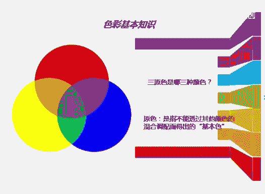
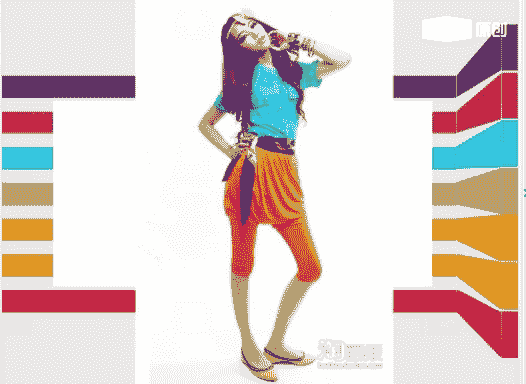
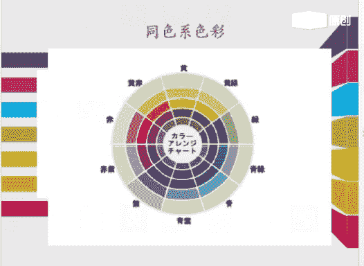
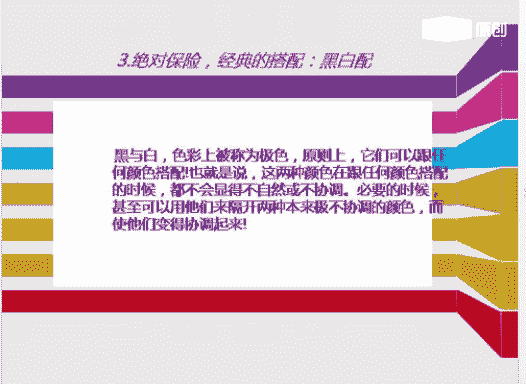
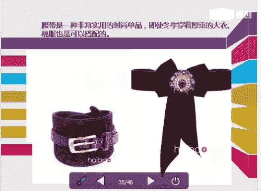
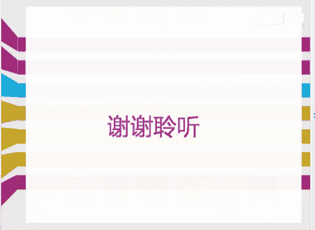

# 1、06《个人形象班》：服装色彩与搭配技巧 第十一课 4月11日

好，各位同学晚上好，能听到老师声音的同学回复一下一好吗？好，非常感谢同学们今天晚上能来嗯上我的一个服装色彩以搭配技巧的课程。嗯在这里呢老师想问一下同学们，哪位同学是第一次听课程。

第一次听课程的同学回复一下啊，好吗？😊，好，没有，对吧？都是我们的老同学。好，我们的VIP课程呢，他会轮流的讲到我们一个基础知识点。那么今天呢我们所讲的内容呢也是非常重要的。

因为每一个知识点呢它是都它都是我们YVIP课程里面的一个重要的部分重要的环节。没有听过的同学呢一定要认真的听听过的同学呢要反复的听，一直到听懂为止。

那么如果课后需要交流的同学呢可以直接加老师的一个QQ或者是是一个QQ群，或者是我的一个微信号。我的微信号呢是我的一个QQ号。好，大家可以看到吗？能看到PPT内容的同学回复一下一好吗？好，O。

那我们现在开始上课。那在上课期间呢，老师不会去点同意或者是添加课后呢，老师会一个一个的添加的那我来自我介绍一下我的老师娜娜老师。今天呢我和你们一起共同分享，学习的是我们的一个服装的一个色彩的搭配。

Yeah。服装色彩搭配技巧，还，就是我们的第十一节课。因为我的课程呢可能是跳节讲的，没有按照顺序来。嗯，因为有的时候呢有的同学可能觉得老师前面讲的一些内容呢是非常的枯燥人类，对吧？理论知识太多了。

所以呢我往把课程稍微的调整一下，大家称一下。好嗯。实际上呢我们的一个色彩的一个全科班，他都会讲到我们关于色彩咨询师从从业过程中一些经历的一些就是东西。啊，前面所讲的都是一些我们的基础。

那么也包括我们课程学完之后呢，也会找到适合自己的一个服装的一个颜色，你的一个款式及他的一个风格和它的一个氛围。那么嗯。我们学完穿衣呃，因为我们学呃衣服呢就开始有一个境界。那么我们学完之后呢。

既然大家都会既然大家都会了，对吧？都会了，如果不会的话呢，也没有关系。那么呢嗯在后期的话呢嗯有什么问题，在服装搭配上面有什么问题的话呢，可以直接嗯就是。微信联系我也可以，或者是直接QQ问我都没有关系。

好，我们言归正传言归正传。今天呢和大家一起共同分享的是呢四大点。第一个呢就是我们的一个色彩的一个基本的知识。好，这是前面所呃第一节课和第二节课的就是一些内容。嗯。

第二个呢就是我们一个服装颜色的一个搭配的技巧，服装颜色的搭配技巧。那么第三个呢。这是我这是我们的一个需要注意的一个穿搭的原则。第四个呢就是我们嗯男同学很关注的一个男士穿衣的一个七大禁忌。好。

那么我们首先来学习一下，回顾前面的一些知识。那色彩的一个基本的知识。好，那在上新课之前呢，我也问一下同学们，嗯，就是今天来上课的同学，哪些同学是听了前面的第一节课和第二节课的，大家可以回复一下一好吗？

你们有如果听过这个课程的话呢，我现在可能就是在上课期间呢，我会提到一些问题。如果没有听过的话呢，嗯我们就直接讲。Oh。如果有的话呢，嗯可以回复一下一好吗？好，有没有有没有就是我们。好，没有听过对吧？好。

没有关系。好，那我们来讲一下。

首先我们对色彩一个基本的认识。前面的第一节课呢，我们讲到了一个四季色彩的一个理论，对吧？什么是四季色彩？之前。有同学也是听过课程的。好嗯。第二个就是我们一个行业的发展。第三个呢是我们的行业的特点。

第四个呢就是我们一个运用的领域。好，其次呢就是我们一个光旅色。光与色色彩的识别，眼睛的一个识别的一个形式，以及我们色彩的一个分类。好，色彩的表现，以及它的一个色彩的三属性，它的错觉等等。色的联想。好。

这个是我们第一节课色彩基本知识。那我们现在学到的是我们一个三原色。那什么是三原色呢？我们来看一下图片中的啊，什么是三原色。三原色呢就是我们不能用其他色，其他的颜色混合而成的色彩，就叫做我们的一个原色。

那么原色呢它是有两个系统的，大家可以稍微的记一下。第一个呢就是我们站在我们光学。光学方面的一个利论，那么称为我们的三原色。好，也就是我这个图片中的三原色。好。

另一种第二种呢就是我们站在我们色彩或者是颜料方面的一个利论。那么呢就称为我们的染料三原色。那么光的三原色大家记住了啊，下节课我要提问的光的三原色是我们的红绿蓝。红绿蓝，那么我们染料三原色呢。

它为我们的红黄蓝红黄蓝啊，这个有没有清楚？那么三原色这块大家有没有清楚清楚的同学可以回复一下一好吗？好，清楚同学可以回复一下一OK好。

那么我们的原色呢就是指我们不能透过其跟啊就是不能和其他的一些颜色混合而成的。那么它就是属于我们的一个原色。好，这个比较简单，这是我们的一个三原色啊，大家记住了，光的三原色，红绿蓝。染料三原色为红黄蓝。

🤧。好，我们再来看一下我们的一个色像。那么这个色像呢，它就是属于我们的一个呃色彩的一个删属性的色彩的删属性。好，我们的颜色颜色的一个分类呢，它也是需要一个就是一定的基，就是基准的。

那么我们在区别颜色的一个基准呢，它是一共有3种。好，第一个呢就是我们的一个色像。那么现在呢我们就讲到了一个色像。色像呢它就是。色相与明度和纯度它是没有关系的。那么简单的来说，红色、蓝色、橙色、紫色对吧？

那么就是一个色彩的一个名称，也就是色彩的相貌与它的名称啊，色像称为色像，大家有没有清楚清楚的同学可以回复一下一好吗？好，摄像镜回家有没有清楚清楚的同学可以回复一下。一好的。

那么油彩色它是属于我们的一个基本色。那么基本色相呢就分为我们的红橙黄绿蓝紫，对吧？就是这几个颜色好，等等。那么加入我们中间色成为我们24个色像那么这些颜色当中我们去演变，去加入我们的白色，我们的黑色。

我们的灰色，那么呢它就形成了我们1个24项的一个色像环啊，色像环都是这样得来的。大家有没有清楚清楚同学可以回复一下啊，好吗？好的。😊，那么我们再来看一下摄像完了之后，就是我们的一个明度。那什么是明度呢？

明度就是我们体现颜色的一个明暗程度，就是我们的明度。好，就是简单的用通俗易懂的一个话来说，就是我们的一个明暗程度，明暗程度就是我们的明度。好，首先我们来看图片当中蓝色左边的图片啊。

蓝色里面不断的加了黑的，那么它的明度就会越来越低，看到没有？蓝色正常的蓝色，那么加了黑也。加黑越多，那么它的眼明度就会越来越低，那么加加白越多，那么它的明度就会越来越高。有没有清楚这一块好。

明度我们给大家解释一下啊，可能有同学还没有明白，对吧？那么我们在前面当中课程当中，我们讲我们学习到学习过人，就是我们看到物体的一个颜色，必须呢它是在我们的一个具备光线的一个条件下。

那么物体表面吸收和反射光线的一个状态，它是决定了一个物体的一个颜色，为什么之前我会问到大家，苹果为什么是红色，对吧？苹果为什么是红色？啊，就是因为它的一个吸收反射，吸收反射的一个过程。好。

那么我们的明度是一样的。好，某种物体那么吸收到所有进入的一个光线。所以呢它既不反射任何的颜色，那么它就形成了一个黑色，对吧？相反的，比如说我们的物体反射了所有的一个进入的光线，那么这些光线聚集在一起。

那么它就是我们的一个白色。好，反射的一个光线，它的强度强强弱不同。那么使它的一个物体呈现的光亮也是不同的。所以呢我们嗯从而生成了一个亮色与暗色就是这样得来的，知道吧？亮色和暗色是这样得来的。

那么这个呢就是我们一个明度。好，大家有没有清楚清楚同学回复一下一好吗？好。那我们再来看一下它的一个纯度，纯度的话呢就是纯度是指我们色彩中包含的一个色相的程度。色相色相呢就是我们刚才讲嗯，就是讲到过对吧？

色相讲到过。就是它的一个颜色对吧？它的一个颜色，色彩的一个名称和相貌好，那么它是称为我们的一个色彩的鲜艳饱和的程度。大家就是通俗易懂的话呢，就是记纯度的话呢，就是我们宣艳。饱和的一个程度就是我们的纯度。

好，色彩越接近我们的纯色，那说明纯度会越高。就是月亮。宣艳饱和，没有掺杂任何的颜色。好，这句话大家有没有理解，理解的话回复一下一好吗？如果没有理解的同学回复一下2。好的。😊，好，色彩越接近唇色。

我再说一遍，色彩越接近我们的唇色，说明它的纯度会越高。那色彩中混合的颜色越多，那么它的纯度呢就会越来越低。那么它和我们的明度是一样的。那么呃蓝色里面它是。加黑越多，那么它的明度就会越低。

那么蓝色里面它的成分加白越多，那么它的明度会越来越高。那么我们的纯度是一样的，纯度是一样的。那么蓝色里面它不掺加任何的颜色，说明它的纯度会越高。那么蓝色里面掺了我们的一个紫紫色或者是黑色或者是灰色。

那么它的颜色混合的越多，它的纯度会越来越低。好，大家有没有清楚。明度和纯度的这个区别，大家清楚没有清楚没有可以回复一下一页。好的，好，纯度呢它也是分为我们的一个高纯度，中纯度和低纯度。

那么我们的五彩色是不分纯度的那那么我们讲到五彩色呢，我要问一下同学们，嗯，大家知不知道五彩色是哪几个颜色？五彩色是哪几个颜色？五彩色是哪几个颜色？大家知不知道知道的同学可以回复一下一啊。

可以回回答一下老师，五彩色是哪几个颜色？五彩色是哪几个颜色，知不知道？好，五彩色它是我们的一个黑白灰。五彩色是我们的黑色，白色和灰色。大家记住啊，五彩色它是没有它是没有纯度的，它只有明暗程度啊。

它只有我们的一个明度，它只有我们的明度。好，大家记一下啊，自己记一下。好，这个图片当中上面的一个黄色第一排对吧？黄色、蓝色、绿色和玫红色。那么这三个颜色呢，它的。它是接近我们的一个纯色。

没有掺杂任何的颜色，对吧？那么到了第二排，它就会掺了一点点的灰色，对吧？掺了一点点的颜色好，第三排、第四排、第五排、第六排一直到第七排最后一排，那么它的颜色掺杂的越多，那么它的明度。

它的纯度就会越低对吧？它的纯度就会越低。那么它的明度呢就是我们一个中明度，中明度对吧？那么黄色里面加黑越多，那么它的明它的明度就会越低越低。好。大家有没有清楚纯度和明度的一个区别？清楚同学可以回复一下。

2、不清楚的话呢，嗯大家可以提问。也可以，我可以直接再讲一遍都可以。好，亲清楚的同学可以核对一下啊，明度和纯度的一个区别。好的。那我们再来学习一下我们的一个色调图，好吧。Oh。Yeah。好。

我们首先来看一下这个色调图，是我们的一个日本色盐PCCS色调图啊。PCCS色道图。好，我们来看一下什么是色调，好吧，什么是色调。大家肯定不知道嗯，色调是什么，色调呢就是我们一个色彩的一个调子。

那么嗯色调呢呃色彩呢它是运用上面一个主的旋律，那么大面积的一个色彩的一个倾向，就是我们的明度、彩度和色像，明度彩度和色像。好，概念我们来看，大家可以记一下。明度和纯度混合组成的。

那么就是色与色之间的一个整体的关系。那么构成了一个颜色的一个降调，就是我们的一个色调，那么它的一个特点是什么呢？就是同一色调的颜色，具备我们纯度和明度的完全一致的一个特点。

它其实是一个共同的共同的一个特点。好，嗯，色调与我们色相它是没有关系的。那么我们现来讲解一下色调与色相是没有关系的。色相呢就是我们一个色彩相貌的一个名称，对吧？色调就是我们一个明度。

和纯度的一个混合组成的混合组成的。好，颜色最鲜艳的纯度纯度最高的色调。那么它是叫给我们的纯色调。那么在我们的纯色调中加入不同比例的一个白色，那么它会出现我们的一个亮色。好，浅色调和我们的一个柔色调。

那么加入不同加入不同比例后呢，就是我们的黑色，那么它会出现我们的深色调。那么明暗色调和我们的暗灰色调，加入我们不同的一个灰色，那么它会出现我们的一个浅灰色调轻柔轻柔的色调。好，大家有没有清楚这个？

那么所有的色调图啊。我们我们先看一下纵轴，纵轴是什么呢？纵轴上面颜色越浅，它的纯度会越高，看到没有？好，再看一下往下的。往下颜色越深，那么它的。明度会越低。好，我们再来看一下横轴。横轴的话呢。

左边的这边颜色鲜艳饱和，对吧？鲜艳饱和，那么它的一个颜色它的纯度会越高，对吧？色彩越接近唇色，说明它的纯度会越高。好，我们再来看一下。左边的横轴，我们看一下横轴，然后过来看这边的颜色。掺杂的颜色越多。

那说明它的一个纯度会越。怎么。会越低。好，大家有没有清楚这一块纵轴和横轴有没有弄清楚，清楚同学可以回复一下2好吗？新楚同学可以回复一下啊。7。好，清没清楚清楚同学可以回复一下啊好吗？好的。😊。

那么所有的这个上面的颜色，我们来看一下，从我们的一个横轴，我们来看横轴。好，从我们的一个V调。V调呢它属于我们的一个原色。那么V调S调B调和我们的light调P调收服调和我们的deep调和。大个基调。

那么这些颜色它都是从我们的一个微原色调中演变的。那么有的呢是加了白的，有的呢是加了灰的，有的是加了黑的。所以呢它的颜色越来越浅，越来越深。好，都是都是以我们的一个原色调，原色调来慢慢的去演变浅色柔色。

对吧？浑就是比较浑浊的颜色，比较暗的颜色，比较深的颜色。好，都是我们的微调在原色调上面去慢慢延伸的。好，大家有没有清楚清楚的同学可以回复一下一好吗？So。Yeah。什这能。不么。こ。你不是。好。好。

那我们接着再来看一下后面的内容。第二部分呢就是我们一个服装颜色搭配的一个技巧。好，这是大家最想学习到的内容，对吧？第一个呢就是我们一个近似色的搭配，近似色的搭配。Oh。Oh。Okay。W。好。

我们从图片下面来看。大家看到这个箭头没有，能不能看老师的PPT能看到PPT内容的同学回复一下一依好吗？し。Oh。好，能不能看到PPT？😊，好，我们从图片上面来看。

那么从十二色的摄像环中两个比较接近的颜色去做搭配，那么就是我们的一个近似色的搭配，箭头指的是蓝色和蓝色和绿色，对吧？箭头指的是蓝色和绿色。好，它是属于我们的一个近似色搭配。好，橙色和红色橙色和红色。

那么它也是属于我们的一个近似色的搭配。橙色橙色和红色红色好，蓝色和紫色蓝色和紫色，那么它也是属于我们一个近似色的一个搭配。近似色的搭配。好，这是我们的一个近颜色相近的一个近似色的搭配。

好，我们的这个图片当中橘红色和红色，那么它也是属于我们的一个近似色。好，我们的一个橙色和黄色，它也是属于我们的近似色。那么我们的红色和玫红色对吧？它也属于我们的近似色。好。

第二个就是我们一个对比色的搭配。对比色。不懂。好，我们从上面来看，那么在我们的24摄像环中像相距120度到180度的。那么这个两个颜色呢，它就属于我们一个对比色对比色。好。

我们来看一下我们的呃紫色和我们的黄色。那么它是属于我们的一个对比色。好，比较鲜艳，比较鲜艳，颜色比较亮丽。再来看一下我们的呃宝蓝色和我们的橘红色，那么它也是属于我们的一个近似色。

也是属于我们的一个近似色对比色啊对比色说错了，对比色。好，那么我们再来看一下我们的一个大红色和我们的绿色，大红色和我们的绿色，那么它也是属于我们的一个对比色对比色。好。好，这前面这些内容呢。

在我们的一个第二节课配色当中我们都已经学到过了啊。今天呢我们只是回顾一下前面的一些内容。好，这个是属于我们一个对比色，看见没有？颜色就是相当于那种属于那种撞色的那种撞色的那种。

如果你的驾驭能力不是很强的话呢，建议大家不要这样去做搭配啊。如果搭的不好的话呢，感觉非常怪异。那么我们我们每天就是搭配衣服的话呢，就是每天要去做搭配，都是要搭配得当搭配的得当。搭配得到。

那么能达到我们统一和谐的一个效果。啊，这是我们的一个就是。对比。好，我们的紫色和我们的橙色，对吧？它也是属于我们一个对比色对比色。我们先看衣服的一个颜色的搭配，然后再来看它的一个款式。是。好。

这个也是一样的啊也是一样的。对比色对比色。那么我们看它的一个衣服的一个搭配，都是一个起到一个上下呼应的一个作用，对吧？要么就是我们的一个鞋子，搭配我们的裤子去相呼应。

要么呢就是我们的一个呃鞋子和它的一个裤子，要么就是我们的上衣和它的一个包包，对吧？那么它它都能取相呼应，达到一个统一和谐的一个效果啊，这是我们的一个对比色。那么第三个呢是我们一个互补色。互补色呢就是。

什么是互补色呢？就是在我们的1个十二色相环中，任何的颜色所对立的一个颜色，就是和它对立的一个颜色。那么就是我们的一个互补色。比如说我们的绿色配我们的大红色，它属于我们的一个互补色。红色和绿色啊。

红色和蓝绿色红色和蓝绿色是大是那个就是互补色。那么我们的紫色和黄绿色，那么它也是属于我们的一个互补的颜色，黄色和蓝紫色啊，从图片上面来看，就是这几个颜色，就是举个例子举个例子。好。

我们再来看一下关于我们的一个红色配绿色。其实在最早呢我们是讲过，对吧？红色配绿色。Yeah。红色配绿色呢？嗯怎么说呢？我们之前在前面讲的是一个分离的配色。那么什么是分离配色呢？

就是在我们呃两色中间加入第三个颜色，那么它是属于我们的分离配色。那么这样呢它会使我们两个颜色会更加的清晰分离和紧凑的那种感觉。好，比如说我们的分离色彩，通常呢它是我们的一个五彩色，对吧？

中间呢我们只能加白色、黑色和。😊，就是加我们的白色。灰色和黑色，那么白色呢它会。它会就是分离的效果是最好的。那么灰色呢它是比较柔和的。那么黑色呢它会给人有一种紧凑感。好，那么我们这个图片当中也是一样的。

白色、灰色和黑色。那么建议大家呃如果是两色。红色跟绿色去搭配的话呢，嗯我们建议大家最好是用灰色。那么灰色呢相对来说要柔和一些，要柔和一些。Yes。好，这是我们一个嗯分分离配色，分离配色，红色和黑色对吧？

红色、黑色、绿色、灰色都可以去做搭配，建议大家不要用灰黑色，建议是。灰色和我们的白色。Yes。好，我们再来我们再来学习一下，我们再来看一下我们的这些图片，只看它的一个颜色啊，看它的一个颜色。

它的一个主要是它起到一个分离的效果，看到没有？整体的一个腰带的一个显示，腰带的一个显示分离的一个效果。好，柔和不柔和，我们可以整从整体上面来看。好，再来看一下我们的黄色，黄色呢和我们的宝蓝色呢。

这两个颜色呢它是属于我们的一个撞色。那么你看这个衣服，它是一个黄色的西装，对吧？右边的图片，黄色的西装，下面是我们的一个九分的一个宝蓝色的一个。九分小脚裤好，包括它的一个鞋子，对吧？

它的鞋子前面呢它也是带有我们一个黄色的一个就是。饰品对吧？黄色的一个饰物好，嗯，所以呢我们看一下它的一个衣服，整体的一个搭配就是上下它是相呼应的对吧？整体呢它是比较柔和统一的。好。

再来看一下这个呃左边的这个图片呢，它的颜色比右边的颜色要稍微的正一些，对吧？黄色和宝蓝色，那么还有我们一个黑色的包包。好，黑色的包包呢，但是呢我们的包包和它的一个鞋子的颜色，它是它是相呼应的啊相呼应的。

那么这个颜色呢属于属于我们的一个撞色，那么格外的显眼格外的显眼。好，这种颜色呢有很多人都搭不出来，因为这个颜色它属于太跳的一个颜色。纯度比较高。好，这是我们一个蓝色，配我们的一个橘红色。

那么橘红色和黄色呢，它是属于我们一个类，它是属于我们一个前面讲到什么？类似色对吧？类似色类似配色。

好，第四个就是我们一个同色系。同色系呢呃它是属于我们相同色系，不同明度的一个颜色。好，就是比如说把某一个纯色中逐渐的加入我们的白色，那么它的色彩会越来越亮，那么逐渐加入我们的黑色。

那它的一个色彩会越来越暗，那么这些色彩呢它都是属于我们的一个同一色系，属于我们的一个同一色系。好，同色系的一个色彩。

灰色对吧？它短裤外套，那么它都是我们的一个同色系好，其实这个呢是最好区分的。灰色我们的一个职场的一个穿着，职场的一个穿着。好，这个驼色对吧？驼色咖啡好，都是属于我们一个同色系。这是我们一个秋天的颜色。

秋天的颜色。Oh。Oh。嗯。好，第五个是我们一个上呼下应的一个搭配。好，那么这种方法呢，我也是叫它一个三明治的搭配法，或者是我们一个汉堡搭配法啊，也就是它的一个衣服和它的鞋子这样去相呼应。

整体的一个搭配。不管你怎么搭，但是呢就是。从上到下它是不能超过三个颜色的。好，上下呼应。衣服和鞋子去相呼应，对吧？包包和它的饰品去相呼应。好，这是我们一个上下相呼下印的一个色彩的搭配。好。

再来看一下我们的一个色彩的一个搭配。第一个我们的近似色刚已经学到了。第二个我们的对比色，第三个是我们的一个互补色。第四个呢就是我们的一个同色系，同色系。好，我们的第三部分。

第三部分呢就是我们一个呃需要大家注意的一个穿搭的原则。第一个呢就是我们嗯在搭配衣服的时候呢，三种身上的三种颜色为宜，不要超过三个颜色。那么当你自己不是很了解自己风格的时候呢。

就是不要超过三种颜色的一个搭配。绝对不会让你出位的。因为因为你自己不了解你自己的一个款式风格，那么你搭出来的衣服给人感觉会很怪一异。所以呢嗯大家。就是搭配的时候不要超过三个颜色。

最好是以我们的一个黑色、白色和灰色为我们的一个主打色囊后然后再配我们的一个油彩色，这样去做搭配。好，这样呢它会体现我们的一个优雅，那么给人利落清新的一个印象。好，这是我们一个要注意的一个穿搭原则。

就是你自己不会嗯不会类似色或者是对比色或者是什么色去做搭配的话呢，你就直接就是黑白灰。去搭配里面搭配一件呃油彩或者是。五彩的那种。Yeah。So。嗯。好，我们再来看一下我们第二个上下装。

不要选择我们同样的花纹和图案。好，大家看到这个图片给人感觉是一种什么样的。给你是一种什么样的感觉，你先告诉我给你们是一种什么样的感觉。看到这部图片之后。Yeah。啊。Yeah。Yeah。

大家看到这个图片是一种什么样的感觉？上下装不要选择同样的花纹和图案。是不是给很给人感觉非常的怪异。😊，上面也是条纹的，上面是斜条纹的对吧？下面是竖条纹的，那么给人感觉非常的怪异。

所以呢建议大家不要这样去做搭配。如果你上装想去是花纹，下装一定要是素色的对吧？那么如果是下呃，下面的裤子是黑呃。下面的裤子是条纹的，那么上身的衣服一定要选择我们的黑色、白色或者是灰色去做搭配。

不要去选择我们同样同。同颜色的同款式的衣服。好，不协调。再来看一下第三个绝对保险经典的搭配，就是我们的黑色白色搭配。黑与白呢在我们的色彩上面，那么称为我们的一个橘色，对吧？那么在我们的原则上面呢。

它可以和我们的任何的颜色去做搭配。因为黑白灰呢它属于我们的一个无彩色。好，这两种颜色跟任何的一个颜色搭配在一起，那么它都会显得。他都会。它都会显得比较自然，比较和谐。那么必要那么在我们必要的时候呢。

甚至可以用他们来做我们。的分离配色刚才讲到了对吧？分离配色。然后起到一个就是比较统一和谐的一个效果。那么让他们就是变得协调起来啊，我们的经典搭配黑白。

好。这是我们的一个白色和黑色的一个搭配，它是永远都不会过时的对吧？都是属于我们一个经典的搭配。Yeah。好，我们再来看一下这个图片当中的一个五彩色来配我们的一个黑色、白色和灰色。那么它是一个永久的搭配。

对吧？永久的搭配比较时尚啊，不管你的颜色有多，不管你的不管多么复杂的一个色彩的组合，那么它们都能融入其中，都能融入其中。好，我们的黑色大我们的玫红配我们的黑色手拎着我们的黑色包包，穿的黑色高跟鞋，对吧？

那么中间的腰带也是属于黑色，那么这是一个比较时尚的一个搭配。好，我们再来看一下，我们来看一下这个黄色对吧？黄色的上衣，那么来搭配我们的一条黑色带，黑色的一个皮裙。好，再来看一下它的包包。

是我们一个宝蓝色的。那么它的鞋子是属于一个比较尖的那种鞋，尖头的鞋子，对吧？平跟鞋。那么这套衣服给人感觉呢还是比较前卫的比较前卫的。好，这是我们的一个五彩发油彩。你什么。Yes。Yes。好。

那么这个里面的图片呢，大家不管它的一个款式，我们只看它的一个颜色的搭配。衣服呢就是我们在职场的一个西服里面呢就是我们一个白色的一个打底。那么搭配我们下面的一个九分的裤子，鞋子呢它也是黑色的对吧？黑色的。

好，第四个呢就是我们呃运用小件的一个配饰的一个装点来打破我们层面的一个局面。也就是所有的衣服，所有的衣服搭配呢都是需要我们的一个饰品的一个点缀，起到一个画龙点睛的一个作用。好。

比如说你衣柜里面的一些衣服的色彩呢，颜色并不是很多，并不是并啊，就是并不丰富。那么我们可以运用一些呃装饰品稍微的来点缀一下就可以了。好。饰品的话大家应该知道，比如说我们的包包，我们的一个丝巾。

我们的腰带及我们的耳环，对吧？还有我们的一个呃毛衣链，还有我们的一个就是那种嗯。帽子对吧？等等这些东西，我们一个装饰品。好，第二个我们来看一下腰带。腰带呢它是一个非常实用的非常实用的一个时尚的单品。

对吧？那么呃在我们的冬季里面的一个就是穿着，或者是在我们一个夏季里面春季里面的一些穿着的话呢，我们都可以运用到我们的一些就是腰带，对吧？或者是我们的一个丝巾。那么在冬天里面呢。

如果你穿着一个比较厚重的一个大衣里面呢，你可以也可以去穿一件，比如说比较稍微紧身贴身一点的毛衣啊，或者是我们的一个那种嗯比较稍微时尚一点的那种棉衣，就是那种A字裙，对吧？连衣A字裙。

那么我们也可以去用腰带来做点缀。好，就是我们的一个腰带的一个用法。

所有的衣服，那么大家看到这个两个图片之后，如果这个衣服整个的一个搭配方法，它如果没有黑色，没有我们的一个腰带，那么这个衣服它其实是一件很普通的一件衣服，对吧？它就是因为整体的一个。腰带的一个搭配。

那么让他整个人感觉都非常的就是精神，对吧？时尚啊，这是我们的一个就是。衣服的一个搭配的一个小技巧。好，这一套也是的，我们看先看左边的，那么它的一个鞋子和它的包包是相呼应的对吧？然后带有丝巾。好。

西服加我们的一个九分的一个就是西裤。那么这个呢是属于就是给人感觉非常干练利落，对吧？好，这是我们一个职场可以去做搭配的。第二幅图片我们来看一下它的一个包包是比较显眼的，黄色属于最亮的对吧？

黄色它可以和它的一个丝，就是它的一个丝巾，丝巾上面就是我们的咖色加我们的黄色，那么这两个可以去相呼应。好，还有它的一个嗯它的一个看到它的没有帽子，帽子与及它的眼镜。好。

还有它的一个就是裙子中间的一个腰带。那么它的黑色鞋子也可以去相呼应。啊，灰色呢它是属于我们的一个百搭的款，对吧？可以搭任何的一个衣服的颜色。好，这个呢是比较前卫的时尚时尚前卫。好。

我们的第四部分呢就是我们的一个男士穿衣的七大禁忌。那么大家呢要避免一下要避免一下。

首先大家看到这个图片来告诉我两两张图片哪里不一样，找出不一样的位置。那么我们再来做分析。好，哪里的不一样，大家能不能回复一下老师，哪里的不一样？这两幅图片有什么不一样吗？Yeah。No。Yeah。好。

左边的图片和右边的图片呢就是我们的衣服，对吧？它的问题出现在我们的衣服上面。好，男士呢我们选择就是这种皮衣的话呢，不能选择长款的夹克，我们只能选择就是比较短款的对吧？短款的，那么它会给人稍微的精神一些。

那么长长款的话呢，它又肥，那么又会显得臃肿，那么又会显得胖，它会完全破坏你的一个身材，美好的一个身材。所以呢大家选男士选择款式的时候呢，一定要去选择短款。短小精段的一个款式。

那么这样他会精神抖擞一些就是男士选夹克的一个就是技巧。那么我们再来学习一下第二个。第二个大家来看一下图片当中嗯哪里不一样，有什么不一样吗？嗯。好，哪里的不一样，大家可以来一起做一起分析。好。

我们再来看一我们来分析一下它的一个衬衣有没有问题。哦，衬衣好像没有太大的问题。那么它的一个皮带皮带好像有点问题，对吧？那么再来看它的一个裤子，裤子好像有点问题。首先我们来看一下皮带。

那么男士在在我们的一个职场。那么它的皮带一定要简洁，一定要简洁。那么皮带不能太多的款式，太多装饰，太多装饰的款式的话呢，我们只能在我们的一个休闲场合，休闲场合去佩戴。好，第二个就是我们的一个裤子。

那么裤子的话呢，我们要选择竖条纹的裤子。竖条纹的裤子的话它会显得更精神一些。啊，这是我们一个皮带和它的裤子。好，第三幅图片呢，我们可以整体来看搭配它是不协调的对吧？左边特别是左边。

那么大家看到的衬衣搭配我们的牛仔裤，再搭配我们的一个休闲鞋。那么给人是一种什么样的感觉？它是不协调的不协调的对吧？好，衣服我们的衬衣，我们的休闲款式的衬衣只能。搭配我们的一个休闲款式的一个就是裤子。

对吧？因为它是属于我们一个职场的一个衬衣，然后直接搭配了我们一个牛仔裤。那么这样呢它会稍微的看起来不协调。好，太过显眼的一个腰带和运动鞋。那么它也是。不协调的。我们来看一下右边的图片，那么换掉上衣。

换掉皮带，换掉上衣好，换掉鞋子。那么整个人的话呢，他都会变得。精神一些对吧？精神一些。Yeah。好，因为我因为它的一个上衣和它的裤子，那么这样穿呢，它既不是既不正式，那么它也不也不休闲，对吧？

因为它左边的这个图片上面的衣服呢，它是属于我们一的职场的一个就是衬衣。那么下边的裤子呢，它又属于我们一个休闲的一个裤子，所以呢就是给人感觉是既不正式。那么又不休闲。那么呢我们就把它还不如换成上衣呢。

换成我们的一个休闲款式，一个毛衣，对吧？两件式就是那种两件两件套的那种假两件套的一个休闲款的衣服，那么搭配我们的一个裤子，那么再换一双我们的一个休闲鞋。那么这样整体搭配呢它要协调一些。好。

来看一下第四幅图片。第四幅图片呢是哪里的不一样，大家看一下。好，我们的一个腰部对吧？腰部它的一个它的一个衬衣。那么衬衣呢可能是因为太长了太长了。好，大家在男士选择就是西裤和衬衣的时候呢。

一定要选择比较合身一点的衣服。Yes。好，收身男性选择收身。收身的那么稍微它的一就是窄下摆的一个衬衣和短一些的一个领带就可以了。这样看起来要比较协调一些。好，领带不能太长了。

第五幅图片大家看一下哪里的不一样。领子对吧？它的一个衬衣的领子就是那种软塌塌的那种感觉，没有看起来不精神。好，那么我们再来看一下右边的这个图片，那么它的领子呢是那种硬领的男士穿西服一定要选择硬领的衬衣。

好，这是它的一个衬衣。那么我们来看一下第六幅图片。第六幅图片呢就是整体就是我们一个衣服的一个西服，对吧？西服的话呢一定要选择我们合身的西服。最重要的就是我们的西服的第一个扣子，要相对应的位置是很关键的。

好，如果你的西服太大，那么它的整个它的那个扣子就往下了，所以你你的整个重心它会往下移。那么如果你选择了一套西服比较合身的款式的话呢，那么它的扣子就正好在那个中间，对吧？所以呢它的重心它是。

往上的这样呢看起来要精神一些。好，这是我们的第六幅图。好，再来看一下嗯第七幅图片当中的哪里不一样。好，最后一幅图了。我们的裤子对吧？啊，男士选择我们西裤呢一定要去打点，不能太长了。

那么这样重吧重重的比较长呢，就相当于就是给人感觉他的腿不直，那么一定要选择。挺直合身的裤子，那么这样要精致一些。好，所以男士买回来的西裤一定要去打点，一定要合身才行。

那么我们相对来说男士的一些牛仔裤的话，长一点没有关系，对吧？可以卷的点稍微的休闲一些。好，就是这个呢就是我们一个裤子，大家要注意的。好，西裤的话呢，下面不能穿我们的休闲鞋，一定要穿我们的一个皮鞋。好。

今天晚上的课程呢我们就已经结束了，谢谢大家的聆听。😊，い。好，今天的课程大家有没有清楚清楚的同学可以回复一下一好吗？好，今天晚上的客单有没有清楚清楚的同学可以回复一下一好吗？😊，Yeah。

