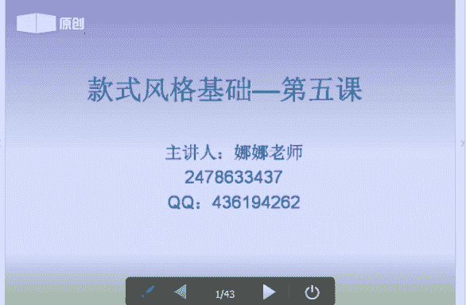
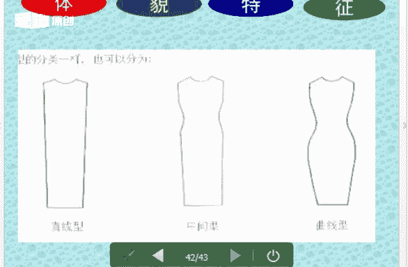

# 1、06《个人形象班》：款式风格基础-第五课  3月29日

好，各位同学晚上好。没听到老师声音的同学回复一下一好吗？Yes。好的。嗯。我们的VIP课程呢，它会轮流的讲到我们的一个基础知识点。那么今天呢我所谓讲的内容呢也是非常重要的。因为每一个知识点呢。

它都是我们VIP课程的一个重要的部分重要的环节。那大家呢一定要认真的去听。没有听过的同学呢嗯一定要认真的听，听过的同学呢可以反复的听，一直到听懂为止。如果课后需要交流的同学呢，可以直接加老师的一个QQ。

或者是老师的一个QQ群，或者是我的一个微信号，那么我的扣我的那个就是2478633437呢，或是我的微信号。大家可以加一下我有什么？就是后续有什么需那，就是需要的话搭配衣服这一块，对吧？色彩这一块。

那么还有形体，还有你美甲化妆以及我的纹绣这一块都可以大家都可以来咨询我。好，我们言归正传。那在上课期间呢，老师不会去点同用或者是添加。课后呢，老师会一个一个的去添加的那我来自我介绍一下，我们是娜娜老师。

今天呢我和大家一起共同分享学习的是一个色彩服饰的搭配，其中的款式风格的基础，也就是我们的第五节课。好，前面的内容我们讲到一个对色彩的一个认识。然后对那个色彩的一个就是。

色彩一个配就是我们的一个配色基础配色。后面呢我们也讲到了一个嗯。进行的基础对吧？村和夏。邱和东。好，那么我们这节课呢就讲的是我们一个风格风格的一个基础。好，就为我们啊后面的课程款式。

女士的款式风格和男士的款式风格来打基础。

Yeah。好，我们来看一下风格的定义是什么。首先风格呢它在我们生活当中呢，它是无处不在的。好，任何的事呃任何事物行业，那么它都会有它的一个风格。比如说呃我们的一个派系、主艺等等，对吧？

它也就属于我们的一个风格。那么我们发现在我们的服装上和我们的一个配饰上，以及我们的画展上，和我们的艺术文化上、建筑上、音乐上，那么等等跟色彩息息相关的。那么都有它属于自己的一个风格。

所以呢风格它是覆盖了我们日常生活中的每一个领域。好，那我们来看一下风格到底是什么。风格我们可以用现代汉语大词典来解释解释一下关于风格的一个定义。那么它是一个时代，一个民族，一个流派或者是一个人的文化。

文艺作品那么说表现于他的一个主要的思想的特点和艺术的特点。其实很简单，它就是一个。🤧嗯。某事物之间的一个共性的特征，共性的特征好，它是占我们的一个主导地位的。那么就是我们的一个风格。共性加特性。

大家记住风格的定义就是共性加特性，它就是我们的风格。好，其实很简单。好，我们再来所谓的看一下想那大家来想一想和我们风格相近的一些形容词。大家可以想一想有哪一些。和风格相近的形容词，大家想一想有哪一些？

Okay。嗯。大家可以想一想，跟我们风格相近的一些词语有哪一些？Yeah。对。好，比如说风度、品格、气魄、风采、风韵、主义、流派等等，对吧？它都是跟我们风格跟我们风格的词语它是相近的。好。

风格就是指我们的共性加我们的特性，那么就是属于我们的风格。好，这个有没有清楚定义清楚的同学可以回复一下一好吗？好，okK好的，那我们现在来接下来看一下，那么我们的一个嗯。装修它有一也有它的一个装修风格。

那么我们的图片上面这个图片它是属于我们一个罗曼蒂克的一个装修风格。好，很浪漫很浪漫的那种风格。那么我们再来看一下第二个图片，它是属于我们简洁俊秀的一个风格，就是比较利落，对吧？比较利落，比较简洁。好。

第三个呢它是属于我们一个另类前卫的风格。那么另类前卫的就是比较突出个性时尚的一种风格。啊，这是我们的三个不同的一个装修风格。那么我们今下来再来学习一下风格的一个构造。什么是风格构造呢？就是。

我们可以把就是人们把风格的。主要是蓝。来源于我们物体造型上的主要的特征。那么它给人带来了一种心理的感受。好，那么这种视觉呢对待我们物体造型的把握呢，它是人对事物它是也是一个最初的一个基本的认识。

那么物体的造型呢主要是由颜色，我们的颜色就是我们的色彩。我们的形状和我们的材质组成。好，色彩呢就是色彩所指的就是我们的一个色相明度和纯度。那么我们的形状呢，它就是轮廓量感和比例。那么材质的话呢。

它就是纹理光滑度硬度和透明度等等。那么色彩呢它是占了65%，材质呢它是占了10%。那么剩下呢就是我们的形状，它占了25%。好，风格的构造这一块大家有没有清楚，有没有有没有不清楚的位置。

清楚同学可以核数一下一好吗？Yeah。好的。那我们接下来来来学习一下我们的一个轮廓是什么。那么嗯我们讲的是形状中的轮廓量感比例。轮廓呢它是构成任何一个形状的边界线或者是外形线。

那么我们将轮廓呢它分为直线形曲线形和中间形，直线形呢，它就是有棱有角的五角星的对吧？就属于我们的直线形。那么我们的曲线形呢它就是有花瓣状的花朵状的可爱的小动物的。好，那么中间形呢就是既有直又有曲立。

称为我们的中间形。Yeah。Yeah。好，但是我们物体它是不存在一个绝对的一个值和曲的。那么我们我们在判断物体的一个值取的时候呢，我们是根据我们物体带给我们视觉的一个感觉，是直线还是曲线。

那么你觉得这个东西它是直线型还是曲线型。它是这样的一个视觉的一视觉的感觉。好，难以划分的，我们都可以把它统称为我们的一个曲线型？啊，难以难以划分的，我们可以都把它称为我们的中间型。

就是我们既分得出我们的直线型，也能分得出曲线型。那么这种中间型。嗯。难以划分的直线型和曲线形就称为它是中间型。好，轮廓这块大家还有没有清楚，不清楚就可以回复一下一。那么左边的这个中就是我们的一个直线形。

对吧？有棱有角，好，中间既有直又有曲，右边曲线形好，粉色的对吧？带花朵的带小动物的好，这是我们的轮廓比较简单。那么我们再来看一下任。量感呢其实也是很简单的，视觉和触觉。那么它是各价物理的一个规模程度。

以及它的速度等等方面的一个感觉。好，对于我们物体的大小多少长短粗细，方圆后果轻重快慢松紧等等，它是一个量态的一个版型的认识。好，比如说大的大的体积，大的量感，那么就是就称为它是大量感，小的量感。

小的体积，那么就称为它是小量感。好，这个大家有没有清楚量感有没有清楚，清楚的同学可以回复一下一。好的好，我们今天来再来学习一下我们的比例。

那么比例呢它是指我们一个总体中各个部分的一个数量占总体数字的一个比例。那么通常呢我们反映总体的一个构成和它的一个结构。正常比例呢，它会给人一个舒适和就是舒缓和谐，对吧？平和的那种感受。

如果特殊比例的话呢，它会给人一种。怪异独特时尚另类的那种感受。那么我们看图片当中，左边的它是属于我们一个正常比例，对吧？属于一个看起来比较舒适和谐。好，右边的这个呢它是我们一个特殊比例。

那么它会给人一种很怪异很独特的那种感觉好，这是我们一个比例，大家有没能清楚清楚朋友可以回复一下一句好吗？Okay。Yeah。新的朋友可以回复一下一。好的。那么我们再来看一下我们的一个杯子。好。

上面的这个杯子呢，它是属于我们的一个正常的对吧？正常比例，下面的这个它带有孔雀的对吧？它是属于一个比较时尚，比较另类的一孔。好，这个大家应该是比较清楚的。我们再来学习一下后面的一个风格风格情感。

风格情感呢其际在我们的后面的课程款式风格当中，我们马上就会讲到这些内容，但是呢今天呢我们这个就只概括一下，后面我们再来详细讲款式风格，因为有自然前卫，对吧？有优雅。然后这些我们到时再来讲好。

我们再来学习一下我们的物体十二风格。那么物体的十2风格呢，我们也是根据它的一个色颜色、形状和材质来判断的。第一个呢就是我们的一个少女风格，对吧？可爱型的风格。好，嗯，我们的风格的联想，我们来想一想。

那么大家看到这个图片会想到什么想到什么。看到图片。想到什么？Yeah。好，可爱。我们的小娜的风格联想，小巧的、童趣的、天真的、轻巧的。乖巧的顽皮的对吧？古灵精怪的，讨人喜欢的可爱的。

那么都是我们一个风格的联想。好，都是来形容我们一个可爱风格的。好，第二个呢，我们的一个典型用色呢就是它是一个中高明度鲜艳的一个。就是中高明度比较颜色比较鲜艳，那么它是不限纯度的，纯度。

它的一个跨度是比较大的。色像上面呢，它是偏暖的，那么它是以橙色为支配配色。好，这是它的一个典型的一个用色。我们来看一下后面的啊形状和图案。第三个呢就是它的一个典型的图案。图案的话呢。

它是一个曲线型的轮廓，小量感的图片。左边好，总体上让人就是活泼可爱的那种感受。比如说小花朵小圆点，蝴蝶结等等这些图案，对吧？好，这是我们的一个典型的一个图案。第一要是看一下他的一个才质。嗯嗯。

🎼材质的话呢，它是触感柔软的，轻盈的毛茸茸的那种感觉，比较轻巧的柔软的泡泡纱，棉布雪纺啊，都是属于我们一个可爱型的一个嗯典型的一个材料。好，再来看一下第二个。第个的话是我们的一个优雅型。

优雅型呢它会给人就是一种精致女人味的那种感觉，对吧？那么我们来联想一下优雅型的一个风格的联想是怎样的呢？大家可以想一想。嗯。好，风格联想，温柔的、女性女性化的、温软的精致的。细腻的优雅的对吧？

都是它的一个风格联想。那么它的一个典型的用色呢，我们来看一下，从图片上面来看，它是一个中明度、中低纯度啊，它是中明度、中纯度啊。那么它的一个色彩偏向于冷色的一个颜色，那么以紫色和蓝色为主。

那么整体的感觉呢，它是比较柔和的，成熟雅致的那种感觉。好，我们来看一下它的优雅型的一个形状和图案。那么典型的图案，我们来看下它的图案都是那种小花小花朵状的对吧？就是有流线感的曲线的。好，它是一个中量感。

它是曲线型的轮廓，中量感，那么带有流线型轻盈的漩涡的花草图案或者是细小的。随意分布的一个图案，随意分布的一个图案。我什。好，典型的一个材料。Yeah。Yeah。Yeah。Yeah。好，典型的材料。

轻柔的、细腻的触感柔和的啊，就是那种嗯摸在手上很舒服的那种面料啊，雪纺丝绸细腻柔和的，都是比较适合我们优雅型的人。🎼嗯。好，那么这个物体十二风格当中的色形次呢，那么我呢也不可能跟大家去讲12种风格。

对吧？就只能一一的去。一一的去就是跟大家讲解两种，让大家就是知道啊知道。好，那么我们再来学习一下我们的一个女装型的特征。好，有没有同学能告诉一下老师女装道理它的组成部分。女装的一个基本组成部分有哪一些？

有没有同学知道的，可以回复一下老师。Yeah。一？行。好，女装型的一女装的一个基本组成的部分有哪一些？大家能不能告诉一下老师。Yeah。Yeah。Okay。好，裙子我们来看一下。我们来看一下啊。

组成的部分有哪一些。除了裙子还有什么，想一想你们在出去就是出去的时候做搭配的时候有哪一些？嗯。好。好，裙子包包对吧？饰品。好，我们来看一下，我们来学习一下。

女装的一个基本组成部分有上衣、裙子、裤子、鞋子、包包和饰品，对吧？好，这是我们的一个女装型的一个特征。好，首先我们来看一下。上衣那么它的上衣呢，它也是分为我们的一个直取量感的。好。Yes。好。

上衣呢它是由我们的领袖一片饰物，那么这个部分组成，对吧？我们来看一下领好，大家都知道领袖一片，那么饰物呢就是指它的一个扣子、口袋、装饰线和肩尖胶等等。好，我们分析服装的一个量感值取时。

那么我们应该从剪裁图案面料上面去来三个服装来组来重要组成。组成的部分来做分析。那么我们只能从它的一个剪裁面料图外它的面料。Yeah。Yeah。首先我们上衣呢它是分为只取量感的。我们来先讲一下领子。好。

领子还有直线型的。那么我们下面一排的衣服都是属于我们的直线型。好，曲线型下面一排都是属于我们的曲线型，对吧？圆圆形圆弧形的属于我们的曲线型好，领形的一个直线曲线，那么它是由我们领面的一个外轮廓。

县的值许和领口线的值许来决定和区分的。这是我们的一个领子。那么我们这个图片里面的这些女士的领和袖的一个基本款式。那么这些领呢就是在我们的生活当中呢，远远不止这么多。只是说我举了几个例子。

比如说我们的意大利领啊，我们的蝴蝶领啊，我们的花瓣领啊、围巾领啊，对吧？马球领啊等等。像这些，因为它只是在生活当中比较常见的一些领型，比较常见的一些领型。好，我们再再来看一下。Yeah。Okay。好。

领子的一个亮感。嗯。领子的一个，我们来看一下领子的亮感啊，领子的亮感。好，上面呢是我们的大量杆，上面是我们的大量杆。那么它是根据我们大量杆呢，它是根据我们领口就是领口开的一个大小来决定的。

如果领口开的比较大呢，就是我们的大量杆。领口开的比较小呢，就是我们的小量感。好。领口的量感大小，它是与领口开的一个大小，里面的一个幅度的大小而决定的。好，这个大家应该是比较比较懂的。Yeah。好。

那么我们的袖子也有紫水亮粉。Yeah。好，我们的袖子呢它也是分为我们的直取量感的。大家来看图片啊，上面的袖子呢它是嗯有棱有角的，看到没有？直线型的直线型的，那么曲线型呢就是带有弧度的哈。

这个大家应该是比较好区分的。那么袖子的一个直取呢，它是由肩和袖形成一个角度，袖口轮廓线来决定的，来决定的。好，袖子的一个亮感呢，它是由袖面的一个弧度剪裁松紧来决定的。Yeah。好。

大家有该清楚袖子的一个直许，它是由我们肩与袖形成的一个角度为参考和袖口的一个轮廓线来决定的。那么袖子的一个量感呢，它是由袖面的一个宽幅和。裁剪的一个松紧来决定的。好，这样区分这样区分。

那我们再来看一下一片。干会了。好，这个女士女士领和袖的一个基本款式，袖子呢也是和领是一样的，也是在生活当中呢，它是有很多的。那么我这个呢找了几个呢，都是我们平时在生活当中常见的一些就是袖子。

我们的插肩袖啊，喇叭袖啊，对吧？灯笼袖啊，我们的荷叶袖啊，就是我们的荷叶袖是我们春天的款式，对吧？插肩袖呢就是我们的一个嗯秋天的款，秋天可以穿喇叭袖呢也是一样的啊，灯笼袖对吧？我们的西装西装袖落肩袖好。

打褶袖，那么它都是。

我们生活当中比较常见的一些袖子。好，袖子呢它也是有量感的，袖子它也是分为量感的。刚才已经讲到了，对吧？大的就是大量感，小的就是小量感就是松紧，具有松紧的。那么们就是小量感，大的傻的就是我们的大量感。好。

这个比较简单。那么我们再来看一下E片，那么一片呢它也是分为我们的直取量档的。好，直线形和上面左边是我们的直线形，右边是我们的曲线形。那么我们一片的一个直取。

它是由衣服边缘的一个外轮廓分割线以及它的装饰物的轮廓来决定的啊，我们直线型它的一个衣服它是外轮廓，对吧？分割线装饰物轮廓来决定的。不任行。好，曲线型呢就是。曲线形是比较简单的。那么我们看它的线条对吧？

和它的蝴蝶结，那么一看就是我们的曲线形了。好，这是比较好区分的。那么它的一个衣片的一个亮感。一片的量感。一片的量感呢，它是我们一片的一个幅度和装饰物的大小来决定的。那么它的幅度越大，装饰物越多。

那么它的量感就会越大。好，装饰物越小，衣服越款式越简单，那么就是我们的小量感，这个是比较好区分的。好，我们再来看一下我们的裙子。裙子呢它也是放有我们一个直取量感。裙子的一个直取呢。

它是由外在体现的一个线条决定的。好，比如说我们上面。Yeah。曲线型对吧？曲线型直线型啊，曲线型直线型。外在的一个线条决定的。Yeah。那么裙子的一个直取，它是由外在体现的线条决定量感。我们来看一下。

量感呢它是大小，主要呢是从呃带来心理感受判断的。那么夸张的为大量感。轻盈的为小量的哈，比如说我们的裙子，我们大百褶裙对吧？属于大量的。那么我们的包裙一步裙属于我们的小量的。好。

这个呢应该是比较好理解的对吧？好，裤子它也是分为直取量感的。裤子的量感呢，裤子的一个直取就是从外外在轮廓线的线条来变化的。好，外在轮廓线的线条来别来判断的。第二个呢就是我们的裤子的量感。

量感呢它是从我们裤型的一个宽度及装饰的一个大小来判断的。比如说我们的一个嗯。我们的一个小脚裤，那么它属于我们的小量感，对吧？那么我们的阔腿裤它属于我们的一个大量感，啊，就是这样区分，就是这样区分的。好。

那么我们不仅仅是衣服的一个就是只取量的。那么我们的一个。图案它也是分为我们的一个直线形和曲线型。直线形的图案呢，它是下面有条纹的方格的，有转角的几何图形，字母均为直线形的一个图案，对吧？

直线型呢就是我们的猛兽类的，我们的五角星啊，我们的蜘蛛啊，它都属于我们的直线型。好，大家有没有清楚这个概念，清楚的同学可以回复一下你P好吗？Yeah。Yeah。Yeah。好。

那么我们再来看一下我们再来接下来我们再来看一下啊。我们的曲线型，那么我们的图案当然也是分为我们的曲线型的。曲线型呢我们从图片上面来看，它的图案当中有如果状的圆点状的水滴状的。水滴状的啊。

比较圆润的一些图案呢，就分为我们的一个曲线形。好，可爱的小动物，对吧？好，这是我们的一个曲线性。懂了。好，那么我们再来学习一下我们的图案，不仅它分为直取，那么它还有我们的量仔。好，大量杆。

那么我们可以写大的对比大的花朵对吧？大的格纹，那么等等，比例比较大较大的好，醒目的图案呢它为我们的大量杆，那么体积体积大，面积大，醒目的夸张的都称为我们的大量感。好，多半的花朵比单瓣的量感要大一些。

繁杂的比简单的要大一些。好，这是我们一个大量杆。那么小量杆小量杆，我们看图片啊，看图片。我们看这个PPT的图片，下面有。大的量杆小的量感。好，我们再来看一下小额量的这个。黑色带花的那个图片啊。

它是一个弱对比，它是一个小小花朵的对吧？格纹的那么等等的一些这样比较小的一些图案，那么它就称为我们的小亮感。好，这块有没有清楚清楚的同学可以回复一下一好吗？Okay。Oh。不。好。

那么我们学习完了一个量感。那么我们接下来学习它的一个面料。面料的话呢它也是分为直线型和曲线型。那么大量杆和小量杆。首先我们来看一下面料，它是比较硬挺的，不易起皱的面料，那么它是适合我们的直线型啊。

比如说我们的皮革，我们的牛仔等等。那么柔软细腻的一个面料，它是适合我们曲线型的。啊，比如说我们需求我们轻盈的飘逸的，那么这些它是适合我们曲线型的。好，我们再来看一下。那么我们再来看一下嗯。

粗粗呃就是纹路比较粗犷的。我们看第二个图片啊，下面第二排左边第一个纹路粗犷挺括的面料，那么它是适合我们大量版的。好。轻盈的飘逸的面料，那么它是适合我们小量感的。好，大家有没有有没有清楚。

就这一块面料这一块还有没有清楚的，清楚朋学可以核注一下一好吗？Yeah。好，清清楚的同学可以回复一下。因为面料这一块还有没有清楚的？好，我们直线型的。首先我们的牛仔的话呢，它是属于我们的直线型，对吧？

牛仔都属于我们的直线型，大家记住了，那么它的面条面料呢它是比较挺括的，它是不容易起皱的对吧？好，那比如说我们呃是我们大量感的人，比如说比较厚重的，比较粗犷的它就适合我们一个大量感的人。好。

那么什么是大量感的，什么是嗯少量感的。那么到后面我们的款式风格当中，我们我们会有就是明星代表人物，我们会去分享怎样是什么样的是大量感，怎么样的是少量感的，好吧。Yeah。那么我们来就来看一下我们配饰。

那大家学了前面的一个直线形和曲线型，还有我们的一个嗯量杆大量杆和小量杆。那么我们再看到这个图片当中，这个配饰的一个鞋子大家来做分析那。我们只我们只是我们这样说吧，就是左边右边上下上面下面哦好吧。

我们这样来分左边右边左边是什么，右边是什么样的。我们先来说它的一个值取，然后再来说它的一个量感，好吧。上面是只取，下面是亮的。这样来说，那么大家能看到这个图片的话，能不能告诉一下老师。直线型是哪边的。

曲线型又是哪边的，哪一个鞋子是大量杆的，哪个鞋子是小量杆的，我们再来分析。Yeah。好，我们现在开始分析。上面白色这双鞋子，它是曲线型还是曲线型？大家看看能不能回复一下老师。Yeah。

下面白色的是直线形还是曲线形？我们刚才所讲的直线形是什么？直线形是什么？直线形就是有棱有角的对吧？就是我们的直线形。好，曲线型呢它是带有蝴蝶的对吧？带有那个就是嗯我们的可爱的动物的圆点的。

它属于我们一个曲线型，对吧？那它是不是已经讲到了白色这双鞋子呢，它是我们直线型。好，我们可以从它的那个就是鞋子的那个就是上面的一个事物开始看，然后再看它的这个上面的一个线条，对吧？

它是属于我们的一个直线型的。那么这双红色的鞋子呢，它就是我们一个曲线型，对吧？很突出的一个颜色，粉色带有蝴蝶结，对吧？它属于我们的曲线型。好，下面的这双鞋子呢，它是属于我们一个大的量感，大的量感。好。

右边的这个呢，它属我们一个小的量杆，小的量杆。好，我们来看包包。那么大家来告诉一下老师哪个图片，图片当中哪个包包是属于我们的直线型，哪一个是属于我们的曲线型。Yeah。好。

那我们能就是上面有同学能看清楚的，能不能回复一下老师哪个图案是我们的一个嗯曲直线型，哪个图案是我们的曲线型。好，这位同学这位同学是不是你是拿手机上网的吗？如果拿手机上网的话，你是看不到我的PPT的。

好好好的，这位同学回答非常正确。那么我们黄色的这个包包，第一个它是属于我们的一个直线型。第二个。它是属于我们的一个曲线型。OK对的啊，这个同学非常好。好，那么我们再来看一下下面两个。

哪一个是我们的大量杆，哪一个是我们的小量杆。好，这个同学的话，如果你拿拿手机上网的话呢，手机听课的话呢，你是看不到我的PPT内容的。那么你换到电脑上面才能看得见，好吗？Yeah。好。

第一个是我们的大量杆，第二个是我们的小量杆。好好的，这位同学学的非常棒啊，非常棒，掌握的。非常快。好，我们再来看一下视频。那么视频呢它也是有我们的直线形和曲线型，我们的量大量杆和响量杆。

那么大家再来说一下哪一个是的，下面是我们的直线形还是曲线型？左边第一个。Yeah。Yeah。Yeah。好，我们的下面。第一个是我们的直线型，第二个呢它是我们的曲线型，下面的就是我们一个红色的耳环，对吧？

它是我们民族风情，那么它属我们的大量感。好，右边的这一边呢使于我们的小量感比较精致，对吧？比较精致。好的，那么我们再来看一下眼镜。那么眼镜呢它也是一样的，眼镜左边这个眼镜是直线型。

右边这个眼镜它是曲线型，对吧？圆的，它它那个外框。好，左边这个下面的这个呢它是属于我们一个大量感的，右边下面它属于我们一个小量感的，这个都是比较很比较明显的。那么我们看一下配饰中的一个手表。手表的话呢。

大家来分做一下分析，左边上面是什么是是是个怎么样的，是直线型还是旋形，是曲线型的吗？Okay。Yeah。Yeah。Yeah。好，左边上面是直线型，右边是我们的曲线型。

那么左边下面它是属于我们一个大的量杆，对吧？行，右边下面是属于我们小的量感。好，大家掌握的知识非常棒哈。那么我们不仅仅是我们的配饰，那么我们的发型它也是分为我们的直取量感的大量感强亮感。好。

左边的这个发型，它是。直线型对吧？右边是曲线型，这个是比较好区分的。好，这个发型的一个量感，左边呢它是一个大的量杆，对吧？大的一个波浪大的波浪，右边它是属于我们一个小量杆。好，妆面。

那么妆面呢它也我们不仅仅是我们的饰品，还有我们的一个妆面，它也是分为我们的一个直取量板的。那么大家来分析一下左边的这个图片它是什么，它是什么，是什么型是直线。好，我们现在来看一下左边的这个桌面。

它是属于直线型还是曲线型。F。Okay。好，左边的这个妆面它是属于我们的一个直限型的啊，因为它的妆面是比较立体的，妆面是比较立体。它就是我们一个平面的一个平面，它是我们一个平面妆平面妆。好。

右边的这个呢它是我们曲线型，它属于我们一的芭比新娘的一个妆妆面，芭比新娘的妆面。好，那么我们来看一下桌面的一个。妆面的一个亮感，左边这个它是属于一个大量感。那么在我们的舞台对吧？

在我们的舞台舞台装舞台装，就是我们一的大量感。右边这个它是我们的韩式，它是我们的一个韩式装。韩式装呢是嗯给人感觉呢就是比较。清新透彻的那种感觉啊，就是看着就是有装送无妆的那种感觉。韩式装就什么韩式装。

好，那么我们学完前面的一个直线型和曲线形，包括我们的图呃大的量感和小的量感。那么我们现在再来学习一下我们一个人体型的特征啊，人体型的特征呢就是主要呢它是在我们的一个面部的一个轮廓，身材的一个高矮胖瘦。

以及我们的性格的一个曲向而决定的。首先呢我们面部我们看图片，面部呢它是占着我们人的一个70%。好，眼神特别是眼神它是占了整个面部。那么呃眼神呢它呢影响我们的一个性格，综和呢它是为性格的50%。好。

性格呢它是占了10%，那么身材呢它是占了20%。Yeah。好，我们的再来看一下它的一个面部。好，体系的一个特征。那么它也是分为直线型、曲线型和中间型。好，我们来看一下它的一个面部。

体貌的一个特征。面部面部的一个指许，它是指面部的一个骨骼的形态和五官的一个线条取向。那么大家回去可以看一下周边的朋友啊，看它是属于直线型还是属于中间型，还是属于我们的曲线型。好，那么直线型的人呢。

他的五官呢，它的轮廓是比较分明的。那么骨感呢有力度。那么曲线型的人呢，他的五官呢是比较圆润的，比较丰满的。那么量感那么面部的一个量感呢，他是指我们五官的一个比例相对大小和脸型的一个骨架的一个大小。

那么不容忽视的是什么呢？就是我们眼神的一个内容也是决定面部的一个直取的，那么我们可以有有时候我们不要去通过他的面部去看，我们可以去看他的眼神，对吧？那么有的人呢他的眼神力度大呢，它会具有穿透力。

它会有杀伤力，对吧？那么如果眼神比较嗯无神的话呢，那么他这种人会给人一种什么样的感觉呢，就是比较柔软，对吧？就是看人的话呢就是那种嗯。呃，含情脉脉转的弯越来看人，那么眼神力度越大，那么它的量感就会越大。

好，大家要记住啊，记住了。好，那么我们最后来学习一下我们的嗯它的一个体型的特征。那么这个呢也是大家作为关心的一个，对吧？身材，那么它有我们的直线形，也有我们的中间型，也有我们的曲线形。好，那么嗯。

体型轮廓主要是由肩部、腰部和胯部所形成的一个线条的决定。直线型呢它的身材呢一般为我们的皮肩。好，身材让它是呈我们的H型。那么曲线型的身材让它的肩部圆润的身材呈现为我们的S型。啊，胖的比瘦的量感要大。

高的比矮的量感要大，骨骼大的比骨骼小的量感要大，五官大的，气场大的量感就肯定越大。好，那么身材的一个量感，它是由我们身体骨骼的大小、轻重厚薄而决定的性。那么性格呢它是。我们再来看一下他的性格。

那么个个性体帅的大方鲜明的、张扬的。那么我们称他为直线型的性格啊，温柔内敛，含蓄的，我们闻化为曲线型的性格。那么直线型的性格呢，它是比较中性化的，比较中性化的。中性化不是我们的男性啊，大家要搞清楚啊。

曲线型的性格呢它是比较优柔，比较女性化的。那么我来解释一下这个直线型的中性化。中性化呢，它会给人就是一种比较干练。比较比较干练的那种感觉，比较干练利落，对吧？不是我们的男性化啊，大家不要弄混淆了。好。

我们可以性格呢，我们还可以通过它的一个语音语调字体语言的一个氛围来判断它是直线型还是曲线型，大的量的还是小的量的。好，那今天晚上的课程呢，我们就结束了，谢谢大家的聆听。明天晚上呢星期三对吧？

我们晚上会接着讲我们的一个款式风格，女士的款式风格。Yeah。好。我。Yeah。