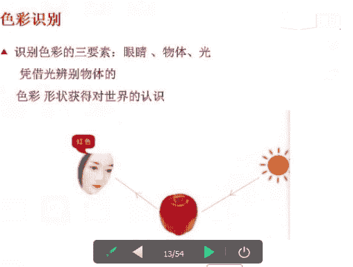

# 1、06《个人形象班》：色彩基础-第一课 3月22日

各位同学晚上好，能听到老师声音的同学回复一下一好吗？Yeah。各位同学晚上好，能不能听到老师声音？😊，Okay。各位同学，晚上好。能听到老师声音的同学回复一下一。好的，在这里呢老师想问一下同学们。

哪些同学是第一次听课程，第一次听课程的同学回复一下啊好吗？好的，我们的VIP课程呢，它会轮流的讲到我们的一个基础知识点。那么今天呢我们所讲的内容呢也是非常重要。

那么今呃今天的课程呢又是轮了新的嗯一新的一期。嗯，因为每一个知识点呢它都是我们VIP课程里面重要的部分重要的环节。前面的课程全部都是基础，没有听过的同学呢一定要认真的听。呃，如果课后需要交流的同学呢。

可以直接加老师的1个QQ或者是老师的1个QQ群。好，老师的一个QQ呢就是我的呃QQ号，也就是我的微信号。那么大家呢可以去加我。好，大家可以看到吗？能看到PPT内容的同学回复一下一好吗？H。怎么不。

Okay。Okay。好的，那我们现在开始上课。那在上课期间呢，老师不会去点同意或者是添加课后呢，老师会一个一个的添加的。好，我来自我介绍一下，我是娜娜老师。今天呢我和大家一起共同分享。

学习的是我们的色彩的服饰搭配中的色彩的基础，也就是我们的第一节课。好，首先呢我们也欢迎新的同学今天来过来上课。嗯，后面的课程呢也希望大家每天就是继续呃听我的课程要调课。

因为前面所讲的内容呢都是使用我们的一个基础知识。嗯。好，我们今天所讲的内容呢，就是我们的第一部分，我们的色彩的基础理论。Yes。Yeah。首先我们来看一下什么是四计色彩理论。好。

大家看到老师昨天的这幅图片，什这个图片就是我们一个四季色彩的一个图。那么它分为我们的春夏秋冬四个季形。好，那么嗯大家呢都知道我们的大自然，它也有四季的转换。春夏秋冬，对吧？那么在我们不同的季节。

那么也有着我们不同的一个色彩。那么它带给人的一个感觉和心情，那当然也是不一样的。好，那你们知道吗？我们自己呢也有属于自己的一个就是季节的一个特征，对吧？和大自然的四季，那么也是一样的。

每个人都有适合自己的一个颜色和款式风格。好，那么这呢就是我们的四季色彩的理论。那么这个呢就是通俗易懂，大家听了之后呢，就知道什么是四季色彩了，对吧？好，我们来看一下后面的内容。好，4纪色彩的一个创始人。

四纪色彩呢嗯她是我们美国大师，美国的色彩大师卡罗尔杰克逊女士好，她是一位女士。那么呢这位女士呢，她将近用了10年的时间，那么进行了1个4万多次的一个色彩的测试与色彩的一个排序。

那么就发现了我们一个四G色彩的一个理论。好，四计色彩的理论呢，它就是把我们人与生俱来的一个肤色、发色、眼珠色等等的人体色的一个特征。那么与我们宇宙间纷繁的一个呃色彩的一个科学。

它是相对应的相分析的和分类的。那么就形成了我们一个和谐搭配的一个规律。好，大家要记住了，色彩四纪色彩的理论，它是我们的人与生俱来的一个肤色发色和我们的眼珠色等等的人体色的特征。大家要记住这个问题。

那么在下节课上课之前呢，我会提到这个问题。好，四季色彩四级四季色彩理论中，那么最重要的内容是什么呢？就是把我们生活当中常用色的一个常用色，按照我们基调不同进行冷暖划分的一个明度和我们的纯度的划分。

那么进行了一个一年四季相对应的春夏秋冬四大色彩群。好，我们回过头来看第一个图片。那么这个上面的图片，左边上面的大家知道这个颜色是什么吗？这是这是夏季型，还是我们的冬季型，还是我们的春季型。

还是我们的秋季型？Yeah。Yes。Oh。好，春好，下面左边上面是我们的春季行。春季行大家记住了啊，左边右啊就是右边上面是我们的。秋季型。左边下面是我们的夏季型，清凉凉爽。好，右边下面是我们的冬季型。

对吧？冰冷寒冷的那种感觉，我们可以看图，后面我们会讲到我们的冷和暖冷和暖。大家先来了解一下设计色彩理论。那么我们每个人每个不同的人，只要掌握最适合的自己的这个色彩裙。

那么以及与他们之呃之间相呃相互间的一个搭配的关系，对吧？我们就可以服饰化妆自然自身自然的条件去完完美、和谐统一去搭配我们的统一。我们卡罗尔杰克逊女士呢，她是我们全球最权威的一个色彩机构。

那么它的公司名称呢是我们的CMB缩写CMB缩写。那么它的中文寓意呢就是我们色彩使我美丽，色彩使我美丽。好，那么他的这个公司呢目前呢呃遍布了全世界28个国家。那么直属注意的色彩顾问呢多达30多万人。啊。

他的公司也是比较大的，比较有名气的。う。好，接下来我们来看接下来我们再来学习一下，学习一下第三节，对吧？第三节呢就是我们四纪色彩的一个未来的发展趋势。那么据我们就是20到现在2016年为止。

那么这个是以前的啊以前的一个数据培计。那么美国权威调查统计机构呢公布的数据表明，那么全世界呢现在已经有将近90个国家90个国家已经有很专业的一个色彩机构咨询机构。

那么这些呃色彩呃咨询机构呢就是做就是相当于是我们一个形象，对吧？就是给形象来做诊断的一个公司。好，培训现在呢我们的色彩顾问呢，在我们的西方国家已经是拥有像医生律师和心理咨询师一样，社会和地位。

那么这个职业呢是非常一个高尚的职业。很多人都想去做，就是我们的形象管理师。以前呢都是我们的色彩部位，那么现在呢我们就同。称为我们的形象管理师。形象管理师。形象管理师呢，它不仅仅是我们的一个。服装的搭配。

那么它还是我们一个就是自身的一个形体的管理。好，我们讲到这个就是呃讲到这个这讲到这个就是名词的话呢，我们也要跟大家说清楚一下，形就是自自己的一个形象是很关键的。那么你的形体也是很关键的。好。

这个我们就带着说一下，后期的话我们有机会再来讨论这个形体美。好，第二个我们的服务服务范围。服务范围呢呃它的范围是比较广的对吧？那么从我们的个人的色彩款式开始鉴定。那么我们的化妆色彩搭配。

以及我们的服装色彩，到我们的产品外外观的设计包装，包括我们的商品的色彩布局陈列，那么建筑外呃建筑外观设计，那么城市色彩规划等等。那么男女老少呢，它无一不是我们的服务的对象啊，不是我们服务的对象。

那么所以呢我们色彩咨询的这个行业呢是非常有前景的，很多人都想去考一个这个就是资格证，考一个资格证。好，在我那在我们的生活当中呢，方方面面衣食住行，那么都是与我们的色彩是息息相关的。好，我们来看一下图片。

Yeah。好。好，那么呃讲到这个设计色彩的未来发展趋势之后呢，我们就会想到一个色彩的运用的领域。那么大家能不能呃回馈一下老师呃。跟色彩相关的一些运用的领域有哪一些？大家可以想象一下哪些是跟色彩相关的。

Yeah。哪些是跟色彩相关的？好，大家想一想啊想一想。好，大家可以想一想，那么跟我们色彩相关的一些运用的领域有哪一些？大家可以想一想什么东西跟色彩相关。说错了也没有关系。

只是说老师和同学们之间呢一定要去互动，对吧？多提一些问题互动一下啊，大家要想一想运用的领域有哪一些。Yeah。嗯。好，服装还有什么？大家想一想我们的服装设计，对吧？它是跟色彩。

它是跟色彩运用的一个领域是相关的。那么还有什么？好，我们来看一下四计色彩理论。那么以我们的科学性严谨实用，对吧？自问是以来就发挥着强大的一个生命力。好，该理论用最佳的色彩来表现人与自然的一个和谐的之美。

好，可以运用到我们的服饰用色，我们的化妆发型用色，我们的饰品的一个搭配，居家用色和商业用色，以及我们的城市用色等等。那么与我们色彩有关的一切领域。好，这是我们色彩相关的一些领域。我们来看一下图片。

那么个人形象的指导，对吧？化妆造型。好，第二个我们的服装设计好，我们的服装设计。第三个，我们的广告平面设计。好，第四个我们的商品设计。那么第五个就是我们的一个呃商场外的一个陈列的设计。

第六个就是我们的花艺设计。好，第七个就是我们的环境设计。环境设计包含了我们的城市空间和小区的一个建设。那先在那被现制就。我在想了。好，我们再来看一下。那么这些领域呢。

它都是跟我们的色彩是息息相关的相关联的。好，我们再来看一下我们的第二章。第二章呢它是我们的第一节，就是要认识我们的色彩。好，问一个问题，那么大家觉得什么是美？大家觉得什么是美？

在上在上第二章之前问一个问题，大家觉得什么是美，有没有同学能回避一下老师？大家觉得什么是美？好，大家是大家觉得什么是美？有没有同学能回复一下老师。我们的平衡和谐对吧？舒适它才为美。

那么我们怎样去平衡和谐呢？第一个我们的色行韵，那什么是色呢？色呢就是我们的一个色彩的鉴定技术。那什么是型呢？就是我们款式风格的一个鉴定技术。那什么是韵呢？运就是我们的气质，我们的神韵，我们的性格啊。

有没有清楚清楚同学可以回对一下一。好，O。那么我们第二个部分就是我们第一节对色彩的认识。那么光与色视觉机能与色彩。好，这个呢大家也就是要了解一下就可以了。好，首先我们就是大家想一想。

在我们没有光线的黑暗中。我们的色彩和形态都是看不到的对吧？它是伸手不见无指的。好，但是人们呢可以凭借我们的光来辨别我们物体的一个颜色。我们的。形状，那么可以获得我们客观的世界的认识。好。

那么到底光是什么呢？光是什么？好，在我们的1666年，牛顿呢它使用了三棱镜，将我们的光分解为了。赤橙黄绿青紫的一个光谱。那么这也是我们人类所眼睛所能。看到的一个范围。

那么分别呢它是从我们的380至780这个角度。好，光呢它是由不同的波长，不同波长的电磁波组成的。我们来看一下啊。电磁波的一个辐射。好，分别是从380到780之间波长。那么呃。红色的波长，那么它是最长的。

紫色的波长呢它是最短的。那么介于其他的呢，就是我们的绿色啊，绿色。好，这个大家只需要了解一下。那么我们再来看一下后面的内容。好，对色彩的一个识别。那么这个呢是比较重要的比较重要的。色彩的一个识别。

那么识别色彩有三要素。首先第一个我们的眼睛，我们的物体和我们的光好，物体本身呢它是不发光的对吧？那么它是光投在了我们的物体上，经过物体的一个吸收反射。反映到了我们视觉中的一个光色的一个感觉。

那么我们把这些本身不发光的物体统称为我们的物体色。那么苹果就是我们的物体色。好，那大家能不能告诉一下老师苹果为什么是红色的？苹果为什么是红色的？苹果为什么是红色的？Yeah。不不看。Yeah。谢。我。

没办法，因为前面的课程呢，它都是属于我们的一个基础课程。那那如果枯燥的话，也没有办法，因为你们学不到学不到基础的话，后面的课程的话你们都会听不懂的，所以没有办法必须学。Yes。好。

我们来看一下苹果为什么是红色。那么苹果它是吸收了我们红色以外所有的颜色。所以呢我们只看到了红色反射出来的一个红颜色，就是苹果为什么是红色的？好的。那么接下来我们再来看一下啊。

对，好，这位同学回答回答的非常正确。那么第二个就是我们的一个眼睛的一个结构。眼睛的结构呢就是。世界上面我们可以辨认出我们色彩的动物。不多。那么在我们的人类呢。

它可以通过我们的眼睛识别出我们700万750万到1000万种颜色。那么所以呢我们眼睛对于我们。感知外界起到一个非常重要的一个作用。好，大家看到这个图片，大家也只需要去了解啊。

也值需要去了解我们的眼睛的一个结构呢，它类似于我们的一个照相机，一个照相机。好，眼睛里面的水晶体，眼睛里面的水晶体，瞳孔视网膜。大家有没有看到瞳孔、视网膜。好。

它的作用与相机的一个镜头光圈和胶卷的作用是一样的。那么我们镜头就是我们的水晶体。好，镜头的是我们的水晶体晶体啊，晶状体。那么我们的光圈就是我们的瞳孔。好，光圈就是我们的瞳孔，这是我们的光圈。

看看到箭头没有？好，胶卷就是我们的视网膜。好，视网膜看到没有？就是我们的胶卷，我们只看晶状体、瞳孔和视网膜，晶状体就是我们的照相机。镜头就是我们的镜头，瞳孔就是我们的光圈。

我们的视网膜就是我们的一个胶卷。好，大家能不能理解能不能理解？好，所有的所有到达的一个视网膜上的光线，我们都是要经过一个处理的。那么它才能由我们的神经传入我们的大脑而产生它的一个视觉。

那么在我们的视网膜中，好，有着可以感觉到的红色、绿色、蓝色，那么它是为四神经的一个细胞。那么呢这种细胞呢被称为我们的一个水状体。那么大家呢这个只需要了解一下就可以了啊，只需要了解知道是怎么回事情。好。

就是告诉大家我们的嗯眼睛的结构类似于照相机、晶状体、瞳孔和我们的视网膜，大家知道就行了。好，我们再来看一下眼睛识别色彩的一个形式。首先呢就是它的一个光源色。光源色呢它是指我们光源本身的一个色彩。

那么可以分为我们的自然光和人工光。Yes。好，自然光呢这也就是我们的太阳光，对吧？大家都知道的，人工光呢，它就是属于我们的火光、白极光和各种荧光的一个等等光源。那么我们在不同的光源的照射下。

那么我们看到的物体它也会有所不同。好，大家看到两幅图片，对吧？它是一个自然光和一个人工光分别拍出来的一个照片。好，光源产生的一个变化。那物体看上去呢它也会有所不同。

所以呢在我们不同的场合都会有着与其性与与其性质相称的一个光源。好，左边就是我们的自然光，右边是我们的人工光。好，大家这里有没有清楚清楚同学可以回复一下一好吗？有没有清楚，这里面回复一下一号的。

谢谢这位同学。好，非常棒非常棒啊。第二个，我们的透过色，那什么是透过色呢？我打一个，比如透过色呢，它是指我们投射在光。就是投射光的一个透过的物体后的一个色彩。那我们来想一想。

嗯这个杯子左边的杯子和右边的杯子里面的颜色，对吧？杯子其实它是我们的。这是一个透明的杯子，对吧？我们的这个水呢，它是白色的，那么我们是通过它的透过色。好，右边这个呢就是我们杯子。

它本身就是一个蓝色的杯子，对吧？那么它的水是白色，所以透过去看呢，所以他就像像一个就是蓝色的对吧？里面上是蓝色的水其实是杯子的颜色好，我们举一个例子，那么大家都知道我们喝的那个饮料，我们的脉动，对吧？

脉动呢是一个典型的例子，那么脉动的瓶子呢，它是我们的蓝色的，对吧？里面的水呢，它是我们的白色，那么在我最先开始一个朋友啊，他跟我说的时候呢，他说他要去喝脉动，我说好的，可以，没问题。那么嗯我就问他。

我说这个脉动我说这个脉动里面的水是什么颜色？他告诉我那个水是蓝色。我就觉得很奇怪，后来呢我就把杯子里面的水，然后倒倒进了我的那个就是呃一次性的杯子里面，然后才发现这个杯子的那个外面的它的那个杯子。

它就是一个蓝色的。那么里面的水呢，它就是我们的纯净水，跟就是白色的水一样的。所以呢这就是我们的一个。透过色呢它是指投色的一个光透在物体后的一个色彩。好，这个有没有清楚，清楚楚楚可回复一下2好吗？Yes。

Yeah。好，清楚的朋友可以回复一下啊。好的。😊，好，第三个就是我们的表面色。表面色呢就是指光在物体上表面反射后所展现的一个颜色，就是我们的表面色。苹果就是一个典型的例子，对吧？好。

它是光在物体的表面反射后所展现的一个颜色，就是我们的表现色。其实这个呢是比较好，比较简单的，比较简单的表面色。好，我们再来学习一下我们的一个色彩的分类。也是比较简单的。

表面上呢它也是吸收反吸收反射的一个过程啊，就是吸收反射的一个过程。前面已经讲了好，我们的色彩的一个分类。不去。好，我们的有彩色油彩色呢，它是带有色彩感的红橙黄绿蓝紫。好，这是我们的油彩色。

带有颜色的就是我们的有彩色。那么五彩色呢就是我们的一个黑白灰。那么黑白灰呢，它是属于我们的一个百搭的颜色，对吧？不管你怎样去搭配，那么它是绝对不会出错的。好，各种色彩，色彩中突出的明度的变化。

不具备纯度的和色彩五彩中的一个黑白，那么只有明度差别，而没有色彩的差别，那么称为我们的橘色，黑白灰是属于我们的橘色啊。好，第三个就就是我们的一个金属色。那金属色呢它也称为我们的一个特殊色。

那么它就属于我们的一个金银铜。那为什么要这样说呢？我们可以大家来想一想，所有的衣服的搭配是不是我们都用金色。银色这些颜色来做搭配。那么我们可以称它为点缀色。那么它呢可以来提升我们的一个时尚度，时尚度。

好，有彩色可以搭配我们的有彩色。那么那么给人是一种品味，时尚时尚度比较高。好，有彩色搭配五彩色。那么经典搭配保险，它是生活中必要的。第三个我们的五彩色搭配五彩色。

那么就是在我们的一个时尚职场去穿严谨职场的一个搭配。好，这是第三个。好，这个有没有色彩的分类，大家有没有清楚清楚同学可以回复一下啊，好吗？Yeah。好的。😊，好，我们来看一下后面的内容，我们的三原色。

那什么是三原色呢？跟大家解释一下，不能用其他的颜色混合而成的色彩叫做原色。就是本身的颜色不要去和其他的颜色混合在一起的色彩，我们就叫做原色。好，那么原色呢它是有两个系统的。

第一个呢它是站在我们的光学方面的一个利论。那么称为我们的光的三原色。那另外一种呢，它是站在我们色彩或者是颜料的方面的利润，那么称为我们的染料三原色，那么光的三原色呢分为我们的红绿蓝。红玉兰。好。

大家记到了啊，光的三原色分为我们的红绿蓝，那么染料三原色呢分为我们的红黄蓝。那么它的红呢就是我们的品红黄呢是我们的柠檬黄，蓝呢就是我们的青色。那么大家可以去买一下那个就是水彩的那个呃色料。

大家可以去调一下颜色。调一下颜色，那就知道了什么是呃光的三原色，什么是染料三原色。好，大家可以去。买一下那个。可以在家里面调一下试一下啊，试一下。好，这是我们的三原色。那么我们来看一下第二个混合色。

混合色呢就是原色之间去相混合。也就是我们刚才那的三原色，对吧？之间的颜色，三原色的颜色去其他颜色相混合。好，可以得到一个新的色彩。那么这种新的色彩呢，我们就叫它渐色。好。

因为它混合之后就变成了一个第二排的第一个建色，对吧？那么这个呢叫做我们叫做我们的二次色。如果建色，你们觉得听起来名字不好记的话呢，我们可以说称它为二次色。好，如果把二次色再和其他的颜色去相。聚相混合。

那么会得出新的色彩，那么就是我们的一个复色或者是我们的三次色。那么混合出来的颜色就是我们的一个复色右边的。最后一个最后一个。好，那么把我们的三次色再和其他的颜色去做相混合的话呢。

那么它会得到我们的二次复色或者是三次复色等等，一直到无限，一直到无限。好，这个混合色大家有没有清楚清楚的同学可以回复一下一好吗？嗯。哦。Okay。好，那么我们再来看一下我们的一个色彩的表现。

色彩的表现呢大家也只需要了解一下。那么色彩的表现方法呢，它是有两种。第一个呢就是我们的印刷品，以及我们的颜料，通过反射光来表现出来的一个色彩。好，另一种方式呢就是我们的电视、电脑、舞台照明等等。

通过我们的透过光表达的一个色彩的方式，就是这两个就是这两个。Yes。Yeah。Yeah。好，第二部分，我们的国际色彩体系啊，那么这个国际色彩体系呢，我们我们是用不上的，我们是用不上的。

就是告诉大家我们有几个体，我们有几种体系。那么我们用到的那个体系呢是日本色盐配色体系啊。那么这个呢是我们的国际色彩体系。这个呢我们就是一般的我们我们是不会用到的，它是用用于我们的一个三维的一个空间。

三维的空间。好，这是我们的梦夏色彩体系。第二个是我们的。奥斯奥斯特瓦德色彩体系我们也是用不到的，我们用不到的。只是告诉大家啊，有几有有这么几种色彩的体系。那么第三个是我们最需要用到的日本色盐配色体系啊。

日本色盐配色体系。那么这个就是我们的PCCS色像图。好，这个后面我会讲到。好，第三节第三节我们的色彩的一个删属性，色彩的删属性。那么颜色分类它也是需要一定的一个基准的。我们在区别颜色的一个基准。

同时呢它会有三种。那么第一个呢它为蓝色、黄色等表达的颜色类型，那么称为我们的一个色像啊，就是第一个我所要跟大家讲解就是我们的色像。

第二个就是体现颜色为色啊体现颜色为的明度和纯度、明度、沉明暗程度的一个明度，就是我们的明度。好，最后一个呢就是我们一个颜色的深浅的一个纯度啊，就是我们的纯度，光的波长它是决定了我们的一个色相。

那么光的一个强度，它是决定了我们的一个明度。那么光的波长饱和度，那么是决定了我们的纯度。好，这三个大家有没有有没有清楚。刚才所说到的，大家有没有听清楚。没有听清楚的同学呢，你回复一下一。

老师再可以讲一遍好吗？如果听清楚的话呢，我就直接往后面讲了好，听清楚的同学回复一下啊好吗？好的。首先我们来看一下色相是什么。色相的话呢，它是与明度和明度，色相与明度或者是纯度它是没有关系的。好。

简单的来说，比如我们的红色蓝色紫色，那么这些就是我们色彩的一个名称，对吧？色彩的名称，那么色相呢，它就是我们的色彩的一个名称和相貌名称和相貌。那么它是按照我们一个波长进行的一个。

进行了一个循环的一个排列。那么它就形成了我们的一个摄像环，形成了我们下面的一个形成了我们右边的这个PCCS摄像环，日本色盐配色体系啊色像环。好，通常我们可以通过我们的光谱来显示颜色。

颜色呢它是分为我们的红色、黄色、绿色、蓝色、紫色，那么等等的一些色相。色像呢它与光线的波长的大小呢，它是密切相关的。那么其中波长长的色像我们称为红色，刚才已经讲了，对吧？波长短的称为紫色好，比较适中的。

我们就称为它为绿色。好，这是我们一个色相。好，在我们的摄像环中，相距30度的颜色称为我们的同类色。大家看到这个左边下面的图片，相距50度的称为我们的类似色。好。

相距90到180度的就称为我们的一个对比色和我们的互补色。这马上我们的配色我们就会讲到。Yeah。好，我们再来学习一下我们的一个第二第三章的后面的内容，就是我们的一个明度。明度呢在我们从前面学习中。

我们知道啊，人们一定就是我们大家要看到物体的颜色必须是在光线具备光线的条件下去看到的物体表面吸收或者是反射光的状态，决定了我们该物体的一个颜色。好，明度呢就是指我们色彩的明暗程度，就是通俗易懂的对吧？

那么物体它能吸收我们所有进入的光线，但是呢它不能反射任何的颜色，对吧？那么就形成了我们一个什么颜色？黑色相反的物体呢它反射了所有进入的一个光线。那么反射光反射光就记就是汇集成了我们的一个白色。

它是一个相反的啊，反射的光线强弱不同。那么使物体所呈现的光亮也是不一样的。所以呢我们嗯从而生成亮色与暗色，那么这就是我们色彩的一个明度，就是我们的色彩的明暗程度，颜色越白，那么它的明度会越高。好。

大家看看老师的这幅图片能不能看得到。颜色越白，明度会越高，那么颜色越深，它的明度就会越低。那么介于中间的一些灰色深灰，那么棕灰中间的灰色就是我们的中明度。那么再暗一点的灰色呢就是我们的低明度。

那么黑色就是我们的低明度了，最低明度对吧？就是看不清楚的颜色，好，只有黑色呈现。好，明度有没有清楚，清楚同学可以回复一下啊，好吗？好的。好，我们来看一下这个色彩的明度。那么颜色两个图片啊，颜色不同。

明度也是有差异的。那么从我们摄像环中看到最亮的颜色就是我们的黄色，最显眼。好，明度是最高的。那么蓝色颜色是最暗的对吧？你一看到就看到蓝色，那么它的明度是最低的。那么我们把摄像环。摄相的属性我们去掉。

那么我们只留出我们的一个明度的一个属性，看到没有？明度的属性，那么我们就能体会到我们色彩之间的一个明度的一个差异了。好，能不能看得出来？颜色越浅，它的明度会。越高颜色越深，那么它的明度会越低。好。

这是我们的明度。好，第三个我们的纯度纯度呢它是指我们色彩中包含色相的一个程度。好，继称为我们的宣艳。鲜艳程度，那么色彩越接近我们的唇色，那么它的一个纯度就会越高。那么混色彩中混合的颜色越多。

它的纯度就会越低，那么它和我们的明度是一样的啊。明度和明度一样，纯度呢它是分为高纯度、中纯度和低纯度的。好，五彩色黑白灰它是不分。不分纯度，那么它是分敏度。好，有没有清楚清楚同学回复一下啊，好吗？好。

好的。就是刚才已经讲到了啊讲到了。😊，好，这是我们色彩的纯度啊纯度。好，色彩越接近我们的唇色，说明它的纯度会越高。大家看到没有？右边。颜色比较亮丽，鲜艳饱和，那么它的纯度会越高。好。

颜色中混合的颜色越多，我们的看中间的啊，看旁边的高彩度，那么混合的其他的颜色，它的它的纯度就会越低，看到没有？到中间来它的纯度就会又又会比高纯度低一点点。那么到了低彩度之后呢。

那么它的纯度就明显的就越来越低了好。

这是我们一个程度。好，这个呢大家来讲跟大家讲解一下啊，讲解一下什么是措施。错施呢就是我们色彩受周围环境的一个影响而引起的一个错觉的现象。就是我们的措施比较简单好。我们来看一下长相，什么是长相。

就是视觉能达到一个平衡的效果。原理呢就是我们互补色的一个长像。原理。那么定义那么它是长时间的是长时间的持续看一种色彩。那么这个色彩呢它会在我们的视网膜上留下一个美好的印象。那么时间越长。

那么视网膜对于我们这种色彩的刺激反应呢就会越大越弱越弱啊，那么我们再将我们的目光移开，那么眼前呢它会出现一个和生前色彩相同的一个互补色。那么我们把这种互补成相色叫做我们的成相补色。好。

那么大家呢可以去做一个这样的一个示范，做个这样的示范。那么一张红色的纸，那么大家呢直在纸上面呢直接盯着它看30秒。那么看完之后呢，大家把你的目标，答把你的这个目光移开到我们的一个白色的墙上面。那么呢。

你的眼前呢就会出现和先前色彩相对的一个补色。那么这种补色呢就叫做我们的长相补色。大家可以去试一下，不管是红色还是蓝色还是紫色，一样的啊，一样的绿色好。这个有没有清楚，清楚同学回复一下一好吗？好。

色相的一个对比了解一下啊，某种色彩受周围色的一个影响，那么使其两色的一个对比会更加的一个现更强的一个现象。面积越大，面积越大，色彩对面积越小的色彩，它的影响会越大，同样的一个颜色啊。

那么在我们的呃看一下绿色里面的一个蓝色，对吧？同样的一个同样的一个绿色同样一个蓝色。那么在我们的绿色的一个背景当中，它的颜色会鲜艳，而且的会更立体一些好，就这就是举了一个例子啊。

在我们的紫色里面也是一样的。紫色里面的一个橙色，对吧？同样的一个橙色，那么放在我们紫色里面。背景当中它会更鲜艳，更立体一些。好，我们再来讲一下我们的前进色和我们的后退色，这个也是比较简单的啊。Oh。

前进色，那么就是在我们的一个色彩，色彩能在我们的视觉上引起一个远近的变化。我们称为前近色和后退色。好，前进色呢它会给人一种浮出来的感觉，明亮橙色，有浮出来的感觉，看到没有？好，后退色。

那么它会给人有一种距离感。一般呢就是。暖色系的色彩它是前进色，冷色系呢是后退色，明亮的色彩比暗的色彩要接近一些。那么同样的橙色中有凹下去的那种感觉，看到没有？有没有这种感觉，你们。

有这种感觉的朋友可以回复一下一好吗？有没有这种感觉？然后。Yeah。好，那么我们接着来看一下我们下面的膨胀色和我们的收缩色。那么在我们的图片当中大小和形状相同。那么它是由我们的色彩。

它是因为我们色彩一个原物，看起来大的或者是小的对吧？那么这种大小的感觉呢就称为我们的膨胀色我们的收缩色。一般冷色比暖色它具有收缩感一些啊。那么我们明亮的颜色呢比暗色，那么它会具有一些膨胀感。好。

这是我们的屏障与收缩。其实这个也是比较简单的内容。好，我们来看一下轻松色和承重色。轻松色呢就是。颜色越暗，明度呢会越低，那么给人沉重坚硬坚硬感强烈，对吧？好，色调浅淡明亮，那么它的明度就会越高。

那么给人带来轻松愉悦和柔和质感啊，这是我们的轻松色和沉重色。这个比较简单的。我们再来看一下后面的一个呃色的一个联想。那么冷暖的一个联想哈，大家可以大家也可以来。看一下啊，我们的图片，冷色和暖色。

现在我们会讲到冷色和暖色。好，冷暖的一个联想就是当我们火红。当火红的太阳晒在我们的一个皮肤上面的时候呢，我们的橙色。橙色的火光它是比较跳跃的对吧？那么我们会感到一种什么样的感觉，比较温暖。好。

当你站在蔚蓝的一个大海边上，那么碧蓝的天空与雪白的山峰下，我们会感觉到很凉爽，对吧？这是一个冷和暖。好，久而久之呢，我们的一个就是经验形成了我们一个条件的反射。那么使我们的一个视觉。

使视觉成为了一个嗅觉的一个先导。当我们看到红橙黄时，我们会产会感觉一种比较温暖的那种感觉，对吧？好，看到我们的蓝色紫色时，那么会感到一种寒冷寒冷的那种感觉。好，大家有没有这种感觉？好。

那么这样呢就形成了我们一个对颜色的一个冷暖的一个联想。啊，大家有没有感觉到？红橙黄对吧？是不是给人感觉比较温暖，蓝色、紫色，那么它会是不是给人比较凉爽？Oh。好，我们来看一下啊。

色彩对人的一个头脑和精神的一个影响力。那么它是一个客观存在的色像呃色彩的一个象征力与它的感情都是色彩心理的一个重要的组成内容。那么当我们看到某种色彩的时候呢。

那么常常会想起该颜色的一个相关的联想的一个事物，我们会想到，那么通过联想是通过过去的一个经验、记忆或者是知识而取得的。比如说我们的联想到了我们的红色，我们会联想到什么？我们的中国结，我们的消防车对吧？

我们的国旗它都是红色，它会暗示着我们生命的开始。我们会去联想到一些物体。好，我们再来看一下我们的橙色，橙色呢它是融合了我们红色的一个黄红色的活力和黄色的一个阳光。

我们联想到的就是我们一个水果当中的一个橙子，柿子和胡萝卜，都是我们的一个橙色。好，我们再来看一下啊。那么橙色它会给人一个平凡的感觉。好，那么橙色呢它也能使人的情绪变得轻松。好，没有。没有烦恼没有烦恼。

我们再来看一下黄色。黄色呢就是我们油彩色中最明亮的一个色彩，对吧？有很多人都喜欢黄色，比较耀眼啊，我们联想到的物体呢就是。玉米香蕉对吧？它能表达我们美味愉悦的一个情感。比如说我们的月亮，还有小鸡。

能表达我们的柔和和可爱的那种意境。大家一定要学会去联想联想。那么如果感觉配色有些沉重的话呢，大家可以加一点点我们的黄色来作为我们的点缀色啊，作为黄色来作为点缀色。好，我们再来看一下绿色。绿色的话呢。

它是在我们的一个大自然中运用的就是生的就是运用而生的一个稳重和和平的一个色彩。我们联天到的目的就是我们的在我们路上开车，对吧？都会有红绿灯，对吧？我们的绿灯信号绿灯，加上我们的草木，我们的春天对吧？

我们现在的春天，那么它就是那种。春天的气息对吧？绿色代表了和平和安全。好，我们的军装的颜色也是我们的绿色，那么它也是代代表着我们的生命和我们的一个青春，对吧？青春五样。好。

绿色因为它的波长呢是在我们的中间居中的居中的，那么最适合给人一种视觉的一个平衡。那么我们经常在看电脑的朋友呢。我们可以就是桌面上面我们可以用运用一个绿色的对吧？你时间看长之后呢，偶尔去看一下外面的。

就是看一下绿色啊，或者是站在窗外看一下我们绿色的树啊。对啊，我们绿色的植物啊，我们可以缓解我们的一个疲劳。好，在我们的居家的装饰或者是装修中，可以多运用我们的绿色。

那么可以消除我们一个疲劳和平静的一个平心静气的一个作用。好，绿色其实是一个。很好的一个颜色啊，因为我个人的话我是比较喜欢绿色的。好，很喜欢绿色。那么我们来看一下蓝色。蓝色就是属于我们的冷色系。

那么冷色系的，它会给人一个简洁冷静的一个感觉。好。比如说我们在心情比较烦躁的时候，或者是寝食难安的时候，我们面对着我们的一个大海，我们可以去倾听，对吧？我们可以消除我们的烦恼。

或减轻我们的一些就是我们可以还可以去嗯。比如说你现在有什么事情想去想一想，那么在大海的面前呢。心情是比较近的对吧？心情是比较近的，我们可以去多想一想我们的一些嗯如何去做。比如说我们做生意的朋友。

我们如何去嗯如何去就是。做营销对吧？我们在我们有学习的朋友，我们就是嗯有。如果面临考试的话呢，我要去想一想哦，老师这个题目已经讲给我们听了。那么我们如何去做分解。考试的时候呢，我们怎样去对吧？

思考一些问题，那么等等。蓝色呢它是使联想到我们的天空大海啊，联向我们的天空大海。那么给人一个理性的一个宽大，严肃的那种心理感受。蓝色它是。诚实的信赖的。那么在我们的配色当中，你不在配色当中，蓝色。

那么可以使表达冷静和清凉凉爽的那种感觉。好，大家可以想一想啊，在我们的呃医药盒对吧？还有我们的一些机械等等的设计当中，我们考虑的都是我们的蓝色，对吧？都是我们的蓝色。好，我们再来看一下我们的紫色。好。

紫色它是波长最短的。紫色呢它也是因为我们的高贵的一个色彩，比较有女人味，对吧？我们联想到的物体就是紫罗兰、紫丁香，那么这些都是一些比较女性化的颜色，比较优美，比较精致好，奢华的一个代言。好。

我们再来看一下我们的白色，白色呢它是一个最明亮的颜色，给人呢洁净明亮质感。好，我们说到白色的，它会让我们联想到白雪牛览和云朵，对吧？那么这些颜色都是比较纯洁的，神圣高尚的那种感觉啊。好。

我们再来看一下灰色。黑色黑色呢它是一个最暗的颜色的好，它也能给人带来一个沉重和压抑感。好，联想到的就是我们的黑夜，对吧？黑夜晚上伸手不见五指。好，它代表着一个庄重恐怖绝望。好，黑色呢它也有象征的权威。

那么值着和创意，黑色其实也是一个百搭的颜色，对吧？好，黑色和其他的一个色彩组合，那么可以衬托出我们色，可以把我们其他的色彩衬托出来。比如说蓝色你可以去搭配灰色。亮黄色可以去搭配我们的黑色。

那么黑色呢它是与着色可以做调和的，可以做调和的。那么体现出一个高贵稳重的那种感觉。Yeah。好，我们最后来看一下灰色。灰色呢它是介于我们白色和灰色之间。那么它有一种神秘感，有一种神秘感。

它既没有白色的那种洁净感，那么它也没有黑色的一个沉重感。那么大家想想我们的雾天对吧？就是那种灰蒙蒙的那种感觉啊，灰蒙蒙的那种感觉。好，那么它呢这个灰色呢，它又在我们的一个时尚的一个职场。

就是在我们的职场，它会起到一个比较严严谨的一个严谨的一种那个就是呃风格严谨的风格。好，比如说在我们的金融机构，在我们的一个嗯在我们的一个什么机构会计，对吧？

那么这种专业它能体现出一丝不苟的一个工作的态度。好，灰色啊，灰色严谨的态度。好，这个呢就是我们一个色调与我们的联想。今天呢大家只要了解，后面我们会详细讲到。大家看到这个图，就是我们的PCCS色调图啊。

那么色调的分类呢，它是人类观察色彩的一个信息的一个印象。我们可以从图片上面来看，发现垂直方向。从上面的垂直方向，从上面的一个高明度，一直到最下面的低明度，颜色越浅，明度会越高，对吧？颜色越深。

明度会越低。刚才讲到了好，我们再看一下水平水平方向啊，刚才是垂直方向，现在看水平方向，水平方向，我们从左边。左边的低纯度一直到右边的一个高纯度啊。好，颜色中。颜色越沉，颜色颜色越纯，它的纯度会越高。

对吧？那么掺杂的其他的颜色越多，那么它的纯度就会越低。大家要记住啊，一个垂直方向，一个水平方向一定要弄清楚，不要弄混淆了。那么在下节课上课的时候，我也会给大家提到问题，提到问题。好。

最后的一个色调的联想，很快课程就结束了啊。好，首先我们来看这些颜色，它属于我们的淡色。那么这为什么要这样呢？就是把这个上面的图我们一一再分解来分解。为什么是这些颜色。好。

淡色我们的P调和let调P音P调和let调，还有Tlight好，纯色中就是加了许多的白色，那么它就形成了我们一个淡色，这个有没有清楚。那么淡色它给人呢是没有主装，没有主张的温柔的那种感觉？

那么在我们的婴儿的一个食品和用品当中，我们都可以看到它都是属于我们一个淡色，对吧？它带来一种纤细柔雅的那种感觉？好，婴儿。医药全都是这种淡色淡色。好，第二个我们来看一下我们的淡着色，什么是淡着色。

淡着色呢就是我们的light调和我们的so调。啊，SF就是色服对吧？好，淡色中加入了少量的灰色，那么这些颜色当中它是加了灰，就形成了就这个淡着色，淡着色。好，淡着色呢它是能表达一种成熟高级感的一个色调。

那么它会给人一种高贵的气质，让人有一种觉得很深的那种深度。好，在我们的一个女性的高档商品中，我们会运用到我们的香水，对吧？我们的香水啊，会运到一些这样的颜色。好，第三个就是我们的纯色纯色。

那么SS调和V调V调，那么这些纯色都是在我们的纯色当中去加了少许的灰色，加了少许的白色，加了少许的灰色，加了少许的黑色。那么就形成了我们的淡着色和我们的淡色，以及我们后面的一个什么着色和。Yes。

暗色我们来看一下啊，神册中它是不掺杂白色和黑色，那么它是一个最强强烈显眼的颜色啊，这是我们的一个S调和V调的。我们再来看一下明色，明色它是在我们的原色当中，就是在我们的这个微调上面加了少许的白色。

那么就形成了我们的这个明色好。

明色呢它是没有纯色的那么艳丽，对吧？它会显得很干净，所以呢它很容易吸引眼球并引起好感。米色它会给人欢快愉悦的那种感觉啊。好，我们再来看一下我们的着色。着色的话呢就是刚才在我们前面的一个微调当中。

我们是加了一些灰色。那么它就形成了我们这个着色着色啊，这是我们的基调和我们的地调。那么呃给人呢素雅冷静稳重成熟的那种感觉。好，我们再来看一下最后的暗色。暗色的话呢就是。在我们的微调上面延伸对吧？

加了我们的黑色，那么就形成了我们一个暗色。暗色的话呢就是。纯色当中加了黑色就变成了暗色调。好，黑色中它蕴含着强大的一个力量，黑色与纯色混合形成了暗色。那么在我们的健康中，它是加以加入收敛的那种力量。

体现了我们一个严肃和我们的一个妆。庄严。Yeah。好，很多汽车对吧？都是属于我们的一个黑色，对吧？都有都是我们的一个黑色。Yeah。好，那么四季色彩情感图呢，这个在我们的款式风格，讲到款式风格的时候。

大家就就会学到这个啊。好，那么今天晚上的课程，今天晚上的课程呢我们就结束了，谢谢大家的聆听。那么作业呢就是从找出同一色项，不同明度和纯度的一个图片发到我的邮箱，或者是找出六组冷暖的一个颜色。

从物体服服饰上面来做分析，发做完之后发到我的邮箱。那么我也想嗯看一下，大家学完之后呢，大家有没有一些进步，学的怎么样的？进度，好吧。😊，好，那么明天晚上呢明天晚上我们7点半到8点半也有课程，呃。

就上我们的。配色。那么呢我也希望大家呢能及时来上课，好吧。谢谢。😊，🎼第一。Yeah。好，没有关系，前面呢讲的都是我们的一些基础课程。这个呢就是对我们的色彩的一个认识。

那么首先呢也要大家也知道什么是冷暖，要区分我们的冷色和暖色，对吧？那么也要去知道我们的四级色彩的理论是什么。那么这节课呢上完之后呢，我会把我的录音上传到我们的群里。

那么大家呢回去可以反复的去听一下我的录音。如果不清楚的话呢，可以支持我微信留言或者是QQ留言好吗？🎼嗯。🎼嗯。

Yes。