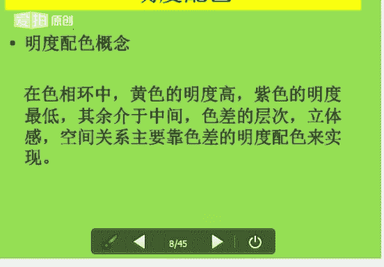
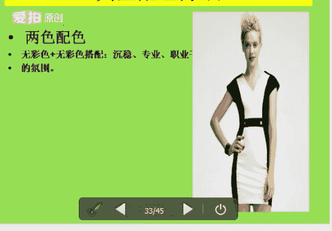
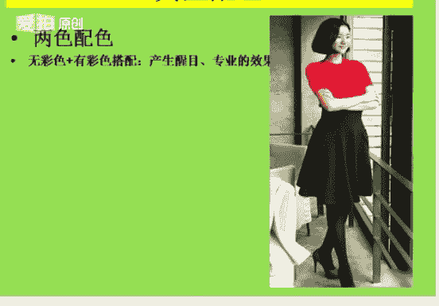
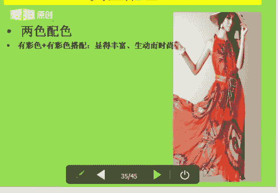
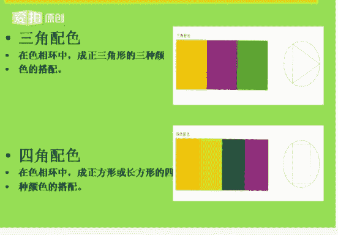

# 1、06《个人形象班》：色彩基础-配色-第二课 3月25日

能不能听老师声音，能听老师声音的同学回复一下一好吗？好，嗯，一个同学也没有关系啊，那么今天就是你的一个专场。那么不懂的呢问题呢，你在上课的时候呢，你也可以提出来。好，呃，多的时间呢，我就嗯不耽误你的。

不耽误我们上课的时间。因为已经过了很过了大概半个小时了。嗯，我们今天所讲的内容呢也是非常重要的。因为每一个知识点呢，它都是我们VIP课程里面的一个重要部分重要的环节啊，没有听过的同学呢一定要认真的听。

听过的同学可以反复的去听。😊，可以加老师的一个QQ或是老师的QQ群。好，大家可以看到吗？能看到PPT内容的同学回复一下一好吗？嗯。好，显然啊这位同学呢是非常爱学习的一位同学。好，我来自我介绍一下。

我呢是娜娜老师。今天呢我和大家一起共同分享，学习的是我们的一个色彩的服装搭配，也就是我们的色彩基础中的配色。其实衣服的一个搭配，配色其实是一节一节很关键的课程。好，我们来看一下我们所学的知识。

前面第一节课我们讲到我们一个对色彩的认识。第二节课呢我们就讲来讲配色衣服，我们该如何去做搭配，对吧？不同的场合搭配的衣服肯定也是不一样的。好，言归正传。首先我让大家看到的这个PCCS摄像环。

就是我们前面的课程我们讲过，对吧？日本色盐配色体系。那么我们现在看到上面的颜色。最亮的颜色。好，没关系，手机看不见，你可以听，好吧。如果有问题的话，可以随时的呃问老师都可以。好。

最亮的颜色是我们的正上方的一个黄色，黄色是最亮的对吧？最暗的颜色就是黄色的对应下面的一个颜色，那么是我们的一个蓝色，最暗的颜色是我们的紫色，对吧？好，我们居中的颜色就是我们的绿色，就是在前面的课程当中。

我们都已经学到过的。Yeah。好，我们来看一下我们的色相的一个配色。那什么是色像的配呢？更多的。我们要去学习。我们的一些色彩的就是配色的方法。什么是什么是摄相配色。那么它是在我们的一个摄像环中。

我们就又回到我们的一个图片来。好，将我们色相环上面的任意两个颜色或者是三个颜色，把它并制在一起，比如说我们的红色，我们的黄色和我们的绿色，对吧？任意2到3个颜色并制在一起。

因为它的差别而形成一个色彩的一个对比的现象，就称为我们的色相配色。好，这个有没有清楚？好，色像环对比的一个强或者是弱，我们决定了色彩的一个色相环上所处的一个位置，对吧？比如说它的有的颜色是比较艳的对吧？

比较鲜艳饱和，那么有的颜色呢？它会比较暗，对吧？它的明度，它的一个明度很低，明度很低，前面我们都已经讲到过了，对吧？什么是明度，什么是纯度。好，我们从色像环上面看，任何的一个摄像。

那么均可以是我是自自我为主。那么它可以形成同一类似和一个对比的关系。好，接下来我们就来学习一下什么是同一色相。同一色相呢就是色相相同，明度和纯度不同，对吧？我们之前有学过呃，我们的明度啊。

有没有同学能告诉一下老师明度是什么意思？好，明度呢就是我们一个色彩的明暗程度。大家要记住的啊，明度是色彩的一个明亮程度。那么颜色越高，颜颜色。颜色越白，那么它的明度会越高。好，颜色越深。

那么它的明度会越低。好，明度。这是我们的一个明度啊，黄色它的明度是最高的，紫色它的明度是最低的。那么我们再来看一下纯度。纯度的话呢就是色彩中包含的一个。色相的一个程度。

那么称为我们的色彩的一个鲜艳的一个程度。色彩越接近我们的纯色，那说明我们的纯度会越高。好，色彩中混合的颜色越多，那说明我们的纯度会越低。那么它会和我们的明度是一样的，对吧？纯度呢它是分为高纯度。

中纯度和低纯度。五彩色呢它是不分明度的，不分纯度的啊，五彩色就是我们的黑白灰，那么它只分我们的明度啊，这个有没有清楚明度和纯度有没有清楚，清楚同学可以回复一下一，好吗？O。Yeah。好。

我们言归正传走到后面来。刚才所讲到的对吧？色相相同，明度和纯度不一样，那么它的颜色进行搭配。那么在我们的摄像环中，好，我们回到前面的一个摄像环，回到我们的摄像环中。同一色相配色。

同一色相配色呢就是在我们的一个格子里面，一个格子里面啊，一个格子，比如说黄色，那么就是黄色格子。好，那么这一类的颜色它去做搭配，它会形成一种什么样的感觉？我们用形容词来说一下，有没有单纯。

雅致含蓄统一的那种感觉，对吧？但是呢它会缺乏一些变化。他也会给人感觉比较单调。比较呆板的那种感觉。那么我们要利用明度和纯度的变化来加强我们一个配色的一个生动性。啊，我们再回到我们的图片当中。

看看这个图片，右边的图片，同样它都是我们的一个紫色，对吧？紫色，那么它的。它的一个同同色相，色相都是紫色色相，那么它的盐它的纯度，它的明度和纯度是不一样的。看到没有？我们看浅色，那么它的明度。越浅。

它的明度会越高，那么深色相对来说它的明度就会降低了。对。明度和纯度啊深色它这个颜色它的是纯度对吧？它的饱和度纯度好，蓝色也是一样的，一个深蓝或和一个浅蓝，它都是一个道理啊，一个道理，颜色越浅。

它的明度会越高，颜色越深，它的明度会越低。那么比较亮的一点颜色呢就是比如说它的这个蓝色外套，那么它是我们的纯度是比较高的，纯度比较高的。好，这是我们的同一摄像。第二个就是我们的类似色相配色。好。

类似色相配色在我们的色相环中1到3格进行配色。好，我们的果绿色，我们的蓝色再和我们的一个蓝色，对吧？1到3给我们来看一下黄色。好，就看678吧，678这几个颜色就是1到3格来进行配色。好。

那么这种搭配呢就称为我们的类似色的一个类似色相的一个配色。类似色相的配色。好，其对比它是比较弱的比较弱的，不是那么不是那么的强，不是那么的显眼。那么给人感觉就是自然和谐柔和质感。好。

我们再来回过头来看一下图片，它的颜色搭配对吧？就是我们的1到3格进行搭配的，那么是我们的类似色颜色有点类似，对吧？相近好，但是它的搭配看起来是比较和谐的对吧？比较和谐的。好，这是第三个。第二个。好。

我们再来看一下嗯，第三个对比色调，对比色相配色。好，听不懂没有关系。那么这个课程呢我们可以轮流的。后面你可以反复的去听。嗯，今天呢你可以先听完了之后呢，嗯老师这个视频呢也会上传到群里面，您可以去下载。

还可以反复的去听。听不懂的话，这边可以给我留言或者是加我微信都可以，好吧。好，言归正传，我们来看一下第三个对比摄相的配色。什么是对比色相配色呢？就是。造成变化感强的一个刺激性。那么在我们的摄像环上。

距离越远越色彩设计的对比效果会越明显越明显。对比摄像中呢对比摄相配色中呢有3个，第一个是我们的中差摄相配色。什么是中差摄相配色呢？我们又要回回过头来到我们的摄像环中。好，摄像环中的4到7格进行配色。

4到7格进行配色。比如说我们的红色，我们的4号、5号、6呃4号、5号、6号、7号。8号9号对吧？好，我们从4号到9号，那么这个期间它是属于我们的一个。中差色相配色好，知大家有没有听清楚。

那么中差色相配色呢，它是给人感觉比较时尚，比较稳重，比较柔和的那种感觉。好，他就是有们一个中偏弱对比。中偏弱对比。Yeah。好，第二个来看一下言归计传，回到后面。好，这是我们的色彩环中的颜色啊。

那么它的颜色给人感觉是什么？比较柔和对吧？比较柔和的那种感觉，时尚柔和。好。😊，第二个对对照摄相配色。那么对照摄相配色呢，它是在我们的摄像环中，我们从八到第1格。从第8个到第10个。

我们去数啊八格到1格中间的一个色彩的一个搭配。那么它是有鲜明对比的一个色差感。好，它的效果呢是比较强烈的，那么令人兴奋，那么但容易产生视觉疲劳，产生我们的视觉疲劳。好，这是我们的第二个。看图片啊。

黄色和黄色和宝蓝色，那么属于我们的撞色，对吧？属于我们的一个撞色。好，我们来看一下。嗯，第三个我们的补色色相配色。什么是补色色相配色呢？就是在我们的色香环中第十一格来进行配色。比如说我们的红色配绿色。

一定要是为什么是第十一格呢？比如说你在红色的那一栏，你看到红色的那个。好，我们来回过头来看一下图片，好不。好，我们来看一下啊红色，比如说5号色对吧？然后往往后数数到第1一格，那么就到了我们的绿色，对吧？

那么这个颜这两个颜色呢，它就是属于我们的一个。五色色相配色啊。好，那么它是一个对比比较强烈，比较醒目的那种感觉。啊，红色红色加我们的绿色，橙色加我们的蓝色，黄色加我们的紫色。Yeah。好。

我们的明度配色。明度配色呢它就是在我们的摄像环中，黄度的明黄色的明度是最高的，紫色的明度是最低的。那么鉴于中间的色差的一个层次呢，立立体感空间关系主要是靠色差的一个明度配色来实现的。好，这是我们的明度。

那么我们接下来要学习的是我们的一个。明度配色中的一个10个调子。好，在我们的明度配色当中，不同的明度，那么两色的相对也是不一样的，明度高的色彩它会显得更高一些。明明度低的它会显得更低一些。

按照我们的一个方法，那么大体可以判断我们10种明度的一个调子。首先呢我们来看一下，这是我们的高长调。高长调呢它是给人感觉反差大对比墙，那么积极活泼刺激的一种感觉。

我们可以用大面积的高明度来加小面积的低明度，那么大面积的高明度呢就是指我们的一个蓝色，对吧？是属于我们的。高明度啊呃蓝色它是属于我们的一个低明度啊，蓝色属于我们的低明度是小面积的。好，白色和浅色的蓝。

那么属于我们的高明度，颜色越越浅，它的明度会越高。好，这是我们的高长调。第二个就是我们的高短调。那么高短调呢，它是高调中的一个弱对比的一个效果。那么形象分辨率比较低，那么特点呢就是优雅柔和和高贵。

那么我们可以大面积的高明度加高明度。好，那么这些颜色呢都是为我们女性化的颜色来做搭配的啊，比较柔和。好。都是属于我们的高明度，对吧？颜色都比较浅淡啊，这边应该比较清楚。第三个就是我们的高中调。

高中调呢它是以我们高色调钟为中中强度的一个对比。那么它的一个对比呢是比较明显的愉快的辉煌的。那么我们来看图片啊。我们可以大面积的高明度来加小面积的中明度。那么高明度呢就是指我们这个颜色比较浅淡的颜色。

中明度呢就是小面积的中明度，就是我们这个蓝色，浅蓝色属于我们的中明度。好，大家有没有清楚清楚同学可以回复一下一。好，第四个呢就是我们一个中长调。中长调呢它一般都是以我们的一个棕色调为主了。

那么采用的是高调色和低调色进行一个对比的一个搭配。那么我们可以大面积的一个来使用中明度。大面积的中明度就是我们的一个酒红色，对吧？红色它属于我们的中明度，小面积的高明度。高明度的话呢，你可以去搭配嗯。

白色或者灰色对吧？比较浅的颜色，那么也可以来搭配我们小面积的一个低明度。比如说我们的蓝色对吧？那我们的藏蓝，那么这些颜色都属于我们的低明度啊，这个是我们的一个中强调中强调高调色和低调色来做搭配。好。

第五个呢它就是我们的一个中短调。中短调呢它是一个中调的弱对比的一个效果。好，那么这种画面呢它犹如薄木一般，比较模糊，对吧？含蓄好，同时呢会给人感觉比较呆板。那么这样搭配是不协调的，不协调的。

清晰度比较差啊。好，建议大家不要这样去搭配。那么这样搭配的话，那么它会很显很显我们的一个涟漪，对吧？你小棉衣。好，第六个就是我们的一个中中调。那么中中调呢它是不属于我们也不强不弱的一个中调的一个对比。

好，那么它会丰富饱满的那种感觉，对吧？它是大面积的一个中明度，大面积的中明度就是我们的蓝色对吧？中明度，小面积的高明度，小面积的高明度。或者是小面积的低明度都可以来做搭配，颜色越深，它的明度会越低。

颜色越浅，它的明度会越高，大家记住就可以了。好，第七个呢就是我们的一个低长调。低长调呢就是我们一个低调的一个强对比啊，强对比。那么它会给人强烈爆发性压抑的那种感觉。好。

它是大面积的低明度来加我们小面积的一个高明度来做搭配。第8个。第八个呢，它是我们的一个低短调。低短调呢它是一个低调的一个弱对比的一个效果。那么具有阴暗，低沉有分量，对吧？

那么它也会显得迟钝忧郁的那种感觉，都是属于我们的低明度来搭配我们的低明度了。好，颜色大家看到没有？颜色比较深了，对吧？颜色越深，它的明度就会越低。好，第九个我们的低中调。低中调的话呢。

它是属于我们的一个中度的一个对比，中度的一个对比效果。那么这种对比呢它是给人感觉比较朴实，厚重，有力度的啊，大面大家看来看图片，大面积的低明度，对吧？像我们的这个台绿色和我们的这个蓝色。

这个深的蓝色都是属于我们的一个低明度的好，小面积的中明度就是我们的这个黄色的围巾和黄色的鞋子属于我们的中明度。这边右边的图片也是一样的啊。酒红色的衣服，它是属于我们的一个什么？低明度的对吧？

中明度它就是那个黄色的打底，属于我们的中明度。好，大家有没有清楚清楚同学可以回复一下一好吗？Yeah。好，最后一个我们的低长最长调。最长调呢它是属于我们指亮色和暗色，它是各占一半的。

那么它的效果呢也是比较强烈的，锐利简洁，对吧？时尚。好，适合我们远计划的一个设计。那么黄色加紫色它是各占一半的，黑色加白色呢，它也是各占一半的。那么它会给人感觉就是空洞生硬眩目的那种感觉。好。

这个有没有清楚有没有清楚清楚同学可以回复一下一好吗？好，清楚之后呢，我们就接着往后面讲我们的一个纯度的配色。那么纯度配色呢，它是以我们纯度调子为主的一个配色的方法。

那么我们把不同纯度的一个色彩相互的去做搭配。那么搭配出来呢，它会有一个纯度之间的一个差别。纯度的一个强弱配色的关系。那么纯度的划分为高纯度、中纯度和低纯度。

那么配色的关系同样为同一类似的和对比的那种关系，对吧？同一纯度的配色。好，我们图片当中举我举了三个例子，这个图片当中它是属于高纯度或者高纯度。那么什么是纯度呢？刚才已经讲到了，纯度的调子，它是它是。

配色纯度配色，它是以纯度的一个料子为主的一个配色方法。好，中间的这个颜色就属于我们的中纯度加中纯度了，对吧？颜色都属于不是很不是很颜色不是很亮，对吧？它也不是很暗，那么属于我们的中纯度。

那么右边的这幅图片呢，它属于我们的低纯度了，对吧？低纯度了。好，在我们明度上面来说，颜色越浅，它的明度会越高，颜色越深，它的明度会越。低好，那么这个呢它只是我们的一个纯度，低纯度啊，颜色越浅。

它的纯度会越低。好，大家这里有没有清楚，清楚朋楚可以回复一下一，就是不要弄混淆了。是的。Yeah。好，衣服也是一样的，颜色越深，颜色鲜艳饱和，对吧？它属用们的高纯度啊，比较。比较颜色比较浅的。

那么这些颜色它都属于我们的一个中纯度，看到没有？第一纯度的话呢就是。好，这个是我们属于我们的第一纯度了啊。好，这是我们的纯度配色中的类似纯度配色。那么左边这个图片是我们的高纯度，配中纯度。

我们可以看黄色红色这一片对吧？然后再来看上面浅的这一片，它就是属于我们的高纯度，配我们的中纯度。好，这边下面的中纯度就是我们这边比较浅的颜色，上面的叶子比较深，那么就是我们的一个低纯度了。好。

类似纯度当中的高纯度加我们的中纯度啊。刚才我们所到前面讲到过什么，纯度是怎么一回事？我们所讲到的纯度是怎么回事？好，我们的纯度就是色彩的一个鲜艳的程度，对吧？色彩它越接近我们的唇色。

那说明我们的纯度会怎么越高。好，色彩中混合的颜色越多呢？那么我们的纯度就会越低。但是我们的明度是一样的，纯度呢它是分为我们的高纯度、中纯度和低纯度。那么我们的五彩色它是不分纯度只有明度。好。

大家有没有清楚。那么这个图片当中。色彩越接近纯色，那么说明它的纯度会越高。好，跟明度是不一样的啊，明度是颜色越浅，它的明度会越高，颜色越深，它的明度会越低。那么纯度就是色彩越接近我们的唇色。

那么它的纯度就会越高，那么色彩中混合的颜色越多，那说明它的纯度会越低。好，大家有没有清楚有没有清楚？好，这是纯度配色中的一个对比纯度配色对比纯度配色。好，它是属于我们的高纯度。

对比纯度配色中的高纯度配低纯度啊，高纯度来看一下什么是高纯度，下面的这个颜色对吧？红色我们可以看它的这个服装也可以。一。大红色属于我们的高纯度，看见没有？低纯度就是下面的这个颜色属于我们的低纯度。好。

我们来讲一下色调配色。色调配色呢就是。那么以色调为基础的一个配色。那么大家看到右边的这幅图片，就是我们PCCS色调图。我们以这个图为例，那么分别为同一色调配色，类似色调配色和对比色调配色。好。

大家看到前面的图片没有上面的颜色越浅，它的明度会越高，颜色越深，它的明度会越低。好，同时画圈圈的这个比较浅的颜色P调，那么它是属于我们的同一色调。那么我们的。耐调和我们的B调。

那么它属于我们的一个类似色调。好，接下来我们的V调一直到低普调到我们的大可调，它是属于我们的一个对比色调。那么所有的一个颜色，它都是以我们的V调延延伸出来的，有的是加了白，加了少许的白，加了大量的白。

加了灰，加了黑，对吧？就形成了我们的一个淡色，或者是我们的一个嗯深色，那么都是由我们的V调去延伸出来的。好，同一色调配色呢，它是这种配色方法。

它是指我们相同的色色调色彩搭配在一起形成的一个统一和谐的一个色彩群。啊。在我们同一色调里呢，色彩的一个纯度和明度都是。相同的。所以呢这种配色的方法易形成柔和之感。那么当我们摄像成对比关系的时候呢。

配色会产生变化感。配色会产生变化感。好，大家可以去下一个图片看一下啊。那么再来看一下我们的同一色调配色，同一色调中配色中的一个对比色对比色。好，这个图片当中的两个颜色比较柔和。

它是属于我们一个同一色调配色中的对比配色啊，对比色项对比色项。好，这个就属于我们的类似色相了，对吧？从衣服的颜色和花的那个颜色来看都是比较和谐柔美的对吧？还是属于我们的类似色相。好。

第三个呢就是我们一个对比色调。对比色调呢它的相相邻色调的色彩直接的一个搭配。那么它属于我们的同一色相，它属于我们一个同一色相的啊。好，这是我们一个类似色像，类似色相颜色基本一差不多，就属于类似色相了。

好的都是加了黑的，这都是加了灰的啊，就形成了这个颜色。好，这是我们一个对比色调，颜色比较鲜艳，比较饱和。那么给人感觉呢就是衣服抢人的一个风采啊，对比色调。好，对比配色当中的一个配色相距较远的色彩中。

色色呃就是色彩相互的一个关系。就是第一个是同一色相。我们看这个蜂蜜的瓶子，对吧？同样是蜂蜜，但是它的色相。是一样的对吧？同一摄像都都是我们的蜂蜜啊，同一摄像。第二个对比色当中的一个类似色像。

类似要大家看图片好，都是我们的紫色，对吧？类似于紫色的吧。它是用那我们的类似色相。第三个对比色相，我们来看花黄色和紫色大对吧？属于撞色，它属于一个对比，衣服的颜色也是一样的啊，属于一个对比色相。好。

我们再来学习一下我们的典型的一个配色方法。那什么是典型的配色方法呢？其中的两色配色两色配色呢，它是就是适应的一个范围呢是比较广的。那么在我们一个着装的体系当中，广泛的运用也是比较多的。好。

第一个我们的五彩色配我们的五彩色，五彩色和五彩色去做搭配，给你们感觉营造营造沉稳专业职业干练的那种氛围。那么五彩色的搭配呢，它是在我们的明度上要去拉开我们的一个距离。

啊，我们的五彩色。第二个我们的五彩色加我们的有彩色，五彩色呢就是我们的黑黑白灰，大家都知道对吧？有彩色呢就是我们的有颜色的颜，就是有颜色的一些色彩。好，那么这样搭配呢，它会给人感觉醒目专业。

那么有彩色搭配，无彩色的一个搭配，它们它是在夏季用淡色调子会给人非常清新明媚的那种感觉。高纯度的一个有彩色和无彩色的一个搭配，那么则精致典雅。那么在我们的任何场所都会显得无可挑剔的，无可挑剔。

Yeah。好，第三个呢它是属于我们的油彩色去搭配油彩色。油彩色搭配油彩色呢，它会显得时尚丰富。

时尚丰富。那么我们来看一下单色系法。单色系法呢它是特指在我们明亮浅淡的调子上来变化我们色彩的一种感觉。好后看图片啊，色彩的一个变换，它是比较微妙的，那么极具轻柔淡雅的一个美感。

那么呢它是适合我们所有内敛的一些女性所喜欢的一个服装的色彩。好，比较柔和比较柔和。单色系法中的一遍，一个改变面积。那改变面积的话呢，就是呃多在我们的纯度的一个对比色调中，配色当中。

把我们纯度降低的颜色去扩大。色彩呢它会显得平衡一些。那么我们的暖色和我们的冷色系的一个配色呢，它的面积呢均会显得不平衡。那么这个时候呢我们只要改变面积的一个大小比例。那么就能达到一个和谐。

达到一个嗯和谐的效果。好，在我们的服装当服装配色当中，上下上下装的色彩的面积比例通常为2比33比5和5比8的一个数字的序序列的一个关系，序列的关系。Oh。Yeah。He。好。

上面的这个图片是纯度配色中的一个面积改变啊，都是我们的暖色。下面冷色配色中的一个面积改变是我们的冷色。嗯。好，我们来看一下我们的节奏配色。怎样什么是节奏配色呢？

节奏配色呢它就是我们的色彩有序的反复的一个变化。好，那么形成了一个连续的一个美感。那么这种配色的方法呢，我们就称为它为节奏配色。很多朋友在生活当中都都会去运用我们的节奏配色啊，节奏配色呢。

它的美感取决于我们一个色彩的一个形状。色彩的一个性质和色彩的一个反复。那么它可以形成多种多样的一个色彩的氛围。啊，它的一个形状性质和我们的反差。那么它呢。搭配出来就是我们一个节奏配色。好。

它是摄像的节奏。首先我们来看一下摄像的节奏，上面一排。第二个，我们的明度的节奏看到没有？明度的节奏。第一个是色相颜色，对吧？色相的一个。第二个明度，第三个是我们的纯度。好。

这个节奏配色呢生活当中很多人都会去运用到。好，再来看一下后面的一个点缀配色是怎么回事。点缀配色呢就是不管你穿什么样的服装，那么都要用我们的配饰来做了来做搭配，起到一个画龙点睛的作用。好。

这种配色方法呢我们能强调。和突出它的一个整体。那么一般的在我们的深色中采用亮色作为它的一个点缀色。好，在我们的五彩色中采用。油彩色作为点缀。那么在我们的服装配色中，首饰、包包、披肩。

还有我们的丝巾、胸花等等。那么根据我们的根据我们其装饰的部位，它不同，那么均可以起到画龙点睛的一个作用。好，不管去穿什么样的衣服做搭配，那么都要一个点缀配色啊，点缀配色。能起到画龙点睛的一个作用。好。

我们再来最后来最后来学习一下我们的一个渐变配色。渐变配色呢其实也是一个比较简单的简单时尚的一个搭配方法。那么它是按照我们某种规律有次序的进行两组或者是两组以上一个递增或者是递减的一个配色。好。

我们色彩中它的属性渐变为我们的明度渐变，纯度渐变和色相的渐变，那么以我们色相为渐变。那么色相的一个选择的范围呢，它是不能不宜大于我们的45度的。那么且要在四个颜色以内去做搭配啊，就是颜色以内去做搭配。

第一个呢它是我们的明度的渐变，看到没有？从深到浅，从浅到深。好，颜色越深，它的明度会越低，颜色越浅，它的明度会越高。第二个，我们的一个纯度的配色。那么色彩颜色都属于。很饱和的颜色纯就是。

色彩液接近我们的唇色，说明它的纯度会越高。色彩越接近我们的。颜颜色会越深，对吧？好，我们再来看一下我们的明度和纯度的渐变都允都匀学了。那我们最后来看一下我们的色相的一个渐变，颜色对吧？

色相就是我们一个颜色的一个渐变，紫色对吧？浅紫深紫，然后就慢慢的变成蓝色或宝蓝色啊，属于我们的色相的变。渐变。Yeah。好，后面还有我们的支配配色。支配配色呢。

它是属于我们一个对周围环境起到一个起引导作用的一个色彩。那么有效的使用我们的一个统制效果的色彩色调可以获得我们整体的一个统一感和调和感。那么运用比较恰当的话呢，色相及色调能支配整体。

那么发挥我们预期的一个效果。好，支配配色呢运用呢在我们的海报设计中，尤其是比较效有效的啊，一般都是支配色在我们的海报当中用的是比较多的。好，第一个就是当我们的色相相同，它的色调给予了变化，色相是一样的。

色调的颜色变了啊。第二个就是当我们的色相色调相同，那么它的择用色则用色相求变色相球变成色相的一个变化。啊，这属于我们的支配配色。那么嗯后面呢就是我们一个分离配色，分离配色呢就是呃加两色中加入第三个颜色。

那么使两色的关系呢会更加的清晰，更分离更紧凑，对吧？分离色彩通常为我们的五彩色。好，白色分离的效果呢是最好的最恰当的。那么呃我们的灰色呢是比较柔和的，黑色呢会给人紧凑。那么建议大家。

如果是分离配色的话呢，建议大家用我们的灰色稍微的要柔和一些。好，我们最后的啊最后的很快了。好，三角配色三角配色法。那么还有我们的四角配色法。那么首先在我们的摄像环中，大家看到啊。

成为正三角的一个三种颜色呢，搭配就叫做三角配色，这是比较简单的。好，在三角配色当中呈正方形或者长方形的四种颜色的搭配就叫做四角配色。那么三角配色呢可以用我们的色调来统一。

很多国家的国旗都会运用到我们的三角配色法。四角配色法。大家可以去想一想，哪些国旗用的是三角配色法。She。好。很简单啊很简单，这两种也是比较简单的，三个颜色呈正方形，就是三角形，就是我们的三角配色。

四方四角呢就是我们的嗯正呃正方形和长方形的四种颜色，那么就是我们的四角配色。

好，那么这个呢就是我们的反自然的一个配色。反自然配色呢就是属于一种混搭的一种感觉啊。那么这一种完全是属于逆反的一个配色方法，那么它会给人一种个性挑战，对吧？传递时尚另类的那种信息。

那么也就是想怎么穿就怎么穿，穿出你的自由，穿出你的穿出你的气场，穿出你的一个个性。好，就属于我们的一个反自然的配色，可以随便去搭配。

好，那今天晚上的课程呢也已经讲完了，因为今天本来是7点半钟上课的对吧？因为嗯有很多同学都没有来上课，那么课程呢就是一直到快8点钟，7点50的时候，我们课程才开始经常的上。好。

那么今天的作业呢就是2到3种不同的配色方法。做完之后，大家可以发到我的邮箱。还有一个就是嗯刚才所讲的这些配色，大家有没有不清楚的，不清楚的话也可以问一下老师。我们还有一点点时间。嗯。好。

还有没有同学不清楚的，不清楚的可以回答一下回。提下问题也可以。Yeah。好，如果没有的话呢，我就已经下课了，好吧。那谢谢大家的聆听。😊。

