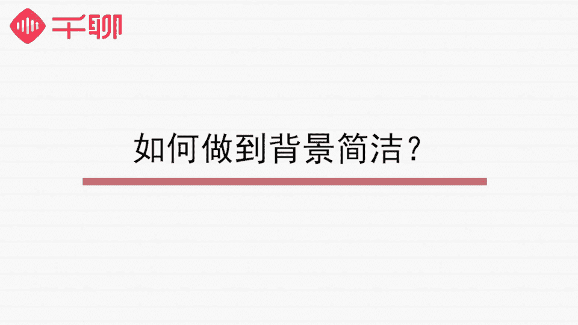

# 1、07《明星之摄影课》手机拍摄高逼格照片：第七课：【静物拍摄】美食、生活物品如何拍出高级ins风？

🎼う。🎼hello，大家好，我是摄影师贾磊琳卡，很高兴又跟大家见面了。我们的课程已经上了一半。大家最近用手机拍照，是不是效果比之前好很多了呢？一定要多多练习哦。😊。

🎼前两节课我们集中讲解了手机摄影当中的重头戏人像摄影。除了人像之外，我们平时使用手机拍照，还会拍很多生活小物品和美食。相信很多朋友都知道一个应用叫insgram，上面有非常多好看的照片，而且质感很高。

充满生活气息。今天我们就来教大家拍静物和美食的时候，如何拍摄的更好看，让你可以把身边的小美好记录下来，分享给周围的朋友。🎼关于静物的拍摄，大家需要注意4个点。

分别是背景选择、光线条件、道具准备以及构图技巧。🎼首先我们来了解一下背景的布置，静物拍的好不好看，背景起到了很大的影响作用。一般来说，我们拍照选择背景的原则就是越简洁越好。

很多照片高级感的来源都是少而精。近年来越来越流行的意思风、募集风、北欧新冷淡风其实都是遵循简洁这个原则的。🎼怎么做到背景简洁呢？首先我们可以选择一种单一的材质，作为整个背景的基调，比如纯色的墙。

干净的桌面，有格纹的桌布等等。在这个基础之上，你可以更进一步选择自己的喜好。比如纯色的墙除了最常见的白墙之外，有些人会喜欢少女心的粉色，也有人喜欢偏爱蓝色都是可以的。再比如干净的桌面可以是大理石纹的。

也可以是纯白的北欧风的，还可以是充满田园气息的原木材质的，选择一种家里有或者自己喜欢的作为拍摄台就可以了。另外，黑白格纹的桌布也是非常好的拍摄背景，可以拍出质感很高的照片。

🎼选好了背景，我们就要思考一下，应该把背景置于什么样的条件下才会比较容易拍出好看的照片呢？这是我们的主角光线。🎼室内拍摄静物的时候有一个非常受局限的条件，就是容易采光不好。

静物拍摄属于摆拍的一种构图和背景环境，很大程度上我们都可以人为的去布置和调整。只有光线是比较客观的条件，不受我们的控制。🎼因此我们需要特别注意的是，你所选的背景最好是在室内光线比较充足且均匀的地方。

比如窗边阳台边，如果是正午日光比较强烈的时候，建议拉上透明白色的窗帘遮挡和过滤掉一部分的光线，或者可以选择室外光线通透，但没有阳光直射的地方，这样可以充分利用自然光达到比较好的光线条件。

自然光不会像室内灯光那样容易形成强烈的光影和阴影。所以比起室内灯来说，自然光是更加好的一个选择。

🎼第三点是我们的拍摄道具准备，选择合适的道具，为你的进屋拍摄添加一些不一样的内容是非常有必要的，这样可以让你的照片更加有你的标签。同时，这些道具的布局和风格也可以直接影响到自己的作品风格。

🎼大家还记得我们第一节课用来给大家演示的道具小花瓶吗？这种花瓶在ins风照片上很常见，是静物摆拍的一大帮手，可以让你的照片提升好几个档次。🎼有哪些比较好的小道具呢？我们给大家大致列了三类，一是花草类。

比如满天星、绿叶、鲜花、白色棉花球等等。二是时尚单品类，比如墨镜、口红、包包等。🎼三是文艺气息非常浓厚的外文杂志、外文报纸、木棍香薰、茶色玻璃瓶、明信卡片等等。这些可以给我们的照片加分的拍摄道具。

都是我们日常比较常见的搭配品。像外文杂志、木棍香薰、茶色玻璃瓶这些不太常见的道具，也可以在淘宝上买到，价格非常的便宜适中。🎼第四个需要我们费心思的呢是构图。我们在第三节课专门跟大家讲了基本的构图法则。

大家还记得吗？三分法构图景框式构图中心式构图对称式构图，对角式构图都是我们日常拍摄中比较常用的构图方式。在这里我们需要引入一个概念就是拍摄画面的主体数量。拍摄画面的主体数量去决定使用什么构图方式比较好。

关于主体数量最直观的首先就是物品的数量多少。你的拍摄对象是一本书或者两本书。那你的主体数量就是一和2。🎼这是比较直观的。但是我们说的主体数量不是根据东西的多少来判断的，而是根据你的画面呈现效果来判断的。

这么说，可能有些抽象，我来给大家举个例子。🎼比如我们想拍桌面上的一盘食物，我们拍摄出来的主体就是这盘食物，它是一个主体，也是画面唯一的主体。如果这个时候你的镜头拉近，近距离俯拍盘子里的东西。

盘子里刚好有4个又大又红的草莓。于是你拍了一张草莓的特写照片，把四个草莓都拍进去了。这个时候盘子在画面中变成了一个背景，那么你的画面主体也就变成了4个草莓。这么解释是不是清楚一些了呢？

我们拍摄的时候要关注到你的画面主体是什么？然后根据画面主体和你想要呈现的效果来构图。🎼按照画面主体数量来划分，我们可以把常用的构图方法分成几类。如果画面只有一个主体的话。

我们比较常用的是中心构图法景框式构图和三分法构图中心点和三分线三分线焦点这些都是能够让画面主体更加突出，布局更加好看的位置。🎼如果我们的画面有两个主体，并且两个主体相似的话，我们最常用的是对称式构图。

ins上最火的爱心早餐，直接翻译出来就是对称早餐。相信大家都被这些照片刷过屏。这种拍摄方法就是非常典型的主体相似的对称式构图法。🎼如果画面中两个主体相差的比较大，我们可以拍出主次分明的效果。

🎼比如我们把这位美食博主的对称照片拆开来看，就可以看到画面中的餐盘和杯子，其实是可以构成一个主体和一个次体。比较大和丰富的那些物品构成了画面的主体。

比较小而简单的那些物件摆在旁边外置形成一种补充和对比的效果，同样十分好看。🎼如果画面中有多个主体的话，我们就要稍微设计一下摆摄的方法了。因此上面非常流行的一种俯拍角度。

拍出来的照片叫flatd lay这种拍摄风格最大的特色就是物品摆放在简洁的桌面上，然后垂直俯拍。这种照片就会涉及到比较多个主体的俯拍构图，拍出来的画面简洁干净，物品的摆放非常有特色，并且很有美感。

我们上面介绍到的那位美食博主拍摄早餐的方式，就是运用了flat lay的拍摄手法，大家可以看一下如何拍摄出垂直俯拍效果的照片呢，我们需要注意的点是，拍摄的时候，把镜头伸到拍摄主体的正上方，镜头垂直向下。

尽量垂直俯拍。iphone用户可以让画面中心的两个十字架重叠，记住，一定要找到好的角度避开阴影，既不要让物体的阴影和明显的延伸出来，也不要让拍照者的手机或者自身的影子在画面中形成阴影，然后按下快门。

那么我们。🎼制俯拍效果的ins风照片就拍好了，大家要多尝试几遍，自己找到感觉。🎼除此之外，我们进屋拍摄也会很注重留白手法的使用。画面的留白可以产生很好的美感。

🎼第一种比较简单是我们利用三分法构图的时候产生的自然留白，因为画面主体放置在三分位置上，另外一边就会形成比较多的留白。🎼第二种是三角构图。三角构图就是让拍摄主体在画面中形成三角形的三个点的一种构图方法。

这种构图方法在进物拍摄中比较常用，但是一般使用三角构图的时候，我们都要注意主体相对一致。还有画面的留白。如果把整个画面都铺满的话，就起不到三角构图想要表达的意境了。所以运用三角构图的时候。

我们一般都要让画面有一部分留白用来突出三角构图的特点。🎼第三种是不规则留白，比较多用于拍摄自然风光。比如我们很多人都会拍摄一棵树的树枝蔓延的照片，以天空为背景，这样的照片会显得特别有意境。在拍摄的时候。

根据现实情况，恰当的留白就是我们需要思考的点了。🎼说完了拍摄前的准备，我们来说说拍静物时候要注意的问题。首先是我们拍摄的角度。刚刚我们提到的f lay效果的照片，其实就是一种拍摄角度的选择。

不知道你有没有发现一般拍摄静物的时候，我们的拍摄角度，会根据你拍摄的物品来进行选择。我以拍摄美食的照片为例子来给大家讲解一下。我们平时拍摄美食，一般都是把食物拍到就好了。没有去思考不同的时候。

要怎么把它拍摄在镜头内可以更好。其实每一种食物都有比较适合他们的拍摄视角，大家可以学一学，下次出去外面吃饭，就可以知道怎么把大餐拍的更好看了。🎼首先，我们的实物呈现在我们面前，一般有这几种方式。

一种是用敞口的容器，比如盘子之类装着的，每个视角都可以看得比较清晰的，一种是用像锅盆、不透明杯子那样不敞口的容器装着。我们的视线必须要稍微俯视才能看到实物的。针对敞口型容器装的食物。

我们的拍摄方式比较多，既可以侧面拍，也可以俯拍，关键是要寻找实物最好看的一面来拍摄就好。🎼一般我是这样来判断的，如果食物属于比较立体的，比如汉堡这样有层叠感的食物。

我们可以用侧拍的方式拍出食物的立体感以及内容的丰富。如果是注重摆盘的食物，我们需要俯拍来把食物精美的摆盘拍出来。另外，像锅碗盆这些四周围起来的容器。我们更多的要使用俯拍方式来拍摄。

这样才能把食物拍到更好。🎼其实不只是食物，我们日常拍摄其他静物风景照的时候也是一样的，都需要找到这样东西最具特色和最美的一面，这样用心去把它记录下来。🎼说完了拍摄角度，我们来说一下静物拍摄的后期处理。

大家看我们的课程标题其实已经知道，我们这节课所教的静物拍摄基本上是围绕ins风来讲的。ins风是目前摄影爱好者当中比较流行的风格，而且也受到越来越多人的喜欢。🎼我们打开instagram点加号。

那么就可以进行拍摄了。🎼在拍摄当中，对，找到一个比较。🎼好看的构图。🎼然后调整曝光。🎼按下快门。🎼然后呢会有很多个滤镜来供我们选择和调整。🎼那么我比较喜欢温暖的颜色，所以选择这个滤镜。

那么左上方太阳的位置呢可以来调整。🎼它的暗部细节和清晰度。🎼那么选择一个字取项，认为相对来说暗部稍微回来一些，然后亮部也也更加细节完整的一个程度上，我们点确定。同时呢选择好滤镜之后。

我们右面还有一个编辑功能，它有很多的功能和参数，我们可以调整。🎼让这张照片更加的完整。🎼今天这节课我们主要给大家讲了静物拍摄的技巧。这门课学会之后，对于你的日常拍摄会起到非常大的作用。

大家一定要好好琢磨一下。🎼今天给大家布置的作业是拍摄一张ins风的照片来提交。我们的奖品还在等着大家，大家别忘了做作业。🎼下节课我们将给大家讲的是夜景拍摄的技巧，我们不见不散。

