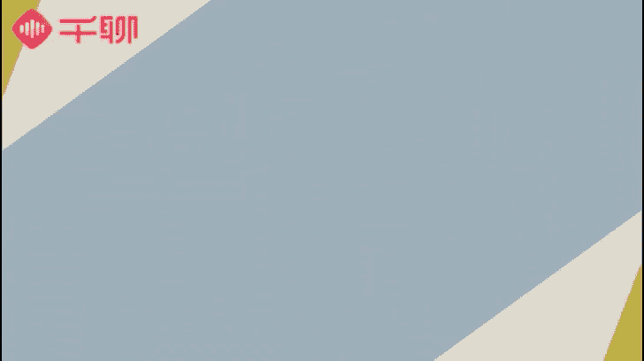

# 1、07《明星之摄影课》手机拍摄高逼格照片：第三课：【光线捕捉】找到最适合的光影，提升照片故事感

🎼hello，大家好，我是摄影师贾磊琳卡，我们又见面了，想我了吗？😊，🎼上一节课呢我们讲了构图的原则。这一节课我们将讲拍照的曝光。这一节课非常重要哟，记好你的小笔记。

🎼如果是单反摄影的话，能够影响到曝光的知识点会非常多。嗯，有光圈快门、IOS感光度以及拍摄过程当中，我们还会有调节曝光补偿等等。🎼但是如果是手机摄影的话，我希望大家不用了解这么繁杂的参数。嗯。

我们只需要去侧重于在摄影曝光的认知，以及如何使用手机选择合适的曝光进行拍摄是最好的就可以。🎼相信大家跟我一样，在日常生活当中少不了用手机来拍照，看到喜欢的东西或者是觉得漂亮的地方，会忍不住拿手机来先拍。

比如我们吃饭的时候点完菜，我们忍不住让手机来现吃。逛商场或者是我们去一些展览的时候，我们会忍不住拍下这些好看的值得纪念的稀奇的物品。如果我们出去旅游的时候，会忍不住随手抓拍建筑、街景以及当地的风土人情。

当然更少不了我们随时随地需要自拍和美化自己。这些拍照的场景都不陌生。但是我不知道大家有没有注意到一些细节，就是在特定的场景，一些室内的光线不足的地方，我们拍出来的照片会显得特别暗，或者是拍的不够清楚。

旅游的时候呢，我们也会在日光下拍出过曝的照片，这些都是我们大部分人在特定的场景下会遇到的一些问题和状况。🎼那么我们如何保证拍摄的画面质量呢？🎼那么很大程度上取决于我们如何了解并运用好曝光。

接下来我们就先跟大家介绍和了解一下我们拍摄当中可能会遇到哪些的光线和场景。🎼首先，我们日常的室外光线可以分为两种，一种是晴天光线充足的场景，一种是阴天光线不足的场景。

🎼但是晴天的时候其实也是分很多的时间段的。所以我们拍摄的时候呢，要充分的了解每一个时间段对于我们光线带来的效果。🎼晴天的时候光线是非常充足的，拍摄出来的画面效果也比较明亮，色彩鲜明。

整体给人感觉非常的透亮和清新。大家可以看到这张照片是非常明亮的照片，大部分这样的照片都是在光线条件很好的晴天下拍摄的，天空比较蓝，视野很通透，两边的建筑群色彩也很突出。

两边的船只呢也因为建筑群挡到了一部分的阳光会呈现一些明显的阴影效果。这样的话，整张照片看上去就是比较透亮又立体的。🎼但是光线充足的情况下，我们需要注意两个问题。首先，由于光线太强，容易造成高光过曝。

需要我们控制画面的曝光度。比如在拍摄的时候，尽量避免光线直射到我们的镜头，这样的话非常容易直接过曝，比较难调整。🎼其次，大家可以避免在正午时光这种日照比较强烈的情况下来拍摄。嗯，因为光线过于充足。

容易导致光线过硬，然后就会对比非常非常的强烈。那么这种情况下很容易因为光线的问题，导致一些细节的丢失。这这样的话也容易后期无法弥补，所以大家一定要注意一下，如果希望保留细节的话。

那么建议大家可以让曝光度低一点会更好。拍摄了曝光度比较低的照片之后，我们可以通过后期来调整照片的亮度以及对比度，把整个画面的曝光调节到正常的水平上。同时画面的细节也可以得到一定的保留。

🎼我们也通过一张曝光相对来说不够准确，并且有点曝光不足的照片来给大家演示一下，如何通过后期能够把它的曝光调整一下，达到我们想要的效果。大家可以点开iphone自带的编辑相册里面的编辑功能。

🎼然后点开太阳这个键。🎼光效后面有一个下滑三角的部分，我们点开它。🎼因为我们这张照片其实是因为暗部不够亮，然后但是为了保持天空的亮度的曝光，所以呢暗部细节有点丢失。那么我们主要呢就是通过阴影的部分。

🎼把暗部有点过于暗的地方调亮。🎼这样的话大家就可以到可以看到画面已经非常的和谐了，好很多了，对吗？🎼然后呢，我们可以在细节的调一点点的高光。🎼让它的亮部颜色也能够再还原回来一些。

🎼那么我们一张照片调整的效果就好了。

🎼大家可以看一下对比。🎼那么曝光过高的照片是不是就完全不好呢？其实也并不是有时候我们反而可以利用过曝，让我们的画面更加简洁和干净一些。🎼举个例子。

比如有时候我们需要一些很干净的白色背景或者是白色的墙面或者白色的桌面的时候，我们希望它能够更加干净。那么平时的曝光可能很难呈现非常干净的白色背景。那么这个时候曝光过度就可以帮到我们。

我们就可以利用手机曝光稍微调高一点。那么它就可以把特别白或者干净的效果呈现出来。🎼或者有的时候我们远处的景物比较杂乱的时候，我们也可以通过曝光过渡，反而可以把远处一些杂乱的颜色规避掉。

从而拍摄出比较干净的好看的画面。🎼涉望光线充足的环境。那么我们再来说说光线条件比较弱的环境吧。比如阴雨天气或者是采光条件不好的室内环境，都是容易出现曝光不足的情况的。🎼很多人会直观的认为。

阴雨天光线不好，是不是就不适合拍照，但其实每一个特定的光线下都可以拍出它美丽的风景。🎼虽然阴天环境的光线比较弱，但是它会显得非常的柔和，没有那么的刺眼。这样的光线环境拍照的时候。

画面会给人一种比较平和和安静的感觉。那么可能稍有不足的是，阴天环境下光影没有那么明显，没有很鲜明的对比明暗，照片可能会没有那么立体。大家可以看一下这张图片是我在阴天的情况下，户外拍摄的。很明显。

我们看得到天空，包括下面的草丛都有一些蒙上灰灰阴影的感觉，整个画面没有过亮，也没有明显的黑影，光线分布是比较平均和均匀的。🎼当然，这个前提是光线还是足够能够达到拍摄要求的情况下。

🎼如果遇到光线实在是太差的情况下，我们还是可以用闪光灯来得到曝光补偿。大家是否还记得我们在第一节课的时候给大家讲过手机自带闪光灯的使用。我们当时介绍了闪光灯使用的时候，如果距离拍摄物过近的话。

很容易造成对比过强或者是前景画面过曝的情况。🎼因此，我们的解决方案是让镜头离拍摄物品稍微远一些，这样的话闪光灯折射出来的光线拍到物品上会比较柔和。这个小技巧大家后来有好好使用吗？🎼好的。

以上我们主要讲的内容是现实生活中比较常见的光线条件。在这些光线条件下，怎么能够拍出好看的照片？光影效果是我们摄影最重要的一个环节，利用不同的光影，我们也可以创作出不同环境下极具创意的照片来。

下面我们教大家几个特殊光线条件下的拍摄技巧。🎼第一个呢就是很多人都会喜欢的测光和逆光的拍摄。什么是测光以及逆光呢？大家可以看下下面这张图片，我们简单的给大家讲解一下。

🎼我们用画面中的笑脸代表一个人三角形指的方向就是这个人的正面。在人的正面，我们会用一台手机来拍照。我们用一个小太阳来代表光源的位置。如果光源在图中一的位置照射出来的话，我们称之为顺光。

因为它是顺着拍摄的方向照在人的脸上的。这样的话，我们拍人的正面的时候，它的脸部光线也是充足的。🎼顺光的拍摄呢比较简单，与之相对应的光线条件就是逆光。逆光的光源是在拍摄主体的背部像图中三的位置。

逆光拍摄的情况下呢，人物脸部会由于没有足够的光线照射而显得相对比较暗。而人物的背景又由于光线直射，显得会非常的明亮，这样拍出来的照片我们称之为逆光的照片。逆光照通常都会呈现出背景比较清晰。

而拍摄主体不清晰，只保留了轮廓，容易丢失细节的情况。如果拍摄主体亮度过低，呈现出一个黑色的轮廓的话，就形成了我们所说的剪影照。🎼那么除了顺光以及逆光，图中的光源出现的其他位置都称之为测光。

向图中左右两边框起来的位置。🎼如果是从斜后方照射过来的，就是侧逆光。如果是从斜前方照射过来的光线是测顺光，这个都是非常好理解的。通过字面意思，大家就可以明白，测光效果由于光线是从一边照射过来的。

容易形成明暗对比，增加拍摄对象的一些立体感。一般落日黄昏的时候，因为光线是斜射的，所以很容易可以拍摄测光的效果。🎼像上面这张图，测光拍摄带来的非常明显的光影效果，会让整个画面显得非常有质感。

🎼如果在拍摄人的时候呢，想要人物的脸部轮廓比较立体，那么也可以使用侧光来拍摄。这样的话比较有一些明暗的对比，人物脸部的轮廓呢也会非常立体好看，但是一定要把整个光源的曝光宝把握的比较准确。同时。

如果有一些光源从侧边照过来的话，可以让脸部更加柔和，会有一些逆光加光影的效果。🎼逆光测光这些专业的名词呢，大家刚刚接触可能会有一些难以理解。没关系，我们一步一步来帮助大家加深理解。

🎼大家可以看到我们这张照片，它是在黄昏的时候逆光拍摄的一个人形雕塑在凳子上坐着。我们可以看到整张照片最亮的部分其实是在人像雕塑后面的背景，而画面中的男孩，还有树干都是比较暗的。这样的话。

照片会更有一些氛围感，让我们能够从中看到一些故事和一些神秘的感受。🎼那么，如何拍出一张好看的逆光或者测光照片呢？其实也很简单，基本操作就是在拍摄的时候，测光点要定在亮处，以背景高光的地方为测光标准。

如果你以前面暗的地方为主体测光点的话，嗯，很容易就会把亮的地方过曝。测光点确定之后，我们可以根据画面目前的曝光情况，拖动小太阳来调节曝光，调节到你觉得背景不过于刺眼，而同时前景的拍摄主体。

有相对来说比较清晰，就可以按下快门了。这样我们就完成了逆光的拍摄。🎼大家要常常来练习，多拍一些照片，多多对比，锻炼你对光线的感知。这样的话慢慢就会形成一些意识。

在我们的想法里也更容易找到非常适合的曝光程度了。根据我们上面的内容，我们可以总结一下，其实拍摄的时候究竟如何选择光线会比较好呢？我会推荐大家嗯按照自己的拍摄效果来选择一下。

如果自己希望拍摄的效果是阳光青春活力。那么像这种风格的话，一定要找充足光线，能够有表达我们这种阳光活力一面的这种光线来拍摄我们的内容。如果你想拍摄有意境的环境感非常强的这种光线的话。

我们可能会去选择地光或者是弱一点的光线来拍摄。🎼当我们选择了合适的光线来表达我们的拍摄内容之后，我们还可以选择手机自带的滤镜或者是调色的一些软件来丰富我们的画面。

让我们的画面能够调整到我们最佳的一个状态，可以让这个画面更加完整，色调更加统一。如果有一些前期不足，通过后期的app，也可以把它修饰的更好。🎼其实光线对摄影的重要性，大家其实都是知道的。

没有光就没有影像。所以呢通过这一节课，我们要把最重要的就是把握光线这一刻一定要好好的学好。因为它可以给我们的整个照片提升质感。所以大家一定要把光影这一刻运用好。

然后运用了自己照片当中把自己的照片形成一种风格，好好努力哟。好了，又到给大家布置作业的时候了。那么这次呢还是跟以前一样。

我们要在光线充足以及逆光的两种光线当中任选一种拍摄你认为最满意的照片放到我们的作业卡当中。还是一样哟，老规矩会在优秀的学员当中选择礼物送给你，好好做作业，加油加油加油，期待看到你们有故事的光影作品。

下一节课我们将着重讲色彩的运用。色彩对于整个片子的调性来说是极其重要，带有情绪的一刻，希望大家能够好好的积极准备，期待我们下次见面，拜拜。

