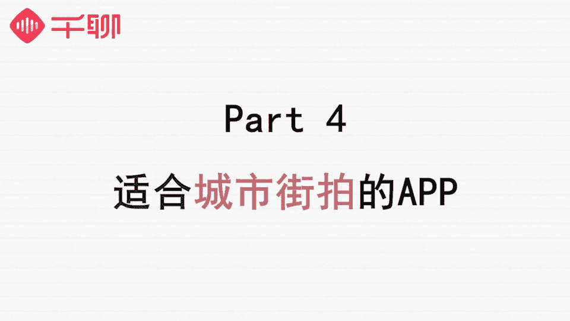

# 1、07《明星之摄影课》手机拍摄高逼格照片：第九课：【街景建筑】如何把平淡的风景建筑拍出故事胶片感？

🎼う。🎼hello，大家好，我是摄影师贾列琳卡，我们又见面了。今天已经是我们的第九节课了，时间过得真快，感谢大家的陪伴。今天我们来跟大家讲什么内容呢？前几节课我们给大家讲了怎么拍人，怎么拍静物。

怎么拍实物。今天呢我们给大家分享另外一个手机摄影中经常会拍到的题材，那就是我们的街拍和建筑风景的摄影，学会了今天这堂课我们基本上可以满足外出旅行所有的拍摄需求啦。😊，🎼无论是城市风光还是乡村田园风光。

自然人文景观一直是我们手机摄影的一个主题。但是呢这种自然或者城市人文景观摄影与我们前面讲到的静物拍摄或者人像拍摄最大的不同又是什么呢？我觉得有以下三个方面。🎼首先是拍摄环境的可控性不一致。

虽然每一种题材的摄影都不可避免的受到光线和环境的影响，但是我们前面讲到的人像摄影和静物摄影，拍摄的对象都是比较小的。最重要的是这些题材的拍摄环境也可以让我们人为来控制。🎼比如说拍摄人像室外拍不好的话。

可以布置一个室内光线充足，背景好看的场景，同样可以拍出好的照片。🎼但是自然风光的摄影不太一样，我们很难布置一个很大的场景出来。所以自然人文景观、街景建筑这些题材的拍摄受环境的影响会更大。换句话说。

我们拍摄自然风光人文景观的时候是需要看天吃饭的，受外在环境影响或者是时间的影响会很大。🎼比如我们通常在拍街景或者是建筑的时候，会认为清晨太阳光还不是很强烈的时候，或者黄昏太阳还没有完全下山的时候。

光影效果都比较好，也是拍摄的最佳时间。🎼其次，人文景观风景照还有一个很大的特色，就是往往那些独特的场景都是转瞬即逝的，需要我们有及时捕捉的能力。🎼比如，我们想抓拍夕阳下的建筑投影，投影的角度。

根据太阳的时间时时刻刻都在发生变化。如果没有把握好实际的话，那么很可能就拍不出那种光影效果恰到好处的建筑照来。🎼最后一个不同的地方在于，人文景观和风景照往往具备更多的可能性。

每个人都有自己观察生活的方式，看到的风景也大不相同。例如我们出去旅行，一定会把当地最具特色的建筑照全景都拍下来，这个是大家都会去做的事情。其实像这样简单的去把一个地标建筑拍下来记录下来。

虽然我们可以记录来过某个地方，但是呢这样的常规视角拍出来的照片，往往往上一搜，大家都可以找得到，没有什么特色和特点。

而有些人呢则会通过不一样的视角去发现大家平时没有发现的角度拍摄出独具特色的照片和与众不同的效果来。街景建筑照就有这样的特点。你的独特视角和思考，可以通过你的摄影作品很好的传达出来。

🎼由于人文景观和风光的摄影具有不可控转瞬即逝，但同时又具备更多可能性。这几个特点。我们在拍照的时候，经常会觉得拍摄这一类题材的照片说简单也简单，说呢也很难。那么我们怎么样才能把景观拍摄好看呢？

如何让你拍的城市街景和自然风光各有特色，并且拍出故事感来呢？下面我们来给大家介绍几个小技巧和窍门？🎼如果都是拍摄建筑全景照的话，我们照片如何才能比其他人拍的更好呢？这就需要我们发挥构图的作用了。

🎼街景建筑的摄影作品，我们通常会更加突出它的形式美。一般而言，常用来拍建筑的构图方式是对称构图法。同时，由于建筑本身就具有独特的空间，几何构图。因此，几何构图也是拍摄建筑经常会用到的手法。

对称法是拍摄街景建筑最基本的手法。一般而言，我们只需要寻找建筑或者街道中间的中轴线。站在中轴线上取好景，尽量让建筑全貌都进入到我们的镜头内就可以拍摄了。🎼大家可以看到这张照片是我在北欧的时候拍摄的。

街道两边的树木形成了非常对称的构图。我拍摄的时候呢，正是下午的时候，街道上几乎没有人不会被路人影响到你的画面。同时街道两边没有特别突出的障碍物，不会对画面形成干扰。

这种时候是非常适合拍摄对称构图的街景照片的，并且笔直的街道有一个好处是非常容易拍出近大远小的层次感的。🎼如何保证画面的对称呢？在拍摄的时候，要尽量让街道延伸最后聚焦的点落在画面左右的正中位置。

上下的三分点位置。这个位置拍出来的照片对称构图是最好看的。而且视觉落脚点是最自然的。同时，画面左右两侧如果有路面的延伸线的话，延伸线与画面边界交接的地方，两边要尽量保持一致和对称。

🎼最后要注意的就是要寻找中轴线这个步骤，因为只有中轴线可以让你拍出完全对称的照片。如果你因为环境的限制，比如人太多或者无法站在中轴线的位置的话，我将要给大家一个小窍门。

我们可以站在尽可能靠近中轴线的位置，完整的把整个建筑拍进去，然后在后期调节的时候可以使用nap C当中变形的功能，把照片当中，由于近大圆小所产生的变形拉回来，让左右两边变得对称。

这样也能保证建筑街景照的对称美。如果你拍照的时候偏离中轴线太多的话，拍出来的照片在经过这样的变形调整会变得比较奇怪，所以建议大家尽可能在靠近中轴线来拍摄，这样才能保证后期调整的照片不失真。

🎼这种变形调整也适用于我们仰拍建筑的时候，由于我们的手机是广角镜头，仰拍的时候建筑会容易呈现出非常明显的底部宽而顶部窄的特点，使用变形功能也可以在一定程度上恢复广角镜头的这种变形。

🎼第二种比较常用的构图是利用建筑本身的几何美来构图，相信很多人都看过一些非常漂亮的旋转楼梯，或者从顶部往下拍，把整个楼梯的设计线和线条都拍进去，自然就会形成一种非常美而且很有艺术气息的构图。

🎼说完了构图。第二个我们来教给大家几个比较常用的拍摄视角，不同的拍摄视角能够让你的照片拍出独特的视角，记录到一般人看不到的景象。比如我拍摄街景建筑的时候，会经常选择降低镜头的高度，低视角去观察世界。

甚至是贴近地面这样去拍摄。低视角能够让你看到行走时不容易关注到的景象。并且这个视角拍摄的照片，可以让建筑或者街道显得更加气势磅礴一些，往往可以让你拍出让人惊艳的照片来，除了低视角拍摄仰拍。

也能让你发现很不一样的美丽，在我们去人山人海的地方旅行的时候，仰拍其实是非常好的避开人群的摄影方法。而且仰拍的时候，以天空为背景，也会使照片整体更加干净，让你拍出来的照片主体也更为突出。

比如这张照片是在我拍摄的时候，是从人群以上没有头入境的位置开始仰拍的。这样拍摄避免了人群的入镜，同时。🎼天空为背景也起到了适当留白的效果，给后期增加了可以发挥的空间。🎼在拍摄的过程中。

我们要关注那些可以拍出画面深浅层次的照片，画面的深浅层次可以让画面更具有延伸感，也能够给观众留下足够多的想象空间。是摄影师也经常使用的手法。比如这张照片是我在飞机的车窗拍摄的。

首先前景有一个车窗内的置物，然后外面又有远处的天空，其实相当于我们有前景中景以及后景，而且远处的天空可以给大家遐想的空间。🎼或者像这张照片是在巴黎塞纳河边上的一个报刊厅拍摄的，也是作为前景中景后景。

让整个画面有了主体，并且远处有了更远的一个遐想空间，形成了一定的画面层次感。🎼在我们拍摄街景、建筑等人文景观的时候，我们需要关注的并不是多么高大上的拍摄技巧，而是更应该关注人与建筑自然环境的关系。

也就是我们经常说的故事感，如何拍出有故事感的照片，其实是我们很多人在摄影过程当中一直追求和探讨的方向。🎼在扫街的过程中，我们不仅需要记录下那些美丽的风景和光影故事，也要记录那些人与自然建筑环境的联系。

从这些日常生活当中的小事、小的主题、小的生活环境当中的一些细节发现不一样的美。我们的故事感也是来源于此。🎼故事感一般有三个来源，一是场景，二是想象空间。三是有主观联系。🎼有场景比较好理解。

就是在扫街的拍摄过程当中关注和发现那些有特定场景的镜头。比如树下乘凉下棋的爷爷，路边玩水的小孩，草地上野餐、放风筝的一家人等等。这些小的主题小的细节本身就是生活当中的故事。

而且很容易能够捕捉到一些让人惊喜的镜头，拍出会讲故事的照片出来。第二是你的画面能够让人有想象空间，这需要你关注拍摄对象和周围环境的关系，把人物融入到环境当中去。比如这张照片。

当时在街头被这位行为艺术表演者的表演所吸引，觉得非常的神奇，他的着装以及道具和整个街道都相呼应，看起来像一个毫不违和的装饰在街道旁，画面非常的像老电影，于是我用黑白的方式记录了表演者和街道的关系。

给人以电影感的想象空间，而不是单纯的记录了这个行为表演艺术。🎼第三是你的照片能够让观赏的人感觉到自己与照片有某种联系。也就是说，你的照片能够给人一种很强的代入感，这样的照片也能够拥有故事感。

比如你拍摄的是一对父子的互动场景，会让人自然而然的联想到自己与家人的相处，这就是很好的代入感和故事感的体现。🎼好了，前面我们给大家总结了街景建筑的摄影特点，以及如何能够拍出更好看的照片。

接下来我们给大家推荐几款适合用来拍摄城市街景建筑的app，那就是我们的模拟系列app模拟系列一共出了10款应用。每款应用模拟一个城市的风格，出了相应的滤镜，能够让你拍出那座城市的感觉照片来。

🎼比如他的欧洲风格系列，模拟巴黎，模拟波兰，模拟布达佩斯，模拟伦敦这几个应用的滤镜就非常的欧洲风，拍着的照片也容易比较有欧洲街头摄影的感觉。🎼另外还有模拟首尔、济州、东京和日韩风的风格。

🎼除了模拟城市系列，它还有模拟婚礼场景的应用，可以拍出非常浪漫的婚礼风格，还有模拟声学的应用，可以拍出数码胶片感。大家可以试着来玩一下，操作也十分的简单。🎼好了。

今天我们给大家讲了关于街景建筑和人文景观的拍摄要点，教给了大家在扫街的时候，怎么关注人物和环境的关系，拍出具有故事感的照片来，大家都学会了吗？今天我们同样有任务要布置给大家。

希望大家能够在学习完我们今天的课程之后，学会关注身边小的生活场景。拍摄一张有故事感的照片，你可以把拍摄过程当中所思所想，也简单的用文字来描述一下，和照片一起提交在我们的作业卡中。

优秀的同学同样可以获得我们送出的手机摄影道具大奖哦。期待和你们分享你们的摄影故事。下节课我们将带大家一起来了解一下我们场景摄影的最后一个模块创意摄影，我们不见不散。

