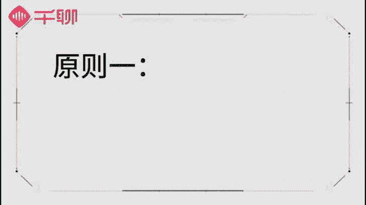

# 1、07《明星之摄影课》手机拍摄高逼格照片：第二课：【构图技巧】五大构图原则，把普通场景拍得高大上

🎼。🎼hello，大家好，我是摄影师贾列琳卡。第二节课我们又见面了。上一节课呢我们大概讲了手机的基础摄影参数，嗯，也集中通过对焦以及曝光了解了一下手机大概有哪些操作方式。

这节课我们要集中讲一下手机构图这一块是非常非常重要的。我们今天会介绍一下构图的原理，以及构图的五大原则。准备好你的笔记。😊，🎼首先我们先来了解一下构图对于一张照片的重要性，怎么样的构图才算是好的构图呢？

🎼很多人在拍照的时候都没有构图的概念，这样拍出来的照片其实只是简单的定格了一个画面，不能让别人一下子就能明白这张照片要表达什么，或者是应该去关注些什么。这也就是很多新手摄影爱好者最头疼的问题。

为什么别人拍出来的画面很容易引起大家的共鸣，而自己拍出来的照片嗯，并没有什么重点，其实主要原因就是因为拍摄的前期没有很多的构图意识？🎼很多人会觉得构图是后期来调整就可以的。嗯，前期拍摄的时候。

只要把东西拍下来，后期可以慢慢来调整。这种想法呢其实是错误的。因为其实对于一张照片来说，前期的拍摄是非常重要的，它会直接影响到这张照片的质量好坏。🎼所以前期拍摄的时候一定要有构图意识。

这样才能让你的照片不是依靠后期，而是从前期就能直观的表达你的照片想表达的内容。🎼我认为的构图是这样的，就是你在拍摄前要把自己的想法在脑海中已经想的比较清楚，你构想的是什么。

那么拍摄出来的东西就是怎么样的？如果前期没有构想的话，很容易拍出来的照片是没有任何重点和亮点的。如果大家觉得很难理解。没关系。接下来我由浅入深的给大家来解释一下。🎼好的构图对一张照片来说。

至少有以下三个好处，一是让照片整体画面更加协调和美观。二是让照片主体更加清晰和层次分明。3、能够更好的表达拍摄者的思想和想法。🎼首先，拍摄出来的照片整体画面要具有协调性。

怎么样才能让你拍出来的照片更加协调，更具美感，让人一看就会觉得好看，并且具有艺术性。这个是我们在拍摄照片的时候需要去思考的。大家看一下这张照片是我在非常具有童话特色的丹麦旅行时候拍摄的。大家可以看到。

整张照片的构图非常明确，下面是清澈的水面上方是湛蓝的天空，中间非常具有欧洲特色的建筑群和船只由近及远的，把整个画面分割成了上下两个部分，虽然天和水呢是分开的，但是结构的对称性，还有建筑群的层次感。

可以给人一种非常好的协调感以及节奏感。🎼其次就是拍摄出来的照片需要有主题层次分明。好的，摄影作品一定要有内在的寓意，可以让人们通过照片看到一些情节化的内容，或者是可以看到画面中人事物的一些状态。

可以感受到拍摄者想表达的内容，如何表达这种情节化的内容呢？就是让你的拍摄画面更具有层次感，并且有主有次。大家可以看下这张图，这是一张我在瑞士街头拍摄的图片。当时这位行为艺术表演者正在表演。

我觉得非常神奇并且特别。于是捕捉下了这一刻。那么这张照片的主体自然是这位表演者，并且我希望看到照片的朋友能跟我一样体会到他所表演的神奇之处。

那么我就需要清晰的拍出主体表演者的动作以及人物作者但镂空的部分。这样既突出了主体，也通过照片传达了我捕捉画面的意义以及情绪。🎼构图还有一个非常好的作用，就是能够让你的作品更好的去传达你的情绪以及想法。

🎼我呢是非常喜欢温暖以及带有温度的照片的。嗯，在成为专业摄影师之前，我也拍摄了很多的照片，曾经在QQ空间非常流行。那个时候我还是20岁出头的年纪，少女心爆棚，非常喜欢阳光活力的内容。

所以拍出来的照片也都是色彩非常温暖的照片。🎼这种带有非常温暖的色调的照片，嗯，是比较有辨识度的，也可以说是我早期被大家最早嗯认识以及记下来的拍摄的作品非常明显的一个标签。

🎼这种暖色的色调后来也被印象inter phototo收录，作为其中的一个滤镜，供大家直接使用。感兴趣的朋友可以去下载这个app来玩一下。🎼为什么我们都说好的摄影师是有态度的。

因为好的摄影师一定会让他的作品替他来说话，让别人一眼看到他的作品，就知道他所想表达的一些东西是和别人不一样的。这种通过照片表达出来的摄影个人的态度，也是摄影中最精髓的部分。

是可以让你的作品带上自己的标签。大家在这种拍摄的时候，也应该多思考，多练习。🎼那么构图这么重要，我们初学者要如何才能把握前期的拍摄构图呢？我给大家总结了以下几个构图原则。只要大家记住这些构图的原则。

学会构图也就是水到渠成的事情了。第一个原则是主体原则，认清照片的主体，把握好照片的关键位置。我们可以在拍摄的时候，把你认为最重要的内容摆在画面的最重要的位置，这样可以让画面主体突出。

一下子就吸引到观赏者的视线。

🎼拍摄选择的重要位置就是将你所拍摄的主体放在视觉的第一落焦点，例如对称轴、水平线、中心点，也包括三分点等位置。这些位置在画面的几何中心天然控制住了一些结构的重心，更容易被人关注，把主体放在这些位置。

更容易被强调出来。🎼例如，上面的第一张图片就是利用了主体原则，画面中的花朵处于三分点的关键位置上，能够很好的抓住人们的眼球，配合背景虚化的操作，也很好的突出了主体。

🎼第二张图呢也是主体原则一个很好的利用，将拍摄主体放在最中心的位置，几乎填满了整个画面，能够让人一眼就了解所有拍摄的主体究竟是什么。🎼利用主体原则的时候，要注意清理画面的边缘。

我们知道在摄影构图前需要先框景，也就是说要先把选好的什么样的画面出现在我们的取景框内，然后才思考怎样的构图，能够让画面更加和谐。而清理边缘就是将画面边缘不要出现的琐碎的事物，避免分散我们的注意力。

画面边缘出现太多琐碎的东西，能在无形中削减主体的吸睛力，也就是说它很容易扰乱我们的视觉感受，嗯，让大家看不清我们的主体。🎼第二个原则呢是杠杆原则，顾名思义。

也就是说让你的拍摄画面可以看上去达到一定的视觉平衡，更加协调，更加舒适。🎼通常来说，均匀的构图对称的构图和比例协调的构图能够达到视觉平衡的最佳效果。🎼一般我们拍摄花海、草原、大海的图片的时候。

就会经常采用均匀的构图。画面主体内容一致，给人一种非常平和的感觉。🎼像拍摄建筑物、街景等，就比较经常使用左右对称的原则。还有现在非常流行的倒影图，采用的就是上下对称的构图。

拍人和环境的时候就要注意比例协调。像第三张图片，虽然画面的主体是人，但是我们考虑到需要把栏杆大海、天空都拍进去，营造一种空旷的感觉。那这个时候人和周围景物的比例就一定要协调，这样画面才不会显得突兀。

而且显得更加自然和和谐。🎼第三个原则呢就是画面呼应原则，也就是说让你的拍摄主体之间能够产生奇妙的关联和联系。🎼大多数的摄影场景都不止一个元素，而经营画面一个很重要的原则就是表现元素之间的某些联系。

这样更有利于凝聚画面，让我们觉得它们是一个整体。🎼大家可以看一下第一张图片，照片中长短不易的灯柱之间构成了某种联系。这种找到重复的元素，是一种最简单直白的画面呼应原则。第二张图呢。

两朵绽放的花朵是不容置疑的画面主体。但是他们周围的绿叶和其余可见的花朵之间也构成了一些的联系。这种对比关系的联系，也是使得画面更加和谐和美观的关键。大家在拍摄的时候。

尽量寻找一些和你想要拍摄的东西能够形成呼应的一些元素，最常用的是我们在拍摄人像的时候，人物的着装打扮能最好和我们所拍摄的环境形成一个呼应，这样整体画面也会更加和谐和好看。

🎼第四个原则呢就是我称之为它为所见及所得原则。嗯，也就是说我们要更加的突出我们的目的。也就是说，一张照片中你想要突出的是什么，或者想要表现出来是什么样的情感。那么就要动员一切刻意利用的元素来烘托。

并且表达出来你所想拍摄的这种情感意图，从而来实现你的拍摄情绪表达。例如上面第一张照片意图是我希望能够表达当时的雨天，那么我们就用各种展现湿漉漉的元素，比如水珠或者阴暗的天气来强化这个主题。

而其余模糊的元素只是作为衬托。而另一张图片，我想要表达的是窗外的景色，飘着雪花，显然就是更加更好的衬托的这个环境。其实归根结底，无论哪种构图都需要突出重点，要让照片更加有主体。

以及能够更加让大家能凝聚你的画面主观性。因为我们的摄影拍照都是为了表达一定的情感或者呈现场景。那你需要表达。🎼东西当然就需要突出了。🎼掌握好以上几种原则，我们拍摄一张故事饱满的动人照片就指日可待了。

🎼介绍完构图原理，接下来我们将继续的介绍实用的构图技巧，让我们能够拍摄时直接使用。🎼第一个相信大家都非常的熟悉了，也经常听人提起过的就是三分法构图。三分法构图嗯就是很多手机现在都有自带的网格线。

因为安卓手机型号太多了，我不能一一跟大家说明。所以同学们可以自己查一查自己的手机型号，如何调出网格线的操作，嗯，都是非常容易的。🎼调出网格线之后，我们使用网格线确定三分法的位置。

然后把你要拍摄的对象放在这些位置上就可以了。那么如何确定位置呢？大家看一下，我们在拍摄取景框中显示了网格线，这个网格线横竖各两条线，把整个拍摄画面分成了3乘以3的九宫格，我们在拍摄的时候要注意。

如果是成线条的景物。我们可以把整个景物主线放在三分法里面各分各线所在的位置。如果是呈点状的物品或景物，我们可以把这个主体点放在分割线交叉的位置。🎼我们可以看一下这张照片，就是典型的利用三分法来构图。

画面中最主体的部分是一排路边的风景，它刚好落在我们横向三分线的下面那一根线上，三分法构图能够让你的画面看起来非常有层次感，同时拍摄远近距离的照片，三分法也非常的好用，能够让你的画面更加立体。

🎼第二个技巧是景框式构图。景框式构图其实是应该运用了我们几何图形当中的平面几何来构图。它的特点在于它能够使画面当中的视觉更加集中。在日常拍摄的时候，我们可以借助生活中的一些道具。

比如门窗等有一些框状的物品。🎼把你想要拍摄的对象围起来，起到视觉突出的效果。🎼大家可以看到我们第一张黑白色的照片，这张照片里的主体是一个女性的背影。我使用了窗户这个框作为一个道具。

把人物这个主体放在了窗户框内，在视觉上使得人物更为突出。🎼第二张是我在巴黎拍摄了一张照片，利用了周围的建筑群围成了一个相对封闭的场所，也使得整个画面形成了一个景框式的构图。在景框式的视觉引导下。

嗯显得两只飞鹰也特别的突出，达到了画面强调的效果。🎼第三个技巧呢是中心式构图。中心式构图就非常简单了。嗯，把你所要拍摄的画面主体放在整个画面的正中心，这样拍摄出来的画面视觉是非常集中的。同时。

为了排除周边无关物品的干扰。中心式构图，我们一般会清除画面内其余多余多元素，尽量保持画面的整洁。一般我们在拍摄实物照片的时候，会经常用到中心式构图，把实物放在镜头最中央的位置。

可以直截了当的表达出来我们所要表达的画面。🎼第四个技巧呢是对称式构图。嗯，显而易见，对称式构图其实遵循的就是我们前面所说的视觉平衡原则。对称的构图一般我们会来拍建筑接景的时候非常的好用。

能够让画面非常有气势感。最关键的是对称式构图非常的容易拍，很好操作。只要你找到了对称的画面，然后让你的取景框内画面，两边的边角，形成对称的结构，就可以按下你的快门了。🎼如果拍摄的时候不够对称也不要紧。

你找到了对称的内容之后，可以把整个画面都拍下来，然后再对画面进行裁剪和调整就可以了。🎼拍摄对称式构图的时候，有一个注意的地方就是尽量正对着对称的拍摄物。🎼不要侧拍，一般侧拍就会形成近大远小以及一些角度。

很难实现两边对称。🎼最后说一个可以让你拍摄画面比较与众不同的小技巧，那么就是对角式构图。对称式构图和对角式构图，其实利用的都是几何构图当中的线条构图来实现构图效果。

利用线条构图可以起到很好的视觉引导作用。大家可以看一下我们视频当中的这张图。一般我们拍摄的时候会选择正常的角度来拍摄。拍出来的画面也是横着的建筑群，这是一种比较常规的拍摄方法。

🎼有时候我们可以让这个画面特别一点点，我们不妨把镜头歪一下，以对角线为参照线来拍摄，这样拍出来的照片很容易让人眼前一亮，嗯，并且觉得很特别。🎼好了，今天就给大家介绍几种构图的小技巧。

再给大家总结一下构图的几大要点。构图分为三要素。第一，拍摄前你要想清楚自己想要拍什么，表达什么。第二点，拍摄到主体之后，想清楚怎么拍才能更好看。第三，多多训练自己实用的构图小技巧。

形成自己的一种拍摄风格。🎼我们在拍摄前就要有构图的意识，这个是非常重要的。首先要想清楚当下我们要拍摄什么，想要表达的是什么。比如出国在外旅游，我们想要拍摄建筑物或者更有趣的一些画面。

那么我们就会想把这个内容突出来。想清楚自己要拍摄什么内容之后，就要关注自己怎么样拍才能更好看。打个比方，在拍摄实物的时候，我们都希望把实物拍的秀色可餐。那么就可以近距离的去拍摄精准对焦。

让实物呈现出饱满的光泽度。但如果我们还想记录下此时此刻的生活状态，我可以更多的把整个餐桌的场景也拍进去，把重点放在摆盘、餐具以及桌面背景等这些位置。这样我们可以拍出一张非常具有生活气息的照片。

别人看到这张照片，第一感觉也是会明白我们当下的生活环境，以及我们当时的状态，可以更加理解摄影师是一个爱生活，记录生活的人。🎼第三点也是我想跟大家强调的就是一定要多多练习。作为一名职业的摄影师。

在生活当中我拍照的时候，其实并没有像我刚刚讲的那样去想很多的构图技巧。因为这些已经形成为一种拍摄习惯了。所以下意识就会去提前把图构好，然后把这个画面主体突出，以及我想表达的画面呈现出来。

对于一个成熟的摄影师来说，摄影最重要的并不是这些拍摄的技法，而是好好的了解自己要对拍摄的对象如何去表达，以及如何去阐述它。只有这样，你才能拍出独一无二的作品。你的作品才能替你说话。

而不仅仅是简单的现实景象复制一遍而已。这也是我们摄影很奇妙的地方。🎼希望大家一定要多多练习，练到自己遇到一个场景，下意识的就会很清楚自己要用什么原则来拍摄。

用什么样的构图方式能够更好把这样的场景表达的更加完美，这样就是一个合格的摄影爱好者了哟。这节课呢我们讲了构图的原则以及法则，大家一定要好好的把握构图。因为构图是一张图最重要的开始。只要你把构图构好了。

你一张图片基础就打好了，所以大家要加油哦。🎼这期的作业呢就是在任意两种构图当中拍摄你最满意的照片发到我们的作业卡中。跟上期一样，我们一定会在最优秀的作品当中挑选10个来送我们的礼物哟，记得查收。

