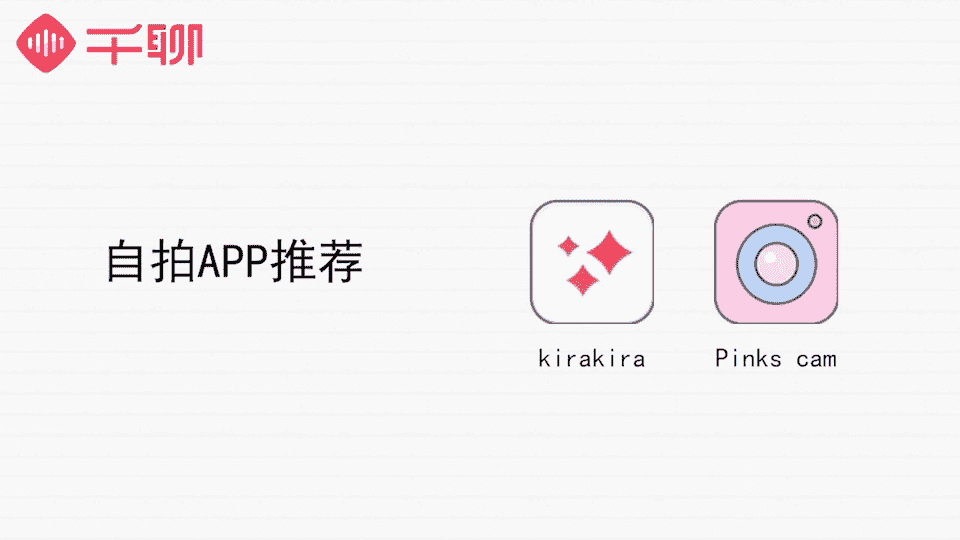

# 1、07《明星之摄影课》手机拍摄高逼格照片：第六课：【女神自拍】如何拍出刷爆朋友圈的高颜值自拍？

うん。🎼hello，大家好，我是摄影师贾磊琳卡。嗯，上一节课我们主要讲了人像摄影的知识，相信怎么在不同的场景下都能把人拍的好看。嗯，今天我们讲什么呢？我们来跟大家分享自拍，自拍人人都会也常常来自拍。

那么为什么有的人拍出来就会显得更好呢？想知道他们是怎么做到的吗？那我们就赶紧学起来。🎼很多朋友都会问我，朋友圈那些整天晒自拍的都是因为颜值很高，如果长得一般，自拍也不太好看的话。

晒朋友圈简直就是给自己拉仇恨。其实这是一个很大的误区。比如也有很多颜值很高的妹子，拍照也不是很上相，并不是颜值决定的，而是因为你会不会拍照决定的。怎么样才能随手拍出好看的自拍照呢？在我看来。

有两个需要关注的点。首先是跟摄影相关的。我们在自拍前是要找到一个合适拍照的环境，光线充足，环境整洁，人与环境也比较和谐等等这些必要的要素。另外还有非常重要的一点，自拍照一定要充分的了解自己。

了解自己脸部轮廓，可以让你找到最适合展现在镜头前的角度，也了解自己的缺陷和缺点，可以让你尽量避开这些缺点，或者找到演示这些小缺点的技巧。打个简单的比方，如果最近牙齿不是很白。

那么自拍的时候可以选择笑不露齿，这样比较安全。如果最近吃了太多上火的东西，左脸长了一颗。😊，🎼超级大的痘痘，那么应该花点心思遮掉痘痘，或者用一些方式来毙掉它，不要让它成为自拍当中最强劲的地方。

🎼自拍时的角度需要根据我们每个人的面部特征来决定的。网上最流传45度上扬的网红自拍法，并不是适合所有的人。🎼首先我们要了解自己的脸型。如果你是可爱的圆形脸的话，我们拍照的时候可以稍微侧一下脸。

这样可以起到把脸的两边收窄的效果。如果是方脸的话，自拍的时候不仅要测一下脸，还可以用手稍微挡一下下颌骨的位置。如果你是长形的鹅蛋脸。那么自拍的时候微笑的幅度可以大一些，在视觉上稍微拉宽你的脸型。

同时笑容还能给人一种非常温暖和开心的感觉。所以大家可以根据自己的脸型多多尝试选好自己的拍摄角度。😊，🎼其次，我们要了解自己的面部特征，尽量把自己最好看的一面展示出来。比如你的五官比较立体的话。

那么除了可以拍摄常规的自拍照之外，还可以拍一些不同的视角照片，可以选择从侧面拍摄，这样的话，你的侧脸轮廓线也会很明显，并且显得鼻子非常的挺拔，很有线条感。如果对自己某个五官不是特别满意的话。

那么可以用小道具来遮挡一下。比如眼睛不够好看或者有点大小眼的话，可以选择睁一只眼闭一只眼搞怪也可爱。🎼最后就是多多尝试，找到适合自己的表情和角度。自拍有一个好处就是可以自娱自乐。

不需要面对摄影师那么紧张，可能会让你拍照的时候更加自然一些。这样更容易拍出好看的照片，适合自己的照片。所以要多多尝试不同的角度方式和光影来进行自拍。要知道，大部分人自拍的时候。

一张好看的照片背后可能都有几十张失败的照片在支撑。所以不用担心害怕。连续拍了很多之后，自然能够在照片当中看到自己微小的表情差别，显出自己最好看的那一张。😊，🎼Yeah。🎼如何自拍显瘦呢？

第一个技巧就是微微低头从高处往下拍，很多人都用的技巧，也是网红自拍常用的技巧。🎼那么也可以利用一些手部的遮挡或者是一些帽子等挡脸很实用的显瘦自拍方法，或者把头发放下来，瘦在两侧，可以把圆脸挡掉一部分。

第三个技巧是肩膀挺立，肩胛骨往后靠，驼背是拍照不太好看，照片的一个很大的原因，因为这个姿态真的很容易让人不精神。肩胛骨往后靠能够让人看起来更加挺拔和精神一些。同时，如果你不是特别胖的话。

这个动作还能让你的锁骨露出来，显得更瘦。🎼那么，如何选择自拍的表情呢？🎼有人高冷，有人可爱，有人知性，如何判断自己适合哪种自拍效果，那么就需要我们平时多多练习，对着镜子自己来了解自己了。

🎼可能大家日常是什么样子，拍出来的效果一般都会更适合自己一些。平时习惯的状态拍出来一定是最好的，因为毕竟容易拍出最自然的样子。如果生活中是一个爱笑的姑娘，那么在镜头前尽情的展示你的笑容。

如果你平时比较安静，爱看书，那么拍摄的时候可以拍出一些文艺的照片，在自拍当中去探索一下自己的这一面。🎼如果你是个活泼好动的妹子，那么自拍的时候可以酷一点，张扬一点，有更多夸张的表情。

这样既可以比较容易被拍，也可以很好的让别人知道你的性格标签。我平时呢是一个比较喜欢笑的人，所以我的自拍照基本上都是微笑的，色调也是偏暖色的那种。🎼露齿笑还是抿嘴笑比较好呢？

露齿笑相对于抿嘴笑来说更加有感染力，所以大大方方的笑出来展现你的魅力吧。笑的时候收住自己的下巴，这样可以让下巴看起来更加尖，也可以让脸型修饰的更好看。如果是抿嘴笑的话，可以用上齿稍微咬住下唇。

也能够让下巴变得尖一些。歪头纱是一种很好的自拍姿势。一般我们正视一个人的脸的时候，脸部的缺陷会放大。如果脸部有一些部位不对称，或者是自己的眼睛有一点点大小不一样，那么很清晰的呈现出来的话，不太好。

那么歪头纱就可以很好的弱化这种直接的视觉效果。😊，🎼因为歪头之后，脸部没有那么对称的展示在照片中，而且会形成一定的角度，不对称的地方可以不被关注到。同时外头拍照的时候，头发也可以起到很好的修饰效果。

让你的照片更加出彩一些。我们上节课说到人像摄影的时候，提到了一个我拍照常常会用到的方法，不直视镜头。我们自拍的时候，这一招也非常的好用。一般直视镜头拍出来的照片容易不太自然，眼神很容易找不到焦点。

或者是不太知道自己该往哪里看，显得不自信。所以自拍的时候不看镜头是一种很好的解决方法。我有很多自拍都是没有直看镜头的。因为可以让我自拍的时候更加轻松一些，并且可以有不同的动作和不同的感觉。你可以看远处。

形成一种思考的状态，也可以看侧面低头微笑，给人一种时间静好，现实安稳的感觉。😊，🎼斜对镜头的前方稍微低头闭眼，拍出来的自拍，也会给人一种宁静美好的感觉。🎼学了这么多手机自拍的技巧，我们拍好一张照片之后。

肯定是需要调整修图，然后让它变得更加精致，我们才会分享出去。🎼下面我们来介绍几个适合自拍后期调整的应用。很多人应该也对这几个应用非常熟悉了。如果你周末在家闲的无聊玩自拍，又不想出门为了自拍而化妆的话。

一定离不开美颜美妆功能的相机。例如美图秀秀啊、美妆相机啊、相机360这些操作都是非常容易和简单上手的。我们自拍照的后期处理，一般要经过几个步骤。下面我就用美图秀秀这个app来给大家演示一下。

一般我们拍完一张自拍之后是如何来处理的。😊，🎼那么我们如何利用美图秀秀来把自己的一张自拍修好呢？首先我们点开人像美容。🎼打开一张自己比较满意的自拍，首先可以看到已经里面非常多非常强大的功能在等着你了。

那么根据我们平时的一个修图习惯的话，可以先点开祛斑祛痘的功能。🎼放大之后，看到有一些瑕疵可一键清除掉。🎼还是非常好用的。🎼然后呢。🎼瘦脸瘦身是非常强大的一个功能。我们可以稍微的把自己认为。

🎼可以让照片更加完美的地方修饰一下。🎼点击确认。🎼那么大家经常会用到的就是磨皮一键美颜或者是肤色美白的功能。🎼那么我们点击发现。🎼可以让照片更加清透和透亮。🎼调整到合适的状态后。🎼我们点击确认。🎼那么。

🎼经过调整之后的照片就形成了。🎼除了这些比较常见的美颜相机之外，我们再给大家介绍另外两款也非常出色的自拍后期软件。kirakira是具有非常有意思的特效，也就是它可以添加布灵布灵闪闪发光的拍照效果。

用在拍人和静物上是非常的好看的。另外一款是pinksca。😊。

🎼顾名思义，这款应用就是粉色少女的神器，里面有非常多的粉色系滤镜供大家来挑选使用。想拍出好看的粉色少女系列照片的同学，赶紧下载下来玩一下，操作也是非常的简单的。

🎼上面介绍的app可以帮助我们实现自拍时的修容、微调、提亮肤色这些基本的需求。另外，我们现在也有很多专业的自拍手机。比如今天给大家示范自拍的时候，我们用的就是美图V6手机。因为是专业的自拍手机。

它的前置摄像头像素会比一般手机的前置摄像头高很多。另外我们很多需要后期调整的自拍功能，它都会提前预设好。比如自拍时背景自动虚化，夜景自拍时可以自动降噪，并且能够补光等等。

另外它还自带了专门用来自拍的补光灯，光线要比手机自带的闪光灯柔和很多，可以帮助我们在自拍时进行很好的补光。同时它可以非常容易的添加光影效果，让你能够拍出像影棚那样的人像大片效果，我来给大家示范一下。

🎼打开光效相机的这个app。🎼我们选择其中一张光线。🎼可以看到他不可以。🎼自动添加光影在。🎼连上。🎼然后我们点击保存。🎼就形成了一张很大片的效果，我们也可以换下其他的功能来尝试调整光影。🎼像这样照片。

就会有百叶窗遮住阳光照射在人脸上的效果。🎼那么通过美图手机的光效相机功能就可以实现了，大家可以尝试一下。🎼如果你对自拍有比较多的研究，在生活中也非常喜欢分享自拍，可以试着体验一下我们的美图手机。

🎼这节课当中呢我们教了大家如何通过各种方式，各种角度以及各种道具，能够让自己的自拍越来越丰富，自拍越来越优秀，让自己的照片能够在各种自拍当中脱颖而出。

那么这节课的作业就是希望大家提交一张通过练习之后自己最满意的自拍照。下节课呢我们将给大家讲美食以及生活小物品的拍摄，轻轻松松拍出高大上的ins风。

