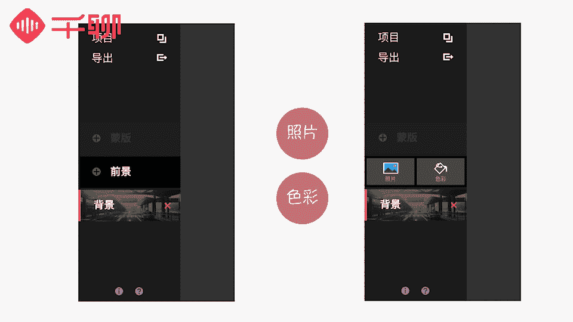

# 1、07《明星之摄影课》手机拍摄高逼格照片：第十课：【创意摄影】摄影小心机，让照片与众不同

うん。hello，大家好，我是你们的老朋友贾里琳卡。今天呢已经是我们的第十课了。我们在前面教给了大家很多的摄影技巧，帮助大家在各种场合、各种条件下都可以找到最佳的拍摄方式。大家有没有好好掌握呢？😊。

最近我也看到了大家的作业，发现我们的同学，无论在摄影技巧上还是对几己的作品的审视点上都进步了非常多，知道怎么去评价一张照片的好坏了，这些进步都是非常非常好的。像夜景拍摄这节课的作业当中。

我就看到一位叫做人丑较多读书的同学说自己以前拍照的时候，总觉得没有别人拍的好，但是现在终于知道是什么原因了。看到大家的进步，我特别特别开心，也特别有成就感。嗯，希望大家学会摄影之后。

可以拍出更多好看的照片，让周围更多的人欣赏到你的作品。今天呢我们就不教大家什么特定场景下的拍摄技巧了。我们来玩点不一样的。嗯，教给大家几种充满创意的摄影技巧。

🎼我们平时在网上经常可以看到很多关于创意摄影的文章和消息。现在非常流行的创意摄影主要分两个流派，一种是通过天马行空的创意设计和制作出来的创意作品，并且拍摄下来。然后后期PS出来的创意作品。

另外一种是拍摄过程中通过取景道具的使用，以及利用一些视觉错位的效果拍摄出奇特的照片。🎼第一种创意摄影拼的是脑洞和创造力。如果没有对生活的细心观察，以及超乎常人的想象力的话，是比较难操作的。

🎼而第二种创意摄影更多的是依靠摄影的技巧，以及手机简单的后期处理就可以实现。我们今天就来教大家这种类型的创意摄影。那么我们会把这部分创意摄影分成下面几个部分来讲解。

🎼分别会借助一些道具自然条件来进行创意摄影，以及利用视觉错位来拍摄创意照片。还有就是利用手机上的一些相机功能和后期P图来进行创意摄影。🎼创意摄影听起来很高大上，但实际上一点都不难实现。

我们可以简单的利用道具来拍摄。下面我们给大家举几个例子。🎼第一个呢就是制造烟雾效果，可以拍摄出梦幻般的先进效果。生活中用来制造烟雾效果的道具比较多，看身边比较容易获得的是哪种道具？

一般干冰和烟雾器是摄影师拍照的时候比较常常用到的制造烟雾效果的道具。如果我们一般家里没有准备这样的道具的话，也可以借助生活中常见的一些烟雾，比如香烟或者是香火等等。出来的烟雾效果也是比较明显的。

使用这种比较小范围的烟雾效果的话，建议大家把烟置于靠近镜头的位置，这样可以避免香烟形成的烟雾太小，而拍不到效果或者效果不够好看。大家制造烟雾的过程中一定一定要小心明火哟。🎼如果道具准备太麻烦的话。

别担心，我们给大家推荐一款在苹果手机上可以添加烟雾特效的app，叫做lesss distortions。🎼有没有很贴心这款应用的少数功能不多，但是可以把某一种类型的特效做到极致的应用之一。

它最大的特色是可以给照片添加光晕、烟雾、光斑、雨雾等特效，并且做的非常自然，推荐给大家使用，操作也非常的简单，你可以选择烟雾的特效，可以按住烟雾拖动，并且放大缩小，调节到合适的位置和效果之后。

然后按下右上角的保存，存到手机相册就可以了。是不是立刻就有大片的特效感了呢？🎼第二个是小创意，大家要善于制造前景来构图。我们在拍照的时候时刻关注，可以成为你的前景拍摄的物件或者是小的物品。

并且好好利用起来是非常重要的。为什么这么说呢？因为前景框架对于背景人物的刻画可以起到非常好的修饰作用，也可以让画面更加有层次和丰富，能够拍出不一样的照片。最重要的是，前景的寻找和制作相对来说非常的简单。

每个人都可以轻松的实现。下面我们来教大家怎么利用好前景构图。🎼比如像我们这张照片，我利用了干花来作为前景的遮挡物，对焦点在背景的人物上，这样的话可以营造前景比较虚化的效果，使前景的物品本身被忽略。

只留下遮挡产生的空白和朦胧感，形成一定的构图和留白效果，也让画面更加有层次。这样我们就拍出了一张很好看的前景朦胧的照片了。还有一个小道具是在跟我们家喵主人猫猫玩的时候发现的。

🎼我们可以利用透明气球拍摄出特别的效果。有一天在给默默拍照的时候，刚好旁边有白色的透明气球。在默默靠近气球玩的时候，刚好被我拍下来，发现拍出来的照片比较有趣，透过气球拍摄的画面可以形成一定的小的变形。

解锁了这种新特效之后，我拥用气球拍了几张灯光的照片，效果也很朦胧新奇。大家学到了吗？讲完了利用小道具实现的创意摄影，我们来讲一下利用自然环境下拍摄的创意照片。🎼自然环境下。

我们最常利用倒影的对称性来拍照，这样拍的照片比较有美感，也是最近这些年摄影师们拍摄风景照的时候比较流行的一种手法。🎼一般在平静的湖面上或者雨天过后，积水的路面都可以拍摄出很好的倒影对称的照片。

要注意的是，如果是湖面比较大面积的水面拍摄的话，对你的拍摄角度没有过高的要求，构图比较对称就可以了。如果在积水的路面拍摄的话，需要我们把手机镜头放低，靠近路面去拍摄。最好可以把手机倒置。

让镜头尽可能的接近地面，并且保持垂直，这样就可以拍摄出很好看的城市倒影的对称照片了。大家不妨尝试一下。🎼而如果在室内的话，瓷砖材质的大块地板或者是镜面效果的地板，桌面同样也可以拍摄出这种倒影的效果来。

🎼下雨天除了适合拍摄路面上积水的倒影照之外，还很适合拍摄雨天湿玻璃的效果照片。下雨的时候，我们在玻璃窗户上经常会看到被雨点打湿，形成了雨珠挂在玻璃上的效果。这个时候我们可以隔着玻璃来拍摄。

可以拍摄出非常有意境和朦胧的效果来。🎼要注意的是，如果隔着玻璃窗拍摄的话，玻璃窗后面的景象最好是光线效果比较好，或者轮廓比较清晰，色彩比较鲜艳的画面。这样即使加了玻璃的朦胧效果。

我们还是可以看得到拍摄的物品是什么，并且能够形成一定美丽的光效。🎼除了下雨天的玻璃窗可以使用之外，我还发现生活中很常见的透明雨伞也可以拍摄出这样的效果。透明雨伞有个好处是，它可以随便移动。

比玻璃窗还要方便取景。🎼下面这张拍摄植物的照片呢，就是在路边，我利用透明雨伞遮挡而拍摄的，效果也一样很好。🎼以上给大家介绍的是两种利用自然条件拍摄创意照片的方法，也比较好操作和实现。

下面我们给大家介绍一下利用视觉错位来拍摄创意作品的方法。🎼我平时用的比较多的有两种，一是利用空间错位，拍摄出比例大小差距非常大的创意效果来。二是利用部分遮挡替代的方式来实现创意拍摄。🎼利用空间错位。

相信大家平时出去旅行应该都有尝试过，比较有趣，而且也很好操作。只要把前景比较大放在一个位置，后面的人和或者是物品保持更远的距离，形成一种空间错位感，并且摆出一个比较有趣的状态，那么这样的照片就实现了。

比如这张照片，爸爸妈妈离我很远的位置。那么我把我的手放大，就形成了一种手在前景很大，把它们拎起来的感觉。是不是很有趣呢？大家也可以通过和朋友一起玩出更有创意的视觉角度和动作来。

🎼第二种呢是利用部分遮挡来实现创意摄影，这个也很好操作，就是用某一种物品遮挡住另外一个物品或者是人的某一部分。然后刚好人或者是物品被遮挡的部分与拿来遮挡的物品是保持一样的角度，或者是画面。

就形成了非常好的遮挡补充效果。🎼最后一个部分我们又要放大招了。我们来看这节创意摄影课最最强大的后期P图创意部分。这个部分要教给大家是什么样的黑科技呢？话不多说，我们先来看一组图片。🎼怎么样？

你是不是经常在摄影论坛里看到这些照片的时候，会觉得很酷炫？今天我们就来教大家利用手机可以制作出这么高逼格的图片。首先我们有必要了解一下这种照片的学名，其实叫做多重曝光。

利用影像的重合来制造出超现实的效果，非常的好看，也很有创意。手机上制作这种风格的照片呢，我们需要借助一些应用。在这里给大家推荐两款，一款是安卓手机和苹果手机都可以下载来使用的。

叫做photoblnder。🎼这款应用可以免费使用。另外一款苹果手机才有的应用叫做union是需要付费才可以使用的这两款应用非常的强大。相比较而言呢，union会有更多的素材，可以供我们使用。

并且操作步骤上会更加流程化，玩法呢也比photo blender更多一些。我个人比较喜欢用union这款应用。下面呢我们就用这款软件给大家示范一下如何制造出多重曝光的照片来。

大家自己下载下来玩的过程中也可以去网上搜集一下多重曝光的方法和玩法。这样的话可以创造出更多更好玩的画面来。那么我们下载好这款软件之后，打开它。我们可以看到它的操作界面，有几个示范的项目。

你可以点开看一下里面的制作效果学习一下。🎼这个应用的制作流程划分成三步，分别是照片的背景、前景和蒙版。🎼背景可以理解为是一张照片的底部，这款应用的背景有三种添加的方式，分别是照片色彩和空白。

🎼照片呢可以选择自己图库里的一些现有的照片，也可以现场拍摄。还有一个这款应用特别好的地方，就是它还给你提供了非常好看的照片作为背景。🎼里面有很多摄影师拍摄的不同风格的照片，你可以下载下来用，非常的方便。

🎼一般我们可以选择自己拍好的照片或者app里提供的摄影师的图片。拍摄的话可以使用我们之前教过的很多技巧，好好拍一张，尽量不要使用随便拍摄的一张照片。🎼前景可以有两种选择，照片和色彩，照片跟背景一样。

同样有三种方式来选择前景和背景怎么设置比较好呢？我觉得有一个原则可以给大家参考一下。如果你的背景是大片的话，前景就设置成一种颜色。如果你的前景是大片的话，背景就设置成单色，这样成片效果会比较好。

这种呢就是比较简单，又可以出效果的一种设置方法。当然还有很多其他的玩法，大家可以多多尝试和挖掘一下。

🎼第三个步骤呢是设置蒙版。蒙版是什么作用呢？简单来说就是你的照片里面那个轮廓的形状，一般选择当蒙版的照片，一定要有很强烈的明暗对比，背景简洁或者纯白，这样才能更好的将轮廓体现出来。

之前我们教大家拍的逆光照或者轮廓清晰的黑白照片都是比较好的选择。下面我来操作一遍给大家看。🎼首先我们新建一个项目，点击背景，我们导入一张自己所拍摄的照片，当然也可以在素材库里面挑选。

导入之后调节一下画面的大小，比较喜欢正方形的构图比例。🎼然后把不必要的内容裁掉，并拖动画面，选择内容比较丰富的画面。裁剪好之后，按下右下角的小勾勾。🎼背景照片就设置好了。

🎼我们可以看到背景图下面有一排参数可以调整，你可以按照所选择的照片效果，把背景照片调整一下。🎼然后我们点击左上角来设置前景，因为背景选了比较丰富的照片，所以我们前景选择色彩，可以选择一种比较喜欢的。

或者跟背景的配色比较搭配的色彩来当做前景。🎼选择好之后呢，调节前景图片的大小，覆盖到整张图片就可以了。🎼前景也一样可以调节参数和它与背景的关系。🎼调节好之后呢，我们来加入我们的蒙版。

🎼蒙版一定要选择对比度很强，很有轮廓感的照片。🎼这里我选择我拍摄的一张黑白自拍照，添加进来之后呢，大家就可以看到非常明显的蒙版效果出来了。🎼同样先调整好尺寸大小，然后蒙版也是可以调节参数的。

我们可以看到你调节蒙版的亮度可以对蒙版的效果起到很大的影响。这里需要注意的是，蒙版的调节功能里面还有很多花样可以让你玩。比如第四个反转的效果就非常的有意思。它可以把目前蒙版对背景图的遮挡效果翻过来显示。

原来被遮挡的部分就会显示出来。原来有图案内容的地方也会被挡住，可以根据你的作品需求，大家可以尝试来调节。调节到你觉得比较合适的位置之后呢，我们就大功告成了。怎么样，是不是特别有意思？

大家要好好摸索一下多重曝光的技巧，可以把晒朋友圈的照片提升一个档次哦。😊，这节课我们为大家整理总结了目前手机摄影比较流行的几种创意摄影方式。

主要是有利用生活道具、自然条件、视觉错位、app特效以及后期P图这几种方式实现的创意摄影作品，大家都有掌握吗？好了，以上就是我们今天独创摄影。这节课的全部内容了。是不是信息量很足呢？大家学一遍。

没有学完整的，不要紧，可以一个一个学，慢慢消化，学会一个技巧，再回来要看第二个，要记得一定要自己实践一下，多多研究，如果你拍出来了，这样充满创意的照片是会非常有成就感的。创意摄影最重要的。

它是想法和创意，这也是创意摄影中最珍贵和最独特的地方，需要我们多观察生活，发掘自己的想象力和创造力。说不定下一个火遍全球的摄影创意，就是来自我们同学当中的呢，大家要好好加油哦。

今天我们依旧给大家布置一个作业，就是在我们今天提到的几个创意摄影方法中，选择其中的一种拍摄或者创作一张你最满意的创意照片来提交，并且简单介绍一下你的创作理念，期待看到你们的作品。在之前的课程中。

我们每个模块都会结合相应的内容，给大家讲到后期调节的部分内容。那么下节课当中我们给大家系统的讲解一下我们的手机摄影后期修图，同样也是干货满满的一节课。我们不见不散。

