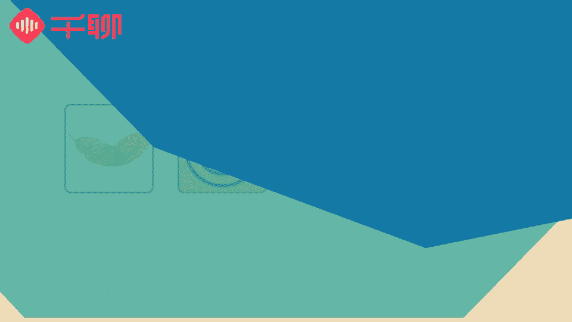

# 1、07《明星之摄影课》手机拍摄高逼格照片：第四课：【色彩运用】色彩搭配与调整，轻松驾驭各色风格

う。hello，大家好，我是摄影师贾磊琳卡，我们又见面了。今天已经是我们的第四节课了。😊，🎼上一节课呢我们讲到了光线和app的结合，能够让一个照片的光影更加完美，更有基调。那么这一节课呢。

我们将给大家带来的是色彩搭配，色彩搭配分为两种，一种是我们照片的整体调性的呈现。另外一种就是我们照片当中的画面，他们的配色是如何的。在这节课当中呢，我们将学到如何避开配色的雷区。

选择适合的调性和颜色来配合我们的照片。🎼学习之前，我们先务必了解一下基本的色彩知识。🎼我们一般会用三个维度来定义色彩，那就是色相饱和度和明度。在后期调节照片颜色的时候，也是在调整这三个参数。也就说明。

控制一张照片的色彩离不开对这几个参数的了解以及运用。🎼下面我们就分别介绍一下这三个和色彩有关的参数，然后再告诉大家怎么通过手机自带的原声功能调整出你想要的色彩来。第一个参数呢是色相，什么是色相呢？

简单来说就是我们第一眼看到的颜色偏向。我们看到了什么颜色，那么它基本属相的色相就是什么颜色。🎼例如，大家高中都学过，阳光会通过三棱镜分出红橙黄绿、蓝紫6种颜色。

这里面的红橙黄绿、蓝紫其实就是6种颜色色相。🎼生活中的色相有很多种，但是都是基于这12种基本色相调整得来的。所以我来带大家了解一下这12个基本的色相，其他色相都是通过这12个基本色相混合而成。

🎼我们可以看一下基本色像图，我们都知道颜色的三原色是红黄蓝三个颜色两两混合形成的三种新的颜色分别是橙绿紫。🎼然后再用这6个颜色两两搭配，可以再生成6种颜色，这样呢就形成了我们的12个基本色相。

我们生活中最常提到的冷色暖色其实就是一种色调。大家知道什么属于冷色又什么属于暖色吗？这两种不同风格的色调又有什么区别以及标准吗？我们来看一下这个色环图，这个色环图是由我们刚刚介绍的基本色相形成的。

其中红橙黄这一半圈，色调非常明和暖，属于暖色系。🎼绿色青色蓝色这半圈色调比较平稳淡然，给人的感觉呢也比较沉静和平和，属于冷色系。所以大家可以根据自己希望拍摄的效果来选择照片的色调。

色调风格对张照片的调性决定其实是非常重要的。大家可以对比一下这两张图片，左边照片的整体色调很鲜艳，非常抢眼，属于暖色系的照片，因为我们人眼对暖色调其实天生比较敏感，暖色调的照片会比较抢眼。

比较容易一眼打到我们的眼睛。右边的照片色调呢比较平和，属于冷色调的照片，相对于暖色调的感染力而言，冷色调比较容易让人觉得内心更加平静，因此冷色系也经常被运用在那些可以给人解压的场所。

比如心理咨询室这些地方。🎼一般来说，暖色调适合拍摄有温度的画面，更加生活化的场景，比如美食宠物。冷色调呢适合拍摄有距离感、时尚气息，或者是表达一定情绪的场景，也适合拍摄一些你想要表达出来干净整洁的场景。

比如恢宏的建筑、浩瀚的大海，以及雪天等等。🎼而且冷暖色调的照片也能够及时反映出拍摄者的心情。内心非常热情开朗的人，拍出来的照片往往都是色彩浓烈的暖色调照片。而温和内向的人呢。

镜头下一般也都是冷静的冷色调照片。我自己呢属于比较喜欢温暖和呃阳光的一些照片。这样的话我会觉得显得生活气息很浓烈，而且能够给人一种比较暖暖的情绪和感受。所以我的照片基本上大部分都是暖色调的。

这次也是为了大家准备了一些我平时少有出现了一些冷色调图片给大家讲解，大家要注意，冷色调并不是绝对的，而是相对的。例如同样是紫色偏红的紫色会比较暖而偏蓝的紫色呢就比较冷。🎼这里需要大家注意一下。

我们日常生活中最常见也是最百搭的黑白灰色系，既不属于冷色系，也不属于暖色系，而是无色系。我们回看三原色的图。三个原色相交的部分呢是黑色的，这就说明三原色完全混合之后就是黑色。如果没有颜色的话，就是白色。

而灰色呢是黑白配比不同形成的中间颜色。因此，我们的黑白灰色系其实是没有颜色属性的，属于无色系，不会出现在我们的色环图上，通常我们的摄影作品中除了暖色系和冷色系之外，还有黑白色系的照片。因为照片没有颜色。

大家会更多的关注到照片当中的明暗对比以及画面的内容，所以黑白色系的照片一般故事感都会比较强。黑白色的搭配形成的特殊质感，能够赋予照片更多的想象空间以及哲理性故事性。

很多摄影师会喜欢拍摄黑白系的照片用以表达自己的摄影理念呀，想法啊也是一种比较独特能。🎼都有自己的摄影风格的一种作品。第二个参数呢是饱和度，饱和度是指色彩的鲜艳程度也叫做纯度，色彩越鲜艳。

那么自然饱和度就越高。而黑白灰是属于没有饱和度的颜色。🎼为了让大家能更直观的了解到饱和度对一张照片的影响，我想让大家看一下画面中这三张图，这三张图其实是同一张。

它们唯一的区别就在于我调节了照片的饱和度这个参数。左边的这一张呢整个画面变成了黑白色，使我把照片的饱和度调到了最低之后的效果。这张照片很明显失去了色彩。🎼而右边这张看起来颜色更加鲜明。

是我把照片的饱和度调到了最高之后的效果。相比于中间这张照片，右边这张的画面会更鲜艳一些和亮一些，特别是右下角暗处的色彩也明显的会更加饱和。🎼大家通过这张照片当中的高饱和到低饱和这个过程。

我们通过照片中可以了解到色彩和饱和度对我们照片的直接影响。🎼那么第三个参数呢是明度，也就是色彩的亮度。这个参数非常好理解，也就是整个画面风格颜色的深浅，明暗的变化。🎼对照片的明度起到决定性作用呢。

就是照片的采光。🎼光线的这部分知识，我们上节课已经给大家做了非常详细的介绍，大家也可以回顾一下。🎼亮度的调节跟饱和度差不多，我就不重复讲一遍了。大家可以自己手动来尝试调节一下。

大家也可以看到明度越高的照片，画面的视觉效果越明亮，明度越低，那么画面的视觉效果就比较暗淡。🎼但是明度低的照片，它的色彩还原度还是在的，不像低饱和那样色彩会直接消失。

只是暗部的细节呢会因为过暗而丢失一些。好了，学到这里，你是不是已经基本了解了影响照片色彩的几个参数呢？🎼接下来我们一起来学习一下如何才能正确的调节一张照片的色调。

我们用手机自带的照片编辑功能来给大家讲解一下。🎼首先我们打开饱和度。饱和度呢我们在前面已经讲过了，它对一张照片的影响呢直接就会影响里面的色彩丰富的程度。当我们向右滑，整个照片的颜色会更加的鲜艳。

🎼向左滑，饱和度会越来越低。🎼基于我们现在的照片，我把它向右滑。让颜色更加的鲜艳和丰富。然后呢，我们再点开对比度。大家可以根据自己的喜好。在颜色上做出一定灰度以及更加鲜艳。

或者是相对来说饱和度低一点的操作方式。🎼然后我们再点开色片，这一块是非常重要的。因为我们今天在课程里面有讲冷色调以及暖色调对一张图片的影响。那么大家可以看到色片向右滑，整个照片会变暖。色片向左滑。

整个照片会偏冷。🎼那么其于我们现在这张图片呢，是由白色构成大面积环境的一张图片。那么底色偏白的话，我我觉得向左滑偏冷一点，会显得画面更加的干净。🎼通过这两项的调整，大家可以看到明显的一张图片的变化。

🎼整个照片已经更加透亮和干净了，对吗？🎼好的，第一部分我们给大家讲了色彩的基础知识，以及一张照片的整体色调风格。第二部分呢，我们来了解一下好看的照片配色是如何实现的。色彩搭配是一个非常重要的技能。

为什么这么说呢？因为配色不只是我们摄影需要用得到。生活中我们也常常运用色彩搭配的意识。🎼比如说女孩子最关心的服装搭配，其中一个最重要的环节就是衣服的色彩搭配。

那么下面我们就给大家介绍我们摄影中比较常用的几种配色方式。嗯，第一种我们介绍一下是单色搭配，单色搭配是比较简单的一种配色方式。正如字面意思理解，嗯，单色搭配呢就是说整体的画面当中是一个主色调。

而画面中只要出现一种其他的颜色，那么这个颜色就会跳脱出来。🎼大家可以看一下这张照片，大部分的主体画面呢都是一个色系的。那么唯一的内抹色彩就会显得比较突出，起到点睛的作用。

让人们的视线第一时间落在突出的那部分色彩上。同时它还可以让原本的照片增加一些活力。这样的色彩搭配方式呢通常能够让人一眼记得住，显得非常的特别。第二种配色方式呢是相似色搭配。

相似色呢就是两种色彩色第二差不多的颜色非常相似的颜色搭配运用在拍摄中。什么样的颜色才可以叫做相似色呢？就是在我们的色轮图上90度夹角以内的颜色都可以称之为相似色。🎼相似色含有相同的色素。

比如大红色与橘红色都是属于红色系，这种搭配可以让照片看起来比较协调，毫无违和感。🎼大家可以看一下这张图片。🎼画面当中呢由深绿和浅绿色的叶子构成了一个色彩的搭配。嗯，其实它们的颜色非常相近。

但是却有一定的层次，形成了一种在统一色调当中比较呼应的一个搭配颜色方式。第三种配色方案呢是对比色。🎼例如，红跟黄是对比色，黄和蓝是对比色，相比于相似色而言，对比色会有颜色上的明显的区分。

更容易呈现出一种比较饱满以及华丽的视觉效果，让人感觉有不一样的视觉轻松感。🎼最后一种配色方案呢是互补色，色环图上相距180度的颜色都是互补色，互补色是对比非常鲜明的两种颜色。

使用了互补色来配色的照片会在视觉上更加突出颜色的对比。下面呢我们可以来看一下这样的色块图。🎼大家可以看到左边的部分，圆心和大圆的颜色搭配属于相似色搭配，圆心的红色显得没有那么红。

而右边的大圆是和红色形成对比色的绿色。在绿色的对比下，圆心的红色就会显得更加红了。也就是说，互补色，可以让我们在视觉上有更大的视觉颜色冲击力。了解了这么多配色的法则之后。

大家对自己想要拍的画面是不是更有想法了呢？🎼找到合适的拍摄对象，并且能够让照片富有一定的色彩画面，才能让自己的照片更加出彩。我们今天介绍的配色法则就是你鉴别的一大帮手，大家一定要好好学起来哟。

那么接下来可能就是大家最关心的内容了，会给大家推荐几款我平时用来调节照片色彩的app。🎼借助现在的app工具，帮助大家更容易的实现自己想要达成的色彩效果。🎼首先我们要知道，使用手机app做后期调节。

离不开的就是运用各种滤镜。滤镜其实手机app根据相应风格的照片，提前设置好照片的色彩以及光效参数。🎼所以选择适合的滤镜可以节省我们不少修图的时间和精力。

我会从拍摄对象、调色效果、滤镜数量这几个维度来为大家挑选比较强大的调色软件。🎼如果有同学喜欢我拍的照片色调，可以下载interphoto这个app里面收录了许多知名摄影师独具特色的照片效果滤镜。

我的假蕾色link卡暖也收录在了里面。所以可以直接使用里面的摄影师风格来定义自己的照片。如果你希望自己拍摄出来的实物，非常的好看诱人。那么我给大家推荐一款叫foy的这款app。

这款app最大的特色就是它免费提供了10种效果，共39个专门拍摄食物的滤镜，而且功能非常的简单好用。🎼使用这个app，你可以很简单的实现想要的食物拍摄效果，例如烧烤物效果，夏日清凉的饮品。

粉色的甜品等等。🎼同时你可以调节滤镜的强弱，可以将滤镜效果调节到一个合适的位置，让照片更加好看。🎼也可以按中间的小太阳调节画面亮度。🎼按第三个水滴的按钮，给照片添加虚化的效果等等。

使用起来还是非常方便的。🎼另外呢给大家安利一个非常强大的app。🎼Vsco camp。🎼这个app非常强大，它是可以在手机摄影的全阶段都非常好用的app。无论是我们在前期拍摄呢，还是后期调节。

🎼它的滤镜款式也非常的多，很多不了解摄影后期，希望能够用滤镜来拯救一切的同学，可以选择vissco这款app。因为它的滤镜数量实在是太多了。还有很多也可以调出非常棒的胶片效果，很受欢迎。这款app。

我们在后面讲后期修图部分的时候，还会专门详细给大家来介绍，所以我建议你可以先下载一个自己来了解一下，摸索一下。🎼好了，以上就是我经常用来调色的app，基本上可以满足日常手机摄影的所有调色需求了。

如果你也有经常使用并且觉得好看的滤镜，也可以在交作业的时候把你的滤镜和app跟大家分享一下，我们来一起分享实用好玩的手机app应用，然后让手机摄影这件事情变得更有趣。

这节课当中我们教会了大家如何调节照片的色彩，能够让照片更具有温度和态度。嗯，照片的色彩其实是最能够表达人的内心的。所以我觉得大家一定要好好的把这一刻放在自己的内心里面，表达出属于你自己的色彩和温度。😊。

🎼这节课的课后作业呢是希望大家能够在冷色、暖色以及黑白色当中任选两种颜色。🎼拍出你认为你想表达的那种情绪，给我们做到作业卡当中，我希望能够看到你们传达出来不一样的情绪。下节课大家一定要来听哟。

因为下节课我们讲的是重要重要最重要的人像摄影。不见不散。