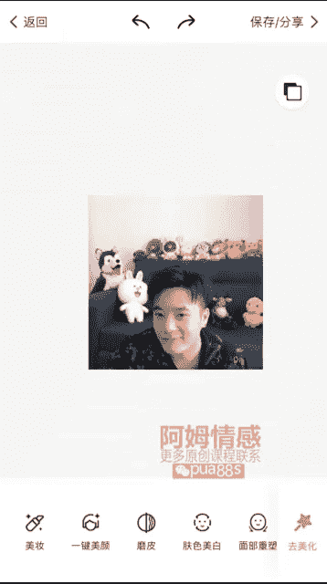

# 1、10船长-修图黑科技：第一步、人像皮肤修饰

OK今天来给大家录制30命修徒的第一课。人脸皮肤修图，我们第一个软件用入的是美图秀秀。美图秀秀大家都知道是一个国民软件，所有人都用，不管是男生还是女生都在用。

因为美图秀秀这个软件在人脸修饰这个这一块上面是非常的齐全。他不管是轮廓皮肤。脸上的黑斑。Heiz。痘痘它都有一些修补的功能。包括黑眼圈、眼睛这些都有，还有身高。

增高速鞋那个对很多身高比较矮小的朋友就非常的好用。但是这个功能呢我建议大家不要过多的去去使用或者使用的幅度过大。会造成你的照片失真，而且与你真人的形象有很大的区别。就形成了一个照片的一个效果。

希望大家要注意一下尺度。这个修照片我们可以修，但是不要修的太过了。对不对？不然前的照片。😔，就算朋友圈做的很好，出去见官使，那也是不好的。不管是男生还是女生，只要成了照片，那就是件很崩溃的事情。

美图秀秀这个软件呢，我们只用它来修饰脸庞，修我们的皮肤。因为。😔，因为在。在美术修秀这里面，其他的功能，它的效果不是很好。效果不是很好。😔，在光这边滤镜这边它的滤镜和调光都很一般。

而且这些杂七杂八的功能我们也不需要用到。我们只需要修饰脸旁。首先我们看这张照片。他的。呃，脸型因为是凑近镜头的，所以显得脸非常大。所以你们拍照的时候一定要注意。然后我们看这个点左右的轮廓很大，下巴很大。

然后上面的额头很宽。这是我们修修图的时候，修脸的时候一定要注意的。那么在美图秀秀这个软件呢，我们有三个功能要用到。一个是面部丛塑。面无从数。第二个是。祛斑祛痘祛斑祛痘。第三个是去黑眼圈这三个功能。

大家要记住其他的这些增高这些亮眼，这些大家根据情况来弄。睁大眼睛这个就大家建议大家不要去用，因为这个睁大眼睛这个功能。就算你用了之后，眼睛会变大，但是你的眼睛会变形就变得很丑。奇形怪状的样子了。对不对？

首先我们看这个面部从鼠好。面部丛复，这个有下巴、脸宽、额头都可以用，但是这个下巴就没有什么必要了。你看他会左右晃呢，也会显脸小，但是很不协调。这边你会把脸放大。所以我们不要用这个，我们用的是点宽。

我们来。😔，根据点的大小，我们来调节，看它会自动收敛。收敛，但是整个轮廓在收，整个轮廓。所以他会很协调。所以我们往右拉让脸变小，因为脸侧近镜头脸比较大。那我们搜，但是你们要记住这个参数。让脸变小。

一定不要超过50%。超过50%就显得拉的很多，看到没有？拉的很多，变得很大。变化很大。所以这样就不好了，因为它会让你的。有轻微的脸型变形，整个脸都不协调。所以我们。是不能超过50%。因为我这个点比较大。

因为抽筋镜头，所以我拉50%，但是我不超过他，对不对？你如如果说你的脸比较小，你可以可以选择不拉或者拉一点点20%、10%这些那我这个现在可以拉个50%，对不对？然后这个脸上的鼻子比较大。

我们可以用这个调节大小鼻子。那个调节一下。收一点点。😔，也是同样的，不要超过50%。这调节的参数，根据你自己当前脸型的大小来自己感觉。要收多少，对不对？我这个11。1点的收。都给他收一点点。

鼻尖有一点点，然后嘴唇这些如果你需要调的话，你可以调整一下。有人说你这个脸型我也不知道要我的脸型，我也不知道要怎么去把它再调一下。那你觉得什么样的脸型帅，你就可以根据这样来调。

或者说你不知道什么样脸型帅的话，你就去看人家帅的人，他的脸型是什么样的，你就可以去再修一下，根据他的那脸型来修。因为我这个脸型在调完一次之后，还是显得有一点大。大家看有没有有点大。

所以我再调一次再拉一下拉一次点宽，同样的不要超过50%。就我们从刚才的基础再拉50%，50%的50%，它的变化率就很小，知道吧？这是我拉40%就已经有变化了。有变化脸变小了，但是也没有变形，对不对？

看一下效果还是有的。然后脸的轮廓大小差的不多了。那么我们的脸上自己看一下来有很多的黑痣，还有很多的一些皮肤粗糙的地方。我们用这个祛斑祛痘。因为它里面有手动和自动的，这个自它都可以自动识取。

我们就按自动的，它可以很精确的识别一些皮肤粗糙黑点的一些痘痘的地方。他就很精准。但如。如果说有一些黑点。比如说有些字它不明显，或者说位置它识别不了，像这里有一个黑点，它识别不了。那么我们点击手动。

来给他点一下去掉。这样去掉黑点就可以了。如果说你全部都已经失去了，那么手动的话你也不用说麻烦，就不用手动了，对不对？然后脸上就很干净了，对不对？很干净了，没有黑点了，没有痣了。

那么我们第三个功能就是取黑眼圈。去黑眼圈这个功能呢，我们可可以看一下。去黑眼圈就是涂抹掉黑眼圈。它还有一个功能是让眼睛变亮。去黑眼圈呢它是让脸上的黑色素。给它涂抹掉，看到没有？

那么我们脸上确实有一些黑色树干没眼睛这里就给它涂抹掉。拖抹掉。你们要记住，涂抹的时候，一定不能一直一直在那里划过去，划过来，一直朝着那个晃。因为你想一下，你一支笔一直朝着一个地方画的话，它的颜色就很重。

那么你那一块的皮肤它就变得失真了。对不对？😔，就不好看了。他不这个去黑眼圈呢去是去黑色素，所以说你脸上只要有黑斑或者黑。那些阴影的地方，黑色的显得很突兀的黑色。你都可以把它去掉，你看到没有？

嘴角的地个方。有点黑色素。Yi。😔，还有这里都有一点点。都可以给他涂抹一下。不管男生女生，因为女生可能是化了妆的，他的黑影可能会稍微少一点点。男生呢因为经常不化妆，可能就脸上皮肤没有那么的精致。

我们可以后期就可以处理一下。这啊。可以看到变化，看到没有？眼睛下面额头。刚涂抹的地方。皮肤都没有那么黑了。😔，对不对？😔，O。那么美图秀秀这个软件呢，我们只需要用的是三个功能，其他的增高身形。对不对？

😔，如果你。照的全身照有照到腿的话，你可以使用一下，但是幅度不要拉的太过，记住，一定不能拉的太过。那后其他这些除皱褶这个功能呢。它的效果很不好。对不对？你看。有一点糊了。有没有？😔，脖子有。有全人。

不止这些。😔，因为这个功能它的效果不是很好。所以说大家用的时候一定要注意一下。一定要。😔，把它照片放大。放到很精致的去调它的它的。它调出来之后，它就不会那么明显的有修改的痕迹。也不会图像，也不会失真。

一旦照片的。如果你说你放在这放在这样的，这个样子去涂抹的话，它就会失真，看到没有？看到没有？失帧了。你要很精致的去调，像这种。无法调节的比较粗的这些线呢，你要一定要放大一点。

或者说有些人他不在意这个这个法令纹也可以不调。其实有一点法令纹。也是无关紧要的。有时候反而你调了之后，它会显得脸部没有那么自然。对不对？我们修脸一定要注意就是。好看而且自然。

就算你修的修的很很那个皮肤修的像像婴儿一样光滑。但是它失真了，他就不好看了。那就跟我们之前调脸，那我们干什么还要调脸呢，对不对？16。精致的去调。保证不失真，保证自然。可以去调一下。

其实我觉得这个法令纹我其实觉得可以不用调的。但是你们有一些可能不喜欢的话，就可以把它弄掉，但是一定要做到自然。我这个可以不用调，就这样。我觉得还有这个法令纹还挺好看的。真的OK的。呃，修容笔呢。

这个是修脸部皮肤的。其实你只要脸部是。眼部皮肤只要不是光斑，很明显。就是脸上的光线不是很能杂乱的话，但是这个拍照的时候，你们要注意，后面的话你用这个修容笔。反而选着修完之后，因为他这个效果很差。

修完之后它的效果就很不好，所以会影响我们的整张照片的脸脸的皮肤。还不如不用呢，对不对？有其他功能都可以不用了，其他这些有人说一键磨皮。这一件磨皮你大家看一下。修完之后是这样的。整张照片里。它是泛光的。

看到没有？很虚化了，皮肤很不好看。一件的话就是这种效果，一件磨皮。就很烂，这种效果就是地摊货的感觉。对不对？一键美颜也是。这些都是一些低档次的修图，去直接。直接一键。第两次修图。

所以你为什么你的照片放到朋友圈没人点赞，没有女生喜欢，没有男生喜欢，就这个原因，照片你是修了，但是。也修图也分中高级的。所以你虽然修了，但是是一种。low的一比较城城市的话。叫你修了也没人喜欢。

OK美妆这些。就用完之后，自己的照片会变得更奇怪。所以我们就不要用这些东西，这些很杂乱的功能我们不用。OK美图秀修脸修皮肤，我们就完成了。然保存。

