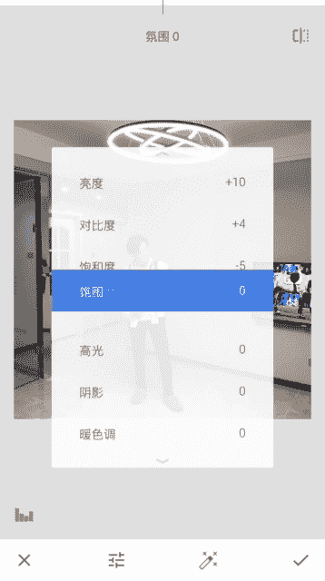

# 1、10船长-修图黑科技：第三步、照片光线调节

我现在来给大家录制。我们展示面修图的第三课。光线的调节，我们用到的第三个软件是nve sit，这个叫叶子，出称叫叶子。第三个软件我们打开是这么一张照片。

是我在自己家里拍的是一个光线比较好的这个地方的脸上，还有周围这些光线。比较的均匀。但是呢我们可以看到照片上很多地方它是有一些，比如这个地上。有一块亮斑的很亮。还有这个头上的灯，他虽然说比较好看，但是。

相对于图片来说，它是比较亮的，而且在这个门后面以及这个墙这里它都是属于一些比较暗的地方。那么这块地方它又比较亮了。造成我们整张照片的光线。很不均匀，现在看起来花一块胡一块的就影响了照片的质量。

那么呢我们就需要在后期来调节一下。因为我们拍照的时候，可能光线。没有打的那么均匀，因为我们可能没有拍照的时候，没有打LED灯，没有像摄影棚那样打灯光，所以会有一些偏差。那么n的这个软件。

被誉为手机版的photoshop，它的调光功能非常的非常的棒。我们可以看到有很多种的功能。很多种，现在在更新之后的s那不舍的又加上了美颜，还有头部这些修人像的。功能。但是呢我们在用这个软件的时候。

其他功能我就不过多介绍了。我我介绍一下我需要用到的一些功能。第一个调整图片。第一排的第一个这个功能调整图片。然后就是第三排第一个的。qubu。这个是调我们照片一些嗯不能整体调，而失去一些局部的位置。

比如说某个地方很亮，每个地方很暗，我们这样去调它的位置很精确的去调，而不是整张照片你去加光的话，它有可能你想调暗的地方，本来亮的方它就很亮了。你挑整张照片，虽然暗的地方已经变亮的，但是本来亮的地方。

它就会失帧了，对不对？然后呢，我们最后用到的一个功能是曲线，第一排的第三个曲线。曲线这功能呢它是让整张照片的光线变得均匀一点，更加的均匀。我们调光线呢是让照片的整张照片的光变成非常均匀，非常自然。

所以我们最后用曲线来来协调一下整张照片的光。首先我们看调整图片。

亮度它里面有亮度、对比度、饱和度、氛围、高光、阴影、暖色调这几个功能。首先我们看亮度，因为这张照片它有一些地方比较暗沉，整张照片的光还是不太够，我们需要补光。那么首先我们来左右调整它的参数。

左是减光向右是增光，那么我们调参数的时候，我们首先要把照片调亮，因为这张照片不够的亮。然后我们调参数的时候一定要记住。这个亮度记住这个参数不要超过15%。他这个满的是100。我们不要超过15。

因为你超过15之后，照片在后面调的时候，它会产生一个失真的效果。这张照片呢我只加了10，你们调参数的时候，就根据自己照片来。调整你们的参数，你们调完之后去对比，看有没有失帧。如果哪个参数调完之后有失帧。

就一定要修改一下。然后对比度因为你加光之后。难免会有一些的失真，我们需要加一点对比，让它变得真实一点。我加了4。你们也要记住这个对比度的参数也是不能超过15%的。左右都不能超过15%，因为我调照片的话。

这张照片。比脸上很黄，所以我希望他脸上没有那么黄，显得皮肤好一点。所以我把对比度减低一点点。我都减的很少，看到没有？减的很少，对比度加加了4。

把和度减到5。然后这个氛围呢，它是让整张的照片的光变得均匀，看到没有？看到没有？但是呢你如果加多了。他就变得很糊，这一块有没有很糊了这一块。所以说还有头上这些都糊掉了，所以说我们不能加这么多。

我们让光线变得均匀。有效果，但是不失真，要做的自然，对不对？不能加那么多，那我们加多少呢？我们根据调完参数之后，我们来对比参数是多少，我们来调整。同样的，我们这个氛围参数也有限定的，不能超过20%。

因为这张照片。的光还有一点点的不协调，所以我们加到。Si。😔，18。这后片的光都变得好了。呃，暗的地方变亮了。亮的地方稍微变暗了一点点。对不对？😔，十8不太够，我们加到20。O。别看这么小的一两个参数。

因为这。两个参数有可能会改变你整张照片的效果。所以我们调图的时候。不管是修人脸还是调光，我们要做的精致。然后高光呢是让最亮的地方变得更亮，就亮的地方就变得更亮一点。

你看这个灯看你如果你不知道你加的参数有什么变化，你就多加一点，看它的效果看到没有？它亮的白的地方，一些亮的地方它变得更亮了。那么我们不需要加那么多，我们只需要知道它会产生什么效果。我们这张照片呢。

加高光的话。会变得更亮一点，更白一点，更清澈一点。我们就加一点点，有了效果，看到没有？这调完之后的效果就是这样的。那么说还有后面的阴影和暖色调，阴影这个东西不管在哪个。嗯，调光软件里面最好不要去动它。

因为你一旦加了阴影，这个之后，整张照片会糊掉，看到没有？整张照片会糊掉。你说比如说我加一点点呢，加一点点之后。他也是会有一种朦胧的感觉。你看我只加了10。上面的灯光。

这些暗角这些地方它都有一些朦胧的感觉，看到没有？朦胧的。这个效果都特别不好，所以我们不要去加它。然后暖色调这个这个参数先不要急，我们在前期不要调它，因为你前面调了之后会影响后面的成色。

所以我们调整图片这个功能我们就用到这里。整张照片的光初步的调整了一下，然后我们用到的是局部。局部这功能首先看一下脚下这一片地板，它很亮。点击这一块红色的就是这一块光斑。他能修改的就是这一块光斑。

看到没有红色很红色。红色红色这一块区域呢就是能调整的区域。那么我们因为它很亮，因为你照片里面有一块地方，如果是作为背景的光很亮或者很暗，它会抢了你人像的一个眼球眼球。这样我们去把它调暗一点点。

同样的不要超过15%。这张照片我调到了12。可以了，我们再看其他的地方。这一块。左边这一块还是很亮，那么看到没有？这一块光斑红色的。就是代表这块亮斑。的区域我们来把它减量减减暗一点。看我减了13%。

对不对？这下面的光就变得均匀了，看到没有？他没有整张照片，他没有去抢了人的一个视觉效果。因为你突然有一个地方很亮眼的话，他会抢了你抢了你人的注意力。这张照片他可能看到的是第一眼的感觉不是你人。

而是其他的地方了，对不对？那就很尴尬了。我们拍照片就是为了突出自己的。那你被其他抢了抢了眼球，那不就很尴尬嘛。然后后面这个背影这个后面这一块呢，看到这个黄色的区域。很暗，我们那么。

那么我们就把它提亮一点点，让照片，让这里的光线差不多和。其他地方的光线有一点。协调了就可以了。那么这块区就调好了，然后看这些墙这里。他比较暗。那么。我们就把它调亮一点点。

让照这里的光和整张照片的光变得协调。加一点点。OK变得协调。那么这一块。电视下面这块光板呢还是比较亮。在整张照片里面，它是比较亮的区域，那我把它调暗一点点。看参数。

你们一定要记住这个参数也是不能超过15%的，左右都不能超过15。不管你加光还是减光，然后呢，我们看这个台灯。这个灯吊灯它比较亮，那么我们可以把这个区域稍微的减减暗一点点。有了一点点的变化。有一点变化。

有一点的变化，看到没有？有变化了，然后。灯后面这块去看到没有？是一块黑色的。黑斑。那么呢我们也要把。提亮一点点。让整张照片的光变得均匀。所有你们看的那些很好看的网红照片，其实你会你仔细去观察的话。

你会发现他们的照片整张照片的光都非常的均匀和谐，没有说一块地方突然很亮，突然很暗，他们的光都非常的均匀。他们怎么调的呢？也是通过这样。他们可能是。在拍照的时候有过打光，精心的打光。

但是呢照出来的不可能是完全的那么均匀的，也是通过后期来。调整了他们的光线。然后我们。刚才他局部一次照片只能加加那么几个，然后使用完了。但是你发现你的照片有些地方可能还需要调整。那么没关系，我们再加一次。

这边有一点暗，我可以加亮一点点。同样都不要超过15%。然后这一块还是有点暗，我们再加亮一点点。看到没有？😔，还有这个下胶。提亮一点点。然后呢。还有一个地方，你们注意到没有？这个衣服。因为灯的效果。

灯的关系它变得非常的。非常的亮。他就非常的抢眼了，抢了人。对不对？😔，调整一下，然后呢，还有一个局部，还有一个效果就是。我们在人脸上，如果你当时拍照的时候，脸上的光不够，你比如说这块。

缩小把这个红色区域缩小，这样放大缩小。照射的这一块。比如说你如果说脸上比较黑，你可以也可以这样增亮，或者说简暗都可以。但是根据你的那个当时的。下照片来调。然后第一第另外一个功能就是说我们可以在这里。

这个脖子这里阴影它比较黑，看到没有？这个脖子这下面有比较一块黑的阴影，看到没有？黑色的。黑色的阴影看到没有？这一块呢如果说我们把它。再减黑一点点，我们的轮廓线看到没有？如果一直把它减黑。

但是但然说不能减这么黑哈，我只是给大家做个示范。这一块你看轮廓减黑了之后，它的轮廓线就非常的明显，这也是一个光的效果。看到没有？当你减加亮的时候，它的轮廓线就不见了。

所以说我们可以适当的减少一减少一个一点点这个地方的亮光来。增加一下我们轮廓，更加凸显我们的轮廓。对不对？但是注意了不能剪的太多，我们剪一点点，让我们轮廓线更显一点就OK了。啊，我初步调了。然，调整图片。

局部功能，我们用到这里。呃，调整之后，你们一定要去对比，反复的这样去按照图片对比我们的光线，哪个地方还需要调整，哪个地方还需要修修正一下，一定要去对比，觉得不太满意的，就再重新调一下就OK了。

然后第三个功能叫就是曲线的。曲线我们可以看到这个曲线图下面有一块。有一个曲这个线下面有一块光斑，看到没有？这个是一个曲线图，代表了整张照片的光亮。看这个顶尖这里哪个尖，说明这一块的光是非常的亮的。

代表这个这片的光比较亮，然后这边呢。这边左边和右边它的曲线是向下的，看到没有？向下。他是一个。兔字型的。说明这一块的光很暗，那么呢我们就要把它往上。提拉一点，让它光变得不要那么的。对不对？

往上提了一点点。这边同样的晚上。像突然你看一下这个改变一点点的时候，这个脸上的。光就不好了，不好看了。那么。我们去看一下。因为我们调整图片，用调整光曲线这个功能呢是为了让整张照片的光变得均匀。

所以说我们如果本来是。它曲线应该是这样去调的。但是你看往上的时候，它的图片就变成这样了，像这样变多变得不好看，脸上的光变得非常的黄，非常的亮。那么我们往下。那一天天呢。对不对？😔，它就变得非常的均匀。

整张照片的不。这样我们取线就OK了。曲线这个功能。对不对？然后呢，曲线。曲线里面的功能是用到中性中性这个滤镜，看到没有？中性这个。来调整的。其他的那些如何对比，强烈对比，调亮调暗这些都不要用。

我们用中信，然后点击中信之后点击。下方的一个左方第一个圆圈。来调整。IGB就刚才我们调整的那个样子。看到没啊。跟我们刚刚才调的的效果不像。我们把这个点最高点让设个。设定一个点，保证它的不动。

因为它已经很亮了，我们不需要再往上提或者往下拉了。我们调整左边，它比较暗，我们往上提一点点。提一点点一定不能拉多了，你看拉多就变糊了，所以我们拉一点点。爱点点。然后左边呢右边呢右边因位。nii。

我如果往上拉的话，它变得脸上已经非常亮了，不能再往上拉了。拉完之后它变得很突兀，那么呢我们就往下拉一点点。一个往下拉一点，尝试拉一下。两照片的光它变得很均匀，但是呢突然有一点点的。有一点对比度。S。

过低的感觉，所以我们不能拉那么多，我们拉一点点，看到没有这个曲线的效果，就这样。我只拉了一点点，但是他变化还是有很大的。你反复去对比，你会发现它的效果是很有的。很有效果，对不对？然后我们把点击勾确定。

然后整张照片的第一次调光。变化就是这样。之前的光斑黑影它是消失的。它比之前的效果要好了很多，看到没有？反复去对比看一下。是不是效果就出来了。那么snap said这我们就用到这三个功能来初步调节光光线。

对照片的光线进行一个初步的调整。这是第一步，我们还有后面的一个。光线升级。好了，保存。