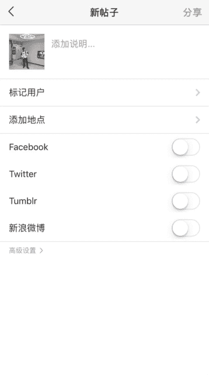

# 1、10船长-修图黑科技：第五步、滤镜选择

OK大家好，今天是展示面修图的第五课加滤镜。我们用到的功能是这个第五个滤软件是insgram。我们可以在苹果商店下载。但是呢这个软件需要一个国外的网络去注册。登录。

那么我们就需要利用到另外一个角软件叫VPN。你们可以在苹果商店去下载，然后注册。但是VPN可能需要花钱，这个需要你们花钱去购买一下国外的。因为国内的网站它是登录国内的网络它是登录不进去的。

这是属于一个国外软件。这个软件呢，它不管是国外的一些网红明星还是国内的一些网红明星，它都在使用。因为这个软件的滤镜。的效果它是非常的档次非常的好，非常的高，比其他那些。呃，地摊货的滤镜要好很多。

但是呢其中有些滤镜它的效果也是不太好的。那么我们要修一个网红的滤镜的话。网红效果的照片，我们需要选择一些滤镜。那么选择滤镜始终是还是根据照片的效果或者你喜欢的效果。但是我呢我给大家推荐几个比较好的滤镜。

那就是第二个以G开头这个滤镜，这个G开头的滤镜，这个滤镜以及。这个这个对接。然后第二个滤镜就是这个木纹木纹这个滤镜，这个滤镜也是比较好的。然后我也是特别喜欢的一个滤镜，然后呢。第三个滤镜。这就是这个。

以H开头的。这个滤镜这个滤镜。修蓝色调它比较好，但是呢参数到时候我们会再教给大家。然后呢，第四个滤镜是这个以S开头的一个滤镜，它的效果也是比较好的好的一点的一点的滤镜。我。

这10个滤镜我推荐大家可以去尝试一下。其他如果说你想用其他滤镜来修的话，也可以根据你当前的效果来修。但是呢你要注意参数这个东西。因为你参数调的不对的话，整张照片的光效就变得非常的不好。

那么这张照片我选择用默认这个滤镜来调整。当等我们看了一下，加了百分之百的时候，它是黑暗的。没有色调的一个没有饱和度的一个照片。所以我们参数不能加那么高。也一要记住，你们滤镜的效果不能超过。不能超过。😔。

50以上不能超过50以上。50以上不能超过，你看照片就失真了。这张照片的。效果就很明显。对不对，这个也是。非常的明显，这个滤镜加上去就照片里就照片就滤镜太过的话，就显得很low，档次就低了。

以及我刚刚推荐的那一个滤镜。这滤镜你看蓝色条非常的重，所以我们不能加那么高，我要减低。这样减低的效果。然后。我们后面的。也是一样的，当它加了百分之百，效果是这样的，就很low。

我们一定不能让滤镜的效果变得那么重。那么中就很low了，我们要降低一点点，看到没有？降低就是这种效果。那么这张照片呢，我们选择木纹。这个滤镜。我来调这张照片的参数呢，预计我选择一个百分之。20%。

再高一点。22%。就可以了，有效果看到没有？有滤镜的效果，你点击一下图片，它有你看下对比，它有效果，等照片的光变得均匀了，档次加完滤镜之后，整张照片的档次也提高了。但是你参数如果调的不对。

让照片的档次也是非常的low，所以你参数一定要调对。参数调多少呢？根据你的感觉来，对不对？我也是根据如果说我调多了，我感觉也有点过了，这滤镜的效果有点过了，我就调低，对不对？调调少了呢。

那效果就很不明显，又只有一点点，那档次不够，那我们再加一点点，加到22%，对不对？这样我们选择滤镜的参数就够了。然后呢，我们选择了预计之后，我们要点击。右下角的编辑，因为我们调完滤镜之后。

我们照片的光变化了，跟之前的光不太一样了。我们要去根据下面这些参数来调整。上面有有亮度，有对比度结构，这些有很多的参数。啊，接下来我们需要用的。第一个亮度。我们的照片一定不能暗沉。

我们用我们发的朋友圈的照片，他会。变暗有一些，所以说他就不太想看你这个照片，然后翻到你的朋友圈的时候。我们加一点点的亮光。照片变亮了，但是你要去对比一下，不要调过了，这个有点太亮了。对不对？

我们减低一点点，贾老五看到参数还低很低。所以我们这个参数的范围不能太大。我们这个调的参数参数的范围是。亮度的参数范围是15，不要超过15。然后加了亮度之后，之前怎么说呢？加了亮度之后，它会失真。

有点稍微的失真，我们就要加一点对比度，让它变得更加的清晰。对不对？这个对比度很非常的。不显眼，但是你只细去看的话，它还是有的。当你们修图的时候，你只需凑近去看的话，它还是有明显的。比如说你如果挑少了。

你不觉得那你就挑多一点，你感觉看到没有？这变化它变得非常的清晰。那么我们不需要加那高，因为照片高的话，加的太多，它会变得失真，我们加一点点有变化，但是不要是在。加我就够了。嗯，你去对比一下。有感觉的话。

就可以了。然后我们第三个就是结构，结构呢就是让跟那个清晰度是差不多的。效果差不多，难那结构不要加太多了。结构不要超过5不要超过5。不要超过。😔，这里我这加了4。对比度也是不要超过15。

然后再一个我们还叫暖色调，暖色调其实就是那个。左边变蓝或者变红这个啊，这张照片呢。因为之前调过一点蓝色。照片有一点色调不太自然嗯。加一点。黄色看看呢。变得黄黄的加过了，对不对？嗯少加一点点。然后呢。😔。

张照片如果加蓝色调。他会显得很不准。陈照片蓝色调加蓝色调。不太好看，那我们就加黄色调就变得暖一点，但是一定要记住，不要加多了。加一点点就够了。有些照片你可能说需要蓝色调的话，你就往左边画。

但参数呢不要超过15，一定不要超过15，超过15，它就会失真。然后呢，我们再再来调饱和度。照片的饱和度。如果你喜欢鲜一点点，嗯一类照片色彩不要太太那个冲击感太强了，因为会不协调。那张照片呢我喜欢他。

色调低一点点。那么我就减查了饱和度。有人说你这个脸可能就变得变得很没有色彩了，但没有关系，你只要把它调过了，调过了就是这种了，那我们就调一点点。那不要那么黄，变得白一点点。😔，要连上。😔。

有效果看到没有？你挑多了，它就变白了。那么就调一点点，它是其实是有效果的。对不对？然后呢，我们去调整这个。高亮。高亮也是嗯亮的就会变亮，暗的就会变暗。对，亮的地方变暗亮，对不对？照片有一点。

还是有一点等的。An城。那我再加亮一点点。调亮一点点。对不对？加6高光这个参数的范围也是不要超过15。然后我们用到D，后面的就是光影，光影呢就是让黑的地方变亮。右滑就变亮。

然后黑的地方左滑就是黑的地方变黑。那么我们让照片变得有质感了，我们这张照片可以让它往左边滑一点点。减了10。光影的参数也是不要超过15。有没有。😔，有变化，你对比一下。变化变得有层次感了。

然后呢晕影这个可以用一点点。晕营它是让四周的黑一点，凸显你中间的主体。所以我们可以用一点点。我们用个15就可以了。但是不要用的太多，这个照片用个1就够了。餐因运营夜收不要超过15。那照片我用了10。

然后呢，我们还有最后一个功能就是锐度。锐度其实跟锐化是一样的，它是让照片变得清晰。嗯，我们因为之前加过锐化了，所以你不要加的太高了，太高就这样了。就很难抽了。因为他已经失真了，很吵。所以我们只。

这张照片我们只加15。1515都有一点吐了。😔，就线条嗯有一种很凸显的感觉了，那种就不行。我们浙江造园12。所以这个参数它的参数是范围是20。不要超过20。然，照片就变得很清晰。然后我们来对比一下。坐。

之后的效果。这是加滤镜之前的效果，然后我们加完，然后再调光，之后的效果就是这样。非常的有网红感觉，看到没有？你去找一下那些网红上百万粉丝的那些网红的照片，是不是就是这样？对不对？然后我们就可以保存了。

然后我们加滤镜就到这里。保存。

