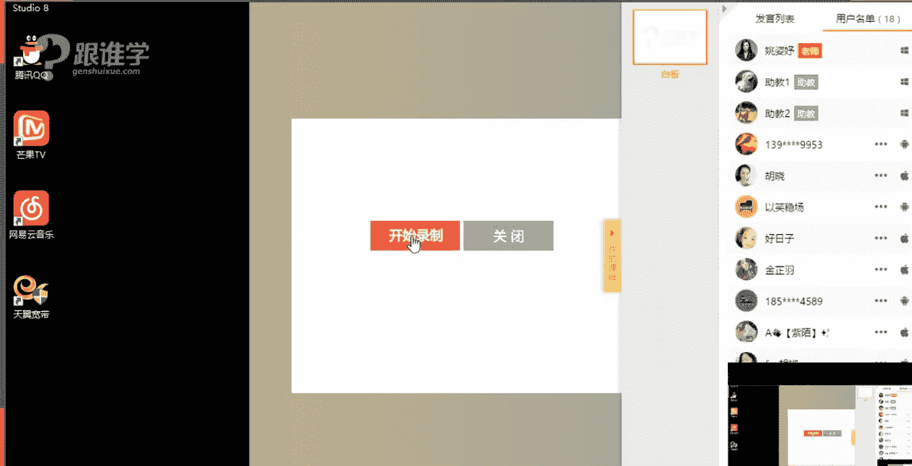
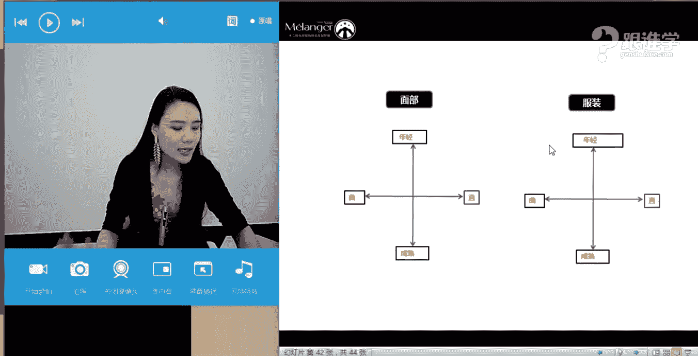
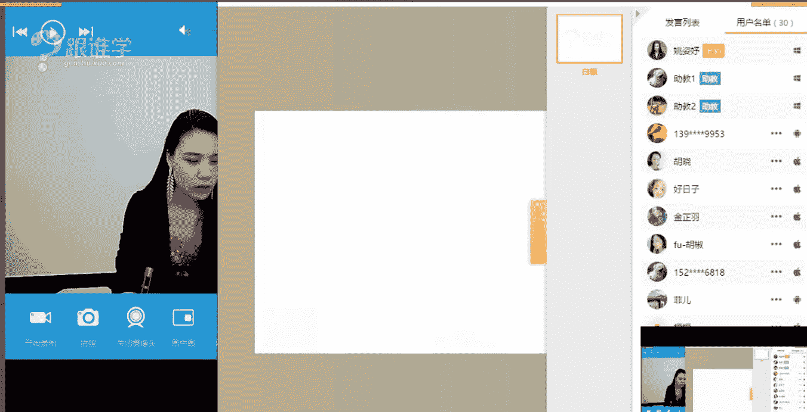

# 1、11服装《搭配秘笈之新版36计》：01完美提升自我形象思路

🎼。🎼我来到。🎼你的城市。😔，🎼走过你来时的路。😔，🎼想象着。😔，🎼没我的日子。😔，🎼你是怎样的？😔，🎼孤独。😔，🎼和着你。🎼给的照片。😔，🎼熟悉的那一条街。😔，🎼只剩没。😔，🎼你的画面。🎼我们回不到。

😔，🎼那天。😔，🎼你会不会忽然的出现？😔，🎼在街角的咖啡店。😔，🎼我会带着笑脸。😔，🎼回首寒暄。😔，🎼和你坐着聊聊天。😔，🎼我多么想和你。😔，🎼以前。🎼Yeah。🎼看看你最近改变。😔，🎼不再去说从前。

😔，🎼只是寒暄。😔，🎼对你说一句。😔，🎼只是说。😔，🎼一句。😔，🎼好久不见。😔，啊。

家了。嗯华公司。hello，大家晚上好。嗯，那刚才有一位同学说6818同学说才发现我进来的好准时啊。那呃我不知道老师现在进来的准时吗？那如果可以听得到我声音的同学呢，请打一同学们。OK好的嗯，嗯。

那看到很多嗯看到很多同学，那有一些是我们单品课的一些老同学，那也包括是第一次听我们的专业VIP的学生，对吗？嗯，OK好的，那谢谢同学们啊，那今天呢也是我们专业班的第一节课。

那老师在这里呢首先要欢迎大家来到我们的这样的一个专业的课程当中去学习。那我们专业课程呢跟我们的这样的一个呃公开课，其实他的知识点，我们传授的都是非常的这样的一个系统和专业的啊。

从这样的一个专业角度来上来讲。但是我们这样的一个呃专业的VIP课程呢，会有一个半小时的这样一个时间。那并且呢我会在这种屏幕当中也会给大家来不断的进行一些解解答。啊。

那包括我们课后也会有一些解答的这样的一个环节。嗯。好的啊，没关系，谢谢同学们，今天特别喜欢我的服装，是吗？那呃这个今天穿的是一条，其实有点接近于小丸里的红色的长裙啊，那如果你们等一下喜欢我的这套造型。

我可以展展示一下给大家看一下啊。好的，嗯，谢谢同学们，那今天呢是我们专业班的第一呃这个第一节课。那首先呢其实在呃开始讲专业课程之前，啊我要跟大家来讲一讲我们这样的一个呃专业课程的这样的一个板块的设置。

那呃今天呢基本上应该都是有见呃这个听过我讲课的同学们吧啊，基本上应该都是有听过的那呃大家在公开课当中也都见过我。所以呢我在这里也不过多的自我介绍了啊，但是呢还是来强调一下。

我是米莱欧国际时尚教育的高级讲师啊，那同时呢也会为一些明星艺人做这样的一个整体的形象设计搭配啊，OK好。😊，那在我们同学们在呃听我们的这个公开课的时候，其实我一直在跟大家讲到的一个概念，叫认识自己。

那包括我们这样的一个课程的板块，也叫认识自己，可能有很多同学呃会觉得很奇怪，说老师我都觉得我自己活了二三十年了，我怎么可能不认识自己呢？那有没有同学觉得你们对于自己是非常了解的，我这里指的了解。

可以是包含所有的板块。那例如说有的同学觉得我我很了解我自己的性格。那也有同学说我很了解我自己的优点以及缺点。那如果同学们你们觉得很了解自己的呢？请打一。如果觉得好像唉对自己某些部分不是那么了解的话。

请打2。好，嗯同学们可以在屏幕上这个快速的来打一下啊。那呃OK我看到4589摩西同学，那包括9953。同学啊有看到大家的答案啊，有同学觉得我非常了解我自己。那也有一部分同学觉得我不是特别了了解我自己。

对吗？那为什么一直在强调说认识自己这样的一个问题。那其实我们从小到大我们一直在这个不断的读书，那我们读书的这些内容，可能是针对于我们自己的喜好，或者说我们可能今后想要呃这个从事这相关的工作。

或者是为了找好的一份工作，我们去读书和学习，那么我们学习到的这些内容其实没有一个板块是关于我们自己的对吗？同学们，你们可以想象一下，你你们可以现在回想一下哈，你们在你们人生的慢慢的学习的过程当中。

从小从小学到大学，有没有学习过关于认识自我的这样的一个板块的啊。OK那为什么一直强调这个问题呢？其实我们说我们这个在这个日本啊，以及韩国。国那包括西方有很多的呃课程呢。

他们其实是从小就给他们的这些学生啊，或者是说有很多这样的一些关于美学形象的这样一个课程。但是我们会发现在我们中国其实很少。他们会在呃这个欧美或者是日韩，他们从小就会接受这种包括化妆插花茶导等等啊。

服饰搭配，那让自己变得更加从形象上变得更加美好的这样一个课程。所以他们的美感相对来说也会比较好。而我们对于服装搭配，其实是不是那么的了解的。包括对于自我的这样的一个问题也不是特别了解。

那例如说有同学说老师我觉得我自己挺了解我自己的那我问大家几个问题啊，谢谢你像文场同学送的呃老师的这个小礼物啊，谢谢同学们。好，那首先我来问大家自己呃，问同学们一个问题。你们了解人与服饰的搭配原则嘛。

那其实我简单的来讲就是。你了解你自己的气质跟服装的这种风格的气质吗？如果你不了解的话，那你怎么能够说你能够穿好衣服这件事儿呢？啊，那第二个我们说你认识你自己的脸型吗？我们说一个人的脸型。

我们自己的这张脸，他会关乎到很多的问题。那例如说你戴什么样的耳环啊，那例如说你戴你穿什么样的领型，也就是我们衣服当中他会有很多领型，例如说这种圆领、V领、小圆领、大V领啊，大圆领等等这些领型。

他跟你的脸型都是有一定的关系的那今天我在线下的课程当中，还有一个同学这样问我，老师我的脸特别尖，然后特别长，啊，当时他又穿了一个特别深V的领型。那我想问同学们，你们觉得这种领型适合他吗？

那大家应该是在我们的这样的一些公开课当中啊，有听过课，或者在单品课当。不可的那我现在简单的来给大家提问一下，一个人他的脸特别长，他适合穿V领吗？这个问题适合情大一，不适合情大2。好的嗯，是的啊。

那我看到大家的答案了，非常好是的，不适合。那是为什么呢？那是因为他的领型重复了他的脸型。那所以说这些其实都是由我们所说的科学的道理的那有很多同学我相信都不了解自己的脸型。

那这是我们所说的脸型跟领型的问题。那其实脸型它会涉及到发型啊，帽子等等，这都是我们非常非常关心的这样的一个问题。而且我们的脸永远是一个人的视觉的重要的这样一个焦点啊，我们所有的造型都围绕着脸部来做。

对吗？啊，所以说其实我们需要了解自己的脸型的问题。那而且我们有很多同呃经常会跟我提到，老师我皮肤暗黄，皮肤黑，我应该怎么去穿衣服。那皮肤白皙的人相对来说他是比皮肤黑或者暗黄的人穿衣服要是好穿的啊。

OK好的，那这些呢我们都在课堂当中会。为大家来解答的。当然不是今天一天，我们在我们这个板块当中都会为大家去解答。那包括你究竟是什么样的一个体型，我们说体型的话呢，它会涉及到什么样的一个问题。

就是我们选衣服的版型的问题。那我们知道衣服的版型它有哪些。我们在平时穿衣服的时候有哪些版型？有没有同学可以告诉我。有没有我们现我们在教室里的同学有没有做服装相关工作的？嗯。

如果有的或者是呃对于时尚有一点点了解的，其实你们在买衣服的时候，其实是有大概的认知的。比如说今年特别流行这种叫什么呢？啊，对O型啊，999953同学嗯，谢谢你，那我看到你的答案了啊，A型H型O型。是的。

这个我们所说的服装的款式。型廓形就是一个服装的剪影，它的外部的轮廓，那它有H型的，有A型的，有X型的，有O型的。那么服装有这么多款式，我我们其实了解服装款式，但是我们不了解自己的体型。

这是一件非常可悲的事情。因为你不了解自己的体型，你就不知道你应该穿什么样款式的衣服OK好，那所以我们要了解自己的体型的问题，那你才能精准的把握呢你的服装的单品好，你继续来看。

那有你为什么看起来比实际要矮，有很多同学其实长得并不矮，那有它如果看起来矮，有两个原因，就是它看起来娇小有两个原因。第一个就是你的什么比例的问题不好，其实就是我们所说的纵向的这样的一个身形法则啊。

纵向身形法则。那第二轮话就可能是因为你整个人长得是特别小巧的。即使你长得一。7米1。8米。但是你的脸，你的头长得特别小啊。这个那也会比这种。正常的这种身高看起来要娇小一些。OK好。

这是我们所说的比例的问题啊，那包括体态细节的修饰，体态细节的修饰其实是大部分人都特别关注的这样一个问题。那例如说手臂粗啊，腰粗、腿粗脖子粗等等啊，有人是脖子粗的问题啊。那这就是我们所说的体态细节的问题。

其实大部分同学都在关注这个问题。那其实我们说体型比例和体态细节，我们都想。🤧啊，我们在我们这个课程当中都会给大家分享。啊。好，那我现在再插一句话，我想问一下，咱们今天教室里有多少是男同学。

多少是女同学呢？啊，女同学请打一，男同学请打2。OK好，女同学现在居多我看到了这样一个呃答案啊。到目前为止啊，以笑文场是男同学是的嗯。OK好，哇，今天以笑文场，你是身在花丛中啊，全是女同学。OK好。

那我们继续啊，先了解一下咱们男生和女生的这样的一个比例啊，包括住制同学也是男同学是吗？好的嗯，嗯，我还看到一个邯郸学员，张嘉欣同学啊。嗯，O好，那张嘉欣，你好，嗯，我也是河北邯郸的嗯，O好。

那我们继续来看我们这样的一个课程啊，那包括我们刚才说到体态的这样的一个问题，那我们继续来看。那我们说很多人其实呃经常会揪着自己的缺点啊，不放过自己这样的一个问题，基本上很多的女生。

我在线下经常会做这样的一个呃这个试验啊，就是什么呢？我会让一个女同学站起来。然后呃快速的说出你的优点来，他会犹豫至少5秒钟。之后可能都说不出来他的优点啊，但是呢呃你说一个你的缺点吧啊，它会非常好。

不用不用考虑的就。一连串能说好几个，那说明什么问题呢？大家不知道自己的优点在哪里，或者你只关注自己的缺点。那上一次我在呃线下讲课的时候，有一个同学当时这个呃课后之后，他跟我讲了一句话，让我特别有感触。

我就会觉得哇做教育事业太有意义了。因为这位女同学她这样讲过，她说老师我以前其实很自卑。我的身材她的身材是相对来说比较娇小的，大概就1。5的552米左右啊，最多就1。52米她特别娇小。

然后他就跟我讲了一句，他说以前我特别自卑，我觉得我自己哪儿不好啊，我觉得我自己太娇小了，然后个子太矮了，穿衣服也不好看。但是我上次听了你的课程之后，就是呃前一天听了你的课程之后。

我突然觉得我好像有自信了，就觉得我自己好像也有很多的优点。那所以说其实同学们你们要找到自己的优点。然后这你的优点其实是让你产生自信的这样的一个方式。那你在通过方大你的优点，那么你的自信就会源源不断而来。

为什么要。有自信。因为有自信，其实是呃在我们生活当中，我们说这是一个强者的表现啊。O好，那这是我们所说的优点的这样的一个问题。包括场合的问题。我们在初期各种场合的时候，应该去如何选择服装啊，约会等等啊。

那么具体来看衣橱，你有没有做规划。那包括我们的配饰如何去搭配。那这就是我们所说的认识自己这样的一个板块当中，我们会为大家去解决的这样的一个问题啊，会教授给大家这样的一个方法。当然我教给大家方法。

那同学们你要不断的自己去实操，在自己的这样的一个，比如说教了衣橱，那你自己要去规划你的衣橱衣橱的这样的一个问题。那如果你只是听了课之后，呃，自己也不去这个练习，或者是不去搭配，不去实操的话。

那呃相对来说效果会弱很多。所以我建议同学们学习完了之后要自己去搭配和练习。OK好，以上呢就是给大家介绍到我们说关于认识自己的这样。一个板块为什么花这么长时间来给大家讲到这样的一个问题？

是因为其多同学都没有意识到啊，人一个人的形象，我们这节课的这样的一个课题叫什么完美形象自我提升的思路。那他的思路，其实就是这个你首先要认识自己的各种什么呢？身体的一些细节，你的脸以及你的身材。

你才能去找到适合你的这样的一个服装。那今天呢我们给大家会讲到的就是你的个人的气质，以及服装的搭配的这样的一个法则。啊，OK好，我们继续来看，那这是我们这个篇幅的课程大纲。

那大家可以看到123456789。那这9个呢都是我们在课程当中会给大家去讲到的。当然是在不同的在今今后的这样的一个课程板块当中。今天呢给大家讲到的就完美提升自我形象的这样的一个思路。好。

那同学们我们一起来打开，认识你们自己的大大门吧啊好。那首先呢我想问大家在生活当中有没有感觉到？呃，例如说我们会经常看到一些明星他们这样一个着装。有的时候你看到这个明星，你觉得哎今天他这套造型挺漂亮的。

对吗？但是好像下一次你在他出席某一个场合的时候啊，我们从电视当中去看的时候，我觉得好像哎今天的形象好像不怎么样。🤧我想问同学们，你们觉得这是为什么这是什么原因呢？啊，是因为他长得不好看了吗？不是。

那你们认为有哪些原因构成他的这样的一个形象问题？我们会觉得哎是一品为什么是时好时坏时坏的这样的一个状态。有没有同学能够呃这个跟老师回答这样的一个问题，好，我我这个偷偷喝口水啊。我们的老同学呃。

单笔课的很多同学应该有有听过我在线上讲过很多课啊，那大家有没有这样的一个感触呢？好，到目前为止看到大家没有这样的一个答案啊，那我来跟大嗯，好，9953同学。星星同学说配饰问题还有没有呢？

那刚才星星嗯他不是很了解自己尼克同学的答案，他不是很了解自己啊。好，那我们来看一下为什么我们说这些人他的这样的一个形象时好时坏。那跟刚才这个959953同学说到的搭配问题当然是有的那星星同学说配饰问题。

其实配饰它只是细节。我们说构成一个人的这个构成服装的话，他会有形色制图案，配饰啊，那呈现一个风格。那一个人的形象，他会有很多的元素去构成配饰只是其中一点。是很了解自己这样的一个问题。

那我们来看一下到底是因为什么原因啊。好，那以上三张图片我想问大家，123这三张图片你们认为哪一个比较适合唐嫣的这样的一个气质，那哪一个不适合他的气质呢？123同学们。123，你们快速来答一下哪一个适合。

首先第一个我来问大家第一个问题啊，就是你们觉得适合的请打123哪一个适合的啊。好嗯。36同学玉儿。好，尼克同学。嗯，好，那6818忘忧在风尘韦小尼1888这个号码非常好，是不是很贵注志同学哈。

包括星星同学，我看到大家的答案了啊。菲二同学啊，这个名字啊，好，看到大家的答案了，大部分都觉得是一和三，那忘忧同学觉得是第二个比较适合唐嫣吗？啊，还是不适合呢？那其实我看到大家的答案。

尼克同学回答的最全面。第一个说他说到一和三是适合的，二是不适合是为什么呢？你会发现我们如果要是形容唐嫣什么样的一些词语来形容唐嫣，同学们，你们如果看到这个女生站在你面前，比如说男同学啊。

你们看到这个女生站在你们面前，不管是男同学还是女女同学啊，你们会觉得啊ok看到大家大家的答案啊，觉得可爱的甜美的可爱的甜美的可爱的甜美。大家都是复读机吗？你们是好，那我来看一下啊，小清新淑女温柔。

非常好。同学们，你们的答案都是正确的啊，那所以说我们会发现每个人他都有他的个人天生的这样的一个气质，对吗？你会发现唐嫣他身上有这种甜美的可爱的清新的气质。所以说。

他的第三套服装是符合他的这样一个个人气质的那从哪儿看得出来，他是符合他的气质。那例如说他的这种服装的色彩上面，第一套服装你这种这种什么呢？粉粉的色彩啊，然后这种小碎花的这样的一个图案。

那包括它的领口的这样的一个蝴蝶结的这样的一个配饰，包括她的这种是小抹胸的裙装啊，小A字版的裙装给我们感觉都是非常清新可爱的这样的一个感觉。那我身上的这件衣服，她穿上去就不一定好看。为什么？

因为我身上这件衣服它是属于这种非常呃这种性有一点性感的那包括它会女人味非常重的，就特别成熟的女性的这种着装感觉啊，相对来说它是比较成熟的这种感觉。那所以说唐嫣，她穿上我这件衣服就不一定好看。

这就是为什么她的她穿这套衣服好看，因为她的气质刚好匹配了这套服装。那包括第三套服装也是同样的。道理这种呃这种我们所说的叫小小这种小尖领啊，那这种小的蝴蝶结的设计，包括也是A字版的短裙。

那有像娃娃装的这种感。的这种这种视觉效果，所以它会特别适合唐嫣的这样的一个个人气质。而我们看到第二套的这样的一个从色彩上黑白的对比色，黑白对比色，它给我们的感觉一定是非常时尚和摩登的。

比较酷的这样的一个配色关系。那从它的服装的款式上来讲，它的这种连衣呃这种套装的这种，而且是这种非常呃这种虚拟的这种写意的图案，它给我们感觉其实是比较前卫感的这套服装它太过于时尚和前卫感的。

所以说唐嫣的气质它不是特别的适合这套服装。所以这就为什么它穿这套衣服不好看，而穿一和三好看的原因。那就是为什么因为我们每个人都有个人的气质啊，那我们要分清楚你的气质到底是什么样的啊。OK好呃。

6818同学说二的衣服不仅不适合它，而且本身也不好看啊，好的，嗯，我看到这套衣服有。惧恐这种密集恐惧症的人都不敢看了，是吗？OK好的啊，我看到大家的答案了啊。那我们继续来看啊。

呃这一位女明星我相信大多数人大多数同学都认识吧。啊，如果不认识的同学呢，那就说明你们年龄真的非常小，有可能是95后、00后了啊，大家都认识这位女明星呢，知道她是谁吗？宁静啊，宁静我们来看一下啊。

那宁静的话呢，大家现在可以形容一下她她身上的个人气质是什么样的感觉。同学们。🤧啊，朱志同学说，这个你有兴趣，你是比较喜欢宁静这种类型的呃这种女性形象吗？啊，OK好，9953同学说大气，还有没有其他答案？

尼可同学说女人味成熟。好的，还有没有其他答案？其他同学呢？女王范儿大气。好的，3739同学都会答案。嗯，御姐嗯。星星同学说，御姐好，我看到大家的答案了啊，那6888同学说感觉很老气。

的确他的年龄摆在这里呢，对不对？啊？所以他看上去他是有成熟的这样的一个感觉。那其实我们说一个人的这种气质的话，有的时候跟他的年龄可能也没有太大的关系。比如说林志颖和郭德纲先生，他们两个人年龄是相仿的。

但是为什么林志颖到现在我们看上去依然觉得他像少年，而郭德纲先生，我们觉得他像大叔那所以说其实有的时候跟年龄没有太大的关系啊，那其实跟他的个人的气质是有很大的关系的好，3739同学说。

他是典型的戏剧风格吧。那3739同学，我们在这里呢我们的这样的一个系统当中给大家定位一个人的这样的一个风格在，但是我们会告诉你你的气质是什么样的，你可能会更加适合哪种服装风格的。

我们要告诉你的是你的气质与服装风格的搭配。OK好嗯。😊，呃，以下文场说还有汪涵，是的，看起来也是比较成。那我们继续来看这三这个宁静的这样的一个感觉。那刚才大家已经形容了宁静的这样的一个个人气质特点。好。

那我想问同学们，你们觉得这三张图片当中每一张图片不适合他吗？是不是非常明显啊，我已经这个不用看大家的答案了，那大家都看可以看得出来，第二张图片不适合他，对吗？为什么？

那其实有同学刚才说宁静的这样的呃宁静给我们的感觉是非常大气的那我想问大家，你们知道宁静多高吗？宁静同学宁静同学宁静，你们知道他多高吗？OK好，有同学说呃，这个三比较适合他啊，有同学说子墨同学说他1。

68米，1。65米，他都没有啊，他都没有，他最多只有1。6最多啊，然后他其实为什么他能够这个驾驭这种我们所说所说的相对来说比较大气的这种设计也比较简约的这种大气的这种感觉。

那跟他的个人的气质其实有很大的关系，跟他的五官有很大的关系。那今天我们就会给大家去讲到个人的这样的一个五官的问题啊，再就是他的这张脸啊，从脸当我们所说的面部特征，面部特征当中，他也会包含两个板块。好。

那么一来看到啊，好，有同学说脸大是吗？嗯，好，那这个其实也是会做于我们这样的一个参考的这样的一个标准，脸大的问题。那今天呢给大家讲到了三个板块就是什么呢？第一个是认识自己呃，我们认识自己。

当中我们会包含我们要认识自己的什么面部的特点啊，那第二个就是我们要认识服装。第三个就是我们要人与服装的这样的一个结合关系。好，我们来看一下第一个板块那。这个赵丽颖的时候。

基本上我们形容赵丽颖是什么样的感觉？的甜美的、可爱的、清新的活泼的、灵动的傻白甜。那这这就是我们对于每个人的气质，它天生了这样一个特点的感受。那其实同学们，那你们现在下了课之后啊，呃，现在不是现在下课。

等今天这节课结束之后，让你身边的朋友或者你身边的这些呃家人帮你来读几个词语，就是说你你你你要你这样告诉你的家人啊，或者你的朋友，说你形容一下我就形容我的外在的感觉，或者也可以形容你的个性等等。

你都可以把它写到一张纸上面，你的气质特。然后呢，这是一个这个小小的作业。同学们，你们写完之后呢，把它发到这个嗯在达疑解这个呃下一节专业课程当中的时候呢，我会在达疑解惑裙，为大家来什么呢？

解疑你们的这样的一个个人气质特点啊，OK好，那这是我们所说的这样的一个可爱甜美的气质特点。这样的这呃赵丽颖她就是符合这种可爱甜美的。比如说张韶涵、林依晨、王心凌。

这一刚才我讲到的这几位女明星是不是都比较符合这种气质特点呢？同学们，所以你会发现其实人她是有共通点的，就是她的气质有的时候其实是共通的。例如说刚才我说到的这几位明星，她都是这种特点。

所以你会发现她在着这种服装的时候，她都是好看的啊，OK好，那我们继续来看高圆媛气质是什么样的感觉呢？呃，清新这种优雅的感觉。你会发现我们在看到高圆圆高圆圆的时候，我们都怎么去形容她啊。

68118同学说女神啊啊同学说呃，御姐有同学觉得她是女神，有同学觉得她是御姐是吗？你们的词怎么这么匮乏呀，能不能想点其他的词语来形容一下高圆圆呢？啊，呃，还有没有其他词语，其他同学呢？乖乖女，好的。

特别美，这是6818同学特别美太通俗了啊。好，时尚O那时尚大家是对于她的这样的一个着重的感觉是吗？嗯，大气尼可同学田园自然菲亚的同学好的，那大家可以看一下我上面的屏幕上的这种这这一类的词语。

你们觉得符合高圆圆的特点吗？第一，我们会觉得她非常的知性，气质优雅温柔自然。刚才也有同学说到田园自然。是的，啊，有气质等等。那这些词语我们都是形容高圆圆呢？所以你会发现同学们我们虽然身在不同的城市。啊。

但是我们提供出来的答案都是什么呢？相同的老师是不是在这里把同学们，你们的答案做了这样一个总结。那这是不是特别神奇的一件事情呢？啊，那因为其实这就是我们所说的每个人他身上天生的一个气质的特点。

那每个人都有你们自己好好的去琢磨一下你自己的气质的特点啊，O好，是是我们所说的高圆圆的气质特点。那么们来再来看一下李宇春帅气硬朗，那我们会怎么形容李宇春，我们是不是经常以前很多人就会说春哥啊。

觉得李宇春太man了，所以我们用春哥来形容他，对吗？那其实有一个词语很好的形容他叫中性啊，汉子6818同学的答案，汉子是的中性，那这就我们对于他的这样的一个印象。

那包括大家就觉得这种词语形容他是不是也比较符合他的气质特点呢？我们会觉得他比较个性独立的干练的霸气的现代感的未。干的那这都是我们对于李宇春的这样的一个个人气质特点做的这样一个总结啊，那这是女士。

那么再来看一下男士当中啊，你们喜欢的，你们喜不喜欢鹿晗呢？啊，我相信应该很多这种85后啊，嗯并不是说85后吧，我觉得90后好像喜欢他更多一点。啊，我们这个有很多学员。

每次我一看这个我一放鹿晗的这个照片的时候，我们线下的这些同学们就经就就就在就一生这种什么呢？呃，特别特别开心，就对这种这种喜悦都这种制止不住了啊，就直接在课堂上啊，好可爱啊。

那也有一些同学就像刚才3739同学说，我觉得太阴柔的感觉啊，的确他是看起来非常的这种有点这种阴柔感花美男的气质。那包括我经常在看电影的时候，我就会发现这个鹿晗怎么每次呃演电视的时候，好像他的人设。

都是这种女主角的感觉，就是大家有没有看那部电呃，这个叫盗墓笔记，他跟李易峰去呃这个演出演的一部电影啊，那我我一直看完，我觉得鹿晗就是里面的女主角。

他跟李易峰两个人演的就是一对这个男女朋友的关系的这种感觉啊。OK好，那因为她身上的气质是过于这种太阴柔，就有点这种柔美的感觉。那所以说为什么他身上有柔美感，跟他的脸也有关系啊。

那我们来看一下这一系列的形容词是不是也非常的符合他呢？阳光俊秀活力开朗亲和。那包括刚才大家说到的花美男啊啊，阴柔啊等等，这些词语也非形容的非常好。好，我们继续来看谢霆锋个性高冷的。我们来看一下特点。啊。

理性都市个性魅力，这些都是谢霆锋的个人的这样的一个气质特点啊。O好，那我们继续来看子墨同学啊。好，来呃呃铁血硬汉型的这个我会我们我其实同学们如果你们经常看这种战争片。

你会发现有很多战争片当中的男主角都是属于这种铁血硬汉型的。例如说段奕红啊，他也会演一些非常硬的这样硬汉的这种形象。呃，还有几个这种男明星也会经常演嗯伤寒女士的非常好啊，这这就是我们所说的。

他们身上就带有这种气质，包括孙红蕾也是一样的啊，耿直爽快沉稳的率真的气场的那这些都是他们的这样的一个本身的天天生的这样的一个五官，他的轮廓，他的这种脸型，他的面部的这样的一个特点。

带来的他的这种气质特点。那这就是我们所说的每一个人的气质。那么来看一下，那如何。去分析这个人他到底是长得硬的还是长的是柔的啊，如何分析一个人他是年轻的感觉，一个人是成熟的。刚才我给大家讲到。

例如说刚才大家看到图片当中鹿晗，他就是特别柔的感觉，对吗？而这个呃这个叫什么孙红雷，他看起来就特别硬朗的感觉啊，那这是我们所说所以说人他其实有分硬啊跟柔软的感觉。那包括有的人看起来是属于年轻感的。

有的人看起来是成熟感的。刚才我给大家举例，林志颖啊，和郭德纲先生，两个人非常明显的这样的一个对比。那这就是我们综综合起来讲到的，我们所说的叫面部特征，一个人他的面部，他其实是有这种轮廓的啊。

也就是指我们所说的叫面部的脸型的这样的一个问题啊，那以及量感，那量感指的是什么呢？量感其实指的就是我们所说的一个人，他的脸的大小。五官的大小以及他的这种分散程度和他的眼神的这样一个沉稳的程度。

构成了一个人面部的量感。也就是说你看到第一个一个人的时候，你觉得他看起来是非常大气的还是看起来是非常年轻的比较小的这种小气的感觉。那这就是形成了一个人的年轻和成熟的这种感觉。OK好。

那下面呢我会为大家来一一的分析啊，如何去看一个人的轮廓，一如何去看一个人的量感的问题。好。啊，我们继续来看啊，那刚才给大家讲到了我们所轮廓以及量感的这样的一个问题。大家现在看到屏幕当中啊。

有这种有一个十字象限。那这个十字象限当中呢？大家可以看到一个是直的，一个是曲的啊，这边是曲的，这边是直的，上面是年轻的，下面是成熟的。好，那我想问大家，你们觉得这个曲的和直的人的脸，这两张脸啊。

这两张脸你们觉得有什么样的一个感觉呢？就是你我们现在先来说取的脸，他给我们感觉看起来是什么样的特点，就是我们刚才形容一个人气质的时候，你觉得看到这张人的脸的时候，你觉得是什么样的感。Yeah。OK好。

呃，新会同学柔和嗯，9953同学说圆圆的。嗯，2136同学也说柔和，非常好，温柔。3739同学还有没有同学嗯？好的，以下文场同学觉得柔美。嗯，还有没有其他答案呢？同学们那我现在嗯亲切okK非常好。嗯。

OK那我看到大家胖的菲儿同学的这个答案非常可爱，说胖的。好的，我说的是左边跟右边的这张两张脸啊，曲的跟直的。好，那我们说完这个自己的脸的。降励他给我们的感受是什么样的？同学们。

你们现在可以在屏幕上去打一下。他给我们什么样的感受？嗯，好，子萌同学说冷酷还有没有？硬朗胸酷干妹个性，线条分明，胸严肃，英伦刚练严肃啊，我发现大家的答案其实形容的非常的贴切啊。

但是这个呃这个胸呃用的这个这个词好，这个尼可同学，你刚才用说到的这个英伦是什么意思呢？硬。看到大家的答案了啊，同学们给你们一个掌声啊，因为你们的这样的一个分析都非常的好啊。那我们来看一下左边的这张脸。

他给我们的感觉，刚才大家已经形容了，他给我们的感觉是亲和的，然后并且是这种柔的这种感觉。而右边的这张脸，我们觉得凶啊，而且呢看起来这种有点这种太过于这种严肃的感觉啊。

那这都是我们所说的一个人他的叫轮廓带来的这样的一个感觉。你会发现这边的一他的。看起来它是非常的圆润感的啊。那你看这个sorry左边的这张脸，看起来他的脸是非常的圆润感。

而右边的这张脸看起来是他有这种嗯面部线条非常的清晰。刚才有同学讲到这样的一个问题，是的，非常清晰。而且呢它看起来是这种有犀力的这种感觉，棱角分明，是的，非常好啊，那这就是我们所说的一个人的什么呢？

面部的直取的这样的一个区别。那所以说同学们你们现在可以让你们的这个身边的朋友，也帮你分析一下，你的脸看起来是柔和的感觉，还是这种看你或者你这个人看起来是硬朗的感觉，这个都跟我们的什么呢？

叫面部的轮廓有关系。那我们的面部轮廓其实指的是我们的脸型的问题。那等一下我会给大家来分析脸型的问题。好，那上面呢我们所说到的这个这是轮廓，那我们再来看量感。那量感当中，我们会看一个人他是有成熟感。啊。

有年轻感以及成熟感的那首先我们先来说年轻的跟成熟的，你们认为年轻的脸相比成熟的脸，他们的特点是什么？我们不说左边的和右边的，我们只说年轻的和成熟了他们的脸长相的特点是什么样的。嗯，好。

9953同学说饱和，你说的是年轻的脸吗？🤧圆润嗯稍微圆润了一点啊，颧骨低。6818同学说颧骨低，还有没有其他答案呢？同学们。好，那看到眼神单纯好，回答的非常好。子墨同学啊。

我们现在来我现在来给大家来总结一下啊。那如果我们刚才大家说到的是这种什么呢？说这个这个稍微圆润了一些。那我们如果圆润形容这一边它是非常贴切的，上面的这个左边的这张脸啊。

年轻的这张上面的这张脸以及成熟的这种这张脸，它是肥你们形容的是贴切的，就是圆润感。那但是如果是这两张脸的话，其实不是特别贴切。因为这两张脸，他其实给我们讲干感觉，其实它是比较硬的感觉。

但是大家刚才说到的这种什么眼神单纯啊，然后包括这种脸小，其实是非常的正确的啊，那我们从这个五官上来讲，首先我们来看一下啊，第一，你看这个人的脸盘一个是大的，一个是小的，对不对？上面的是特别的小。

下面是不是特别特别的大。那我们再来看第二点。啊，呃他的五官是不是看起来相对来说也会比较小。然后下面呢五官看起来也会比较大，对吗？然后第三点，这个人看起来是不是相对来说他的五官的集中度就是长的那种感觉。

我们经常会说一个人长开还是没长开。他长得好像就没长开的这种感觉，相对来说是比较集中的。而这个看上去什么比较分散的这种感觉，以及刚才有同学说到眼神眼神单纯而这个看起来眼神是不是相对来说比较沉稳啊。

那我给大家来总结一下，所以说我们看的量感的时候，如果一个人他的量感特别小，就是他脸也小，然后五官也小，然后眼神看起来很单纯，然后这个整体看起来也比较紧凑，他看起来就会年轻感。而如果一个人脸长得特别大。

然后五官也特别大气，也特别分散，我们就说长得特别开。那他这个人看起来就会给人成熟感。那以上我通过这几张图片跟大家来。分析同学们大概现在能感觉到的吗？就是一个人，首先他是有轮廓的这样的一个区别性的。

有的人他的轮廓长得就是柔和的，有的人长得就是硬朗的那有的人他长的就是天生年轻感的有的人长得就是偏成熟感的那这都是我们的脸决定的这样的一个问题。每一个人他都会有存在叫轮廓以及量感这样的一个问题。

那所以说呃一个人他会首先比如说老师。我的这张脸，我的轮廓是直的还是曲的？同学们，你们来帮我分析一下，我的这张脸，你们觉得是直的还是曲的，我看上去偏硬朗还是偏柔美？就是我们先分析啊。

看起来是偏硬朗还是偏柔美的。好，尼克同学以及幸会同学都回答说，偏直线感。子墨同学也说偏硬朗的感觉。2136同学，谢谢你。在这么多同学都说我是硬朗的感觉的同时，只有你说了，我是偏曲的柔和的感觉，是吗？

OK我看到大家的答案了啊，好，那这是关于第一个同学们都回答正确了，恭喜你们啊，只有刚才有一位同学说说老师偏曲的那其实我是偏直线感的我的面部的轮廓是比较偏硬朗的感觉的。

就是我第一眼看上去就觉得不是特别有亲和力的人啊，那这就是我的面部的轮廓带来的这种感觉那跟我的这种什么呢？棱角感，等一下我会给跟大家一一来分析怎么去看啊。

O跟我的这样的一个轮面部轮廓的棱角感是有关系的那这是第一点，那我的量感，我们来看一下，你们觉得我是偏年轻感还是偏成熟的，不要怕打击我同学们。你们直接这个不要呃这个好，不要讲我的年龄的年轻和成熟。

不要讲我的年龄的年轻和成熟啊，你们就看看到我这个人的时候，感觉我是偏年轻的还是偏成熟的。我的这张脸是偏上面的这种感觉，还是偏下面的这种感觉的嗯。好，我看到刚才有同学说年轻。

也有同学说中间3739同学说中间，那也有同学说我是偏成熟的这种感觉，对吗？O好，那其实我的这样的一个感觉，他其实是偏你会你会发现同学们如果你们觉得我看起来年轻感的这种年轻感的人特别适合穿年轻感的服装。

比如说这种学院风啊，少女的这种蕾丝啊，蓬蓬裙呀等等粉嫩的这种色彩，你们觉得老师适合吗？老师也特别想穿。其实我内心有一颗少女心的啊，但是我穿不了呀，我真心穿不了呀，你们想象一下这个画面感，我有一。7。

然后呢，你让我穿着这种的带着这种可爱的发卡，然后呢，这种呃A字摆裙，然后呢拿着这种特别小巧的这种手包，然后这个这个腿也不好好站站着这种八字感觉，这种半可爱的感觉，你们觉得适合我吗？啊。

所以说啊那同学们你们说老师的这种身上的气质是偏。成熟的这种女人味的味道，对不对？我不是女孩的感觉，大家要想清楚，女孩她是偏年轻感的少女的这种感觉的，我是偏女人的这种感觉的那也有同学说。

老师从来没见过老师穿衣服，那是因为老师真的不适合这种服装，所以说。啊，好，6818同学说好像不用朋友鉴定了，我感觉到已经属于自己是什么类型了。恭喜你OK好，那刚才我给大家分享到了。

我们说有的人是偏什么呢？那刚才得到以上的结论啊，我的面部轮廓是偏直线感的，我的量感是偏年轻感的，所以我要穿相对来说比较成熟的一些服装，我的服装的所有的廓形偏直线感的服装会更加适合我啊。

那我现在只是简单的跟大家来介绍一下概念，让大家有点感觉，等一下我会一一的来给大家分析，不用不用着急啊。O听不见了吗？😊，好，如果听不见的同学呢，可以先退出我们的教室再进来啊。OK好。

那这是我们所说的一个人的脸，他会有年轻成熟值得可取的。当然有没有中间状态？刚才有同学说到了，中的确有中间状态。那因为一个人的脸，他不可能所以有的人他五官，他的脸长得特别小，五官长得特别大。那没有关系。

你们就这种我们所说这种东西它是比较抽象的东西。那大家可以这种凭这种感觉，或者让你的朋友帮你形容一下，你看起来是偏这种中间感的，有的人他就是长得不大不小，那这种偏中间感的人，他就会非常的好穿衣服。

那例如说你让你的朋友帮你形容词语。好，一个你你的朋友全都形容你天真烂漫可爱甜美啊，温柔淑女，那么毫无疑问，疑问，你是偏这种年轻感的那一个人啊，你你让你的朋友来形容你。

那他可能形容你都是什么大气的、沉稳的、成熟的霸气的那不用问。那你一定是偏成熟的这种感觉。那如果你的朋友形容你的时候，没有太多这种说你太太过于年轻啊，太过于成熟的这一类的词语，那么你就偏中间状态。

你是偏中间状态的欧懂了呃，偏中间状态的时候，你穿衣服反而是最好穿的，就是不管你的直取是中间的，所以还是你的量感是年轻和成熟中间的人穿衣服是最好穿的。因为你既可以半嫩，又可以半成熟。

你既可以穿直线感的服装，又可以穿曲线感的服装，所以中间状态的人最好OK好，嗯，那刚才有同学说嗯长得又曲又年轻，年纪大了，穿也穿那么幼稚的吗？呃，你的意思是说子墨的同学的问题啊。

他说到的是他的呃长得这种是属于曲线感的啊，然后这种年纪又年轻，年纪大的哦，我不太了解这个子墨的问题。你的意思说这个人的轮廓是偏曲线感的，然后他的量感也是特别小的，然后他年龄大了。也应该穿那么幼稚的。

当然不是子墨同学啊，如果一个人他的脸天生长得是娃娃领，其实我能这样理解你的问题吗？子墨同学就是你看起来是娃娃脸。但是呢呃这个人已经有50岁了，那他每天还要穿这么可爱蓬蓬裙，蕾丝等等这样的一些元素嘛。

no当然不是我一直在这里强调的一个问题，就是什么呢？我们不要把自己定位在什么你你是这种什么少女啊，这种什么少年型啊等等。我们把自己我们要学习的是很多的服装风格，你要找到找到你的这个年龄啊。

再结合你本身的气质去专穿着的一些服装。例如说我给大家举个例子，这张这个人他50岁了，他长的是那种可爱的这种娃娃领。那么也就是说他穿衣服的感觉，首先是偏轻盈感的。

就这种轻盈感可能是来自于他这种服装的色彩的感觉。那他的面料可能也相对来说轻盈一些，那或者是他的服装的款式不易。过长可能是相对来说在膝盖附近的上方的这样的一个位置。裙装是以这种短裙为主。

但是裙装的款式是不是可以偏成熟一些呢？啊，就是我们所说的这种再符合他这个年龄阶段的这样的一个服装款式呢。所以说这个东西是不影响的。我50岁了，我天天穿娃娃领，可爱的蕾丝。

那么不是让别人就就会觉得你在扮嫩，你会真的觉得它在扮嫩，你年轻的这样的一个状态，不代表你穿衣服一定要运用这种这种那么那种卡哇伊的元素，而是你整个人着装的这种状态，或者款式上来讲。

它可能是相对来说比较这种呃娇小的这种款版型啊，然后包括他的服装可以有一些这种呃这种可爱的设计，但是不要过于的这种可爱扮嫩的这种感觉。O好，那我先这个问题先给大家解答到这里啊。

我们在后面课程当中会给大家来一起介绍更多。今天课程时间有限，好吗？嗯？OK好，那我们继续来看啊，那刚才给大家讲到的就是我们所说的直取以及年轻和成熟。那首先呢我们先来看直取的这样的一个问题。

那首先我们说直取其实我看到一个人的时候，我们首先要有感官的感觉。就是例如说你看到一看到我那刚才有同学说看到老师的时候，觉得老师是偏硬朗的这种感觉。那其实我的这个人看起来我的轮廓其实就是偏硬朗的感觉。

那么哪些脸型应该有很多同学不了解自己的脸型，对吗？所以其实我们有一些脸型，他本身看起来就是偏硬朗的。有一些脸型它相对来说看起来就偏柔和的这个只是作为我我们一个参考。

但是不作为重要的这样的一个这种这种我们所说的判定。因为有的人，那比如说。他可能是个这种方形脸啊，等一下我给大家来讲方形脸，它是偏硬朗的那我也是方形脸。那例如说我的脸是偏方形脸。但是如果我脸长得特别瘦。

就是很多脂肪的那种感觉，那我整个人看起来也会偏圆润感，也会有亲和感。所以说啊这个脸型只是作为参考。我们最终的这样的一个结果，还是要看到这个人你觉得第一眼看上去他是偏直的，就偏硬朗的还是偏柔和的这种感觉。

能理解吗？同学们如果可以理解的话，请回应我一下，请打一好吗？嗯，就我们最终看到这个人的时候，我们觉得他偏硬朗还是柔和，要凭我们这样的一个感官去判断，你觉得他是偏硬朗的，还是偏柔和的。例如说这种偏硬的人。

他看起来就会有点凶啊，严肃啊啊，然后这种感觉，那偏柔的这样的一个人的话，偏曲的人，他看起来就会很柔亲和感。就是例如说在路上你想问路的时候，呃，一个人长得特别直，一个人长得特别曲。

你肯定会去找那个特别曲的人去问路。因为他看起来有温柔感。亲和感、亲近感能理解吗？同学们okK好，那我们就继续这下一个知识点啊。那么来看一下如何去判断自我的这样的一个脸型的问题。

那我在这里呢会给大家讲到的脸型，这个脸型同学们，你们要好好的去测一下自己的脸型。因为这个脸型它会涉及到你的发型问题啊，我们在后面的课程当中也会给大家去讲发型，所以大家要好好的测一下自己的脸型。

那么我们如何去整。看到的图片当中的1234这4条线。一一来看一下第一条线是指什么呢？额头的这样的一个位置，最宽的地方啊是第一条线。那第二条线呢是指我们颧骨的位置，颧骨的位置在这个地方啊。

第三条线是指我们这个下颌骨的位置啊，你直线画过来，这是你们的脸型，第三条线。第四条线也就是指你什么从把根发际线到下巴的这样的一个位置，是指我们第四条线。那这个线呢，它其实指的就是你的长度，你的脸的长度。

而这种我们所说的第二条线其实就会作为我。这样的一个宽度的判断啊，第二条线OK这是1234这4条线。现在大家都清晰了吗？啊，如果我们在这个测自己的脸型的时候，首先你要做的第一件事是女生。

你要把你所有的头发全都什么呢？扎起来。那我给大家来示例一下啊，老师是牺牲和自我的形象啊，同学们OK好，首先呢你们要把自己的老师呢是一个方形脸啊，我给大家来做一个案例啊。来。😊。

你们要把自己的脸型全都露出来，就是把你的所的便秘。那这个时候呢，你就开始画线第一条啊，第二条然后以及第三条下颌骨的这个位置。大家可以看到啊，从这个位置上来讲。

那第四条就是从发际线到下巴的这样的一个位置啊，那这就是我们所说的脸的4条线，为什么要画这四条线呢？因为你们不同的脸型，你的这样的这个这几条线的话呢。

对于你的这样的一个脸型判断是有一定的帮助的那以后同学们你们在这个自我判断脸型的时候，一定要把相片拍的是比较正的有的同学是高45度角，如果拍相片啊，是神，我能自就你高45度角，我能看到你的脸型吗？

所以以后再不要发这样的一个相片给我看啊。OK好，继续来看啊，这四条线1234，现在清晰了没有？这是第四条线啊，这个是第四条线？这条线是作为我们所说的宽度？这个作为我们的长度，那哪一个脸，这两张脸。

你们觉得哪一个脸更长，同学们一和2哪一张脸看见来更长？一和2。好，第一张脸是不是看起能不更长？所以说我们的标准的脸的长度是4比3，说我们的脸是长度是4，宽度是3，它是成标准的比例的，叫4比3的比例。

而这张脸的比例，我们看起来叫4比4，或者说这种1比1啊，或者说3比3，其实它就是这种什么呢？长和宽是相等的这样的一个脸的这样的一个长宽度啊，O好，为什么要让大家了解这几条线。

那等一下会给你给你们判断脸型的时候有所辅助的好，那我们接下来看啊，在脸部当中呢，我们有分为1234567这7个脸型。那第一个就是什么呢？标准型。三角形这两张脸，如果你们很幸运的拥有了这两张脸。

那你就应该晚上听完这节课之后，首先先去感谢你的父母。因为你省了整容的钱了哈。为什么这么说呢？这两张脸对于各种发型啊，一领以及这种配饰，那他的这样的一个驾驭的能力是非常强的啊，OK好啊，呃。

这个如果这个6818同学笑什么？如果你要是长性如果碰巧你长的这张脸，两真的要感谢自己的父母啊，OK好，那第二个是非标准的型，非标准型的型当包含了12345这5张脸，那这5张脸，第一张是正三角。

第二张是长脸，第三张是方脸，第四张是菱形脸，第五张是圆形脸。其实在方形脸当中，我们分为长方形脸和正方形脸。在这里面没有正方形脸，这一张是。属于长方形脸，正方形脸是什么样呢？正方形脸其实就是它的脸。

它的长度没有那么宽。也就是说它长宽是相等的正方形我们都学过几何，对吗？所以大家这个对于这个应该是有概念的。OK好，ok交给。1234，那我们先来说。非标准的脸型，因为标准脸型我们不用看了。

它是比较标准的。你驾驭各种的这种发型啊脸这个这个等等，它都比较好驾驭。那么来看一下正三角脸型，如果这种正三角脸型也被称为叫梨形脸，就是梨子的梨雪梨的梨，就我们吃的那个梨子呀啊。

那也像大家看一下是不是特别像梨子的形状。那这种脸型呢，它的特点就是额头是第一条线是比较窄的。第二。一条线又宽一些。那第三条线是最宽的。如果你是这种脸型，恭喜你，你看上去其实是比较有亲和力的啊。

那大家可以知道这个高晓松吧，高晓松他就是一个非常典型的梨形脸啊。那包括董卿，它也是非常典型的一个梨形脸。那这就是我们所说的叫正三角形脸的这样的一个特点。那呃它的长宽呢，其实也是相对来说比较标准的4比3。

那么再来看第二。长形脸。那长形脸呢，它的这三条线其实基本上是相等的，1233条线基本上是相等，但是它的问题就是脸过长，有可能它是4比2的这样的一个比例，脸就是比较窄，长度是较长的。

所以啊它看起来是比较狭长感，比较瘦的这种感觉。OK好，第三张脸方形脸，这种三角形适合什么样的发型。9953同学不要心急，在3月13号再来解答这个问题啊，好好来听课。

okK今天的课程不做这样的一个呃解解答好吗？嗯。好，那我们继续来看啊，课程时间有限。同学们，今天的这个内容还有很多，你们要这个好好听这节课啊。O好，呃，那我们来看第三张脸叫方脸方形脸呢有长方形脸。

这张脸呢它是长方形脸，长方形脸呢，它的额头颧骨以及下颌骨这三条线基本也是相等的，它的长度啊是4比3的这样的一个问题，它没有太大的问题啊。那最后这呃第四张就是呃正方形脸，我来给大家讲一下。

正方形脸也是基本上颧骨呃太阳穴啊额头这条线，然后第二条线，颧骨的这条线，第三条下额骨也是相等的。但是它的略短，它比长方形要短。O好，第四张脸，菱形脸，那菱形脸呢它的长宽比例也是4比3。

它但是它有个问题就是什么呢？它的太阳穴位置窄，颧骨是最宽的，也就是说它第一条线是窄的，第二条线是最宽的，第三条线也是窄的，在它的脸。当中第二条线是最宽的，而且菱形脸它有个问题就是太阳穴过凹陷颧骨突出。

那这种脸型呢同学们呃需要注意一些这种佩搭的这种关系。比如说眼镜的选择呀，发型的选择啊等等都需要去注意啊。那包括圆形脸OK好，那圆形脸的它整体的线条看起来是非常的圆润的这种感觉。

那长宽呢基本上也会呈这种4比4的这样的一个关系啊，就是它的长宽基本上也是会相等的。好，那首先我们今天不说什么，你的脸型与你的发型怎么去搭配。我现在只问大家一个问题。哪一个脸看起来比较偏直线感。

哪个脸看起来比较偏曲线感，先快速的在屏幕上打字。同学们，哪个脸片值？12345，哪个脸片值？う嗯。嗯，好，尼克同学回答了方形面呃，子墨同学回答的一和三嗯，正方形脸和方形面，你认为什么？好。

有同学说三四庆慧同学好，恒恒同学长啊，尼克同学圆曲。这个答案是什么呢？好啊哦，理解了啊，原是曲的。好的，OK好，我看到大家的答案了啊。那同学们我现在嗯。😊，哎。

小庆同学黄晓庆同学是我们的线下的这个学员吗？好，小庆同学，如果你是我们线下的学员，好久不见啊。OK好嗯，那欢迎你来听我们这样的一个线上的课程。好，那我继续来给大家来解答。

那刚才呢有同学说到这个我们所说的这个不管是不是的是吗？啊，没关系啊，那你可能跟我认识的那个线下的学员同名同姓啊，O好，那么继续来看，那我来给大家来总结一下啊，首先我们要说的是椭圆形脸和倒三角形脸呢？

椭圆形脸它是比较圆润的，它看起来是比较柔美的。那到三角形脸，它其实是属于中间呢，它不是特别圆润，也不是特别硬朗。为什么呢？因为它的下巴特别尖。这种下巴扩尖的时候，它给我们产生一种硬朗的感觉。

而它这个地方又相对来说比较圆润，所以它整体看起来不是特别硬朗，也不是特别圆润，中间状态O这种三角形脸，就是我们所说的梨形脸，梨形脸，它其实给我们感觉，刚才我讲到亲和感。

亲和感其实给我们感觉是更加偏曲线的那种感觉。OK好，第四张脸，长形脸也是偏曲的这种感觉。那方形脸以及长方形脸，这两种脸型是偏直线的感觉。菱形脸也是偏直线感，圆形脸也是偏曲线感。O好。

我现在呃有同学住册同学呃，非常好啊，谢谢你。然后呢呃他的答案是直是第一个和第三个取是245啊，no你的答案是错误的啊，我还以为你总结的是最对的呢啊。那现在有请哪位同学来帮老师打这个打出来。那第一。

你先打直形直线型的脸型，直线型的脸型呢是那那同学记住啊，第一个是什么呢？方形脸以及长方形脸和菱形脸，不要打234，哪位同学来答一下直线型的脸型是。方形脸、长方形脸以及菱形脸，我们的技术老师啊。

我们的助理老师在吗？可以帮我打一下啊。直线形的脸型有方形脸。好的，谢谢我们的助教老师。嗯，直线型的脸型有方形脸、长方形脸以及菱形脸。是的啊，那我们曲线的脸型偏曲线感的脸型有圆形脸，椭圆形脸正。三角型连。

好的。😊，谢谢同学们，谢谢你们啊，我看到大家的答案了啊。那曲线形脸有圆形脸、椭圆形脸以及正三角形脸。那还有什么呢？包括长形脸啊，长形脸也可以拿到这种曲当中去啊，那我们来看一下到三角形脸。

它是偏中间的这种感觉，也就是说直取在中间，那这就是我们所有的脸型，他给我们的这样的一个感受，从感官上来讲，他典型的这种脸型，它是给我们感觉这种直线感或者曲线感，但是我依然强调这样的一个论点。同学们。

他们只作为参考不作为我们重这最终的这样的一个决定。为什么呢？因为我刚才跟大家强调过一点，有的人他可能他的这个位置是比较突出的，颧骨也是比较高的但是他这段时间特别胖，然后呢呃这个脸长得特别圆润了。

那看起来也很亲和的这个时候他给我们感觉是偏曲线感的，就是他看起来好像偏曲的感觉了。当然最后。还有一个特别重要的一个元素是什么呢？就是一个人的眼神。有的人呢眼神看起来就特别的无辜的啊，无攻及利的这种感觉。

那有的人的眼神看上去就会非常犀利的感觉。那如果一个人他的眼神看上去也很犀利，那么他也会看起来比较直线感。所以说我们在判断一个人轮廓的时候，我们要判断什么呢？他的脸脸型，那以及他的眼神的这样的一个感觉。

他整体看起来是偏直线感的还是偏曲线感的。也就是说你在看到一个人的时候，第一眼哈，你现在自己心里默念啊，他看起来哎给给我感觉他有点凶，那么毫无疑问，他可能看起来会偏硬朗的感觉。

那如果你看到这个人的时候觉得哇，好柔美呀，好贤惠呀，好淑女呀，嗯很温柔。那么他看起来就是偏曲线感的，能理解了吗？同学们嗯，所以说你是长方脸，但是给人亲和感吗？以像文长同学嗯，好呃。

是的如果一个人他的这样的一个脂肪堆积的过多的时候，他也会影响到一个人的秩觉。但是我刚才又跟大家提到了一个论点。3739同学，如果一个人他即实胖，他的眼神特别犀利。那么他看起来可能也会偏直线感哦啊，O好。

所以说呢我们说是不是这个轮廓的判断是非常的什么呢？啊，非常的有意思的一件事情。O好，那我们来看一下啊，这个是关于轮廓的这样一个问题。那么一一的来给大家来讲，首先大家在图片当中看到的这样的一个头骨。

不要害怕啊，那老师呢给大家呈现的是安吉丽娜朱莉这样的一张相片。那大家现在观察一下第一个就是什么颧这个叫下颌骨的位置。第二个叫颧骨的位置。那首先我想问同学们，你们觉得安吉丽娜朱莉。

她这张脸看上去是偏硬朗的感觉，直的感觉还是偏柔美的取的感觉。好嗯。OK啊，9娟6818，包括尼可同学、黄晓庆同学阿莫子墨嗯，非常好，同学们答案都对了啊，我就不一一去读同学们的名字了，非常好啊。是的。

同学们，他的脸给我们感觉是直线感的。所以说一个人如果你的颧骨特别突出，你的下颌骨的这个位置特别突出。那么你人的感觉。哦啊OK好，那直线感的人的脸的轮廓特点就是什么呢？我们来看一下。

骨和下颌骨的位置明显突出，颧骨指的颧骨指的是这个位置啊，下颌骨指的是这个位置，你会发现我的这个地方它是成直角这样的一个感觉。有的人那包括安吉丽娜足以，大家可以看到啊，这里有一个角度。

有的人她脸型全都是这种特别圆润的这样过来。等一下我会给大家图片展示，你会发现这种人她为什么韩国的女明星，大家看上去觉得哇，女神很柔美，那是因为他们全都消骨了，全都磨糊了，把这个地方全都磨没有了。

所以她看起来会比较温柔感OK。是我们所说的直线感的轮廓，我们继续来看，那直线感，它给我们的感觉，感官印象就是偏硬朗的以及有距离感的那所以说基本上啊我这张脸出去的时候，例如说我觉得我我幸好学习了游泳。

为什么呢？如果我不学不学游泳的话啊，如果有一天面临着这个呃有一个女生看起来特别柔美。然后我们俩同时掉进水里的时候，估计所有的人都会冲过去，把那个看上去特别柔美的女生揪上来，然后就让我自己在那扑腾啊。

所以我就去学了游泳的这个技能。因为呃觉得我这张脸看上去是比较硬朗的，就是看起来比较汉子，就觉得你怎么扑腾一，扑腾两下，也能比人家扑腾的时间长。

所以呢他们可能第一时间就会去救那种看起来很柔美的这种女生的这种感觉啊。OK好，那这是我们所说的直线感，她给我们感觉会比较硬朗以及干练的独立的这样的一个印象啊，OK那我们我们为什么要在这里判断轮廓那。

因为一个人的轮廓，他的直线感和他的曲线感跟他的服装是有很大的关系的那例如说直线感的人，他穿直线感的服装相对来说就比较好看啊。O好，那我们继续来看这两张。啊，OK好，同学们来看一下啊。这两张图片。

那同学们你们觉得他看上去陈妍希对吗？那他是偏曲线感的，还是偏直线感的呢？如果我跟陈妍希掉到水里，你们救谁，你们说好，让你们做一个选择啊。OK好，跟脾气有关系嘛？啊，跟如果我们说有的时候这个一个人的性格。

他可能会影响一个人的气质的感觉。O好嗯。相有心生嘛，对不对？好，那我看到大家的答案了啊，沉是偏曲线感的啊。是的，他是比较偏曲线感的。所以他看起来是不是比较温柔的亲和的这种感觉呢？啊。

那大家也经常会说他这个嗯这个他在演小龙女的时候，大家都叫他包包子脸，对吗？他的脸看起来就特别的有脂肪感，非常的饱满以及圆润的这种感觉。所以他看起来是偏亲和感。你会发现所有信佛的人。

或者是呃你会发现这个和尚啊，僧侣，他们都都是这种修佛的人，看起来就会特别面善，或者他们就是看起越修佛，就是这种脸看起来也会越圆润。为什么呢？我们说修佛他是修心的。当一个人心宽的时候。

他自然而然的这种就身心宽体胖了，看上去就非常的柔和和。他脾气也特别好，包容性也会特别好啊。OK好，那这是我们所说的这样的一个关于轮廓的曲线感的这种感觉啊。OK好，你们一起掉下去，我先去学游泳。好的。

去学吧啊。OK好啊，那你们太坏了啊，你们太坏了。好，那我们继续来看啊，那曲线感它给我们的这样的一个特征是什么呢？颧骨和下颌骨都不突出。那大家可以观察一下，它的这个位置是不是没有这种下颌骨。

刚才你会发现安吉丽娜朱莉，它这个地方是成直角。就过来了，这个线条也是非常的圆润和顺滑的就下来了。那它的这个颧骨的位置也不突出，非常的不突出。大家可以看到吗？

所以它给我们感官印象就是柔美和亲和力的这样一个感觉。好，同学们，你们现在可以拿着镜子来自己照一下自己的这张脸，你是你是哪一种，你是掉下去都没人理你的。你们是掉进水里，没人理你们的那种，还是掉进水里。

所有人都要去救你们的那一种啊，大家可以看一下自己的脸型，分析一下。OK好，那这是我们所说的轮廓的这样的啊，那那大家可以看一下图片，面部轮廓的特征，面部特征当中的轮廓啊有直和曲的这样的一个感觉。

刚才我们分析了安吉丽娜主理，大家可以看一下它这张脸非常的什么呢？硬朗的这种感觉而唐嫣它给我们感觉是不是也非常的柔美啊，亲和的这种感觉。所以呢他们两人呈现的这样的一个感觉就不同。那大家可以看一下安吉丽娜。

轮廓直偏硬朗感，那包括唐嫣它是轮廓曲，偏柔美感啊。好，那我们继续来看。那有的人那这种是的那大家可以看到特别直和特别曲。那有的人是不是也是属于中间状态，好像颧骨不是特别突出，但是有一点点这种下颌骨。

那包括孙俪也是。你觉得他不是特别的呃这种柔美的这种感觉，但是他也不是特别硬朗的这种感觉。那所以说孙俪她在饰演甄嬛的时候，他从少女演到老的时候，你就觉得她各种的这种当然跟演技是有一定的关系的啊。

你会觉得他都能够去驾驭，跟他这样跟他的轮廓的感觉和他给我们的这样的一个印象，其实是有很大的关系的。你会觉得如果他长得太过于这种年轻呃，这种态。感觉他能够演得了甄嬛的那种坚韧的气质吗？

所以他是演就演不了的，所以他是属于这种中间状态，不是特别直，也不是特别曲啊。O这就是我们所说的这样的一个中间的轮廓的这种感觉。那其实有很多人也是属于这种中间感的。如果你们是中间的这种感觉。

那么你又可以穿曲又可以穿直非常好啊，O好，那我们继续来看。嗯，那嗯刚才给大家看到的是男生啊，女生，sorry同学们啊，那我们来分析一下男生啊，我们这男同学不要着急。

那么来看一下男生我现在相互想问大家一个问题。刚才我们分析女生觉得大家都已经知道这种直曲的感觉了。那么来看一下这两位男士刘德华和这个黄磊，你们觉得哪个是偏直的，哪个是偏曲的啊，直刘德华是偏直的还是偏曲的。

好嗯，尼克同学的这个范本非常好。那你们现在开始答答案，同学们啊好，一直二取，嗯，左直右曲非常好。嗯，同学们非常好啊，我看到大家的答案了啊，继续我看一下你们这个。Well。好，嗯，看到大家的答案了啊。

OK那我们继续来看。呃，同学们大部分都已经回答正确了啊。我现在目前为止还没有看到错误答案，非常好，谢谢啊。呃，有同学说681拍同学说黄磊，我喜欢，难道你不喜欢刘德华吗？好，哎，sorry啊，同学们。

我继续来看。那刚才大家分析的刘德华是偏直线感，黄磊是偏曲线感。没错啊，稍等一下，同学们，我来看大家的这个P这个这个呃聊天记录。那PPT我再来打开一下。好，我们进来看一下啊，那为什么刘德华是偏直黄磊偏曲。

因为什么呢？我们来看一下刘德华的面部轮廓，是不是这个地方很突出，这个地方也是比较突出的，五官看起来非常的什么呢？立体感棱角分明的这种感觉，五骼非常的清晰的这种感觉，是不是？所以他是偏直线感的轮廓。

而刚才大家也分析了黄磊他是偏曲线感。那我们来看一下黄磊的这样的一个轮廓，第一，他的面部线条是不是特别偏偏圆润感。那他的颧骨也不是特别的突出和明显，所以他整体的感觉他是偏曲线感的这种感觉啊。

那现在大家对于这种一个人直线感和曲线感现在大概有点感觉了吗？同学们啊，能够掌握这种技巧了吗？好，如。呃如果能够掌握的话呢，那同学们请打一啊，你们现在对于这个这个我们所说的这个面部的轮廓的直取啊。

如果能够掌握的话，呢，请打一。嗯，OK如果对于这个问题还是有疑问的同学，你们请讲。那如果有疑问的话，等一下我会在呃这结束的时候，我再会给大家来解答。嗯，好，如果大家有疑问，可以在上去答。

那我们随时我会看大家的这样一个题。OK好，2136同学，你的疑问是在于哪里呢？你可以在屏幕上去打。那我先继续来呃讲我们这样的一个课程啊，你你你的疑问在哪里？你可以在屏幕上答。好，那我们继续来看啊，嗯。

现在给你时间，你可以在屏幕上去答。然后我会继续来讲课，等一下我看到你的答案，我会给大家来。嗯，好，我们继续来看。那刚才呢给大家讲到的是一个人的轮廓是偏直线感和曲线感的这样一个问题。我来来给大家总结一下。

如果一个人他的脸看。棱角分明的。然后呢，你看到这个人，你会觉得他看起来是非常硬朗的这种感觉。那他的他就是偏直线感的啊。那如果一个人你看到他第一眼的你就觉得他温柔柔和，那么他就偏曲线感的这种感觉。OK好。

那我们接接来看量感的这样的一个问题啊。好，6818同学说哪种是颧骨第颧骨棱角分明的算取还是直呢？那种颧骨低棱角分明哦，颧这种中间的这种感觉啊，我我明白6818同学的，你的意思是说。

颧骨低和棱角分明的这种感觉算取还是值吗？那刚才你的意思是说，指小宋家。两个人偏这这种呃不是特别明显的这种曲，但是也不是特别特别犀利的这种值。那例如说他们两人其实是在中间的这种感觉。那特别是孙俪。

他更加明显，他就是直取在中间。那小宋家他好像有一点点直的这种感觉。那所以说你会发现小宋家，他不是像安吉丽娜朱莉，他的这种轮廓那么的直，但是他看起来是有点直，就有的人他是中间直一点点。

有的人他是中间取的一点点，有的人他就是属于这种中中间的这种状态。那也有人直直和即直直直汲取的那所以那其实同学们我给大家的这个方法，不是要让大家非要揪着，我要就这个调就看他的这个角度到底是多少。

那教给大家最简单的这种感官的判断的方法。到一个人第一眼的时候，是什么样的感觉，硬朗还是柔和，直接这样只有这两个标准，硬朗还是柔和，或者是不是特别硬朗，也不是特别柔和。那你要你要问。

如果你心里的答案是硬了，那么它就是偏曲线感的。如果你的心理答案是偏曲线感，就是柔和的这种感觉，那它就是偏曲线感。O这是最简单的这样的一个方法。那刚才我教给大家的这样一个方法，它是作为参考。

不作为重要的判断的这样一个感觉。因为这种东西它是比较偏这种感官化的。而且一个人如果随着这种什么生这个这个我们所说的体质的变化是不是也会变化呢？啊，就刚才我们说到他的胖一个人胖了。

是不是看起来也会圆润和直线感的这样的一个感觉啊，OK好，那继续嗯嗯好的，我们继续来看啊，量感的这样的一个问题。那量感呢我们刚说到年轻以及成熟的这样的一个问题，那么继续来看呃，首先在这三张图片当中。

同学们来你们告诉我哪一个人看起来是偏年轻感的。123哪个人看起来偏年轻感。好，同学们快速啊。大家的答案都是一嗯，O好，一和二偏年轻。感谢英同学说一和二偏年轻。好，那我看到大家的答案了啊。

那接下来问大家一个问题，首先我现在不公布答案，那我们继续来看哪一个人是偏成熟感的，123123，哪个人偏成熟感。嗯。好，有人说2，有人说三，我看到大家的答案了，大多数很多人回答的是3。

也有一部分同学是回答第。好，那我们来看一下。那你们有的人会觉得是第二名，对吗？啊，那我们来我再问大家最后一个问题，哪一个人，你觉得他看起来好像不是特别的年轻，也不是特别的成熟呢？啊。

哪一个人看起来不是特别的年轻，也不是特别成熟呢嗯。Okay。Oh。嗯，那现在大家的答案不是特别的统一，那我一一的来为大家解答，来看一下啊。第一个周冬雨，他其实是偏年轻感的，看起来，为什么这么说？

周冬雨今年已经20多岁了。但是我看他这张脸，我一直觉得他十几岁，好像大学没毕业的感觉，好像还是他刚出道的这个山楂树之恋的这种感觉。那我们来看一下安吉丽娜朱莉他的量感是大量感。所以呢看起来偏成熟感。

你会发现一和三他们两个人之间的这种感觉。首先从第一点来分析，一个人脸特别小，一个人脸特别大。那一个人五官特别小，一个人五官特别大，一个人五官看起来就是相对来说这种这种不是长得特别开的感觉。

而这个看起来就长得特别开的这种感觉。那所以他包括他的眼神特别沉稳。他的眼神看起来非常的灵动感。所以你会发现这都会影响一个人他看起来是年轻和成熟的这种感觉。那如果大家分不清楚。那一样还是这个方法。

感官印象。你看到这样的一个人的时候。你觉得他偏年轻感还是偏成熟感。那他这张脸其实就很大的。就你们要是分析他的张你，看他这张脸的时候，我就看他是偏年轻感的还是成熟感的。通过我刚才说到的几点。

如果你觉得五官也大，脸也大，五这个眼长长得也特别散，那他看起来就会偏成熟。那偏成熟的话，他对于服装的选择也是要偏成熟感觉会更好。那如果他看起来就长得特别的什么呢？年轻感。

那他穿这种年轻感的服装的风格一定会非常好看。例如说他平时经常会穿一些学院风啊啊，那包括一种很淑女的这种有点这种可爱的裙装啊，这种都是偏年轻感的OK好，那刚才。呃，这个不高圆媛，我没有给大家讲。

我说高圆圆她是偏中间感，对不对？你会发现她的五官呃，脸盘呃，这种眼睛的这种分散程度，她脸的分散程度就五官的分散程度都是属于叫中间状态的。所以她既不是特别的年轻感，也不是特别的成熟感。

所以你会发现她驾驭服装的能力也比较强，她既可以穿一些成熟的女装，又可以穿一些比较这种青春的这种这种年轻的一些这种休闲时尚运动啊等等服装风格，她的驾驭服装的能力会非常的广泛。

那所以如果你一个人她的这种特点特别明显的。比如说她特别明显，看起来就很少女，很甜美，很可爱，然后看起来也特别年轻，那她的服装的驾驭能力，相对来说也会比较窄。

那例如说她可能就穿这种非常青春的这种感觉的服装会比较好看。而她穿这种什么呢。来说大气的简约的服装的廓形的感觉会更加好看。这就是根据他们的一个人的量感的大小，他们的年轻的程度能够决定他们的服装风格的感觉。

能够理解吗？我这样讲，同学们能够理解吗？如果同学们你们能够理解的话呢，请打一，不能够理解的话，请打2，就是没有理解的同学请打2。Yeah。好，啊同学，你哪个地方不理解，可以在屏幕上打一下。嗯，好。

那大多数同学都已经理解了是吗？所以说同学们你们可以自己去观察一下自己。那有同学说老师我觉得好像我不是特别明显，我也不太了解我到底看起来年轻还是成熟。那么你可以请你身边的朋友帮你去分析啊。

因为有的时候人看自己的时候是看不出来的啊。好，刚才是啊同学看起来嗯你你是有疑问的是吗？如果你有疑问的话，可以在屏幕上去打字，老师看到之后会帮你解答好吗？啊，这是我们所说的面部的特征的量感的大小。

也就是说他的年轻的这样的一个程度啊，和年轻和成熟的程程度。那等一下我会有有这样的一个十字象限来给大家来分析。嗯，好，那么继续来看啊，那判断一下两位明星的特征啊，面部特征轮廓以及量感。

那首先分我们先分析左边的这一位啊，先。分析左边的这一位。首先周冬雨，我们来分析一下他的轮廓。大家现在告诉我答案他是直还是曲，你们只需要在屏幕上打直还是取他的轮廓。好嗯。阿同学是直啊同学，你有问题啊。

这个你你今天好好回去再看一下我们今天的回放。就我这个课程回放，你从全全程你从一开始就在听课，但是你所有的答案都是相反的，你是不是故意的呀啊，如果好OK好，那基本上其他同学都回答的是去。是的。

那周冬雨他看起来他的面部轮廓是偏圆润的感觉，对不对？他很明显他的这种骨骨骼的这种感觉不是特别的明显嘛？OK好，这是我们所说的周冬雨的轮廓啊？那我们再来看他的量感的问题，它是偏大还是小大还是小。

刚才我们刚刚分析完了，对不对？同学们啊。okK我现在看到大家的答案了嗯。😊，那么是不是可以这么说，周冬雨她的轮廓是偏曲线感的，她的量感是偏年轻感的。也就是说他这个人看起来是偏柔美的亲和的年轻的感觉。

所以它会比较适合穿一些柔美的服装风格啊，然后这种连衣裙哪，然后这种非常清新的可爱的连衣裙，A字摆的，甚至可以带一些碎花那种感觉的那这就是为什么她的脸啊，能够驾驭那种清新可爱的服装。你你想象。

如果让安吉丽娜朱莉来穿那种小碎花裙能好看吗？啊，大家可以想象一下，OK好，那我们继起来看安吉丽娜朱莉的轮廓偏直线感还是曲线感，直线感，对不对？啊？我们刚才在前面也分析过，她的量感是偏大还是小大。

也就是说它偏成熟的感觉。所以它驾驭一些比较简约大气的服装的这种款式会比较好看一些。啊，OK这是我们所说的这种叫量感的大小，对于一个人的影响以及轮廓的直取对于一个人的影响。那么来看一下我们的答。好。

那我给大家的这个答案，大家可以看一下。那周冬雨轮廓曲柔美，量感小年轻。然后这个安吉丽娜朱莉轮廓直硬朗，量感大成熟啊，那所以大家可以看一下，他们两人是极致的相反的这样的一个对比。那同学们，你们在身边。

你跟你的朋友有可能也是这样的一个极致对比啊。好，那我们继续来看一下啊，这是女生，那么再来看一下男生的面部的特征O好，同学们，首先先来回答我，哪一个看起来你觉得最成熟，看起来她的量感是最大的。

123来123嗯。嗯。好，同学们都觉得是第二个，还有没有其他答案呢？同学们哪个看起来是最成熟，看起来最大气的啊，量感最大的。好，嗯，我看到大家的答案了。有人觉得第二个，有人觉得第三个，那我们继续来看啊。

这个大家有疑义，我们继续来看，那呃哪一个看起来是最年轻最小的呢？She。哪个看起来是年轻最小OK好，第一个大家毫无疑问。那第一个它的量感是偏小的，偏年轻感的这个是没有疑问的了，对吗？对不对？同学们好。

那我现在再来问大家这个问题。第二个和第三个，你们觉得哪一个看起来是偏沉稳的成熟的大气的感觉。再来问一遍大家。第二个和第三个，你们觉得哪一个看起来是偏沉稳的，就它整体看起来会更加大气的感觉。🤧OK好。

大家的答案还是不统一二和3嗯，你会发现靳东他在呃有没有人看过伪装者，同学们，伪装者大家有没有看过？如果看过的同学请打一，没有看过的同学可以请打2。🤧嗯，没有好，如果没有看过的同学可以去看一下。

还有琅琊榜。OK好，这两部电视剧当中，靳东他饰演的角色都是偏这种什么呢？呃，第一，他在伪装者当中扮演的是大哥，就是名家的老大。在伪装者当中呃，在琅琊榜当中也扮演的是一个身士高人。

就是特别厉害的这样的一个角色哈。那所以说靳东你会发现他经常会扮在电视角色当中，他一直都是扮演比较大气的沉稳的这样的一个角色的形象。那是为什么跟他的靓感有关系。你会发现你在电视剧当中。

我们这是我举例的是男士啊，在一部电视剧当中，你会发现这种呃有一个女明星叫石可。他经常会在民国戏当中扮演一些大方原配的太太，原配大方的太就是大大大太太啊。

他都是拿钥匙的那个他或者他扮演一些皇后太后的这种角色。那是为什么？因为他的量感比较大，他能够压得住场子。他的存在感是极强的。那么这种人你会发现他看起来都是大气的。你从来没有见过一个长得特别美艳的人。

天天扮演太后，扮演这种大太太的感觉。美艳的人一般都是扮演什么姨太太呀、妃子啊等等这种形象，对不对？那所以说。你会发现量感大的人，他看起来会更加成熟。那大家觉得哪个人看起来更加成熟稳重。

其实这个我们所说的这个靳呃是靳东，他看上去其实是更加的大气的感觉，而霍建华，你会发现他经常扮演的角色，没有这种我们所说特别的沉稳，也没有特别的这种年轻的感觉，他其实也是属于中间状态。

那刚才可能大家觉得哎呃大家觉得这个这个在这个呃这两个点当中有点懵的原因是因为这两张图片脸的放大程度是不一样的。我发现这个问题了啊，靳东的这个脸的距离是比较远的，而这个霍建华他的脸是比较近的。

大家好像觉得啊这个这个霍建华的脸看起来比较大一点，其实靳东他看起来会更加的成熟和稳重一些。那只是照片问题。sorry同学们啊，下次老师会改进的，我会找一张放大他的脸的这种图片啊。那我们来看一下123。

你会从刚才。可能大家被图片所这种混扰了啊。但是我经过的，我现在分析之后，大家觉得你们自己想一下，你想到这三个人的时候，你会自己心里排一个名次的。一个人看起来是特别年轻，一个人看起来特别稳重成熟。

一个人看起来既不稳重，也不是特别成熟的这种感觉。虽然霍建华，他也被称为叫老干部，他们两个人都被称为叫男老干部，但是他的稳重大气的感觉会更加强烈。O好。啊，那这就是我们所说的面部特征的量感的这样一个问题。

是的，一小二中三大啊，那这就是我们所说的量感的这样的一个问题。这是男士的量感。那以上呢就是给大家介绍到的我们所说的面部的特征啊，我们面部特征当中跟大家介绍的轮廓以及量感，我会给大家来总结一下。

那轮廓呢我们说一个人如果他的脸看起来是骨骼感特别分明的。比如说他颧骨和下颌骨特别突出，他是偏直线感。那偏直线感的人，他给我们感觉是会更加硬朗的干练的帅气的啊。

这是偏直线感的那如果一个人他的颧骨以及他的下颌骨不是特别的突突出，面部轮廓特别的圆润，那么他看起来又温柔的亲和的柔美的这样的一个状态。那这是我们所说的叫什么呢？面部轮廓的这样的一个问题，轮廓的问题。

那这是我们所说的感官的这样的一个意象。那从脸型的这样一个角度上来分享，有的脸型看起来就偏直线感。例如说直线感的脸型当中有方形脸。

正方形脸和长方形脸是不是都符合了啊我们所说的颧骨突出或者下尾骨突出的这样的一个问题，所以它会偏硬朗的感觉，能理解吗？同学们，所以不要以脸型来判断一个人的直取。

而是以这种感官视觉的这样一个效果来判断一个人的直取。O好，那这是我们所说的直线感的脸型当中。那例如说正方形脸，长方形脸和菱形脸，它看上去可能会更加偏直线感。因为什么呢颧骨突出菱形脸是颧骨突出的问题。

所以看上去比较偏直啊，那这是我们所说的直线感的脸型啊，那曲线感的脸型。因为你会发现圆形脸梨形脸包括椭圆形脸，它的线条都特别圆润，所以它看上去可能会更加的柔和能能够理解吗？同学们啊。

这是我们所说的这样的一个关于面部的。脸型就是心型脸，因为他这个脸啊OK好，这就是关于面部轮廓直取的这样一个问题。包括中间的这样一个面部直中取的这样一个分别。那我们再来看量感的问题。

那一个人的量感首先我们看到一个人的时候，你会发现有的人脸长得特别小，眼五官也特别小小的。然后呢，这种这个长得也不是特别开，就整体看起来就我们经常会说看起来特别的这种娇小感。

那么这个人他看起来就会偏年轻感。那如果一个人脸长得特大，五官也特大，特分散，眼神也特别沉稳。那他这个人看起来一定是偏成熟感的呃，气场比较大的然后这种人呢他就能够驾驭。比较简约和大气的这种服装啊。

那如果看起来比较年轻感的这种人呢，他相对来说更加适合穿一些看起来比较年轻感的一些服装，能够理解这个概念吗？这就是我们所说的面部的特点。第一个轮廓。第二个量感啊。

他由这两个部分组成了我们一个人的这样一个气质啊，那另外我要加上重要的一点就是什么呢？同学们，你们在判断自己的量感，以结轮廓的时候，要让你身边的朋友帮你去分析你的词，你个人身上的一个特点的词语。

就比如说你是甜美的、可爱的清新的等等，让他们帮你把所有的词汇组合到一起之后，你在自己来判断你自己是偏直线感，偏曲线感，偏柔美的，偏硬朗的啊，偏年轻的还是这种成熟的。

为什么要判断这个我是我坐在这里给大家讲了一个半小时，为什么要判断这个并不是并不是为了要剖析啊。你们的脸型多立体啊，多柔和，多胖还是多瘦的原因。那是因为它跟我们着装有很大的关系。

那下面呢我就给大家来讲到我们的服装。礼物，谢谢你。好嗯。😊，那么进来看认识服装。那刚才呢其实都是介绍的，我们认认识自己的这样的一个板块。当然其实我们认识自己当中还会包括一些体态的一些问题。

例如说有的人他的体态就是他的我们说一个人的脸，他长得直和曲是有的。但是有的人体型他其实也有这样的一个大概的这种直和曲的感觉。比如说一个人他长得这种就是呃没什么曲线感，然后呢呃这个胸也特别平啊。

然后也没什么腰，那他看起来就会偏直线感的感觉。但是如果一个人玛丽莲梦露的这种感觉，就是特别的什么呢？凹凸有致，那么他看起来身材也是偏曲线感的。那么所以这种人他在穿衣服的时候一定要收腰。

那我在这里只给大家讲一点，如果一个人的体态的这样的一个问题，他是特别丰满，那么你穿衣服一定要收腰。为什么你如果不收腰会显得很胖。那而且如果你体态是这种特别丰满的，你会更加适合这种偏把这种这种。

我们所说的身材的曲线勾勒出来，这种会更加符合你的气质啊。而如果一个人他偏直线感的这样的一个身材，那他可能会可以适合驾驭一些偏直线感的服装。比如说H版型的啊，这种干练的利落的这种线条。

那么如果一个人脸是直的，身材是曲的，怎么办呢？很多人会问到这样的一个问题。那么如果你是这种情况，脸特别直，身材特别曲，就比如我们所说的凹凸有致，特别丰满。

那么你穿衣服的时候需要注意的问题是你的款式选择的是这种简洁的感觉。简洁的设计，利落的设计。但是你要选择收腰的款式。也就是说你要选择它的面料，剪裁是直线感的，但是你的服装款式一定是要收腰的。OK好。

这个是我们所说的，面部是曲的，身材是直的这样的呃，sorry，面部是直的，身材是曲的这样的一个感觉。那么如果有的人他面部是直的，身材也是直的。那么毫无疑问，穿衣服就是直线感。

如果有有的人他是面部是什么呢？但是身材是直的，恭喜你，你特别好穿衣服，就是呃或者还有一种人脸是属于中间状态，身材也是属于中间状态。那么恭喜你，你世界上所有的服装都可以去穿了啊。

就是你没有太多需要去限制的问题。好，那这个就是我们所说的关于这个因为大家现在刚刚接触关于这个脸的这个问题，所以不给大家来讲太多这种东西，把你们弄的都晕了。我现在给大家大概的去讲一些这样的概念。

我们慢慢来好吗？OK好，那我们继续来看认识服装的这样的一个板块。刚才我们讲到服装啊，人它有年轻和成熟，那么有执和曲，服装也是一样的道理。它也是经过剖析之后，它也有执和曲，然后有年轻和成熟这样一个概念。

那我们来看一下，那我们会发现有一些服装的款式，比如说少女风，就是我们们认为这种可爱的娃娃领收腰的这种小小A这个小短裙，然后这种小蝴蝶结啊，那他其实给我们的感觉都是非常可爱的感觉。那比如说学院风。

大家现在看到的学院风是属于学院风是来自于我们所说的这个这个国外的啊这个呃穿这叫什么呢？呃老师突然卡壳了啊，嗯长青藤长青藤大学或者牛津大学，他们经常着装的这种着装风格，被我们拿到他们的学生着装的这种风格。

被我们成我们很多大众运用到自己的着装当中了。所以现在就有一种风格叫学院风啊，那这种学院风非常年轻化。那包括田园风。这种棉麻的材质啊，非常清新的这种感觉。那这种服装风格它都会传递一种气质，就是年轻的感觉。

可爱的感觉。那这一类的服装风格它就是偏年轻化的，所以它就给到年轻的那一类的人穿就没有太大的问题。OK好。那这就是我们所说的年轻和成熟的问题。那我想问一下大家。

你们觉得这一类的服装给这种我们所说的偏直线感的人穿好呢，还是偏曲线感的人好呢？来偏直线感的人请打一，偏曲线感的人打2。okK好，尼可的答案子墨。好，我看到大家的答案了啊。嗯，同学们非常好啊。

那这一类的服装，因为它给我们的感觉都是非常的柔美的，对不对？所以它会更加适合给到曲线感的人去穿着。没问题，大家的答案都错了啊，都都对了，sorry或是口误啊，同学们都对了，没问题。是的，非常好。

那尚书风和庭园风他一定是非常适合给曲线感的柔美的感觉。但是这个我们保留，为什么这个你会发现他的图案是偏直线感的，他不是特别的直也不是特别的曲，所以直线人型人和曲线的这种人都可以穿着这种学院风的风格。

只是他对于什么呢？一个人的这种年轻和成熟，他是有把有这样的一个衡量的。例如说一个人他的脸长得特别年轻，那他穿这种服装绝对没有问题。OK好，这个版块就到这儿，那我们继续来看干练利落的这样的一个服装款式。

那比如说这种简约的服装风格，这种以这种西裤啊啊，然后这种衬衫简约干练的这种感觉那包括中。性风以这种西装款式，然后这种短靴为主，裤装为主，非常帅的，然后中性的这种感觉。那包括机车风。

那这几种风格大家可以看看到的是它给我们传递的这种感觉都是偏硬朗还是偏柔美呢？你们觉得这些服装是给直线人，给直线的人穿好，还是给曲线的人穿好直还是曲？OK好的，同学们看到你们的答案了，非常好。是的。

它会比较适合给到偏直线感的人去穿着。所以你会发现哎服装原来也有分直和曲的。是的，没错啊，那我们继续来看，这是我们所说的干练利落的这样的一类的着装风格。那我们继续来看嗯。6818同学说我自己一直穿中性。

然后然而今天发现自己是娶的不适合，那赶紧回去这个改自己的这样的一个风格。OK好，那我们继续来看成熟浪漫的那大家可以看到。那例如说刚才。的这种服装风格是不是也有成熟的服装风格，比如说这种民族风。

这种连衣裙，one piece的这种一件式的这种长裙啊，到膝盖的位置，修身包臀的这种裙装。那包括这种性感风，它一定都是给偏成熟的这一类的女性去穿着了，就是看起来我所说的成熟不是指年龄的大小。

同学们是指的一个人的量感的大小，一个人气质的年轻以及成熟，这个概概念大家不要弄混了啊。OK好，那当然如果一个人她特别年呃，这个脸长得特别年轻，但是她的年龄已经到了50呃，这种40岁。那我想问同学们。

她能不能穿这种服装风格。可以的啊，他因为他年龄已经在那里了。然后呢，他的裙子的款式稍微再短一点点，会更加适合给到这种个子娇小的。然后脸长得也是偏年轻的这种小巧的这种感觉的人去穿着，一定是可以的。

我们说所有的服装风格，每一个人都可以穿穿。不管你是直线感的人，曲线感的直这种这种年轻的还是硬朗的，你都成熟的都可以去穿这种服装风格。难道如果我的脸长得特别年轻，我就不能穿性感了吗？当然可以。

你的性感可以是这种我们所说的这种有点露一字肩的，然后这种非常清新的这种感觉啊，那包括你的性感还。但是你的裙子的设计是一种偏A字摆的，或者你的裙子的长度再偏短一点的那当然可以。

所以每一个人都可以穿性感淑女民族，这个服装风格，它我在这里举例的这种服装风格，只是它这一套衣服，它是这样的一个感觉。那其实民族风它是一个大的概念，很多都是很多衣服都是民族风。

包括这种大家看到的叫泼墨感的这种民族风，那是不是还有这种我们所说的这种异域风情的，然后这种呃波西米亚的服装啊，那包括这种我们说中国的这种旗袍的这种感觉，它也是属于民族对吗？日本的这种和服的感觉。

它也是属于民族。那所以说民族风它是大概念，包括淑。女风他其实是偏成熟的这种淑女。我们所说的啊。那如果一个人他想要表现成熟状态的时候，他是不是可以穿这种成熟的服装呢？他的他的这种包身修身的裙子。

他可以来呃，他相对来说可以把它设计的不要那么的大型的花朵，它可以小一点的碎花OK好，那包括刚才我所所说到的性感风。那包括我再给大家来回顾一下简约风，一个人他长得特别年轻，难道他就不能穿这种简约风了吗？

他长得柔美，他就不能穿这种简约风了吗？当然可以一个人柔美，但是不带。这种服装风格了，只是我们说第一眼看上去的时候，从头到脚这么直的时候，他会更加适合给到面部硬朗的人。但是如果一个人看起来很柔美。

他一样可以穿简约风，只是他需要一些什么呢？柔美的元素。例如说我可不可以这样给他搭配上身我可以给他穿这种雪纺的简约的衬衫，下身我给他搭这种呃这种简约的阔腿裤，能不能当然可以，只是他需要一些什么呢？

直取的混搭。像我们所说的直取混搭，直取去结合。你要把适合你的服装穿在你的上半身更凸显你。OK这就是我们所说的叫什么呢？一个人他是有本我状态的，他也有超我的状态。他的本我状态。例如说我是直线型人。

那我的本我状态，我就特别适合穿这一类的服装风格。但是我想驾驭一些超我的服装风格的时候，比如说这种比较柔美的服装，那我能不能穿呢？我当然可以穿，我现在穿的就是非常柔美的裙装。

我的这件连衣裙就是非常柔美的蕾丝的这样的一个花朵。那红色它看起来也非常柔美。但是我配搭的是直线感的外套。那我现在站起来给大家来展示一下，我是怎么去搭配的，为什么能够给我穿？大什么？好。😊，嗯，好。

同学们来可以看一下我这套服装啊，我的裙装是偏这种蕾丝的，这种两件是一条长裙啊，那我会我加一个特别直线感的外套。那并且呢我会用一条这种皮革的蕾丝呃这种皮革的腰带来把它做这样一个配搭。

所以我其实是这直和曲的混。OK好，那我现在坐下来给大家讲啊。😊，Yes。嗯。好。好啊，那这就是我们所说的关于什么呢？服装的这样的一个呃这个人与气人与服装风格的这样的一个这个气质的这样一个吻合的问题啊。

好呃，这个风禅同学，包括这个这个新会同学说信息量比单品课要大，其实并不是说我们所说的信息量要比单品大，而是认识自己这样的一个板块，大家都非常感兴趣。那因为他们的性质是不一样的。

认识自己的这样的一个板块的话，他更多的其实是关于我们人啊，而单品的话更多的是关于服装我们应该如何的去组合和搭配。所以我们说这两个课程是相辅相成的。没有我们所说的哪个好，哪个更好。那如果我现来要告诉大家。

你们现在了解自己的。但是你们不了解服装，你们一样大不好啊，OK好，我们继续来给大家分享啊。说到这样的一个问题了啊，那我继续来给大家来总结一下，我们说一个人他的气质是偏柔美还是硬啊。

这是偏他这是他本我的状态。就是他柔美的话，他可能会更加适合穿一些这种清新的柔美的连衣裙，雪纺的柔软的这种感觉。但是它能不能驾驭其他的服装风格，当然可以。它只是需要做一个直血的混搭就可以了啊。ok好。

那么继续来看绅士儒雅的男装。我们来看一下绅士儒雅当中有英伦风，有这种雅痞风啊，那么们继续来看帅气炫酷的，有什么呢？嘻哈。机车朋克，因为男士啊男士的话我要在这里强调一下。

基本上男士的服装风格都是偏直线感的，没有偏曲线感啊，就是我们说男人他不会穿特别飘逸的裙装，对吧？啊，也不会穿特别淑女的裙装，也不会穿特别碎的这种花，就可能不会穿太多的带有花朵的这种图案。

那所以说男士基本都是偏直线感的服装。好，那我们继续来看嗯。风衣和西装都是直的。是的啊，是的是的是的，风尘。是的啊，那我们来看一下阳光活力啊，时尚运动风，包括学院风。你会发现。

其实男士当中也是有年轻的服装风格，也是有成熟的服装风格。例如说年轻这种阳光活力当中，这种时尚运动风和学院风，是不是就年轻的。刚才我们说到的这种英伦和雅痞，是不是相对来说它是比较成熟的啊。

OK所以你会发现这个什么小鲜肉们都喜欢穿这种大叔们都喜欢穿这种绅士和这种雅痞英伦的这种感觉，对吗？O那同学们你们要自己给自己定位。好，那这是我们所说的关于年轻和这种呃成熟的这样的一个服装风格。

包括直呀和曲的这样的一些服装风格。那呃现在大家对于风格的年轻成熟以及直取有这样的一个呃大概的这样的一个立呃了解了吗？啊。🤧O好，同学们现在能够了解刚才我所讲到的这样一个知识点吗？如果清晰的话。

请打一好吗？如果不清晰的话呢，请打2。好的，嗯，我看到了大家的答案了嗯。😊，OK好，那我看到大家的答案了。那我们就继续啊。那这个知识点就过了服装风格当中，它也会有年轻和成熟直线和曲线。O好。

那我现在在在这里给大家来看一下这张叫十字象线图。那这张十字象限图当中，我就把一些什么呢？成熟的然后年轻的直曲线感的以及直线感的一些服装风格都把它放进来了。那大家现在可以看一下。

刚才其实我在讲课的当中已经给大家来做这样一些分析了。首先我们先来看一下年轻的服装风格当中和成熟的服装风格当中，大家可以看到的是什么？这种这种什么呢？淑女学院机车它都是偏年轻感的。

而这种特别成熟的这种大淑女装以及这种简约的服装风格它都会偏成熟感，偏成熟感。那我们再来看一下直和曲的这样的一个概念，直线感的大家可以看到这种什么呢？机车风啊，简约风啊都是偏直线感。而曲线。

性感的这种什么呢？这种呃少书和这种什么大叔的感觉，它会更加偏柔美的这样的一个感觉。所以服装风格它也会有分直取年轻和成熟。而这个服装风格它是偏年轻化的。但是他直取不是特别的清晰。

所以直和取的人都可以去穿着。那包括啊我依然在来强调这样的一个问题。比如说一个人他是偏他是在这儿的啊，他能不能穿这里的服装，他当然可以穿，我依然要强调这个概念。

就是少书风学院风大淑女风、简约风、机车风他都可以穿，只是他需要做一些调整。服装风格，它各种服装风格他都可以穿。我们说了人他是有本我的气质。但是你可以驾驭不同的服装风格，这个是不相冲突的。

不要把自己框到一个框架里，这就是为什么我要一直强调我们米兰欧的学习的系统就是要告诉大家，你不要把自己框起来。因为有很多的系统就会告诉你，你是少女，对吗？那你。你就要穿少女可爱的这种蕾丝蓬蓬裙。

这种东西是适合你的。那哪种东西是不适合你的。比如说那种看起来有点性感的呀啊，然后这种看太过于成熟，他会告诉你这种东西不适合你。那么就很多人她就不敢去尝试。比如说这种大就成熟一点的淑女风，包括这种简约风。

那包括这种机车风，他可能就不敢去尝试。但是我要给大家强调的是，例如说你是一个看起来比较这种柔美的女生，那你能不能穿机车风，你的机车风可不可以这样去搭配。那我现在来给大家讲一下。

比如说你上身搭的这种机车皮衣，那你下身搭一个这种A字摆的这种有点这种雪纺的面。你下身再搭一个马丁靴，那一样又有机车的感觉，又有这种柔美的感觉。所以我们要学会混搭。

现在的话其实当下比较流行的这样的一个混这个搭配手法也是混混搭啊，这就是我们所说的服装风格与人的这样的一个结合。同学们不要把自己固固固定在这种我们所说的这个框架里面，服装风格怎么分年轻和成熟。

那现在我刚才给大家讲到的服装风格的话，就有年轻和成熟了。例如说一些是这种运动的休闲的牛仔的。这类似的这种服装风格，它都是偏年轻的。而这种我们所说的这种蕾丝的蕾丝的这种感觉，然后看起来特别大的这种花朵。

然后呢呃这种看起来比较成熟的这种，它其实就是偏这这种这种稳重感的着装风格。那服装风格，其实我们在线上给大家讲到的是这样的一个大的这样一个概念。包括呃因为时间关系的有限同学们啊。

我们不可能一次性把很多东西给大家去讲到，那我们的服装风格，我在我在呃我不知道知不是同学有没有在单品课当中，其实在单品课当中，我会更加的给大家去讲到，因为单品课他讲的就是搭配，就是单品与单品之间的搭配。

所以我要告诉大家哪些更加偏年轻，哪些更加偏成熟。那我在这里给大家讲到的更多是关于人体的这样的一个问题。OK好，那这个问题就到这里啊。好，我们继续来看人与服装。

那刚才其实我已经给大家做这样的一个嗯大概的这样的一个总结了。那刚才其实我们刚才呃这个学习到的是面部，面部我们说有。这种年轻和成熟曲线和直线。那。成熟曲线和直线。

那所以说啊我们人与服装风格的这样的一个搭配，大家可以进行这样的一个组合。那例如说啊感觉今天的课要再重听。是的啊，今天的信息量是比较大啊，大家要好好的再去捋一下这个逻辑啊，包括今天的知识量有点大好。

大家好好的消化一下。那现在我再给大家来看这样的一张图表，那首先呢服装它是有分年轻和成熟啊，直线和曲线，那人的轮廓也是有分曲线年轻的啊，然后呃量感啊轮廓曲线的量感年轻的。

然后轮廓曲线的量感成熟的那大家现在可以看到啊，轮廓跟服装风格它是这种十字象线，它是相互匹配的。如果你的轮廓是曲线，量感年轻，那么你穿这一类的服装风格一定没有问题。如果你的轮廓曲线，量感成熟。

你穿这一类的服装风格一定也没有问题。所以这就是我们所说的人与服装的搭配的原则。这就是为什么今天花这么长时间来给大家讲，你怎么去分辨自己的轮廓，怎么去分辨自己的量感啊，这样一个问题。好。

那今天那么你们就首先要自己在自这个下课之后，自己要给自己来做这样的一个分析。那第一，你们要分析自己的脸是偏成熟啊，偏这种硬朗的感觉还是柔和的感觉。第二，你要分析自己的这种量感是偏年轻的感觉。

还是这种成熟的感觉啊。刚才我说的是曲线感和直线感啊，这个是什么呢？年轻和成熟。那第三，你要分析自己的气质是什么样子的啊，O再来总结一下，第一，要分析轮廓直还是曲，第二，分析量感，年轻还是成熟大还是小。

对吗？第三，分析你们的这个的气质是什么？你是年轻可爱等等，让你的身边的朋友或者你的家人来给你读词，读完之后你就大概清理已经清晰，你自己是偏曲线感还是偏直线感，偏年轻感还是偏成熟感。然后你就比较好。

位了你就知道自己应该穿哪一类的服装的风格的感觉。OK好，那以上呢其实就是今天给大家讲到的关于人与服装的这样一个搭配的原则。包括我们所说的自我形象提升的这样的一个思路。好嗯，阿同学说在哪看回放。

找我们的助教老师要我们今天的这样的一个视频，这里是有录呃，这是这里是有录播的啊，今天这课程是有录播的。嗯，好，6818同学嗯。已经回答你这个问题了啊，有回放有回放。好的啊。

那呃接下来呢今天呃现在是9点55分，那给大家10分钟的这样的一个提问的时间。同学们啊，如果现在有什么问题呢，可以呃来这个提问。大家我我会给大家回答到这个10点05分。🤧好，同学们现在有问题可以提问了。

😊，很多同学都是我们之前的老同学，对吗？在单品课当中都听过课的okK好嗯。🤧同学们有没有问题呢？啊，如果没有问题的同学啊，不是说有没有问题的同学啊。退学首页帮老师做好评啊。OK嘻哈风格的搭配特点是什么？

尼克同学，我们在单品课当中跟大家更多的去答疑。在我们的这样的一个这个认识自己的这个篇幅呢，我们答疑的都是基本关于我们今天课程的这样的一个问题，好吗嗯？OK好，风尘同学不感觉有点乱，重听了再问吧。好。

那在下一节的VIP的课程当中，在下一节的VIP课程当中，答疑解惑的这样的一个有半个小时，那我会给大家来在这个给大家颁半个小时，你们来提问。好，刚才最后注志同学说，最后那张图没看懂是吗？好。

那我等一下回呃再再给大家来梳理。呃，人物班3月29号的人物班会上课吗？我会上课，而且人物班的话，我大部分都在上课。嗯，O好，那我继续来给大家来分析。那其他同学你们有问题的话，可以直接在屏幕上答啊。

打打呃打打字。然后我现在来给大家分析人与服装的搭配的原则。那首先我们今天再讲到面部的这样的一个问题，我再给大家回回顾一下。好，现在大家先看左边的这张图，今天是不是给大家分析了一个人的轮廓有值和曲。呃。

这个朱智同学啊，你你这个来跟着我的这个逻辑啊，第二是不是有年轻和成熟？啊，这就是我们所说的什么呢？量感的年轻和成熟轮廓的直和曲。那么再来看服装风格是不是也有年轻成熟直和曲。

那所以说一个人如果你的面部的轮廓是年轻的那么你就特别适合穿年轻的服装，你毫无疑问，你非常适合。那如果你面部轮廓是成熟的那你特别适合穿成熟的服装，如果你面部轮廓是非常曲线感呢。

那你就适合穿这种曲线感的服装，但是如果你是属于这个范围之内，但是你想穿这个范围之内的服装可不可以，当然可以，比如说你的面部轮廓是直线感，然后你想穿曲线感的服装可不可以可以，但是你要做一些直取的混搭啊。

直取的混搭。我在这里先给大家来讲这个概念。现在大家能清晰这个概念了没有？朱志同学啊，好，那我现在来再给大家来总结下一张图片对有问题，人与服装的搭配这样一个原则。那刚。

才其实也是在重复我刚才所说的。第一，我们先来看一下图片，服装当中的图片都是什么呢？按照年轻成熟值和曲做的这样的一个划分，这4张图片分别代表了年轻呃呃，sorry取的直的呃，取的直的，上面是年轻的。

下面是成熟的。OK好，中间的这张图它是什么呢？既不是特别的直，也不是特别的取，也就是说它直取的人都可以穿O现在这个概念大家清晰了没有？如果你的面部轮廓匹配是这个点。

那么你的服装风格穿这里肯定是没有问题的。如果你的面部轮廓是这个点啊，面部的这样的一个特征是这个点，那你穿这种服装风格是没有问题的。如果你是这种你穿这种没有问题。如果你是这种你穿这种没有问题。

那么如果我再来强调这一点，你是这里的人，你想穿这里的服装可不可以穿，可以需要做混搭，也就是说做一个直取的搭配，例如说你上半身穿这种直线感的下半身穿曲线感的。那么你就调整过来了。

O这就是我今天给大家讲到的人与服装的搭配的原则啊，O好，那同学们现在能不能理解呢？周志同学有没有理解呢？理解的话呢，请打一嗯。好的，其他同学有没有问题呢？嗯，好的，谢谢谢谢这个呃风庭若雨同学嗯。

OK好的，我看到菲尔的这个问这个回答了。那朱志同学有没有理解呢？我看到你打了一个欧字欧字。好，那呃关于这这个知识点呢，今天如果大家还有疑问的话呢，人物班是什么？幸会同学，人物班是我们线下的课程。

那我再来给大家介绍一下，我们米兰欧呢不只有线上的这样的一个课堂。那我们也有线下的这样的一个课堂，我们的线下的学院在广州啊，线下学院在广州。那刚才我们这位同学呢是说他已经报了线下的课堂了是吗？嗯。

O所以呢嗯。😊，他他会来线下学习，那到时候我们可能会有更多的这样一个认识和接触。好的嗯，人物造型是的，星辉同学嗯。🤧呃，6818同学，刚才其实我在课程当中已经跟大家讲到这个问题了。如果你的脸是曲的。

你的身材是直的，那么你是非常好穿衣服的，非常好穿衣服的。你的这个服装的这个选择没有太多问题啊。OK好。也就是说，如果你的这个脸是取的，就是你长得其实相对来说比较柔美的，但是你身材是直的。

其实你比较好驾驭以服，没有对于直取，不是特别的挑啊，OK好的嗯。那其他同学还有没有问题呢？还有4分钟，同学们啊。🤧う。嗯。好，那同学们如果你们没有问题的话呢，呃我们今天的课程时间就到这里了啊。

