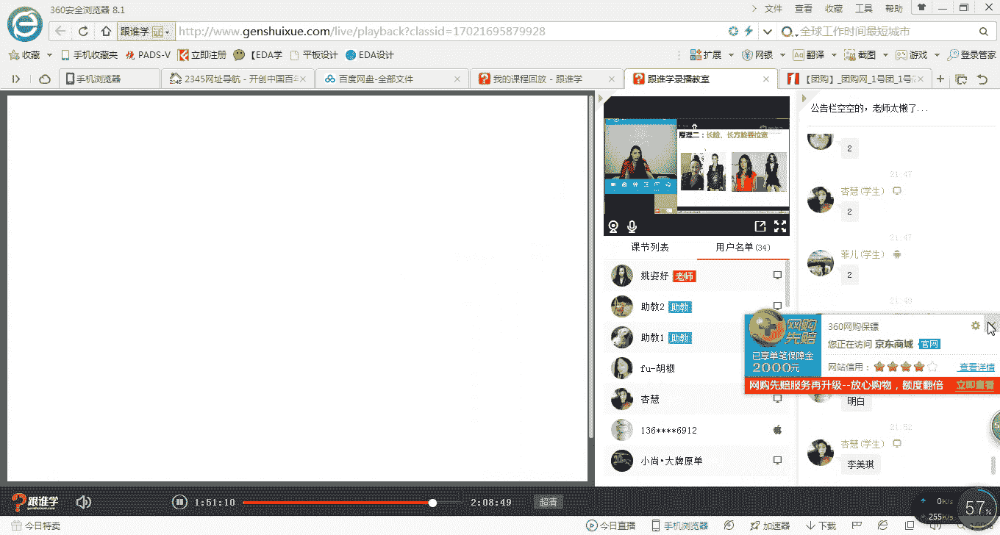

# 1、11服装《搭配秘笈之新版36计》：02脸型与发型的搭配法则

然后。唉。

あ。hello，同学们，大家晚上好。嗯，可以听得到我的声音吗？同学们如果可以听得到的话呢，请打一。OK好的，呃，欢迎星位同学，包括3739同学。那晚上好，同学们啊，看到大家的这样的一个非常准时的时候。

在我们的这样的一个直播间当中。那今天呢老师迟到了3分钟啊，不好意思，同学们，因为今天呢你看到老师的变化了吗？呃，我这万年不变的长直发。然后做了一个这个这个卷发啊。

那也是今天呢因为我们讲到发型与脸型的这样的一个搭配。那我们特意的请到了我们发曲的造型学院的老师啊，来到我们的这样的一个现场也为大家来分享我们今天的这样的一个课程。那当我这发型一做完之后。

我们公司的同事就说，哇，老师你的脸好小啊，说你的脸都小了一半，所以说发型真的太重要了啊。那今天呢那我们就要把这样的一个关于发型与脸型的这样的一个搭配的原理就会教给大家。那接下来呢我首先来自我介绍一下。

因为很久都没有做自我介绍了啊。那虽然我们这个课堂当中部分都是我们的老同学啊，然后呢对资宇老师也比较了解，但是呢依然也有一些新同学进入到我们这样的一个直播间。那OK那接下来呢我来自我介绍。那我是资宇老师。

那是米劳欧国际时尚教育的高级讲师。同时呢也会为一些秀场啊，包括名人啊、明星啊等等。做这样的一个整体形象的造型。那我呢今天不是主角。我今天虽然会为大家来授课。但是呢我们今天有另外一位主主角老师啊。

那我们的老师呢啊我在这里给大家来首先隆重的做这个介绍啊做一次介绍。那我们这个今天请到的发型老师呢，是manson老师。那mason老师呢是八曲教堂造型培训学院的高级讲师。同时呢他也会为很多。

的秀场一线品牌的秀长，比如说迪奥moco，包括郭培高级定制的这样一些时装周，包括秀场会做这样一个发型的造型。那今天同学们来到来我们这样的一节课程当中啊，我相信你们报这一节课，呃。

或者报我们的这样的一个单品课，也是非常的能受益的因为呃麦son老师呢平时如果要是出去做一次造型，那收费是非常的昂贵的那今天呢也有请到了我们线下的一位学员来到我们的课堂当中做这样的一位模特。

那如果以后同学们，你们对于这样的一些造型的机会，非常感兴趣的话呢，以后我们也会在我们的线上来征集。那如果是在广州的同学呢也可以来到我们的学校啊，做这样的一次形象的改造。OK好。

那以上呢就是关于mson老师的这样的一个个人的这样一个从业经验。那同时呢麦son老师也会为很多的名人和。明星做这样的一些整体的造型OK那今天呢我们讲到发型啊，那首先说到发型这件事呢。

呃我相信是大多数人都比较头疼头痛的一件事啊，那比如说好像呃我在线下的课程当中，经常会有同学问到，我说老师你看我的脸特别大啊，老师，你觉得我这个呃身高特别娇小，我应该是留长一点的头发还是留短一点的头发啊。

那包括老师我的肤色很黄，我应该染什么样的发色，那不知道咱们今天教室里的同学们，你们有什么样的发型的困惑呢？如果你们有关于发型的困惑，你们现在可以疯狂的在屏幕上来打字啊，为什么呢？

等一下呢我会随随机的来抽寻我们现在的这样的一个屏幕上的一些问问题，然后在现场呢有一个名额，可以给到大家，请请我们的这个meson老师帮我们来现场的做解答啊。O好，那呃小七同学今天老师的气场非常强大是吗？

因为今天老师为了讲这堂课，呃，也也花了心思啊，细心的来做造型了。O好的，嗯，那小七同学的问题是不知道要长的还是短的，或者有多短。那头发少细软发髻高O老师脸脸长配什么发型。好。

那今天关于这种呃各种脸型的问题。那我等一下会在这样的一个课堂当中为大家来解答。那嗯好的，是呃小七同学，你的尾号是3739把昵称改了是吗？是为了方便老师更在这个更利索的来叫你是吗？O好的。

脸大脸圆适合什么样的发型。O好，那同学们我们就到这里啊，那关于问题呢就到这里。等一下呢我我会在中场的时候，我们的麦老师呢会来到我们的中场为大家来做这样的一些问题的解答。那在前期的时候。

其实我们已经给大家一些。😊，机会呃，来抽取大家的这样的一个问题。呃，那今天呢有5位同学可以这个在享受到我们的麦性老师啊，为他来解答这样的一个发型问题。包括今天在我们现场当中也会有一个幸运的名额。好的嗯。

那让我们等一下拭目以待这样的一个环节，是不是我今天都很兴奋的啊，那平时因为老师都是自己在讲课。今天呢有另外一位老师来讲课，我也特别的开心啊，也非也特别开心，有很多的以后我们会有更多这样的平台。

然后请更多的老师来到我们的这样的一个直播间为大家来分享啊，OK好，那我们首先说到发型的问题。那我们来看一下关于发型当中，我们还遇到哪些这些困惑啊。其实刚才大家都已经提到了说有很多的困惑。

OK那同学们现在你们可以问问你们自己，你们的发型适合你们那我们来看一下，很多女明星，那我们说明星其实身边是有这些明星。😊，有造型师，有专业的造型师会为他们来做造型。但是你会发现，如果这个造型师不专业。

或者说是个造型师对于这个明星的气质把握的不是特别的对的话，她的这样的一个整体造型也会有什么呢？呃，不是特别好的状态，对吗？比如说刘亦菲啊。

大家可以看到我们一直认为亦菲姐姐是非常仙非常清纯非常柔美的这样的一个呃这个女性的形象啊，然后你会发现她剪了这么短的短发之后，看起来她的仙气还在吗？刘仙女的发型果然是不适合她的。OK好。

那我们继续来看汤唯。汤唯被我们称为这种叫什么气质女王啊，非常知性的这种美感。但是你会发现他做了这种特别什么呢？凌乱的发型之后，就感觉好像刚刚出去跟人家打了一架的感觉啊，OK那这是我们所说的每个人的发型。

他真的会对一个人的形象占很大的这样的一个比例。那其实之前呢老师在授课当中呢，也会为大家来分享。我们说呃一个人的话呢，它的形象是由三个板块来构成的那第一个板块呢就是我们所说的服装啊，还有这个饰品。

那我们所说的服装饰品的话指的是什么呢？饰品是指我们的鞋子啊，那我在这里说到的是这种刚需性的那另外第二个板块是什么呢？就是我们的发型和我们的妆容。那第三个板块就是关于我们的气质和举止。

那么有这三个板块来构成一个人完美的形象。那如果你其中一个形象，比如说老师今天穿了还。哎，还可以是吗？啊，但是如果我不去做发型或者我不化妆，那么我的这样的一个整体造型也不是特别的完美。

那我的气质和举举止如果是特别粗俗啊，那也不能构成大家现在看到的。我坐在大家的面前。OK好，那这都是我们所说的不适合的发型，他会对于你有所影响。那么来看一下，到底你一个不适合的发型对你影响有多大。

那例如说大家都知道现在有很多的明星艺人，其实他们的发型都会有专业造型师，那大家可以看到，呃有的时候呢一些明星艺人他们在为了演电视或者是电视电影，他们会做相应的一些造型。那例如说对我来讲啊。

我印象很深刻的是唐嫣在演这个仙剑奇侠传当中的这样一个形象。当时呢他的这个刘他的发际线因为特别的高。他就会把他的这个什么呢？刘海全都。起来了，你会发现整个人看起来脑门特别大，对吗？啊，那包括还有谁？杨幂。

最近其实杨幂在演三生三世这部电视剧，大家有没有看呢？啊，也非常的火。但是呢她的发际线对她来说也有所影响。那包括现在大家看到的在屏幕当中的这个杨幂的这个发型，齐刘海的这样的一个发型。那大家觉得适合杨幂吗？

你们觉得第一个还是第二个更加适合杨幂的感觉呢？OK好，我看到小齐说了，嗯，脑门大，没错，是的，的确啊好，我看到了同学们的答案。很明显。第一个会更加的适合给杨幂，对吗？杨幂的本身的气质。

她其实非常的清新的这种感觉。那因为我们说这种齐刘海的这种感觉，其实她的刘海太过于厚重，这种透气感不够，所以造成整个人看起来这种太的太重量感的这种感觉，包括她的发色又成这种黑色的发色。

所以对她整体来讲的话，都会有所影响。O好的，那我们继续来看，那包括孙俪，这样的娘娘，你们还爱吗？在甄嬛传当中，我们特别爱这个甄嬛，对吗？但是如果你看到这种娘娘们，你们还爱她吗？O好。

那这是我们所说的关于发型，其实她不只是对明星有所影响，对我们大众来说尤为的重要啊，那例如说其实我们有很多的这样的一些发型的这样的一个案例啊，可以给。大家来分享一下。那当一个男生啊。

从这种我们所说的这种看起来就说阿T男的这种形象，画了发型之后，你会发现他变成了韩国暖男，对吗？OK那包括很多的女生啊，其实平时看起来非常的路人甲乙丙丁。但是做完发型之后。

也真的蜕变成了女神的这样的一个形象。好的啊，那这一系列呢对于我们来说，那以上呢给大家分享的这些案例，其实就是要告诉大家，发型对于我们来说非常的重要。那当然同学们其实也都了解。

或者也真的是有感受到发型对于我们非常的重要。所以你们今天才这么积极主动主动的呃按这个特别老师了来做到电电脑面前听老师来讲，今天的这堂课，对吗？好的啊，那今天呢在开始授课之前呢。

我呢首先要介绍到我们今天的两个老这个一位老师，那包括呢我们的这样的一个模特。嗯，稍等一下，我请我们的这个发型老师。那以及我们今天的这样的一个模特来到现场。那今天的这样的一个模特呢是我说的呃。

刚才跟大家介绍到了啊，是来自于我们线下的这样的一个学员啊。那大家等一下可以看一下我们这位心态学员的这样的一个形象啊，那包括呢我们的meson老师也来到了我们的现场。那下面呢有请我们的这两位啊入场。

首先我要在这里先欢迎啊。OK好的啊，大家好ok好的啊，那有请这边啊ok家好，我是meson啊，那这一位呢就是我们八曲的这个教育学院的呃meson老师啊。

那刚才我已经跟大家来介绍到mason老师的这样一些非常丰富的从业的这样一些经验啊。ok好的，同学们都在欢迎我们的这个meson老师。那包括呢我们这一位呢也是我们线下的学员。😊，啊。

那因为我们这次在发布这样的一个模特的这样的一个召集的时候，这个学员特别积极主动的直接来到我们的学校网说老师，我要有这样的一个机会改造。因为他觉得呃对于对于他来说，发型其实影响了他很久很久。那我想问一下。

我们这位同学，你以你以前对你包括现在你其实对于你的发型有什么样的一个想要改造的这样一个想法吗？嗯，就得选择也很。OK好，那我相信其实这也是我们大部分同学的这样一个心声啊。因为发型的问题。

说觉得自己的脸特别圆。那其实我平时我也觉得自己脸挺大的。但是我今天呢下因为我们的这个manson老师呢刚才给这个资语老师做了这样的一个比较自然的水波纹啊，因为大家其实从镜头当中看不太出来。

可是我这个自拍了一下，我觉得特别美啊。O好，那老师这个不要两不要脸的精神又发挥到极致了啊。O好，那接下来呢呃这就是我们这今天的这位模特。那在今天的这样的一个这个授课过程当中呢。

我们的manson老师呢呃中中途会出来给我们大家来解答。那在这个过程当中，他也会为我们这位模特来做这样的一个整体的发型，包括全身的这样的一个改造啊，那我们米兰欧与教堂来联手做这样的一节直播课程。

那也希望同学们能。能够喜欢。那接下来呢让我们再一次用热烈的掌声来新欢送我们两位啊。O谢谢O谢谢。丝ok好的，那等一下呢，我们会再次请到我们的这个梅son老师来到我们的这样的一个直播间。OK好的。😊。

那接下来呢呃我就来为大家来分享今天的这样的一个发型与脸型的搭配的秘籍。OK好的，同学们呃，是不是非常的兴奋啊，哇，终于知道我自己适合什么呢什么样的发型了，对吗？啊，好的，那接下来图就这么小吗？嗯。

这个子墨同学说的是什么意思呢？图就这么小，是说今天这个镜头特别小吗？因为今天呢我们要呃考虑到这个整体的视觉要站起来给大家来展示，所以我们的这样的一个视频呢，做的是比较小的，因为等一下后期的话。

我们的这个韩小老师还会来到我们的这样的直播间。O好的，嗯期待了这节很这节课很久是吗？好的，那今天就满足你们啊，同学们来，那我们继续来看。首先呢刚才我们一直在强调我们说脸型与发型的这样的一个搭配的原则。

那我们说我们要了解自己适合什么样的。😊，发型其实我们首先要了解的是我们适合什么样的，我们自己是什么样的脸型，这个才是最重要的啊。因为我们如果不知道自己是什么样的脸型。

你就不知道你需要什么样的发型来修饰你的脸型。那所以说我们首先第一要认识的，就是我们的脸型。那其实在前一节课当中，我给大家分享到的是关于面部这样的一个气质的课程。

那跟人体的这样的一个服饰的搭配的这样一个板块。那在那节课当中呢，其实已经给大家来介绍到关于脸型的这样的一个问题啊。但是呢嗯我们这个没有讲到细致的去怎么区分你的脸型的这样的一个问题。

那其实有很多同学今天也在这个呃在这个私聊群里呀，或者说呃sorry不是在这个呃答疑群里，包括呢也会私聊到我们的这个助教老师会说到。哎，老师，我怎么去判断我的脸型，那包括我怎么去判断我自己的气质。

那其实呢今天呢我就会在这里先给大先给大家来介绍到如何去分析自己的脸型的这样的一个问题。那我们说到在这7呃在这7种啊8种脸型当中啊，大家可以看到，在这8种脸型当中呢，有两种脸型是相对来说比较标准的脸型。

那第一种呢就叫椭圆型脸。那第二种呢叫倒三角形脸。倒三角形脸呢也被我们称为叫瓜子脸。那包括椭圆形脸也被我们称为叫鹅蛋脸。那你会发现所有的明星现在整容都会往这两种脸型去整容。为什么呢？同学们。

为什么他们会整容整成这两种脸型？因为啊这两种脸型，他们在上镜的时候显得脸特别的小啊。O好，梦丽同学说老师，我有一个朋友就是三角形脸但是他但是他的很多发型都不太好看。嗯。

那梦丽同学你说的你朋友是属于叫倒三角形脸，还是这种正三角形脸呢？啊，是这种瓜子脸呢，还是这种正梨型脸呢？啊，那你会发现呃在明星当中其实有一个呃案例，就是范冰冰。那范冰冰呢它就是这种瓜子脸。

他呢就是做很多的发型都非常的好看啊，那当然如果也不是绝对性的啊，已经有同学说到了，嗯，这个我这个朋友就是这种三角形倒三角形脸，但是做很多的发型都不太好看。那可能还会还跟她的个人气质包。

包括他的发型有没有匹配他的个人气质，也有相关性的啊。ok好嗯。那子墨同学说，我菱形跟椭圆形分不清楚，没关系。等一下呢，我们在这节课当中会给大家来仔细的分析这样的一个问题。好，那我们继续来看啊。

那非标性非标准脸型当中呢有正三角长型长方形正三呃，正方形以及菱形脸和圆形脸。那么接下来呢我们来一一的来看每一个脸型如何去分析以及他们适合什么样的一个发型。那其实我们说这里有一个原则叫什么呢？

我们所有非标准的脸型，其实在最终修饰后，我们都是要往这种标准的脸型去塑造的那例如说你会发现这种长型脸的时候，为什么我们说它是特别长啊，它的比例，我们说标准比例的话叫四长四宽三，而长脸型的话。

它就是极长的这样的一个感觉。所以我们要缩短的它这样的一个长度，就要在什么呢？它的这个呃额头啊在留这样的一些刘海，缩短。它的这样的一个长度从视觉上，那么其实也是往这种标准的这样的一个方向去塑造。

那这是我们所说大的原则。那当然每一个脸型都会有他啊各比较适合的这样的一些发型以及这样的一个造型原则。那我们一一来看OK好，那首先刚才跟大家讲过，我们说如何去分析自己的脸型的问题。

那么首先看到的是一个人的脸型啊，我们可以把他什么呢？画三条线。那第一条线呢就是额头的这样的一个位置，就是什么呢？从这个呃额骨两额骨最宽的这样的一个地方画一条线。那包括呢在颧骨最高的地方画一条线。

包括在下额骨的这个位置画一条线。那这三条线呢就形成了什么？我们所说的这样的一个人脸上的这样的一个宽度。啊，宽度。那最后第四条线就是纵向的这条线，那形成了它的长度的这样的一个问题。

那123这三条线我们为什么要画呢？等一下我来一一的跟大家来分解。那接下来我们来看一下第一条线啊在这个位置，第二条线在什么呢？颧骨最宽的位置，第三条线在下颌骨最宽的这样的一个位置，那第四条线啊。

它有两种情况，一种情况呢是什么呢？它的长啊长与宽成4比3。那么它就是相对来说是比较标准的那么如果它的长和宽是基本均等的话，那说明你的脸是偏短的那我想问大家，你们觉得哪种脸型是比较偏短的呢？同学们。

在八种脸型当中，你们觉得哪种脸型是偏短的？好，子墨同学说，我觉得圆形脸还有没有其他的答案呢？嗯，若雨同学也说圆形脸好的，还有没有其他的答案呢？方形脸嗯，6912同学没错，是的，正方形脸没错。

玉2同学也没错。嗯，是的，那这两种脸型呢，圆形脸和正方形脸是属于脸对于我们所说的标准型的脸型是偏短的。刚才有一位同学提到6912同学说，一定要往两个标准的脸型去造型呢？是的，没错。

我们说为什么有标准与非标准的这样的一个界限。那其实那我们为什么认为标准的脸型好看？那是因为它的比例是最符合我们现在的审美的。

所以我们所有的造型的标准都会把非标准造型这种标准的脸型才能符合我们人的这样的一个视觉的审美观啊，那但是其实在我们中国或者是我们亚洲人的审美的这样的一个审美的脸型是以这种椭圆形或者到三角形为美。

但是在西方他们会认为方形脸很美。所以你会发现李纹啊，sorry刘纹。包括这个呃吕燕，那包括很多的超模呃，巩俐明星，他们都会什么在西方发展的特别好，特别受西方人的喜爱的原因，也是跟他们的什么呢？

脸型有关系。他们会认为这种方形脸，它是非常具有现代感以及力量感的这样的一个象征。你会发现有一个节目叫爱上超模这个节目呢基本上如果是第一胸部特别丰满的。第二，就是如果是这种瓜子脸的。

基本上活不过三期就下去了。因为什么呢？因为这个摄影师啊，他们的这种眼光的话，其实也是接近于国际化的啊。那包括我们说超模，其实我们是要追求什么呢？国际化。所以说在我们中国这种审美瓜子脸网红脸。

那太过于丰满的胸部都不太能什么？不太适合做这种超模所谓的超模，为什么呢？啊，不好意思，同学们，因为呃有点咳嗽啊，因为这种瓜子脸，它不具备这种这种特别有现代的有力量的这种感觉，或者说它不够个性。

它太过于传统了。那第二，胸部太过于丰满用。但是说老师这不是标准的这不是好事儿吗？为什么它它是呃我们所说的这个不好呢？因为太过于胸丰满了这种这个线条的话，它在着装的时候，在上T台的时候，在拍照的时候。

它驾驭服装的能力相对来说是比较弱的。它穿太过于直线感的服装的时候，它会让这种服装变形，所以这就是为什么我们所说这种方形脸啊啊，或者是说这种相对来说比较扁平的这种身材，它更加受到西方人的喜欢。

也受到国际的这样的一个审美观。嗯，O这个问题就解到解答到这里啊，O好，那我们继续来看那这是我们所说的，我们在呃判断脸型的时候，我们可以画这三条线，画这三条线的目的是为什么啊，包这四条线的目的。那首先。

这两条线其实我们就可以判断自己的脸型是偏长还是偏短的了。那这三条线，那每种脸型它的这种这三条线的长度与宽度是不同的那我们接下来来看那第一种方形脸。那我们来看一下方形脸当中呢啊这里是方形脸的女士。

那我们来自测一下什么样的脸是方形脸。第一，前额和下颌骨长度大约相同相同。那大家可以看到啊，呃方形脸的话，你会发现第一条线额头的这一条线颧骨的这一条线。

以及它下颌骨的这条线基本上都是宽度相等的而且下颌骨的这个位置是特别突出的那老师其实就是属于这种脸型啊，O那这种的话就是属于方形脸，这种方形脸给我们的感觉是比较硬朗的这样的一个印象啊。

这就是为什么同学们你们认为老师掉到水里都没有人救的原因。那就因为我整体给人感觉太过于硬朗了啊，太过于汉子的这样。一个感觉。那这是我们所说的方形脸。那如果你们的脸型有是这种感觉的呢。

那同学们你们可能会给人感觉有点这种中性或者是有点硬朗的这种感觉哦。那我们看方形脸呢，其实它有分两种，一种叫正方形脸，一种叫长方形脸。那这种脸型其实它是属于长方形脸还是正方形脸的同学们。

你们可以来回答我一下吗？如果是长方形脸型打一，如果是正方形脸，请打2。OK好，同学们快速的来回答我一下。因为我们今天课程非常的满啊。好的，嗯，是的，没错，长方形脸为什么呢？

因为它的长度是大于它的宽度的这个就是我们所说的长方形脸啊，那同学们你们可以去自测一下自己是否是属于长方形脸。那么长方形脸呢，他有的有的人的这种长方形脸。

它的这个下巴是比较尖的那有的人呢是不一定是成这种方形的这个不作为我们重要的什么参考长方形脸还是正方形脸或者其他脸型的这样的一个依据。我们只需要把握第一第二第三这三条线就可以了。同学们ok好。

那我们继续来看方形脸，它适合的这样的一个发型。那从这个我们所说长发嘛啊，女生的话都希望自己是长发飘飘的这样一个形象。那包括或者说很多男性，他会认为女性是长发的时候，更加的有这种女性的魅力啊。

那比如说老师可能就留这个长发，留了很长很长时间啊。那这种方形脸呢呃它的这样的一个长发，它可以留哪一种呢？同学们有没有发现长方形脸的发型有哪些细节的问题呢？

能不能发现同学们你们可以来在屏幕上啊跟老师来回回应一下啊，你会发现长方形脸它会什么呢？在下颌骨的位置啊，那包括什么呢？它会留有这种什么呢？纵向刘海的这样的一个线条。是的，啊，子墨同学说遮住脸。好。

那我们遮哪儿呢？我们遮脸的话是遮这儿吗？或者遮这儿吗？啊，那因为方形脸的话，它的下颚骨是比较突出的，所以你会发现它需要修饰的问题是哪个地方，它需要在下颚骨的这样的一个地方去柔和它啊，那所以说呢方形脸啊。

方形脸它需要修饰它的这个位置。那包括呢我们说方形脸它其实什么呢？这个地方其实也是呃鬓角这个地方有一点点方。啊同学们，所以他在留这种发型的时候呢，还是需要记留这个发际线这个位置也需要去修饰它。

要不然的话呢呃你你会发现这个方形脸，它把头发全都扎起来的时候，真的就像一个电视机一样啊，方方正正的看起来OK那这是我们所说的方形脸，它适合的长发。第一种呢，其实它是适合啊留有这种纵向线条的刘海。

并且呢它是可以修饰到这种什么呢？这种长卷发啊，这种长卷发它可以修饰到这种下颚骨的位置。那包括这种有层次感的直发，那这种层次感它是可以修饰到哪里，是不是你会发现他把它的两边的这个脸一包。

就像老师也是一样的道理啊。同学们老师的话如果不修饰我的脸型的话，其实我也是特别典型的这种长方形脸。但是你会发现我用什么呢？刘海盖住我的这样的一个发际线，包括我的这样的一个头发进行这样的一个修饰。

是不是老师的脸线。那跟这个屏幕当中的脸一模一样，就变成椭圆形脸了。那这个就是长这种就是我们所说的方形脸的长发的这样的一个适合啊，适合的长发。OK好，那我们继续来看第一种同学们，第一种是这种什么呢？卷发。

第二种是这种有层次感的长发。目的是什么呢？都是为了第一可以修饰我们这个地方啊，第二，它可以修饰到我们的下颌骨的这样的一个位置。OK好，那我们继续来看。🤧方形脸它适合的短发。那其实有同学问过我说。

老师方形脸是不是只能用这种长发来盖住我们的这个下颌骨的位置呢？no当然不是其实我们所说的方形脸它也可以留短发。只是他需要注意的问题是什么呢？不要留这种什么呢？

完全没有修饰下颌骨这样的位置的这样的一个发型。呃，星辉同学说，老师可以演示一下那四条线正确的位置是怎么测的吗？其实啊新星辉同学你可以拿一条这个呃，你可以用一个皮尺。

或者是说用一个呃铅笔让你的朋友帮你来什么呢？测一下这四条线。那你其实基本上你可以用目测也可以目测的出来。第一呢你看你的这样的一个额头的这样的一个宽度。第二，看你的颧骨的这样的一个宽度。

第三是关于你下颌骨的这样的一个宽度。如果你这几个宽度都是相等的，包括。你这个位置都是什么比较突出的，那么你一定是方形脸了啊，但是长方形还是正方形，它取决于你的脸的长度，能理解吗？秦辉同学O是的，啊。

好的，小七同学说拍张正正面自拍照再用直尺量一下，这也是一个方法啊，那小七同学你说的这个这个方法是没有问题的。但是一定要切记什么问题呢？就是一定要把头发全都露出来。同学们，你一定要把头发全都露出来。

要不然的话，你的判断的脸型有可能是不正确的。O好，嗯其他同学如果听到的话，也可以回应一下老师好吗？嗯，O好，那这是我们刚才说到的这个测量的这个问题。那我们继续方形脸它适合的短发。

那大家可以看到在屏幕当中，你们认为哪一个发型会比较适合方形脸呢？123。OK好的，子墨同学说第三个，那小七同学也认为第三个，那其他同学呢嗯尼可同学觉得第二个是吗？好的啊，二和3O好的，同学们是的。

没错啊。那我们说这个方形脸呢，因为它的这个下颌骨特别的宽，所以呢它其实是比较忌讳留这种什么呢？只是上面的这种短发，只做这种上面的这种像精灵的这种短发一样啊，那下面呢你不去做任何修饰的话呢。

它其实会影响到你的整体的这样的一个脸型的视觉的美感。那所以说呢方形脸其实是是需要在下颌骨这个位置保留有一定的头发来修饰到它这样的一个边角处。O好，那大家可以看到的第三张图片是不是也是一样的问题呢嗯。好。

6912同学说，李宇春的方形脸短发造型怎么解释？跟第一个造型有点像，但是气场很像。6912同学这个问题很好啊。那我们说李宇春它本身就是一个特别的案例，为什么这么说呢？因为李宇春。

他不需要展现他的女性的美感。他展现的是中性的这样的一个美感。我们说到的这种标准的美感审美的趋势，跟一个人的气场是无关的，能理解吗？同学们，那如果你想要气场，你还可以剃光头，我觉得是更加有气场的啊。

但是李宇春的话，因为他本身走的叫中性风，所以他的发型呢相对来说都是什么呢？比较短，对两边是完全无修饰的。O好的，嗯，6912同学说呃还有孙俪，现在也是短发。那孙俪她的下颌骨的这样的一个鬓角。

我们所说的这种呃这种呃下颌骨的这样的一个位置突出的其实不是特别明显的。大家可以去观察一下，他远远没有我们图片当中的这个。明星，那包括这个安吉丽娜朱莉，她的这样的一个脸型的这个下颌骨突出。那其实我们说了。

并不是说所有的人你一定不能去留这种短发。我在这里讲的只是什么呢？我们最好的这样的一个状态。例如说你不想让自己的脸看起来很大，或者说你不想让自己这个地方看起来很锋利的这种感觉。那么你就可以留这种发型。

那在图片当中其实是很明显能够呈现给到大家的这样的一个视觉效果。那6九同学6912同学，你现在可以回答我，你认为123这三张图片当中，你觉得哪一个是更加有美感的。或者说你认为哪个看起来会更加的女性化。

更加的柔美啊，那很明显，那刚才其实有同学说到，第二个和第三个，对吗？因为第一个从视觉上我们明显看到就觉得它特别方这个脸，所以我们会觉得这种脸型并不是说它不美，而是它太过于难。男性化能理解这个概念吗？

OK那这种脸型因为它过于男性化，那就像李宇春一样，过于男性化。OK好的，嗯，是的，第一个脸明显能看出来很方。那这就是我们所说的个人喜好问题了。如果你想展示你自己的方脸，那么你就可以留这种发型。

因为这种方脸的话，它的确会给我们感觉是非常的中性和硬朗的那这个就不做多多做解释了啊。6912同学，那我给大家讲到的这样的一个方法呢？其实就是为了显得我们的脸比较柔美的这样的一个感觉。OK好。

那么继续来看，那方形脸它适合留的刘海是哪一种呢？那其实我们说方形脸，因为它本身脸就特别方。那同学们你们能告诉我，你们觉得在这三张图片当中，哪一个刘海是比较适合给到方形脸的吗嗯。🤧好呃，小七同学。

包括孟丽同学觉得是第二个是吗？好，那刚才孟丽同学还说到第三个，那大家觉得第三个适合吗？啊，同学们，你们觉得第三个适合吗？好，我要揭入答案了啊。同学们很明显，第一个和第三个是不是有相似之处。

第一个和第二第三个是不是全都是这种齐刘海。是的，这种齐刘海它也会让我们的脸型显得过方啊，它也会让我们的显脸型显得过方。所以你会发现这种我刚才跟大家讲到第一张图片当中的我们所说的纵向的刘海。

它有拉长脸型的效果。那这种原理叫什么呢？叫纵向拉长的这样拉伸，它会显长的这样的一个原理啊，O那所以这种齐刘海的话，其实相对来说不是那么适合给到方形脸的，特别是这种比较厚重的齐刘海。

那这种也是非常厚重的这种齐刘海，它会把你整个脸第一，它没有完全修饰。那第二的话它会让你这个地方也暴露在什么呢？呃这个我们的视觉视觉的这样的一个审美当中，所以的话它也会完全没有修饰状态。那虽然。

这个头发它是属于长发，但是因为它是属于长直发，所以对于你的脸型也是完全没有修饰的。这就是为什么今天有人说老师，你做了这个头发之后，显得脸很小，那是因为我平时的发型全都是这种长直发。

所以呢看起来它也是什么呢？没有那么的显脸小的这种感觉，包括它其实是修饰不到这样的一个位置的。O好，那这是我们所说的方形脸的刘海的这样的一个留发。那我建议同学们可以方形脸可以留这种纵向的刘海的这种感觉。

那包括呢呃其实如果想要留这种刘海的话，或者是说留长一些的刘海，那一定要留一种刘海叫什么空气刘海，不要留这种什么呢？很厚重的刘海，发量很多，显得很笨重。O这是方形脸的这样的一个刘海的问题啊。

那有没有同学能现在就自测自己是方形脸的，有没有？如果有的话，请在屏幕上打一。同学们啊嗯。え。好，那如果还不知道自己的脸型的话，那可以等下我们去看去看一下后面你们到底是哪种脸型。O好的，小七梦丽。

包括呃小尚也是你们认为自己都是方形脸是吗？嗯，好的，呃，微薇啊不清楚自己的脸型的话呢，等一下可以你刚才一开始就来到我们的课堂当中了吗？可以自测一下自己是什么脸型。好的，那我们继续来看那方形脸的盘发。

那大家都知道方形脸的话，它本身其实是一个比较呃这个相对来说比较硬朗的这样一个脸型。那如果方形脸在盘发的时候，他依然其实还是需要坚持一个原则，就是什么呢？用刘海来遮住什么呢？你拉长用斜刘海来拉长你的脸型。

包括用什么呢？发量来修饰你的下颌骨的这样的一个位置。你会发现当他把所有的头发全都扎起来的时候，完全把脸暴露在出来，暴露出来的时候，她的整个脸看起来是不是都非常的。方那罩薇的话，他其实就是一个长方形脸。

那老师跟赵薇一样扎起来这个头发的时候，跟他这个地方一模一样。所以我很少会把头发扎起来。同学们啊，O是的，赵薇的话是方形脸的，它是长方形脸啊，OK好的啊，这是关于我们所说的方形脸的盘发。

我还是建议同学们啊，如果方形脸盘发的话呢，你即使把后面的头发盘起盘起来，也依然要坚持用刘海来修饰你的什么呢？这个位置发际两边发际的位置，包括要修饰到你你侧面啊，侧面的这样一个位置会整体拉长你的脸型。

好的，这是关于方形脸的这样的一个问题。那我们继续来看方形脸的男士。今天有男同学吗？同学们我们男同学如果在的话呢，可以出来冒个泡泡啊。好，我们来看一下方形脸的这样的一个男士的脸型的话呢。

其实呃在男士脸型当中。方形脸属于标准脸型。同学们啊，好的，忘晨忘忧在风晨同学在是吗？好的，那方形看你的这个脸型好像是有点方，看你的这个头像看看起来好像有点方啊，那方形脸的男士呢。

它其实在这个方脸呃在在脸型当中，它是属于这种标准的脸型。那也就是说我们在审美男士的脸型的时候，我们认为方形脸它其实是标准脸型啊，O好，那方形脸其实跟女士也是一样的。好，呃，子墨同学说方的肥成圆的了是吗？

因为这个脂肪过多是吗？O好，那我们来看一下方形脸男士它适合的这种发型，那第一，头顶长侧后短，什么意思呢？方形脸呢，因为它本身脸特别方，其实它是需要把你会发现现在特别流行一种发型叫什么呢？

叫有一点叫莫西干头的这种感觉。它会把两边剃的特别短，然后中间留的。特别长。那这种呢其实适合给到方形脸的。为什么？因为他的这种发型中间长的时候，它其实是可以拉长一个人的脸型的。

所以这种的话是比较适合给到这种方形脸的那包括呃第二个后侧头发短，头顶长其实也是一样的道理啊，就是说的是是这个感觉是一样的它其实都是要两侧头两侧的这种头发的短啊。那包括第三种小平头。

那包括第四种叫贝克汉姆，其实就是刚才我讲到的叫什么呢？墨西干头。那大家都知道这个机冠头发型吧。那他最终的目的其实就是为了要拉长他的脸型，把头顶的头发蓬松起来，然后拉拉长整个脸型。

OK那这是我们所说的方形脸，男在男士当中的方形脸。你会发现，其实呃方形脸的话，男士的话它不需要过多的去修饰。包括男士的话，他也没有什么我们所谓的这种哎要用头发来遮住这种下颌骨啊，因为本身方形脸。

它就是这种什么呢？阳刚的象征，男人有这种脸型。本来我们就觉得是一种美的O好，嗯，那这是我们所说的，这是我的我是一号的那一种，这是角度的问题，你是我怎么看你像三号呢？风尘同学。

我觉得你特别像第三号从这个头像当中去看啊，O是的，子梦同学头顶高就可以了。没错，嗯，O这是方形脸男士的这样的一个发型，那我们继续来看圆脸。那刚才其实我们刚才有很多同学说到了啊。

圆脸与方脸都是脸型比较偏短的对吗？没错是的，那圆脸和方脸，它的区别性在于哪里。大家可以看一下啊，那其实刚才我。给大家讲到的一条线，两条线，三条线，那圆脸其实也是一样的。它的这三条线基本上也是相等的。

但是它有一个问题是什么呢？它的这个位置不是骨头，它的这个地方线条其实相对来说是比较圆润的。但是呢它的脂肪看起来是比较多的，就是非常的饱满的这种感觉，所以我们经常会说包子脸嘛？来形容这种圆形脸。

那包括圆形脸，它给我们感觉也是非常的可爱的甜美的这样的一个气质所在。O那这是我们所说的圆脸，那有没有同学是圆脸型呢？同学们啊，那我们来看一下圆脸它如何自测啊，刚才老师已经跟大家讲过了。

脸的长度和宽度大致是相同的。但是呢它的什么呢？丰润丰润丰满圆润丰满的下颌，也就这个地方它其实不是骨头。它相对来说它其实是脂肪的这种感觉，有没有圆形脸，咱们教室里没有圆形脸吗？圆形脸的女同学吗？OK好的。

嗯，691同学是圆形脸吗？好的嗯，老师看到了啊，嗯，可能是吗？微薇啊，那如果你的脸看起来是非常的饱满的，然后又给人感觉是非常可爱的那么你有可能就是圆形脸了啊。OK好，那我们继续来看嗯。😊。

可能是啊植宇同学说也有可能是那包括胡娇同学也觉得自己是什吗？但是我从胡娇同学，我看你的头像，我感觉你的侧面这种感觉好像你的这个骨头好像比较明显呢？就是下颌骨的这个位置比较明显。

看起来不像是这种圆润的感觉。嗯，那微微啊，如果你是额头窄的话，有可能你是另外一种脸型。等一下，我在后面会给大家来介绍到的。嗯，好的，那我来看一下圆形脸，它适合什么样的发型。

那圆形脸其实呢它也适合这种什么呢？长发。但是他有一个问题是什么呢？就是它的长直发也不是特别好，它需要有一定弧度的这样的一些卷发来修饰他的脸型，包括长这种圆脸的话，它不太适合中分，中分的话。

其实会让他的脸显得更圆，它适合偏分，并且呢也是这种侧的这种刘海，它会让他的整个脸变成什么呢？拉长的这种感觉。那这一位的话就是非常非常点。形的圆形脸的这种感觉。那大家从这个图片当中很明显其实可以看得出来。

第二张会更加的什么呢？显他的脸长。那第一张会显得他的脸更圆啊。O好，这是我们所说的第一种长形脸啊，这个圆脸型的长发，它适合这种侧边的这种感觉。那第二这种我们所说的圆脸呢，其实它相对来说更加适合长脸型。

没有那么适合这种圆这种短发啊，这会这更加适合长发啊，没有那么适合短发。因为这种长的呃因为这种直的短发呢，它会让脸看起来也很圆。啊他们可以留留这种短发吗？也可以，但是也需要一定的方法和技巧。

等一下我会给大家来展示图片啊，但是从短发和长发上来讲，我们感觉其实短长发会更加适合给到这种圆脸，对吗？嗯，OK好，那我们继续来看。🤧圆脸它适合的短发。那在图片当中。

同学们你们认为123哪一种会更加适合给到圆脸呢啊？好，同学们123，你们认为哪一个会更加适合给到圆林？嗯，好，很多同学都回答了第三个是吗？好的嗯，那我看到大家的答案了啊。那同学们。

那这第三个的发型大家都觉得很明显就感觉适合他了。没错，为什么看一下这三条线啊，123这三条线。第一条和第二条你会发现它的这种什么呢？线条的感觉成叫横线拉伸的这种感觉。

所以它会让你的脸变得更圆啊这个发型我们所说的侧分刘海，包括它有一点点微微的卷度，那这种侧分的话，它其实也是起到拉长脸型的效果啊，那包括它这个也需要去修饰它的这样的一个位置。

所以说其实圆脸跟方脸的这样的一个线方法上有相似之处，第二什么呢？叫拉长线条的这样的一个方法。也就是说圆脸和方脸要拉长啊，那这是我们所说的圆脸的短发啊，刚才这个子墨同学说的非常好，跟方脸一样都。

是鞋分是的，没错，斜分的话呢，它会有这种我们所说叫纵向线条的这样一个效果，会看起来拉长脸型啊。梦丽同学说一和二看起来也挺好的呢啊。O好，那我来解答一下孟丽同学这个答案啊。为什么一和二看起来也挺好。

那是因为一和二的这个模特的脸，它不是真正的圆脸呢？啊，如果她是真正的圆脸，其实他们两个人都是属于一条长，叫椭圆形脸。如果他们两个人的脸是圆脸型的话，那么你会发现这两个头发就像什么呢？

这真就是这个就特别像那个一个饼旁边顶了几根刺啊，为什么这么说呢？因为如果一个人的脸很圆，他两边这种泡面式的小碎发，他会让他的两这个拉这个横向会拉伸的更宽，所以他的脸看起来会更短。

而这种发型它形成了纵向线条，所以看起来会更长。O好的嗯，这就是为什么嗯能理解了吗？孟丽同学啊，因为这两位同这两个模特呢，他其实他们的脸型不是属于圆脸型啊，O好，那我们继续来看。

圆脸的这样的一个呃刘海的问题哈那圆脸刘海当中，你们认为哪一个会更加适合给到圆脸呢？一和2。那其实我们说到了啊，刚才其实在方脸当中，老师已经讲到了。我们说方脸的话其实不太适合留这种齐刘海，而圆脸的话。

其实蛮适合留刘海的，为什么呢？因为圆脸它给我们的感觉是非常可爱的，所以圆脸的人其实是适合留齐刘海的。齐刘海它给我们的感觉是不是可爱的感觉？嗯，O是的，非常好，同学们啊，那所以说其实圆脸它是适合留刘海。

但是它不适合给到什么样的刘海，就是今年这种留点狗啃式的，今年其实很流行这种我们所说的狗啃式的这种刘海，但是这种刘海呢它其实虽然有这种狗啃的层次感。但是它没有这种薄厚的这种透气感，所以你会发现这种什么呢？

薄的透气感的刘海会更加适合给到圆脸，所以这是我们所说的圆脸的刘。海的这样的一个呃技巧。那如果有圆脸的同学也不用气馁，你们也其实可以留刘海，但是需要注意的问题就是什么呢？要透气感。嗯，好的，空气刘海没错。

嗯，不适合厚重的刘海。是的啊，那我们继续来看，男士当中的圆脸啊，那么来看一下，刚才呢呃我说这个风尘同学其实挺像圆脸的啊。那同学们你们可以看一下风尘同学的这个头像，从远处看，不点开的话。

真的有点像圆脸的这种感觉啊，那我们说圆脸的男士呢，其实它跟方脸的造型方法是不是很像呢？同学们同样的一个问题，也就是说什么呢？他们也需要把两边剃掉。然后呢，把什么呢？中间的头发留长。

起到拉高脸型的这样的一个作用。OK风尘同学不用难过啊。好，那这是我们所说的，其实在圆脸和方脸的造型的技巧上是非常的相似的啊。同学们是的，头发。来拉长一个人的脸型，起到我们所说的叫弥补的这样的一个作用。

嗯，O好，那我们继续来看啊。那刚才呢以上呢给大家讲到了两个脸型啊，一个是关于长脸型的，一个啊一个是这个方脸型的哈，一个是圆脸型的那这两个脸型呢，它们的造型方法其实是非常的相似的，都是什么呢？要拉长脸型。

也就是说比如说比如说啊因为方脸呢它的下颌骨是比较这个突出的啊，那这个并且呢它这个地方呢还是比较方的，所以它需要发际线的这样的一个位置需要有头发来修饰，包括呢下颌骨的这个位置也需要有头发来修饰。

那圆脸其实它没有下颌骨，但是它看起来脸特别的丰满和圆润，所以看起来脸也是比而且也是比较偏短的，所以它在造型的技巧上都需要留这种侧分的发型会更加适合给到他们。因为这种侧分，它接近于纵向的线条，所以它会。

拉长整个人的这样的一个脸型的这样的一个问题。那包括呢再加上用头发来修饰两边之后，那他的整个脸型就会往椭圆形的这样的一个方向去塑造了。那从刘海的这样的一个角度问题上来讲呢？

方脸型其实不是不是特别适合留其刘海，圆脸型会更加适合留其刘海。但是呢圆脸型它适合留的时候叫空气的这样一个刘海，不太适合留这种很厚重的这种刘海。那都是为了目的都是什么呢？增加它整个人的透气感啊。

O那包括盘发，那其实不管是圆脸还是方脸盘发的话，都需要什么呢？去用侧刘海来修饰脸型的这样的一个问题，都不太适合把整个什么呢？脸都露出来。那么如果圆脸型它要把这个脸全都露出来的时候。

它其实也需要拉高和蓬松它头顶的位置来拉长他的脸型。那么这就是什么呢？长脸啊这个 sorry。同学们老师口误啊，这个圆脸和方脸它需要什么呢？拉长脸型的这样的一个技巧。那这是我们所说的这两个脸型。

它流发型的这样的一个秘籍。那其他的脸型我们要讲的呀，同学们，新回同学，那接下来还有课程。但是因为今天的这个课程时间，它是比较长的。因为呢接下来呢我们教到了我们这样的一个答疑的环节啊。

那下面呢我们就有请到我们的这样的一个老师啊，我们的这个meson老师有请到我们的这样的一个课堂当中，其实我们刚才是不是在课堂之前就跟大家来讲到了，我们说今天呢会回答5个同学的问题啊。

那首先呢同学们我首先呃同学们可能现在看不到屏幕。因为呢我先要从我们屏幕当中去挑选一个问题啊，今天给大家是承诺到了说我们的这样的一个课堂当中要请到一位要在抽选一个问题啊。

okK那我来看一下咱们这个问题当中哪一个问题呢？

想被回答的可以这个举手啊。那包括我们的老师呢，可以去我的办公桌上，帮我拿一张我们的问题的列表过来。然后呢，等一下呢就请我们的mson老师啊，好，稍等一下同学们啊，我先这个把你们的问题翻到上面去。

我们随机来抽取一个，让我们的这个mson老师呢来这个回答一下大家这样的一个问题啊，我们就选择这样的一个问题吧。6912同学啊，你是今天晚上的幸运观众啊，好，6912同学的问题是头发少细软以及发际高。

那么接下来呢我就要有请到我们的这个meson老师来到我们的直播间了啊。O好，请我们mson老师过来嗯。好的。😊，现在我们女陈老师OK好，陈哥好的嗯。😊，那呃我们这个空间有点略微的挤，但是没有关系啊。

我们都可以看得到的。OK那同学们，那现在呢我把这个PPT先展示出来。那刚才呢6912同学是我们的幸运观众。我首先呢我手上拿了一张纸，大家可以看到啊，这上面有5个问题，这5个问题呢都是我们的呃线上的。

就是大家现在教室里的同学们，你们的其中的5位啊这个这样的一个问题。那我今天呢刚才一在一开场的时候呢，也承诺到大家说今天会有一个幸运的名额。那刚才呢呃曼茜老师不好意思，我又增加了一个问题啊。好的没关系。

那啊O好，那我们先来看一下第一个问题，头发少细软以及发际高的这样的一个问题。那曼菜老师可以帮我们解答一下吗？如果是头发少细软，发气高怎么办？呃，其实这个问题也挺简单，嗯。

只要你是把那个发际线能把它遮盖住，就能够去调整到你那个最重要的一个面际前面这个问题。其实他刚才说到的发际高这个问题，是不是糖嫣和阳幂，其实都存在这样一个问题，就是发际就发际线比较高。

然后脑门比较大的这种感觉是吗？洗因为你看的角度不同，有时候也会有不一样，所以这个具体的情况要因人而异。那那他刚才提到的说这个头发细软的这样一个问题怎么去解决呢？头发细软的话。

因为女嗯那个天生的基因我们不能改变。那我们可以适当通过一些呃洗护的产品，还有一些造型的产品去做一个补助，令到我们细软的头发能够产生一定的蓬松度，嗯，令到他的一个饱满度增加。

就会显得那个发量就不会那么坍塌。显得那么少。那其实这位同学是69。

6912同学说了，我是圆脸老师。那刚才您回答的这个问题的话，其实就是6912同学。他说他是圆脸型。然后呢再总结一下啊。

它的这个发量是这个比较细软的那刚才这个6912同学有没有听到麦son老师的这样一个答案呢。那刚才麦森老师说了，那你的发型呢其实是需要一些蓬松的这样。因为你的这个我们说发质是天生啊，是基因所带来的。

是改变不了的的啊。那只能通过后期的这样的一个造型。例如说使用一些蓬松的这样的一些产品啊，这种发型的这种产品来达到这样的一个目的啊，OK好，那6912同学呃，不知道这个答案的话，你满意吗？啊。

OK那接下来呢我们就进行到我们这个几位幸运观众的这样的一个回答的问题当中了啊。那我们第一位同学玉儿同学在不在呢？好的嗯，玉儿同学在吗？育儿同学如果在的话，请打一啊。那你如果你们今天没在的话。

是有点可惜的。可能咱们玉儿哦在是吗？好的，头像是你吗？玉儿同学嗯，好，那其实呃玉儿同学也有提供照片给我们啊，大家可以看到，我可以把这个你的照片放上来吗？玉儿同学啊，那我下面呢会放你的照片出来，你介意吗？

嗯，好，那这位大家可以在屏幕上看到这位呢就是育儿同学，那玉儿同学说呢我刚剪了短发不久，自己也不知道适合不适合。那麦贤老师，你可以看一下，那在屏幕当中的左边的这张相片呢。

就是我们育儿同学长发的这样的一个形象。那现在是他剪了短发之后，你觉得这样的一个发型适合她吗？呃，我个人感觉是。对比长发来说，短发是比他长发更适合的。嗯，为什么这么说呢？啊，刚才我们就回答了这样一个问题。

就是说我们那个发际线会高吗？嗯额头会显露的比较多，明白啊，刚这位同学的一个案例也是这样子。嗯，因为直头发的话呢，它会有重量往下坠下来，就会显得我们顶部额头这个边缘的地方呢嗯和直头发一起配衬的时候。

显得发量就更少更细更贴了。明白，他剪了短发以后呢。重量减少了以后，就能够令到他顶部的一个发量蓬松起来，会显得稍微多一点。那我们看起来呢它整体就不会呃发量这么少。O好的，啊。

那不知道育儿同学有没有听到这样的一个答案。那包括其实在座的这样的一些同学们，你们也可以听一下这个答案。我觉得对于我来说都是非常受用的啊，那么专业的发型老师真的是不一样的啊。

那告诉我们呢啊那那说到呢为什么这个短发会更加适合育儿同学，因为长发它其实是存在这种重量感的，那同时呢育儿同学刚才也存在的这个问题，就是发际线有一点点高，对吗？啊，我可以建议你去直发际线吧。

O那因为这个发际线有点高，所以呢你这种长发的这种重量的话，它会太过于拉伸，它就会让你整个人看起来其实没有那么的有精神啊，我认为其实你的短发看起来会更加的有气质的这样一个感觉，是吗？对对。

高的一些呃女孩子的话呢，建议可以选择一些齐刘海之类的。OK这种类型的一些造型呢会不容易配合他的一些脸。明白啊，也就是说其实我们的额头，其实按照我们的这样的一个整体造型上来讲的话。

我们也叫讲讲究一个叫扬长避短。那其实你的额头是比较是你的属于你的短处，那么你其实可以用遮盖法来给他进行这种修饰，对吗？对，因为就像这位同学玉儿同学的一个眼睛非常的有声，嗯很圆得很漂亮。嗯。

所以用齐刘海的话呢，他更能凸显他的眼睛，这种啊水灵灵的一种感觉。哦，明白这个会更能够凸显他一些优个人的优势。对对好的，更漂亮。是的，月儿同学有没有听到这样的一个答案，是不是很开心。啊。

我们的麦son老师呢说你的眼睛非常水灵灵的哈。OK好，那6818同学说，早知道我也提问了，不用不用担心啊不用难过啊，6818，因为还有机会以后我们会有这样的很多的这样一个课。好。

那我们也希望能够更多的呢跟我们的这个专业的发型老师来给我们这样做这个整体的造型的这样一个搭配的讲解。OK好，那我们继续来看啊，那适合齐耳短发吗？鱼耳同学继续回答，就继续问到这个问题。

其耳的话嗯不建议OK可能会但你的脐耳是指到哪个位置，耳朵以上呢还是到耳垂的位置。好，那呃月儿同学可以在屏幕上去答。那我们继续先回答第二个同学的问题啊。好，第二个同学的问题呢非常的多。

而且呢很密他这个问题答上来的时候，我看了眼睛都花了啊，但是还不提供相片。呃，这个这位同学呢叫妮克啊，那我们来看一下妮可的同尼可啊尼可同学啊也是我们的这个老同学了啊。

尼可同学呢他说小个子是留长发好还是短发好，或是中长发适合好，你真是非常纠结的样的一个同学，关白我们可以足以去帮这位同学解答。时女生在有一个问题比较困惑的时候呢，可能产生的疑问也会特别多。好的。

那我们请我们的麦森老师来帮尼可同学来解答这个问题。嗯，这里我们先帮妮可同学呢先解答第一个问题。个子小的话呢，绝对是选择稍短的同发好。但并不建议你是绝对性的一个短发。像超短发那一种的呃，个。不大哈。

反而可能就会把脸部的缺点全暴露了。例如说今年特别流行那种特别短的那种短发，其实也不是特别好，对吗？啊，对，那个真的要看脸型非常完美，还有就是个人要玩的是特别个性的那种明白，一般在生活习惯当中。

个子小的女生呢建议还是嗯中短发比较适宜一点。因为这样的话呢，造型能够有变化，也会比较百搭一点，O好的，了解了。啊，那我们的尼克同学有没有听到第一个问题呢？那我们的麦老师呢建议你留中长发为好。

不要过短或者过长，因为过长的话呢，其实会有点压迫。我们所说的对那过短的话，他其实对于你的脸型要求会比较高，包括你的着装的个性的程度，你整个人的着装的这种个性的程度，对于你来说是有要求的。

所以中长发会更加适合你。那第二个问题是鹅蛋脸偏分中分哪个显年龄小直发。好还是剪放好哼okK而但脸的话呢，本来它就是一个相对比较接近标准脸型的一个脸型。其实它那个也是比较百搭的嗯。中分会比较显个性。嗯。

偏分的话呢，相比中分那种个性感呢，它就会稍多了一点休闲和优雅的一些感觉。OK呃，显年龄小的话呢，这个就没有绝对的一个说法了。嗯，而且你要看你中分的一个长度，你是去到哪里才好界定。

那如果他说他要留中长发的话，他有留哪种发型会比较适合他们。中长发的话嗯刚才女的是小个子哦。嗯，对，是的，小个子中长发脖子以上OK好，脖子以上，然后她是留偏分还是中分，她很纠结这个问题。呃。

如果是比较纠结的话呢。像偏分会不会更加适合这种大众的这样的一个感觉？中分的话，它相对来说是要求这种个性的，是吗？对，嗯，中分的话就比较适合是直发的这型了。O然后偏分的话，就比较适合卷卷发。对嗯，O好。

那其实这里有一个答案了啊？尼可同学如果呢你是想要留中长发的直发，那么你可以中分，如果你要是想留中长度的这种中长的长度的卷发，那么你其实可以留这种我们所说的偏分啊，那尼可同学。

那这个问题有没有替你解答清晰呢啊，那我们的麦y老师真的是非常敬业哈，非常的仔细。那么接下来看第三个问题，鹅蛋脸哪种刘海显年轻时尚，需要刘海还是不要留刘海的好。想要年轻的话呢，是有刘海会更好一点。OK好。

对没有刘海的话呢，整体它是以厚重感的一个设计为主，嗯，它会显得那个呃。感觉是比较大气场一点那种。嗯，O但是这个要搭配的就是你的身高和你的着装，它才能把那个整体的发型的一个感觉。

就是整体造型的感觉才能带出来。嗯，如果是在日常生活当中，你要凸显这种感觉的话呢，除非你一直是走这个个性的风格。嗯，否则的话呢能够生活化自然一点的话呢，还是建议你们会有一些偏短一点的刘海。

就是到眉毛这个位置会比较好一点。O那其实偏短一点点的刘海，它也会比较显年轻，对吗？对对对，嗯，好的，那尼克同学那你的这个问题你非常的详细啊。那我现在其实我可以替你总结一下了啊。对是的。

你比较适合留中长发的中长度的这种卷发侧分啊，我觉得是可以的，然后留一点点刘海。这个刘海的话可以这个到眉毛的这个位置啊。如果你想要直发的话，那就中分为好，那就不需要刘海了，对吗？对对对，嗯，O好的。

尼个同学这个问题就回答到这儿。OK好，那我们继续来看第三位同学的讲样的一个问题啊。那第三位同学的是王琼同学，王琼同学在吗？如果在的话呢，请打一。好的，那我们首先来看王琼同学的第一个问题说，老师。

我想知道我适合长发还是短发，直发还是卷发哈，我们女生真的都是非常纠结这个问题啊，那男生眼里好像直发和卷发没有太大的区别，是这样的吗？男生来说因为他可能就找对会道好OK好的啊。

那么首先来看这个王琼同学王琼同学呢他的这个头发呢现在是短发，有可能啊，那他有两张相片，一张是短发，一张是长发。而且呢王琼同学到目前还没有出现。那是不是王琼同学没有在呢？那如果你没有在的话呢。

那我们就根据你的问题来解答你的这样的一个呃这个问题了。那我们来先看第一个问题是嗯。麦老师嗯，我们同学这个照片上看的话呢。我们同学的脸型其实那个颧骨的地方呢会比较凸显。嗯，包括腮骨的地方呢。

那个骨勒感也是偏强的。嗯，呃像这类型的一个脸型的话呢，我们建议是搭配一些柔和自然的一些纹理。嗯，就是我们有微卷的一些波浪，嗯，会更适合他。嗯，因为如果是完全直头发的话呢，它的一些缺点会容易更凸显出来。

嗯，所以建议的话呢，它是会做一点卷卷发的一个效果会更适合它。OK好，那您觉得他现在短发好还是长发好呢？就是他以他现在目前的这两张照片来看的话。嗯。现在去对比的话呢。

应然是短发会比他那个长发短发会更好看一点。嗯，但如果是配合这个卷纹来说呢，是建议他做一个到肩膀，嗯，肩膀以上到下巴以下这一段的一个中发的一个长度的一个设计会比较好一点。这样的话呢配合那纹理的时候呢。

就更好去修饰他的脸型，他的也会显得脸更小一点。嗯，好的，那王琼同学，你的问第一个问题呢，可能你没有在啊，那但是我现在还是帮你总结一下。那王琼同学，你的第一个问题就是长发短发，直发还是卷发。

那因为你的脸型是颧骨比较高的骨骼呢比较突出的这样的一个感觉。所以呢我们麦y老师呢建议呢其实你是留这种中长的，就是我们说肩膀这个位置到下巴以下中间的这一段的这个位置，特别而且呢要有一定的纹理来修饰。

也就是说其实你要有点弧度的这样的一个感觉，来柔和你的面部。的这种棱角感。那因为你的这种棱角感，它会给人感觉过于硬朗。那这种发型它其实是有柔和你整个人的效果。是啊？对对嗯。

那包括其实我觉得他的呃对他的现在短发的话呢，相对来说也会比较适合对他现在的这样感觉比较比他的种长发要好。因为他这种长发的话，看起来这个地方额骨颧骨是这个额头这个位置很窄，颧骨非常突出，对吗？对对对嗯。

O好，那我们来看露起来就是是的是的是的啊，那我们来看第二个，如如何确定自己适合染什么样的发色。那其实刚才我们所呃回答到的这一些问题呢，同学们，你们其实可以一一去对号入座的。

因为我相信在我们教室里有很多同学你们都是属于这样的一个问题。那老师因为在线下上课，其实真的见过很多同学们啊，那有的同学真的是颧骨高的这样一个问题，我觉得其实都可以参照刚才曼信老师的这样的一个解决方案嗯。

好，小七同学说也是高颧股。那么你也适合刚才那样的一个方案。那包括如何适合自己染什么样颜色的头发。那我相信也是我们教室里这四十几个人呢，这这这些同学们你们都关心的这样的一个问题啊。

那所以说呢那同学你们可以好好听一下这个答案了。嗯，OK那秦老师，那么第二个问题，相信呃也能够帮其他同学去解答一下吧，这个问题不难解决，你我们只要找一些。暖色调的衣服和找一些冷色调的衣服，嗯。

我们穿上去对着镜子照一下，看看哪个颜哪类型的颜色衣服和我们肤色更般配。嗯，我们更显得那个肤色是更紧致。更呃。更贴近一点的一些感觉的时候呢，那那个颜色就是你你所适合的一些色调。嗯，O像我们举个例子说。

偏暖的颜色我们会有黄色，有橙色，嗯，还有一些橙红这样的一些暖色调。嗯，像这类型的颜色来说呢，呃如果我们穿这样的衣服放到身上的时候，我们脸部的一个肤色会显得更紧致，更细嫩的时候呢，明白啊。

这个就和我们的肤色是相般配的一个色调。那我们在选择颜色的时候，就可以往这个方向去走。嗯，如果适合这个颜这个感觉是相反过来。如果把黄色的衣服放到身上，肤色会显得更暗哑，更灰暗，更有那种一种是没有精神对。

没有精神感觉的时候，那你可能就是偏向于冷色调的一种肤色。明白据统计来说呢，我们亚洲人绝大部分呢都是属于那种啊偏冷。色调的一个肤色。OK所以一般性来说呢。

我们选冷色调就会比选暖色调更容易去搭配我们的一个肤色。嗯，好的，那如果是冷色调的话，哪一些发色的这种色还是属偏冷的感觉呢。嗯嗯现在来说比较流行的像日韩那些喜欢的颜色呢，都偏见一些闷青嗯，还有一些呃灰律。

嗯，还有那种紫灰色，那么也是这几年的一些淡热的一些发色。嗯，好的，嗯，那大概了解的这样的一个问题了。那同学们那因为那曼茜老师刚才讲到说说到了这样的一个问题，就是说冷暖色调的这样的一个问题。

那站在其实我们在服装搭配的角度上来讲，我们不建议说同学们你们非要去定自己适合到底是说要穿暖的颜色还是冷的颜色。因为我们认为化了妆之后。

其实是可以改变很多人这样的一个用色的规律的那如果这个站在发色的角度上来讲，如果你是呃不化妆那。其实你可能选择一些偏冷色调的这样的一些发色，会更加适合到我们亚洲人。

因为我们亚洲人80%可能都是偏肤色偏冷色的这样的一个感觉。那么也就是说灰绿啊、闷清啊，这种冷色调的感觉。包括酒红色，我觉得好像也是偏冷色调的，是吗？对对嗯，那是的。

都是比较偏这种冷色调的那所以会更加适合到大家，那如果同学们你们平时不怎么喜欢化妆啊，那你可以其实去选择一些偏冷色调的那如果你平时是有化妆的这样的一个倾向。我认为冷色调和暖色调这样的这样的一个概念。

其实相对来说就比较模糊，那其实同学们可以大胆的去选择，但是一定要化妆，那包括整体的造型都非常的重要。OK好，那第三个问题，我们来看一下发量多啊，然后呢。发量多呃，这个发质硬留的留长的话，如何打理。

才能让头顶不会被压的很扁。也就是说他的头发很多，然后很硬，留长发的话经常会什么呢？压就是会垂坠，然后会很扁嗯。这个这个问题就简单了，嗯，层次我们可以把它是提高一点，嗯，修剪的层次高的时候呢。

顶部就容易被支撑起来。另外一个配合一点烫发去制作纹理的时候呢，就会令到我们原有的一些缺点，能够把它去得到改善。明白，嗯，那所以说如果要是长头发的话，其实呃还是要就是如果发质比较多，然后发质又很硬的话。

要剪短，因为重量会比较剪短到不一要，因为他是想要留长嘛，嗯留长的时候，其实我们只要把它去烫出纹理，然后层次适当去提高，我们就能够改善它这样的一些O好的，蓝曼强老师刚才给到解答了。

就说如果你想要这个留长发，也可以把你的层次感啊做出来。然后呢做一些卷发，可能就会不会显得这个地方是很扁平的了这样的一个问题。对对对对，嗯O好，那这是王琼同学的问题。那王琼同学可能没有在。

那等一下你看回波的时候呢，可以看到我们为你剪。答了这样的一个答案了。嗯，OK那我们看一下第四个问题啊。那第四个问题呢还是子墨同学子墨同学，我刚才有看到你哦。那么来看一下啊，老师我脸适合什么样的发型。

什么颜色。那子墨同学的这个问题，我们麦森老师来帮他解答一下。嗯嗯，我看看这位同学，嗯，也是额头会略高一点。嗯，对，这里的话呢，建议你把你是目前的一个发型吧。嗯，如果是目前的发型来说。

建议你可以把刘海再修短一点点。嗯，然后发型在侧边的话呢，建议你是用一些卷纹微卷的一些纹理呢去进行搭配。嗯，对发现你的脸型也会嗯有一点点，对，有一点颧骨长方形的这种感觉。对对对，嗯会比较凸显。

O也就是说你的刘海，子墨同学你的刘海需要再长一点。其实就是刚才老师讲到的，你要使用这种叫侧分的纵向的刘海。然后来拉长你的脸型。那第二的话，你需要在这个地方其实做一些规卷，来什么呢？

修饰你的下颌骨的这个位置OK好，子墨同学说有点佩服自己，没化妆，没美图就敢发上来给你的这个胆量鼓个掌，好吧？嗯，OK那第二个的话，他问到适合什么样的颜色。他现在的颜色适合他吗？你觉得。嗯。

因为现在个颜色像是有点褪色，偏泛黄的一种感觉。我不知道是灯光的问题，还是呃本来的发色就是这样。O如果是原有的发色，就是这样偏黄的一个颜色的话呢？嗯，建议就可以把色调去打换一下。嗯。

O那其实刚才我们已经解答过关于发色的这样的一个问题了。子墨同学，其实如果你现在的发色是已经退过的话呢，那你其实可以再去什么改变一下你的发色。因为这样的一个发色，它会显得你的肤色比较的暗沉显得，没有精神。

那另外的话，我建议如果你要是以现在的这个发色发色出门的话，一定要化妆，它会让你的精神和气质看起来会更加的饱满一些。O好，那子墨同学这样的一个问题，呃，您有还还有没有其他问题呢？那OK好。

那菲儿同学提问了啊，说老师能不能推荐一下好的护发素或者是洗发水的品牌，这个比较难吗？呃，这个倒不难嗯。okK好，那呃这个呃有没有一些比较经常会使用到的一些品牌会比较好用的洗发水推荐一下。嗯。

如果是喜欢欧美风的一些更清爽一点的感觉的话呢，可以推荐卡姿。嗯啊。如果你喜欢日系那种轻盈感的嗯呃柔软感的嗯，那可以推荐那个眉女胖给你嗯，或者是资生堂的也不错。OK好两个一个是果喜欢欧美感觉的话。

那你可以选择卡姿，如果你喜欢这种日韩的这种感觉，轻盈感的话，那你选择资生堂。好的然后那是这个我们刚才才这个回答了很多个问题啊，那包括呢也会也为我们这个屏幕当中的这些同学们也会给到你们一些这个答案。

那我们继续来看刚才子墨同学说呃改成什么样的一个发色。那其实刚才老师已经跟你讲过了，说呃比较因为我们亚洲人的肤色偏黄，比较适合冷色调，灰绿的嫩青的都可以，包括酒红的。

那这种冷色调的发色会比较适合我们亚洲人的肤色。那如果你是经常化妆出门的话，我建议你的发色，其实现在可以再深一点。因为你这种发色跟你的脸的肤色太过于接近了，就会显得整个人没有精神。

那其实老师的这种发色的话，也经常会以前会经常去染，那所以也会呈现你这种感觉，那我就会把头发加深。OK这是我们所说的第四个问题。那我们还有最后一个问题。今天啊，那我们继续来看嗯，涵涵同学的问题。

涵涵同学在吗？说老师我比较清瘦，面色有点黄啊，轮廓不饱满适合什么样的发型？那其实她的发量是比较偏少的。然后另外的话她的她的脸型，您可以这个看一下他比较适合哪种发型呢？脸型嗯其实他的脸型也算蛮好的，嗯。

没有特别明显的修束感。对，嗯，那么因为发量少的问题呢，建议你是可以把头发略短，嗯，然后烫出纹理，建议把刘海那个地方是剪短，OK把刘海的话更能修饰他现在的一个额头的一个状况。嗯，好的。

那涵涵同学可能也没有在啊，那如果涵涵同学在的话，嗯也可以听一下这个答案，那那刚才老师已经给你这个建议了。因为你的发量比较少，那建议呢你可以把你的头发啊，然后剪短。

然后呢这个刘海的这个位置可以修饰一下你的额头是吗？对嗯看同学那个背景好像是他是做老师的。哇，你分析的真的太仔细了，看起来好像真的有点像好像是在教室里的这样的一个感觉，应该是这样自拍的。嗯。

所以因为有自然卷纹的话呢，当然你们的长度可以不要剪太短，到其间的一些。中发那个也会容易调整它的一个状况，嗯，配合那个卷纹的时候，发量就能够蓬松，能够轻盈起来的时候，就会显得发量多一些。嗯。

而且上课期间你需要一些干练的感觉的话呢，我们可以建议你用一些斜分的刘海。嗯啊，这样我们在绑头发的时候搭配这样的一个造型的时候，也能够凸显老师的那种干练那种干练的感觉出来。O好的。

不知道涵涵同学有没有理解到我们这个mson老师给到你的建议啊，那今天呢真的是非常非常感谢我们的麦son老师在我们这个课堂中间呢啊然后给我抽出一些时间。

因为等下呢他还其实还在改造我们的这个刚才的那个线下的学员，所以呢时间也非常的紧迫。那我们现在就以热烈的掌声，先欢送一下我们的麦son老师，等一下呢他还会回来给我们展现他改造的这样的一个模特的形象。

那同学们可以把你们的小花花刷起来啊。如果有花的话，O谢谢你麦son老师O好，谢谢啊，那我们等一会儿见。OK好的，嗯，好。😊，OK好的，嗯，那同学们呃，已经等了很长时间是吗？

那其他同学的话可能会觉得哎老师我这次没有机会听到这个专业的发型老师来帮我做这样的一个解答。没有关系。同学们啊，因为以后呢我们还会有更多的这样的一些课堂会给大家来呈现。

那丰富我们的这样的一个课堂的这样的一个程度。好的，那我们继续来刚才其实已经讲到了两个脸型，一个是方形脸和圆形脸。那同学们还记得吗？我们说到的方形脸和圆形脸的话呢，他因为什么呢？骨骼是比较突出的方形脸。

所以他需要修饰脸型。而圆形脸呢，它是比较饱满的，它其实也需要什么呢？拉长它的脸型，因为脸型都是比较偏短的。所以呢这是关于长脸和方脸，它需要拉长的这样的一个原理啊，OK那我们继续来看。

那如果方脸和圆那这是我们所说这两种脸型的这样一个问题。那我们继续看下一个脸型啊，那刚才呢我们讲到了。长比较短的脸型。那现在呢我们就来看比较长的脸型应该怎么去处理啊。好。

那我们现在在屏幕当中看到的这样的一个图片呢，你会大家会发现这位女士呢她的脸型就是比较偏长的那我想问同学们，在这两张图片当中，你认为一和二哪种会比较更加适合这位女士的这样的一个脸型呢？嗯，好的。

那我们看一下啊，有同学回答了说第二个会更加适合给到这个嗯屏幕当中的这位女士的脸型是吗？为什么呢？那同学们为什么呢？我看到了大家的答案了啊，那同学们你们可以在屏幕上去打字。

那我继续来给大家来分享怎么去自测这样的一个长形脸啊。好，我们看一下那长脸型呢，它的这样的一个宽度上来讲，其实123这三条宽度的话呢，基本上没有太大的这样的一个差别。但是它的脸是极长的。

你会发现普遍长度大于宽度，这肯定是没有疑问的啊，那如果我们说标准的脸型是4比3的这样的一个长与宽啊。那长脸型的话，它可能就能达到4比2了。就是脸它是极窄的而且它极窄的时候，你会发现整个脸看起来就极长啊。

所以说这是我们所说的长脸型的这样的一个呃视觉的效果。那同学们你们可以看一下自己是哪种脸是不是属于这种长脸型啊，O好，那刚才同学们已经回答了这样的我的这样的一个问题啊，说下面横向扩展啊，下面横向拉宽。

脸就没有那么长了啊，你们这三个人是这个回答的挺好的啊。呃，尼可同学说横向扩展。然后6912同学说横向拉宽，然后风优同学就是风一泉同学就是说脸就没那么长了啊，感觉你们三个人好像在一块儿，然后在对话似的啊。

OK的确是这样的一个嗯很配合很硬景的确是这样的啊。那同学们那我们说你会发现第二张图片当中，它的发量是往两边蓬松的，所以呃形成了我们所说的横向扩张，整个人看起来什么呢？他的脸就没有那么长了。

的确是这个原理啊，这是我们所说的长脸型，那我们继续来看，那如果是长脸型的话，他还可以留哪种长发啊，那我们看一下长脸型当中的长发呢它其实不是特别适合这种非常直的这种直发，它比较适合有这种纹理感的这种卷发。

那套道理是相通的，这种纹理感，而且这种纹理感是往两边膨胀的，往两边蓬。这样的话它就会形成横向扩张的这样的一个视觉效果。所以就拉宽了了他的脸型。那么整体看起来呢他的脸就看起来没有那么长。

所以如果是长脸型的话呢，那你比较适合的是这种横向扩张的，有纹理的这种卷发。而长直发的话呢不是特别的适合OK那么继续来看。那长脸型它其实可以说是非常非常适合留刘海的这样的一个脸型了。为什么这么说呢？

因为长脸型的话呢，它的这样的一个脸是过长的，所以呢它可以留刘海来什么呢？缩短它的脸的长度，但是你会发现依然是这样的一个问题。即使是留刘海，它也不是说特别适合这种长直发的刘海。因为我们说这种长直发的刘海。

它依然还是形成了一个效果，叫纵向拉长这样的一个视觉效果。它依然会让你的脸会拉长。那所以说即使你是留刘海，也是要什么呢？把你的两边的头发膨胀起来，它才会让你整个人的视觉效果看起来是比较饱满的。

所以这是我们所说的长型脸的留刘海的方法。那即使你是留刘海的话，也要什么呢？拉宽你两边的发量膨胀起来，才会让整个视觉看起来更加更加饱满。OK那我们继续来看啊，那长脸型。盘发怎么去盘？长脸型盘发。

大家大家觉得第一个和第二个哪个会更加适合同学们。你们认为第一个还是第二个会更加适合盘发呢？嗯，好，尼克同学，包括6912同学，星星，包括风尘、4589威尔幸会同学，你们都认为第二个好。

那只有一位同学刘云同学觉得第一个好那么来看一下啊，那刘云同学，那我来给大家来解释一下，为什么同学们都说第二个好，没错，是的，第二个比较好。因为第二个他的什么呢？盘发的发际没有那么高。

那我们来看一下第一个发际过高的时候，而且他的前面的额头这个位置没有任何的刘海来修饰他的什么呢？长度，也就是说他们没有留刘海来扩短，就缩短他脸的这样的一个长度，再加上他发际又很高。

所以其实又形成了一个叫纵向拉伸的效果，所以他的脸看起来会更长。那所以说如果盘发的话，长这种长脸型盘发的话，他的发际不宜过高，而且他还是适合留刘海来进行盘发的那这是我们所说的长型脸的这样的一个盘发。效果。

那我们继续来看啊。好，长脸型的短发啊，那我们刚才说到了长脸型有适合的这样的一个长发。也就是说我们需要这种横向扩张。那长脸型适合的短发的效果是什么样的呢？同学们，你们觉得哪一个比较适合长脸型呢？同学们。

嗯。好，嗯，69212同学说都可以。那其他同学说第一个比较好，那为什么第二个不好呢？同学们。嗯嗯嗯。为什么第二个不好呢？那大多数同学都回答了第一个。第一个是没有问题的啊，那第二个就有问题了吗？上窄下宽。

上窄下宽这个问题还好啊。同学们啊，1888同学，那其实这两个啊，我们来看一下，其实都可以6912同学还是非常聪明的啊，那这两个其实都可以。同学们，因为我们说了长脸型的话，他第一有刘海缩短了。

他的这种什么呢？脸的长度，第二，他两边膨胀，拉宽了他的宽度，所以都是可以的啊。OK好，这是我们所说的长脸型的短发。那我们继续来看长脸型的男士的这样的一个适合的发型，那我们继续来看。

那你会发现长脸型的人其实是不是跟刚才我们所说的脸比较偏短的人，就起到一个相反，他在脸这个发型修饰的时候是不是要相反呢？那同学们刚才我们说了脸比较偏短的人，他需要拉长。那。脸偏长的人。

他是不是就需要缩短他的脸的长度？那长脸型的人，你会发现他的头发不易过高过长，其实他是有刘海的，他也是侧的就是他是平着往侧边分的，他不会拉高，或者是说他的刘海直接放下来，起到一个什么呢？

缩短他脸的这样的一个效果。那么大家现在可以看到这个呃图片当中的李易峰的这样的一个发型就比较适合给到这种长脸型，大家可以看到，他即使是拉高，他也不是特别的高。那包括他会往侧边分啊，那包括这种什么呢？

放下放的刘海都会比较适合长脸型的男士O这是长脸男士的这样的一个发型。那咱们同学们当中啊男士本身是比较少的那长脸型的应该又更少了。好，那我们继续来看。那刚才说到的是长脸型的男士，那我们继续来看菱形脸。

其实刚才有很多同学说到说呃，我觉得我的颧骨也比较高。那么其实如果你是属于这种同学们啊来看到这样的一个屏幕当中，脸的长度稍大于宽度。也就是说其实它也是4比3的这样的一个标准的比例。

但是呢他的这样的一个脸型，第一条线是比较短的，第二条线比较长，第三条线也比较短。也就是说你会发现第一条和第三条都短。第二条是最宽的那是什么意思呢？也就是说我们颧骨的位置是最宽的位置。

下巴是比较尖的那包括呢它的这样的一个发际线的位置也是比较窄的，太阳穴的位置是偏窄的那大家可以看到零至菱其实它就是一个菱形脸的代表，就像我们所说的叫钻石型。

其实这都是菱形菱的这样的一个脸菱形脸的这样的一个脸型。那么所以因为它的太阳穴窄就会显得颧骨过高。那么其实刚才我们的me老师在课堂。当中也帮大家来分享了说这种菱形脸的话呢，它不太适合留这种直发直场发。

为什么呢？它会让它的那种它修饰不到它这种骨骼感，那这种骨骼特别突出的感觉，它会给人感觉很硬了。那我们来看一下菱形脸，它应该怎么去留发型。那我们现场有没有是菱形脸的同学们呢？好，那我来看一下啊。

那大家可以看到这三条线啊，123中间这条线特别宽。啊，那我们继续来看啊。那同学们你会发现第二张是不是很明显比第一张要看起来有这种什么呢？修饰脸型的效果呢？啊，星星同学说是的是吗？那星星同学。

你看一下你现在的头像的发型，是不是跟angelababy的脸型呃，这个发型特别像。那因为这种长直发说了啊，刚才跟大家分享到了颧骨比较高太阳穴过窄，所以呢它就会什么呢？长直发它是修饰不到你的脸型的。

所以就没有那么的适合给到菱形脸啊，那所以说如果你是菱形脸的话，你需要一些有纹理的长发啊，或者说有纹理的这种发型来修饰到你的这样的一个呃太阳穴凹陷的位置，甚至弥补到你的这个什么呢？

颧骨过高的这样的一个问题。那也就是说第一。你在你的什么呢？额头这个位置的发量一定要蓬松，而不是什么特别少。如果特别少的话，它起不到一个弥补的作用。第二，它遮盖不到你的颧骨的这样的一个问题。好的。

新会同学说你也是菱形脸是吗？那么今天老师已经解答了发型问题。那你可以参考这样的一个问题。好，那我们继续来看。这个是菱形脸的长发啊，那我么来看一下菱形脸的短发。我们来看一下同学们啊，那为什么第一个不适合。

第二个适合呢？有没有人能够回答我呢？为什么第一个不适合第二个适合呢？🤧老师喝口水啊，同学们。有没有人能回答老师这个问题？He。好的啊，那大家的这个答案说第二个让他的脸变成了倒三角形的标准了啊。

改变同学说的啊，那尼克同学说第一个重复脸型的缺点，呃，头顶蓬松ok修饰不了高颧骨，颧骨遮住颧骨问题。OK好的，同学们啊，那我看到大家的答案了啊。第一个。你会发现它的这种什么呢？有这种棱角感的发型。

你会发现它这个发型好像带灿纹这种感觉。它其实也是有角度的那本身菱形脸的脸，它其实就已经属于这种骨骼非常突出的，有角度的这种感觉了。所以你会发现这种发型，它是让你的什么呢？脸的这种骨骼感会更加明显。

而且大家也说到了，第一，它不能什么呢？遮盖住颧骨。第二，它不能遮盖住额头的这个位置，其实这个问题还比较好。冯神同学这个位这个位置其实它已经弥补了。但是它这个位置没有修饰到。

包括这种这种像这个这个这种棱角感的这种发丝，它其实是弥补不了，就是对它柔和脸型的作用没有太强烈。那你会发现这种发型它其实是能够柔和到它脸部的线条，而且有一点点纹理感。那所以这种短发会更加适合给到菱形脸。

那因为它两边是比较蓬松了，这个地方又可以修饰到颧骨的这样的一个问题。O所以第二种会。加适合给到菱形脸的这样的一个问题嗯。好，林心玲没刘海的造型比有刘海的造型好看。🤧6912同学。

你说你看林志玲没有刘海的造型，比有刘海的造型好看是吗？老师刚才有说你一定要留刘海吗？嗯，6912同学。好，那我们继续来看。那我刚才我强调的问题是，太阳穴比较窄的人，一定要什么呢？在这个地方蓬松啊。

蓬松你的这样的一个太阳穴位置，需要弥补到这样的一个位置。那另外的话你可以用发丝来修饰住你的这样的一个颧骨的这样的一个问题，并不是说一定要有刘海。O好，那我继续来看菱形脸啊，那菱形脸的这样的一个发型。

它有刘海的这样的一个发型也会分为不同的这样的一个刘海的感觉，对吗？那例如说这种特别齐的刘海，你会发现它特别齐的时候，反而会凸显你的颧骨的问题。而这种相对来说比较自然的有这种纹理感的这种发型。

那其实它会柔和到你面部的线条，所以看起来会更加适合给到菱形脸。那菱形脸我们说过了，不太适合给这种这种特别长直发。因为它看起来你的脸型会比较骨骼突出的这样的一个感觉。OK好，那我们继续来看。星位同学说。

我感觉我的下巴不尖，那我们说了，其实并不是所有的人的脸型都是非常非常标准的这种菱形脸或者长方形脸，没有特别特别标准的这样的一些方形脸，长方形脸圆形脸，其实有的时候很多人的脸型叫复合型的脸型。

那我们在判断自己的脸型的时候，其实我们就是按照大概的大致的方向呈现的是一个什么样的形状来判断。那如果你不是属于这种椭圆形脸。那你在判断你自己到底是属于哪种脸型的时候。

其实你最终的目的是为了你要往这种什么呢？椭圆形脸去靠近。如果你的太阳穴是窄的，那么你就蓬松它，那它看起来就像椭圆形的这种感觉了，对吗？OK好，那这是我们所说的这个大家刚才提到的这样的两个问题。

那我也给大家来解答了啊，那6912同学不知道有没有这个替你解答了这样的一个问题。那包括星位同学，那刚才老师也说过了，并不是所有的人下巴都特别尖。但是如果你斧子符合太阳穴窄，颧骨高。

下巴这个位置不是特别的下颌骨这个位置不是特别突出。那么你有可能就是菱形脸。好的，那我们继续来看啊，菱形脸盘发。那大家可以看到啊，菱形脸盘发的时候，林志玲他就是属于这种什么呢？菱形脸。

那你会发现他完全把他的刘海全都收起来的时候，同学们你们觉得很好看吗？刚才这个林志玲啊，刚才6912同学说，林志玲没有刘海的时候，比有刘海的时候好看。那大家现在可以看一下，对比一下。

你们认为哪种感觉让林志玲看起来更加的柔和和女神的这种感觉。那很明显，第二个和第三个看起来要比第一个要好，为什么？因为第一个太阳穴地方太浅呃，太窄，而且感觉他的脸型很不饱满。

第二个他的这个颧骨的位置很突出，所以整个人看起来这个骨骼感都非常的明显，那远远没有第二个和第三个。看起来很柔和的这种感觉。OK这就是我们所说的菱形脸盘发的这样的一个问题。

那菱形脸呢其实是需要弥补到这样的一个位置，所以你会发现它的发型都是在这个位置做弥补的这样的一个作用。OK好，那这是关于菱形脸如何去盘发。那我们继续来看菱形脸的男士的发型。那大家可以看到的是。

其实呃我们说男士对于这个发型的这样的一个修饰重不重要，当然也重要。可是他往往没有女士要求的这么高。比如说我们需要这个显脸小啊，把这个地方遮住啊啊。

然后把这个地方弥补的很很很很这个很饱满啊啊等等这样的一个位置问题。那你会发现菱形脸，它其实呃也会比较适合这种什么呢？长一点的头发，但是他需要的问题是什么呢？他不要把两边剃掉。因为两边剃掉的话。

会让他这个地方更窄，所以说菱形脸它其实需要两边蓬松，大家有没有发现两边蓬松，两边两边相对来说比较蓬松，那他的头发都需要蓬松太阳穴这个位置。

大家可以看到在这图片当中的发型基本上都是属于太阳穴蓬松的这样的一个问题啊，来修饰到它的脸型。那同学们这是关于男士的菱形脸的这样的一个造型啊，那大家有没有有没有？这个听懂这个菱形脸的发型的问题呢。

同学们如果听懂的话呢，请打一好吗？那我看一下大家的这个吸收的情情况啊。好，行那我们继续来看。嗯，好的，那同学们都已经懂了是吗？好的，那我们继续来看，那么来看一下正三角形的这样的一个呃这个女士的这个脸型。

那正三角形当中呢，其实梨形脸是非常典型的这样的一个呃这种就说像我们所说的叫正三角形。那其实正三角形也被我们称为叫梨形脸，它这个特点是什么呢？脸的长度大于宽度其实也是属于4比3。但是呢菱这种叫梨形脸的话。

它是这个位置窄。同学们啊，这个位置窄就像一个梨子的形状一样，你会发现太阳穴这个地方比较窄，然后这个下颌骨的这个位置是最宽的。所以刚才有同学说到，哎，老师我觉得我这个地方窄。

那么你有可能是菱形脸也有可能是梨形脸啊，那这两种脸型你都有可能。那这是我们所说的正三角菱形脸，你会发现董卿其实它就是一个正三角形脸。那么他的所有的发型都是什么呢？有一个原则叫蓬松这个位置。

那他几乎大家可以想象一下，春节电换，我们会让董卿的这样的一个形象啊，基本上都是这样的一个发型，对吗？那我们继续来看啊。那你会发现梨形脸的话，它最宽的位置是在最下面的这条线，而最上面的这条线呢是最窄的。

好，那我们继续来看，那同学们，你们有没有人是属于这种脸型的呢？嗯，如果你们是属于这种脸型的，那么就要好好看了啊。那我来看一下梨形脸它不适合哪种脸这个发型，它适合哪种发型，同学们。

你们觉得如果你们觉得上面的适合，请打一，下面的适合请打2。好，你们觉得上面的适合请打一，下面的适合请打2。好，我看到大家的答案了啊，有打一的，也有打二的嗯。呵。😊，好，那同学们如果上面的适合的话。

你们觉得为什么适合你会发现这种发型不是在重复它的脸型吗？看起来不就又像一个梨子的形状了吗？啊，都不适合吗？好，那我们继续来看啊，那你会发现第一种发型的话，其实它这个地方是比较窄的而这个地方是比较宽的。

你会发现它重复了它原本的发型，而第二个发型，你会发现它是上面蓬松了下面越来越小的，它其实是比较适合给到梨形脸的那我们来看一下啊。来，同学们，你会发现这两个发型哪个地方？这个发型它是下面最宽。

而这个发型是上面最宽。我们说其实在脸型与发型当中有一个原则叫反向弥补原则。同学们反向弥补原则，也就是指什么意思呢？如果你上面窄的时候，你其实就要加宽这个位置。如果你的脸特别长的时候。

你就要拉宽你的脸型啊，嗯，你如果你的脸特别短的时候，你就要拉长你的脸型，这就叫反向弥补原则啊。好，那我们继续来看一下啊，那所以说第二种会更加适合，因为什么呢？梨形脸是上面窄，所以它需要蓬松上面。

而它的这个地方特别宽，所以它需要用头发来修饰下面能理解这个概念吗？同学们如果可以理解的话，请打一好，那我们继续来看啊，如果你们理解的话，请打一，那么继续来看正三角形它适合的长发。

那同学们你们觉得哪种会更加适合它呢？一还是二呢？那么来看一下这两种头，这两个发型其实都是什么呢？都是有刘海，对吗？长度也基本上都是差不多的那你会发现哪一个对于你你看起来觉得它弥补哪型的效果会最好更好呢？

🤧好，现在大家现在对于这个图片的话呢，可能一开始还分不太清楚。好，那我们继续来看啊，第二个会更加适合。第二个会更加适合，因为第二个它上面是更加蓬松的，你会发现它这个地方看起来很圆润，而这个地方呢。

它又有这种什么呢？有层次的头发来弥补到它的下颌骨这个位置。所以这一款发型会更加适合给到梨形脸，也就是我们所说的叫正三角形脸。而这一款发型，它这个地方是最宽的啊，你会发现这个地方是最宽的。

而且完全没有层次，也没有办法修饰到它这个下颌骨的位置。所以这一款发型更加适合。OK好，同学们，你们答对了吗？嗯？那我们继下来看啊，正三角形适合的短发。我们来看一下第一个和第二个。

其实跟刚才的那个道理是不是相通的呢？发量的呃我们所说的短发的程度其实长度基本上都是差不多的，但是有一个问题就是什么呢？有一个是没有修饰脸型的，有一个就是修饰到脸型的。

所以你会发现第二个其实它会更加的适合给到什么呢？这个叫朱丹，对吗？那朱丹你会发现它永远留的发型都是这个样子的。因为朱丹也是一个梨形脸，也就是我们所说的正三角形脸，所以它永远上面的这个位置都是饱满的啊。

下面的这个位置的话，其实它是需要修饰的啊，O好，那我们继续来看正三角形脸适合的短发，那这两款发型都是非常适合给到这种正三角形脸的那大家会发现道理其实都是相通的什么呢？它在这个位置都有修饰到她的脸型。

而上面也都有。膨胀的这种感觉，所以都会什么呢？把他的脸型往标准的椭圆形去塑造。所以他这个地方膨胀了，这个地方修饰了，是不是就像椭圆形脸呢？啊，这个就是我们所说的正三角形脸适合的短发。好。

那我们继续来看正三角形脸适合的盘发啊，那在这两种发型当，其实这两款啊这两款。他其实都挺适合给到董卿的啊。但是我想问你们觉得同学们，你们觉得哪副耳环更加适合董卿呢？同学们。

这两款都适合给到董卿的这样的一个脸型。你们觉得哪个耳环跟适合给到董青？🤧嗯嗯嗯。好，我发现6912同学有的时候回答的特别准确。有的时候回答的就不是特别准确哈。那6912同学。

你为什么觉得这个更加适合给到董卿呢？啊，你会发现大多数的同学其实都回答的是第二个会更加适合董青。没错，是的啊，那为什么呢？因为你会发现本来正三角形脸，也就是我们所说的梨形脸，他的什么呢？

这个位置就很宽了，所以如果他在戴这种大的耳环，他起高又加宽了他的这种脸型的作用。他的这个耳环其实是一种拉宽他脸型的作用，他没有拉长他的脸型。而第二个你会发现，其实呢他的这个什么呢？

耳这个流苏的这样的一个长度是比较长的。所以呢他其实是可以他没有在他这个位置最宽的位置做停留。所以他其实是比较适合给到梨形脸的那刚才6912同学说了，第二个重复他的脸型。

那其实你会发现这一款耳环它是有这种。疏通感的，也就是说它是有透气感的，它不是一个实心的形状。如果它是一个实心的形状，它可能相对来说没有那么适合给到这个我们所说的梨形脸，而且还有一个问题就是什么呢？

他没有在它最他没有耳环的最宽的地方停留在他脸最宽的地方，其实是O的，所以说梨形脸也可以戴这种耳环。只是它第一需要这种疏通感，不要太过于密实的。第二。

这个耳环的最宽的位置不要停留在他的下颌骨最宽的位置都可以O好，嗯，那这是我们所说的正三角形脸当中呢？女士，那我们来看一下正三角形脸的男士。啊，那男士的话呢，就建议什么呢？男士的头发就不要在什么呢？

把他的这样的一个发型剃的更短更窄。那他这个地方都需要蓬松。那其实蓬松的作用其实就是为了要什么呢？让他这个地方显得更加的饱满，而且呢。这个地方不要有太多的修饰。

OK那这就是我们所说的正三角形脸的这个男士的这样的一个脸型。那我们继续来看啊，那刚才给大家讲到的，其实每一个脸型基本上都已经涉及到了啊，标准型当中的椭圆形和倒三角形这两种呢，因为它是属于比较标准的脸型。

所以呢就没有给大家来介绍这两款脸，这个版型的详细应该是比如哪种发型，因为他们的脸型非常的百搭。而非标准脸型当中几乎所有的脸型我们都已经跟大家去讲到了啊，那正三角长方长形脸，长方形脸。

正方形脸圆形脸和圆形脸，那刚才我们讲到方形脸，其实长方形脸和正方形脸的道理是相通的啊，O那这是我们所说的这样的一个关于脸型，那么每一个逐个的脸型都给大家去讲到了。那么来看一下它到底运用的原理叫什么呢？

刚才我已经跟大家讲到了，说脸型与配饰的搭配原理叫。反向线条弥补关系，其实脸型与什么呢？发型的搭配原理就是叫也叫反向线线条弥补。那今天其实给大家讲到的什么呢？发型的这样的一个关系。

其实就是给大家讲到了配饰的关系。那例如说刚才我在最后正这个梨型脸当中已经跟大家提到了，如果你的脸型是什么呢？这个地方比如说比较宽，那么你需要拉长它，或者说脸比较短的人，那么你也需要拉长它。

如果脸比较长的人，那么你需要拉宽它，其实配饰跟发型的原理也是一样的，也叫反向线条弥补关系啊，那同学们能明白吗？刚才老师呢讲的发型跟脸型的搭配。那在这里呢把脸型与配饰的搭配原理也告诉大家了啊。

其实道理是相通的反向线条弥补关系。好，那我继续来看一下啊，圆脸方脸要拉长，那你会发现大S的脸。

不是特别圆。所以他的什么呢？在留发型的时候呢，他即使是把头发扎起来，他也要把它拉高和蓬松的这样的一个感觉啊。那第二个也是一样的。他什么呢？在这个脸的这个地方做了这样一个侧刘海的这样的一个分布啊，好。

我们看一下第原理二长脸长方脸要拉宽啊，那同学们我们的这个发型模特啊已经这个做好头发了啊，那老师呢在这插一句，等一下呢，我们就要请我们这个发型模特过来了啊。

那大家要期待一下我们的这个刚才我们的这个线下的这位学员，他最后的这样的一个造型的效果了啊，那讲完这个地方呢，我们就马上把它请出来了。O好，那我们继续来看啊，原理二长脸长方脸要拉宽啊，要拉宽的话。

这个是magicQ是的啊，李美琪。那你会发现她的脸是不是特别长，同学们啊，你会发现他留这种什么？第一，他把她的头发全都扎起来的时候，全都是留。

有这种什么发际，发际线完全没有遮挡的时候没有那么好看。而他把头发放下来的时候，两边蓬松的时候是不是非常的美呢？嗯，是的，这是我们所说的长脸以及长方脸要拉宽，好，原理三菱形正三角形要弥补什么意思呢？

也就是说菱形脸和这种梨形脸，他需要弥补他弥补哪个地方呢？第一，弥补太阳穴的地这个位置。第二，他需要修饰这个位置。如果是菱形脸，他就需要修饰这个位置。如果是正三角形脸。

他就需要这个修饰这个什么下锁骨的这样的一个位置。好的，那我们继续来看原理四椭圆正三角最百搭，那这就是我们所说的范冰冰，她的脸型是属于什么呢？到三角形脸。所以呢他的这个脸型搭配什么样的发型都可以。

你会发现他各种发型都留过。同学们啊，那我在这里展示的就不一一去读了啊，但是他各种发型都有啊，各种发型都有。好。我们继续来看啊，最后椭圆形脸的男士啊，椭圆形脸的男士的发型也是比较百搭的啊。

那比如说这个全志龙，它其实都是属于椭圆形脸，所以你会发现它各种这个发型都有去留啊。O好，那到三角形脸也是一样的道理。各种发型都适合okK好，那我们来看一下啊，那最后呢我们现在这个环节呢，今天的这个环节。

我们现在就请到我们的发型模特。那现在呢我让我们的这个技术老师帮我们呢把我们的发型模特请过来。OK好，我们的技术老师。🤧请我们的发型模特进来。OK好的，好，同学们嗯。

现在期待我们的这个线下的这位学员了这样的一个造型之后的形象啊，那刚才大家还记不记得他的形象啊。我刚才大概记得就是他穿了一身黑色的运动装，然后呢头发呢也是这种比较呃比较短的这样的一个发型。

那么们先来看一下它通过发型以及我们呃通过我们的这个呃教堂这个造型的这样的一个机构。那包括呢我们米兰欧的这样的一个整体造型，它之后的这样的一个形象，我们来看一下啊，它会变成什么样的一个形象呢？嗯，OK好。

O。😊，啊那这一次呢也有请到我们的my老师啊。OK好，那mine老师呢给我们的发型模特做了现在的这样的一个我们线下的这个学员，做了现在这样一个发型啊，那同学们美不美呢？是不是跟刚才有一个近一点。

可以对可以近一点，是不是有一个很大的反差，大家还记得刚才那个形象吗？其实这个时候我可以请我们的助教老师，如果有拍我们之前的这个这个这个这个这个这位同学的相片的话，可以传给大家啊。

那等一下我可以在群里给大家再分享一下他的前后的对比的照片，真的是呃变化很大，我我都觉得真的变化很大啊嗯，好的，那我们请我们my老师来讲一下我们的这个模特她是什么脸型吗？

他你为什么要给他做这样的一个发型呢。嗯，啊，在我们模特的一个原有素材他们她是一个偏远点的一个脸型。嗯，那是为了解决他这个脸型结构的时候呢？那我们把。顶部这个地方是把它做的比较蓬松的。

OK因为它原有的一个发际的一个伸长方向是接近在中分的地方。嗯，因为中分呢会特别凸显在中轴线的一个来设计。嗯，如果它顶部没有蓬松起来的时候，这个地方就会显得更坍塌一点，脸就会显得更短对对。

所以我们把头发把它是改了一个分路，从侧边去分界的时候呢，把方向的一个呃支撑点就能够运到我们的发根能够一起来。O这样的话呢，顶部的一个蓬松感呢，它就会带出来了。O好的，嗯。

那这个我们的这个麦线老师刚才给大家分享到的非常的专业哈，但是我可以用我的一句话来总结一下。刚才我其实在刚才呃我们的这个圆理一当中已经给大家来总结了。我们说圆脸和方脸它其实要拉长，它这个拉长怎么来拉长呢。

其实是不是顶部叫要蓬松它。对，对于圆脸的话呢，最简单就是把顶。错蓬松它就能够非常简单去解决了。O的方点我补充一点点。嗯，它每个月它的骨落感会特别的凸显。是的，所以我们在侧边的一个遮盖嗯纹理的一个增加。

嗯，才能很有修饰。对才能修饰她那个脸部的一个方的一个感觉。O那他女孩子那种气息呢，更加的柔美感柔美感才能带领出来。O好的，非常谢谢我们的mson老师的这样的一个讲解。

那同学们刚才其实mson老师讲解的呢，也跟刚才老师在课堂当中给大家分享的呃，几乎虽然我不是专业学这个做发型的这样的一个这个问题啊。那但是因为我们说在个整体造型当中。

其实造型就是运用这种我们所说的造型的原理来做这样的一个最后的这样的一个整体形象。我们说在造型的时候，其实我们通过几组数据就能够得到体型，我们通过几组数据就能得到你的体型的这样的一个结果。

来给你进行身材的这样的一个弥补的问题。那其实发型也是一样的啊，那你也需要了解自己的脸型是什么，再通过反向弥补的原则，那也能够达到这样的一个视觉效果。那我们今天的这个变身可以说是非常成功的啊。

那同学们刚才我看到也说嗯呃说我想要找老师来弄头发可以欢迎来到我们的广州啊，那欢迎来到我们的线下学院，那也可以见到我们的这个min老师。

那我们下一次再可以这个这个如果有机会我们可以这个请我们到这个mancy老师给我们分享更多的这样的一个课程。那今天呢我们这样一个变身的环节就到这里了啊。OK那谢谢同学们，你们也辛苦了。

那么括也谢谢我们m老师啊，非常感谢非常感谢啊，那也谢谢我们模特，今天变身非常非常的漂亮，想不想来我们线下学习。啊，其实我们的这个啊其实我们的这个这会同学呢，他本身就是我们的线下学员。

他本身就非常爱我们这样一个行业。OK那也欢迎同学们，你们来到。😊，我们线下来做这样的一个模特啊，那如果有机会的话，那谢谢我们两位OK谢谢谢谢。好的，嗯，那有请我们这两位先呃稍稍事休息。

那同学们如果你们现在有问题的话，可以在评幕上来答，那我也会在这里呢为大家来解答。那我们麦线老师留步吧。好，那么先请我们的这个模特先回去OK好嗯。😊，🤧来。

那我们呢呃其实我们在这个环节当中呢有呃10分钟的这样的一个答疑咱答答疑的环节。那现在是10点钟，那我们有10分钟时间。那我觉得在课下的这样的一个时间，今天呢我不来答疑了啊。

有请我们的mson老师来替加替大家来答疑吧啊。那同学们，如果你们有什么样的问题的话呢，关于发型的问题啊，那现在可以在屏幕上来提问。好，同学们还有我们第一位同学有没有问题呢？他们现在在忙在总结是吧？

老师收徒弟吗？老师不收徒弟。好，稍等一下啊，同学们来，我来调整一下我们的PPT啊。好，那我们先来回答第一个问题啊。6912同学说老师收徒弟吗？那我们就还是正式来回答一下，收不收徒弟，呃。

如果是想要做学徒的话，我们可以知道来的，直接来到八曲美发机构，这样你就可以正式成为我们的一个学校地址了。嗯，O好的，八曲是的，八曲美发机构。

那呃这是我们的八级我们八曲的话也是关于有有专门做造型的这样的一个机构机构啊，那那边做的是发型的造型。O好，那这是我们第一个同学的问题啊。那么继续来看嗯，小七同学说上海有没有发型屋。呃，上海的话。

我记得是今天一预计是4月到6月这个期间就会开设。O好的，那小七同学。😊，可以关注我们的平台。那在4月到6月之间的话呢，八曲在上海可能就会有开开开这个发型店了哈。

因为门店已经在出会当中是啊我忘了是哪个商场了。嗯，O好，那如果小西同学你有这样的一个疑问的话，可以随时给我们的助教老师联系。那我们也一直会呃跟踪你的这样的一个这个数上课的结果呀。

那包括我们也会有这样的一个联系，没有关系啊。好，那我们来看一下植宇同学老师额头短适合留刘海吗？刘海呃头短的话，其实也适合只是看一下那个刘海的长度嗯和他那个形状是要怎样去搭配和设计。

这个要具体看到实际情况才能去接答你的。OK好的，指宇同学，那刘海呃额头短也可以留，但是呢需要看这个这个刘海的长度的这样的一个问题。好，星星说发量少，适合长发吗？呃，一般来说发量少到我建议下这个长发嗯。

好的，太长，适合一些中长的一个长度。嗯，和和那个短发吧。嗯更适合一点。好的，新明同学，你的答案，短发或者中长发啊，那子墨同学刚才又说了，说老师我的头发长不长，刘海也长不长，怎么留长发？呃，现在科技发的。

你可以直接去接发啊，对对对，是的那就好啊，可以去接发。好的，嗯，小七问到说什么名字？这个发型屋叫芭曲芭比娃的芭比娃娃的芭曲线的曲。嗯，OK好，老师呃，刚才子墨托老师让我留刘海，可是我的刘海只能长这么屌。

那呃你可以去接头发。刚才老师已经给你意见了啊。好，星会同学说，齐儿短发，再留长头发，尴尬期，不知道怎么打理。啊，这个真的是要看你具体的一个实际情况才能去操作。嗯，OK好，是的，阿曲啊，那新魏同学嗯。

这个刚才曼茜老师给到一个这样的一个答案，说齐眼这个齐压短发的话，其实呃要看你具体的情况。那其实我如果你要是我觉得如果你要是一直想要留长发的话，那这个尴尬气短一点，有有一个尴尬期也没关系啊。

反正你总是要度过这样的一个尴尬期的好吧？嗯，给一点点意见吧，帽子挺好啊，戴帽子O不想洗头发的时候也可以戴帽子啊。嗯，菲尔说老师我是椭圆形脸一。6身高，想把中长发做个造型。

不知道做什么样的发型好打理又好看。现在非常流行一些韩式的造型啊，怎么就非常舒缓，他也是应易于打理的一些造型。嗯，可以建议是这种呢韩式有哪个明星，女明星是比较喜欢那个造型。

可以把他的一个图片找发型师建议去做一下，OK好的，菲尔同学听到了没有呢？呃，那我们麦老师建议你说，如果其实这个中长发的话，在韩国有很多中这种这种明星当中都会做这样的造型。

那你可以去找一些女明星他们这样的一个图片去做参考，然后拿到发型屋啊，O好，子墨同学说发头发蓬松爱分叉怎么弄。子墨同学你的问题可真多呀。护理嗯，护理啊，就最简单的方法对，坚持多做护理。

然后嗯可以涂抹一点那个修护品用到比较蓬松的发质够顺出一点。O好的，修护品，修复品来这个去修复。那就就是护理的问题啊。对，OK好，华冠同学说老师身高1。7以上适合留什么样的发型。1。7米正中宝都有适合的。

你是什么脸型呢？嗯，O环欢同学，那刚才这个老师说了啊，你这个呃其实什么发型都可以适合，但是还是关键于你是什么脸型。那今天呢嗯你有没有听这节课呢？如果有认真听的话。

你可以好好自己分析一下你自己的脸型是哪一种。OK好，星星同学说老师呃发型老师留下微信，有很多问题一下子来不及问。我们发型我们发型老师的话，这个微信是不能随便留下来的。好，那等一下呢我们课后的话呢。

会请我们的助教老师。然后呢把我们的这个呃my老师的这样的一个微信，可以这个推送给大家啊，不用着急好嗯。老师有1。7米吗？有我有1。7米，子宇老师有1。7米。好。

那老师6912同学说老师直发际线会不会很夹，会不会容易掉？就是直那种发际线，就是发就是发际很高的那种比较好的一些植发机构，他们做出来的一个效果很好。那为我身边也有几个朋友他是去试过做直发的。嗯。

那么呃头发长出来以后，那么整体感觉也是很直啊。OK好，那6912同学嗯，有没有听到mancy老师的这样的一个回答呢，其实是可以直发的。但是要找一些比较好的机构啊，OK好的嗯。🤧好呃。

求介绍介绍这个比较好的发型机构吗？嗯，你是在哪个城市呢？6912同学。深圳深圳的嗯深圳那边我也不太。那6912同学老师说这个深圳的话可能也不是特别熟悉。嗯呃广州也可以去是吗？

那广州的话嗯有没有好的一些几构机构可以推荐的呢。现在突突然那个胃来。O起来好，那等一下帮你找一下。嗯，好的，那6912同学，现在目前的话呢，这个这个我们的这个m老师一下也想不起来。

但是呢呃我们后期的话可以这个可以去帮你看一下。嗯，O好，那小七同学说需要老师的微信，期待4月老师能来上海，那mancy老师会去上海吗？有机会会去，现在先暂定的话是6月会去上海。嗯。

是有一个我们亚洲发型师节的一个发型师要去参加。OK好的，那呃小七同学你可以持续关注我们的平台。然后呢我们后期的话呢，也可能会这个发布一下这个我们的m老师的这个行踪，好吧，嗯好O。嗯。

那星星同学说到老师这个太阳穴做蓬松有哪些方式好呀？中分，因为它的这个太阳穴是过比较窄的蓬松的话，怎么去做它他的这个问题是，你是要自己打理呢，还是想要去发型屋打理呢？么自己去处理的话呢？

建你可以用一些那个玉米夹嗯，去稍稍把里面轻轻夹蓬松一点，怎么能够把它蓬起来。因为应该你是那种比较细掉，他的那种发质。嗯，O好，星星同学嗯，如果你是自己做的话，你可以用玉米夹来夹发根，把它做就蓬松感。

O好，我们来看一下4589同学，老师头顶头发稀少，头发怎么打理好一些，有密发的洗护用品推荐吗？男士男士这一位同学，你是女同学，你是不是在问你的先生去问问这个问题呢？帮那个先生解释的。争取这个机会也可以。

嗯，呃顶部稀少的话，一般建议把侧边的头发剪短一点。嗯，这样的话呢就能够显得顶部的头发会较对丰满丰满一些。嗯，有密发的一些洗护产品。像我有听过，还有用一些呃马毛的一个洗护，还有一个是卡丝的。

你可以尝试一下。OK两个品牌一个是卡丝，一个是马毛。那这两个品牌，那另外还有一个方法的话，就是你需要什么呢？把边上这个侧边的头发它可以剪短一点。就对比的，看起来你上面的头发会比较蓬松一点。

也比较发量会比较多一点。OK好的，嗯，4586同学不客气。好，嗯，那其他同学还有没有问题呢？我们还有一分钟时间就下课了哦。嗯，如果同学们你们没有问题的话，那我们今天的课程就到这里了啊。

那我们今天这个也真的是非常非常感谢我们的麦森老师，真的再一次同学们，如果你们手上有花的话，可以刷起来哈。麦我们这个平台上其实是没有花花的啊。那谢谢我们的麦ison老师再一次来到我们这样这个直播的教室。

那同学们。😊，好的啊，最后一个问题，泽么同学说白头发有好方法啊，最后一个问题了啊，OK染发染发嗯，非常实用的建议就是染发。okK好，那我们今天的课程就到这里了。同学们，那我们欢送我们的麦小老师。

那同时也欢送我吧。那我们今天就到这里了，晚安同学们。

