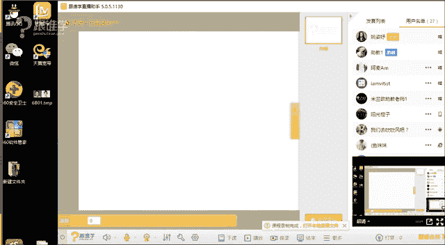
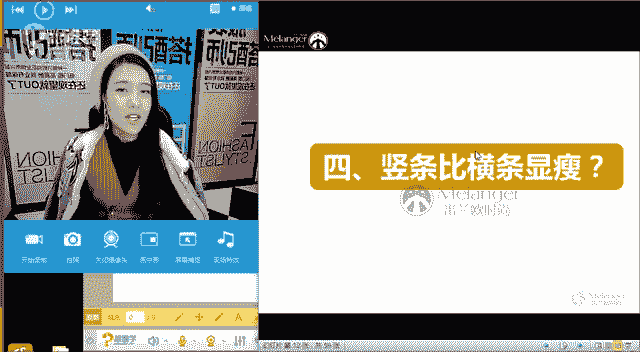

# 1、11服装《搭配秘笈之新版36计》：10显瘦搭配技巧_rec

🎼相片还记得锁在抽屉里面的滴滴点点。😔，🎼小而温馨的空间，因为有你在身边。😔，🎼就不再感觉到。🎼年1月171年，想不想永远。🎼我们在同一个屋檐下写着属于我们。🎼未来的诗篇。😊，🎼踩着温暖。😊，🎼的房间。

我于是了。🎼缘分。🎼发选。🎼想觉其实就是。

嗯。hello，大家晚上好嗯。😊，可以听得到我声音吗？如果可以听得到的话呢，请打一。うん。OK谢谢阿K。😊，谢谢1596同学。嗯，好，谢谢同学们。嗯那我看到你的回复了。嗯，好，看到大家的回复了。

夏河同学，然后嗯还有很多老同学啊，随风同学一切随风同学哈 hello嗯嗯今天晚上呢我们在开课之前说今天绝对不拖堂。因为我觉得每次这个讲太长时间的话，同学们也挺辛苦的。因为呃一直坐在电脑面前。

然后这个听两个小时的课嗯，有点辛苦啊。好，嗯，终于赶那个大早来跟老师打招呼吗？helo好，那我们今天刚才在这个呃VIP的群里面呢，有这个很多学员他在这个问到一些显高和显瘦的这样的一个课程。

那我就没有回答这些同学的问题。因为我就说了，今天晚上呢我们的课程就是讲显高和显瘦的课程。所以呢啊今天接下来的课程。😊，🤧那就是这样的一个内容。嗯OK好好的。那呃就不多自我介绍了啊，同学们。

我是子雨老师啊，你们比较熟悉了。已经OK那我们来看一下今天的这样一个内容。那其实在生活当中的话，我相信很多人都会对于自己的身材上多少会有一些不满意的这样的一个问题。那呃想问一下咱们今天教室里的同学。

你们对于自己的身材，有没有一些困惑呢？就是比如说你会觉得自己对于哪个地方不满意，是肚子大还是腿粗还是手臂粗啊等等一些问题。如果有的话呢，你们现在可以在屏幕上去打一下，你们自己对于自己哪个地方不满意。嗯。

好，O呃这个康刚同学你好呃，蓉蓉说有的希望胸大一点。嗯，好，阿麦同学说个子矮。好，胸小腿短。嗯，上半身和下半身感觉一样长。胯步宽宽宽。嗯，有同学说觉得自己的。腿打吗？嗯。娟娟说胸小OK好，嗯。

那我相信其实大多数回答胸小的都是女性同学是吧？啊，那男生没有这样的一个问题。那就像我们体型当中，我们说男性的话是没有X体型的那嗯O康庄说我的维度是94、85、75、99。嗯，那你的体型的话呢。

其实是有点偏A哦，就是X偏AO好，那我看到大家的这样的一个回答了啊，那多少对自己都不太满意是吗？好，那我们说其实对于体型来讲的话，就或者人物造型来讲的话，我们是要扬长避短的。

那同学们那你们刚才说到的这些问题的话，你们是需要了解自己哪个位置啊，是不满的，是不好的啊，对于你们自己的体型来说，你们觉得是不完美的。你们是要了解，但是呢呃当你们了解之后。

你们其实不用一直去关注这个问题。你们觉得需需要做到的其实就是去。呃，这个掩盖它就可以了。那发挥自己的长处，然后发现自己的优点其实才是最重要的那我想问同学们，你们现在可以在屏幕上打一下。

你们觉得自己的优点是什么？你们可以现在打一下。🤧嗯能算X型吗？呃，你是X偏A型康庄同学。嗯，O好呃，那其实我们今天的课程呢更多的是针对于想要显瘦和想要显高的这样的一个问题。

那我刚才看到有同学说自己觉得自己的腿短啊，5比5的这样的一个比例。那我在这里呢。给大家说一个这样的数据，你们就知道自己到底腿短还是长。因为我们说其实这个呃人的这样的一个身体是有很多的数据的。

例如说我们的脖子跟我们的脸的这样的一个比例，我们脖子是我们脸长的一半，如果你的脖子的长度跟是你脸长的一半的话，那么你就是属于比较标准的脖子长度，如果你的你发现自己的脖子，哎，是你脸的3分之1。

那么你的脖子就是比较短的。那这是我们所说的局部的这样一个问题。另外在人其实还有一个叫黄金比例，比如说我们的上半身跟我们下下半身的这样的一个比例问题。那我们下半身。呃，有一个黄金比例叫1比1。618。

那怎么去计算出来呢？用你的下半身除以你的上半身。那同学们你们自己可以去测量一下啊，在呃你们知道自己的身高了，已经你们就自己从肚脐啊，上半身呢这个距离呢是从头顶到肚脐，下半身的距离呢是肚脐到脚底。

那你们先把自己的下半身肚脐到脚底的这样的一个位置测量出来之后，让用你的身高减去你的下半身的距离，得到的这样的一个数据，越接近于1。618。那么你的比例越标准。如果离得越远。

那么就代表着你可能要穿特别高的高跟鞋。那男士其实也是一样的那大家可以去计算一下这样的一个方法。那包括呢这个如果女生啊，你得出来的，其实基本上我们亚洲人的这样一个比例是在1。3到1。5之间。

男生可能会稍稍好一些。OK那这是教给大家一个非常非常重要的计算自己你的上半身和你的下半身的比例是否哎相对来说跟标准比例、黄金比例已接近这样的一个数据。那大家可以去算一下OK好嗯。

那接下来呢我看到大家说嗯，这个有有一些同学说自己的这样的一个优点，说嗯还好个子不高，然后有的同学就说四肢纤细，这算是自己的优点是吗？好，那同学们你们发现自己的优点之后，那就好办了啊，那你们今天这堂课呢。

就是要抓住自己的优点了。好，那我们接下来来看一下，那在生活当中呢，其实我们有很多人会有一些很多的错误的穿衣观念。

或者说有很多呃相对来说不是比较这个这个不是那么的错这个这个叫什么有点太过于偏激的这样的一个这样的一个穿衣观念啊。那接下来我们来看一下，你们有没有这样的一个穿衣理念。比如说你们觉得黑色的是显瘦的。

🤧对不对？好，我想问大家，你们觉得黑色显瘦的请打一，我来看一下，觉得不显瘦的话，你们请打2。好。蓉蓉说不显瘦啊，曾婷也觉得不显瘦。好，那我想问一下这两位同学，你们觉得不显瘦的原因是什么呢？

大多数的同学其实都会认为啊，那其实呃我们经常会说白色的显胖，黑色的显瘦，这个已经是我们固有的观念了，对不对？O好，蓉蓉说沉重感？好，这是我们所说，就是我经常会问。

如果一个白色的箱子和一个黑色的箱子在一起，你会提哪个箱子，大多数的人会提说提白色的箱子，对不对？那黑色的这样的一个蓉蓉说说的这样的一个答案，其实说它的黑色沉重感也是对的。但是这是针对于可能是特别胖的人。

如果你穿黑色的话，可能会有一种沉重感。那另外从呃某一个角度上来讲，其实黑色它并不一定显瘦的原因是在于我们的服装其实它是不只是只有色彩，他还会有款式和材质的这样的一个问题。那接下来我们来看一下图片啊。

那在这两组图片当中，我想问同学们，你们觉得哪一个瘦一还是2，嗯。嗯，O。曾平微微小仙阿麦，嗯，然后都回答的是2是吗？是的，很明显，其实我们都可以看得出来是第二张图片它看起来会比较显瘦，对吗？

那为那是为什么呢？同学们为什么呢？事实证明，即使你你你是你你你这个叫什么你很瘦。但是如果你不会穿衣服，或者说你挑不对款型，即使你穿黑色，那么你可能也是一个叫什么黑胖子好，收腰嗯款式收腰了？ok好的，啊。

是是的啊，这是从我们所说的这个收腰的款式和不收腰的款式，它是什么样的原理呢？等下我们会给大家来解析，那白色的是不是真的显胖呢？啊，大部分人是不是认为白色显胖。那我们来看一下，那黑色显瘦，白色显胖？

在这里面这个道理是这样的吗？同学们你们觉得哪个显瘦是不是第二个看起来会更显瘦，对吗？白色的这个会更显瘦。那其实说明什么问题？色彩其实并不是唯一的能够让我们显瘦的这样一个方法？

其实我们还有款式的这样的一个问题。那接下来我们来看一下。🤧是不是在呃我们是不是经常会说横条纹显胖，竖条纹显瘦，这也是我们大家的这样的一个呃传统的认知，对吗？嗯，陈念说，如果第二个是黑色。

是不是更会更显瘦呢？那咱们第一张图片，其实同款的色的话，嗯，sorry，不好意思，同学们，如果第二个是不是黑色会更显瘦？黑色它的确是有种收缩感，它是会显瘦？但是同时它会有重量感。如果特别胖的同学。

那我建议在黑色和白色之间，我建议你穿这种浅色的，因为浅色它会有轻盈感，理解吗？嗯，O好，那我们继续来看。那在我们说横条纹显胖啊，那我想问大家，那横条纹其实怎么穿，它才会显胖？怎么穿它才会显瘦。

那现在图片当中大家觉得哪个瘦哪个胖一还是二呢？一还是二呢？嗯，OK是的。第二个啊，蓉蓉说第一个是吗？你们觉得这个显瘦吗？你们是觉得这个显瘦吗？还是这一个显瘦呢？一胖啊二瘦。是的，其实从视觉上我们看啊。

很明显。其实是第二个它会有这种收缩效果。第二个会看起来显胖。为什么呢？其实是因为我们在这个呃当这种横条纹它的条纹是比较稀疏的时候，我们的视觉它会有一种分割感。它不会形成一种叫串这种呃连贯感。

所以它会这种显胖，而这个密集的条纹，它会让我们的视觉有这种我们所说的它会形成一个面了。当横条纹很细的时候，它反而成一个面，所以它看起来是没有分割感的，所以它会更加的显瘦啊。

这个道理大家我不知道有没有跟大家讲清楚呢？好，那这是我们所说的横条纹。那么来看一下竖条纹竖条纹比横条纹显瘦，是不是这是我们平时的所认知的这样的一个理论呢？那我们来看一下两张图片。好，那同学们我想问大家。

你们觉得第一个显瘦还是第样个显瘦？

🤧一还是2。嗯。OK好，那那大家回答的都是一是吗？那我们来看一下在生活当中的这样的一个实际的案例。那其实这个我们说竖条纹在什么样的情况下，其实在竖条纹，如果你是通身穿着的。

也就是说这种全身的去这样穿竖条纹的时候，它是会有一种反而比横条纹要显胖。为什么？因为我们的身体其实是属于圆柱形的，而横条纹，它对于我们的身，它是呃围着我们的这个身体去选是转的啊，就是有一种包裹性。

而竖条纹你会发现它会随着我们的身体的曲线。比如说胸部啊，然后腰部啊，臀部它是有曲线感的。它这样的一个凹凸的线形状，会把什么呢？条纹也会撑的变形，所以说这种竖条纹在通身穿着的时候，它反而会显得胖。

那这就是为什么我们所说竖条纹。比横条纹显胖的原因。当竖条纹它特别密集，而且它是通身穿着的时候，那它是比横条纹要显胖的OK这就是我们所说的啊，这个在生活当中，我们有的几个错误的观念啊。

那例如说我们会认为哎黑色它就是显瘦的，白色就是显胖的横条纹就是显胖的，竖条纹就是显瘦的那在几个案例当中，不知道有没有跟大家分析清楚呢？其实这几个论点啊，它是有。并不是说完全错过啊。

他其实是在某一个角度上，他讲啊。那当当我们所说服装的廓形啊、材料啊、面料啊，它达不到那种呃这这种程度的时候，他有可能会反而有反效果啊，他有可能会显得胖。那接下来我们来看一下，那如何显瘦和显高啊。

那我们其实是我相信今天教室里有大部分的人都想要显瘦和显高吧。啊，有一不过有一位同学今天问我说老师我是H体型的，我很纠结，我到底还要不要穿高跟鞋。那我想问一下，咱们其他的同学。

你们是想要显瘦还是想要显嗯这个显显呃这个想要显瘦显高的，请打一，想要显胖的，请打2，因为今天我看到有同学说想要显胖这个问题嗯。好，清新同学就是想要显得胖，对吗？OK那我想问清新同学为什么想要显得胖？

于红也是想要显胖，对不对？好嗯。那看来真的是有想要显胖的同同学是吗？好，那如果想要显胖的同学，我在这里可可以跟大家来讲啊。那今天我们讲到的所有法则，你想要显胖的话，你就反着来穿，你就会显胖了。理解吗？

嗯，OK好，想要瘦高啊，我就是问嗯，青新说，我就是今天问你问题的随缘哦，青新同学的话是叫随缘是吗？好嗯，你的这个名字这个一直都是清新吗？但是我记得好像嗯好像是是是老师记错了吗？OK好的，嗯，OK嗯。

那今天因为我们老师在外面拍摄，然后呢呃拍摄的时候也在做一个直播。然后我这个随缘同学也在也在这个观看直播，那以后的话我们有直播的话，大家也可以去关注一下哦，是我们线下的这样的一个直播。好嗯。

那接下来我们来看一下显瘦和显高的这样的一个原理。那刚才我我给大家分析了一系列的图片，那大家可以看得到。嗯，有的。之后哎，这这个这就是我们所说的黑色啊，同一同一个颜色，但是有的款式显胖，有的款式显瘦。

那其实它就是这个原理。那我现在图片当中大家可以去看一下啊，当。这个方这个方的这样的一个呃这个实线的方框啊，长方形，它是我们的身体啊，假如说它是我们的身体。

那虚线呢是我们的服装的这样的一个呃这样的一个呃款式，当它是收的效果的时候，往里面收的时候这样的一个效果的话，它形成了这种什么呢？叫纵向廓呃，纵向延伸的这样的一个原理。就是它是往竖着走的？

我们说显高和显瘦的原理，是什么样的原理呢？其实它就是把一个人拉高啊，通过穿衣服的这样的一个方式，把一个人拉高，用线条的方式把一个人拉高。那通你拉高之后就会显瘦啊啊，这很自然的道理。OK好。

那如果当你的服装的廓形，它是离你的身体特别远的时候，例如说我今天穿的这样的一个衣服啊，是H版型的。而且呢它是这个它跟你的身体的距离有很多的空间。比如说我们平时穿衣服的时候，例如。

我身上这一套衣服它是特别贴合的，可能也就是两个手指这样一个空余。而我现在这样的衣服可能有离我的身体有两拳的距离吧。所以它就会特别的显胖，形成了一个叫什么呢？横向扩张的这样一个原理。横向扩张呢它会显胖。

而纵向呢它就会显瘦。OK这是我们所说的显胖和显瘦的这样的一个原理。那这也是我们大的这样的一个原理。那在今天的课程当中，我会给大家讲到很多细节。嗯，那大家可以来跟跟着我来一起。嗯。

嗯有同学说那减型的衣服怎么办？减型的衣服它一定会显胖的，减型的衣服它其实就是属于叫横向扩张的这样的一个原理。嗯，好，嗯，好，那星辰同学说嗯，他要加班是吗？好的，没关系，星辰同学。

那后期的话呢可以去看回放，拜拜。嗯，好，那我们来看一下同学们告诉我，你们觉得哪一个显瘦，哪个显胖。穿茧型的服装，它是一定显胖的。如果你你买了这件衣服的话，那就没办法解决了。呃。

有一个方法就是你把它敞开穿。但是呢你里面穿瘦身的衣服。嗯，OK好，一胖二瘦O为什么呢？我们来看一下，是不是这样的道理啊，当你的衣服的线条它是扩张的横向的，它就会什么呢？显胖，当你的衣服它是纵向的。

它就会显瘦啊，那这就是我们所说的显瘦和显高的基本的原理啊。O好，嗯我们来看一下廓形也就是说廓形比较宽的服装，它会显得比较矮啊，然后比较显胖。那廓形比较窄的，它就会让人么显瘦和显高。

那接下来我们来一一的看一下。那这位博主呢？他其实也是一个很有名的外国小胖子那我们来看一下同学们，你们觉得哪个显胖。显瘦呢一还是2啊，一显瘦还是二显瘦呢？一胖是的，很明显，对不对？我们可以看得到，为什么？

因为第一它的服装的廓形，比如说它的外套是H版型的那它的下装是什么呢？哈伦裤是不是有很多呃这个男生啊或者女生他这种年轻的女性男性啊，他其实很喜欢穿这种哈伦裤。那这种哈伦裤，那第一，如果你的腿型不好。

你穿着就不好看。第二，还有你你的这个身高比例不好的话呢，你穿这种裤子会真的非常的显矮和显胖。所以说呢你看本身他的腿在这个这第二套是不是比较显瘦？当他穿这种收身廓型的时候，你会发现他的腿啊会比较显瘦。

而且比较显得长。你看他穿这种阔腿这种哈伦裤的时候，腿好像就这么短一样啊？所以说哈伦哈伦裤这个单品要谨慎的去选择同学们。嗯，好，这就是我们所说的横向扩张和纵向延伸的这样。一个效果。那接下来我们来看一下。

那这一位是非常有名的女歌手阿黛尔，那哪个显瘦哪个显胖同学们。一胖二瘦嗯，OK好的，嗯，那阿迈同学的这个这个这个打字速度还是非常快的啊，有时候流行的衣服忍不住要买。没关系啊，偶尔有现这样的。

就是我们所说的大气的廓形，如果你是特别瘦的女生，蓉蓉同学，如果你是特别瘦的女生，你穿大廓型的是没有关系的，理解吗？你穿如果你是瘦的女生，你穿大廓形是没有关系的。可是如果你本身身体就比较丰满。

如果你在穿这种大廓形，它会显得很胖。ok好，我们接下来看一下。那在这两张图片当中很明显，第一个显胖，第二个显瘦，那这都是我们所说的叫什么呢？横向啊会横向扩张，会变胖，纵向延伸延伸，会变瘦。O好。

那在这两张图片当中，我就不跟大家来分析这个这个就不问大家了。很明显，还是我看大家都已经掌握了。第一张是横向扩张的，第二张是纵向拉伸的那在色彩的角度上，我们经常会说鲜艳的颜色会显得胖啊。

然后这种花的很这种大花的会显得胖。而这种素色的和这种呃看上去比较深沉的色彩它会显瘦。但是在这套服装当中，大家会发现什么问题呢？你会发现这套反而显得我们所认知的啊，这种深色的色彩。

包括这种嗯这种这种没有色这种没有花型的，没有夸张花型的这种服装，它并没有显瘦，到底是为什么呢？而且这件衣服它是特别薄的，它的面料也不厚。那是为为什么它会显胖呢？那是跟它的。廓形有很大的关系。

所以说在生活当中，第一薄的面料它不一定会显得瘦，而是垂坠感的面料，它才会更显瘦。就是那种莫代尔棉看起来有垂感的面料，它会最显瘦。胖人的话一定要穿那种垂感面料啊，OK好，这就是我们所说的廓形问题啊。

廓形问题。好，嗯廓形式的非常重要。嗯，好，那接下来呢我们就给大家来分享法则了啊，那刚才呢给大家讲的是我们所说的叫这个大方向显瘦和显高的这样的一个基本的原理啊，那在但是根据我们很多同学会有很多的问题。

老师我觉得我的这个什么脖子很短啊，或者说这个肩很宽哪，或者手很手臂很粗啊，那这些问题怎么去调整。我们一一来看一下啊。好。那法则一叫大领口会更显瘦。同学们，你们看一下一和二哪个显瘦，同样一个人啊。

同一个人。嗯。是不是第二个看起来会更显瘦，对吗？嗯，清新，然后阿麦包括蓉蓉嗯，是的，那为什么呢？在这两套服装当中啊，这一位博主呢她呃被这个称为全球最会穿一这个最会呃这个胖子当中最会穿衣服的博主啊。

她被称为那她在她也被称为叫曲线女孩，那是因为她所有的服装她选择的服装基本上都是收腰的很多胖子她会认为哎我都已经这么胖了，我需要用大廓型的衣服宽松的衣服来遮盖我的肉。

其实这种方法反而是错误的这样会让你显得更胖。当你所以你会发现，如果这个胖子她是有腰的那她穿这种收身的服装，其实是非常非常好的，会比她穿那种不收身的衣服要瘦很多，可能瘦上十斤20斤都是非常有可能性。啊。

OK好是的啊，蓉蓉同学回答的非常好，说呃显瘦的原因。第一，它是因为它的垂感特别好。那服装的整体的面料垂感都特别好。而这一件服装面料，它的腰部有这种褶皱，它的面料也会有一种什么膨胀感，所以它会更显得胖。

那第二点是什么呢？它的领口位置，同学们，你会发现这种领口它是形成了一个纵向还是横向同学们，请回答我纵向还是横向。3781同学啊好好上课，看什么呢？好OK。😊，🤧谢谢纵向式的。嗯，青新同学说，老师。

你今天穿的红衣服也是这个原理吗？非常聪明。嗯，是的，那呃老师呢因为其实我的脸型是有点偏方的啊，那我在生活当中其实会很少穿这种高领的黑色的呃这种打底衫或者是毛衫。那在冬天的时候，我们是不是经常会穿高领。

那其实黑色的打底衫嗯，高领的这种打底衫会第一它会让人显得脸特别大。第二会显得脖子都特别短。那其实我脖子不是属于特别短的，但是脸这个这个有点大啊。好。

那所以我在穿衣服的时候会使用这种叫纵向线条大领口的服装来拉伸什么呢？制造这种纵向感啊，拉伸这种脖子的线条。所以看起来它是有什么显瘦的效果的嗯，OK好，那大家可以看得到。那这一点现在大家理能理解了吗？啊。

如果你是比较胖的那我建议要少穿什么呢？这种这种一字领。嗯，因为一字领他会有拉宽的效果。那如果你的肩是比较纤瘦的，你就可以穿一字领。而第一，这个胖人的话，他脖子相对来说一定会稍短一点，这一点大家同意吗？

其实大家可以观察一下，比较胖的人比较丰满的人，他的脖子都会有点偏短嗯，那胖子的话呢，他要什么呢？其实要注重穿衣服的时候要穿大领口。第一是这种V领，第二，可以是大U领啊，都会非常好。OK好嗯。好。

那我们继续来看啊。好，那这是我们所说这个博主呢那给大家来看一组图片，他这是什么？上面这三张呢都是他穿高领的这样的一个服装啊，那我们来看一下他穿这种第一个，那现在他运用的这种原理。

是不是跟老师的这样的一个运用原理是一样的。里面穿的是打底衫，外面利用什么呢？一个外套制造了一个这种呃这种大V领的纵向的延伸的效果。那而且它里面穿的这件打底打底衫呢，他穿的是一个呃豹纹的。

它有点这种豹纹效果的这样的一个打底。这件打底的话，它是非常接近于肤色的如果是我这件的话呢，它的效果会没有这件衣服的效果好。你会发现它第一穿的是低，它是它的打底衫底是低领的，而且呢它还是这种接近于肤色的。

所以说在冬天的时候呢，如果要是脖子边短的同学，脸特别大的同学啊，然后呢这个肩又很宽的同学，我建议啊这个你们想要穿高领的时候穿那种浅色的高领，会比你穿黑色的深色的高领要好一越接近于肤色的这种领形啊。

越好ok好，那继续我们来看一下啊，呃怎么量脖子的长度是吗？啊，你的脖子呢从脖根处，也就是说呃我们我我们平时啊同学们从脖根处，然后到你的锁骨窝，就是锁骨这个中间的位置。然后你用皮尺去测量。

测量呢长度是你脸的一半，那大家可以看到啊，就我的脖子就是我脸的一半。啊如果是属于一半的话呢，它就是比较。标准的如果你测量的长度啊，那你的脖子是这样的，然后到你的脸的3分之1，那就说明你的脸是偏短的。

只要它没有一半长，那都说明你的脸是偏短的啊，脖子是偏短的，能理解了吗？嗯，O好，我们继续来看一下啊，那图片当中第二张是不是也是比较也是啊跟上一张相比穿高领的是不是也会显得瘦，他穿这种什么呢？

通身穿的都是这种垂感很好很好的面料啊，那他当而且用一条金色的腰带来制造了一个腰线，然后这种大V领都会显得它整体的第一比例特别好，第二会显瘦。嗯，好，第三个我们来看一下，刚才老同学同学说。

老师不是说不能穿一字领呢？那大家可以看一下，它其实这个并不是属于真正的一字领。它这里面是有一个叫透视效果的。所以呢他穿这种通透感的领型，要比他穿这种什么呢？直接到高到脖根的这个到脖子的这样的。

一个领型要好。嗯，OK这是我们所说的大领口要更显瘦。那这一点大家能理解吗？啊，如果可以理解的话，如果都能理解的话，请打一嗯。好，我们继续来看。好的，嗯，第二点叫遮盖法。嗯，嗯我们来看一下范冰冰。

是不是我们都认为范冰冰哇好美啊，范爷啊，我们经常会称她又又会称他这个什么女神，对不对？那我们会发现他呃这个多变性，他非常的多变性，那其实跟他的这个脸型有很大的关系。当然人长得美也很重要啊。

那他经常会呃驾驭各种造型啊，他的这张脸呢其实他在佩戴配饰啊，然后服装领型啊啊，然后他们可以驾驭很多风格。那再加上他本人的气质呢，其实既可以驾驭这种很妩媚的感觉的又可以驾驭一些比较帅气的这样的一个服装。

那大家可以看得到，平时我们会发现我们的焦点都是注重在他的脸上。为什么呢？呃，其实大家都没有发现他的身材会不好，因为我们我们很少会讨论一个呃这个趴在他的这样的一个说手臂很粗啊，或者腿很粗啊。

我们基本上没有讨论这些热点，啊，没有哪个一个腾讯新闻弹出来说哇，你看范冰冰腿特别粗，那永远弹出来的新闻都是范冰冰特别美，是不是那是因为范冰冰非常了解他自己的优点和缺点在于哪里。

它基本上所有的服装都会是什么样的形态呢？它的款式。第一，基本上裙装的选择都会在膝盖的位置，也是这个位置，你会发现这张啊这张图片挺不道德的啊。其实那这是这个范冰冰的裙子被吹起来了。

然后媒体拍到的那那大家可以看得到，其实范冰冰的腿还是非常的粗的那你会发现他所有的裙装都是在膝盖的这个位置以上啊，那为什么他会所有的裙装都在这个位置呢？同学们，我想问一下大家。🤧嗯。为什么呢？嗯。

老师喝口水啊。嗯。好，大多多数同学都说盖住。嗯，有一个同学说嗯，小腿细，这个是重点。是的啊，3781同学也是回答对了，那其他同学都说嗯盖住，那我们说了扬长避短，当他盖住他的大腿这个部分，它只是在什么呢？

臂短就是盖住他的缺陷，他什么呢？露出他的小腿，其实这就是他的优势。他的腿的位置呢从小腿以下都会比较纤细，他的手臂也是一样的道理。大家来看一下他的手臂其实上面的这一段都会很粗，下面的一段都会很细。

所以他基本上很多服装都是什么呢？这种中袖或者是七分袖上装，然后裙装基本上都是膝盖上下的位置啊，膝盖上下的位置，所以他她永远露出来的都是他最瘦的位置，所以我们会认为哎她看起来其实还挺瘦的。

再加上她的脸又很瘦，然后呢，她的这个又又很美，所以她的她总是会在她脸上，脸周边做很多的造型，你会发现范冰冰的化妆是特别容易出名啊，就各种这段因为他她范冰冰的这个头部的造型做的特别的丰富。

所以这就是我们所说的扬长避短。他非常了解自己的脸是她的优势，所以他永远只是在展露她的脸。而你会发现，例如说。语文。😊，啊，例如说莫文蔚，那其实李文也还挺漂亮的啊，李文她的身材是不是非常好。

所以他经常会穿一些什么呢？那种很紧身的呀，要么就是露腰呀，要么就是显示他丰满了臀部啊，这样的一些服装。那包括莫文蔚，他的身材是非常好的。我不知道有大家有没有看这个呃天籁之呃，天籁之巅之之巅吧。啊。

这这个音乐节目，最近好像是有这样的一个音乐节目。那莫文蔚在里面经常会变化很多的造型，而他的造型永远都是什么呢？非常的性感，然后永远都是展露他自己的身材曲线的这样的服装。

那是因为他知道他的身材是他的优势优势。所以你会发现某些艺人，他们觉得哎他自己身材好的时候，他就会露身材。他脸长得漂亮的时候，他永远都是只达到自己的脸。那这就是我们所说的优势。那同学们你们也是一样的啊。

你们也是要什么呢？发现自己的优势啊，O好嗯嗯。腿长直漂亮。是的，你在说莫文蔚吗？阿麦同学好，那这是我们所说的遮盖法。那也就是说什么意思呢？当你会发你会发现你自己身上某些地方不是特别的这个漂亮的时候呢。

你就应运用我们所说的臂短的方法，就什么呢？不要让不要展露自己这些缺点。例如说有同学他真的就是我之前在走到路上的时候，我就真见过这样的呃路人啊，他腿特别粗，然后还穿了特别短的短裤，还穿了一双网袜。

那不就是在告告诉别人，快来看我的腿有多粗啊。啊，那这是很明显的这样的一种什么呢？哎把人让眼球吸引在他腿部的这样的一个呃这个这个这个视觉效果，他的这样的一个服装造型啊，O好，嗯，这就是我们所说的遮盖法啊。

下来我们来看一下啊，那例如说在选择服装的时候呢，有很多人的手臂是不是很粗呢？啊，当你如果手臂很粗的时候呢，你再选择。这个我们所说的呃上装的袖子的长度就会非常关键。你会发现同一个人啊。

他选择这种特别短的袖子的时候，就会把他的什么呢？手臂很粗的位置露出来了。这种叫拜拜肉蝴蝶袖，对不对？那你会发现当他选择这种中中袖的时候，嗯，整体感觉都会非常漂亮，对不对？

你看他的两个这个我们所说的在妆容上面没有太大的区别，都是佩戴了眼镜都是画了红唇，可是你会发现这一张整体我们看上去的时候，我们会关注他的手臂，而这一张我们只会看到他的脸。这就是我们所说的遮盖法啊。OK哦。

好的，阿迈同学说，我就是粗的手臂，都不敢穿无袖啊，那这就对了。好，那我们继续来看啊，除非是特殊情况的话，你就可以穿。比如说范冰冰她经常在穿晚晚她出席晚礼服，经常会穿这种大礼服的时候。

他也会选择一些无袖的。那在这种场合当中是没有办法的。你把自己包的严严实实的话，那就没有看点了，对不对？啊啊，那我们继续来看一下，那这张图片就是告诉大家来看一下范冰冰她经常会出席各种戛纳，然后戛纳红毯。

那他他就被称为红毯女神，对不对啊，那他很多造型，其实我们说在这种呃这个走走红毯的时候，他是属于叫比较隆重的场合，他需要穿这种大礼服。在我们所所说的社交当中有三种礼服，一种叫日间礼服，一种叫什么呢？

小礼服，也就是说准礼服，一种叫大礼服。那日间礼。服的话一般都是我们所说的白天穿着的。比如说英女王和凯特王妃经常会穿这样的一个礼服。那例如说我们在婚庆的时候，我们也会穿的比较隆重一点，对不对？

那以以这种简约的连衣裙，相对来说它是有一些隆重度的那呃准礼服是什么意思呢？就是下午3点钟到6点钟之间，你去参加一些朋友的聚会啊，然后茶啊这种这种下午茶呀等等。

那这种交叉这种下午茶它一般都是以这种行走的方式啊，可能会大家交谈这种方式，那这种小礼服会比较方便。但是它相对来说是有一些隆重度的，比如说它的面料可能会用一些比较闪光感的呃。

重工的工艺可能会用一些亮片呢啊这种镶钻呢，那包括有羽毛啊，这种装饰啊，重工装饰刺绣等等。那大礼服也是一样的它的面料也会使用一些比较有光泽感的面料，有隆重感的华丽感。面料，但是它是大型的礼服。

那大型礼服的话，在夜晚我们穿着的时候，其实它相对来说需要有一点点这种暴露露暴露的程度啊。你您如果裹得太严实，就没什么看点了啊，那我们说范冰冰她就经常会穿这样的一个礼服出席各种晚宴啊，包括这种隆重的场合。

那他手臂粗怎么办呢？他有一部分的礼服是这样露手臂的，但是你会发现他有一部分的礼服其实还是会使用这个我们所说的遮盖法。比如说这两件礼服当中，大家就可以看一下，你会发现他穿着这种礼服的时候。

我们的关注点又在哪里了，又在他的脸了，你会发现啊还是很瘦的，皮肤又很白皙又很美是吗？啊，那这套礼服其实比较有名，是他刚刚这个征战戛娜红毯的那一两年，那他这套礼服还被评陪评为最美的礼服造型啊。

他的这个薄纱，你会发现他会选择一种薄纱感的，或者这种有造型感。遮盖他的手臂嗯。好，这是我们所说的。嗯，可是嗯腰不细了，不知道是在说哪一个知识点啊。老师刚才没有看这个弹幕。好，那我们继续来看一下啊。

那这是我们所说的第二点法则二就是什么呢？遮盖法。那第三点，打造高腰线。那我们来看一下同一件服装当趴。那大家可以去观察一下这件这两张图片，我们现呢下面可以玩一个游戏啊，叫找茬游戏。同学们。

这两张图片会有什么不一样呢？嗯。你们可以在屏幕上打，现在给大家30秒的时间啊，这就是练你们打字速度的时候了啊。好，嗯，二好看，中中有秀同学很直接说二比较好看。嗯，好。😊，阿K说皮衣不同。好。

还有没有其他的不同点呢？项链包侧身。外套。毛衣链包好，还有没有我看有没有同学能够发现这个细节。好，有同学发现了啊，我看到了5328同学说。😊，拉链打开非常好。这个细节大家来看一下啊。

这个细节我都跟随我的鼠标来看一下啊，这个细节同学们你们有没有发现呢？啊，那我们来分析一来分析一下它为什么加这些东西啊。第一，它使用了什么呢？😊，皮衣这是一件非常大的这样的一个单品，对不对？

它对于整个人的这样的一个修饰效果是最明显的。它的这样的一个外套加上去之后呢，对它这种O型的这样的一个这种这种连衣裙起到了一个收腰的这样的一个效果。其实腰线就出来了，对不对？那第二，它选择了什么呢？

长向链，长项链的效果是什么呢？其实它也就是形成了一个纵向拉伸的效果，它会让整个人会显得什么呢？更显得修长啊，那第三，它带了耳环，耳环比较小，那大家看的也不是特别清楚，对吗？好，第四，它拉开了它的拉链。

那这种拉链其实也是形成了一个我们所说的纵向线条的效果，你会发现了他腿明显长了很多，那最后它加了一个包包，那包包的话其实纯纯属这种配搭作用啊，就是黑白跟他的服装形成了一个叫我们所说的反复的美。学原理啊。

好，那这就是我们所说的打造高腰线的方法。那虽然它的一件皮衣啊，这个为它这个整套服装增加了很多量感，但是它的配饰和一些细节的这样的一个调整，同学们也非常的重要啊，好，那你们在这个自己自我打造的时候。

有没有掌握这些细节呢？好，嗯，那如果那这一点的话，这就是我们所说的打造高腰线。那打造高腰线其实有很多的方法并不是代表你非要通过一件衣服来打造高腰线。那我们来看一下。

那我们在生活当中还有哪些可以打造高腰线的方法。哎，我想先问一下同学们，你们知道的这些打造高腰线的方法有哪些呢？同学们，你们现在可以在屏幕上打一下啊。😊，好，青新同学说腰带嗯非常好。好。

有同周永雄同学也想到了腰带，所有同学第一反应都是腰带是吗？好，蓉蓉也是腰带。嗯，有没有其他的答案呢？你们就知道腰带呀啊。😊，好，那我来给大家来解答吧。嗯，腰带上衣塞进下衣高腰外套。

露肚脐、衣服带长项链、高腰裤、丝巾、短上刺呃短上其实就是短上衣是吗？穿高跟鞋。好，那我们接下来一一的来给大家来看一下啊，如何打造高腰线。嗯，那呃我们看一下，其实有很多的服装呢，它在原本的设计当中。

它就什么呢？有运运用这种叫高腰线的这样的一个方法。那比如说这种叫地正式高腰线，它是从什么呢？胸部这个位置就往下就形成了这样的一个呃这种褶皱啊，那它其实就已经形成了高腰线的原理。那这种高腰线。

它第一会显择什么呢？整个人下身的比例会非常的好。不管你的黄金比例是不是5比5啊，可能真的只有1。2了。那你的你穿了这件衣服之后，你就会觉得胸弟下就是腿啊，那OK这是我们所说的这种高腰线的这个服装。

包括这种叫什么呢？希腊式的高腰线，那这种高腰线其实也是一样，它用运用这种腰封啊，这种腰封式的腰带把这种腰线塑造出来，也形成了这种什么呢？拉长整个人的这样的线条的这样一个效果，会显得你的腿特别的长。

那大家可以观察一下这件衣服的面料，就属于叫什么呢？垂感非常好的面料。青云同学说好美呀。是的，那这种为什么叫希腊式高腰线呢？希腊式服装呢？

其实大部分现在大大家看到的礼服都是来源于希腊的这样的一个古希腊的服装。那古希腊的服装呢，他们就会用这种布啊，因为这种布料，然后呢在身上进行这种缠绕，然后包裹啊形成这种褶皱感的这样的一个服装啊。

那他们会认为在古希腊的时候呢，他们会认为认为人的这个身体就是一种美啊，它不需要太多的这样我们所说的太多的装饰，就这样简简单单的这样的一个布去裹起来啊，然后形成这种飘逸感。然后褶皱感垂坠感，包括鞋肩。

他们就会经常运用到这种这种手法啊，那希腊的这种褶皱来源于哪里呢？他们是来源于我们所说的希腊的那种柱子啊，希腊的柱。他们会认为阳光打在那种白色的柱子上非常的漂漂亮，就是白色跟金色的这样的一个交相呼应啊。

所以古希腊很多服装都是白色和金色的配色啊，O呃想起权力的游戏自然的褶皱。是的，嗯，那这就是我们所说的古希腊的这样的一个服装的款式啊，那这种的话也是属于有点像希腊款的感觉。那我们看一下。

那除了这种高腰线的方这种服装当中的高腰线。那么们来看一下如何来制造高腰线啊，那高腰线的话呢，例如说同样一件我们所说的这种蓝色的牛仔啊，那这一件它是属于这种宽松型的这一件是属于什么呢？

相对来说它其实如果不扎腰带，它也是H版型的，只是一个厚一个薄的道理一样而已啊，那呃大家可以想象一下啊，这件衣服其实就是这件衣服，它没有扎到扎腰带的样子。那运用这种腰封和腰带或者是这种细的腰带啊，都可。

可以制造的出来，那么把它做成一个什么高腰线的这样的一个分割，那就形成了我们所说的腰线。你会发现从这儿到这儿都是腿的感觉啊。O好，这是我们所说的腰带塑造高腰线。嗯，那我们来看一下。

其实腰带有很多种有这种宽的啊，然后还有那种腰封啊，还有那种现在特别流行的日式的那种用一个布，就是类似于一条部，然后缠绕起来的那种感觉，其实它也是腰封的感觉。那包括还有很多这种丝巾啊，也可以做成腰腰带。

那包括那种细的腰带，其实有很多种类型，包括一种链条的腰带啊等等。好，那腰带有很多，那在这里我们就不重点去讲了，那大家可以其实都了解啊。好，那我们来看一下塑呃这个腰这个腰带塑造的高腰线的效果。

那包括什么呢？高腰线的下装。感觉帽子要掉了啊，调整一下我的帽子。好，其实这个帽子特别漂亮，可以给大家看一下侧面啊。好，那们来看一下啊，头发有点乱，造型烂了啊，这个叫什么嗯，人家说什么什么发型不可乱。

头可断，发型不可乱啊嗯，粗腰用细腰带吗？嗯。阿迈同学说喜欢一，你是喜欢哪个一呀？喜欢这个一吗？喜欢这个一也很正常啊，这种是比较修闲的这种穿法。想要女人味的话，你就可以穿这种，明白啊。

并不是老师说老师没有说你非要穿这种吗？不是你想要哪种穿着效果的时候就可以穿着哪种啊。okK好，那我们来看一下啊嗯。159，那我建议你还是唉1160其实还好了，穿上高跟鞋的话，那就差不多了啊。好。

那我们继续来讲到我们高腰线的夏装。高腰线夏装呢那如果你没有刘纹的这种大长腿和这种身高的话，那我建议很多同学你们不要买这种叫什么呢低腰裤。那低腰裤真的会把一个人穿成55分的。

来看一下刘雯他的身材是不是特别好？那大家也可以看到啊，在维多利亚的秘密当中，身材非常好超模，但是即使他穿了这种低腰线的牛仔裤，他的身材也会变成55分。所以说如果个子相对来说比较娇小的。

而且我们亚洲人本身比例就不会特别好，那我建议不要说这种穿法，为什么老外人家敢穿这种低腰裤的这种裤装，那是因为外国人他们本身的这个身材比例就比我们好？他们都基本上这个能够到达一一这个这个我们所说的1。

618啊，有可能。那我们中国人的话基本上都是属于小短腿类型的啊，我们属于叫大头娃娃，小短腿。所以我们在这个身材比例上是没有优势的。我们需要用这种高腰线的裙装、裤装、高跟鞋来武装我们自己啊。

让我们自己的比例看起来会更好。那呃如果个子比较娇小的人一定要戴帽这个一一定要戴帽子哈。我刚才看到哇，帽子好好看，一下分神了哈，一定要穿什么呢？高腰裤、高腰裙，包括高跟鞋。嗯，OK好，我们来看一下呃就说。

同学们，你们的说的是什么呀？是的，试过穿起来矮了。阿麦同学说的嗯呃，安瑞同学如果黑屏了，你退出来退出去再进来啊。嗯，低腰裤是的，是之前流行了很多年。但是低腰裤比它穿起来有点不雅观，对不对？

特别是蹲的时候啊一定要非常注意好，那我们来看一下，那除了这种今天还有人问我，老师呃我的那件蕾丝上衣可不可以配个阔腿裤啊，完全可以的啊，那我们来看一下，但是你那个蕾丝的上衣不能特别宽松。如果特别宽松的话。

你扎进裤子里面不好看。相对来说比较贴身的话，它是可以扎进这种高腰裤或者是高腰裙里面去的啊。那我们来看一下嗯，那呃除了这种高腰裤的穿法，其实还是什么高腰裙，对不对？同学们哪一个显得更好，哪个显得比例更好。

一还是2。嗯，好。帽子是挺好看的，但是老师会往后滑。嗯。好，X感觉不太适合大喇叭裤，除非是大腿细一点，穿低腰的喇叭。X体型它其实是可以穿很多的这个服装的啊，那它只要收腰就可以了。

X体型它只要收腰就可以了啊。但是并不是说X体型它一定要穿收腰的胸比较平的，也是可以穿不收腰的，当然穿收腰的效果会更好，能理解吗？同学们好啊，如果你想要穿这种这种宽松的舒适感的休闲感的啊。

这这那你穿穿那种收腰的，可能就效果不好。好，我们来看一下啊，那大家会觉得第二个比较好，对吗？为什么你看同一个刚才我们不是说了吗？哎，腰带制造高腰线，它也穿了它也带了腰带呀啊，但是为什么看起来效果不好呢？

那是因为它的腰带其实还是给我们形成了视觉分割。123，你会发现它有一个分割，当它的什么呢？裙装把这个直接把上衣扎进腰里面的时候，你会发现它的裙到从这儿啊，到下面都是一个。这种连贯感色彩会有连贯感。

所以看上去会更加的显瘦和显高嗯。OK嗯，如果有小肚子怎么穿高腰呃，佳佳同学，那我们在后面的课程当中会专门讲到肚子大怎么穿啊，O不要着急哈。好，那么来继续看一下。那在这两张图片当中，我想问大家，嗯。

一号还是2号呢？一还是2。嗯。第二个比较好是吗？为什么我们经常会有人是这样穿衣服的啊，我买了一件上衣，这个上衣有点长，那我就我就不管它，我就把它放到这个它到哪儿，我就他他长上衣到哪儿，我就把它放到哪儿。

他不会去进行调整。为呃而且呃我建议啊我在这里要强烈的建议那种什么呢？呃肚子比较大的呀，臀部比较宽的人呢，你们在选长上衣的长度是非常关键的，能理解吗？为什么当你的上衣拉到了你的臀部的这个最宽的位置。

也就是说你的身体下半身最宽的位置的时候，他会显得人胖。你会发现这件上衣他是不是停留在这个人臀部最宽的位置，所以他整个人会显得很胖，而上衣调高了之后，把他的腰线露出来之后，反而会显得瘦了，那很多胖一点。

脸的女生是不是就会有这样的一个咕姑结啊？我上我的肚子大，我的臀宽我就要盖住这种方法是错误的。当你坦坦荡荡的把你这个最宽的位置露出来，把你的腰线展露出来的时候，你反而会显得瘦和高。OK这一点大家能理解吗？

嗯，把分割线提高。是的，下半身就变长了。嗯。2、但是大腿太胖了嗯。8185同学说的没错，但是我想问的是，我们通过穿衣搭配能够让一个人变成一道闪电吗？我们不能我们只能通过穿衣搭配。

让一个人瘦到这个最这个就是通过穿衣搭配，让他瘦这个穿到最理想的状态，让他最显瘦的这样的一个状态啊，能理解吗？就是有的这样的同学说老师我160斤，嗯，那我怎么能穿成120斤。我说老师做不到啊。

我只能通过穿衣搭配给你瘦到10斤15斤20斤最多啊，你要是真的让我给你看起来像120斤的样子，我真做不到，那你真的是要去健身才能达得到的啊，穿衣服他只能通过我们所说的穿衣搭配，让你瘦到。

就是从视觉上到最最瘦的效果啊，好，还是健身吧。是的，嗯，好，那我来看一下，那这张图片当中嗯，刚才有同学是不是问到肚子大的这样的一个问题。好，那我在这里跟大家来讲一。点啊，那同学们我想问一胖还是二胖。

很明显你们不用回答了，肯定是第二个比较瘦，第一个比较胖，对不对？好，我想那我们来一一分析。第一，它的里面的这件是不是很多比较丰满的同学他都会喜欢这样穿衣服，是不是我想问大家。

在我们生活当中是不是大部分人都是这样穿的，我胖啊，我要穿一个这种这种这种不收腰的衣服，然后把我的腿盖一下，把我的腰盖一下，对不对？我们所说的遮盖法，大部分人都会这样穿，但是你会发现一个问题。

它的内搭第一，它虽然使用的密集的横条纹，但是它运用在肚子的这个位置，用什么呢？使用了一件纵向的外套在这个地方就很明显，而且它这个地方是什么图案？很明显我们第一眼会看到什么呢？肚子的位置。

也就是说你在肚子这个位置是有夸张的呃图案效果，第一眼就能够引起我们的注意啊。那第二点，我们经常会说里深外浅收缩会比较好。我建议如果这个女生她里面穿的是黑色的打底衫，黑色它是有收缩效果的啊。

那她看起来一定会比身上这件衣服要好，再退而求其次啊，她的这样的一个她不穿黑色的，哪怕她把把它换成纯白色纯白色的，她的这样的一个瘦身的效果也要比她什么呢？穿这种条纹的效果要好啊。我这样讲，大家能理解吧。

那所以第一，他她的这样的肚子上会有图案，所以它会显胖，而且她停留在我们所说的这个她的这个最胖的位置，所以她会显得胖。第三，比较胖的人，她穿裙装永远要比她穿裤装。更要显得瘦。🤧okK好。

那这就是我们所说的这个在第三点的这样的一个问题啊，那同学们能理解吗？啊嗯。这就是什么呢？它制造了高腰线，高腰线会显得人更瘦啊。O好，那这是我们所说的高燕高腰线的这样的一个方法。

就是夏装的这样的一个问题啊。那我们再来看服装本身它设计就有高腰线。那比如说有一些裙装它是H版型的对吗？它是不收腰的而这种服装，比如说这种收腰的公主线的这种A字版的裙子，它是有收腰效果的。

所以它看而且它是有高腰线的效果的，它看起来会更加的显瘦和显高。嗯，好，那这个也比较简单，大家都容容易理解吧。嗯，好，我们继续来看啊，那这是我们所说的制造夏装制造什么呢？高运用夏装来制造高腰线。

穿高腰线的裤子或者是裙子，或者我们穿这种反正高腰线它有很多种方法啊。那比如说用腰带来制造啊，服装本身设计就是高腰线，那穿高腰线的裤装或者是裙装，那这都是高腰线的方法。那。我们来继续看法则四，面料轻盈法。

好，我想问大家，第一和第二，哪个看起来会更加显得瘦呢？哪个看起来会更加轻呢嗯。第二个是吗？OK为什么呢？因为我们来看一下啊，第一件，首先它运用的面料，这两件衣服其实都是有像我们所说的膨胀感的面料。

这种毛衣它一定是属于膨胀感的面料，而且这一件毛衣它属于粗棒针的毛衣它也会有那种比较精密的那种面料。比如说羊毛衫呢啊，那种看起来很精细的那种很平面的那种感觉，它看上去会比较细腻感的那种面料。

那种毛衣它看上去会比较显瘦。而当然款型也要收身啊，而这一件衣服它是粗棒针的，粗棒针它本身就会比较显得有膨胀感。那这种白色的会又这种面料又比较厚，会更加的显胖。那而这件衣服它同样也是白色的，对不对？

我们说了白色并不一定显胖，那这个白色它也是运用了什么呢？呃，这种毛织物。但是它这个毛织物是什么？你会发现它相对来说会细腻。一鞋它是用了海马毛。那另外在腰部的位置，这一件衣服它是什么呢？没有腰。

你穿的这件衣服它是没有腰的，而这件衣服它利用什么这种分割感制造了这种这种腰线出来，所以它也是有一种这种叫高腰线的这样的一个视觉效果。同时它在肚子这一块的这个面料运用运用的是比较薄的，比较轻的。

你会发现哎一下就变轻了的感觉。那包括它下装的这种袜子，大家会有没有发现这个细节，同学们有没有发现这个细节啊，正面好了，侧面会看出肚子吗？啊，要是搭配正确了，正面好了，侧面会看出肚子吗？那这个问题的话呢。

嗯你说的是哪一个搭配呢？我我现在没理解啊，这位同学好，那对是的，那刚才这个有同同学说层次感，它其实并不是说知造层次感是次要的，它是什么呢？用这用运用这种面料的这种厚和薄啊。

其实它来让他整个人看起来会更加轻盈。那夏装的丝袜，它为什么会有这种我们所说的这种设计呢，它为为什么上面穿了这种裸色的呢？或者它有可能上面是裸色的，或者说它就穿到了这个位置，它的袜子就到这个位置。

那是因为这种透肉感，它会有一种叫透气感。那经常会有同学问我。说老师我怎么我们冬天怎么穿才能显得轻盈又时尚。啊，经常我会告诉他一个方法，就是什么呢？你。露一点脚踝。如果你要是通身穿的都很厚啊。

然后脚也包的很脚腿啊，然后身子穿的都特包的跟那粽子似的那你一定看起来是比较重的，然后就就很很这种臃肿感。那你露一点脚踝的时候，他是有一种透气感，所以它看起来会比较轻盈感啊，会减少这种笨重感。

那这个其实是运用了一样的道理啊，这一点不知道大家有没有听听明白呢？嗯，好，那我们继续来看一下第二张图片，那第二张图片呢也是一样的道理。你会发现这个人啊这个模特的话。

他其实本身他的优势也在于他的腿部的这样的一个位置，小腿特别纤细，所以呢。第二张分这么多段，适合高个子，矮个可以穿吗？呃，适合高个矮个可以穿吗？哦，矮个子的人是吧？嗯。

如果这个呃个子比较矮的那我建议还是穿这种相对来说线条和色彩比较有这种延伸感。其实第一章嗯第二章它分了很多段，但是它的色彩其实是有延伸感的。比如说它上身的那个色彩还是依然是白色，所以视觉上还好。

只是它下身肉色和什么黑色做了一个小小的隔断，这个对于它来说影响不是特别大。如果你个子比较矮的话，那我觉得你是你要穿高跟鞋啊，这个非常重要。好吧，嗯，好，二图是不是会有分割感。二图不是会有分割感吗。是的。

我理我我了了解了，我刚才这样解释，大家明白了吗？3781和一切随风同学刚才我这样解释，大家理解了吗？嗯嗯，好，如果理解的话，请打一啊。好，呃，那就是我们说刚才那张图片啊，刚才我给大家看一下吧。

这一张图片当中它虽然有分割，但是它都是运用的白色，而且它在这个地方还运用了一个什么呢？长项链制造了一种延伸感啊，其实他上半身他这一身色彩都是比较统一的，所以还好啊，OK好，理解的话，那我们就过了啊。

那我们来看一下第二张图片啊，第二张图片当中呢，它上身其实穿的是同一件毛衫，大家发现没有？上身穿的都是同一件毛衫，但是你没发现他穿了裙子之后比他穿裤子要看起来会有什么呢？第一时尚感。第二轻盈感。

它的我们在呃冬天穿衣服的时候呢，很多人他会怎么穿呢？里面啊穿一件秋衣，外面穿一件毛衣啊，然后在外面套一个外套。有很多同学说都像萌拉老师啊，那可以你上身是可以这样穿。那我建议你的下身。

你可以穿一些比较呃夏天的裙子，不要急着收起来啊。夏天的裙子呢你可以把它放着，然后呢穿在下半身。因为这样会有一个我们所说的叫面料的对比感，这种对比感的话，它会有视觉的丰富层次感。第一。

它看上看上去会让你变得很时尚。第二，它看上去会有轻盈感，就不会像你穿毛呢的裙装啊，或者穿那种这种这种相对来说比较厚的这种裙装的这种笨重感，能理解吗？同学们，比如说你穿那种特别轻薄的裙装。

你哪怕里面里面你穿了两条打底裤，哪怕你穿了一条棉裤在里面，但是你外面套的是一条特别轻盈的纱裙，你依然看上去会非常轻盈啊，OK好。那这是我们所说的面料的轻盈法啊，那我们来看一下第五条色彩连贯法。

色彩连贯法呢，我们来看一下图一和图二，我想问大家，哪一个看起来会更加显瘦和高呢？一还是2。一还是2，哪一个看起来会显瘦和显高嗯。周永雄同学是不是使的这个这个老师刚才没听清楚老师说什么。嗯，好。

第二个会明显的显得我们所说的什么。高和手，为什么？那是因为它有色彩的连贯法啊，那我之前刚才大家都说到分割法了，是不是？那现因为大家都听过之前的课程，对于这个大概都有了解了，对吗？那我们来看一下啊。

那这第一张图片当中其实就是因为它分割太多，对不对？你看它的上装跟它的下装色彩是不一样的。里妆和旺装颜呃里装和外装颜色还好啊，那上装和下装颜色不同，下装跟鞋子的颜色又不一样。所以让它看起来会比较的显矮。

而这件衣服从上到下看起来都是非常的有延伸感的，有连贯感，所以它看上去会比较的显高啊，那我们来看一下，那这是我们所说的这样一个原理。那比如说在生活当中我们在搭配的时候应该怎么搭配呢？我们来看一下。

那有的人是不是这样搭配的，上身啊穿黑色，下身穿浅色，我们穿一件大衣啊，然后呢这个颜色在跟它的上衣或者跟它的包包色彩进行去呼应，对不对？其实这样穿在。

搭配的角度上是没有错的那站在我们所说的想要显高和显瘦的角度上，就不是特别好。那如果这一套服装它还是这样的一个色彩搭配的方法，我一让我一样可以有让它变瘦的方法，那就是什么意思呢？

把它的上衣塞到它的裤子里面去，它一定会看起来会更加显得高和瘦。而如果我们下装啊换成这样的一个搭配方法，那么它看起来不是瘦一点啊，或者高一点，它看上去会高很多。那比如说它上装换成这种浅色的啊。

哪怕它换成其他的颜色也可以，它下装的什么呢？最重要的叫什么呢？下身一码色，也就是说它的裤装跟它的鞋子成一个色彩，那它看起来会更加的显瘦。那例如说这一套服装当中如何让它显得瘦呢？

比如说他把上衣塞到阔腿裤里面，阔腿裤加长，然后穿。一双白色的高跟鞋，那么它一样可以达到我们所说的显高和显瘦，并且比例会变好的这样的一个原理，能理解吗？同学们并不是一定要说啊，老师说了，下身一码色。

那我下身一码一码穿黑色吧，并不是这样的一个道理啊。我们说下身你是什么颜色都可以，但是你的裤子和你的鞋子统一颜色的时候会更好嗯。好，那我们来看一下啊，理解啊。好的，那我们来看一下刚才是下身一码色，对吗？

那还是刚才那张图片，裤子跟鞋子是一个颜色，但是我们会发现唉上身跟下身它是一码色的时候，好像延伸感会更好一点，对吗？那这就叫什么呢？内里一码色，它是有分内外，对不对？

我们上我们在搭配的时候有分上下和内和外，而这一套服装搭配当中，它是什么呢？内里一码色，那大家会说哎，它的鞋子的色彩不是跟它的裤子的色彩一样的呀，没关系，它的鞋子色彩其实还是深色的，暗红色为主，对吗？

它接近于这种深就是这种黑色。我们说这种红其实就是鲜红色，就是我身上的这种鲜红色加黑不断的加黑，它就变成了暗红色，而粉色就是我身上这种红色加白，它就变成了粉红。红色而这种颜色它其实是比较深沉的颜色。

所以它依然看上去不会有太多的分割感。那同时又达到了我们所说的它的上装跟下装形成了这种连贯感，它依然看起来还是有这种延伸感的，依然看起来还是会显高的。当然，如果它换成黑色的鞋子会更好嗯。好。

看来不能对比一比就知道了是吗？好，嗯，嗯那我来看一下啊，一比就比不过了。那我们继续来看，把PPT调整出来给大家看啊嗯。😊。

稍等。好，那我们接下来来看一下，呃，刚才说的到就从这个下身一码色到内里一码色。那大家现在想一想，现在是什么？现在该到什么了？好，我们来看一下啊，到全身色彩连贯更好。

那我记得呃上次好像有一个同学问我说老师呃这种全身穿一个同色系的搭配方法好吗？其实我们说同色系搭配方法没有说好和不好，看你站在什么样的角度上来讲，就是说国人很多国内的话呢。

他是接受不了通身穿这种这种一码色的。例如说我身上穿的老师今天穿的是这种马甲加红色的西裤，我给大家来展示一下啊。啊，那其实我这一套服装呢，它是有什么呢？呃，马甲、裤装，还有一个红色的风衣外套。

我今天这个再去拍摄的时候就没敢这样穿。为什么？因为第一，这个色彩太鲜艳了。第二呢，通身穿这种红大红色的时候，呃，我会怕我会怕这个这个人长时间看红色的时候会有点这种不舒服的这样一个感觉啊。

就不敢盯着你长时间看，所以我外面配了一个其他的色彩的这样的一个服装啊。那红红火火是的，是挺红火的啊，不知道人以为老师今年本命年的还其实不是的啊，好，那我们来看一下，那全身的色彩连贯。

这种卡其色不驼色的话，其实大部分的人是可以接受的啊。那我们来看一下，那内里一麻色和通身穿这种这种驼色的时候会更加的什么呢？显高和显瘦。你会发现它连鞋子都。色彩都换成了跟它什么呢？肤色特别接近的裸色。

那我们在夏天的时候选鞋子的时候，要选择什么样的鞋子会让我们显得高和瘦呢？那其实就是我们所说的裸色的鞋子，而且你要选择跟你肤色特别接近的那种裸色，裸色它其实有很多种的啊。

O那这是我们所说的全身色彩连贯会更好。那现在给大家展示的都是女生的啊，嗯，等一下我们给大家来看一下一组男生的图啊，好，我们来看一下半身色彩，没有什么呢？内里一码色同同样都是什么呢？这种金色啊。

黄色为主的色彩，对吗？那你会发现穿上下两个不同的色彩跟内里一码色的色彩和全身连贯色的色彩，哪一种会更加显得高。同学们是不是第三张图看起来会更加显高。有同学说老师，那上身和下身的颜色并不是一模一样啊。

其实没关系。它下身的颜色是略浅，上身的颜色略深，对吗？但是它同样都是一个色相，那而且它的色这个这个色彩的这个差异明度差异不会特别大。如果它的这个这个下身变成那种特别特别的淡的那种呃这种鹅黄色。

而上身穿一个特别特别深的那种姜这种其实这个都已经接近于姜黄了啊。那如果它的色彩反差会特别大的话，其实没有它穿相近色会更好。OK好，对，是的，同色调阿麦同学说的非常好，同色调嗯。

OK那这是我们所说的女生的板块。那男生我们一来看一下啊，同学们，那同样是一件我给大家找的图呢，都是这种裸色的大衣的图片，同样一件裸色大衣啊，裸色大衣因为它非常的这种嗯百搭。

那我们来看一下男生依然也可以穿这种驼色的大衣，那半身色跟什么呢？下身一马色，对不对？那我们继续来看嗯，搭的帅是的，看一2的图都不知道怎么搭短外套了啊，是刚才那个一2的图吗？啊。好，我们继续来看一下啊。

那你会发现这个男生它里面还搭了红色的袜子。那这种这种其实也它是虽然是有这种点睛的效果啊，很时尚的效果，但是它其实是相对来说比较显矮的，如果想要显高的话，还是穿这种方法啊，好。

我们继续来看下身一码色跟内里一码色的搭配方法啊，那是不是更显高呢？内里一码色和什么呢？通身一码色的搭配方法，上下装都是一个颜色，对不对啊？那全身连贯的色彩会更加的好。

那这是我们所说的这个通身穿色彩的效果。那我们继续来看一下啊，上下不一样的色彩啊，上下这个内里一码色和通身一码色的效果。你会发现从这个到这个到这个有一个渐变的视觉效果，同学们。

你们会发现哎好像一个一个比一个高，是吗？那这就是我们所说的这个在服装色彩上的这样的一个这个使人显瘦和显。高的这样的一个效果啊，叫色彩连贯。嗯，好，这一点大家理解了吗？那继续我们来看一下法则律。

焦点上移法。什么意思呢？当一个人他的身他的这个整身的这样的一个身高不是特别高的时候啊，那呃你会发现其实杜马啊这个奥利维亚，他是奥利维亚。应该是吧，这张图片有点像呃哦是他是他啊，又有点像杜马是奥利维亚啊。

那他呢个子其实不是特别高。那包括杜马也是那俄罗斯的名媛。那包括其实有很多博主，他这个个子相对来说有几个博主啊，都是个子不是特别高的那他们在搭配的时候，经常会运用这种感觉的。

包括杜马其实他也有一套这样的一个搭配感觉的。通身穿的是这种枣红色上身搭了一个什么他的毛衣上面有一个图案，就是在这个位置，就是在上身这个位置。那为什么？因为他整身不是特别高的时候。

他搭配一个配饰在他的上半身，或者在他这个头面布这个位置的时候，我们的注意力都会集中在他上半身，所以他看起来会有什么这种这种上扬感啊，就是我们经常会说亮点不要用在下半身。因为他会让我们的视觉视觉往下走。

就会发现哦，原来你这么矮呀，如果你会只关注他上半身呢你会发现。哦，他看起来嗯还是挺高的啊，那这就是我们所说的叫焦点上移法。那焦点上移法当中其实可以运用很多的这样的一个搭配手法。例如说戴项链。

这是一种方法。那例如说戴眼镜啊，那例如说戴帽子，大家可以看得到啊，这个这个呃是应该是日本的这样的一个节拍。那你会发现戴帽子啊，包括戴围巾，其实它都是属于我们所说的这种焦点上移的方法。啊继续来看啊。

嗯在欧美的节拍当中，你会发现他们特别喜欢在这个位置做很多的点睛效果。比如说男士啊，其实基本上穿西装的时候，他们基本上都会在领带啊，口袋巾包括眼镜啊，经常他们帽子他们会经常会在这个地方做佩搭啊。

这一点我这样说，大家能听懂吗？为什么不穿袜子，这种鞋子是可以不用穿袜子。啊，好。😊，我们继续来看啊，那帽子、眼镜、丝巾这样的一个搭配方法都是叫什么呢？焦点上移法，这一点还是比较好容易理解的啊。

同学们都能理解吗？好，那我们继续来看一下法则期，鞋履拉长腿部线条。这一点的话，这个等一下大家要好好听哦，这个逻辑点大家要听清楚啊，那我们继续来看一下，因为平时当中鞋子的选择性非常的多。

那比如说女生它又会什么呢？各种平底鞋呀，高跟鞋呀，这种坡跟鞋呀，啊带帕的不带不带泡的及踝的船鞋等等，它会有很多。那我们来看一下，那第一点叫高跟的比平底的要好。什么意思呢？

但是我说的这个高跟的比平底的要好，前提是他们都是叫船鞋，船鞋是什么意思就是露脚面的，在这个地方是没有装饰性的啊，高跟的比平底的。

要好，那可能有的人他是这样穿的，他穿的平底鞋是露脚面的，但是他穿的高跟鞋这个地方是什么呢？带盼的呀啊或者及踝靴呀啊，那他看起来就肯定没有这种看起来视觉感要好。那为什么这种船鞋，它的这样的一个视觉感好。

那是因为他把我们的脚面也变成了腿的一部分啊，所以它看起来延伸感特别好，所以它会有这种显高的效果啊，第一点叫什么呢？高跟鞋比平跟鞋好。那第二点我们来看一下不带盼的鞋比带盼的鞋要好，依然是刚才那双高跟鞋。

我们来看一下啊，高跟鞋有很多种去年特别流行啊，今年夏天其实特别流行这种一字袢的对吗？那这种一字袢的，其实它会在我们的腿部做一个什么呢？分割。那例如说你的这个腿跟你的脚面做分割了之候。

它看起来就有视觉分割感了。那它看起来就没有延伸感，所以他看起来就。会显得短啊，这一点应该也比较好理解吧。同学们，那这是我们所说的不带判的鞋要比代判的鞋好。那我们继续来看，那如果我有带判的鞋怎么办呢？啊。

那我应该我喜欢这种一字胖，而且今年特别流行啊，但是我又想穿这种鞋子，我又想显得高怎么办？我们来看一下啊。那你可以穿着什么呢？裸色的一字带的这种鞋子，那它看起来是不是视觉感要比这个好啊。OK是的。

裸色的都学会抢答了，是吗？嗯，那我来看一下。那呃其他同学呢，你们是不是也觉得这个要比这个看起来要显得腿更长呢？嗯，好，我们来继续看带看鞋，浅色的更好，裸色的是最好的。但是其他的浅色也比深色的要好。

能理解吗？比如说我们说我们说深色并不是代表我我我写我在这里放的图片是黑色的，并不代表它就是一定是深色的鞋子啊，就是黑色的鞋子，它有可能深蓝色的啊，深咖啡色的，它看起来都没有这种裸色的和浅色的要好啊。

越接近于皮肤的颜色越好。OK好，那我们继续来看。啊，那想要达高达到最高境界是什么样的呢？就是最显高最显长的这样的显得腿长，最显得个子高又又显瘦的这样的鞋子是哪种呢？就是裸色的高跟鞋。

裸色的不带盼的这种高跟鞋，就是我们所说的穿鞋啊。这种鞋子，而且是尖头鞋，尖头鞋要比圆头鞋要显得高，能理解吗？同学们圆头鞋它看起来是这种就是太就是尖头鞋，因为它也会有延伸感。

所以它看上去会有比比圆头鞋要显得高啊，O裸色的鞋子对服装有要求吗？裸色的鞋子其实它非常的百搭啊，非常的百搭。如果是这种基础款的裸色的高跟鞋，那基本上它就可以驾驭各种的服装了啊。

除非是你穿的如果特别的个性啊，然后可能这种鞋子啊，比如说你穿朋克风啊，你穿这种鞋子，那可能不是特别大。啊，OK好，我们继下来看。😊，那这是我们所说的在鞋子方面啊呃裸色无盼高跟鞋最显高啊。

那我们继续看一下，那最后给大家定的这样的一个结论就是什么呢？裸色比黑色的高跟鞋还要显高。那原因就在于什么呢？你看分割分割，而这个是什么呢？纵向线条。那大家会发现黑色的衣服，黑色的衣服也可以搭配裸色的啊。

裸色也可以的那呃同学们你们会发现，不管是什么？我们所说的鞋子啊还是衣服啊，它的运用原理都是什么呢？我们所说的宽什么呢？拉宽和什么呢？纵向延伸的这样的一个原理。

那从我们所说的这样的一个大的显瘦和显高的原理上其实就是特别简单的一个道理，就是什么呢？当然这个我们说简单是前提是你在已经把所有的细节都已经了解了啊，那这个才会简单。如果你不了解这个这个原理的话。

那很多人想不明白的，就是我们让一个人变瘦和变高，其实就是把它什么呢？面积收缩，他的服装面积也要收缩。为什么一个人他看上去就是很胖或者O型穿O型的人，我们经常会说哇，你穿了一个马。

你用一个麻袋把自己装起来了。那是因为他整身看上去有扩张感，所以会显胖啊。那今天呢我们给大家分享了这几条法则啊，第一条叫什么呢？大流大领口更显瘦。第二点叫遮盖法。第三点叫打造线条法，打造腰线法啊。

第四条叫面料轻盈法，第五条叫色彩连贯法，第五条叫焦点上衣法。第七条叫什么呢？鞋履搭长腿部线条。那同学们在这每一条法则当中，你们现在有没有疑问呢？或者对于今天的这样的一个课程有没有？

提问呢啊我们今天的课程呢就大概就到这里了。那接下来呢我们今天是9点25分，现在那给大家来进行这个给10分钟的这样的一个答疑的这样的一个环节。那对于今天课程有问题的同学们，你们现在可以提问了嗯。

这个帽子真的会不断的往后走啊。咿呀，这头发乱了好。嗯，同学们，你们现在可以这个有问题的话可以解答了啊。可以这个提问了啊，我来看一下啊。🤧好。青新同学说，你今天的穿衣风格能分享一下吗？不喜欢穿高跟鞋。

穿什么鞋显高呢？裸色的平底鞋。嗯，全身都胖李这个名字很有意思啊，李大比说全身都胖飘过，那你就要运用什么呢？运用那个大原则啊，就是我们所说的。纵向线条延伸法。好。

那我给大家来解答一下我今天的这样的一个风格啊。配饰类的对呃拉高身高有方法吗？就是带纵向线条的长的项链，它的延伸会更好嗯。嗯。老师，请问胯部宽的人怎么穿衣服修饰胯部？呃，胯部胯部比较宽的人呢。

你在选衣服的时候呢，不要选择上衣的位置，不要停留在你的胯部最宽的位置。例如说老师我现在站起来，正好给同学们来解答一下我今天的着装啊。好。呃，那首先呢其实今天呢我在整身搭配的过程当中，呃。

我给大家往后站一下啊。其实我今天本身呃我出镜的时候呢，呃我出去外面直播的时候穿的是一件呃绿色的。唉，请我们的这个助理老师帮我去拿一下我的外面绿色的那件外套。就是在我的这个桌子上，就是在凳子上的那个外套。

好，那我今天出去的时候呢，其实穿的是一件军绿军绿色的一件外套啊，那件外套呢搭配我身上红色的这样的一套服装的时候呢，它整身看起来就是一种军装风。等一下我给大家展示一下啊。那当我回来的时候。

我在上课的时候呢，我发现唉我坐在电脑面前的时候，这件绿色的外套，它特别的不凸显啊，我来看一下，稍等一下啊。同学们。🤧嗯。来给大家来看一下啊，它是一件天看不见啊，天鹅绒面料的这样的一个这样的一个外套。

就是军绿呃这种军绿色的，你会你会发现它完全上镜的时候完全看不到啊，所以我才把它换下来了。同学们啊，那我再把帽子取掉啊。好，那它整身的话其实是首先因为这个外套它是军绿色的那而且我里面的这一套服装呢。

它其实是军装感的。大家可以看一下这个扣子啊，它是有这种拿破仑，拿破仑的这种这种这种军装感。那我这一套其实是偏军旅风。我现在这样穿的话，其实是偏军旅风。而我刚才呢戴了这样的一点小帽子啊。然后呢。

跟我的那个外套去结合，给大家可以看一下啊。这种花的外套啊去结合的时候，你会发现它是什么感觉的呢？外套很好看是吧？你说的是刚才那个花外套吗？这个换外套吗？还是我身边身上这件外套。俏皮感。是的。

这件花外套呢，其实包括这顶帽子啊，它都有一种活泼的俏皮感。那这个呢其实我就做了一个混搭，就是军旅风混搭这种清新的这个小清新小俏皮的这样的一个着装风格，其实就有点这种呃少男风因为那件夹克。

它有点这个也是中性感的男装的外套啊，只是它有很多小清新的元素，它其实有点像酷奇今年的秀场上的那样的一个感觉，做了这样的一个混搭。嗯。花外套在哪买的？帽子的话呢是在这个这种一个手工店买的啊。

然后外套也是在这边的一个一个买手店买的。嗯，O耳环也是偏均旅感的。啊，其实这个嗯因为这个这个耳环比如说偏均旅感，它是有点偏这种硬朗感的，因为它是这种链条的做工，它看上去很硬朗嗯。耳环它是偏硬朗的感觉。

偏帅气的感觉。🤧其实我我如果这样穿，那整身就是帅气感，而我如果穿这个的话，就是这个帅气的跟这种可爱的混搭啊。ok腰带的，哇清新这个观察的太仔细了好，我来给大家看一下啊。腰带腰带也是偏帅气感。

所以你会发现我什么呢？从腰带到呃马甲裤装到耳环它都是偏帅气的感觉，都是偏硬朗的感觉啊。OK好。😊，这个清心观察好仔细啊，老师现在穿的那个老师现在鞋子的话，没穿高跟鞋，就随便穿了一双鞋。

就不给你们展示了啊。因为我今天出去这个带学生去拍摄。拍摄的时候，站了一天，穿了将近从9。9点钟开始，穿到下午5点半，所以脚有点累，然后回来之后就就就换了一双高跟鞋。好OK啊。

解答我的服装风格就解答到这里了啊。好，那我们继续来看一下老师嗯，我来看一下你们的这个聊聊天记录啊。🤧嗯，说胯部很呃胯部很宽的问问题，我依然给你解答一下啊。胯部很宽的同学呢，你选择裙装会比你选择裤装要好。

嗯，你胯部很宽的话，你腿粗不粗。如果你腿又粗，你的胯部也宽的话，你选择裙装会比你穿裤装要好。如果你选择裤装的话呢，尽量不要穿那种呃我建议还是不要穿那个铅笔裤和紧身裤。如果你穿铅笔裤和紧身裤的话。

那你上身的话呢，可以选择遮盖法，这种打底裤，然后你把你腿最细的位置露出来，上身穿打底裤，那你平时还可以穿直筒裤。OK好啊，上身尽量不要选择特别长的这样的一个外套啊。呃，如果选择特别长的话。

就要盖住你的大腿，能理解吗？但是要制造出腰线来啊。好，嗯，喜欢帅气中性风又比较胖，适合穿什么样的单品？帅气中性风也要有很多种啊，比如老师现在这个身上就是帅气中性风啊，但是你要穿收身的这一件很重要。

比较胖的同学，我建议穿合体的服装。嗯，好，我们继续来看。老师推荐推荐几家卖家，感觉老师的单品都很有特色，又很好看，我是间接的被夸了吗？啊，还是很直接的被夸的啊。老师能推荐吗？呃，这个这个店的话呢。

这个买这些单品的这个店呢，它是这种呃比较比较这个我买衣服其实没有什么特别的规律的啊，就没有说固定在哪一家买衣服，就是有的时候去带学生逛啊，然后就逛到走到哪我家看到很好看就买了，就是这样啊。

然后平时在网上买衣服也是没有特定的固定的去买某一家的单品，我是有需求性了才去买，我就直接搜索，我要买什么东西啊，O好，臀部窄，但是屁股大，穿掐腰短裙会奇怪吗？我建议你不要穿太短的裙子。嗯，大腿有点粗。

也不要穿太短的裙子，穿到膝盖位置左右的裙子，显得臀部很大嗯。好了啊呃，8185同学，你的问题我就解答到这里了啊。好，嗯，小腿比较粗呢，小腿粗的话，你穿粗跟的高跟鞋会比你穿细跟的高跟鞋要好啊。

或者是你穿这种极踝的裙装吧啊，就不要穿太短的裙子。如果你小腿特别粗的话啊，OK有可能你的小腿并不是特别粗，只是你自己心里觉得它很粗而已啊，你让别人让多几个朋友给你建议一下，是不是真的很粗啊，OK好。

我们都好，直接不含糊，什么意思啊，夸我不含糊是吧？嗯，好，我喜欢。好，为什么飘过我的问题？曾婷同学说的是什么问题呢？你可以再答一下吗？因为这个老师没看着啊，老师四围94，我看一下啊。

老师嗯四围9、94、82、72、87，我来看一下啊。🤧你的肩围如果是94的话，那你真的是属于梯型哦。曾婷同学。个子小七种法则当中，哪种法则显身，显得身材高？这七种法则，你一定要用第一条法则啊。

那嗯其他的法则的话呢，回避这一条法则，焦点上衣法，你的肩宽的话呢，我在这里给大家给你大概讲一下，其实你可以回到我们上一次的课程叫身材的体型选款呃，体型判断选款直接这一节课当中去看回放。

这节课当中呢有T型体型，它具体的这样的一个介绍，它需要回避哪些问题。它适合穿哪些问题。那我在这里大概的给你讲一下，你T型的话其实就是上身特别壮实。那第一，你可以穿大领口的U型领和V型领都会比较适合你。

那尽量不要在肩部的位置做过多的装饰性。比如说呃这种这种呃一字领啊，泡泡袖啊，非领啊、垫肩啊这一领这种。领这种你穿着都不会特别好看，那你比较适合这种削尖领啊，插尖领可能都会你你比较适合你。

那包括呢你可以把你的这个呃比较想要这种，比如说夸张的色彩，夸张的膨胀感的面料，然后你需要用在你的下半身，包括包括你可以在你的下半身运用很多这种呃图案比较醒目的图案和色彩都可以用到下半身去。嗯。

我不知道这一点能理解吗？曾平，因为你如果是如果你的下半身，你的腿又是你的优势的话，那你可以多展示你的腿嗯，就是天天秀长腿吧。嗯好嗯。那我继续来看啊。最后再回答呃。🤧Yeah。嗯。

我继续现在回答到到2625同学这这这个这个课这个问题就结束。今天的解答了啊。好，我继续来回答。那呃卓小仙同学说高腰阔腿裤，从背后看看着很宽宽松，配什么外套配外套怎么配，如果你想要大气一点的话。

你可以配长外套，就是长配长的搭配方法，它看起非常的看起来非常的气派，而且非常的大气。那如果你想要看起来比较这个显瘦一点啊，比例看起来很很好啊，显得腿长啊，那你可以配短的外套。嗯。

那这是卓小仙的同学的问题。一切随风说男士马甲有分类吗？那随风同学，我们这个马甲是属于单品类的课程？那我们在下一个课程当中啊，我们下一次的这样的一个呃公开课和我们的这个专业课程VIP课程我们就会。

有单品课，那你可以去关注一下单品课的问题啊，我们会专门讲马甲的这样一个问题。好嗯。那千金同学说，老师，如果两种风格混搭，分隔面积要怎么处理呢嗯。老师有专门课程讲讲服装搭配的颜色吗？

那我就回答到这两个问题啊。好，嗯，那第一个就是风格混搭这样的一个问题。风格混搭呢面积其实是非常重要的那你的这样的一个面积怎么去搭配呢？第一，占你的视觉重心，也就是我们的上半身，你的这个位置。

你想要表现哪种风格明显，那你就在这个位置去展现。第二就是你使用的单品比较多，你想要展现哪种风格，主风格，那你就多使用这种风格的单品。那第三就是大面积的去穿着这种主风格的单品。那这种三种方法呢。

都是你可以展现你想要在混搭的时候，我们说一个叫主风格，一个叫四风格，你想要展现哪个风格的时候，你就多使用哪个风格的单品，还有它的面积，还有它的视觉重心的这个位置。嗯，好，青青同学能理解了吗？好。

那第这个最后一个问题就是老师有课程专门讲讲服装的色颜色的吗？那么们服装色彩的这样的一个课程，也会在我们随后的这个呃VIP的课程也会开的。嗯，好。那今天呢我们的课程呢呃9点39分啊，我第一次没有脱堂。

讲了四节的专业公开课。然后今天是最早一次准时的啊。好，那我觉得今天的课程大家也应该也会比较轻松一点听着。那嗯9点呃一个半小时也还也刚刚好啊，因为我总觉得两个小时的课程有点太长了。

很多同学可能听着听着也会有点累啊，所以呢以后呢我尽量啊把这个时间节约，让大家可以早一点听完课，早一点休息啊，然后呢早一点消化好吗？嗯，那今天呢我们的这样的一个呃课程就到这里了。OK好。

谢谢呃谢谢有同学嗯辛不辛苦，应该的啊，那呃你们有所收获，就是我最开心的事情了。那呃今天呢我们的课程就到这里。然后我们会在下一次，如果大家有疑问的话。

那我们会在下一次开课的那一天的6点钟会给大家半个小时的。答疑解惑的时间。那如果大家有疑问的话呢，请关注我们下一次的专业的公开课。OK好，那我们今天的课程就到这里啦，同学们拜拜。

