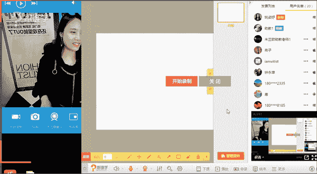
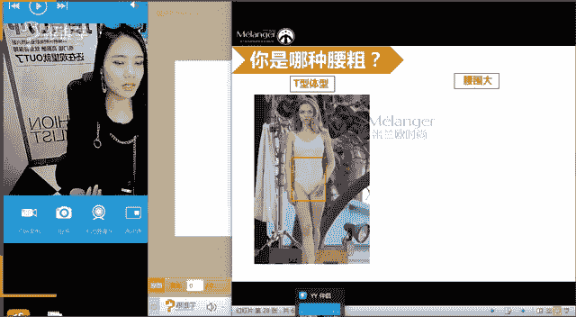
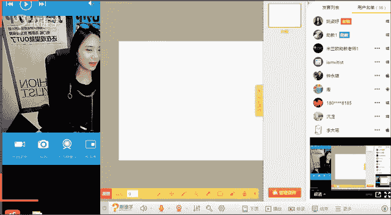
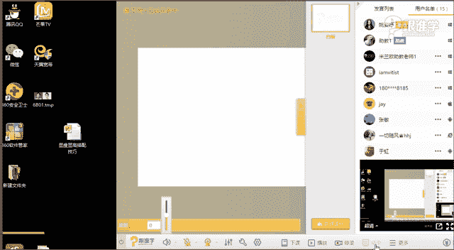

# 1、11服装《搭配秘笈之新版36计》：11脖子短腰粗肚子大的搭配_rec

OK稍等一下，同学们现在可以听得到我讲话吗？如果可以听得到的话，请打一，谢谢。蓉蓉你好，星辰阿瑞啊，晚上好，钟雄钟永雄同学，然后呃月明。

同学OK嗯，那刚刚吃完饭啊，吃完饭，然后急急忙忙的就赶紧来上课了。然后呢，因为也很长时间感觉好像很长时间没有看到大家一样，我们几天没有开VIP课程了。同学们记得吗？因为我是天天是线上上完，线上上。

就是线下上完线上上啊，就是有点晕了，也不太记得到底是这个几天没上咱们这个线上的VIP课程了啊，OK那还是很开心看到看到大家，因为看到你们的名字，其实呃很很有这种亲切感的啊。OK嗯。😊，好，谢谢蓉蓉同学。

那今天晚上呢我们的课程是呃关于局部的，也就是我们体态细节的问题。那例如说肚子大啊，例如说腿粗啊，其实今天本身我们没有腿粗的这样的一个在我们专业的课程当中呢，呃没有这样的一个板块当中的啊。

但是我今天呃觉得还是要跟大家讲一下这个这个这个点，因为很多同学对于这个知识点是非常非常关注的啊，那所以呢在这里是算是我们VIP的福利了啊，把这个课程送给大家好的，嗯。

那接下来呢我们就进入我们今天的课程当中，嗯，818，我说太好了，是吗？你就是属于腿粗的类型的，是吧？好，那我想问一下咱们同学们，今天呃比如说脖子短腰粗肚子大还有腿粗的啊，你们可以这个1234来打一下。

你们自己觉得自己是存在什么样的。问题，比如说脖子短呢，腰粗呢，还是肚子大还是腿粗呢？嗯，如果要是每一每一个每个人有可能站两三项，有可能啊。我觉得当然呃大部分人可能只是局部的啊腰粗啊或者腿粗的问题。

8185同学说是脖子短和腰粗。嗯，那其他同学呢？脸大是吧？OK脸大呢也可以跟这个脖子短的呃穿衣的方法其实是有相似之处的。只是脸大的话，它还会涉及到带配饰的这样的一个问题啊。

那呃腿粗胳膊粗OK那手臂粗的话，蓉蓉其实我们之前有这个有一个课程当中有讲到一个局部的问题。比如说袖子的这样的一个长短问题，对吗？那其他同学呢，咱们男同学有没有这样的问题的？好，那大家对于可能。😊。

中间是腰粗是吗？好的啊，大概明白了啊，那其实同学们还是有局部的这样的一个问题，特别想知道脸大可以配什么修饰啊，那这个的话我们在我们的专业的配饰的课程当中，脸型与眼镜的搭配当中呢。

我会跟大家来呃这个讲到一部分啊，O好嗯，特别想知道，那我们就敬敬请期待我们之后的专业的课程吧。啊，就不能透露一点点。因为我们今天的知识量非常大同学们，我今天有60多张PPT呀。

63页PPT要讲很久的好吗？好吧，我们今天就不多废话了啊，来一一的看看来看一下我们今天讲到的几个板块，脖子短。

腰粗肚子大和腿粗的那首先我们来看一下脖子短的那咱们有没有同学有刚才有同学有打自己觉得是自己脖子短是吗？好像其他同学呃没有认为自己脖子短的是吧？那其实我们说脖子的长短它是有标准的。我之前跟大家讲过。

我们说这个德国人，他认为人啊每一个部位。其实我们说人他这个美它是可以通过数据算出来的。而人的话其实就是有存在数据的。比如说我们的头顶到肚脐，肚脐到脚底的这样的一个比例就是叫1比1。618。

那么你越接近于这个比例，你的这样的一个从审美的角度上来看起来就会更好。那为什么我们说维纳斯它是这个断臂的。但是大家还是觉得他美。那是因为他的比例特别好。那我们呃中我们亚洲和白种人。

包括这个呃黑种人这三个比例当中，大家觉得哪一个比例是最好的。同学们，你们觉得是亚洲人还是白种人，那就是黄种人还是白种人还是黑种人？这三个人种，你们觉得哪个比例是最好的？🤧嗯。123黄种人。

白种人和黑种人。啊，是不是同学们都不知道啊？好，那我来给大家来解答啊。那其实在这三个人种当中，黑种人的身材比例是最好的。我们经常会说九头身，其实很多的国际超模，他们都是黑种人。那包括白种人。

他们的比例也要比我们好，他们是8。5头身，而我们亚洲人只有7。5啊，那所以说我们亚洲人的比例就是我们是大头娃娃，我们的腿相对来说都比较短。那所以说比例上看起来就没有那么好。

那这就是我们所说的身体的这样的一个比例。我记得之前呃有让大家教会大家这个方法啊，让大家去计算一下，不知道同学们你们有没有去计算自己的黄金比例呢？啊，如果女同学你们计算的话呢，计算出来之后。

你们还可以知道你们自己的这样的一个穿衣的调整方法，就如何让自己的比例看起来更好。包括男同学也是一样的啊，OK那我们说一下脖子。😊，短的这样的一个比例的问题啊，那脖子的话。

其实我们说脖子的这个标准比例就是从脖根处。那大家可以看一下，从侧面的啊脖根处，然后到你的锁骨窝，就是锁骨窝的这个位置中间这一段距离的，它的这样的一个标准，就是我们脸长的一半。例如说大家可以去用软尺。啊。

你们可以用去用软尺来量一下自己的脸长，也就是说从发际线到下巴的长度，然后量一下是多少啊。例如说你有可能是18公分，那么你再去量自己的脖根的位置呃，就脖子的脖子的长短，从脖根到锁骨窝，如果是9公分。

那么恭喜你你就很标准。那如果你要是短的话，那说明你的脖子就会比较短。那你脖子短的话，看起来整个人呃从我们所说的，从视觉上看起来的话，再穿衣啊，或者说发型它会存在一些问题。

那等一下呢就来给一呃给来给大家来解答怎么去调整这样的一个脖子短的问题啊。那么说为什么给大家讲到脖子短的这样的一个问题。其实我们说古代啊美人也是有标准的。比如说这一段话，大家知不知道？

凉的时候不要把头也抬起来啊，手如揉怡，肤如凝脂，领如裘棋，齿如护膝啊。那其实这这这个这这些的话呃我们说这是古代的对于美人就有的标准。比如说她说她觉得女性的手一定要很柔软啊。

像刚刚刚这个发芽的这种这种嫩草一样的感觉。那皮肤呢要很光滑。那她说的颈部领如裘奇，其实说的就是颈部的这样的一个问题啊，那呃对于美的话，其实在古代啊，她对于颈部的这样的一个美就有要求了。那齿如护吸。

说的是什么呢？就是说你的牙齿要像我们吃的那种西葫路里面的籽儿，那么那种洁白和整齐。O那这是我们所说的，对于其实不管是古代还是现代，对于我们所说的呃比例其实都有要求了啊O那我们接下来来看一下啊。

蓉蓉现在已经开始凉了是吧？嗯，那标准的脖长呢就是。脖根到锁骨窝，也就是等于你脸长的2分之1。那同学们你们可以自己去量一下啊。那接下来我们来看一下这一对组合认识吗？好，那一位是阿娇，一位是阿萨。

这两个同这两位呃小女生啊，现在已共已经不是小女生了。那同学们你们来看一下，你们觉得谁的脖子是比较短的一还是2。哪一位脖子是比较偏短的，一还是2？嗯，青新同学你好，随缘是吧？嗯，OK星辰说一是吗？

其他同学说的2啊，那其嗯那蓉蓉呢那有两位同学说的是二，有一位同学说一啊，月明也说是二比较短的okK嗯。好，很明显我们看得出来吧。小邱同学你好。嗯，那第二位其实就是阿娇，他的脖子看起来会比较短。

所以同学们，你们觉得脖子就是这个从视觉上来看，你们觉得脖子短的人看起来会有什么样的感觉？大家可以发言一下，你们觉得脖子短的人，为什么你看得出来阿娇的脖子短呢？你觉得你看他的时候，你有什么样的感觉呢？

胖好，其实脖子短的人他看起来会有一点这种我们所说的这种叫缩头缩脑的感觉啊。那就是整个人他看起来其实没有那么的精神。那包括大家说的对，显得脸大，显得有点胖，这个其实都是脖子短的人会存在的一些问题。

那从另外一个角度上来讲，我们说一般人胖了之后啊，也会显得脖子短，对不对？其实这就反观了脖子短的人看起来会有一点点显得啊好像没有这种正常的脖长的人，看起来修长或看起来会显瘦的这样一个感觉啊。

那所以说哎月明同学，你觉得自己的脸大，是不是因为脖子短的问题呢，还是真的脸大呢？啊？那我们来看一下，如果是脖子短的话，我们应该怎么去调整。好，法则一露锁骨的大领子。

那么大家来看一下这位啊这位女生这这位这个。美的小女生呢嗯她是维多利亚呃贝克汉姆的大儿子的女朋友。那大家可以看一下，她其实就是属于脖子比较短的那她在很我今天在看她大量的资料的时候。

就会发现她基本上很多的相片呃，她我我觉得她应该是知道自己的脖子短的问题。但是她穿衣服的时候还是存在很多问题，就是她会穿很多小圆领，还有娃娃领。那为什么呢？其实是因为她知道他自己适合那种可爱的感觉。

你看到她这张脸的时候，你觉得她是可爱的。她穿这种可爱的款式的服装，也是适合她的。但是因为她体态局部的细节的问题，造成她在着装这种比较年轻可爱的服装风格的时候呢，看起来会有一点点拘束感。

就是种好像交通堵塞了一样的感觉啊。因为他呃比如说他的发头发又堆积在这里啊，然后他的这个呃领口又特别小，那所以看起来视觉上我们就觉得很堵的慌啊，那所以的话呢它会比较适合这种相对来说要大一些的领型。

那同学们你们应该看得出来吧啊，那第一你看左边的跟右边的其实有一个很明显的这样的一个我们所说的延长感。因为这种大领型的话，它会有一种纵向拉伸的感觉。所以它看起来从脸到脖子啊。

到他这个我们所说的呃胸口的这样这样的一块皮肤，它会有一个通透感，所以看起来会显得更加修长。嗯，O好像呃月明说脖子好像不不是很短，就是脸大，而且是大方脸。好的啊，那那那这个你要这个呃自己呃。

注意一下这个问题啊，那你在穿衣服的时候，其实脸大的人，他其实跟脖子短的人穿衣服是有共同之处的。你在听呃这个脖子短的时候，一些局部的问题，我跟你讲到，例如说这一条其实就适用于脸大的人的啊。OK好。

那我们继续来看，这是第一条啊，同学们应该比较清晰吧，能够清晰的看得出来吗？嗯，这个是比较啊右边的比较正确。OK好，那我们继续来看陈妍希啊，她演的这个小龙女给我印象很深刻啊。

我相信大多数人也都知道这部剧因为他被黑的太厉害了。她的脸特别大。然后呢，最后大家送了他一个小这个称号叫什么呢？小笼包，就是他脸看起来特别的饱满，特别的圆，然后很大，所以就他他其实这种体态。

他演小龙女从我们所说的呃这种这种我不知道为什么导演。会选他啊，但是从我们这样的一个角度上来讲的话，它不够轻盈感。所以他他如果要是演这个角色的话，我们说经常小龙女会飞来飞去的对，没有仙气，不够轻盈的感觉。

所以呢他在呃这其实他他的这个我们所说的这个体重啊，体脂有一部分原因。那么们来看一下他日常的着装当中，同学们啊，左边跟右边你们觉得哪一个看起来会显得比较的通透啊，就这种透气感会比较好。

或者看起来他的脸没有那么大，脖子没有那么短，他其实就是脖子属于比较短的，她的脖子也比较短啊，那大家可以去观察一下，就是如果有机会看到的话啊，嗯，你们觉得哪一个看起来脖子比较短。

你们觉得哪一个看起来脖子比较显短的一还是2OK好。嗯。青青同学和星辰同学，包括永雄同学啊，我不知道永雄同学回答的是是你觉得哪个显短呢？那我们来第二个，其实它会比较的显得脖子短，的确是这样的，为什么呢？

因为这个立领。所以对，是的，OK嗯，那好的，我理解了啊。那脖子比较短的人，其实他穿立领的看起来没有那么好，也就说明什么问题。那在这里大家可以想象一下，我们的国粹旗袍是不是也是属于立领的。

那如果一个人他的脖这个脖子比较短的时候，他穿这种旗袍可能看起来就没有那么好看啊，因为旗袍他也需要这种脖子啊很修长。然后呢肩要瘦瘦的窄窄的，不能特别壮的那种，穿起来才有那种韵味啊。那所以说呢那很明显。

他这种棒球的这种呃这种有点夹克的这种小立领不太适合脖子短的人。所以相对来说哪怕他的领位没有那么低。但是他把这个锁骨露出来，也会比他穿这种立领的要好OK好，那这一点大家能看得出来吗？嗯，好，我们继续来看。

那赵薇赵薇其。这也是属于脖子比较短的。但是在生活当中，大家有没有发现呢？或者大家有没有观察到这个我相信可能很多同学啊应该不会这么细致的去观察明星和艺人啊。

那因为老师是经常会涉及到要呃人物造型啊或者明星艺人的这样一个造型，所以会看大量的资料。那赵薇其实他属于脖子比较短的，从哪看得出来？同学们，例如说这两件都是白衬衫啊，都是带领的这种白衬衫。

那两个人都是把头发放下来的，对不对？那好，我想问同学们，你们觉得哪一位看起来脖子比较短。一还是二是赵薇还是范冰冰？啊，赵薇啊赵薇其实他的脖子看起来是比较短的那其实挺明显的。你看你因为范冰，你看范冰冰。

他们两人穿的都是立领的领子哦。同学们，你看范冰冰穿的这个领子到这儿，而赵薇穿的领子都快要到懒都快要到脸的感觉啊？那所以说呢如果脖子比较短的人，他在穿这种呃白衬衫的话呢，有没有什么方法呢？同学们。

你们觉得如果要是脖子短的人，他穿这种衬衫有没有什么方法？🤧嗯。他这样穿其实相对来说没有那么好。那等一下我会给大家讲到，唉，如何去穿，才会看起来比它现在的状态要好。啊。O我们继续来看。

那呃所以说赵薇穿起来就没有那么好看。那这这一张也是什么呢？赵薇穿衬衫的服装。在这里它运用了两个细节。那第一个就是它的发型变短了。第二个它带了配饰，那这两个对它有没有作用呢？啊。

等一下我们在后面的课程当中会给大家去揭晓。那么来看一下，那它的发型虽然变短了，但是其实它的头发还是依然堆积在它领位的这个位置，再在再加上它的领子又是有领型设计的，也就是说它并不是说圆领啊。

就是这种无领的这种这种领口的服装，无领的领口服装的话，它看起来可能会比较清爽一点。而这种本身有这种领子的，它看上去就已经有这种复杂的繁琐的感。感觉那再加上赵薇，他本来脖子就短啊，然后又有领子。

又有头发堆积在这里，看起来就没有那么舒服。反观这一反观这一张相片呢，大家可以看一下，是不是看起来舒会舒服很多。发型的长度还是一样的，还是没有改变，但是改变的是什么呢？他的领领口的这样的一个位置。

当你会发现他的领口的位置下移的时候，这种抹胸啊，那他看起来脖子的线条会纤长很多。OK。小邱同学，你又来晚了啊，你每次都迟到，我都知道有一次你来的时候也迟到了。那你这一次又迟到了。

所以你不知道怎么去判断自己的脖子短还长。那老师在前面的课程当中呢，再啊就是一开始的时候就跟大家介绍了啊。所以你下次要早一点来啊。那我再跟大家来重申一下，脖子的长短呢。

其实就是你脖根到锁骨窝的这样的一个位置的长度，也就是说它是你的脸长的2分之1。首先呢你要可以用皮尺去把你的发际线到下巴的长度量出来，再用皮尺量你的脖根到锁骨窝的长度量出来。如果比如说你的脸长是18公分。

而你的脖子长是9公分，那么你就是标准的，它是你的脸的2分之1。如果你是8公分7公分，那你相对来说就短了啊，OK好，小邱同学迟到了吗？啊，那接下来我们来继续看。啊那这种领型的话呢。

虽然在他头发依然是堆积在他的颈部的位置，但是他看起来也会通透很多，舒服很多。O那我们继续来看啊。好，吃草莓，吃草莓不好好上课啊？O好，那我们继续来看那这张图片是不是也是一样的啊。

我们会发现是不是赵薇现在变美了很多。那其实赵薇的衣品相对来说比他以往哦或5年之前我们都不敢想象他的着装是什么样的啊，那他现在的话其实已经呃好了很多。赵薇因为他的头很大，他的比例脖子又短。

所以他其实比例不是特别好，也就是他的头跟他的身体比例看起来不是特别好，所以他穿衣服的时候需要调整的问题还蛮多的啊，那我们来看一下，那这种小领子比他穿这种领子要什么呢？相对来说拘束感很重啊。

这个也是有点堵的感觉，所以他还是要穿这种什么呢？不一定非要穿这么低胸的啊，因为这。种是晚礼服。那其实在生活当中他可以多穿一些大领口的。比如说U型领大U领大V领啊，那包括这种铲型。

就是我们所说的这种铲型领啊，不然就是这种形状的，有点像一个这种呃我得我给大家举个例子啊，就是这种这种这种这种感觉的啊，但是要往下挖，它是方的下来的这种有点像方形领的感觉啊，它叫也叫铲型领。

那那种领子的话，看上去都会比较通透感。所以他一定会看起来比他现在的状态要好啊。OK好，那这是第一条法则，也就是我们所所说的要穿什么呢？露锁骨的大领子，这一点大家理解了吗？如果理解的话，请打一好吗？谢谢。

嗯，好，那么继续来看法则2，发型要清爽。嗯，轻新同学ok永雄同学好嗯，那其他同学呢嗯如给给老师一个回应啊，okK好，那我们继续来看法则二，发型要清爽。那也就是说什么意思呢？刚才我我反复的提到。

赵薇的头发，他一直堆积在他的脖子的这个长度，对不对？那其实这种发今年特别流行，这种有点短波波的感觉。那如果脖子修长的人留这种发型非常漂亮。但是如果你脖子比较短的啊，你在穿衣服的时候，一定要注意很多问题。

第一，你的这样的一个领型要比较大一些啊，那呃看上去他会比较清爽一点。那第二呢，如果你要是必这个这个这个就是你的脖子真的很短，那么你可以发型的长度要短一些，不要刚刚好堆积在这里。

例如说有很多人他们喜欢烫发，对不对？同学们烫卷发的时候，刚好他把所有的卷都堆积在这个位置，如果你脖子又短啊，你全都堆积在这儿，你还穿老师今天穿的这么小的这种领口啊，就比如说你穿这么小的领口。

那你真的就是像北京的交通啊，并不是并不是说北京的交通了，就是所有衣。一线城市的交通堵啊，就是交通堵塞了。OK那这是我们所说的这个那这两张图片，陈妍希和刘诗诗同呃刘诗诗，那他们两个人大家可以看得出来吗？

那陈妍希其实他就是属于脖子比较短的。很明显啊。你看这个这个刘诗诗的脖颈非常修长。但是陈妍希他看起来就是脖子比较短啊，那我们继续来看一下，那这是他也是留的波波头的这样的一个短发。

刚好呢他是不是刚才老师形容的头发刚刚好堆积在这里，领子又很小，那我们接下来来看一下，当他的头发变短的时候，同学们然后她的领子的位置又很下移，也就是说他比较延有延伸感的时候。

这个状态是不是看起来会比他这个样子舒服很多。同学们看起来就没有那么拘促感啊，赞同吗？嗯，好，那我们继续来看那这是我们所说的，当他头发变短了啊，然后穿的这种一字领的时候，O那最后来。来看一下。

这是我认为他有史以来的造型当中最完美的一套服装啊。那我是觉得他这套跟他的形象啊相对来说这个嗯还是比较虽然有一点点小性感，但是还是符合他的气质的，其实还是有点这种可爱的这种甜美的感觉啊。

但是他是有一点点小性感的，有一点女人味蕾丝的，而且又很显瘦啊，第一，他为什么他能够做到我们所说的这样看起来又很通透，然后又很显瘦的感觉。那跟他的发型跟他的领型有很大的关系啊，最气质是第三章是吗？嗯，好。

那我们来看一下，第一，他的头发是不是盘起来了。当他盘起来的时候，他整个头我们都觉得变小的同学们有没有感觉？那当他的领型又是这种深V的时候，从他的脸到他的脖子都有了一个很好的修饰，所以他看上去就瘦了很多。

然后也很。显气质。那所以说同学们发型啊啊，然后这个领型啊对于脖子短的人修饰非常的好啊，也非常重要。这一点。那如果脖子短的同学，你们要好好利用这两点了。那接下来我们继续来看配饰啊，这个法则3。

配饰纵向拉伸法。那我们来看一下，在冬天的时候，我们是不是特别喜欢穿高领毛衣。比如说这个韩国欧巴啊特别爱穿这种他们的暖男形象，基本上就是高领毛衣加大衣，对吗？当然那个颜色可能不会穿那么深。

他们穿的可能是比较浅的色彩啊，那我想问咱们现在现在在教室里的同学们，你们是不是呃那边的天气应该很冷了？啊，呃，你们现在有没有穿到高领毛衣呢？如果穿到的话，请打一好吗？嗯。😊。

应该大家嗯对我觉得除了南方以外啊，今天广州都已经降温了，挺冷的。好嗯，那之前呢我有这个跟嗯跟在讲课的时候有讲过，就脖子短的人呢，尽量不要穿高领。但是如果穿高领的话，那如果你在穿高领应该怎么选择高领呢？

下雪了是吗？嗯，好，那挺那看能看到雪了啊。如果要是脖子比较短的，选择高领这种衬这种毛织衫的时候，可以选择贴近肤色的就是说你选择浅色的会比较好啊。对，是的，蓉蓉同学说穿穿浅色。嗯。

那呃当然如果是它是裸色的会更好。那是这是我们所说的啊，这个脖子短的人啊，穿这种高领衫。那另外的话呢，如果我们必须要穿深色的，我们怎么去修饰呢？我们来看一下啊，那例如说。这位有没有人认识的？呃。

白色算浅色了，白色已经是最浅的了。白色就是呃所有的色彩。例如说粉红色、粉蓝色呃草绿色就是特别浅的那种色彩啊，那种马卡龙色系都是加了白色，所以他们才变得变成浅色的，所以白色是最浅的颜色啊。

但是接近越接近于我们肤色的这种色彩，它会越对于你的修饰感越好。比如说裸色啊，ok好，那我们继续来看一下啊，阿瑞同学说长款丝巾或者是长款项链嗯，非常好。是的，毛衣链长毛衣链。例如说呃嗯很多脖子短的人。

你们在选择领型的时候，比如说今年特别流行那种一字领，对吗？啊，很多学同学说老师一字领特别好看。今年特别流行，我想穿怎么办？但是我脖子又短，那么呢？我就建议大家可以去加一串这种长的。项链。

比如说这种长项链啊，那那这种长项链的话，它就会对你有这种延伸感啊。OK嗯，是的，罗晋他是罗晋啊，跟唐嫣正在谈恋爱呢。好，那这是我们所说的男生啊，男生其实都可以戴这种项链，别说女生了啊。

女生的项选择太多了。比如说那种什么珍珠项链呢，然后那种这种吊坠式的呀等等啊，有很多的选择。那么们接下来来看一下，这回大家都认识吧。杜海涛同学那杜海涛呃他现在已经很瘦了啊，这是他胖的时候的项链。

那我们来看一下，他选择的这种小领子的呃，这我们说胖的人，他自然而然看起来什么呢？脖子很牛逼，也会变短，比如说大家再想一下刘欢刘欢她本身就是脖子短，再加上她又胖脸又大，所以更短啊，基本上就是这种形态了啊。

那呃我们说胖的的话，一般看起来。脖子都会短。那我们来看一下，在他胖的时候，他是怎么穿衣服的啊，他在上鞋，他在上节目的时候，大家可以看一下啊，他穿的领子是不是挺小的啊，还是有点小高领。

那他这种服装的造型设计就可以什么呢？让他显瘦一些，有没有发现同学们，其实这两张它是同一时期的，就是都是挺胖的时候，但是你会发现他穿这种的时候会比他穿这种要显得有精神而且显得瘦啊。

那这都是因为配饰的延伸感的作用。那么来再来给大家看一下他现在的状态啊。有没有惊艳到你们虽然没有特别帅，但是已经比他这个样子帅好多了啊。那他这个时候就他是参加了真正男子汉的节目，然后这个这个锻炼。

然后这这个就瘦下来了啊。那大家可以看一下，同样人瘦了之后啊，你会发现真的每一个胖子都是一个潜力股。然后瘦了之后，脖子自然小了一圈，有没有发现同学们穿这种小领口的时候啊。

就算他不戴项链也会比他胖的时候要好，再加上他又带了这种长的吊坠项链，会什么呢？把它这种这种我们所说的这种呃这种延伸感做到更好了啊，陈天同学说惊到了。好，那所以说呢啊这是第三条叫配饰。

我们所说的叫延伸法啊，配饰可以纵向配饰拉伸法。那么接下来看啊，那这一张是不是我们就是我们现在的状态。我们平时冬天的时候就会穿高领，很多女生都会穿。啊。😊，我们就可以戴这种拉长型的项链，它就会那么？第一。

它还可以起到装饰作用。第二，她又可以拉长你的脸型。那同学们你们可以看一下这位女生，她的脸是不是特别圆，所以她很聪明，戴了一串，带了一条这样的一个项链，大家可以想象一下，如果她没有戴这个项链的话。

几乎我们所有的视觉肯定都是在这一块那她戴了项链之后，她是可以有想将这个我们所又可以转移注意力法啊，就是我们所说的转移注意力法。啊又可以拉长她的这样的一个线条感。O好，那这就是我们所说的这个配饰延伸法。

那继续来看啊，其实很瘦的人，比如说刘诗诗，那她穿着高领的时候也只剩一个脸了。大家发现没有吗？没有脖子的时候，其实还挺可怕的。我觉得啊，那大家可以看一下，其实这种我们所说的配饰的延伸法则。

其实就跟V领制造V领的方法是一个道理啊，是一个道理。所以呢大家也可以去。佩戴一些或者是购买一些，或者是呃你们要要这个多准备一些啊，我建议大家要多准备一些配饰。因为配饰对于我们所说的一个服装风格的改变。

或者说提升时尚度是非常非常好用的啊，okK好，那这是我们所说的这样的一个配饰的延伸的法则。那继续我们来看一下这张图。那这张图的话，大家有没有发现有什么小小小奥秘在里面。同学们依然是脖子短的人，对不对？

那刚才那种是属于拉长型的项链，但是今年是不是特别流行cholkcker啊，这种这种我们所说的这种比较紧贴脖子的项链装饰品。那这种装饰品。

其实这个就是我第一张图跟大家介绍的是维多利亚和贝这个维多利亚的儿子啊，就是贝克汉姆的儿子的女朋友，那他呢。不对啊，一个是V领，一个是一字领。同学有有同学说啊不对，那其实是来源于他这条项链。

同学们他的脖子是不是很短？同学们，你们可以看一下，当他脖子很短的时候，他还带这么粗的这种又宽的这样的一个抽口的时候，他看起来脖子会更短啊，如果脖子比较短的人又想颈椎流行。

那么你可以选择一些比较细的这样的一个抽er理解了吗？啊，是的，嗯，我是圆脸，可是我也喜欢颈链，现在不是老师在教你方法吗？形成啊如果你是圆脸，然后你脖子有比较短，那么你可以选择细一点的这种颈链。

或者说那种通透感的，什么意思呢？看上去有蕾丝就是蕾丝的感觉，不会说这么一圈啊，就勒在你脖子上的这样的一个感觉。那接下来我们看一下有更好的一个选择是什么样的呢？比如说他带这种细的就没有带这种。

接近于肤色的这样的一个项圈要好。那这种的话其实也是今年非常流行的，但是它是接近于肤色的金属的质感，那是不是看起来会更好呢？啊，那这是我们所说的在配饰的选择上，如果脖子短的人，应该怎么去选择啊。

那我们继续来看。那呃OK接下来漂亮是吗？好，那同学们来看一下这一张适合脖子短的吗？赵薇的这个形象大家觉得适合脖子短的吗？我们来看一下适合打一，不适合打2。嗯。😊，嗯，适合打一不适合打2okK好。

在这里有同学已经开始纠结了啊，到底是适合还是不适合呢？好的，我们来看一下啊，那其实这一张的话呢嗯。🤧已经是相对来说比较适合的。为什么呢？我们来看一下赵薇，那有同学说了，老师，我脖子短。

那我不可能一辈子都不穿不穿这种小领口了吧。啊，那我脖子短，但是现在特别流行这样的发型我就要留怎么办呢？所以说他就要需要调整。那第一，他的头发没有做到我们所说的很清爽，对吗？那第二。

他的领子没有开的特别大，那他怎么办呢？他就带了一条长项链来进行延伸，就是我们所说的纵向拉伸调节啊，能理解吗？同学们，所以说呢O陈倩同学说配饰过于粗壮啊，但是它是不是同时也有这样的延伸性呢。OK好。

那这是我们所说的配饰的延伸法啊。当然我为什么我们看上去这里不通头？呢？是因为它第一它的发型不清爽，第二，它的领子太小了啊，O所以他如果要是这种更细一点的链子或者更再长一点的链子，当然会更好这种效果啊。

但是现在这样搭配也是可以的啊。那我们来看O那这个适合脖子短的吗？同学们嗯，这个还是比较明显的啊，我相信百分之百的同学都可以回答。对啊，那这一张的话，其实它就是属于我们所说的大V领，对不对？

那我相信有很多同学会觉得啊老师这种太性感了，我接受不了，没关系，女生你可以小小领口一点啊。男生啊你也可以大领口一点啊，把你的肌肉露出来。但是如果没有肌肉的话，就不要穿这么低的，因为。会很娘。

OK那如果男生的话呢，你没有这个我们所说身材不是特别好，就绝对不要穿这么低领的。就是你看起来很瘦的那种感觉，穿这么低的话，真的会让让人看起来有点娘的感觉啊。OK好，男生的话其实不需要那么低啊。

大一这个这个稍微这个呃有露肤一点，在这个锁骨下面一点就可以了。好，我们继续来看嗯。那刚才我们我们以上呢讲到了这个我们所说的脖子短的三条法则。第一条就是露锁骨的大领子啊，第二条呢是发型一定要清爽。

比如说呢不要堆积在这个位置。并不是说你一定要特别短啊。那你要么就像老师这样可以长下来啊。因为今天老师穿的是黑色的衣服，所以呢大家可能看不太清楚。那可以长一点啊，那要么你就长，要么你就短。

但是不要堆积在脖子的这个位置能理解吗？就像冬天很多人特别喜欢把头发放下来，然后又穿着高领，然后又有帽子啊，然后又围着围巾，整个人这儿这个这一圈都是特别短的感觉，然后你头发又堆积在这里。

看起来都特别不清爽，所以冬天呢啊有同学说老师我把头发扎起来太冷了。但是如果你想让自己看起来清爽一点的话呢，建议你要把头发扎起来，然后呢穿着这种围着围巾啊，看上去就会比较清爽一些O好，那这种。

所说的第二条。那第三条呢是配式纵向拉伸板。这三条同学们都理解的话，请打一。那接下来我们继续看一下我们还接下来的知识内容啊。好。嗯，都理解了是吗？好的，稍等一下啊。

ok好，那我们继续来看腰粗的搭配法则啊，水桶要怎么破，有没有腰粗的？来，那腰粗的话呢，基本上其实它有两种情况。第一种呢叫它是T型体型。第二种是腰围大。有同学说老师什么意思啊，就是T型体型。

他为什么会显得腰粗呢？啊，其实以前呢我是没有这样的一个概念的。直到有一次我给一个艺人造型的时候，他一直反复的在跟我强调，因为我们给艺人造型的时候，经常是看不到艺人本身的啊，就是说就是他不会过来试装。

就是你给他提前选你看你知道他要出席哪些服哪些场合。但是呢你他不可能过来试装，所以你要了解他的体型的这样的一个问题，他的三维，他的身高，他的体型细节问题，然后帮他选择服装。那当时呢那个艺人他就告诉我。

他说老师我觉得我我的腰特别粗，我真的腰很粗，所以我就一直想象他的腰真的很粗。那最后我给他选了几套服装的时候，我都不敢给他选。

那种特别就是很紧的那种服装啊，因为怕他的腰特别粗啊，当我见到他就那因为第二天要参加活动了，我们必须要试衣服的时候，我把所有的衣服都已经试选好了。然后见到他的时候，我我就第一句话我就问他。

我说你的腰哪粗了，我看不出来呀。她说我就觉得我腰很粗啊，你看看我的腰没有腰线，那这个时候其实我才理解到她所说的，她觉得自己腰粗是什么意思。那么来看一下同学们，例如说这一位女明星她其实就是T形体型。

那我们可以看一下她的腰跟她的臀几乎是没有太多的什么呢？差距。例如说我们为什么觉得X体型，她是比较有女人味的，因为她的腰特别细，她的臀比较松啊，那她的就会有一种曲线感能理解吗？同学们啊，我要说的叫曲线感。

所以当你看这位女明星呢，她就是一个什么呢？从上到下就是一个什么？我们所说的像杯子一样，或者说像可乐瓶子一样，从上到下是直到顶的，那就没有没有没有这种呃臀没有这种差差距，腰跟臀是没有差距的。

所以她看起来线条就没有那么好。那那个时候我才理解哦，原来有人认为自己的腰粗，她其实是有这样的一个情况的。那这就是我们所说的T型的体型。那第二这是一种嘛啊。那第二种的话就是真的腰很粗了哈。

那我相信刚才咱们同学也有说，嗯，我是真的腰粗。那我们来看一下啊，那这种真的是属于腰粗啊。O那我们来看一下这两种情况的话，它的这样的一个调整方法也会不同。那例如说我们在体型当中啊。

那我相信大家都是咱们的VIP学员都已经了解体型的问题了。那我在这里就大概的过一下就可以了。同学们，那我们体型分为了四类，那AT型体型呢，它就是肩宽，然后什么呢？胯窄其实就是我们的臀窄。

那它的腰呢可能看上去就没有腰。跟因为没有跟臀没有这样一个差距，就所以看起来曲线不好。所以呢导致很多人认为自己的腰是粗的那我们接下来看一下啊，那其实它的调整方法。

那我们说如果针对于这类型的人觉得自己腰粗的话，它其实就是按照T型体型的着装就可以了。那我们来看一下。T形体型的话，它的肩大于臀为5厘米，优点是什么呢？啊，腰短腿长，然后胸围丰满，那而且比较显高。

那它的缺点就是臀较窄，线条不够女性化。那所以T形体型，它是上半身宽，下半身窄。我们再把它往X体型去塑造的时候呢，我们就可以加宽下面的量感，比就说上下身的量感，比如说我可以穿蓬蓬裙。

那这样的话我觉得上下的这样一个就平衡了，它看上去呢视觉感就会比较顺了啊，那我们来看一下，那根据这两条呃这一条的话呢，我们怎么去打造啊，比如说发发则一加宽裙摆对比法。那我们来看一下同学们。

那例如说呃米兰达腿它穿的这条裙子，它就是直筒型的。从上到下没有这样的一个什么呢？我们所说的不是收腰放摆的，它就是修身的款式。那所以说呢如果要是这种T形体型的人呢，它穿上去没有修饰作用。

所以那这种加宽裙摆的这样的一个方法，会对比的他的腰比较细。我这样讲的话，同学们能够理解吗？啊，它这种对，这个时候大家看起来就是X体型了。那这就是我们所说的加宽裙摆对比法。

所以这种T形体型的腰粗的女生呢啊你们就可以按照这样的一个方法去打造。OK好啊，那呃第二点的话就是我们所说的腰线制造腰带制造腰线。那因为她的腰其实它这一类型的人，她并不是说真的粗。

所以呢她可以用腰带来制造她的腰线出来啊，那其实她看起来并不粗，我这一点一定要强调啊，那如果有梯形体型的同学的话呢，不要走入这个误区，你们腰不是真的粗啊，那O好，那这是我们所说的T形体型的这样的一个情况。

那我们来看一下第二种就是什么呢？真正的腰围比较大的了。那我们来看一下这种体型的人应该怎么去打造。那第一点是什么呢？粗腰修身会更好。那我想问大家同学们，你们觉得现在。这个博主这个是非常有名的。

非常会穿衣服的，被称为叫曲线女孩的一位胖博主。她在全世界来讲都是非常有名的胖人的穿衣达人。那大家觉得她这一套好吗？你们觉得可你们觉得是好的话，请打一，觉得不好的话，请打2。OK我看到答案了啊。

有同学觉得好，有同学觉得不好，那我们来看一下。😊，OK同学们啊，当如果你的腰是真的粗，我跟大家讲过一个案例啊，就是呃例如说我们说所呃我之前教给大家所有的体型的调整方法都是针对于大众而言。

如果你的是你是真的腰很粗。那么呢？或者说你是真的很胖，你穿衣服就要合体就好了，不要再穿太过于什么呢？膨胀感的，比如说横向拉伸的这种感觉的服装，它会让你显得更加的胖。那例如说一个什么呢？H体型的人。

瘦H体型的人，他应该穿收腰放摆的服装，那么它就可以变成X体型了。可是如果是一个特别胖的H体型的人，你还穿收腰放百，那现在就是这种效果啊。同学们就是这种效果了，他就是什么呢？整个人都往两边膨胀。

所以看起来会更胖。所以同学们你们觉得一好还是二号呢啊。那如果腰身比较粗的女生，那还是要穿什么呢？相对来说修身的会更好。嗯，OK好，嗯，那谢谢永琼同学给老师的反馈。

那呃我为什么要在这里找一些特别胖的人来给大家做案例。那是因为我要告诉大家的是这么胖的人，他按照这种方法去穿衣服都会好很多。那么相对来说你们其实应该达不到他们这种蹲位的。

我相信你们绝对达不到这样的一个蹲位的。所以如果你们按照这样的一个方法去穿衣服的话，绝对会让你瘦5到10斤啊，O好，那我们继续来看法则二，瘦身阴影是你的好朋友。什么意思呢？我们来看一下这种服装的设计。

大家可以看一下他是那同学们来现在可以回回答我一下啊，黑色和这种绿色，你们觉得哪一个颜色是属于前进的感觉。是绿色前进还是黑色前进？如果是绿色，请打一，黑色请打2。嗯。O。好，嗯，谢谢同学们。好。

我看到大家的答案了啊。是绿色的前进，对吗？所以说啊当绿色前进的时候，你会觉得哇原来这个人他可能就只有绿色的这种线条这么瘦，因为黑色它是收缩的，它会把你的这个呃而且它是后退的。

你的视觉感会觉得啊它就是它就是这么瘦啊，其实是你的眼睛欺骗了你啊O好，那这是我们所说的这种设计就叫瘦身阴影，这款裙子卖的非常火爆在欧美啊。那我们继续来看啊，那第二种其实是同一个品牌的啊。

它这个品牌设计很多这种类似于瘦身阴影的感觉。那么们来看一下它这个不是拼接设计了，它不是色彩的拼接设计，它是在什么呢？面料上做变化。比如说他运用了这种精致的精这种我们说精密的面料和这种镂空感的面料。

让你视觉上看上去。觉得这个人很瘦啊，OK好，我们继续来看。那这是这就是什么呢？很胖的人穿上这条裙子之后的效果。那么来看一下，其实这一件服装同学们他会更显瘦，为什么呢？这个设计师太聪明了，他把什么呢？

瘦身的这个部分做成了肉色，那么其实看上去就感觉好像已经弱化了，而黑色又很明显，你就会觉得哇，这个人真的只有这么瘦吗？他的腰真的只有这么瘦吗？好啊，很喜欢是吗？嗯，第二个适合梯型的人啊，蓉蓉同学说。

第二个适合T型的人嗯。这个的话呢呃其实还不是特别好，适合。如果梯形体型的人穿起来还不是特别好。因为第一它的领子是比较高。第二，它这种镂空设计都在上半部分，我们的注意力都在它肩部的位置了啊。

那如果它看上去是比较壮的话呢，那我们的注意力都在这儿了啊，O好，那这是我们所说的瘦身阴影的这样的一个拼接设计，那它可以运用色彩做拼接，可以运用这种面料来做拼接。那这一点大家可以。

那我们现在来看一下这一条，那同学们你们有没有发现这个它玩的是什么呢？它玩的是线条的变化。例如说它在你腰部的位置做的比较密实，那大家可以看一下啊，这一块它做的是比较密实的而上面它的线条变得疏松了。

你会觉得当它密实的时候，你会觉得它是有一种瘦身的效果在的啊，那包括这一件其实它也是运用了瘦身衣阴影的。原理做的这样的一个拼接啊，但是他玩的是这种我们所说的图案的线条的变化啊。OK好。

那这种其实也是可以达到我们所说的瘦身效果。好，那这一个女生呢也是不是很胖，那她穿这种我们所说的豹纹，然后显得她的这种我们所说这个腰围看起来会更宽。那接下来我们来看一下同一个人啊。

当她穿这种有瘦身阴影的效果的时候，是不是看起来会更瘦呢？嗯，好。那这是我们所讲到的在腰比较粗的，有两种情况。第一种呢，它是T形体型啊，有有一部分人他会认为自己的腰跟臀围他是没有差距。

他就觉得自己是腰粗了。其实你这个想法是错误的啊。但是呢我依然在这里给到大家方法。那比如说啊第一条叫法则一，加宽裙摆对比法，第二条腰带指造腰线。那第二个是真正的腰围很大的人。那也就真正的腰粗的人啊。

那么来看一下第一条是粗腰身啊，修身会更好。那第二个是瘦身阴影是你的好朋友。OK好，腰粗的这一个法则，同学们，你们听懂了吗？啊，如果听懂的话呢，请打一，如果有不理解的同学呢，可以打2啊。好。

那我们继续来看啊。那如果有不不理解的同学可以在我们这样的一个课后啊来给大来给老师做这样的一个提问。好，我们继续来看肚子大的搭配法则啊，肚子大的搭配法则呢，我相信其实刚才永雄同学是不是觉得自己肚子大。

那我们来看一下啊，那肚子大，其实老师之前讲过一个叫O型体型的人？其实他跟O型体型的用用这样的一个方法有些类似之处的啊。好，我们来看一下，那肚子大的人呢，他有哪些劣势？好，同学们你们现在可以来抢答一下啊。

你们觉得肚子大的人他有哪些劣势呢？或者他有哪些就是穿衣的困扰困扰呢？嗯。

给大家30秒的时间，考验你们的打字能力。好。难看。😊，1611同学很很很很直接说嗯难看OK清新同学说显胖啊，先疼度说显老没型。是的嗯，显矮O那胖了之后它就是变什么呢？我们所说我们经常会说矮矬，是不是？

那其实啊又矮又胖那等等。那其实一个人他胖了之后说明什么呢？他的体积变宽了，当你变宽的时候，你的人看起来就会压缩就会变矮。那我们在讲到显瘦和显高的原理的时候。

我们会发现我们通过穿衣服的方法制造纵向线条其实就是让一个人显瘦和显高啊，OK好，丑到没朋友啊，1611同学说话很犀利啊。好，那大家说的这些都是啊，我们所说的小胖子的这样的一个困惑啊。

那我们来看一下他们在穿衣的时候到底有哪些问题。比如说第一步啊，第一个肩啊。就他们买衣服的时候，经常是肩位比较合适，但是肚子呢扣不上，有没有这样的同学？我相信咱们教室应该还没有胖到这样的一个程度吧。好。

那第二点，肚子大是比较显腰粗的啊，这一点是毫无疑问的啊。好，第三点只敢穿黑色衣服。嗯，第四点，不好买裤子？那为什么？因为他会发现他下面提的上去，但是他到裤肚子的这个位置的时候就扣不上去了。

是不是同学们会不会有这样的问题啊？所以说啊肚子大的人呢，他其实有很多的困扰的。那么老师在这里教给大家呢是穿衣的方法？但是你要想从根本上去解决的话，建议大家去办一张健身卡？

你么感觉突然我是这个这个健身教练的感觉啊？OK好，我们来看一下法则一，外潜里身法，之前其实跟大家分享过这样一个方法啊。那我们来看一下鸟叔算不算肚子大的。同学们来看一下啊，你们觉得鸟叔鸟叔算不算肚子大的。

他他那时候。那个江南江江南style啊，他其实就是什么？每次我看到他跳那个舞的时候，我就觉得他肚子抖得很厉害啊，真的是肚子很大。而且我就觉得他哇，体重这么庞大，还能跳的这么轻盈，我很佩服他啊。好。

那大家可以看一下，这是鸟叔的标准舞姿啊。然后呢，这是他穿一件白T就是白衬衫的时候，他的这样的一个肚子的让这个这个感觉。那我们来继续看一下啊。😊，他平时特别喜欢这样穿，对不对？

他经常穿的都是这种衬衫西裤加这种礼服款啊，然后再加这种牛津鞋啊，那这是他比较常态的穿衣方法，但是我们要说的是他里面穿的是浅色的外外面穿的是深色的对吗？同学们，所以他看起来其实对于他的肚子是没有修饰度的。

那我们来看一下第三章是不是突然觉得啊他的肚子不见了。其实他的肚子大家仔细看的话，绷的衣服还是挺紧的啊。但是你会发现我我在这里要说有同学说老师我觉得他肚子还在呀啊，那我要告诉大家的是。

我们教给大家的是如何从这个色彩上或者这种款式上的选择，让一个人显瘦，并不是说真正的从生理上当让他突然变成没有肚子的小瘦子啊，那是不可能的。O那大家可以看一下嗯。他穿了这种深色的时候。

你会发现他的这样的一个什么呢？这就是我们所说的里深外浅，你突然觉得他肚子没有了啊嗯。有同学说看不清楚嗯，我怎么觉得嗯老师这个嗯我怎么感觉比他大啊。好，你是感觉自己的肚子比他大吗？

好呃，说不能穿完了不能穿浅色的了吗？呃，当然你穿浅色是可以的，只是穿深色啊，然后包括这种搭配方法，其实大家应该可以看得出来吧啊。那我相信123同学们应该是很明显的可以看得出来。那我现在要采访一下大家啊。

123你们觉得哪一个最显瘦是不是三最显瘦啊，那所以说从视觉上来讲呢，我们认我们从搭配上来讲，第三个会让你最显瘦。但是并不是说你不能完全穿浅色，我们是制止不了的。制止不了的，这是相对来说而已啊。

那当然在夏天的时候还是会穿一些浅色的但是一定要注意面料的选择，例如说你在选择面料的时候，不要选择过于什么呢？那种有光泽感的啊。那比如说有图案的，也就是我们等一下要给大家讲到的啊，那接下来我们一一来讲吧。

好嗯。嗯，你穿浅色也是这个模样是吗？好吧嗯，这是很正常的事情啊。O好，我们来看一下。那这张图片当中也是一个非常非常胖的女博主啊，那大家可以看一下，那其实她上半身穿的是浅色，下半身穿的是深色。

其实这样已经对于她来说是有修饰感的，我们会觉得她肚子好像是没有的，但是她这个部位是不是显得特别膨胀，也就是她胸部的位置显得特别丰满，但是这种女女生的话呢，其实她这一种穿法会不会更好呢？

比如说我们会觉得从上到下都是深色的时候，她整个人看上去会更加修长。同学们，你会觉得好像整个人都变高了一样啊，那在这里我要讲到的是我要告诉呃。😊，咱们这个同学啊。

刚才有同学说呃这个这个穿那我夏天不能穿浅色了吗？当然是可以穿的啊。那例如说你穿浅色的时候，你一定穿这种面料，看到没有？这种面料它是有一定的垂坠感的。就是我们所说的有垂坠感的面料。

你不要穿那种太过于硬挺的面料和膨胀感的面料，比如说太空棉它就属于膨胀感的面料，而那种很多那种针织呀，莫代尔棉呀，它就是属于垂坠感的感觉。但是莫代尔棉的那种薄度。你这个这个面料的选择的厚度一定要很重要。

不能太过于薄，也不能太过于厚。所以呢呃胖的胖胖的同学，你们在选择的面料的时候也一定要注意啊。OK好。星辰同学，你这个这个这个这个这个这个答案，老师是无言以对呀。好，那我们继续来看啊。

那这刚才是法则一叫里身外前收缩好啊。好，那我们来看一下第二条就是不穿低腰裤。那你会发现哎这个就是我们所说身材非常苗条的人穿低腰裤，我们觉得嗯很性感是吧？露着肚脐的时候啊。

然后穿着今年特别流行这种短打的上衣，我会觉得很漂很漂亮啊。然后你把你的腰线如果还练了那种我们所说的这个小腹有腹肌啊，那这更更漂亮。但是如果啊你是这种情况的话，那同学们你们就要注意了啊。

谨慎的选择这种低腰裙低腰裤。那这种的话完全把你的缺点都暴露在外面了。所以说如果你的肚子有这么大的话，我建议啊你们要穿高腰裤或者是高腰裙，能理解吗？那我会发现。😊，其实现在很多这个星辰笑什么呢？啊。

其实很多这个呃我在这里讲的话题比较私密啊，我们的男同学可以这个呃也可以听啊，当然是啊呃，不过没关系，那我会发现很多内衣店里面，一般卖低腰的那种短短的很低很低的那种三角的那种小内内基本上上面会有很多图案。

比如说什么唐老鸭呀，很卡通的那种可爱的什么星星星星呢啊，然后那种什么皮皮卡丘啊，那种很可爱的图案，那种很明显一看就是给什么呢？就特别年轻的女性穿着的。因为他们的身材非常好，完全没有变形。

所以他们是可以穿低腰的。而当这种中年女性，35岁以上之后，你会发现很多他们。一些小内内啊都是属于中高腰的那种感觉。

所以说呢为什么他们要选择中高腰塑身内衣是为了就为为哪些年龄阶段的女性选这个制造的就是为了35岁呃5岁以上的或者肚子比较有肉的女性去选择的那当他们穿了这种高腰裤，你会发现很神奇的一件事情。

就本身他们腰上有很多肉，然后他们一穿上那种塑身内衣就发现肉肉全都隐藏起来了啊，说明什么呢？高腰裤和高腰裙，它的包裹性特别好，她可以让你的肉肉全都隐藏起来。所以哦我再一次的要跟如果比较胖的女生的话呢。

要讲啊男生也是一样的啊，不要穿这种太低的低腰裤。OK好嗯。小地球。好，那我们继续来看，那这是第二条不穿低腰裤。第三条不在腹部用图案。刚才是不是有同学呃这个呃我刚才给给咱们有一位同学讲到啊。

我说在夏天就是你在肚子比较大的人呢？第一，你可以这个穿浅色呃，相对来说没有穿深色要好。那第二个的话就是什么呢？穿这种带图案的，没有你穿纯色的好，就是你里面换成这种纯白色的，可能都会比你穿这种好。

这张图片我相信大家应该也看过，我之前有跟大家讲过，我觉得这张图片特别好，为什么呢？你会发现这个女生啊，她本身她穿那种这张图也是他同学们，这张图片也是她啊，你看这张图片也是她她穿这种里面有横条纹的。

然后再穿上这种外套，对，就会显得心疼同学说的很好啊，横条纹拉伸视觉，就会觉得她肚子就好像怀孕的一样，有有一种膨胀的感觉。所以她看起来会。更加的显得胖啊，那所以说呢谨慎在复古用图案。

所以同学们这一件裙子适合肚子大的人吗？你们觉得？一适合二不适合。嗯。OK嗯，很明显啊，因为他的这样的一个图案刚刚好在在肚子的位置。糖糖同学，你是怎么了？嗯，你是要挨打了吗？没有好好听老师讲课是不是啊？

这个啊，你这是反其道而行，大家都在打二，就你打一啊。好，那我再一再一次强调肚子大的人不适合在什么呢？腹部用图案okK好，我们继续来看啊，这个适合肚子大的人吗？嗯，错了是吧？好。

那比如说这个是不是跟我们所说的刚才那个原理是一样的。肚子大，你还在这里用横条纹，而且你的袖子上都是横条纹，那就会显得你更宽啊。其实这个跟我们所说的。

之前有同学说老师啊有这有同学是有很多女同学是有这样的困惑的啊。老师我觉得我自己胸太丰满了。我想要让自己的胸显得瘦一点啊。好，那我当时给到一个建议是什么呢？第一，你不要在这个位置穿一些膨胀感的面料。

不要在这个位置穿一些有设计的，你会发现有很多衬衫她会在这里做很多那种褶皱的设计啊，那种堆领这种领型都是为什么呢？女性设计呢？就是为胸平的女性设计的，所以胸部比较丰满的女生的话，谨慎去选择这种款式。

另外你们在穿T恤的时候，如果这种比较胸丰满的女性，第一，你们在T穿T恤衫的时候，尽量选选择U领的一点的，不要选择特别小领口卡在。脖子这儿了。第二，你选择的袖长的位置。

千万不要就刚刚好停留在你的这样的一个胸部的位置，那就会让你这个地方显得更宽更丰满啊，从而导致更丰满。OK好。那这是我们所说的对，横向显得胖同学们横向显得胖，纵向显得瘦。OK好，我们继续来看啊。

那这是我们讲到的肚子大的三条法则。第一条法则，外浅里深法。第二条不穿低腰裤。第三条不在腹部用图案。ok这一点我跟大家讲清楚了吗？同学们有没有理解？嗯，有一些同学已经知道老师的套路了是吧？好。

我一讲完赶紧就打一。好，那其他同学都理解吗？如果理解的话，请打一。嗯，如果有疑问的话呢，请打2。好的。啊，那接下来呢。啊，我们就来看这个腿粗的问题了啊。那这一点的话就是我们讲到的要腿粗的问题。

那腿腿粗的问题，咱们教室里有多少同学是这样的？同学们有多少同学是有腿粗的问题的？嗯，宇和同学到你了是吧？啊，你是觉得自己的腿粗吗？好啊，O那我们接下来就来看那腿粗的问题的话呢，其实会有一些困惑。

比如说在夏天的时候不敢穿短裤和短裙是吗？啊，那老师要讲的是呃小腿特别细是吗？曾婷同学okK那好，等一下我来给你讲啊，如果你是小腿特别细是但是大腿比较粗，是吗？😊，啊，只是大腿粗。好。

那你们其实相对来说还是比较好穿衣服的啊。O好，那我们来讲一下，如果你们是腿比较大腿比较粗，小腿比较细的话，那你们就可以穿啊，到什么呢？膝盖位置的半裙就好了。然后把你小腿最细的地方露出来。

谨慎选择到膝到大腿中间的长度的裙子啊，或者是短裤。那么为什么呢？因为如果你本来腿就特别粗。你例如说这个女生是不是大腿挺粗的，你们有没有这个女生腿粗，有没有这个女生腿粗，如果有的话，请大一。

我来看一下你们腿有多粗。好。有没有？如果有的话，请打一，没有的话，请打2。你们真的有这么粗吗？😡，啊曾平曾平同学打3是吧？好，感觉有了。嗯，很是，我觉得不太，我觉得我觉得不太可能。

因为其实呃大最多也就这样了。我觉得啊最多也就这样了。我们亚洲女性的话，如果你是上半身很瘦，你的下半身特别赔，特别胖，我觉得还还是不太可能的啊。呃，挺粗的是吗？好啊，那那第一条法则就是什么呢？

下装长度把握好，也就我刚才我刚才说到的。呵呵。😊，先晨同学说，为什么很多老外大腿很粗又喜欢穿超短裤，是因为有自信吗？啊，那其实是因为很多呃我们说老外呢，他们的这个臀部相对来说都会特别丰满。

所以会导致他们的腿也很粗，另外还有一个问题就是什么呢？审美的问题，并不是说她有自信的问题。嗯，老外会认为像beyonce瑞han娜蕾han娜那种感觉的。就比如说臀部特别丰满，腿特别粗。

他们认为这一类的女性是比较性感的。然他们会认为如果你是哎只是臀部特别大，但是你腿特别细啊，那你其实并不是说他们眼中的性感，他们觉得腿要粗粗的，有一点肉的啊，然后臀部又很丰满的。

这种女性才是比较性感的那也就是说其实就是中西方的审美问题。我们亚洲人会认为。女性的话，你要么就你四肢都是纤细的啊，然后呢胸部又很丰满的，臀部又很丰满的那包括亚洲男性的审妹，我觉得应该也是这个趋势。

我们男同学可以在这里回答一下啊，你们是喜欢哪种类型的？例如说我刚才说的第一种四肢纤细，但是什么呢？胸很丰满，臀臀部也很丰满，然后第二种就是什么呢？大腿也粗啊，当然但是臀部臀部也很丰满，胸部也很丰满。

你们喜欢哪一类的，你们喜欢一还是2。你适合在生活你适合生活在国外是吧？啊啊，那这是我因为这个我们所说的国外的跟呃这个中这个东西方的审美的区别啊，并不是说她们特别有自信的原因。

那当然这也是跟她们有自信有关系了。因为她们觉得这是一种美，所以她们就敢露出来。OK好，大腿大腿大腿不粗都可以考虑。好吧，那啊大腿粗的同学，那女同学我们的那那我们大腿粗的那种女同学怎么办啊？

刚才有那么多说自己腿粗的好，那我们继己来看一下啊，那就刚才我说到了不敢穿短裤和短裙是吗？那其实呃如果其实有很多女生，我在街上的时候，我记得前一段时间，因为广州还很热，然后就有很多女生穿的那个裤子特别短。

但是她腿特粗，我就心里就在想，哎，这种女生她是真的很有自信啊，她会觉得哇，你我会觉得啊，就是如果你要是腿还这么粗，你还穿这么短的短。😊，你还穿上这种网袜，什么各种吸引人的东西就放在下半部分的话。

我就觉得就在宣誓啊，就是你快来看我的腿有多粗。那这就是我们所说的叫吸引力注吸引注意力法啊，就是我们腿粗的话，其实不应该再让别人注意我们这个位置了啊。所以我们下妆的长度要把握好。我们来看一下。

这位呢叫chrisina巴桑啊，他呢是一位瑞士的博主。我们来看一下，那其实他呢大家觉得他腿算不算粗的，其实他腿是有一点粗的。他是我们所说的叫A型身材，梨形身材的穿衣教科书啊。

那如果咱们教室里有梨形身材的同学，就是A型身材的同学可以多去看一下他他的穿搭啊，那他呢腿其实算是有点粗的了啊。那他在穿这种裙装的时候，有很多同学会觉得唉这种身材已经挺好的了。

但是你会发现他她的裙装的位置，穿的更合适的时候，他看上去会更美啊。例如说呃范冰冰其实也是一个样子。范冰冰从来不穿露到大腿用目的这样的一个裙短裙。那是因为范冰冰腿很粗，所以他永远的裙子长度穿的都是到这儿。

大家发现没有？所以那在这两套服装当中。如果你的腿是比较粗的那我建议那而且你是小腿比较细的同学呢，建议你们的裙装位置就可以到这个膝盖上下两公分的位置啊，就是上就是膝盖上两两公分。

就是你把大腿最粗的地方遮住就可以了啊，能理解吗？同学们，这个是我们所说的长度非常关键啊。O好，我们继续来看一下下装颜色要深沉。什么意思呢？啊，那因为有很多的这样的那这个女生其实她也算是腿比较粗的啊。

我们看一下，这等一下这三张图片都是她。那她这是她原本的腿的图片。那我们来看一下，当她穿相对来说浅一色的浅这个浅色的牛仔裤的时候啊，其实依然还是看得出来，她的腿还是挺粗的啊，那们来继续来看。

那当她穿这种相对来说特别深的，或者说黑色的时候啊，那相信如果她穿深蓝色也会比她穿这种要浅的蓝色要好。那比如说还有更浅，比如说那种天蓝色的浅蓝色那种牛仔裤。如果腿特别粗的人，还是相对来说要回避一些啊。

那比如说这种高腰的紧身的裤子，那包括还要穿这种尖头的高跟鞋，她的修饰效果会更好。为什么呢？首先她是高腰，她会拉长。你的下半身比例。那第二点呢，尖头的鞋子要比圆头的鞋子能够延长我们的视觉感。也就是说。

当你的腿比较粗的时候呢，你可以下身穿一些深色的高腰的，然后呢搭配尖头的鞋子来穿啊，那这样看起来会比较的瘦啊，123大家是不是觉得第三个看起来会更瘦呢？啊，O好，那我们继续来看啊。

那另外我想跟大家说的是腿比较粗的人啊，就是我们所说的在选择裤型的时候要谨慎啊，那例如说这种低腰裤，是不是我们刚才说过了，还有就是它比较浅的颜色，还有一个问题呢。

牛仔裤是不是后面我们说牛仔裤的后面是不是经常会有兜。口袋设计同学们。小腿裤配同色系鞋子，显腿长。嗯，是的，清晨同学。那我们说牛仔裤是不是后面都有口袋设计，那这个口袋设计的选择高和低非常的关键。

那我们在选择牛仔裤的，你们觉得应该选择高还是低呢？牛仔裤的口袋设计应该是高还是低？例如说这是我们的腿有屁股的位置啊，然后就感觉有点奇怪。

那我等一下还要用这个杯子喝水呢啊啊这个口袋位置应该在这儿还是应该在这儿呢？Go。有点我说完了之后感觉有点不对劲儿啊。好，为什么是高的呢？同学们。😊，啊，为什么是高的？好，因为比较高的位置。

它会让我们的腿看起来。嗯是的，提高臀部显腿长，视觉高。对，是的啊，非常好。同学们啊，对你的口袋的位置往上走的时候，你的腿的位置看上去你的臀部就看起来比较高。然后呢。

你的这个裤这个这个腿看起来就会比较修长。所以说啊在选择牛仔裤的时候，要注意这个细节问题啊。然后第二的话就是我们所说的，你要选择高腰了啊。那包括那大家可以看一下这种特别柔软的这种面料。

紧身去选择就太过于柔软了，这种就很凸显你的腿型。那呃另外的话呢，大家如果要是选择那种紧身的裤子。比如说其实这个方法叫遮盖法。那么选择这种紧身的收腿的牛仔裤的时候呢，你上面可以穿一些比较长一点的服装。

遮盖这种你大腿最粗的位置。你大腿呃把你小腿最细的位置露出来啊，那裤型选择的话非常重要。那另外大腿比较粗的人，他适合穿什么牛仔裤呢？那我来问大家几个问题，第一是紧身牛仔裤。

第二是呃这种呃就刚才紧身牛仔裤其实就是指窄脚裤啊。第二，直筒裤。第三，喇叭裤。第四，阔腿裤，你们觉得哪个好？雨和同学说，直筒裤。二位同学说喇叭裤161611同学说紧身裤。嗯，O好，那我要告诉大家的是。

如果大腿特别粗的人谨慎选择窄脚裤。因为窄脚裤特别它是什么？你你会发现它其实就是一个就像这个杯子的形状，同学们看到没有？从上到下啊就像一个小萝卜一样如果你穿了那种感觉的那所以说呢如果你穿成紧身裤。

那你上身就要使用遮盖法。那这样的话就会弥补我们所说的这种看起来哎一眼就能看到你大腿很粗的问题。那要么呢你可以选择什么呢？其实喇叭裤阔腿裤直筒裤都比你要穿这种紧身裤要好。另外大腿粗的人臀部很宽的尾纹人。

然后腰很细的人穿裙装会比你穿裤装更好看。而且如果你的小腿很细啊，这个前提是，第一，你的小腿很细，你的臀部比较宽，你的腰很细，你的腿很粗。这种情况的女生呢你可以穿裙装，穿裙装会比你穿裤装更好。那另外的话。

其实裤型的选择当中还会涉及到腿型的问题。那例如说其实啊有O型腿，对吗？同学们。还有什么腿型呢？是不是有那种X腿型？嗯，你觉得你以前几乎没什么裤装啊，是不是还有一种叫X腿型，还有一种叫叫什么呢？标准腿型。

我们来看一下啊，例如老师的这两个手指只腿啊啊，比如说这种腿型的它是非常标准的，她穿什么裤子都好看。那比如说这种腿型的X的有没有啊大腿你这种女性啊，她是这样的，就是男生可能也会有的啊，腿大腿是能并拢的。

膝盖并不拢，脚踝并不拢，那小腿肚也并不拢，这种腿型的人呢啊也会有。那包括还有一种就是我们所说的罗圈腿，那就是O型腿的腿型，O型腿的腿型在日本很多，为什么呢？跟他们的坐姿有关系，他们经常喜欢跪。

所以他们这种腿型的很多。那如果是这种腿型的人，咱们嗯外八腿啊。好，咱们教室里有没有这个这个有这种腿型的问题的同学？如果有的话，请打一啊。如果有的话，老师可以给你讲讲你到底该怎么穿。好，那如果是O型腿。

那我要跟你说的是你可以选择什么呢？长裙就是把腿都盖住啊。那包括你选择这种半裙其实也是可以的。但是选谨慎选择这种这种我们所说的短裙。如果选择半裙的话呢，可以穿堆袜，你会发现日本人为什么那么爱穿袜子。

就是他特别喜欢穿堆堆袜。那么今天老师也穿的是堆袜啊，可以给大家展示一下。我今天穿的是堆袜加拖鞋。好，看到没有？同学们。啊，对外好。那这种堆袜的设计呢，它会它会什么呢？它会起到一个过渡作用。

跟你把你的脚踝跟你的小腿的位置啊，做呃作为一个过渡作用就会让你的O显得不那么呃就让你的O看起来不那么明显。所以说的话呢O型腿的人，它可以穿这种堆袜啊，那而且呢它穿半裙也还可以。那包括呢它可以穿马丁靴。

马丁靴它的靴子的靴筒位置它可以起到一个修饰作用。OK这是我们所说的O型腿。那么还有X腿型X腿型它是最适合穿喇叭裤的啊，那这种腿型的话呢，因为我们说它本来就是有点外外8嘛，所以它特别适合穿喇叭裤。

喇叭裤就刚刚好给它盖住了。而且它上面是比较直的，所以喇叭的形状刚好把它所有的缺点都修饰了。那所以说呢如果是O型腿的人，它可以穿什么呢？穿这种呃直筒。裤喇叭裤、阔腿裤、长裙、半裙。

但是要谨慎回避短裤和短裙就是迷你裙。那X腿型呢它也可以穿什么呢？长裙啊，然后喇叭裤直筒裤和这种阔腿裤，但是紧身要穿什么呢？紧身裤啊，然后这种半裙它是不能穿的，它穿上去还是看得出来是X啊，还有短裤也不能。

那所以说有问题的，就是我们所说的有这种局部问题的，就是比如说O啊还是X，它是需要回避紧身裤的啊，那这一点我跟大家讲清楚了吗？同学们好，那这是我们所说的腿型选择裤型的问题，给大家做了一下延伸啊。

好嗯上下都粗怎么办？唉，去健身房吧。好嗯。😊，谢谢青青同学。嗯，O好，那接下来呢我们来看一下裤型的选择很重要的。也就是说什么呢？就是腿粗的人啊，你你大腿粗小腿粗的话，可以选择喇叭裤吗？

可以选择这种就是因为这种喇叭粗喇叭裤，它第一可以把你的小腿遮住，对不对？它有对比的你的大腿很粗啊，大腿很细啊，sorry口误啊，同学们所以说呢这就是我们所说的叫对比法啊，喇叭裤喇叭裤的裤腿很粗。

所以它对比的你的什么呢？大腿会比较细，所以你是可以穿喇叭裤的啊，那腿比较粗的人可以穿阔腿裤和喇叭裤O好，那这是我们所说的裤型的选择。那我们来看一下第四点，裤子的材质。啊，那呃冬天到了啊。

比如说这种皮裤啊、打底裤啊很多，对不对？那我想问大家，如果是腿粗的人适合穿。你这种皮裤吗？呃，正常大腿粗，臀部大推荐的裙子是指铅笔裙吗？对呃，对对对，你可以穿铅笔裙嗯。ok大腿好粗，一直不敢穿喇叭裤。

可以穿牛仔裤可以穿喇叭裤的嗯。对，不，你们你们这是你们这是排队吗？同学们，你们自己看一下，你们打字啊，从青青同学到阿瑞同学打的不不能不适合不适合皮裤好啊，那呃对，是的啊。那如果大腿比较粗的人。

其实是不适合皮裤的，因为皮裤就是属于膨胀感的面料，她这种反反光感，她是有光泽感的。所以她看上去就会特别的明显。也就是说她会吸引到我们的注意力。但是你会发现是的，光泽感容易吸引人的目光。

你会发现有一个女明星特别爱穿皮裤，就是邓紫棋啊她经常舞台造型都是什么呢？她有点像梯形体型的感觉。我今天观察了一下她啊，腰跟臀部是基本上是相等的。然后腿又挺粗的，她就特别爱穿皮裤。

我真的不知道为什么她就跟皮裤杠上了啊，但是她真的不适合穿皮裤。那它红橙黄绿、青蓝紫皮的颜色我觉得都有了。那所以说呢呃你会发现我们经常会吐槽他的身材问题。因为他的这样的一个造型师给他做造型的时候。

就没有把他的缺点掩盖住啊，O好呃，是的，邓紫棋的腿是挺粗的啊，它出名的腿短又粗，你们真的是嘴更毒的啊，老师嘴已经挺足了，你们比老师的嘴还堵啊。O好，那这是我们所说的裤子的选择。

所以说呢如果腿粗的人呢选择这种哑光感的会更好。那另外的话选择纯色的会更好，谨慎选择什么呢？比如说什么格子啊，花呀，那种图案会让你的腿看起来会更粗。那包括这种皮革的面料啊，有光泽感的面料。

它让你看起来都会粗腿很粗，比如说他今年不只是流行这种皮革的面料，它还流行那种什么金属色啊，金色的。呀银色的呀，这种荧光色呀等等，腿粗的人都要回避啊。ok好，这是我们所说的法则式，裤子的材质很重要啊。

哈伦裤怎么样？哈伦也会显得挺粗的啊，但是其实有一种情况，如果呢呃你这个人上身看上去特别瘦，那我建议你穿哈伦的话呢，其实还好，为什么呢？因为大家会觉得哎你就算是穿着哈伦，可能你是觉得啊这种是哈伦裤造成的。

就觉得你是腿短和或者腿粗，其实哈伦裤穿不好腿是显得很短的啊。然后这个如果你是上身也很胖，那如果你再去穿哈伦，那看上去就会更胖。所以说其实我建议啊腿粗的人，其实还是谨慎选择哈伦裤。

那包括呃O就是腿型有问题的，O型腿啊，X腿型啊，选择哈伦裤也需要注意这个问题。哈伦裤还是别穿了啊，因为哈伦裤穿了之后会显得人特别矮，腿就这么一点了啊，而且哈伦其实很很少有人能驾驭的。

除非你长得是那种特别洋气的。啊，OK好。😊，哈伦裤配什么上衣显得修长。于妹妹问这个问题，真是绝了。我想说的是哈伦裤配什么裤子，它都不显得修长啊，配什么上衣它都不显得修长啊，ok穿哈伦裤必须要穿高跟鞋。

是的，蓉蓉同学说的非常好啊。这一点穿哈伦裤一定要穿高跟鞋，要不然你真的是你要穿着平底鞋的话，你真的是美腿了啊。我只能这样说，好，臀部不丰满的，适合哈伦裤吗？呃，臀部不丰满的人。

如果你是想要凸显臀部丰满的话，那你是可以穿一些褶皱感的啊。我建议臀部不丰满的人其实还可以穿裙装啊，那种那种就是有蓬出来的那种感觉的裙装啊，不一定非要穿哈伦裤啊，哈伦裤真的很难有人驾驭的啊。

而且驾驭的感觉不一定是洋气的感觉。OK好，那这个就问这个问题就说到这儿了啊。同学们好，法则舞粗跟鞋更好。那这一点其实是针对于小腿瘦的人。啊啊小腿粗的人啊，那小腿粗的人其实他有两个方法。

第一个呢就是你可以穿大裙摆的这种大的比较大的裙摆，它会对比你的小腿显得很瘦，能理解吗？同学们大裙摆，它会对比你的小腿很瘦。那第二点就是什么呢？穿粗跟的高跟鞋，他会对比的你的小腿更瘦啊。

那我们来看一下图片，同学们来看一下这个就是什么呢？穿着是不是比较纤细的这种细跟鞋。而这个穿的就是粗跟鞋，其实这两个人腿都不是特别粗，你会发现其实都不是特别粗。

但是你会觉得穿粗跟的鞋子的人对比的小腿会更瘦，这一点大家同意吗？你们觉得是一显得瘦还是二显得瘦呢？老师喝口水啊。OK好的，嗯，谢谢大家的回馈啊。

的确啊他是从我们所说从视觉上他看上去一定是一显得比较的什么了瘦的啊，因为他的粗根嘛，所以今年的同学很幸福了啊，就是女生很幸福，就是这个因为如果小腿比较粗的话，今年特别流行粗根啊。

那这就是我们所说的对比法，其实对比法就是利用我们身边的参照物，让我们显得你想要修饰哪个位置啊，你就利用某个参照物来来显得你好看或者不好看。比如说呃新娘请伴娘的时候啊，你们可以想一下啊。

你们的这个朋友选你当伴娘的时候，是不是因为你没有她长得好看的原因呢。啊我我们说呃这个新娘结婚的时候，当天我们基本上都不会找特别漂亮的伴娘，对不对？因为会压迫新娘的风头。所以新娘在选择的时候也会有考量。

嗯，觉得这个美人没有我长得好看的时候，我才选择你。所以当伴娘的时候，你是不是要考虑一下这个问题啊？OK好嗯，安瑞同学说，但是细跟呢很秀气，这个是没错的啊。就是细跟的高跟鞋，它会显得更加的优雅一点。

会更加纤细感一点。就整个人它会比较优雅感。但是从我们所说显瘦的角度上呢，其实粗跟的会比细跟的要显得瘦啊。另外的话就是如果粗跟的它的立它的表达的气质，就是粗跟鞋。

它跟细跟鞋表达的气质是不同的细跟鞋它给人感觉更多是女性化和柔美化啊，性感化而粗跟它给人感觉是更加帅气的感觉。嗯，如果你想要表现帅气的硬朗的感觉，那么你可以选择粗跟的。那如果你想要表现性感的啊啊。

如果你今天去约会的话，那你想那你可能就会穿这种细跟的会更加好。OK那你去职场的话呢，其实就可以选择粗跟的那大家其实这个道理啊，就例如。我们说这个从这个鞋跟的角度上来考虑的话。

那是不是可以说冬天你们会发现很多人是不是特别喜欢穿雪地靴，雪地靴会显得人小腿粗还是显得小腿会瘦呢？同学们。你们觉得雪地靴会显得小腿粗还是小腿细？😀Ha。😊，好，其实有有同学说，老师。

我觉得穿雪地靴特别显胖，那其实是因为雪地靴，它的它的这种就大量感啊，再加上雪地靴它不是高跟的，是不是？所以它一定会显得整个人可能会有点笨重感。但是它跟腿型对比的时候，它会让你的腿显细的啊。

就是我们所说的对比法哦。同学们所以说如果你穿这种这种很粗的那种雪地靴，它其实是会对比你的小腿显瘦的。OK好呃，是没腿了是吧？但是特别保暖吧，对不对？在北方的时候穿一双雪地靴很保很保暖。OK好。

那这是我们所说的腿粗的五个法则。第一个是下装长度把握好。什么意思？就是你腿特别粗的时候呢，不要穿太短的这样的一个短裤啊，短裙啊。那尽量把你最粗的位置遮出来，把你瘦的位置露出来。OK法则2。

下装颜色要深成可以。选择一些深色系的裤装啊，比如说如果你要选择紧身的裤装的时候，是选择深色系的。但是如果你要选择阔腿裤的时候，或直筒裤的时候，你可以选择其他色系，能理解吗？同学们啊。

那第三个就是裤型选择很重要。比如说可以选择喇叭裤啊，阔腿裤啊等等啊，那第四条裤子的材质很重要，什么意思呢？就是说尽量回避一些这种膨胀感的，然后光泽感的面料啊，那包括图案也是一样的啊。

那第五条是粗跟鞋更好啊，那以上呢就是对我们这个腿粗的这样的一个方法。那也就是我们这几条法则，那今天呢给大家讲到了4点啊四个板块，一个是什么呢？同学们还记得吗？脖子短的对不对？啊。

那脖子短的人他要进行什么呢？第一，他可以穿这种大领子的。第二，发型可以清爽一点。第三可以选。配饰来拉伸我们的脖子的线条。那第二个大的板块给大家讲到的是什么？还记得吗？同学们第二个板块。

第一个是讲我们的脖子问题，第二个板块讲到的是什么？我看看其他同学还嗯同学们还记不记得，刚刚讲完啊，然后你们还记不记得。嗯，好嗯，嗯第二个板块其实讲的是腰粗的问题啊，腰粗的问题呢其实有两种情况。

第一种是T形体型的人，他会觉得自己腰粗。因为他的腰跟臀没有差距啊，他会认为自己好像是腰粗，其实呢并不是那但是对于这一点，如果腰粗的人呢，有两个方法，第一个呢是选择对比法。

就是这种大摆的这种这种我们所说放收腰放摆的裙装啊，他可以对比的你的腰很细，或者是说你选择那种我们所说的叫有点这种花苞型的那种下摆，他也可以对比的，你显得什么呢？腰线出来啊，那这种所说T形。

那第二个方法呢是高腰线，也就是说腰腰带塑造腰线法。不管你是用腰带也好啊，还是其他方法也好，只要你把腰线塑造出来就OK了啊，那这是我们所说T型，那第二个呢就是我们所说的真的就是腰粗的人，真的是腰粗啊。

那你。你要选择什么问？第一个你要这个收腰的款式可能会更好啊，收腰的这样的一个服装的这样的一个阔形会更好嗯。有同学说啊，老师感觉大领子都都会看不到头了，什么意思呢？没明白啊。

白草园同学老师没理解你这个意思了啊。好，那这是我们所说的腰粗的问题。那还有就是肚子大的问题，肚子大呢有几条啊，第一条呢是外前里身收缩好啊第二条呢是什么呢？我们在选择裤装的时候呃，在选择裤装的时候。

尽量选择不要选择低腰裤啊，就不要选择低腰裤，尽量选择高腰的啊，还有哪些呢？同学们老师一下子想不起来那么多了啊，肚子大的嗯，你们可以提示一下老师啊，第一个是什么呢？外前里身，第二个是选择不要选择低腰的。

还有没有啊图案的位置啊，因为刚大大腿粗的刚刚回顾回回避完啊，呃，刚刚讲完就不回顾了啊。那其实就哦对，那肚肚子大的人是不是有这种图案的问题，就是在腹部的这样的一个位置，不要用图案，非常好。琴琴同学。

谢谢啊。那肚子大的话，就有这三条的这样的一个嗯阴影，就是啊还有一个就是叫叫叫什么呢？就是瘦身阴影，是你的好朋友是吗？好啊，那以上呢就是我们今天讲到的这样的一个内容。那同学们呢，你们如果要是忘记了啊。

可以找班主任去这个看我们的这样的一个回放。那接下来呢跟大家来讲一下我们这个今天的这样的一个课程呢，其实一直都是属于或者我们之前同学们，你们听的这样的一个课程，都是属于我们叫入门班的课程。

那这个其实只是我们在人物造型当中或者自我形象提升的第一步。我们只是了解了自己。那么其实你会发现。哎，我们了我了解我自己了，但是我好像还是不会选择单品，对不对？同学们还是不会选择风格啊。

就不会不知道自己穿哪种风格的服装好看。那是因为我们对于单品的不了解，所以呢我们接下来的课程呢，就会大家可能之前也有看到，我们会发一些资料给大家。那其实我们接下来呢就会有一个单品课。那这个单品课程当中呢。

我们会给大家去介绍单品的文化以及它的历史。那包括这件单品它可以搭配什么样的风格。比如说呃飞行员夹克呀啊，比如说西装啊、大衣呀等等衬衫啊，很多单品啊，那我们接下来来看一下，那在我们这样一个单品课当中呢。

你看比如说有很多牛仔裤啊，飞行员夹克鞋子白T恤啊，然后打底裤啊，包括什么呢？短裙很多人是认为等于性感的对吗？其实短裙的意义并不等于性感。那它。到底是什么意思呢？啊。

那我相信同学们还是对于这个单品还是不那么了解的啊。那这是我们这样的一个呃几节啊。对，这个是我们171819到20的这样的一个课程。那另外的话呢，我们会有23到36。

那比如说军旅大衣机车夹克双排扣风衣时尚西装的搭配法则。还有羽绒服保暖，但是穿的又时尚啊，因为很多同学会问我这个问题啊，所以呢我们把这样的一个版块放到我们的单品课当中去跟大家来分享。那包括运动卫衣。

今天老师穿的其实就是运动卫衣哦，同学们来看一下啊，我是运动卫衣搭配的皮裙啊的穿法。那有同学可能就会觉得唉老师为什么运动卫衣可以搭配这种女人味的东西。不是因为运动衫就是应该搭配牛仔吗？啊。

其实老师今天运用的叫混搭的这样的一个搭配方法啊，OK好。其实我这一套如果我穿上高跟鞋，那给人感觉其实很女人，它是有这种。因为我是收腰的感觉，它会穿上高跟鞋，其实它是有女人味的一面。

但是同时它又有运动休闲感啊。比如其其实我这个设计还是挺特别的啊。老师超喜欢很搭。是的哈，我这件卫衣给可以给大家看一下啊，它的这样一个设计是这个样子的啊。看到没有啊？然后呢。

它它就有一个很长的链链子的这样的一个线条设计。啊，这个是戴帽子的这样的一个卫衣款啊。O好啊，这是我所说的卫衣的单品搭配。那其实卫衣它有很多很多种搭配的方法啊，那包括呢还有什么呢？白衬衫。

白衬衫非常的经典啊，那包括还有阔腿裤啊，裤装与雪礼的搭配的关系，包括性感的铅笔裙应该怎么去穿着，我今天穿的其实就是铅笔裙呢啊，那包括呢有特色的篇幅，我们有波西米亚的单品选择，海滩情侣度假。

包括婚礼的单品选择。因为这几个板块，其实有很多同学非常感兴趣。比会说老师我婚礼的时候应该怎么穿，我不知道啊，那这些呢都是在我们的单品课当中啊，那给大家去呈现的一些课程内容。

那如果同学们怎么不讲一下包包啊，这个是我们。这个单品就是单品的话，它只针对于我们所说的这样的一个。因为我们后面会开配饰课同学。李大炳同学，你这个名字好可爱啊，我们在配饰课当中会讲到包包呀。

然后各种配饰啊、耳环啊、帽子啊等等啊，那有很多的配饰。那我们在单品的当中呢，呈现的就是这样的一个内容。所以如果同学们你们感兴趣的话，可以跟呃咱们的助教老师和班主任去联系。

那我们现在的这样一个课程也是比较优惠的啊，它是二十节课，那现在只需要原价的话是300呃3280，那现在只需要499的这样的一个价钱。那同学们如果感兴趣的话，可以去联系班主任哦。

那在十在1月19号之前的话呢，可以享受啊老师为什么呢？咱们的同学做一对一的这样的一个个人的诊断。比如说从身材维度，气质维度，包括你的个人的这样的一个服装的风格的匹配啊，OK好。

那这是我们所说第一在价钱上可以给到大家一些优惠啊。那第二的话呢，可以专享到老。的这样的一个个人诊断。嗯，好，那其实我们因为也是呃刚刚在做线上的这样一个课程。

也希望更多的这样一个让大家能够以最优惠的这样的一个价钱呃给到大家一些这样的一个服装搭配的知识。其实我们在线下的课程还是非常贵的啊那如果我们线上有这个咱们教室里如果有学过我们线下的课程。

应该都知道我们线下的课程其实都是1万多，最低都是1万多啊。因为老师其实呃每天都在讲线下线线下的课程。所以呢我觉得其实线上的课还是非常划算的嗯。OK啊，因为老师其实已经在这里跟你们呃讲了那么长时间的课。

所以不会说带有太多的什么推销的性质。呃，只是你们自己如果这个有感兴趣的话呢，可以去跟资料老师联系啊。OK好嗯，老师嗯好期待后面的配饰课是吗？那其实我们的这个单品课当中会讲到鞋子跟这个搭配啊。

嗯怎么是十4G呢，其实是20啊20去现场一对一吗？是以资料的方式，因为咱们距离特别远嘛，嗯因为所以我们就会以这种资料的方式，比如说你把你的呃脸面部的这样的一个图片发过来。然后呢。

老师会给你做这样的一个诊断，包括你数据测量，然后呢会根据你的体型，包括你的个人风格，你的个人气质来给你一些服装风格的选择和建议，包括你的体型如何去调整，如何去搭配嗯。好。能清晰了吗？嗯。🤧Yeah。好。

呃，我们还是以呃百草园同学，我们是以线上的这样的一个方式嗯。OK好，嗯，那我们今天的这样的一个呃课程呢就到这里。那现在呢如果大家有这样的一个疑问的话呢，可以在我们的这个平台上来跟老师去提出嗯。嗯。😊。

一字领黑色针织连衣裙上班的时候怎么穿不露肩的，是用丝巾还是什么？阿瑞同学，我可以教你一个非常好的方法，就是在里面搭配一件白衬衫。陈练同学说不需要个人形象指导，能换别的吗？嗯。

这个的话跟咱们的助教老师联系好吗？嗯，因为老师也不是特别清楚这一块，咱们的这样的一个活动是呃什么具体的这样的一个方案啊，OK好，二瑞同学，你可以在里面搭配一件白衬衫，然后把你的一字领露出来会非常漂亮的。

嗯，包身的也可以的。嗯，因为其实今年特别流行这种就是这种我们所说的有点一字肩嘛，这种感觉的啊，我知道我们学校其实也有一件这样的裙子。那我们经常会用来搭白衬衫。那你选择一件比较贴的吧啊比较贴的。

或者是你选择一件有色彩感的比较薄的这种打底。如果你带丝巾的话，其实也是可以的啊，只是你如果不觉得冷的话，我是觉得冬天的话可能会有点凉啊嗯嗯。你可以根据自己的这样的一个需求嗯。腿特别粗的。

穿阔腿裤会不会显得壮吗？都撑满了。那你这个腿特别粗，其实你有试过吗？星辰同学。🤧嗯。うんうん。😊，嗯，其实没有试过是吧？我建议你去试一下，其实还好了啊，但是它一定会比你穿这种。就是如果你腿特粗的话。

那你可能穿那种阔腿裤可能不是特别好。但是如果你相对来说没有那么丝粗，其实穿脱阔腿裤都是可以的啊。啊，你腿不粗，你想问问是吧？好OK我知道了嗯。😊，大腿粗个子矮的，是不是选择直筒裤比阔腿裤要好嗯。

大腿粗个子矮，你可以选择七分的或者九分的。今年不是很流行七分或者九分嘛？就是短一点的那当然如果你要是想选择直筒裤也可以，就比如说直筒裤，然后到脚面的那种，它会让人显得更加修长。嗯。

但是今年就是比呃我是建议大家在选择裤子的单品，夏装的单品上可以多选择一些，不要只拘拘束于选择某一某一类的单品。比如说裤装你可以选择阔腿裤啊、牛仔裤啊、喇叭裤啊等等啊，多选择一些。好。

我们今天的这样的一个解答的环节呢，到9呃到9点50分左右。OK好，请问老师红色羊毛A字裙怎么搭上衣。呃，于红同学老师也不知道你这件A字裙到底是什么样子的啊。所以从色彩上我可以给你讲一下。

你可以搭配黑色的，因为红色的这个色彩，它本身就特别的张扬了，所以需要用黑色的这个色彩来压一下，或者说用深蓝色也可以OK上身很瘦，上身穿合身的，下身穿阔腿裤个子矮感觉穿来会像大头娃娃。

那这个就要结合你的体型问题。如果你是A型体型的问题的话，那你在上身就要穿一些，相对来说有一些膨胀感的。比如说泡泡袖啊、垫肩啊啊，我们已经零下三度了，零下就零下5度了啊，那你那应该很冷啊，求内搭。

只穿羽绒服，求内搭。内搭是是指什么意思呢？就是指什么呃，你是要我推荐一些单品吗？学了这些可以帮身边的人建议。是的，嗯，其实呃我们是有专业的职业搭配服装搭配师的。

我们学校教的就是职业的那对于更多针对于线上的咱们的同学可能都是个人提升为主。个子小非要穿阔腿裤穿什么合适呢？上身穿什么合适。呃，如果你是想要穿阔腿裤的话。

其实阔腿裤它给人的感觉是更加的呃硬朗和帅气和潇洒的感觉。那你其实可以搭配两个方向。第一个就是比较整身都是硬朗和帅气的感觉。那比如说一些呃衬衫的单品哪。然后第二种的话就是你想要搭配一些女性化的时候。

你可以选择一些蕾丝的这种打底呀，然后这种比较有点什么女性化的这种元素的感觉，就是两个方向去走。那但是我建议啊就是你要根据自己的个人气质去选择单品。OK好，1155的矮个适合穿9公分，九分还是七分裤？呃。

其实这两种长度都是可以的，这两种长度都是可以的。但是最重要的是你穿高腰阔腿裤的时候，你要选呃这种阔腿裤，你尽量选择高腰的。你的身高尽量选择高腰阔腿裤，然后上身一定要把衣服扎到阔腿裤里面去穿。

这样你的比例看起来才会好。嗯。OK老师，我的问题略过了吗？清新同学，你问的是什么问题哦？鸵鸟毛材材质的单品什么感觉？你说的鸵鸟毛材质的单品是指什么单品呢？你这个概念好抽象啊。

我只能说鸵鸟毛的那种那那个鸵鸟毛的那种头饰，还是指它的服装还是指什么呢？嗯，呃，我要说的是皮草，它一定给人感觉是比较贵气的感觉，就是带这种我们所说的嗯，不管是什么毛，它只要是皮草。

它一定给人感觉是比较成熟感的。嗯。老师呃，曾婷同学说，老师冬天穿衣服有什么好建议的，怎么穿才能穿出彩？气度5度左右。曾婷同学，你这个问题太大了，老师真是没法回答啊。冬天我有我我有各种方法可以穿出彩。

但是我要根据你的体型啊、身材呀、气质啊等等问题，包括你自己个个人能接受哪些服装风格的问题啊。好，1596同学，黑色紧身皮质流苏半身裙在冬天怎么搭配？呃，北方冬天鞋子搭配什么样的配饰呢？

黑色紧身皮质流苏半裙。紧身皮质流苏半体半裙OK上身的话呢，我觉得你可以搭配一些亮眼的色彩。呃，这种色彩的话不是只拘泥于什么呃这种这种嗯绿色呀，你可以比如说红橙黄绿青蓝色，你都可以搭啊。

因为黑色它本身就是百搭色。那你上身的色彩可以这种这种呃鲜艳一些啊，但是有一个问题就是你这件流苏的皮裙，你想要搭配什么样的风格？因为流苏它本身其实是有风格的，就比如说它有一点这种民族感。

那你可以搭配一些民族感元素的上衣，那强化你整体的服装风格，比如说你这种流苏裙，你还可以搭配一个民族感的上衣之后，带一条羽毛的头绳，那你整体的这种异域风情感就会很强烈。

那你比如说你还你不想把它搭配的这种民族感，你想让它有一些女人味。那我就建议你搭配一些高跟鞋呀，然后一些修身的这种上上衣呀。然后搭配一些这种呃服装，你你问的这个问题啊。

我发现咱们同学们问老师啊能配什么配饰呢？其实这个你们某一件单品要搭配出搭的怎么出彩。其实出彩的概念太多了，出彩它可以搭配各种风格。那呃我们说你如果想要搭配哪种感觉的，你告诉我，我可以给你一些具体的建议。

而你们只是问一个那么大的问题让我来回答的话，我不知道要如何去回答。同学们能理解吗？因为我们说搭配的话，它其实涉及的问题很多。第一跟你的年年龄层有关系。第二跟你跟你的个人喜好有关系。第三。

跟你的个人气质有关系。第四，跟你的身材体型有关系。第五，跟你的着装风格有关系，能理解吗？同学们嗯。O好呃，我现在的话呃。😊，回答了啊，现在50分了，那我再呃给大家延长3分钟时间，我看一下还有什么问题啊。

好。明白了是吧？啊，那基本上咱们的问题就结束了啊，那O同学们好，9点52分。嗯，好，那同学们今天的课程呢就到这里了。啊，那如果同学们对于我们之后或者你们之后还想看到我，因为我们接下来的课。

其实我们这个专线上的课程已经上了一半了，对吗？那呃如果大家对于这些课程是有需求的然后呢，你们还想听到我给你们讲课啊，或者我们还可以更多的互动，那大家可以去咨询一下我们的助教老师的一些专业的相关课程。

OK好，那今天课程就到这里了，拜拜，同学们。拜拜，嗯，我们下次见。😔，谢谢。嗯，不辛苦，应该的。OK拜拜。😊。

