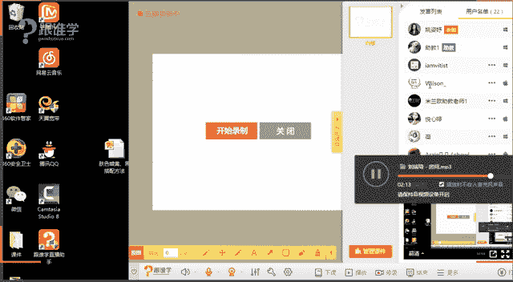
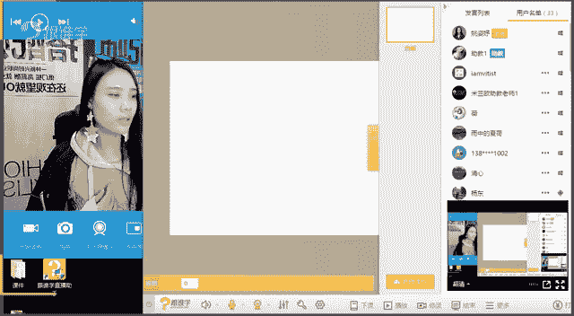
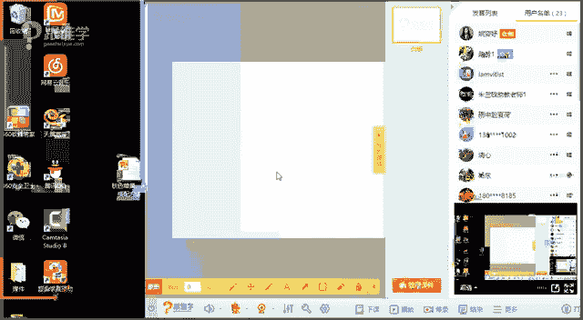
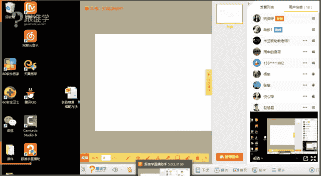

# 1、11服装《搭配秘笈之新版36计》：12肤色黑黄的搭配_rec

🎼多少个信片，交换多少张相片，还记得。😔。

🎼锁在抽屉里面的。🎼点点。🎼想。🎼温馨的空间。🎼会有你在身边。😊，🎼就不再感觉到害怕太。

🎼步走向前。🎼1。1月1天1点。😊，🎼想不想永远。🎼我们在同一个屋檐下写着属于我们。😊，🎼你来的。hello，同学们，晚上好，嗯，可以听得到我声音吗？如果可以听得到的话呢，大家请给我互动一下。😊。

挺好听的是吗？这首歌呃，刘瑞琪的，但是具体叫什么歌名我好像不太清楚哈。刚才我还跟我们的这个呃技术老助教老师说呢，我说怎么天天放这首歌呀，呃，能不能换点新歌呢？那呃大家可以这个你们可以在屏幕上打一下。

你们喜欢听什么歌，然后让我们的助教老师可以留意一下啊，然后给大家这个放一些这个新歌，好。房间啊OK呃，那既然大家可以听得到我声音的话，那我们今天就进入我们的课程了。那今天的课程呢其实是关于肤色的问题。

那其实今天我们在6点钟的时候，有一个解答的环节老师里面的衣服颜色好好看啊。是的，粉色的，因为我平时其实很少穿粉嫩的色彩，今天就扮一下嫩啊，穿点粉色，然后唇色也也也用的是粉色的。嗯，O好。

呃如果要是想夸老师的话，赶紧在这里夸，要不然等一下我又一看到你们夸我，我又分神了是吧？好嗯，那今天呢在这个6点钟我们的课程当中呢，有同学就问到了，有一位男同学吧啊。

好像是男同学问到说老师中国人的肤色有多少种。嗯，我当时看到这个问题的时候呢，呃我心里就想哎。这个中国人肤色按多少种去分，这个概念好像有点太大了啊。因为其实有一些机构呢。

他会把一些人啊或者或者说把我们亚洲人的皮肤分类。那在呃分类之后呢，它会告诉你，你适合哪一类的肤色啊，你适合穿哪些颜色？呃，哪些颜色你不能穿，例如说他会讲到说某一类的皮肤的人，他可能不能穿黑色的。

那我想要告诉大家一个概念是黑色，它本身作为我们生活当中的服装当中的必备的色彩单品。那也就是说我们所说的基础色，而且黑色它是能够最彰显一个人力量稳重的色彩。那么它是我们每个人必备的色彩。

一生当中是必不可少的缺缺少的这样一个色彩。所以如果要是呃有这样的一个系统告诉你，唉，你不适合穿黑色的，或者说你只能适合穿哪一类的颜色。我觉得这样的一个概念其实太过于局束性局限性，会把我们人框死。

那例如说他们会说呃，我不太适合穿这种粉嫩的颜色，然后不太适合穿呃偏蓝色呀，然后浅粉色呀、卡其色呀，就sorry是呃这种叫马卡龙色系，那他会说这一类的颜色都不适合我穿。但是我觉得我穿着也挺好的呀啊。

今天啊同学们说嗯粉粉嫩嫩挺好看的，是吧？那其实呃我建议啊那大家的话其实要多去尝试一些色彩，所以说如果你的皮肤够白皙的话呢，那你是各种色彩其实都可以去尝试一下，而且你的驾驭能力会特别的强。

但是如果你的皮肤是偏暗了，偏黑的，其实老师的皮肤就是偏暗黄色的，但是在视频上视频当中看起来不是特别明显啊，因为光线一大啊，那那在生活。当中的话，其实我的肤色是偏暗沉的。

所以说那今天的课程呢就是给我们这些啊皮肤比较暗沉的，皮肤比较黑的啊，或者是说你身边有这么一类朋友啊，或者你的家人啊，如果皮肤比较偏暗黄偏黑的那今天的课程呢大家就要好好听了啊。

那我们今天呢就讲到这样的一个课程。OK首先我想问大家，那我们说到亚洲人这样的一个肤色是属于黄种人，那我们亚洲人是黄皮肤黑头发。那其实世界上是不是还有其他的人种，例如说白种人啊，例如说黑种人。

那我想问一下大家，那你们觉得在这三个人种当中，白种人黑种人和黄种人，你们觉得哪一个人种是最好穿衣服的。就是他驾驭肤色的驾驭色彩的能力是最宽放最宽泛的。一还是二还是三，白还是黑还是黄。啊。好。

我看到有两位同学说嗯白种人微微同学，阿瑞同学，包括岳新同呃，岳新婷同学。嗯，还有阿亮同学，好像这两位同学老师平时在课堂当中很少看到这两位同学啊。那包括夏荷呀、钟永雄同学呀，微微呀。

还有阿瑞呢其实都是老师经常会看到啊，那这两位同学是不是平时没有来听课呢？啊，OK好嗯月明同学，好的，那大家回答的都是白种人。是的啊，你们太聪明了，你们太棒了。

那呃白种人他的确是比较好穿衣服的那因为呃在我们所说的所有的人种当中，你会发现我们经常看欧美的一些街拍，欧美的街拍，我们会觉得哇，他们怎么穿什么衣服都好看。啊，他们穿什么色彩都好看。例如说嗯好的啊。

例如说呃。这个呃这个阿亮同学说掉队了啊，然后月欣同同学说听回放比较多是吗？啊，好，那我们好的啊，老师大概了解了。那我建议其实你们还是可以呃尽量的能够在现场听课的话，就尽量在现场听课。

因为直播的时候听课的话，也可以跟老师互动一些问题啊，包括你自己个人有一些问题，老师也可以给你们解答一下。嗯，好，那我想问一下大家，呃同学们。

我现在刚才讲到的是百种人的用色的这样的一个他他们穿衣服的色彩的问题。那我们先打断一下，因为我看到我的屏幕稍微有一点点跳。那同学们，你们看到我现在的屏幕会不会呃有的时候会闪一下呢。如果会闪的话呢。

你们就打一。如果不会闪的话，就打2，那我们就继续现在的课程，我怕会影响到同学们，你们听课的这样一个会闪，是吗？会闪。我说的是不会闪还是会闪，我说会闪的话，打一，不会闪的话，打2是吧？啊。好的。

那我知道了哈，老师有点晕了啊。O好，那我们继续啊。那刚才我说到我么说白种人啊，或者欧美，他们在穿衣服的时候，他们好像穿那种鲜艳的颜色也好看啊，那穿这种就是那种所说的天看起来有点自然自然旧的那种颜色。

大家知道自来旧的颜色是什么样的吗？就是他看上去不会特别鲜艳，看上去有点浑浊的感觉，就看上去旧旧的，我们就觉得那一类的衣服啊，就你好像本身其实是买了一件新衣服，看起来就有点像旧衣服的那种色彩啊。

大地色其实是属于那一类的。例如说卡其色墨绿色酒红色啊，咖啡色啊，包括这种呃深藏蓝色，就是他看上去有点卓灼的这种色系，他不会像我身上的这种颜色特别的鲜明。你一看就知道啊粉色，然后有一些色彩，它看上去就。

灰旧的对是对，是的，加灰色的。韩夏同学说加灰色的。是的啊，那因为咱们这儿还有很多不专业呃，没有学过专业的这样的一个呃同学呢，他可能听这个概念会觉得有点抽象啊。是的。

那么加灰色的就看上去有点灰灰旧旧的这一类的颜色。那欧美人他们穿也好看。哎，你说为什么他们穿那么多颜色都好看呢，那是因为他们的皮肤看起来相对来说是比较白皙的。所以他们在驾驭各种色彩的能力都会比较强。

可是我们会发现当这一类的色彩穿到我们身上的时候，例如说那一类比较看起来就有点我们所所说的这种灰灰旧旧灼灼的颜色。他其实看起来是非常的雅致的这一类色彩。例如说酒红色酒红色。啊。

然后这种墨绿色看起来它给人感觉是非常雅致，不会特别张扬，很低调，很有品质感的这一类色彩。但是我们平时在着妆的时候，很少有人能够把它穿的好看。那么其实是因为这一类的色彩。它看起来太过于灰旧。

而我们黄种人的肤色呢？它相对来说其实是有一点点挑这一类的色彩。那么今天我们在课堂当中会跟大家讲到，你们如果想穿这一类的色彩应该怎么去穿。我要我要传达到的概念或者是理念，我要告诉大家的是。

不是说你不能穿这一类的色彩，而是你应该怎么去穿这一类的色彩。那这就是我们的系统跟其他的这样的一些课程的这样的一个区别性。O好的，那我们接下来来看一下。🤧。呃，在这里呢因为呃有很多同学偶尔会卡是吗？呃。

那其他同学可以回应一下会不会卡。呃呃在这里我就不多做自我介绍了，因为同学们都已经呃听过我的课程很多了。那有一些同学听回放的话，应该也知道啊，但是我还强调一下我的名字吧。我是姚资雨老师，那也是艾思老师啊。

大家可以叫我资雨或者姚老师OK好啊，那我们来看一下，在我们所说的这样的一个呃黄种人当中，那大家可以看一下这幅图片，有很多同学说哇，老师我怎么第一次看到这个图片好吓人吧那其实呢这其实就是一个人呢。

皮肤的色调的区别。那我们说黄种人呢啊。OK呃，月新婷同学，如果你那边会卡的话呢，呃可以退出一下，然后再进来。包括其他同学。如果你们那边卡的话，可以退出，然后再进来试一下，还卡不卡？

老师这边的网络应该是没有太大的问题的啊，因为是我我们这边的这个光纤的话是足以的能够支撑呃，现在的这样的一个授课的啊，好的，呃，那因为这个我看我的一个屏幕稍微有点卡。同学们。

那我让我的我们的技术老师来让我呃来帮我调整一下我们的这个屏幕，包括呢我们的网络再测试一下，那我们稍等一分钟好吗？同学们，嗯，那我们的技术老师，麻烦呃技术老师过来一下，帮我们来调整一下这样的一个网络。嗯。

OK好的。那我先关一下视频，同学们。

Oh。あ。Yeah。O。🤧呃，同学们现在还跳不跳或者卡不卡呢？你们现在听到还卡不卡？嗯，好啊，如果不卡的话，那我们就继续。好，可以听得到我的声音吧。同学们。可以听得到声音吗？如果可以听得到的话，请打一。

嗯，O好，那我们继续。那我们说肤色的话呢，其实有分很多种。那其实比如说有一些人的肤色它是偏这种粉的，有些人他肤色是偏这种暗黄的那有些人皮个皮肤肤色它是偏黑的那其实我要告诉大家的是，呃。

如果要是按照我们所说的这样一个肤色去界分的话，那基本上很多人他对于自己的肤色都都这个都认不出来的哈。那所以我们教给大家最简单的这样一个方法，就是今天如果你是肤色偏暗黄或者偏黑的人。

你应该怎么去穿一些色彩啊，那包括呢其实我们要倡导一个理念给大家。就是呃如果你肤色是比较偏暗黄的或者偏黑的，就不要整天想着，哎呀，我应该怎么美白呀，因为我们说肤色黑，它其实是偏生的这种呃这种黑色素偏多。

那你的基因就已经自带了。那除非是你要打去打那种什么美白针之类的啊。然后你的这个皮肤那个这个。色调它发生一个变化，那基本上其实有很多人他是改变不了的那如果改变不了的话，那我们就坦然的做一个黑美人吧。

因为老师本人的话，其实也就是肤色比较黑，但是我从来不会为这件事情而苦恼啊，O好，我这里好像有一个呃提示。好，急死人的节奏，百草园，你是这边太卡了吗？如果你卡的话呢，那你可以退出去，然后再进来试一下。

还卡不卡啊？那呃说到这个肤色的问题，其实在呃国外的话呢，我们这个欧美人或者说西方人跟我们东方人的审美在这儿是有点不太一样的。那我想问一下大家呃，你们觉得是肤色是以白为美，还是以黑美为美。

在我们中国是以白为美还是以黑为美？一还是2。一还是二呢？白色为白为美，是不是？我们呃这个有句老话说叫一白遮三丑是吧？同学们，那所以说呢其实我们中国人还是认为皮肤比较白的，是比较是美人的这样的一个标志。

但是在西方人他们会认为哪种类型的人是这种贵族的代表呢？比如说维多利亚，他们觉得维多利亚的那个肤色，那个这个气质，包括他讲话的口音都觉得他是贵族的这样的一个标志。那他们会认为啊清晰说黑，好，那呃欧美人呢。

他们会认为第一，我们经常会我们我们亚洲人会形容一个人很富态的时候，我们怎么形容这个人呢？我们会觉得哇又白又胖就觉得是很富态的标志，这是富人的标志。而西方人他们会认为第一，你比较瘦。第二，你比较黑。

这是富人的标志，为什么呢？第一。你如果黑的话呢，是你可以经常去晒日光浴，享受阳光，所以你可以把自己晒成这么黑的样子。可是如果你皮肤比较白，而且你又胖，你在国外的话，那说明第一，你是没有什么呢？

没有这个时间去健身，没有这个金钱去请健身教练来帮你这个这个指导你自己的体型管理。那么如果你皮肤特别白，说明你天天你就是工薪阶级，你天天做办公室然后呢呃你享受不了这样度假的这样的一个时间。

所以的话他们会认为皮肤又黑的啊，然后又体型又瘦的人是贵族的标志啊，所以在西方跟东方好像这块是不太一样的啊。那呃所以说那在穿衣方面的话呢，可能就有很多人会注意，哎，我想让自己皮肤变白一点，其实变白啊。

做不到老师只能说通过穿衣打扮，把自己肤色变。白是做不到的，但是我我可以通过色彩啊让你穿的呃有精神啊，有气质啊，这样的一个方向是可以的。OK好，我们来看一下。好。

那今天呢我们全程的课程呢会有三个博主啊来给大家来这样的做这样的一个示范。那这三位博主呢分别是澳大利亚的博主呃，sorry啊，同学们尼ko啊，那包括呢艾米颂包括几米钟。

这三位博主呢他们呢都是肤色比较黑的同学们能看得出来吧啊，第一个你看他肤色，第二个偏第一个看起来有点偏红的感觉。第二个看起来是偏黄的感觉。那第三个就是我们所说的黑美人了啊，但是这几位肤色都不白啊。

这个是大家是可以看得出来吧。那他们三个人呢在穿衣的时候呢，或者说我们在他的博客上经常会看到他们穿着一些很鲜艳的色彩。那么所以我们来看一下，哎，他们是如何运用色彩来给他进行它的整体的造型的。嗯，好。

我们来看一下第一。呃，我们要给教给大家的这样的几条法则。那第一条法则就是敢于尝试亮色。那我相信这一位同学应该也认识吧。啊，这位同学嗯刚才呃三7八同学说总感觉黑蒙蒙的不太健康，没有气色。

那这个是非常呃正常的事情啊，那呃对是的，这一件这一位的话是吉克隽逸啊，魏薇同学说是吉克约地是的，那其他同学应该也认识吧。那这一位呢他本身因为他是这个呃少数民族民族的，所以他天生的肤色就是这么黑。

那他一出道的时候，他其实就是这么黑的。但是在后期我们会发现他经常会使用很多的亮色。呃，有很多人他会觉得哎我皮肤色黑的话，就不要穿亮色了，就穿的什么呢？黑色的，包括这种什么呃呃黑白灰为主的这一类的色彩。

那么会让人看起来精神没有那么好啊。很卡吗？同学们现在嗯我们现在再来做一个呃。嗯，好的，有些同学说卡的话，那你可以退出去再进来啊。同学们okK好啊，那所以说呢肤色的这样嗯，那黑皮肤色的人呢。

也应该要尝试一些亮色。那我们来看一下，那这一位呢就是什么呢？及呃这个这机米中，那大家可以看一下，那这一位呢他是什么呢？他是一位呃博主也是一位演员，那这两种都是蓝色同学们。

你们看一下左边的这一个和右边的这两个，那大家可以来这个什么打一下，你们觉得一好还是二好。🤧同学们，你们觉得一号还是2号？🤧好，青新同学觉得第二个比较好，微微同学觉得第一个比较好。那其他同学呢。

你们觉得一好还是二好呢？OK嗯，好，有的同学觉得第一个比较好，有的同学觉得第二个比较好。那我们来给大家分析分析一下啊。那其实从我们所所说的整个人的形象和气质上来讲的话，第二个会更好。对，是的。

青明同学说的非常好。第一个它给人感觉会没有精神。同学们你们来看一下，你会觉得第一个看起来好像呃因为它本身肤色就很黑啊，或者说是很暗黄，这个已经很明显的看得出来。那么它这种颜色的选择。

这一件衣服就是我们所说的有点加了灰的蓝色，两件都是蓝色，但是你会觉得这一件看起来整个人的气质是不上扬的。也就是说它看起来是有点没有精神的感觉。而这一件衣服这件服装的色彩，它看上去会更让它有这种精神感。

那包括它的什么呢？呃整体当然它整体还会有什么呢配饰啊啊，然后妆容啊等等配。合上的话就看起来这一套给给给人感觉会更加的有精神啊。OK好，那这是我们所说的这位呃博主的这样的一个相片。

那我们来再看看一下同学们这两个都是什么呢？红色系的那你们觉得第一个好还是第二个好呢？刚才那件为什么不好？那是因为第一件它运用的是这种太拙的颜色，所以看起来整个人是没有精神的那这两个其实道理也是一样的。

同学们一个用的是比较鲜艳的红色，而这一位用的是比较什么呢？相对来说浑浊的酒红色红色这一个红色叫什么呢？铁锈红，也就是这种红色它其实看起来是没有那么饱满的。呃，鲜鲜艳的感觉。

这就是有点我们所说的灰旧的感觉啊，那同学们都觉得第一个比较好是吗？所以第一个人他看起来会更加的有精神。这两位的话，一个是妮蔻，一个是吉米啊，吉米颂。那这两位博主的话呢，他们其实肤色啊本身都是比较暗黄的。

但是这个看起来会更加的精神。好，那我们来看一下，同样都是蓝色同样都是红色那我们会发现鲜艳一点的色彩会比什么呢？那种着色的感觉，看起来要好OK好，那这两件呢，其实它从。我们所说的色彩上没有说特别鲜艳。

也没有说特别浑浊。那我想问大家，你们能不能看得出它的区别点在于哪里呢？你们觉得哪个比较好呢？第一个还是第二个呢？🤧第一个还是第二个呢嗯。嗯，好啊，在这里的话，大家好像答案就不太统一了啊。

有人说第一个有人说第二个，我来给大家解答一下。那我要告诉大家的是什么呢？如果你在穿如果你的肤色是比较暗黄的时候嗯，好，那同学们是的，面料有所不同啊，面料有所不同。那这张图这两张图片呢。

其实它的感呃差距感不是特别明显，但是我要给大给大家讲到的一个小细节，就是如果你肤色特别暗沉的话呢，那你更加适合选择一些有光泽感的面料，不要选择那种相对来说比较阳光的那有光泽感的面料的话。

它看上去会让你整体的质感会更加的好。就是你整体的质感就是肤色的质感会更加的好。那我们一般都会说什么呢？就你黑的话不要紧，我们怕的是你皮肤又暗黄，你皮肤又黑，但是你的皮肤质感又很粗糙。同学们。能理解吗？

就是如果你是很粗糙的暗和黄，那你看起来整个人就一定是没有精神的。但是如果你整个人虽然是暗黄的，虽然是黑的，可是你的皮肤皮肤的质感看上去是比较呃这种有精致感或者比较亮的。

比较有质感的这种光泽度的那你看上去精神气质也会比较好。这就是为什么很多时候嗯他们喜欢这个呃比如说维多利亚的秘密。呃，这个内衣品牌，他们经常会请到超模，给他们去拍摄一些一组大片。

就是穿着特别性感的那种大片。但是他们一般在拍片的时候都会在身体上抹BB油或者叫橄榄油，就是抹了这种油之后，它的肤色看起来会更加有质感和光泽度。所以这就是为什么让推推荐大家来选择这种有光泽感的面料啊。

OK好，这一点的话，大家能听呃能理解吗？嗯。好，OK啊，有同学说配饰也有关系。是的，其实配饰呃会有一些影响。但是呢我们在这里讲到的这个知识点呢是关于面料的啊。O好，光泽感的面料是不是比较前卫。是的。

光泽感的面料，它看上去会更加的有这种我们所说它第一它是有前卫感的。当然他要看是哪种面料。第一，如果你选择的是叫呃未来科技感的这种呃这种我们所说的呃银色的那种，大家可以想象一下。比如说电光蓝的那种电光蓝。

包括银色，它看上去就会比较有前卫感。但是如果你是绸缎的那种光泽感，它看上去是高级的感觉多过于它的前卫感，能理解吗？同学们啊，如果是丝绸的光泽感，它是高级感会更加强烈。嗯，OK好。

那我们来看一下这整组图片呢，都是ni扣的这样的一个这位博主，它的相片啊，那它其实在他皮肤就是很黑的。其实在我们亚裔当中，有很多比较呃这种这种有很多知名的博主当中，有很多是亚裔面孔。

他们都是这种瘦瘦的黑黑的皮肤。但是呢他们特别的敢尝试一些鲜艳的颜色，那是因为我们所说的皮肤特别暗黄的时候选择鲜艳的颜色，反而能够让你看起来比较有精神。那呃为什么我要在这里给大家讲到一点是呃。

我想请同学们来猜一下，你们知道呃我们说不管哪一年流行什么色彩，但是中国有两个色彩卖的特别好的。比如说你们知不知道是哪两个色彩呢？你们可以在屏幕上打一下，你们觉得中国哪两个色彩卖的比较好。嗯。

阿瑞同学说中国红。好，大家都说红色啊，韩夏同学也觉得是哦，韩亚同学回答对了，嗯，玫红色好的。啊，那韩夏同学是不是听过我们之前的课程啊？那他回答的这两个答案都对了。第一个是玫红色，第二个是宝蓝色。

其他同学啊，你们回答对了吗？好，那这两个色彩为什么呢看上去，为什么它那么好卖呢？那是因为这两个色彩在我们中国人或者我们亚洲人穿着的时候，它整体的肤色都可以提亮。因为这两个颜色它是属于叫冷色调。

它是属于冷色的色彩，就是冷色调的这个色彩，所以它看上去会弥补到我们的肤色，因为我们中国人是黄皮肤，我们看上去是暖色调。而这种玫红色和宝蓝色，它是冷色调。当它一对比，其实就会让我们的肤色呢提亮啊。

这个道理大家能懂吗？啊，例如说其实在我们化妆的时候啊，很多人它的皮肤是比较偏暗黄的那比如说他是。暗黄的，我们去买女生都会知道啊，有一种霜叫隔这个叫什么隔离霜啊，或者是效修正液。

那一般他说他看你的肤色是比较暗黄的时候，它就会让你选择紫色的。因为黄和紫是一个对比色。如果你有黑眼圈，就是那种青的，它会让你选择什么色彩呢？它会让你选择橙色的那种。

它会给你一支橙色的那种这种弥补黑眼圈的这样的一个问题。那其实青色它是不是蓝色的感觉，那就是蓝和橙也是对比。如果你脸上有红血丝，它会让你选择绿色的修正液。其实这都是运用了色彩的互补原理。

那么我们所说的暖跟冷，其实也是运用了互补的原理。那这就是为什么比如说彭妈妈它经常会穿中国蓝，那是因为对于我们亚洲人这个蓝色，它的这样的一个弥补的效果是非常好的啊。嗯，OK嗯，好。

那接下来呢呃我们来进行第二个知识点，叫法则二，懂得运用白色。那其实特别是我们所说的呃呃我们亚洲人当中很多人就是皮肤比较暗黄的人，他们基本上不敢尝试白色，因为他们觉得哎我皮肤都这么黑了。我如果再穿白色。

会不会显得我更黑呢？啊，答案是什么呢？有可能会让你显得更黑。但是我要告诉大家的是，他会让你显得更加的有精神。他会比你穿米色的或者是乳黄色的，让你看上去更加的健康和有精神？你会发现黑种人，同学们。

你们如果去观察的话，你们就会知道黑种人，他会特别喜欢我们的黑种人的肤色是不是特别黑？我都说了啊我经常跟我们线下的同学讲课的时候会说嗯黑种人如果出去的话，晚上千万要穿很鲜艳的颜色。如果你要。

穿了一身黑色出去，那你出出这种什么呢？事故的几率相对来说比较的高。因为黑种人的皮肤太黑了，他都已经融于融到这个这个我们所说的黑夜当中去了啊。再加上你如果又穿了一件黑色的衣服，那完全就看不着你了啊那。

黑种人呢他第一特别适合鲜艳的颜色。第二他他在穿白色的时候，他们永远穿的都是呃纯白色或者是漂白色，他们不会穿米白色。因为米白色的话看起来是没有那么的能够让他们的肤色看起来更加的好看，有质感，有精神。

所以其实在这里我们运用白色也是一个原理啊，那我们来看一下，比如说niko，那大家可以看一下第一套和第二套，大家觉得你们觉得它哪一个看起来会更加的有精神呢？一还是二呢？嗯。呃，麻烦我们的技术老师呃。

帮我拿一下水好吗？因为我的水被放在外面，刚才忘记拿过来了，谢谢。嗯，好的。那呃有同学说啊，第一个是吗？是的啊，同学们第一个看起来是非常的有精神，谢谢。好。嗯，因为呃。稍等一下啊，同学们。

因为嗓子有点不太舒服我。好的。是的嗯，第一个看起来会更好。那接下来我们来看一下，这就是我所说的米白色，大家知道吗？纯白色米白色。那这个就是什么呢？呃，这呃这个是纯白色乳这个sorry。

乳黄色和米白色的感觉，那这个的话就是纯白色。那我们来看一下，那呃同样这两这两个人呢是同一个人啊，因为我在这个呃有很多很多同学在说啊，以往的时候会说老师你讲的这个呃课我们也知道，可能也大概理解这个道理了。

但是你在做课件的时候，呃，那些人他的皮肤都很白皙呀，我完全看不出来差距呀？那所以呢在这里我们以更加直接的这样一个方式来给他家做这个呃案例，那这一位呢他皮肤他本身就很暗黄。

那同学们你们觉得同一件外套的色彩，对吗？你们觉得哪一个看起来会更加让他有精神。第一个还是第二个。Yeah对对。米白色米白色相对来说可能更加适合皮肤白皙的人。同学们嗯。好，我们来看一下啊。

呃它的内搭的色彩，同学们我们来看一下啊。里面它的我们首先来说这个外套，为什么我会选择这个外套的色彩？因为因为这个外套的色彩，它就是我们所说的有点偏这种什么呢？卡其色，它就有点偏这种灰浊的色彩。

而这一件burberry的这种呃经典的色彩啊，经典风衣的色彩，在其实在中国销瘦的时候并不是特别好。因为中国人穿这种色彩会灰头土脸的感觉，就是它的这个感觉跟你的肤色太接近了。

所以它看上去就有点显得人没有精神。而我们说米呃这种纯白色，它让人看上去会更加有精神。所以在这两张图片当中，同学们可以看到，穿米白色其实它会让它整个人的气质更加的上扬。

而如果这一套服装当中没有下身的这个裙子，那同学们看上去会更加的明显。如果它也换成底下这种黑色的裤装或者黑色的裙装。它整个人的光彩度一定是没有我们所说的这个这边的这样的一个造型要好。

那因为它里面运用的色彩也是什么呢？也是灰色的感觉。我们看整体啊，我们就看上半身同学们你们就看上半身，它这整个人的气质上扬感，其实很明显是右边会比较好，也就是说这种纯白色，它看上去会更好。嗯，好。

这一点同学们现在大概能看出来了吗？同学们现在如果啊你们觉得一好还是二号可以再去看一下啊，觉得二号还是一好呢？啊，老师这样讲解之后，你们觉得一好还是二好，因为很多同学可能一开始看不太出来。

那需要老师来给你们引导，其实很多人的话是需要呃多看一些这样的图片啊。好，那我们继续啊。好啊，那这张图片呢，这个呢是吉米钟呃，吉米钟呢他是韩国的这样的一位艺人。我说了啊，那其实它很多的造型我都看过。

那这一套造型我觉得算是它所这个近期的造型当中最好看的那是因为第一它用用色特别的鲜艳。第二呢它里面的内搭你会发现它为什么哎呃这一套服装也是用的白色内搭，这套服装也是用的白色内搭。

那是因为它知道它穿这种白色的色彩，会让它显得更加的什么呢？有精神，看起来气色会更加好。所以其实这明明是两套不同的场合的着装，这套很明显它其实是有点这种我们所说的这种宴会的性致，它可能要去派对呀。

宴会呀等等。那这一这一套呢其实相对来说就比较休闲化。比如说这个牛仔加T恤的这样一个感觉，它更加休闲。那两套不同的场合，但是它同时都搭。白色的这样一个内搭，说明他其实很了解自己穿纯白色的，要比他穿这种。

我所说的灰色呀、黑色呀要看起来好看啊。OK好，这是我们给大家分享到的第二点，法则二，穿白色会更加的好。那法则三，黑灰不一定安全，在前面我刚才跟大家讲过，那很多同学他会认为哎，我皮肤很黑。

那我就应该穿黑色的，让我看起来哎不不那么扎眼啊，我不想引起别人注意力。那同学们你们来看一下，同样两个人，这一套也是什么呢？这个也是几米中，那这个也是几米中。那同学们你们觉得哪一个看起来会精神更好呢？

是上面一张是一看起来精神好还是二看起来精神好，就是我们所说的上一页精神好还是这一页，看起来精神更好呢？是一还是二呢？嗯。🤧嗯。嗯，很明显，其实是上面它穿红色配白色的那个感觉会更加好，对吗？OK好。

那我们来看一下。那在这两套当中，它都是使用了黑白灰，黑白灰它使用我们正常人，我们所有的人都会需要它。那买这种色彩，其实是没有错误的。只是我们要怎么去搭配这个非常的重要啊。O好，那我们继续来看一下。

所以同学们，你们在后期选色彩的时候，一定要注意啊。如果是黑色和灰色的话，不要通身的大面积的去穿着。因为这样让你看起来精神不会特别的饱满啊。ok好，我们继续来看。那这一排图片同学们啊来可以观察一下啊。

这一排图片当中就是我所说的。第一，它们全都是使用了深色。第二，它使用的全都是比较灰浊的色彩。那你们要睁大眼睛来看好了啊？你们觉得上面的好呢？还是下面的好呢？啊？好，同学们。

你们觉得上面这一排好还是下面好，一好还是二好？嗯嗯。嗯，好，周永彤同学说第二个什么？那其他同学你们觉得呢？是不是也是第二个看起来精神会更加的好呢？阿亮同学说，嗯，我觉得一好。

那呃可能是这个针对于个人审美不太一样啊，那其他同学呢都会觉得二比较好是吗？那为什么二比较好。因为二它的色彩相对来说都是比较鲜艳的那它会让整个人的气质更加的上扬，所以说黑色和灰色通身的大面积与穿着的时候。

它的效果并不是那么理想啊，OK好，那我们来继续看同一件外套同一件酒红色呃，这个玫红色的外套，那我想问同学们，你们觉得一好还是二好？一好还是2好呢？嗯。3781同学说，嗯，感觉上一排是秋冬款。

下一排是春夏款。好，我们在这里不讨论它是秋冬款还是春夏款，我们只讨论它是适合的呃，他他穿那种颜色会更加好，还是呃这种颜色会更加好嗯。好，那有同学说一和二，有同学觉得2，那从搭配的角度上来讲。

可能很多人会喜欢这一套感觉。那我们说从一个人看起来精神的状态好坏的感觉上来讲的话，其实白色的看起来让他精神会更加的好。他的气色看起来会更加好。OK那我们说他其实呃这一位呢其实也是这两位也是同一个人啊。

他同一件衣服也会搭配黑色也会搭配白色，但是白色其实让他看起来精神会更好。好，那我们继续来看这两套同学们也是同一个人，你们觉得左边好还是右边好呢？一好还是二好呢？🤧嗯嗯嗯。为什么呢？嗯。😊，韩亚同学说。

拉链拉链的作用是什么呢？他呃我们来呃来我给大家来分析一下。有同学说因为收腰，有同学说因为拉链，那我们来看一下，其实呢从这一位呢它其实两个两个人是同一个人啊，左边的这套服装呢，它是从头到脚。

从领到外都是运用了同一种面料，它是没有视觉的对比感的，也就是说它没有层次感。那包括它看起来会很沉闷，而这一套从上到下，它的面料其实是有差异化的，其实下面这个面料它是有一点点光泽感的那而且它什么呢？

拉链包括它的饰品，包括它的项链，包括它的袜子的这种通透感，让他其实它底下是穿了一条袜子啊。同学们人家的腿没有这么黑，你可以看一下他的腿跟他的这个那手臂的色彩其实是有色度的。它里面他下面穿的袜子。

他看上去这种。搭配从拉链到腰腰带到项链，它其实是让人看上去更加的有什么呢？时尚度，而且它会提升视觉的层次感。那下面的丝袜，它让整一套服装看上去它是有透气感的这就是为什么我经常会强调在秋冬装搭配当中，呃。

同学们不要只是穿同一种面料，而且从头到脚从里到外把自己包的严严实实的。那这样看上去整个人是没有精神的。所以说如果想要达到时尚感，包括整个人的精神状态更好的话，你需要一些提亮的东西。比如说这种腰带。

比如说这种拉链，比如说这种配饰，它其实都是属于有亮度的东西，它能够让你整个人看上去是提亮的啊，那包括这种丝袜的搭配，它是疏通的感觉，看上去是有透气感的，让整个人看上去更加的轻盈感。OK好。嗯，呃。

慧超同学说二衣服颜色亮度高啊，显得有精神是吗？好的，那我们来继续看一下啊。好，同学们，你们觉得第一个好还是第二个好呢？那很明显，其实第二个看起来会更好，对不对？那有同学说老师是因为这个人笑了。

所以他看起来感觉很好，那当然不是我要给大家讲的是什么呢？其实在这里呃，比如说如果我们是不是经常会有这样黑色的T恤，那我们应该怎么去穿搭，那比如说你可以运用什么呢？配饰来提亮。

其实跟上一张图片是同一个道理，只是这张图片它会更加的明显，那我来看一下这个项链跟他什么呢？整个他跟他的牙齿很呼应，同学们有没有发现，所以说如果你身上哪个是优点，那你就把自己的那个优点放大就好了。

比如说你觉得你牙齿很白，那你就经常笑就对了啊。然后他用这串项链的光泽度来什么呢？你会发现他呼应了他。牙齿的这个这个亮泽度就会让人整个人呃看它它看起来会更加的有精神，然后这状态更加的饱满。

看上去所以会更加的漂亮是吗？嗯，好神奇是吗？有时青青同学说好神奇呀。针织提亮肤色吧。呃，针织并不是说面料，这种针织面料呃，它也要看它是什么色彩啊，OK好。OK啊，那我们继续来看，那这是第三条法则。

第三条法则叫什么呢？黑灰并不一定是安全的。那么们来看一下第四条，第四条是不要太接近于肤色，那刚才我跟大家强调了一个概念，我们说如果你是什么呢？皮肤比较暗黄的，比较黑的人。

尽量不要穿跟肤色太过于接近的色彩。那么如果你有很多这种跟肤色很接近的服装怎么办？比如说这种burberry的卡其色的风衣，它其实是非常非常经典的人穿起来是非常有有这种什么我们所说有气质啊。

那看起来因为它又是经典感又很帅气的感觉。因为它是双排扣的军装设计。那如果你有这样的服装的话，那你应该怎么穿呢？同学们，你们觉得一好还是二号呢？你们觉得一好还是2号，同一个人啊，同学们还是同一个人嗯。

为什么第二个好呢？同学们，为什么第二个好。好嗯，那我来给大家回答一下。嗯，我看现在同学们嗯青新同学说有红色好，二有精神是吗？嗯，我微同学说二有精神。好，那还有没有其他的答案呢？

我想看一下同学们有没有其他有同同学有其他答案的？嗯，雨和同学说提亮肤色OK好，那头发好，呃，青新同学说头发，那我来给大家来回答这个问题啊，那我们说红色包括提亮肤色，它的原因，包括有精神的原因。

其实都是什么呢？这个红色它跟。😊，接近于你肤色的这一块色彩，也就是说这件衣服它进行了一个隔离。当如果你有这样卡其色的服装，太过于接近自己的肤色的服装。比如说我有件驼色大衣，那么我又很喜欢，而且又很贵。

比如说你买了件maxmaa的哇，那好家伙一两万块钱了啊，那我买了这样一件大衣，可怎么办呢？那么这就是一个非常好的方法，就是你可以在大衣里面去加一件亮色的服装，这个亮色的服装不是只有红色啊。

我只是把这个红色拿出来给大家举例它有可能是红橙黄绿青蓝紫都可以啊，只是这个颜色一定要有一定的亮度，哪怕你搭白色可能看起来效果都会比你直接穿这件衣服的效果要来的好啊，OK好，那同学们能够理解这个法则了吗？

嗯，不要太接近于肤色，也就是说我们可以使用其他的颜色来进行一个隔离嗯。好，外套颜色接近肤色的衣服少是吗？嗯，好的，如果比较少的话呢，呃，也没关系。呃，如果有的同学也没关系，其实可以大胆的买。

只要掌握今天老师给你们说的这些法则啊，我还是那个观念就是我们呃学校的这个系统理论呢还是一直给大家倡导的观念，建议大家多去尝试世界很大，衣服那么多，我们要多去尝试一下啊。那如果要是这个你有这一类的色彩。

其实因为这类的色彩它很好看。其实驼色的大衣在秋冬穿非常好看。只是我们怎么去靠搭配来解决这个问题啊，OK好，你继续来看。那么这位博主niko，那我看一下同学们是不是同样是两个人，你会发现这一件衣服啊。

这件衣服你就觉得哇，好光彩夺目啊，很漂亮，对不对？但是你会发现哇，穿了这件衣服，就是他完全把这件衣服的时候，全都接近于脸色的。时候就会觉得面如菜色，有没有感觉一种面如菜色？同学们就感觉好像精神不太好。

如果有一天啊我要跟大家来讲讲讲一件事情啊，呃，其实有有一段时间呢我经常会穿一些比较着色的色彩的服装。好，包括这一类的颜色我特别喜欢。因为那类那那段时间好像觉得嗯我好像要回归一下自然。

我不想穿太过于饱和的颜色，然后那段时间所有的人都会说我一个个问题，说哎，你是不是昨天没有休息好啊，或者说哎你是你怎么最近精神不太好呀，我说我挺好的呀，我也没生病，我挺健康的，生活方式也挺好的。

也挺早睡的，为什么看起来就那么没有精神呢？其实就是跟我的服装的色彩是有很大的关系的啊。OK好，那这个就不跟大家多说了啊。好，那呃这个嗯3788同学说包包裤包包裤子，上衣外套颜色都岔开了。嗯，好你说的是。

呃，这一套吗？第二套颜色好多呀。是的，你看它既又用了白色，又又用了黑色，又用了黄色嗯。ok 好。😊，呃，有同学说嗯听老师讲课好像仿佛打开了新世界啊，那听到你这句话我也很开心。

因为呃我一直觉得在这里跟大家分享的课程就是希望每次的课程都能够让大家有所收获。嗯，这个就很好了。OK好，那我们来看一下同学们左边嗯和右边这位是几米钟，那但同学们你们来看一下同样一条裙子。

但是搭配两件不同的上衣的时候，你会发现哪个看起来精神感觉更好，一还是2。😊，嗯，是不是一更好？为什么？我我我每次看到这张PPT的时候，因为我经常会讲课啊，我每次看到这张PPT的时候，我都觉得天哪。

怎么可以这个样子，明明这么漂亮，穿了一件让自己老了10岁的衣服，而且它这个纯色化的太深了，看上去就感觉特别的老气。这个唇色其实是今年非常流行的。我们所说的叫浆果色，就是特别深的色彩啊。

也被大大家所称为叫姨妈色。那这种颜色它特别的深。所以说呃一个人如果涂了这种色彩的话，它本身传递的感觉，其实叫叫消极美感。其实我们说美是有分积极美和消极味的。例如说呃涂黑唇涂这种浆果色的色彩。

你会觉得这个人看上去有点恐怖感觉，是吗？所以这种就像我们所说的叫消极美学。比如说僵尸啊，吸血鬼。没有僵尸，好像是吸血鬼，他们经常涂的是什么样的色彩？同学们。黑色的服装，苍白的脸，猩红的嘴唇。

这种就是我们所说的消极美学。那这一套服装的话，它给人感觉真的就是精神状态看起来很不好。即使它涂了口红化了妆，但是他看起来还是不好啊，那就是因为他穿跟肤色太过于接近的卡其色的原因啊，O第二感觉太妖了是吗？

好啊，那这是你你你这个眼睛好像不对劲啊，是不是觉得好像有一种没有啊，其实眼睛还好，是不是有点啊，那是因为它的眼影的颜色化的跟它的唇色是一样的，有点泛这种红的感觉，泛泛紫的感觉啊，看起来就有点奇怪。

你会发现我们在过万圣节的时候，比如说万圣节的时候，我们会喜欢画那些很奇怪的妆容，对吗？比如说很恐怖的妆容就会喜欢用这类的色彩。嗯，好OK那这呃这第四条法则呢叫什么呢？不要太接近于肤色的色。啊。

就是我们在不要穿太接近于肤色的这样的一个颜色。那如果我们有这一类的颜色，我们应该怎么去穿呢？比如说同学们，那我在这里给大家啊看到的这一类一系列的图片，就是啊在里面搭配一些什么呢？

可以隔离开你的肤色的这样的一些单品。比如说这种条纹T恤啊，它这种是有黑白对比分明的那比如说蓝色，其实嗯你会发现经常很多呃欧美的街拍当中，他们就喜欢穿这种卡其色的风衣，配蓝色的衬衫。

其实这也是你会发现他们的对比感很分明。那这这为这个色彩运用的叫什么呢？对比色呃，卡其色它其实是橙色相的这个我们所说的加了这样的黑色进去之后就变成这个色彩了。那卡其色和蓝呃橙卡其色，它就是橙色色相。

而蓝色它跟橙色其实是一个对比色，所以它看起来会更加的让人有精神啊，OK好，这就是我们所说的不要穿太接近于肤色的啊这样的一些服装。那如果你有这一类的服装的话呢，可以用这种呃单品去把它隔离开。好。

那我们来看一下，除了这种方法以外，我们还可以什么呢？比如说带一些鲜艳的围巾，带一些提亮的珠宝的配饰啊，不一不一定非要是真金白银啊，就是这种配饰类的那包括你可以在里面搭内搭，搭这种白色的领子啊。

它都会给你整个人的气质带来一些上扬的感觉。那其实呃比如说秋冬的。候肤色暗暗黄的人是不是呃刚才有同学说到了，哎，感觉上面是秋冬款，感觉下面是春夏款。那所以说色彩上会有一个这样的呃这样的一个对比。

因为在秋冬的时候，很多人他会穿太过于鲜艳的时候或者太轻的颜色，他觉得不保暖。我们在秋冬的时候，为什么会选择那么鲜艳深沉的颜色，那是因为我们觉得很暖的感觉。所以说如果可是如果是肤色暗黄和黑的人。

如果你有很多那种很暗沉的颜色，那我建议你可以搭配一些围巾呢啊然后一些配饰啊等等，这是非常好的调整的方法，其实配饰它也是很好的能够提升我们时尚感的单品啊，配饰非常重要。OK好，就讲啊这一点的话。

就跟大家分享到这里。我们继续来看法则舞。服装简洁大方。那这一点我们可以来看一下，呃，在我们所说的呃这个亚洲人当中，我们其实会很多我会发现很多人会喜欢穿这种呃类似于这种小碎花。

而且这种小碎花看上去就是很不清晰的感觉，很模糊的感觉。比如说这一类的，比如说这一类的啊，包括那种波西米亚感觉的，就看上去很凌乱感，还有豹纹的种感觉，他看上去太过于琐碎，没有规律可原。

没有这种我们所说的寻报规矩的这一类的图案让人他因为他本身就乱。所以如果你皮肤很暗黄和黑的话，穿这一类的色彩啊，你会觉得整个人看上去精神不太好。这是真的啊。同学们，那包括其实这两位博主的话，第一。

他们穿着的这些色彩。第二，跟他的服装的花型也有一部分的关系啊。第一。好乱是吗？是的，那第二个其实大家看起来好像没有那么乱，其实还是乱，而且他穿的太过于接近于自己的肤色。

所以嗯这一位的话可能刚才没有给大家介绍，这一位的话也是越南的一位博主，他是越南籍的一位博主，现在在美国，那他的身高只有1。52米，是被称为叫哈比人。其实这两个的话相对来说都不是简洁大方的款式。

等一下我会给大家分享，更加适合如果皮肤暗黄的人，他会比较适合穿哪一类的图案。好，我们来看一下。啊，那同学们这两套服装当中，你们觉得一好还是二号呢？首先先来回答我这个问题吧。

那我们刚才说的是服装款式要简洁是吗？嗯，好，这两个也是同一个人啊，同学们。你们觉得第二个好是吗？对，是的，第二个看起来会比较好。为什么呢？那是因为第二个它的款式看上去你会发现。

其实这两个色彩它其实是呃有很多类似的。比如说他这件衣服当中也是有这种粉粉的色彩的感觉。那包括它下身穿的是蓝色牛仔裤，而这一套只是什么？下身它穿的是蓝色的长的牛仔裤。

上身穿的其实是呃粉色和白色的这样一个配色。那为什么第二套看上去会更加的好呢？因为这一套的服装的图案看上去太过于琐碎，而且这一件的服装的面料太过于柔软。

那这种柔软的面料它肯定会让人看起来比较放松感舒适感和慵懒休闲感，啊，柔软面料它一定会带来给人这样的感觉。所以说那你如果想要穿的有精神。的话，那你一定是要选择有廓形感的服装。同学们啊。

就是看上去面料会比较硬挺的服装。例如说其实我身上的。🤧同学们，我要问大家一个问题啊，你们觉得我身上这两件衣服，哪一个面料看上去是柔软的，哪一个面料看上去硬挺的，外面呢还是里面呢？外硬内软，粉色柔。嗯。

是的，非常好啊。同学们外面硬。是的，那因为里面的这件面料呢，它是这种天鹅绒面料的啊，它看上去就是非常柔软和蓬松感的，所以它是作为这种叫什么呢？这个卫衣的款式来做的。而牛仔它看上去给人感觉就会是硬朗的？

你会发现呃卫衣它传递是什么样的感觉，更加的舒适感休闲感，而牛仔它传递给人的感觉是帅气的感觉。其实这是跟它们的面料息息相关的。卫衣经常会选用棉的材质，包括什么太空棉啊。

太空棉它其实相对来说还还有点挺括感啊，那这种天鹅绒面料和棉的面料它让人干看上去都会很柔软很舒适。而牛仔永远看上去都是比较硬朗的感觉。所以我们会觉得穿牛仔的人。很帅啊，比如说那种牛仔夹克呀啊。

然后那种牛仔的这种呃这种阔腿裤啊啊等等牛仔裤啊，它穿上去特别是女生穿牛仔，它是更加的中性感和帅气感啊。OK好，那所以运用到我们人身上，比如说在这两件的款式当中，这就是为什么第二套服装看起来精神会比较好。

而第一套服装看上去精神不好的原因。所以说如果你想要精神看起来比较好的话，那么你选择款式简洁大方，相对来说面料要挺括感一点的廓型也要比较挺括感的这样的服装，看上去让你精神更好。

而这一套比如说这种面料很柔软的啊，比较放松的花色又很乱的这种就会起到反作用。但是如果你在家里的，你要是在家里，你就是想要柔软和舒适。那么你穿这种柔软和舒适的面料是完全没有问题的。同学们能理解吗？啊。

所以我要告诉大家的概念是，你在职场当中，你一定要穿的相对来说硬挺一些，挺括一些，看上去款式简洁大方一些，有精神感。那如果你在家里或者是休闲，你想穿的柔软是没有错的，只是看你想要的东西是什么啊。

OK那我把原领告到告诉给大家。那大家你们想要穿成什么样子。是或者是说呃你的服装想把自己表现成什么样子，那这就是靠你自己的这样的一个呃搭配了啊？OK好，那我们继续来看。好，那在这两套服装当中。

刚才我们说的是一个柔一个特别柔软的，然后印花很乱的那包括它一个是什么呢？看上去款式很简洁的，没有印花的啊，很挺括的啊。那当然那那一套很简洁的，很英挺的，看上去更加有精神。那这一套我们说的是图案的问题。

同学们，你们觉得一好还是二好呢？一还是2，嗯。好，嗯，有同学说喜欢第二个，随风同学说喜欢第一个，那大部分同学我看到还是说喜欢第二个是吗？OK好呃，那这就是我要给大家讲到的概念。呃。

我们发现呢其实我是做了大量的这样的一个呃这个资料的查询，那包括阅览了大量的图片，发现了这样的一个规律，就是如果一个人他的肤色比较暗黄和比较黑的时候，他穿这种无序的很乱的图案。

相而且颜色又很卓灼旧旧的图案的色彩。那么他看上去的精神感是没有那么好的。那相反如果他穿这种很分明的。然后看上去是比较简洁的有规律的。比如说叫几何类的图案图案，这种叫自然类自然类是指什么呢？

花鸟鱼虫类的啊，比如说鲜花呀、草啊等等啊，自然界当中的，而这种叫几何类的，他是属于人工化的图案。工化你会发现在自然界当中，它不可能有这么方正的东西，圆它也不会像那么波点那么圆。所以说这种叫人工化图案。

那这种几何型的图案它会第一让人看起来更加有精神。第二，它看上去会更加的硬朗和这种帅气的感觉。因为如果你想要表达，比如说在职场当中，比如在这生活当中，你想让别人看起来觉得你是一个比较呃立场坚定啊。

然后这种呃比较帅气啊，或者说比较硬朗，你想传达这样的感觉的时候，那么你穿几何类的图案，一定比你穿自然类的花鸟鱼虫的图案要好。那滑我们说它给人感觉是更加的柔美的感觉。

那几何类它给人感觉是更加干练简洁的感觉。所以说那第二个会更加的适合皮肤暗黄和比较黑的人。嗯，OK好，青青同学说这种格子显胖吗？如果臀部特别。丰满的人不建议穿这种格子，包括这种上下搭配的方式。

色彩的搭配的方式，不建议T呃这种不建议是T型成A型的人。A型身材的人本身肩就很窄，臀就很宽。那如果他这样去穿的话，他就是什么呢？上身更加的收缩，下身更加的膨胀。

所以整个人看起来还是完全没有调整的那么这种搭配方式方式它更加适合A型体型的人，它更加适合反过来穿，上面穿格子下面穿纯色。那我这样讲大家能理解吗？O好，那这就是我们所说的啊。

这一点这个款式的比较简洁的会更好。那在这张图片当中，那图案几何类的图案要比这种自然类的图案要好OK好的，嗯，我们继续来看。那呃这两张图案当图片当中我要告诉大家的是，那同学们首先你们呢先来给我一个回馈。

你们觉得一好还是二好呢？嗯，好的。大部分同学觉得第二个比较好是吗？好，那有可有同学可能要说了，哎，老师，你刚才不是说了吗？不要穿这种看上去自然的感觉的这种图案，看上去乱乱的这种图案。

那为什么这个图案看上去又好了呢？为什么这个看上去又挺好看的呢？那是因为它的色彩是比较鲜亮的会超同学回答正确。嗯，O中永型同学说口红衣服和发型是的啊，都有。那钟永型同学这个答案也是对的啊。

那其实我们说想要表现一个人完美的状态的时候，其实是缺一不可的。它的发型它的妆容它整体的服装的色彩。那这两套当中你会发现，其实他们都是花型，但是这一套花型它看上去是柔就旧旧的感觉。

而这一套的色彩它看上去更加的鲜艳鲜艳的感觉。所以说哎有同学如果说老师我就有很多这种柔柔呃，这种这种很多花啊就是这种色看上去就你。你所说的那种什么花鸟鱼虫啊，自然类的图案呢，那我应该怎么办？

那如果你是有这类的服装，那如果它是鲜艳色的话，那恭喜你啊，你这些衣服就不用断舍离了。其实它是你还是可以穿的啊。那所以说我在这里要告诉大家的是，不是告诉你，那我一直在强调这个概念。

不是告诉你你哪些东西不能穿，而是你怎么去穿更好。O好，那如果你是选择你喜欢这种呃自然类的，喜欢穿花型的图案的，选择这种看上去呃没有规律的图案的那那你就可以选择这种颜色鲜亮的一些色彩，那你就可以穿了。

能理解了吗？同学吗？嗯，O好。那我们继下来看啊，那如果那还有同学说啊，我真的我还是有这一类的图案，那比较柔柔旧旧的，看上去又很无序的服装色彩怎么办呢？那我再教给大家一个方法哈，我教给你们好多秘诀呀？

我突然发现啊，如果你有这类的色彩的服装，你可以把它穿到下半身，同学们啊，为什么呢？例如说你会你们会发现这这件衣服，其实他就是看上去旧旧的灼灼的着色。如果同学们你们现在可以发挥一下你的脑嗯想象力哈。

想象一下这件衣服现在是反过来穿的这个博主他上身穿的是这个下身穿的是这个你们想一下，你们会觉得他这个人的脸色看上去是什么样的状态。他看上去一定是没有精神的状态。我者在这里说置同学们如果你们不相信的话。

自己可以去试验一下啊。那为什么他穿到下半身会好呢？那是因为下半身的色彩是远。离我们的面部的。如果我们说为什么这些色彩或者是说这些图案或者说这些款式啊，这这这一类的感觉不适合我们。

那是因为它呈现在呃我们说色彩，它对我们最大的影响，那是因为它在我们的三角区域，也就是在我们的脸的这样的一个下方，它会反射一些色彩到我们的脸上，如果不适合你的色彩，它反射的那些颜色。

它看上去就会让你的颜色这个脸色看上去更加没有精神。比如说我说的这种呃这种呃接近于肤色的这样的一些色彩，那包括这种嗯着色，那包括还有那种有一种色彩，黄种就是黄种人其实不要去尝，就是暗皮肤暗黄的人。

比较黑的人，尽量不要尝试，那就是黄色。而且是看上去就是那种叫芥末黄的那种色彩，还有就是那种有点铁锈红的这两种颜色。呃，因为老师是真身。变过的这两种色彩会让你看上去脸色焦黄焦黄的。

看上去就好像大病了一场的感觉。就是这类的色彩谨慎的去选择。那是因为它的光反射到你脸上的时候，你的脸看上去更黄。所以这类的色彩。如果你有的话，把它用到下半身上半身呢用这种什么比较这种干净的一些色彩呀。

比较鲜艳的一些色彩啊，来弥补这件服装单品对你的影响。OK好，那我不知道这一点的话有没有跟大家解触呃，这个呃解释清晰呢？同学们如果呃理解的话呢，请打一啊。okK好，嗯，那我们继续。稍等一下。

我来调整一下PPT好的嗯。🤧。连衣裙怎么办？呃，连衣裙的话你可以呃穿一些？例如说在夏天的话可能就不太好弥补啊。呃，如果是在冬天的话，你可以穿一些大衣呀，然后穿一些呃带一些这样的嗯配饰啊。

然后包括这个带一些围巾啊啊等等。如果在呃夏天你的连衣裙也是那种卓灼的那种色彩的话呢，我建议可以带项链嗯，丝巾。对，是的。好，那这两张图片我要说的，其实呃跟色彩也没有太大的关系啊。

跟呃图案也没有太大的关系。那我想问大家一件，你们觉得这两套服装。第一套好还是第二套好呢。嗯，好，有同学说第二套是吗？青新同学觉得第二套好，那其他同学呢嗯第二套为什么呢？同学们阿瑞同学觉得第一套好好啊。

那其实我在呃这个看我们课件的时候，在呃在在做这个课件的时候，我会发现呃同样一个人哎他好像穿这一套服装，其实我们抛开色彩或者抛开图案，先这个因素先不考虑啊，他穿这一套服装跟他穿这一套服装。

你看从上装到下装，其实他们的款式是很相似的，上身都是这种娃娃领的上衣，然后下装穿的都是短裤，但是他们的外套是不一样的啊，第一外套是不一样的。阿瑞同学说呃有高级感啊，李李大笔同学说外套不同是的。

那这两件外套他是不一样的。啊，那同学们我想告嗯一比较年轻是吗？好。那我想问大家的是，你们觉得这个人他的气质是可爱的感觉，还是比较成熟，有女人味儿的感觉？你们觉得他是可爱的年轻感觉，还是成熟。

比较有女人味的感觉？嗯，OK好的，那你们回答这个问题。那其实就解答了为什么他穿这件衣服比他穿这件衣服要好，因为这个短打的外套，它给人传递的感觉，包括它里面的娃娃领啊，短裤啊，它传递的感觉和信息。

这一套服装抛去他的脸不看，他表达的就是一种年轻可爱青春的这样的一个感觉。服装它其实是传达这种服装风格，它其实传达的信息就是年轻和可爱的感觉。而这一套服装它的上身跟下身虽然都是什么娃娃领还是短裤。

但是他的外套看上去是比较大气的，所以它看上去会更加的适合成熟，有女人味的感觉能理解了吗？它这件它这一套的服装跟这个人的气质是匹配的。而这一套服装。跟这个人的气质是不匹配的，所以他看上去就没有那么好看啊。

那。第一套下身如果是裙子会不会好一些？呃，如果是呃比如说他的裙长到这个位置，相对来说要比他穿这种短裤要好，但是依然没有穿长的外套要好。他的气质。这件这件短的外套很明显就不会特别适合他。

看上去就没有那么适合他。嗯，OK好，我们来看一下。啊，那这是我们讲到的第五点。那我们来看一下第六点。第六点叫不要染黄头发啊，那有同学会说开始抗议了，老师我就喜欢染头发啊，我不想留黑色的头发怎么办啊。

为什么我说不要染黄头发呢？那同学们来看一下第一张图片和第二张图片，你们觉得哪一个看起来会更加好，一还是2。嗯，OK好，那所有同学都会觉得第一张比较好是吗？为什么？他们的发色是不是有不同，同学们。啊。

那我们来那我们我们来看一下第一张它的发色是深棕色啊，并不是说你不可以染黄色，并不是说你不可以染黄呃染头发，而是你不要染这种特别黄的头发。对，是的，第一，如果你的头发的色彩跟你的肤色特别的接近啊。

或者是你的头发色特色彩特别黄的时候，他看上去你的质感不会特别好。你会发现同学们，如果一个人头发特别黄，他又不怎么打理的时候，那个人看上去就是感觉很很没有这个叫什么发头发很没质感，看上去很枯燥的感觉。

但是相反，如果人他一个人他的头发很黑啊，即使他其实是有一点点。我们所说的这样的一个呃毛躁，戴上去，但是看上去依然比黄头发要好。那是为什么？因为黑色他是吸光的啊，吸他把所有的光吸进去，他不反。色光。

所以你会看上去就像一件黑色的衣服，它破了一样，但是你不不能轻易的发现它。一件黑色的衣服它破了，但是你不能轻易的发现它。那是因为它吸光，它不反射，所以你会发现它的瑕疵感，看上去比较少。

所以黑色看起来会更加的高级的原因就在这里。而头发的原理也是一样的道理。那如果皮肤比较暗黄和黑的人啊，如果你染这种黄色的头发，它让你看上去会更加的暗黄肤色，看上去都会更加的没有精神。

这一点也是我深这个亲身实践过的啊。同学们，所以啊这一点你们不要去尝试，因为本身其实我之前也有染发色。那它其实我一开始染的不是那种黄色，染的是叫巧克力色是那种很深的深棕色，但是慢慢的洗头发的时候越洗越掉。

越洗越掉，越洗越黄，越洗越黄。那所以最后很多人看到我就觉得看起来很没有精神。那后来有一次我就直接把它染上黑色的时候，所有的人都说。哇，你白了一圈，他们说我染黑头呃，染了黑的头发之后。

看上去白了很多OK好，那这就是我们所说的视觉啊。好，那这一点的话呢就不多说了。那我相信同学们应该都能理解，那我们继续来看。嗯。好的嗯。啊。好，那这张图片同学们一好还是二号，同一个人一和二哪个好？

刚才有同学说嗯，头发呃口红钟永雄同学说头发和口红，的确口红，其实也会给他提升它的这个什么所说的肤色很重要啊？好，那第一个是黄色的头发，第二个是黑色的头发，你会发现黑色的头发，然后配这种红唇简直是美炸了。

好不好？有木有而这个它第一它的头发很黄，第二又没有涂唇，所以看起来也没有精神啊。OK好，在这里就不多说这一点了哈。那第七点就是刚才一直有同学说，嗯，因为它有适合自己的口红的确是这样的啊。

那我们说其实我在这里要强调了一点，就是呃如果你的皮肤暗黄和黑的话。那即使今天老师教你们各种服装搭配的技巧。就是各种你是你可以穿哪一类的颜色会更加适合你，你穿哪一类的图案会更加适合你。你应该怎么调整。

会更加适合你。但是如果你不化妆。嗯，那我想说这个效果都会大打折扣。所以说如果皮肤暗黄和黑的人化妆非常重要。那即使人家皮肤很白皙的女生她还是会化妆的啊，所以说皮肤暗黄和和黑的人，可能会更累一点啊？O好。

那我们来看一下，那法则期适合自己的口红，每个人一定要找到自己适合的口红。那比如说那在这两套服装当中，他们都是穿的白色，对不对？同学们都是穿的一身白，为什么我们看这个看起来更加的美，更加的有精神？

那是因为她涂的什么呢？红唇，你会发现呃其实我看到妮蔻的很这位博主，她很多的照片都是涂着红唇，这一类的色，这个红唇会特别适合她，让她看上去非常的性感和。女人味十足啊。

那所以说呃每个人呢都要找一些适合自己的口红。那我建议每个人都要多准备几支口红。那这几支口红分别是什么色彩呢？阿位同学开始问了，说老师皮肤偏黄的人适合哪一类的颜色的口红。那如果你皮肤是偏暗黄和黑的话呢。

可以去试一下正红，就是这种正红色，但是前提是一定要化妆。如果你不化妆，你涂口红的话，它相对来说虽然会比你嗯不涂有精神，但是。看起来也没有那么完美啊。因为今天我在线下上课的时候。

其实就有一个有一位同学是这样的，他皮肤特别的暗黄，但是呢他当时就涂了一个口红，这个口红呢是那种有点这种裸裸色的感觉啊，它看上去其实就没有精神感感觉，其实并没有它涂那种特别深红色的那种感觉要好啊，呃。

如果要是皮肤很白的人啊，你是说皮肤很白是吗？皮肤白皮肤偏黄色合那种口红的颜色。如果你是皮肤比比较白的。那我要告诉你的是你各种色彩，各种口红的颜色都可以去尝试。那今我要给大家推荐的是女生同学可以听好了啊。

推荐三支口红，第一个叫正红色，就是叫复古这种这种正红色，就是看上去就是红色的那第二个是什么呢？玫红色，就是冷色调的呃色彩。比如说其实我今天嘴巴上涂的，其实它就是有点偏冷。色感的这种口红。

那可能是灯光的原因看不太清楚。其实在生活当中看起来它是更加偏冷色调的。冷色调是什么概念呢？其实就是玫红色啊，那第三支就是暖色的橘红色的口红。就是它看上去是那种橘红色的。

看上去就属属于暖色调的那这三支口红呢，你要根据你自己的服装来搭配。例如说我今天穿的就是粉色，而且是冷粉色，所以我就会搭配这种玫红色的啊。那如果我要是穿橘色的话，黄色的话。

那我可能就会搭橘呃橘红色的那如果我穿黑白的，或者说我穿一身黑，那我一定会涂正红色正红色这个口红，其实很多呃服装都可以搭配了啊。OK好，郝丽坤同学说老师有口红链接嘛，木有啊啊，这个是在实体店买的啊。

OK好啊，那这是我们所说的关于肤色。比较暗黄的呃起条法则。那包括这一套大家同学同学们来可以看一下，同样都是穿黑色，对吗？一个不涂口红和一个涂口红的效果差异会非常大。

你看包括它使用的眼睛都是一个都是同一副眼镜，同学们有没有发现，那这个看起来会更加的美艳和性感。嗯，好。OK那我们继续来看同一个人啊，这个穿黑色的涂口红和不涂口红的效果啊。好，口红哪个牌子的比较好呢？

其实很多口红呃，看你喜欢哪些色度吧。嗯，这个不同的品牌的口红其实都有它比较好看的色彩。ok好，这个就不多多说了啊，那我们来最后来给大家讲一下，那比如说啊其实我们在这里现在大家看到的这叫色色相环。

那红橙黄绿青蓝紫，这些颜色都是非常鲜艳的那除了这个颜色以外，它相对来说比较这种有点卓灼的感觉。那我要说的是这些颜色每一个色相没有人说是不能穿某种色相的。有的同学说，老师我就不能穿红色。

老师我就不能穿绿色，那我在这里要告诉同学们，打破这个观念，你不是说不能穿哪种颜色，每一个颜色你都可以穿，只是你要穿。哪一个颜色当中它是深呢还是浅呢，或者浊呀还是艳啊的这样的一个概念。

其实我们今天说到的白皮肤的人，他驾驭各种色彩的能力都会比较强。在这个色调图当中，很多色彩它都可以穿。而皮肤暗黄和黑的人，那么你们要注意了，你们适合穿哪一些色彩呢？我们来看一下，第一，黑白灰这些色彩。

首先你都是可以穿的啊，但是需要回避的是什么呢？白色你要穿纯白色的会比你穿米白色的要好，灰色和黑色可以什么呢？呃，这种我们所说的跟鲜艳的颜色配着来穿，不要通身的穿黑色和灰色。如果你通身穿黑色和灰色的话。

你需要一些配饰或者说丝巾啊，然后项链，那包括一些呃有这种提亮感觉的设计。比如说拉链，那这种的话。都会让你很好的能提升你整个人的精神状态。那这是我们所说的黑白灰。那在有彩色当中的话呢。

那皮肤暗黄和黑的人更加适合上面这一排，它是什么样的一个色调的关系呢？就是看上去都很干净的色彩，比如说呃卡其色系的呃浅粉色系、浅蓝色系等等这一系列的颜色，你都可以穿。包括色彩非常鲜艳的颜色。

只要它是看上去很干净很明清呃很明亮的颜色，你都可以穿。你需要相对来说可能不太适合穿这种特别灰浊的颜色。可是如果你有这么多灰浊的色彩。那么你可以跟亮色的去搭配着来穿。而且如果你有特别灰浊的颜色。

跟你的肤色特别接近的颜色，你也是使用同一个道理运用。一块亮色间隔开你的皮肤，或者是你穿到下半身去使用，尽量让它远离你的脸部。OK好。

今天呢给大家分享的就是关于皮肤暗黄和皮肤黑的这样的一个搭配的色彩的这样的一个技巧。那一共有7条技条，不知道大家有没有记清楚。那皮肤暗黄和黑的人比较适合青色和冷色，青色呢其实就是我刚才讲的干净的颜色。

而冷色就是指的玫红色呀，宝蓝色呀，当然其他的颜色也可以穿啊，那只是你穿玫红色和宝蓝色可能让你更加的显得提亮的感觉。其他鲜颜色也是一样可以穿的。OK好，那我们继续来看一下。那我刚才给大家讲到。

我说我们今天讲到了7条法则，分别是第一条法则，同学们还记得吗？来跟老师一起来回顾一下。第一条叫敢于尝试亮色。不要再钻到我。只能穿黑色白色灰色的这样一个世界里了啊。打开你的彩虹世界。

OK第二条懂得利用白色。白色的话，使用这种我们所说的纯白色会比你穿米白色，乳黄色会更加好。那第三条黑灰不一定安全。我在这里就不过多的强调了，同学们，第四条不要太接近于肤色。第五条服装简洁大方。

第六条不要染黄色的头发，染什么呢？深棕的颜色会比较好。或者说你自然黑也会比较好。但是千万不要让你的发色变得很黄，变成黄毛丫头的时候就不美了啊，OK好，第七条适合自己的口红。OK刚才我看到有同学说。

老师皮肤发黄，涂橘色口红会显得脸色不好吗？啊，我建议就是你皮肤暗黄，首先你一定要化妆，化了妆之后，你涂各种色彩，包括你对于服装驾驭的驾驭的能力。会强会就比如说你平时觉得你没化妆的时候。

你穿哪种哪些颜色可能不太好看。但是如果你化了妆之后，你穿这类的颜色是其实可能相对来说就会好很多。那所以说为什么呢？因为你化了妆之后，你的皮肤色变得均匀了，所以你可以驾驭很多的色彩OK好。

老师哪个口红的牌子。哪个牌子呃？因为现在老师还看不到你的这个答案，哪个色号的我的这的我的这支口红是呃我想想啊，叫安娜苏嗯。但是哪个色号我还真的不记得了啊。8185同学好，化妆会伤害皮肤吗？郝丽坤同学说。

化妆是会有对于皮肤的，有一个问题叫什么呢？就是如果你卸妆不干净的话，会对你的皮肤有影响。但是现在我们都知道啊，雾霾这么大，空气这么差，反正它对你的皮肤都会有危害了啊。

那其实我们说化妆其实有的时候它还是一种保护皮肤的方法呢啊，有同学说老师这个化妆怎么能成为皮肤保护的方法？因为现在灰尘特别大。如果你没有化妆的时候，你的脸，其实它会更加的让灰尘吸附于你的皮肤上。

如果你化了妆之后，你运用了隔离霜和粉底的时候，其实会让灰尘跟你的皮肤做一个间隔。但是同时它会有一点问题，就是如果你呃在晚上卸妆没有卸干净的话，可能会导致你脸上长痘痘。

所以如果化了妆的同学一定要卸妆这一个是非常关键的。清洁皮肤非常重要。OK好嗯，呃，那这一点就回答到这里啊，近视眼化妆化眼妆好费劲啊。嗯好，那这个答案我这这个这个这个问题我是万万没有想到啊。

近视眼化眼妆很费劲，那你就把镜子拿近点哈，或者是你戴了隐形眼镜的时候，你再化妆OK老师有红血丝可以穿。Yeah。有红血丝可以穿红色衣服吗？当然可以穿哪啊，那你依然我要告诉你的是，有红血丝的话呢。

你可以什么呢？用绿色的修正液OK嗯。

好，那今天同学的问题真的很奇葩啊。好，没关系啊，我我觉得这样的这就是一个呃女女生呃女女性们开放的一个课堂，包括男性也可以啊。那么钟永雄同学就特别的爱互动跟老师非常好啊。

那其实刚才我讲到的这样一个问题的话呢，就是我们刚才以上今天讲到的这样的一个服装搭配，他可能很多女生会特别关心。因为皮肤暗黄和黑的话，女生特别关心，那男生皮肤暗黄和黑，其实问题都不是特别大。

因为我们觉得哎皮肤男生呃暗黄呢皮肤黑啊，其实还挺健康的感觉。所以其实男生在运用色彩的时候没有那么多的讲究。那男生基本上就是稳重色为主。因为如果你穿太过于整身穿很鲜艳的色彩的时候。

给人感觉会有一点这种我们所说的呃轻浮感，但是可以小面积的去尝试一些颜色，比如说领带的颜色，口袋金的。😊，颜色是可以使用鲜艳的颜色的。包括今年呃包括现在特别流行的叫雅痞风格。雅痞风格当中。

男士会经常穿一些彩色的袜子也会非常的时尚。OK好，那男生的话其实可以呃根据刚才老师说的这样的一个方法方法进行去调整啊。那嗯接下来呢给大家来介绍一下，我们今天的这样的一个课程，其实是讲到皮肤暗黄和黑。

那其实我们在入门课的课程的话，已经进行了一大半了。那么在我们接下来30号的时候呢，我们就开始要上我们的单品课了。其实之前一直我们线上有很多同学。

包括我们教室里有很多VIP的学员一直在问到我们其他的课程的这样的一个开放的时间。那在这里我给大家来介绍一下，我们在30号的时候呢，会开我们的这样的一个单品课。那在单品课当中，我们会讲到的一些单品。

比如说短裙啊，比如说牛仔裤的100种可能啊，那包括飞行员夹克。那包括其实夹课有很多种。那。在那里呃在这堂课当中我也会跟大家去介绍啊，夹克有哪些那飞行员他的这个我们所说的单品的文化的历史是什么？

他应该搭配哪些服装风格。那包括鞋子的这样的一个搭配，那包括白T恤。那其实很多人他会唉他他很这个经常会穿到白T恤，但是他是不了解白T恤到底有什么样的一个历史文化发展，他为什么会有我们所说的哎白T恤。

为什么充满性暗示，好吗？好，那包括很多人他会喜欢穿打底裤，打底裤的正确穿法是怎么样的啊，我相信有些人是知道的，但是有些同学真的会把打底裤当裤子穿啊啊，那其实这样穿着方法是否是正确的呢？

那包括我们说打底裤应该还有哪些搭配的方法。那包括外套篇、内搭片裤装片、鞋履篇、裙装片和特色篇。那我们在这个单品课当中有二十节的课程。二十节哦同学们，那二十节的课程，我们现在只用499块钱。

那原价的话是3280。其实在我们线下的课程，我相信我们教室里有很多同学也都知道，经常会听到老师说哎，线下的同学们，那其实线下的同学们的课程非常贵的，都1万多。

那包括呃昨天其实我在跟我们线下的同学上课的时候，有一些同学也会提到这样的一个问题，说老师呃我们好像对于某些服装风格把控的还不是特别到位。那应该有什么样的方法呢？我就告诉他，那其实是因为你读不懂一些单品。

因为我们呃我们中国人其实现在穿的并不是我们中国的传统服装，我们穿的全都是西式的服装，所以这就是为什么我们总是搞不清楚，哎，我们到底怎么搭配呀？

我们为什么大配的乱七八糟的那是因为我们不了解单品的文化和历史。我们不了解它是怎么来的。啊，那不了解他应该怎么他应该搭配哪些风格，所以说。那这些呢都是需要学习的OK那我们在这样的一个课堂当中呢。

就会跟大家讲到这二0节课有20个单品的这样的一个历史文化和发展，包括他应该怎么去运用。好的啊，那刚才呢跟大家已经解答了很多的这样的一个问题。那我看到现在大家还是有问题，对吗？好。

那我在最后呢再给大家回答到9点40分左右啊，那我继续来回答大家的问题。那我们来看一下嗯。嗯，找我们的呃助教老师，我们的助教老师。嗯，okK好的，没关系啊，周宇雄同学，那我们继续嗯。同学们啊。

刚才有同学问怎么报名找我们的助教老师，我们的助教老师可以在群里发一下啊信息。好的，那我们来看一下啊嗯。郝丽辉同学说，是不是每个人都有适合的颜色，为什么老师说可以尝试任何一种色彩呢？

郝丽辉同学有没有好好听课呀？有没有一进来的时候呃，你你应该是中途进来听课的吧。老师从一开始进来讲课的时候就在强调这样的一个观念。并不是说每一个人你一定要穿哪一类的颜色，而是每一个人你都可以尝试各种色彩。

那我刚才一开始在课堂当中去讲的，有些呃呃课程的理论，他会告诉你，你应该穿哪一些颜色彩，你不应该穿哪些色彩。其实这样的一个观念是错误的。比如说其实之前有人告诉我，我不能够穿哪一类的色彩呢？同学们。

呃，有人是这样告诉我的，说我不应该穿这种浅粉色的，不应该穿浅蓝色的色彩，因为那一类的色彩会让我看起来什么呃，这个没有精神。但是其实我觉得我今天穿这个颜色还挺好看的又开始不要脸了啊。

那刚才呃所以说其实这个东西是没有绝对性的那如果你不适合穿哪一类的色彩，你应该怎你应该想办法去什么呢？调整到你可以穿这一类的色彩，靠搭配的手法和方法，能够让你去穿这一类的色彩，而不是告诉你。

你不能穿什么色彩。我一直强调一个观念，每个人都可以穿红橙黄绿纯蓝紫，只是你要靠搭配。

非常重要OK嗯。中度灰色是属于着色吗？嗯。哎，我看一下啊，我来接呃一个一个来回答大家的问题啊，皮肤较白的人穿什么颜色会更好呢？皮肤比较白的人，你就不要在这里哎，好嫌弃。8185的同学呀，皮肤很白的人呢？

就不要呃说太多了。因为皮肤白的人，其实他驾驭色彩的能力非常强，穿哪一类的颜色都会比较好看的。嗯，OK好，老师没有男生有没有男生的名人博客推荐一下。嗯。老师想想啊。呃，这个呃但是我可以读博客的话呢。

其实我可能这个男生的话相对来说看的比较少，但是我可以推荐一个微博给你啊。呃一个是这个。叫呃就是我们中国的微博啊，时呃时尚男士还是男士时尚。反正你把这两个呃这个名字颠过来。

倒过去的打一下那包括呢还有一些博主的文章，是专门针对于男生的博主的文章，他的服装搭配写的还不错的啊，那呃等一下呢，我会给这个助教老师发一个微信。然后呢，让助教老师呃把这个推给你好吗？嗯，OK好。She。

呃。郝，丽坤同学说中途进来的是吧？好，中途进来的你就要就就就就那个可以去。呃，刚才老师也给你解答过了啊，下次不要中途进来，尽量的话是课程一开始的时候进来好吗嗯。中度灰色其实呃其实着色的话。

灰色我说了黑白灰其实相对来说还好啊，它不会不算到着色的概念当中去嗯。OK呃，李大笔同学说有没有判定皮肤白和黑暗和黄暗黄的标准？呃，如果你其实我觉得同学们，你们不要太纠结于自己的肤色、白呀、黑呀、暗黄啊。

没有标准。好，为什么我白色偏黄的皮肤就不能穿灰色呀，超级难看的哦，你是说你的皮肤比较暗黄吗？啊，那刚才我说了，呃，其实灰色的话呢，它其实还是属于基础色的啊。如果你穿灰色不好看，那其实我要问你的是。

你穿的灰色是哪种灰色呢？那比如说浅灰色，然后深灰色和棕灰色，如果你穿的是棕灰色呃，就是这种深灰色的话，那呃可能这种这种颜或者是说这种棕灰色啊，它看上去跟你的皮肤可能这种差度不是特别大。

那包括我觉得你可以搭配一些什么呢？如果你穿灰色的时候不是特别好看，你可以搭配一些亮色的色彩给你进行搭配。比如说粉色粉色搭配灰色是非常漂亮的哦。嗯。

那其实老师呃也会有我会发现我自己有的时候好像穿有一个颜色不是特别好看。就是我刚才跟大家分享过的，就叫呃铁锈红这个色彩。那刚才原理我也已经跟大家分享了铁锈红和黄色芥末黄，它会。这种色光它会反射到你的脸上。

让你看起来会更加的没有精神。嗯，OK好，呃，韩火火韩火火是的，他是我们中国比较有名的一个博主。因为老师的话。

其实平时经常关注的就是我你大家会发现我在微博当呃在课件当中经常跟大家分享的都是欧美的一些呃搭配。所以我可能看的更多的是欧美的一些博博文和博客。那中国的相对来说其实还是比较少的。OK好。嗯。

那呃其他同学还有没有问题呢？如果要是没有问题的话，那我们今天的课程呢就到这里啦。今天呢给大家分享了7条皮肤暗黄和黑的法则。那同学们好好下去呃消化一下啊。那其实我觉得在我们因为在线上课堂的话。

老师讲的还是比较详细的。因为呃今天我听到一位同学说，老师每次听到你讲课的话，都就会觉得嗯呃深入浅出的觉得挺好的啊。那其实因为我们在线上的课堂。针对于这几个知识点呢，更加的呃希望更加详细的。

也能够更加的让大家能够因为我们在线上它其实是没有互动性的，也没有面对面的这样的一个方式。所以在讲课的时候，所以要需要更加详细，更多的以图片的方式来给大家展现。那其实我们在线下上课的时候。

基本上呃图片会比较少，更多的都是这种实操类的呀，然后一对一的呀啊去这样的一个去解答。嗯，OK好。那同学们嗯。好，我来看一下啊。哎，看到同学们好多时尚男士嗯。有女的吗？我基本不能穿任何加了灰色的衣服。

那就是呃着色嘛。艾瑞同学，你的意思就是说其实灰色的呃，你是说加了灰色的衣服就是着色吗？嗯。所以灰色都不敢穿那其实是因为你你你穿着色不好看，它并不代表你穿灰色不好看啊。好。

老师我感觉中度灰有种旧旧的感觉呢。嗯，那我说了这个概念啊，就是黑白灰其实基本上呃都可以穿，这些都是我们必备的色彩。那如果你真的觉得这种色彩，你穿着不好看，你可以跟一些跟一些鲜艳的色彩去搭配啊。呃。

3781同学说消极色彩是什么呢？场合的颜色吗？no消极色消极的这样的美学，我们强调的叫消极美学。其实呃我们在生活当中有积极美和消极美的这样一个概念。或者说在我们的专业理论的课程当中。

比如说你会觉得呃这种有一些这个风格，有一些服装风格，它是属于消极风格，有一些服装风格它是属于积极风格，就比如说那种看起来很漂亮的，很唯美的，那种它就是消极呃，这这这种叫积极美。

而那种看上去有一种呃有一种风格叫哥特，然后叫朋克，然后呃这一类的它给人感觉是更加消极的。所以我们称它为消极美学。嗯，OK好。阿瑞同学说，现在都觉得看到老师很亲切呀，我看到你们的名字也很亲切。

因为看不到你们的脸，每天都是看到你们的名字，觉得看到你们的名字很亲切啊。OK嗯。😊，好，嗯，谢谢钟永雄同学啊，每次都特别的呃体贴，说老师可以加百香果，加点蜂蜜加温水。哎，真的是木有时间去买水果呀。

我都觉得我好长时间没有吃过水果的感觉啊，每天都是啊我基本上有水果吃，吃的都是苹果，其他的水果都很少。因为呃就是太忙了，有的时候就可能嗯下下班的时候呢，水果店也都关门了，早上来上班的时候呢。

那个店还没开门呢。好嗯。嗯，好嗯嗯嗯。😊，嗯对。月晶平同学灰色不算着色吗？其实我们灰色的话更多的把它放到我们所说的五彩色当中嗯。大家一直纠结灰结色灰色算不算着色，就是灰色。

它因为它看上去它是属于白和黑中间的这样的一个色度，它就是这种中间的色彩。它没有我们所呃没有这种特别白色和黑色这样的一个极致的分明。如果你非要把它放到着色当中的话，那你就把它放到着色吧。

那它看起来因为它是属于中间状态。嗯，好，嗯，我的肤黑的客人说穿白色时显得良脸好黑有什么，这是什么原因？刚才我跟同学们说了，因为其实我们说黑色和白色对比的时候，因为你的脸特别黑。呃，衣服特别白。

它必然会形成一个对比。对比理解吗？嗯，所以说他觉得黑其实很正常。我刚才在给大家讲课的时候，我都说了呃，白色它会让你显得黑，那是很正常的事情。但是如果你要是穿米白色和纯白色当中。

纯白色会让你显得更加的有精神。米白色看起来没有那么精神。刚才我们在呃课程当中也给大家分享这个图片了。呃，不知道呃新情同学有没有看到呢？刚才那个图片。嗯，好，呃，那今天的这样的一个课程呢。

现在已经到9点43分了。那我们今天的呃课程的这样的一个解答，包括我们的课程时间就结束了。同学们，那如果要是呃有更多的问题呢，同学们，你们可以在我们每天VIP开课之前的6点钟到群里去提问。

那我明天每天6点钟的时候会有半个小时的解答的时间给到大家，那也欢迎大家在我们下一次的VIP课程开课之前的6点钟去关注我。我们的VIP群我们的VIP群里面呢，我会在里面解答。嗯，OK好。

那今天呢呃今天的课程就结束啦，同学们，嗯，拜拜，谢谢你们啊，OK好，拜拜。

