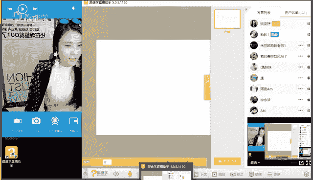
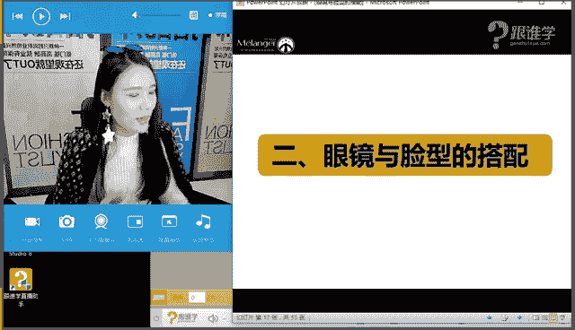
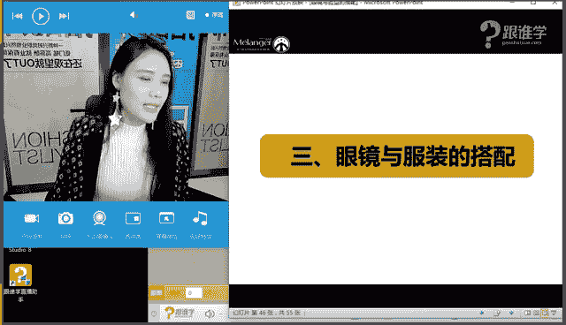
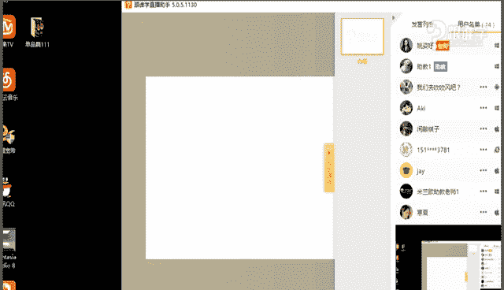

# 1、11服装《搭配秘笈之新版36计》：13脸型与眼镜搭配_rec

🎼等了你好久哦。😊。

哦。Yeah。

hello，大家晚上好。呃，现在可以听得到我的声音吗？同学们。😊，如果可以听到的话，请打一。OK啊，我看到。很多同学啊都在是吗？嗯，我觉得现在也是一个测试时间，看一下有多少同学在啊。好。

那咱们在的同学请打一好吗？然后看一下有多少这个经常来听课的，然后有多少不怎么来的偷懒的那种啊，好像现在为止我看到呃基本上都是经常见到的一些同学，但是有一个名字叫什么，不知道什么鬼的这个名字。

好像不怎么看到啊，那是不是平时没有怎么没有怎么来听课呢？啊，那其他同学呃这个阿麦呀，然后含夏包括一切随风，刚才咱们还在群里这个有有聊天啊，好，仙夫人呢等等，这些同学们都是经常来的。好，包括风铃啊。

蓉蓉3781O大家晚上好，啊，那很开心，今天又可以跟呃我们线上的同学们来分享呃，关于这样的一个时尚的课程的话题。OK好，那今天呢我们分享的。😊，特是关于眼镜的那大家也可以看到。

我今天还特地戴了一副眼镜啊，那其实。说到眼镜的话呢，它跟我们人的每一个部位有关系呢？同学们肯定是跟我们的脸，是不是？那其实我们呃也就是说我们所说的脸型的这样的一个问题。

那呃在我们脸的这样的一个在人体造型，或者我们自我形象提升的这样的一个过程当中，我们可以说呃脸真的是决定了很多很多的因素。那我在这里说的这个脸面部啊，并不是指我们所说的颜值的问题。嗯。

说的是其实跟我们脸型有很大的关系。那脸型它会影响到哪些因素呢？同学们你们觉得脸型会影响到哪些因素。同学们可以现在在屏幕上去打一下。看到3781同学说跟眼睛大小有关吗？

你是说戴墨镜的话跟或者是说说戴眼镜的话，跟眼镜的大小有没有关系吗？呃，这个其实跟眼睛的大小还真的没有太多的关系啊。OK那呃刚才我提到的这个问题，大家觉得脸型它会影响到我们哪些因素。

好像现在还没有同学打字，是不是同学们对于这个问题的话都不是特别清晰呢？呃，跟风格小仙同学说，跟风格、耳环、妆容、项链、发型嗯，非常好。呃。

我们的卓小仙同学分享的这几个点都是呃跟我们脸型是有息息相关的这样的一个问题的。那其实还有一个问题，比如说帽子啊，比如说眼镜其实跟我们所说的这样的一个脸型都有很大的关系。包括我们穿衣服的脸型。

它跟我们的脸型也有很大的关系。所以呢今天我们会呃主这个重点呢跟大家来分析一下，到底有多少种脸型，包括你自己怎么去诊断自己的脸型。那么你的脸型适合哪些眼镜呢？那这就是我们今天的这样的一个主要的课程。

OK那接下来我们就进入到我们的课程。好，首先呢我来自我介绍一下啊。那我是姚思瑜，同时呢是米兰欧国际时尚教育的高级讲师。那因为其实咱们现在的VIP学员大多数都已经认识我了。

在这里呢就不过多呃不过多的自我介绍的同学们。OK好，嗯，那关于今今天的这个篇幅呢，是我们在我们这样的一个整个课程当中，叫认识自己的配饰片。那在我们的整个入门课呃入门篇的这样样这样的一个课程当中。

我们把它叫做认识自己。那么稍等一下同学们，因为我这个有一个屏幕跳出来了啊。好，我把我来关一下。OK了，可以了。那呃因为其实本身我们说呃我们从小到大，因为都没有接受过对于自我的形象的这样的一个美学的教育。

所以呃我们很多人一辈子都不知道自己到底最美的状态呢是什么样的一个状态。其实跟很多因素相关。那其实对于我们自己我们就不是特别了解。比如说我们可能自己知道哎我觉得我胳膊粗，我觉得我手臂粗。

但是我们不知道我们自己的体型，我们的脸型，我们的这样的一个气质是什么样的。所以呢我们在整个入门片，只要给大家分享的就是关于你的体型、脸型，你的气质，那等等一些相关的因素。包括显瘦啊。

显高的这样的一个搭配法则。那其实有很多同学为什么我在这里要跟大家来讲到这样的一个呃一个片段呢，因为很多同学学习完了之后，他会很迷茫。说老师我觉得我学习完课程了之后，为什么？我还是不是很会搭配呢？

好像哎也知道老师你讲的一些原理，比如说我也知道自己的体型了，那我也知道我自己的脸型了。但是我好像对于搭配还是不知道该怎么去搭配。我想问一下，咱们今天教室里有多少同学是这样的一个情况。同学们。

如果你们有这样的一个情况的话呢，请打一啊。OK好嗯，那我相信有很多同学对于这样的一个问题都不是特别的清晰。所以我在这里跟大家重点的来讲，因为我们说认识自己，这只是一个初步的阶段。

那我们只是知道自己的体型的缺陷在于哪里，或者我们自己个人的气质在于哪里。但是我们对于服装的风格，或者对于搭配上，它不是一天两天能够解决的。或者说它并不是说通过能够时节的课程。

它就让我们能够得到一个快速的这样的一个呃这个这个这个进步。因为我们说这个时尚它不是一个肤浅的事情，它不是说十天之内这么解决的这样的一个课程，它需要慢慢的这样的去长期的这样的一个学习和这样的一个积累。

你才能够达到你对于一些风格的把握，对于自我的这样的一个认识。你学习到的某一些风格，或者你觉得自己哎是不是适合某一类的服装。风格。那这个都是慢慢的学习的这样的一个过程。包括其实很多同学。

我们说我们现在穿的都是西方的服装。那因为我们很不了解西方的服装，所以我们要去学习我们才能够知道呃，其实老师呃平时也做呃在做一些研发。那我在研发的过程当中，其实我也学习到很多很多的这样的一些知识。

那包括例如说我最近在呃做一些我们这样的一些课程的这样的一个包括单品片哪配饰片哪等等啊，那这些课程的这样的一个研发。所以我会在研发过程当中啊，会学习到很多的这样的一些知识。

那包括一些单品的这样的一个历史啊，包括单品的这样的一个发展文化以及它可以搭配哪些服装。那这都是老师也在慢慢的不断的积累和学习。更何况同学们，你们还是刚刚的开始，对于自我有这样的一个了解。

那其实本身我在于这个行业当中已经非常呃应该说。很多年了，那我已经我对于个人的这样的一个打造，包括我为其他人打造，其实已经没有太多的问题。但是有一个有一句话叫说四个字啊，学无止境。所以我还是要不断的学习。

那更何何况咱们现在在座的教室里的同学。所以我建议同学们，嗯，现在我们在在这样的一个入门片当中，我们认识到自己的体型问题，脸型问题，包括我们的气质问题。那么我们更多的要学习的就是我们对于单品的认知。

包括对于风格的认知，包括对于搭配。的这样的一个深刻的学习，你才能够解决你自我的这样的一个问题。OK好，那在这里就不过多的来跟大家来讲到这样这样的一个问题了啊。好。

那今天呢我们就来认识认识自己的这样的一个脸型问题。那从脸型到配饰，它之间有那么多的关系，那今天呢其实我们给大家分享的是眼镜。那眼镜其实如果大家学会了其他的配饰都是小问题了啊。OK好，那我们来看一下。

那在眼镜与脸型的搭配当中呢，今天我们给大家分享三个板块。第一个呢是关于眼镜的流行趋势。那2017年已经来了啊。好，那第二个的话是眼镜与脸型的搭配。

那第三个是眼镜与服装的这样的一个搭配OK那其实在这三个板块当中，我现在其实想问大家一个问题，我们平时在搭配的时候，比如说我们在搭配眼镜的时候，同学们，你们想到的你们搭配这个眼镜。

例如说我现在手上有很多眼镜啊，那我们在选择眼镜的时候，我们更多的考虑的因素是什么？我想问一下大家。同学们，你们现在可以在屏幕上去打啊，你们更多的考虑的因素是什么？你们选择眼镜的时候。好。

那我首先呢那同学们，你们现在可以在屏幕上打，那接下来呢我先来跟大家分享。嗯，好，大小颜色、服装的风格。O好，与脸型互补服装好不好看？好，一切随风是男同学啊，我知道好，那还问还问老师。

今天是男士有男士课吗？好，我是圆脸，我就不会选圆的眼镜。好，仙夫人还说到场合问题。那嗯我看仙夫人回答的服装场合，好，好像没有回答呃回答到这样的一个问题，就是脸型的问题，对吗？好。

那我在这里首先给大家强调的一个观念是什么呢？我们在选眼镜的时候，其实如果你是一个标准的脸型。那么恭喜你你不用考虑。太多的眼镜的这样的一个问题，是否与你的脸型能够互补和搭配。那如果你不是标准的脸型。

那么你要考虑的因素就很多了。你第一要考虑到眼镜，它能否跟你的脸型形成一个这样的一个美化你的脸型的作用。也就是说修饰你脸型的作用。那第二才是我们所说的服装风格的问题。那最后其实服装风格也就决定了你的场合。

对吗？啊，那其实这两点是最重要的那咱们教室里的同学，如果你们是标准的脸型，O恭喜你，你可以搭，你可以随便的买眼镜，你只需要考虑服装风格就可以了。但是如果大家不是标准的脸型。

那就要好好听今天的课程课程了啊。好，那首先呢先给大家介绍一下我们这个2017年，其实就是2016年到2017年这样的一个流行眼镜的趋势啊。我们说眼镜的呃，我们说流行的话，它是三年才会有个变化。

所以我现在给大家。推荐的眼镜的话呢，大家可以放心的去买啊。OK好，首先呢我们看到的是趋势一叫圆形镜片加猫眼眼呃镜框。好，什么样的是圆形眼镜？同学们可现在可以看一下，比如说这一副就是圆形眼镜。

但是你会发现今年的这样的一个眼镜，它会在边角处，也就是说它的眼镜的这样的一个上呃右边角和左边角加这样的一个猫形的这样的一个这个小上扬的角。那其实我头上的这一副眼镜就有点像我们所说的猫眼眼镜。

同学们看出来了吗？嗯，好，那这种眼镜呢。嗯，其实它戴起来给人什么样的感觉？同学们，你们觉得这种眼镜戴起来是什么样的感觉？🤧嗯。是不是有一种看起来有点这种小活泼，然后小俏皮的感觉。那其实啊仙夫人说时尚。

然后呃小仙说时尚啊，这两个名字，你们俩人名字真的好好仙啊，都啊一个说俏皮O是的那其实它更多的给人感觉是有种俏皮感这种眼镜OK那这种眼镜的话呢，呃在我们所说的这个呃我们才我们说了眼镜的话。

它除了弥补脸型问题以外，它还会要搭配你的服装风格。那其实这一类的眼镜，它可能就会更加的适合搭配那种比较俏皮的啊，活泼的，你想要表现这类的感觉的时候，你就可以选择这种眼镜。OK啊，我们继续来看。嗯。

那第二个就是什么呢？透明镜框。那我们会发现，其实在2016或者因为2017才刚刚来的啊。那2016年其实它一直流行的都是这种，它就会流行这种透明。的边框有很多同学会说，老师冬天来了还要戴墨镜吗？

那其实我想跟同学们回呃讲到这样的一个问题是现在你们觉得有多少人戴墨镜，是为了防这种光的啊或者防沙的。其实我们更多的是属于这种装饰作用，先夫人说是啊，是吗？好，那我现在要回到呃回答回答大家这样的一个问题。

那我们在夏天其实会经常选择戴眼镜，对吗？那可能就是更多的是为了很多同学可能真的是务实型的。嗯，戴这种眼镜的话，就是为了这个呃这个叫什么防太阳光或者说防这种沙尘的感觉。

其实呃我们说现在大多数这样的在冬天或者在南方，其实我现在在南方城市啊，呃，包括一线城市，其实很多人他们冬天依然会戴眼镜，但是他们戴着这种眼镜并不是说为了防阳光和防沙尘。更多的是装饰性的作用。同学们啊好。

嗯白草人说我要带有度数的近视眼镜，也有流行趋势吗？近视眼镜的话，我们我们说眼镜有分两种啊，一种是平光眼镜，也就是我们这种或者是说我们说的这种近视眼镜。那另外一种的话就是墨镜。那这两种眼镜的话呢。

在我们今天的课程当中都会跟大家分享到，就是你的脸型的话呢，适合戴哪种眼镜？O好，那其实今年流行的这种近视镜的话也会有的。就是那种呃那呃等一下在后面的这样的课程当中，我会给大家来分享图片啊。O好，嗯。

谢谢这个呃陈丽同学说，老师今年好美，老师哪天不美啊。好，老师就开始臭美了啊。好，那刚才说的我们所所说的叫趋势二的这种透明镜框。那趋势三双色镜框，双色镜框的话指的什么意思呢？那现在大家应该可以看得到啊。

这种双拼式的，也就是说它上面跟下。色彩是不同的，或者说它左边和右边的这样的一个色彩是不同的。那在今年的这样的一个秀场当中有非常多的这样的一个镜框的这样的一个展示。那其实我们经常会说为什么要看秀场呢？

因为我们从秀场当中，它会吸取很多的这样的一个时尚的元素。例如说我教给大家这样的一个绝招啊，比如说你要是想了解啊，比如说今年的这样的一个时装周出来了。那你就去观察各大时装周的秀场当中。

他们有哪些共同的元素。那那个元素就代表它一定会爆掉，就是一定会火。那你提前去买那个单品绝对没有错。呃，老师可以给你打保证啊，就是你买这种单品的话，它绝对不会过时。呃，绝对是在流行的这样的一个阶段。

也就是说近三年它都不会过时。例如说呃有一年我记得我当时去看那个就是看秀场的时候，我会发现每每一个秀场当中都会。有那条就是呃系脖子的那种细的那种领巾，大家现在知道吗？那其实现在是不是特别火啊。

当时我一看到这样的一个趋势的时候，就立马就买了。当时很多同学还会说，哎，老师你买这个领巾的话，这个好像没有你没有没有见过呀，没有见过这种戴法。我说放心吧，你你看一下这个过过不了多长时间。

这个肯定会满街都爆掉的啊。好，果然现在就是我们说在前一段时间就特别特别流行。包括现在也还依然流行，对吗？OK好，那教给大家的这样的一个小秘诀，同学们你们可以去观察一下啊。好，那这是我们所说的双色的镜框。

那刚才我所说的上面跟下面包括其实呃有左边跟右边的这样的一个变色的镜框也会有。那这种镜框，我相信有很多同学可能会接受不了，会觉得太过于个性和时尚了。没关系，那如果大家接受不了的话。

可以选择其他的这样的一个些镜框。今天我们有分享5种啊，OK好，那趋势4粗边框。那这种粗边框的话，包括这种镜片，它给人感觉会有一点点太过于硬朗的感觉。所以说如果哎长得特别柔美的女性。

你表你想要表现这种中性或者是硬朗的时候，帅气的时候，你就可以选择这一类的这样的一个镜框。那如果有某些同学他想要表现柔美感的时候，那么这种镜框你就不要选择了。因为这种镜框它太过于这种所说的亮感。

这种边框有点太粗了啊，看上去就有点男性化的感觉。所以呢如果你想要表现中性，就可以选择这种OK好。那么接下来看趋势5塑料感眼镜。我我当时看到这款镜框的时候，我就觉得哎。

这不是小的时候那个就是各种商店卖的那种玩具的眼镜吗？没想到今年有流行了啊，那刚开始一看到它流行的时候，就觉得真的很像玩具的那种眼镜。但是你会发现时际上有的时候就是这个样子。当满大街都带的时候。

你好像你不带的时候，就觉得有点嗯自己是不是落伍了啊。那当然我看到应该我觉得呃我们现在教室里有大部分的同学或者说二三线城市的同学可能呃不太能接受。

当然也也有可能很多同学已经具备了我们现在这几款当中眼镜当中都已经有了啊。那如果同学们呃你们接受不了的话呢，还可以选择其他的镜框。OK那其实我给大家分享的这种这种趋势类的眼镜的话。

它相对来说都一定是比较个性的那有很多同学接受不了也没关系。O我们来看一下啊。好，那这种。镜框的话，就是我们刚才所说的这种塑料感，看起来就是一种塑料感的镜框的这种感觉。那包括这种彩色感。

它会给人感觉特别的这种活泼和时尚感。那所以说如果要是有同学他是比较端庄类的呃端庄类的或者是保守类的那么这种眼镜我相信你一定接受不了，对吗？嗯，O好，那我们继续来看彩色透明镜片款。

那我现在手里就有一副这样的眼镜啊。今天为因为要给大家讲眼镜，所以准备了很多的眼镜。那这一副的话就是属于彩色透明镜片款啊，给大家来戴一下看一下，那这种眼镜的话，它其实是有一种运动感了啊。

戴两个眼镜有点奇怪。它呃有点这种运动感，那再穿着这种运动装啊，卫衣啊等等啊啊，都包括复古式的。今这一款眼镜很流行，那大家也可以去选择一下这款眼镜嗯。OK好，嗯，那呃其实。这款眼镜的话呢还蛮好看的啊。

OK那趋势6就是个性类的眼镜。前面5款眼镜，我相信哎多多少少，我相信咱们教室里还是有很多都能够接受的，都适用于女性的趋势吗？当然啦啊但是我相信很多男呃，这个那sorry啊。

很多这种现在我给大家看到的个性类的眼镜，基本上99。9%的人吧都接受不了，对吗？那包括其实老师的话呢也不会选择这种眼镜，因为他不是特别的实用，为什么在秀场当中，他们模特会戴这种眼镜呢？

或者说为什么品牌他会选择这么夸张的眼镜把它作为展示品呢？其实秀场他其实就是为了这样的一个。我们所说在秀场当中，大众都离秀台呃离T材很远。那前一段时间我们在举办了这个中国模特大赛。

我们当时会发现哎舞台离观众席特别远。的时候我们需要做一些调整是什么调整呢？比如说我们的配饰，以前可能配饰选择的是这么小的，但是如果要是在呃秀场上，我们可能这个耳环就要选择这么大的啊。

配饰就要选择这么大的那其实这个眼镜的话，它也是有这样一定的夸张的作用。在秀场上它基本上都会有放大和夸张的这样的一个感觉。那要么就是极致的大，要么就是这种极致的小或者极致的这样种个性感。

那我相信这种眼镜的话呢，基本上哎没有人可以去这个就是基本上很少会有人去选择。那包括这种眼镜啊，好，OK那这下以上呢就是给大家分享的这样的几款关于眼镜的这样一个流行趋势。

那我相信呢很多同学可能会觉得哎现在听着无感。等一下呢我们讲完这个眼镜与脸型的搭配的时候，再反过来给大家来看一下，呃，你们的脸型到底适合什。样的眼镜的这样的一个问题。那大家可以自己对号入座一下啊。OK好。

那接下来呢我们来看一下眼镜与脸型的这样的一个搭配。

好，那呃你看同学们，刚才有同学说嗯，感觉冬天戴眼镜的时候很傻。那同学们大家可以看一下，现在屏幕上基本上啊都是在冬天选择的佩戴眼镜吧啊，比如说大很明显的这种皮草啊、围巾啊、手套啊、皮草啊、大衣啊等等。

那都可以看得出来，其实是在冬天，所以说时尚达人或者说时尚跟大众的区别在于哪里呢？明星跟大众的区别在于哪里呢？就是在于他们特别喜欢使用配饰。那配饰它是非常非常非常重要的啊。同学们，所以我在这里再三的强调。

你想象一下同学们，我现在老师把耳环取掉，把眼镜取掉，基本上身上就没有什么可以这个没有什么亮眼的东西了啊。所以配饰是为了增加时尚感而后存在的啊。O好，那我们来看一下。

那首先呢刚才我跟大在课程前就跟大家说了，我们说眼。镜啊跟脸型的搭配当中是不是脸特别的重要？那我们接下来呢就来认识一下脸型。那首先呢我们来看一下标准型的脸型有椭圆形脸和倒三角形脸。那椭圆形脸的话呢。

它的这样的一个我们所说标准脸型的话，它是三庭五眼。然后呢是4比3的这样这样的一个比例。也就是说它的高是4宽是3。那相对来说，其实老师的脸型呢就是4比3的这样的一个长度是比较标准的啊，长宽是比较标准的。

但是我的脸型并不是标准的脸型。那大家可以看到，椭圆形脸经常为什么韩国女明星中国女明星都经常把自己的脸整成椭圆形脸，或者说整成这种下巴特别尖的倒三角形脸呢同学们知道原因吗？因为这两种脸型，它会特别的上镜。

就是说经常我们会发现就是比如说老师的脸的话啊，它是这种有点我的脸型呢，这个地方下颌骨这个地方呢，它是有角的，就是有成这种角度的感觉。那如果标准型的脸型呢，它看起来其实是这样的同学们啊。

就是没有这个下颌骨，就是这样的感觉。所以啊我我突然觉得我的脸好小啊，是不是瘦了一圈的感觉。这样的话就会比较上镜。那我们是不是在拍照的时候，经常如果脸比较方的或者比较圆的人就会特别费劲儿啊。

拍完照片之后还要用美图秀秀把脸推一下啊，推瘦一点啊。那其实就是因为嗯。这种椭圆形脸和倒三角形脸呢，它比较标准和比较上镜。所以很多的明星都会去整成这种脸型。那我想问大家，我们的如果是非标准的脸型。

我们在戴眼镜的时候也好，在做发型的时候也好，那我们的目的是什么？我我们为什么要去这个做一个好看的发型呢？什么样的发型会比较适合我们的这样的一个脸型，那我们经常会问到，对吗？

那其实我们最终的目的是为了通过发型通过耳环通过眼镜等等这样的一个手段来达到让我们自己的脸型看起来是比较标准的这样的一个状态。例如说老师现在的头发我就会经常会这样啊，同学们给大家来展示一下。

我为什么不把头发全都把它给弄起来呢？因为这样的话会特别明显的展展示我的脸型是一个方脸，对吗？那所以我会经常把头发。嗯，给大家来看一下啊。嗯。

首先我会用斜刘海把我的头把我的这个这个这个呃脸这个上颌上并角的这个地方啊，包括这个这个我们所说的下颌骨这个地方全都进行修饰和遮盖。那再加上你看这样的话，我现在做好啊，是不是看起来我的脸就很小了。

就看起来不是那么的方的感觉了。那所以其实我们留发型也好，或者带配饰也好，最终的目的都是为了把我们的脸型修到这样的一个标准的这样的一个状态啊。谢谢6511同学说不方啊，怎么看是方呢？好。

那呃因为我现在旁边没有做一个标准的脸型，如果做了一个标准脸型，你就知道了啊。那或者说等一下我给大家给大家看一些图片啊。比如说杨幂的脸型啊，它看起来就是比较标准的那我现在再给大家来看一下啊，标准的。

那比如说方形脸，同学们方形脸它会在这个地方呢有一个转角，就是有一个。角啊叫下颌骨这个位置，它会有一个角度呈90度啊，或者是说这种呃60度啊等等。而这种我们所说的椭圆形和倒三角。

他们的下巴这个位置是没有这块骨头的，就直接圆润下来了。而很多这种我们所说去方形脸去做这种削骨的手术，其实就是把这一块并这个下颌骨给磨掉。所以他的脸就变成这种我们所说的标准的脸型了。OK好。

那我们刚才说到标准脸型是长四宽三。那我们来看一下非标准的脸型当中，我想问一下大家，正三角形脸长形脸方形脸菱形脸和圆形脸。那嗯我想问大家，你们觉得哪个脸型是比椭圆形脸。

就我们所说的标准的4比3的脸是偏短的，哪个脸型比4比3短，就比椭圆形脸短。同学们可以想象一下啊，或者看一下图片当中，你们觉得这个里面的脸型啊有哪个是比团圆形脸比较偏短的？嗯。

小仙同学说圆形脸和这种什么还有没有呢？同学们。啊，方形脸是的啊，其实就是圆脸和方脸，它是比标准的脸型要偏短的。而比我们所说的椭圆形脸要偏长的，是哪个脸型呢？是不是就是长脸型呢？其实老师是一个长方形脸型。

在我们这个图片当中没有啊，其实我是属于复合型脸型啊，其实我就是属于长方形脸型，我不是属于特别这种特别方的，也不是属于特别圆啊，sorry，那这种特别圆的和特别方的这种脸型的时候，它会什么呢？

它的比例可能会更加接近于一比1，就是它是一个正方形，或者是这种圆的，它没有这种长度和宽度的这样这不是长四宽三了，它可能就是3比3啊，那就是相等的这样的一个问题，所以说那这两种脸型，它是比较偏短的。

啊这种脸型，长形脸它是比较。偏长的那下面我想问一下大家，如果是脸型比较偏短的话，他们要选择什么样的眼镜？他他在选眼镜的时候，他应该是选择拉宽的呢？还是选择拉高的呢？同学们，因为现在大家还没有概念。

我先把这个东西抛出去。我想先看看咱们同学们对于这个概念有没有这样的一个大概的感觉。如果脸型是比较偏短的，他应该选择拉高的眼镜呢，还是选择拉宽的眼镜呢。嗯，好，我看到大家都大多数同学都说拉高的眼睛。是的。

嗯，非常好。同学们啊，是的，如果一个人的脸型他是比较偏短的，那么他应该选择拉高的这样的一个镜框才能够使他的这样的一个脸型看起来有拉长效果。那如果这个人脸型是偏什么呢？长的那他应该选择拉宽还是选择拉高呢？

同学们。嗯。好，我看到有一位同学说拉宽的嗯，一线随分包括阳光明媚嗯，化妆学校胡老师啊。那这位这几位同学都说是拉宽的。是的，非常好。同学们，那如果在这里呢我先跟大家抛一个概念。如果你的脸型是比较偏长的。

那么你要带拉宽型的眼睛。如果你的脸型是偏短的话，那你要带拉高型的眼睛。那下面呢我们来认识一下自己的脸型。那到底怎么样才去诊怎么去诊断自己的脸型，现在是大家都非常关心的啊，那我先在给大家来讲一下。

这几个脸型，比如说椭圆形脸，它是长四宽三。然后它每一个我们所说的脸的这样的一个这个从这个上上立角的这个位置，到这个太阳穴啊，到额骨最宽的位置啊，到颧骨最宽的位置，到下面的这个下裸角的位置。

它都是这种圆滑的方式下来的。而这种到三角形呢，它是上面宽，下面。而正三角形啊，它就反过来是上面特别窄，下面特别宽。比如说董卿的脸型。那倒三角形脸型的话有范冰冰啊，那长脸型的话呢，其实呃这种呃梨勇。

就是我们经常会说她是马脸嘛，其实她就是长脸型。包过其实有一个混血的明星叫magicQ。这个女这个她演的这种特工呃叫赤裸特工吧，好像是里面的女主角她就是这样的一个脸特别长的啊，那心形脸的话。

其实就是成立同学心型脸就是倒三角形脸。嗯，好，那呃正三角形脸其实也被称为叫梨形脸，像梨子的梨叫梨形脸。那长形脸。刚才我们说了李勇啊，那方形脸呢，她就是属于这种比较偏呃就是长这种这种她是呃像正方形一样啊。

其实概念就是这个样子的啊。那有人也叫她这种叫国字脸啊。那比如说菱形脸，它其实就是什么呢？也有人称它为叫钻石型脸型，那它的是太阳穴的这个位置是比较窄的，颧骨的位置是比较高的，下巴呢又比较尖。

那大家可以看一下这个位置啊，大家可以看一下这个图片。那所以这种脸型呢，它看起来其实也有一点点这种偏时尚和个性感的啊，那圆形脸呢它就比较这种可爱的感觉了啊，它就特别可爱的感觉。比如说大S啊。

比如说这种呃这个脸圆圆的，还有哪些明星呢？李湘啊，他们都是属于脸圆形脸，陈年同学说啊，好难判断呢。好，那等下呢我给大家来教大家一个方法啊，OK。好，艾丽同学说，子玉老师应该怎么选择眼镜啊？不要着急。

同学们，你们首先要确定自己的脸型，才能知道你选择什么样的眼睛会更好。OK好，那我们说刚才我给大家说到这个脸型的问题。那同学们大家都知道自己呃大家都知道有哪些脸型了，对吗？好。

那接下来呢我要告诉大家的这样的一个问题，就是在我们判断自己脸型的时候呢，其实我们没有。大多数人啊他都不是可能是不可能是那种特别标准的椭圆形脸呀、心形脸呀，然后方形脸呀、菱形脸，它有可能是混合型的。

比如说今天像我们在问解解答题里面的时候，有一位同学它就是这种混合型的，就是有点这种心型脸，然后混合了这种有点菱形脸的这样的一个趋势，它是太阳穴比较窄。嗯，那其实有很多同学都有这样的问题。

那首先我们来看一下如何来诊断自己的脸型。那同学们，你们现在可以看到这个这三条线是什么意思？这两这条解最上面这条线呢，其实就是指如果你们在画嗯在呃这个判断自己的脸型的时候呢，首先要做的一件事情是什么呢？

首先要把自己所有的头发啊，我先给大家来展示一下，你们要把自己所有的头发呢全都扎起来。然后呢。来，我给大家来看一下啊，全都扎起来。同学们现在能看清楚老师的脸型了吧啊，我今天牺牲可大呀，头发自己了。

你看看啊，首先呢你要先把自己所有的这个头发扎起来，现在大家能看得到我是一个长方形脸的啊。那首先把头发扎起来之后，然后根据你上面的这个我们所说的鬓角的这个位置，然后到这个位置画一条线，然后呢再把什么呢？

颧骨这个位置，然后到这边的位置画一条线，也就是说你颧骨最宽的位置，你脸颊比较宽的这样一个位置。那另外的话就是把你下颌角下颌骨的这个位置，到这边画一条线啊，O那。接下来我们来看一下啊。

如果那首先同学们第一步你要做的是把所有的头发都什么呢？扎起来。然后第二步呢是。老师先来整理一下自己的形象啊，乱七八糟的好。嗯。杨幂是菱形脸吗？等一下我再来给大家来这个判断这个问题啊。好。

那我们来看一下啊，那杨幂大家可以先看一下她的这样的一个脸型。那其实它不是属于特别典型的这种菱形脸。那我们首先先把自己的脸画出来之后呢，然后呢画三条这样的线，那你的脸型越接近于哪种脸型的话呢？

那你就是那种脸型了啊，同学们不用纠结，有有同学就开始稠了，说老师我到底是哪种脸型啊，我好丑啊啊，那其实杨幂的脸型，它更接近于我们所说的，有点这种椭圆的感觉啊，它其实更加接近于椭圆的这样的一个感觉。

而这个脸型它其实更加接近于心型脸。同学们，你会发现这个脸型它的下面上面是比较宽的，下面是比较窄的。而这个脸型它是从上到下都是一个椭圆的这样的一个感。🤧学那所以说你们首先。是呃，对，是的。

可以在照片上画的，先把所有的什么呢？把头发全都扎起来。前提是一定要把头发扎起来，然后再画啊。同学们，然后呢你就能够大概的判断自己到底是哪种脸型了。那我还是要强调有的人呢他是符合这种我们所说的复合型。

比如说他这个地方有点窄，然后呢然后这个地方又有点这种宽啊，他可能就是我们所说的这个上面窄，下面宽他就是梨形脸啊，那如果有的人他脸型可能是正他可能是长方形脸，但是它太太阳穴的地方特别的窄。

那有可能呢他就是这种梨菱形跟长方形的这样的一个复合型。OK好，那首先呢我们的脸型先判断到这里了啊，ok那同学们你们自己下去再去判断自己的脸型。那我在这里呢继续给大家来讲到，我们如何选眼镜了啊。

那首先我们判断完自己的脸型是偏什么。啊，你是这种哪种脸型，然后另外你是偏短的还是偏长的，这个要搞清楚啊。那接下来我们来看一下脸型，它有这种我们所说的长和短啊，就是那眼镜的话呢。

其实刚才我跟大家讲强调了一个概念叫拉宽和拉高的概念。那好，同学们，我现在想问一下大家。你们觉得哪一个眼镜是拉高的。同学们，一还是2，哪个眼镜是拉高的，一还是一还是2。嗯。好，阳光明媚，爱丽蓉容。

一切随风阿K。然后程丽同学。嗯，OK好，我看到大多大多数同学都已经回答了啊，那非常好，同学们左边的这一副眼镜，它就是属于叫拉高型的眼镜，那右边的这一副眼镜呢，就是拉宽型的眼镜。

那其实我现在拿拿一副眼镜来给大家来展示一下啊。例如说这两副眼镜当中好，那我想问一下大家哪一副是属于拉高型的，左边还是右边拉高型的？啊，一还是2OK我看到有同学左边嗯。好的。😊，好。

那大家现在对于这个都已经有概念了，是吗？那我现在要问一下大家，如果一个人的脸型它是偏短的，比如说圆形脸和方形脸，他应该戴哪一副眼镜的？同学们戴这一副呢，还是戴这一副呢？是戴一还是二呢？OK好，嗯。

非常好，同学们啊，风林同学说带二，那其他同学都回答了一是吗？是的，那其实我要在这里跟大家讲到的是什么呢？我们说脸型与眼镜，它有一个叫有一个叫有一个原则，搭配原则叫反向弥补。

也就是说如果你的脸型是比较偏短的话，那你就要戴拉高型的眼镜。如果你的脸型是偏长的话，那你就要戴拉宽的眼镜。😊，拉高的概念还不太明白是吗？好，那我现在再给大家来讲一遍。那这副的眼镜呢它是属于比较扁的对吗？

同学们它是比较扁的，而这副眼镜它是属于比较什么呢？这种镜框啊和这个这个镜片位置，它都是属于比较拉高，就是比较比较宽的啊，比较拉拉就是sorry不是宽概念啊，是拉高的。

比较大一点这样的一个镜这样的一个概念。那所以它会在人脸上形成一个呃关系。就比如说你看这两副眼镜，同学们，你们觉得哪一副眼镜更接近于横向的，或者说更接近于一字感的这样的一个感觉。横向感。哪个是横向感。

哪个是纵向感？6511同学一还是2。左边是横的，一是横的对，二是比较偏纵向感的。🤧。好，6511同学还是没明白啊。那我在这里再给大家来讲一遍啊。左那大多数同学都已经理解了，对吗？

其实我们再来看一下这个图片当中，这两副眼镜的镜框有一副是比较偏扁宽的。然后有一副呢它的镜框是比较偏大一些的对吗？那我们说如果在脸上它会形成一个线条，就是我们所说的横向和纵向的概念。

那这一副呢它其实就是偏横向感的，可以看到我这个线条吗？它就会在人的脸上形成一个横向感啊，而这一副呢其实它是属于镜框偏大的，它就叫拉高的感觉，它也会有拉长的感觉，它会把人的脸拉长感。OK好。

那现在6511同学对于这个概念理解了吗？啊，如果要是理解的话，请打一。🤧OK好，那理解的话呢，我们就继续好，那我们接下来来看一下。那刚才我们嗯稍等一下，我来调一下PPT。🤧好，那我们继续来看。

那大家现在对于眼镜的这样的一个线条也有概念了。所以如果一个人他的脸型是比较偏短的，比如说圆形脸和方形脸，那他们要戴这种拉高的这种眼镜。那如果一个人的脸是偏长的那么他就要带拉宽型的眼镜，为什么呢？

这个叫反向弥补原则。你的脸本来就已经很长了，你还要戴拉长眼睛，就会让你脸显得更加的长。那如果你的脸本来就比较宽，你还带这种拉宽型的眼镜，它会让你的脸显得更加的短，能理解这个概念了吗？O好。

那接下来我们来看一下法则一啊，那圆脸和方领，它要带方圆形的眼镜。那为什么他要带方圆形的眼镜呢？镜框是圆的方的或者三角的对脸型也有要求。那接下来给大家讲到了就是这个概念一切随风。同学。

那6511同学呢呃还是不是特别了解这个概念是吗？那等一下，如果要是你还是不是特别了解老师讲完课之后呢，你可以私下来找我啊，我现在的话先呃其他同学大概都已经理解了。我们先基于下面的课程。OK好。

那呃首先呢我刚才跟大家讲过了，我们所说的拉高型的眼镜的这样的一个概念。刚才有这个一切随风提了一个问题，说镜框有圆的方的或者三角的。当然啊我接下来就要给大家讲这个概念。那我们刚才说到了拉高型的眼镜当中。

比如说有方形的有圆形的，然后还有这种叫什么呢？嗯。我给大家来看一下啊，这种三角形的啊，刚才这个这个。嗯，一切随风同学说这个三角形的啊，其实就是这种叫飞行员眼镜啊。我们来看一下这一副是这种飞行员眼镜。

这副是方形眼镜，这副是圆形眼镜，它都是属于比较什么呢？高度是比较高的对吗？这个高度是比较高的那。🤧高度比较高的时候呢，它对于我们所说的脸型就会有要求了啊。那如果是一个圆脸和方脸的话，好。

我现在要问大家一个问题，你们觉得圆脸型戴这副眼镜好吗？同学们。你们现在可以回答我一下，圆脸型戴这副眼镜好吗？为什么呢？好，为什么呢？是的啊，仙夫人说更圆。对，那就是我们这就是我们所说的一个概念叫什么呢？

如果你的脸特别的圆，你还带重复自己脸型的眼镜，那么就会显得你的脸更加的圆，而这副眼镜哎，我想问一下大家，你们觉得这副眼镜怎么样呢？这副眼镜特别的方，对吗？那如果你的脸型是属于这样的一个呃圆特别圆啊。

有同学说可以，那其实这副眼镜也不是特别的好。同学们啊，为什么呢？因为这副眼镜比如说啊这一副它会更方，我给大家展示一下啊。因为如果你戴特别方的眼镜的时候，就会形成叫什么呢？特别极致相反的效果。

所以戴这种眼镜也不会特别好。那么它会比较适合哪一种呢？就是刚才我们就是我们现在屏幕当中呢，看大家可以看到的这副眼镜叫做方圆形眼镜。那这种眼镜的话呢，会更加适合我们所说的圆脸和方脸，其实道理也是一样的。

如果一个人他的脸特别方，他如果还戴那种特别方的眼镜，它也会形成我们所说的叫什么呢？极致相同的啊，就是一个件电视机加了两个电视机就会特别方啊，那所以看起来就不是特别好。那如果他脸特别方。

他还戴特别圆的眼镜，也会形成叫极致相反的圆领，所以说圆脸和方脸都比较适合戴圆方圆形的眼镜，同学们就是我们现在看到的这副眼镜叫方圆形的眼镜。那这样的一个镜框，你会发现它不是那种特别接近于这种圆。

🤧而它又不会接近于这种特别方的感觉，所以它会更加适合我们所说的圆脸和方脸。那这就是我们所说的圆脸方脸，它会比较适合方圆形的眼镜的这样的一个原理。同学们现在能理解了吗？如果理解的话，请打一。

如果不理解的话，请打2。嗯。好的，嗯，我看到大多同大多同大多数同学都已经理解了，是吗？好，丽坤同学嗯，你你把这个你的脸形容出来，老师是想象不出来的啊。O所以说的话呢你最好是要拍相片。

然后呢老师才能帮你判断，这样或者你自己先判断一下好吗？嗯，O好，那我们继续来看一下啊，那这是我们所说的圆脸和方脸的选择的这样的一个眼睛的问题。O好，稍等一下同学们来调一下PPT好，我们来继续看。

那这是我们所说的法则一，那现下面呢给大家来看一下图片。那例如说这个女生她其实脸就是有点这种偏圆圆的感觉。你会发现她会用发型给她进行她的脸这个什么修饰。然后再加上她用帽子一修饰，好像脸就变长的感觉。

其实她本身脸是偏圆的感觉。那另外的话呢，她选择的眼睛就是这种有点方圆的感觉，不是那种特别的方也不会特别的圆。那继续来看一下。

那例如说这位大家认识吗？那也是商界非常有名的一位啊，大家有没有人认识这一位的？嗯，是的啊，OK360的老总周宏伟啊，那这一位的话呢，大家可以看一下，他本身啊他戴的眼镜是这种哈，大家可以看一下。

就是这种透明的无边框的眼镜。那我想问大家，你们觉得透明无边框的眼镜会对一个人的脸型有没有影响呢？一是有二是没有，有没有影响呢？🤧嗯，我看有同学说是有同学觉得有影响是吗？好，那我现在跟大家来讲一下。是的。

其实透明无边框的这样的一个眼镜对于一个人没有太大的影响啊，那所以说呢他戴这种眼镜，其实对于他的脸型来说，既没有修饰作用，但是也没有什么呢？太多太多的这样的一个影响，既不会让他变好看，也不会让他变难看。

还是原来的样子啊，那接下来我们来看一下啊，这副眼镜是P上去的啊，O不是他真正戴的，是他P的眼镜。那同学们其实他的脸就是这种我们所说的有点偏这种圆圆的感觉。那么大家可以看一下啊。

他就比较适合戴这种叫方圆形的眼镜。它不是特别适合戴那种我们所说的，哎，特别的圆呢，你会发现他没有戴特别圆，对吧？老师这字是用鼠标写的吗？你怎么那么聪明呢？OK好，那这是我们所说的圆脸型的男士啊。

那么接下来来看一下这位大家觉得这位大家认识吗？叫赵薇吧？啊，大多数的人都认识吧啊，那么来看一下赵薇的这副眼镜大家可以看一下啊，他的脸型其实是属于我们所说的叫长方形脸。那同学们，你们觉得这副眼镜怎么样呢？

是不适合赵薇呢。😊，你们觉得适合的请打一，不适合的，请打2。嗯，OK好，那我现来给大家讲一下啊。其实首先如果从我们所说的拉高的这样的一个角度上来讲的话。

其实这种冰因为它是属于长这种我们所说的长呃这个4比3的脸型。所以拉高和拉宽对于它来说没有特别大的影响。但是有一个问题就是它的这个边框呢，其实是有一点点过方了，是吗？其实如果它能够再圆润一些就会更好啊。

就会更好。O这是我们所说的罩薇的这样的一个这样的一个脸型的问题。那接下来我们来看一下啊，那以上呢一个其实就是圆脸，一个就是方脸。那方脸和圆脸的话，它更加适合我们所说的叫方圆形的眼镜。

那接下来呢我们来看一下第二条法则叫长脸和长方脸扁宽型的眼镜啊，那我们来看一下，其实长方形脸的话呢，它的影响不会特别大，主要是长脸的这样的一个问题。我们来。看一下啊，如果一个人她的脸特别长的话呢。

那首先其实他自己应该对于他哪个地方有修饰呢？比如说他可以用发型来修饰她的脸型。那如果发型修饰完了之后，再加上眼镜的修饰。那么对于她来说，整个调整就会非常的好了。第一，他在发型上可以做这种刘海啊。

这种留刘海的话，呢，对于他的脸长度其实就会有一个修饰感，他把刘海一遮，哎，你的脸看上去就比较短了，对吗？那所以说这样首先就有一个修饰了。那第二个怎么修饰呢？比如说我们在戴眼睛的时候。

为什么不适合这种拉高型的啦，因为这种拉高型的，它会让人的脸看上去更长。所以她比较适合这种拉宽型的眼镜。那这种就是我们所说的叫拉宽，这个叫拉高。现在大家能理解这个概念吗？还好，那我们继续来看一下。

比如说这位欧美的女明星。他在选择这种眼镜的时候，他选择的就是这种拉宽型的眼镜，他就没有选择那种拉高型的眼镜。大家觉得这副眼镜它戴着怎么样呢？是不是还挺好看的呢嗯。好，那接下来我们继续来看。嗯。

那还好是吗？那其实长脸型的人一定我在这个在这里要强调一下啊，如果咱们现在教室里有同学是长脸型的人的话，你们自己可以去试一下啊。如果你的脸型是特别偏长的。特别是戴那种近视的这种镜框的时候。

一定要选择那种拉宽的，不要选择那种大镜框，我在呃来给大家来展示一下啊，这里是不是又就有这种这种特别大的这种镜框的眼镜，那还有这种一种的话，就是这种。大家可以看一下啊，这种比较扁宽型，这种比较偏偏扁的啊。

花开的声音说老师拉宽的镜片比较较短吗？嗯，这个哪位同学再刷一下啊，因为老师现在看不到你的这个这个字啊。好，你再打一个你再打一打一个字儿，然后我就能看到你这句话了啊。因为我这里有一个东西挡住了。好。

那我们来看一下啊。那如果刚才讲到了，我说如果是长脸型的人，一定切记不要选择这种镜框，选择这种镜框的话，会让你的脸看上去。拉宽的镜片较短了。

其实拉宽的镜片的话指的就是它的镜片的位置是它的镜片镜框是比较偏扁的，就是这种比较偏扁的，而这种是比较偏高的，这个能理解吗？大家。同学们，这个是偏扁的，这个是比较偏高的啊。OK好，这个概念不重复太多了啊。

好，那我们继续来看一下法则三，菱形脸猫眼最适合，为什么菱形脸猫眼最适合呢？有没有同学能够呃按照我们所说的叫什么呢？呃，反向比一股原则，有没有哪位同学能在屏幕上敲一下，你你听到这句话的时候。

能不能理解这句话呢？想象一下，为什么猫型眼眼睛会更加适合菱形脸呢？同学们。🤧嗯。我们说菱形脸它的特点是什么？菱形脸的它的特点是。嗯，太阳穴的这个位置是比较偏窄的。

而颧骨的位置是比较偏高的那刚才月明同学说的非常好啊，补充那包括呃仙夫人，包括艾丽同学都回答了啊，弥补太阳穴。是的，非常好的。同学们呃，那我们所说的猫形眼眼镜的话，你会发现它这个位置啊。

我这个其实不是特别接近于猫形眼。猫形眼它会更加拉长。哎，我这这里有一副啊，同学们这个虽然也不是典型的猫形眼，它其实有一点点像的这种感觉了啊，它这个位置呢，它会有一个边角，会对于我们所说的太阳穴的窄的人。

它会有一个弥补。我现在带给大家来看一下，大家可以感受一下啊，你会发现戴这种眼镜的话，它会完全把你的这样的一个太阳穴的这个位置全都遮住了啊。而呃这副眼镜，同学们再来看一下啊。

你会发现这一副眼镜它对于你这个位置，比如说如果太阳穴是比较偏窄的人，他是盖不住这个位置的啊，所以说为什么猫形呃猫形眼的这种眼镜，它会或者是说这个边角或者说这个边角它会比较方的。

要能够弥补到太阳穴遮盖到太阳穴的，它会更加适合猫型啊这种菱形脸的这样的一个朋友啊，就是如果咱们教室里有菱形脸的同学，你们可以去试一下眼镜。那基本上老师会推荐哪些眼镜呢？呃，我要回这个比如说这一副啊。

然后这一副。包括嗯我给家看一下啊，这一种。就是它是有边角的，它是有边角的。你会发现这一副这一副这一副它都会镜框，它都会有边角啊。而这种眼镜同学们你们来看一下这种眼镜它是没有角的啊，包括。

这种眼镜它也是圆润感的那我现在给大家来戴一下看一下啊。好，你会发现这个位置是不是也盖不住我的太阳穴位置啊？所以说这种眼镜呢都不太适合菱形脸的。而那种我们所说的有边角的眼镜，它会更加适合给菱形脸。OK好。

那这一点的话，现在大家能理解了吗？嗯，我看到有同学说我是菱形脸。好，有同学问心情脸适合哪一种？如果你是心情脸的话，你就不用着急了啊。okK好，那菱形脸猫眼最适合这一点的话，现在大家大家能理解了吗？

如果理解的话，请打一。可以理解了是吗？OK好，嗯，那大家可以看一下，这种其实就是比较典型的猫型眼眼镜，它的边角是上扬的，它可以弥补到太阳穴的位置。那另外其实还有一点需要注意的就是什么呢？因为菱形脸。

它的这个颧骨的位置特别的高。所以呢它需要带稍微镜框大一点的眼镜需要盖住它颧骨的这个比较高的问题，所以如果特别窄的眼镜或者特别小的眼镜的话，它盖不到这个位置的话。

就修饰不了它这个太阳穴这个叫什么颧骨过高的问题也不会特别好。所以菱形脸它比较难选眼镜。那它因为有两点，第一点，它太阳穴过窄，第二，它的太这个颧骨位置过高，所以它选择的眼睛有两个标准。

第一个呢要弥补它太阳穴过窄的问题。也就是说它要选择有边角的。那第二，它的镜框要稍微大一点，要盖住它的颧骨的这样的一个位置。OK这是我们所说的菱形脸选择眼镜。那同学们都理解了是吗？好。

那刚才我看到有同学问说太阳穴窄的都适合带带边角的。是的，太阳穴窄的人都要选择带边角的眼镜都尽量回避我们所说的这种呃太阳呃这种飞行圆眼镜啊，那包括这种圆形眼镜啊，都不会特别好。OK好。

那包括其他同学也是一样的。有很多同学我相信你们可能是复合型的眼脸型，有可能是方形脸跟这种什么太阳穴偏窄的菱形脸复合，也有可能是这种呃真的是心形脸，但是它太阳穴这个地方也偏窄。

那么你们都会比较适合戴这种有边框的。ok好，这一点同学理解了吧。那接下来我们来看一下法则四梨形脸上宽下窄。那大家可以再想象一下，按照我们所说的叫反向民主原则。如果一个人他是梨形脸，它是上面特别窄。

下面特别宽。那他应该戴哪种眼镜。そ吗？如果太阳穴不饱满，不饱满，但颧骨不突出，算菱形脸吗？呃，但是那还要看你这个位置的问题。如果你下面是比较这种我们所说的有点尖尖的啊，然后就是这个地方窄。

那颧骨不是特别高，那也属于菱形脸，因为你这个地方窄了嘛，所以你看上去这个地方就是窄的。然后这个地方是这个尖这个它就会让这个地方显得突出了。嗯，没有下颚骨是吧？那你有可能那你应该就是菱形脸。于妹梅同学嗯。

好，那圆脸型，但是太阳穴偏窄，是戴哪种呢？呃，如果你是圆脸型，太阳穴也偏窄的话，那首先你也要带这种我们所说的方圆形的眼镜啊，老师现在这里没有方圆形的眼镜，那其实我先大概拿一副给你看一下啊。呃。

首先呢从我们所说的拉高和拉宽的角度上来讲，这一副眼镜叫拉高型的那也就是说它会拉长你的脸型，所以会比较适合圆形脸。那第二点上来讲，它这个地方是有边角的同学们看出来了没有啊，它是有边角的。

所以它可以弥补你太阳穴扩展的问题。所以那这位同学你可以去看去试戴一下这种眼镜。那或者说这个地方它是比较什么呢？偏这种椭圆的，可能会更好，就没有那么方，不会让你的脸显得那么圆叫极致相反的原则了。OK好。

那这个呢我就先回到这回答到这里啊。同学们。你的脸型怎么那么多呀？一会儿是圆形脸，一会儿是菱形脸，你到底是哪种脸型呢？椭圆形脸？但是太阳穴偏窄是戴哪种呢？如果你是椭圆形的话呢，那你你又是偏窄的。

那你有可能就是菱形脸呀。嗯，好，菱形脸跟椭圆形的脸区别在于哪里？其实区别就是在于太阳穴这个位置啊。因为菱形脸和椭圆形脸，其实这个下面都都是挺均挺尖的啊，没有下颌骨的这个位置。O好，嗯。

那一样啊椭圆形脸的话，那你还是要选择带边角的眼镜。O好，那这个问题我就先解答到这里啊。同学们等一下我们在下面的这样的一个解答环节再跟大家来分享啊。好，那我们继续法则四，梨形脸，上宽下窄。

那刚才我跟大家讲了啊，如果是梨形脸的话，它梨形脸的脸型它是上窄下宽。所以它选择的眼镜叫弥补原则的话，那，它应该选择上面宽下面窄，它的原则是什。什么呢？第一，他要弥补它太阳穴过窄的位置，它其实上面窄。

它这个地方也会比较窄，所以他要选择这个宽的。然后呢，它因为这个地方特别的宽，所以他要选择下面窄一些的来弥补它的互补它的脸型的这样的一个问题。那这一点的话，同学们能理解吗？梨形脸选择上宽下窄的眼镜。

这一点现在大家能理解吗？如果理解的话，请打一。好嗯。那我们继续来看一下啊，大家认识这一位吗？我们来看一下啊，这副眼镜呢，其实它其实就是什么呢？特别典型的梨形脸。大家可以看一下上面是不是比较宽。

下面啊上面是不是比较窄，下面是不是比较宽。那所以说呢他要戴眼镜的话呢，他就要戴上面这这是本本来他自己的眼镜是这个样子的啊。同学们，那我们P上去的眼镜就是这个样子的那大家觉得哪一副眼镜啊。

先不考虑这个人长得好不好看的问题啊。其实这副眼镜它会更加的能够弥补到他的脸型的问题啊，那其实还有一个问题，就是如果他的这个眼镜的这个上面啊可以再深一点点色彩，然后边框的这个颜色再有一点点就会更好了啊？

OK好，它看上去更像方形脸吗？6511同学其实他更接近于我们所说的这样的一个梨形脸啊。OK好，那这副眼镜其实会让他脸显得更加的宽啊，它其实会更加适合上宽下窄的眼镜。

OK那呃从我们所说的眼镜呢呃脸型和眼镜的弥补的这样的一个效果上来讲啊，嗯上宽下窄和梨形脸很相似了吗？上宽下窄和梨形脸很相似了吗？没有太理解啊，爱丽同学梨型脸它是上窄下宽，所以他要戴上宽呃上窄下宽。

所以他要带上宽下窄的眼镜啊。OK好，嗯，对，是的，相反的原则。嗯，好，那我们接下来继续来看啊，这是我们所说的梨形脸的选择眼睛的这样的一个方法啊。🤧好，刚才有同学问到说菱形呃心形脸应该选择哪种眼镜是吗？

那其实我要告诉大家的是，心型脸它需要回避的眼镜就可以了啊，叫重复自己的脸型，什么意思呢？其实心型脸，因为他的脸呢比较标准，所以它其实带各种眼镜都可以，但是它需要回避的就是这种眼镜，为什么呢？同学们。

就是它特别需要回避，有一种心型感觉的，因为它完全重复了自己的脸型，它会让整个脸看上去会更尖。就因为本身心形脸的脸型，它下巴过肩。因为这种过肩，它会给我们感觉，好像有一种唉小刻薄的感觉。

当然它可能人真的不是很刻薄，但是因为它的这个下巴太尖了，我经常会说心型脸的这个这个下巴啊就是一低头都能戳把自己脖子戳了一个洞的感觉啊，因为这种下巴特别尖，所以他如果再戴这种眼镜的话。

它就会让下巴显得更尖，所以呢这种脸型佩戴这种眼镜不会特别好。所以你会发现范冰冰它可能会选择很多的眼镜。但是它这种眼镜比较少。OK好，那这是我们所说的心型脸需要回避的眼镜。那椭圆形脸。

那如果你是一个什么椭圆形脸，也被我们所称为叫鹅蛋。脸那这种脸型和心型脸其实相对来说都是比较百搭的，但是心型脸还是需要回避一个叫什么呢？心型眼镜。那鹅蛋脸的话，它就是完全各种眼镜都可以驾驭了啊。

比如说什么心呢，比如说圆呢，比如说方啊，各种脸眼镜都可以驾驭。所以很多人呢会想要把自己的脸型往鹅蛋的方向去整。那以上呢就是我们刚才讲到的选择眼镜的这几条法则。那我们再给大家来看一下啊。

那比如说这个呃这个这个angelababy啊，它其实就是比较标准的椭圆形脸。大家大家可以看一下，它各种眼镜都戴过方的猫眼的，然后这种这种三角的，那包括圆形眼镜。它戴很多的眼镜都不会特别难看。

那其实包括范冰冰也会有很多的眼镜。那只是呢她的眼镜还是需要心型。O好，那接下来我想问一下大家，那你们觉得这副眼镜，哪种脸型不太适合呢。同学们，你们觉得这一副眼啊哪种哪种脸型不适合这种眼镜呢嗯。红红同学。

如果你落下了课的话呢，你就要去听一下我们的回放课好吗？嗯，因为老师在这里已经不过多讲了啊，脸型区分还是比较长的这样一个课程。O好，我看到有同学说圆脸梨脸心型脸好，那我来给大家公布一下答案。

其实这种眼镜它其实比较它没有特别标准的那种，不会特别像这种这种先先回答一下花开的声音啊，他说心形那它的心形需要回避的眼镜是哪种吗？其实不就是我们所说的这种心形眼镜吗？那这副眼镜的话。

它不接近于心形的脸型吧啊，O那第二个的话，荣蓉同学说梨形脸，那梨形脸的话，其实这副眼镜它没有特别典型的。我们所说的叫什么上窄下宽。如果梨形脸它其实需要回避的叫什么呢？上面特别窄的眼镜。

下面比较宽的眼睛啊，因为它重复自己的脸型啊。所以呢这副眼镜也还好。那刚才有同学说不太适合圆脸，其实。是的啊，这副眼镜呢它不是特别适合给到圆脸，因为它这个眼镜其实还是有点偏圆的感觉。嗯，好。

那也有同学说嗯，这个不适合菱形脸也是的啊，那因为她的这个边角的问题，它弥补不了菱形脸的这样的一个问题。所以呢这副眼镜它不太适合给圆形脸也不太适合给菱形脸啊，ok好，那云妹妹说我觉得我比较百搭。

你是觉得自己的脸型比较百搭吗？那恭喜你啊啊OK好，那我们继继续来看啊，这副眼镜的话，大家觉得哪种脸型不适合呢。同学们来看一下，看一下大家有没有掌握我们的这样的一个理论知识啊。

这一副眼镜它是属于拉宽型的眼镜，它的镜片是比较偏扁宽的那所以说嗯ok好，我看到的有同学的答案了，说不太适合方脸和圆脸。是的，它不太适合方脸和圆脸同学们，这一副眼镜因为它是扁宽的。

它会让人的脸显得更加的短，所以方形脸和圆形脸都不是特别适合哦。啊，那菱形脸的话其实还好啊，那菱形脸的话，其实这位同学他说的可能是关于太阳穴的这个位置是吗？那我们说这种眼镜的话呢，其实属于这种平公镜啊。

那如果圆脸和方脸其实是最不适合的那呃如果菱形脸的话是次肢啊，菱形脸其实还好，O好，那我们继续来看一下啊。那这种脸型不是这种眼镜哪种脸型不适合呢？同学们，这一副眼镜哪种脸型不适合呢？圆形脸是吗？

还有没有呢？啊，方形脸是的啊，有有同学回答了啊，圆脸和方脸其实都不是特别好。那首先我们是圆脸和方脸都不是特别好。因为第一，如果是圆脸的话，它重复了自己的脸型。如果是方脸的话呢。

它有一种叫极致相反的这样的一个问题。所以圆脸和方脸是最不适合的那刚才也有同学说菱形脸。那菱形脸的话是的，它也不是特别适合这种眼镜，因为它弥补不了它这样的一个太阳穴的这样的一个位置。OK好。

同学们非常好啊。好，那这副眼镜大家觉得哪种脸型不适合呢？🤧这个是范冰冰啊。好，同学们，你们觉得这副眼镜哪种脸型不适合呢？圆形脸和方形脸是吗？嗯，好。

那其实这一副眼镜从呃我们所说的这样的一呃这个这个镜框的这样的一个位置，我现在来给大家看一下啊嗯。好。那这副眼镜其实它会更方，对吗？同学们这个线条的话呢。

其实它还是相对来说没有那么的硬的那呃首先它其实是有点这种我们所说的拉高的对吗？首先它是不是拉高拉高的形状，同学们。嗯。Yeah。好，这个应该是更方的啊，这个是更方的。同学们，首先它是拉高的形状啊。

所以如果它给到方脸跟圆脸还好，那这一副就可能不是特别适合。因为它这一副就特别的方。但是你会发现这一副它其实边角还是有圆润感的。所以呢它其实有点偏方圆形的感觉，所以说圆脸和方脸戴这副眼镜相对来说还好。

但是但这一副我手上拿的这一副就不会特别好啊。同学们好，那另外的话有同学说心形其实这副眼镜不是特别偏心形的哦。这种感觉会更加偏心形，上面特别宽，下面特别窄，所以它不太适合心形脸。

而这一副其实挺适合范冰冰的，这一副范冰冰就是心形脸记得吗？嗯，O好，那我们继续来看一下啊。这副眼镜哪个脸型不适合呢？同学们啊，好，那我现在给大家来快速过一下啊，这种眼镜因为我们后面还有知识。

那其实这种脸这种眼镜呢啊其实。还算是比较百搭的，它其实还是比较方圆感觉的吧。同学们啊，但是有一个问题是什么呢？就是它看上去有点偏小。而我们所说的在选择眼镜的时候。

我们脸眼镜的宽度跟我们的脸这一点大家要记住啊，非常重要。眼镜的宽度，也就是说我们选择眼镜的这样大小跟我们的脸型一定是一致的，不能选择过小的，也不能选择过大的。哎，我看一下这副眼镜会不会过小啊。同学们。

比如说这副眼镜，我现在再给大家看一下啊，会不会有点小。啊，这种眼镜的话，其实唉因为老师的脸太小了，没办法，所以好多眼镜都可以戴呢啊，然后开个玩笑啊，这副眼镜呢其实它有一点点偏小了啊。

但是呢其实如果一个人他的脸很宽的话，他就不能戴这种特别小的眼镜啊。同学们但是也不能戴这种特别大的眼镜。我给大家来看一下这副啊。😊，啊，看到没有？同学们这个就特别大，就整个我的脸都都没了啊。

那所以说这种特别大的和特别小的都要回避。我们选择眼镜的时候呢，都要选择跟脸啊，颧骨就是我们脸最宽的这样的一个位置，要想等的。OK好，那这一点的话呢，就不用讲，大家分享太多了啊。那我们来继续。嗯，好。

那这副眼镜的话呢，其实同学们我们来看一下啊。这个嗯男博主啊，他其实也是一个比较有名的博主。他的太阳穴位置其实就有一点点窄。你会发现同学们，你们觉得他戴哪一副好看，一还是2来再给同学们过一下啊。

快速的来给你们看一下一还是2。OK好，那同大多数那个大多数同学回答的是一是吗？其实他会戴这副眼镜更好看，对吗？因为这副眼镜它会弥补到他太阳穴的位置，而这副眼镜你会发现他很炯的感觉，就有点垮的感觉。

就没有精神的感觉。所以说如果太阳穴特别窄的人戴这种眼镜，他看上去就有一种感觉，是没有精神，就是整个人是不上扬的那种气质，所以你会发现他戴这种眼镜会更好看啊。那如果咱们有这种包括这一副眼镜也是一样的啊。

其实他是不是也是这种所说的呃比较边角往上的。但是这副眼镜同学们发现没有，它其实是属于比较偏扁宽的眼镜。如果脸特别短的人啊，戴这种眼镜其实不是特别好更加适合戴更宽，更拉高一点的啊。

同学们因为这副眼镜它其实有点扁宽的眼镜，镜框OK好。继续来看一下这个眼镜的话呢，嗯大家可以看一下啊，范因为它其实代言了很多很多的眼镜，那是因为它的脸型相对来说是比较百搭的，所以它可以戴各种的眼镜。

那这副眼镜呢叫蝴蝶型的镜框，这种镜框呢其实也是比较百搭的，很多的脸型都可以去佩戴。那同学们如果要是不相亲的话呢，可以去试一下啊，那你们去试一下老师说的这个眼镜，这副眼镜的话，各大品牌在哪一年都会出。

因为这种眼镜的话，很多人戴着都好看啊ok好，我们继续来看一下这种眼镜的话，哪一个脸型不太适合呢？就是我们所说的唉脸特别方的或者是特别圆的，这副眼镜是不是刚才跟老师手里拿的这种就特别像呢。

那这种眼镜的话呢啊太方或者是太圆的话呢都不太适合。但是从我们所说的高度拉高的角度上来讲的话，它是适合的，只是边框它太过于什么呢？镜框太过于方了。那这个问题的话，那同学们能理解吗？嗯，是的。

这个模特是方脸。那同学们能够认出来了是吧？啊，因为你会发现这个模特是不是就是脸特别方，他又戴了这种眼镜，又会觉得他的脸会更方了。所以她的这个眼镜他应该选择这种就这个地方要稍微往里面去一点点。

这种叫方圆形的会更好啊。OK好，那我们接下来看一下。那这种眼镜的话，哪个脸睛不适合呢。比如说脸特别圆的啊，然后特别方的那包括脸特别小的这副眼镜太大了，所以很少有人能够驾驭的了啊，OK好。

那以上呢是给大家分享了呃我们几个脸型啊，第一个是圆脸方脸要拉高啊，长脸长方脸要拉宽。其实长方脸还好啊，同学们这一点的话，就是长方脸还好，那法则三菱形脸猫眼最适合。那包括法则四，梨形脸上宽下窄的啊。

法则五，心型脸回避，重复自己脸型的眼镜，比如说那种什么呢？呃太阳这种这种飞行脸眼镜，那包括法则六，鹅蛋最百搭，ok好啊，那这是我们今天的课好看吗？还没有呢，今天还有好多内容没给大家分享呢啊。

那我们继续来看啊。好，那因为刚才说到了这个。今天的课也是比较课课程也比较多啊。蓉蓉同学觉得今天课很快，是因为呃这个这个这个时间过得很快吗？是不是觉得跟老师一起度过的时间就这么的快？好。

你那个我们线下的同学经常会这个有的时候呢会上线上来听课，说老师，你怎么线上的时候感觉跟线下跟线下换了一个人一样。我说没办法，线下的线上的这个这个同学们因为本身就看不到老师本人啊，如果线上的话。

我还那么严肃的坐在这里跟大家来讲课的话，呃，好像大家会觉得距离感很远，然后呢就会觉得呃老师好像很严肃很凶，就没有这种亲切感在啊。所以呢我在线上的时候会比较逗一点。他们会说嗯。好，嗯。

有同学说眼颜色方面有分别吗？颜色的话其实更多的要结合你的服装呢，包括你个人的这样一个肤色的这样的一个问题啊。O好，嗯，那接下来我们继续来看啊，问题的话呢，我们接这个在我们最后的时候再来解答好吗？

那呃刚才我们给大家分享到了这种眼镜，其实叫飞行远眼镜，同学们来看一下啊。来我们刚才这这个接呃这个呃给大家分享的是眼镜与服装的搭配。那刚才呢有很多同学已经认识了自己的脸型。

那包括呢也知道大概如果是自己的是什么脸型会更加适合戴哪种眼镜。啊。我在这里给大家讲到的是你的脸型适合的这种某一款眼镜，并不是说你这辈子都只能戴这款眼镜了啊。同学们，那如果你在做发型。

你对你的发型对于你的脸型有修饰了。然后再加上你可能会戴帽子，对于你的脸型也有修。是了，那么你能够驾驭眼镜的空间也会比较大啊。O那这一点大家能理解吗？如果比如说你的发型对于你的脸型，比如说你是特别方的脸。

但是你用你的发型把你的脸修饰的特别的标准了。然后你就可你戴眼镜的这样的一个范围相对来说也会比较多，可能哎并不是说只能带这种方圆了，可能也会也能带一点偏方的感觉呀，偏圆的感觉呀。

就结合你的服装感觉都可以戴了啊。O好，那接下来我们来看一下啊，那我们讲脸解决了这样自己的脸型与眼镜的弥补的问题。那么我们就要解决眼镜与服装的这样的一个搭配问题。O好，原来还有就是吗？好。

那接下来我们来看一下啊。刚才给大家分享的这个第一个叫什么呢？蛤蟆镜，有同学说了啊，其实就是飞行员眼镜。那这种眼眼眼镜的话。

其实如果要是说到这个眼所有最需要戴眼镜的职业，那么也就是飞行员了啊。那这种眼镜大家可以看一下，它就是叫蛤蟆镜。刚才有同学说了，也叫飞行员眼镜。这副眼镜它的来源于哪里呢？

其实就是来源于飞行员在20呃这个呃这个呃一战二战期间的时候呢，因为我们所说的他们这些呃飞行员呢经常会面临这样的一个高空作业的这样的一个问题。所以呢他们在这个一开始其实有一个品牌的眼镜叫这个。呃，雷朋。

那这个雷朋眼镜呢，其实他做这一款眼镜就非常的有名。嗯，那同学们稍等一下，因为老师这边有一点点这个外面有一点点声音啊，我现在跟他们说一下啊，我先暂停10秒钟，然后就回来了啊。okK好，同学们稍等一下啊。

马上回来。我来是说。O好，同学们回来了啊。😊，不好意思啊，因为我们今天呢这个外面有很多的物资，这个中国模特大赛刚刚结束，然后有很多的物资需要这个去这个处理。所以外面在治这个这个处理物资的时候有点声音。

那为了让老师能够更好的集中助力的注意的跟大家来讲课，所以呢暂停一下。OK那我们来回来啊，那刚才讲到飞行员眼镜。那这款眼镜的话，其实我们所说的，其实他就是为什么雷朋眼镜那么火，那就是因为这副眼镜。

他为什么呢？飞行员去研发了这副眼镜。因为一开始飞行员他们戴着眼镜，他的这样的一个防光的程度是没有那么强的那所以会导致一个问题，就是他们每次高空作业之后，在高空飞完了之后就会有呕吐啊。

眩晕啊这样的一个问题。所以呢这个我们所说的雷朋的这样的一个创始人呢？他就研发了有一个军官，他就找到了这样的一个眼镜的雷朋眼镜的这样的一个负责人。那就说哎我有我们有这样的一个问题，能不能帮我们解决。那。

雷朋眼镜呢就研发了这款眼镜。所以呢当时在美国的空军当中，基本上军人们都会佩戴这副眼镜，那么就流传下来了啊，你会发现哎军人穿着这种服装，然后在戴着这种墨镜的时候，就会觉得嗯很帅这种形象。那这个眼镜呢。

其实它在哪个地方被这个流传开呢？其实有一部电影叫凌云壮志。那这部电影当中就是这个汤姆克鲁斯，他就什么呢？这种形象，然后带着这种眼镜非常的帅啊，那所以被这个我们所说的欧美很多人都去佩戴这种眼镜。

那接着呢就延伸到了我们的亚洲啊这样的一个文化。那我们来看一下这种眼镜呢，它的佩戴的感觉是给人感觉是比较帅气的、潇洒的和中性的。因为这种眼镜它本身就是什么呢？给我们所说的男性佩戴的。

或者说给军人佩戴的这样的一个形象。所以我们在搭配的时候呢，也更多的可以把它往这种帅气潇洒和中性的方向去。角那接下来我们来看一下啊，那这副眼镜。曾经在什么呢？

今年的20呃在去年呢已经说到2016年的这样的一个秋冬的呃香奈儿的秀场当中也出现了。那同学们知不知道这场秀是什么秀呢？有没有同学关注这样的一个秀场的那呃我们大家可以看到啊。

那这些模特那不管是男模特还是女模特啊，他们在出场的时候呢，在的这样的一个环境其实是叫机场秀这场秀。那他们扮演的就是空军啊，这个呢扮扮演的就是我们所不是不是空空空军啊，是空哨啊。

那这一副呢这一位呢他其实扮演的就是我们所说的乘客的这样的一个角色。那他们就会佩戴这种太阳眼镜。那很多人在看秀的时候就看不懂，为什么哎在这个在这个秀场当中会佩戴这种眼镜。

其实他的原因就在于这个眼镜他本身就是飞行员眼镜，所以他很自然而然的就。就出现在机场当中了啊，那我们在生活当中的话呢，大家可以看一下，哎，有有人会觉得这种眼镜太过于夸张了，对吗？刚才在流行趋势当中。

我是不是跟大家分享了这副眼镜，说有点夸张。那其实这种眼镜，我觉得时尚。就是其实我身边有很多的朋友都会买这种感觉的眼镜。但是在呃我我嗯有很多我相信教室里有多少同学能够接受这种眼镜的同学们。

如果你们能接受的话，请打一好吗？我看一下咱们同学的接受度有多高。那呃在生活当中，我相信更多的人应该是可能会接受这种眼镜，对吗？嗯。好呃，比较少呢。好嗯有同学说嗯猫精猫精同学这个名字真很很可爱啊。

说我也有喜欢。是的，那其实能够接受的同学还是比较少的对吗？那我想问一下大家能够接受这一副眼镜的同学，请大一。6511同学说，嗯，我是男的，可以接受这一副是吧？喜欢，但是我有呃我眼镜近视。

可以戴近视眼镜片，然后可以戴隐隐形眼镜，然后再戴一副墨镜啊，ok好，那我相信其实这一款眼镜大多数人都可以接受，你会发现他在戴飞行员眼镜的时候佩戴的是什么呢？飞行配配的服装叫飞行员夹克。

这件衣服其实就是我们所说的飞行员夹克。而这件衣服也是来自于我们所说的飞行员。那在我们呃之后的明天的这样的一个公开课当中呢，会跟大家分享到飞行员夹克的这样的一个单品文化。那也欢迎大家去听我们这。😊。

课程嗯，OK好，会详细的跟大家分享。在这里就不过多的分享了。OK那我们继续来看。所以这种眼镜它可以演绎潇洒帅气中性的感觉。那接下来我们来看一下啊，老师戴的和模特戴的颜色有差距是吗？

那我们来继续看一下猫耳朵眼镜。刚才那个是我们所说的这个飞行眼镜，飞行员眼镜，这副呢像猫耳朵眼镜，其实就是有点我们所说的这种呃这种像我现在的这种镜框的感觉啊，其实有一点点像。

但是当然范冰冰的这一款会更加可爱。那就是它这种有点猫眼的感觉的眼镜呢，其实它呃有一点这种活泼感可爱感俏皮感。那如果真正的那种有点猫眼的那种眼镜的话，它其实还有一种野性感和性感的感觉在啊。那同学们。

因为我们说猫它本身就是这种就有有点优雅呀，野性的这样的一个感觉。所以它。自然会让人们联想到这样的一个感觉。比如说我们经常会看到一些电影当中是不是有猫女，猫女是不是经常会佩戴猫眼的眼镜啊？OK好。

那这是我们所说的联想能力哈。那这种眼镜的话呢，它这种设计其实给了我们感觉会更加的可爱活泼俏皮感。所以你会发现范冰冰她在戴这副眼镜的时候，她做出来的感觉动作表现的感觉。

它的着装也是这种色彩比较鲜艳的表情也是比较有点可爱的这样的一个感觉。更多的是这种俏皮感的这样的一个展现。所以说那我们在呃眼镜跟服装搭配的时候呢，其实也要注意它的风格之间的关系。OK好，我们继续来看一下。

那范冰冰呃这一副大方框的这种眼镜，同学们，你们觉得这副眼镜给你们的感觉是什么？你们可以来形容一下。嗯，虽然老师在这个上面已经写了风格导向，未来感帅气硬朗和个性。

但是同学们你们也可以啊发表一下你们自己的这样的一个感受。嗯，有同学说霸气，非常好是的，给人感觉是比较霸气。因为他的这种眼镜边框非常的大啊，还有没有其他的答案呢？同学们嗯。好，就只有一位同学回答了啊。

那其他同学是不是无感呢？好，那我们继下来看一下啊，那其他同学可能啊哈这个这个这个不知道在你们是在呃这个之前他们说那个怎么抠啊，什么一是谈恋2二是看电影还是什么之类的。就是说如果你们在谈恋爱的话，请打一。

在看电影的话，请打2啊，我估计同学们都是该干嘛干嘛去了啊，好，说能想起DJ啊，O好，那这种眼镜的话，它其实就是比较大的感觉。那他给我们的感觉，其而且它的边框特别的硬朗。同学们你们可以看一下。

那包括呢它的这种镜片的这种反光感啊，这种这种这种反光感，他有一种这种我们所说的这种反光感特别的强烈，有这种未来主义的感觉。如果它换成银色的那种镜面的话，那会更明显这种感觉。但是依然这种色彩也会影影响。

因为它这种光泽感它不属不是属于这种我们所说的。叫呃这种自然界当中出现的光泽感，它叫这种人工化的。所以人工化的东西特别强烈的时候，他就会有一种未来科技感啊。那大家可以看一下，他穿的这件衣服。

包括他这个墨镜给人感觉，其实都是比较硬朗啊，直线的这样的一个感觉。那当时他去参加的这场秀，其实也是跟未来主义相关的模特当时展现的其实就是一有科技和未来感的感觉。所以他穿这种服装，包括他戴这副眼镜。

其实就是为了应那个秀的主题而去的啊。OK好，那我相信这副眼镜其实应该很多同学不会去不会去买啊。那么估计有很多同学会说老师你怎么这么小瞧我们呢？啊一个晚上都在说我们应该不会买这种眼镜。

那有可能你们也会买啊。那那可能如果大家会买的话，那就是老师对于同学们的这样的一个呃这个时尚接受程度低估了啊。OK好，那我们继续来看一下，真不。会是吗？OK好，那就是我就说中了，对吗？

OK那我们继续来看一下。那刚才那种眼镜的话，它给人感觉会更加的硬朗和未来感。那这副眼镜大家可以看一下啊，刚才有谁说老师那这种这种近视眼镜它也会有时尚和流行款吗？其实也会有。比如说今年她就有点流行。

她就比较流行这种感觉的眼镜，为什么呢？因为今年呢酷奇秀场，其实她就有点书呆子气息的这样的一个传递啊，就会有点文艺感复古感和这种这种小小书呆子气息。所以今年她特别流行这种这种框的眼镜。

也是因为她这种边框的眼镜配上那种贝雷帽，携带那种贝雷帽，你就会觉得啊这个小女生好可爱呀。然后呢很文艺很清新的感觉。所以说这种眼镜它传递的气息，你会发现范冰冰她戴这种眼镜的时候，她的表情和她的动作。

她的这样的一个传递的感觉是什么样的？就是嗯我很清纯。嗯，我很文艺范。嗯，我还是。大学生的啊，所以说大家可以看一下这种风格导向就可以偏向什么呢？叫学院风。比如说它这样的一个小蝴蝶结的这样的一个呃佩戴。

其实就是有点传递我们所说的学院风当中，他经常女生会带那种蝴蝶结的感觉。那包括他表现的这种叫就这种叫文艺范儿啊，O它比较斯文可爱青春的感觉。你会发现为什么说书呆子气息。

为什么说大学生呃经常你会觉得他们很有的书呆子气息，因为他们就是哎经常会带着一副这种边框眼镜啊，然后就有点这种呆呆的傻傻的稚嫩的这样的可爱感？OK好，那这就是我们所说的复古的黑框眼镜。

它可以搭配这样的一种感觉？嗯，O说买了不戴，为什么呢？是怕戴了之后太呆太傻吗？OK好，开玩笑啊，那今天呢给大家分享了我们这几个板块。第一个是这个流行趋。🤧是的眼镜的这样的一个选择。

那包括呢就是我们所说的脸型和眼镜的搭配的关系。那包括呢服装跟眼镜的搭配关系。那在第一个板块当中，流行的这样的一个呃这个板块当中给大家介绍了几款啊，现在给大家来再翻回来给大家看一下啊。好。

给大家来看一下流行的几款眼镜。比如说猫眼眼镜。那大家现在可以想象一下猫眼它比较适合给哪个脸型的？同学们，现在强答开始了啊，给哪个脸型会比较适合呢？猫眼眼镜，圆脸方脸菱形脸还是菱形脸呢？OK非常好。

同学们啊，是的，菱形脸。那猫眼的眼镜。比如说如果你的啊并就如果只要太阳穴偏窄的人，那么你们今年就可以入手一款这样的猫眼眼镜了。OK好，我们继续来看一下透明镜框，其实这一副眼镜的话。

它是不是这种设计也是比较这种有点菱形的这种感觉，就有点猫眼的这种感觉。那其实它也可以给到菱形脸。那包括其实我们所说的这样的一个唉，这副眼镜的话就不太适合给到心形脸哦，同学们大家可以看一下。

它是什么上宽下窄，但是它就会比较适合给到梨形脸，梨形脸它就比较适合戴这种眼镜啊，那包括这副眼镜它也是属于什么呢？上宽下窄的那它可能会更加的给适合给梨呃这种梨形脸的脸型去佩戴佩戴。

那包括太阳穴过窄的人都可以佩戴。那包括想要这种传递有点这种，其实它这副眼镜也有一点这种呃现代都市感啊，然后还有一种清新感清凉感。那大家可以去选择一下，比要比较适合好像去海边的感觉。OK好。

那这副眼镜双色镜框，它依然还是很时尚啊。那只是我们要根据自己脸型去选择。那比如说这个其实也是有点猫眼的造型，那包括这一副的话就是特别的这种笨重感啊，这种有点太过于笨重了。

那相信这副眼镜应该大多数人不会选择O好，我们继续来看。那这种眼镜，大家的接受。度应该都是比较高的了啊。但是有一个问题就是这些眼镜都有点过方。那所以说如果脸型特别方和特别圆的人呢都不会特别适合。

那呃比如说这样的一个呃长脸型，其实都比较适合这几款眼镜哦。同学们，比如说这一款这一款这一款可能都会更加适合给长脸形。OK好，那我们继续来看一下啊，那呃趋势四粗边框的这样的一个眼镜。

还是刚才的这样的一个概念观念啊。就是如果你想表达中性感和帅气感，就可以选择这种眼镜。okK那继续我们来看一下嗯塑料感。好，那以上呢就是我们给大家分享的这样的几个关于流行趋势的这样的一个眼镜啊。

那下面呢就是这个眼镜与脸型的这样的一个搭配。那眼镜与脸型的搭配当中呢，我们给大家分享了好几个脸型，那其其实基本上就是我们所有的脸型都涵盖在这里面了。

比如说圆脸方脸要选择拉高型的眼镜长脸它选择要拉宽的菱形脸猫眼最适合梨形脸上宽下窄心形脸回避重复自己的脸型的眼镜。OK最后是鹅蛋脸最百搭。那这是我们第二个板块。那第三个板块呢，刚刚跟大家分享完。

其实就是各种眼镜它可以适合能够表达哪种服装风格的感觉。那这个我们其实也是有需要搭配的啊。OK好，那刚才我看到有同学说哈诗觉得嗯这个这个今天的这样的一个收获很大。那是不是感觉哎好像搭配这件事情其实。

都是学习出来的呢。那我一直觉得有很多事情如果是靠可以靠钱来解决的问题，那都不是问题啊。那比如说学习这件事情，其实之前有很多同学，那我想今天在教室里的同学们，其实我觉得你们还是比较有这样的一个呃怎么说呢？

还是比较。嗯，突然老师有点卡壳了啊，因为我我之前是有这样的同学们，有有一部分同学说老师我能不能自学呀？我觉得自学好像我在网上查一些资料啊，然后我也可以学到一些知识，我觉得挺好的，我又不需要花钱。

那其实我觉得自学这件事情，当然不是不可以啊，但是他会耗时非常的长。而且我们会发现嗯老你同学们，你们只听了一个半。对，你们只听了一个半小时的这样的一个课程。

但是你们要知道老师要花多长的时间来研究今天的这样的一个PPT的内容，包括我们今天大家现在听到了这样的一个课程的知识，我们是花了很多年才积累下来的。我们是把一本很厚的书，把它读薄了。

然后把它变成这种经典的知识分享给大家。所以我觉得同学们来选择学习是非常好的，也是非常正确。这样的一个选择，我相信你们也不会去后悔你们选择这样的一个课程。OK好，那不跟大家说太多废话了。

因为我觉得你们既然能够坐在这个教室里，说明你们对于自己都是有自我要求的OK好，是的啊，那谢谢同学们。那接下来呢给大家看到的是我们这样的一个单品片的课程。那单品片当中呢，我们会分享很多。

比如说外套、内搭、裤装、铁履裙装和特色片。那明天呢我会给大家分享的课程呢是飞行员夹克。那依然呢在这里给大家不不会不给大家讲太多啊，那其实明天大家听完课程之后就知道我们这样的一个单品课的课。

到底是在讲什么。其实它跟我们的入门篇的话是不一样的啊，那一开始我其实跟大家分享。比如说呃，其实这个时尚它是一个需要了解很多东西的。比如说历史政治文化等等，是息息相关的啊，O那在最后呢给大家介绍的是如。

大家大家在1月19号之前报名呢，其实可以享受到我们现在的这样的一个优惠的价格，就是499元。那包括呢可以有老师，然后专门给你来什么呢？从三个维度脸型气质体型的维度帮你分析和判断你适合什么样的一个配饰。

适合什么样的服装OK那包括你适合什么样的服装风格，你可以穿哪类的服装风格，包括你如何显瘦啊，显胖啊等等问题啊。OK好，那我们继续来看一下啊。那下面呢就是我们所说的这样的一个答疑解惑的这样的一个时间了。

那给大家呃10分钟的时间，也就是9点52分。那现在如果同学们有这样的一个疑问的话呢。现在可以帮大家来解答嗯。好，有同学说老师可以说说嗯，我先。给大家来看一下啊嗯。今天的课是上部，什么意思呢？同学呃。

老师没有太明白你的意思啊？今天的课是上部是什么意思呢？啊，今天的课其实是我们的对三十六计的上篇，其实我们三十六计，还有下篇，就是我们的单品片。OK好，那之前呢让老师帮忙诊断说我是椭圆加长形脸加方形脸。

丑死我了，怎么怎么选不可能的吧。老师怎么可能帮你诊断又是椭圆形，又是长形，又是方形的小仙同学你把你的头发啊，我现在要说一个问题，就是有很多同学呢他拍了相片之后，拍的是不精准的啊。

就各种什么这种这种角度啊，这种角度啊，看上去就是很奇怪的。你们一定要拍正面的脸型。那包括你拍了一个正面脸型的时候，你还可以拍一个稍微远一点的，我可以看一下你整体的这样的一个这个感觉。OK好。好，呃。

有同学说老师可以说说眼镜和肤色的这样的一个关系吗？如果你的肤色特别的暗沉和黄的时候，一定要就是我我建议不要选择太过于这种这种光泽感很强烈，包括很鲜艳的那种眼镜。那种的话。

对于你的肤色看起来它对比就感觉你的肤色看起来很暗黄。那如果你要是选择这种眼镜的时候，尽量要化妆嗯没有什么事情，是一瓶粉底解决不了的问题啊。当然粉底只能解决我们的肤质问题。

整体的这样的一个着装风格还是要靠服装搭配啊。所以其实妆容也很重要。但是服装更重要。我觉得妆容更这个服装真的是更重要。如果你只化了妆，但是你穿的像乞丐一样，我相信还是没有人愿意靠近你的。OK好。

我们继续来看一下啊。嗯嗯嗯。嗯，新型眼镜我还没看明白，稍等一下，再猫型眼眼镜什么牌子做的最经典啊。我想想，其实好像pda还是迪奥，好像有有有我在我的印象当中，他们的这个猫型眼眼镜做的是挺多的啊。

就是好像经常会拍这一类的广告，你可以看一下啊，那你可以搜索一下他们这两这两个品牌的。好，新型眼眼镜还是没看明白。新型眼镜的话其实就是指上窄下宽。你想象一下心型是什么样的。心型是不是就是上宽啊。

so sorry啊，心型就是上宽下窄，对吗？所以这个你你想一下，就是我们所说的这个。太阳型的这个飞行员眼镜其实也叫蛤蟆镜，它其实就是有点叫上宽下窄的感觉，所以它就不是特别适合给心形脸带。

因为重复着自己的脸型。OK好，老师我是我的脸是菱形，脸很短，下下颚骨有角，下巴很尖很短。那如果你的下颚骨这个地方有角的话，那你可能是复合型脸，你可能是菱形跟方形复合。

那你具体的话其实还是要呃这个这个要相片的方式呈现出来，然后自己去画一下，老师现在真看不出这个这个这个想象不出来呀。我的这个想象力不够丰富啊。好。啊，上篇一时没想起来，说成上部了，其实是一样的。

就是我们三十六节当中分为了上篇和下篇。上篇现在大家听到的入门篇其实就是属于上篇。那我们的下篇的话就是属于单品片O好，额头短的人适合拉长款眼镜吗？啊，如果额头短的人，我在这里要给大家讲一个问题啊。

如果额头短的人回避这种眼镜就是圆眼镜，就是这种圆眼镜的话，它会同学们，你们来看一下，老师一戴都变成小蜜蜂了啊，给大家看一下啊，你会发现它会把你的额头变变得更窄。比如说你的额头都这么窄了啊。

其实老师的额头挺宽的。它挡住了，你会发现它会盖住你的眉毛，然后都超过了这个地方。就是尽量其实我们戴眼镜的话，也是要这个位置会更好。但是你会发现这个眼镜，我这样戴会很奇怪的啊，所以你要是这样戴上来的话。

它就会额头变窄。所以呢啊如果戴眼镜的话，额头偏。窄的人，他选择的眼镜呢其实是要往下走的，不是往上走啊，就是他不要是这样的，是要这个样子的。嗯，OK好。呃，老师什么时候讲帽子的选择呢？

我们在我们的入门片当中呢，其实就呃配饰片的话就只有眼镜的这样的一个选择。那其实我们所说的反向弥补原则当中，也会有关于嗯其实帽子也是一样的道理。例如说脸特别短的人，他其实不太适合把帽子戴的特别的平。

他可能会适合往后扬去戴，如果脸特别短的人，他也是比较适合这种斜线条的戴法，比如说贝雷帽，他就可能会更加适合斜着戴啊，OK也叫这种什么呢？弥补的原则啊，OK好。🤧呃，但是帽子的选择其实帽子有很多种。

然后帽子的话呢它有这种各种风格。所以其实帽子也挺重要的啊，但是我们会放到配饰片专门当中跟大家去讲帽子啊，然后这种呃耳环，那项链哪等等啊。okK好嗯楚老师说椭圆和长方形的复合脸型选什么眼镜。嗯。

椭圆和长方形的脸型。椭圆形跟长方形的脸型，我还有点想不出来，你这椭圆和长方到底是什么样的脸型。同学小谢同学啊，老师真的想象不出来啊。老师长脸是什么样子的。

你去看一下那个呃magicQ那个等一下我这个让咱们的那个助教老师发一张长脸型的相片到群里给大家来看一下好吗？VIP群里。O好，眼镜的宽度一定要选择眼镜宽度和脸的宽度差不多吗？啊，对，是的。

不要选择特别小的，特别小，你会带了特别像算脸线肉，特别喜剧感啊，O好，眼镜和发型有关系吗？眼镜跟脸型有关系，跟发型的关系没有太多啊，你不会说你的眼镜去弥补你的发型问题，对不对？

眼镜弥补脸型O额头窄加太阳穴扁，突然不知道戴啥眼镜了。那你就选择这种眼镜。呃，老师说的大概是这个意思啊，就是选择边有边角的，然后不要选择这种太网就是。no你要回避这种眼睛，你要回避这种眼睛。

因为这种眼睛，第一，它会让你的额头变得更窄，因为它会往上走，把你的额头变得更窄。第二，它弥补不了你太阳穴过窄的问题。所以呢你要选择第一，这个眼镜它不会往上走啊。第二，它有有这种有角。

它可以弥补到太阳穴位置。嗯，OK好。配饰篇在单品篇讲吗？嗯，配饰片的话不带不在单品篇讲单品片当中我们讲的更多的是服装的单品。例如说呃明天要给大家讲到的飞行员夹克啊啊那包括牛仔裤啊，怎么去搭配呀？

其实大家觉得好像牛仔裤特别简单。其实牛仔裤它可以，而且很多同学会觉得哎牛仔裤搭不出彩，你会觉得你好像每个人都在穿牛仔裤，然后每个人穿牛仔裤感觉都差不多。但是如何把牛仔裤搭的更加有型有风格。

那这个才是老师要跟大家分享的啊，那包括其实穿牛仔裤它有很多细节问题。比如说这个牛仔裤它的这样的一个呃版型问题呀啊，包括牛仔裤的口袋的上和下啊牛仔裤的直和曲，就是这个牛仔裤的这个口袋啊，它会有上下之分。

它还会有这种就比较偏椭圆型的口袋呀，偏直线型的口袋。哎呀等等会有很多的问题啊。OK好，老师图片上的脸型不是不立体吗？判断的脸型准吗？哦，那呃其实因为老师会看很多的这样的一些，比如说这很多明星。

你会经常看它，所以你会对于他来判断的话，判断他是比较相对来说比较简单的那其实有很多同学会特别纠结。哎，我要精准的把握自己到底是哪种脸型。我跟大家说了，其实脸型的话没有特别标准。

就是你的脸型有可能真的不会像老师跟你分享的那样的一个样子。就是你就是这种倒三角，你就是特别标准的椭圆，你就是特别标准的方形，那你可能经常会有点这种复合型的这样一个脸型存在，所以还是要什么呢？

把头发全都撸起来，拍张照片，然后自己画一下线啊。O好嗯。好的，那今天呢我们的这样的一个课程呢呃已经进行了9点52分，已经超时了。我今天又拖堂了啊，今天对这个课程太多了。内容好。

复合脸型是怎么搭配眼镜的呢？复合脸型的话，其实还是要根据你的这样的一个局部问题。比如说老师的这样的一个脸型的话呢，呃他就没有复合问题存在，我就是长方形。

但是有的同学他可能就是长方形复合这样的一个呃这种就是太阳穴偏窄的问题，或者是说刚才有同学不是说他是方形脸，然后呢呃这个脸型又比较偏这个太阳穴又偏偏凹凸偏凹。那第一，他选择的眼镜呢其实是要拉高的。

就是拉高是为了拉长他的脸型，因为他的脸特别偏短嘛，所以他要拉长他的脸型，这是第一步。第二的话他要选择这种有边角的眼睛镜框，因为可以弥补到他太阳穴的这样的一个位置。OK好嗯老师照片怎么发给你。

哪个老师能找到你呢？那我建议同学们，你们先自己这个把自己的脸型先画一下啊，不要什么事情都交给老师呃，然后先自己画一下，你们自己先判断一下啊。OK好，自己画完了之后呢，然后自己判断一下。

你觉得自己是什么脸型，然后看不出来是吧？好呃，好，你可以发给咱们的那个助教老师，好吧啊，或者说在那个我们每天的呃这样吧，在我们下一次的VIP课程之前，然后我们会有6点钟啊。

6点钟每天6点钟会有一个答疑解惑的环节。那在那个时候呢，我跟大家来分析一下你们的这样的一个脸型问题好吗？嗯，那今天的这样的一个课程呢就进行到这里了。然后我们这样的一个问题呢，也帮大家解答到这里。

那同学们啊然后这个让老师喝口水好吧，那我们今天的课程就到这里了，同学们大家早点休息啊嗯。嗯。好，同学们，晚安，拜拜。😊，然后呃如果有问题的话呢，在我们6点钟好吗？OK好的啊，周永雄同学又出来了是吧？

每次都是老师讲完课了，出来了。好，拜拜，同学，嗯，拜拜，同学们，晚安，早点休息。嗯。

