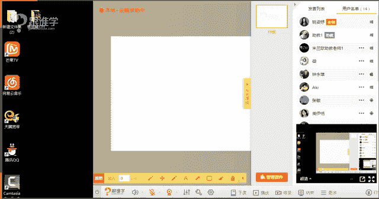

# 1、11服装《搭配秘笈之新版36计》：14鞋子搭配技巧_rec

🎼爱放任。🎼说。🎼好想哦。😊，🎼Yeah。

一五？あ。hello，大家晚上好。嗯，现在目前我还没有看到同学们这个在屏幕上发信息。呃，现在有多少同学在呢？如果在的同学请打一好吗？嗯。OK爱丽同学嗯，还有其他同学吗？看来今天的同学们都去都偷懒了啊。

哦，O可能是因为老师这个网速有点慢，OK冰谷幽兰，然后只爱百合钟永雄同学四位同学是吗？好啊，那不管是呃有可能还有其他同学在线上，但是他们啊不想去打字，那呃这个嗯我们就继续我们这样的一个课程嘛。

因为有的时候在开课的前5分钟的时候，有很多同学可能没有那么准时，但是5分钟之后就来了啊，然后就说老师我前面的课程没有听到。好，没有声音吗？其他同学可以听得到我的声音吧。如果可以听得到的话呢，呃请回复一。

然后老师确认一下。如果是O的话呢，我们就进入到我们今天的课程课程当中。好的，嗯，在刚才开课之前呢呃去看了一下，我们这个跟谁学页面上的这样的一个评论。呃。

有我刚才看到有一位同学的这样的一个呃评论给我的印象还很深刻啊。那呃这位同学说到说嗯我在上课的时候听到老师说了一句话，说呃搭配是靠学习来的，不是靠感觉而来的。因为我们现在穿的都是西式的服装。

他说哇这一句话好像这个敲一下子把我敲醒啊，啊，那其实很多同学对于服装这这个认知呢相对来说都是比较薄弱的那嗯所以说是非常非常有必要去学习的那其实今天我看到现在教。里有很多同学每天都有在坚持听课。

比如说钟永雄同学啊，那包括呃这个刚才那个艾丽同学嗯都非常的积极和认真。那其他同学好像呃这个频率不是特别的高啊。OK好，那既然报了我们这样的1个VIP的这样的课程。呃，希望大家能够每次都能够来到课场。

课堂当中能够跟老师直接的这样进行这样的一个互动。那我看到你们，然后你们可以听呃，也可以在现场去提问。嗯，也可以在现场去提问的话呢，那我们能够更好的啊老师也能够更好的去解决你的问题。嗯，微微同学说。

因为之前听过微微同学是之前有听过呃我们的这样的一个VIP课程，是吗？嗯，形象管家说，我今天来了好的嗯，你好啊，那呃今天呢给大家分享的是关于鞋履的这样的一个穿搭。那在人物形象设计当中。

我们的专业的这样的一个课程当中，我们第一天就会跟大家啊，我们在线下课堂当中，第一天就会跟大家来分享一个叫装束形态论。什么意思呢？我们说人的这样的一个整体形象当中分为了三个板块啊。

一个就是我们所说的服装饰品。第二个呢是指我们的妆容和发型。那第三个呢是指我们的这样的一个气质和举止。那这三个不好意思，同学们，那我们。整一个人的整体形象是由这三个维度啊。

这三个因素组合而成的那我想问大家，你们觉得在这三个因素当中，哪一个是属于刚需的？也就是说它是必须我们去做到的。同学们。嗯，好嗯，有同学说出差了，然后之前呃有有听，然后现在听回放是吗？嗯，好的，啊。

那我现我刚才提出的问题，同学们，你们觉得呃服装饰品啊，是第一个因素，发型妆容是第二个因素啊，那气质和举止是第三个因素，大家觉得哪一个是属于刚需的呢？哪一个是属于刚需？123。好。好的，呃。

我看到大家的答案了。那呃很多同学回答了是第一个。那其实呃有同学说我觉得是第二个是吗？那好，我想问这位同学啊，你可以不穿衣服，然后只带只化妆出门吗？如果不可以的话，啊，如果你能够做到裸奔啊。

那老师也服你哈，那如果是不可以的话，那就说明这个啊不是刚需，那我们说哪个是刚需，就是我们必须要去做的啊，但是我们在我们说我们可以只穿衣服啊，然后不化妆出门，对吗？但是我们不可能只化妆不穿衣服出门裸奔。

对吧？所以啊刚才我们所说的第一个因素是指服装和饰品，那饰品它指的是哪一个板块呢，在我们我们所说的服装是主体，而。饰品是客体。那在我们所有课体当中啊，饰品也有很多。比如说今天老师还带了很多饰品啊。

帽子、耳环、手呃、戒指啊等等。包包啊、鞋子啊，它都是属于客体。那在我们所有课体当中，同学们哪一个是最重要的呢？哪一个饰品是最重要的。现在同学们可以呃跟老师回复一下。包包、鞋子、耳环、戒指、项链、帽子？

你们觉得哪一件饰品是最重要的？是的啊，鞋子，所以呢我们在我们这样的一个入门篇当中为大家分享到的就是鞋履的这样的一个搭配方法和搭配技巧啊，那鞋刚才跟大家讲到，我们说鞋子它是属于客体，它虽然是属于客体。

我们说我们也不可能只穿着客体出去，对吗？不可能只穿着一双鞋，然后不穿衣服出去，但是在所有客体当中，鞋子是最重要的。但是呃我们说鞋子其实在古代的时候，它真的是最重要的吗？啊，其实原始人是不穿鞋的，对吗？

那呃在鞋子的这样的一个发展的这样的一个历程上来讲，它是非常的长时间的啊，包括呢它还有很多的这样的一个说法。啊这就是我们今天要。给大家分享的这样的一个课堂。嗯，那接下来呢。我们就进入我们正式的课堂当中啊。

那我就不自我介绍了啊，基本上同学们都是认识老师了，对吗？好的啊，那接下来我们来看一下鞋履的搭配技巧。那在今天的课堂当中，老师会给大家分享三个板块。第一个就是我们所说的鞋履的历史。第二个呢。

我们穿鞋子其实经常会涉及到的就是鞋子的问题，我们经常会说哎鞋子合不合脚，只有脚知道，对吗？好，那呃这就是我们所说的鞋脚脚型，它其实是有分类的那第三个的话呢是鞋履的款式以及鞋履的搭配。

那首先我们来看鞋履的历史的发展。那刚才跟大家说到鞋子的这样的一个发展。啊，那鞋子其实呃从一开始来讲，呃，在这个古埃及的时候，鞋子它是一种身份的象征。对于现代人来讲的话，其实我们基本上每个人都是有鞋子可。

穿的啊，不管是穷人还是富人。当然呃一些偏远山区的一些孩子们，他们的鞋子可能就会很破，对吗？那足以其实说明了当你的物质越丰富的时候，你能够买得起某一样东西。那你的这个你物质越。

那也就是什么非富忌贵的这样的一个社会地位。在古代来讲呃，其实也是一样的啊，那其实在古埃及的时候呢，只有法老和王室，我们说在古埃及法老是非常高的地位的啊。那只有法老和王室，他们才能够穿鞋子。

其他的平民都是不可以穿鞋子的啊，那包括鞋子它的这样的一些色彩和材质，在某一个历史当中，它也是被限制啊，某平民面是不可以穿着的啊。那呃在这个我们所说的古罗马时期啊，在古希腊时期。

那其实这都是我们所说的服装发展史的最最最最呃最这个开始的地方啊。起源的地方。那所以我们会经常在讲服饰搭配的时候，会给大家讲到，或者包括我在讲一些课程当中会跟大家分享到这样的一个服装的历史啊。

包括这些单品的历史。那是因为这些历史我们不了解的话，那我们怎么能把它穿出灵魂呢啊，那就像在古罗马时期呢，现在我们经常会穿着的一种鞋子的款式，叫罗马榜其实就是来源于那个年代，古罗马时期的罗马榜。

它是一种凉鞋啊，那因为我们说古罗马时期，古罗马的人们是非常的善战的，他们也是非常务实的那这种鞋子的话可以起到保护他们的脚的这样的一个作用。那在古希腊的这样的一个时期呢，有很多人会说。

哎古希腊时期好像人们是不怎么穿着衣服的。因为在那个时候，希腊人他是以什么呢？把人体作为什么？他们认为人体是最美的，不需要穿衣服去遮盖。所以在那个时期有很多的这样的壁画。大家可以看到都是裸露的。

包括现在大家可以欣赏到的一些雕塑。那其实都是来源于那个时期啊，那别说这个都都别说鞋子了，连衣服都不穿的，那哪还穿鞋子呢，但是有另外一种说法是呃古希腊时期的人们，其实他们是穿鞋的啊。

就经常而且不管是在家里不只是在家里穿，也也是在这个在在室外也会穿到鞋子。那呃其实在呃我们说鞋子的这样的一个发展历史的话，跟这样的社会的一个进步的，这样也也会有相关。

那例如说其实呃关于在室内和室外穿鞋的问题。呃，以前这个因为我们所说的路面沥青路啊，因为大家现在所接触到的水泥路啊和沥青路，它的们作用是什么？作用就是为了让我们少去粘到一些什么。

那这种招这种泥泞的这种脏的这个泥水。那其实有一种说法说这个高跟鞋的这样的一开始它是为了什么呢？高跟鞋一开始是为了呃这个给屠夫穿着的屠夫经常会在市场上有一些血水啊等等。

那它会穿着这种比较高的这样的一个木屐。那其实有有很多传语言啊，关于高跟鞋有很多说法说是呃这个木屐一开始穿着的啊，这个屠夫一开始穿着的啊，很很很多的说法。

到后面呢等一下我会跟大家的这样的一个呃详细的去分享的啊，OK好，那就是我们所说的鞋履的这样的大概的这样的一个历史。那在5500年前，大家可以看一下呃鞋子最早的形就我们发现的5500年前的鞋子啊。

就是这样的一个形态，它是用什么呢？动物的皮革制成，然后垫上这种这种这种我们所说的植物的这样的一个。呃紧干就可以去穿着了啊。那大家现在可以想想他，古代人的脚可真糙啊，穿这种鞋都不磨脚它。

要是我们现在穿这样的鞋子走，别说走一天了啊，你穿上一个小时都估计受不了啊。那这是千年之前的学理的这样的一个状态。那我们接下来来看，这就是刚才我跟大家分享到的。

我们所说的古罗马的这样一个罗马党的这样的一个凉鞋嗯。那这张图片当中呢是路易十4啊，在16到17世纪之间，洛可可时期在我们的所说的服装的这样的一个风格上，有个叫洛可可风格。

那在这样的一个时期呢呃路易十四皇帝。那他觉得自己的身高啊，应该不能说是国王啊，路易十四国王，他的身高只有1。55米。所以他经常会梳着高耸的发髻，然后穿上他的宝鞋，这双鞋子对于他来说是非常非常重要的啊。

那这种高跟鞋，5公分的高跟鞋来提高他自己的这样的一个身姿。那包括呃大家可以看到图片当中呢，这个鞋跟是红色的。刚才我有跟大家分享到，我说有一些色彩甚至都拿来被禁用。那是因为这种红色的鞋子，在路易十四国王。

当时的那个时期，他把他的鞋跟涂成了什么这种红色的色彩。那这种色彩。从而在什么呢？在这样的一个时期被贵族使用啊，平民也是不能够使用的那这是我们所说的古代的这样的一个鞋履的这样的一个发展啊。

那呃从另外的这样的一个角度上来讲，刚才跟大家讲到，我说呃这个鞋子我们经常会跟脚来做这样的一个合作，对吗？那所以说我们要了解我们脚的这样的一个形状，那同学们你们了解自己的脚型吗？

有没有人哎知道自己是属于哪种脚的，比如说其实脚型当中有叫埃及脚的有同学听听过这样的一个呃这个系统吗？或者是有这样的一个知识知知识点吗？那我们来看一下啊，脚型的分类。那埃及脚呢其实是大部分人啊。

它的脚都是这样的，那大家可以看到从图片上它的什么呢？大脚趾是最高最长的那其他的脚。只呢依次的这样的一个排列啊变短。那这是我们所说的叫埃及脚，大部分人70%的数据都是属于这种角。但是老师就不属于这种角。

那我我在穿鞋子的时候，其实我不知道咱们现在教室里有多少同学会因为脚型的问题，呃，有这样穿鞋子的困惑。呃，想了解一下咱们教室里有没有这一类的同学，同学们你们有没有呢？如果有的话呢，请打一。

或者你们可以在屏幕上直接去几个打，你们的这样的一个困惑点是什么啊？形象管家说有是吗？其他同学呢有没有呢？脚太肥OK啊，那脚很脚面比较宽，我看大部哦有很多同学是脚面较宽是吗？那如果你是脚面宽的话呢。

那你等一下，有可能就是属于我们刚才我们在接下来要跟大家分享的另外一种脚型当中的那种脚了啊，有可能是啊那这种脚型呢，我们刚才说到埃及脚。那它就是属于什么呢？大多数人都是这样的。

所以其实他穿鞋子相对来说是比较容易穿着的那从各种脚各种鞋型，我们说鞋子也有很多形状。那我们脚也会有形状。那我们想要穿的舒适的时候，就一定要根据我们自己的脚来挑鞋子，对吗？我们经常在网上网购的时候。

其实在一开始淘宝呃，还没有这样的一个经呃可以退换货的这样的一个支持的时候，嗯，很多人其实不会在网上去买鞋子。比如说我啊我其实网购的那个那个网龄还是很长很长时间啊，在淘宝一开始这个网购一开始兴起的时候啊。

老师就已经做了这个先锋，就是所有的东西基本上都会呃就是生活当中有需求的东西都会在网络上去购买。那但是有一样东西我不会在网络上购买，就是鞋子。因为我的脚型它是比较也是比较特别的啊，也是比较奇葩的。

所以呢在网上买鞋子，每次买的鞋子都是不合脚的那那个时候物流啊又没有那么方便，所以呢就经常不会在这样的一个线上去买，就会经常在线下去购买鞋子。那说明其实购买鞋子对于我们来说是比较难的事情啊。

包括其实我相信现在还是有很多人愿意去试鞋啊，不愿意在网上去买鞋嗯。公司鞋下的品牌率好高是吗？啊，那这其实鞋子的退换率是非常高的啊。O好，那埃及脚它是属于大多数人都这个这样呃都是属于这种脚。

那它其实相对来说比较容易穿鞋。但是从我们所说的叫舒适度上来讲呢，那鞋子其实有分很多的鞋头。那鞋型啊我们说脚型跟鞋型的这样的一个结合的时候，要考虑到很多的问题，就是鞋头的这样的一个问题。

那例如说我们刚才所说的最舒适的这种鞋型的话呢，其实相对来说圆头的或者是空间比较大的那种鞋型，它是会最舒适的那比如说现在很流行这种尖头的高跟鞋。那这种鞋子其实它并没有那么舒适。它会有一点点这种挤脚啊。

那包包括刚才我相信形象管家这位同学说到，我有这样的一个困惑。那我相信你的困惑，有可能是因为你的脚太胖。但是现在又特别流行那种尖头高跟鞋，穿着的时候就会特别痛苦，是吗？好啊。

喜欢有同阿K同学说喜欢圆头鞋是吗？那圆头鞋我们说每一种鞋的鞋头或者是每一种鞋子，他其实也会有风格。那我们说不光鞋子他不只是要结合我们自己的脚型去选择，他更多的需要结，如果有很多人啊，他是能够特别是女生。

他们忍耐痛苦的能力是非常高的哈，他们会为了美牺牲很多啊，例如说有一双鞋子非常非常漂亮的。但是呢他真的穿起来有点不合脚啊。那很多很多人会选择买的，为什么呢？

他觉得我我看着我都觉得很呃心里就觉得嗯他是属于我的了。嗯，我心里就满足了他有可能是不穿的啊。那这是我们所说圆头鞋他其实是比较舒适感的那包括呢呃这种空间感，鞋头空间感比较大的也。😊，是比较舒适感的。嗯。

那接下来我们来看第二种角型。呃，拇指最长，为什么圆头鞋最舒服啊？因为它其实是这种依次排列下来的嘛？啊那因为圆为什么说圆头鞋最舒服？圆头鞋，因为它的空间感是比较大的。

我刚才呃这个于妹梅同学刚才老师分享的这个点说到的是什么呢？埃及脚是大多数人都有的脚型，那这种脚其实它穿鞋子相对来说是比较容易的。但是如果站在我们所说的舒适度上来讲的话，圆头鞋会比较舒适一些。

那包括空间感比较大的，它也会舒适一些。比如说那种方头的鞋子前面的空间感也会很大啊，所以它也会是比较舒适的。那从这个角度上去呃跟大家解析的。于妹妹同学能理解了吗？嗯，好，那我们接下来看希腊脚啊。

那希腊脚呢它很呃很明显，就是什么呢？第二根脚趾最长，我记得好像。这个有有这个民间有一句俗话啊，老师一下想不起来了，就就好像就说到二脚趾比大脚趾长，然后呃怎么怎么样啊，这个这个老师不太记得了啊。

其实我我我对于这句话印象还蛮深刻的，但是一下子想不起来了。但是站在我们所说的这样的一个这个呃脚的这样的一个形状上来讲，他穿鞋子其实是比较麻烦的，为什么呢？因为老师是比较有经验的。

老师的脚呢就是属于叫吸腊脚啊，为什么穿鞋子会比较痛苦，因为你买很多鞋子啊，就是尺码，如果它是比较它是比较合适的，但是还是会觉得有点窝脚的感觉，我不知道大家能不能理解这种窝脚的感觉是什么。

思雨同学说二脚趾长护仰护娘，好吧，好像大概是那个意思啊不疼娘，好吧，我还是很疼娘的啊。好嗯那个。あ？嗯，有同学有这样的同感是吗？嗯，冰谷幽兰也是这样的脚型吗？嗯，哇，有这么多同学都是都是希腊脚呢。嗯。

好吧，那我们都是一同一种命那真的这种这种脚型的话，她其实买鞋子不是特别好买。那在我呃很小的时候其实我就已经开始穿高跟鞋了。呃，大概呃18岁左右啊，就已经开始穿高跟鞋了。

那个时候呢穿哎在好像老师说哎呦很小的时候18岁，其实现在好像已经不是是在那个时候18岁穿高跟鞋已经是属于比较早了啊，因为老师现在毕竟都已经28岁了啊，1年前那在现在来讲的话，其实穿高跟鞋呃。

已经不满18岁就开始穿了。比如说18岁了，可能131415岁啊，这现在的小姑娘都特别爱美啊，那可能已经很早就开始穿高跟鞋了。那因为穿高跟鞋过早，然后呢自己。对于自己的脚型又不了解。

所以买的一些鞋子都是不合适自己的脚型的，造成现在脚上有很多那种叫那种嗯磨的一个小疙瘩，一个小疙瘩的。我不知道有没有同学能够理解老师说的这样的一个情况啊，就是脚上会有这种磨起来很硬的。

类似于茧的这样的一个感觉啊，那是因为当时买鞋子，不知道买哪种鞋型会比较好，所以就就买到这种鞋子就不合脚。那其实。啊，有刚才我跟大家分享到，我说圆头鞋，如果你的脚型不是属于这种的话。

那你穿圆头鞋的话是比较舒适的。但是如果你的脚型是属于这种的话，其实穿圆头鞋并不舒适啊。那因为老师以前这个就是这个买过很多圆头鞋啊，那个时候就觉得唉好像圆头鞋挺可爱的啊，挺好看的。

但是发现真的是不适合的那现在呢我经常买的鞋子都是属于尖头鞋，因为尖头鞋它前面的空间会更长一些。所以呢如果你的二脚趾比较长的话呢，第二个拇指脚趾比较长的时候，它是可以有一些空间，所以你的舒适感会强一些。

那包括其实现在我基本上所有的高跟鞋啊，或者是说平跟鞋都会买这种呃尖头的这样的一个鞋型，嗯，会舒适很多。OK好。哇，艾丽同学说，我左脚希腊脚，右脚埃及脚，你这脚长得真奇葩啊。

我真的很很少看到或者有听到的同学是这样说啊。老师讲课讲了这么久，第一次听到啊，那你这个脚真的是很奇葩了啊。好，那那那那你这个买鞋子该咋买呢？一只脚买圆头，一只脚买尖头嘛？有这么多同学都是这样的啊。

宇和同学也是啊对，请上图。嗯，好，那这是我们所说的希腊脚啊，那希腊脚他更加其实比较适合比较适合穿这种尖头的鞋子会舒适度高一些。那男同学也是一样的道理啊，男同学也是一样的。混搭真的是混搭脚。

这只混你们都学学服装，学服装他被学疯了吧啊，啊，不过非常好啊，同学们这就是进入到这个专业境界了啊，混搭好啊。那第三种这是刚才我们讲到的第二种脚型。那第三种脚型叫罗马脚啊，罗马脚呢是大家可以看到啊。

前面四个脚趾长成一排。然后呢，脚从上到下的宽度几乎一致，属于罗马脚。刚才是不是呃形象管家同学，那包括我刚才还看到哪一位同学说自己是属于脚很胖的那种类型。那如果你是脚很胖的类型。

那那你可以现在看一下这个图片当中的脚型是不是很像你自己的自己的小脚丫子呢？小脚丫子老师怎么拿手出来比了啊。好，那这就是这个罗马脚。那罗马脚呢，它这个因为这种我们所说的它的脚的宽度是比较宽的。

所以在穿鞋的时候呢，很多鞋都会比较挤脚，比如说买那个比如说那种尖头高跟鞋，我经常会看到不是这样的，是吗？哦，那其实嗯哦那你的我理解了。三中都不是，那你的脚趾是依次下来的吗？因为老师发现。

其实我在线下的时候，我们经常也会看呃看脚型的这样的一个问题。我会发现，其实很多脚趾呃脚丫子比较胖胖的同学都是属于罗马脚，那当然也有这种情况，就是他的脚趾是依次排下来的但是他的脚也很胖。

那如果这种脚它是比较胖的人呢啊，在买鞋子的时候，我建议啊，那你要么就是买那种什么呢鞋帮，呃，这个比较高的，能够包裹住你的脚面的，要么你就干脆不要买那种带鞋帮的那种鞋子。

因为如果例如说很多同学他会穿那种高跟鞋，穿高跟鞋，因为脚不胖，就会把那个鞋帮撑的很变形。因为呃鞋子的设计，有的鞋子它是什么高跟鞋当中有一种是镂空的设计。有一种是直接连着就是所有的鞋面都是连在一起的啊。

那如果是这种脚型嘛，或者脚比较胖的同学，你们。要么就买比较深的鞋帮，要么呢就是买干脆没有的，这样的话会对于你的脚的修饰会比较好看一些。O那如果是呃这种罗马脚的话呢，其实买鞋子经常都会建议这种店家呀。

都会建议买大一码啊，那另外的话如果你是这种脚型的话，方头鞋，比如说现在这种今年特别流行方头鞋。那或者是这种圆头鞋，它会比较舒适感一些啊。那这是我们所说的罗马鞋，那包括男同学也是一样的道理啊。

老师找的这个老师现在给大家放的这个图片呢都是男生和女生啊，男生的鞋子，女生的鞋子O那这是我们所说的罗马鞋。呃罗马脚啊，sorry啊，这个老师这个脑子有点晕不了啊，这个这种脚型。第三种啊。

那我们继续来看叫日耳曼脚。那这种脚型呢，它是第一个叫什么呢？埃及脚的极端版。那刚。我们说到埃及脚它是依次排开的啊，第一个拇指是比较长的，而日耳曼角型呢，它是这种什么呢？特点就是第一个脚趾比较长。

其他的脚趾呢都比较的短，就是相差不大。当然有同学可能不是这种我们所说的这么齐，但是它这种相差不大的啊。那如果呢呃你们是这种脚型的话呢，你们选择鞋子的话，就要选择这种空间感比较大的。

例如说什么空间哪空间感比较大，就是把你解放的这种凉鞋啊，那包括刚才我说到的呃这种圆头和方头，他们的空间感都是比较大的那另外呢在选择的材料上来讲，就是我们所说的材质上来讲，可以选择这种麂皮的款式。

或者是羊皮款啊，那我是深有感触的啊。同学们，因为我的这个刚才还是跟大家分享的这样的一个问题，就是脚的那个脚趾比较长。那经常我会穿鞋就是要求鞋子的舒适舒舒适度是比较高的那所以经常会遇到一些问题。

比如说我买那种漆皮的鞋子，或者是呃猪皮的鞋子，这种鞋型，我穿着的时候呢，呃或者说我们所说这。因为啊这个大多数女生穿着这种鞋子的时候，它的舒适度都没有那么高。那哪一种鞋子呢？第一种是我们所说的羊皮。

它比较柔软。那我建议啊女同学以后买高跟鞋的时候，尽量买那种鞋里面的皮都是羊皮的质感。那种鞋子会非常舒服。而如果里皮是那种猪皮的话呢，就很不舒服啊，就很硬，你踩上去的那个脚感就很不舒适。

那这是我们所说的材质上来讲啊，那包括呢那种漆皮，它也会比较硬。那这种麂皮和羊皮它是比较柔软的，它的延展性会比较好。羊皮它是比较这种羊呃这种比较柔软。而麂皮或者是那种磨砂的，它都会相对来说舒适感会高很多。

那呃这种就是我们所说的麂皮啊，那这种也是那这种呢就是我们所说的羊皮，羊皮它的光泽感会没有那么亮。那在我们经常看到的市面上有很多的鞋子是那种其实简单来说叫PU皮或者它的光泽感很强。

就是这种漆皮的这种鞋子的舒适度相对来说没有那么好。O这是这几种脚型的这样的一个呃这个分类，呃，以上四种就基本上能够涵盖了大多数的这样脚型。那同学们你们是哪种脚型呢？啊我们现在再来做一个这个呃。调研啊。

那你们是属于一还是二还是三还是4？嗯，好，我看一下哪种小型比较多啊，一。看到目前有两个同学是埃及角啊，21。OK好，还有吗？同学们如果知道自己的脚型的话呢，好。

雨和同学和这个呃刚才哪位同学真的都很奇葩啊，右脚是一和2啊，右脚一，然后左脚2嗯，3好，那我看到现在大多数同学还是一比较多，是吗？同学们，那其实因为在我们现在屏幕上看到的啊，我老师看到的一是比较多的啊。

那第三个好像目前为止也是比较多的啊。好，嗯，那这是我们所说的脚型的分类那大家现在都了解自己的脚型啦啊，那我们现在来看呃鞋子的这样的一个搭配的方法啊，那今天呢给大家介绍的这样的一个鞋子的搭配呢。

更多的是这样的一个款式的展现。那因为呃其实我发现有很多同学就特别是男士的这样的鞋子啊，女士的鞋子，我们基本上女生的话基本上都认得出来啊，那女生在了解男生的鞋子的时候，基本上都是这种叫鞋盲。

或者我相信很多男。同学都不了解男生的鞋子啊，那我们来看一下。鞋履的款式。那在这样的一个呃这一节当中呢，会给大家介绍到鞋履的款式啊，那男生的维度和女生的维度是不一样的。我们来看一下。

首先呢从女生的这样的一个角度来看，那我们因为女生的鞋子实在是太多了。那老师呢以三个维度来给大家分析，第一个是鞋头，第二个是鞋跟，第三个是鞋帮。那鞋头当中呢有方头鞋，方圆头鞋圆头鞋，尖头鞋啊。

尖圆头鞋和和尖头鞋。那从左到右啊，那鞋头基本上就已经包含了。那呃男生其实也是一样的啊，男生的话呢有方头鞋，方圆头鞋，圆头鞋和尖圆头鞋，包括尖头鞋也有。但是男生的尖头鞋是比较少。好的款式啊。

可是我见过很多什么呢？啊，当然老师在这里不是攻击某一个职业，我见过很多的理发师，他们会特别喜欢穿尖头的皮鞋。我不知道咱们这个教室里有没有这个同感啊，有没有同学是有这样的同感的。我见过很多理发店的理发师。

他们会喜欢穿这种尖头的鞋子啊，因为这种尖头的鞋子在男士当中，它是属于比较个性，比较时尚的啊。所以那包括我今天呃在这个浏览某一个网页的时候呢，发这个上面有有有有一款鞋子是这样标的说理发师呃爆款。

这双鞋子就是什么呢？那双鞋子的特点就是头特别尖啊。然后呢，还带有这种拼接感的，就是前面是漆皮的，后面是另外一种材质，这样拼接的，就是很明显一看就是非常的什么呢？个性的和时尚感的啊。

同时也是骚气感的我们的星辰同学说非常好啊，就是骚气感十足。为什么呢？在尖头我们说到这种哎我想问大家，从左到右这几种鞋头当中，你们觉得哪种鞋头是最最最最最女人味的啊，同学们。说到这儿，好像大家都有同感啊。

属洗剪吹专属啊，骚气感十足。嗯，好，那有同学好有同有很多同学啊回答了尖头鞋。是的，那在男人心中啊，呃，我不知道咱们这个现场现在啊那男同学也出来了啊，那包括一切随风和周永雄同学。

我想问一下你们在尖头高跟鞋当中，你们觉得哪种哎，哎，我的这个问题就比较麻烦啊，算了，还是不问你了了，我就直接公布答案了啊。那据调查很多的什么呢？这种女性啊，贝蕾同学第二个脚趾头比较长呢？

比较适合穿尖头高跟鞋啊，就是我们现在所说的这样的一种鞋型。那据调查呃男人会认为尖头细高跟鞋啊，而且是没有防水台的，它一定是薄底的那种鞋子。是最最最最性感的啊。那如果它还是红色的话，嗯，那就非常不得了了。

还是非常非常具有这种吸引力的和诱惑力的啊。那包括其实在某一个时段，我们在说历史发展当中啊，某一个时段当中呢呃。他们认为穿这种什么呢？红呃，穿这种这种这个这个鞋子啊，他们会认为穿鞋子都是什么呢？

都是一种性诱惑力。所以说啊如果要是穿了这种尖头高跟鞋啊，那就更加的性感了啊。好，累死宝宝了。因为这种这个尖头高跟鞋它是比较累的啊，这种鞋型虽然美啊，但是非常累，所以说呢我们女生真的是非常辛苦啊，ok好。

那这种我们所说的从鞋头上来讲啊，有分这么多的鞋头，那其实每种鞋头它给人的感觉也是不同的。例如说方头鞋，我想问大家，你们觉得方头鞋，它穿起来的感觉是什么样的呢？是这种中性帅气的还是这种女人味了。

是一还是二呢？那其实老师为什么这样去排列？有原因的啊，你会发现这种方头高跟鞋，它基本上好，周永雄同学回答错误啊，那方头鞋它其实给人感觉是比较硬朗的，比较这种中性感的。你会发现方头鞋基本上都会配呃。

那刚才说到这个跟的问题了啊，为什么说细跟它比较有女人味。而方跟它给人感觉会更加的这种中性感和帅气感。所以你会发现方头的高跟鞋基本上它不会配细高跟，它会配这种方跟。那你我我到目前为止。

老师还没有见过这种方头的这种鞋子啊，但有见过，我想起来了，就是今年的某一个呃品牌做了这样一款就是方头的配这样的一个细高跟。那这种搭配方法其实是非常呃我可以说是相对来说是比较少的，基本上那。

如果要是同学们呃对于这个知识点有疑惑，就是这个这个这个可信度比较低的话，那同学们可以去观察一下啊，基本上方头的高跟，方头的鞋头都是配这种方头的鞋跟。那这种鞋跟呢穿着的方呃这个风格导向。

它会更加偏中性帅气和利落感嗯。而这种圆头呢，它给人感觉会更加可爱的感觉。那尖头它给人感觉就是这种我所说的女人味十足。那这种处于中间状态的就是尖圆头它其实是比较优雅感的啊。

这种方圆头它其实还是有点愣愣的感觉。那但是它同时是有一种方圆的这种感觉，它是有点复古感。那在后面我给大家去介绍一款鞋子叫玛丽珍鞋。那这款那个那个玛丽珍鞋呢，其实它就具有那种复古感的鞋子的感觉。OK好。

那这是我们所说从鞋头上来分辨。那从鞋跟上来讲呢，我们有分为平跟鞋坡跟鞋半高跟鞋和高跟鞋。那其实鞋子的风格和品类非常多。那呃另外的话，它其实还有分就因为老师并没有用一种某一种风格来给大家去划分啊。

那比如说鞋子是不是还有这种休闲鞋啊，有时装鞋，然后有功能性的。鞋子其实马呃这种这个这个我们所说的叫呃马丁靴，一开始它就是属于脚这种马丁靴。昨天老师在呃上单品课的时候，我不知道有多少同学在啊。

老师搭配了一双马丁靴，就是那种绑带的啊，然后那双马丁靴呢，它其实一开始是为了给什么呢？矫正脚的这样的就是脚受伤了啊，它用来矫正脚的这样的一种鞋，它是属于医疗和功能性的，并不是为人们所穿着的嗯。

那这种我们所说它以前是属于功能性的那现在的话它是属于时装化了啊，所以因为鞋子的品类太多。那老师以这样的一个方式给大家来划分。那为什么要跟大家讲这一点呢？那因为鞋子的品类很多。

那鞋子每一个品类的鞋子和风格，它其实都会有特点的啊，那例如说这双鞋子，它其实它给人感是什么样的感觉呢？同学们这这种坡跟鞋，我找的是一双比较特别的啊，那有很。多这种这种所说的坡跟鞋。

它是有点这种偏田园感的，就是底下的这样的一个坡跟，它会用那种编织做成的那种鞋的话，坡跟呢它给人感觉就是田园复古感。那这双鞋子它其实依然也有这种所说的田园感，但是它多了一些这种华丽感啊和甜美感。

那因为什么呢？因为这双鞋子它用的花朵啊，是这种小小的小碎花那小碎花和大花来比的话，小碎花它更加的清新感，而大的这种所说牡丹啊、玫瑰啊。

都是这种比较大气的和女性化元素非常重的那图案和花型它都是有这种风格化的啊。那这双鞋子它我们所说的这种呃这种华丽感来自于哪里，来自于它的这样的一个材质的做工。那所以这种的话。

这种鞋子它一定不能搭太过于休闲的款式，它一定是搭时双的这样的一个呃这种款式的服装。所以。每双鞋子都会有分格啊。O好，那这是我们所说的鞋跟。那大家都认识鞋跟，老师就不在这里跟大家多去讲到了啊。

那其实鞋跟上呢有一个问题啊，鞋跟的话，它会因为呃某一个点会影响到我们穿鞋子的高度。那就是我们所说的黄金比例。那黄金比例，现在大家可以这个记一下啊，你们自己回去测量一下自己的黄金比例是多少。

不管是男同学还是女同学，那黄金比例是指什么呢？头顶到肚脐肚脐到脚底啊，那大家可以去测量一下你的什么呢？从肚脐到脚底的这样的一个呃这个厘米数，用你的什么呢？

用你的身高减去你的下半身就是上半身和下半身这样的一个划分。不好意思，同学们，那用你的身高减去你的下半身。然后呢，上半身你就得出来上半身的这样的一个数据了啊，那我这样讲，大家能听得懂吗？我们。

首先要了解自己上半身的呃这个呃这个这个厘敏，然后再了解呃下半身的数据，上半身和下半身的数据之后，用上半身除以下半身。得出来的数据就是你的什么呢？这样的一个这样的一个呃这个这个黄金比例。

那你的这样的一个黄金比例就决定了你穿什么呢？高跟鞋的这样的一个高度。那比如说啊这个有同学说我的黄金比例是1。378。那其实我们在这个我们这个这个亚洲人的这样的一个黄金比例就是1。3到1。5。

那标准的黄金比例是1。618。那你越接近于1。618，那就代表你的比例越好，那你的比例越好，你穿的高跟鞋的高度就没有那么高啊，能理解吗？同学们，那这是我们所说的女士啊，它会这个涉及到高跟鞋的问题。

那男士其实也是有一样的这样的一个道呃问题的啊，男士他也会有比例不好的问题。那如果你比例不好，那男生说我不能穿高跟鞋怎么办啊？我不能像录音十4国王一样，穿上高跟鞋怎么办呢？那你可以穿那增么高。

那还是高跟鞋。那给给大家开个玩笑啊，那男生可以穿什么呢？上身的着装服装要短小一点啊，这样的话呢会让你的比例看起来会好一些。上身的服装不要太长。O这是我们所说的鞋跟的长呃高度它会涉及到的问题。

那另外呢就是我们所说的鞋帮。那鞋帮呢它会有低帮啊，高帮，包括中筒和高筒的这样的一个鞋型。那呃我们所说的在这样的一个鞋帮的设计上来讲的话呢，那其实鞋帮的高度，它会影响到我们所说的腿的这样的一个线条的比例。

那例如说在高跟鞋当中有一种这种鞋这种鞋包是不是特别特别的低。那这种浅口鞋，它会更最大限度的展现你的腿部线条。所以呢它会特别特别的显高。而这种高帮和中筒靴，它是最。为什么呢？最让你的腿显短的啊。

这种鞋子的话呢，一定要腿型比较长的。然后呢比较腿型也比较好看的人去穿着。当然如果你要是穿着这种我们所说的这种呃，我是举个例子啊，同学们，比如说这种这款鞋子，你的腿型要好看啊，这个也是属于高帮的啊。

同学们高帮，那如果你的腿型不完美，你想一下你的小腿肌肉很发达，你的小你的腿又很粗啊，那你又穿了一双这样的鞋子，比如说你还露着腿，那如果你穿什么呢？白色的呃这个牛仔裤，白色的长牛仔裤。

你再配上这一条呃还穿配上这双鞋子，那么它对于你的腿部线条不会有分割感，所以不会有太大的影响。但是如果你穿的是一条什么呢？黑色的短裤，然后把腿露出来了，然后又穿了一双白色的这样的一双呃这个高帮鞋。

那么你的腿部线条就不能更大的去延长，所以就会显得腿短。那这是我们所说的鞋帮对于腿的这样的一个影响。那包括中筒靴，我就没有见过几个人能把中筒靴穿的非常非常好看的啊。因为大多数人他的腿型不是特别完美。

而中筒靴，他这样的一个位位置，刚刚好是在我们的小腿的这样的一个最粗的位置。有很多同学如果你是小腿特别粗的那这种鞋子你就这个这个少去穿了啊。那如果你穿着的话呢。

几我建议啊就是你你这种就是穿着这种裤装去把它做延伸，就尽量不要穿着短裤再去穿这种中筒靴，他会给你的腿部无限的分割。嗯。好，那高筒靴为什么老师刚才没有讲到呢？其实高筒靴的话。

它会呃因为它已经特这个这个线条的这样的一个桶是特别高的那它其实如果搭配的好，然后包括现在今年特别流行的这种过膝靴，它并不会啊很很那个很这个对你的腿部线条呃，不会有太大的这样的一个影响。

如果你搭配的好的话啊，OK好，那这是我们所说的呃这个鞋子的这样的一个呃这几个维度，一个是鞋头，一个是鞋跟，一个是鞋帮啊，OK。好，嗯，那马丁靴也是中筒就要少穿了。呃，如果我建议我刚才说到的问题啊。

同学们呃，马这个如果你的腿型好看啊，那你就是不用考虑这些问题。如果你的腿型不是特别好看。比如说老师啊我经常会穿我有昨天我穿的那双马丁靴，它其实就是有点这个偏中筒的。那么我穿那双鞋子的时候。

我很明显的就能感觉到我的腿特别短，而且会显得我小腿很粗，啊以我穿那双鞋子的时候，基本上都是配呃相对来说长一些的裙子啊，就是在中间只会留一小截。那我基本上不会穿那种特别短的裙子。

就在我的身体上在我的腿部又形成这种切割感的这样的一个长度的裙装啊，我建议少去这样穿，要么你就把你的这个腿部线条啊，这个这个劲多的去展示。比如说我昨天穿的那条短裤，同学们看到了吗？那条短裤的话呢。啊。

忘记了哈，那有很多同学可能没有看到。那我那条短裤它是相对来说特别短的。然后呢，它有有这个我们所说的大面积的把我的腿部线条露出来了啊。那所以他他的这样的一个切割感还比较少。如果你的这样的一个腿部又粗。

然后你的这个裙这个裤装刚刚好又到膝盖，然后你的小腿又被分割了，所以看起来就会比较这个短腿O好，这是马丁靴的这样的一个问题。那裸靴的话呢，裸色的靴子当然会好。因为它接近于腿部的颜色。嗯，O好。

那大家的问题我就暂时回到这里了啊。那因为我们后面的课还有很多同学们啊，我们继续好，那么继续来看啊，那刚才给大家分析的维度是从女士的这样的几个维度去分析的那男士的鞋子，我想问咱们同学们啊。

你们这个呃有多少同学对于这个鞋型是了解的呢？比如说现在老师现在在这个图片当中呈现的这些。鞋子德比鞋、乐福鞋、牛星鞋、切尔西靴啊，一间鞋、孟克鞋、布洛克鞋、沙漠靴、船西船鞋。好，我现在想问一个问题啊。

给大家做个调调研啊。那有多少同学是知道这个每一款鞋子的。如果都知道的话，请打一啊，如果是知道极个别的，请打2如果大多数都不知道的，请打3。好，形象管家说，男鞋一点都不了解。嗯，好。

我看到大家都是什么呢嗯。有同学都知道是吗？嗯。好，原来还有名字。好吧啊，那是的，因为我们嗯我我发现了，其实我们对于因为呃女性的话呢，只关注于女性的啊一些美的东西哈。

所以对男男士的东西可能了解的不是特别多。那包括我们的男性同学其实对于鞋子也不是特别了解。那接下来呢我为大家来这个分这个呃在接下来的这个课程当中会为大家去分析几款鞋子啊，因为时间有限。

不能够把每一双鞋子都给大家来分析了啊。那呃德比鞋、乐福鞋、牛津鞋。那我想问一下大家，同学们问一个问题，你们觉得在这所有的鞋子当中哪一双鞋子是最正式的，123456789，哪一双鞋子是最正式的。你们觉得。

好，我看到有同学说。第一双鞋。为什么你们给我这个答案呢？是因为它是你们觉得他看起来是比较正式的，是吗？嗯。好，贝蕾同学说牛津大多数同学都是回答的一啊，德比鞋OK好啊，那我想告诉同学们啊，恭喜你们。

只有一位同学回答对了。就是贝类同学，那贝蕾同学回答的这个答案是牛津鞋，牛津鞋是最正式的。那大家可能会觉得这双鞋子更正式的原因是因为这双鞋子的感觉特别的简洁。另外呢这双呃牛津鞋的这个颜色是棕色的。

所以大家会觉得哎棕色本身其实棕色和黑色来比的话，棕色休闲感会更强一点。但是我们所说的鞋型当中，牛津鞋它是最正式的。德比鞋其次啊，德比鞋其次，那其他的鞋型相对来说啊都会比较休闲。那如果啊再挑一双的话。

那就是梦克鞋，牛津德比梦克。啊，那布洛克鞋呢，那等一下我会给大家来分析布洛克鞋，其实它不是不能说它是一种鞋型，它一种它是一种雕花的工艺嗯。嗯，梦客鞋很能少见，有可能见过，但是大家不知道啊。O好，嗯。

那这是男士跟女士的鞋子的这样的一个款式的分类。那接下来呢给大家介绍的是什么呢？鞋履的搭配。嗯，好，我们来看一下第一双呢给大家建这个这个分享的鞋子叫芭蕾舞鞋。那我相信这双鞋基本上嗯都知道吧。

不管是男生还是女生，我们都知道这双鞋子，那这双鞋子呃，我又要讲到这个这双鞋子的这样一个历史了啊，我们都知道这双鞋，那它是为什么那么红呢？啊，为什么那么火呢？或者为什么那么红好应景啊。

那如果要是推荐鞋子的这样的一个芭蕾舞鞋的单品的话呢，我会推荐两个品牌的一个就是什么呢？这一双这个品牌叫repeer啊，那第二个品牌呢就是香奈儿的这样的一个呃双拼鞋。

那这两双鞋子呢呃在这样的一个这个我们所说的芭。

如果是芭蕾舞鞋，那当然还是这个品牌是最好的啊，为什么呢？因为repeer呢其实它就是什么呢？这个呃创始人的名字，创始人呢她是一位女性，她为她自己的儿子缝制什么呢？一双芭蕾舞鞋。那当在左边的图片当中。

大家现在看到的这位女性叫Big啊，那这位女性呢，她是在呃我们所说的在这个嗯当时呢她是她邀请啊，这个她这个邀请呃，这个创始人为她做一双红色的这双芭蕾舞鞋，用于拍摄电影。那这部电影叫上帝创造女人。

大家可以去看一下啊，上帝创造女人。那这位女性呢，她这个呃Big呢她也是在这个电影当中啊，开始这个绽放她的光彩。那从而在那个年代啊，成为最当红的这样的一个明星的代表啊，那因为她当时穿着这双。

鞋子跳了一段舞蹈啊，那在这样这双鞋子就火啦所以呢芭蕾舞鞋呢从此就这个红起来了啊，就是我们所说的在这样的一个成为人们所什么呢？喜爱的鞋子。那包括在一年后啊在当时好一年后呢啊当时他这部戏推出之后。

在一年后呃奥黛丽赫本啊也去穿着了这双鞋子。那所以从那之后呢，这个芭蕾舞鞋也被称为叫法国的灰姑娘的鞋型啊，我们经常会听到灰姑娘鞋是一双水晶鞋，但是这双鞋被称为叫法国灰姑娘啊。

因为这双鞋子是因为be给她在这样的一部电影当中穿着啊，然后使他也红起来了。那这是我们所说的芭蕾舞鞋的这样的一个发展的历史。而且最经典的就是这双红色的鞋子。嗯，好。

那其实我们刚才我们一直讲到的鞋子的这样的一个呃发展啊那。鞋子其实一开始的话呢，它并不是以这种我所说的这种呃这种时装的这样的一个功能。这这种这种方式啊出现在人们的大众呃眼前的。

其实都是我们所说的这样的功能性的啊，那直到现在人们对于美的需求啊越来越强烈。那鞋子的款式也越来越多。嗯，好，那这是芭蕾舞鞋的这样的一个单品。那呃接下来呢给大家分享的是芭蕾舞鞋的这样的一个搭配。

那其实在很多呃女生心中呢都想要拥有一双这种小圆头的鞋子。但是我想说的是这双鞋子并不是所有的人穿着都好看的为什么呢？因为这双鞋子它给人的感觉？我想问大家的是。

你们觉得这双鞋子给人感觉是甜美可爱感还是女性的呃妩媚感的是一还是二呢？嗯。好，那所以呢啊这双鞋子它特它的特点是在于它的源头，对吗？

它所以说它给人感觉是更加的这种甜美感和可爱感的那从而从另外一个角度上来分析，如果你是一个长相特别甜美和可爱的女生的话，那么你是不是就可以经常选择一些圆头的鞋子呢？但是如果你的个人气质是特别的什么呢？

女性的啊，或者说很妩媚的感觉，那么你穿这种这种我们所说的圆头的鞋子，看起来就没有尖头的鞋子要好啊。那所以说呃形象管家说我穿就好丑啊。那但是这双鞋子。

如果啊你你的这个我们所说的长相是非常这种比较属于这种这种俏皮的，然后可爱的感觉。那穿上这双鞋子的话，它给人感觉一定是非常哎从又有可爱感又有俏皮感，同时它其实是有一定的优雅感的啊。

那这双鞋子它给人表达的这样的一个核心的风格是这种感觉。那在平时搭配当中呢，它可以搭配连衣裙去穿着，而且是这种什么呢？有点A字摆的这样的连衣裙。因为A字版给人感觉也是比较可爱年轻和活泼的这样的一种感受啊。

好，那包括这种A字摆裙，它虽然是拉长了，但是这种A字摆裙给我们感觉，依然是优雅的，而不是那种女性的呃就那种那种很妖娆和妩媚的感觉，所以它也可以搭配这种芭蕾平底鞋去穿着。那这是我们所说的呃搭配平底呃。

这个芭蕾舞鞋搭配连衣裙的这样的一个搭配方法。那接下来我们来看一下呃芭蕾舞鞋可以什么呢？搭配这种紧身裤。那现在大家可以看得到的啊，看到了这几张图当中。那这双就是双C呃。

就是我们所说的这个呃呃香奈儿的双色拼拼。拼接的这样的一个鞋款。那这一款的话，虽然老师现在看不太清楚啊，有一点像这个呃有一款非常著名的这种鞋子，它的鞋头上有经常会有一个标识，就是那个方扣。

不知道大家有没有呃，有有同学知道这个品牌的叫ruavi啊，RV这双鞋子，它的简写就是RVruavi啊，那这有一点像，那其实很多品牌都会去出这种平底鞋，这种芭蕾平底鞋。嗯，好。

那它搭配紧呃紧身裤也是可以穿着的啊，它搭配紧，因为这种鞋头它本身就是比较精致和小巧的。所以如果你搭配阔腿裤会好看吗？为什么我布呃不推荐去在这里第一选择去推荐搭配紧身裤，因为这种鞋子呢。

它呃阔腿裤它给人感觉是更加潇洒和大气的。而这种鞋型，它给人感觉是可爱的。嗯，所以说呢搭配那种裤型的话，相对来说没有紧身裤好看啊。ok好，那接下来呢给大家看到的是什么呢？就是半裙。

那刚才给大家推荐的是连衣裙，那大家可以看一下，现在是半裙，那半裙搭配这种平底鞋依然还是这种什么呢？有点我们说。这种半裙它是叫迷你的这样的一个长度，迷你的长度，而不是是这种紧身的迷笛裙。

或者说这种长到脚踝的裙装。那这种半裙它给人感觉也是什么呢？上次我在我们的这样的一个呃单品的这样的一个免费的公开课上跟大家分享的叫短裙，就等于性感吗？这一节课当中就重点讲到了迷你裙的这样的一个款式的风格。

那迷你裙它其实想要表达的核心不是性感啊，裙子越短不代表性感，它代表的是年轻裙装越短，它是越年轻化的。所以如果同学们你们想要年轻化。那么就把你们的裙子的长度哈变短。如果你们想要成熟化。

那你们的裙子就可以适当的去加长。O好，那这是为什么平底啊，这个芭蕾平底鞋去搭配这种半裙啊，因为我经常会呃我在这里为什么会花大量的语言跟大家去解释，为什么要去这样搭配。那是因为我让大家去了解每一个单品。

它的这样的一个呃。这个呃这个风格。那为什么我去这样组合？因为我发现授人以鱼，不如授人以鱼，我告诉大家啊，芭蕾平底鞋搭配半裙就可以了啊。但是很多同学还是不了解为什么我非要搭配半裙呢啊。

那这就是我要告诉大家的是，半裙它也是年轻感的，而这种芭蕾舞鞋也是年轻感的，所以他们组合到一起是好看的嗯。okK好，有的人长得成熟，适合嗯。稍等一下啊，那贝蕾同学你再刷一个刷一句话。

因为老师这儿有一个那个有一条字挡住了你的这个呃文字啊。好，那接下来我们来看，这是第一种在平底鞋当中啊，我会给大家推荐的这样的呃给会会给大家分享的是一个是芭蕾舞鞋，一个是懒人鞋啊。呃，贝蕾同学。

你可以再打一个字啊，你再打一次就刷上去了。对，是的，O谢谢一切随风啊，谢谢好的，有人长得成熟适合短裙吗？呃，如果你的面部长得是特别成熟的呢。那你其实会更加适合到膝盖左右的裙装。

它是比较这种有女女性化的感觉。那如果你想要穿年轻感的时候，那你还是要穿这种相对来说比较贴呃，这种比较紧身一点的半裙，而不是A字裙，A字裙和蓬蓬裙，就那种特别蓬开的那种。

一层一层的蛋糕裙或者上面有很多小碎花的这种裙子，它给人感觉依然还是比较可爱感啊。那如果你想要穿短裙的话，可以穿那种相对来说紧一点的包臀一点的。因为它表达的也是什么呢？女呃成熟的。

这种这种有点小性感的感觉啊，越接近于什么呢？越贴贴曲线的越贴这种越紧身的，它越女性化ok好，那这是我们所说的懒人这个这个这一点啊，那接下来给大家分享的是懒人鞋。那其实懒人鞋，这是一个大的概念啊。

那甚至有很多人叫他就就把它称为叫一脚蹬啊，那这种鞋子呢我在后面会给大家介绍男士的这样的一一个鞋子，鞋型当中会给大家仔细的来剖析啊，关于鞋型的这样的一个问题。那其实这款鞋。

懒人鞋是指所有的类长的类似于这种感觉的一脚蹬的鞋子的总称呼啊。那这种鞋子在我。我们女生当中其实还是比较受欢迎，为什么呢？因为我们每天穿高跟鞋太累了，而且这种鞋子它特别适用于开车啊，就是驾车的时候。

不管是男士还是女士，都要什么呢？这种有的时候你你这个想要舒适感，或者是说为了方便的时候都可以呃选择这种鞋子。而且这种鞋子它第一是比较这种舒适感。第二，它其实是可以搭配很多时尚感的风格的那我们来看一下。

好，那如何去把懒人鞋搭配出这样的一个时尚时装感啊。那第一种呢是呃懒人鞋加这种短款的外套。我们说这种懒人鞋，这种鞋型，它给我们感觉呃，有一种什么呢？我想问大家，这种鞋子是偏什么样的感觉。

是偏方头的还是偏圆头的，它是更呃就即使它是这种我所说的这种啊除了这一款它是这种特别尖的，它给人感觉是比较女性化的那这种方圆的和偏方的鞋头，它给我们感觉都会比较硬朗和中性和帅气感，所以给大家推荐的啊。

那你会发现它们的搭配其实都会什么呢？搭配这种比较帅气的感觉，比如说这种短的这种夹克外套，然后搭配裤装啊，这种感觉它会更多的传传递的是一种潇洒和中性和帅气感。嗯，OK好。那这是为什么他去搭这种短外套啊？

OK我们继续来看懒人鞋加风衣。那我刚才给大家传递了一个概念，就是懒人鞋的这种款呃，有某一些款式它给人感觉就它是偏方的，所以它给人感觉会比较偏帅气。那么如果这种一脚蹬，它把它设计成了这种偏尖头的时候。

那她就已经变得女人味了，能理解吗？同学们所有的这种所以说鞋头它是有这种这个有有情感表达的尖头鞋它会给人感觉会更加女性化。所以呢你会发现你看这个女生她的这样的一个搭配的话，是尖头鞋，然后露一截脚踝。

然后呢，把什么呢？风衣收腰去穿的时候展现她身体曲线的时候给人感觉会比较偏优雅和女性化。同样是穿风衣，同学们，你们看第一款第三款和第四款。为什么它没有那么女性化。那是因为第。它们是H版型，服装是H版型。

第二，它的鞋子的感觉。这一双例如说这一双它是偏这种方圆啊方方圆的这样感觉。那这一双也是偏方的那这一双它就是偏尖的这两双其实很像啊，那它给人感觉就会有所不同。这种的话给人感觉会更加潇洒帅气感。

那这种会给人感觉更加女女性化。那同学们你们就要想一下，你们每天穿衣服的时候，其实要问一下你们自己，我今天想表达的是什么样的感觉。我想要表现自己是性感的啊，那我就要穿的相对来说。

可能哎你这个裸裸露的肤这个皮肤面积越大的时候，你给人感觉是越性感的啊。那如果你想要表达帅气和中性感的那么你的服装单品可能选择的就是比较偏直线感的那如果你想要表达女人味的那你可能就会选择我们所说的连衣裙。

而且是蕾丝的带有花朵图案的，他会更加表现女性化元素。啊这是非常重要的。为什么呢？我发现有很多同学，其实他想要表达自己的这样的一个内心的呃诉求的欲望很强烈。但是因为他们对于单品的把握的不精准。

所以往往会表达是错误的啊，O你想要传递的东西是错误的。你想让别人觉得你是理性的时候，但是你选择了一条蕾丝裙，那绝对不理性啊，如果你想要表达自己是这种哎。温婉的时候，那你穿了一件黑色的。

然后带了一条黑金色的这个腰带，那你一定给人感觉不是温柔的和温婉的。因为黑色配金色，它就是什么呢？黑色是我们所说的这种力量的代表。而这种呃金色它是什么呢？这种权欲的代表那黑色加金色是什么呢？就是用什么呢？

用你的力量去什么呢？去争取你的权权这个这个这个权利啊，或者说你想要的这样的一个这个在金钱上的欲望，那就是黑社会性质啊，黑社会性质。OK那这是我们所说的呃这个色彩呀服装的款式啊，单品啊。

它都会表达你的内心。那你想要表达什么呢？同学们，你们每天出门的时候想要表达的是什么？你们有没有问过你们自己呢？啊，从今天开始，我想问我想我想告诉大家传递这样的一个概念给你们。

你们想表达自己内心是什么样子的时候。啊，你们是否能够把握的精准？OK好，那这是我们所说的这个睡呃，这个懒人鞋加风衣款啊。那风衣它是收着穿还是散开穿鞋子它是方头还是尖头，它穿递的情感都是不同的。O好。

懒人鞋呃懒人鞋加睡衣，因为懒人鞋我们都说了啊很舒适嘛，然后很很这种这种我们所说的一脚蹬啊，老师经常会穿着一双毛毛棉拖鞋来上班，为什么呢？因为今年特别流行睡衣风。

所以我经常会经常会穿着一件这种睡睡衣款的袍子，然后穿着一双这种堆袜，然后再穿上一双这个毛毛拖鞋就来这个上班了，因为上班的路上它会给人感觉非常的舒适，但是又不失这种时髦感，因为今年流行。

但是同时你要搭配一些时装感的元素。就像我昨天再跟大家分享的。我说你要是穿着一件那种今年特别流行的睡衣，但是你是真的穿了一双家里的拖鞋出来，那别人就觉得你是什么。啊，刚睡醒啊，然后还没换衣服。

可是如果你穿了一件睡衣，你搭配的是尖头高跟鞋，然后穿的是这种带了很多配饰，那么它给人感觉一定是时装感的。所以这个度大家一定要把握好。那懒人鞋加睡衣它给人感觉一定也是非常的这种舒适感的啊。

比较强烈的那这一套搭配大家可以看到啊，那这这一款鞋子就是今年特别流行的什么呢？ccci的这样的一个品牌的毛毛美毛毛拖鞋。那它把它做成了这种它其实就是懒人鞋，做了这样的一个变异。

就变成了拖鞋的这样的一个方式。那再加上穿着睡衣出来。那其实这种穿法，我不建议你们去穿。为什么呢？如果你们的时尚气质没有那么好的话，如果你穿着这一套出来啊，那你真的就是下楼去买菜的啊。

不是不是去街拍的了啊，那这些都是街拍的。好，有同学说啊，老奶奶。是的，嗯，所以说啊这种谨慎去穿着啊。OK好，那这是懒人懒人鞋搭配睡衣的这样的一个穿法。那懒人鞋还可以搭配连体裤。啊，那我给大家这个以上呢。

那连体连体裤它给人感觉其实也是比较这种什么有点这种舒适感啊，这种休闲感比较强烈的。啊，你会发现这种懒人鞋，它给人感觉就是舒适感。所以你会搭配很多这种休闲和舒适的服装啊。

很少会用懒人鞋搭配过于这样的女性化的元素啊，比如说我把头发做的特精致，妆花的特精致，上身穿了也个这个身上穿的紧身的包臀的连衣裙，但是我穿了一我穿踩的一双懒人鞋，它给人感觉啊，就好像传达的味道不是特别对。

O好，那这是以上呢给大家介绍的都是懒人鞋的搭配方法。那你会发现懒人鞋一般都会搭配裤装啊，或者舒适感的服装去穿着。它基本上裙装和这种这种特别女性化的元素是比较少的。嗯，好，那呃以上是平底鞋的两个鞋呃。

两个鞋子，一个是。这个芭蕾鞋，一个是懒人鞋。那下面呢我为大家介绍这个尖头高跟鞋啊。那刚才跟大家其实也分享了我们所说的尖头高跟鞋的它的这样的一个发展啊，或者它的很有很多的这个说法。那有有这样的说法说是嗯。

先这个高跟鞋的来源啊，有说高跟鞋呢一开始是这个呃这个给这个军人们啊，或者说一些骑兵们，他们为了方便骑马啊所穿着的。那在路易十4时期，路易国王啊，路易十四国王，他喜欢穿着高跟鞋。

那都是大家众众所周知的事情。但是还有一个原因，就原因，就是在那个时期，其实很多男士和贵族他们都会穿这种鞋子，那是因为他会比较方便骑马，就是踩那个脚蹬，他会很方便。另外呢呃说高跟鞋的起源。

还有这样的一个说法啊，说是在15世纪的时候，有一位男性呢啊有一位男性他会他他他的老婆，他的妻子长得特别的美啊。他就怕呢他的老婆会这个红杏出墙的，经常这个跑到这个经常这个没有束缚嘛啊，经常会跑出去。

那所以呢他就研究了一种鞋子啊，这种鞋子呢就叫高跟鞋，他就。希望能够束缚到他的妻子，因为这种鞋型很不方便啊，不穿不方便行走。但是相反他发现他他的妻子当时是不知道啊，他先生给他设计的这个鞋子。

原来有这种内涵的啊，就穿着这双鞋子出去了，穿着这双鞋子出去的时候，他会发现啊自己的身姿会更美了，让街上的这些女性也都这个迎来羡慕的目光啊，反而起了反作用，反反而起了反作用啊。

让他这个老婆让他的妻子更加那个勤快的出去啊，各种应酬等等啊。那其实这都是我们所说的民间的一些说法。那到底高跟鞋，他的发明者是谁，我们是不知道的。但是把他流传下来的时候，一定是从什么呢？

西方的16世纪到17世纪的呃这个洛可可时期的路易国王所穿着，然后再流传下来的嗯。好，那这是我们所说的高跟鞋的这样的一个发展。那到现在呢高跟鞋它的穿着呃这个款式啊和材质的质这个这个做工啊等等。

有很多的这样一个变化。那比如说大家可以看得到的那这种鞋子是不是就是说刚才我跟大家形容的尖头细高跟鞋红色的它是不是给人感觉是非常性感的呢？那包括啊鞋子它还会有很多的这种拼接设计啊，那包括这种重工。

那这种鞋子就是叫晚宴鞋。那这种鞋子的话，它就是比较今年它特别什么呢？有点流行的这种这种叫逗号鞋的鞋跟的设计啊，那这几款鞋子都是比较这个我们所现代经常会常见的这样的一个高跟鞋。嗯，好，那么来看一下高跟鞋。

它既然是这么女性化的元素。那我们想要不把它穿的女性化的时候如何去搭配呢？那就是什么呢？搭配西装，虽然啊我在这个呃。图片当中呈现的都是什么呢？高跟鞋搭配裙装，它给人感觉一定是非常非常女人和性感的和妩媚的。

包括这种闷我想问同学们啊，现在我想问大家一个问题，图一和图二，你们觉得哪个更女人一还是2？🤧嗯。为什么呢？啊，老师喝口水啊，同学们，你们可以回答一下图一和图二哪个更更女人。为什么？哦。好。

我看到有同学回答一啊，有同学回答2好，OK那我们来分析一下啊。那为什么图一它会更加的女人，从头到脚我们来分析一遍。那第一是因为她是散发。😊，散发它给人感觉一定是非常女性化的那第二，他没有戴墨镜是吧？啊。

刚才有同学说啊，这个图案有人戴墨镜了啊，他戴墨镜了。那第三啊是因为这条裙子的曲线感是特别强的，它完全把那身材全都勾勒出来了。第四来源于他的服装的图案的原因。这种图案叫曲线感的图案。

而这种图案叫直线感的图案，这种图案叫工业化的图案，而这种图案叫什么呢？自然化的图案，我们所说的花鸟鱼虫是属于自然类的，而这种几何类的，它一定是属于人工化的图案啊，那这就是我们所说的直啊有这个是曲的。

这个是直的，所以它给人感觉会更加的女性化。那呃很多同学他经常会在这个搭配的时候说，哎呀，我感觉这个应该怎么搭才好看。那其实我们所说的所有的感觉。他其实都是有理论知识可以分析出来的这就是为什么它会给。

给人感觉会更加女性化的原因。那刚才有同学回答第二个，我知道嗯形象管理同学，我知道你想到的第二个呃，你你为什么觉得她性这个女女人的元元素在于哪里？你觉得她这个高开叉是不是比比较女人呢？好。

它这个高开叉的设计其实的确是比较女性化的啊，但是它的整体感觉会比它更加的这个帅气啊。因为呃还有一个原因是因为什么呢？它的衣服是披着穿的，而它的衣服是穿上去的O那它这个给人感觉会更加的有气场。嗯。

ok那这是我们所说的尖头高跟鞋搭配西装。但是啊如果这这个我们所说的图片当中呢，他们如果不穿西装的话呢，给人感觉会更加的女性化啊，那所以说如果尖头高跟鞋，想要把它穿的，不是过于女性化的。

时说或者是说想要表现帅气中性硬朗的一面的时候，可以搭配西装的款式来穿着，而且是这个款式，这两种款式的西装，你会发现这个款式它会什么呢？有女性化元素，因为它的设计是叫围裹式的设计。

这个胸前的设计大家可以看一下，叫围裹式。包括它的下摆会有这种什么呢？而且它是非常收腰的，包括它的下摆有这种荷叶边，所以它都会女性化比较强烈啊。O所以说西装它有一个会分很多类啊。

那哪一个西装它表达的感觉也是不同的。OK那这是我们所说的尖头系高跟鞋，想要把它搭的这种呃女人叫什么呢？这种就叫娘蛮平衡，就是又女人，然后又有帅气的感觉存在。O好，那如果啊刚才我跟大家已经分析了。

如果尖头高跟鞋搭配这种我们所说的连衣裙，你只穿裙装的话啊，那给人感觉一定是非常非常女性的啊，而又女人味十足的那毫无疑问了啊，那这种搭配方法，其实呃我相信呃很多男生是比较喜欢的我想问一下同学们，哎。

咱们教室里有男同学也有女同学，你们是比较喜欢男同学和女同学都可以回答。你们是喜欢上面一种搭配方法，还是喜欢这种搭配方法。是一还是二呢？同学们来。快速的啊，因为我们下面还有这个知识内容呢啊好啊。

一切随风一切随风同学喜欢第一种是吗？只爱百合百合，喜欢第二种阿K和钟永雄同学喜欢第一种。哎，好像打破了我的认知嘛。那其实呃我因为基本哎。我我说的不是这个12啊，同学们，我说的是上一页这一页。

你们是喜欢这一页搭配方法，还是喜欢这一页的搭配，就是搭配方法，现在可以再回答一遍啊。好嗯。到目前为止都是一是吗？嗯，1998同学是男同学还是女同学呢？其他同学呢？嗯，蓓雷喜欢二是吗？女OK喜欢第二张。

好啊，那我大概了解了啊。那我想其实呃因为我们以往做过很多的调查啊，基本上男性呢，他会比较喜欢女性穿成这样啊，穿成这样的话，他们会觉得有点强势。就是或者是说如果纯穿裤装，他们会觉得更强势。

那他们比较喜欢我们说男人还是比较喜欢女人柔美一点。所以如果你去约会的话呢，那么你这样穿就对了。可是如果啊当然这套也不太好。因为约会的话，有点太性感了。如果你们要是去上班啊，那穿成这样的话是比较适合的。

OK好，那这是我们所说的高跟鞋的搭配，它跟你搭配这种裙装啊，裙装当中你穿外套和不穿外套，他也会有不同的感觉。O好，那我们继续来看尖头高跟鞋搭配阔腿裤，今年非常非常流行阔腿裤。

所以啊尖头高跟鞋经常会运用到这样的一个搭。搭配手法当中啊，那我建议呢。在冬天的时候呢啊就这个穿这种长的阔腿裤就比较好一点。因为今年这个冬天有点太冷了，对不对？那如果你穿这种哎，我在想啊。

北方的同学是不是可以把秋裤撸的高一点，那也还可以穿啊。那南方的话这样穿完全是没有问题的啊。老师现在还穿着这个呃穿着穿着一件衣服还觉得挺热的呢啊，呃，那北方的话其实现在都很冷。

那呃这个南方的同学这样穿没有问题，北方的同学这样穿的话，那脚丫子得冻坏了啊，那你你们其实就可以搭配什么样的方法呢？今年是不是特别流行，在里面搭配袜子，那你们其实可以尝试搭配袜子去穿着。嗯。

O好呃里面穿上连脚的打底袜啊，那因为如果是九分的那种阔腿裤的话，如果穿那种连脚裤，这个这个打底袜也不太好看啊。O好，那阔腿裤它给人感觉是会更加的潇洒和干练一些的那相对裙装。来说的话，它一定会比较中性感。

嗯，因为裤装它本身就是男性的单品。那呃这以上呢就是给大家推荐的是尖头高跟鞋搭配这种什么呢？裙装，然后和裤装，那包括呢裙装当中你搭配西装，它给人感觉也是不同的那接下来呢给大家这个分享的就是什么呢？

2017年流行的几款鞋子。第一款呢就是绑带鞋。那我相信大家也都呃这个关注或者说关关注流行趋势的人，应该已经发现了，今年其实特别特别流行这种绑带鞋啊。那这种鞋子的话，其实我建议大家可以入手一双。

特别是女同学啊搭配起来的话会非常视觉感很丰富啊，很好看。是的。今年很流行。那第二种呢，这种鞋子就叫我们所说的叫玛丽珍鞋。那大家可以看一下啊。玛丽珍鞋的话呢。

其实一开始它的来源是来源于一本小说当中而且是童装鞋，就是你会发现这种鞋子是不是特别眼熟，很多小孩喜欢穿这样的鞋子，对吗？那它的确本身啊玛丽珍它是来源于这部小说的女主角叫玛丽珍，所以就取名叫玛丽珍鞋。

那这款鞋子呢在20世纪啊，在这个20世纪这个呃这个呃20世纪20年代的时候，它是非常流行的啊。那个时候呢有一种穿法叫女男孩啊，香奈儿的那个时期搭配中型帽佩戴这种常串的珍珠项链，配上这双玛丽珍鞋啊。

就非常的复古感。你会发现这种鞋子它穿上去就会有一种复古感。但是今年它一般都是这种方圆头的设计。但是在今年的秀场上，大家可以看一下啊，流行它永远是什？什么呢？具有这种创新意识的。

他把玛丽珍鞋呢做了这样的一个尖头的设计。那玛丽珍鞋一般都会有带泡儿，这种叫带派的这样的一个设计。同学们啊。好啊，同学有同学说很卡，那其他同学听到老师现在讲讲课卡吗？啊，如果卡的话，你们请打一不卡的话。

请打2。好，那这是我们所说的玛丽珍鞋。那第三款呢嗯好，那如果有同学比较卡的话呢，可以退出教室，然后再进来OK好，那第三款鞋子呢它是其实是面料啊，天鹅绒面料，因为今年它特别流行天鹅绒。

所以不管是这个运用到包上啊，鞋上啊，服装上啊都会流行这一款啊，这种面料。所以这款鞋子啊也很火。那我其实有有一个同有一个同事就买了一双这一种鞋子一模一样的啊，就是这种天鹅绒的很可爱。

就是他穿上这双鞋子的时候给我我总感觉有点可爱的感觉啊。那这款鞋子呢呃我也建议大家去入手。为什么呢？因为这种鞋在冬天穿起来的话，它的这样的一个视觉感非常好。因为冬天我们所有的单品都很暗沉。而这种光。

感它给我们感觉会比较时尚度增高啊。OK这是2017年的啊2016到2017年之间都会流行的这样的一个鞋子的这样的一个款式。那我建议大家可以去入手一一两双。嗯，好。

那刚才呢是以上给那个我们的女同学的一些福利啊，那接下来呢我们来看男生的这几款鞋子。那给大家推荐的这几款鞋子呢，也都是比较实用的啊，那我觉得这些基本的这样的一个呃理论知识，好像大家都不是特别了解。

当然这样的一个呃现在我给大家分享的这样的一个知识的话呢，也是我们老师也是经过很长时间的这样的一个积累和学习。那包括查阅了很多的资料才能得到的这样的一个呃知识啊知识点。那我经常跟大家说一句话。

就是我们把后书读包。那因为我们经常在研发的时候，或者说在这样的一个嗯学习过程当中，我们会很多很多的书籍，大量的阅读大量的书。及啊阅这个观看大量的电影，然后呢电视，然后呢查阅大量的资料啊等等。

为了给大家最正确的这样的一个专业的知识点。OK那我们来继续来看梦客鞋。这双鞋刚才有同学说，哎，好像很少见啊，那这双鞋呢也被称为叫森侣鞋。其实它一开始就真的是给僧侣穿的，所以它叫僧侣鞋。那这这款鞋子呢。

大家可以看到它的特别之处在于哪里呢？它有两个扣帕，但是它并不是只有两个扣派，而是扣派是它的这样的一个梦客鞋的这样的一个标志，它有可能会有一个啊，那比如说这款它其实就只有一个，那有的它是有两个。

那包括有的是有三个的啊，那其最多就是三个这样的一个扣派的那有的人呢他会把它解开一颗扣派去穿着。那这都是比较有这样的啊有一些时尚达人会这样去演绎。那这种梦客鞋，呢，我们来看一下它的这样的一个搭配。

它可以搭配哪种哪哪些这个裤装呢，因为我们说梦客鞋的话呢，它的正式度其实是次于我们所说的牛津鞋和这个嗯。哎，咱们那款鞋，刚才老师这个脑子有点卡了啊，那和咱咱们刚才说到的这个布洛克鞋啊，那这两款鞋子的啊。

那这款鞋的话，所以它的这样的一个穿着的这样的一个场合呢，在休闲场合穿着是比较好的那比如说搭配这种我们所说的这种呃牛仔呀，那包括用这种彩色袜子的穿着方式。当然现在其实也有人去把它搭配到西装当中。

但是同学们你会发现它搭配的是这种棕色系的西装。这种棕色系西装的话，它给人感觉是比较偏休闲的那么梦客鞋的话呢，我也建议男生可以买棕色系的去穿穿。因为棕色其实在梦客鞋当中是比较经典的这样的一个色彩啊。

那这是我们所说的梦客鞋。那第二款呢啊那包括它可以搭配什么呢？这种这种中中裤，包括九分裤。那这种你会发现它的整体的话。都是比较休闲感的啊，没有那么相对来说正式。如果正式的话呢。

我们还是推荐这个牛津鞋和德比鞋啊。那刚才我跟大家介绍到，我们说这个布洛克其实牛津鞋它的来源呢是来源于这个就是从牛津大学流传开来的那牛津你这个我们经常会发现叫有一种鞋，叫布洛克鞋。

那大家知不知道其实布洛克它并不是一种鞋子，它是一种雕花的工艺。那我们等一下会给大呃这个在下面的这这张图片啊，稍等一下同学们啊，那这样的一个图片当中，其实它这有就叫我们所说的叫什么呢？燕尾啊。

这样的一个这个雕花工艺，就是有点像燕尾的感觉，或者我们称为叫W啊，这种雕花工艺，它其实叫布洛克工，它就是属属于一种工艺，它并不能称为一种鞋型。那我想问同学们。

刚才那现在大再给大家回顾一下上下面一张图片啊，牛津鞋和德比鞋。那这两种。鞋型有很多同学是分不出来的，我相信男同学也分不出来。那包括现在我给大家看到的这这张图片当中，有没有同学能分出来哪一款鞋子是牛津鞋。

哪一款鞋子是德比鞋。同学们，他们两人的区别是在哪里？你们觉得一还是2啊，一是什么鞋呢？啊，我先问大家啊，呃，你们觉得no不是。牛津一是牛津鞋还是二是牛津鞋？好，我再来问大家，一是牛津鞋还是二是牛津鞋？

呵呵。😊，okK好呃，有同学回答一，有同学回答2啊，大部分同学都是回答的，一错了啊，为什么呢？😊，no不是啊，刚才我跟大家已经分享了啊，我说了布洛克鞋，它不是一种鞋型，它是一种雕花的工艺。

形象管家同学布洛克它是一种雕花的工艺。你会发现在牛津鞋上面也会有雕花工艺，在德比鞋上面也会有雕花工艺。那其实呢啊布洛克的这样的一个我们所说的这种雕花工艺的鞋子，它是怎么来的？一开始是用于农村啊。

就是在二矮二矮。爱尔兰爱爱尔兰啊，这罗老师突然是普通话的不标准啊，说太多话了，可能是爱尔兰这样的一个乡村当中呢，因为人们经常会穿着一些这种穿过这种沼泽地。那这种嗯在在这种鞋子呢，它的透气感会比较好一些。

就是当时他们的这样的一个鞋子的透气感会比较好。那并且呢它能够把很快的把这种湿气排出去，所以呢就有了这样的一个雕花的工艺。那在当时牛津鞋，我们说牛津大学引进来的啊，在牛津大学流传开来的。

是他们把鞋子慢慢的什么呢去进行改良，呃，直到大家现在看到的这种牛津鞋。那这种鞋子，它的这样的一个它跟德比鞋的区别在于哪里呢？在于这样的一个什么呢？同学们发现没有？这个位置。前金片啊。

你会发现牛津鞋它是用一张皮制成的，它是没有这个前襟的，就是没有这样的一个开口的。而德比鞋它是有开口的。正是因为为什么会有德比鞋呢？先是有了牛津鞋，又有了德比鞋，因为这种牛津鞋，它太过于瘦长了。

太过于紧了，它会让人脚显得非常的瘦啊，它并不是说显得瘦，而是穿上这双鞋的人脚真的要瘦，所以呢才能够什么呢？呃，所以啊有一位叫什么呢？德比爵士的啊，它为它因为它的脚是比较宽的嘛。

它就穿不进这种瘦长的牛津鞋，所以呢它就什么呢？把这种鞋型做了这样的一个开襟设计，那它就可以穿出这种鞋子了，所以就有了德比鞋啊，那这就是我们所说的德比鞋和牛津鞋的这样的一个区别在于哪里？啊大家可以看一下。

一个是开放式的，一个是封闭式的那这两种鞋子呢？我们所说的牛津鞋，它给人感觉会更加的正式啊，那并且呢呃这种我们所说的光面的牛津鞋，那这一款也是牛津鞋。同学们啊，那这两款都是。溜冰鞋。

那这一款它给人感觉会更加正式。因为第一它是黑色。第二，我们说在所有色彩当中，最正式的就是黑色了。那第二是因为它是属于这种光面的简洁的感觉，它会更加的正式。那如果雕花的这样的一个鞋子。

也可以运用于我们所说的正式的晚理当中，但是相对来说它没有这双鞋的正式感要强，能理解吗？同学们啊，虽然这种雕花的牛津鞋，也可以用于这种正式的场合当中搭配西装来穿。但是它没有这种光面的正式感要强。

那这种牛津鞋在我们所说的在商务当中是首选的那其次的话它还可以出席一些什么呢？职场啊，然后包括你会发现所有正式的鞋子，它可以通用很多场合，而一些休闲的鞋子，它并不能通用所有场合。比如说休闲的鞋子。

它可能穿着呃这个更加适用于商务休闲，它这种不太适用于晚礼当中。那这种鞋子它就。完全可以适用于晚礼服当中。OK好。啊，天哪，真的是欢迎来找茬。是的啊，因为我在之前的这样一个课程当中。

经常也会给大家去分享鞋子。这个鞋子牛津鞋和德比鞋啊，有很多同学都分分辨不出来，说老师区别性到底在在哪里呢？看不出来啊。好，我们来看一下啊，那这个就是什么呢？牛津鞋的这样的一个搭配。

那牛津鞋你会发现它会更加的适用于什么呢？晚宴当中是极其极其正式的场合当中都可以去使用的啊，那这些呢也都是这种我们所说的这种呃牛津鞋，但是你会发现棕色的，没有这种黑色的，并且是光皮的这种正式感要强啊。

但是它依然是可以用来搭配晚宴的啊，这种鞋型。好，那这是候你会发现很多礼服他们都会搭配牛津鞋。那这是我们所说的这种叫呃牛津鞋的这样的一个正式的程度。那包括牛津鞋它可以适用的场合也非常多。比如说晚宴啊。

比如说休闲。其实有很多，那德比鞋呢是仅次于牛津鞋的啊，那德比鞋可以叫我们所说的，哎，又可用于商务，又可用于休闲啊。O好，那呃以上呢是休闲这个德比鞋和这个牛津鞋。那下面给大家分享的叫便式鞋。

这双鞋子刚才大家可能会觉得哎很眼熟，是不是刚才那种我们所说的懒人鞋呢？其实这款鞋它也是属于这种我们所有点叫懒人鞋的这种感觉。那很多同学他会把所有的或者说乐福鞋啊，那所有的因为乐福鞋。

它其实也有分很多种乐福鞋是一个大的概念。而便士鞋是乐福鞋当中的一个品类，叫便式乐福鞋，为什么叫便士乐福鞋呢？因为当时在那个年代很多年轻人呢？啊，他们会把一些牛便士的鞋子。

它的这样的一个特点先给大家分析一下，他会有一条这样的一个什么呢？呃这个皮呃这个绑带。另外的话呢，它会有一个像嘴唇一样的这样的一个形状。那很多年轻小伙子他会放什么？在这个便识鞋里放一个5分钱。

所以呢我们所说也就是便士嘛，那种五分钱其实也叫便士，所以它叫便士乐福鞋。那这种鞋子的话呢，其实我们说每一款乐福鞋，它都会有它的故事啊，那并不是所有的乐福鞋都并不是所有的乐福鞋都叫乐福。

他们其实还是有名字的啊，并且他们的搭配也是有方法的。O我们来看一下便呃便士乐福鞋，它相对来说呢也是比较休闲感的一款鞋子。呃，在我们所说的男士的鞋子当中系带鞋要比不系带的鞋子要正式。而你会发现乐福鞋。

所有的乐福鞋，它都是不系不系带的，所以所有的乐福鞋，它给人感觉都是休闲感的啊。那乐福鞋当中呢呃它可以搭配呃这个休闲场合太多了啊。比如说这种这种裤子啊，牛仔呀。啊，呢子呀。

然后等等这样的一个休闲面料的裤装，它都可以去搭配。那这是我们所说的便式乐福鞋。那它它搭配正式感的服装，相对来说没有那么好。你会发现他们很多男士在搭配的时候会进行拆套式的搭配。那这种拆套式的西装搭配。

它给人感觉一定是休闲化的你穿一套的整套西装，肯定感觉就是像结婚了要么你就是这种去参加会议，而这种拆套式的穿法，它是既时尚哎又有一定的这种是这种正式感那，同时呢它给人感觉不会太过于死板。嗯，好。

那这是我们所说的便式乐福鞋。那在乐福鞋当中呢，它还会有很多的分类。比如说像流苏乐福鞋。马前扣乐福鞋和棉服乐福鞋啊，那每一款鞋子都有他们的这样的一个历史文化和特点。啊，那因为我们今天的这个时间关系啊。

跟大家来一一的分享了。其实我们在我们的这样的一个呃，我现在给大家讲的是我们入门篇的这样的一个课程。基本上单品文化啊，其实讲的还是相对来说比较少的。但是如果我们经常去听我们单品课的同学们。

你们会发现我在单品课当中基本上每天都会讲到单品文化。为什么呢？因为让大家能够更好的呃去了解单品，从而能够更精准的去掌握单品啊，那能够更均精准的去挑选单品，了解单品的风格，你才能够去驾驭它啊。

OK那以上呢就是我们今天的这样的一个专业的理论知识。啊同学们，那我觉得呢我们不只是要了解自己。我经常有很多同学说老师入门篇的课程跟单品片的课程当中有什么样的区别。那入盆入门篇的课程。

更多的是让大家来认识自己，认识自己什么呢？我有的同学活了二三十年都不知道自己的脸型气质体。型特点。那入门片当中，我们更多的是让大家了解自己你是什么体型，你是什么气质，你是什么样的一个人啊。

那单品片当中其实是为了能够更精准的能够什么呢？把握服装风格，然后呢，从而你才能够精准的挑选到适合自己的单品，这就是单品课的它的这样的一个价值。

那我们在单品课当中呢会给大家分享的呃有关于外套内搭裤装、鞋履，包括裙装，包括特色。那有同学说老师哎这个学履跟我们今天听的有不同啊。那我们在这个鞋履片当中会更多的给大家讲到鞋履的单品啊。

那包括这样的一个裤装呃，这个鞋子跟夏装的这样的一个搭配，因为鞋子跟我们夏装搭配是有关系很大的那包括跟我们整体的风格搭配啊，OK好，那这是我们所说的单品课，那在单品课当中呢。

我们在1月19号之前就结束了啊。因为1月10号。1月19号还有9天呃，老师呢在呃老师也是1月21号放假，那跟大家好像还只有几次的见面的时间了啊，那我也也是就觉得有一点点这个有点小伤感了啊。

因为后面的课程呢有两天呢呃不是我为大家来上的那是由韩老师为大家来上课。那呃其实在今天的这样课程当中呢，我要呃跟大家来这个。提个小要求啊，那就是嗯21的秘籍呢。21的秘籍呃，贝蕾同学，你指的是什么呢？

老师不太理解啊。那呃这个呃在我们最后一堂课当中呢，会讲到整体的这样的一个搭配。那在整体搭配当中呢，我们会唉挑选一位同学来解析你的整个人的气质体型啊。

那你适合什么样的搭配的这个我们所说的方法和你适合哪些服装风格，老师会给你们做一做一个解析。那所以呢如果你们啊这个这个对于自己的这样的一个形象是比较这个想要啊，让老师帮你来做这样的一个分析的话呢，同学们。

你们可以把自己的资料，然后递给我们的助教老师，我们会从中去挑选一位同学。那呃这位同那如果同学们，你们在做这样的一个个人资料的时候，要把自己的脸型很清晰的拍下来。然后呢穿着什么呢？最好穿这种紧身的服装啊。

你最好是穿这种。呃，这种背心，然后穿短裤，紧身服装啊，站在这种墙的这个这个就是光面的这种墙面上拍一张照片为目的是什么呢？让大家能让老师能够看清楚你的体型和你的题材的细节问题，包括你可以自己给自己分析。

你觉得你自己是什么体型，然后你另外你觉得你自己的啊，你可以你要用你用皮尺把自己的维度量出来，老师会给你诊断和分析。那包括看到你本人的时候，老师会有一个大概的这样的一个认知。那在最后一天课程。

我们会挑选一位同学来给您进行这样的一个呃这个个人的这样的一个形象的诊断。O好，那如果同学们你们是对于这个是比较有需求性的话呢，可以马上到我们的助教老师那里去报名。嗯。

O那我们这样的一个呃这是我们最后一天的这样一个课程任务啊。那回到我们的这样的一个单品课程当中呢，如果1月19号之前，同学们你们报名的话呢，在呃老师。也可以为你们就在我们最后一天，因为只有一个名额很可惜。

那如果19号之前啊，你们报名的话呢，可以享受到老师为你们这样的一个精致的这诊断啊，会教到你哎你的脸型适合什么样的配饰。你个人是气质适合什么样的服装，会有一个详细的诊断的报告给到您。嗯。

OK那这是我们今天的这样的一个课程。那同学们现在呢是解答这样的一个环节给大家呃呃为大家呃这个准备10分钟的时间是9点53分。那如果大家对于这个呃课程有这样的一个疑问的话呢，现在可以跟老师来提出。好。

现在可以开始了啊。嗯。等老师喝口水喘喘气啊。好。嗯嗯，老师已经报名了，问一下天鹅绒鞋，可以搭配那种H版型的大衣，戴帽子吗？可以呀，啊，要看你具体想要走哪种风格，还要看你的这样的一个身材体型的问题啊。

怎么去这个搭配你的这样的一个鞋子，呃，下半身的这样的一个比例。我建议啊因为老师不太了解你的这样的一个气质啊。你的那种天鹅绒鞋买的是浅口的还是高筒的，是短靴的。🤧嗯。好，短靴搭配什么好一些，形象管家同学。

呃，因为老师不知道你的这样的一个短靴是什么样的款式啊，呃短靴有很多款，然后短靴的这样的一个呃风格它有很多。那所以我会不太清楚你的这样的一个。嗯，这样的一个这样的一个搭配的感觉啊。好，短靴搭配什么好一些。

呃，穿裙子很容易把腿分解，这个是一样。嗯，这个是这个是肯定的。但是如果啊你你的腿型是好看的，而且是比较瘦的话，那你的你就可以这样去穿着也没有关系。可是啊我我但是我建议短靴最好不要搭配什么呢？

到膝盖位置的短裤或者是团呃这个裙装裙装，到膝盖位置的裙装和裤装，它会把你的这个腿的比例显得特别短。你要么就穿特别短的短裤或者短裙，然后搭配这种短靴短靴来穿。啊，要么就是穿那种长裤。

然后呢呃这个把裤子塞到短靴里面去穿着。嗯，好啊，那我现在一个一个来回答大家的这个问题啊。嗯。于妹妹说，1。55米的身高穿过膝靴会不会不合适？呃，1。55米可以穿过膝靴。云妹妹。

但是你要把你的这样的一个比例调整好，把上装塞到你的下装当中，最好呢你的这个夏装的这样的一个裤装或裙装是高腰线的。嗯，O马丁靴的话可以搭配呃它呃马丁靴，因为它特别特别适合搭配一些这种比较帅气的风格。

比如说军装军装风，或者是说这种朋克风啊，就是比较中性化的一些服装风格。当然也可以做混搭。嗯，比如说一种特别比如说特别古典的啊，我我那个有一个同学送了我一件旗袍，我就准备用那个旗袍搭配搭配马丁靴来穿。

好嗯，那穿裙子呃，我看继续来看啊，安麦同学说老师我的身高比例是1。4，中帮鞋适合穿吗？感觉有点穿不起来。中帮鞋穿起来是不太好。那我建议如果你们要想穿这样的呃，我们的比例。

我们亚洲人的比例一般都不会特别好。所以同学们你们女性啊一定要穿高腰裙和高腰裤，它会拉拉长你下半身的比例的感觉会比较好。那另外的话中帮鞋的话呢，呃如果穿的话呢，还是刚才其实跟那个短靴的建议是一样的啊。

不要穿到膝盖位置的裙装或者是裤装，它会让你的腿看起来很短。OK好。呃，老师天鹅绒的半身裙搭配什么样的鞋型外套比较好嗯。天鹅绒的半身裙啊啊因为这个老师上完课了之后，突然就觉得有点泄气了，就有点这个好呃。

天鹅绒的半身裙呢，你可以搭配这个嗯看你想要走哪一种风格。最终其实我有的时候特别怕老怕同学们会会问我一个问题，就是说老师我什么什么搭配什搭配什么样的比较好。嗯，你主要是想要往哪种风格去走。

如果你搭配这种你想要往淑女风，我建议你搭搭配这种呃高跟鞋啊。如果你想要舒适休闲化一些，你可以搭配这种我们所说的一脚蹬啊，然后这种这种乐福鞋呀啊，它给人感觉会比较休闲感和舒适感为主。

最终看你想要的风格是什么？只爱百合同学嗯。那另外天鹅绒半身裙的话呢，你搭配这种短装一点的外套，这种或者是说到你的裙装过膝的这样的一个外套会比较好啊，或者是说呃嗯我来想想啊，你的这个半裙的裙装到哪个位置。

只爱百合。🤧嗯嗯。好，陈爱百合，你可以这个呃这个这个在屏幕上打一下你的裙装的半裙的位置是到哪里？如果你的裙子的位置是到膝盖左右，我第一个推荐你的外套的长度是在什么呢？上装是比较短的，是夹克式的这种。

那第二个的话就推荐你穿呃，到你跟你的裙子的长度上下就可以的。因为如果你配这种我们所说的像这种到大腿中间的，配你这种半身裙的话，它看起来比例会特别奇怪啊，看上去也不是特别好。嗯，OK好。嗯，那嗯。

一切随风同学问的是什么问题呢？老师没看懂啊。好，然后这个呃X体型配A型X身材配A型的外套可以吗？呃，X体型配V型A型的外套是可以的，但是你里面要注意收身，就是收腰和修身为主，穿紧身一些的嗯。于妹妹说。

是不是肤色比黑色更好？155的身高穿过膝靴子啊，你问的是你的过膝靴，比你的是肤色的更好吗？哦，我没有有没有太理解你的意思。于妹妹呃，这个肤色当然会显得皮肤会很好，但是肤色的过膝靴呃。

对肤色过膝靴是比黑色的要好嗯。OK好。😊，贝雷啊头大脸大，是不是戴大眼的帽子？呃，头大脸头大和脸大的话，对，更加适合戴宽檐帽，戴窄檐帽的时候会显得你的脸更大嗯。膝盖嗯只爱百合同学。

你的你你说你的裙装是到膝盖位置是吗？好，那我已经跟你这个推荐了。你的这个上装的这个长度的话，要么就是呃比较短款的这种夹克就是这种呃短款的话，它会让你的这个上半身看起来比较短，下半身看起来比较长。

那你的比例会比较好。要么呢你就是什么呢？你的内搭是什么呢？短一些的啊，里面的内搭吧，它塞到这种裙装当中去穿，然后穿一个长款的到膝盖位置的这样的一个外套。这两种搭配方法都会比较好。那我不建议的就是什么呢？

在你的裙这个外套的位置，在大腿的位置。OK好。嗯，阿美同学说，老师，我有一双高筒过膝靴，咖啡色是配咖啡短，是搭配短裤呢，还是穿上衣长到膝盖的那种比较好呃，你可以配短裤。

也可以配那种长的这样的一个呃这个这个呃未上装，但是我建议你要把腿露出来一截。嗯，OK。墨绿色大衣如何搭配到膝盖的外套？呃，同学们，我还是这个我还是建议你们想要搭配哪种风格告诉我，我可以给你一些建议。

但是如果你只是告诉我墨绿色大衣该怎么配墨绿我们说搭配它会涉及到很多问题，你的体型问题啊，你的年龄问题，你的风格问题，你的场合问题OK好。淑女是吗？那你里面就可以搭配裙装嘛。如果想要配淑女风。

里面穿这种收腰的连衣裙。啊。或者是说上下的这种上下装分开的也可以啊。你的墨绿色大衣是什么样的风格呢？你想要往休闲风去走，那么你就可以搭配休闲的，你甚至可以搭配运动感啊。如果休闲的话。

它一定是不是淑女的感觉啊。如果你想要这个你把老师都弄懵了，你想要搭配休闲还是休淑女还是中性啊？O好，那我先回答这个下一位同学的问题啊？老师平时说的豆豆鞋是不是乐福鞋，豆豆鞋是乐福鞋当中的一种豆豆鞋的话。

哎，我想问大家问一个问题，你们知道豆豆鞋上面有多少颗豆豆吗？有没有人知道的？豆豆鞋上面有多少颗豆豆？其实豆豆鞋呢它是呃豆豆鞋其实也被称为叫帆船鞋。

它是运营在帆船运动当中的那其实我们所说的这样的一个乐福鞋，它最早的这样的一个设计是来源于渔夫啊，他们穿着这种鞋子的话呢是比较容易什么呢？鞋子会比较容易干。

因为他们经常会在呃水面上接触啊海水啊或者会容易把他们的这样的一个鞋子打湿。那这种鞋子它会快速的特别是豆豆鞋，它会快速的把水全都排出去。啊，那包括那种这个你会发现。

所以现在呃这种鞋子也被称为叫这种享乐主义者所穿着的，法国人特别爱穿这种鞋子。法国人的话就是享乐主义。那他们经常会运用到航海风当中去穿着。那穿着这种鞋子的时候呢，不要搭配袜子穿着。

搭配袜子穿着会丑到爆OK好，但是现在有一些呃时尚的街拍，他们会搭配一些彩色的袜子去穿。但是我建议啊，如果你没有时。尚度的话，还是谨慎去穿袜子搭配。OK好。豆豆鞋有133颗豆豆，豆豆鞋上面有133颗豆豆。

嗯，好。🤧嗯，贝蕾同学说，丝巾戴到头上，头大就不适合吧。嗯，丝巾绑头的这样的一个搭配方法是吗？嗯，丝巾绑头的话也可以带的呀。嗯，丝巾跟帽子是两个概念。如果你要配帽子的话呢，那你最好是戴宽檐帽。丝巾。

它跟帽子是两个概念没有关系啊，好，那我继续我最最后回答这个呃咱们这个刚才问到墨绿色大衣是如何搭配的这样的一位同学，那我不太理解你的意思是什么？我呃你说到的是淑女休闲和中性这三个词汇。

那我能理解成你想要搭配这三种感觉吗？那如果你想要搭配淑女感的话，我可以给你两个建议。第一是修身连衣裙穿尖头高跟鞋搭配啊，然后穿这种墨绿色大衣，那你的这样的一个呃这个呃连衣裙的颜色呃。

尽量可以选择亮色一些的。因为墨绿色，它本来就很深沉，那我可以。建议你比如说配黄色呀啊，它也会很黄配绿也会非常好看。那如果是想要这个第二个搭配方案，就是什么呢？呃。

这种拆开式的裙装上身呢你可以搭配这种这种紧身的打底的毛衫，下身穿这种呃这种伞裙也好，或者是说这种修身裙也好，那等等，它都会给人感觉是比较淑女的那第二种是休闲的这样的一个搭配方法。那休闲搭配方法当中。

它其实有很多啊，那比如说你可以搭配运动的这样的一个款式的卫衣啊，然后搭配牛仔裤，然后穿这种这种所说的短靴啊，那其实它就是给人感觉是休闲感嘛啊，或者是你搭配运动鞋那这是休闲感。那中性感的话呢。

你可以用衬衫搭配阔腿裤，它给人感觉就会比较中性化啊。那这是我给给到您的这样的几种搭配的这样的一个方案。那具体的话呢，这个搭配的单品的选择大概。是这样，那当然你还可以根据你自己现有的单品进行组合和搭配。

那最终的话呢都是要结合你自己的体型和你的个人气质去啊导向某一种风格的。比如说你可能是比较帅气的感觉。那么你可以这个呃你穿这种中性感，可能会呃很能够显示你的这样的一个个人气质。

那如果你气质是特别妩媚和性感和女人的那你们就可以你就可以尝试这种淑女的感觉。嗯，那休闲装的话呢，它其实指的是一种场合，它不是指的是一种风格。O休闲的话其实它包含了范围很大。

那大概呢呃这就是我给到了您的这样的几种的这样的一个搭配方案。嗯，好嗯可以配方头鞋吗？可以O那呃以上呢就是我们今天的这样的一个课程了啊，我们这样的一个解答环节呢，就到现在啊到这里。

那我现在最后再回答到形象管家这个问题啊，然后呢就今天的这样的一个解答就就啊。结束了啊，那我们来看一下最后这样的一个问题是呃，方形脸适合戴什么样的帽子。方形脸的话它可以戴很多种帽子。

只是帽子的戴法它是有什么呢？有讲究的帽子的线条的戴法。例如说老师其实也是方形脸啊，那我为什么不这样戴帽子？因为这样戴帽子，它会显得我的脸变短，而且会显得脸很方。所以我会把帽子往后扬，它会显得我的脸很长。

再加上我的头发去修饰它啊，在我的头发在我的脸上形成了一个纵向线条的这样一个作用，再加上我的帽子往后戴的话，它让我的这整个脸型都得到了这样一个拉长和延伸的效果？OK好。呃。

那呃最后的话回答形象管家的这样的一个问题，古典风格比较适合哪种帽子？那形象管家同学呢啊我们在这里呢我们的系统当中把人分为这样的一个风格的这样的一个概念啊。

我知道您讲的是这样的一个呃这个人的这样的一个风格。那我们建议其实不管你是哪种风格，你都可以去尝试不同的这样的一个风格的造型。

那如果啊您一定要问我古典型风格它比较适合按照呃这个呃这个您现有的这样的一个理论当中。那古典型风格，它的气质的话，其实呃某一种这个呃中型帽啊，它就会特别适合。

包括这种呃这种大言的这种有点这种优雅感觉的这种帽子，都会比较适合您所说说的这种古典风格啊，那。最终我们所说的我们我还是要告诉大家这样的一个理念，人不要被风格所什么呢？所固述了。

因为每个人你都可以尝试军装风帅气的这样的一个呃这个美式性感的风格，牛仔的风格嗯，机车的风格。那我们所给大家讲到的是服装风格，不给大家把把大家归类到某一种风格当中，因为这种归类的方法。

会让大家太过于这种走进这个框里面出不来啊，OK好，那今天呢呃有位同学说来晚了是吗？啊，没关系啊，您是这这个这个这个咱们的这VIVIP学员可以去看回放啊，那今天的课程呢就到这里了啊，同学们大概已经这个嗯。

给大家拖了半个小时的课啊，OK好，呃，那今天的话课程就到这里。但是我要说一句话，同学们允许我说一句话，请给好评，请到我们的跟谁学的页面上啊，然后给老师这个这个可以去写一下评率。

当然如果同学们你们对于老师有这样的一个教学的这样的一个授课的方式形式啊，有一些建议和意见，都可以在我们的VIP群当中去提出的啊。

O老师也会去根据啊你们给的这样的一些建议和意见来改进我们的这样的一个课堂的这样的一个呃形式和方式。O好啊，那如果大家对觉得老师呃给给大家的这样的一个授课，是有帮助到你们的话呢。

那可以移步到我们的这样的一个呃页面当中去帮老师做这样的一个点评。因为我们这样的一个点评的话呢，会是设及到我们这样的一个页面的排位。那如果越排在前面的话呢，那就可以让越多的像大家啊想要学。

服装同搭配的这样的一类的同学能够关注到呃我们的这样的一个课堂。OK好呃，那今天呢这样的课程就到这里了。同学们那呃大家也早点休息，然后好好的去消化一下，好吧，嗯，那今天就到这里，拜拜，同学们。🤧嗯。

