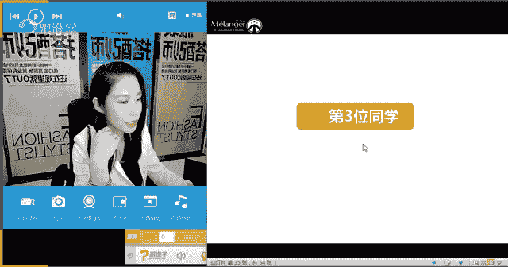

# 1、11服装《搭配秘笈之新版36计》：16整体造型搭配思路_rec

🎼各种成全。🎼，🎼简单点。😔，🎼说话的方式简单。😔，🎼递经的情绪请省略，你又不是个演员，别涉及那些情节。😔，🎼每一天。哦，课件啊。Okay。好，那同学们好啊，好，见到好多老学员哈，非常开心。

然后马上要过年了，然后大家呢啊可能时间上比较比较难安排啊。OK好。😊，好，那今天呢我们开始我们的课程。那上一次呢，因为今天是一个高度总结的一个课程。也就是说针对于我们之前学习到的内容。嗯，你好，阿麦啊。

那么针对于我们之前学习到的内容呢，我们要进行一个回顾。那所以说呢今天呢我们有一个安排，就是针对于我们之前有四位我们的同学抽中了我们的这个呃形象的一个诊断。那今天韩老师要把你们四位同学的形象要剖出来。

给大家做一个分析，那所有同学呢都能感受得到如何去穿搭。那呃被抽中的四位同学的哪四位同学可以出来打个招呼吗？啊，让我看一下今天有没有在群里，否则你要没在群里就相当遗憾了啊。OK有吗？啊。

I'm AmymyOthank you。啊，我不知道你的真实姓名，但是待会儿我看看有没有你啊。因为今天呢我先要说一下我们今天讲三位同学的，因为时间关系，我们会把另外一位同学呢不公开在课堂里讲。

然后会私底下发给你。兔兔蛙，我知道你okK好啊，是的，艾丽你好OK好，那我们开始。嗯。好，那呃网速的问题。那接下来韩老师先跟大家讲一下，你们也学了这么长时间了。那么我相信大家都非常清楚。

就是我们每一个人我们自己的一个啊形象啊该往什么方向去走。我们也经过这么长时间的十六节课的学习，我相信大家呢一定会有一定的感受。那么接下来的话呢，我们看一下如何能够让我们自己的一个啊这个搭配。

能够把它整合化。为什么呢？因为我们其实前期在搭配的时候，我们都是按点来搭配的。比方说我的身材啊，我的相貌特点。那么包括我的这个啊身材的身形状况，那么这些呢其实都是点以点的形式出现的。那么接下来的话呢。

我们怎么去整合了解我们自己整个的一个搭配呢？好，那接下来我们来一起来看一下。好。大家稍等一下。好，那首先的话呢，我们在之前学过，我们说跟一个人的形象有关系的有哪几点呢？我们之前有学习。

第一呢就是我们的气质特征，第二呢就是我们的体型。第三呢就是我们的场合着装。那么。好，那么气质分析呢它首先是五官啊五官的一个呃这样的一个特点。那么所以呢这里面就会有我们的脸型。

由我们脸型决定了我们的眼镜啊、耳环啊、领型啊、妆面啊等因素啊。那么体型的话呢就分为4种AX。TH那么也就分为4种体型。那么场合呢我们也学过了社交职场和休闲场合的着装方式。

那么所以呢今天呢我们要综合的来分析我们一个人在穿着的时候，我们到底应该怎么去搭配呢？啊，那这个就是我今天要给大家讲的一个整体着装因素的一个问题。嗯，OK好，那么刚才呢有同学说想念姿宇老师了是吧？

那我替资宇老师呢呃跟你说一下啊，这个有同学很想念他啊，那么这一块的话呢，韩老师会代为转达啊，好，那么呃课程视频可以全屏吗？O那这个呢呃可以尝试一下啊，那韩老师呢在这里呢，首先呢我们来讲一下第一位同学啊。

那第一位同学呢，首先呢叫王静，不知道在没在我们的群里，是我们VIP学院里面抽取出来的。王静同学在没在在的话打个招呼啊。好，那么王静同学呢啊这个这个首先呢我们为你做一个整体的诊断。那同学们。

我相信你们在穿搭的时候一定也会出现啊存在这样的一个问题，就是我整体形象应该怎么去搭配。那么这里面就会有一个很重要的问题，就是我从哪里入手。那么刚才韩老师讲了，从三点入手，还记得吗？啊，一个是我们的体型。

一个是我们的场合啊，那么还有我们的气质。那么这三点，首先对我们个人个体进行一个分析，分析完了之后呢，我们要进行这个方案性的解决。那么首先呢王静同学，那么接下来我来讲一下为您诊断的结果。

那所有的同学呢在这里通过对王静同学的诊断。那么我们看一下这个着装搭配到底应该注意哪些问题。第一个呢是您的气质适合的着装风格。第二个我们会根据您的脸型找到适合您的配饰。

那么第三个您的体型及适合的款式有哪些？我们为。您解决这三个问题嗯。啊，谢谢王静同学。OK好，那么我们来看一下，首先王静同学，您的气质适合哪些着装风格。OK啊，那王静同学其实呢你是一个大美女啊。

我们来看一下，那王静同学呢身高1。67米。那么体重呢49公斤，年龄呢25岁，很不好意思，这个是你个人的信息。那么因为抽中了，所以说呢就一定要把你的形象要剖出来。

只有这些啊内容才能够让我们啊怎么去能够更好的去了解你自己啊，那么啊王静同学呢首先呢从脸型上来讲的话呢，是非常标准的啊，椭圆形啊，那么第二1个呢就是她的相貌特点，那么我们整个感觉到是偏柔和的啊，偏柔和。

那么也就是说你的脸型比较偏柔和。然后你的气质呢神态呢也是那种男生很想保护你的啊这种感觉啊。那么第31个呢就是你的。体质特征就是你比较纤薄，也就是说整体的身材呢看上去是比较薄啊。

比较直线的那你的服装风格呢，我们就得出一个结论，我们看一下，根据你的脸型，根据你的相貌特点，以及你的气质，还有你的体质，就是你的身材的特点，那么我们为你得出来一个着装的风格就是叫硬朗柔美解渴。

那什么意思呢？也就是说你的身材比较偏直线，而你的五官气质，相貌特点比较偏柔和，那么你的着装风格呢？就是软硬即可非常好。为什么呢？因为比如韩老师这种形象啊，那么基本上只能穿偏直线的。那么你呢就是软硬即可。

什么意思呢？那么也就说你适合的很多风格。来，我们接下来往下分析。那么你的气质呢叫文静柔美，温柔优雅细腻淑女和清新，也就。说我们根据您的外在的形象。

然后我们讲师组呢为您读出了这几个非常关键的适合你的着装的词汇。那么我们分析是什么呢？因为你的整体气质偏柔美，所以你的风格呢要比较柔美安静优雅和精致，那么驾驭的风格比较广泛。由于你的相貌长得比较偏柔和。

所以你不太适合过于硬朗的着装啊，那如果过于硬朗的话呢，那就会把你的气质呢会更加的没有去体现出来啊，那么第二1个呢就是中等身材指的就是身材比较适中啊，不胖不瘦。

那么你的身材首先能驾驭的服装范围也非常的广泛。嗯，OK那王静同学呃，您在群里吗？好，那韩老师呢根据您的这张照片呢再给您提一点小小的建议啊啊，你看你的。呃这个整个的啊就是呃AVIAviva是吗？OK好。

呃，那我韩老师给你讲一下，就是你的这个内衣啊内衣这一块的话呢，其实稍微有点小。是的，那么因为我们经常会去给内衣品牌去做大秀了，经常会去看一些内衣的model。

那么我们再选择内衣的尺码上面呢啊会有一些原则啊，怎么看到的呢？第一呢就是我们呃乳高点之间的乳间距正好是你一个手臂，也就是从中指，然后到你这个什么手腕的这条线啊，这条线。

那么应该是乳间距应该是从中指到这个手腕的这条线，就是乳高点啊，所以说呢很明显韩老师的视觉观察啊，就是这个乳间距有点略小，那么显得两侧这个位置呢，会略宽，所以说呢这个内衣有点蛮小了啊。

那可以稍稍的把尺码调大一点啊啊。哦，运动内衣是吧啊，怪不得了O好，那就没有问题了。那说明你还是比较了解这个自身的状况啊。第21个呢就是我们这个诊断里面没有涵盖的，就是您的腿型啊。

腿型呢您的腿型呢大家看一下，就是脚踝可以并拢，膝盖应该可以并拢。那么所以你的这个大腿内侧和小腿内侧没有并拢啊。那所以呢这里的话呢就说明你的腿型是叫XO就是啊XO的这种混合型。

那我们中国女性大部分都是这种体型，但是不严重，也就是说还基本偏直。所以说您的这个腿型呢其实可以驾驭很多裤型，但是有一种裤型略差，就是铅笔裤型，就是过于紧的铅笔裤型。所以说呢啊可以穿一些这种阔腿裤啊啊。

大喇叭裤啊啊，那么直筒裤啊，都是非常好的。嗯，好，那这个呢就是韩老师在多。多带一些你的这个其他的特征啊，希望你不要介意啊，因为这个是公开性质的。所以说呢啊对对对，OK好，那么呃其实你是条件非常好了。

从脸型到身形，然后再到这个体重啊。那韩老师觉得其实你呢啊很有做这个model的气质啊，那还是非常不错。底子非常好啊。好，那我们来看一下。那么所以呢你适合的风格有哪些呢？快注意要听了啊。

第一个呢就是其实你适合一些淑女的法式优雅风，就是非常的含蓄的一种法式优雅啊。比方说今年的cci的这种啊贝雷帽，然后配上这种大领口的蝴蝶结。那么包括香奈儿的这种小套装。

包括这种迪奥的这种收腰放摆的这种大A型裙，那么其实都是能代表这种法式优雅的啊，像你的气质呢不要穿的过于性感。因为你给人感觉还是比较唯美的啊，如果穿的过于性感，就反倒是把你这种身上的这种优雅的唯美的气质。

反倒给呃就是给埋没掉了，所以这种清新的感觉，一定要保持好。第二1个呢就是中枢，中枢就是我们说到的不要穿的过于可爱，也不要穿的过于的成熟的淑女装。那么像这种呃纱呃这种我们说的这种。裙装啊。

有立体感的裙装啊，包括这种淑女感的收腰蝴蝶结等元素，就非常适合您，不要穿的过于的成熟啊，那也不要穿的过于的甜美。因为你的身高167。那么如果穿的过于甜美的话呢，反倒显得不合理啊。

那么再一个就是波西米亚风。那波西米亚风呢，其实呢一直以来是淑女，很重要的一个风格，这种带有略微带有一点点这种异域风情的这种民族风，那么同时又很淑女的这种自由的啊潇洒的感觉，非常适合你的身材和你的长相。

嗯，不知道你喜不喜欢这三种风格。O这是最适合您的啊，最适合您的。好，那么您的核心风格呢，那这里面有一个小小的tips，就是我们说到的，不管你是穿牛仔还是军装啊，还是中性风格。

就今年流行的一些这种军旅风啊，包括这种啊飞行员那种廓形夹克呀。新的本质一定是带有女性化的柔美元素。也就是说你看他们的搭配都是有女性化在里面的。比方说牛仔衣本来就很硬朗，很中性。

但是搭呃是略微紧腿的牛仔裤，然后搭上高跟鞋而不去搭这种短靴，那么看上去呢女人味就更加十足，而且看上去发型各方面很精致。那么如果穿今年流行的廓形外套，因为你的身高是可以驾驭的。

那么这个时候穿上高腰的铅笔裙，再穿上性感的高跟鞋，那么淑女一点的这种淑女略带性感的高跟鞋，那么就可以融合的特别完美啊。那么如果穿双排扣的西装，本来很帅，那么如果采用这种啊底下配短裤，露出修长的大腿啊。

整个腿部线条，那么再一个配上高跟鞋，那么整个就是帅气当中绝对是有女人味的。那么再看这一件这一件虽然。穿的是这种啊我们经常的OL的这种裤装啊，那么但是呢它还是有女人味的细节。比方说一字肩呢。

比方说这种细高跟呢啊都会让你的女性化气质特别的凸显。所以说呢您的核心风格啊，不管是多么的硬朗流行，那么永远核心，带有一点点女性的混搭进去，那么叫直取结合啊，那么不极度的硬朗也不极度的柔美。

那么搭出来就非常的fashion啊，就是你想fashion的话，就融入一些硬朗的元素，但是不要以硬朗为主线。O好，那么这几这些服装呢就是比较适合那你的脸型适合什么呢？

嗯啊呃avviva因为刚才你的这个数据细节没有表现出没有展示出你的肩的宽度，所以韩老师没有关注到这一点，那么如果你的肩部比较宽的话呢，那你可以穿一些V领的啊，多穿V领会更好啊。那如果说穿一字肩。

那么这个时候你的裤装可以阔腿一点，就是再阔腿一点，也就是说下半身越阔啊。廓形越大，那你的上半身呢就会怎么样越显怎么样越显细窄啊，所以说呢可以利用这种对比法原则。嗯，OK。

然后你的脸型极适合的搭配是什么呢？接下来讲脸型了啊，那王静同学，你的脸型是椭圆形，属于标准型的脸型，所以就说明你的很多选择都非常的广泛。也就是说基本上我们对于脸型标准的人来讲，像眼镜帽子、耳环项链。

我们都没有说你必须要回避什么，就是很多都非常适合。所以你应该是一个不挑发型的或者不挑眼镜，帽子戴起来也几乎很有貌相的一个人啊，所以说呢在这里的话呢啊你看属于标准脸型，所以不需要特殊的形状来修饰。

因为已经非常完美了。那所以说呢啊在这个配饰当中，你配饰和服装当中，帽子当中眼镜当中耳环当中只需要关注风格即可，不需要关注它的造型。比方说耳环有圆形的有长形的有方形的。那么你只需要关注它的风格即可。

不需要关注它的造型，就是它的形状是不需要关注的。也就是说你可以带上呃更任性一点哈，可以带上这个什么呢？呃波西米亚风格的圆形耳环，也可以带上波西米亚风格的长形耳环都是OK的。

那么你关注服装和风格的搭配就非常好了啊。好，那么给你看几个案例啊，比方说耳环当中可以带长形的啊，也可以带圆形的啊，可以带什么椭圆形的扇形的啊，包括这种垂坠感的啊，那么呃但是呢有一点，由于你的肩偏宽。

但是不要戴过宽的就ok了。那么第二1个呢就是脸型啊，眼镜，眼镜的话呢，你看可以带这种上翘的蝴蝶镜，然后扁圆形的这种带有这种淑女风格，或者带有这种比较文艺风格的这种边框眼镜，木质结构。

那么也可以带这种桃心状的上宽下窄的眼镜。蛤蟆镜，因为。五官长得比较标志，那么同时各种镜框任你戴啊，那么你要关注它的风格跟你的什么服装风格最结合。那么比方说你穿飞行员夹克，配这个高腰裙的时候。

你就配一个和飞行员夹克相关的这种蛤蟆镜就非常的好。如果你想穿的特别的50年代那种淑女风。那么这时候你配50年代这种蝴蝶上翘复古眼镜就非常好啊。我说明白了吗？

也就是说这个时候你只需要关注你穿什么样的衣服去配什么风格的眼镜，不需要关注眼镜的形状。嗯。所以这就说明了一个问题啊，为什么很多女生在整形的时候非得把脸整的很标准，整成这种瓜子脸或者椭圆形的脸呢？

就是这个原因啊，那就是因为大家呢要啊怎么样呢？就是脸型越标准，你发现它越不挑剔啊。那韩老师说完这个，大家不要都去整形了啊，太可怕了。那么我们还有很多的办法啊，OK那帽子你看一下有各种各样的风格。

根据你服装的风格来啊，项链你看有大型的圆形的垂坠型的啊，那么啊注意不要过于夸张啊，以相对精致，为什么呢？因为精致是你比较优雅的这种风格所带来的嗯。那你的体型适合什么款式呢？体型啊。

那么刚才看到一个数据93啊，79，那你的身高16793不算太宽啊，所以可能你自己感觉很宽。那我韩老师从数据上来看啊，不是很宽，93、79、65，腰非常细，87啊。

那么这里面有一点就是说它你会略微比你的臀宽，就肩会略微比你臀宽，但是和你的身高来比，你的肩是不宽的啊，那么呃是一个偏倒梯型的，那么和你的臀来比，肩确实略微宽了一些，但是和你的头高来比，肩是不宽的啊。好。

那么你的优势是什么呢？就是你的身高比较显高啊，就是可能你看上去像170的，然后你的腰比较短，腿比较长啊。那么劣势是什么呢？上身会略显壮，对不对？会有这种感觉啊？再一个呢就是肩是你重点修饰的部分。

那么再一个臀比较窄，线条呢不够女性化，就是一就是女人味的这种线条不是很强烈，因为偏倒T嘛。所以说呢你的上身回避肩部夸张的造型，你看老师给你都写到这里的。比方说泡泡袖啊，垫肩啊，一字领啊。

你看是要回避的啊，那刚才给你体现的是风格，现在给你说的是一字领确确实实要回避。那么适合大V领，你看V领拉长圆形领都是O的，深圆领都是O的。那么上身款式要修身，下身要膨胀一些，注意上身修身。

因为你上身比较宽，所以上身尽可能的去修身，而下身要可以膨胀，比如伞裙啊，阔腿裤啊，今年非常流行，很适合你啊。那么色彩呢选择一些冷色深色，在上半身。啊，那么下半身可以选择鲜艳色等膨胀色啊。

那么材质呢上身要用收缩的材质，比方说雅致的呀，雅精致的呀，精哑光的呀，收缩版面料尽量不要在上身去穿一些皮草啊啊，肌理感很强啊或者线条特别硬朗的一些上装啊啊，显上身更壮了啊，那么下半身要什么呀，可以膨胀。

上半身要收缩。那记住这一条叫目的，调整标准身材，上下平衡。因为现在你上身感觉过宽啊，那所以说呢要尽量膨胀下半身收缩上半身啊，这个是你调整的最终极的标准。好，那么看一下适合的上装。

比方说啊这种啊深V啊深V的领型啊，那深V的领型修身的上半身啊，那么再一个呢深V的领型，你看大U大V纵向拉伸，不仅显脖子长，而且显得你看所有的造型都不在肩部做装饰，发现了吗？啊，袖子都可以夸张一点。

但是肩部越简单越好啊，领子越深越好啊，焦点越往中心集中越好啊，那么这个是你重点。嗯，那么裙装的话，你看一下下半身你就可以尽情的去发挥。比方说啊这个亮片的裙装啊，A字的散摆的裙装啊，那么包括什么呢？

包括这种不不对称的这种蝴蝶边啊，褶皱边的这样的一种裙装，那么包括色彩材质都是膨胀的，你就可以尽情的去发挥。那么所以你在上半身在下半身在购买的时候，第一个特点就是膨胀。啊，那么第二个特点呢是什么呢？

就是可以采用阔腿，就是造型上可以更加宽阔的。比方说阔腿裤啊啊，那么啊鲜艳色呀、浅色呀等等啊，就非常好。那么适合您的连衣裙有哪些呢？比方说啊上身修身啊，那么下半身膨胀。那么上身越简单。

下半身呢啊越膨胀的这样的一种特点。第三个，你看上半身都往前中线去聚拢，往领口啊中间去聚拢，然后下半身可以膨胀。那这些廓型呢都是非常适合您的。明白了吗？O好，那我讲了半天，请问同学们。

你们有没有和我们这位同学啊有相似的体型特征的呢？有没有呢？现场啊，那我在讲这位同学的时，这个着装的时候呢，其实也是在给你们做方案啊，所以说呢具有代表性啊。

那么大家呢可以根据我们这位同学的特点来找到你自己的着。服装形态。那么你看一下这这两套哪个更好呢？嗯。啊，胳膊粗还有一个办法，今年非常流行啊，流行这个泡泡袖。那么你泡泡袖啊，泡泡袖大一些。

那么你的小大这个手臂就会显得细一些啊啊，那所以说呃可以穿一些今年流行的。因为2017年最流行的还是在小臂这个位置做装饰。那么小臂这个位置呢越大，那你这个小臂啊大臂就会显得越细啊。

那么这两个你觉得哪个更好呢？好，第一个是适合你的。而第二个呢就不太好啊，是不是啊？大家有发现吗？好，同学们，你们有发现吗？我们这位同学叫T型身材，那么所以属于上身收缩，下身膨胀，所以说第一个更适合它。

而第二个不太适合他。因为一字肩显肩宽，显得上身更壮，而下半身呢又收缩了，所以说呢啊第二套是不适合他的那我们再来看一下。这两件呢哪套更适合它呢？啊，从这个都是我们说的这个国际一线品牌啊，那非常好。

第二套更适合你啊，你上身要简约，下半身呢要怎么样膨胀。嗯，我觉得我们好多同学虽然没有被抽中啊。但是呢很多同学的判断是非常准确的。嗯，好，那么我们再来看一下我们这位同学应该适合右边还是适合左边呢？嗯。

因为它上身比较宽，所以上身呢要更加的什么要收缩，下半身呢要膨胀，所以适合什么？第二个非常好。右边这套啊非常好。嗯，乐明啊啊艾美啊啊安娜小啊，这同学都回答的很瑞ta啊，都非回答的很正确。

那说明同学们这段时间没有啊没有去白学习啊，那么还是非常有收获的。嗯，好，我们再来看一下。好了，那么呃我们刚才这位同学呢啊viva这位同学呢，那韩老师给你整个分析完了。

那你的方案呢是由我们老师呢整个来为你来做的啊。那么讲了你的着装风格廓型啊，那么艾viva同学还有说哦胸围小，不敢太穿紧身，那你的胸围数据，韩老师帮你看一下啊，那么我们再回过头来看一下你的胸围数据。

你的胸围数据。看一下啊。是79嗯，确实会小一点。因为我们说胸围要跟哪个数据一样大才对呢，至少应该等于你的肩围和臀围。也就是你的胸围数据大概小了十几厘米哈，那也就是说你的胸围的发展空间，还有十几厘米。

那也就是说呃你的这个胸围呢可以至少再增大一些。嗯，那么这里的话呢，一般来讲有两个办法。第一个办法呢，通过内衣来增大，那内衣的方法呢，韩老师就不多讲了，因为现在有水电哪等等很多内衣的方式。

第二个呢就是可以通过视觉的错觉，比方说像我今天这样穿胸围就不明显。因为我想隐藏啊，那么如果说当你想表达胸围比较偏大的时候，你的外套，如果是深色的时候，在你胸部用上膨胀色膨胀的面料，比方说亮片呢，包括。

T恤这个胸围这个地方呢会有一些印花呀，或者有一些亮片呢，或者有一些焦点呢，在胸部这个位置。那么从视觉上也会变大啊，说明白了吗？嗯，好，那接下来我们来看一下我们第二位同学啊。

所以啊这个我们刚才这位同学呢静静同学呢啊你呢非常的幸运。那么啊我们老师我们团队整个为你做了一个整体的方案啊，那其他同学也不用着急，我们在这个方案当中找到跟自己比较类似的嗯类似的这样的一个啊形象啊。

那么呃来尽可能的跟自己去结合啊，那么因为我们没有办法一个一个去分析，所以说呢我们当时就采用了这个抽签的形式啊，那么其他同学呢也可以根据我们现有的同学做案例，然后来分析你自己的一个形象啊。好。

那第二位同学我们来看一下是谁呢。我们同学在不在现场？杜勇同学在吗？在的话给老师打个招呼嗯。好。呃，阿viva啊印花会吸引眼光，就是我们说的视觉焦点放在胸部嗯。好，没在吗？杜勇同学啊，那太可惜了。

不过没有关系，我们通过杜勇同学的方案来看一下我们个人应该怎么穿搭哦，在是吧？非常好啊，那韩老师现在要暴露你的个人信息了，你有没有意见呢？好。嗯，好，那么首先杜勇同学，我们为您诊断以下三点气质以及脸型。

还有体型适合的款式。OK你们都非常的大方啊，非常好。那，来，我们看一下您的气质。啊，杜勇同学1。65米、56公斤，46岁哇，你的我觉得你非常非常的到现在就是说46岁依然在追求美。

我觉得这是一个非常好的一个呃怎么讲呢？是一个非常好的一个呃这个对生活的一种呃很好的一个观点啊，就是我们任何时候都要追求美。每一个女性在不同的年龄，我们都有不同的美啊。所以呢在这儿的话呢，杜勇同学。

我们看一下啊，其实46岁的你对身材保持的非常的好，而且能看得出来你的比例很好啊。你的这个这个啊身高啊，以及你的这个肚脐的。位置让韩老师看到了你的其实非常的，而且你没有穿高跟鞋，你的比例非常好。

腿比较长啊。好，那么杜勇同学呢来我们看一下它是方形脸。那我们现场有没有方形脸的同学呀啊，有的话可以举个手跟杜勇同学是一样的啊。好，那么接下来我再讲脸型这一块的时候就跟你们其实是很类似的啊。

月明同学很好啊，那么我们再来看一下相貌特征，杜勇同学近距离观察的话呢，其实脸型线条偏硬朗啊，偏硬朗就是比较直啊，比较直线。那么你看一下你的这个两鬓的位置呢，会有点凹啊，那么颧弓呢略凸啊。

颧弓略突啊后呢下颌角这个位置呢比较清晰，所以说呢面部这个叫立体感很强啊，骨骼会相对突出所以说你的面部线条给人的这种感觉呢是非常的这个。利落感啊非常利落。那么我们就说偏直啊偏直。好。

那么体脂特征呢是中什么叫体脂呢？你们之前有学过，就是说没有那么的圆润，也不是非常的骨感。所以在中间。那么你的服装风格我们判定了一下，你要穿中偏直的这种印象啊。

我们有没有和杜勇同学很相似的身材特征包括脸型特征比较相似的呢？有吗？啊，那么所以呢杜勇同学，你的平常着装呢，因为韩老师没有看到，那么你穿的都是比较紧身的这个内搭。

那接下来你的风格和前我们前面的静静同学的服装风格是完全不一样的啊，那么你的风格呢就开始走什么大气干练啊，同时呃这种女人味呢是来自一种相对来讲比较有这种大女人的印象啊。

那我们前面静静同学他会比较唯美温柔那么你呢就会走那种大气偏欧美的感觉啊，传统稳重么整体分析。呢整体气质成熟大气，简约大气为主啊，那么成熟大气硬朗中带有女人味啊，身高身材高挑偏H型啊。

我们都知道H型也是上下平衡性身材。那么注意你的要想表现女人味，用要用来收腰来表达曲线。好，我们来看一下今天同啊这个窦泳同学我们来看一下啊，军旅风淑女风，中性风，我不知道你能不能接受啊。啊，在西方国家呢。

其实女性越来越成熟，他们的着装会越来越利落啊，越来越大方和简约。因为这样子的话呢啊我们其实呢可以把自己的气质穿的更上扬，线条更加的上扬，让整个人特别有精神啊。

其实呢女性如果说比方说我们经常会有一个错误的观点，就是有的同学呢啊她本人呢长得比较的成熟。比方说我开。就是比如说我有年龄感啦啊，我35岁以上啦啊，我想穿年轻，有的同学就有一个错误的做法。

就直接去买那种特别可爱的小女生才会穿的那种服装。所以说这样我觉得是完全不合理的。因为这样会从侧面会看到就是。会有一种强烈的比对感，就是说你呢本人比较成熟，那么你穿上那种特别年轻的服装。

那么就会有一种强烈的比对。所以说呢我们建议如果想穿的比较年轻，其实多穿这种比较有精神感，精神面貌上扬的感觉啊。好，那么军旅风是今年以至于一直以来非常经典的一种带有制服效果的服装。那么淑女风啊。

依然是杜永同学非常适合的大气的淑女风。那么再一个呢就是中性风，中性风呢就是比较简约啊，简约利落。嗯，好，杜永同学你自己喜欢这三种风格吗？嗯，有问题也可以随时提啊。好，那接下来非常重要的来了。

就是不管是淑女。嗯。并了，同学说分年龄吗？如果是二十几岁穿成这样感觉太成熟。是的，因为这个呢确实我们给杜勇同学找的是比较适合他的年龄段的啊。那么所以你二十几岁啊，如果穿成这样，确实有一点点成熟啊。好。

那么不管是淑女嬉皮中性，都以简约干练，所以杜勇同学你一定要记住，你的着装要简约干练啊，才是你的核心，所以你看你穿淑女装也是简约干练的啊，你穿这种比较带有嬉皮风格，就这种民族风也是简约干练的，非常大气啊。

那么如果你想穿的这种比较大气的女人味的。那么你看到也是简约的啊。所以说呢您的美是成熟女性美啊，不可穿的太过于可爱哦，或者繁琐啊或者过于稚嫩啊，都是不好的。嗯，这是您回避的。

所以您记住您的四个字叫简约干练为本质。所以不管穿。淑女风、嬉皮风、中性风啊，那么都要以简约干练为主。那同时呢要回避过于稚嫩可爱和过于琐碎，那么穿在身上就没有那个感觉啊，所以你是适合穿欧美风的人啊。

欧美简约风的人哈。那么接下来有和杜勇同学脸型很相似的同学注意了啊，看看跟你们很相似的特点。那以下是你诊断的脸型及配饰的结果，你的脸型长方偏方，选择配饰修饰拉长脸型。因为脸型方的话呢就不够长。

所以你的配饰要以拉长脸型为主。那么你的耳环呢建议不能再宽了。比方说圆形啊太宽的耳环呢会让你的脸型更宽，所以说呢尽量不要太宽的，比如说回避一些方形啊，过圆的形状啊，还要特别避免长度到下颌骨位置的耳环。

也就是说太长啊，也会选择脖子不够长啊，可以选择略细一点长一点的眼镜要选择边角高，可以修饰颧骨。因为你颧骨这里是比较窄的。所以说呢这个可以带。这种所谓的猫眼啊，两边边框这儿高一点，向上翘一点。

那么就会让你的脸型更完美啊。那么眼睛不可过扁，如果过扁的话，会显得你怎么样呢？脸会变宽啊。好，那么帽子的话尽量怎么样选宽帽檐，因为帽檐越宽，显得脸越小。那么向后张着这样戴，可以拉长脸型。嗯。好。

嗯啊是长方形吗？长方形偏方嘛，那你还是方啊是方。那所以说方的话呢还是会略宽一点的啊。那么除非你这个照片呢，我们拍的看的不是很清，你是觉得你的脸偏长吗嗯。但是还是偏方的啊，所以往两边走的还是不适合的。

没有问题嗯。好，那么项链的话选择领型，选择偏长款的项链啊，所以备注是什么呢？都有女士，您的脸型属于长方偏方啊，太阳穴位置凹陷，所以选择重点修饰太阳穴位置和拉长脸型，但是不要过长了。

所以说你看这里让你选择不要过长的耳环，你一旦能显得脖子短，再一个脸略偏长方的话，过长啊，也是不好的嗯。好，那来看一下啊，你的耳环呢尽量啊看一下有拉长效果，哪怕是水滴啊，那么也是有拉长效果的椭圆水滴啊。

那么特别避免长度到下颌骨位置的耳环，就是说避免过了这个位置再拉到这儿来的话，就会显得把脸型又拉的过长了。嗯。哦，并马同学说宽大脸型带小量感的饰品感觉脸型不搭啊，是这样子的啊。

就是呃首先呢这个你是从这个量感上来讲，就是你认为一个人长得要大，它的耳环配饰也要大，是吗？嗯，那么我给你举一个例子，你可以去看一下，你看一下安吉丽娜朱莉。

它戴的最经典的一款项链是卡地亚的特别细小的一个这个全钻的一个啊，就是非常小的一个全钻的一个一个项链啊。那么这个怎么解释呢？嗯，好，所以说呢其实呃有这个像现在的有这个这个形象理论当中说，你长得大量感。

你就什么都得大，项链大，耳环大啊，哪哪都大。其实这个是未必的。这个是未必的，它指的是你可以穿的设计感大气一些，但指的并不是体积。设计感大气一些，但指的并不是体积啊，设计感大气，它指的是简约。

而不是说体积一定要大。你想一想对不对？我再给你举一个例子，比方说一个人脸长得是很大啊，五官长得很大，但是他个头只有150。那么这时候你羊他什么都穿的很大，也是有问题的对吗？所以说他指的是设计大气一些。

不是指的是体积大气，体积很大，不是体积绝对大，而是设计大气。啊，所以说这个千万不要理解错了，如果理解错的话，你就会有一个错误的观点，就是你你穿什么的时候，你都会呃体积要求很大。其实指的是设计感啊。

设计感叫整而不碎，叫大气啊，就是一定要穿的一定不要细碎，而是说要穿的怎么样呢？穿的要简约，简约，就是大气的一个设计，而不是体积大。嗯，说明白了吗？啊，月明同学啊好，那么在这儿的话，我们来看一下眼镜啊。

由于我们杜勇同学的这个两侧啊，这个鬓角位置呢比较窄，比较凹，所以说呢我们会给他选择这种猫眼眼镜来强调一下，来反向弥补一下啊。那再一个呢包括这种略偏长型的眼镜啊，不是扁宽型。好，那帽子戴宽檐帽。

帽檐越宽脸越小。那戴这种宽檐帽就时候注意向上扬着戴啊，略向上扬一点，那么你的脸型也会有一个很好的修饰。嗯，好。那么帽子可以选择宽沿帽啊，那么再一个项链啊，拉长脖子的脸型啊，拉长脖子的长度。

以及让脸型显得怎么样更加具有修长感会更好嗯。好，我们再来看一下你的体型啊，那么体型呢是91、88、7390，其实你非常的平衡，9190，那相差是几乎是为0。所以说呢腰围又很细啊。所以呢啊腰围是适中啊。

适中。那么因为如果说腰围和肩围相差在20厘米的话，那么基本上呢啊就是能达到啊X啊，那你就差一点就到X了。再再稍微啊细那么3公分。嗯。两三公分的样子啊，那么基本上呢就能够达到一个。非常好啊，对，3公分。

比如你腰围达到70厘米，基本上你就是一个X了啊，基本上就是一个X了啊。好，那么所以说呢可以再努努力。嗯，好，谢谢贝蕾同学好，那么啊也就是说腰其实你的体型啊，你保持的相当好了。同学们。

我觉得杜我们要向杜勇同学学习啊，你看她46岁。然后腰围再差3再再怎么呀，再瘦3公分啊，那么她就已达到一个标准的X啊，所以我觉得一个女性一定要对自己要有一定的要求啊，所以说明你对自己是有要求的，非常好。

嗯。好，那么优势是上下特别平衡，身材很匀称，劣势是腰不够细，女性化的曲线还不够明显啊，那么搭配注意事项，收腰放摆，增加女性曲线，拉高腰线提高什么比例。好，我们来看一下啊，您适合的连衣裙啊，大家看一下啊。

收腰放摆，收腰放摆，通过收腰制造身材曲线。嗯，O好，那么再来看一下这种服装帅气干练的感觉啊，服装的廓形更帅一些啊那么也就是说杜位同学如果平常穿一些这种啊有女性化气质的连衣裙。

外面再套一些直线H版的这种潇洒感的风衣其实非常有气质嗯。那适合的下装呢是下装呢要可以迪摆打开啊，廓形感潇洒感强一些。比方说A字裙哪、包臀裙哪，收腰放摆呀啊，那么越是这样收腰放摆，你的腰看上去越细嗯。

那么高腰线，那让您的腿看起来更长，把腰线提高，让腿看起来更长。OK好了，杜泳同学嗯啊把您的这个讲完了，有什么问题吗？啊，好，我相信呢肯定你在这个过程当中不断的在思考，我是这样的吗？对吗？O那好。

那你们个人的这个方案呢，我们会让我们的班主任老师呢也会稍后啊，会发给您，然后让您自己做一个保留，然后自己下去呢，再来学再来这个深化一下。嗯，那非常好，说明你穿的非常的这个还是对自己的判断很精准的。

但是呢还有一点，今天韩老师要说一下，我们今天给大家的搭配，其实都是最适合您的搭配。但是你有没有有时候也想穿穿小女人呢？啊，有没有有时候也想表达一些温柔呢？

或者有没有有时候也想穿一些这种比较啊森系潇洒的这种。

舒适的感觉呢。所以说呢啊这个呢就是我们叫另外一个叫造型。啊，造型你比方说举个例子啊，韩老师本人呢长得是比较硬朗的啊。那么其实韩老师有时候也想说表达的仙女一些，或者说表达的女神一些或者更温柔一些啊。

这也是我有的诉求。虽然我长的整个的气质，包括身材各方面都比较硬。但是呢我也有想要拓展自己形象的一个想法。那么这个情况呢，因为我们给到大家的这一次的这个呢是你们属于你们个人最适合的最核心的。

那么你要想造型的话，那你就要接着把它给学下来。为什么呢？因为我们在后面会讲到各种百搭的造型，其实一个人找到自己最核心的只是最适合你的。其实一个人是不满足自己，只穿着一种感觉，穿到老的。

所以说呢我们希望穿更多。那么你就要学习更多的关于服饰配搭更多方案。这样的话你才可以真正的把你的不同的你不同时期的你不同风格的你全部表达出来嗯。好好，是这样的啊是这样的。好，那接下来的话呢。

我们来看一下第三位同学。嗯，好，兔兔蛙啊，到你了啊，你在哪里？好，给韩老师招一下手嗯。好。啊，艾y好OK好，那接下来那也是根据为你要做三种啊判断。好，有没有一点小紧张呢？好。

那接下来有跟兔图蛙同学这个形象比较类似的那同学们也可以啊来根据他的来把自己的调整一下。好。啊，看你的名字，果然是一个可爱的小女生啊。那我们来看一下啊，那么兔兔蛙同学呢身高156，体重50公斤。

年龄28岁。建筑设计师哇，非常厉害啊。好，那么脸型呢是方圆形，下颌角略方，整体感觉偏圆润啊，那么相貌特征呢整个的眼神神态，整个我们判断出来呢？你是属于略微有一点点小小的直线的感觉啊。那么但是呢也不完全。

因为你的脸型又比较圆润，所以其实来讲的话呢，你是既可以穿一些干练的，也可以略微穿一些甜美的。但是我估计你会更喜欢干练，为什么呢？因为你是一名建筑设计师是一个比较偏理工的一个思维。长期你的个性。

你的思维呢，会影响到你本人的气质。所以说可能。能干练是你自己最向往的对吗？我不知道有没有判断正确啊，因为一个人的职业会影响到你对服装风格的选择嗯。好，那么再一个你的体质特征又是曲。

所以你的身材是就是比较女人的。所以你平常穿衣服应该有一个困扰，就是说你会感觉到哎其实你个人喜欢干练的，但是你又发现你的身材呢又比较圆润，所以你就有一个困扰，就是我到底应该穿一些女性化的呢。

还是应该穿的帅的呢，穿的太帅的话，身材好像比较圆润，穿起来显胖，但是穿的太女人呢，你个性和你的相貌又不太适合，所以说你是一个比较有矛盾的一个着装的一个特点。所以你平常着装应该比较有困扰，对吗？嗯。好。

好OK好，那接下来的话呢，我们来看一下。嗯，那其实你这种特点呢是在穿衣服当中，比方说你脸型比较帅，身材也是那种薄薄的，那么就非常的统一。但是你的脸型呢整个看上去呢又有一点点干练，但是你的身材又很饱满。

这就叫矛盾型啊，身材是偏曲，脸型略微有点偏直，那么你这个就非常的矛盾，矛盾呢就不好穿衣服，你发现满足哪个都好像都不是你自己啊，所以呢我们被你去判断呢，其实你应该是身材为曲，脸型为略偏直。

所以你应该走直取结合这样的一个道路。所以呢你可以穿积极干练，独立简约传统的。同时呢你又可以穿一点点小小的淑女风啊，都是可以驾驭的。所以呢整体气质偏硬朗，服装风格偏直线啊。

那么我们现在有我们群里有这样的同学吗？就是。跟我们兔兔蛙同学很相似的，就是身材脸型可能看上去偏硬朗，而身材又很饱满，有没有这种特点呢？啊，有没有相类似的同学呢？嗯可以啊示意老师一下。嗯啊，雨荷。

您也是这样的对吗？嗯，好，还有吗？还有吗？OK好，那么如果碰到这种情况，就叫身材和脸型的一个叫什么呢？一个矛盾。那么碰到这种的，记住你既可以穿直线的，也可以穿曲线的。那么怎么去调整呢？好。

所以我们分析是整体气质偏硬朗，服装风格，直线感。身材娇小，不易穿大廓形，因为你身材不娇小的话呢，以短打为主，尽量不要穿那种流行有过大的廓形会显得你整个呢很宽。同时呢需要收腰啊，高腰线等等调整比例来。

我们看一下，那么兔兔蛙同学给你提供的极简主义的，然后简约的淑女，然后简单的机车短打为主，干练为主，但是看上去又不失甜美感，不知道你喜不喜欢嗯。当然了，韩老师提供的这些图片呢只是一张。

那么其实淑女极简机车还会有很多。所以你们拿到这份报告之后呢，一定要再去查找一下这些风格的很多延伸啊，所以呢兔多拉同学其实完全可以穿的比较有灵动感觉，就是比较灵气十足。

你看一下这几个给你找的这几个造型都是很灵动的啊，所以你根据极简淑女机车，你可以再找一些这种短打的这种各种各样的淑女，各种各样的机车，各种各样的极简，其实都蛮适合您的。嗯，好。

那么再一个您的核心风格是不管您是想演绎军装风机车风，淑女风，您的核心本质都是什么呢？带有帅气简约不过分的女人和甜美，这句话非常重要。您的核心本质是带有帅气简约不过分的，就是不要细碎，就是你不能复杂。

可能你自己也不喜欢，很复杂装。的东西啊就是简约，但是呢不过分的女人和甜美，你可以表达一点点甜美，但是不要过分的琐碎，嗯，也不要过于整体甜美，那就把你穿的比较怎么样呢？那种灵动的气质就没了。

可能会比较俗气了啊，这是韩老师讲的一个，就是如果像你这种感觉呢。如果你穿的很琐碎啊，那就看上去呢就是不够的有灵动感啊，那么穿着以裙装简约为主，不能繁琐啊，直曲结合来，我们看一下。

你看一下直线的帅气的和曲线的百褶裙啊，帅气的什么皮革裙装和比较具有女人味柔软的上装都是短打啊，那么就算你想穿今年的阔腿裤。记住韩老师给你的建议是九分啊，九分七分高腰线不仅比例提高了。

而且整个身高看上去往上走，上面穿那种什么短款帅帅的夹克衫啊，穿上这种呃这个略。柔软的阔腿裤，那么就会非常好嗯。好，您的脸型好啊，沉淀说每个人都会评一下吗？啊，沉淀可能你是不是有缺我们的课呢？啊。

是这样子的，我们会我在我们整个的同学当中，我们抽出了四位同学做了一个整体方案啊，所以说呢啊这个呢待会儿但是你们每个人都有机会啊，那么都有机会，什么机会呢？待会韩老师会告诉你们啊，偷头拉同学。

那您的脸型呢属于方圆形，所以一定要拉长线条。那么这个是你的核心耳环呢？要拉长线条，避免圆形。啊，尽量走椭圆形线形长形眼镜呢尽量怎么样要拉高啊，不要扁宽。嗯，好，那么不太适合太圆太方的眼镜都不适合啊。

太圆太方是不适合您的，要拉高的方圆适中。啊，帽子的话呢要选择什么呢？向后倾斜，或者说呢呢？把帽子在戴呃棒球帽的时候向。上去抬一下，可以拉长脸型。嗯，还有呢可以戴一些这种帽子。

帽檐较就是帽身较高的一些帽子，可以将你的脸型拉长。总而言之，你记住拉长脸型最重要啊，项链选择深U型V型，在视觉上可以拉长脸型。嗯，根据我们的判专业判断呢，您的脸型属于方圆形。

建议在选择配饰的时候选择拉长型脸型的饰品啊，重点我们来看一下配饰啊。好啊，风格这块，波西米亚风格，您的配饰选择带有民族感为主。彩色念珠、羽毛，其实这些都可以尝试。好了，耳环你看这些是不好的啊。

兔图蛙同学注意了，你发现这种三角形啊，包括这种心形啊啊这个五角星形啊，包括菱形啊，都会加宽你的脸型，你尽量去带一些什么拉长型的耳饰啊，当然不是说只买这四种，就是有这种拉长特点的都是可以的。嗯。

可以试戴一下啊。那么如果你觉得有问题的话，你可以包括刚才那个杜勇同学，你们觉得老师给你讲的，你说哎呀我还不理解，那就怎么办呢？一边戴一个拉长型的耳环，一边戴一个什么呢？呃，这个啊这个这个方圆一点的耳环。

你可以比对一下。你这样一比啊，在镜子面前一比马上就能看得出来。嗯，好，那么大家看韩老师今天这个发型啊，其实韩老师的脸型，你看我打开也是这里有宽度的，能感觉到吗？但是你看发型是这样子的。

这样盖下来是不是感觉脸就窄了，然后把这个刘海部分呢向后梳，然后让他略微高一点，那么是不是整个脸型呢就变成一个长椭圆了呢？哎，好，所以这个就是我说到的，就是你可以通过你的发型啊。

帽子等等都来修饰我们的脸型好，那么在这里的话呢，我们来看一下。帽子的话呢尽量选择，比如说宽帽檐显脸小啊，那么呃这个帽檐前面呢弯曲。那么现在这个帽子呢叫棒球帽，它有平帽檐，也有弯曲帽檐。

你尽量选择弯曲帽檐可以拉长你的脸型啊，那么包括项链要拉长比较好。好了，那你的体型是什么呢？啊并码同学说脸型是直线型的，适合戴曲线型的耳环吗。并码同学我觉得你有一个问题啊。

就是说你有可能被之前的那个很多的那个呃系统。我觉得现在可能对于你的影响特别的大。其实你的脸型和耳环，主要是在于线条的弥补。我的我想说的是，如果你的脸是方圆形。

那么你就是要把自己的脸啊这个造型成一个倒着的水滴。也就是说方圆形怎么变成一个倒着的水滴。那么所有的耳环眼镜配饰都要往这个美感的线条上去走啊，所以你说的是脸是直取啊，它是风格，它不是说你直线的脸。

你就要带一个方方的眼镜，带一个方方的耳环，那不是很恐怖吗？嗯，所以说变码同学，你呃这个很有可能就是说对于那个呃风格，脸型风格和脸型线条修饰这两个概念搞混了。嗯。好。

那么兔兔蛙同学是92、86、72、88哦，那你首先要注意啊，就是说如果说你的肩再宽一点的话，你就开始有可能往倒梯形去走了。所以你的肩会略宽，你整个会比较宽，你的身材会宽啊。

你身材的这个搭配问题还是相对来讲要注重一下。因为你一米1米几啊，我看一下啊，嗯。156吧，然后你9092，那整个算比较宽的了啊，所以说你一定要注意整体不要再加宽啊，那么但是呢你的呃。看一下啊。

就是说我们当时在你这个就是有一点就是我们看你的数据呢，我们觉得你有点偏H啊，还有可能有点偏T。但是呢我们从照片上看您的身材呢，感觉偏A，就上身反倒看上去没有那么的大而臀，对。

所以说你是不是这个数据量错了啊，这个我跟你说一下，就说我们老师们看上去，你像A，但事实上你的数据看上去偏H，所以说你到时候最好重新量一下给老师，我们按我们老师们判断的给你建议，上身较瘦，腰身较细。

肩较窄啊，而劣势是下半身丰满啊，那么所以说呢你要重点修饰在下半段变细啊。好，注意事项，下半身一定要挑些显瘦的单品啊，尽量挑选一些肩部有装饰的上装，就说你的修饰重点放在上半身，下半身一定要收缩收缩在。

收缩嗯，好，我们来看一下。建议适合的上装啊，比方说肩部可以有略宽的效果啊，包括一些泡泡袖啊，包括一些呃U型领啊，这个大圆领这样的一个特点。那么所以我们是按照A型身材帮你来啊做的搭配。

如果你觉得有问题的话，建议你把你的身材重新测量，再给老师发一下。嗯，好，那么如果你是A型身材，你就非常适合这三种上装啊，当然了还是要简约干练为主哈，简约干练啊，这是廓形，那么你下半身呢适合怎么样呢？

收缩感。比方说啊建议呢虽然廓形是喇叭型，但是是黑色啊深色，那么或者收缩的啊，这个什么啊收缩色的A裙啊，或者紧包臀部的裙装啊等等。嗯，好。那么适合的裤装的话呢，尽量以收缩为主啊，拉长线条为主啊。

所以深色的裤装啊尽量简约的裤装。那么选择高腰直筒或者收缩你的上装啊，以及拉长你的双腿，或者选择宽松的休闲裤啊，可以轻松的从你的胯部垂下啊，不给臀部啊，增加多余的体积。

就是尽量不要穿些哈伦哪等等这些这种款式的裤装啊，尽量就是让你的裤装显得线条很顺畅，腰线高，整个显得你整个的身材呢比例会更好，腿会更长嗯。M美啊有在听吗？O吗？这个你要仔细的来体会一下啊。好。

上身膨胀色更好啊。所以这两个呢是哪个好呢？啊，我们来看一下啊，上身膨胀会更好，所以说这个左边会好于右边啊，那么左边会好于右边啊，我们再来看一下上身有亮点会更好，哪个呢会更好呢？因为臀比较宽。

所以说右边这个裙子呢坚决不能穿啊，那么上身有设计焦点，而下半身越收缩，所以是什么呢？第几个呢？哎，一还是二呢？左一右2啊，左一右二一更好，对吗？啊，好，一更好非常好，那么所以说呢这个是我们说到的嗯。

你在身材修饰上要上身膨胀，下身收缩。记住了吗？嗯，好，那么我们还有一位同学啊，那么今天时间关系，我们会把你。您的这个方案会私底下会有我们的老师把您整体的方案发给您啊。好，那今天韩老师讲的这些。

还有没有同学想知道自己整体的到底应该怎么去造型呢啊，这个是一个整体性的一个方案。嗯，好，我们来看一下整体造型思路，我们再来回顾一下，其实每一个人我们要着装的话，得从三个方面走。

第一个方面呢就是相貌特征啊，那么相貌特征呢，其实是你的综合形容词。也就是说你的五官带来的形容词啊，那么脸型决定发型、耳环、耳饰配饰、领型妆面等因素啊，那么第二一个呢就是体型分析。

体型是我们搭配当中非常重要的一个板块。也就是说你如果说同样的上装，由于你的体型不同，我的下装内搭搭的就完全不一样啊。那么场合呢是你今天要在什么场合去穿啊，你在社交职场。还是休闲，你选择的款式也都不相同。

嗯，O所以说呢这个就是我们整体的造型思路。那么我们在三十六计在前十六计的时候，其实我们这些内容都已经学过了。啊，那么有新进来的同学呢，我们下一次这个三十六计再一次啊前十六计再开课的时候。

然后你要再跟一遍啊，那么包括我们其他同学也可以再跟一遍。就说老师我学了半天呢，可能我对自己还不是很清楚，知识要巩啊，就是一定要温故而知心，要巩固。

所以说呢同学们可以再将前面的知识可以再一次我们再新开一轮的时候再学习一遍。嗯，好，那么今天我们分析了三位同学，还有一位同学，那么我们会私底下班主任老师会发给您。嗯，好，那接下来的话呢。

那同学们其他同学肯定说老师我没有那么幸运，你们没有抽到我啊，那么我们没有办法去，其实我们每做一个方案，我们的老师大。概要花到呃半天的时间去给一个同学专门去做方案啊，所以说呢这个也是价值很高的啊。

那么抽到的同学很幸运，那没有抽到的同学呢继续有机会啊。那么也就是说我们三十六计下半步马上要开了啊，那么我们的报名也是截止到明天下午啊，明天那也就是说同学们还有最后啊报名的时段。如果在明天报名呢。

不仅可以享受这个我们的一个啊这个1680块钱的个人形象诊断服务。同时呢也可以享受499这样的一个价格啊，那也就是说同学们如果说啊我们还会给到大家，就是每一个人凡是报了这个课程。

我们每一个人都会做一个像刚才一样的啊，这样的一个价值1680的一个个人形象分析的一个诊断的一个服务报告啊，那么所以同学们你们还有机会。那当然了，同学们接着往下学，我们三十六计结束之后。

呢我们还会有第二节的更高阶的课程。所以同学们可以跟着我们的团队，跟着我们的老师一起来成长。然后从这个初级的时尚达人，然后变成了高级的骨灰级的时尚达人。那么相信一路学下来，同学们。

你们的形象就会有一个巨大的改变。而你们花到的费用是非常低的。也就是说其实呢总共啊两个两个36G总共是价值将近5000多。那么大家其实用了不到这个700多块钱啊。

800块钱就已经学到了一个价值非常高昂的一个啊学习的这样一个呃收获。那所以说呢啊这届而499，只是大家平常买一件错误的啊服装所花费的费用啊。好的，那么同学们大家要想改变自己的形象。

要在改变自己的什么心理状态，以及改变自己的思想啊。好，那么在这儿呢，同学们如果说你们还想。继续让自己的形象呢能得到这样的一个啊这个价值1680的个人形象诊断服务的话呢，大家继续可以关注我们三6计下半步。

OK好，那么接下来同学们我们到了答疑解惑的一个时间。那么我们接下来开始来回答同学们的问题啊。那大家呢可以在群里开始可以问问题。嗯，OK好，大家现在呢呃。

可以进入我们的VIP群来进行答疑解惑啊。好的，那么我们线上的授课时间呢啊因为也到时间了。那接下来我们进到我们VIP群，同学们来问问题，韩老师接下来马上在VI在VIP群当中等大家OK好。

那么最后呢韩老师还想跟大家讲，其实呢很多同学呢一直都在想说，哎，为什么要改变我们的形象。那么其实我们为什么要一路的时尚下去。那其实韩老师想跟大家讲，从服装心理学上来讲，每个人人类是什么？人类是什么呢？

啊，人类是这个叫什么？是视觉动物啊，那所以说呢其实有时候我们会发现，我们如果能拥有一个非常完美的一个形象。第一，我自己非常有自信。第二。人类本身就要去欣赏美啊，也就是说我看到自己很美。

其实我自己都会一辈子都会很开心。再一个呢就是我觉得美可以给你带来自信。还有呢还有更多更多的机会啊，所以说呢希望同学们呢能够抓住这个时机来一起跟我们一起36级，然后我们到后面还会有更多的高阶的课程。

让大家一路修下来。同时后面的话呢我们会慢慢的会开始给大家设置什么呢？你的达人啊，达人卡，也就是说未来我们会为大家去颁发啊，你修到第几阶，你成为什么样的达人，我们会给到大家更多更多的福利。嗯，O好。

那猫精同学下半部分大纲韩老师上课不哦，下半部分肯定是有我的课的。嗯，好安妹啊，对呀，韩老师下半部分有上课吗？有的嗯，有的嗯，有我的课程啊，那么越高阶，那么韩老师的课程就会越多。嗯，好好的，那么。

那接下来的话，三十六计只是一个入门。那大家只是学了上半部，那大家说老师我学了上半部，我就要会搭啊，我就要会怎样。韩老师告诉你不可能，为什么呢？因为韩老师整整做了13年，我们特别清楚。

学习是要循时渐进的啊，不可能说我学啊十几节课啊，我就马上就能变成达人，不可能达人也是要修炼出来的。所以同学们不要想一口吃个胖子，学习是累计出来的啊，是积累出来的，这个是非常重要。嗯，好嗯，好。

那同学们我们马上VIP群里建VIP群老师为大家来进行答疑解惑。好的，那今天就上到这里，大家记住，明天是最后的截止日，我们呃三十六计下半部分啊，我们马上就要开始了。我们学完上，然后我们再来学完下。

这个时候你的专业的时尚水平又会更上一层楼。好，谢谢大家，谢谢嗯。

