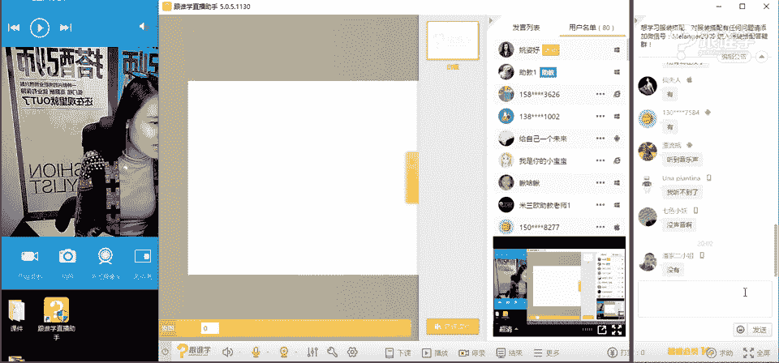

# 1、11服装《搭配秘笈之新版36计》：17短裙=性感？_rec

🎼不一定要喝羞一起干杯干杯干。😊。

Oh。话。hello，同学们晚上好嗯，那现在呢首先我们先来测试一下啊，那我点开屏幕，同学们，请稍等。如果可以听得到我说话的声音的话呢，请打一，现在可以听到声音了吗？同学们。

嗯，OK好的啊。😊，请稍等一下，我调整一下我们的镜头。嗯，好的，同学们嗯，感谢你们的回应。嗯，看到很多新同学啊，那也看到很多老同学。比如说永雄同学呢就是我们的呃VIP学员。

那现在呢大多数都是我们的新同学，对吗？OK好的，我看到大家的回应了，非常开心啊，今天能够在我们的这样的一个公开课上跟大家见面。那今天晚上的课程呢也会由我来全程的跟大家来分享。

那慧超同学也是我们的VIP学员。嗯，欢迎好呃，那对于很多新学员呢，应该是没有见过我哈，或者没有听过我们的课。那我想问一下，现场有多少女同学。啊，然后有多少男同学呢。😊，同学们，如果你们是女同学的话。

请打一。男同学的话请打2。嗯，除了慧昌，包括呃这个永雄同学，我知道啊。好，那大多数都是女同学啊。OK那今天晚上我们的课堂呢是关于短裙的这样的一个课题。那我相信女生的话呢，大多数都是非常感兴趣的啊。

我一看到熟悉的名字了。孙文林同学你好啊，那呃我不知道咱们这两位男同学啊，包括永雄和这个会超。那你们听短裙的课程的话，会不会有点是的，好多的女生OK嗯，蓉荣好，嗯，那呃我大概了解了。同学们。

那看来今天我们的教室里大多都是女同学啊，那男同学是比较少的。OK那在这里呢我还是嗯。简单的自我介绍一下啊，那我是姚姿雨，那同时呢是米兰欧国际时尚教育教育的高级讲师。

也是都市丽人内衣发布会的呃秀场的这样的一个总策划。那包括呢也会为一些品牌去做这样的陈列。啊，那也是这个可乐生活周刊的封面明星大赛的导师。hello欢迎新同学啊，那你们一直在跟我打招呼，我都有点分神了啊。

好，那同时呢也会为一些明星艺人造型等等。啊，包括我又也会为一些广告啊，电视去做这样的这样的服装搭配啊，那所以呢今天能够坐在这里跟大家来分享我们这样的一个关于服装搭配的这样的一个课程。嗯，好的。

那今天呢呃简单的自我介绍之后呢，我们就开始我们的课程了。那今天的课程呢，大家也看到了短裙等与性感。好，那我想问大家，你们觉得在你们的印象当中，短裙给你们是什么样的印象呢？啊。

那大家现在可以在屏幕上去答一下，你们对于短裙的这样的一个认知。今天呢是单品篇短裙啊，因为我们的课程的话，它是分为不同的篇幅。那今天呢主要是单品篇的。嗯，麦阳堂同学说走光阳光明媚同学说活泼性感俏皮。

青春大长腿腿粗不敢穿短裙，OK好，那大多数同学呢都有对于每个人对于短裙理解的概念是不同的对吗？但是呃那我相信很多人呃会一定认为这个我们说短裙，它即使是年轻活泼的即使这种是有俏皮感的。

但同时它是裸露皮肤面积比较大的那当你大面积的去裸露皮肤的时候，他从而就会给人一种性感的感觉。所以在我们的印象当中多多少少的人都会认为哎短裙它就是性感的感觉。那今天。老师就要来打破你们这样的一个观念。

其实短裙它可以演绎不同的这样的一个感觉。在服装当中的话，它可以有不同的搭配的方法。OK那首先呢我们既然说到短裙问题啊，那应该先要给大家来回避啊，跟大家来分享几个方法。

也就是说我们说在穿着短裙的时候的一些禁忌。例如说我们刚才说了短裙它给我们感觉太过于性感了，那我们怎么去规避一些。唉，比如说看起来太过于性感的问题啊，那我们首先来看一下竞忌衣大面积的暴露皮肤。嗯，好。

春暖嗯花开同学说没有图像。那您可以啊先退出我们的房间再进来就可以看得到了。嗯，其其他同学应该是可以看得到吧。啊，OK好，那这是我们所说的竞忌衣大面积的暴露皮肤。因为大面积刚才一开始的时候。

我也边发大家分享的，我说大面积暴露服装的时候，他给人感觉就是性感啊，OK啊当你看到街上有人这样去穿着的时候，我相信很多同学应该特别是男同学啊，我们的钟永雄同学和会超同学，你们可以出来一下啊。

你们如果看到这种女生的话，眼睛是不是都半天离不开了啊。那。也就是说这种穿着的话，他会让我们觉得唉好像这个这个这个对于他的工作所以会有所怀疑啊。好，那我们继续来看经济2极短裙加黑丝。

那呃当你穿着极短的裙装，然后再穿着黑丝袜的时候，他是什么样的一个视觉效果呢？我们来看一下啊，同学们是的嗯，晴天同学说性感冰go。好呃，宁妮睿瑞同学说看不到图像，那您可以退出去，然后再进到我们的直播房间。

OK呃，思雨同学hello那思雨同学说低俗感。嗯，是的，那因为这样的一个我们说短裙它本身就太短了。大面积的暴露皮肤啊，他用黑丝来弥补的时候，其实反而没有能够让他哎这个回避觉得让人觉得太过于性感。

其实它起到了一个反作用。那么这种短裙。然后加黑丝，如果再加上这种皮革的话，那就不得了了。因为它会有一种我们所说的叫性暗示。在呃我们说服装风格当中，它有一个风格叫SM如果不懂的同学请去百度找度娘啊。

那我们说那如果我又想穿着皮革短裙。那么我应该怎么穿呢？啊，那比如说这种搭配方法。那你在穿着皮革的时候，尽量的去避免黑丝啊，包括运用一些很性感的蕾丝面料。那当这种面料一对比堆积在一起的时候。

它必然会形成一种让我们觉得嗯很性感。然后有一种性暗示的这样的一个感觉存在。OK这是我们所说的禁忌2，那我们来看一下禁忌3嗯。过于紧身。那么如果你的身材真的能够像我们图片当中的这位女士的身材这么好。

那你可以穿着很紧身的都没关系啊。那我们觉得它真的是一种性感，而且这种性感并不一定说是低俗的。那如果你哎微胖的时候，或者你肚子有点肉啊，你腿比较粗的时候，那么你就要尽量的回避这种太过于紧身的服装了。

因为这种面料它是非常轻薄的，大家会发现哇，他天哪这个这个这个裙装把它的这个缺点完全暴露了，肉一层一层的就跟游泳圈游泳圈似的是吧？啊，去游泳的话都不用都自备游泳圈了。所以说如果啊你的身材太过于丰满。

太过于圆润的时候，那么尽量的去回避过于紧身的。我是小宝宝同学啊，这个名字很可爱啊，你是不是觉得。呃自己的腿有点粗，特别难搭配呢。那在我们的这样的一个课程当中，今天分享的其实更多的是短裙。

那我们其实之呃我们在入门篇当中有呃关于体型的搭配方法啊，OK那接下来我们来看一下啊，那刚才跟大家分享的是三个，我们所说的在穿着裙装短裙的时候需要去回避的。

你呃如何能够规避这种让人觉得它太过于性感的这样的一个穿着方法。那以上三点当中，如果大家做到的话，那你就给呃就不会让人产生这样的一个感觉了啊。OK好，那刚才我们一直在说短裙，那包括我们今天的课题就是短裙。

那么短裙的标准到底是什么？我们经常会说迷你裙。那其实迷你裙的意思？它是什么？是指在大腿中部以上的这样的一个裙长。那么它就成为迷你裙的这样的一个长度了。那在。膝盖或者是说膝盖上下的这样的一个位置的时候。

叫迷笛裙。这是在专业上的这样的一个叫法，叫迷笛群。那如果你的裙子呃长度到达脚踝这个位置了，那么它就叫迷稀裙。同学们现在能够了解我们所说的裙子的不同的长度，它的这样的一个名称了吗？

那我们今天呢主要跟大家分享的就是迷你裙的这样的一个搭配方法。嗯，OK好，那接下来呢我们就来了解一下短裙的这样的一个分类。今天的课程当中，我们会给大家分享两个大的这样的一个板块，一个是短裙的分类。

一个是如何选择裙装。好，呃，如果呃其他同学觉得杂音很大吗？或者是你们觉得卡不卡。如果有以上两个问题的话呢，请打一，如果没有的话。请打2OK好，嗯，那我们接下来如果呃有有觉得有这样的一些问题的同学。

你们请先退出去，然后再进到我们的直播间啊。OK好的，嗯，那接下来我们来看一下第一个短裙的分类。那短裙当中呢，它分为很多类的短裙。那比如说第一种叫短铅笔裙。那第二种其实这种裙子呢它也被称为包臀裙。

那大家应该呃都见过包臀包臀裙吧，就是看起来是比较性感的。特别是欧美的一些明星啊，艺人啊或者欧美的女性，她会更加喜欢穿这种包臀裙。因为欧美的女性的身材，它是过于的这种凹凸有志型。

如果她穿着还有一种裙装叫什么啊这种太过于直筒的那种裙装的时候，她会相对来说会翘起来，因为他们的裙部呃，臀部太丰满了啊。他穿那种直筒的时候，他修饰不了他的曲线感。

所以其实更多的这种短铅笔裙在我们亚洲人啊是比较喜欢穿着这种裙装的。OK那接下来我们来看一下A型裙。那我相信每个女生基本上都会必备一条A型裙，但是除了腿很粗的女生啊，O不好意思，同学们啊老师笑场了。

这个如果要是真的刚才我看到有这个小宝宝同学说，哎呀，老师我的腿好粗啊，不敢穿短裙啊，那老就戳中老师的这个这个这个有点其实老师的腿也挺粗的啊。OK好，那接下来呢我们来看一下百褶裙。

在短裙当中有一类裙子是百褶裙，他给人感觉是非常的年轻活泼感的啊。比如说学学院风当中会经常的见到这种百褶裙，他给人感觉特别清纯。嗯，好，那另外呢是蓬宫裙，那包括短鱼尾裙和肘列短裙。

那这种我们所说的蓬蓬裙呢，其实它在搭配当中，特别是体型比较胖的人，一定要慎重的选择这种裙装。因为这种裙装它的这种面料的材质，它会有一点这种挺括感。那这种挺括感。那包括呃当然呃这种蓬蓬裙的做工的面料。

它有可能会分很多类。比如说它是轻薄型的，比较柔软的。比如说它是比较欧这种硬挺的这种纱质。那它对于呃人的体型会有一些这个呃这个我们所说的有一些呃需要回璧的问题。

那今天呢我们也会大大概呃在后面的课程当中会跟大家分享体型的这样的一个问题。那同学们要好好听哦。嗯，O那今天呢在短裙的分量当一反分类当中，它因为分了很多种裙子。那呃同学们你们想听哪一类裙子呢嗯。

你们想要听哪一类的同学？比如说123456，你们现在可以在屏幕上打一下。老师喝口水啊，同学们。嗯。😊，啊。我看到了啊，有同学说12345很有点太贪心了，我只能说因为在很短的时间内，老师做不到分享这么多。

嗯，而且等一下接下来我要我要说一句话，有很多同学又要又要说老师说老师你就会玩套路。为什么呢？因为呃老师的课件是提前做好的，因为老师已经知道自己要讲什么了，在这里呢是想要呃了解一下同学们。

你们想要更想听哪一类的裙子，但是好像这个答案都很多啊，那呃1862365同学说百搭的裙子是什么。OK那其实百搭的概念是什么呢？其实百搭的概念叫基本款。

那如果这个裙子它的设计是非常简洁的那而且它是这种基本款式，它就可以做到百搭。嗯，OK好，那我们接下来来看一下，那接下来呢我为大家分享的是A字裙的搭配方法。那有多少。😊，想要听A字群的呢？好。

那接下来我们来看一下嗯。😊，嗯。那A字裙呢，它的这样的一个历史发展的话呢，呃我们说所有的半身裙。在这里我先跟大家阐述一个观念啊，所有的半身裙我们现在大家所穿的包括刚才以上介绍的一些短裙。这种半身裙呢。

其实她都是由连衣裙而来的。其实所有的半身裙，大家可以理解成其实就是连衣裙的一半身裙，或者是那种长袍改良而成的裙装。那在很久之前呢，其实呃并没有这种半身裙的这样的一个设计。

其实就是从长裙当中演变而来的那这样的一个演变的话，其实我们要非常感谢一位女性，这位女性呢叫claire女士。因为如果没有她的话，我们现在的裙装做不到这么多的这样的一个百搭。因为其实在20世纪的时候。

更多的人们穿着的都是这种连衣裙。而这个claire女士呢，她在游历欧洲的时候，她带了5个行李箱。那这5个行李箱当中装的全都是他非常庞大的这些连衣裙裙装，他就会觉得极其的累赘和不方便。

所以呢因为他本人就是一个设计师，他就有了这样的一个想法，我要把裙装全都拆开。然后可以进行相互组合。那么其实这就是我们最早的服装单品的这样的。因为现在我们都知道，唉服装是有单品的对吗？同学们。

其实这就是最早的服装单品的这样一个形态。那这位女士其实也为我们所说的美式的服装发展做了非常大的这样的一个贡献。哇，还有同学是在高铁上听课呢，哇，真的呃非常的这个好学啊，妮妮瑞瑞同学。嗯，O好。

那呃我们简单的来给大家介绍一下A字群的这样的一个由来。A字群呢其实在1955年是由迪奥先生啊，这个创办的这个这个设计的这样的一个A字群。那在20年呃20年代60世呃这个20世纪60年代的时候呢。

有两位人啊有两位名人，她对于这样的一个A字群的这样的一个发展推起到了一个非常大的推进作用。那第一位呢就是什么呢？推给那这一位女士呢大家可以看到啊，她呢其实。可以被称为叫世界第一超模。

因为呃她的这样的一个形象，大家看可以看得到身材非常的扁平扁平，身呃，而且非常的娇小。那五官也不是特别的这样的，我们所说的嗯非常美艳的这样的一个感觉。但是在当时的那个年代。

就是因为没有没有这样的一类型的模特。那么所以呢呃当她出出现在这种大众的视野当中，人们觉得非常的新鲜。而且她特别喜欢穿A字裙。所以呃当时在呃推给了穿着之后呢。

就当时引起了很大的这样的一个呃时尚的这样的一个潮流。那这位女士啊，那大家可以看一下，她叫mry pretty啊，那这位女士呢她是呃我们所说的这样也是一位这样的服装设计师。

被称为迷你呃迷你裙的呃迷你裙之母。因为它是设大量的设计一系列的迷你裙。在20世纪60。年代的时候非常的风靡。那大家知道这一位是谁吗？那大家可以看一下，呃。

这位先生呢在帮呃呃这个我们所说的marary在剪头发。那其实他就是沙宣先生啊，沙宣先生。那有很多人他对于沙宣只知道哎沙宣好像是一一款头发，一款发型一个品牌。但是其实很多人不知道沙宣是一个人。

其实这一位先生呢就是沙宣的创办人。那当时呢他就被为这个迷你裙之母啊，在剪沙宣头。OK好，那这大概就是我们所说的A字群的这样的一个历史文化的单品啊。

为什么每次我们之后的每次课程都会为大家来介绍这个单品的历史发展。因为我们说如果你想要搭配好一件单品的话，你必须要了解这件单品，他的根是什么？他的他是他的历史起源是什么，历史文化是什么？你才。

能够去驾驭这件单品，更好的去了解单品的时候，你才能够让这个单品更加的多元化。因为这个单品它其实相对来说是比较给人感觉，是相对来说比较活泼感的。在20世纪60年代啊，20世纪60年代的那个时代的时候啊。

被推给演绎的是非常年轻活泼的样的感觉。嗯，OK好，我们继续来看。那呃接下来呢我会给大家来介绍A字裙的三种面料的这样的一个搭配。那第一款呢就是牛仔款。那我相信啊我们女生有多少女生有这条牛仔裙的。同学们。

如果你有这条牛仔裙的话，请打一，因为在呃我们说2016年的春夏这款裙子风靡了全亚洲啊，或者说全球为什么呢？在这个太阳的后裔当中啊，宋慧乔啊演绎了这条裙子，而且这条裙子它非常哇，这么多同学都有这条裙子呢？

OK好，那这这些同学们，你们要好好听啊，那我们说牛仔款，那我想问大家是嗯，你们有这款裙子，那么你呢你们在搭配的时候都是怎么搭配的？那同学们你们可以在屏幕上去打。那等一下我看到的时候呢。

可以跟大家来互动啊，那我现在还继续来讲课。呃，我们说牛仔款的这样的一款A字裙。包括这一排扣子，也是今年非常非常流行的这样一个款式。我发现呢在呃以往的我们这样的一个答疑解惑群当中。

有很多同学会直接拍一张相片啊，然后呢就就这个丢到呃群里来说，老师你帮我看一下我这件呃裙装和裤装应该怎么搭什么上衣。那所以我在今天的这样一个课程当中更多的介绍的。

就是如呃呃例如说牛仔裙应该搭配什么样的单品啊，那啊我看到大家的答案了，白T恤、白衬衫、荷叶边上衣，粉色雪纺衫搭配。嗯，OK好，那等一下呢，我们也会给大家介绍哎。

它如何搭配的那我首先要给大家讲到的是牛仔款的A字裙，它给人的感觉是什么样的那牛仔款，我们说A字裙它有很多种，对吗？有的A字裙，比如说这种我们所说的鱼尾裙，它给人感觉就是非常女性化的那。呃。

非常的优雅的甚至那A字裙的牛仔面料的这样的一个款式，它给人的感觉是非常的休闲舒适感。你会发现你们在穿着这件牛仔的单品的时候，基本上是在你们休闲状态啊，基本上它不会出现在晚宴状态。

或者我们所说的这样的一个职场当中。当然有可能有一部分女士她会把它穿到职场当中。那么如果你把它穿到职场当中的话，我要告诉你的是，那么你是不符合一个职业人的穿着的。OK好。

那因为它牛仔裙它本身的呃这样的一个文化，其实就是我们所说的休闲啊。好，那接下来我们来看一下她除了休闲舒适感以外，它给人感觉是比较硬朗帅气和年轻感的。好。

那我们了解了牛仔面料的这样的一个A字裙的这样的一个感觉之后，我们来看一下它可以搭配什么样的上装。嗯，好，那我们来给大。

我首先给大家分享的是刚才我看到我们的这样的一个呃评幕当中已经谈了很多同学说我搭配的白衬衫。OK在这里我也给大家介绍了这样的一个搭配的方法。那第一种就是白色上装加牛仔裙，为什么推荐这样的一个搭配方法。

从色彩上去推荐。那因为牛仔蓝加上白色这样的一个配色关系，它本身给人感觉是非常的清新和舒适的那不管这个上装它的面料是如何的，材质是如何的。首先从色彩上我们说穿色彩，它穿的是一个一个人的情感。

当你去这样穿着的时候，那么你给人的传传递的第一感觉，一定是非常清新感，非常舒适感和自然感的啊。那比如说你今天去约会，那么如果你去你这样去穿着啊。我还是建议你这样去穿着的话，那我相信你一定可以俘获你的。

男朋友的心，因为这样看起来是非常的清新和这种舒适感的啊。那首先我们一件一件来看。那刚才我看到有同学说嗯搭配白色的衬衫，白衬衫，搭牛仔裙啊，非常的这样的一个帅气，其实可以说是因为呃衬衫它也是男人的衣服。

那其实只是我们女生把你的男朋友的衣服偷偷过来穿了而已啊。其实衬衫它本身是在我们所说的服装发展史上，它是属于男性的单品，只是后面演变的我们女性唉也会穿着白衬衫，其实有很多单品都是属于男性的单品。

那么所以你在穿着白衬衫搭配牛仔裙的时候，它一定给人感觉是非常的有点这种帅气感。同时又有这种清新自然感觉。嗯，那第二张图片呢是雪纺小衫加牛仔裙。为什么我说为什么我说这个呃要推荐大家穿这一件上衣。

搭配这件上衣去约会呢？因为。这件上衣的面料它是非常柔软的，而且它是非常具给人感觉是女性化的，是呃这种柔软面料，它给人感觉一定是这种女女人味十足的。相对来说我们说男生他是比较喜欢女人柔柔软一点的感觉。

OK好，那这是雪凡小衫加牛仔裙。那第呃那个同学说老师现在都冬天了呃，穿着这个有点凉吧。那最后一套我给大家推荐的就是搭配针织毛衣加牛仔裙，白色的或者是米色的针织毛衣加这种蓝色的短裙也会非常的漂亮。嗯。

O呃，那其他呃3781同学说别的颜色呢，我们今天只跟大家来分享这一个色彩。因为这个说时间时间的有限，在这里不跟大家分享太多了啊，花秀同学呃可以看回放吗？

我们的这样的一个回放的话是给我们的专业的VIP同学去看到的那包括7584同学说老师。图片可以放大点吗？呃，不好意思，7584同学，那因为我们的PPT格式是已经调整到这个状态的，就放不大了啊。OK好。

那我们接下来来看。那第二个经典搭配2，那这样的一个单呃在这样的一个搭配当中呢，我们又给大家来推荐单品了，给大家推荐的这样的一个方法呢？其实叫里短外长的搭配方法。在我们专业的服装课当中呢。

它是这样的一个对于比例，这其实是属于比例的搭配方法。那为什么要给大家去这样推荐呢？刚才就有同学说哎，这个冬天应该怎么穿，那比如说这样的一个搭配方法。

它其实是是更加适合呃这个春夏季呃春这个sorry秋秋冬季节穿着的，就是比较凉的时候去穿着的那你底下搭配，比如说你穿这双黑色的鞋子搭配一双黑色的打底袜就可以穿出去了。

那呃为什么要说里短外长的这样的一个搭配。方法那大家可以看一下，这三套服装都是里短外长的这样的一个搭配方法。因为我们说人的这样的一个在穿着服装的传统比例的话，怎么讲呢？传着呃越是这种传统比例。

人着装的时候其实是有比例的。比如说传统比例其实就是我们所说的袖子到手腕处。而呃衣服在臀腿呃在跨肩，那裤装呢就在脚踝处。那这样的一个比例它是非常的传统的。你会发现当你的裙装往上提的时候，比如说变短的时候。

当你穿裤子短裤的时候，你都会变得比较年轻化，而没有那么老气，可是如果你的裙子越长啊，或者说它呃裙子当然传统的长度是在膝盖的位置啊，那如果你的裤装越长，它给人感觉是越传统和越保守的。

所以如果当你呃我们会发现这套裙装啊，它的裙装是属于夏装，对吗？同学们我们刚才说夏装的长度是在脚踝处，当这个裙子它变短之后，当它的上衣的比例也打破了传统的。比例的时候特别的长。

那它给人感觉就是非常的个性的这样的一个感觉。非常的什么呢？有时尚感。所以你会发现很多时尚达人街拍达人她们特别爱用这样的一个搭配的方法。那比如说在秋冬的时候，你就可以穿这样的一个大衣。

那包括呃这个春春季的时候就可以穿什么呢？风衣，这样的一个搭配方法，其实是非常的时尚的。OK好，那同学们这一点的话，北方的冬天这样穿会不会动腿动腿呀？那其实在北方的时候。

很多女生都会穿短裙搭配打底袜的那今呃同学们可以女生的话其实就可以穿短裙加打底裤就可以了。打底袜就可以了。OK好，这是我们所说的牛仔裙的经典搭配。2。那接下来呢呃这个牛仔裙就给大家介绍完了。

我们来看一下A字裙，皮革款的这样的一个搭配。那皮革它本身给人传递的这样。一的信息是什么呢？我们先简单来看一下，第一是硬朗感，第二是帅气感。那包括呢它会有粗犷野性性感、个性和干练的感觉。为什么呢？好。

同学们，首先我想问大家一个问题，你们从这些词语当中，你们觉得皮革给人感觉是比较偏直的还是比较偏曲的。我现在不跟大家讲直的概念和曲的概念，看同学们能不能理会这样的一个感觉。🤧偏直的还是偏曲的同学们嗯。

没图像啊，肥前同学如果没有图像的话，请退出咱们的教室，然后再进来就可以了。OK好，我看到同学们的答嗯答案了。大部分人哎其实是没有了解这个概念的，但是知道它就是偏直线感的对吗？那我们说直线感是什么意思呢？

直线感，它其实就是比较偏硬朗的东西。那足以说明这种皮革的裙装，它给人感觉是比较偏中呃这种偏硬朗感，偏帅气感啊，那例如说为什么皮革它给人感觉会比较粗犷和野性呢？因为它是来自于动物身上的。

你会发现这种粗犷的纹路，它给人感觉是有种这种所说的野性感。比如说鳄鱼皮呀、蛇纹哪，你会觉得他们是非如果一个女生天天穿这样的一个皮质的哈。

你给它它一定给人传递的是非常的这种野性感的但是如果她每天穿的这种皮草是这种什么羽毛啊，然后这种天鹅毛啊，包括这种呃这个鸵鸟。毛啊，它相对来说兔子毛啊，它给人感觉是比较温顺感的。

所以面料它也会传递情感的出来。那同学们嗯好，那这一点的话我也给大家讲清楚吗？那如果大家理解的话，请打一好吗？那当然也跟以呃对于以往的知识，如果你们能够理解的话呢，请打一好的，嗯，那接下来我们来看一下。

在皮革的这样一个搭配方法上呢，我首先给大家推荐了一个单品是皮衣。因为我们说皮裙嘛，它给人感觉其实就是比较硬朗和帅气的那么第一种搭配方法，你就把它发挥的更硬朗和更帅气就好了。那比如说搭配皮衣。

那上面也是皮装，下面也皮皮装的话，它给人感觉一定是非常的帅气感的啊，但比如说angelababy，我们平时对于它的印象，我们觉得它是非常甜美和可爱的和年轻化的，而且给人感觉是非常细腻感的。

但是当他穿着皮裙加皮衣的时候，你会发现它的这样一个甜美感会弱。话它给人感觉会更加的个性和这样的一个我们所说的时尚感，包括帅气感。OK那接下来我们来看一下第二套服装。那现在冬天呢。

很多同学会说老师这样光腿穿会不会很冷，那么你们就可以搭配这样的什么呢？裙装加毛织加大衣或者是短呢子外套或者是短棉袄，然后呢加这种过膝靴。嗯，那这样的话就可以出门啦。OK好，很俏皮的感觉。是的，嗯。

那接下来我们来看一下第二个搭配方法，时尚搭配啊，在皮革的这样一个搭配方法当中呢，我推荐的看是比较时尚的这样的一个搭配法则。那比如说其实今年特别流行卫衣这件单品。

那么我相信应该咱们教室里的女同学应该也有这件单品，对吗？如果你们有的话，请打一，我看一下咱们女同学有没有这件单品。如果没有的话，赶紧去买O冬天露大腿不是说不能穿黑丝吗？

那接下来我就要给大家来阐述这个概念了啊。好，我们来看一下卫衣加皮裙。刚才呃刚才我在跟大家分享的时候，你会发现那些女性她们在穿着这种皮革和黑丝的时候，她没有搭配比较硬朗的这样的一个单品。

或者是过于休闲化的单品，你会发现一个女生她如果穿了皮革裙，她又穿的是紧身的蕾丝上衣，然后又穿了一双尖头高跟鞋，大家可以想象一下这个画面啊，你会觉得非常的香艳感，非常的性感的感觉。

但是当她的服装的单品选择是非常宽松的和这种中性感的时候，和这种短靴，它。就会中合这种性感的味道。我不知道我这样讲，能能够让嗯让您去理解了吗？同学，那因为它本身丝袜它或者裙装。

它给人感觉是非常的性感和女人的，当你搭配一些中性单品的时候，就综合了这样的一个女性化的感觉。嗯，OK好，那我们继续来看，那卫衣刚才我看到有很多同学说有卫衣是吗？

那么如果没有卫衣的同学今年今年可以去买一件卫衣哦，因为今年卫衣是非常流行和大热的这样一个单品，包括明年也会一直流行的。那么除了这样把卫衣放到这样的裙装外去穿着的方法以外，那我们来看一下。

其实还可以把卫衣塞到皮衣当呃皮裙当中去穿着这样的一个搭配方法，它给人感觉你的腿特别长比例特别好。我们说有的时候在衡量一个女生的。比例的这样的一个标准的时候是从哪儿衡量呢？

其实就是从我们所说的肚脐的这个位置。当你的腿特别短的时候，那么我要推荐大家一个穿衣方法，就是穿高腰裤，高腰裙，包括高跟鞋来拉长你的腿部线条，从而让你整个人的比例看起来非常的漂亮啊。

我们说在呃欧洲的话基本上她会夸一个人的时候说呃不会夸说哇，你身材很好。因为欧美的女性身材基本上都挺好的啊。除了很肥胖的那一类以外，他们会夸唉你的比例很好，OK好。嗯，有同学说塞进去很鼓囊呢。

那你就买薄一点的款式。OK那你看这位时尚达人是不是也一样把这个上衣塞到我们所说的这种裙装当中了，薄一点的款式也可以。OK好，那这是我们所说的皮裙的时尚的搭配方法，有两个。第一个是呃皮裙加皮衣。

第二个是卫衣加皮裙。O这两个同学们，你们get到了吗？这个点好，那接下来我们看一下啊，有同学说不好看。那其实我们说好不好看呢，是个人的这样的一个审美问题。

那我相信这个教室里的同学不可能对于每一套搭配都是百分之百的喜欢，或者是说哎我认为这些所有的衣服都不喜欢。那这是我们所说的个人的这样一个审美的这样一个状态。有可能你觉得那一套不好看。

那你可以选择另外一个搭配方法。OK好，那我们来看一下啊，时尚搭配三透视单品加皮裙。那这样的一个搭搭配的这样的一个方法。啊，我在这里把。放出来其实想要告诉大家一点的是，如果你想要反其道而行。

你就想要找性感路线的话，那么你就可以这样去搭配。比如说这种透视的薄纱的单品加皮裙，再加这样的一个高跟鞋。你如果还敢穿黑丝的话，那么你一定给人是非常非常性感的感觉的。比如说吉克隽逸她就敢这么穿。

她的肤色你看就已经黑到你觉得她好像穿了一层丝袜一样，其实它是没有穿丝袜的啊。同学们，那么这样的一个穿穿着的搭配方法，我建议呃大部分的女性白天的时候千万不要穿出门，因为这样穿的话真的会让人觉得想入非非。

太过于性感了啊。OK啊呃2365同学说透视装，要身材好才敢穿。当然必须要有好身材。是的，你1797同学是的，好，那刚才以上呢给大家介绍了A字裙的两个这样的一个面料。第一个是这样的我们所说的牛仔款。

二个是这个皮革的那第三个我们来看一下叫极皮款。那我相信其实很多同学呢有可能对于这个面料非常的熟悉了。因为其实这两年也非常的流行这样的一个面料的款式。好，那我们来看一下，它有可能不是裙装。

有可能它会是马甲，有可能它会是大衣，那有可能它还是裤装啊，都是有可能的那今天呢我们讲到的是这样的一个极皮款的A字裙。那极皮款的这样的一A字裙呢，它给人感觉是比较民族的自然的部落感的质朴的和粗犷感的。

包括复古感。那为什么它给人感觉会这样的一个感觉呢？那比如说在嗯我我不知道大家有没有看过一些关于部落民族的呃图呃这种秀场图片，或者是说呃这种有点西部牛仔的这样的一个搭配。

那我不知道咱们教室里有没有人对于这样的一类的风格，有没有去关注过。那接下来呢我会。会大家来分享几张图片，让大家来跟我来一起看一下在秀场当中。

这些服装设计师或者服装搭配师他们怎么去搭配这样的一个麂皮面料的当然它有可能不是短裙。那我只是让大家看一下，他们是怎么应用这种极皮面料来搭配。嗯，好，我们来看一下第一张图片。那比如说这个麂皮。

它是一条裤子，那包括它会搭配这种牛仔，还有这种民族元素的配饰，比如说啊波西米亚感的耳环，部落感的这样的一个项链，那包括它这种有皮草性质的这样的一个外套。那整个这样的搭配，让我们有一种什么样的感觉呢？

同学们会不会有一种这种很民族感部落感，包括它有点波西米亚的，或者它有点西部牛仔的这样的一个味道在里面。那么其实我们平时看看不懂看不懂秀场没有关系。我相信有很多同学会说啊，老师看那个秀场。搭配的时候。

觉得他们怎么会。生呃设计师为什么会设计这样的一个衣服出来呢？我觉得一点都不实用。嗯，根本在现实生活当中是不可能穿着的那我要告诉大家的是，设计师他在设计这样的服装的时候，他其实都是有他的灵感来源的。

他就是要把一些大众不敢穿着的服装的单品和设计搬到秀场上。那它其实就是一个引领我们所说时尚的这样的一个潮流啊，那包括这种搭配方法。那么这样的一个搭配方法。

其实他就是来源于我们所说的部落和西部牛仔的这样的一个灵感。那接下来我继续来为大家分享。第二张图片，那其实也是一样。比如说这个这一套当中，他就有非常浓烈的西部牛仔的感觉。这这一顶帽子啊。

它虽然不是典型的我们所说的牛仔帽，但是他这种呃这种。帽型，那他看起来就是有这种我们所说的西部牛仔的感觉。比如说西部牛仔，他们会喜欢穿这种牛仔裤加这种靴子，那在家带带一顶牛这种这种牛仔帽。

在带一个这样的一个方巾，那就组成了我们所说的西部牛仔的这样的一个形象。那包括那第三套，其实这个就是非常浓烈的西部牛仔的味道了。同学们，那其实这个就是比较时装化或者是比较实用化。

在我们生活当中有大部分的时尚达人，或者说我们其实我们教室里的女生都可以去这样穿着的我相信有很多女生也会喜欢这样的一个感觉的那比如说那在呃我们所说的时尚达人当中，就真的有人照搬的这样的一个感觉。

我给大家来看一下啊，你看这样的一个牛仔上衣，然后塞到了这样的一个极体款的裙装当中，包括在颈部系了一条这种丝巾。啊，那包括穿了这样一个有点这种罗马鞋的这样一个感觉。

它整个感觉是不是有一种我们所说的西部牛仔的这样一个元素呢？其实我们在平时搭配的时候，不一定要照搬秀场当中的这样一个搭配。我们只要吸取其中的一些元素就可以了。那除了这样的一个搭配以外。

比如说我们在看秀场的时候，你觉得唉牛仔跟麂皮搭起来的时候很好看。那么其实我们可以把它运用到生活当中的很多的搭配当中，那我继续给大家来分享。比如说你看。

这几道搭配是不是同时都是用运用了麂皮跟牛仔麂皮跟牛仔麂皮跟牛仔的这样的一个搭配呢？那同学们这一点有没有理解呢？因为呃其实我希望给大家教到的方法叫授人以鱼，不如授人以鱼。

其实那希望大家能够在生活当中或者在素场当中吸取一些这样的一个搭配的原理，而不是去照搬某些明星的这样一个搭配啊，OK好嗯。那这样的一个风，其实在这个麂皮搭配当中呢。

我给大家分享的这个叫风格搭配牛仔加其皮等等于西部牛仔风，它给人感觉会带来一种西地西部牛仔风。嗯，欢迎你孙宝清同学。嗯，好，那我们接下来看风格搭配当中的第二个叫清新复古风。

那除了我们所说的这样的一个西部牛仔和部落风以外，民族风以外，那么其实我们这种麂皮也可以搭配出来清新感。比如说它就搭配的这样的一个这种既有蝴蝶结的雪纺面料的一个衬衫款式。那它同时给人感觉既有复古感。

又有这样小清新在。那在冬天的时候，我们们还可以这样去穿着。比如说搭配毛衣，然后搭配麂皮。然后呢搭配一个厚重的这样的一个保暖的皮草。但是这个皮草呢不一定非要是真的啊，同学们OK那其实我在这里更多。

倡导的是嗯可以买假皮草啊，同学们，因为真的皮草，对于动物的伤害是在这，我们要环保啊。OK好，那在我们的极皮搭配当中呢，我为大家分享了两个，第一个是西部牛仔风格，第二个是清新复古风呃复古风。嗯。

喜欢白衬衫的搭配是吗？那接下来如果你有这样一件单品的话，就可以这样去搭配了。嗯，OK好，那接下来呢我为大家分享的是A字裙的印花款。那其实我们所说的在生活当中，应该很多女生有很多的印花的服装的单品。

那么其实印花它有分很多种这个分类的。比如说这其实印花就被被我们称为叫图案，那图案当中呢，其实它有很多，比如说叫几何类图案，那种横条纹哪、竖条纹啊波点哪，这种几何类的图案，它都被称我们叫几何类。

那这一类其实它就被我们称为叫自然类的图案。那包括。这一类其实就是我们所说的花鸟鱼虫、地象天茂等等啊，这些都被我们称为叫自然界的当中的一些存在的事物。其实被我们称为叫自然类。

那么其实呃图案图案分类它还分为很多种。所以在搭配当中呢，根据不同的图案，它可以搭配出不同的这样的一个着装风格。那比如说给大家简释简单的介绍几个，那在图案当中，这一类就是几何类。那这一类就是自然类。

包括其实这一类也是什么呢？下装是自然类，上装是几何类。那在图案的分类当中，它还会有分为叫什么呢？连续性图案，比如说这种波点波点波点延连续性的印花印花印花连续性的。但是这一个图案就叫什么呢？单独性图案。

而这个图案也叫连续性图案，所以图案它也分很多种的那你会发现其实我们所说的。的这种单独性图案，它有一种什么作用呢？叫聚焦作用。也就是说，如果你想要展示你觉得你自己比较美的一个地方，你就可以使用单独性图案。

那如果比如说你觉得你自己腿特别漂亮，那你就可以穿一个这样的带有呃上身你就穿，你如果是肩比较宽的啊，你就上身穿纯色的，下身穿这样带有印花的图案的单品，那么别人的眼睛就会注意到你的双腿上。而这种图案的话。

它就是属于我们所说的连续性图案，它就是没有什么焦点可言的啊。那在呃这是我们所说的图案分类，那不同的图案，它给人的感觉也会不一样。比如说这种圆呃小圆的这样的一个波点感，它给人感觉是会更加的活泼可爱感觉。

而这种连续性的自然类的花型的图案。再加上它这样的一个服装的搭配，它给人表达的是更加性感的感觉。而这一类，其实它给人感觉是上身是几何感，下身的这样个图案又是非常的简洁的，它更加的表达是。简单和利落的感觉。

所以说图案呢它也会有分很多种，在这里呢就不为大家多做更多的这样的一个知识的分享了。那我们会更多的课程呢在VIP的课程当中去跟大家分享。因为时间有限啊。OK好，那我们继续来看。嗯，如何选择短裙？

刚才给大家介绍的是我们所说的短裙当中它有很多种。那为大家介绍了A字短裙的这样的一个搭配的方法，单品和选择。那接下来呢我们就来看一下，那么你如何选择短裙呢？比如说呃跟短裙它又跟哪些是有相关因素的呢？

如果选择裙装的话，跟哪些相关。那第一就是体型因素。第二就是腿型的因素。OK好的，呃蓉蓉同学呃说老师懂得真多。啊，那这是应该的，因为老师呃你们能够叫我老师。

那是因为我会懂一些可能你在这个专业上不太懂的这样的一个知识。但是如果我换到你的专业当中去，有可能你是我的老师。OK好的，嗯，那我们接下来来看一下在体型因素当中，我们看一下有4种体型。我们说裙装的选择它。

我们会。我们刚才有同学说老师，我觉得腿特别粗啊，那我应该怎么去选择裙装呢？那其实这个腿粗是一部分的原因，更多的跟体型也有很大的一部分原因。那同学们你们知道自己的体型是什么样的吗？

我们说体型它其实非常的重要。他作为服装搭配当中最最最重要的这样的一个因素啊，那我们的专业的VIP同学呢，其实包括蓉蓉啊啊。

包括这个呃这个其他的这样的一个呃这个这样的会超啊啊他们都是我们专业课程当中的一些学员，那他们也刚刚已经学完了这样的一个VIP的课程关于体型的这样的一个板块，那我们接下来来看一下啊。

体型当中它分为XH和T和A，那自这四种体型当中呢，X体型它是属于标准型的体型。那H体型呢，它其实叫这个我们说虽然他不是标准型，但是他还是属于平衡性身材，也就是说他的肩跟他的臀部是一样宽的。而T型身材。

比较吃亏了啊，她的肩特别的宽，臀特别的窄，所以这一类的女生她看起来有点壮。那A型身材呢她就比她比较吃香，因为她看起来是比较藏肉类的，肩特别的纤弱，而臀部的脂肪是比较多的。

那么这一类的女性其实在我们中国女性当中有很大一部分是这种体型哦。所以呢在将今天的课程当中，我给大家分享的更多是关于A型体型的这样的一个搭配。那其他的这样的一个课程呢。

在我们的入门篇的课程当中会跟大家去讲到，也就是我们的VIP课程当中会给大家去讲到，如果感兴趣的同学可以去了解一下。那接下来我们来看一下A型体型的，身材又劣势。我想问一下，哎，二小二小姐啊，潘家二小姐。

你怎么知道你自己是A型体型呢？啊，当包括0816同学说自己是H体型，你们是有专业的测量过吗？啊，那其实我们说体型的话，她要去量她的。这个数据的就是我们身体的数据要一一的去测量。

而且我保证大部分同学测量的方法都是错的。因为我上了这么多课，其实基本上还很少有同学第一次他没有经过专业的学习之后，他量的这个方法是错的，所以他量的是对的哈，那所以就会导致他一直认为他自己是那种身材。

其实他一直这个穿错衣服，然后买错衣服。那所以说你如果不了解自己的体型的话，你一出手就错了，你就买错衣服了啊。OK好，那我们来看一下A型体型。那A型体型的这样的一个身材优点是呢，首先我们来看一下优点啊。

优点的话，他就是上身比较瘦，而腰身呢他比较细，肩部比较窄。那缺点就是腿比较粗壮，臀部比较宽。那刚才咱们那位同学呃一直说自己腿粗的那位同学，你是不是A型体型呢？好，那不一定腿粗的就是A型体型啊。

在这里我要跟大家来讲。好，那首先我们了解了A型身材的优劣是肩比较窄，臀部比较宽。那我们来看一下她应该如何去选择服装呢。因为她的肩比较窄，臀比臀部比较宽。那首先我想问一下同学们。

你们觉得大这个图片当中的这一位女生，她这样的一个穿着方法是对的吗？如果你们觉得对的话，请打一，觉得错的话，请打2。如果我们看不见的同学呢，可以退出我们的房间再进来。嗯，我说对的同学请打一错的同学请打2。

🤧好，我看到一和二都挺多的哈。啊，那我看到这个呃有我们很多的VIP同学都出来了啊，欢迎你们同学们。那其实我要告诉大家的是A型体型的这样的一个穿衣方法。我现在给大家来讲一下A型体型。

因为它上身本来就很瘦了，他还穿这个黑色的上衣，黑色是收缩的，所以它会让你看起来更瘦，而白色是膨胀的，所以它让你臀部看起来会更丰满，所以说这样的一个方法是错误的。同学们，那么A型体型应该如何选择裙装呢？

比如说这样的一个选择方法就是对的。上身因为A型体型的肩特别瘦弱，它可以穿一字领，它穿一字领一定会非常漂亮，而且今年特别流行这样的一个一字领。那么有同学说那老师我必须要穿一字领啊？

当然不是你上身穿着白色的色彩就可以，只要你下身的色彩是收缩的。就可以了。因为白色它是有膨胀感，而且它也是比较有前进感的。那么在我们的视觉第一注意力，我们就会吸引到你的上半身就不会去注意到你的下半身。

我们说在一个人服装搭配，或者说在自我提升形象的时候，一定要注意一个问题就叫扬长避短，那么你的缺点是你的臀部较宽，那么你就要什么呢？不要让别人去注意你的臀部的位置，而什么呢？凸显你的优点。

例如说你的脖子可能很修长，你的锁骨可能很漂亮，你的肩很纤弱，那么你就尽量的去展现你的上半身，所以说那A型体型的选择服装呢，应该选择上身膨胀感的下身收缩感的那我不知道这样讲，同学们，你们能能够理解吗？嗯。

好，如果对于以上的这样的一个知识点。根据体型选择服装A型体型的人应该怎么选择？如果能懂的话，请打一如果不懂。请打2，永琼同学嗯真的已经非常熟悉老师的套路了哈。好的，理解到了是吗？好的，小宝宝。嗯嗯。

好的，那我们接下来继续来看。那第一点的话，这是我们所说的体型的问题。那第二点的话就是关于我们的腿型的问题了。那我们来看一下腿型因素当中腿型有分为多少种腿型。比如说腿型标准的腿型非常的美啊。

大家可以看一下非常的直，我都梦寐以求，有这样的一双大长腿，而且这么直啊，好吧，老师不是这样的腿型啊，那我们来看一下，其实有很多人的腿型都不是这样的一个标准腿型。有有一种腿型叫OX腿型。这种腿型的话呢。

有一部分人啊有大部分人是这样的一个类腿型。当然还有一部分人就是这种不标准的腿型。比如说O型腿，比如说X型腿。那大家可以看一下这种O型腿啊，虽然这个女生她是为了。😊，演绎出来O的感觉。

那大家理解这个意思就可以了啊。那O型腿呢，它其实就是什么呢？在膝盖它其实是并不拢的啊，那小腿它也并不拢，它脚踝虽然是可以并拢的啊。

但是它这个地方都是空的那在这一类这这个腿型在亚这个教我所说的日本人当中非常多。因为日本人的这样的一个坐姿的问题，所以它腿不容易变形。那么这种腿型呢被称为O型腿也被称为叫罗圈腿，我相信有很多同学都知道啊。

好，那这种腿型呢，它其实穿裙装和穿裤装的时候都会比较挑的哦。那接下来我们来看一下X型腿。那X型腿它就是什么呢？大腿可以并得拢，膝盖和小腿包括脚踝都并不拢。那么这种腿型呢它在穿裙装和穿裤装也会有问题。

那所以说同学们，你们现在了解自己是什么样腿型呢？如果不了解的话，可以低下来头看。他自己到底是什么样的腿型啊，或者站起来，你到底是不是长了一双好腿呢？好，okK我们继续来看一下。那呃在这几种腿型当中呢。

我们给大家分享一种叫O型腿的这样的一个穿搭嗯。好，那O型腿它比较适合什么样的裙子呢？我们来看一下，那这种裙装大家觉得适合O型腿吗？如果你们觉得适合的话，请打一，觉得不适合的话，请打2嗯。好，天长妹妹说。

腿型可以矫正，但是这个矫正的代价非常的大。我要告诉大家，因为在我们线下刚好在这一期同学当中，哎，上次给给大家来做个模特的，我不知道有没有人有印象，就是长得特别漂亮的那位女生，然后把头发扎起来。

皮肤白白的，她说她是来自于重庆。那这位女生我在后面的课堂当中，有一天我们在讲要讲到腿型的时候，我才知道哇塞，她说她曾经把腿打断过，这是对于我来说很震撼的一个消息。嗯，他说老师我把腿打断过。

我说为什么他说因为我以前是一个O型腿，我为了让我的腿型变得更美，所以我就把我的腿打断了。然后呢，4个月之后才有站起来。就是她把腿打断之后，重新把她长起来，那你的腿在经过一些特殊的手段矫正就变直了啊。

我觉得太恐怖了。有好多同学说吓到宝宝了，吓死宝宝了，我也被吓到了啊。那。是的是的，我我就我就当时说我真的很佩服你的勇气啊，为了爱美，真的什么都可以做哈。OK那整容真恐怖哈，这个有点扯远了啊。

O那我回到我们的课堂当中来，刚才有同学说适合还是不适合呢？那大部分同学说不适合，对吗？好，那我们来看一下，为什么不适合呢？因为这个裙子的长度它是修饰不了它的腿型的，O那我们来看一下。

那什么样的裙子它是可以穿的呢？比如说到膝盖上啊，这样膝盖左右的上下都可以啊，上一点的位置也可以。那在膝盖的这样的一个位置的裙子的长度就比较适合它。为什么呢？因为它O型腿的话，刚好是在这个位置。

同学们可以跟着我的鼠标来看一下O型腿的腿是不是在这个位置是弯曲的。那么裙子的长度盖住它这样的一个大腿的这样弯曲的位置之后，它下面其实就是有一点点O了，对不对？那下面的这样的一个问题，怎么去修正呢？

比如说。穿袜子，穿这种堆袜，他会对你的脚的这样的一个脚踝到你的脚的位置呢进行一个过渡。那这样你的腿型看起来就没有那么弯了，看起来就是直的感觉了。那大家可以去观察一位明星叫全智贤。嗯。

我因为老师一直在做服装造型这样的一方面的工作啊，所以我在看电视的时候经常会看到一个人的服装搭配。那我就发现全智贤他特别爱穿袜子。后来我有细心观察哦，原来他是有点O型腿。是的，他其实是有一点点O。

那么所以他在很多的这样的一个造型当中，他就经常会穿着这样的袜子来进行这样的一个修饰和过渡。那么包括他还可以穿什么呢？除了穿袜子以外，有同学说老师冬天这样穿是不是有点冷。那么你可以穿短靴，就是那种马丁靴。

他是有一点点松的那种空间的，那这样的一个穿着方法呢？就会比较适合O型腿的这样的一个穿衣方法嗯。穿什么样的袜子好，穿什么样的袜子的话，去具体还要根据你的这样的一个服装的搭配。OK好。

那这是我们所说的O型腿的这样的一个适合和不适合的这样一个感觉。老师可是在实际生活当中，很多女生排斥穿到膝盖的裙子，因为容易显得腿短，而且很多人的小腿会比较粗会显得更粗呢？

那呃老师介绍的这样的一个裙子的长度，其实是更加适合O型腿的这样的一个腿型的那包括如果想要如何哎找到呃哪种显腿长的，或者哪腿哪种裙子是显腿短的裙子的话。

我们会有一个课程专门介绍裙子这样的一个呃板块的OK好嗯嗯。那接下来我再看一下啊，老师要是矮人还这样穿，嗯，不是看起来腿更短了吗？那我在这里强调一点，这种方法它更加适合O型腿同学们啊。

那我这在这里讲的不是显高呃，不是显瘦的这样的一个板块。那显高和显瘦，我们在入门篇的课程当中会跟大家去分享到，嗯在我们的VIP课程当中，OK好，那我接下来来给大家看到，那我们来总结一下。

那如果你的这样的一个呃选在选择裙装的时候，第一，要根据你的体型选择款式。比如说你是A型T型X型还是呃这种H型的体型，在选择裙装的款式上会有所不同。那么第二点，根据腿型去选择长短和松紧的问题。嗯，好。

那这是我们关于裙装裙装的这样的一个板块的呃这个介绍。那今天呢给大家分享了好几个。知识点吧。第一个是我们所说的这个呃裙装的分类。那第二个的话就是裙装的选择。裙装分类当中呢。

我们给大家介绍了A型裙子这样A字裙的不同的面料，牛仔麂皮。那包括皮革，它不同的这样的一个搭配。那包括它传递的这样的一个信息的感觉。那所以说很多人他会认为裙装它一定是性感的。

那我在这里要给大家阐述的这样一个概念，就是其实短裙它不一定是性感的，它还可以搭配出来优雅感帅气感和甜美感。那么怎么去搭配优雅，怎么搭配帅气，怎么搭配甜美，它其实跟风格有很大的这样的一个关系。

那我们在接下来的专业的单单品课章课程当中呢，就会给大家去细细的去讲到怎么你想要年轻，想要成熟，想要性感，想要女人。那么在我们的VIP课程当中都会跟大家去分享。那包括短裙它更多传递的信。其实不一定是性感。

它是年轻感。同学们。那今天我要传达一个非常重要的一个观点，就是短裙短并不一定是性感，它是年轻的。那因为为什么大家会觉得短裙她给人感觉性感呢？因为大家会认为年轻的女孩是性感的。在这个年代。

现在的这样的一个社会的年代的人们审美的眼光，她是认为年轻女儿女孩是性感的。所以年轻女儿是不是特别爱穿短裙，所以大家会认为短裙是性感的代言词。当时代的变化，有可能有一天大家觉得成熟女性是性感的时候。

那么迷笛裙和迷稀裙，也就是我们所说的在膝盖位置的裙装或者是到脚踝裙装有可能就是性感的代言词了。同学们这个这个其实我们所说的每一个单品，她都会。它的历史的这样的一个发展。

那么时尚和一个人的审美也会随着历史的发展而变化而改变。那比如说今年其实特别流行七分裤是吗？九分裤，其实在刚流行的时候，我认为那个丑爆了，我说我在我打死我也不会穿。但是当流行来的时候。

你会发现挡也挡不住啊，我其实买了好多条九分裤和七分裤，包括那种九分阔腿裤啊，七分阔腿裤啊，我都会去选择。OK好，那所以说今天呢跟大家分享的就是我们所说的，在关于裙装的这样的一个搭配。

那更多的呢我要给大家讲到的概念，就是很多人其实一开始认为搭配它是靠感觉来的。包括今天在现场我相信有很多同学都会认为我感觉这件衣服搭配这件衣服好看。那么你这样的一个感觉，其实是错误的。

因为我们现在穿的都是西式服装。而西式服装是有它的这样的一个文化的，是有它这样的一个历史的。而我们中国。服装其实我们现在不穿，所以我们要了解西方的历史的单品。当你了解了历史文化的特点之后。

你才能够把它搭配好。那今天呢我们讲到的A字群，其实它阐述的感觉，或者他传递的感觉就是年轻化。所以A字群其实他更多给人感觉是活泼年轻感的，而不是性感的感觉。OK好，那刚才呢大家呃一直在听我们的课程。

但是其实同学们还不是很了解我们米兰欧到底是做什么的。哎，你来到这样的一个教室里的时候，就就就会发现啊今天好好啊，有一个老师跟我们分享服装搭配，但是你不知道这个老师是来自于哪个平台。

那其实我要跟大家来郑重的介绍一下。那米兰欧呢它其实是一家我们在广州的这样的一个时尚教育学院培训服装搭配师职业的这样的一个学院。那因为我们现在说唉我们会发现线上有很多同学呢，其实对于自我形象是非常。

需要提升和改造的那但是又找不到这样的一个学习方法。所以我们在线上也开设了这样的一个课程，给大家来分享到我们这样的一个时尚搭配的这样的一个知识。那我们在线下的，其实我们会为很多的秀场去搭配和策划。

但包括我们年底的话呢，其实在这个广州就有一场关于中国模特大赛的这样的一个搭配。我们会为很多的秀场搭配这样的一个视觉和策划。那在后期我们也会一直呃这个在在这个秀场当中去忙的时候呢。

呃也会为大家来分享一些我们的这样的一个花絮。那在我们群里的同学可以多去关注一下。那包括可以去关注一下我们的直播。因为那天我们会直播给大家全程的直播我们的这样的一个视觉和搭配。那呃在米莱欧学习的同学呢。

其实我们在线下因为跟很多的平台有合作，包括服装啊、广告啊、影视啊、明星啊，所以我们的学员呢有更多的这样的一个机会进入到这些平台去工作和实习。那呃在线下的同学呢，我们更多的是针对于职业的这样的一个导向。

在线上的同学呢，那你们可能更多的是想要提升自己个人的这样的一个形象。那么你们今天就来对地方了啊。O那我们现在呢给大家来介绍一下我们线上的跟谁学学的这样的一个课程的简介。那在我们这样的一个单品片当中呢。

除了我今天跟大家分享的这样的一个叫短裙的搭配。那其实我们还会有外套篇外套片当中，我们分为军旅大衣、机车夹克、双白扣风衣、时尚西装，包括羽绒服如何穿的保暖又时尚的这样一个搭配秘籍。那包括还有内搭片。

比如说运动卫衣、百搭衬衫。那包括裤装片、阔腿裤、窄脚裤的时尚搭配秘籍。那包括雪礼篇裙装片特色篇。那特色篇的话，其实我们讲到了几个波西米亚呀，然后海滩情侣呀，包括婚礼服的单品选择。那这样的一个课程呢。

我们现在在推广的这样的一个阶段，因为是年底了啊，我们现在在做这样的一个活动。那原价是3280。那在1月19号之前报名的同学可以享受到现在这样的一个优惠价是499啊。

那如果感兴趣的同学并且在1月19号之前，同学们，你们报名了，可以享受老师一对一的为你们做形象的诊断。那这个形象的诊断呢，包括从你的身体的维度，也就说你的体型维度，你是什么体型，你的身材身材的比例啊。

你的身材细节的这样一的局部问题，比如说腿粗啊，胳膊粗啊等等问题。那包括你的脸型气质的维度。你这个人长的是什么样子的。你应该适合什么样的一个着装，包括你的最后的这样的一个所整体的这样的一个风格。

应该怎么去穿着。那我们在我们的这样的一个报名的学员当中呢，会为我们的学员来解答这些问题。OK那今天呢我们的课程呢就到这里。那我相信有很多同学其实还是有很多的这样的一个问题的。

我嗯有看到刚才有看到很多的这样的一个答疑呃，这个就是关于疑问的问题。那在今天的课堂其实已经超过9分钟了。所以呢我们现在这样的一个平台马上要关闭了。那同学们你们没有关系啊，现在可以拿出你们的手机。

扫我们现在屏幕上的这个二维码，就进入到我们的课堂答疑群当中。那么你就可以啊这个享受到老师为你去一一解答问题了。同学们，那因为等一下我会在这个答疑群当中会为大家来解答你们的这样的一个疑问。

比如说刚才你们在群中去提的这样的一个问题，因为时间的关系，同学们现在老师不能一一的为你们解答。那么等一下我会在群里为大家去解答的嗯。欢迎你小宝宝同学，你的名字真的非常的可爱。OK嗯。

那其刚才我看到我们的老学员说老师辛苦了不辛苦啊。因其实今天呃也很开心跟很多的新同学见面。那包括我们的老同学，每天都会守候在我们的这样的一个直播间当中去学习，你们也挺辛苦的啊。OK好的嗯。😊，嗯。

谢谢你天朝妹子啊，我我知道你经常会来听我们的课程，你也是我们的忠实粉丝，对吗？嗯，好的，那如果要是现在有同学有疑问的话，嗯，不客气，0714同学2527同学，谢谢你们。

那如果你们现在对于呃你们自己个人有形象，有形象问题。不管是什么问题，你们都可以现在加入到这样的一个答疑群当中，老师会在答疑群当中十分钟之后，我就会在群里为你们一一的去解答。嗯。好的。😊，嗯嗯，老师你好。

课程可以回放吗？萤火同学，我们的这样的一个课程呢，我们是针对于我们的专业的VIP学员开放的啊。OK嗯，好的，那如果你有呃更多的疑问的话，萤火同学嗯，您可以加入我们的这样的一个答疑群。

那包括其他的新同学邓春华同学5488嗯，7978嗯，如果嗯080816同学，谢谢您啊。如果你们有这样的一个疑问的话，哎，花小蜜语同学你好，嗯，你你也是我们的老学员嗯。好的嗯，您好，孙宝清同学，谢谢啊。

你们也辛苦了。那如果你们有这样的一个疑问的话呢，现在可以进入到我们的这样的一个答疑群当中。那现在呢老师就稍事休息一稍呃稍事休息一下。十分钟之后呢，我就会进入到我们的答疑群，为大家一一的去解答。同学们。

嗯，好的，同学们再见，拜拜。嗯。

